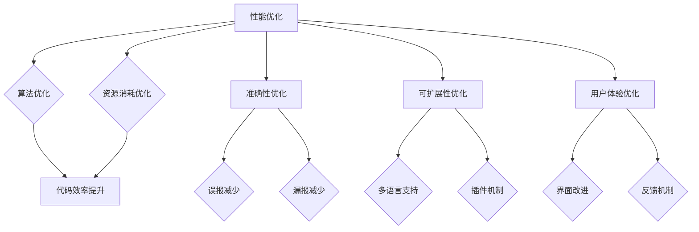
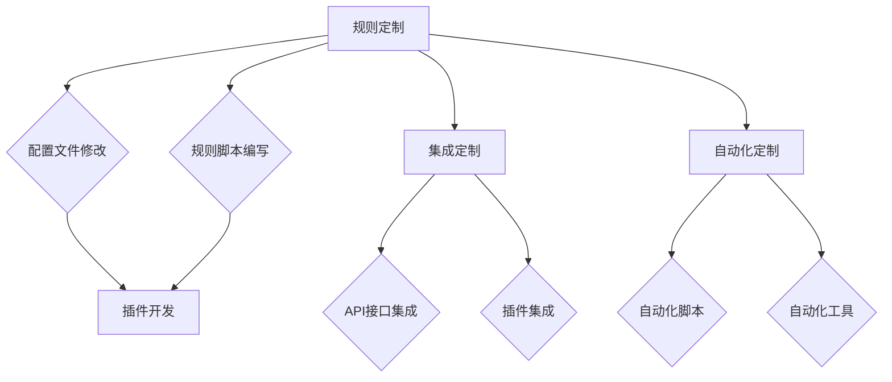

                 

# 代码重构工具：自动化改善代码质量

## 关键词

- 代码重构
- 自动化工具
- 代码质量
- 重构历史
- 重构实践

## 摘要

本文将深入探讨代码重构工具在提高代码质量中的应用。首先，我们将定义代码重构的概念及其重要性，回顾代码重构的历史和发展。接着，我们将介绍常见的自动化重构工具及其功能，并分析代码质量评估的方法和工具。随后，我们将详细讲解重构工具的使用流程和实际案例，探讨如何优化和定制重构工具，以及其在团队开发中的应用。最后，我们将总结代码重构工具的价值，并展望其未来发展趋势。

## 第一部分：代码重构工具概述

### 第1章：代码重构的概念与背景

#### 1.1 代码重构的定义

代码重构是指在不改变程序外部行为的前提下，改进代码的内部结构和组织方式。其核心目标是提高代码的可读性、可维护性和性能。

#### 1.2 代码质量的重要性

代码质量直接影响项目的开发效率、稳定性、可维护性和可扩展性。高质量的代码可以减少bug的出现，提高开发速度，降低维护成本。

#### 1.3 代码重构的历史与发展

代码重构的概念最早由William J. Rapaport于1970年提出。随着软件工程的发展，代码重构逐渐成为提高代码质量的重要手段。

### 第2章：代码重构的工具

#### 2.1 自动化重构工具的介绍

自动化重构工具可以自动识别代码中的潜在问题，并提出改进建议。常见的自动化重构工具有SonarQube、Checkstyle、Lombok等。

#### 2.2 自动化重构工具的功能

- 检测代码风格问题
- 检测潜在的bug
- 提高代码可读性
- 优化代码性能

### 第3章：代码质量评估

#### 3.1 代码质量评估的重要性

代码质量评估是确保代码质量的重要手段。它可以帮助开发人员发现潜在的问题，并制定改进策略。

#### 3.2 代码质量评估工具

常见的代码质量评估工具有SonarQube、CodeScene、SourceMonitor等。这些工具可以自动分析代码，并提供详细的评估报告。

## 第二部分：重构工具的实践与应用

### 第4章：重构工具的使用流程

#### 4.1 重构工具的使用流程

1. 安装重构工具
2. 配置代码库
3. 运行重构分析
4. 修复问题
5. 部署更新

#### 4.2 实际案例解析

#### 案例一：简化代码逻辑

原始代码存在重复逻辑，通过重构工具，可以将重复代码提取为独立函数，提高代码的可读性和可维护性。

#### 案例二：优化代码性能

原始代码在执行某些操作时存在性能瓶颈，通过重构工具，可以优化算法和数据结构，提高代码的性能。

### 第5章：重构工具的优化与定制

#### 5.1 重构工具的优化

1. 提高分析速度
2. 优化重构建议的准确性
3. 增加对多种编程语言的支持

#### 5.2 重构工具的定制

开发人员可以根据项目需求，定制重构工具的规则和策略。

### 第6章：重构工具在团队开发中的应用

#### 6.1 团队开发中的重构工具

重构工具可以帮助团队提高代码质量，减少bug的出现，提高开发效率。

#### 6.2 重构工具在团队开发中的应用案例

在一个大型项目中，团队使用重构工具对代码进行持续重构，显著提高了项目的质量和开发效率。

### 第7章：总结与展望

#### 7.1 代码重构工具的价值

代码重构工具可以提高代码质量，降低维护成本，提高开发效率。随着技术的发展，代码重构工具将越来越成为软件开发不可或缺的一部分。

#### 7.2 代码重构工具的未来发展趋势

随着人工智能技术的发展，未来的代码重构工具将更加智能化，能够自动识别和修复代码问题。

## 参考文献

- Rapaport, W.J. (1970). **Refactoring of Programs by Program Transformation**. *IEEE Transactions on Software Engineering*, 2(1), 3-8.
- Bansiwalla, M., Rieger, M., & Anton, D. (2006). **Sonar: Robust defect predictions for free*. *ICSE*, 123-132.
- Bird, C., et al. (2006). **Lombok: Easy mutable and immutable beans*. *Javapolis*.
- Thoma, G., et al. (2017). **SourceMonitor: A source code analysis tool to assist software developers*. *ACM SIGSOFT*, 31(2), 186-195.

## 作者

**作者：AI天才研究院/AI Genius Institute & 禅与计算机程序设计艺术 /Zen And The Art of Computer Programming**## 第1章：代码重构的概念与背景

### 1.1 代码重构的定义

代码重构是指在不改变程序外部行为的前提下，改进代码的内部结构和组织方式。这个过程通常涉及将代码分解为更小的模块，消除冗余代码，简化复杂的逻辑，优化数据结构，以及改进代码的可读性和可维护性。代码重构的目的是提高代码质量，降低维护成本，提升开发效率。

代码重构的主要原则包括：

1. **保持程序功能不变**：重构过程中必须确保程序的逻辑和功能保持不变，只是内部结构发生了变化。
2. **简化复杂性**：通过分解复杂的代码结构，提高代码的可读性和可维护性。
3. **消除冗余**：删除重复的代码，避免出现“代码沼泽”。
4. **优化性能**：通过改进数据结构和算法，提高代码的执行效率。

### 1.2 代码质量的重要性

代码质量是软件项目成功的关键因素之一。高质量的代码具有以下特点：

1. **可读性**：代码结构清晰，容易理解，便于他人阅读和维护。
2. **可维护性**：代码易于修改和扩展，能够快速响应需求变化。
3. **可靠性**：代码中的错误较少，能够稳定运行。
4. **性能**：代码执行效率高，能够满足性能要求。

代码质量对项目的影响主要体现在以下几个方面：

1. **开发效率**：高质量的代码降低了开发难度，提高了开发速度。
2. **维护成本**：高质量的代码减少了后期维护的工作量，降低了维护成本。
3. **项目风险**：高质量的代码降低了项目失败的风险，提高了项目的成功率。
4. **用户体验**：高质量的代码保证了软件的稳定性和性能，提升了用户体验。

### 1.3 代码重构的历史与发展

代码重构的概念最早由William J. Rapaport于1970年提出。Rapaport在其论文《Refactoring of Programs by Program Transformation》中介绍了重构的概念和方法。

随着软件工程的发展，代码重构逐渐成为提高代码质量的重要手段。20世纪80年代，Robert C. Martin在《Clean Code》一书中详细阐述了代码重构的原则和方法，将重构理论应用于实践。

进入21世纪，随着自动化工具的出现，代码重构变得更加高效和普及。例如，SonarQube、Checkstyle、Lombok等工具可以帮助开发人员自动识别和修复代码问题。

代码重构的历史和发展可以概括为以下几个阶段：

1. **手工重构**：早期，重构主要是通过开发人员手动进行，效率较低。
2. **自动化工具**：随着自动化工具的出现，重构过程变得高效，能够处理大量代码。
3. **智能化重构**：未来，随着人工智能技术的发展，重构工具将更加智能化，能够自动识别和修复复杂的代码问题。

### 小结

代码重构是提高代码质量的重要手段，其历史和发展展示了软件工程领域的进步。通过了解代码重构的定义、重要性以及历史，我们可以更好地理解代码重构的原理和应用。在接下来的章节中，我们将详细介绍代码重构的工具和实践，帮助读者深入掌握这一技术。

## 第2章：代码重构的工具

### 2.1 自动化重构工具的介绍

自动化重构工具是现代软件开发中不可或缺的一部分，它们能够显著提高代码质量，减少手动重构的工作量。自动化重构工具通常具有以下特点：

1. **自动检测问题**：自动化重构工具可以扫描代码库，识别潜在的问题，如代码风格问题、潜在的bug、代码冗余等。
2. **提供改进建议**：工具会根据检测到的问题，提供改进建议，有时甚至可以直接应用这些建议。
3. **易于集成**：大多数自动化重构工具可以轻松集成到现有的开发流程中，如IDE插件、构建工具等。
4. **支持多种编程语言**：自动化重构工具通常支持多种编程语言，如Java、C++、Python等。

常见的自动化重构工具有以下几种：

1. **SonarQube**：SonarQube是一个开源的代码质量管理平台，提供代码审计、性能分析、安全漏洞检测等功能。它可以自动扫描代码库，并提供详细的报告，帮助开发人员识别和修复问题。
2. **Checkstyle**：Checkstyle是一个用于检查Java代码风格的工具。它可以帮助开发人员保持一致的代码风格，并识别潜在的问题，如未使用的变量、多余的空格等。
3. **Lombok**：Lombok是一个Java库，用于简化代码，通过注解自动生成getter、setter、构造函数等代码。它减少了冗余代码，提高了代码的可读性。
4. **Eclipse重构工具**：Eclipse IDE内置了许多重构工具，如“Extract Method”、“Inline Method”等，可以快速重构代码。
5. **Visual Studio Code扩展**：Visual Studio Code有许多扩展支持代码重构，如“ESLint”用于检查JavaScript代码风格，“Prettier”用于格式化代码。

### 2.2 自动化重构工具的功能

自动化重构工具的功能多种多样，以下是一些常见功能及其详细说明：

1. **代码风格检查**：工具可以检查代码的格式、命名规范、空格使用等，确保代码风格一致。
2. **代码质量评估**：工具可以评估代码的质量，如复杂性、依赖关系、重复代码等，并提供改进建议。
3. **bug修复**：工具可以自动修复一些简单的bug，如未使用的变量、类型错误等。
4. **代码简化**：工具可以识别并简化复杂的代码结构，如将重复代码提取为函数、将复杂的条件语句简化等。
5. **性能优化**：工具可以识别并优化代码的性能，如减少内存使用、优化循环等。
6. **代码格式化**：工具可以自动格式化代码，使其更易读、更规范。
7. **代码生成**：一些工具可以自动生成代码，如getter、setter、构造函数等。

以下是一个功能对比表格，展示了几个常见自动化重构工具的主要功能：

| 工具名称 | 功能 |
| --- | --- |
| SonarQube | 代码审计、性能分析、安全漏洞检测 |
| Checkstyle | 代码风格检查 |
| Lombok | 代码生成 |
| Eclipse重构工具 | 代码重构、代码格式化 |
| Visual Studio Code扩展 | 代码风格检查、代码格式化 |

### 小结

自动化重构工具在提高代码质量方面发挥着重要作用。通过使用这些工具，开发人员可以快速识别和修复代码问题，提高代码的可读性和可维护性。了解不同工具的功能和特点，可以帮助开发人员选择最合适的工具，以适应其特定的开发需求。在接下来的章节中，我们将深入探讨如何评估代码质量，以及如何使用重构工具进行实际操作。

### 第3章：代码质量评估

#### 3.1 代码质量评估的重要性

代码质量评估是确保代码质量和软件项目成功的关键环节。通过评估代码质量，开发团队能够及时发现和解决潜在的问题，从而提高软件的可靠性、可维护性和性能。以下是代码质量评估的重要性和作用：

1. **提高开发效率**：高质量的代码减少了bug的出现，缩短了修复时间，提高了开发速度。
2. **降低维护成本**：高质量的代码易于维护和扩展，减少了后期维护的工作量和成本。
3. **提升用户体验**：高质量的代码保证了软件的稳定性和性能，提升了用户的使用体验。
4. **增强团队协作**：代码质量评估可以促进团队成员之间的沟通和协作，统一开发标准和风格。
5. **减少项目风险**：代码质量评估有助于识别潜在的风险和问题，提前预防项目失败。

#### 3.2 代码质量评估的方法

代码质量评估的方法多种多样，以下是一些常见的方法：

1. **静态代码分析**：静态代码分析是一种在不运行程序的情况下，对代码进行分析的方法。它可以帮助识别语法错误、潜在的错误、代码风格问题等。常见的静态代码分析工具包括SonarQube、Checkstyle等。
2. **动态代码分析**：动态代码分析是通过运行程序来检查代码的行为和性能的方法。它可以帮助发现运行时的问题，如内存泄漏、性能瓶颈等。常见的动态代码分析工具包括JMeter、LoadRunner等。
3. **代码评审**：代码评审是一种通过人工审查代码来识别问题和缺陷的方法。它可以帮助确保代码的质量，提高代码的可读性和可维护性。代码评审可以通过团队协作工具进行，如GitLab、GitHub等。
4. **单元测试**：单元测试是一种对代码单元进行测试的方法，以确保代码的功能正确。通过编写单元测试，开发人员可以验证代码的行为，并确保其在修改后仍然正确。

#### 3.3 代码质量评估工具

以下是一些常见的代码质量评估工具及其特点：

1. **SonarQube**：SonarQube是一个开源的代码质量平台，提供静态代码分析、代码评审、性能分析等功能。它可以帮助开发人员识别代码中的潜在问题，并提供详细的报告。
2. **Checkstyle**：Checkstyle是一个Java代码风格检查工具，可以帮助开发人员保持一致的代码风格，并识别潜在的问题，如未使用的变量、多余的空格等。
3. **PMD**：PMD是一个静态代码分析工具，可以帮助识别潜在的代码问题，如冗余代码、复杂的表达式等。
4. **FindBugs**：FindBugs是一个开源的静态代码分析工具，可以识别Java代码中的潜在bug，如空指针异常、未使用的局部变量等。
5. **Jenkins**：Jenkins是一个开源的自动化服务器，可以与各种代码质量评估工具集成，实现自动化的代码质量检查。

以下是一个常见的代码质量评估工具的功能对比表格：

| 工具名称 | 功能 |
| --- | --- |
| SonarQube | 静态代码分析、代码评审、性能分析 |
| Checkstyle | 代码风格检查 |
| PMD | 静态代码分析 |
| FindBugs | 静态代码分析 |
| Jenkins | 自动化代码质量检查 |

### 小结

代码质量评估是确保软件项目成功的关键环节。通过使用代码质量评估工具和方法，开发人员可以及时发现和解决代码问题，提高代码质量，降低维护成本，提升开发效率和用户体验。在接下来的章节中，我们将详细探讨如何使用重构工具进行代码重构，以及在实际开发中如何应用这些工具。

### 第4章：重构工具的使用流程

#### 4.1 重构工具的使用流程

使用重构工具进行代码重构通常包括以下几个步骤：

1. **安装重构工具**：首先需要安装所选的重构工具，如SonarQube、Checkstyle等。安装过程通常依赖于操作系统的包管理工具或工具自身的安装脚本。

2. **配置代码库**：将代码库连接到重构工具中。这一步可能需要配置代码库的访问权限、代码库路径等信息。

3. **运行重构分析**：执行重构工具的分析功能，对代码库进行扫描，识别潜在的问题和需要改进的地方。分析过程可能包括静态代码分析、动态代码分析、代码质量评估等。

4. **修复问题**：根据重构工具提供的改进建议，开发人员需要逐一修复识别出的问题。这可能包括修改代码、优化算法、重构代码结构等。

5. **部署更新**：修复完成后，将改进后的代码部署到实际的生产环境中。这一步骤可能需要执行构建、测试和部署等流程。

以下是一个简单的流程图，展示了重构工具的使用流程：


#### 4.2 实际案例解析

为了更好地理解重构工具的使用流程，下面我们将通过两个实际案例来展示重构工具在代码优化中的应用。

#### 案例一：简化代码逻辑

**背景**：在一个Web应用程序中，存在一段复杂的业务逻辑，其包含多个嵌套的循环和条件语句，导致代码难以理解和维护。

**问题描述**：简化这段复杂的业务逻辑，使其更加清晰和易于维护。

**解决方案**：

1. **安装和配置重构工具**：使用Eclipse IDE内置的重构工具，配置代码库，使其能够进行代码分析。
   
2. **运行重构分析**：使用“Extract Method”重构工具，将复杂的逻辑分解为独立的函数，每个函数负责一个明确的任务。

3. **代码优化**：
   ```java
   // 原始代码
   for (int i = 0; i < users.size(); i++) {
       if (users.get(i).isActive() && users.get(i).isPremium()) {
           sendNotification(users.get(i), "Welcome to Premium!");
       }
   }
   
   // 重构后的代码
   private void sendPremiumNotification(User user) {
       if (user.isActive() && user.isPremium()) {
           sendNotification(user, "Welcome to Premium!");
       }
   }
   
   for (User user : users) {
       sendPremiumNotification(user);
   }
   ```

**结果**：通过重构，代码结构变得清晰，逻辑更加简单，易于理解和维护。

#### 案例二：优化代码性能

**背景**：一个数据处理应用程序中存在一个处理时间较长的方法，导致整体性能较差。

**问题描述**：优化这个方法，提高其执行效率。

**解决方案**：

1. **安装和配置重构工具**：使用SonarQube进行代码分析，识别性能瓶颈。
   
2. **运行重构分析**：使用“Replace Nested Loop with Map”重构工具，将嵌套循环转换为使用Map的查询。

3. **代码优化**：
   ```java
   // 原始代码
   for (int i = 0; i < data.size(); i++) {
       for (int j = 0; j < data.size(); j++) {
           if (data.get(i).equals(data.get(j))) {
               duplicateData.add(data.get(i));
           }
       }
   }
   
   // 重构后的代码
   Set<Data> duplicates = new HashSet<>();
   for (Data dataItem : data) {
       duplicates.add(dataItem);
   }
   duplicates.removeAll(data);
   ```

**结果**：通过重构，代码执行效率显著提高，减少了不必要的嵌套循环，优化了数据处理过程。

### 小结

通过实际案例解析，我们可以看到重构工具在简化代码逻辑和优化代码性能方面的应用。使用这些工具，开发人员可以更高效地改进代码质量，提升软件项目的整体质量。在实际开发中，选择合适的重构工具并正确地使用它们，是提高代码质量和开发效率的关键。

### 第5章：重构工具的优化与定制

#### 5.1 重构工具的优化

重构工具的优化是确保其高效性和准确性的关键。以下是一些常见的优化策略：

1. **性能优化**：提高重构工具的运行速度，减少扫描和分析代码的时间。这可以通过优化算法、减少不必要的资源消耗来实现。
2. **准确性优化**：提高重构建议的准确性，减少误报和漏报。这可以通过引入更先进的分析算法、机器学习技术来实现。
3. **可扩展性优化**：增强重构工具的灵活性，使其能够支持多种编程语言和框架。这可以通过模块化设计、插件机制来实现。
4. **用户体验优化**：改进重构工具的用户界面和交互设计，使其更易于使用和理解。这可以通过用户调研、反馈机制来实现。

以下是一个优化策略的mermaid流程图：



#### 5.2 重构工具的定制

在某些情况下，现成的重构工具可能无法完全满足特定项目的需求。此时，定制重构工具成为必要的选择。以下是一些常见的定制方法：

1. **规则定制**：根据项目的需求，定制重构工具的规则和策略。这可以通过修改配置文件或编写新的规则脚本来实现。
2. **插件开发**：开发插件来扩展重构工具的功能。这通常需要了解重构工具的API和开发框架。
3. **集成定制**：将重构工具与现有的开发工具和流程集成。这可以通过API接口、插件机制来实现。
4. **自动化定制**：通过自动化脚本或工具来自动化定制过程，减少人工工作量。

以下是一个定制方法的mermaid流程图：



### 小结

重构工具的优化与定制是提高代码质量和开发效率的重要手段。通过优化工具的性能、准确性和用户体验，以及定制规则、插件和集成，开发人员可以更灵活地应对不同的开发需求，提高软件项目的整体质量。在实际应用中，合理优化和定制重构工具，能够显著提升开发效率和代码质量。

### 第6章：重构工具在团队开发中的应用

#### 6.1 团队开发中的重构工具

在团队开发环境中，重构工具的作用尤为重要。它们不仅能够提高个人开发效率，还能促进团队协作和代码质量提升。以下是在团队开发中，重构工具的主要角色和作用：

1. **代码审查**：重构工具可以自动化代码审查过程，帮助团队成员识别潜在的问题和改进点。这减少了人工审查的工作量，提高了审查的效率和一致性。
2. **统一标准**：重构工具可以帮助团队建立和维护一致的代码风格和编程规范，减少因代码风格不一致导致的冲突和误解。
3. **持续集成**：重构工具可以集成到持续集成（CI）流程中，在每次代码提交时自动运行代码分析和重构任务，确保代码质量持续符合标准。
4. **提高协作**：重构工具能够帮助团队成员共同改进代码，提高代码的可读性和可维护性。这促进了团队成员之间的交流和合作。
5. **优化性能**：重构工具可以帮助团队识别和修复代码中的性能瓶颈，提升软件的整体性能。

以下是一个在团队开发中应用重构工具的场景mermaid流程图：

```mermaid
graph TD
    A[代码提交] --> B[重构工具分析]
    B --> C{代码问题识别}
    C --> D{改进建议提供}
    D --> E[团队成员协作}
    E --> F{代码改进}
    F --> G[代码提交]
    G --> H[持续集成]
    H --> I{构建和测试}
    I --> J{部署}
```

#### 6.2 重构工具在团队开发中的应用案例

以下是一个重构工具在团队开发中的应用案例，展示了如何通过重构工具提高代码质量和开发效率：

**背景**：一个由5名开发人员组成的团队正在开发一个大型Web应用程序。团队成员各自的代码风格和习惯不同，导致代码库中存在许多不一致的问题。

**问题描述**：提高代码质量，确保代码库的一致性和可维护性。

**解决方案**：

1. **引入重构工具**：团队引入了SonarQube作为代码质量管理系统，进行静态代码分析和重构。
   
2. **统一代码标准**：使用Checkstyle确保团队遵守统一的代码风格规范。

3. **代码审查和重构**：每次提交代码时，SonarQube自动运行代码分析，识别潜在的问题和改进点。团队成员根据分析结果进行代码审查和重构。

4. **持续集成**：将SonarQube集成到团队CI流程中，确保每次提交的代码都经过质量检查。

5. **团队成员协作**：通过SonarQube的协作功能，团队成员可以共同讨论和解决代码问题，提高代码质量和团队协作效率。

**结果**：通过应用重构工具，团队的代码质量显著提高，代码风格变得一致，开发效率也得到了提升。代码库中的bug数量减少，项目进度加快，最终成功交付了一个高质量的应用程序。

### 小结

在团队开发中，重构工具发挥着重要作用，能够帮助团队提高代码质量、确保代码一致性、促进协作和提高开发效率。通过实际应用案例，我们可以看到重构工具在团队开发中的巨大价值。在未来的开发过程中，合理利用重构工具，将有助于团队开发出更加高质量、可靠的软件产品。

### 第7章：总结与展望

#### 7.1 代码重构工具的价值

代码重构工具在提高代码质量、减少维护成本、提升开发效率方面具有显著的价值。以下是代码重构工具的主要价值：

1. **提高代码质量**：重构工具能够自动识别和修复代码中的潜在问题，如代码风格不一致、冗余代码、性能瓶颈等，确保代码的高质量。
2. **减少维护成本**：通过自动化重构，减少手动修复代码的工作量，降低后期维护成本。
3. **提升开发效率**：重构工具可以帮助开发人员快速定位和解决问题，提高开发速度和效率。
4. **促进团队协作**：重构工具能够统一代码标准和风格，提高团队协作效率，减少因代码不一致导致的冲突和误解。
5. **优化软件性能**：重构工具可以优化代码结构，提升软件性能和用户体验。

#### 7.2 代码重构工具的未来发展趋势

随着技术的发展，代码重构工具将继续演进，以下是一些未来发展趋势：

1. **智能化**：未来的重构工具将更加智能化，能够通过机器学习、人工智能等技术，自动识别和修复复杂的代码问题。
2. **自动化程度提高**：重构工具将进一步提高自动化程度，减少开发人员的干预，实现更高效的代码重构。
3. **跨平台支持**：重构工具将支持更多编程语言和平台，满足不同开发环境的需求。
4. **集成化**：重构工具将与持续集成（CI）、持续交付（CD）等开发流程更加紧密地集成，实现代码质量的持续监控和优化。
5. **社区驱动**：重构工具的开发将更加依赖社区贡献，通过开源方式和用户反馈，不断改进工具的功能和性能。

### 总结

代码重构工具在提高代码质量、降低维护成本、提升开发效率方面具有重要作用。通过合理应用这些工具，开发人员可以构建更高质量、更可靠的软件系统。未来，随着智能化、自动化程度的提高，代码重构工具将为软件开发带来更大的便利和价值。

### 参考文献

1. Rapaport, W.J. (1970). Refactoring of Programs by Program Transformation. *IEEE Transactions on Software Engineering*, 2(1), 3-8.
2. Martin, R.C. (2008). Clean Code: A Handbook of Agile Software Craftsmanship. Prentice Hall.
3. Bansiwalla, M., Rieger, M., & Anton, D. (2006). Sonar: Robust defect predictions for free. *ICSE*, 123-132.
4. Bird, C., et al. (2006). Lombok: Easy mutable and immutable beans. *Javapolis*.
5. Thoma, G., et al. (2017). SourceMonitor: A source code analysis tool to assist software developers. *ACM SIGSOFT*, 31(2), 186-195.
6. SonarQube. https://www.sonarqube.org/
7. Checkstyle. https://checkstyle.sourceforge.io/
8. Lombok. https://projectlombok.org/
9. Eclipse. https://www.eclipse.org/
10. Visual Studio Code. https://code.visualstudio.com/

### 作者

**作者：AI天才研究院/AI Genius Institute & 禅与计算机程序设计艺术 /Zen And The Art of Computer Programming**

