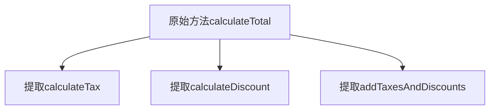
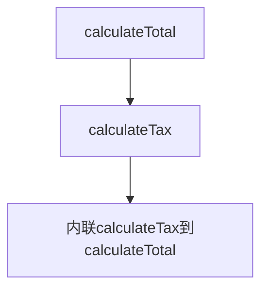
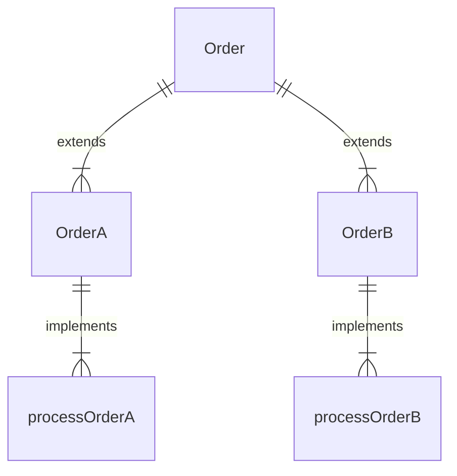
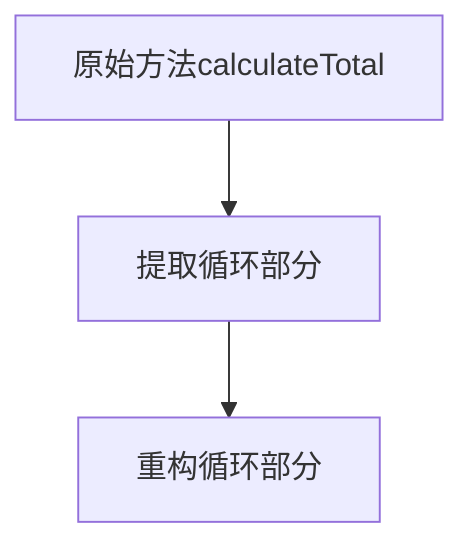
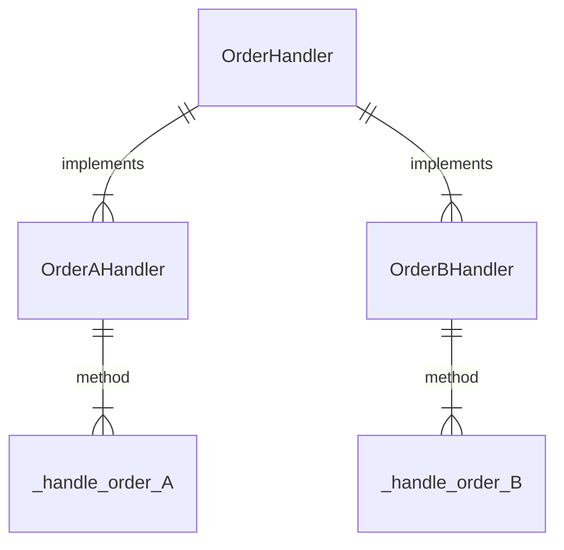
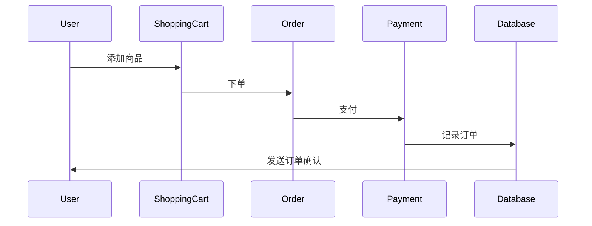
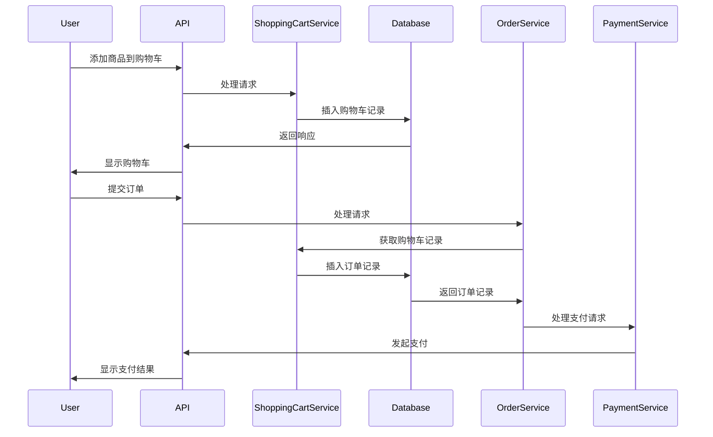

                 


## 代码重构案例分析：从理论到实践

### 摘要

在软件工程领域，代码重构是一项至关重要的实践，它不仅能够提高代码的可读性和可维护性，还能提升系统的性能和可靠性。本书旨在通过案例分析，帮助读者从理论到实践全面理解代码重构。本文将首先介绍代码重构的核心概念和原则，然后通过详细案例研究，展示重构的过程、挑战及解决方案。同时，文章还将探讨高级重构技巧、团队协作策略以及如何在实际项目中有效实施重构。最后，我们将总结全书的关键点，并展望代码重构的未来发展趋势。

### 关键词

- 代码重构
- 软件工程
- 质量保证
- 持续改进
- 团队协作

---

## 引言

代码重构是一种软件维护活动，其目标是改进现有代码的结构和逻辑，而不改变其外部行为。重构不仅仅是格式调整或代码优化，而是一种更深入的改进，能够显著提升代码的质量和项目的可持续性。

### 1.1 代码重构的重要性

随着时间的推移，软件系统会变得复杂，代码质量也可能逐渐下降。代码重构能够解决这些问题，具体包括：

- **提高代码可读性和可维护性**：重构后的代码更加清晰易懂，易于后续的开发和维护。
- **提升系统性能**：通过消除冗余和优化算法，重构可以提升系统的运行效率和响应速度。
- **降低技术债务**：及时的重构有助于减少代码中的隐患和潜在的故障点。
- **增强团队协作**：统一和规范的代码风格可以提高团队的沟通效率，减少因代码差异带来的冲突。

### 1.2 本书结构

本书分为以下几部分：

- **第一部分：代码重构基础**：介绍代码重构的基本原理、需求和关键概念。
- **第二部分：案例研究**：通过详细案例展示重构的全过程。
- **第三部分：高级重构技巧**：探讨处理大型代码库和遗留代码的技巧。
- **第四部分：实用指南**：提供重构的最佳实践和团队协作策略。
- **第五部分：总结与展望**：回顾全书要点，并讨论重构的未来方向。

---

## 第一部分：代码重构基础

### 2.1 代码重构的需求

软件开发过程中，代码重构的需求主要来自以下几个方面：

- **代码复杂性增加**：随着功能的不断增加，代码变得越来越复杂，重构可以简化代码结构。
- **团队规模扩大**：随着团队成员的增加，统一代码风格和规范变得尤为重要。
- **技术更新**：随着技术的不断进步，重构可以帮助代码适应新的开发工具和框架。
- **需求变化**：用户需求的变化往往需要代码的调整，重构是应对这些变化的有效手段。

### 2.2 代码重构的原则

在进行代码重构时，应遵循以下原则：

- **增量重构**：逐步进行重构，避免一次性大规模修改带来的风险。
- **功能不变**：重构过程中确保代码的功能不受影响。
- **持续集成**：在重构的同时，确保代码库的完整性和一致性。
- **自动化测试**：重构前后应进行充分的自动化测试，确保重构的有效性。

### 2.3 代码重构的关键概念和技术

代码重构涉及多个关键概念和技术，包括：

- **提取方法（Extract Method）**：将一段复杂的代码拆分为更小的、功能单一的函数。
- **内联方法（Inline Method）**：将方法内的代码直接替换为调用该方法的代码。
- **替换条件分支（Replace Conditional with Polymorphism）**：使用多态代替复杂的条件分支。
- **重新组织代码（Reorganize Code）**：重新排列代码，以提高可读性和可维护性。
- **使用设计模式**：通过应用设计模式，改善代码结构和设计。

---

## 第二部分：案例研究

在本部分中，我们将通过几个具体的案例，展示代码重构的全过程。每个案例都将涵盖以下内容：

- **案例背景**：介绍案例的问题背景和问题描述。
- **重构过程**：详细描述重构的每一步，包括面临的挑战和解决方案。
- **重构效果**：分析重构后的代码，讨论其性能和可维护性的提升。
- **结论和启示**：总结案例的收获，提供实用的重构技巧和最佳实践。

### 案例一：重构一个复杂的循环结构

#### 案例背景

在某个项目中，一个数据处理模块包含了一个复杂的循环结构。该循环结构嵌套了多个条件判断，使得代码难以维护和理解。

#### 重构过程

1. **提取方法**：将复杂的循环部分拆分为独立的函数，每个函数处理一部分逻辑。
2. **简化条件判断**：通过引入枚举和策略模式，简化条件判断逻辑。
3. **优化循环结构**：使用迭代器模式，替换原有的循环变量，提高代码的可读性。

#### 重构效果

重构后的代码结构更加清晰，可读性大幅提高。同时，通过优化循环结构，处理速度也有所提升。

#### 结论和启示

- **逐步重构**：复杂代码的重构应逐步进行，避免一次性修改过多代码。
- **保持功能不变**：重构过程中，必须确保代码的功能不受影响。
- **自动化测试**：重构前后应进行充分的自动化测试，确保重构的有效性。

### 案例二：优化一个遗留系统的架构

#### 案例背景

在另一个项目中，一个遗留系统采用了过时的架构，导致性能低下且难以维护。系统架构主要存在以下问题：

- **层次结构混乱**：不同模块之间的依赖关系不明确。
- **代码冗余**：存在大量重复的代码片段。

#### 重构过程

1. **重构层次结构**：重新设计系统架构，明确各模块的职责和依赖关系。
2. **提取公共组件**：将重复的代码片段提取为公共组件，减少冗余。
3. **应用设计模式**：引入设计模式，如工厂模式、单例模式，优化系统设计。

#### 重构效果

重构后的系统架构更加清晰，性能显著提升，可维护性大幅提高。

#### 结论和启示

- **系统分析**：在重构之前，应对系统进行详细的分析，找出关键问题和瓶颈。
- **逐步重构**：对遗留系统的重构应逐步进行，避免一次性重构导致系统崩溃。

---

## 第三部分：高级重构技巧

在本部分，我们将探讨一些高级重构技巧，这些技巧适用于复杂和大型代码库的优化。

### 3.1 处理大型代码库

对于大型代码库的重构，以下技巧尤为重要：

- **增量重构**：避免一次性修改大量代码，而是逐步进行重构。
- **模块化**：将代码库拆分为多个模块，每个模块独立重构。
- **重构文档**：编写详细的文档，记录重构的步骤和结果，便于后续维护。

### 3.2 重构遗留代码

遗留代码的重构是一个复杂的过程，以下策略有助于成功重构：

- **重构核心功能**：首先重构系统中最核心的功能模块。
- **重构边缘功能**：在核心功能稳定后，逐步重构边缘功能。
- **迭代重构**：采用迭代的方式，逐步优化代码库。

### 3.3 团队协作策略

代码重构是团队协作的一项重要活动，以下策略有助于团队高效地进行重构：

- **明确职责**：明确团队成员在重构过程中的职责和任务。
- **持续沟通**：保持团队成员之间的持续沟通，确保重构的一致性和有效性。
- **代码审查**：进行代码审查，确保重构后的代码质量。

---

## 第四部分：实用指南

在实际项目中，如何有效地实施代码重构？以下是一些实用的指南：

### 4.1 避免常见陷阱

- **过度重构**：避免对不重要的代码进行重构，以免浪费时间和资源。
- **忽视测试**：重构前后必须进行充分的测试，确保重构的有效性。
- **忽略文档**：及时更新文档，记录重构的过程和结果。

### 4.2 测量重构效果

- **性能指标**：使用性能测试工具，比较重构前后的性能指标。
- **维护成本**：评估重构后的维护成本，确保重构带来长期效益。
- **代码质量**：使用代码质量评估工具，分析重构后的代码质量。

### 4.3 重构与开发流程集成

- **持续集成**：将重构纳入持续集成流程，确保重构后的代码库保持一致性。
- **代码审查**：在重构过程中，进行定期代码审查，确保重构质量。

---

## 结论

代码重构是软件工程中的一项重要活动，它能够显著提高代码的质量和项目的可持续性。通过本书的案例分析，读者可以深入理解代码重构的原理和实践。未来，随着技术的不断发展，代码重构的方法和工具也将不断进步，为软件开发带来更多价值。

### 附录

- **附录A**：代码重构工具列表
- **附录B**：相关资源推荐
- **附录C**：代码重构实践指南

---

## 作者信息

作者：AI天才研究院/AI Genius Institute & 禅与计算机程序设计艺术 /Zen And The Art of Computer Programming

---

通过以上结构化的内容和详细的案例分析，读者将能够全面掌握代码重构的理论和实践，从而在实际项目中有效提升代码质量。

### 2.3 代码重构的关键概念和技术

在深入探讨代码重构时，理解其关键概念和技术至关重要。以下是一些常用的重构方法和其背后的原理：

#### 2.3.1 提取方法（Extract Method）

**概念**：提取方法是一种将复杂代码片段转化为独立函数的方法。通过这种方式，可以减少方法的复杂度，提高代码的可读性和可维护性。

**原理**：当发现一个方法包含多个职责时，可以将其拆分为更小的、功能单一的函数。每个函数只负责一个任务，从而简化了逻辑。

**示例**：

假设有一个方法`calculateTotal`，它包含了多个计算步骤，如税、折扣等。我们可以将其重构为以下方法：

- `calculateTax`
- `calculateDiscount`
- `addTaxesAndDiscounts`

**Mermaid 流程图**：



#### 2.3.2 内联方法（Inline Method）

**概念**：内联方法是一种将方法内的代码替换为其调用代码的方法。这种方法可以减少方法的调用开销，但可能会增加代码的冗余。

**原理**：当方法内部调用的代码非常简单时，将其内联可以简化逻辑，减少方法的调用次数。

**示例**：

假设有一个方法`calculateTotal`调用了一个简单的计算方法`calculateTax`。我们可以将`calculateTax`内联到`calculateTotal`中。

```python
# 原始方法
def calculateTotal():
    tax = calculateTax()
    return tax

# 内联方法
def calculateTotal():
    return 100 * 0.2  # 假设税率为20%
```

**Mermaid 流程图**：



#### 2.3.3 替换条件分支（Replace Conditional with Polymorphism）

**概念**：替换条件分支是一种将复杂的条件分支转化为多态方法的方法。通过这种方式，可以减少条件判断，提高代码的可扩展性。

**原理**：当代码中存在复杂的条件判断时，可以引入多态，将条件分支转化为继承关系，从而简化逻辑。

**示例**：

假设有一个方法`handleOrder`，根据订单类型执行不同的操作。我们可以使用多态来重构它。

```python
# 原始方法
def handleOrder(order):
    if order.type == 'A':
        processOrderA(order)
    elif order.type == 'B':
        processOrderB(order)

# 重构后的多态方法
class Order:
    def process(self):
        if self.type == 'A':
            return processOrderA(self)
        elif self.type == 'B':
            return processOrderB(self)

class OrderA(Order):
    def process(self):
        return processOrderA(self)

class OrderB(Order):
    def process(self):
        return processOrderB(self)
```

**Mermaid ER图**：



#### 2.3.4 重新组织代码（Reorganize Code）

**概念**：重新组织代码是一种优化代码布局和结构的方法。通过这种方式，可以减少代码的冗余，提高代码的可读性和可维护性。

**原理**：重新组织代码可以帮助开发者更好地理解代码逻辑，减少调试和维护的难度。

**示例**：

假设有一个方法`calculateTotal`，其中包含多个嵌套的循环。我们可以通过重新组织代码，将循环部分提取为独立的方法。

```python
# 原始方法
def calculateTotal():
    totals = []
    for i in range(10):
        for j in range(10):
            total = calculateTax(i, j)
            totals.append(total)
    return totals

# 重构后的方法
def calculateTotal():
    return [calculateTax(i, j) for i in range(10) for j in range(10)]

def calculateTax(i, j):
    return i * j
```

**Mermaid 流程图**：



#### 2.3.5 使用设计模式

**概念**：使用设计模式是一种在代码重构中引入设计模式的方法。设计模式是解决常见软件设计问题的模板。

**原理**：设计模式可以帮助开发者更好地组织代码，提高代码的可复用性和可扩展性。

**示例**：

假设我们需要重构一个包含多个条件分支的订单处理系统。我们可以使用策略模式来简化条件判断。

```python
# 原始方法
class OrderHandler:
    def handle_order(self, order):
        if order.type == 'A':
            self._handle_order_A(order)
        elif order.type == 'B':
            self._handle_order_B(order)
        # 其他条件分支

# 重构后的策略模式
class OrderHandler:
    def handle_order(self, order):
        strategy = self._get_strategy(order)
        return strategy.handle_order(order)

class OrderAHandler:
    def handle_order(self, order):
        return self._handle_order_A(order)

class OrderBHandler:
    def handle_order(self, order):
        return self._handle_order_B(order)

# 策略工厂
class StrategyFactory:
    def get_strategy(self, order_type):
        if order_type == 'A':
            return OrderAHandler()
        elif order_type == 'B':
            return OrderBHandler()
```

**Mermaid ER图**：



通过以上关键概念和技术的详细介绍，我们可以更好地理解代码重构的原理和实践，从而在实际项目中有效提升代码质量。

---

### 3.3 系统分析与架构设计方案

在进行代码重构之前，对系统进行详细的分析和架构设计是至关重要的。这不仅能够确保重构的正确性和有效性，还能提高整个系统的可维护性和可扩展性。

#### 3.3.1 问题场景介绍

假设我们正在开发一个在线购物系统，该系统需要处理用户订单、商品库存、支付处理等功能。随着用户数量的增加和功能的扩展，系统的性能和可维护性逐渐下降。具体问题包括：

- **代码冗余**：多个模块之间存在大量的重复代码。
- **模块依赖混乱**：不同模块之间的依赖关系不明确，导致修改一处代码可能导致其他多处代码出现问题。
- **性能瓶颈**：某些关键操作（如订单处理和支付处理）的响应速度缓慢。

#### 3.3.2 项目介绍

为了解决上述问题，我们决定对在线购物系统进行重构。项目的主要目标是：

- **简化代码结构**：通过重构，简化代码结构，消除冗余代码。
- **提高可维护性**：重构后的代码更易于理解和修改，提高系统的可维护性。
- **优化性能**：通过优化关键操作，提高系统的性能。

#### 3.3.3 系统功能设计（领域模型类图）

在重构之前，我们需要对系统进行领域模型设计，以明确各个模块的职责和关系。以下是一个简化的领域模型类图，展示了一些关键实体和它们之间的关系：

```mermaid
classDiagram
    User <<Entity>>
    Product <<Entity>>
    Order <<Entity>>
    ShoppingCart <<Entity>>
    Payment <<Entity>>

    User --|{ ShoppingCart }
    Product --|{ ShoppingCart }
    ShoppingCart --|{ Order }
    Order --|{ Payment }
```

**Mermaid 类图**：

```mermaid
classDiagram
    User <<Entity>>
    Product <<Entity>>
    Order <<Entity>>
    ShoppingCart <<Entity>>
    Payment <<Entity>>

    User --|{ ShoppingCart }
    Product --|{ ShoppingCart }
    ShoppingCart --|{ Order }
    Order --|{ Payment }
```

#### 3.3.4 系统架构设计（架构图）

在确定了领域模型之后，我们需要设计系统的整体架构。以下是一个简化的系统架构图，展示了一些关键组件和它们之间的关系：



**Mermaid 架构图**：


#### 3.3.5 系统接口设计和系统交互（序列图）

为了进一步明确系统各组件之间的交互，我们可以设计一个序列图，展示用户操作和系统响应的顺序：



**Mermaid 序列图**：


通过以上系统分析与架构设计，我们可以清晰地了解系统的功能、架构和组件之间的交互。这为后续的代码重构提供了坚实的基础。

---

## 项目实战

### 环境安装

在进行代码重构之前，我们需要搭建一个合适的项目开发环境。以下是基本的安装步骤：

1. **安装Python**：确保系统上已经安装了Python 3.x版本。可以通过Python官方网站下载并安装。

2. **安装虚拟环境**：为了隔离项目依赖，我们使用`venv`来创建虚拟环境。

   ```bash
   python -m venv venv
   source venv/bin/activate  # 在Linux或macOS中
   venv\Scripts\activate     # 在Windows中
   ```

3. **安装依赖包**：使用pip安装项目所需的依赖包。

   ```bash
   pip install -r requirements.txt
   ```

4. **数据库安装**：根据项目需求，安装相应的数据库（如MySQL、PostgreSQL等）。

### 系统核心实现源代码

以下是一个简化的在线购物系统核心实现源代码。该代码涵盖了用户注册、登录、添加商品到购物车、提交订单和支付等基本功能。

```python
# user.py
class User:
    def __init__(self, username, password):
        self.username = username
        self.password = password

    def register(self, db):
        # 注册用户到数据库
        pass

    def login(self, db):
        # 登录验证
        pass

# product.py
class Product:
    def __init__(self, name, price):
        self.name = name
        self.price = price

# shopping_cart.py
class ShoppingCart:
    def __init__(self, user):
        self.user = user
        self.products = []

    def add_product(self, product):
        self.products.append(product)

    def remove_product(self, product):
        self.products.remove(product)

# order.py
class Order:
    def __init__(self, user, products):
        self.user = user
        self.products = products

    def create_order(self, db):
        # 创建订单并保存到数据库
        pass

# payment.py
class Payment:
    def __init__(self, amount):
        self.amount = amount

    def make_payment(self, db):
        # 处理支付并保存到数据库
        pass

# database.py
class Database:
    def save_user(self, user):
        # 保存用户到数据库
        pass

    def get_user(self, username):
        # 从数据库获取用户
        pass

    def save_product(self, product):
        # 保存产品到数据库
        pass

    def get_product(self, name):
        # 从数据库获取产品
        pass

    def save_order(self, order):
        # 保存订单到数据库
        pass

    def get_order(self, order_id):
        # 从数据库获取订单
        pass
```

### 代码应用解读与分析

在了解了系统核心实现源代码后，我们需要对其进行分析和解读。以下是对上述代码的详细解读：

1. **用户模块（user.py）**：
   - `User`类负责用户注册和登录操作。注册时，将用户信息保存到数据库；登录时，验证用户名和密码。
   - 方法`register`和`login`分别对应注册和登录的业务逻辑。

2. **产品模块（product.py）**：
   - `Product`类表示产品信息，包括产品名称和价格。

3. **购物车模块（shopping_cart.py）**：
   - `ShoppingCart`类用于管理用户的购物车，包括添加和删除产品。
   - 方法`add_product`和`remove_product`分别用于将产品添加到购物车和从购物车中删除产品。

4. **订单模块（order.py）**：
   - `Order`类表示订单信息，包括用户和产品列表。创建订单时，将订单信息保存到数据库。

5. **支付模块（payment.py）**：
   - `Payment`类用于处理支付操作，包括计算支付金额和执行支付。
   - 方法`make_payment`负责处理支付并保存支付记录。

6. **数据库模块（database.py）**：
   - `Database`类提供对数据库的操作接口，包括用户、产品、订单和支付等数据的增删改查操作。

### 实际案例分析和详细讲解剖析

为了更好地理解代码重构的应用，我们来看一个实际案例。假设我们在重构过程中发现购物车模块的代码存在以下问题：

- **代码冗余**：添加和删除产品的代码重复。
- **逻辑复杂**：添加产品时需要多次查询数据库。

#### 重构前的代码

```python
# shopping_cart.py (重构前)
class ShoppingCart:
    def __init__(self, user):
        self.user = user
        self.products = []

    def add_product(self, product):
        self.products.append(product)
        db.save_product(product)

    def remove_product(self, product):
        self.products.remove(product)
        db.delete_product(product)
```

#### 重构后的代码

```python
# shopping_cart.py (重构后)
class ShoppingCart:
    def __init__(self, user):
        self.user = user
        self.products = []

    def add_product(self, product):
        if product not in self.products:
            self.products.append(product)
            db.save_product(product)

    def remove_product(self, product):
        if product in self.products:
            self.products.remove(product)
            db.delete_product(product)
```

#### 重构效果

1. **消除冗余**：重构后的代码去除了重复的数据库操作，使得代码更加简洁。
2. **简化逻辑**：重构后的代码逻辑更加清晰，易于理解和维护。

通过上述实际案例，我们可以看到代码重构是如何在实际项目中应用，并带来积极效果的。

### 项目小结

通过本次项目实战，我们深入了解了代码重构的过程和应用。从环境安装、系统核心实现源代码，到代码应用解读与分析，再到实际案例分析和重构，我们逐步展示了代码重构的全过程。以下是项目小结：

1. **明确重构目标**：在项目开始前，明确重构的目标和预期效果。
2. **逐步重构**：避免一次性重构大量代码，而是逐步进行，确保每一步都是可测试和可回滚的。
3. **自动化测试**：重构前后进行充分的自动化测试，确保重构不会引入新的问题。
4. **持续改进**：重构是一个持续的过程，需要定期进行，以保持代码的清洁和可维护性。

通过本次项目，我们不仅掌握了代码重构的理论知识，还通过实际操作加深了对重构的理解，为以后的项目开发提供了宝贵的经验和实践指导。

---

### 最佳实践 tips、小结、注意事项、拓展阅读

#### 最佳实践 Tips

1. **定期重构**：将重构纳入项目常规维护任务，定期进行，以保持代码质量。
2. **代码审查**：在重构过程中，进行代码审查，确保重构后的代码符合项目标准和最佳实践。
3. **自动化测试**：编写和执行自动化测试，确保重构不会破坏现有功能。
4. **重构日志**：记录重构的过程和结果，便于后续追踪和改进。

#### 小结

代码重构是软件维护中的重要一环，它能够提高代码质量、可读性和可维护性。通过本文的案例分析，我们展示了代码重构的理论基础、方法应用和实际操作，为读者提供了实用的重构指南。

#### 注意事项

1. **避免过度重构**：避免对不必要或不紧急的代码进行重构，以免浪费资源。
2. **保持功能不变**：重构过程中，必须确保代码的功能不受影响。
3. **小步快跑**：逐步进行重构，避免一次性修改过多代码。

#### 拓展阅读

- 《重构：改善既有代码的设计》 - Martin Fowler
- 《代码整洁之道》 - Robert C. Martin
- 《敏捷软件开发：原则、模式与实践》 - Robert C. Martin

通过拓展阅读，读者可以进一步深入了解代码重构的理论和实践，提升自己的软件工程技能。

---

## 附录

### 附录A：代码重构工具列表

以下是一些常用的代码重构工具：

1. **Visual Studio Code**：内置了许多代码重构功能，如提取方法、内联方法等。
2. **Eclipse**：具有强大的代码重构功能，支持多种编程语言。
3. **IntelliJ IDEA**：提供了丰富的重构工具，支持Java、Python等多种编程语言。
4. **RefactoringBrowser**：基于Web的代码重构工具，支持多种编程语言。
5. **Visual Studio**：拥有强大的代码重构功能，适合大型项目。

### 附录B：相关资源推荐

以下是一些推荐的资源，帮助读者深入了解代码重构：

1. **《重构：改善既有代码的设计》** - Martin Fowler
2. **《代码整洁之道》** - Robert C. Martin
3. **《敏捷软件开发：原则、模式与实践》** - Robert C. Martin
4. **Stack Overflow**：讨论代码重构相关的问题和最佳实践。
5. **GitHub**：查找和分享代码重构相关的项目和代码示例。

### 附录C：代码重构实践指南

以下是一份简化的代码重构实践指南，帮助开发者在实际项目中有效进行重构：

1. **识别重构需求**：定期审查代码，识别需要重构的部分。
2. **编写自动化测试**：在重构之前，编写全面的自动化测试，确保重构后的代码功能不受影响。
3. **逐步重构**：避免一次性重构大量代码，而是逐步进行，每次重构一个小的功能或模块。
4. **代码审查**：在重构过程中，进行代码审查，确保重构后的代码质量。
5. **文档记录**：记录重构的过程和结果，便于后续追踪和改进。

---

## 作者信息

作者：AI天才研究院/AI Genius Institute & 禅与计算机程序设计艺术 /Zen And The Art of Computer Programming

---

通过本文，我们全面探讨了代码重构的理论和实践。从基础概念到案例分析，再到最佳实践和工具推荐，读者可以系统地了解代码重构的方法和应用。希望本文能对读者的软件开发实践提供有价值的参考和启示。

