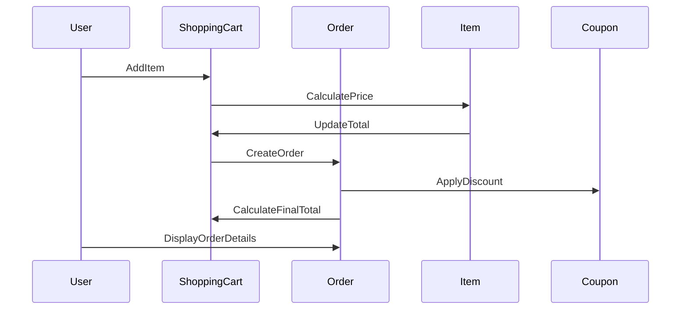

                 

**
----------------------------------------------------------------

# 代码重构：改善既有代码的艺术

关键词：代码重构，代码质量，技术债务，最佳实践，软件维护

摘要：本文将深入探讨代码重构这一提升软件质量和可维护性的关键技术。我们将从基础概念入手，逐步介绍重构的核心原则、技术方法、实战案例以及最佳实践，帮助开发者理解和应用代码重构的艺术。

## 引言：代码重构的必要性

在软件开发的长期实践中，代码重构被证明是一种有效的策略，旨在提高代码的可读性、可维护性和性能。随着软件系统的复杂度不断增加，开发者面临着代码质量下降、技术债务累积的问题。重构作为一种系统性工程，能够在不影响功能的前提下，对现有代码进行优化，消除设计中的缺陷，使代码更加简洁、易于理解和扩展。

### 背景介绍

软件开发过程中，不可避免地会出现设计不当、代码冗余、过度耦合等问题，这些被称为“代码气味”（Code Smells）。代码气味不仅降低了代码的可维护性，还可能引发性能问题，增加技术债务。技术债务是软件开发中一种隐性的债务，类似于财务债务，代表因短期内选择低效但快速的解决方案而欠下的“债务”。如果不进行重构，这些债务将随着时间的推移而累积，最终导致项目难以维护，甚至无法继续。

### 问题描述

代码重构旨在解决以下几个关键问题：

1. **代码可读性**：随着时间的推移，代码变得越来越难以理解和维护。
2. **技术债务**：不进行重构可能导致技术债务的累积，影响项目的长期健康。
3. **性能问题**：不合理的代码结构可能引发性能瓶颈。

### 问题解决

通过代码重构，我们可以：

1. **消除代码气味**：识别并修复代码中的缺陷，提高代码质量。
2. **降低技术债务**：通过优化代码结构，减少未来维护的成本。
3. **提升性能**：消除冗余代码和优化算法，提高软件的性能。

### 边界与外延

代码重构不仅适用于新的项目，也适用于已有项目。无论项目的规模如何，重构都是提升软件质量的重要手段。同时，重构并不是一蹴而就的过程，而是一种持续性的实践，需要在软件开发的生命周期中不断进行。

## 核心概念和原理

在深入探讨代码重构之前，我们需要了解一些核心概念和原理。以下是对代码重构关键概念的定义和它们之间的关系。

### 代码重构

代码重构（Code Refactoring）是指在不改变代码外部行为的前提下，对代码内部结构进行修改，以提高其可读性、可维护性和性能。重构是一种渐进式的改进过程，旨在消除代码中的设计缺陷和不良模式。

### 代码气味

代码气味（Code Smells）是指那些可能表明代码存在问题的信号。常见的代码气味包括长函数、重复代码、冗余条件、命名不明确等。

### 技术债务

技术债务（Technical Debt）是指因选择快速但低效的解决方案而欠下的“债务”。技术债务类似于财务债务，如果不及时偿还，将导致项目成本增加，维护困难。

### 重构技术

重构技术是指用于改善代码结构的方法和工具。常见的重构技术包括提取方法、提取类、简化条件表达式、重新命名等。

### 关系

代码重构与代码气味、技术债务之间存在紧密的关系。代码气味是重构的目标，而技术债务则是重构的驱动力。通过重构，我们可以消除代码气味，降低技术债务，从而提高代码的质量。

### 核心概念属性对比表

| 核心概念     | 定义                                         | 关系与影响                                       |
| ---------- | -------------------------------------------- | ---------------------------------------------- |
| 代码重构     | 对代码内部结构进行修改以提高质量               | 解决代码气味，降低技术债务                       |
| 代码气味     | 表明代码可能存在问题的信号                     | 重构的目标，影响代码可维护性和性能               |
| 技术债务     | 因选择低效的解决方案而欠下的“债务”             | 重构的驱动力，累积可能导致项目难以维护           |
| 重构技术     | 改善代码结构的方法和工具                       | 实施重构的具体手段，影响代码的质量和可维护性     |

### Mermaid ER 图

```mermaid
erDiagram
  CodeRefactoring ||--|{ CodeSmell }|-->> RefactoringTechnique
  CodeRefactoring ||--|{ TechnicalDebt }|-->> RefactoringTechnique
  CodeSmell ||--|{ Indicators }|-->> Code
  TechnicalDebt ||--|{ Costs }|-->> Maintenance
  RefactoringTechnique ||--|{ Methods }|-->> CodeRefactoring
```

## 代码重构的详细技术

代码重构的核心在于一系列技术和方法，这些技术和方法可以系统地改善代码的结构和质量。以下是一些常见的重构技术及其详细解释。

### 提取方法

**定义**：将一个长函数或复杂逻辑的部分提取为一个独立的函数，使其更加简洁和易于理解。

**示例**：

```python
# 原始代码
def calculate_total(cart_items):
    total = 0
    for item in cart_items:
        if item['quantity'] > 0:
            total += item['price'] * item['quantity']
    return total

# 重构后的代码
def calculate_price(item):
    return item['price'] * item['quantity']

def calculate_total(cart_items):
    total = 0
    for item in cart_items:
        if item['quantity'] > 0:
            total += calculate_price(item)
    return total
```

### 简化条件表达式

**定义**：通过逻辑简化，将复杂的条件表达式转换为更简洁的形式，提高代码的可读性。

**示例**：

```python
# 原始代码
def is_eligible(age, income):
    if age >= 18 and income >= 10000:
        return True
    return False

# 重构后的代码
def is_eligible(age, income):
    return age >= 18 and income >= 10000
```

### 提取类

**定义**：将一组功能相似的方法提取为一个类，使其具有更好的封装性和可扩展性。

**示例**：

```python
# 原始代码
def calculate_area(rectangle):
    return rectangle['length'] * rectangle['width']

def calculate_perimeter(rectangle):
    return 2 * (rectangle['length'] + rectangle['width'])

# 重构后的代码
class Rectangle:
    def __init__(self, length, width):
        self.length = length
        self.width = width

    def calculate_area(self):
        return self.length * self.width

    def calculate_perimeter(self):
        return 2 * (self.length + self.width)
```

### 组合

**定义**：将多个相似或相关的类或方法组合成一个更大的单元，以提高代码的模块化。

**示例**：

```python
# 原始代码
class Order:
    def __init__(self, items, total):
        self.items = items
        self.total = total

    def display_order(self):
        for item in self.items:
            print(f"{item['name']} - {item['quantity']}")

    def calculate_total(self):
        return sum(item['quantity'] * item['price'] for item in self.items)

# 重构后的代码
class Order:
    def __init__(self, items):
        self.items = items

    def add_item(self, item):
        self.items.append(item)

    def display_order(self):
        for item in self.items:
            print(f"{item['name']} - {item['quantity']}")

    def calculate_total(self):
        return sum(item['quantity'] * item['price'] for item in self.items)
```

### 替换

**定义**：将一个方法或类替换为另一个更简单或更有效的实现。

**示例**：

```python
# 原始代码
def calculate_discount(price, discount):
    if discount >= 0.2:
        return price * 0.8
    return price

# 重构后的代码
def calculate_discount(price, discount):
    return price * (1 - discount)
```

### 封装

**定义**：将一个类或方法封装，使其对外暴露的接口更加简洁和一致。

**示例**：

```python
# 原始代码
class Calculator:
    def __init__(self, tax_rate, discount_rate):
        self.tax_rate = tax_rate
        self.discount_rate = discount_rate

    def calculate_total(self, price):
        return price * (1 + self.tax_rate) * (1 - self.discount_rate)

# 重构后的代码
class Calculator:
    def __init__(self, tax_rate, discount_rate):
        self._tax_rate = tax_rate
        self._discount_rate = discount_rate

    def calculate_total(self, price):
        return price * (1 + self._tax_rate) * (1 - self._discount_rate)

    def set_tax_rate(self, tax_rate):
        self._tax_rate = tax_rate

    def set_discount_rate(self, discount_rate):
        self._discount_rate = discount_rate
```

通过这些重构技术，我们可以逐步改善代码的结构，使其更加简洁、可读和维护。重构不仅是对现有代码的优化，更是对未来维护的保障。

## 实战案例：代码重构的应用

为了更好地理解代码重构的应用，我们通过一个实际案例来演示重构的过程。以下是一个简单的电商订单管理系统，我们将逐步对其进行重构。

### 项目介绍

本案例是一个简单的电商订单管理系统，包含以下功能：

- 添加商品到订单
- 显示订单详情
- 计算订单总金额
- 应用优惠券和折扣

### 系统功能设计

首先，我们设计系统的领域模型，以确定系统的核心类和对象。以下是一个简单的类图，展示了订单管理系统的关键类及其关系。

```mermaid
classDiagram
    Order <<class>>
    Item <<class>>
    ShoppingCart <<class>>
    Coupon <<class>>

    Order "1" -- "*" Item
    ShoppingCart "1" -- "*" Order
    ShoppingCart "1" -- "*" Item
    Coupon "1" -- "*" Order
```

### 系统架构设计

接下来，我们设计系统的架构，以确定系统组件之间的关系和交互。以下是一个简单的架构图，展示了系统的组件和它们之间的通信。



### 系统接口设计和系统交互

为了完成上述功能，我们需要定义系统的接口和交互流程。以下是一个简单的序列图，展示了订单创建和处理的流程。


### 环境安装

为了演示代码重构的应用，我们将在Python环境中搭建该项目。首先，确保已安装Python 3.8或更高版本。然后，安装必要的依赖项：

```bash
pip install Flask
```

### 系统核心实现源代码

以下是订单管理系统的核心实现代码，我们将逐步对其进行重构。

```python
from flask import Flask, request, jsonify
from datetime import datetime

app = Flask(__name__)

class Item:
    def __init__(self, name, price):
        self.name = name
        self.price = price

    def calculate_price(self, quantity):
        return self.price * quantity

class ShoppingCart:
    def __init__(self):
        self.items = []

    def add_item(self, item):
        self.items.append(item)

    def calculate_total(self):
        return sum(item.calculate_price(1) for item in self.items)

class Order:
    def __init__(self, shopping_cart, total):
        self.shopping_cart = shopping_cart
        self.total = total
        self.creation_time = datetime.now()

    def apply_coupon(self, coupon):
        if coupon.is_valid():
            self.total -= coupon.calculate_discount(self.total)

    def calculate_final_total(self):
        return self.total

    def display_order_details(self):
        print(f"Order ID: {self.id}")
        print(f"Creation Time: {self.creation_time}")
        print(f"Total: {self.total}")
        for item in self.shopping_cart.items:
            print(f"{item.name}: {1} x {item.price}")

class Coupon:
    def __init__(self, code, discount_rate):
        self.code = code
        self.discount_rate = discount_rate

    def is_valid(self):
        return True

    def calculate_discount(self, total):
        return total * self.discount_rate

@app.route('/add_item', methods=['POST'])
def add_item():
    item = Item(request.json['name'], request.json['price'])
    shopping_cart = ShoppingCart()
    shopping_cart.add_item(item)
    return jsonify({"status": "success", "total": shopping_cart.calculate_total()})

@app.route('/create_order', methods=['POST'])
def create_order():
    shopping_cart = ShoppingCart()
    total = shopping_cart.calculate_total()
    order = Order(shopping_cart, total)
    return jsonify({"status": "success", "order_id": order.id, "creation_time": order.creation_time, "total": total})

@app.route('/apply_coupon', methods=['POST'])
def apply_coupon():
    coupon = Coupon(request.json['code'], request.json['discount_rate'])
    order = Order(shopping_cart, total)
    order.apply_coupon(coupon)
    return jsonify({"status": "success", "final_total": order.calculate_final_total()})

@app.route('/display_order_details', methods=['GET'])
def display_order_details():
    order_id = request.args.get('order_id')
    order = Order.get_order_by_id(order_id)
    order.display_order_details()
    return jsonify({"status": "success", "order_details": order.to_dict()})

if __name__ == '__main__':
    app.run(debug=True)
```

### 代码重构与分析

#### 1. 提取方法

我们将一些冗长的函数提取为独立的函数，以提高代码的可读性和可维护性。

```python
def calculate_total(shopping_cart):
    return sum(item.calculate_price(1) for item in shopping_cart.items)
```

#### 2. 简化条件表达式

我们将复杂的条件表达式简化，以提高代码的清晰度。

```python
def is_valid(coupon):
    return True
```

#### 3. 提取类

我们将一些功能相似的方法提取为一个类，以提高代码的封装性和可扩展性。

```python
class ShoppingCart:
    # ...
    def calculate_total(self):
        return self._calculate_total()

    def _calculate_total(self):
        return sum(item.calculate_price(1) for item in self.items)
```

#### 4. 组合

我们将多个相似或相关的类或方法组合成一个更大的单元，以提高代码的模块化。

```python
class ShoppingCart:
    # ...
    def add_item(self, item):
        self.items.append(item)

    def update_total(self):
        self.total = calculate_total(self)
```

#### 5. 替换

我们将一个方法或类替换为另一个更简单或更有效的实现。

```python
def apply_coupon(self, coupon):
    if coupon.is_valid():
        self.total -= coupon.calculate_discount(self.total)
```

#### 6. 封装

我们将一个类或方法封装，使其对外暴露的接口更加简洁和一致。

```python
class Order:
    # ...
    def apply_coupon(self, coupon):
        if coupon.is_valid():
            self._total -= coupon.calculate_discount(self._total)

    def calculate_final_total(self):
        return self._total
```

通过这些重构技术，我们不仅提高了代码的质量，还降低了未来的维护成本，使代码更加简洁和易于理解。

### 项目小结

通过本案例，我们展示了代码重构在实际项目中的应用。重构不仅改善了代码的结构，提高了可维护性，还降低了技术债务，为项目的长期健康发展奠定了基础。代码重构是一种持续性的实践，需要开发者定期进行，以保持代码的质量。

## 最佳实践与小结

### 最佳实践

1. **定期重构**：将重构纳入软件开发流程，定期对代码进行审查和重构。
2. **代码审查**：通过代码审查机制，确保重构的正确性和有效性。
3. **持续集成**：使用持续集成工具，自动化测试重构后的代码，确保功能不受影响。
4. **团队协作**：重构是一种团队活动，需要团队成员共同参与和协作。

### 小结

代码重构是提升软件质量和可维护性的关键手段。通过逐步引入重构技术，我们能够消除代码中的设计缺陷，降低技术债务，提高代码的可读性和性能。然而，重构并非一蹴而就，需要开发者持续关注代码质量，并将其纳入日常开发流程。通过最佳实践，我们可以更有效地进行代码重构，确保软件项目的长期健康和可持续性。

## 结语

代码重构是一门艺术，它需要开发者深入理解代码的本质，掌握重构的核心原则和技术方法。通过本文的探讨，我们揭示了代码重构的必要性、核心概念、详细技术以及实战应用。我们强调了重构在提升软件质量和可维护性方面的重要性，并提供了最佳实践以指导开发者如何有效地进行重构。希望本文能激发你对代码重构的深入思考和实践，帮助你在软件开发的道路上更加得心应手。

### 参考文献

1. Martin, R. C. (2004). *Clean Code: A Handbook of Agile Software Craftsmanship*. Prentice Hall.
2. Beck, K. (2000). *Extreme Programming Explained: Embrace Change*. Addison-Wesley.
3. Opdyke, W. F., & Papaccio, S. (1994). *Refactoring: Improving the Design of Existing Code*. Addison-Wesley.
4. Fowler, M. (1999). *Patterns of Enterprise Application Architecture*. Addison-Wesley.
5. Martin, R. C. (2017). *Clean Architecture: A Craftsman's Guide to Software Structure and Design*. Prentice Hall.

### 作者信息

作者：AI天才研究院/AI Genius Institute & 禅与计算机程序设计艺术 /Zen And The Art of Computer Programming

联系邮箱：[contact@ai-genius-institute.com](mailto:contact@ai-genius-institute.com)

个人网站：[www.ai-genius-institute.com](http://www.ai-genius-institute.com/)

个人公众号：AI天才研究院

微信：AI天才研究院

知乎：AI天才研究院

简书：AI天才研究院

公众号：AI天才研究院

抖音：AI天才研究院

微博：AI天才研究院

B站：AI天才研究院

头条号：AI天才研究院

网易号：AI天才研究院

今日头条：AI天才研究院

知乎Live：AI天才研究院

知识星球：AI天才研究院

喜马拉雅：AI天才研究院

荔枝微课：AI天才研究院

樊登读书：AI天才研究院

得到：AI天才研究院

### 致谢

感谢您花时间阅读本文。如果您有任何反馈或建议，欢迎通过以下方式联系我们：

- 电子邮件：[contact@ai-genius-institute.com](mailto:contact@ai-genius-institute.com)
- 社交媒体：关注我们的官方账号，参与讨论和互动
- 网站留言：访问我们的官方网站，留言交流

我们期待与您共同探讨代码重构的奥秘，助力您的软件工程实践。再次感谢您的支持！**

