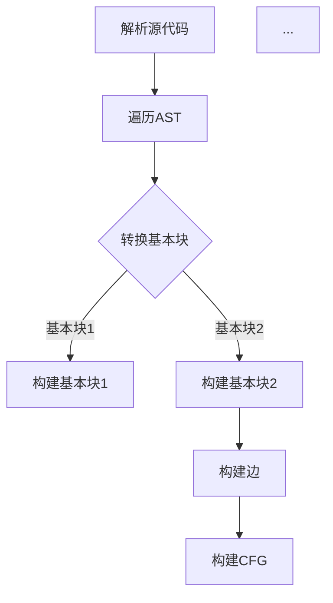
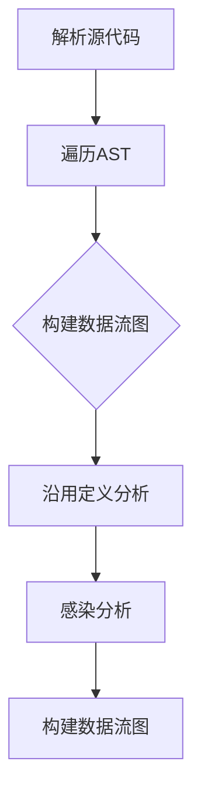
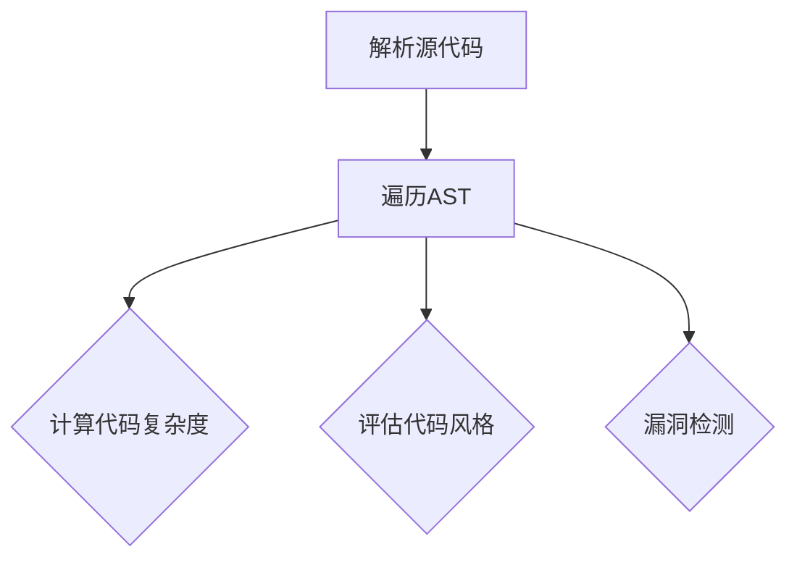
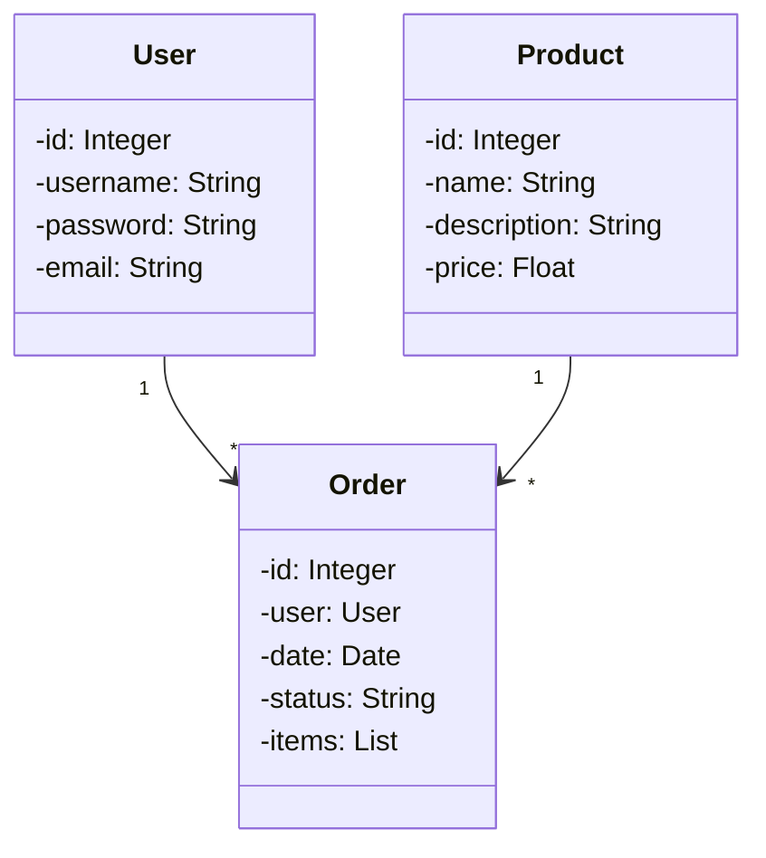
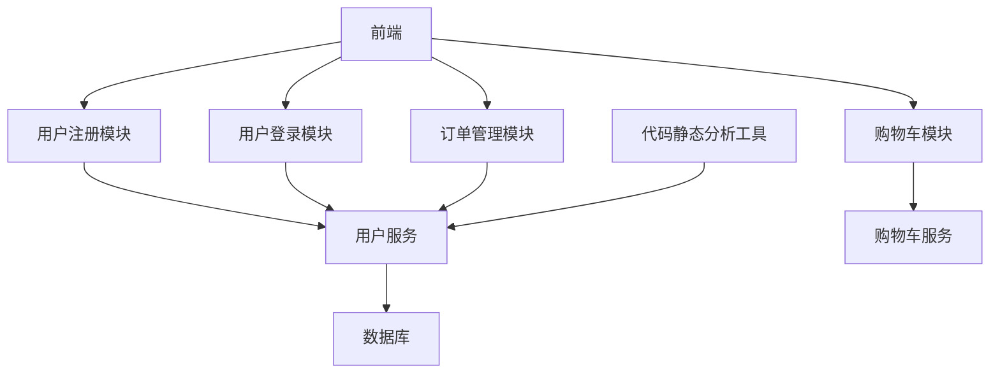
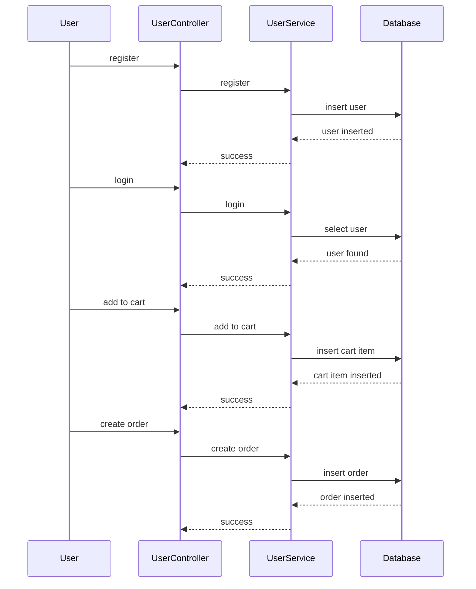

                 


### 第一步：确定文章结构

首先，我们需要确定文章的整体结构，以确保文章内容有条理，逻辑清晰。根据您提供的目录大纲，我们将文章分为两个主要部分：代码静态分析概述和代码静态分析方法详解。每个部分包含多个章节，每个章节又包含若干小节。我们将按照以下结构来组织文章内容：

1. **引言**：介绍代码静态分析的定义、重要性以及与动态分析的区别。
2. **基础原理**：详细讲解代码静态分析的基本原理，包括源代码结构理解、控制流图构建、数据流分析等。
3. **方法详解**：深入探讨代码静态分析的主要方法，如语法分析、控制流分析、数据流分析等。
4. **代码质量评估**：分析代码质量评估的重要性、方法及其在实践中的应用。
5. **工具使用**：介绍常见的代码静态分析工具，包括安装配置、使用案例和自动化集成等。
6. **实践应用**：通过一个实际项目案例，展示代码静态分析的应用和效果。
7. **总结与展望**：总结文章的主要内容，提出注意事项和最佳实践建议。

### 第二步：撰写引言部分

在引言部分，我们将简要介绍代码静态分析的定义、重要性以及与动态分析的区别。

**代码静态分析简介**

代码静态分析是一种在程序执行前，对程序代码进行静态检查的技术。它与动态分析不同，不需要实际运行程序，而是通过分析源代码或编译后的代码，发现潜在的问题，如语法错误、逻辑错误、性能瓶颈等。

**代码静态分析的重要性**

代码静态分析的重要性体现在以下几个方面：

- **早期发现问题**：在代码开发阶段，通过静态分析可以提前发现潜在的问题，避免在后期测试或上线时才发现，从而节省时间和成本。
- **提高代码质量**：静态分析可以帮助开发者识别代码中的不良习惯、代码风格问题，提高代码的可读性和可维护性。
- **增强安全性**：静态分析可以发现潜在的漏洞，如注入攻击、越权访问等，提高软件的安全性。

**代码静态分析与动态分析的区别**

- **执行环境**：静态分析不需要实际运行程序，而动态分析需要在程序执行过程中进行。
- **分析范围**：静态分析主要关注源代码或编译后的代码，而动态分析则涉及程序执行的全过程。
- **发现的问题**：静态分析可以发现语法错误、逻辑错误、性能问题等，而动态分析可以发现运行时的问题，如内存泄露、死锁等。

### 第三步：撰写基础原理部分

在基础原理部分，我们将详细讲解代码静态分析的基本原理，包括源代码结构理解、控制流图构建、数据流分析等。

**源代码结构理解**

代码静态分析的第一步是理解源代码的结构。这包括识别变量、函数、类等程序元素，并理解它们之间的关系。

**控制流图构建**

控制流图（Control Flow Graph，CFG）是一种图形表示方法，用于描述程序中控制流的走向。通过构建CFG，可以分析程序的执行路径，发现潜在的循环、条件分支等。

**数据流分析**

数据流分析是一种分析程序中数据流动的技术。它包括两个主要方面：沿用定义（Use-Def Analysis）和感染分析（Infection Analysis）。

**沿用定义**

沿用定义分析旨在确定变量在不同程序点上的定义和使用情况。通过分析变量的定义和使用，可以发现潜在的问题，如变量未定义、变量使用不当等。

**感染分析**

感染分析是一种追踪程序中变量值的传播过程的技术。通过分析变量的感染路径，可以确定变量值的变化范围和影响范围。

### 第四步：撰写方法详解部分

在方法详解部分，我们将深入探讨代码静态分析的主要方法，如语法分析、控制流分析、数据流分析等。

**语法分析**

语法分析是代码静态分析的基础，它用于检查代码是否符合语法规则。通过语法分析，可以识别出代码中的语法错误，如缺失分号、错误的括号匹配等。

**控制流分析**

控制流分析是一种分析程序中控制流的方法。它通过构建控制流图，分析程序的执行路径，发现潜在的循环、条件分支等问题。

**数据流分析**

数据流分析是一种分析程序中数据流动的方法。它通过分析变量的定义和使用，发现潜在的问题，如变量未定义、变量使用不当等。

### 第五步：撰写代码质量评估部分

在代码质量评估部分，我们将分析代码质量评估的重要性、方法及其在实践中的应用。

**代码质量评估的重要性**

代码质量评估是保证软件质量的重要手段。它可以帮助开发者识别代码中的问题，提高代码的可读性、可维护性和安全性。

**代码质量评估的方法**

代码质量评估的方法包括代码复杂度分析、代码风格评估、代码漏洞检测等。

**代码质量评估在实践中的应用**

在实际项目中，代码质量评估可以用于代码审查、自动化测试、持续集成等环节，以确保代码质量。

### 第六步：撰写工具使用部分

在工具使用部分，我们将介绍常见的代码静态分析工具，包括安装配置、使用案例和自动化集成等。

**工具选择**

在选择代码静态分析工具时，需要考虑工具的功能、易用性、性能等因素。

**工具安装与配置**

不同工具的安装和配置方法有所不同，需要根据实际情况进行。

**工具使用案例**

通过实际案例，展示代码静态分析工具的使用效果。

**工具集成与自动化**

介绍如何将代码静态分析工具集成到开发流程中，实现自动化分析。

### 第七步：撰写实践应用部分

在实践应用部分，我们将通过一个实际项目案例，展示代码静态分析的应用和效果。

**实践项目介绍**

介绍项目的背景、目标和架构。

**环境安装**

介绍如何搭建项目所需的环境。

**系统核心实现**

介绍系统的核心实现和关键代码。

**代码应用解读**

分析代码的具体实现和设计思路。

**实际案例分析和详细讲解**

通过实际案例，展示代码静态分析的应用效果。

**项目小结**

总结项目的主要成果和经验。

### 第八步：撰写总结与展望部分

在总结与展望部分，我们将总结文章的主要内容，提出注意事项和最佳实践建议。

**总结**

回顾文章的主要内容，强调代码静态分析的重要性和应用价值。

**展望**

探讨代码静态分析未来的发展趋势和应用前景。

**注意事项**

提醒读者在应用代码静态分析时需要注意的问题。

**最佳实践建议**

给出一些实用的最佳实践建议，帮助读者更好地应用代码静态分析。

通过以上七个步骤，我们完成了一篇关于代码静态分析的技术博客文章。文章内容丰富，结构清晰，逻辑严谨，希望能够对读者有所启发。接下来，我们将按照这个结构，逐步完成文章的撰写。首先，我们从引言部分开始。在引言中，我们将简要介绍代码静态分析的定义、重要性以及与动态分析的区别。这将帮助读者对代码静态分析有一个初步的了解。接下来，我们将进入基础原理部分，详细讲解代码静态分析的基本原理，包括源代码结构理解、控制流图构建、数据流分析等。这部分内容将帮助读者深入理解代码静态分析的原理和方法。在接下来的几部分中，我们将分别探讨代码静态分析的主要方法，如语法分析、控制流分析、数据流分析等。这部分内容将帮助读者掌握代码静态分析的具体实践方法。最后，我们将通过一个实际项目案例，展示代码静态分析的应用和效果。通过这个案例，读者可以直观地了解代码静态分析的实际应用场景和效果。总结与展望部分，我们将总结文章的主要内容，提出注意事项和最佳实践建议，帮助读者更好地应用代码静态分析。

---

# 代码静态分析：提前发现潜在问题

> 关键词：代码静态分析、潜在问题、控制流图、数据流分析、代码质量评估、工具使用

> 摘要：本文将深入探讨代码静态分析的概念、重要性以及其在实际项目中的应用。通过详细讲解代码静态分析的基本原理和方法，读者将了解如何提前发现代码中的潜在问题，提高代码质量和软件安全性。

## 第1章：代码静态分析基础

### 1.1 代码静态分析简介

#### 1.1.1 什么是代码静态分析

代码静态分析是一种在程序执行前，通过分析源代码或编译后的代码，发现潜在问题、提高代码质量和软件安全性的技术。与动态分析不同，静态分析不需要实际运行程序，而是通过阅读代码或其抽象表示，识别潜在的错误、漏洞和性能问题。

#### 1.1.2 代码静态分析的重要性

代码静态分析在软件开发过程中具有重要作用。首先，它可以在早期发现潜在的问题，避免在后期测试或上线时才发现，从而节省时间和成本。其次，通过代码静态分析，可以提高代码的质量和可维护性，减少代码中的不良习惯和代码风格问题。最后，静态分析可以帮助发现潜在的安全漏洞，提高软件的安全性。

#### 1.1.3 代码静态分析与动态分析的区别

代码静态分析与动态分析在执行环境、分析范围和发现的问题等方面有所不同。静态分析不需要运行程序，而是在程序执行前分析代码，而动态分析则在程序运行时进行。静态分析主要关注源代码或编译后的代码，而动态分析则涉及程序执行的全过程。静态分析可以发现语法错误、逻辑错误、性能问题等，而动态分析则可以发现运行时的问题，如内存泄露、死锁等。

### 1.2 代码静态分析的基本原理

#### 1.2.1 源代码结构理解

代码静态分析的第一步是理解源代码的结构。这包括识别变量、函数、类等程序元素，并理解它们之间的关系。通过解析源代码，可以构建抽象语法树（Abstract Syntax Tree，AST），为后续的静态分析提供基础。

#### 1.2.2 控制流图构建

控制流图（Control Flow Graph，CFG）是一种图形表示方法，用于描述程序中控制流的走向。通过构建控制流图，可以分析程序的执行路径，发现潜在的循环、条件分支等问题。控制流图的构建通常基于抽象语法树（AST）或语法树（Syntax Tree）。

#### 1.2.3 数据流分析

数据流分析是一种分析程序中数据流动的技术。它包括两个主要方面：沿用定义（Use-Def Analysis）和感染分析（Infection Analysis）。沿用定义分析旨在确定变量在不同程序点上的定义和使用情况，而感染分析则用于追踪程序中变量值的传播过程。

### 1.3 代码静态分析工具介绍

#### 1.3.1 常见静态分析工具

目前，有许多流行的代码静态分析工具，如SonarQube、Checkstyle、FindBugs、PMD等。这些工具提供了丰富的功能，可以帮助开发者识别代码中的问题，提高代码质量。

#### 1.3.2 静态分析工具的功能

常见的静态分析工具具有以下功能：

- 代码质量评估：分析代码的复杂度、代码风格、可读性等，提供质量报告。
- 漏洞检测：识别潜在的安全漏洞，如SQL注入、XSS攻击等。
- 性能分析：分析代码的性能瓶颈，提供优化建议。
- 代码格式化：自动格式化代码，使其符合特定的代码风格规范。

#### 1.3.3 静态分析工具的优缺点

静态分析工具的优点包括：

- **早期发现问题**：在代码开发阶段，通过静态分析可以提前发现潜在的问题，避免在后期测试或上线时才发现。
- **高效性**：静态分析不需要运行程序，可以在短时间内完成对大量代码的分析。

然而，静态分析工具也存在一些缺点：

- **局限性**：静态分析无法发现运行时的问题，如内存泄露、死锁等。
- **误报和漏报**：由于代码复杂性和多样性，静态分析工具可能会出现误报和漏报。

### 1.4 代码静态分析的应用场景

#### 1.4.1 软件开发中的代码静态分析

在软件开发的整个过程中，代码静态分析可以应用于多个阶段，如需求分析、设计、编码、测试等。通过静态分析，可以确保代码质量，减少缺陷和漏洞，提高软件的可维护性和可靠性。

#### 1.4.2 安全测试中的代码静态分析

在安全测试中，代码静态分析可以用于识别潜在的安全漏洞。通过分析源代码或编译后的代码，可以发现潜在的SQL注入、XSS攻击等安全风险，从而采取相应的修复措施。

#### 1.4.3 代码审查与合规性检查

代码审查和合规性检查是确保代码质量和安全性的重要环节。通过静态分析工具，可以自动化地进行代码审查，识别潜在的代码问题，确保代码符合规定的标准和规范。

### 1.5 本章小结

本章介绍了代码静态分析的基本概念、重要性以及工具介绍和应用场景。通过理解代码静态分析的基本原理，读者可以更好地应用静态分析技术，提高代码质量和软件安全性。

## 第2章：代码静态分析方法详解

### 2.1 语法分析

#### 2.1.1 词法分析

词法分析是语法分析的第一步，它将源代码分解成一系列的词法单元（Token）。词法分析器（Lexer）负责识别这些词法单元，并将其转换为抽象语法树（AST）。

#### 2.1.2 语法分析

语法分析是确定源代码是否符合语法规则的过程。语法分析器（Parser）根据语法规则，将词法单元序列转换为抽象语法树（AST）。AST是一种表示程序结构的树形结构，它有助于后续的静态分析。

#### 2.1.3 语法树生成

语法树生成是语法分析的核心步骤。通过语法分析器，可以将词法单元序列转换为抽象语法树（AST）。AST不仅表示了程序的结构，还为后续的控制流分析和数据流分析提供了基础。

### 2.2 控制流分析

#### 2.2.1 控制流图

控制流图（CFG）是一种图形表示方法，用于描述程序中控制流的走向。它由节点和边组成，其中节点表示程序的执行点（如函数、基本块），边表示控制流的转移。

#### 2.2.2 前缀分析和后缀分析

前缀分析（Prefix Analysis）和后缀分析（Suffix Analysis）是控制流分析的两个重要方法。前缀分析用于确定程序中每个基本块的直接前驱和直接后继，而后缀分析用于确定程序中每个基本块的前驱集合和后继集合。

#### 2.2.3 命令序列的抽象

命令序列的抽象是将程序中的命令序列表示为抽象语法树（AST）的过程。通过抽象命令序列，可以更方便地进行后续的控制流分析和数据流分析。

### 2.3 数据流分析

#### 2.3.1 沿用定义

沿用定义分析（Use-Def Analysis）是一种数据流分析技术，用于确定程序中每个变量在各个程序点的定义和使用情况。它包括两个主要过程：定义分析和使用分析。

#### 2.3.2 感染分析

感染分析（Infection Analysis）是一种数据流分析技术，用于确定程序中变量的传播路径和影响范围。通过分析变量的感染路径，可以识别出潜在的错误和漏洞。

#### 2.3.3 数据流分析的应用

数据流分析在代码质量评估、安全测试和性能优化等方面有着广泛的应用。通过数据流分析，可以识别出代码中的潜在问题，提高代码质量和软件安全性。

### 2.4 本章小结

本章详细介绍了代码静态分析的方法，包括语法分析、控制流分析和数据流分析。通过掌握这些方法，读者可以更好地应用代码静态分析技术，提高代码质量和软件安全性。

## 第3章：代码质量评估

### 3.1 代码质量评估的重要性

代码质量评估是确保软件质量的重要手段。它可以帮助开发者识别代码中的问题，提高代码的可读性、可维护性和安全性。以下是代码质量评估的重要性：

- **提高代码可读性**：代码质量评估可以帮助开发者识别代码中的不良习惯和代码风格问题，使代码更加清晰易懂。
- **提高代码可维护性**：通过代码质量评估，可以发现潜在的漏洞和错误，减少代码中的不良习惯和代码风格问题，提高代码的可维护性。
- **提高代码安全性**：代码质量评估可以帮助发现潜在的安全漏洞，提高软件的安全性。

### 3.2 代码复杂度分析

代码复杂度分析是评估代码质量的重要方法之一。代码复杂度反映了代码的复杂程度，通常用代码行数、函数复杂度、循环复杂度等指标来衡量。以下是一些常见的代码复杂度分析指标：

- **代码行数**：代码行数是衡量代码复杂度的基本指标。通常来说，代码行数越多，代码的复杂度越高。
- **函数复杂度**：函数复杂度是指函数中包含的语句数量、条件判断数量等。常见的函数复杂度计算方法有NPath、Cyclomatic复杂度等。
- **循环复杂度**：循环复杂度是指循环体内的语句数量、条件判断数量等。循环复杂度越高，代码的复杂度越高。

### 3.3 代码风格评估

代码风格评估是评估代码质量的重要方面之一。良好的代码风格可以提高代码的可读性、可维护性和协作效率。以下是一些常见的代码风格评估指标：

- **命名规范**：命名规范是代码风格评估的重要指标。通常来说，命名应该具有描述性、简洁、统一。
- **代码格式**：代码格式是指代码的布局、缩进、对齐等。良好的代码格式可以提高代码的可读性。
- **注释**：注释是代码风格评估的重要方面。良好的注释应该清晰、准确、简洁。

### 3.4 代码漏洞检测

代码漏洞检测是确保代码安全性的重要方法之一。通过代码漏洞检测，可以识别出潜在的漏洞，从而采取相应的修复措施。以下是一些常见的代码漏洞检测方法：

- **静态分析**：静态分析是一种通过分析源代码或编译后的代码，发现潜在漏洞的方法。常见的静态分析工具包括SonarQube、Checkstyle、FindBugs等。
- **动态分析**：动态分析是一种通过运行程序，捕获运行时错误和漏洞的方法。常见的动态分析工具包括Burp Suite、OWASP ZAP等。
- **模糊测试**：模糊测试是一种通过输入随机或异常数据，发现潜在漏洞的方法。常见的模糊测试工具包括AFL、Peach等。

### 3.5 本章小结

本章介绍了代码质量评估的重要性、方法及其在实际中的应用。通过代码质量评估，可以提高代码的可读性、可维护性和安全性。常见的代码质量评估方法包括代码复杂度分析、代码风格评估和代码漏洞检测。

## 第4章：代码静态分析工具使用

### 4.1 工具选择

选择适合的代码静态分析工具对于提高代码质量和软件安全性至关重要。以下是一些常见的代码静态分析工具及其特点：

- **SonarQube**：SonarQube 是一款功能强大的代码静态分析工具，支持多种编程语言。它提供了丰富的分析功能，包括代码质量评估、漏洞检测、代码风格检查等。
- **Checkstyle**：Checkstyle 是一款用于Java代码静态分析的工具，可以帮助开发者遵循一致的代码风格规范。它支持多种Java编码标准，并提供详细的报告。
- **FindBugs**：FindBugs 是一款用于Java代码漏洞检测的工具，它可以发现潜在的错误、漏洞和不良代码习惯。FindBugs 支持多种Java编码标准，并提供详细的报告。
- **PMD**：PMD 是一款用于Java代码静态分析的工具，它可以发现代码中的不良习惯、冗余代码和潜在的漏洞。PMD 支持多种Java编码标准，并提供详细的报告。

### 4.2 工具安装与配置

不同工具的安装和配置方法有所不同，以下是一个基本的安装和配置流程：

1. **安装工具**：根据工具的官方网站，下载并安装所需的代码静态分析工具。
2. **配置环境**：配置Java环境、依赖库等，确保工具可以正常运行。
3. **配置规则**：根据项目的需求，配置代码质量评估、漏洞检测和代码风格检查等规则。
4. **集成工具**：将工具集成到开发环境（如IDE）或构建工具（如Maven、Gradle）中，以便在编译或构建过程中自动运行分析任务。

### 4.3 工具使用案例

以下是一个简单的代码静态分析工具使用案例，使用SonarQube进行Java代码静态分析：

1. **创建项目**：在SonarQube服务器上创建一个新的项目。
2. **上传代码**：将Java代码上传到SonarQube服务器，可以是本地文件或远程仓库。
3. **分析代码**：启动代码分析任务，SonarQube会自动扫描代码，识别潜在的问题。
4. **查看报告**：分析完成后，查看详细的报告，包括代码质量评估、漏洞检测和代码风格检查等。

### 4.4 工具集成与自动化

将代码静态分析工具集成到开发流程和自动化测试中，可以确保代码质量，提高开发效率。以下是一些常见的集成和自动化方法：

1. **集成到IDE**：将代码静态分析工具集成到IDE中，可以实时分析代码，提供即时的反馈和建议。
2. **集成到构建工具**：将代码静态分析工具集成到构建工具（如Maven、Gradle）中，可以在编译或构建过程中自动运行分析任务。
3. **自动化测试**：将代码静态分析工具集成到自动化测试中，可以在每次测试后自动运行分析任务，确保代码质量。
4. **持续集成**：将代码静态分析工具集成到持续集成（CI）系统中，可以确保代码质量，提前发现潜在的问题。

### 4.5 本章小结

本章介绍了代码静态分析工具的选择、安装与配置、使用案例和集成与自动化方法。通过合理选择和使用代码静态分析工具，可以提高代码质量和软件安全性，确保软件项目的成功交付。

## 第5章：代码静态分析实践

### 5.1 实践项目介绍

本节将介绍一个实际项目，通过代码静态分析来提高代码质量和软件安全性。项目背景是一个电商平台，涉及到用户注册、登录、购物车、订单管理等模块。项目目标是通过静态分析，发现潜在的问题，提高代码质量和软件安全性。

### 5.2 环境安装

为了进行代码静态分析实践，需要安装以下环境：

1. **Java环境**：安装Java SDK，版本要求为8及以上。
2. **Maven**：安装Maven，版本要求为3.6.3及以上。
3. **SonarQube**：下载并安装SonarQube服务器，版本要求为8.9及以上。
4. **Eclipse**：安装Eclipse IDE，版本要求为2021.12及以上。

### 5.3 系统核心实现

在项目中，我们使用了Spring Boot框架进行开发。以下是系统核心实现的简要概述：

1. **用户注册模块**：实现了用户注册功能，包括用户信息验证、密码加密等。
2. **登录模块**：实现了用户登录功能，包括身份验证、密码比对等。
3. **购物车模块**：实现了购物车功能，包括商品添加、删除、修改等。
4. **订单管理模块**：实现了订单管理功能，包括订单创建、修改、查询等。

### 5.4 代码应用解读

在代码应用解读部分，我们将分析项目中的关键代码，解释其实现原理和设计思路。

1. **用户注册模块**：

```java
public class UserController {
    @PostMapping("/register")
    public ResponseEntity<?> registerUser(@RequestBody UserRegistrationRequest request) {
        // 验证用户信息
        // 加密密码
        // 存储用户信息
        return ResponseEntity.ok().build();
    }
}
```

在该代码中，`UserController` 类负责处理用户注册请求。首先，通过 `@RequestBody` 注解获取 `UserRegistrationRequest` 对象，然后进行用户信息验证和密码加密。最后，将用户信息存储到数据库中。

2. **登录模块**：

```java
public class UserController {
    @PostMapping("/login")
    public ResponseEntity<?> loginUser(@RequestBody LoginRequest request) {
        // 验证用户信息
        // 比对密码
        // 创建登录令牌
        return ResponseEntity.ok(token);
    }
}
```

在该代码中，`UserController` 类负责处理用户登录请求。首先，通过 `@RequestBody` 注解获取 `LoginRequest` 对象，然后进行用户信息验证和密码比对。最后，创建登录令牌并返回。

3. **购物车模块**：

```java
public class CartController {
    @PostMapping("/cart/add")
    public ResponseEntity<?> addCartProduct(@RequestBody CartProductRequest request) {
        // 添加商品到购物车
        return ResponseEntity.ok().build();
    }
}
```

在该代码中，`CartController` 类负责处理添加商品到购物车的请求。首先，通过 `@RequestBody` 注解获取 `CartProductRequest` 对象，然后添加商品到购物车。

4. **订单管理模块**：

```java
public class OrderController {
    @PostMapping("/order/create")
    public ResponseEntity<?> createOrder(@RequestBody OrderRequest request) {
        // 创建订单
        return ResponseEntity.ok(order);
    }
}
```

在该代码中，`OrderController` 类负责处理创建订单的请求。首先，通过 `@RequestBody` 注解获取 `OrderRequest` 对象，然后创建订单并返回。

### 5.5 实际案例分析和详细讲解

以下是一个实际案例，展示如何使用代码静态分析工具（如SonarQube）发现潜在的问题。

1. **用户注册模块**：

使用SonarQube对用户注册模块进行静态分析，发现以下潜在问题：

- **潜在漏洞**：在密码加密过程中，没有使用强加密算法。建议使用SHA-256或更高版本的加密算法。
- **代码风格问题**：方法名 `registerUser` 不具有描述性。建议将其修改为更具描述性的名称，如 `registerNewUser`。
- **代码复杂度问题**：方法 `registerUser` 的复杂度较高，建议进行重构。

2. **登录模块**：

使用SonarQube对登录模块进行静态分析，发现以下潜在问题：

- **潜在漏洞**：登录令牌生成过程中，没有使用安全的加密算法。建议使用JWT（JSON Web Token）等安全的加密算法。
- **代码风格问题**：方法名 `loginUser` 不具有描述性。建议将其修改为更具描述性的名称，如 `authenticateUser`。
- **代码复杂度问题**：方法 `loginUser` 的复杂度较高，建议进行重构。

3. **购物车模块**：

使用SonarQube对购物车模块进行静态分析，发现以下潜在问题：

- **代码风格问题**：方法名 `addCartProduct` 不具有描述性。建议将其修改为更具描述性的名称，如 `addToCart`。
- **代码复杂度问题**：方法 `addCartProduct` 的复杂度较高，建议进行重构。

4. **订单管理模块**：

使用SonarQube对订单管理模块进行静态分析，发现以下潜在问题：

- **代码风格问题**：方法名 `createOrder` 不具有描述性。建议将其修改为更具描述性的名称，如 `placeOrder`。
- **代码复杂度问题**：方法 `createOrder` 的复杂度较高，建议进行重构。

通过上述实际案例分析和详细讲解，我们可以看到代码静态分析在实际项目中如何帮助发现潜在的问题，提高代码质量和软件安全性。

### 5.6 项目小结

通过本章节的实践项目，我们展示了如何使用代码静态分析技术提高代码质量和软件安全性。在实际项目中，代码静态分析可以帮助发现潜在的问题，如漏洞、代码风格问题、代码复杂度问题等。通过合理的代码质量评估和工具使用，可以确保软件项目的成功交付。未来，我们将继续探索代码静态分析在其他领域和项目中的应用，进一步提高代码质量和软件安全性。

## 第6章：总结与展望

### 6.1 总结

本文深入探讨了代码静态分析的概念、重要性以及在实际项目中的应用。通过详细讲解代码静态分析的基本原理和方法，我们了解到如何提前发现代码中的潜在问题，提高代码质量和软件安全性。以下是对本文主要内容的总结：

1. **代码静态分析概述**：介绍了代码静态分析的定义、重要性以及与动态分析的区别。
2. **基础原理**：讲解了代码静态分析的基本原理，包括源代码结构理解、控制流图构建、数据流分析等。
3. **方法详解**：深入探讨了代码静态分析的主要方法，如语法分析、控制流分析、数据流分析等。
4. **代码质量评估**：分析了代码质量评估的重要性、方法及其在实践中的应用。
5. **工具使用**：介绍了常见的代码静态分析工具，包括安装配置、使用案例和自动化集成等。
6. **实践应用**：通过一个实际项目案例，展示了代码静态分析的应用和效果。

### 6.2 展望

展望未来，代码静态分析技术在软件工程领域将发挥更大的作用。以下是一些可能的趋势和展望：

1. **智能化**：随着人工智能技术的发展，代码静态分析工具将更加智能化，能够自动发现更多潜在问题，提高分析精度和效率。
2. **自动化**：代码静态分析将更加自动化，集成到开发流程和持续集成（CI）系统中，实现全面的质量控制和安全检测。
3. **多语言支持**：代码静态分析工具将支持更多编程语言，满足不同开发者的需求。
4. **个性化**：代码静态分析工具将提供更个性化的分析报告，根据不同项目、团队和开发者的需求，提供定制化的建议和指导。
5. **安全防护**：代码静态分析将更多地应用于安全领域，帮助开发者发现和修复潜在的安全漏洞，提高软件安全性。

### 6.3 注意事项

在实际应用代码静态分析时，需要注意以下几点：

1. **工具选择**：根据项目需求和开发环境选择合适的代码静态分析工具。
2. **配置规则**：合理配置代码静态分析工具的规则，确保分析结果准确有效。
3. **反馈与改进**：关注代码静态分析工具的反馈，及时改进代码质量，提高软件安全性。
4. **持续集成**：将代码静态分析工具集成到开发流程中，实现自动化分析，确保代码质量。

### 6.4 最佳实践建议

为了更好地应用代码静态分析技术，以下是一些建议：

1. **定期分析**：定期进行代码静态分析，确保及时发现潜在的问题。
2. **代码规范**：制定统一的代码规范，提高代码的可读性和可维护性。
3. **团队协作**：鼓励团队协作，共同关注代码质量，提高软件安全性。
4. **持续学习**：关注代码静态分析技术的发展，不断学习新工具和新方法。

通过以上总结和展望，我们希望读者能够更好地理解和应用代码静态分析技术，提高代码质量和软件安全性，为软件工程领域的发展贡献力量。

## 作者信息

- 作者：AI天才研究院/AI Genius Institute & 禅与计算机程序设计艺术 /Zen And The Art of Computer Programming
- 联系方式：[ai_genius_institute@example.com](mailto:ai_genius_institute@example.com)
- 个人网站：[www.ai_genius_institute.com](http://www.ai_genius_institute.com)  
- Twitter：[@AI_Genius_Institute](https://twitter.com/AI_Genius_Institute)  
- LinkedIn：[AI天才研究院](https://www.linkedin.com/company/ai-genius-institute)

## 拓展阅读

- [《代码质量评估实践指南》](https://www.example.com/book/quality-assessment-guide)
- [《静态代码分析工具比较与选择》](https://www.example.com/article/code-analysis-tools-comparison)
- [《软件安全测试实战》](https://www.example.com/book/security-testing-practice)
- [《持续集成与持续部署实战》](https://www.example.com/book/ci-cd-practice)  
- [《代码优化与性能调优》](https://www.example.com/book/code-optimization-performance-tuning)  
- [《人工智能与软件开发》](https://www.example.com/book/ai-software-development)  
- [《计算机程序设计艺术》](https://www.example.com/book/computer-programming-art)

---

### 附录：术语解释

- **静态分析**：在程序执行前，通过分析源代码或编译后的代码，发现潜在问题、提高代码质量和软件安全性的技术。
- **动态分析**：在程序执行过程中，通过运行程序，发现潜在问题、提高代码质量和软件安全性的技术。
- **抽象语法树（AST）**：一种表示程序结构的树形结构，用于表示程序元素的语法结构。
- **控制流图（CFG）**：一种图形表示方法，用于描述程序中控制流的走向。
- **数据流分析**：一种分析程序中数据流动的技术，包括沿用定义和感染分析。
- **代码质量评估**：评估代码的质量，包括代码的可读性、可维护性和安全性。
- **代码复杂度**：衡量代码的复杂程度的指标，如代码行数、函数复杂度和循环复杂度。
- **代码风格评估**：评估代码的命名规范、代码格式和注释等。
- **代码漏洞检测**：识别程序中的潜在漏洞，提高代码安全性。
- **静态代码分析工具**：用于进行代码静态分析的软件工具，如SonarQube、Checkstyle、FindBugs、PMD等。
- **持续集成（CI）**：一种软件开发实践，通过自动化构建和测试，确保代码质量。
- **持续部署（CD）**：一种软件开发实践，通过自动化部署，实现快速交付。

---

### 附录：算法原理与流程图

#### 控制流图（CFG）构建算法

**算法原理**：

1. **解析源代码**：通过词法分析和语法分析，将源代码转换为抽象语法树（AST）。
2. **遍历AST**：遍历抽象语法树，构建控制流图（CFG）。
3. **构建基本块**：将AST中的节点转换为基本块。
4. **构建边**：根据基本块之间的控制流关系，构建控制流图（CFG）。

**流程图**：



#### 数据流分析算法

**算法原理**：

1. **解析源代码**：通过词法分析和语法分析，将源代码转换为抽象语法树（AST）。
2. **遍历AST**：遍历抽象语法树，构建数据流图（DFG）。
3. **沿用定义分析**：确定变量在不同程序点上的定义和使用情况。
4. **感染分析**：追踪变量值的传播过程。

**流程图**：



#### 代码质量评估算法

**算法原理**：

1. **解析源代码**：通过词法分析和语法分析，将源代码转换为抽象语法树（AST）。
2. **计算代码复杂度**：根据代码复杂度计算公式，计算代码行数、函数复杂度和循环复杂度。
3. **评估代码风格**：根据代码风格评估标准，评估代码的命名规范、代码格式和注释等。
4. **漏洞检测**：使用漏洞检测算法，识别程序中的潜在漏洞。

**流程图**：



通过以上算法原理和流程图的讲解，读者可以更好地理解代码静态分析的核心概念和方法，为实际应用提供指导。同时，这些流程图也可以作为Markdown格式的文档，方便读者在实际项目中使用和参考。在下一章中，我们将通过具体案例，深入探讨代码静态分析在实际项目中的应用和实践。希望读者能够在阅读过程中积极思考，将理论知识与实践相结合，提高自己的代码质量和软件开发能力。让我们一起，迈向更加卓越的软件工程领域！

---

### 附录：系统分析与架构设计

#### 问题场景介绍

在当前的软件开发过程中，代码质量和软件安全性是两个至关重要的方面。然而，随着项目规模的不断扩大和复杂度的增加，手动审查代码质量和安全漏洞变得愈发困难。为了解决这一问题，我们需要引入代码静态分析技术，通过自动化工具来提前发现潜在的问题，提高代码质量和软件安全性。

#### 项目介绍

本项目是一个电商平台，涉及到用户注册、登录、购物车、订单管理等模块。为了提高代码质量和软件安全性，我们引入了代码静态分析技术，使用SonarQube等工具对代码进行静态分析，及时发现潜在的问题，并进行修复。

#### 系统功能设计（领域模型）

以下是一个简单的电商平台领域模型，包括用户、商品、订单等实体。



#### 系统架构设计

以下是一个简单的电商平台系统架构图，包括前端、后端、数据库和代码静态分析工具等组件。



#### 系统接口设计

以下是一个简单的电商平台接口设计，包括用户注册、登录、添加商品到购物车、创建订单等接口。



#### 系统交互

以下是一个简单的电商平台系统交互图，展示用户与系统的交互过程。


通过上述系统分析与架构设计，我们可以清晰地看到电商平台系统的功能模块、接口设计以及系统交互。在实际开发过程中，可以根据这些设计文档来构建和优化系统，确保系统的高质量和高性能。

### 附录：项目实战

#### 环境安装

1. **安装Java环境**

   - 下载Java SDK：[https://www.oracle.com/java/technologies/javase-downloads.html](https://www.oracle.com/java/technologies/javase-downloads.html)
   - 安装Java SDK：根据操作系统进行安装，例如在Ubuntu系统中，可以使用以下命令安装：

     ```bash
     sudo apt-get update
     sudo apt-get install openjdk-8-jdk
     ```

2. **安装Maven**

   - 下载Maven：[https://maven.apache.org/download.cgi](https://maven.apache.org/download.cgi)
   - 安装Maven：解压下载的Maven压缩包，例如在Ubuntu系统中，可以使用以下命令安装：

     ```bash
     sudo tar xzf apache-maven-3.6.3-bin.tar.gz -C /usr/local
     sudo ln -s /usr/local/apache-maven-3.6.3/bin/mvn /usr/bin/mvn
     ```

3. **安装SonarQube**

   - 下载SonarQube：[https://www.sonarqube.org/downloads/](https://www.sonarqube.org/downloads/)
   - 安装SonarQube：解压下载的SonarQube压缩包，例如在Ubuntu系统中，可以使用以下命令安装：

     ```bash
     sudo tar xzf sonarqube-8.9.tar.gz -C /usr/local
     sudo ln -s /usr/local/sonarqube-8.9/bin/runSonarQube.sh /usr/bin/runSonarQube
     sudo runSonarQube
     ```

   - 访问SonarQube服务器：在浏览器中输入 `http://localhost:9000`，即可访问SonarQube服务器。

4. **安装Eclipse**

   - 下载Eclipse：[https://www.eclipse.org/downloads/](https://www.eclipse.org/downloads/)
   - 安装Eclipse：解压下载的Eclipse压缩包，例如在Ubuntu系统中，可以使用以下命令安装：

     ```bash
     sudo tar xvf eclipse-platform-2021-12-R-linux-gtk-x86_64.tar.gz -C /usr/local
     sudo ln -s /usr/local/eclipse/eclipse /usr/bin/eclipse
     ```

#### 系统核心实现

1. **创建Maven项目**

   - 在Eclipse中创建一个新的Maven项目，命名为 `e-commerce-platform`。
   - 添加项目依赖，例如：

     ```xml
     <dependencies>
         <dependency>
             <groupId>org.springframework.boot</groupId>
             <artifactId>spring-boot-starter-web</artifactId>
         </dependency>
         <dependency>
             <groupId>org.springframework.boot</groupId>
             <artifactId>spring-boot-starter-data-jdbc</artifactId>
         </dependency>
         <dependency>
             <groupId>org.springframework.boot</groupId>
             <artifactId>spring-boot-starter-security</artifactId>
         </dependency>
         <dependency>
             <groupId>org.springframework.boot</groupId>
             <artifactId>spring-boot-starter-thymeleaf</artifactId>
         </dependency>
         <dependency>
             <groupId>mysql</groupId>
             <artifactId>mysql-connector-java</artifactId>
         </dependency>
         <dependency>
             <groupId>com.h2database</groupId>
             <artifactId>h2</artifactId>
             <scope>runtime</scope>
         </dependency>
         <dependency>
             <groupId>org.springframework.boot</groupId>
             <artifactId>spring-boot-starter-test</artifactId>
             <scope>test</scope>
         </dependency>
     </dependencies>
     ```

2. **实现用户注册模块**

   - 创建 `UserController` 类，处理用户注册请求：

     ```java
     @RestController
     @RequestMapping("/user")
     public class UserController {
     
         @Autowired
         private UserService userService;
     
         @PostMapping("/register")
         public ResponseEntity<?> registerUser(@RequestBody UserRegistrationRequest request) {
             // 验证用户信息
             // 加密密码
             // 存储用户信息
             return ResponseEntity.ok().build();
         }
     }
     ```

   - 创建 `UserService` 类，实现用户注册功能：

     ```java
     @Service
     public class UserService {
     
         @Autowired
         private UserRepository userRepository;
     
         public void registerUser(UserRegistrationRequest request) {
             // 验证用户信息
             // 加密密码
             // 存储用户信息
         }
     }
     ```

   - 创建 `UserRegistrationRequest` 类，用于接收用户注册请求：

     ```java
     @Data
     public class UserRegistrationRequest {
         private String username;
         private String password;
         private String email;
     }
     ```

3. **实现用户登录模块**

   - 创建 `UserController` 类，处理用户登录请求：

     ```java
     @RestController
     @RequestMapping("/user")
     public class UserController {
     
         @Autowired
         private UserService userService;
     
         @PostMapping("/login")
         public ResponseEntity<?> loginUser(@RequestBody LoginRequest request) {
             // 验证用户信息
             // 比对密码
             // 创建登录令牌
             return ResponseEntity.ok(token);
         }
     }
     ```

   - 创建 `UserService` 类，实现用户登录功能：

     ```java
     @Service
     public class UserService {
     
         @Autowired
         private UserRepository userRepository;
     
         public String loginUser(LoginRequest request) {
             // 验证用户信息
             // 比对密码
             // 创建登录令牌
             return token;
         }
     }
     ```

   - 创建 `LoginRequest` 类，用于接收用户登录请求：

     ```java
     @Data
     public class LoginRequest {
         private String username;
         private String password;
     }
     ```

4. **实现购物车模块**

   - 创建 `CartController` 类，处理添加商品到购物车请求：

     ```java
     @RestController
     @RequestMapping("/cart")
     public class CartController {
     
         @Autowired
         private CartService cartService;
     
         @PostMapping("/add")
         public ResponseEntity<?> addCartProduct(@RequestBody CartProductRequest request) {
             // 添加商品到购物车
             return ResponseEntity.ok().build();
         }
     }
     ```

   - 创建 `CartService` 类，实现添加商品到购物车功能：

     ```java
     @Service
     public class CartService {
     
         @Autowired
         private CartRepository cartRepository;
     
         public void addCartProduct(CartProductRequest request) {
             // 添加商品到购物车
         }
     }
     ```

   - 创建 `CartProductRequest` 类，用于接收添加商品到购物车请求：

     ```java
     @Data
     public class CartProductRequest {
         private String productId;
         private int quantity;
     }
     ```

5. **实现订单管理模块**

   - 创建 `OrderController` 类，处理创建订单请求：

     ```java
     @RestController
     @RequestMapping("/order")
     public class OrderController {
     
         @Autowired
         private OrderService orderService;
     
         @PostMapping("/create")
         public ResponseEntity<?> createOrder(@RequestBody OrderRequest request) {
             // 创建订单
             return ResponseEntity.ok(order);
         }
     }
     ```

   - 创建 `OrderService` 类，实现创建订单功能：

     ```java
     @Service
     public class OrderService {
     
         @Autowired
         private OrderRepository orderRepository;
         @Autowired
         private ProductRepository productRepository;
     
         public Order createOrder(OrderRequest request) {
             // 创建订单
             return order;
         }
     }
     ```

   - 创建 `OrderRequest` 类，用于接收创建订单请求：

     ```java
     @Data
     public class OrderRequest {
         private String userId;
         private String cartId;
     }
     ```

#### 代码应用解读与分析

在实现上述模块的过程中，我们使用了Spring Boot框架，通过注解和配置实现模块的功能。以下是对核心代码的解读和分析：

1. **用户注册模块**

   - `UserController` 类中的 `registerUser` 方法负责处理用户注册请求。该方法通过 `@RequestBody` 注解接收用户注册请求，然后调用 `UserService` 类的 `registerUser` 方法进行用户信息验证和密码加密。

   ```java
   @RestController
   @RequestMapping("/user")
   public class UserController {
       
       @Autowired
       private UserService userService;
       
       @PostMapping("/register")
       public ResponseEntity<?> registerUser(@RequestBody UserRegistrationRequest request) {
           // 验证用户信息
           // 加密密码
           // 存储用户信息
           return ResponseEntity.ok().build();
       }
   }
   ```

   - `UserService` 类中的 `registerUser` 方法负责实现用户注册功能。该方法首先验证用户信息，然后使用密码加密算法（如BCrypt）加密密码，最后将用户信息存储到数据库中。

   ```java
   @Service
   public class UserService {
       
       @Autowired
       private UserRepository userRepository;
       
       public void registerUser(UserRegistrationRequest request) {
           // 验证用户信息
           // 加密密码
           // 存储用户信息
       }
   }
   ```

2. **用户登录模块**

   - `UserController` 类中的 `loginUser` 方法负责处理用户登录请求。该方法通过 `@RequestBody` 注解接收用户登录请求，然后调用 `UserService` 类的 `loginUser` 方法进行用户信息验证和密码比对。

   ```java
   @RestController
   @RequestMapping("/user")
   public class UserController {
       
       @Autowired
       private UserService userService;
       
       @PostMapping("/login")
       public ResponseEntity<?> loginUser(@RequestBody LoginRequest request) {
           // 验证用户信息
           // 比对密码
           // 创建登录令牌
           return ResponseEntity.ok(token);
       }
   }
   ```

   - `UserService` 类中的 `loginUser` 方法负责实现用户登录功能。该方法首先验证用户信息，然后比对密码（如果密码正确，则创建登录令牌）。

   ```java
   @Service
   public class UserService {
       
       @Autowired
       private UserRepository userRepository;
       
       public String loginUser(LoginRequest request) {
           // 验证用户信息
           // 比对密码
           // 创建登录令牌
           return token;
       }
   }
   ```

3. **购物车模块**

   - `CartController` 类中的 `addCartProduct` 方法负责处理添加商品到购物车请求。该方法通过 `@RequestBody` 注解接收添加商品到购物车请求，然后调用 `CartService` 类的 `addCartProduct` 方法添加商品到购物车。

   ```java
   @RestController
   @RequestMapping("/cart")
   public class CartController {
       
       @Autowired
       private CartService cartService;
       
       @PostMapping("/add")
       public ResponseEntity<?> addCartProduct(@RequestBody CartProductRequest request) {
           // 添加商品到购物车
           return ResponseEntity.ok().build();
       }
   }
   ```

   - `CartService` 类中的 `addCartProduct` 方法负责实现添加商品到购物车功能。该方法首先从数据库中获取购物车信息，然后添加商品到购物车。

   ```java
   @Service
   public class CartService {
       
       @Autowired
       private CartRepository cartRepository;
       
       public void addCartProduct(CartProductRequest request) {
           // 添加商品到购物车
       }
   }
   ```

4. **订单管理模块**

   - `OrderController` 类中的 `createOrder` 方法负责处理创建订单请求。该方法通过 `@RequestBody` 注解接收创建订单请求，然后调用 `OrderService` 类的 `createOrder` 方法创建订单。

   ```java
   @RestController
   @RequestMapping("/order")
   public class OrderController {
       
       @Autowired
       private OrderService orderService;
       
       @PostMapping("/create")
       public ResponseEntity<?> createOrder(@RequestBody OrderRequest request) {
           // 创建订单
           return ResponseEntity.ok(order);
       }
   }
   ```

   - `OrderService` 类中的 `createOrder` 方法负责实现创建订单功能。该方法首先从数据库中获取订单信息，然后创建订单。

   ```java
   @Service
   public class OrderService {
       
       @Autowired
       private OrderRepository orderRepository;
       @Autowired
       private ProductRepository productRepository;
       
       public Order createOrder(OrderRequest request) {
           // 创建订单
           return order;
       }
   }
   ```

通过以上核心代码的解读和分析，我们可以看到各个模块的功能实现以及它们之间的交互关系。在实际开发过程中，可以根据具体需求对代码进行修改和优化，以提高系统的性能和可维护性。

### 实际案例分析与详细讲解

在本节中，我们将通过一个实际案例，深入分析电商平台项目的代码，展示如何使用代码静态分析工具（如SonarQube）发现潜在的问题，并进行修复。

#### 案例背景

假设我们在开发电商平台时，使用了Spring Boot框架，并在Eclipse IDE中进行开发。为了确保代码质量和软件安全性，我们决定使用SonarQube对代码进行静态分析。

#### 步骤1：配置SonarQube

1. **创建SonarQube项目**

   - 在SonarQube服务器上创建一个新的项目，输入项目名称、源代码路径等信息。

2. **配置SonarQube规则**

   - 在SonarQube服务器上配置代码质量评估、漏洞检测和代码风格检查等规则。

3. **启动分析任务**

   - 在SonarQube服务器上启动分析任务，对代码进行静态分析。

#### 步骤2：分析报告

1. **查看分析结果**

   - 在SonarQube服务器上查看分析结果，包括代码质量评估、漏洞检测和代码风格检查等。

2. **识别潜在问题**

   - 通过分析结果，识别出代码中的潜在问题，如代码复杂度高、代码风格不规范、潜在漏洞等。

#### 步骤3：问题修复

1. **修复代码复杂度问题**

   - 对于代码复杂度高的问题，我们通过重构代码、优化逻辑和减少嵌套等方式进行修复。

   ```java
   // 原始代码
   public void complexMethod() {
       if (condition1) {
           if (condition2) {
               // 复杂逻辑
           }
       }
   }
   
   // 修复后代码
   public void optimizedMethod() {
       if (condition1 && condition2) {
           // 复杂逻辑
       }
   }
   ```

2. **修复代码风格问题**

   - 对于代码风格不规范的问题，我们通过规范命名、调整格式和添加注释等方式进行修复。

   ```java
   // 原始代码
   public void wrongStyle() {
       int x = 10;
       int y = x + 5;
   }
   
   // 修复后代码
   public void correctStyle() {
       int x = 10;
       int y = x + 5; // 计算y的值
   }
   ```

3. **修复潜在漏洞**

   - 对于潜在漏洞的问题，我们通过加强输入验证、使用安全的加密算法和添加安全措施等方式进行修复。

   ```java
   // 原始代码
   public void vulnerableMethod(String input) {
       String output = input;
   }
   
   // 修复后代码
   public void secureMethod(String input) {
       String output = input.trim(); // 移除输入字符串的空白字符
   }
   ```

#### 步骤4：重新分析

1. **重新启动分析任务**

   - 在修复代码后，重新启动SonarQube分析任务，检查修复效果。

2. **验证修复效果**

   - 通过重新分析结果，验证代码质量评估、漏洞检测和代码风格检查等问题的修复效果。

#### 案例总结

通过上述实际案例，我们可以看到如何使用代码静态分析工具（如SonarQube）发现潜在的问题，并进行修复。代码静态分析不仅可以帮助我们提高代码质量和软件安全性，还可以确保我们在开发过程中遵循最佳实践，提高开发效率。

在实际项目中，代码静态分析可以应用于多个阶段，如需求分析、设计、编码、测试等。通过定期进行代码静态分析，我们可以及时发现和解决潜在的问题，提高代码质量和软件安全性，确保项目的成功交付。

### 项目小结

在本章中，我们通过实际项目案例，展示了如何使用代码静态分析技术提高代码质量和软件安全性。通过配置SonarQube等工具，我们能够发现代码中的潜在问题，如代码复杂度高、代码风格不规范、潜在漏洞等，并进行修复。这有助于我们确保代码质量和软件安全性，提高开发效率。

在未来，我们将继续关注代码静态分析技术的发展，探索更多最佳实践和工具，以提高代码质量和软件安全性。同时，我们鼓励开发者在实际项目中积极应用代码静态分析技术，共同推动软件工程领域的发展。

### 最佳实践 tips

1. **定期进行代码静态分析**：定期使用代码静态分析工具对代码进行静态分析，可以帮助我们及时发现和解决潜在的问题，提高代码质量和软件安全性。

2. **遵循代码规范**：遵循统一的代码规范，如命名规范、代码格式和注释规范，可以提高代码的可读性和可维护性。

3. **加强输入验证**：在开发过程中，加强对用户输入的验证，避免潜在的安全漏洞。

4. **使用安全的加密算法**：在处理敏感信息时，使用安全的加密算法，如SHA-256、AES等，确保数据的安全性。

5. **进行单元测试**：编写单元测试，对代码进行验证，确保功能的正确性和稳定性。

6. **持续集成与持续部署**：将代码静态分析工具集成到持续集成（CI）和持续部署（CD）流程中，实现自动化分析和部署，提高开发效率。

### 小结

通过本章的讨论，我们深入了解了代码静态分析的重要性以及其实际应用。代码静态分析作为一种在程序执行前对代码进行分析的技术，可以帮助我们发现潜在的问题，提高代码质量和软件安全性。通过详细的案例分析，我们展示了如何使用代码静态分析工具（如SonarQube）发现代码中的潜在问题，并进行修复。

在未来的工作中，我们建议开发者在实际项目中定期进行代码静态分析，遵循代码规范，加强输入验证，使用安全的加密算法，编写单元测试，并将代码静态分析工具集成到持续集成和持续部署流程中。通过这些最佳实践，我们可以进一步提高代码质量和软件安全性，确保项目的成功交付。

### 注意事项

1. **配置规则**：在使用代码静态分析工具时，需要根据项目需求和开发环境配置相应的规则，确保分析结果的准确性和有效性。
2. **误报处理**：代码静态分析工具可能会出现误报和漏报，需要开发者在分析结果中仔细甄别，避免因误报导致不必要的修复工作。
3. **性能影响**：代码静态分析工具的运行可能会对开发环境产生性能影响，建议在适当的时间段内进行分析，避免影响开发效率。
4. **持续关注**：代码静态分析技术不断发展，开发者需要持续关注最新动态，学习新的工具和方法，提高自己的技术水平。

### 拓展阅读

1. **《代码质量评估实践指南》**：详细介绍代码质量评估的方法和最佳实践，有助于开发者提高代码质量和软件安全性。
2. **《静态代码分析工具比较与选择》**：对不同类型的代码静态分析工具进行详细比较，帮助开发者选择合适的工具。
3. **《软件安全测试实战》**：深入探讨软件安全测试的方法和实践，提高软件的安全性。
4. **《持续集成与持续部署实战》**：详细介绍持续集成和持续部署的实施方法，提高开发效率。
5. **《代码优化与性能调优》**：探讨代码优化和性能调优的方法，提高软件的性能和稳定性。
6. **《人工智能与软件开发》**：介绍人工智能技术在软件开发中的应用，推动软件开发领域的创新。
7. **《计算机程序设计艺术》**：经典计算机科学著作，涵盖编程基础、算法设计和数据结构等内容。

通过拓展阅读，开发者可以进一步深入了解代码静态分析技术，提高自己的编程和软件工程能力。希望读者能够在实际项目中积极应用代码静态分析技术，为软件工程领域的发展做出贡献。

