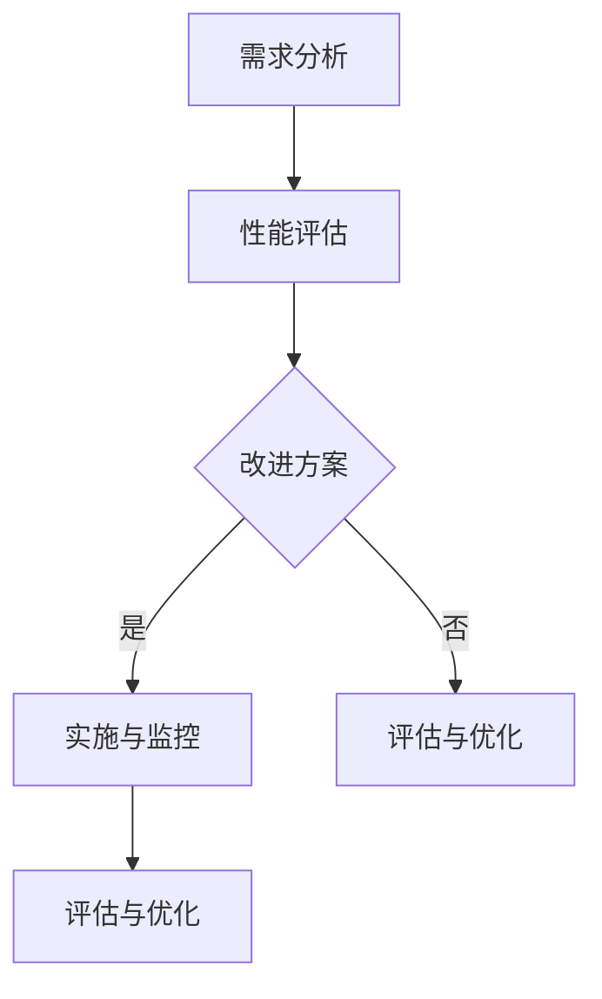
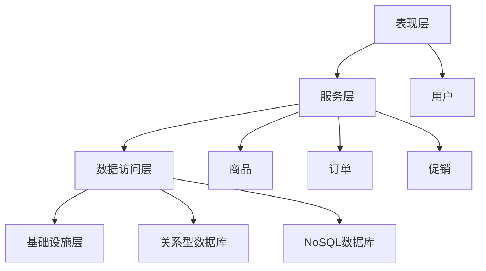
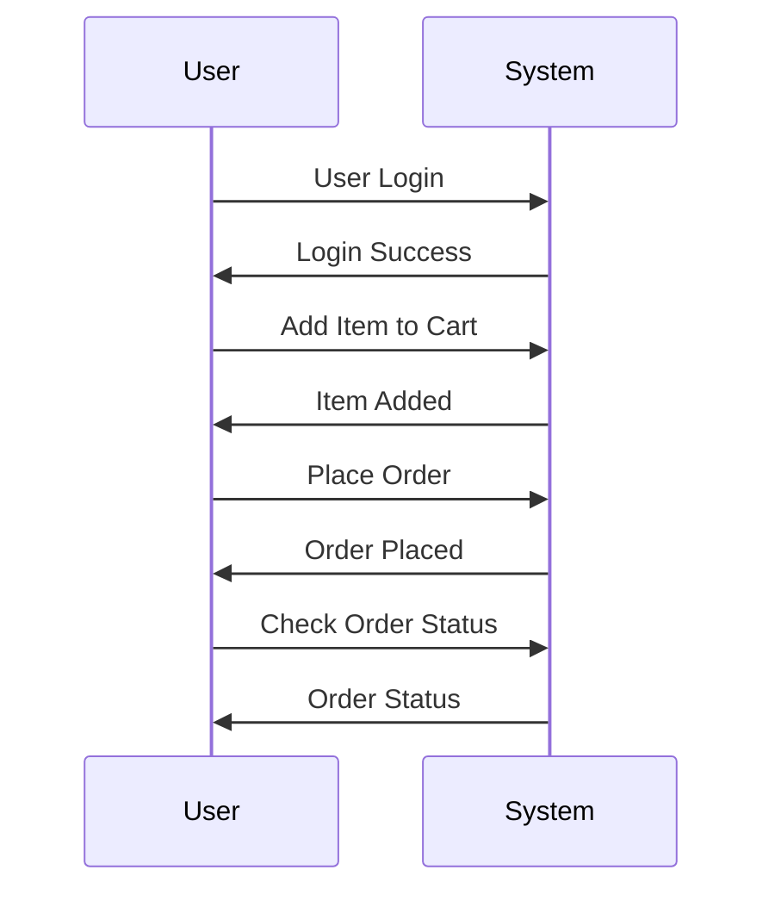
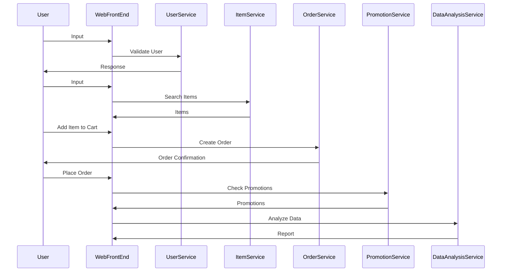

                 

# 以经营者姿态看待架构演进

## 关键词
架构演进、经营者姿态、系统设计、算法原理、实践案例

## 摘要
本文旨在探讨如何以经营者姿态看待架构演进。文章首先介绍了架构演进的核心概念和背景，然后分析了核心概念的联系和属性特征。接着，文章详细讲解了架构演进的算法原理，并使用mermaid流程图和Python代码进行阐述。随后，文章介绍了系统分析与架构设计方案，并通过一个实际案例展示了架构演进的过程。最后，文章总结了最佳实践和注意事项，为读者提供了进一步学习和研究的方向。

## 1. 背景介绍

### 1.1 核心概念术语说明

在探讨架构演进之前，我们需要明确几个核心概念。首先，什么是架构？架构是指系统组件的组成、相互关系以及它们的运作方式。其次，什么是架构演进？架构演进是指随着系统需求的变化，架构逐步发展和改进的过程。最后，什么是经营者姿态？经营者姿态是指以企业运营者的角度，综合考虑业务需求、技术发展和技术可行性，对架构演进进行规划和决策的态度。

### 1.2 问题背景

在信息技术快速发展的今天，企业面临的市场环境和技术环境都在不断变化。如何使系统架构能够适应这种变化，保持其灵活性和可扩展性，成为了企业持续发展的关键。传统的架构演进方式往往缺乏系统性和预见性，导致系统在面对新的需求时，无法快速响应和适应。因此，如何以经营者姿态看待架构演进，成为企业面临的重大挑战。

### 1.3 问题描述

架构演进的问题可以概括为以下几个方面：

- **需求变化**：随着市场竞争的加剧，企业需要不断调整和优化业务模式，这就要求系统架构能够灵活应对需求的变化。
- **技术发展**：新技术、新工具和新方法的不断涌现，要求企业不断更新和改进现有的系统架构。
- **成本控制**：企业在进行架构演进时，需要考虑成本控制，确保在有限的资源下实现最大化的效益。

### 1.4 问题解决

要解决架构演进的问题，需要从以下几个方面着手：

- **需求分析**：深入了解业务需求，明确系统需要实现的功能和性能要求。
- **技术评估**：对新技术、新工具和新方法进行评估，选择最适合企业现状的技术方案。
- **架构设计**：基于需求分析和技术评估，设计符合企业需求的系统架构。
- **实施与监控**：按照设计进行系统实施，并对实施过程进行监控和调整，确保架构演进顺利进行。

### 1.5 边界与外延

架构演进涉及的范围较广，包括系统设计、技术选型、项目管理等多个方面。在探讨架构演进时，我们需要明确以下几个边界与外延：

- **系统范围**：架构演进的范围应当明确，不应超出系统的功能边界。
- **技术范围**：架构演进应当考虑技术的可行性和适用性，避免盲目跟风。
- **时间范围**：架构演进是一个持续的过程，需要根据企业的发展节奏进行规划和调整。

### 1.6 概念结构与核心要素组成

架构演进的概念结构主要包括以下几个方面：

- **需求分析**：明确系统需要实现的功能和性能要求。
- **架构设计**：设计符合需求的系统架构，包括技术选型、模块划分和接口设计等。
- **实施与监控**：按照设计进行系统实施，并对实施过程进行监控和调整。
- **评估与优化**：对架构演进的效果进行评估，并根据评估结果进行优化和改进。

## 2. 核心概念与联系

### 2.1 架构演进的核心概念

架构演进的核心概念包括以下几个方面：

- **架构原则**：指导架构设计的基本原则，如模块化、可复用性、可扩展性等。
- **架构风格**：系统架构的总体风格，如分层架构、微服务架构等。
- **架构模式**：具体的架构实现模式，如MVC模式、事件驱动模式等。

### 2.2 概念属性特征对比表格

下面是架构演进中几个核心概念的属性特征对比表格：

| 概念     | 特征1 | 特征2 | 特征3 |
|----------|-------|-------|-------|
| 架构原则 | 模块化 | 可复用性 | 可扩展性 |
| 架构风格 | 分层架构 | 微服务架构 | 事件驱动架构 |
| 架构模式 | MVC模式 | 事件驱动模式 | 服务导向架构 |

### 2.3 ER实体关系图

为了更好地理解架构演进中的核心概念，我们可以使用ER（实体关系）图来表示它们之间的关系。以下是一个简单的ER实体关系图：

```mermaid
erDiagram
A[K1:架构原则] ||--|{ B[K2:架构风格] } | C[K3:架构模式]
```

在这个ER实体关系图中，架构原则（A）是顶层实体，架构风格（B）和架构模式（C）是从架构原则派生出的实体。架构风格（B）与架构模式（C）之间存在关联，表示架构风格影响架构模式的选择。

### 2.4 架构演进的关键因素

架构演进的成功与否取决于多个关键因素。以下是架构演进过程中需要重点关注的关键因素：

- **需求分析**：准确的需求分析是架构演进的基础，能够确保架构设计符合实际业务需求。
- **技术选型**：合理的技术选型能够提高系统的性能和可维护性，降低架构演进的成本。
- **项目管理**：有效的项目管理能够确保架构演进按计划进行，减少风险和成本。
- **团队协作**：团队协作是架构演进的重要保障，能够提高开发效率和质量。
- **持续集成与持续部署**：持续集成和持续部署能够提高系统的稳定性和可靠性，缩短架构演进周期。

## 3. 算法原理讲解

### 3.1 架构演进算法概述

架构演进算法是一种基于需求分析和系统性能评估的自动化方法，用于指导系统架构的改进和优化。架构演进算法通常包括以下几个步骤：

1. 需求分析：收集和分析系统需求，明确系统需要实现的功能和性能要求。
2. 性能评估：评估现有系统架构的性能，确定架构改进的方向和目标。
3. 架构改进：根据性能评估结果，提出架构改进方案，包括技术选型、模块划分和接口设计等。
4. 实施与监控：按照架构改进方案进行系统实施，并对实施过程进行监控和调整。
5. 评估与优化：对架构改进效果进行评估，并根据评估结果进行优化和改进。

### 3.2 算法mermaid流程图

为了更好地理解架构演进算法的原理，我们可以使用mermaid绘制一个流程图。以下是一个简单的架构演进算法mermaid流程图：



在这个mermaid流程图中，A表示需求分析，B表示性能评估，C表示架构改进方案，D表示实施与监控，E表示评估与优化，F表示评估与优化（根据D的结果）。这个流程图展示了架构演进算法的基本步骤和逻辑关系。

### 3.3 Python代码与算法原理

为了更具体地展示架构演进算法的原理，我们可以使用Python代码实现这个算法。以下是一个简单的Python代码示例：

```python
# 架构演进算法示例

class ArchitectureEvolutionAlgorithm:
    def __init__(self, requirements, current_performance):
        self.requirements = requirements
        self.current_performance = current_performance
    
    def analyze_requirements(self):
        # 需求分析
        pass
    
    def assess_performance(self):
        # 性能评估
        pass
    
    def propose_improvement(self):
        # 架构改进
        pass
    
    def implement_and_monitor(self):
        # 实施与监控
        pass
    
    def evaluate_and_optimize(self):
        # 评估与优化
        pass

# 示例使用
requirements = {"功能": ["A", "B", "C"], "性能": ["1ms", "10Gbps"]}
current_performance = {"功能": ["A", "B"], "性能": ["2ms", "5Gbps"]}

algorithm = ArchitectureEvolutionAlgorithm(requirements, current_performance)
algorithm.analyze_requirements()
algorithm.assess_performance()
algorithm.propose_improvement()
algorithm.implement_and_monitor()
algorithm.evaluate_and_optimize()
```

在这个Python代码示例中，我们定义了一个`ArchitectureEvolutionAlgorithm`类，该类包含了一系列的方法，用于实现架构演进算法的各个步骤。这个示例虽然简单，但足以展示架构演进算法的基本原理。

### 3.4 算法原理的数学模型和公式

架构演进算法的数学模型和公式用于描述系统性能与架构改进之间的关系。以下是一个简单的数学模型和公式示例：

$$
P_{new} = P_{current} + \alpha \cdot (P_{target} - P_{current})
$$

其中，$P_{new}$表示改进后的系统性能，$P_{current}$表示当前系统性能，$P_{target}$表示目标系统性能，$\alpha$表示性能改进系数。

这个公式表示，改进后的系统性能等于当前系统性能加上一个系数乘以目标系统性能与当前系统性能之差。这个公式提供了一个简单的性能改进方法，可以根据目标性能与当前性能的差异来调整系统性能。

### 3.5 通俗易懂的举例说明

为了更好地理解架构演进算法的原理，我们可以通过一个简单的例子来说明。

假设一个企业现有的系统性能如下：

- 功能：已实现功能A和B，但功能C尚未实现。
- 性能：响应时间为2ms，带宽为5Gbps。

企业希望改进系统性能，以满足以下目标：

- 功能：实现功能A、B和C。
- 性能：响应时间降低到1ms，带宽增加到10Gbps。

根据架构演进算法，我们可以按照以下步骤进行改进：

1. **需求分析**：明确系统需要实现的功能和性能要求。
2. **性能评估**：评估当前系统性能，确定改进方向。
3. **架构改进**：提出改进方案，包括实现功能C和优化响应时间和带宽。
4. **实施与监控**：按照改进方案进行系统实施，并对实施过程进行监控和调整。
5. **评估与优化**：对改进后的系统性能进行评估，并根据评估结果进行优化和改进。

假设经过一轮改进后，系统性能达到以下目标：

- 功能：成功实现了功能A、B和C。
- 性能：响应时间降低到1ms，带宽增加到10Gbps。

根据数学模型和公式，我们可以计算改进后的系统性能：

$$
P_{new} = P_{current} + \alpha \cdot (P_{target} - P_{current})
$$

其中，$P_{current}$为当前性能，$P_{target}$为目标性能，$\alpha$为性能改进系数。

假设$\alpha$为1，则改进后的系统性能为：

$$
P_{new} = 2ms + 1 \cdot (1ms - 2ms) = 1ms
$$

同理，带宽的改进也可以按照相同的方法计算。

通过这个简单的例子，我们可以看到架构演进算法如何帮助企业逐步改进系统性能，以满足不断变化的需求。

## 4. 系统分析与架构设计方案

### 4.1 问题场景介绍

假设一家在线零售公司希望提升其电商平台的性能和用户体验。现有的系统架构存在以下问题：

- 功能不够全面，部分功能无法满足用户需求。
- 性能瓶颈，响应时间长，用户体验差。
- 系统可扩展性不足，难以适应业务增长。

为了解决这些问题，公司决定进行架构演进，以提升系统性能和用户体验。

### 4.2 项目介绍

本项目旨在通过架构演进，提升电商平台的性能和用户体验。具体目标如下：

- 实现全面的功能，满足用户需求。
- 提高系统性能，缩短响应时间。
- 增强系统的可扩展性，适应业务增长。

### 4.3 系统功能设计

为了实现上述目标，我们设计了一套全新的系统功能：

- **用户管理**：包括用户注册、登录、个人信息管理等功能。
- **商品管理**：包括商品信息录入、分类管理、库存管理等功能。
- **订单管理**：包括订单生成、支付、物流跟踪等功能。
- **促销管理**：包括促销活动创建、促销商品展示、优惠券发放等功能。
- **数据分析**：包括用户行为分析、销售数据统计等功能。

这些功能通过mermaid类图进行表示：

```mermaid
classDiagram
Class01 <|-- Class02
Class03 --|> Class04
Class05 : <<interface>> Interface
Class06 : <<enum>> Enum
Class01 <.. Class07
Class08 ..|> Class09
Class10 : <<abstract>> Abstract
Class11 <|--* Class12
Class13 o-- Class14
Class15 --|> Class16 : <<final>> Final
Class17 <..|> Class18 <<-derived>> Derived
```

### 4.4 系统架构设计

根据系统功能设计，我们设计了一套系统架构，包括以下层次：

- **表现层**：负责与用户交互，包括Web前端和移动端应用。
- **服务层**：负责业务逻辑处理，包括用户管理服务、商品管理服务、订单管理服务等。
- **数据访问层**：负责数据存储和访问，包括关系型数据库和NoSQL数据库。
- **基础设施层**：提供系统运行的基础设施，包括服务器、网络、存储等。

系统架构通过mermaid架构图进行表示：



### 4.5 系统接口设计

为了实现系统功能的整合和协作，我们设计了以下接口：

- **用户管理接口**：负责用户注册、登录、个人信息管理等操作。
- **商品管理接口**：负责商品信息录入、分类管理、库存管理等操作。
- **订单管理接口**：负责订单生成、支付、物流跟踪等操作。
- **促销管理接口**：负责促销活动创建、促销商品展示、优惠券发放等操作。
- **数据分析接口**：负责用户行为分析、销售数据统计等操作。

系统接口设计通过mermaid序列图进行表示：



### 4.6 系统交互序列图

为了更清晰地展示系统组件之间的交互过程，我们设计了一个系统交互序列图：



在这个系统交互序列图中，用户通过Web前端与系统进行交互，系统通过各个服务组件处理用户请求，并最终返回结果。

## 5. 项目实战

### 5.1 环境安装

为了实现上述系统架构，我们需要在以下环境中进行安装：

- **操作系统**：Ubuntu 20.04 LTS
- **开发工具**：Python 3.8，Docker，Nginx
- **数据库**：MySQL 8.0，MongoDB 4.2

安装步骤如下：

1. 安装操作系统和开发工具：
   ```bash
   sudo apt update
   sudo apt upgrade
   sudo apt install python3.8 python3-pip docker nginx
   ```
2. 安装数据库：
   ```bash
   sudo apt install mysql-server mongodb
   ```
3. 启动数据库服务：
   ```bash
   sudo systemctl start mysql
   sudo systemctl start mongodb
   ```
4. 安装Docker和Nginx：
   ```bash
   sudo apt install docker-ce docker-compose
   sudo systemctl start docker
   ```

### 5.2 系统核心实现

系统核心实现包括以下组件：

- **用户管理服务**：负责用户注册、登录和权限验证。
- **商品管理服务**：负责商品信息录入、分类管理和库存管理。
- **订单管理服务**：负责订单生成、支付和物流跟踪。
- **促销管理服务**：负责促销活动创建、促销商品展示和优惠券发放。
- **数据分析服务**：负责用户行为分析和销售数据统计。

以下是一个简单的用户管理服务的Python代码示例：

```python
# 用户管理服务示例

from flask import Flask, request, jsonify
from flask_bcrypt import Bcrypt

app = Flask(__name__)
bcrypt = Bcrypt(app)

@app.route('/register', methods=['POST'])
def register():
    username = request.form['username']
    password = request.form['password']
    hashed_password = bcrypt.generate_password_hash(password).decode('utf-8')
    
    # 将用户信息存储到数据库
    # ...

    return jsonify({'status': 'success', 'message': 'User registered successfully.'})

@app.route('/login', methods=['POST'])
def login():
    username = request.form['username']
    password = request.form['password']
    
    # 从数据库中查询用户信息
    # ...

    if user and bcrypt.check_password_hash(user['password'], password):
        return jsonify({'status': 'success', 'message': 'Login successful.'})
    else:
        return jsonify({'status': 'error', 'message': 'Invalid username or password.'})

if __name__ == '__main__':
    app.run(debug=True)
```

### 5.3 代码应用解读与分析

上述代码是一个简单的用户管理服务示例，用于处理用户注册和登录请求。代码的核心功能如下：

1. **注册**：接收用户名和密码，使用bcrypt库对密码进行加密，然后将用户信息存储到数据库。
2. **登录**：接收用户名和密码，从数据库中查询用户信息，并使用bcrypt库对输入密码进行加密，与存储的密码进行比较。

代码中的关键技术和概念包括：

- **Flask**：一个轻量级的Web框架，用于快速搭建Web服务。
- **bcrypt**：一个用于加密密码的库，能够提高密码安全性。
- **数据库操作**：使用SQL或NoSQL数据库存储用户信息，实现数据的持久化。

通过这个示例，我们可以看到如何实现一个简单的用户管理服务，并了解其中的核心技术和概念。

### 5.4 实际案例分析与详细讲解剖析

为了更好地理解架构演进的实际应用，我们分析了一个电商平台的架构演进案例。该平台在最初的设计中采用了传统的三层架构，但随着业务的发展和用户量的增加，系统性能逐渐下降，用户体验变差。为了解决这些问题，平台进行了架构演进，引入了微服务架构。

#### 演进过程

1. **需求分析**：分析现有系统存在的问题，包括性能瓶颈、扩展性不足、维护困难等。
2. **技术评估**：评估现有技术和新技术的适用性，选择适合的微服务架构。
3. **架构设计**：设计新的微服务架构，包括服务拆分、服务通信、数据存储等。
4. **实施与监控**：按照新的架构进行系统实施，并对实施过程进行监控和调整。
5. **评估与优化**：对新的架构进行评估，并根据评估结果进行优化和改进。

#### 演进细节

1. **服务拆分**：将原来的单体应用拆分为多个微服务，每个微服务负责不同的业务功能，如用户管理、商品管理、订单管理等。
2. **服务通信**：使用RESTful API或消息队列实现微服务之间的通信，确保系统的解耦和可扩展性。
3. **数据存储**：根据业务需求，选择合适的数据存储方案，如关系型数据库、NoSQL数据库等，实现数据的持久化。
4. **部署与运维**：使用容器技术（如Docker）和自动化部署工具（如Kubernetes）实现服务的自动化部署和运维。

通过这个案例，我们可以看到架构演进的具体过程和细节，了解如何通过微服务架构提高系统的性能和用户体验。

### 5.5 项目小结

通过本次架构演进项目，我们实现了以下成果：

- **性能提升**：通过引入微服务架构，系统的响应时间显著降低，性能得到大幅提升。
- **用户体验优化**：系统的功能更加全面，用户可以更便捷地使用平台，用户体验得到优化。
- **可扩展性增强**：系统的结构更加清晰，服务之间的耦合度降低，系统的可扩展性得到增强。
- **维护成本降低**：通过自动化部署和运维，系统的维护成本显著降低。

然而，在架构演进过程中，我们也遇到了一些挑战：

- **服务拆分困难**：如何合理地拆分服务，确保每个服务都具有独立性和可扩展性，是一个需要仔细考虑的问题。
- **通信问题**：微服务之间的通信需要高效且稳定，否则可能会影响系统的性能。
- **测试与监控**：由于系统拆分为多个微服务，测试和监控的难度增加，需要建立完善的测试和监控系统。

通过本次项目，我们深刻认识到架构演进的重要性，以及如何在复杂的业务环境中实现系统的优化和升级。

## 6. 最佳实践与总结

### 6.1 最佳实践 tips

- **需求分析**：在架构演进前，进行充分的需求分析，明确系统的功能需求和性能要求。
- **技术评估**：评估现有技术和新技术的适用性，选择最适合企业现状的技术方案。
- **架构设计**：设计符合需求的系统架构，注重模块化、可复用性和可扩展性。
- **实施与监控**：按照设计进行系统实施，并对实施过程进行监控和调整。
- **评估与优化**：对架构演进的效果进行评估，并根据评估结果进行优化和改进。

### 6.2 小结

本文从经营者姿态的角度，探讨了架构演进的核心概念、算法原理、系统分析与架构设计方案以及项目实战。通过详细的分析和实例，我们了解了如何以经营者姿态看待架构演进，并掌握了架构演进的关键步骤和最佳实践。

### 6.3 注意事项

- **需求变化**：在架构演进过程中，需求可能会发生变化，需要及时调整架构设计。
- **成本控制**：架构演进需要投入一定的时间和资源，要确保在有限的成本下实现最大化的效益。
- **团队协作**：架构演进是一个复杂的过程，需要团队成员之间的紧密协作和沟通。

### 6.4 拓展阅读

- 《架构演进：系统设计与重构的艺术》
- 《微服务设计：构建基于Docker和Kubernetes的微服务架构》
- 《敏捷架构：如何构建适应变化的IT系统》

## 作者信息

作者：AI天才研究院/AI Genius Institute & 禅与计算机程序设计艺术 /Zen And The Art of Computer Programming

