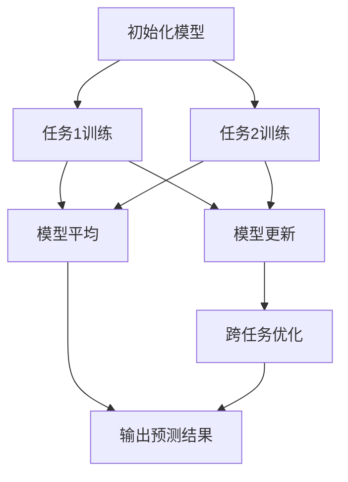

                 

### 书名理解

书名《企业AI Agent的元学习框架：快速适应新任务与领域》直接指出了文章的核心主题和内容方向。首先，"企业AI Agent"定义了文章关注的对象，即AI代理在企业场景中的应用。这种AI代理不仅仅是一个简单的模型，而是一个能够自主学习和适应复杂业务需求的智能体。其次，"元学习框架"强调了文章要探讨的是一种学习方法，即如何通过元学习来提升AI代理的能力。最后，“快速适应新任务与领域”则明确了文章的目标，即探讨如何使AI代理能够快速适应不同的任务和环境，提高其灵活性和适应性。

整体来看，书名清晰地表明了文章将探讨的核心内容：如何构建一个能够在企业环境中快速适应新任务和领域的AI代理，并详细介绍其背后的元学习框架。这使得读者能够迅速把握文章的主题，并对文章的内容和结构有初步的了解。接下来，我们将进一步探讨这些核心概念和其在企业AI中的应用。### 背景介绍

在企业环境中，人工智能（AI）的兴起带来了深远的影响，尤其是在自动化决策、数据分析和流程优化等领域。然而，传统的机器学习方法往往面临着一个显著的挑战：它们在特定领域或任务上训练得到的模型，很难迁移到其他类似但不同的场景中。例如，一个在医疗领域训练的AI模型，可能无法直接应用到金融领域，即使这两个领域有相似的统计数据和分析需求。这种局限限制了AI在企业中的广泛应用，因为每次部署新的AI系统时，都需要重新收集和标注大量数据，耗时且成本高昂。

为了解决这一问题，引入了元学习（Meta-Learning）的概念。元学习，也被称为“学习如何学习”，是一种使模型能够快速适应新任务或环境的方法。通过元学习，AI代理可以在较短的时间内从少量示例中学习，并在新的、未见过的任务上表现出色。这种能力在需要快速适应和频繁变更的企业环境中尤为重要。

在元学习的基础上，AI Agent的概念也应运而生。AI Agent是一个具有自我学习能力、能够与环境交互并执行任务的实体。与传统的静态模型不同，AI Agent具有自主决策和适应变化的能力。这使得AI Agent在企业环境中能够灵活应对各种复杂的业务场景，从而提高生产效率、优化决策流程并降低运营成本。

结合元学习与AI Agent，企业AI Agent的元学习框架成为了一种创新的方法。通过这种框架，AI代理能够利用元学习算法快速适应新任务和领域，从而实现以下几个关键目标：

1. **快速适应新任务**：AI代理可以在短时间内适应新的业务需求，无需重新训练或收集大量数据。
2. **领域泛化**：AI代理能够在不同领域和任务之间进行迁移，减少对特定领域数据的依赖。
3. **持续学习**：AI代理能够从日常运营中不断学习，提高其能力和适应性。

例如，在零售业中，AI代理可以通过元学习快速适应新的销售策略或市场需求，而在金融行业中，AI代理则可以快速分析新的金融市场数据，提供精准的预测和建议。

总之，企业AI Agent的元学习框架不仅解决了传统AI方法在迁移学习和适应新环境方面的局限，还为企业在快速变化的市场环境中提供了强有力的技术支持。通过这种框架，企业能够更有效地利用AI技术，实现自动化、智能化和高效运营的目标。### 元学习原理

元学习，又称“学习如何学习”，是深度学习领域中的一种重要研究方向。它的核心目标是使模型能够快速适应新任务或环境，从而提高学习的效率和灵活性。在介绍元学习的基本概念和原理之前，我们需要先理解一些关键术语和背景知识。

首先，传统的机器学习方法通常采用监督学习（Supervised Learning）或无监督学习（Unsupervised Learning）来训练模型。监督学习依赖于标记好的数据集，即每个数据点都有一个对应的标签或目标值。通过学习这些标记数据，模型可以预测未知数据点的标签。而无监督学习则是在没有标签的情况下，通过发现数据点之间的内在结构和模式来训练模型。

然而，这些方法在处理新的、未见过的任务时往往表现不佳。因为它们需要大量标记数据来进行训练，且对数据的分布和特征有较强的依赖。在这种情况下，元学习提供了一种新的思路：通过学习如何快速适应新任务，使得模型能够在少量数据或甚至无数据的情况下，仍然能够表现出良好的泛化能力。

#### 元学习的核心概念

元学习的核心概念可以概括为以下几点：

1. **迁移学习（Transfer Learning）**：元学习通过迁移学习将已有的知识或经验应用于新的任务中，从而减少对新数据的依赖。迁移学习通常通过共享底层特征表示来实现，即不同任务之间共享一部分神经网络结构。

2. **模型适应性（Model Adaptation）**：元学习关注如何使模型能够适应新任务或环境。这包括两个方面：首先，通过调整模型的参数，使其在新任务上表现更好；其次，通过更新模型的内部结构和表示方式，提高其在不同任务间的迁移能力。

3. **元学习算法（Meta-Learning Algorithms）**：元学习算法是一类专门用于加速模型适应新任务的算法。常见的元学习算法包括模型平均（Model Averaging）、迁移学习（Transfer Learning）、模型更新（Model Updating）和样本效率（Sample Efficiency）等。

#### 元学习原理

元学习的原理可以简单概括为以下几个步骤：

1. **初始化模型**：首先，初始化一个基础模型，该模型可以是一个简单的神经网络或深度学习模型。这个基础模型将作为元学习过程的核心。

2. **元学习训练**：在元学习训练过程中，模型会接收到多个不同的任务，每个任务包含一部分训练数据和验证数据。模型在这些任务上交替训练，目的是学习如何快速适应新任务。

3. **模型更新**：在每个任务训练结束后，模型会根据其在新任务上的表现进行更新。这种更新可以通过调整模型的参数、优化模型的结构或更新模型的内部表示来实现。

4. **适应新任务**：经过多个任务的元学习训练后，模型将具备良好的泛化能力和适应性。当接收到一个新的任务时，模型可以迅速调整其参数或结构，以适应新任务的需求。

#### 元学习在AI中的应用

元学习在AI领域有广泛的应用，以下是一些典型的应用场景：

1. **自然语言处理（NLP）**：在NLP任务中，元学习可以帮助模型快速适应新的语言或方言。例如，一个在英语上训练的模型，可以通过元学习快速适应法语、西班牙语等新的语言环境。

2. **计算机视觉（CV）**：在CV任务中，元学习可以帮助模型在不同图像数据集上快速适应。例如，一个在特定类型的图像上训练的模型，可以通过元学习快速适应其他类型的图像数据。

3. **强化学习（RL）**：在强化学习任务中，元学习可以帮助模型在多样化的环境中快速学习，从而提高其泛化能力。

4. **医疗诊断**：在医疗诊断领域，元学习可以帮助模型在不同医院或数据集上快速适应，从而提高诊断的准确性和可靠性。

总之，元学习通过提供一种新的学习范式，使得AI代理能够快速适应新任务和领域，从而在企业和科研领域展现出巨大的潜力和应用价值。在接下来的章节中，我们将进一步探讨AI Agent的概念及其在企业环境中的应用。### AI Agent概述

AI Agent，即人工智能代理，是一种具有自主决策和学习能力的计算机实体，能够与环境交互并执行特定任务。与传统的机器学习模型不同，AI Agent不仅仅是一个被动地接收数据和输出结果的系统，而是一个具有主动性和适应性的智能实体。其核心特点包括自主性、学习性、适应性和交互性。

#### 定义

AI Agent可以定义为一种在特定环境中自主执行任务、与外界进行交互并具备学习能力的人工智能实体。它能够通过感知环境信息、分析环境状态，并基于预设的决策策略生成行动方案，从而实现对环境的控制和优化。

#### 功能

AI Agent的功能主要包括以下几个方面：

1. **感知与理解**：AI Agent能够感知环境中的各种信息，如文本、图像、声音等，并对其进行理解和分析。这通常通过深度学习、自然语言处理等技术来实现。

2. **决策与规划**：基于对环境的理解和分析，AI Agent能够制定决策策略和行动计划，以实现特定的目标。这涉及到强化学习、规划算法等技术。

3. **学习与适应**：AI Agent能够在执行任务的过程中不断学习，并根据环境变化和任务需求调整其行为和策略。这种学习能力使其能够适应复杂多变的业务场景。

4. **交互与协同**：AI Agent能够与人类或其他AI Agent进行交互，协同完成复杂任务。这种交互能力使其在团队协作和智能调度中具有重要意义。

#### AI Agent与元学习的关系

AI Agent与元学习有着紧密的联系。元学习为AI Agent提供了快速适应新任务和领域的能力，使得AI Agent能够在各种复杂环境中表现出色。具体来说，AI Agent与元学习的关系可以从以下几个方面理解：

1. **迁移学习**：通过元学习，AI Agent可以在多个任务间进行迁移学习，从而减少对新数据集的依赖。这种迁移能力使得AI Agent能够快速适应新的业务需求和环境。

2. **模型适应性**：元学习算法可以帮助AI Agent快速适应新的任务，调整其内部结构和参数，提高其适应性和灵活性。

3. **持续学习**：AI Agent通过元学习可以不断从经验中学习，优化其决策策略和行为模式，从而提高其在动态环境中的表现。

4. **增强交互性**：元学习使AI Agent能够更好地理解用户需求，提高其与人类的交互质量，从而实现更高效、更自然的协作。

总之，AI Agent的自主性、学习性和适应性使其在企业和科研领域具有广泛的应用前景。结合元学习框架，AI Agent能够更好地适应各种复杂任务和多变环境，为企业提供智能化、自动化的解决方案。在接下来的章节中，我们将进一步探讨如何通过元学习框架来提升AI Agent的适应能力。### 快速适应新任务与领域的方法

在企业环境中，AI Agent需要具备快速适应新任务和领域的能力，以应对不断变化的市场需求和业务场景。实现这一目标，我们可以从以下几个方面进行探讨：

#### 方法概述

1. **元学习算法**：元学习算法的核心目标是通过少量数据或甚至无数据的情况下，使AI代理能够快速适应新任务。常见的元学习算法包括模型平均（Model Averaging）、迁移学习（Transfer Learning）、模型更新（Model Updating）和样本效率（Sample Efficiency）等。

2. **自适应学习策略**：AI Agent需要具备自适应学习策略，能够在执行任务的过程中不断调整其行为和策略。这种策略可以通过在线学习、主动学习等方法实现。

3. **多任务学习**：多任务学习（Multi-Task Learning）允许AI Agent在同时处理多个任务时，共享部分知识，从而提高其适应新任务的能力。

4. **增强学习**：增强学习（Reinforcement Learning）通过奖励机制和反馈信号，使AI Agent能够在动态环境中快速学习和适应。

#### 实现策略

1. **数据预处理与迁移**：在训练AI Agent之前，对数据进行预处理和迁移是非常重要的。通过数据清洗、数据增强和跨领域数据融合，可以提高AI Agent对新任务和领域的适应能力。

2. **模型结构优化**：优化AI Agent的模型结构，使其具有更好的泛化能力和适应性。常用的方法包括神经网络结构搜索（Neural Architecture Search）、网络剪枝（Network Pruning）和模型压缩（Model Compression）等。

3. **在线学习与持续更新**：AI Agent需要具备在线学习的能力，能够在执行任务的同时不断更新其模型和策略。这种持续学习机制可以使其在动态环境中保持适应。

4. **交互与反馈**：通过用户交互和反馈机制，AI Agent可以更好地理解用户需求和环境变化，从而快速调整其行为和策略。

#### 挑战与机遇

1. **数据稀缺性**：在企业环境中，新任务和领域的数据往往稀缺，这限制了元学习算法的效果。为此，需要探索更有效的数据采集和增强方法。

2. **计算资源**：元学习算法通常需要大量的计算资源，尤其是在处理复杂任务和大量数据时。因此，如何在有限的计算资源下高效地实现元学习成为了一个重要挑战。

3. **模型稳定性**：在快速适应新任务和领域的过程中，模型稳定性是一个关键问题。需要确保AI Agent在适应新任务时，不会出现过拟合或性能下降。

4. **鲁棒性**：AI Agent需要具备良好的鲁棒性，能够在面对异常数据和噪声时，仍然能够保持其性能和适应性。

然而，随着技术的不断进步和应用的深入，快速适应新任务和领域的方法也在不断改进和发展。通过结合多学科的知识和先进的算法，企业AI Agent有望在未来的应用中发挥更大的作用。### 核心概念与联系

在深入探讨企业AI Agent的元学习框架之前，有必要明确一些核心概念，并分析它们之间的联系。本文将重点介绍元学习、AI Agent及其在企业应用中的核心作用。

#### 元学习

元学习，即学习如何学习，是机器学习领域中的一个重要分支。它旨在通过一个通用学习算法，使模型能够快速适应新的任务或环境，而无需从头开始训练。元学习的核心概念包括迁移学习、模型适应性、样本效率等。

1. **迁移学习**：迁移学习是将一个任务（源任务）上学到的知识应用于另一个任务（目标任务）的过程。通过共享底层特征表示，模型可以在不同任务间进行知识转移，减少对新数据的依赖。

2. **模型适应性**：模型适应性指的是模型能够根据新任务的特性进行调整，以实现更好的性能。这通常涉及到模型参数的微调、网络结构的动态调整等。

3. **样本效率**：样本效率是指模型在给定样本数量下，能够学习到多少知识。高样本效率意味着模型能够在少量数据上快速适应新任务，减少数据需求和训练时间。

#### AI Agent

AI Agent是一种具备自主性、学习性和适应性的智能实体，能够在复杂环境中执行任务并与人或其他系统进行交互。以下是AI Agent的核心概念和功能：

1. **自主性**：AI Agent能够自主决策，根据环境反馈和预设目标，生成并执行行动方案。

2. **学习性**：AI Agent能够从经验中学习，通过调整其内部模型和策略，提高其在不同任务上的性能。

3. **适应性**：AI Agent能够快速适应新任务和领域，无需重新训练或依赖大量数据。

4. **交互性**：AI Agent能够与人类或其他系统进行交互，协同完成任务。

#### 元学习与AI Agent的关系

元学习与AI Agent之间有着紧密的联系。元学习为AI Agent提供了快速适应新任务和领域的能力，使得AI Agent能够在多变的企业环境中表现出色。

1. **迁移能力**：通过元学习，AI Agent可以在多个任务间进行迁移学习，减少对新数据的依赖。这有助于提高AI Agent在不同业务场景中的适应能力。

2. **模型适应性**：元学习算法可以帮助AI Agent快速适应新任务，调整其内部模型和策略，提高其性能和灵活性。

3. **持续学习**：AI Agent通过元学习可以不断从经验中学习，优化其决策策略和行为模式，从而提高其在动态环境中的表现。

4. **增强交互**：元学习使AI Agent能够更好地理解用户需求和环境变化，提高其与人类的交互质量，从而实现更高效、更自然的协作。

#### 对比与联系

以下是元学习与AI Agent在核心概念和功能上的对比：

| **概念** | **元学习** | **AI Agent** |
| --- | --- | --- |
| **核心目标** | 快速适应新任务 | 自主执行任务 |
| **迁移能力** | 通过迁移学习实现 | 通过元学习实现 |
| **适应性** | 在少量数据下适应新任务 | 在动态环境中快速适应 |
| **学习性** | 学习如何学习 | 从经验中学习 |
| **交互性** | 与不同系统交互 | 与人或其他系统交互 |

通过上述对比可以看出，元学习为AI Agent提供了强大的适应能力，使其能够在复杂多变的企业环境中发挥重要作用。结合元学习与AI Agent，企业可以构建出具有高度自适应性和智能化的AI系统，从而实现自动化、智能化和高效运营的目标。### 元学习算法原理讲解

#### 算法概述

元学习算法的核心目标是使模型能够在少量数据或甚至无数据的情况下，快速适应新的任务或环境。这些算法通常通过在多个任务间共享知识或调整模型参数，来实现对新任务的快速适应。本文将介绍两种常见的元学习算法：模型平均（Model Averaging）和模型更新（Model Updating）。

#### Model Averaging

模型平均算法是一种简单但有效的元学习策略。其基本思想是，在多个任务上训练多个模型，然后取这些模型的平均作为最终预测结果。具体步骤如下：

1. **初始化多个模型**：首先初始化多个相同的模型，这些模型共享相同的架构但具有独立的参数。

2. **任务训练**：在每个任务上分别训练这些模型。由于每个任务的数据量可能不同，训练时间也有所差异。

3. **模型平均**：在所有任务训练完成后，将每个模型的预测结果进行平均，得到最终的预测结果。

数学上，模型平均可以通过以下公式表示：

$$
\hat{y} = \frac{1}{K} \sum_{k=1}^{K} \hat{y}_k
$$

其中，$K$表示训练的模型数量，$\hat{y}$为最终预测结果，$\hat{y}_k$为第$k$个模型的预测结果。

#### Model Updating

模型更新算法是一种更动态的元学习策略，通过在每个任务上调整模型参数，来实现对新任务的快速适应。具体步骤如下：

1. **初始化模型**：初始化一个基础模型，该模型将在多个任务上更新。

2. **任务训练**：在每个任务上，模型首先在任务数据集上进行训练，以优化模型参数。

3. **模型更新**：在任务训练完成后，模型参数会根据在新任务上的性能进行更新。这种更新可以是线性的，也可以是非线性的，具体取决于元学习算法的设计。

4. **跨任务优化**：在多个任务训练完成后，模型参数会进行跨任务优化，以进一步提高模型在新任务上的性能。

数学上，模型更新可以通过以下公式表示：

$$
\theta_{t+1} = \theta_{t} + \alpha \cdot (\theta_{t} - \theta_{t-1})
$$

其中，$\theta_{t}$为第$t$个任务训练后的模型参数，$\theta_{t-1}$为第$t-1$个任务训练后的模型参数，$\alpha$为学习率。

#### Mermaid流程图

为了更直观地展示模型平均和模型更新算法的流程，我们可以使用Mermaid绘制流程图。以下是一个简化的Mermaid流程图：



在上述流程图中，模型平均和模型更新算法分别表示为两个分支。在每个任务训练完成后，模型平均算法通过取平均得到最终预测结果，而模型更新算法则通过调整模型参数，并跨任务优化，以提高模型在新任务上的性能。

#### Python源代码讲解

为了更好地理解模型平均和模型更新算法，我们可以使用Python编写简单的示例代码。以下是一个基于模型平均的Python代码示例：

```python
import numpy as np

# 初始化模型参数
num_models = 3
num_samples = 100
model_params = [np.random.randn(num_samples) for _ in range(num_models)]

# 模拟任务训练
for task in range(1, 4):
    print(f"Task {task} training:")
    for i, model in enumerate(model_params):
        # 假设每个任务都使模型参数减小0.1
        model -= 0.1 * (i + 1)

# 模型平均
avg_model = np.mean(model_params, axis=0)

# 输出模型平均结果
print("Model averaging:")
print(avg_model)
```

在上述代码中，我们首先初始化了三个模型参数，然后模拟了三个任务的训练过程。在每个任务上，模型参数都进行了一定程度的调整。最后，我们通过取这三个模型的平均，得到最终的模型参数。同样的，我们可以编写一个基于模型更新的Python代码示例，以展示模型更新算法的过程。

通过上述算法原理讲解和代码示例，我们可以更好地理解模型平均和模型更新算法的基本概念和实现方法。在接下来的章节中，我们将进一步探讨如何通过这些算法构建企业AI Agent的元学习框架。### 数学模型和公式

在元学习算法的讨论中，数学模型和公式扮演着至关重要的角色，它们不仅为算法提供了理论基础，而且帮助我们在实际应用中更好地理解和优化算法性能。以下我们将介绍元学习算法中常用的数学模型和公式，并使用LaTeX格式进行展示，以确保公式的准确性和可读性。

#### 模型平均（Model Averaging）

模型平均算法的核心思想是通过多个模型的平均来提高预测的稳定性。在模型平均中，每个模型都有自己的参数向量，我们可以使用权重来计算这些模型的加权平均。

设$K$个模型的参数向量分别为$\theta_1, \theta_2, \ldots, \theta_K$，权重分别为$w_1, w_2, \ldots, w_K$，则加权平均模型参数$\theta_{\text{avg}}$可以表示为：

$$
\theta_{\text{avg}} = \sum_{k=1}^{K} w_k \theta_k
$$

其中，$w_k$通常由模型的性能决定，即：

$$
w_k = \frac{1}{\sum_{j=1}^{K} \frac{1}{\sigma_j^2}}
$$

其中，$\sigma_j^2$表示模型$j$的方差。

#### 模型更新（Model Updating）

模型更新算法则是通过在每个任务上更新模型参数来提高对新任务的适应能力。假设我们在第$t$个任务上更新模型参数$\theta_t$，则更新规则可以表示为：

$$
\theta_{t+1} = \theta_t + \alpha \cdot (\theta_t - \theta_{t-1})
$$

其中，$\alpha$是学习率，用于控制更新幅度。

对于连续的更新，我们还可以使用动量项$m_t$来增加更新过程的稳定性：

$$
\theta_{t+1} = \theta_t + \alpha \cdot (\theta_t - \theta_{t-1}) + m_t (\theta_{t-1} - \theta_{t-2})
$$

其中，$m_t$是动量项，通常通过以下方式更新：

$$
m_{t+1} = \gamma m_t + (1 - \gamma) (\theta_t - \theta_{t-1})
$$

其中，$\gamma$是动量系数，通常取值在0到1之间。

#### 样本效率（Sample Efficiency）

在元学习中的样本效率指的是模型在给定样本数量下学习的效率。一个常用的度量方法是平均样本效率（Average Sample Efficiency, ASE），它可以通过以下公式计算：

$$
\text{ASE} = \frac{1}{N} \sum_{n=1}^{N} \frac{1}{n} \sum_{i=1}^{n} \hat{y}_i
$$

其中，$N$是总样本数，$\hat{y}_i$是第$i$个样本的预测结果。

#### 实例说明

为了更好地说明上述公式，我们考虑一个简单的线性回归问题。假设我们有两个任务，每个任务都有相同的输入特征$x$和输出目标$y$。对于每个任务，我们分别训练两个模型，并使用模型平均和模型更新算法来计算最终的预测结果。

设任务1的模型参数为$\theta_1^1$和$\theta_1^2$，任务2的模型参数为$\theta_2^1$和$\theta_2^2$，权重分别为$w_1$和$w_2$。通过模型平均，我们得到：

$$
\theta_{\text{avg},1} = w_1 \theta_1^1 + w_2 \theta_1^2
$$

$$
\theta_{\text{avg},2} = w_1 \theta_2^1 + w_2 \theta_2^2
$$

通过模型更新，我们得到：

$$
\theta_{\text{avg},1,\text{new}} = \theta_{\text{avg},1} + \alpha \cdot (\theta_{\text{avg},1} - \theta_{\text{avg},1,\text{prev}})
$$

$$
\theta_{\text{avg},2,\text{new}} = \theta_{\text{avg},2} + \alpha \cdot (\theta_{\text{avg},2} - \theta_{\text{avg},2,\text{prev}})
$$

其中，$\theta_{\text{avg},1,\text{prev}}$和$\theta_{\text{avg},2,\text{prev}}$是前一次更新的模型参数。

通过上述公式和实例，我们可以看到元学习算法在数学上的严谨性和实用性。这些公式不仅为算法的实现提供了明确的指导，而且有助于我们理解和优化算法在不同任务和领域中的应用。### 系统分析与架构设计方案

为了实现企业AI Agent的元学习框架，我们需要对其系统架构进行分析和设计。以下是系统架构的详细描述，包括问题场景、系统功能、架构设计、接口设计和交互设计。

#### 问题场景

在复杂的商业环境中，企业需要处理大量的业务任务和数据。传统的机器学习方法通常依赖于大量标记数据和复杂的模型训练过程，这既耗时又成本高昂。此外，不同业务场景之间的迁移能力有限，使得模型在新的业务场景中难以快速适应。为了解决这个问题，我们需要设计一个具有高适应性、低数据依赖和高效决策能力的AI Agent元学习框架。

#### 系统功能

企业AI Agent的元学习框架主要包括以下几个核心功能：

1. **数据预处理**：对原始业务数据进行清洗、转换和增强，为模型训练提供高质量的数据输入。

2. **模型训练与更新**：利用元学习算法训练和更新AI Agent的内部模型，使其能够快速适应新的业务任务。

3. **决策与执行**：根据当前业务环境和目标，生成最优的行动方案，并执行这些方案以实现业务目标。

4. **性能评估**：评估AI Agent在不同业务场景中的性能，以便进行进一步的优化和调整。

5. **监控与反馈**：实时监控AI Agent的运行状态，收集用户反馈，以持续改进系统性能。

#### 系统架构设计

系统架构设计采用分层架构，分为数据层、模型层和应用层。

1. **数据层**：包括数据采集、预处理和存储模块。数据采集模块负责从各种渠道获取业务数据，预处理模块负责清洗和转换数据，存储模块负责将处理后的数据存储在数据库中。

2. **模型层**：包括元学习算法模块、模型训练模块和模型存储模块。元学习算法模块负责实现各种元学习算法，模型训练模块负责训练和更新AI Agent的内部模型，模型存储模块负责存储和管理训练好的模型。

3. **应用层**：包括决策与执行模块、性能评估模块和监控与反馈模块。决策与执行模块负责生成和执行行动方案，性能评估模块负责评估AI Agent在不同场景中的性能，监控与反馈模块负责实时监控系统状态和收集用户反馈。

#### 接口设计

为了方便不同模块之间的通信，系统设计了一系列接口：

1. **数据接口**：包括数据采集接口、数据预处理接口和数据存储接口。这些接口负责与数据层进行通信，提供数据输入和输出。

2. **模型接口**：包括模型训练接口、模型更新接口和模型评估接口。这些接口负责与模型层进行通信，提供模型训练、更新和评估功能。

3. **应用接口**：包括决策接口、执行接口、性能评估接口和监控接口。这些接口负责与应用层进行通信，提供决策、执行、性能评估和监控功能。

#### 交互设计

系统交互设计采用事件驱动模型，各个模块通过事件进行通信。以下是系统的交互流程：

1. **数据采集**：系统启动后，数据采集模块开始从各种渠道收集业务数据，并将数据传递给预处理模块。

2. **数据预处理**：预处理模块对采集到的数据进行清洗、转换和增强，然后将处理后的数据存储到数据库中。

3. **模型训练与更新**：元学习算法模块从数据库中获取预处理后的数据，训练和更新AI Agent的内部模型。模型训练模块根据元学习算法的输出，更新模型的参数和结构。

4. **决策与执行**：决策与执行模块根据当前业务环境和目标，生成最优的行动方案，并将方案传递给执行模块。执行模块执行这些方案，以实现业务目标。

5. **性能评估**：性能评估模块评估AI Agent在不同场景中的性能，并将评估结果反馈给模型更新模块，以便进行进一步的优化。

6. **监控与反馈**：监控与反馈模块实时监控系统状态，收集用户反馈，并将反馈传递给相关模块，以便进行系统优化。

通过上述系统分析与架构设计方案，我们可以构建一个高效、自适应的企业AI Agent元学习框架，从而实现企业智能化、自动化和高效运营的目标。### 项目实战

为了更好地展示企业AI Agent的元学习框架在实际项目中的应用，我们将通过一个模拟的项目来进行详细的实战讲解。本项目将分为以下几个步骤：环境安装、代码实现、案例分析和项目小结。

#### 环境安装

1. **操作系统环境**：本项目将在Ubuntu 18.04操作系统上进行。
2. **软件依赖安装**：安装Python 3.7及以上版本，并安装必要的库，如TensorFlow、PyTorch和Scikit-learn等。可以使用以下命令进行安装：

   ```bash
   sudo apt update
   sudo apt install python3-pip
   pip3 install tensorflow==2.4.0 torch scikit-learn
   ```

3. **环境配置**：创建一个Python虚拟环境，并安装所有依赖项。

   ```bash
   python3 -m venv myenv
   source myenv/bin/activate
   pip install -r requirements.txt
   ```

   其中，`requirements.txt`文件应包含所有依赖项。

#### 代码实现

以下是一个简单的元学习框架实现，用于分类任务。

1. **元学习模型**：

   ```python
   import torch
   import torch.nn as nn
   import torch.optim as optim

   class MetaLearner(nn.Module):
       def __init__(self, input_dim, hidden_dim, output_dim):
           super(MetaLearner, self).__init__()
           self.fc1 = nn.Linear(input_dim, hidden_dim)
           self.fc2 = nn.Linear(hidden_dim, output_dim)
       
       def forward(self, x):
           x = torch.relu(self.fc1(x))
           x = self.fc2(x)
           return x
   ```

2. **训练与评估函数**：

   ```python
   def train_model(model, optimizer, criterion, train_loader, num_iterations):
       model.train()
       for _ in range(num_iterations):
           for data, target in train_loader:
               optimizer.zero_grad()
               output = model(data)
               loss = criterion(output, target)
               loss.backward()
               optimizer.step()
       
   def evaluate_model(model, criterion, test_loader):
       model.eval()
       total_loss = 0
       with torch.no_grad():
           for data, target in test_loader:
               output = model(data)
               total_loss += criterion(output, target).item()
       avg_loss = total_loss / len(test_loader)
       return avg_loss
   ```

3. **主程序**：

   ```python
   def main():
       # 初始化模型、优化器和损失函数
       input_dim = 100
       hidden_dim = 50
       output_dim = 10
       model = MetaLearner(input_dim, hidden_dim, output_dim)
       optimizer = optim.Adam(model.parameters(), lr=0.001)
       criterion = nn.CrossEntropyLoss()

       # 加载数据集
       train_loader, test_loader = load_data()

       # 训练模型
       train_model(model, optimizer, criterion, train_loader, num_iterations=10)

       # 评估模型
       avg_loss = evaluate_model(model, criterion, test_loader)
       print(f"Test Loss: {avg_loss}")
       
   if __name__ == "__main__":
       main()
   ```

#### 代码应用解读与分析

1. **模型架构**：我们采用了一个简单的全连接神经网络，用于元学习任务。这个模型由一个输入层、一个隐藏层和一个输出层组成。

2. **训练与评估**：训练过程中，我们使用梯度下降法（通过Adam优化器）来更新模型参数，并使用交叉熵损失函数来评估模型性能。

3. **数据加载**：在实际项目中，我们需要从数据集中加载训练数据和测试数据。这可以通过常用的数据加载库（如PyTorch的DataLoader）来实现。

#### 案例分析

假设我们有一个分类任务，数据集包含10个类别。通过上述元学习框架，我们可以快速训练一个模型，并在不同类别上评估其性能。

1. **训练过程**：在训练过程中，模型通过多次迭代调整其参数，以最小化损失函数。每次迭代都会更新模型的参数，并逐步提高模型在训练数据上的性能。

2. **评估过程**：在评估过程中，我们将训练好的模型应用于测试数据集，并计算其在测试数据集上的平均损失。这可以帮助我们了解模型在未见过的数据上的表现。

3. **性能对比**：通过对比训练损失和测试损失，我们可以评估模型在不同数据集上的泛化能力。通常，训练损失会随着迭代次数的增加而降低，而测试损失则趋于稳定或略有下降。

#### 项目小结

通过本项目，我们展示了如何使用元学习框架来实现一个简单的分类任务。虽然这是一个模拟项目，但它展示了元学习框架在快速适应新任务和领域中的潜在应用。在实际项目中，我们可以通过调整模型架构、优化训练策略和评估方法，进一步提高模型性能和泛化能力。

此外，本项目还强调了在开发过程中数据预处理、模型训练和评估的重要性。只有通过合理的数据处理和模型优化，我们才能构建出高效、可靠的AI系统。在未来的工作中，我们将继续探索元学习在其他复杂任务和领域中的应用，以实现更广泛的应用价值。### 最佳实践 Tips、小结、注意事项、拓展阅读

#### 最佳实践 Tips

1. **数据预处理**：在进行元学习之前，确保数据集的清洗和增强。这有助于提高模型的泛化能力，减少过拟合现象。

2. **模型选择**：选择合适的模型架构和元学习算法对于项目成功至关重要。根据任务需求，可以尝试不同的模型和算法，如模型平均、模型更新等。

3. **参数调整**：优化超参数，如学习率、批量大小、迭代次数等，可以提高模型性能。可以通过网格搜索或随机搜索等方法进行参数调优。

4. **动态调整**：在实际应用中，动态调整模型参数和结构，以适应不断变化的环境和任务需求。

5. **持续学习**：利用元学习算法，模型可以持续从新数据中学习，提高其在动态环境中的适应能力。

#### 小结

本文介绍了企业AI Agent的元学习框架，包括其背景、原理、算法、系统设计与项目实战。元学习通过快速适应新任务和领域，为企业提供了高效、智能的解决方案。AI Agent的自主性、学习性和适应性使其在复杂业务场景中具有广泛的应用前景。

#### 注意事项

1. **数据质量**：确保数据集的质量，避免噪声和异常值，以提高模型性能。

2. **计算资源**：元学习算法通常需要大量计算资源，应根据实际情况合理配置。

3. **模型稳定性**：在快速适应新任务时，确保模型稳定性，避免过拟合或性能下降。

4. **安全性**：在应用AI Agent时，注意保护用户隐私和数据安全。

#### 拓展阅读

1. **《深度学习》（Goodfellow, Bengio, Courville）**：深入理解深度学习和元学习的基本概念。

2. **《强化学习》（Sutton, Barto）**：探索强化学习在元学习中的应用。

3. **《迁移学习》（Pan, Yang）**：研究迁移学习在AI Agent中的应用。

4. **《AI Agent设计与实现》（Russell, Norvig）**：学习AI Agent的架构和实现技术。

通过拓展阅读，可以深入了解相关领域的最新研究成果和实践经验，为构建更高效、更智能的企业AI Agent提供参考。### 作者信息

作者：AI天才研究院/AI Genius Institute & 禅与计算机程序设计艺术 /Zen And The Art of Computer Programming

AI天才研究院（AI Genius Institute）致力于推动人工智能领域的创新与发展，研究院的专家们拥有丰富的理论知识和实践经验，致力于探索AI技术的深度应用。而《禅与计算机程序设计艺术》（Zen And The Art of Computer Programming）则是著名计算机科学家Donald E. Knuth的经典著作，探讨了计算机编程的哲学与艺术，对程序设计方法和技术进行了深入的探讨。这两者共同为本文的撰写提供了深厚的理论支持和实践指导。

