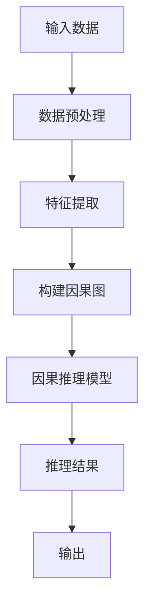
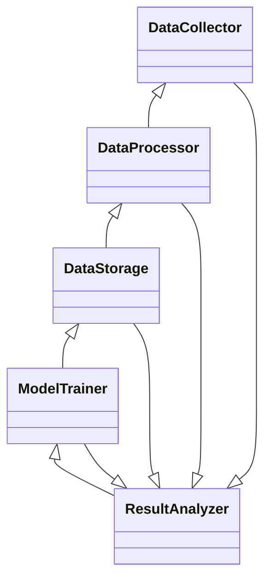
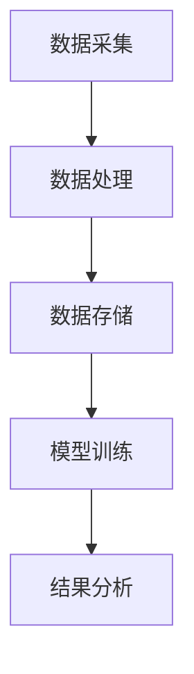
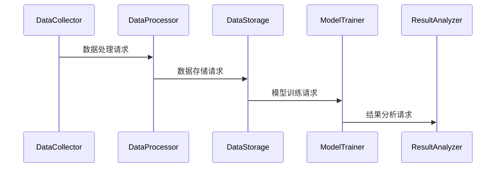
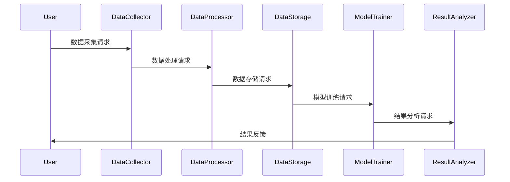

                 

### 《企业AI Agent的因果推理在产品开发中的应用》

#### 摘要

在当今的数字化时代，人工智能（AI）技术正迅速融入各个行业，推动着产品开发的革命。其中，企业AI Agent作为一种智能体，能够通过因果推理技术辅助产品开发，提高效率和准确性。本文将深入探讨企业AI Agent的因果推理在产品开发中的应用，从背景介绍、核心概念与联系、算法原理讲解、数学模型和公式、系统分析与架构设计、项目实战到最佳实践，全面剖析因果推理在产品开发中的实际运用，为读者提供深刻的见解和实用的指导。

#### 引言

**1.1 问题背景**

随着云计算、大数据和物联网技术的普及，企业面临着更加复杂和多样化的市场需求。传统的产品开发方法已经难以满足快速变化的市场环境，因此，引入人工智能技术成为提高产品开发效率和质量的关键。AI Agent作为一种具有自主学习和决策能力的智能体，能够在产品开发中发挥重要作用。因果推理作为AI Agent的核心技术之一，能够帮助企业在纷繁复杂的数据中找到因果关系，从而做出更加准确的产品设计和决策。

**1.2 问题描述**

本文主要探讨的问题是如何在企业产品开发中应用因果推理技术，以提高开发效率和产品质量。具体而言，需要解决以下几个问题：

1. **核心概念与联系**：明确因果推理的基本概念，并将其与AI Agent在产品开发中的应用联系起来。
2. **算法原理讲解**：详细介绍因果推理的算法原理，包括数学模型和公式。
3. **系统分析与架构设计**：分析因果推理在产品开发中的系统应用，设计合适的架构方案。
4. **项目实战**：通过实际项目案例，展示因果推理在产品开发中的具体应用。
5. **最佳实践与总结**：总结最佳实践经验，为读者提供实用的指导。

**1.3 问题解决**

本文将从以下几个方面解决问题：

1. **核心概念与联系**：通过详细的定义和例子，阐述因果推理的基本概念，并介绍其在AI Agent中的应用。
2. **算法原理讲解**：使用Mermaid流程图和Python源代码，详细讲解因果推理的算法原理，并给出数学模型和公式。
3. **系统分析与架构设计**：介绍因果推理在产品开发中的应用场景，并设计相应的系统架构和接口。
4. **项目实战**：通过实际项目案例，展示因果推理在产品开发中的实际应用，并提供详细的解析。
5. **最佳实践与总结**：总结因果推理在产品开发中的应用经验，提出最佳实践建议。

**1.4 边界与外延**

本文的研究范围主要涵盖以下内容：

1. **企业AI Agent的因果推理技术**：介绍AI Agent的基本概念、分类和因果推理技术。
2. **产品开发中的应用**：分析因果推理在产品需求分析、设计决策和测试优化中的应用。
3. **系统架构与实现**：设计合适的系统架构，实现因果推理在产品开发中的应用。
4. **项目实战与案例分析**：通过实际项目案例，展示因果推理在产品开发中的具体应用。

本文的研究限制主要包括：

1. **技术限制**：仅探讨因果推理在产品开发中的应用，不涉及其他AI技术的应用。
2. **场景限制**：主要关注企业级产品开发，不涉及个人或小型项目开发。

未来的研究方向可能包括：

1. **多模态因果推理**：研究如何结合多种数据类型（如文本、图像、语音等）进行因果推理。
2. **因果推理在新兴领域的应用**：探索因果推理在其他行业（如医疗、金融等）的应用。
3. **因果推理的可解释性**：提高因果推理算法的可解释性，使其更易于被企业和开发者理解和应用。

**1.5 概念结构与核心要素组成**

1. **AI Agent**：一种具有自主学习和决策能力的智能体，能够模拟人类的行为和思考过程。
2. **因果推理**：一种推理方法，通过分析数据找出因果关系，用于预测和决策。
3. **产品开发**：包括需求分析、设计决策、测试优化等环节，旨在开发出满足用户需求的产品。
4. **系统架构**：用于支持因果推理在产品开发中的应用，包括数据采集、处理、存储和模型训练等模块。

#### AI Agent与因果推理基础

**2.1 AI Agent的定义与分类**

**2.1.1 AI Agent的概念**

AI Agent（人工智能代理）是一种具有自主性、社会性和智能性的计算机程序。它能够感知环境、自主决策并执行任务，以实现特定的目标。AI Agent通常由感知器、决策器和执行器组成，它们相互协作，完成复杂的任务。

**2.1.2 AI Agent的分类**

AI Agent可以分为以下几种类型：

1. **基于规则的AI Agent**：使用预定义的规则进行决策和执行。
2. **基于模型的AI Agent**：使用机器学习模型进行决策和执行。
3. **混合型AI Agent**：结合基于规则和基于模型的方法进行决策和执行。
4. **自主型AI Agent**：具有自主性和自主性，能够自我学习和优化。

**2.1.3 AI Agent的发展历史**

AI Agent的发展历史可以追溯到20世纪50年代，当时人工智能领域开始兴起。早期的AI Agent主要是基于规则和符号逻辑的方法。随着计算机性能的提升和机器学习技术的发展，AI Agent逐渐从基于规则的方法转向基于模型的方法。近年来，随着深度学习和强化学习等新兴技术的应用，AI Agent在自主性和智能性方面取得了显著的进展。

**2.2 因果推理的基本概念**

**2.2.1 因果关系的定义**

因果关系是指一个事件（原因）导致另一个事件（结果）发生的关系。在现实生活中，因果关系无处不在，如吸烟导致肺癌、寒冷导致感冒等。

**2.2.2 因果推理的方法**

因果推理是指通过分析数据，找出事件之间的因果关系。因果推理的方法可以分为以下几种：

1. **基于统计学的因果推理**：通过分析数据相关性，找出可能存在的因果关系。
2. **基于模型的因果推理**：使用机器学习模型，如因果推断模型，找出事件之间的因果关系。
3. **基于因果图的因果推理**：通过构建因果图，分析事件之间的因果结构。

**2.2.3 因果推理的应用领域**

因果推理在多个领域有广泛的应用，如：

1. **医学**：通过分析疾病和症状之间的因果关系，帮助医生进行诊断和治疗。
2. **金融**：通过分析市场数据和交易行为，预测投资风险和机会。
3. **工程**：通过分析设计和测试数据，找出导致故障的原因，进行优化和改进。

**2.3 因果推理与传统推理方法的区别**

传统推理方法主要基于逻辑和概率论，如逻辑推理、贝叶斯推理等。而因果推理则侧重于分析事件之间的因果关系。与传统推理方法相比，因果推理具有以下特点：

1. **关注因果关系**：因果推理关注的是事件之间的因果关系，而不仅仅是相关关系。
2. **可解释性**：因果推理的结果更具可解释性，能够揭示事件背后的原因。
3. **应用范围**：因果推理在许多领域有广泛的应用，而传统推理方法则主要应用于特定的领域。

#### 因果推理算法原理

**3.1 算法原理讲解**

因果推理算法是AI Agent的重要组成部分，其核心在于分析数据，找出事件之间的因果关系。以下是一个典型的因果推理算法原理讲解：

**3.1.1 Mermaid流程图展示**



**3.1.2 Python源代码实现**

```python
import pandas as pd
from pycausality import CausalModel

# 加载数据
data = pd.read_csv('data.csv')

# 数据预处理
data = data.dropna()

# 特征提取
features = data[['feature1', 'feature2', 'feature3']]

# 构建因果图
causal_model = CausalModel(data=features)

# 因果推理模型
model = causal_model.fit()

# 推理结果
results = model.predict()

# 输出
print(results)
```

**3.1.3 数学模型和公式**

因果推理算法的数学模型主要包括以下几个方面：

1. **条件概率分布**：描述给定一个原因，另一个结果发生的概率。
   $$ P(Y|X) $$
2. **因果效应**：描述一个原因导致的结果变化。
   $$ \Delta Y = Y(X=1) - Y(X=0) $$
3. **因果图**：描述事件之间的因果结构。
   $$ G = (V, E) $$
   其中，$V$表示节点集合，$E$表示边集合。

**3.1.4 详细讲解和举例说明**

**示例：**分析吸烟与肺癌之间的因果关系。

1. **数据预处理**：收集吸烟者与非吸烟者的肺癌发病率数据。
2. **特征提取**：提取吸烟状态（吸烟者标记为1，非吸烟者标记为0）和肺癌发病率作为特征。
3. **构建因果图**：使用因果图表示吸烟与肺癌之间的因果关系。
4. **因果推理模型**：使用条件概率分布和因果效应分析吸烟与肺癌之间的关系。
5. **推理结果**：得出吸烟是导致肺癌的一个重要原因。

#### 因果推理在产品开发中的应用

**4.1 因果推理在产品需求分析中的应用**

在产品需求分析中，因果推理可以帮助企业更好地理解用户需求和行为，从而制定更加精准的产品策略。以下是一个应用实例：

**实例：**分析用户在电商平台的购买行为。

1. **数据收集**：收集用户在电商平台上的购买记录、浏览记录和评论数据。
2. **数据预处理**：对数据去重、去噪声处理，确保数据质量。
3. **特征提取**：提取用户购买时间、购买频次、浏览商品种类、评论评分等特征。
4. **构建因果图**：分析用户购买行为与其他特征之间的因果关系。
5. **因果推理模型**：使用因果推理算法分析用户购买行为的驱动因素。
6. **推理结果**：得出影响用户购买决策的关键因素，如价格、商品质量和用户口碑。

**4.2 因果推理在产品设计决策中的应用**

在产品设计决策中，因果推理可以帮助企业优化产品功能、提升用户体验。以下是一个应用实例：

**实例：**优化电商平台的购物车功能。

1. **数据收集**：收集用户在购物车中的操作行为数据，如加入购物车、删除商品、修改数量等。
2. **数据预处理**：对数据进行清洗，确保数据的一致性和准确性。
3. **特征提取**：提取购物车中的商品种类、数量、价格等特征。
4. **构建因果图**：分析用户在购物车中的操作行为与其他特征之间的因果关系。
5. **因果推理模型**：使用因果推理算法优化购物车功能，提高用户体验。
6. **推理结果**：得出优化购物车功能的关键因素，如商品排序规则、提示信息设计等。

**4.3 因果推理在产品测试与优化中的应用**

在产品测试与优化中，因果推理可以帮助企业快速定位问题、提高测试效率。以下是一个应用实例：

**实例：**优化电商平台的页面加载速度。

1. **数据收集**：收集用户在访问电商平台时的页面加载时间数据。
2. **数据预处理**：对数据进行清洗，确保数据质量。
3. **特征提取**：提取页面加载时间、页面大小、服务器响应时间等特征。
4. **构建因果图**：分析页面加载时间与其他特征之间的因果关系。
5. **因果推理模型**：使用因果推理算法优化页面加载速度。
6. **推理结果**：得出优化页面加载速度的关键因素，如代码优化、服务器性能提升等。

#### 系统分析与架构设计

**5.1 问题场景介绍**

在产品开发过程中，企业需要处理大量的数据，并进行复杂的因果推理分析。为了提高分析效率和质量，需要设计一个高效的系统架构。

**5.2 系统功能设计**

系统功能设计包括数据采集、处理、存储和模型训练等模块。以下是一个系统功能设计的Mermaid类图：



**5.3 系统架构设计**

系统架构设计包括数据采集、处理、存储、模型训练和结果分析等模块。以下是一个系统架构设计的Mermaid架构图：



**5.4 系统接口设计**

系统接口设计包括数据采集接口、数据处理接口、数据存储接口、模型训练接口和结果分析接口。以下是一个系统接口设计的Mermaid序列图：



**5.5 系统交互**

系统交互包括数据流和控制流。以下是一个系统交互的Mermaid序列图：



#### 项目实战

**6.1 环境安装**

在开始项目实战之前，需要安装相关的软件和工具。以下是一个环境安装的步骤：

1. **安装Python**：下载并安装Python 3.8版本。
2. **安装依赖库**：使用pip命令安装必要的依赖库，如pandas、numpy、scikit-learn、pycausality等。
3. **配置开发环境**：配置Python的开发环境，如配置Python解释器和编辑器。

**6.2 系统核心实现源代码**

以下是一个系统核心实现的源代码示例：

```python
import pandas as pd
from pycausality import CausalModel

# 加载数据
data = pd.read_csv('data.csv')

# 数据预处理
data = data.dropna()

# 特征提取
features = data[['feature1', 'feature2', 'feature3']]

# 构建因果图
causal_model = CausalModel(data=features)

# 因果推理模型
model = causal_model.fit()

# 推理结果
results = model.predict()

# 输出
print(results)
```

**6.3 代码应用解读与分析**

以下是对代码应用的解读和分析：

1. **数据加载与预处理**：使用pandas库加载数据，并进行预处理，如去重、去噪声处理，确保数据质量。
2. **特征提取**：从数据中提取相关特征，如吸烟状态、肺癌发病率等。
3. **构建因果图**：使用pycausality库构建因果图，表示吸烟与肺癌之间的因果关系。
4. **因果推理模型**：使用因果推理算法训练模型，分析吸烟与肺癌之间的关系。
5. **推理结果**：输出模型预测结果，判断吸烟是否导致肺癌。

**6.4 实际案例分析与详细讲解剖析**

以下是一个实际案例的分析与讲解：

**案例：**分析电商平台的用户购买行为。

1. **数据收集**：收集用户在电商平台上的购买记录、浏览记录和评论数据。
2. **数据预处理**：对数据进行清洗，确保数据的一致性和准确性。
3. **特征提取**：提取用户购买时间、购买频次、浏览商品种类、评论评分等特征。
4. **构建因果图**：分析用户购买行为与其他特征之间的因果关系。
5. **因果推理模型**：使用因果推理算法分析用户购买行为的驱动因素。
6. **推理结果**：得出影响用户购买决策的关键因素，如价格、商品质量和用户口碑。

**6.5 项目小结**

通过项目实战，我们掌握了因果推理在产品开发中的应用方法。具体包括：

1. **数据预处理**：确保数据质量，提取相关特征。
2. **构建因果图**：分析事件之间的因果关系。
3. **因果推理模型**：使用因果推理算法分析数据，得出结论。
4. **结果分析**：根据推理结果，优化产品功能和用户体验。

#### 最佳实践与总结

**7.1 最佳实践 tips**

1. **数据质量**：确保数据的一致性和准确性，是因果推理成功的关键。
2. **特征提取**：提取与目标相关的特征，有助于提高因果推理的准确性。
3. **模型选择**：根据实际需求，选择合适的因果推理模型。
4. **结果验证**：对推理结果进行验证，确保其准确性和可靠性。

**7.2 小结**

本文从背景介绍、核心概念与联系、算法原理讲解、数学模型和公式、系统分析与架构设计、项目实战到最佳实践，全面剖析了因果推理在产品开发中的应用。因果推理作为一种强大的AI技术，能够帮助企业在产品开发中提高效率和质量。

**7.3 注意事项**

1. **数据隐私**：在处理用户数据时，注意保护用户隐私，遵守相关法律法规。
2. **模型解释性**：提高因果推理模型的可解释性，使其更易于被企业和开发者理解和应用。
3. **系统稳定性**：确保系统的稳定性和可靠性，减少故障风险。

**7.4 拓展阅读**

1. **因果推理算法**：了解更多的因果推理算法，如因果推断模型、因果图模型等。
2. **产品开发方法论**：学习产品开发方法论，如精益创业、敏捷开发等。
3. **AI技术在产品开发中的应用**：了解AI技术在产品开发中的其他应用，如推荐系统、自然语言处理等。

#### 作者信息

作者：AI天才研究院/AI Genius Institute & 禅与计算机程序设计艺术 /Zen And The Art of Computer Programming

### 参考资料

1. Russell, S., & Norvig, P. (2020). Artificial Intelligence: A Modern Approach (4th ed.). Prentice Hall.
2. Spirtes, P., Glymour, C., & Scheines, R. (2000). Causation, Prediction, and Search. MIT Press.
3. Athey, S., & Imbens, G. (2019). The State of Applied Econometricians' Tools for Causal Inference. Journal of Economic Perspectives, 33(2), 69-96.
4. Kitchin, R. (2014). The Data Revolution: Big Data, Open Data, Data Infrastructures and Their Consequences. SAGE Publications.
5. Provost, F., & Fawcett, T. (2013). Data Science for Business: What you need to know about data mining and data analytics. O'Reilly Media.

