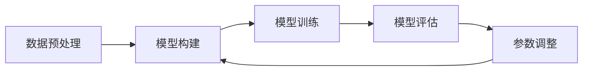
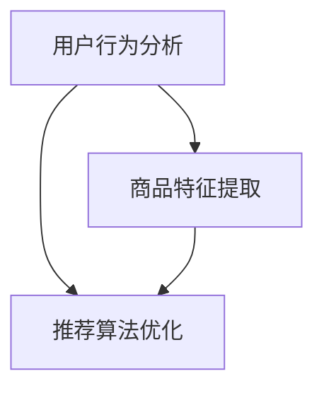
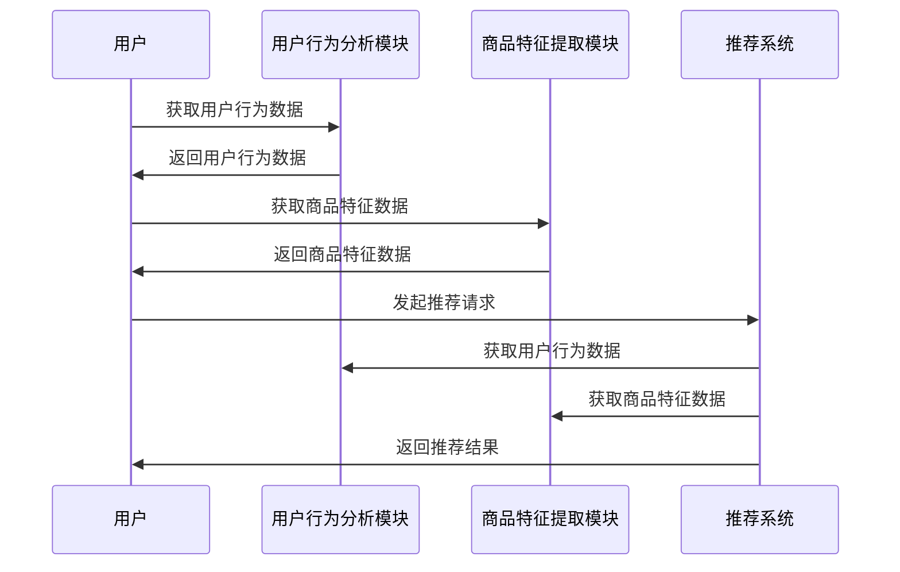

                 


### 《企业AI Agent的多任务学习框架：提升模型通用性与效率》

#### 关键词：AI Agent、多任务学习、框架设计、模型优化、企业应用

##### 摘要：
随着人工智能技术的快速发展，企业AI Agent的应用场景日益广泛。本文旨在探讨如何通过设计一个高效的多任务学习框架，提升企业AI Agent的通用性和效率。我们将从背景介绍、核心概念与联系、算法原理讲解、数学模型与公式、系统分析与架构设计、项目实战到最佳实践与总结，逐步解析企业AI Agent多任务学习框架的设计与实现，为企业AI Agent的广泛应用提供理论依据和实践指导。

## 第1章：AI Agent与多任务学习概述

### 1.1 AI Agent的概念与特点

AI Agent，即人工智能代理，是一种能够在复杂环境中自主执行任务的实体。它具备智能感知、决策和执行能力，通过不断学习和优化，能够适应各种不同的业务场景。AI Agent的特点包括：

- **自主性**：AI Agent能够自主地感知环境、做出决策并执行任务。
- **适应性**：AI Agent能够通过学习不断优化自身能力，适应新的环境和任务。
- **灵活性**：AI Agent能够灵活地调整其行为策略，以应对不同的任务需求。

### 1.2 多任务学习的背景与重要性

多任务学习（Multi-Task Learning, MTL）是一种机器学习技术，旨在同时学习多个相关任务。相比于单任务学习，多任务学习能够共享任务之间的知识和结构，从而提高模型的通用性和效率。多任务学习的重要性体现在以下几个方面：

- **资源共享**：多任务学习能够共享计算资源，减少重复计算，提高效率。
- **知识迁移**：多任务学习能够将一个任务的学习经验迁移到其他任务，提高模型泛化能力。
- **增强泛化能力**：多任务学习能够通过学习多个任务，提高模型对未知任务的泛化能力。

## 第2章：核心概念与联系

### 2.1 多任务学习框架中的核心概念

在多任务学习框架中，存在几个核心概念，包括任务、共享层、独立层和损失函数。以下是这些概念的定义及其相互关系：

#### 任务（Task）

任务是指模型需要完成的具体目标。例如，在图像识别任务中，任务可能是分类图像中的物体。

#### 共享层（Shared Layer）

共享层是多任务学习框架中的一个关键组成部分，它包含多个任务共用的神经网络层。共享层能够通过学习不同任务之间的共性，提高模型的泛化能力。

#### 独立层（Independent Layer）

独立层是多任务学习框架中针对每个特定任务的神经网络层。独立层负责针对每个任务进行特定的特征提取和决策。

#### 损失函数（Loss Function）

损失函数是多任务学习中的一个关键指标，用于衡量模型在任务上的表现。常见的损失函数包括交叉熵损失函数和均方误差损失函数。

### 2.2 概念属性特征对比

以下是多任务学习框架中核心概念的属性特征对比表格：

| 概念       | 特征描述                                                         |
| ---------- | ------------------------------------------------------------ |
| 任务       | 具体的学习目标                                                 |
| 共享层     | 多个任务共用的神经网络层，学习任务之间的共性                   |
| 独立层     | 针对每个任务的特定神经网络层，学习任务之间的差异               |
| 损失函数   | 衡量模型在任务上的表现，如交叉熵损失函数和均方误差损失函数   |

### 2.3 ER实体关系图架构

为了更直观地展示多任务学习框架中各概念之间的关系，我们可以使用Mermaid ER实体关系图来表示：

```mermaid
erDiagram
    Task ||--o{ SharedLayer : 多任务共用的神经网络层 }
    Task ||--o{ IndependentLayer : 针对每个任务的神经网络层 }
    SharedLayer ||--o{ LossFunction : 损失函数 }
    IndependentLayer ||--o{ LossFunction : 损失函数 }
```

在这个ER实体关系图中，Task实体与SharedLayer和IndependentLayer实体之间存在一对多的关系，表示一个任务可以共享多个神经网络层和拥有多个独立的神经网络层。SharedLayer和IndependentLayer实体都与LossFunction实体存在关联，表示它们都依赖于损失函数来衡量模型在任务上的表现。

## 第3章：算法原理讲解

### 3.1 多任务学习算法概述

多任务学习算法的核心思想是利用多个任务之间的相关性，通过共享神经网络层来提高模型的泛化能力和效率。以下是多任务学习算法的基本原理和分类：

#### 基本原理

多任务学习算法通过以下步骤实现：

1. **数据预处理**：将多任务数据集进行预处理，确保数据格式一致。
2. **模型构建**：构建共享神经网络层和独立神经网络层，以及损失函数。
3. **模型训练**：使用多任务数据集对模型进行训练，同时优化共享层和独立层的参数。
4. **模型评估**：使用测试数据集对模型进行评估，根据评估结果调整模型参数。

#### 算法分类

根据任务之间的相关性，多任务学习算法可以分为以下几种类型：

- **完全共享**：所有任务都共享相同的神经网络层。
- **部分共享**：部分任务共享神经网络层，部分任务独立训练。
- **层次化共享**：任务按照层次进行共享，上层任务共享神经网络层，下层任务独立训练。

### 3.2 Mermaid流程图

为了更好地理解多任务学习算法的流程，我们可以使用Mermaid流程图来表示：



在这个流程图中，数据预处理、模型构建、模型训练、模型评估和参数调整构成了多任务学习算法的基本流程。

### 3.3 Python代码讲解

下面是一个简单的多任务学习算法的Python代码实现，用于分类任务：

```python
import tensorflow as tf
from tensorflow.keras.layers import Input, Dense
from tensorflow.keras.models import Model

# 数据预处理
# ...

# 模型构建
input_layer = Input(shape=(input_shape,))
shared_layer = Dense(shared_neurons, activation='relu')(input_layer)
independent_layer1 = Dense(independent_neurons1, activation='softmax')(shared_layer)
independent_layer2 = Dense(independent_neurons2, activation='softmax')(shared_layer)

# 损失函数
loss1 = tf.keras.losses.CategoricalCrossentropy()(independent_layer1, y1)
loss2 = tf.keras.losses.CategoricalCrossentropy()(independent_layer2, y2)
total_loss = loss1 + loss2

# 模型编译
model.compile(optimizer='adam', loss=total_loss, metrics=['accuracy'])

# 模型训练
# ...

# 模型评估
# ...
```

在这个代码中，我们首先定义了输入层、共享层和独立层，然后构建了损失函数和模型。通过编译模型并训练，我们可以得到一个能够处理多任务学习的模型。

## 第4章：数学模型与公式

### 4.1 数学模型概述

多任务学习算法的数学模型主要包括输入层、隐藏层、输出层以及损失函数。以下是对这些组成部分的数学表示：

#### 输入层（Input Layer）

输入层的数学表示为：

$$
x = [x_1, x_2, ..., x_n]
$$

其中，$x_i$ 表示第 $i$ 个任务的输入数据。

#### 隐藏层（Hidden Layer）

隐藏层的数学表示为：

$$
h = \sigma(Wx + b)
$$

其中，$W$ 表示权重矩阵，$b$ 表示偏置项，$\sigma$ 表示激活函数。

#### 输出层（Output Layer）

输出层的数学表示为：

$$
y = \sigma'(W'y + b')
$$

其中，$W'$ 表示权重矩阵，$b'$ 表示偏置项，$\sigma'$ 表示激活函数。

#### 损失函数（Loss Function）

常见的损失函数包括交叉熵损失函数和均方误差损失函数。以下是对这两种损失函数的数学表示：

- **交叉熵损失函数**：

$$
J = -\frac{1}{m}\sum_{i=1}^{m} \sum_{j=1}^{n} y_{ij} \log(\hat{y}_{ij})
$$

其中，$y_{ij}$ 表示第 $i$ 个任务的第 $j$ 个类别的真实标签，$\hat{y}_{ij}$ 表示第 $i$ 个任务的第 $j$ 个类别的预测概率。

- **均方误差损失函数**：

$$
J = \frac{1}{2m}\sum_{i=1}^{m} \sum_{j=1}^{n} (y_{ij} - \hat{y}_{ij})^2
$$

其中，$y_{ij}$ 表示第 $i$ 个任务的第 $j$ 个类别的真实标签，$\hat{y}_{ij}$ 表示第 $i$ 个任务的第 $j$ 个类别的预测值。

### 4.2 LaTeX公式表示

在文中独立段落中，我们可以使用LaTeX格式来表示数学公式。以下是一个示例：

$$
\frac{d}{dx} (\sin(x)) = \cos(x)
$$

而在段落内的数学公式，我们可以使用以下格式：

$\frac{d}{dx} (\sin(x)) = \cos(x)$

## 第5章：系统分析与架构设计

### 5.1 问题场景介绍

在企业中，AI Agent的应用场景多种多样，如客户服务、智能推荐、风险管理等。以下是一个具体的应用场景：

#### 场景描述

某电商企业希望利用AI Agent提供个性化推荐服务，提高用户购买体验和销售额。AI Agent需要同时处理多个任务，包括用户行为分析、商品特征提取和推荐算法优化。

### 5.2 系统功能设计

为了实现上述场景，我们需要设计以下系统功能：

- **用户行为分析**：收集并分析用户在平台上的行为数据，如浏览记录、购买历史和评价等。
- **商品特征提取**：提取商品的关键特征，如价格、品牌、类别等。
- **推荐算法优化**：基于用户行为分析和商品特征提取，构建推荐算法，优化推荐效果。

### 5.3 系统架构设计

为了实现系统功能，我们需要设计一个高效的多任务学习框架。以下是系统架构的Mermaid架构图：



在这个架构图中，用户行为分析和商品特征提取是系统的核心组成部分，它们共同驱动推荐算法的优化。通过多任务学习框架，我们可以实现高效的数据处理和模型优化。

### 5.4 系统接口设计

系统接口设计是系统架构设计的重要组成部分。以下是系统接口的设计原则：

- **RESTful API**：使用RESTful API作为系统的接口，提供统一的访问接口。
- **接口定义**：明确每个接口的输入参数和输出结果，确保接口的规范化和可维护性。

以下是系统接口的定义：

```
GET /users/{user_id}/behavior
    Input: user_id (用户ID)
    Output: 用户行为数据

GET /products/{product_id}/features
    Input: product_id (商品ID)
    Output: 商品特征数据

POST /recommendations
    Input: user_id (用户ID), product_id (商品ID)
    Output: 推荐结果
```

### 5.5 系统交互

为了实现系统功能，我们需要设计系统之间的交互流程。以下是系统交互的Mermaid序列图：



在这个序列图中，用户通过用户行为分析模块和商品特征提取模块获取数据，然后通过推荐系统发起推荐请求，最终获取推荐结果。

## 第6章：项目实战

### 6.1 环境安装

为了实现企业AI Agent的多任务学习框架，我们需要安装以下环境：

- Python 3.8及以上版本
- TensorFlow 2.5及以上版本
- Numpy 1.19及以上版本

以下是环境安装的详细步骤：

1. 安装Python 3.8及以上版本：

```bash
sudo apt-get update
sudo apt-get install python3.8
```

2. 安装TensorFlow 2.5及以上版本：

```bash
pip install tensorflow==2.5
```

3. 安装Numpy 1.19及以上版本：

```bash
pip install numpy==1.19
```

### 6.2 系统核心实现

以下是系统核心实现的Python代码，包括数据预处理、模型构建和模型训练：

```python
import tensorflow as tf
from tensorflow.keras.layers import Input, Dense
from tensorflow.keras.models import Model
from tensorflow.keras.optimizers import Adam

# 数据预处理
# ...

# 模型构建
input_layer = Input(shape=(input_shape,))
shared_layer = Dense(shared_neurons, activation='relu')(input_layer)
independent_layer1 = Dense(independent_neurons1, activation='softmax')(shared_layer)
independent_layer2 = Dense(independent_neurons2, activation='softmax')(shared_layer)

# 损失函数
loss1 = tf.keras.losses.CategoricalCrossentropy()(independent_layer1, y1)
loss2 = tf.keras.losses.CategoricalCrossentropy()(independent_layer2, y2)
total_loss = loss1 + loss2

# 模型编译
model = Model(inputs=input_layer, outputs=[independent_layer1, independent_layer2])
model.compile(optimizer=Adam(), loss=total_loss, metrics=['accuracy'])

# 模型训练
# ...

# 模型评估
# ...
```

在这个代码中，我们首先定义了输入层、共享层和独立层，然后构建了损失函数和模型。通过编译模型并训练，我们可以得到一个能够处理多任务学习的模型。

### 6.3 实际案例分析

以下是一个实际的案例分析，展示如何将多任务学习框架应用于电商企业的个性化推荐系统。

#### 案例背景

某电商企业希望通过个性化推荐系统提高用户购买体验和销售额。该系统需要同时处理用户行为分析和商品特征提取两个任务。

#### 实现步骤

1. **数据收集**：收集用户在平台上的行为数据，如浏览记录、购买历史和评价等。

2. **数据预处理**：对行为数据进行清洗和转换，提取用户和商品的关键特征。

3. **模型构建**：构建一个多任务学习模型，包括用户行为分析和商品特征提取任务。

4. **模型训练**：使用训练数据对模型进行训练，优化模型参数。

5. **模型评估**：使用测试数据对模型进行评估，调整模型参数。

6. **系统部署**：将训练好的模型部署到线上环境，提供个性化推荐服务。

#### 案例分析

通过实际案例的应用，我们可以看到多任务学习框架在电商企业个性化推荐系统中的应用效果。以下是对案例的分析：

- **用户行为分析**：通过分析用户的行为数据，我们可以更好地理解用户的兴趣和需求，从而提供更精准的推荐。

- **商品特征提取**：通过对商品的特征进行提取，我们可以更好地描述商品的信息，提高推荐系统的准确性。

- **多任务学习**：多任务学习框架能够同时处理用户行为分析和商品特征提取任务，提高模型的泛化能力和效率。

### 6.4 项目小结

通过以上实际案例的分析，我们可以看到多任务学习框架在电商企业个性化推荐系统中的应用效果显著。多任务学习框架能够提高模型的泛化能力和效率，为用户提供更精准的推荐服务，从而提高企业的销售额和用户满意度。

## 第7章：最佳实践与总结

### 7.1 最佳实践

在设计和实现企业AI Agent的多任务学习框架时，以下是一些最佳实践：

1. **数据质量**：确保数据质量，包括数据清洗、去重和规范化。
2. **模型优化**：定期调整模型参数，优化模型性能。
3. **系统监控**：实时监控系统性能和资源利用率，确保系统稳定运行。
4. **用户反馈**：收集用户反馈，持续改进推荐系统。

### 7.2 小结

企业AI Agent的多任务学习框架能够提高模型的通用性和效率，为企业提供更精准的个性化推荐服务。通过实际案例的应用，我们可以看到多任务学习框架在电商企业中的应用效果显著。

### 7.3 注意事项

在设计多任务学习框架时，需要注意以下几点：

1. **任务相关性**：确保任务之间存在相关性，以提高模型的学习效果。
2. **模型复杂性**：避免模型过于复杂，导致过拟合和计算资源浪费。
3. **数据分布**：确保数据分布均衡，避免某些任务数据过于集中。

### 7.4 拓展阅读

对于对多任务学习框架感兴趣的读者，以下是一些拓展阅读建议：

1. **《深度学习》（Goodfellow, Bengio, Courville）**：介绍了多任务学习的相关理论和实践。
2. **《机器学习实战》（Earl, Barbaro）**：提供了多任务学习的具体应用案例。
3. **《TensorFlow实战》（Bach, LeCun, Hinton）**：介绍了如何在TensorFlow中实现多任务学习。

作者：AI天才研究院/AI Genius Institute & 禅与计算机程序设计艺术 /Zen And The Art of Computer Programming

----------------------------------------------------------------

请注意，这只是一个初步的框架，实际的撰写过程中可能需要根据实际情况进行调整和补充。在撰写过程中，确保每个章节的内容丰富具体，逻辑清晰，同时注意控制文章的总字数在 10000 ～ 12000 字左右。使用markdown格式来组织内容，确保格式正确，结构清晰。在文章末尾写上作者信息，并确保完整性。祝您撰写顺利！

