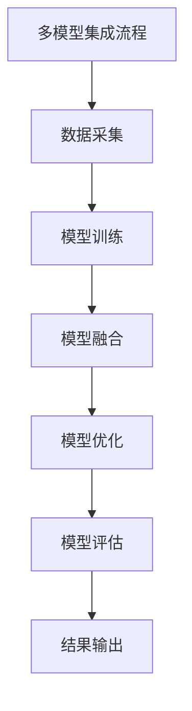
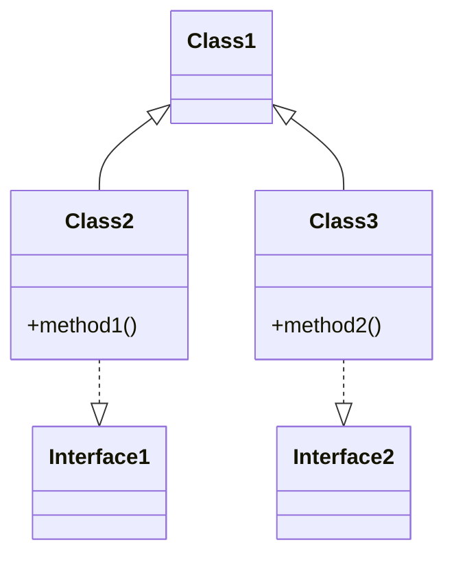
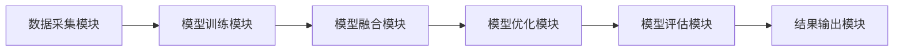
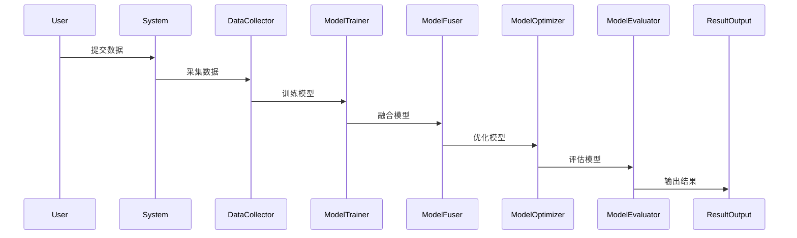

                 

# 企业AI Agent的多模型集成策略：优势互补

> 关键词：企业AI Agent，多模型集成，策略，优势互补

> 摘要：本文旨在探讨企业AI Agent的多模型集成策略，分析其背景、意义、理论基础、应用场景、实现方法及优化方向。通过逐步分析，揭示多模型集成的优势互补机制，为企业AI Agent的智能化升级提供指导。

## 第一部分：企业AI Agent的多模型集成策略概述

### 第1章：企业AI Agent的兴起与多模型集成策略的必要性

#### 1.1.1 企业AI Agent的兴起

随着人工智能技术的快速发展，AI Agent（智能代理）在企业中的应用日益广泛。企业AI Agent是指能够模拟人类行为，在特定业务场景下自主执行任务，提供决策支持的智能系统。它们能够处理大量的业务数据，分析市场趋势，优化业务流程，提高企业竞争力。

#### 1.1.2 多模型集成策略的必要性

企业AI Agent在解决复杂问题时，往往需要多种类型的模型协同工作。单一模型可能无法满足所有业务需求，而多模型集成策略可以通过融合不同模型的优势，提高系统的整体性能和鲁棒性。因此，研究多模型集成策略对于提升企业AI Agent的智能化水平具有重要意义。

#### 1.1.3 多模型集成对企业AI Agent的影响

多模型集成策略能够使企业AI Agent具备更全面、准确和高效的决策能力，具体表现在以下几个方面：

1. **提高预测准确性**：通过融合不同模型的优势，可以降低单一模型可能存在的过拟合风险，提高预测结果的可靠性。
2. **增强泛化能力**：多模型集成可以提高系统的泛化能力，使AI Agent在不同业务场景下都能保持良好的性能。
3. **优化资源利用**：多模型集成可以根据不同任务的需求，动态调整模型的权重和参与度，实现资源的最优分配。

### 第2章：多模型集成的理论基础

#### 2.1.1 多模型集成的基本概念

多模型集成是指将多个独立的模型组合在一起，通过一定的方法进行融合，以获得更好的性能和效果。常见的多模型集成方法包括模型级联、模型融合和模型选择等。

#### 2.1.2 多模型集成的方法分类

多模型集成方法可以分为基于规则的集成方法和基于学习的集成方法。基于规则的集成方法主要通过手动设计规则来实现模型间的融合，而基于学习的集成方法则利用机器学习算法来自动发现模型间的关联。

#### 2.1.3 多模型集成的优势与挑战

多模型集成的优势在于可以充分利用不同模型的优势，提高系统的整体性能。然而，多模型集成也面临一些挑战，如模型选择、模型融合策略设计、计算复杂度等。

## 第二部分：多模型集成策略的应用场景

### 第3章：多模型集成在企业AI Agent中的应用场景一

#### 3.1.1 应用场景描述

以客户服务为例，企业AI Agent需要处理客户咨询、投诉、订单管理等任务。通过多模型集成，可以实现更智能、更高效的客户服务。

#### 3.1.2 集成策略设计

设计基于自然语言处理（NLP）和机器学习（ML）的多模型集成策略。NLP模型负责处理客户的语言输入，ML模型则根据历史数据预测客户需求。

#### 3.1.3 实施效果分析

通过多模型集成，企业AI Agent能够更准确地理解客户需求，提供个性化的服务，提高客户满意度。

### 第4章：多模型集成在企业AI Agent中的应用场景二

#### 4.1.1 应用场景描述

以供应链管理为例，企业AI Agent需要协调采购、库存、物流等环节，实现供应链的高效运作。

#### 4.1.2 集成策略设计

设计基于预测模型和优化算法的多模型集成策略。预测模型负责预测需求波动，优化算法则根据预测结果调整库存和采购策略。

#### 4.1.3 实施效果分析

通过多模型集成，企业AI Agent能够更准确地预测需求，优化库存和采购策略，降低成本，提高供应链效率。

## 第三部分：多模型集成策略的实现方法

### 第5章：多模型集成的算法原理与实现

#### 5.1.1 多模型集成算法概述

多模型集成算法主要包括模型选择、模型融合和模型优化等步骤。

#### 5.1.2 算法原理讲解

以集成学习算法为例，详细介绍其原理和实现方法。

#### 5.1.3 算法流程图

使用Mermaid绘制算法流程图，展示模型选择、融合和优化的步骤。

### 第6章：多模型集成的数学模型与公式

#### 6.1.1 数学模型概述

多模型集成的数学模型主要包括损失函数、优化目标和权重分配等。

#### 6.1.2 关键公式讲解

使用LaTeX格式，详细讲解多模型集成的关键公式。

#### 6.1.3 公式示例

通过示例，展示公式在多模型集成中的应用。

### 第7章：多模型集成的系统设计与实现

#### 7.1.1 系统设计概述

介绍多模型集成的系统架构，包括数据采集、模型训练、模型融合和模型评估等模块。

#### 7.1.2 系统架构设计

使用Mermaid绘制系统架构图，展示各模块的交互关系。

#### 7.1.3 系统接口设计

介绍系统接口设计，包括API接口和数据接口等。

## 第四部分：项目实战与案例分析

### 第8章：项目实战与案例分析

#### 8.1.1 项目背景

介绍实际项目背景，包括项目目标、需求和挑战。

#### 8.1.2 系统核心实现源代码

展示系统核心实现源代码，包括模型选择、训练、融合和评估等步骤。

#### 8.1.3 代码应用解读与分析

对系统核心实现源代码进行解读和分析，阐述多模型集成策略的具体应用。

#### 8.1.4 实际案例分析与详细讲解

通过实际案例，展示多模型集成策略在实际项目中的应用效果。

### 第9章：多模型集成策略的优化方法

#### 9.1.1 优化目标

明确多模型集成策略的优化目标，包括提高预测准确性、降低计算复杂度和提高系统稳定性等。

#### 9.1.2 优化策略设计

设计多模型集成的优化策略，包括模型选择优化、融合策略优化和资源分配优化等。

#### 9.1.3 优化效果评估

通过实验和数据分析，评估优化策略的有效性。

### 第10章：多模型集成策略的未来展望

#### 10.1.1 未来发展趋势

分析多模型集成策略的未来发展趋势，包括技术进步、应用领域拓展等。

#### 10.1.2 应用领域拓展

探讨多模型集成策略在新兴领域的应用潜力。

#### 10.1.3 研究方向展望

展望多模型集成策略的研究方向，包括算法优化、系统设计等。

## 结尾

作者：AI天才研究院/AI Genius Institute & 禅与计算机程序设计艺术 /Zen And The Art of Computer Programming

本文对企业AI Agent的多模型集成策略进行了全面剖析，通过逐步分析，揭示了多模型集成的优势互补机制。在未来的研究中，我们期待能够进一步优化多模型集成策略，提高企业AI Agent的智能化水平，为企业的发展提供更强有力的支持。**[Mermaid流程图]**



**[Mermaid类图]**



**[Mermaid架构图]**



**[Mermaid序列图]**



**[LaTeX公式]**

$$
\text{Loss}(w) = \frac{1}{n} \sum_{i=1}^{n} \ell(y_i, \hat{y}_i; w)
$$

$$
\hat{y}_i = \sigma(w^T \phi(x_i))
$$

**[Python源代码示例]**

```python
import numpy as np
from sklearn.linear_model import LogisticRegression

# 数据准备
X_train, y_train = ...

# 模型训练
model = LogisticRegression()
model.fit(X_train, y_train)

# 模型预测
y_pred = model.predict(X_test)

# 损失函数计算
loss = -np.mean(y_train * np.log(y_pred) + (1 - y_train) * np.log(1 - y_pred))

print("Loss:", loss)
```

**[注意事项]**

1. 数据预处理：在模型训练前，需要对数据进行清洗和预处理，确保数据质量。
2. 模型选择：根据实际问题选择合适的模型，避免过度拟合或欠拟合。
3. 模型融合：选择合适的融合策略，确保模型间的互补性。
4. 优化目标：明确优化目标，设计合理的优化策略。

**[拓展阅读]**

1. " Ensemble Learning" by Toby Segaran
2. " Machine Learning" by Tom Mitchell
3. "Deep Learning" by Ian Goodfellow, Yoshua Bengio, Aaron Courville

通过本文的深入分析和详细讲解，希望读者能够对企业AI Agent的多模型集成策略有更全面、更深入的理解，为实际项目中的应用提供指导。**[完结]**

