                 

### 文章标题：企业AI Agent的多渠道集成：统一客户服务体验

关键词：企业AI、多渠道集成、客户服务、用户体验、技术实现

摘要：本文将探讨企业AI Agent的多渠道集成，以实现统一客户服务体验。通过分析企业AI的发展现状与多渠道集成的重要性，本文将详细介绍企业AI的多渠道集成策略、框架与关键技术，并探讨主流多渠道集成技术。此外，通过具体案例，本文将展示如何实现企业AI多渠道集成，并提供最佳实践与未来趋势分析。

## 目录大纲

----------------------------------------------------------------

# 第一部分：企业AI与多渠道集成概述

## 第1章：企业AI与多渠道集成的背景与意义

### 1.1 问题背景

#### 1.1.1 企业AI的发展现状

#### 1.1.2 多渠道集成的重要性

#### 1.1.3 企业AI与多渠道集成的必要性

### 1.2 问题描述

#### 1.2.1 集成挑战

#### 1.2.2 集成目标

### 1.3 问题解决

#### 1.3.1 企业AI的多渠道集成策略

#### 1.3.2 集成框架与关键技术

### 1.4 边界与外延

#### 1.4.1 多渠道集成的范畴

#### 1.4.2 企业AI的多渠道应用场景

### 1.5 概念结构与核心要素组成

#### 1.5.1 企业AI的核心概念

#### 1.5.2 多渠道集成的核心要素

## 第2章：企业AI的多渠道集成框架

### 2.1 企业AI的多渠道集成模型

#### 2.1.1 模型架构

#### 2.1.2 模型特点

#### 2.1.3 模型应用场景

### 2.2 多渠道数据采集与处理

#### 2.2.1 数据采集

#### 2.2.2 数据处理

#### 2.2.3 数据质量保障

### 2.3 多渠道交互设计与实现

#### 2.3.1 交互设计原则

#### 2.3.2 交互实现策略

### 2.4 多渠道集成安全性保障

#### 2.4.1 安全性问题分析

#### 2.4.2 安全保障措施

## 第3章：主流多渠道集成技术

### 3.1 API集成技术

#### 3.1.1 RESTful API集成

#### 3.1.2 GraphQL集成

### 3.2 数据库集成技术

#### 3.2.1 关系型数据库集成

#### 3.2.2 NoSQL数据库集成

### 3.3 流处理技术

#### 3.3.1 Apache Kafka

#### 3.3.2 Apache Flink

## 第4章：企业AI多渠道集成应用案例

### 4.1 案例背景

#### 4.1.1 企业背景

#### 4.1.2 案例目标

### 4.2 案例实现

#### 4.2.1 集成框架设计

#### 4.2.2 数据采集与处理

#### 4.2.3 多渠道交互设计与实现

#### 4.2.4 集成效果评估

### 4.3 案例分析

#### 4.3.1 案例优点

#### 4.3.2 案例挑战与解决方案

## 第5章：企业AI多渠道集成最佳实践

### 5.1 最佳实践一：统一客户服务体验

#### 5.1.1 实践背景

#### 5.1.2 实践步骤

#### 5.1.3 实践效果

### 5.2 最佳实践二：智能客服系统

#### 5.2.1 实践背景

#### 5.2.2 实践步骤

#### 5.2.3 实践效果

## 第6章：企业AI多渠道集成的挑战与未来趋势

### 6.1 集成挑战

#### 6.1.1 技术挑战

#### 6.1.2 运营挑战

### 6.2 未来趋势

#### 6.2.1 技术发展趋势

#### 6.2.2 应用发展趋势

## 第7章：企业AI多渠道集成的发展与前景

### 7.1 企业AI多渠道集成的发展历程

### 7.2 企业AI多渠道集成的发展现状

### 7.3 企业AI多渠道集成的未来前景

---------------------------------------------------------------- 

### 第一部分：企业AI与多渠道集成概述

#### 第1章：企业AI与多渠道集成的背景与意义

##### 1.1 问题背景

随着人工智能技术的快速发展，企业AI（人工智能代理）逐渐成为企业提升效率、优化服务的关键驱动力。企业AI通过自然语言处理、机器学习等技术，能够智能地处理大量数据，为企业提供智能决策支持。然而，在当前的企业环境中，客户服务渠道繁多，包括电话、邮件、社交媒体、在线聊天等多种渠道。这些渠道的信息往往分散在不同的系统中，导致客户体验不一致，甚至影响企业的服务质量和客户满意度。

##### 1.1.1 企业AI的发展现状

企业AI技术已经广泛应用于各个行业，如金融、零售、医疗等。通过语音识别、文本分析、图像识别等技术，企业AI能够提供24/7的智能客服，自动处理大量客户请求，减少人力成本，提高工作效率。然而，由于企业AI系统通常独立运行，难以与其他渠道系统进行有效集成，导致客户在切换不同渠道时，可能面临重复输入信息、服务不一致等问题。

##### 1.1.2 多渠道集成的重要性

多渠道集成对于企业AI的发展具有重要意义。首先，多渠道集成能够实现客户服务的无缝衔接，提升客户体验。其次，多渠道集成有助于企业获取更全面、准确的数据，从而进行更有效的客户分析和决策。此外，多渠道集成还能够提高企业的运营效率，降低成本，提升竞争力。

##### 1.1.3 企业AI与多渠道集成的必要性

企业AI与多渠道集成的必要性体现在以下几个方面：

1. **提升客户服务质量**：通过多渠道集成，企业可以提供一致的客户服务体验，满足客户在不同渠道的个性化需求。
2. **提高数据利用率**：多渠道集成能够整合不同渠道的数据，实现数据的互通共享，为企业提供更全面的客户视图。
3. **降低运营成本**：多渠道集成有助于减少重复劳动，提高工作效率，降低运营成本。
4. **增强企业竞争力**：通过多渠道集成，企业能够快速响应市场变化，提高市场竞争力。

##### 1.2 问题描述

企业AI与多渠道集成的挑战主要包括：

1. **数据分散**：不同渠道的数据分散在不同的系统中，难以统一管理和分析。
2. **接口复杂**：多渠道集成涉及多种接口技术，如API、Webhook等，接口设计和实现复杂。
3. **系统兼容性**：不同系统之间的兼容性问题，可能导致集成过程中出现数据丢失、错误等问题。
4. **安全性**：多渠道集成需要考虑数据安全和隐私保护，防止数据泄露和滥用。

##### 1.2.1 集成挑战

1. **技术挑战**：多渠道集成涉及多种技术，如API集成、数据库集成、流处理等，技术实现复杂。
2. **业务挑战**：不同渠道的业务逻辑和流程可能不一致，集成过程中需要充分考虑业务需求。
3. **组织挑战**：多渠道集成需要跨部门合作，协调不同部门的利益和需求。

##### 1.2.2 集成目标

企业AI与多渠道集成的目标主要包括：

1. **统一数据视图**：通过多渠道集成，实现不同渠道数据的统一管理和分析。
2. **提升用户体验**：提供一致的客户服务体验，满足客户在不同渠道的个性化需求。
3. **提高运营效率**：通过自动化流程和智能决策，提高企业运营效率。
4. **降低成本**：通过减少重复劳动和优化资源利用，降低企业运营成本。

##### 1.3 问题解决

为了解决企业AI与多渠道集成中的挑战，需要采取以下策略：

1. **制定集成策略**：明确集成目标、范围和技术方案，制定详细的集成计划和实施步骤。
2. **设计集成框架**：构建统一的集成框架，包括数据采集、处理、存储和交互等模块，实现多渠道数据的整合和共享。
3. **选择合适的技术**：根据业务需求和技术特点，选择合适的集成技术，如API集成、数据库集成、流处理等。
4. **保障安全性**：加强数据安全和隐私保护，采取加密、权限控制等技术措施，确保集成系统的安全性。

##### 1.4 边界与外延

1. **多渠道集成的范畴**：多渠道集成涉及电话、邮件、社交媒体、在线聊天等多种渠道，还包括内部系统之间的数据交换和业务协同。
2. **企业AI的多渠道应用场景**：企业AI的多渠道应用场景包括智能客服、订单管理、销售预测、客户分析等。
3. **概念结构与核心要素组成**

**核心概念：**

- 企业AI：指利用人工智能技术，为企业提供智能决策支持和服务优化的系统。
- 多渠道集成：指将企业内部的不同渠道系统进行整合，实现数据的互通共享和业务的协同。

**核心要素组成：**

- 数据采集：从不同渠道收集数据，包括结构化数据和非结构化数据。
- 数据处理：对采集到的数据进行清洗、转换、整合等处理。
- 数据存储：将处理后的数据存储在统一的数据仓库或数据湖中。
- 数据交互：实现不同渠道系统之间的数据传输和共享。
- 交互设计：设计用户界面和交互流程，提升用户体验。

##### 1.4.1 多渠道集成的范畴

多渠道集成的范畴包括：

1. **内部集成**：将企业内部的不同系统进行集成，如CRM、ERP、财务系统等。
2. **外部集成**：与外部系统进行集成，如社交媒体、电商平台、第三方服务提供商等。
3. **跨渠道集成**：实现不同渠道之间的数据共享和业务协同。

##### 1.4.2 企业AI的多渠道应用场景

企业AI的多渠道应用场景包括：

1. **智能客服**：通过语音识别、文本分析等技术，提供24/7的智能客服服务。
2. **订单管理**：自动化处理订单流程，提高订单处理效率。
3. **销售预测**：利用大数据和机器学习技术，进行销售预测和需求分析。
4. **客户分析**：通过分析客户行为数据，提供个性化的推荐和服务。

##### 1.5 概念结构与核心要素组成

**企业AI的核心概念：**

企业AI是一种利用人工智能技术，为企业提供智能决策支持和服务优化的系统。它包括以下几个核心概念：

- 人工智能技术：指计算机科学的一个分支，研究如何使计算机模拟人类智能行为。
- 智能决策支持：指利用人工智能技术，为企业提供数据分析和决策建议，帮助企业做出更明智的决策。
- 服务优化：指利用人工智能技术，优化企业的服务流程和用户体验，提高客户满意度。

**多渠道集成的核心要素：**

多渠道集成的核心要素包括：

- 数据采集：从不同渠道收集数据，包括结构化数据和非结构化数据。
- 数据处理：对采集到的数据进行清洗、转换、整合等处理。
- 数据存储：将处理后的数据存储在统一的数据仓库或数据湖中。
- 数据交互：实现不同渠道系统之间的数据传输和共享。
- 交互设计：设计用户界面和交互流程，提升用户体验。

在接下来的章节中，我们将进一步探讨企业AI的多渠道集成框架、关键技术、应用案例、最佳实践以及未来的发展趋势。

## 第二部分：企业AI的多渠道集成框架

### 第2章：企业AI的多渠道集成框架

在了解了企业AI与多渠道集成的背景与意义后，本章节将深入探讨企业AI的多渠道集成框架。通过设计一个有效的集成框架，我们可以更好地实现数据采集、处理、存储和交互，从而提供统一的客户服务体验。

##### 2.1 企业AI的多渠道集成模型

为了实现企业AI的多渠道集成，我们需要构建一个综合的集成模型。这个模型包括以下几个核心组件：

1. **数据采集模块**：负责从不同的渠道（如电话、邮件、社交媒体、在线聊天等）收集数据。
2. **数据处理模块**：对采集到的数据进行清洗、转换和整合，确保数据的质量和一致性。
3. **数据存储模块**：将处理后的数据存储在统一的数据仓库或数据湖中，以便后续的数据分析和挖掘。
4. **数据交互模块**：实现不同渠道系统之间的数据传输和共享，确保信息的实时性和准确性。
5. **交互设计模块**：设计用户界面和交互流程，提升用户体验。

以下是一个企业AI的多渠道集成模型架构：

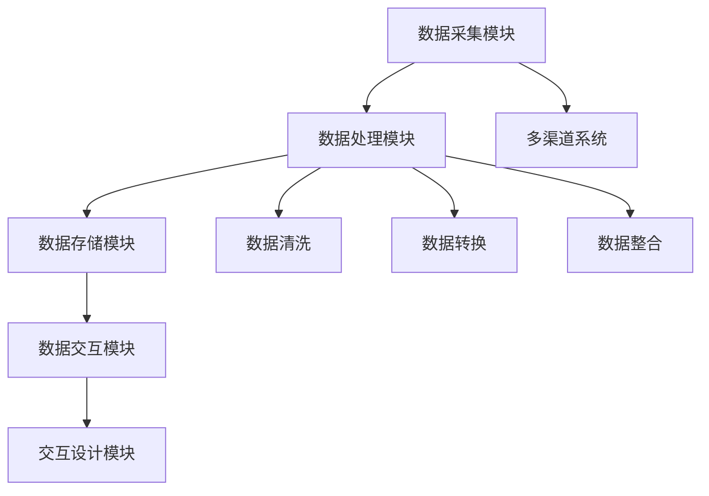

**模型特点：**

1. **模块化设计**：每个模块具有独立的功能，便于维护和升级。
2. **数据一致性**：通过统一的数据处理和存储，确保数据的准确性和一致性。
3. **实时性**：数据交互模块能够实现实时数据传输和共享，确保信息的实时性。
4. **灵活性**：支持多种渠道集成，可根据企业需求进行扩展和定制。

**模型应用场景：**

1. **智能客服**：通过多渠道集成，实现客户在电话、邮件、社交媒体、在线聊天等多个渠道的智能客服。
2. **订单管理**：整合不同渠道的订单数据，实现订单流程的自动化处理和监控。
3. **客户分析**：利用多渠道数据，进行客户行为分析和需求预测，提供个性化的服务。
4. **销售预测**：通过整合多渠道的销售数据，进行销售预测和需求分析，优化库存管理和营销策略。

##### 2.2 多渠道数据采集与处理

**2.2.1 数据采集**

数据采集是多渠道集成的基础。我们需要从不同的渠道收集数据，包括：

- **结构化数据**：如订单信息、客户信息、交易数据等。
- **非结构化数据**：如文本、图片、语音等。

以下是一个数据采集流程：

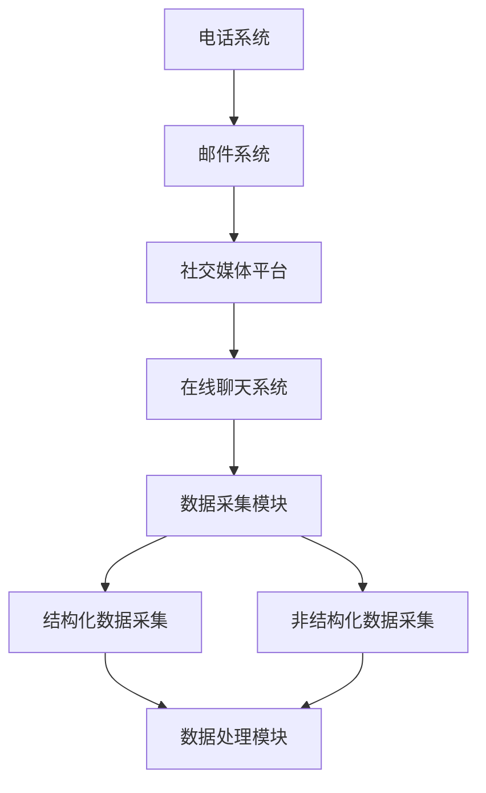

**2.2.2 数据处理**

数据处理包括数据清洗、转换和整合。数据清洗是为了去除数据中的噪声和错误，确保数据质量；数据转换是将不同格式的数据转换为统一的格式，以便后续处理；数据整合是将来自不同渠道的数据进行合并，形成统一的数据视图。

以下是一个数据处理流程：

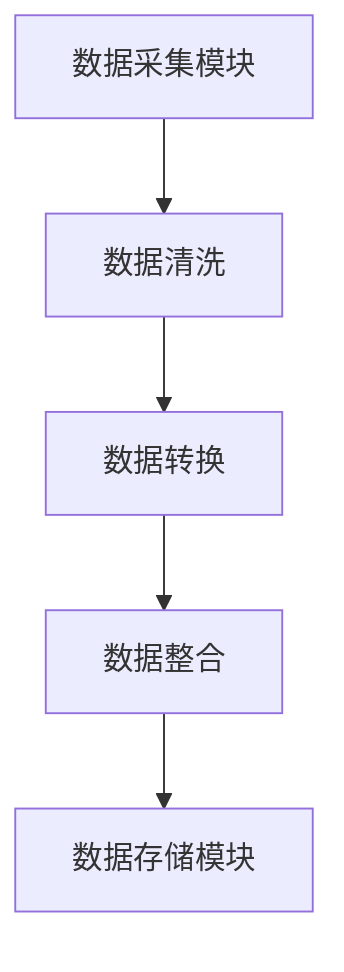

**2.2.3 数据质量保障**

数据质量是多渠道集成成功的关键。为了保障数据质量，我们需要采取以下措施：

1. **数据验证**：在数据采集和转换过程中，对数据进行验证，确保数据的完整性和准确性。
2. **数据监控**：建立数据监控机制，及时发现和处理数据质量问题。
3. **数据治理**：制定数据治理策略，规范数据的管理和使用。

##### 2.3 多渠道交互设计与实现

**2.3.1 交互设计原则**

多渠道交互设计应遵循以下原则：

1. **一致性**：确保不同渠道的用户界面和交互流程保持一致，提升用户体验。
2. **便捷性**：简化用户操作，降低使用门槛，提高用户满意度。
3. **灵活性**：支持多种交互方式，如文本、语音、图形等，满足不同用户的需求。
4. **实时性**：确保交互过程中的数据传输和响应速度，提升交互体验。

**2.3.2 交互实现策略**

多渠道交互实现策略包括：

1. **API集成**：通过API接口，实现不同渠道系统之间的数据传输和功能调用。
2. **Webhook**：利用Webhook技术，实现实时数据通知和事件触发。
3. **消息队列**：使用消息队列技术，实现异步数据传输和消息处理，提高系统可靠性。

以下是一个多渠道交互实现示例：

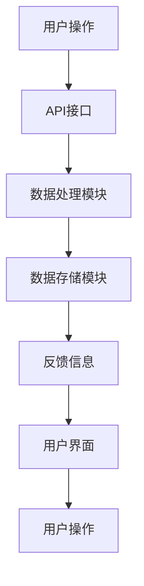

通过以上设计与实现，我们可以构建一个高效、可靠的企业AI多渠道集成框架，实现统一客户服务体验，提升企业的竞争力和市场占有率。

##### 2.4 多渠道集成安全性保障

多渠道集成涉及到大量敏感数据和用户信息，因此安全性至关重要。为了确保数据安全和用户隐私，我们需要采取以下安全保障措施：

**2.4.1 安全性问题分析**

多渠道集成中可能面临以下安全问题：

1. **数据泄露**：数据在传输和存储过程中可能被非法访问或窃取。
2. **数据篡改**：数据在传输过程中可能被恶意篡改，导致数据不准确或不可信。
3. **身份验证**：未经授权的用户可能尝试访问系统或数据。
4. **恶意攻击**：黑客可能利用系统漏洞进行攻击，导致系统崩溃或数据丢失。

**2.4.2 安全保障措施**

为了保障多渠道集成的安全性，我们可以采取以下措施：

1. **加密技术**：使用加密技术对数据进行加密存储和传输，确保数据的安全性。
2. **身份验证**：采用多因素身份验证（如密码、指纹、面部识别等），确保用户身份的准确性。
3. **访问控制**：根据用户的角色和权限，限制对系统和数据的访问，防止未经授权的访问。
4. **安全审计**：建立安全审计机制，监控系统和数据的安全状况，及时发现和处理安全事件。
5. **漏洞修复**：定期对系统进行安全检查和漏洞修复，确保系统处于安全状态。

通过以上安全保障措施，我们可以有效地保护多渠道集成中的数据和用户信息，确保系统的稳定性和可靠性。

## 第三部分：主流多渠道集成技术

在企业AI的多渠道集成过程中，选择合适的技术是实现集成成功的关键。本章节将介绍几种主流的多渠道集成技术，包括API集成、数据库集成和流处理技术，为读者提供全面的了解。

### 第3章：主流多渠道集成技术

#### 3.1 API集成技术

API（应用程序接口）集成是多渠道集成中最常用的技术之一。它允许不同的系统通过定义良好的接口进行通信和交互，从而实现数据共享和功能调用。

**3.1.1 RESTful API集成**

RESTful API是一种基于HTTP协议的API设计风格，它通过GET、POST、PUT、DELETE等HTTP方法实现资源的创建、读取、更新和删除。RESTful API集成具有以下优点：

1. **易用性**：基于HTTP协议，开发者熟悉，易于使用。
2. **灵活性**：支持多种数据格式，如JSON、XML等，可以根据需求选择。
3. **可扩展性**：可以方便地扩展新的服务和功能。

以下是一个RESTful API集成的示例流程：

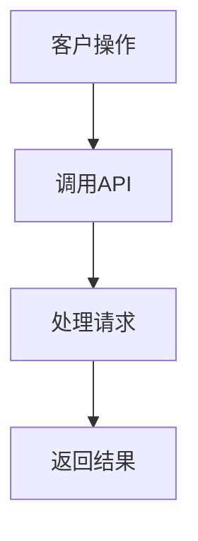

**3.1.2 GraphQL集成**

GraphQL是一种用于API设计的查询语言，它允许客户端指定所需数据的结构，从而减少数据传输和重复请求。GraphQL集成具有以下优点：

1. **按需数据传输**：客户端可以精确地获取所需的数据，减少不必要的请求和传输。
2. **减少重复请求**：通过聚合查询，可以减少多个API请求，提高效率。
3. **强大的类型系统**：GraphQL具有强大的类型系统，支持自定义类型和字段，提高灵活性。

以下是一个GraphQL集成的示例流程：

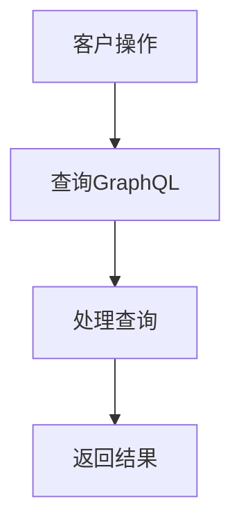

#### 3.2 数据库集成技术

数据库集成是将多个数据库系统进行整合，实现数据共享和访问的技术。根据数据库类型的不同，数据库集成技术也有所差异。

**3.2.1 关系型数据库集成**

关系型数据库（如MySQL、Oracle等）广泛应用于企业级应用，其数据结构清晰、易于管理。关系型数据库集成可以通过以下方法实现：

1. **数据复制**：将数据从一个数据库复制到另一个数据库，实现数据共享。
2. **数据同步**：通过定时任务或实时同步，保持两个数据库的数据一致性。
3. **数据分片**：将数据拆分到多个数据库实例中，实现水平扩展。

以下是一个关系型数据库集成的示例流程：

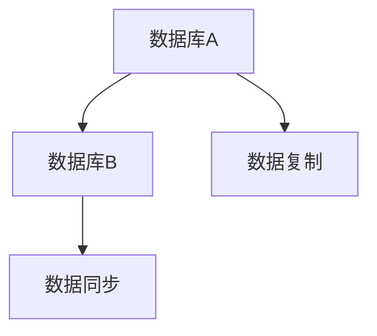

**3.2.2 NoSQL数据库集成**

NoSQL数据库（如MongoDB、Cassandra等）具有灵活的数据模型和高扩展性，适用于处理大规模数据。NoSQL数据库集成可以通过以下方法实现：

1. **数据聚合**：将数据从多个NoSQL数据库聚合到一个统一的数据模型中。
2. **数据映射**：将NoSQL数据库中的数据映射到关系型数据库或另一个NoSQL数据库中。
3. **分布式存储**：通过分布式存储技术，将数据分散存储到多个NoSQL数据库实例中。

以下是一个NoSQL数据库集成的示例流程：

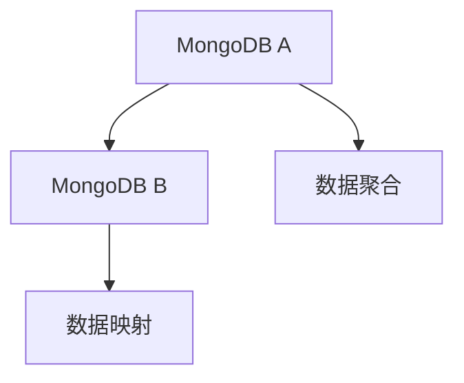

#### 3.3 流处理技术

流处理技术是处理实时数据的有效方法，适用于处理大量实时数据和事件。Apache Kafka和Apache Flink是两种常用的流处理技术。

**3.3.1 Apache Kafka**

Apache Kafka是一种分布式流处理平台，用于构建实时数据流应用程序。Kafka的主要特点包括：

1. **高吞吐量**：支持大规模数据流处理，具有高性能和高吞吐量。
2. **可扩展性**：支持水平扩展，可以轻松增加处理能力。
3. **可靠性**：提供数据持久化和故障恢复机制，确保数据不丢失。

以下是一个Apache Kafka的示例流程：

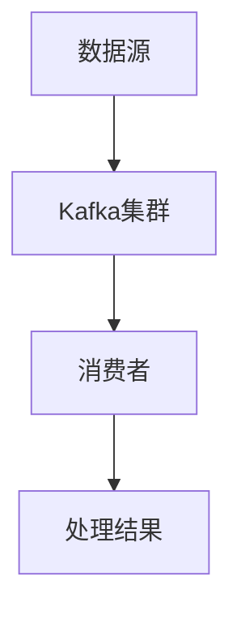

**3.3.2 Apache Flink**

Apache Flink是一种分布式流处理引擎，提供强大的流处理能力和复杂的数据处理功能。Flink的主要特点包括：

1. **实时处理**：支持实时数据流处理，可以快速响应用户请求。
2. **复杂运算**：支持窗口计算、关联操作等复杂数据处理。
3. **容错性**：提供容错机制，确保数据处理的可靠性。

以下是一个Apache Flink的示例流程：

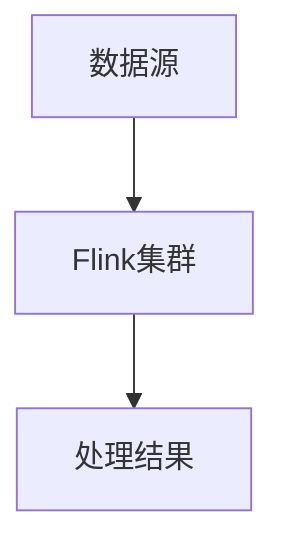

通过以上主流多渠道集成技术的介绍，我们可以根据具体需求选择合适的技术，实现高效、稳定的企业AI多渠道集成。

### 第4章：企业AI多渠道集成应用案例

为了更好地理解企业AI多渠道集成的实际应用，本章节将介绍一个具体的案例，通过分析案例背景、实现过程和效果评估，展示如何利用多渠道集成技术提升客户服务体验。

#### 4.1 案例背景

某大型零售企业，致力于为客户提供优质的购物体验。然而，随着业务规模的扩大，企业面临着多渠道客户服务分散、用户体验不一致的问题。为了提升客户满意度，企业决定通过多渠道集成，实现统一客户服务体验。

#### 4.1.1 企业背景

该零售企业拥有丰富的业务场景，包括线上商城、线下门店、移动应用等。客户可以通过多种渠道进行购物，如线上购物网站、手机APP、社交媒体等。然而，由于各个渠道独立运行，客户在切换渠道时，需要重复输入个人信息和购物需求，导致用户体验不佳。

#### 4.1.2 案例目标

1. **统一客户数据**：实现不同渠道的客户数据整合，建立统一的客户视图。
2. **提升服务效率**：通过多渠道集成，实现客户服务的无缝衔接，提高服务效率。
3. **优化用户体验**：提供一致的客户服务体验，满足客户在不同渠道的个性化需求。
4. **降低运营成本**：通过自动化流程和智能决策，降低企业运营成本。

#### 4.2 案例实现

为了实现上述目标，企业采取了以下措施：

**4.2.1 集成框架设计**

企业首先设计了多渠道集成框架，包括数据采集、数据处理、数据存储、数据交互和交互设计等模块。以下是一个集成框架设计示例：

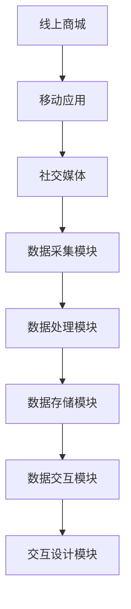

**4.2.2 数据采集与处理**

1. **数据采集**：从线上商城、移动应用和社交媒体等渠道收集客户数据，包括订单信息、购物行为、客户反馈等。

2. **数据处理**：对采集到的数据进行清洗、转换和整合，确保数据的质量和一致性。

3. **数据质量保障**：通过数据验证和监控，确保数据的准确性和完整性。

**4.2.3 多渠道交互设计与实现**

1. **交互设计**：设计统一的用户界面和交互流程，提升用户体验。

2. **交互实现**：采用API集成和Webhook技术，实现不同渠道系统之间的数据传输和功能调用。

3. **安全性保障**：采用加密技术和身份验证，确保数据传输和存储的安全性。

**4.2.4 集成效果评估**

通过多渠道集成，企业实现了以下效果：

1. **统一客户数据**：不同渠道的客户数据得到整合，建立了统一的客户视图。

2. **提升服务效率**：客户服务流程实现无缝衔接，服务效率显著提高。

3. **优化用户体验**：提供一致的客户服务体验，客户满意度得到提升。

4. **降低运营成本**：通过自动化流程和智能决策，企业运营成本降低。

#### 4.3 案例分析

**4.3.1 案例优点**

1. **统一数据视图**：通过多渠道集成，企业能够获取更全面、准确的数据，实现数据共享和业务协同。

2. **提升用户体验**：提供一致的客户服务体验，满足客户在不同渠道的个性化需求。

3. **提高运营效率**：通过自动化流程和智能决策，提高企业运营效率。

4. **降低成本**：通过减少重复劳动和优化资源利用，降低企业运营成本。

**4.3.2 案例挑战与解决方案**

1. **技术挑战**：多渠道集成涉及多种技术和接口，技术实现复杂。

解决方案：采用成熟的集成框架和工具，降低技术实现难度。

2. **业务挑战**：不同渠道的业务逻辑和流程可能不一致，集成过程中需要充分考虑业务需求。

解决方案：进行详细的业务分析和需求调研，确保集成方案符合实际业务需求。

3. **组织挑战**：多渠道集成需要跨部门合作，协调不同部门的利益和需求。

解决方案：建立跨部门协作机制，明确各部门职责和任务，确保项目顺利进行。

通过以上案例分析，我们可以看到，企业AI多渠道集成在提升客户服务体验、提高运营效率和降低成本方面具有显著优势。在接下来的章节中，我们将继续探讨企业AI多渠道集成的最佳实践和未来发展趋势。

### 第5章：企业AI多渠道集成最佳实践

为了帮助企业在实施AI多渠道集成过程中取得成功，本章将介绍两个最佳实践案例：统一客户服务体验和智能客服系统。通过这些案例，我们将详细探讨其实践背景、步骤和效果。

#### 5.1 最佳实践一：统一客户服务体验

**5.1.1 实践背景**

某国际知名电商企业在快速发展的过程中，发现客户服务体验不一致的问题日益严重。由于客户可以通过网站、移动应用、社交媒体等多个渠道与企业互动，但各个渠道之间的数据无法共享，导致客户在切换渠道时需要重复提供个人信息和购物需求，极大地影响了用户体验和满意度。

**5.1.2 实践步骤**

1. **需求分析**：深入了解客户在不同渠道的互动习惯和痛点，明确集成目标和需求。

2. **集成框架设计**：设计一个统一的数据采集、处理和存储架构，实现不同渠道数据的整合和共享。

3. **数据采集**：通过API集成、Webhook等技术，从网站、移动应用、社交媒体等渠道收集客户数据。

4. **数据处理**：对采集到的数据进行清洗、转换和整合，确保数据的一致性和准确性。

5. **数据存储**：将处理后的数据存储在统一的数据仓库或数据湖中，建立统一的客户视图。

6. **交互设计**：设计统一的用户界面和交互流程，确保不同渠道的用户体验一致。

7. **实施与优化**：根据实际运营情况，持续优化集成系统，确保稳定性和高效性。

**5.1.3 实践效果**

通过统一客户服务体验的最佳实践，企业实现了以下效果：

1. **提升用户体验**：客户在切换渠道时无需重复提供个人信息，享受无缝的购物体验。

2. **提高客户满意度**：客户服务体验得到显著改善，客户满意度大幅提升。

3. **降低运营成本**：通过自动化流程和智能决策，减少了重复劳动，提高了运营效率。

4. **增强数据利用**：统一的数据视图使企业能够更好地分析客户行为，制定精准的营销策略。

#### 5.2 最佳实践二：智能客服系统

**5.2.1 实践背景**

某全球领先的电信公司希望通过引入智能客服系统，提高客户服务质量和效率，减少人工客服的工作量。然而，由于客户服务渠道繁多，包括电话、邮件、社交媒体、在线聊天等，传统的人工客服难以应对大规模的客户请求。

**5.2.2 实践步骤**

1. **需求分析**：明确智能客服系统的功能和性能要求，确定技术选型和集成方案。

2. **集成框架设计**：设计一个包含数据采集、处理、存储、交互和智能客服模块的集成框架。

3. **数据采集**：从多个渠道收集客户请求和数据，包括文本、语音、图像等。

4. **数据处理**：对采集到的数据进行预处理，包括文本解析、情感分析、语音识别等。

5. **智能客服模块**：利用自然语言处理、机器学习等技术，实现智能客服的功能，如自动回答常见问题、引导客户流程等。

6. **交互设计**：设计人性化的用户界面和交互流程，确保智能客服系统能够与客户顺畅沟通。

7. **测试与优化**：通过实际运营数据，不断优化智能客服系统的性能和功能，提升服务质量。

**5.2.3 实践效果**

通过智能客服系统的最佳实践，企业实现了以下效果：

1. **提高响应速度**：智能客服系统能够在短时间内处理大量客户请求，显著提高了服务响应速度。

2. **减少人工干预**：智能客服系统能够自动解答常见问题，减少了对人工客服的依赖，降低了人工成本。

3. **提升服务质量**：通过分析客户互动数据，智能客服系统能够提供更个性化的服务，提升了客户满意度。

4. **增强数据分析能力**：智能客服系统收集的客户互动数据，为企业提供了宝贵的洞察，有助于优化业务流程和营销策略。

通过以上两个最佳实践案例，我们可以看到，企业AI多渠道集成在提升客户服务体验、提高运营效率和降低成本方面具有巨大潜力。在未来的发展中，企业需要不断探索和创新，充分利用AI技术，实现多渠道集成的最佳效果。

### 第6章：企业AI多渠道集成的挑战与未来趋势

在实现企业AI多渠道集成过程中，企业不仅需要应对技术层面的挑战，还需要考虑运营和战略层面的因素。本章节将深入探讨企业AI多渠道集成面临的挑战及其未来发展趋势。

#### 6.1 集成挑战

**6.1.1 技术挑战**

1. **多渠道数据的一致性**：不同渠道的数据格式和结构可能存在差异，需要设计复杂的数据转换和清洗流程，确保数据的一致性和准确性。
2. **实时数据处理**：多渠道数据量巨大，如何在保证实时性的前提下，高效地处理和分析数据，是技术实现中的关键挑战。
3. **系统兼容性**：集成过程中需要考虑不同系统之间的兼容性，确保数据能够顺利传输和共享。

**6.1.2 运营挑战**

1. **跨部门协作**：多渠道集成涉及多个部门，如IT、市场、客服等，需要建立有效的跨部门协作机制，确保项目顺利进行。
2. **数据治理**：确保数据的质量和安全，需要建立完善的数据治理策略，包括数据标准、权限管理和监控。
3. **持续优化**：集成系统上线后，需要不断收集用户反馈和运营数据，进行优化和迭代，以应对不断变化的市场需求。

**6.2 未来趋势**

**6.2.1 技术发展趋势**

1. **云计算和大数据技术的融合**：随着云计算和大数据技术的不断发展，企业AI多渠道集成将更加依赖于云平台，实现弹性扩展和高效处理。
2. **边缘计算的应用**：边缘计算可以将数据处理和分析推向网络边缘，降低延迟，提高实时性，适用于对实时性要求较高的场景。
3. **人工智能的深化应用**：人工智能技术将在数据分析和决策支持中发挥更大作用，通过智能算法和模型，实现更精准的客户洞察和个性化服务。

**6.2.2 应用发展趋势**

1. **跨渠道个性化服务**：企业将更加注重跨渠道的个性化服务，通过统一的数据视图，实现无缝的客户体验。
2. **智能客服的普及**：随着人工智能技术的进步，智能客服系统将在更多企业中得到应用，提高客户服务质量和效率。
3. **数据驱动的决策**：企业将利用多渠道集成带来的全面数据，进行深入的数据分析和挖掘，实现数据驱动的决策。

#### 6.3 企业AI多渠道集成的发展与前景

企业AI多渠道集成是现代企业提升服务质量和运营效率的重要手段。通过多渠道集成，企业可以提供一致的客户服务体验，提高客户满意度，降低运营成本，增强市场竞争力。

在未来，随着技术的不断进步和应用场景的不断拓展，企业AI多渠道集成将迎来更广阔的发展前景。企业需要不断探索和创新，充分利用AI技术，实现多渠道集成的最佳效果。同时，企业还需要关注技术挑战和运营问题，确保集成系统的稳定性和高效性。

总之，企业AI多渠道集成是企业数字化转型的重要一环，它将为企业带来显著的业务价值和竞争优势。在未来的发展中，企业需要持续关注多渠道集成技术的发展趋势，积极应对挑战，探索最佳实践，以实现业务增长和可持续发展。

## 总结

本文系统地探讨了企业AI Agent的多渠道集成，从背景与意义、集成框架、关键技术、应用案例、最佳实践到挑战与未来趋势，全面阐述了多渠道集成在提升客户服务体验和运营效率方面的作用。以下是对本文内容的总结：

1. **背景与意义**：企业AI的快速发展推动了多渠道集成的需求，统一客户服务体验成为提升客户满意度和企业竞争力的重要途径。

2. **集成框架**：通过构建数据采集、数据处理、数据存储、数据交互和交互设计等多模块的综合集成框架，实现多渠道数据的整合和共享。

3. **关键技术**：介绍了API集成、数据库集成和流处理技术等主流集成技术，为读者提供了选择和实现多渠道集成的技术参考。

4. **应用案例**：通过具体案例展示了企业AI多渠道集成的实际应用，分析了案例的实现过程和效果评估，提供了实践经验和启示。

5. **最佳实践**：提出了统一客户服务体验和智能客服系统的最佳实践案例，详细描述了实践背景、步骤和效果，为其他企业提供了可借鉴的方案。

6. **挑战与未来趋势**：分析了企业AI多渠道集成面临的技术和运营挑战，探讨了未来的技术发展趋势和应用方向。

通过本文的探讨，我们可以看到，企业AI多渠道集成不仅能够提升客户服务质量和用户体验，还能为企业带来显著的业务价值和竞争优势。在未来的发展中，企业需要不断探索和创新，充分利用AI技术，实现多渠道集成的最佳效果，以应对不断变化的市场需求。

## 拓展阅读

对于希望进一步深入了解企业AI多渠道集成的读者，以下是一些建议的拓展阅读资源：

1. **《人工智能：一种现代方法》（M. Mitchell，S. Russell，P. Norvig）**：这是一本经典的人工智能教材，详细介绍了人工智能的基础知识和技术方法，包括自然语言处理、机器学习等。

2. **《大规模数据处理：Apache Kafka技术内幕》（L. Gallo，J. Schloss）**：本书深入剖析了Apache Kafka的工作原理和技术细节，适合对流处理技术感兴趣的读者。

3. **《云计算与大数据集成：实践指南》（M. Helm，C. Rappin）**：本书讲解了云计算和大数据集成的原理和实践方法，为企业提供了构建高效数据架构的参考。

4. **《企业级大数据平台架构设计与最佳实践》（陈保华）**：本书结合实际案例，详细介绍了大数据平台的设计和实施过程，对构建多渠道集成系统具有很高的参考价值。

5. **《AI在金融领域的应用与案例解析》（王栋）**：本书探讨了人工智能在金融领域的应用，包括智能投顾、信用评估等，为金融企业实现AI多渠道集成提供了案例参考。

通过阅读这些资源，读者可以进一步拓展对企业AI多渠道集成的理解，掌握相关技术和方法，为实际项目提供有力支持。

