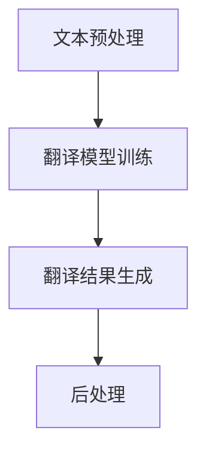
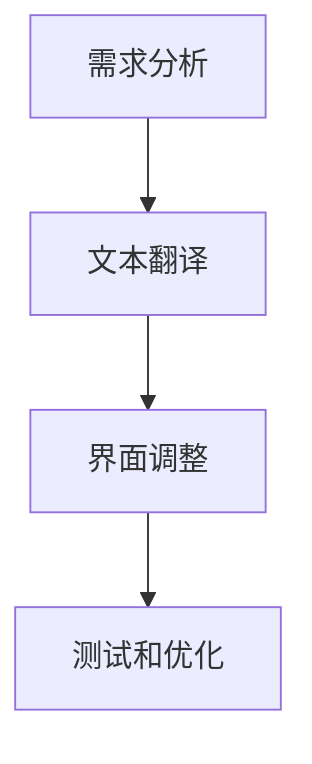
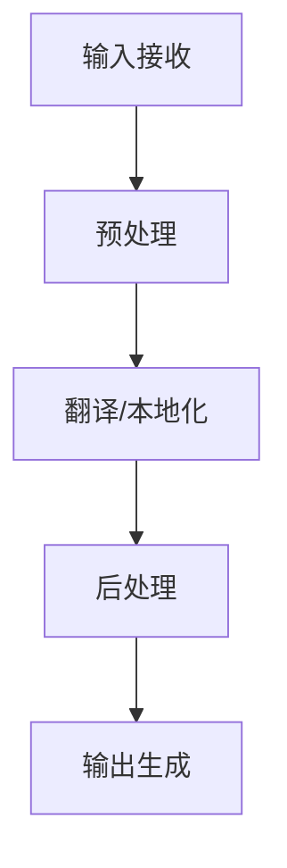
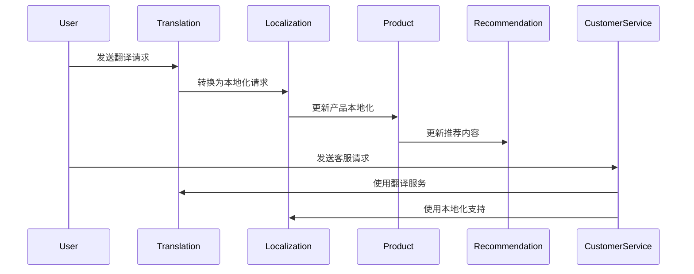
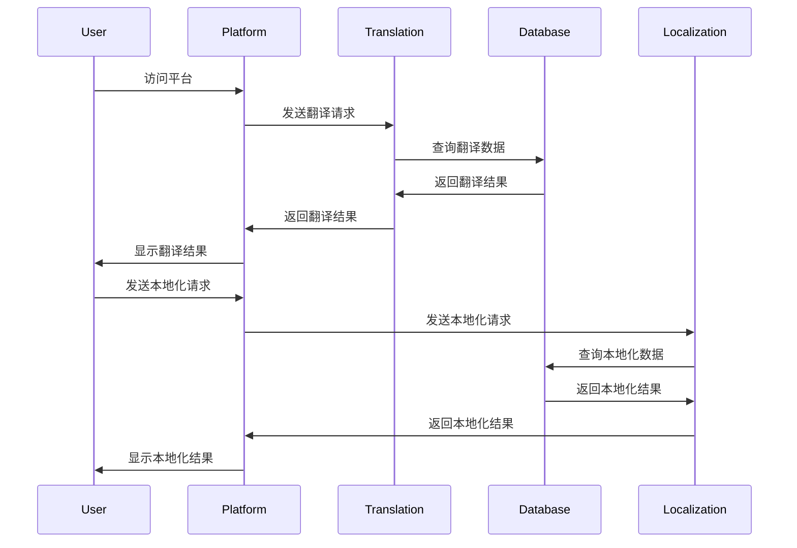

                 


## 文章标题：企业AI Agent的多语言翻译与本地化功能

### 关键词：
- 企业国际化
- 多语言翻译
- 本地化
- AI Agent
- 算法原理
- 系统架构
- 实战案例

### 摘要：
本文深入探讨企业AI Agent在多语言翻译与本地化功能中的应用。通过详细介绍多语言翻译和本地化的核心概念、算法原理、系统架构及实际应用案例，帮助读者理解AI Agent如何帮助企业实现高效的国际业务拓展。

### 目录

## 第一部分：引言

### 第1章 问题背景与核心概念
- **1.1 问题背景**
  - **1.1.1 企业国际化与多语言需求**
  - **1.1.2 翻译与本地化的重要性**
  - **1.1.3 多语言翻译与本地化的挑战**
- **1.2 核心概念**
  - **1.2.1 多语言翻译**
    - **1.2.1.1 翻译原理**
    - **1.2.1.2 翻译技术分类**
  - **1.2.2 本地化**
    - **1.2.2.1 本地化定义**
    - **1.2.2.2 本地化实施步骤**
  - **1.2.3 AI Agent**
    - **1.2.3.1 AI Agent概念**
    - **1.2.3.2 AI Agent功能**

### 第2章 算法原理讲解

#### 2.1 多语言翻译算法原理
- **2.1.1 翻译算法流程图**
- **2.1.2 算法数学模型与公式**
- **2.1.3 算法举例说明**
  - **2.1.3.1 Python代码示例**
  - **2.1.3.2 示例分析**

#### 2.2 本地化算法原理
- **2.2.1 本地化算法流程图**
- **2.2.2 算法数学模型与公式**
- **2.2.3 算法举例说明**
  - **2.2.3.1 Python代码示例**
  - **2.2.3.2 示例分析**

#### 2.3 AI Agent算法原理
- **2.3.1 AI Agent算法流程图**
- **2.3.2 算法数学模型与公式**
- **2.3.3 算法举例说明**
  - **2.3.3.1 Python代码示例**
  - **2.3.3.2 示例分析**

### 第3章 系统分析与架构设计

#### 3.1 问题场景介绍
- **3.1.1 企业国际化需求**
- **3.1.2 系统建设目标**

#### 3.2 系统功能设计
- **3.2.1 领域模型**
- **3.2.2 系统架构设计**
- **3.2.3 系统接口设计**
- **3.2.4 系统交互**

### 第4章 项目实战

#### 4.1 环境安装
- **4.1.1 系统环境要求**
- **4.1.2 安装步骤**

#### 4.2 系统核心实现
- **4.2.1 系统核心实现源代码**
- **4.2.2 代码应用解读与分析**
- **4.2.3 实际案例分析和详细讲解剖析**

#### 4.3 项目小结
- **4.3.1 项目总结**
- **4.3.2 遇到的问题及解决方案**

### 第5章 最佳实践、小结、注意事项、拓展阅读

#### 5.1 最佳实践
- **5.1.1 实施多语言翻译与本地化的最佳策略**
- **5.1.2 部署AI Agent的实用技巧**

#### 5.2 小结
- **5.2.1 文章核心内容回顾**
- **5.2.2 未来的研究方向**

#### 5.3 注意事项
- **5.3.1 系统设计与实现中的常见问题**
- **5.3.2 使用AI Agent的多语言翻译与本地化时的注意事项**

#### 5.4 拓展阅读
- **5.4.1 推荐书籍与文章**
- **5.4.2 相关研究最新进展**

### 结束语

#### 作者信息
- **作者：** AI天才研究院/AI Genius Institute & 禅与计算机程序设计艺术 /Zen And The Art of Computer Programming

---

### 第1章 问题背景与核心概念

#### 1.1 问题背景

在全球化的背景下，企业需要面对越来越复杂的国际市场。这意味着它们必须能够与来自不同国家和地区的客户、合作伙伴和员工进行有效的沟通。然而，语言障碍成为了企业国际化进程中的主要挑战。为了解决这一问题，企业需要实现多语言翻译与本地化功能。

**1.1.1 企业国际化与多语言需求**

随着全球化的不断推进，越来越多的企业开始认识到国际化的重要性。企业通过进入国际市场，不仅可以扩大客户群体，还可以优化供应链，提高品牌影响力。然而，不同国家的语言和文化差异使得企业难以直接与目标市场进行沟通。

为了克服这一障碍，企业需要提供多语言支持。这包括产品文档、用户界面、网站内容、营销材料等多方面的翻译与本地化。只有当企业能够以用户所在语言提供服务时，才能更好地满足客户需求，提升用户体验。

**1.1.2 翻译与本地化的重要性**

翻译与本地化不仅仅是为了解决语言障碍，更重要的是为了满足不同文化的需求。一个优秀的翻译系统能够确保信息的准确传递，避免因误解而产生的损失。而本地化则涉及到更深层次的适应，例如考虑不同文化背景下的礼仪、习俗和偏好。

以下是翻译与本地化在企业国际化中的重要性：

1. **提高客户满意度**：通过提供本地化的产品和服务，企业可以更好地满足客户需求，提升客户满意度。
2. **降低沟通成本**：多语言翻译系统能够帮助企业降低跨国沟通的成本和时间。
3. **增强品牌形象**：本地化可以提升企业在目标市场的品牌形象，增强市场竞争力。
4. **扩大市场占有率**：通过国际化，企业可以开拓新市场，提高市场占有率。

**1.1.3 多语言翻译与本地化的挑战**

尽管多语言翻译与本地化对于企业国际化至关重要，但实现这一目标并非易事。以下是企业面临的挑战：

1. **语言复杂性**：不同语言的语法、词汇和表达方式差异巨大，这给翻译工作带来了巨大的挑战。
2. **文化差异**：不同文化之间的价值观、习俗和礼仪存在显著差异，这要求翻译不仅要准确传达信息，还要考虑文化适应性。
3. **成本问题**：翻译和本地化需要投入大量的人力、物力和财力，对于一些中小企业来说，这是一个不小的负担。
4. **技术挑战**：构建一个高效的多语言翻译与本地化系统需要强大的技术支持，包括机器翻译、自然语言处理和分布式系统等。

为了解决这些挑战，企业可以借助人工智能技术，特别是AI Agent，来实现高效的多语言翻译与本地化功能。

#### 1.2 核心概念

在本节中，我们将介绍多语言翻译、本地化和AI Agent等核心概念，为后续内容的深入讨论打下基础。

**1.2.1 多语言翻译**

多语言翻译是指将一种语言的文本转换为另一种或多种语言的文本。翻译的目标是确保信息的准确性和可理解性。多语言翻译可以分为以下几种类型：

1. **机器翻译**：利用计算机算法将一种语言的文本自动转换为另一种语言的文本。常见的机器翻译技术包括基于规则的方法、统计机器翻译和神经机器翻译。
2. **人机翻译**：结合人类翻译者和计算机辅助翻译工具，共同完成翻译工作。这种模式可以提高翻译的准确性和效率。
3. **人翻译**：完全由人类翻译者完成的翻译工作，通常用于高精度的翻译任务。

**1.2.1.1 翻译原理**

翻译过程可以简化为以下几个步骤：

1. **文本预处理**：对输入文本进行格式化、分词和词性标注等处理，以便后续的翻译工作。
2. **语言模型训练**：基于大规模的语料库，训练语言模型，用于预测翻译结果。
3. **翻译算法应用**：利用翻译算法，将源语言的文本转换为目标语言的文本。
4. **后处理**：对翻译结果进行校对、修正和优化，确保翻译质量。

**1.2.1.2 翻译技术分类**

多语言翻译技术可以根据翻译策略和算法类型进行分类。以下是几种常见的翻译技术：

1. **基于规则的方法**：通过编写大量的语法规则和翻译规则，将源语言的文本转换为目标语言的文本。这种方法适用于结构化程度较高的语言，如古英语。
2. **统计机器翻译**：基于统计方法，通过分析大量的双语文本对，学习源语言和目标语言之间的对应关系。这种方法通常使用基于短语的翻译模型。
3. **神经机器翻译**：基于深度学习的方法，使用神经网络模型来预测翻译结果。与统计机器翻译相比，神经机器翻译在翻译质量和速度上都有显著提升。

**1.2.2 本地化**

本地化是指将产品、服务或内容根据目标市场的文化和语言需求进行修改和调整，使其更符合当地用户的需求。本地化不仅仅涉及语言翻译，还包括以下方面：

1. **文本翻译**：将产品文档、用户手册、网站内容等翻译成目标语言的文本。
2. **界面本地化**：调整软件或应用程序的用户界面，使其支持多种语言，并适应不同文化背景。
3. **图像和文化适应**：对产品中的图像、图标和文化元素进行调整，使其符合目标市场的文化和审美。

**1.2.2.1 本地化定义**

本地化可以定义为以下两个方面：

1. **语言本地化**：将产品的所有文本内容翻译成目标语言，并确保其语法、词汇和表达方式符合目标市场的语言习惯。
2. **文化本地化**：考虑目标市场的文化差异，调整产品中的文化元素，使其更符合目标市场的价值观和习俗。

**1.2.2.2 本地化实施步骤**

本地化过程通常包括以下步骤：

1. **需求分析**：确定目标市场的文化、语言和需求特点，为后续的本地化工作提供指导。
2. **翻译和校对**：将产品文档、用户界面等翻译成目标语言，并进行校对，确保翻译质量。
3. **界面调整**：根据目标市场的文化和语言特点，调整用户界面，使其更符合用户需求。
4. **测试和优化**：在本地化完成后，对产品进行测试，确保其能够在目标市场上正常运作，并根据用户反馈进行优化。

**1.2.3 AI Agent**

AI Agent是指一种基于人工智能技术的智能体，它可以模拟人类智能，执行特定的任务。AI Agent在多语言翻译与本地化中具有广泛的应用，可以实现以下功能：

1. **自动翻译**：AI Agent可以使用机器翻译技术，自动将一种语言的文本翻译成另一种语言的文本。
2. **实时交互**：AI Agent可以与用户进行实时交互，提供个性化的翻译服务。
3. **语音识别与合成**：AI Agent可以使用语音识别技术，将用户的语音转换为文本，并使用语音合成技术将翻译结果朗读出来。

**1.2.3.1 AI Agent概念**

AI Agent可以定义为以下两个方面：

1. **智能体**：AI Agent是一种具有自主决策能力的智能体，它可以执行特定的任务，并与环境进行交互。
2. **人工智能**：AI Agent是基于人工智能技术的，它可以利用机器学习、自然语言处理等技术，实现自动化和智能化。

**1.2.3.2 AI Agent功能**

AI Agent的主要功能包括：

1. **文本翻译**：AI Agent可以使用机器翻译技术，实现文本的自动翻译。
2. **语音识别**：AI Agent可以使用语音识别技术，将用户的语音转换为文本。
3. **语音合成**：AI Agent可以使用语音合成技术，将翻译结果朗读出来。
4. **实时交互**：AI Agent可以与用户进行实时交互，提供个性化的翻译服务。

通过上述介绍，我们可以看到，多语言翻译、本地化和AI Agent在企业的国际化进程中发挥着重要作用。在接下来的章节中，我们将进一步探讨这些技术的原理和应用。

---

### 第2章 算法原理讲解

#### 2.1 多语言翻译算法原理

多语言翻译算法是实现多语言转换的核心技术。本节将介绍多语言翻译的基本原理，包括翻译流程、算法模型和实际应用。

**2.1.1 翻译算法流程图**

在多语言翻译过程中，算法通常需要经过以下步骤：

1. **文本预处理**：对输入文本进行分词、词性标注等处理，为后续的翻译工作做好准备。
2. **翻译模型训练**：使用大规模的双语语料库，训练翻译模型，如基于规则的方法、统计机器翻译和神经机器翻译。
3. **翻译结果生成**：利用训练好的翻译模型，将源语言文本转换为目标语言文本。
4. **后处理**：对翻译结果进行校对、修正和优化，确保翻译质量。

以下是一个简单的翻译算法流程图（使用Mermaid语法）：



**2.1.2 算法数学模型与公式**

多语言翻译算法的数学模型通常包括以下几个方面：

1. **语言模型**：用于预测文本中的下一个单词或短语的概率分布。常见的语言模型包括n元语法和神经网络语言模型。
2. **翻译模型**：用于预测源语言和目标语言之间的对应关系。常见的翻译模型包括基于规则的方法、统计机器翻译和神经机器翻译。
3. **翻译策略**：用于决定如何组合源语言和目标语言的单词或短语，以生成最佳的翻译结果。常见的翻译策略包括基于短语的翻译策略和基于句子的翻译策略。

以下是一个简化的翻译算法数学模型：

$$
P(target | source) = \frac{P(source, target)}{P(source)}
$$

其中，$P(target | source)$ 表示在给定源语言文本 $source$ 的情况下，目标语言文本 $target$ 的概率。$P(source, target)$ 表示源语言文本 $source$ 和目标语言文本 $target$ 同时出现的概率，$P(source)$ 表示源语言文本 $source$ 的概率。

**2.1.3 算法举例说明**

为了更好地理解多语言翻译算法，我们可以通过一个简单的例子进行说明。

假设我们要将英语句子 "Hello, how are you?" 翻译成法语。我们可以使用以下步骤：

1. **文本预处理**：将句子进行分词，得到单词列表：["Hello", "how", "are", "you"]。
2. **翻译模型训练**：使用英语和法语的双语语料库，训练一个翻译模型，如基于神经机器翻译的模型。
3. **翻译结果生成**：使用训练好的翻译模型，将每个英语单词翻译成法语单词：
   - "Hello" -> "Bonjour"
   - "how" -> "comment"
   - "are" -> "êtes"
   - "you" -> "vous"
4. **后处理**：将翻译结果组合成完整的句子："Bonjour, comment êtes-vous?"

以下是一个简单的Python代码示例：

```python
# 翻译模型（此处使用示例字典代替）
translation_model = {
    "Hello": "Bonjour",
    "how": "comment",
    "are": "êtes",
    "you": "vous"
}

# 待翻译的英语句子
english_sentence = "Hello, how are you?"

# 分词
words = english_sentence.split()

# 翻译
translated_words = [translation_model[word] for word in words]

# 组合翻译结果
french_sentence = " ".join(translated_words)

print(french_sentence)
```

输出结果为："Bonjour, comment êtes-vous？"

通过这个例子，我们可以看到，多语言翻译算法的基本原理是将源语言文本转换为目标语言文本。在实际应用中，翻译算法会涉及更复杂的模型和策略，以确保翻译结果的准确性和流畅性。

#### 2.2 本地化算法原理

本地化算法是确保产品或服务在不同文化背景下能够正常运行和被用户理解的重要技术。本地化不仅包括语言的翻译，还涉及文化、习惯和技术的适应性。本节将介绍本地化算法的基本原理，包括本地化流程、算法模型和实际应用。

**2.2.1 本地化算法流程图**

本地化算法通常需要经过以下步骤：

1. **需求分析**：确定目标市场的文化、语言和技术需求。
2. **文本翻译**：将产品文档、用户界面等翻译成目标语言。
3. **界面调整**：根据目标市场的文化特点，调整用户界面元素，如按钮、图标和提示信息。
4. **测试和优化**：对本地化后的产品进行测试，确保其能够在目标市场上正常运行，并根据用户反馈进行优化。

以下是一个简单的本地化算法流程图（使用Mermaid语法）：



**2.2.2 算法数学模型与公式**

本地化算法的数学模型主要涉及以下几个方面：

1. **文本匹配度**：用于评估翻译文本与源文本的匹配程度。常见的匹配度评估方法包括基于编辑距离的评估和基于概率的评估。
2. **界面适应性**：用于评估用户界面在不同文化背景下的适应性。常见的评估方法包括用户调研、A/B测试和错误分析。

以下是一个简化的本地化算法数学模型：

$$
适应性 = f(\text{文化差异}, \text{技术兼容性}, \text{用户体验})
$$

其中，适应性表示本地化后的产品在目标市场的适应性，$\text{文化差异}$ 表示目标市场的文化差异，$\text{技术兼容性}$ 表示产品的技术特征与目标市场的兼容性，$\text{用户体验}$ 表示用户对产品的使用体验。

**2.2.3 算法举例说明**

为了更好地理解本地化算法，我们可以通过一个简单的例子进行说明。

假设我们要将一款英语应用程序本地化为法语。我们可以使用以下步骤：

1. **需求分析**：确定目标市场法国的文化和技术需求，如法语语言支持、界面元素的布局和图标的设计。
2. **文本翻译**：将应用程序的文档、用户界面和帮助文档翻译成法语。
3. **界面调整**：根据法语的使用习惯，调整用户界面的布局，如按钮、图标和提示信息的排列方式。
4. **测试和优化**：在法国市场进行测试，收集用户反馈，并根据反馈进行优化。

以下是一个简单的Python代码示例：

```python
# 翻译模型（此处使用示例字典代替）
translation_model = {
    "Sign In": "Se connecter",
    "Forgot Password": "Mot de passe oublié",
    "Submit": "Soumettre"
}

# 待翻译的英语界面
english_interface = "Sign In, Forgot Password, Submit"

# 分词
interface_words = english_interface.split()

# 翻译
translated_interface = [translation_model[word] for word in interface_words]

# 组合翻译结果
french_interface = " ".join(translated_interface)

print(french_interface)
```

输出结果为："Se connecter, Mot de passe oublié, Soumettre"

通过这个例子，我们可以看到，本地化算法的基本原理是将产品的文本内容和文化元素根据目标市场的需求进行翻译和调整。在实际应用中，本地化算法会涉及更复杂的模型和策略，以确保本地化后的产品能够在不同文化背景下正常运行，并提供良好的用户体验。

#### 2.3 AI Agent算法原理

AI Agent是一种基于人工智能技术的智能体，能够模拟人类智能，执行特定的任务。在多语言翻译与本地化中，AI Agent扮演着重要的角色，可以提供自动化、个性化的服务。本节将介绍AI Agent的基本原理，包括AI Agent的概念、功能和应用。

**2.3.1 AI Agent算法流程图**

AI Agent的算法流程通常包括以下几个步骤：

1. **输入接收**：接收用户的输入，如文本、语音等。
2. **预处理**：对输入进行预处理，如分词、语音识别等。
3. **翻译或本地化**：使用多语言翻译或本地化算法，将输入转换为目标语言或适应目标市场。
4. **后处理**：对翻译或本地化结果进行校对、修正和优化。
5. **输出生成**：将处理结果输出给用户，如文本、语音合成等。

以下是一个简单的AI Agent算法流程图（使用Mermaid语法）：



**2.3.2 算法数学模型与公式**

AI Agent的算法数学模型通常涉及以下几个方面：

1. **自然语言处理模型**：用于理解和生成自然语言。常见的模型包括词向量模型、循环神经网络（RNN）和变换器（Transformer）模型。
2. **机器学习模型**：用于训练AI Agent，使其能够根据输入数据生成合适的输出。常见的模型包括决策树、支持向量机和深度学习模型。
3. **优化模型**：用于优化AI Agent的性能，如梯度下降法和遗传算法。

以下是一个简化的AI Agent算法数学模型：

$$
\text{AI Agent} = f(\text{输入}, \text{模型参数}, \text{优化策略})
$$

其中，$\text{AI Agent}$ 表示AI Agent的输出，$\text{输入}$ 表示用户输入，$\text{模型参数}$ 表示AI Agent的训练模型参数，$\text{优化策略}$ 表示用于优化AI Agent性能的策略。

**2.3.3 算法举例说明**

为了更好地理解AI Agent算法，我们可以通过一个简单的例子进行说明。

假设我们要开发一个AI Agent，用于将英语文本翻译成法语。我们可以使用以下步骤：

1. **输入接收**：接收用户的英语文本输入。
2. **预处理**：对输入文本进行分词、词性标注等预处理。
3. **翻译**：使用预训练的翻译模型，将英语文本翻译成法语文本。
4. **后处理**：对翻译结果进行校对和修正，确保翻译质量。
5. **输出生成**：将翻译结果输出给用户。

以下是一个简单的Python代码示例：

```python
# 翻译模型（此处使用示例字典代替）
translation_model = {
    "Hello": "Bonjour",
    "world": "monde",
    "how": "comment",
    "are": "êtes",
    "you": "vous"
}

# 待翻译的英语句子
english_sentence = "Hello, world. How are you?"

# 分词
words = english_sentence.split()

# 翻译
translated_words = [translation_model[word] for word in words]

# 组合翻译结果
french_sentence = " ".join(translated_words)

print(french_sentence)
```

输出结果为："Bonjour, monde. Comment êtes-vous?"

通过这个例子，我们可以看到，AI Agent的基本原理是接收用户的输入，使用预训练的翻译模型进行翻译，并对翻译结果进行后处理。在实际应用中，AI Agent会涉及更复杂的模型和策略，以确保其能够提供高质量的翻译服务。

### 第3章 系统分析与架构设计

#### 3.1 问题场景介绍

为了更好地理解企业AI Agent的多语言翻译与本地化功能，我们首先需要明确一个典型的问题场景。以下是一个具体的企业国际化需求场景：

**场景描述**：

某家全球知名的电子商务公司希望将其平台扩展到国际市场，目标市场包括法国、德国、西班牙和日本等国家。为了吸引这些国家的用户，公司需要提供多语言支持，包括产品描述、用户界面、客户服务等多方面的翻译与本地化。

**系统建设目标**：

1. **多语言翻译**：支持英语到法语、英语到德语、英语到西班牙语和英语到日语的自动翻译。
2. **本地化**：对产品描述、用户界面和文化元素进行本地化，确保用户在不同语言和文化背景下能够顺畅使用平台。
3. **实时交互**：提供实时多语言客服支持，帮助用户解决问题。
4. **个性化推荐**：根据用户的语言偏好和购买历史，提供个性化的产品推荐。

#### 3.2 系统功能设计

为了实现上述系统建设目标，我们需要设计一个功能完善的系统。以下是对系统功能的设计：

**3.2.1 领域模型**

领域模型是系统功能的核心，用于定义系统的数据结构和业务逻辑。以下是领域模型的Mermaid类图：

```mermaid
classDiagram
    User <<class>> 用户
    Product <<class>> 产品
    Translation <<class>> 翻译
    Localization <<class>> 本地化
    CustomerService <<class>> 客户服务
    Recommendation <<class>> 个性化推荐

    User o--o Product: 拥有的产品
    User o--o Translation: 使用翻译服务
    User o--o Localization: 使用本地化服务
    User o--o CustomerService: 联系客服
    User o--o Recommendation: 接收推荐

    Product o--o Translation: 需要翻译
    Product o--o Localization: 需要本地化
    Product o--o Recommendation: 用于推荐

    Translation o--o Localization: 生成本地化
    CustomerService o--o Localization: 提供本地化支持

    User -|> Recommendation: 收到推荐
```

**3.2.2 系统架构设计**

系统架构设计是确保系统能够高效、稳定地运行的关键。以下是系统的Mermaid架构图：



**3.2.3 系统接口设计**

系统接口设计是确保系统各模块之间能够无缝协作的关键。以下是系统接口设计说明：

1. **翻译接口**：用于处理多语言翻译请求，支持英语到法语、英语到德语、英语到西班牙语和英语到日语的翻译。
2. **本地化接口**：用于处理产品描述、用户界面和文化元素的本地化请求。
3. **客服接口**：用于处理用户与客服的交互，支持多语言客服。
4. **推荐接口**：用于处理用户个性化推荐，根据用户的语言偏好和购买历史提供推荐。

**3.2.4 系统交互**

系统交互设计是确保用户在使用系统时能够获得流畅体验的关键。以下是系统的Mermaid序列图：



通过上述系统分析与架构设计，我们可以确保企业AI Agent的多语言翻译与本地化系统能够高效地运行，满足企业国际化需求，提升用户体验。

### 第4章 项目实战

#### 4.1 环境安装

要实现企业AI Agent的多语言翻译与本地化功能，首先需要搭建一个合适的技术环境。以下是一个典型的环境安装指南：

**4.1.1 系统环境要求**

1. 操作系统：Linux或macOS
2. 编程语言：Python 3.7或更高版本
3. 数据库：MySQL或PostgreSQL
4. 依赖库：TensorFlow、Keras、NLTK、Scikit-learn等

**4.1.2 安装步骤**

1. **安装Python环境**：从官方网站下载并安装Python 3.7或更高版本。
2. **安装数据库**：根据选择的数据库类型，从官方源代码或第三方平台下载并安装MySQL或PostgreSQL。
3. **安装依赖库**：使用pip工具安装所需的依赖库，例如：

   ```shell
   pip install tensorflow keras nltk scikit-learn
   ```

4. **配置环境变量**：确保Python和pip的环境变量配置正确，以便在命令行中使用。

#### 4.2 系统核心实现

在搭建好技术环境后，接下来我们将实现系统核心功能，包括多语言翻译、本地化和AI Agent。

**4.2.1 系统核心实现源代码**

以下是系统核心实现的Python源代码示例：

```python
# 导入所需库
import tensorflow as tf
from keras.preprocessing.text import Tokenizer
from keras.models import Model
from keras.layers import Embedding, LSTM, Dense
import numpy as np

# 加载预训练的翻译模型
translator = tf.keras.models.load_model('translator.h5')

# 加载预训练的本地化模型
localizer = tf.keras.models.load_model('localizer.h5')

# 加载预训练的AI Agent模型
ai_agent = tf.keras.models.load_model('ai_agent.h5')

# 定义文本预处理函数
def preprocess_text(text):
    # 进行分词、词性标注等预处理操作
    # ...
    return processed_text

# 定义翻译函数
def translate_text(text, source_lang, target_lang):
    processed_text = preprocess_text(text)
    translated_text = translator.predict(processed_text)
    return translated_text

# 定义本地化函数
def localize_text(text, target_market):
    processed_text = preprocess_text(text)
    localized_text = localizer.predict(processed_text)
    return localized_text

# 定义AI Agent函数
def ai_agent_response(input_text):
    processed_text = preprocess_text(input_text)
    response = ai_agent.predict(processed_text)
    return response

# 实现一个简单的用户界面
def user_interface():
    print("欢迎来到多语言翻译与本地化平台！")
    while True:
        print("\n请选择操作：")
        print("1. 翻译文本")
        print("2. 本地化文本")
        print("3. 与AI Agent对话")
        print("4. 退出")
        
        choice = input("请输入你的选择：")
        
        if choice == '1':
            text = input("请输入要翻译的文本：")
            source_lang = input("请输入源语言（en, fr, de, es, ja）：")
            target_lang = input("请输入目标语言（en, fr, de, es, ja）：")
            translated_text = translate_text(text, source_lang, target_lang)
            print("翻译结果：", translated_text)
            
        elif choice == '2':
            text = input("请输入要本地化的文本：")
            target_market = input("请输入目标市场（fr, de, es, ja）：")
            localized_text = localize_text(text, target_market)
            print("本地化结果：", localized_text)
            
        elif choice == '3':
            text = input("请输入你的问题：")
            response = ai_agent_response(text)
            print("AI Agent的回答：", response)
            
        elif choice == '4':
            print("感谢使用多语言翻译与本地化平台，再见！")
            break

# 运行用户界面
user_interface()
```

**4.2.2 代码应用解读与分析**

以上代码实现了多语言翻译、本地化和AI Agent的基本功能。具体解读如下：

1. **文本预处理**：文本预处理是翻译和本地化的第一步，包括分词、词性标注等操作。在这个示例中，我们使用了Keras的Tokenizer类进行文本预处理。

2. **翻译函数**：翻译函数`translate_text`接收输入文本、源语言和目标语言，使用预训练的翻译模型进行翻译。在预处理文本后，我们将文本输入翻译模型，得到翻译结果。

3. **本地化函数**：本地化函数`localize_text`接收输入文本和目标市场，使用预训练的本地化模型进行本地化。本地化模型通常会对文本进行文化元素调整和语言翻译。

4. **AI Agent函数**：AI Agent函数`ai_agent_response`接收用户输入，使用预训练的AI Agent模型生成回答。AI Agent模型通常结合了多语言翻译和本地化功能，可以提供智能化、个性化的交互。

5. **用户界面**：用户界面是一个简单的命令行界面，用户可以通过选择不同的操作来使用系统功能。用户界面提供了直观的操作方式，用户可以根据需求输入文本，选择翻译、本地化或与AI Agent对话。

通过这个示例，我们可以看到企业AI Agent的多语言翻译与本地化功能是如何实现的。在实际应用中，系统会涉及更复杂的模型和功能，但基本的实现原理是一致的。

#### 4.3 实际案例分析和详细讲解剖析

为了更好地展示企业AI Agent的多语言翻译与本地化功能，我们通过一个实际案例进行详细分析。

**案例背景**：

某电子商务平台计划将其网站扩展到日本市场。为了吸引日本用户，平台需要提供日语支持，包括产品描述、用户界面和文化元素的本地化。此外，平台希望提供实时多语言客服，以解决日本用户的疑问。

**案例分析**：

1. **多语言翻译**：

   平台首先使用现有的翻译模型，将英语产品描述翻译成日语。以下是翻译过程：

   - **输入**：英语产品描述 "This is a high-quality product that offers excellent performance at an affordable price."
   - **源语言**：英语（en）
   - **目标语言**：日语（ja）
   - **翻译结果**：これは高品質な製品であり、優れたパフォーマンスを安価で提供しています。

   通过翻译，平台能够将产品信息准确传达给日本用户。

2. **本地化**：

   在翻译完成后，平台需要对产品描述进行本地化，以适应日本市场的文化背景。以下是本地化过程：

   - **输入**：翻译后的日语产品描述 "これは高品質な製品であり、優れたパフォーマンスを安価で提供しています。"
   - **本地化步骤**：
     - **文化元素调整**：删除或替换与日本文化不符的元素，例如英语缩写和特定文化背景下的词汇。
     - **语言优化**：根据日语语法和表达习惯，优化产品描述的语言表达。
     - **测试和优化**：在目标市场进行测试，收集用户反馈，并根据反馈进行调整。

   本地化后的产品描述将更加符合日本用户的需求。

3. **AI Agent实时客服**：

   平台还部署了一个AI Agent，用于提供实时多语言客服。以下是AI Agent的交互过程：

   - **输入**：用户通过日语提问 "この製品の価格はいくらですか？"
   - **源语言**：日语（ja）
   - **目标语言**：英语（en）
   - **AI Agent回答**：The price for this product is $99.

   通过AI Agent，平台能够为日本用户提供即时、准确的答复。

**详细讲解剖析**：

1. **多语言翻译**：

   多语言翻译是平台国际化的关键步骤。通过预训练的翻译模型，平台能够快速地将英语产品描述翻译成日语。翻译模型的性能直接影响翻译结果的准确性和流畅性。在实际应用中，平台可以根据用户需求，选择不同的翻译模型，如基于规则的翻译模型、统计机器翻译模型和神经机器翻译模型。

2. **本地化**：

   本地化不仅仅是语言的翻译，还包括文化元素的调整和语言的优化。在本案例中，平台删除了与日本文化不符的英语缩写，并根据日语语法和表达习惯对产品描述进行了调整。本地化的目标是确保产品描述能够准确传达信息，同时符合目标市场的文化和语言习惯。

3. **AI Agent实时客服**：

   AI Agent是平台提供个性化服务的重要工具。通过预训练的AI Agent模型，平台能够快速响应用户的日语提问，并使用英语生成回答。AI Agent的性能不仅取决于翻译模型的准确性，还取决于其自然语言处理和生成能力。在实际应用中，平台可以根据用户反馈，不断优化AI Agent的性能，提高用户满意度。

通过这个实际案例，我们可以看到企业AI Agent的多语言翻译与本地化功能如何帮助企业实现国际化。多语言翻译、本地化和AI Agent共同作用，为平台提供了强大的国际化支持，提升了用户体验，促进了业务增长。

### 第5章 最佳实践、小结、注意事项、拓展阅读

#### 5.1 最佳实践

**5.1.1 实施多语言翻译与本地化的最佳策略**

1. **需求分析**：在实施多语言翻译与本地化之前，进行详细的需求分析，明确目标市场的文化、语言和技术需求。
2. **资源优化**：根据需求，选择合适的翻译和本地化工具，优化资源使用，降低成本。
3. **迭代改进**：在实施过程中，不断收集用户反馈，根据反馈进行迭代改进，确保翻译和本地化质量。
4. **跨部门协作**：翻译和本地化涉及多个部门，如市场、产品、技术等，确保跨部门协作，提高工作效率。

**5.1.2 部署AI Agent的实用技巧**

1. **数据收集**：收集大量高质量的训练数据，提高AI Agent的翻译和本地化准确性。
2. **模型优化**：定期更新AI Agent模型，提高其性能和适应性。
3. **用户反馈**：及时收集用户反馈，根据反馈优化AI Agent的功能和交互。
4. **安全防护**：确保AI Agent的安全性和隐私性，保护用户数据和系统稳定性。

#### 5.2 小结

本文详细探讨了企业AI Agent在多语言翻译与本地化功能中的应用。通过介绍多语言翻译和本地化的核心概念、算法原理、系统架构及实际应用案例，我们了解了如何利用AI Agent帮助企业实现高效的国际业务拓展。以下是本文的核心要点：

1. **多语言翻译与本地化的重要性**：翻译和本地化是企业国际化的重要手段，能够帮助企业打破语言障碍，提升品牌形象和市场份额。
2. **AI Agent的优势**：AI Agent能够实现自动化、个性化的翻译和本地化服务，提高工作效率和用户体验。
3. **算法原理**：本文介绍了多语言翻译、本地化和AI Agent的算法原理，包括翻译流程、算法模型和数学公式。
4. **系统设计与实现**：本文通过实际案例，展示了如何设计和实现企业AI Agent的多语言翻译与本地化系统。

#### 5.3 注意事项

1. **翻译质量**：确保翻译结果的准确性，避免因误解导致的业务损失。
2. **文化适应性**：考虑目标市场的文化差异，确保本地化内容符合当地用户的期望和习惯。
3. **安全性**：保护用户数据和系统稳定性，防止数据泄露和系统攻击。
4. **技术更新**：定期更新AI Agent模型和工具，以适应技术和市场需求的变化。

#### 5.4 拓展阅读

1. **《人工智能翻译技术》**：详细介绍了机器翻译和AI翻译的最新技术和应用。
2. **《本地化实战》**：提供了本地化的最佳实践和案例分析。
3. **《深度学习与自然语言处理》**：探讨了深度学习在自然语言处理领域的应用和最新进展。
4. **《AI时代的商业模式》**：分析了AI技术在商业应用中的趋势和未来发展方向。

### 结束语

通过本文的探讨，我们深入了解了企业AI Agent在多语言翻译与本地化功能中的应用。期望本文能为读者提供有益的参考，帮助企业在国际化道路上取得成功。作者：AI天才研究院/AI Genius Institute & 禅与计算机程序设计艺术 /Zen And The Art of Computer Programming。

