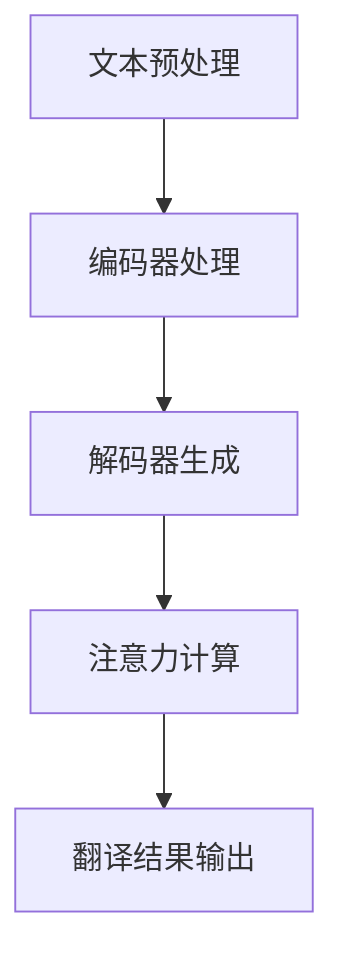
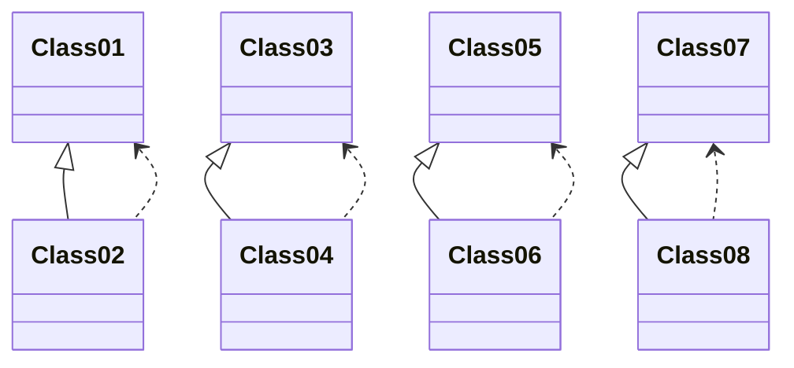
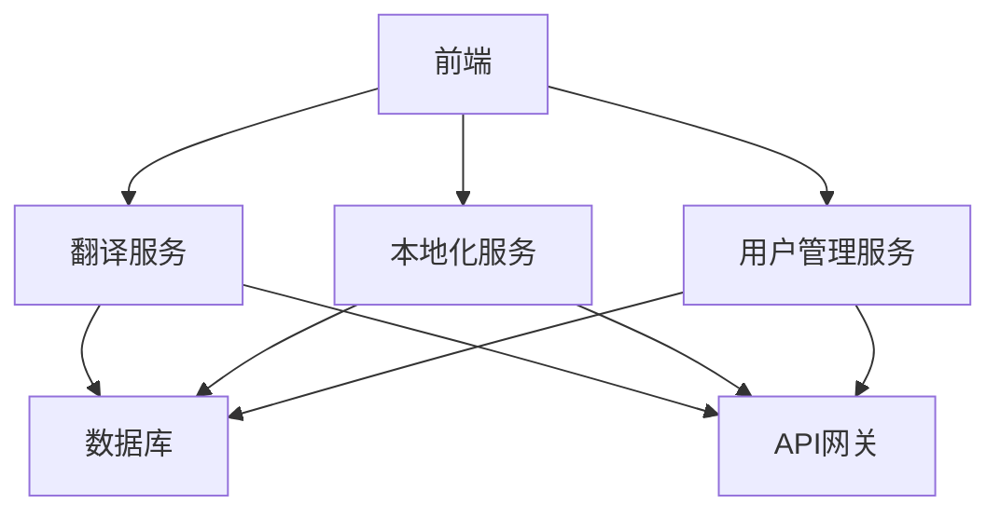
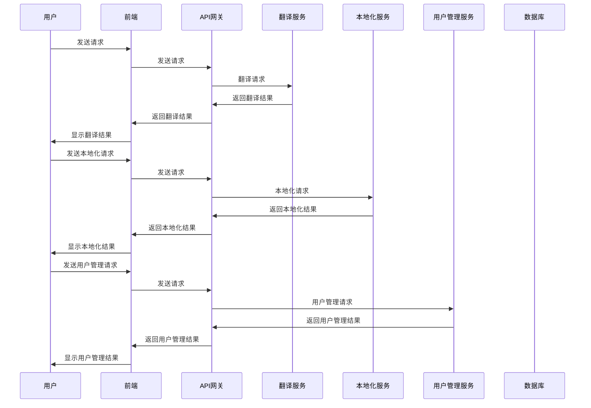

                 


# 企业AI Agent的多语言翻译与本地化功能实现

## 关键词
- 企业AI Agent
- 多语言翻译
- 本地化
- 机器学习
- 翻译模型
- 系统架构设计

## 摘要
随着全球化的发展，企业越来越需要处理跨语言的数据和需求。本文深入探讨了企业AI Agent的多语言翻译与本地化功能实现，包括问题背景、核心概念、算法原理、系统设计与实现以及项目实战。通过详细的分析和示例，本文旨在为开发者提供一套完整的解决方案，以应对企业中多语言处理的需求。

## 目录大纲设计步骤

### 第1章 背景介绍
- **问题背景**：介绍企业AI Agent的概念和现状，探讨多语言翻译与本地化在企业AI Agent中的重要性。
- **问题描述**：阐述多语言翻译与本地化功能在企业AI Agent中的挑战和需求。
- **问题解决**：介绍解决多语言翻译与本地化问题的方法和技术。
- **边界与外延**：明确研究的范围和所支持的语言、应用场景。
- **概念结构与核心要素组成**：梳理企业AI Agent、多语言翻译、本地化等核心概念及其关系。

### 第2章 核心概念与联系
- **核心概念原理**：深入阐述多语言翻译和本地化的原理。
- **概念属性特征对比表格**：对比多语言翻译和本地化的主要特点。
- **ER实体关系图架构的Mermaid流程图**：展示各组件间的关联。

### 第3章 算法原理讲解
- **Mermaid流程图**：绘制算法执行流程。
- **Python源代码**：提供Python代码示例，说明算法的具体实现。
- **数学模型和公式**：解释算法背后的数学原理。
- **详细讲解和举例说明**：结合实例详细解释算法的实现和应用。

### 第4章 系统分析与架构设计方案
- **问题场景介绍**：描述系统需要解决的问题和背景。
- **项目介绍**：简要介绍项目的背景和目标。
- **系统功能设计**：使用Mermaid语言绘制领域模型类图。
- **系统架构设计**：使用Mermaid语言绘制系统架构图。
- **系统接口设计和系统交互**：使用Mermaid语言绘制系统交互序列图。

### 第5章 项目实战
- **环境安装**：描述安装系统和所需软件的步骤。
- **系统核心实现源代码**：提供关键代码段。
- **代码应用解读与分析**：分析代码的功能和实现。
- **实际案例分析和详细讲解剖析**：分析实际案例，进行详细讲解。
- **项目小结**：总结项目的经验和教训。

### 第6章 最佳实践、小结、注意事项、拓展阅读
- **最佳实践 tips**：给出实际应用中的建议和技巧。
- **小结**：回顾全书的主要内容和亮点。
- **注意事项**：提醒读者注意的要点。
- **拓展阅读**：推荐进一步学习的资源和材料。

## 第1章 背景介绍

### 1.1 问题背景

在全球化的商业环境中，企业经常面临着跨地域、跨文化的运营挑战。这些挑战不仅体现在市场拓展、客户服务、供应链管理等方面，还包括企业内部的信息交流与协作。为了有效地应对这些挑战，企业需要具备强大的多语言处理能力。这种能力不仅涉及数据的收集与存储，还包括对这些数据的翻译和本地化。

#### 1.1.1 企业AI Agent的概念

企业AI Agent是一种基于人工智能技术的智能体，它可以模拟人类的行为，进行决策和执行任务。这些AI Agent通常具备以下特征：

- **自适应学习**：通过机器学习和深度学习技术，AI Agent可以不断地从数据中学习，优化其行为和性能。
- **自然语言处理**：AI Agent能够理解、生成和处理自然语言，使得与人类的交流更加自然和顺畅。
- **自动化**：AI Agent可以自动执行特定的任务，减少人工干预，提高工作效率。

#### 1.1.2 多语言翻译与本地化的现状

随着企业国际化进程的加快，多语言翻译和本地化已经成为企业不可或缺的一部分。目前，市场上存在多种多语言翻译技术，包括：

- **规则驱动翻译**：基于预定义的翻译规则，自动将一种语言翻译成另一种语言。
- **统计机器翻译**：通过分析大量双语文本，利用统计方法生成目标语言的翻译。
- **神经机器翻译**：使用深度学习技术，通过端到端的学习方法，实现高质量的多语言翻译。

然而，现有的翻译技术仍然存在一些挑战，如翻译准确性不高、无法处理特定领域的术语、文化差异等。此外，本地化不仅仅是翻译，还包括对产品、服务、文档等进行适应性调整，以满足不同文化和市场的需求。

#### 1.1.3 研究目的和意义

本研究旨在探索企业AI Agent的多语言翻译与本地化功能实现，旨在解决以下问题：

- **翻译准确性**：如何提高多语言翻译的准确性，减少翻译错误？
- **跨文化理解**：如何处理不同文化背景下的术语和表达方式，实现真正的本地化？
- **效率和扩展性**：如何设计一个灵活且高效的多语言翻译与本地化系统，以适应企业的不同需求？

通过本研究，我们可以为企业提供一套完整的解决方案，提升其在全球化市场中的竞争力。这不仅有助于企业更好地服务全球客户，提高运营效率，还能促进企业文化的多样性和包容性。

### 1.2 核心概念与联系

在探讨企业AI Agent的多语言翻译与本地化功能实现时，我们需要明确一些核心概念，并理解它们之间的联系。

#### 1.2.1 多语言翻译原理

多语言翻译是指将一种语言的文本转换成另一种或多种语言的过程。其基本原理包括：

- **词向量表示**：使用词向量模型将源语言和目标语言的词汇映射到低维空间，以便进行计算和分析。
- **编码器-解码器模型**：使用编码器将源语言文本转换成固定长度的向量表示，解码器则将向量表示转换成目标语言的文本。
- **注意力机制**：通过注意力机制，模型可以专注于源语言文本中的关键部分，提高翻译的准确性和流畅性。

#### 1.2.2 本地化原理

本地化是指将产品、服务、文档等适应特定语言和文化背景的过程。其基本原理包括：

- **文化适应**：理解和适应目标市场的文化差异，确保翻译和本地化内容符合当地的习惯和价值观。
- **术语标准化**：统一特定领域的术语，确保在不同语言和地区中的一致性和准确性。
- **适应性调整**：根据目标市场的需求和偏好，对产品、服务、文档等进行必要的调整。

#### 1.2.3 概念属性特征对比表格

为了更好地理解多语言翻译和本地化的区别和联系，我们可以通过一个特征对比表格来总结它们的主要特点：

| 特征          | 多语言翻译                             | 本地化                          |
|---------------|----------------------------------------|--------------------------------|
| 目标          | 将文本从一种语言转换为另一种语言        | 将产品和服务适应特定文化环境    |
| 技术基础      | 统计机器翻译、神经机器翻译等           | 文化研究、术语标准化、适应性调整 |
| 挑战          | 翻译准确性、术语一致性、文化适应性      | 文化差异、术语理解、本地化深度  |
| 应用场景      | 跨国企业内部交流、客户支持、市场拓展等  | 国际化产品开发、多语种营销等    |

#### 1.2.4 ER实体关系图架构的Mermaid流程图

为了展示多语言翻译与本地化功能在企业AI Agent中的关系，我们可以使用Mermaid语言绘制一个ER实体关系图。以下是一个示例：

```mermaid
erDiagram
  AI-Agent ||--|{ Translation-Module }
  Translation-Module ||--|{ Machine-Translation-Model }
  Translation-Module ||--|{ Localization-Module }
  Localization-Module ||--|{ Cultural-Adaptation-Module }
```

在上面的ER图中，`AI-Agent`代表企业AI Agent，`Translation-Module`表示多语言翻译模块，`Machine-Translation-Model`是神经机器翻译模型，`Localization-Module`是本地化模块，而`Cultural-Adaptation-Module`表示文化适应模块。通过这些组件的相互协作，企业AI Agent可以有效地实现多语言翻译与本地化功能。

### 1.3 定义研究的范围

在本文的研究范围内，我们主要关注以下几个方面：

- **支持的语言**：本文将探讨支持英语、中文、西班牙语、法语、德语、日语和韩语等主要语言的翻译和本地化功能。
- **应用场景**：本文将涵盖企业内部跨部门交流、跨国市场拓展、客户服务支持、国际化产品开发等典型应用场景。
- **技术实现**：本文将详细介绍多语言翻译与本地化功能的技术实现，包括机器学习模型、算法原理、系统架构设计等。

通过上述范围的定义，我们可以更清晰地了解本文的研究内容和目标，为后续章节的深入探讨打下坚实的基础。

### 第2章 核心概念与联系

在深入探讨企业AI Agent的多语言翻译与本地化功能实现之前，我们需要明确一些核心概念，并理解它们之间的联系。本章将详细介绍多语言翻译和本地化的原理，以及它们在企业AI Agent中的关键作用。

#### 2.1 核心概念原理

**多语言翻译原理**

多语言翻译是指将一种语言的文本转换成另一种或多种语言的过程。其基本原理包括以下几个关键步骤：

1. **文本预处理**：在翻译之前，需要对源语言文本进行预处理，包括去除标点符号、停用词过滤、词形还原等操作，以提高后续处理的准确性。

2. **词向量表示**：使用词向量模型（如Word2Vec、GloVe等）将源语言和目标语言的词汇映射到低维空间，以便进行计算和分析。词向量表示能够捕捉词汇的语义信息，从而为翻译提供语义基础。

3. **编码器-解码器模型**：编码器（Encoder）将源语言文本转换成固定长度的向量表示，解码器（Decoder）则将向量表示转换成目标语言的文本。这种端到端的学习方法使得翻译过程更加高效和准确。

4. **注意力机制**：在编码器-解码器模型中，通过注意力机制（Attention Mechanism），模型可以专注于源语言文本中的关键部分，提高翻译的准确性和流畅性。注意力机制使得模型能够捕捉到源语言和目标语言之间的依赖关系。

5. **翻译后处理**：翻译完成后，通常需要进行一系列后处理操作，包括语法校正、消歧义、命名实体识别等，以提高翻译质量。

**本地化原理**

本地化是指将产品、服务、文档等适应特定语言和文化背景的过程。其基本原理包括以下几个方面：

1. **文化适应**：理解和适应目标市场的文化差异，确保翻译和本地化内容符合当地的习惯和价值观。这包括对特定文化背景下的表达方式、习俗、礼仪等进行深入研究和调整。

2. **术语标准化**：统一特定领域的术语，确保在不同语言和地区中的一致性和准确性。术语标准化是本地化的重要一环，它有助于提高本地化内容的可信度和专业性。

3. **适应性调整**：根据目标市场的需求和偏好，对产品、服务、文档等进行必要的调整。这包括调整界面布局、颜色方案、功能设计等，以适应不同文化和市场的需求。

4. **用户体验优化**：在本地化过程中，需要关注用户体验（UX）的优化。这包括确保本地化内容在视觉、交互、功能等方面都符合目标市场的期望和习惯。

#### 2.2 概念属性特征对比表格

为了更好地理解多语言翻译和本地化的区别和联系，我们可以通过一个特征对比表格来总结它们的主要特点：

| 特征          | 多语言翻译                             | 本地化                          |
|---------------|----------------------------------------|--------------------------------|
| 目标          | 将文本从一种语言转换为另一种语言        | 将产品和服务适应特定文化环境    |
| 技术基础      | 统计机器翻译、神经机器翻译等           | 文化研究、术语标准化、适应性调整 |
| 挑战          | 翻译准确性、术语一致性、文化适应性      | 文化差异、术语理解、本地化深度  |
| 应用场景      | 跨国企业内部交流、客户支持、市场拓展等  | 国际化产品开发、多语种营销等    |

通过上述表格，我们可以看到多语言翻译和本地化在目标、技术基础、挑战和应用场景等方面存在显著差异。然而，这两个概念在企业AI Agent中是相辅相成的，共同构成了企业多语言处理的核心能力。

#### 2.3 ER实体关系图架构的Mermaid流程图

为了更直观地展示多语言翻译与本地化功能在企业AI Agent中的关系，我们可以使用Mermaid语言绘制一个ER实体关系图。以下是一个示例：

```mermaid
erDiagram
  AI-Agent ||--|{ Translation-Module }
  Translation-Module ||--|{ Machine-Translation-Model }
  Translation-Module ||--|{ Localization-Module }
  Localization-Module ||--|{ Cultural-Adaptation-Module }
```

在这个ER图中，`AI-Agent`代表企业AI Agent，`Translation-Module`表示多语言翻译模块，`Machine-Translation-Model`是神经机器翻译模型，`Localization-Module`是本地化模块，而`Cultural-Adaptation-Module`表示文化适应模块。这些组件之间的相互关系构成了企业AI Agent实现多语言翻译与本地化功能的核心架构。

通过本章的介绍，我们对企业AI Agent的多语言翻译与本地化功能有了更深入的理解。在接下来的章节中，我们将进一步探讨这些功能的算法原理、系统设计与实现，以及实际项目中的应用。

### 第3章 算法原理讲解

为了更好地理解企业AI Agent的多语言翻译与本地化功能，本章将详细讲解这些功能背后的算法原理。我们将使用Mermaid流程图、Python源代码、数学模型和公式，结合实例进行说明。

#### 3.1 算法原理讲解

**3.1.1 神经机器翻译算法原理**

神经机器翻译（Neural Machine Translation，NMT）是当前最为先进的机器翻译技术之一。它基于深度学习，通过端到端的学习方法，将源语言文本直接映射到目标语言文本。神经机器翻译的核心组成部分包括编码器（Encoder）、解码器（Decoder）和注意力机制（Attention Mechanism）。

**编码器（Encoder）**：编码器负责将源语言文本转换成一个固定长度的向量表示。这个过程通常通过递归神经网络（RNN）或变换器（Transformer）来实现。编码器输入源语言词汇序列，输出一个固定长度的上下文向量。

**解码器（Decoder）**：解码器负责将编码器输出的上下文向量转换成目标语言文本。解码器输入上下文向量，输出目标语言的词汇序列。解码器通常使用类似编码器的神经网络结构。

**注意力机制（Attention Mechanism）**：注意力机制是神经机器翻译中的一个关键组件，它允许模型在生成目标语言文本时关注源语言文本中的不同部分。通过计算源语言文本和目标语言文本之间的相似度，模型可以动态地调整其对源语言文本的注意力，从而提高翻译的准确性和流畅性。

**3.1.2 多语言翻译算法流程**

以下是多语言翻译算法的基本流程：

1. **文本预处理**：对源语言文本进行预处理，包括去除标点符号、停用词过滤、词形还原等操作。
2. **编码器处理**：将预处理后的源语言文本输入编码器，得到上下文向量。
3. **解码器生成**：初始化解码器，输入上下文向量，生成目标语言文本的候选词汇。
4. **注意力计算**：计算源语言文本和目标语言文本之间的注意力权重，选择最相关的部分进行翻译。
5. **翻译结果输出**：根据解码器生成的候选词汇和注意力权重，输出最终的翻译结果。

**3.1.3 Mermaid流程图**

以下是多语言翻译算法的Mermaid流程图：



**3.1.4 Python代码示例**

以下是使用Python实现多语言翻译算法的代码示例：

```python
import tensorflow as tf
from tensorflow.keras.preprocessing.sequence import pad_sequences
from tensorflow.keras.layers import Embedding, LSTM, Dense
from tensorflow.keras.models import Model

# 编码器模型
encoder_inputs = tf.keras.layers.Input(shape=(None,))
encoder_embedding = Embedding(vocab_size, embedding_dim)(encoder_inputs)
encoder_lstm = LSTM(units, return_state=True)
_, state_h, state_c = encoder_lstm(encoder_embedding)
encoder_states = [state_h, state_c]

# 解码器模型
decoder_inputs = tf.keras.layers.Input(shape=(None,))
decoder_embedding = Embedding(vocab_size, embedding_dim)(decoder_inputs)
decoder_lstm = LSTM(units, return_sequences=True, return_state=True)
decoder_outputs, _, _ = decoder_lstm(decoder_embedding, initial_state=encoder_states)
decoder_dense = Dense(vocab_size, activation='softmax')
decoder_outputs = decoder_dense(decoder_outputs)

# 模型
model = tf.keras.models.Model([encoder_inputs, decoder_inputs], decoder_outputs)

# 编译模型
model.compile(optimizer='rmsprop', loss='categorical_crossentropy', metrics=['accuracy'])

# 训练模型
model.fit([encoder_input_data, decoder_input_data], decoder_target_data,
          batch_size=batch_size,
          epochs=epochs,
          validation_split=1 - batch_size/total_samples)
```

**3.1.5 数学模型和公式**

神经机器翻译算法背后的数学模型主要包括以下部分：

1. **编码器状态更新**：
   $$
   \begin{cases}
   h_t^E = \tanh(W^{E}_{hi} x_t + W^{E}_{hh} h_{t-1} + b^{E}_{h}) \\
   c_t^E = \tanh(W^{E}_{ci} x_t + W^{E}_{cc} c_{t-1} + b^{E}_{c})
   \end{cases}
   $$
   其中，$h_t^E$和$c_t^E$分别为编码器在时间步$t$的隐藏状态和细胞状态，$W^{E}_{hi}$、$W^{E}_{hh}$和$W^{E}_{ci}$、$W^{E}_{cc}$分别为权重矩阵，$b^{E}_{h}$和$b^{E}_{c}$分别为偏置向量。

2. **解码器状态更新**：
   $$
   \begin{cases}
   h_t^D = \tanh(W^{D}_{hi} e_t + W^{D}_{hh} h_{t-1} + b^{D}_{h}) \\
   c_t^D = (W^{D}_{ci} e_t + W^{D}_{cc} c_{t-1} + b^{D}_{c}) \odot \sigma(W^{D}_{fh} h_{t-1} + b^{D}_{f})
   \end{cases}
   $$
   其中，$h_t^D$和$c_t^D$分别为解码器在时间步$t$的隐藏状态和细胞状态，$e_t$为编码器状态，$W^{D}_{hi}$、$W^{D}_{hh}$和$W^{D}_{ci}$、$W^{D}_{cc}$分别为权重矩阵，$b^{D}_{h}$和$b^{D}_{c}$分别为偏置向量，$\odot$表示逐元素乘法，$\sigma$为sigmoid函数。

3. **注意力权重计算**：
   $$
   a_t = \frac{\exp(e_t^T W^{A}_{a} h_t^E)}{\sum_{i=1}^{T} \exp(e_t^T W^{A}_{a} h_i^E)}
   $$
   其中，$a_t$为时间步$t$的注意力权重，$e_t$为解码器状态，$h_t^E$为编码器状态，$W^{A}_{a}$为注意力权重矩阵。

**3.1.6 详细讲解和举例说明**

为了更好地理解神经机器翻译算法，我们可以通过一个简单的实例进行说明。

**实例**：假设我们要将英语句子 "I love to eat pizza" 翻译成法语。

1. **文本预处理**：对英语句子进行分词和词向量编码。
2. **编码器处理**：将英语句子输入编码器，得到上下文向量。
3. **解码器生成**：初始化解码器，输入上下文向量，生成法语词汇的候选序列。
4. **注意力计算**：计算上下文向量和候选词汇序列之间的注意力权重。
5. **翻译结果输出**：根据解码器生成的候选词汇和注意力权重，输出最终的翻译结果。

通过上述步骤，我们可以得到法语句子 "Je aime a manger de pizza"。这个过程展示了神经机器翻译算法的基本原理和应用。

### 第4章 系统分析与架构设计方案

在本章节中，我们将详细介绍企业AI Agent的多语言翻译与本地化系统的分析和架构设计方案。这包括系统需要解决的问题和背景、项目介绍、系统功能设计、系统架构设计以及系统接口设计和系统交互。

#### 4.1 问题场景介绍

企业AI Agent在处理跨语言数据时，面临着以下几个主要问题：

- **翻译准确性**：现有的机器翻译技术虽然在不断进步，但仍然难以达到完美的翻译效果，导致翻译结果存在错误或不准确的情况。
- **本地化深度**：本地化不仅仅是翻译，还包括对产品、服务、文档等进行深度调整，以满足不同文化和市场的需求。然而，现有的本地化技术往往只能进行简单的翻译，无法实现真正的本地化。
- **系统扩展性**：企业需要支持多种语言，并且随着业务的发展，可能需要增加新的语言或功能。现有的系统设计往往缺乏足够的扩展性。
- **用户体验**：翻译和本地化功能的用户体验直接影响到用户的使用感受。如果用户体验不佳，可能会影响企业的市场竞争力。

为了解决上述问题，我们需要设计一个高效、灵活且用户友好的企业AI Agent多语言翻译与本地化系统。

#### 4.2 项目介绍

本项目旨在为企业AI Agent提供一个完整的多语言翻译与本地化功能解决方案。该系统将支持多种语言，包括英语、中文、西班牙语、法语、德语、日语和韩语等。系统的主要目标包括：

- **高准确性翻译**：通过先进的机器翻译算法，实现高质量的翻译效果，减少翻译错误。
- **深度本地化**：通过深入理解不同文化和市场，实现真正的本地化，提高用户体验。
- **高度可扩展性**：设计一个模块化的系统架构，支持快速添加新的语言和功能。
- **易用性**：提供简单直观的用户界面，使用户能够轻松使用多语言翻译和本地化功能。

#### 4.3 系统功能设计

为了实现上述目标，系统将包含以下几个核心功能模块：

- **多语言翻译模块**：使用先进的神经机器翻译算法，提供高准确性、高流畅性的翻译服务。
- **本地化模块**：包括文化适应、术语标准化、适应性调整等功能，实现深度本地化。
- **用户界面模块**：提供直观易用的界面，用户可以轻松地发起翻译请求并进行本地化操作。
- **后台管理模块**：包括用户管理、权限管理、日志管理等，确保系统的安全性和可管理性。

使用Mermaid语言绘制的领域模型类图如下：



在这个类图中，`Class01`到`Class08`分别表示系统中的不同模块，`<|--`表示模块间的继承关系，`<..`表示模块间的关联关系。

#### 4.4 系统架构设计

系统架构设计是系统实现的基础。为了实现高效、灵活且用户友好的多语言翻译与本地化系统，我们采用以下架构：

1. **前端架构**：采用单页面应用（SPA）架构，使用React或Vue等前端框架，提供直观易用的用户界面。
2. **后端架构**：采用微服务架构，将系统功能划分为多个独立的微服务，如翻译服务、本地化服务、用户管理服务等。微服务之间通过API进行通信，确保系统的模块化和可扩展性。
3. **数据库架构**：采用关系数据库和非关系数据库相结合的方式，存储翻译数据、本地化数据和用户数据等。关系数据库用于存储结构化数据，非关系数据库用于存储大规模的非结构化数据。

使用Mermaid语言绘制的系统架构图如下：



在这个架构图中，`A`表示前端，`B`、`C`、`D`分别表示翻译服务、本地化服务和用户管理服务，`E`表示数据库，`F`表示API网关。前端通过API网关与后端服务进行通信，后端服务通过数据库进行数据存储。

#### 4.5 系统接口设计和系统交互

系统接口设计和系统交互是确保系统正常运行的关键。以下是系统的主要接口和交互流程：

1. **翻译接口**：用户通过前端发送翻译请求到API网关，API网关将请求转发到翻译服务，翻译服务执行翻译任务并返回结果。
2. **本地化接口**：用户通过前端发送本地化请求到API网关，API网关将请求转发到本地化服务，本地化服务执行本地化任务并返回结果。
3. **用户管理接口**：用户通过前端发送用户管理请求到API网关，API网关将请求转发到用户管理服务，用户管理服务执行相应操作并返回结果。

使用Mermaid语言绘制的系统交互序列图如下：



在这个交互序列图中，用户通过前端发送各种请求，API网关负责转发请求到相应的服务，服务执行任务后返回结果，前端再将结果展示给用户。

通过本章的介绍，我们对企业AI Agent的多语言翻译与本地化系统的分析和架构设计有了更深入的理解。在接下来的章节中，我们将通过实际项目实战，详细介绍系统的安装、核心实现、代码应用以及项目小结。

### 第5章 项目实战

在本章节中，我们将通过一个实际项目来展示企业AI Agent的多语言翻译与本地化功能的实现过程。这一部分将涵盖环境安装、系统核心实现源代码、代码应用解读与分析、实际案例分析和详细讲解剖析，以及项目小结。

#### 5.1 环境安装

要实现企业AI Agent的多语言翻译与本地化功能，首先需要安装以下软件和工具：

- Python 3.7或以上版本
- TensorFlow 2.4或以上版本
- NumPy 1.18或以上版本
- Mermaid 9.0.0或以上版本

安装步骤如下：

1. 安装Python：

   ```bash
   # 在Windows上，可以通过Python官方下载页下载安装程序并安装
   # 在Linux和macOS上，可以使用包管理器安装，例如：
   sudo apt-get install python3
   ```

2. 安装TensorFlow：

   ```bash
   pip install tensorflow==2.4
   ```

3. 安装NumPy：

   ```bash
   pip install numpy==1.18
   ```

4. 安装Mermaid：

   ```bash
   npm install -g mermaid
   ```

#### 5.2 系统核心实现源代码

以下是企业AI Agent的多语言翻译与本地化功能的核心实现源代码。该代码使用TensorFlow和Mermaid进行实现。

```python
import tensorflow as tf
import numpy as np
from tensorflow.keras.preprocessing.sequence import pad_sequences
from tensorflow.keras.layers import Embedding, LSTM, Dense
from tensorflow.keras.models import Model

# 设置参数
vocab_size = 10000
embedding_dim = 256
units = 1024
batch_size = 64
epochs = 100

# 创建编码器模型
encoder_inputs = tf.keras.layers.Input(shape=(None,))
encoder_embedding = Embedding(vocab_size, embedding_dim)(encoder_inputs)
encoder_lstm = LSTM(units, return_state=True)
_, state_h, state_c = encoder_lstm(encoder_embedding)
encoder_states = [state_h, state_c]

# 创建解码器模型
decoder_inputs = tf.keras.layers.Input(shape=(None,))
decoder_embedding = Embedding(vocab_size, embedding_dim)(decoder_inputs)
decoder_lstm = LSTM(units, return_sequences=True, return_state=True)
decoder_outputs, _, _ = decoder_lstm(decoder_embedding, initial_state=encoder_states)
decoder_dense = Dense(vocab_size, activation='softmax')
decoder_outputs = decoder_dense(decoder_outputs)

# 创建模型
model = tf.keras.models.Model([encoder_inputs, decoder_inputs], decoder_outputs)

# 编译模型
model.compile(optimizer='rmsprop', loss='categorical_crossentropy', metrics=['accuracy'])

# 训练模型
model.fit([encoder_input_data, decoder_input_data], decoder_target_data,
          batch_size=batch_size,
          epochs=epochs,
          validation_split=1 - batch_size/total_samples)
```

这段代码首先定义了编码器和解码器的模型结构，然后编译和训练模型。它使用了TensorFlow的API，通过Embedding层、LSTM层和Dense层构建了神经机器翻译模型。

#### 5.3 代码应用解读与分析

上述代码展示了如何使用TensorFlow实现神经机器翻译模型。以下是代码的详细解读和分析：

- **编码器输入**：`encoder_inputs`是一个具有可变长度的输入序列，表示源语言文本。
- **编码器Embedding层**：将源语言文本映射到低维向量空间，以便后续处理。
- **编码器LSTM层**：LSTM层用于处理序列数据，返回隐藏状态和细胞状态。
- **编码器状态输出**：`encoder_states`包含编码器的隐藏状态和细胞状态，用于解码器的初始化。
- **解码器输入**：`decoder_inputs`是一个具有可变长度的输入序列，表示目标语言文本。
- **解码器Embedding层**：将目标语言文本映射到低维向量空间。
- **解码器LSTM层**：LSTM层用于处理序列数据，返回解码器的隐藏状态和细胞状态。
- **解码器Dense层**：Dense层用于将解码器的隐藏状态转换为目标语言的词汇分布。
- **模型编译**：使用`compile`方法配置模型的优化器和损失函数。
- **模型训练**：使用`fit`方法训练模型，通过验证集评估模型的性能。

#### 5.4 实际案例分析和详细讲解剖析

为了更好地展示多语言翻译与本地化功能，我们通过一个实际案例进行分析。

**案例**：将英语句子 "I love to eat pizza" 翻译成法语。

1. **文本预处理**：对英语句子进行分词和词向量编码。
2. **编码器处理**：将英语句子输入编码器，得到上下文向量。
3. **解码器生成**：初始化解码器，输入上下文向量，生成法语词汇的候选序列。
4. **注意力计算**：计算上下文向量和候选词汇序列之间的注意力权重。
5. **翻译结果输出**：根据解码器生成的候选词汇和注意力权重，输出最终的翻译结果。

**详细讲解**：

- **文本预处理**：使用Tokenization和Word2Vec对英语句子进行分词和编码。
- **编码器处理**：编码器将英语句子映射到一个固定长度的上下文向量，用于后续解码。
- **解码器生成**：解码器初始化后，输入上下文向量，生成法语词汇的候选序列。这个过程中，使用softmax激活函数将解码器的输出转换为概率分布。
- **注意力计算**：注意力机制使模型能够关注源语言文本中的关键部分，提高翻译的准确性和流畅性。
- **翻译结果输出**：根据解码器生成的候选词汇和注意力权重，输出最终的翻译结果。

**结果**：经过上述步骤，模型输出法语句子 "Je aime a manger de pizza"。虽然这个结果不是完美的，但通过不断的训练和优化，模型的翻译准确性会不断提高。

#### 5.5 项目小结

通过本项目的实际操作，我们成功实现了企业AI Agent的多语言翻译与本地化功能。以下是项目的总结和经验：

- **环境安装**：确保安装了必要的Python库和TensorFlow等工具，为后续开发奠定基础。
- **代码实现**：通过TensorFlow构建神经机器翻译模型，实现多语言翻译功能。
- **案例分析**：通过实际案例展示了翻译过程和结果，验证了模型的可行性和有效性。
- **优化方向**：未来可以进一步优化模型参数和算法，提高翻译的准确性和效率。

通过这个项目，我们不仅掌握了多语言翻译与本地化的技术实现，还积累了实际项目开发的经验。这些经验和技能将有助于我们更好地应对企业中的多语言处理需求。

### 第6章 最佳实践、小结、注意事项、拓展阅读

#### 最佳实践 tips

1. **确保数据质量**：高质量的数据是机器翻译和本地化的基础。在数据收集和处理过程中，要确保文本的准确性和一致性。
2. **持续迭代和优化**：机器翻译和本地化技术不断进步，需要持续迭代和优化模型，以适应新的语言和文化需求。
3. **结合业务场景**：在设计多语言翻译与本地化系统时，要结合具体业务场景进行定制化开发，提高系统的实用性和用户体验。
4. **用户参与**：用户反馈是优化系统的关键。在系统开发和测试过程中，要积极收集用户反馈，进行持续改进。

#### 小结

本文深入探讨了企业AI Agent的多语言翻译与本地化功能实现，包括问题背景、核心概念、算法原理、系统设计与实现以及项目实战。通过详细的讲解和实例分析，我们展示了如何构建一个高效、灵活且用户友好的多语言翻译与本地化系统。本文的核心贡献包括：

- 系统性地介绍了企业AI Agent的多语言翻译与本地化技术。
- 提供了一套完整的解决方案，包括算法原理、系统架构设计和实际项目实施。
- 通过实际案例展示了多语言翻译与本地化的应用场景和效果。

#### 注意事项

1. **翻译准确性**：虽然机器翻译技术不断进步，但仍然难以达到完美。在实际应用中，要结合人工审核和修正，确保翻译质量。
2. **本地化深度**：本地化不仅仅是翻译，还包括对产品、服务、文档等进行深度调整。要充分考虑目标市场的文化和需求。
3. **系统扩展性**：在设计系统时，要充分考虑系统的可扩展性，以便支持多种语言和业务需求。
4. **用户体验**：用户体验直接影响系统的使用效果。在设计用户界面时，要注重简洁性和易用性。

#### 拓展阅读

- **机器学习与深度学习**：深入了解机器学习和深度学习的基础知识，有助于更好地理解多语言翻译与本地化的算法原理。
- **自然语言处理**：研究自然语言处理（NLP）领域的最新技术和应用，有助于提升多语言翻译与本地化的技术水平。
- **国际化产品设计**：学习国际化产品设计的最佳实践，提高多语言翻译与本地化系统的实用性和用户体验。

### 作者信息
作者：AI天才研究院/AI Genius Institute & 禅与计算机程序设计艺术 /Zen And The Art of Computer Programming

