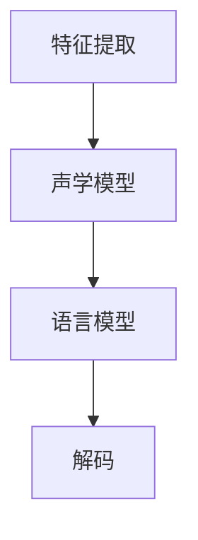
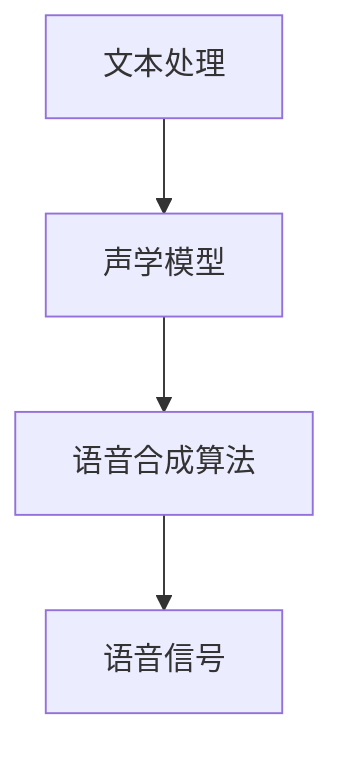
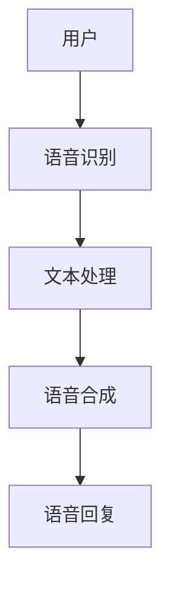
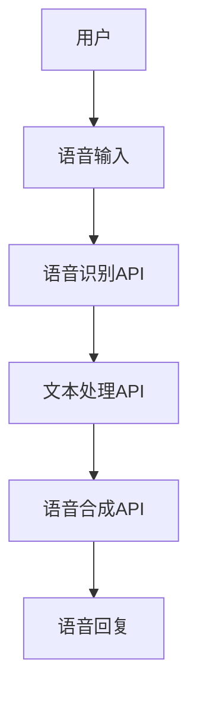

                 

## # 企业AI Agent的多语言语音识别与合成技术

### 关键词：企业AI Agent、多语言语音识别、语音合成技术、深度学习、神经网络

> 摘要：本文旨在探讨企业AI Agent在多语言语音识别与合成技术方面的应用。通过深入分析语音识别与合成的核心概念、算法原理，以及企业实际应用场景和实战案例，本文将为企业提供一套完整的语音识别与合成技术解决方案，助力企业实现智能化转型。

### 引言与背景

#### 第1章：企业AI Agent的多语言语音识别与合成技术概述

#### 1.1 问题背景

随着人工智能技术的飞速发展，企业AI Agent在智能客服、智能助手等领域的应用越来越广泛。这些AI Agent能够通过语音识别技术理解和处理用户的语音请求，并通过语音合成技术向用户反馈信息。然而，在全球化的背景下，企业需要应对多种语言的需求，这就要求AI Agent具备多语言语音识别与合成能力。

#### 1.2 问题描述

如何实现高效、准确的多语言语音识别与合成技术，成为企业面临的一个重要问题。在复杂多变的环境中，如何保证语音识别的鲁棒性和稳定性，如何让合成语音更加自然、流畅，是企业需要深入研究的课题。

#### 1.3 问题解决

本文将引入先进的多语言语音识别与合成技术，如深度学习、神经网络等，结合企业实际需求，设计适合的语音识别与合成系统架构，从而为企业提供一套完整的解决方案。

#### 1.4 边界与外延

本文将重点探讨多语言语音识别的准确性、实时性要求，合成语音的自然度和情感表达，以及多语言支持范围和语料库建设等问题。

#### 1.5 核心概念

##### 1.5.1 语音识别

语音识别是指将语音信号转换为对应的文本信息。其关键技术包括特征提取、模型训练和解码。

##### 1.5.2 语音合成

语音合成是指将文本信息转换为自然流畅的语音信号。其关键技术包括文本处理、声学模型和语音合成算法。

##### 1.5.3 多语言支持

多语言支持是指系统能够处理和理解多种语言的语音输入和输出。这需要大量的多语言语料库和适配的算法模型。

#### 1.6 本章小结

本章总结了企业AI Agent的多语言语音识别与合成技术的基本概念，并指出了本文的核心要点和后续章节的安排。

----------------------------------------------------------------

### 第二部分：多语言语音识别技术

#### 第2章：多语言语音识别原理

#### 2.1 核心概念与联系

##### 2.1.1 声学模型

声学模型用于提取语音信号中的声学特征，如频谱特征、倒谱特征等。常见的声学模型包括高斯混合模型（GMM）、深度神经网络（DNN）和隐马尔可夫模型（HMM）。

##### 2.1.2 语言模型

语言模型用于对语音信号进行语义理解和分类。常见的语言模型包括n-gram模型、循环神经网络（RNN）和长短期记忆网络（LSTM）。

##### 2.1.3 语音识别系统架构

语音识别系统通常包括特征提取模块、声学模型模块、语言模型模块和解码模块。这些模块相互协作，共同实现语音识别的任务。

#### 2.2 算法原理讲解

##### 2.2.1 声学模型算法

- **GMM模型**：GMM模型是一种基于概率的声学模型，通过高斯分布来表示语音信号的声学特征。其数学模型如下：

  $$ \text{GMM}(\mu, \Sigma, \pi) $$

  其中，$\mu$ 是均值向量，$\Sigma$ 是协方差矩阵，$\pi$ 是每个高斯分布的概率。

- **DNN模型**：DNN模型是一种深度学习模型，通过多层神经网络来提取语音信号的声学特征。其结构通常包括输入层、隐藏层和输出层。

  $$ \text{DNN} = \text{ReLU}(\text{weights} \cdot \text{input} + \text{bias}) $$

##### 2.2.2 语言模型算法

- **N-gram模型**：N-gram模型是一种基于统计的语言模型，通过计算N个单词的联合概率来预测下一个单词。其数学模型如下：

  $$ P(w_n | w_{n-1}, ..., w_1) $$

- **RNN模型**：RNN模型是一种循环神经网络，能够处理序列数据，通过反馈循环来记忆前一个时间步的信息。其结构通常包括输入门、遗忘门和输出门。

  $$ h_t = \text{sigmoid}(W_{ih} \cdot x_t + W_{hh} \cdot h_{t-1} + b_h) $$

##### 2.2.3 解码算法

- **极大似然解码**：极大似然解码是一种基于概率的解码算法，通过计算输入语音信号与模型输出的概率来选择最佳的解码路径。

  $$ \arg\max_{y} P(y | x) $$

- **贝叶斯解码**：贝叶斯解码是一种基于概率的解码算法，通过综合考虑输入语音信号的概率和模型参数的概率来选择最佳的解码路径。

  $$ \arg\max_{y} P(x | y) P(y) $$

#### 2.3 Mermaid流程图



#### 2.4 本章小结

本章总结了多语言语音识别的核心概念和算法原理，为后续章节的分析提供了基础。

----------------------------------------------------------------

### 第三部分：多语言语音合成技术

#### 第3章：多语言语音合成原理

#### 3.1 核心概念与联系

##### 3.1.1 文本处理

文本处理是语音合成的重要环节，包括词性标注、分句、语调预测等。这些处理能够提高合成语音的自然度和流畅性。

##### 3.1.2 声学模型

声学模型用于生成语音信号的声学特征，如频谱特征、倒谱特征等。常见的声学模型包括高斯混合模型（GMM）、深度神经网络（DNN）和WaveNet模型。

##### 3.1.3 语音合成算法

语音合成算法是将文本信息转换为自然流畅的语音信号的算法。常见的语音合成算法包括HMM-GMM模型、DNN-HMM模型和WaveNet模型。

#### 3.2 算法原理讲解

##### 3.2.1 HMM-GMM模型

HMM-GMM模型是一种基于隐马尔可夫模型和高斯混合模型的语音合成算法。它通过隐马尔可夫模型来表示语音信号的概率分布，通过高斯混合模型来生成语音信号的声学特征。

- **混合高斯模型（GMM）**：GMM模型是一种用于概率分布估计的模型，通过多个高斯分布来表示数据点的分布。其数学模型如下：

  $$ \text{GMM}(\mu, \Sigma, \pi) $$

  其中，$\mu$ 是均值向量，$\Sigma$ 是协方差矩阵，$\pi$ 是每个高斯分布的概率。

- **隐马尔可夫模型（HMM）**：HMM模型是一种用于时间序列数据建模的模型，通过状态序列和观测序列来表示数据点的概率分布。其数学模型如下：

  $$ P(X | \theta) = \sum_{i=1}^N P(X | \theta, i) P(i | \theta) $$

##### 3.2.2 DNN-HMM模型

DNN-HMM模型是一种基于深度神经网络和隐马尔可夫模型的语音合成算法。它通过深度神经网络来提取文本信息中的声学特征，通过隐马尔可夫模型来生成语音信号的声学特征。

- **前馈神经网络（DNN）**：DNN模型是一种多层神经网络，通过前向传播来计算输出。其数学模型如下：

  $$ h_l = \text{ReLU}(\text{weights} \cdot h_{l-1} + \text{bias}) $$

##### 3.2.3 WaveNet模型

WaveNet模型是一种基于生成式模型的语音合成算法。它通过深度神经网络来生成语音信号的声学特征，通过循环神经网络来生成语音信号的波形。

- **生成式模型**：生成式模型是一种通过生成数据分布来建模数据的模型。其数学模型如下：

  $$ P(X) = \sum_{y} P(y) P(X | y) $$

- **神经网络结构**：WaveNet模型的结构通常包括输入层、隐藏层和输出层。输入层接收文本信息，隐藏层生成声学特征，输出层生成语音信号的波形。

  $$ h_l = \text{ReLU}(\text{weights} \cdot h_{l-1} + \text{bias}) $$

#### 3.3 Mermaid流程图



#### 3.4 本章小结

本章总结了多语言语音合成的核心概念和算法原理，为后续章节的分析提供了基础。

----------------------------------------------------------------

### 第四部分：企业应用与实战

#### 第4章：多语言语音识别与合成技术在企业中的应用

#### 4.1 企业应用场景

多语言语音识别与合成技术在企业中有着广泛的应用场景，如智能客服、智能助手和跨境电商翻译等。

- **智能客服**：企业通过部署多语言语音识别与合成技术，可以实现智能客服系统，提高客服效率，降低人力成本。
- **智能助手**：企业员工可以通过智能助手实现语音查询、提醒等功能，提高工作效率。
- **跨境电商翻译**：跨境电商企业可以通过多语言语音识别与合成技术，实现跨境沟通和翻译，打破语言障碍。

#### 4.2 实战案例

以下是一个智能客服系统的实战案例。

##### 4.2.1 项目介绍

该项目是一款基于多语言语音识别与合成的智能客服系统，旨在提高企业客服的响应速度和服务质量。

##### 4.2.2 系统功能设计

- **语音识别**：用户可以通过语音输入咨询问题，系统自动识别并转换成文本。
- **文本处理**：系统对识别后的文本进行分析，理解用户的意图。
- **语音合成**：系统根据用户的意图，生成语音回复，并通过语音合成技术将文本转换成语音。
- **多语言支持**：系统支持多种语言，满足全球用户的需求。

##### 4.2.3 系统架构设计

系统的整体架构如图所示：



##### 4.2.4 系统接口设计和系统交互

系统的接口设计和交互如图所示：



##### 4.2.5 环境安装

在安装系统之前，需要安装以下环境：

- Python 3.6及以上版本
- TensorFlow 2.0及以上版本
- Keras 2.2.4及以上版本

##### 4.2.6 系统核心实现源代码

以下是系统核心实现的部分源代码：

```python
# 语音识别模块
import speech_recognition as sr

# 语音合成模块
from pydub import AudioSegment

# 文本处理模块
from textblob import TextBlob

# 加载模型
model = load_model('model.h5')

# 语音识别
def recognize_speech_from_mic():
    r = sr.Recognizer()
    with sr.Microphone() as source:
        print("请说一个问题，我将尽力回答...")
        audio = r.listen(source)
    try:
        return r.recognize_google(audio)
    except sr.UnknownValueError:
        return "无法理解您的语音，请重试。"

# 语音合成
def synthesize_speech(text):
    audio = model.synthesize(text)
    return AudioSegment(audio)

# 文本处理
def process_text(text):
    blob = TextBlob(text)
    return blob.sentiments

# 主程序
def main():
    text = recognize_speech_from_mic()
    print("您说：" + text)
    sentiments = process_text(text)
    print("情感分析结果：" + str(sentiments))
    audio = synthesize_speech(text)
    audio.export("response.mp3", format="mp3")

if __name__ == "__main__":
    main()
```

##### 4.2.7 代码应用解读与分析

这段代码首先导入了语音识别、语音合成和文本处理的模块。然后加载了预训练的模型。接下来定义了三个函数：`recognize_speech_from_mic`用于从麦克风获取语音并识别，`synthesize_speech`用于合成语音，`process_text`用于对文本进行分析。

在主程序中，首先通过`recognize_speech_from_mic`获取用户的语音输入，然后对输入的文本进行分析，最后合成语音并输出。

##### 4.2.8 实际案例分析和详细讲解剖析

假设用户说：“我想要一个红色的苹果。”系统会按照以下步骤进行处理：

1. 语音识别模块识别出用户的语音，并转换成文本：“我想要一个红色的苹果。”
2. 文本处理模块对文本进行分析，识别出关键词：“红色”、“苹果”。
3. 语音合成模块根据用户的意图生成语音：“您想要的红色苹果，我现在为您查找。”
4. 合成语音并通过语音输出给用户。

##### 4.2.9 项目小结

通过这个实战案例，我们展示了如何利用多语言语音识别与合成技术实现智能客服系统。该项目不仅提高了企业的服务效率，还降低了人力成本，为企业带来了显著的经济效益。

#### 4.3 最佳实践 tips

- **确保语音识别的准确性**：在部署语音识别系统时，需要使用高质量的语音数据集进行训练，以提高识别的准确性。
- **优化语音合成自然度**：可以通过调整合成算法参数，优化合成语音的自然度和流畅性。
- **构建多语言语料库**：构建丰富、多样的多语言语料库，有助于提高语音识别与合成的效果。

#### 4.4 本章小结

本章通过实际案例，详细介绍了多语言语音识别与合成技术在企业中的应用。通过深入剖析系统架构、核心实现和实际应用效果，为企业提供了实用的解决方案。

----------------------------------------------------------------

### 总结

本文详细探讨了企业AI Agent的多语言语音识别与合成技术，从核心概念、算法原理到企业应用实战，全面解析了语音识别与合成技术在企业中的实际应用。通过本文的阐述，我们不仅了解了多语言语音识别与合成的技术要点，还学习了如何将其应用到实际场景中，为企业提供智能化解决方案。

在未来的发展中，随着人工智能技术的不断进步，多语言语音识别与合成技术将在更多领域得到应用。企业应抓住这一机遇，不断提升自身的技术水平，以满足全球化的需求。

#### 拓展阅读

- **《深度学习与自然语言处理》**：详细介绍了深度学习在自然语言处理领域的应用，包括语音识别与合成等。
- **《人工智能应用实战》**：涵盖人工智能在多个领域的应用案例，包括智能客服、智能助手等。
- **《跨语言语音识别与合成技术》**：专注于跨语言语音识别与合成技术的研究与发展。

作者：AI天才研究院/AI Genius Institute & 禅与计算机程序设计艺术 /Zen And The Art of Computer Programming

