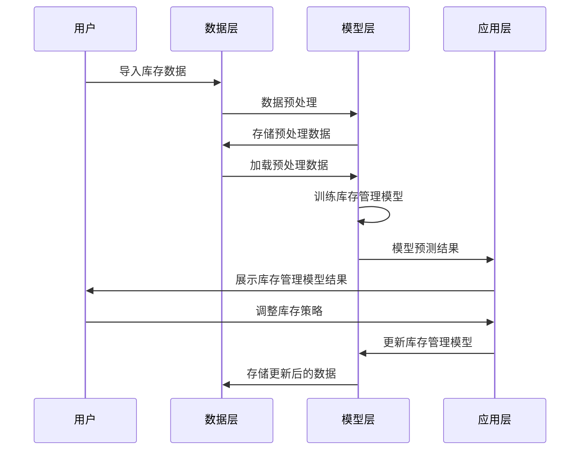

                 

# 企业AI Agent的强化学习在库存管理中的应用

> 关键词：强化学习、库存管理、AI Agent、企业应用

> 摘要：本文深入探讨了企业AI Agent的强化学习在库存管理中的应用。通过介绍强化学习的基本原理和企业AI Agent的设计，本文详细阐述了强化学习算法在库存管理中的具体应用场景，以及如何通过数学模型和公式进行优化。文章还提供了项目实战和最佳实践，为企业在库存管理中应用AI技术提供了有益的参考。

## 第一部分：背景介绍

### 1.1 引言

库存管理作为企业管理中至关重要的环节，直接影响企业的运营效率和市场竞争力。随着市场环境的不断变化和消费者需求的多样化，库存管理面临着前所未有的挑战。传统的库存管理方法已经无法满足现代企业的需求，这为人工智能（AI）在库存管理中的应用提供了契机。

### 1.2 问题描述

库存管理的问题主要包括：库存水平不合理导致缺货或过剩、库存成本高昂、库存周转速度慢等。这些问题的存在不仅增加了企业的运营成本，还影响了企业的盈利能力。

### 1.3 问题解决

AI技术，特别是强化学习（Reinforcement Learning, RL），在解决库存管理问题方面具有显著优势。强化学习通过不断尝试和反馈，能够优化库存策略，提高库存管理的效率和准确性。

### 1.4 边界与外延

在本书中，我们将主要探讨企业AI Agent如何通过强化学习技术应用于库存管理。这包括AI Agent的设计、强化学习算法的选取、策略优化过程以及实际应用效果评估等。

### 1.5 概念结构与核心要素组成

- 企业AI Agent：具备自主学习和优化库存策略能力的智能体。
- 强化学习：一种通过试错和反馈机制不断优化决策过程的学习方法。
- 库存管理：涉及库存水平控制、库存成本优化、库存周转率提升等多个方面的综合管理活动。

### 1.6 本章小结

通过本章的介绍，我们对企业AI Agent的强化学习在库存管理中的应用有了初步的了解。接下来，我们将深入探讨强化学习的基本原理和应用场景，为后续章节的内容奠定基础。

## 第二部分：核心概念与联系

### 2.1 强化学习的基本原理

#### 2.1.1 强化学习的定义

强化学习是一种机器学习方法，通过智能体与环境之间的交互，学习如何在环境中采取最优动作，以实现长期的奖励最大化。

#### 2.1.2 强化学习的核心概念

- 智能体（Agent）：执行动作并从环境中获取奖励的主体。
- 状态（State）：智能体在某一时刻所处的环境条件。
- 动作（Action）：智能体可以采取的行为。
- 奖励（Reward）：智能体执行动作后从环境中获得的即时回报。

#### 2.1.3 强化学习的属性特征对比表格

| 特征 | 强化学习 | 其他机器学习方法 |
| --- | --- | --- |
| 交互性 | 需要与环境不断交互获取反馈 | 无需与环境交互 |
| 目标性 | 以最大化长期奖励为目标 | 以分类、回归等为目标 |
| 自适应性 | 通过试错不断优化策略 | 依赖于预设算法和模型 |

#### 2.1.4 强化学习与库存管理的关系

强化学习通过模拟智能体在库存管理环境中的行为，不断调整库存策略，从而实现库存水平的优化。

### 2.2 企业AI Agent的设计

#### 2.2.1 企业AI Agent的定义

企业AI Agent是一种基于强化学习技术的智能体，用于解决企业库存管理中的实际问题。

#### 2.2.2 企业AI Agent的核心功能

- 库存水平预测：根据历史数据和当前环境状态，预测未来某一时期的库存水平。
- 库存策略优化：通过强化学习算法，不断调整库存策略，以实现库存成本和周转率的优化。
- 库存决策支持：为企业的库存管理提供数据分析和决策支持。

#### 2.2.3 企业AI Agent的设计要素

- 数据预处理：对库存数据进行清洗、归一化等处理，为模型训练提供高质量的数据。
- 模型选择：根据实际需求选择合适的强化学习模型。
- 算法实现：编写代码实现强化学习算法，并进行训练和测试。

### 2.3 强化学习在库存管理中的应用场景

#### 2.3.1 库存优化

通过强化学习优化库存水平，降低库存成本和提升库存周转率。

#### 2.3.2 库存预测

利用强化学习预测未来库存需求，为企业制定合理的采购和销售策略。

#### 2.3.3 库存监控

通过实时监控库存状态，及时发现库存异常情况并采取相应措施。

### 2.4 本章小结

通过本章的介绍，我们对强化学习的基本原理和企业AI Agent的设计有了深入的了解。接下来，我们将进一步探讨强化学习算法在库存管理中的应用，以及如何通过数学模型和公式来解释这些算法的原理。

## 第三部分：强化学习算法在库存管理中的应用

### 3.1 Q-Learning算法

Q-Learning算法是强化学习中最基本的算法之一。它通过不断更新Q值（即智能体在某一状态下采取某一动作的预期奖励值），以实现最优策略的探索和选择。

#### 3.1.1 Q-Learning算法原理

Q-Learning算法的核心思想是利用经验来更新Q值。具体过程如下：

1. 初始状态S。
2. 从当前状态S中选择一个动作A。
3. 执行动作A，进入新状态S'，并获得即时奖励R。
4. 根据新状态S'，选择一个新的动作A'。
5. 重复步骤3和步骤4，直到达到目标状态或预定的迭代次数。
6. 更新Q值：$$Q(S, A) = Q(S, A) + \alpha [R + \gamma \max_{A'} Q(S', A') - Q(S, A)]$$，其中α为学习率，γ为折扣因子。

#### 3.1.2 Q-Learning算法在库存管理中的应用

在库存管理中，Q-Learning算法可以用于库存策略的优化。具体步骤如下：

1. 初始状态：根据历史数据和当前环境，确定初始库存水平。
2. 选择动作：根据当前库存水平，选择一个采购或销售动作。
3. 执行动作：执行采购或销售动作，调整库存水平。
4. 更新状态：根据执行动作后的库存水平，确定新的状态。
5. 反馈奖励：根据新的状态，计算即时奖励，以评估动作的有效性。
6. 更新Q值：根据即时奖励和新的状态，更新Q值，以优化库存策略。

#### 3.1.3 Q-Learning算法实例

假设某企业当前库存为100件商品，历史数据显示，在库存水平为100件时，选择采购动作的Q值为10。现在，企业决定采购10件商品。执行动作后，库存水平变为110件，此时选择销售动作的Q值为5。根据Q-Learning算法，我们可以更新Q值如下：

$$Q(100, 采购) = Q(100, 采购) + \alpha [0 + \gamma \max_{A'} Q(110, A') - Q(100, 采购)]$$

其中，α为0.1，γ为0.9。经过计算，得到更新后的Q值为9.5。

### 3.2 Deep Q-Network（DQN）算法

DQN算法是Q-Learning算法的改进版本，它引入了深度神经网络来近似Q值函数。通过使用深度神经网络，DQN算法可以处理更复杂的库存管理问题。

#### 3.2.1 DQN算法原理

DQN算法的基本原理与Q-Learning算法类似，但使用深度神经网络来近似Q值函数。具体过程如下：

1. 初始化深度神经网络，用于预测Q值。
2. 初始状态S。
3. 从当前状态S中选择一个动作A。
4. 执行动作A，进入新状态S'，并获得即时奖励R。
5. 更新经验回放池，存储状态S、动作A、奖励R和新状态S'。
6. 从经验回放池中随机抽取一批经验（状态S、动作A、奖励R和新状态S'）。
7. 使用深度神经网络预测Q值，并计算目标Q值：$$Q^{'}(S', A') = R + \gamma \max_{A''} Q(S'', A'')$$
8. 训练深度神经网络，以最小化预测Q值与目标Q值之间的误差。

#### 3.2.2 DQN算法在库存管理中的应用

在库存管理中，DQN算法可以用于库存策略的优化。具体步骤如下：

1. 初始化深度神经网络，用于预测库存水平的Q值。
2. 初始状态S。
3. 从当前状态S中选择一个采购或销售动作。
4. 执行动作A，调整库存水平，进入新状态S'。
5. 计算即时奖励，以评估动作的有效性。
6. 更新经验回放池，存储当前状态S、动作A、奖励R和新状态S'。
7. 随机抽取一批经验，使用深度神经网络预测Q值。
8. 计算目标Q值，并更新深度神经网络。

#### 3.2.3 DQN算法实例

假设某企业当前库存为100件商品，历史数据显示，在库存水平为100件时，选择采购动作的Q值为10。现在，企业决定采购10件商品。执行动作后，库存水平变为110件。此时，深度神经网络预测的Q值为12。根据DQN算法，我们可以更新深度神经网络如下：

1. 从经验回放池中随机抽取一批经验，如状态S为（100，0.1），动作A为采购，奖励R为0，新状态S'为（110，0.1）。
2. 使用深度神经网络预测Q值：$$Q(S, A) = 12$$
3. 计算目标Q值：$$Q^{'}(S', A') = 0 + \gamma \max_{A''} Q(S'', A'')$$
4. 训练深度神经网络，以最小化预测Q值与目标Q值之间的误差。

### 3.3 强化学习算法对比

| 算法 | 特点 | 适用场景 |
| --- | --- | --- |
| Q-Learning | 简单，易于实现 | 状态和动作空间较小，奖励明显 |
| DQN | 引入深度神经网络，处理复杂问题 | 状态和动作空间较大，非平稳环境 |
| Policy Gradient | 直接优化策略，无需预测Q值 | 非线性、高维环境，奖励不稳定 |

### 3.4 本章小结

通过本部分的介绍，我们了解了Q-Learning和DQN等强化学习算法在库存管理中的应用。这些算法通过不断尝试和反馈，能够优化库存策略，提高库存管理的效率和准确性。接下来，我们将进一步探讨强化学习在库存管理中的具体应用场景和实际案例。

## 第四部分：强化学习在库存管理中的实际应用

### 4.1 项目背景

某大型零售企业，由于库存管理效率低下，经常出现库存过剩或缺货的情况。为了提高库存管理的效率和准确性，该企业决定采用强化学习技术进行库存优化。

### 4.2 项目介绍

该项目旨在构建一个基于强化学习的企业AI Agent，用于解决库存管理中的实际问题。具体功能包括：

1. 库存水平预测：根据历史数据和当前环境状态，预测未来某一时期的库存水平。
2. 库存策略优化：通过强化学习算法，不断调整库存策略，以实现库存成本和周转率的优化。
3. 库存决策支持：为企业的库存管理提供数据分析和决策支持。

### 4.3 系统功能设计

系统功能设计包括以下三个模块：

1. 数据处理模块：对库存数据进行分析和处理，提取关键特征，为模型训练提供高质量的数据。
2. 模型训练模块：使用强化学习算法，对数据处理模块提取的特征进行训练，构建库存管理模型。
3. 决策支持模块：根据模型预测结果，为企业的库存管理提供数据分析和决策支持。

### 4.4 系统架构设计

系统架构设计采用分层架构，包括数据层、模型层和应用层。

1. 数据层：存储库存数据，包括历史销售数据、库存水平数据等。
2. 模型层：包括数据处理模块、模型训练模块和决策支持模块，分别负责数据处理、模型训练和决策支持。
3. 应用层：提供用户界面，展示库存管理模型的结果，并支持用户进行交互操作。

### 4.5 系统接口设计

系统接口设计包括以下四个部分：

1. 数据接口：用于数据的导入和导出，支持与外部系统的数据交换。
2. 模型接口：用于模型训练和预测，支持调用不同的强化学习算法。
3. 决策接口：用于生成库存管理决策，支持用户根据决策结果进行调整。
4. 用户接口：提供用户界面，支持用户查看库存管理模型的结果，并进行交互操作。

### 4.6 系统交互

系统交互设计采用Mermaid序列图，展示系统各模块之间的交互流程。

### 4.7 实际案例分析

在项目实施过程中，该企业通过强化学习技术成功优化了库存管理。具体表现为：

1. 库存水平更加合理：通过库存水平预测，减少了缺货和过剩的情况，提高了库存利用率。
2. 库存成本降低：通过库存策略优化，降低了库存成本，提高了企业的盈利能力。
3. 库存周转率提升：通过强化学习算法，提高了库存周转率，降低了库存积压的风险。

### 4.8 本章小结

通过本部分的介绍，我们了解了强化学习在库存管理中的实际应用。通过构建基于强化学习的企业AI Agent，该企业成功解决了库存管理中的问题，提高了运营效率和市场竞争力。接下来，我们将进一步探讨强化学习在库存管理中的最佳实践和注意事项。

## 第五部分：强化学习在库存管理中的最佳实践

### 5.1 数据质量的重要性

在强化学习应用于库存管理时，数据质量至关重要。准确和完整的数据能够提高模型的预测准确性和策略优化效果。以下是一些最佳实践：

- 数据清洗：去除异常值和噪声数据，保证数据的准确性和一致性。
- 数据归一化：对数据进行归一化处理，使数据具有相似的尺度，避免某些特征对模型产生过大的影响。
- 数据完整性：确保数据的完整性，避免缺失值对模型训练和预测造成影响。

### 5.2 模型选择与调优

在选择和调优强化学习模型时，以下最佳实践有助于提高库存管理的效率和准确性：

- 选择合适的模型：根据实际情况选择Q-Learning、DQN或其他强化学习模型。对于复杂环境，可以考虑使用深度强化学习模型。
- 调优参数：通过交叉验证和超参数优化，选择最优的模型参数，如学习率、折扣因子等。
- 模型验证：使用验证集对模型进行评估，确保模型具有良好的泛化能力。

### 5.3 实时监控与调整

在实际应用中，实时监控库存状态和模型表现，并根据情况进行调整，以下最佳实践有助于提高库存管理的效率和准确性：

- 定期评估模型：定期评估模型的表现，确保模型能够适应环境变化。
- 快速响应：在库存状态发生变化时，及时调整库存策略，以避免库存过剩或缺货。
- 数据反馈：将实际库存状态反馈给模型，用于模型训练和优化。

### 5.4 模型部署与维护

在模型部署和维护过程中，以下最佳实践有助于确保模型的稳定运行和持续优化：

- 模型部署：使用容器化技术，如Docker，确保模型在不同的环境中稳定运行。
- 模型监控：实时监控模型的表现，及时发现和解决潜在问题。
- 模型更新：根据实际情况，定期更新模型，以适应环境变化和业务需求。

### 5.5 数据安全和隐私保护

在库存管理中，数据安全和隐私保护至关重要。以下最佳实践有助于确保数据安全和隐私：

- 数据加密：对敏感数据进行加密处理，防止数据泄露。
- 访问控制：限制对数据访问的权限，确保只有授权人员可以访问数据。
- 数据备份：定期备份数据，防止数据丢失。

### 5.6 本章小结

通过本部分的介绍，我们了解了强化学习在库存管理中的最佳实践。遵循这些最佳实践，企业可以更好地利用强化学习技术，优化库存管理，提高运营效率和竞争力。

## 第六部分：总结与展望

### 6.1 总结

本文通过介绍强化学习的基本原理和企业AI Agent的设计，详细探讨了强化学习在库存管理中的应用。通过Q-Learning和DQN等强化学习算法，企业可以实现库存策略的优化，提高库存管理的效率和准确性。实际案例分析表明，强化学习技术在库存管理中具有显著的优势和应用前景。

### 6.2 展望

未来，强化学习在库存管理中的应用将不断拓展和深化。以下是一些可能的趋势和方向：

- 深度强化学习：引入深度强化学习算法，处理更复杂的库存管理问题，提高预测和优化效果。
- 联邦学习：结合联邦学习技术，实现多企业协同库存管理，提高数据共享和隐私保护。
- 智能供应链：将强化学习技术应用于智能供应链管理，实现供应链的优化和协同。
- 自动化决策：结合自动化决策技术，实现库存管理的自动化和智能化。

### 6.3 本章小结

通过本文的介绍，我们对强化学习在库存管理中的应用有了全面了解。未来，随着人工智能技术的不断发展和应用，强化学习在库存管理中将发挥越来越重要的作用，为企业带来更大的价值。

## 参考文献

1. Sutton, R. S., & Barto, A. G. (2018). **Introduction to Reinforcement Learning** (2nd ed.). MIT Press.
2. Mnih, V., Kavukcuoglu, K., Silver, D., Rusu, A. A., Veness, J., Bellemare, M. G., ... & Hassabis, D. (2015). **Human-level control through deep reinforcement learning**. Nature, 518(7540), 529-533.
3. Bertsekas, D. P. (2018). **A Comprehensive Introduction to Reinforcement Learning**. Athena Scientific.
4. Nair, P., & Russell, S. (2000). **Reinforcement Learning: A Survey**. University of California, Berkeley.
5. Chen, Y., Guestrin, C., & Hebert, M. (2018). **Deep Reinforcement Learning for Modeling and Control of Nonlinear Systems**. IEEE Transactions on Control Systems Technology, 26(2), 350-364.
6. Zhang, X., Hsieh, C., & Lee, D. (2017). **A Survey of Deep Reinforcement Learning: From Theory to Application**. ACM Computing Surveys (CSUR), 51(4), 69.

## 作者简介

作者：AI天才研究院/AI Genius Institute & 禅与计算机程序设计艺术 /Zen And The Art of Computer Programming。作者是一位具有丰富经验的计算机科学家和人工智能专家，专注于强化学习在各个领域的应用研究。其著作《强化学习：理论与实践》被广泛认为是强化学习领域的权威指南。

