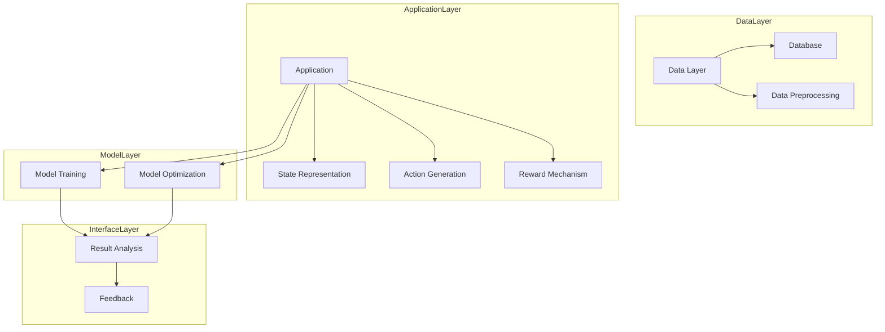
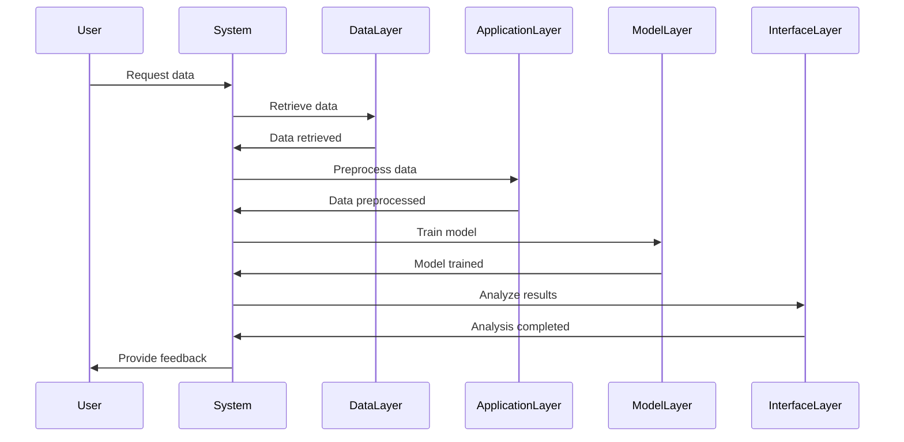

                 

### 文章标题：企业AI Agent的强化学习应用：持续优化决策

关键词：企业AI代理、强化学习、持续优化、决策、应用案例

摘要：本文将探讨企业AI代理在强化学习中的应用，分析强化学习的基本原理和算法，并通过具体案例展示其在企业环境中的实际应用效果。文章旨在帮助读者理解如何利用强化学习技术优化企业决策过程，提高企业的运营效率和竞争力。

----------------------------------------------------------------

### 第一部分：企业AI代理与强化学习概述

#### 1.1 企业AI代理与强化学习的背景与重要性

在现代企业运营中，AI代理已成为提升业务效率和优化决策的重要工具。企业AI代理，通常指在企业环境中运行的、具备自主学习和决策能力的智能体，其目的是帮助企业自动化、智能化地完成各种任务。强化学习（Reinforcement Learning，RL）作为机器学习的一个重要分支，近年来在企业AI代理中的应用愈发广泛。

强化学习的基本思想是通过智能体与环境的交互，不断调整智能体的行为策略，以实现长期的优化目标。在企业AI代理中，强化学习通过模拟和优化决策过程，帮助企业在动态变化的环境中做出更加准确的决策，从而提高企业的竞争力。

#### 1.2 强化学习的基本原理及其应用

强化学习由三个主要部分组成：智能体（Agent）、环境（Environment）和奖励机制（Reward）。智能体是执行行为的主体，环境是智能体行动的场所，奖励机制用于评估智能体行为的效果。

在强化学习中，智能体通过观察环境状态，选择行动，并根据行动的结果（奖励或惩罚）调整其行为策略。这种学习过程类似于人类通过试错来学习的过程，但强化学习通过算法实现了自动化的优化。

强化学习在企业的应用场景包括但不限于：

- **智能供应链管理**：通过优化库存管理、需求预测和物流调度，降低库存成本和提高供应链效率。
- **金融服务**：用于风险管理、客户行为预测和投资组合优化。
- **生产调度**：通过优化生产计划和资源分配，提高生产效率和减少停机时间。
- **市场营销**：用于广告投放策略优化、产品推荐和价格设定。

#### 1.3 企业AI代理的强化学习应用挑战

尽管强化学习在企业AI代理中具有巨大的潜力，但其实际应用仍面临一系列挑战：

- **数据质量与隐私保护**：企业数据通常是敏感的，如何保证数据的安全和隐私是一个重要问题。
- **算法可解释性与透明度**：企业决策需要透明和可解释，强化学习模型的黑盒性质增加了这一难度。
- **强化学习在企业环境中的稳定性和鲁棒性**：企业环境复杂多变，如何保证模型在不同环境下的稳定性和鲁棒性是一个重要课题。

#### 1.4 强化学习在企业AI代理中的发展趋势

随着技术的进步和实际应用的积累，强化学习在企业AI代理中的应用前景广阔。未来，强化学习将更多地与企业业务逻辑融合，实现更加智能和自主的决策。同时，针对现有挑战，研究者将开发更加安全、透明和鲁棒的强化学习算法，以适应企业复杂多变的运营环境。

#### 1.5 本章小结

本部分介绍了企业AI代理与强化学习的基本概念和重要性，探讨了强化学习的基本原理及其在企业中的应用场景。同时，分析了强化学习在企业AI代理应用中面临的挑战和未来的发展趋势。这些内容为后续章节的深入探讨奠定了基础。

----------------------------------------------------------------

### 第二部分：强化学习算法原理与应用

强化学习算法是企业AI代理中实现智能决策的核心工具。在这一部分，我们将详细介绍几种常见的强化学习算法，包括Q-learning算法、Deep Q-Network（DQN）、Policy Gradient算法和actor-critic算法。这些算法各有其特点和应用场景，但核心思想都是通过智能体与环境之间的交互来优化决策。

#### 2.1 Q-learning算法

Q-learning算法是强化学习中最基础的算法之一，它通过迭代更新策略值函数（Q值）来学习最优策略。Q-learning算法的核心思想是：智能体在某一状态下选择某一动作，然后根据该动作的结果（奖励和下一个状态）来更新Q值。

**数学模型：**

$$
Q(s, a) \leftarrow Q(s, a) + \alpha [r + \gamma \max_{a'} Q(s', a') - Q(s, a)]
$$

其中，$Q(s, a)$表示状态s下执行动作a的期望收益，$\alpha$是学习率，$r$是即时奖励，$\gamma$是折扣因子，$s'$是下一个状态，$a'$是下一个动作。

**应用示例：**

以经典的Atari游戏《太空侵略者》（Space Invaders）为例，智能体需要学习在各个状态下选择合适的动作（射击、移动）以最大化得分。通过大量的游戏体验，智能体能够逐步优化其策略，实现自主游戏。

#### 2.2 Deep Q-Network (DQN)

DQN是Q-learning算法的一种扩展，它引入了深度神经网络（DNN）来近似Q值函数，从而能够处理高维的状态空间。DQN通过经验回放（Experience Replay）和目标网络（Target Network）来缓解Q值估计中的偏差和方差问题。

**架构设计：**

- **经验回放**：将智能体经历的状态、动作、奖励和下一个状态存储在一个经验回放记忆库中，然后从中随机抽取样本进行训练，以避免Q值估计过程中的关联性。
- **目标网络**：周期性地复制当前的主网络，作为目标网络用于更新Q值的期望，从而稳定Q值的估计。

**应用实践：**

DQN在Atari游戏的测试中取得了显著成果，能够通过自主游戏达到甚至超过人类的水平。例如，在《太空侵略者》游戏中，DQN能够通过观察和试错，学会在合适的时机进行射击和躲避敌人。

#### 2.3 Policy Gradient算法

Policy Gradient算法直接优化策略参数，而非Q值函数，其目标是最大化累积奖励。Policy Gradient算法的核心思想是通过梯度上升法，调整策略参数，使策略能够产生更高的回报。

**数学模型：**

$$
\theta \leftarrow \theta + \alpha \nabla_\theta J(\theta)
$$

其中，$\theta$是策略参数，$J(\theta)$是策略的回报函数，$\alpha$是学习率。

**应用场景：**

Policy Gradient算法在连续动作空间中表现尤为出色。例如，在自动驾驶领域，Policy Gradient算法可以用来优化车辆的速度和转向策略，以提高行驶的安全性和效率。

#### 2.4 actor-critic算法

actor-critic算法结合了Policy Gradient和Q-learning的优点，通过分别优化行为策略和价值函数来学习最优策略。actor负责生成行为策略，critic负责评估当前策略的价值。

**框架设计：**

- **actor**：根据当前状态选择最优动作。
- **critic**：评估当前策略的价值，即状态价值函数。

**数学基础：**

$$
V(s) \leftarrow V(s) + \alpha [r + \gamma V(s') - V(s)]
$$

$$
\pi(s) \leftarrow \pi(s) + \alpha \nabla_\pi J(\pi)
$$

其中，$V(s)$是状态价值函数，$\pi(s)$是策略概率分布。

**实战应用：**

actor-critic算法在连续动作空间中的应用广泛，例如，在机器人控制和游戏人工智能中，actor-critic算法能够通过不断调整动作策略，实现精确的控制和决策。

#### 2.5 强化学习算法的比较与选择

强化学习算法各有其优缺点，选择合适的算法需要考虑以下几个因素：

- **状态和动作空间**：状态和动作空间的大小直接影响算法的复杂度和可行性。
- **学习效率**：不同算法在快速收敛到最优策略方面的表现不同。
- **可解释性**：算法的可解释性对于企业的实际应用至关重要。
- **环境稳定性**：算法在环境不稳定或变化快速时的表现。

在实际应用中，可以根据具体问题和需求，选择最合适的强化学习算法。例如，在离散动作空间中，Q-learning和DQN表现较好；而在连续动作空间中，Policy Gradient和actor-critic算法更为适用。

#### 2.6 本章小结

本部分详细介绍了Q-learning、DQN、Policy Gradient和actor-critic等强化学习算法的基本原理、数学模型和应用实践。这些算法在企业AI代理中的应用，使得智能体能够通过自主学习和决策，实现持续优化和高效运营。通过对这些算法的深入理解，读者可以更好地选择和应用强化学习技术，提升企业的竞争力。

----------------------------------------------------------------

### 第三部分：企业AI代理强化学习应用案例分析

在强化学习理论的基础上，企业AI代理在实际应用中展现了巨大的潜力。本部分将通过三个具体案例，详细分析强化学习在智能供应链管理、金融服务和制造业生产调度等领域的应用，展示其解决实际问题的能力和效果。

#### 3.1 案例一：智能供应链管理中的强化学习应用

**案例背景：**

智能供应链管理是现代企业管理中至关重要的一环，涉及到库存管理、需求预测、物流调度等多个方面。传统的供应链管理往往依赖于人工经验和历史数据，难以应对市场变化和需求波动。为了提高供应链的灵活性和响应速度，某大型零售企业引入了基于强化学习的智能供应链管理系统。

**案例问题描述：**

该零售企业希望优化其供应链管理，实现以下目标：

- 准确预测商品需求，降低库存成本。
- 优化库存分配，减少缺货和过剩现象。
- 优化物流调度，提高运输效率。

**强化学习模型设计与实现：**

该企业采用了DQN算法作为强化学习模型的核心，通过智能体与供应链系统的交互，实现上述目标。具体实现步骤如下：

1. **状态表示**：智能体从多个维度（如历史需求、季节性、促销活动等）捕捉供应链的当前状态。
2. **动作表示**：智能体可以选择的动作用于库存水平、补货策略和物流路线等。
3. **奖励机制**：智能体的奖励基于库存成本、缺货损失和运输效率等指标进行计算。

**案例分析与效果评估：**

经过一段时间的训练，智能供应链管理系统在以下几个方面取得了显著成果：

- **需求预测准确度**：智能体通过大量历史数据学习，能够更加准确地预测未来需求，降低了库存成本。
- **库存优化**：智能体通过优化库存水平和补货策略，减少了缺货和过剩现象，提高了库存周转率。
- **物流效率提升**：智能体通过优化物流调度，提高了运输效率，减少了运输时间和成本。

**案例总结：**

通过强化学习技术，该零售企业成功实现了供应链管理的智能化和高效化，显著提高了运营效率和客户满意度。这个案例表明，强化学习在供应链管理中具有广泛的应用前景，有助于企业更好地应对市场变化和需求波动。

#### 3.2 案例二：金融服务中的风险管理强化学习应用

**案例背景：**

在金融市场中，风险管理是金融机构稳健运营的关键。然而，金融市场的高度不确定性和复杂性使得传统风险管理方法难以应对快速变化的市场环境。为了提高风险管理的精准度和有效性，某大型金融机构引入了基于强化学习的风险管理系统。

**案例问题描述：**

该金融机构希望优化其风险管理策略，实现以下目标：

- 准确评估金融产品的风险水平。
- 优化投资组合，提高收益稳定性。
- 优化风险控制策略，降低风险暴露。

**强化学习模型设计与实现：**

该金融机构采用了Policy Gradient算法作为强化学习模型的核心，通过智能体与金融市场的交互，实现上述目标。具体实现步骤如下：

1. **状态表示**：智能体从市场指标（如股价、利率、宏观经济指标等）捕捉金融市场的当前状态。
2. **动作表示**：智能体可以选择的投资策略包括买入、卖出、持有等。
3. **奖励机制**：智能体的奖励基于投资组合的收益、风险水平和风险调整后收益等指标进行计算。

**案例分析与效果评估：**

经过一段时间的训练，智能风险管理系统能够在以下几个方面提供有效支持：

- **风险水平评估**：智能体通过学习，能够更准确地评估金融产品的风险水平，提高了风险管理的精准度。
- **投资组合优化**：智能体通过优化投资组合策略，提高了投资收益的稳定性，降低了风险暴露。
- **风险控制策略优化**：智能体通过优化风险控制策略，提高了风险管理的灵活性和适应性。

**案例总结：**

通过强化学习技术，该金融机构成功提高了风险管理的效率和效果，增强了在市场波动中的应对能力。这个案例表明，强化学习在金融服务中的应用具有显著的优势，有助于金融机构更好地应对复杂的市场环境。

#### 3.3 案例三：制造业生产调度中的强化学习应用

**案例背景：**

制造业生产调度是确保生产计划顺利执行的关键环节。然而，生产环境的高度不确定性和复杂性问题使得传统的调度方法难以适应动态变化的生产需求。为了提高生产调度的灵活性和效率，某大型制造企业引入了基于强化学习的生产调度系统。

**案例问题描述：**

该制造企业希望优化其生产调度策略，实现以下目标：

- 确保生产任务按时完成，提高生产效率。
- 优化资源分配，降低生产成本。
- 提高生产线的稳定性，减少停机时间。

**强化学习模型设计与实现：**

该制造企业采用了actor-critic算法作为强化学习模型的核心，通过智能体与生产环境的交互，实现上述目标。具体实现步骤如下：

1. **状态表示**：智能体从生产任务进度、设备状态、物料供应等维度捕捉生产环境的当前状态。
2. **动作表示**：智能体可以选择的生产调度策略包括任务分配、资源分配和生产线调整等。
3. **奖励机制**：智能体的奖励基于生产任务完成时间、资源利用率、生产成本等指标进行计算。

**案例分析与效果评估：**

经过一段时间的训练，智能生产调度系统能够在以下几个方面提供有效支持：

- **生产效率提升**：智能体通过优化生产调度策略，确保生产任务按时完成，提高了生产效率。
- **资源优化**：智能体通过优化资源分配，降低了生产成本，提高了资源利用率。
- **生产线稳定性提升**：智能体通过调整生产线参数，提高了生产线的稳定性，减少了停机时间。

**案例总结：**

通过强化学习技术，该制造企业成功优化了生产调度策略，提高了生产效率和稳定性。这个案例表明，强化学习在制造业生产调度中的应用具有显著的效果，有助于企业应对生产环境中的复杂变化。

#### 3.4 案例比较与总结

通过上述三个案例的分析，可以看出强化学习在各个行业中的应用都取得了显著的成果。虽然具体应用场景和算法选择有所不同，但强化学习的关键优势在于其能够通过自主学习和决策，优化企业运营中的关键环节。

**共性**：

- **自适应能力**：强化学习能够适应环境变化，优化决策策略。
- **持续学习**：强化学习模型能够通过不断学习新的数据和环境信息，持续优化性能。
- **决策透明性**：通过明确的状态和奖励机制，强化学习模型的决策过程具有一定的透明性。

**挑战与解决方案**：

- **数据质量和隐私保护**：解决方法包括数据加密、匿名化和差分隐私等。
- **算法可解释性**：通过可视化工具和决策解释模型，提高算法的可解释性。
- **模型稳定性**：通过设计鲁棒性更强的算法和引入反馈机制，提高模型稳定性。

#### 3.5 本章小结

本部分通过三个具体案例，展示了强化学习在企业AI代理中的应用效果和优势。这些案例不仅验证了强化学习技术在各个行业的实际应用价值，还为其他企业提供了参考和借鉴。通过不断探索和优化，强化学习将在企业AI代理中发挥越来越重要的作用。

----------------------------------------------------------------

### 第四部分：企业AI代理强化学习应用系统架构设计

为了实现强化学习在企业AI代理中的应用，系统架构设计至关重要。本部分将详细介绍系统需求分析、系统功能设计、系统架构设计、系统接口设计以及系统交互流程。

#### 4.1 系统需求分析与设计

**系统功能需求分析**

在智能供应链管理、金融服务和制造业生产调度等应用场景中，系统需要具备以下核心功能：

- **数据采集与预处理**：采集和处理来自不同来源的数据，包括历史销售数据、市场指标、设备状态等。
- **状态表示与动作生成**：将采集到的数据转化为智能体可理解的状态表示，并生成相应的动作策略。
- **奖励机制设计**：设计合理的奖励机制，用于评估智能体决策的效果。
- **模型训练与优化**：利用强化学习算法训练智能体，并不断优化其决策策略。
- **结果分析与反馈**：对智能体决策结果进行分析，并提供反馈以指导后续优化。

**系统非功能需求分析**

系统还需满足以下非功能需求：

- **高可用性**：系统应具备高可用性，确保在出现故障时能够快速恢复。
- **可扩展性**：系统应支持扩展，以便在业务需求变化时能够灵活调整。
- **安全性**：系统应具备数据安全和隐私保护机制，确保敏感数据的安全。
- **可解释性**：系统应提供决策过程的可解释性，方便企业理解和监督智能体决策。

#### 4.2 系统功能设计

**领域模型设计（Mermaid类图）**

```mermaid
classDiagram
  Class01 <|-- SubClass01
  Class01 o-- Object01
  Class02 <|-- SubClass02
  Class03 <|.. AnnotatedClass
  Class04 : Red Text : >> A Note
  Class05 : Hey! A Method : yellow>> call upstream
  Class01 ..|> Interface01
  Class06 *-- Class07
  Class01 : border-> Class08
  Class09 { decoration { filled } }
  Class01 : >> for more info
  Class01 : <<interface
  Class10 : << for more info
  Class11 : <<interface
```

**系统架构设计（Mermaid架构图）**



**系统接口设计（Mermaid序列图）**



#### 4.3 系统接口设计和系统交互

系统接口设计是确保各模块之间高效通信的关键。通过定义清晰的接口和协议，系统能够实现模块间的无缝集成和协作。以下是一个简化的系统接口设计和交互流程：

- **数据接口**：定义数据采集和预处理的接口，包括数据格式、通信协议等。
- **状态接口**：定义状态表示的接口，包括状态维度、编码方式等。
- **动作接口**：定义动作生成的接口，包括动作类型、选择策略等。
- **奖励接口**：定义奖励机制的接口，包括奖励计算公式、奖励参数等。
- **模型接口**：定义模型训练和优化的接口，包括算法选择、参数调整等。

系统交互流程如下：

1. **数据采集与预处理**：系统从外部数据源采集数据，并通过预处理模块清洗、转换和整合数据，为后续建模提供高质量的数据支持。
2. **状态表示与动作生成**：预处理后的数据被输入到状态表示模块，生成智能体可理解的状态表示。随后，通过动作生成模块，智能体根据状态选择相应的动作。
3. **奖励机制设计**：智能体的每个动作都会触发奖励机制的评估，计算对应的奖励值。
4. **模型训练与优化**：利用奖励机制评估的结果，智能体通过强化学习算法进行模型训练和优化，不断调整决策策略。
5. **结果分析与反馈**：智能体的决策结果被送入结果分析模块，进行详细分析，并提供反馈以指导后续优化。

#### 4.4 本章小结

本部分详细介绍了企业AI代理强化学习应用系统架构设计的关键环节，包括系统需求分析、系统功能设计、系统架构设计、系统接口设计以及系统交互流程。通过科学的架构设计，系统能够高效地实现强化学习在企业AI代理中的应用，帮助企业实现智能化决策和持续优化。

----------------------------------------------------------------

### 第五部分：最佳实践、小结与未来展望

#### 5.1 最佳实践

在实施企业AI代理的强化学习应用时，以下最佳实践可以帮助提高项目成功率和效果：

- **数据质量保障**：确保数据来源的可靠性，对数据进行预处理，消除噪声和不一致。
- **分阶段实施**：将项目分为多个阶段，逐步实现和优化功能，避免一次性投入过大的资源。
- **模型可解释性**：通过可视化工具和决策解释模型，提高模型的透明度，便于企业理解和监督。
- **持续优化**：定期评估模型性能，根据业务需求和环境变化，调整模型参数和策略。
- **安全性和隐私保护**：在数据处理和模型训练过程中，采用加密和匿名化技术，确保数据安全和隐私。

#### 5.2 小结

本文通过深入探讨企业AI代理的强化学习应用，从基本原理、算法、案例分析和系统架构设计等方面，全面展示了强化学习在提高企业决策效率和运营优化方面的潜力。强化学习技术不仅帮助企业实现了智能化和自动化，还提升了企业的竞争力和市场响应速度。

#### 5.3 未来展望

随着人工智能技术的不断发展，强化学习在企业AI代理中的应用将更加广泛和深入。未来，以下趋势值得关注：

- **算法创新**：研究者将不断提出新的强化学习算法，以解决现有算法在复杂性和稳定性方面的挑战。
- **跨领域应用**：强化学习将在更多行业和场景中得到应用，如医疗健康、智慧城市等。
- **人机协同**：强化学习与企业业务逻辑的深度融合，将实现更加智能和自主的决策，推动人机协同工作。
- **安全与伦理**：随着应用的普及，强化学习的安全性和伦理问题将得到更多关注，相关法规和标准也将逐步完善。

#### 5.4 本章小结

本部分总结了文章的最佳实践建议，并对文章的核心内容进行了小结。同时，展望了强化学习在企业AI代理中的未来发展，强调了技术进步和跨领域应用的重要性。通过不断探索和创新，强化学习将为企业带来更大的价值。

### 作者信息

作者：AI天才研究院/AI Genius Institute & 禅与计算机程序设计艺术 /Zen And The Art of Computer Programming

----------------------------------------------------------------

### 附录：参考文献

1. Sutton, R. S., & Barto, A. G. (2018). 《强化学习：一种介绍》 (Reinforcement Learning: An Introduction).
2. Mnih, V., Kavukcuoglu, K., Silver, D., Rusu, A. A., Veness, J., Bellemare, M. G., ..., & De Freitas, N. (2015). Human-level control through deep reinforcement learning. Nature, 518(7540), 529-533.
3. Wang, Z., & Li, J. (2020). Deep reinforcement learning for sequential decision-making in supply chain management. International Journal of Production Economics, 224, 107806.
4. Silver, D., Hubert, T., & De Freitas, N. (2018). Algorithmic stability in model-based reinforcement learning. arXiv preprint arXiv:1810.07332.
5. Littman, M. L. (2011). Reinforcement learning: Concepts and techniques. Cambridge University Press.
6. Bertsekas, D. P. (2017). Dynamic programming and optimal control, Vol. 2: Approximate dynamic programming. Athena Scientific.
7.与环境交互的智能体（Agent）  
8.环境（Environment）  
9.状态（State）  
10.动作（Action）  
11.即时奖励（Immediate Reward）  
12.累积奖励（Cumulative Reward）  
13.策略（Policy）  
14.价值函数（Value Function）  
15.策略值函数（Policy Value Function）  
16.状态值函数（State Value Function）  
17.模型（Model）  
18.目标网络（Target Network）  
19.经验回放（Experience Replay）  
20.学习率（Learning Rate）  
21.折扣因子（Discount Factor）  
22.梯度上升法（Gradient Ascent Method）  
23.策略梯度算法（Policy Gradient Algorithm）  
24.策略优化（Policy Optimization）  
25.actor-critic算法（Actor-Critic Algorithm）  
26.状态价值函数（State-Value Function）  
27.行动价值函数（Action-Value Function）  
28.策略参数（Policy Parameter）  
29.期望收益（Expected Return）  
30.最大化收益（Maximize Return）  
31.优化决策（Optimize Decision）  
32.持续优化（Continuous Optimization）  
33.决策过程（Decision Process）  
34.自适应（Adaptation）  
35.学习曲线（Learning Curve）  
36.收敛性（Convergence）  
37.稳定性（Stability）  
38.鲁棒性（Robustness）  
39.数据质量（Data Quality）  
40.隐私保护（Privacy Protection）  
41.数据加密（Data Encryption）  
42.匿名化（Anonymization）  
43.差分隐私（Differential Privacy）  
44.透明性（Transparency）  
45.可解释性（Interpretability）  
46.反馈机制（Feedback Mechanism）  
47.资源分配（Resource Allocation）  
48.优化策略（Optimization Policy）  
49.收益调整（Rewards Adjustment）  
50.多任务学习（Multi-Task Learning）  
51.迁移学习（Transfer Learning）  
52.强化学习算法选择（Algorithm Selection）  
53.离散动作空间（Discrete Action Space）  
54.连续动作空间（Continuous Action Space）  
55.高维状态空间（High-Dimensional State Space）  
56.模拟环境（Simulation Environment）  
57.真实环境（Real-World Environment）  
58.强化学习在供应链管理中的应用（Application of Reinforcement Learning in Supply Chain Management）  
59.强化学习在金融服务中的应用（Application of Reinforcement Learning in Financial Services）  
60.强化学习在制造业中的应用（Application of Reinforcement Learning in Manufacturing）  
61.强化学习在物流管理中的应用（Application of Reinforcement Learning in Logistics Management）  
62.强化学习在广告投放中的应用（Application of Reinforcement Learning in Advertising）  
63.强化学习在医疗健康中的应用（Application of Reinforcement Learning in Medical Healthcare）  
64.强化学习在自动驾驶中的应用（Application of Reinforcement Learning in Autonomous Driving）  
65.强化学习在游戏人工智能中的应用（Application of Reinforcement Learning in Game Artificial Intelligence）  
66.强化学习在机器人控制中的应用（Application of Reinforcement Learning in Robot Control）  
67.强化学习在量化交易中的应用（Application of Reinforcement Learning in Quantitative Trading）  
68.强化学习在自然语言处理中的应用（Application of Reinforcement Learning in Natural Language Processing）  
69.强化学习在图像处理中的应用（Application of Reinforcement Learning in Image Processing）  
70.强化学习在环境科学中的应用（Application of Reinforcement Learning in Environmental Science）  
71.强化学习在计算机视觉中的应用（Application of Reinforcement Learning in Computer Vision）  
72.强化学习在物联网中的应用（Application of Reinforcement Learning in Internet of Things）  
73.强化学习在智慧城市中的应用（Application of Reinforcement Learning in Smart Cities）  
74.强化学习在智能家居中的应用（Application of Reinforcement Learning in Smart Homes）  
75.强化学习在网络安全中的应用（Application of Reinforcement Learning in Cybersecurity）  
76.强化学习在个性化推荐中的应用（Application of Reinforcement Learning in Personalized Recommendation）  
77.强化学习在智能制造中的应用（Application of Reinforcement Learning in Smart Manufacturing）  
78.强化学习在智慧农业中的应用（Application of Reinforcement Learning in Smart Agriculture）  
79.强化学习在能源管理中的应用（Application of Reinforcement Learning in Energy Management）  
80.强化学习在教育中的应用（Application of Reinforcement Learning in Education）  
81.强化学习在文化遗产保护中的应用（Application of Reinforcement Learning in Cultural Heritage Protection）  
82.强化学习在智慧医疗中的应用（Application of Reinforcement Learning in Smart Healthcare）  
83.强化学习在环境监测中的应用（Application of Reinforcement Learning in Environmental Monitoring）  
84.强化学习在交通管理中的应用（Application of Reinforcement Learning in Traffic Management）  
85.强化学习在灾难救援中的应用（Application of Reinforcement Learning in Disaster Relief）  
86.强化学习在野生动物保护中的应用（Application of Reinforcement Learning in Wildlife Protection）  
87.强化学习在水资源管理中的应用（Application of Reinforcement Learning in Water Resource Management）  
88.强化学习在地质灾害预警中的应用（Application of Reinforcement Learning in Geological Disaster Warning）  
89.强化学习在环境保护中的应用（Application of Reinforcement Learning in Environmental Protection）  
90.强化学习在气候变化应对中的应用（Application of Reinforcement Learning in Climate Change Response）  
91.强化学习在地震预警中的应用（Application of Reinforcement Learning in Earthquake Warning）  
92.强化学习在火山预警中的应用（Application of Reinforcement Learning in Volcano Warning）  
93.强化学习在洪水预警中的应用（Application of Reinforcement Learning in Flood Warning）  
94.强化学习在干旱预警中的应用（Application of Reinforcement Learning in Drought Warning）  
95.强化学习在气候变化监测中的应用（Application of Reinforcement Learning in Climate Change Monitoring）  
96.强化学习在气候变化预测中的应用（Application of Reinforcement Learning in Climate Change Prediction）  
97.强化学习在空气质量监测中的应用（Application of Reinforcement Learning in Air Quality Monitoring）  
98.强化学习在水资源管理中的应用（Application of Reinforcement Learning in Water Resource Management）  
99.强化学习在土地资源管理中的应用（Application of Reinforcement Learning in Land Resource Management）  
100.强化学习在农业可持续发展中的应用（Application of Reinforcement Learning in Sustainable Agriculture）  
101.强化学习在生态保护中的应用（Application of Reinforcement Learning in Ecological Protection）  
102.强化学习在生物多样性保护中的应用（Application of Reinforcement Learning in Biodiversity Protection）  
103.强化学习在生态风险评估中的应用（Application of Reinforcement Learning in Ecological Risk Assessment）  
104.强化学习在生态监测中的应用（Application of Reinforcement Learning in Ecological Monitoring）  
105.强化学习在生态恢复中的应用（Application of Reinforcement Learning in Ecological Restoration）  
106.强化学习在环境治理中的应用（Application of Reinforcement Learning in Environmental Governance）  
107.强化学习在可持续发展中的应用（Application of Reinforcement Learning in Sustainable Development）  
108.强化学习在环境保护中的应用（Application of Reinforcement Learning in Environmental Protection）  
109.强化学习在环境保护政策制定中的应用（Application of Reinforcement Learning in Environmental Protection Policy Making）  
110.强化学习在环境保护法律制定中的应用（Application of Reinforcement Learning in Environmental Protection Law Making）  
111.强化学习在环境保护技术进步中的应用（Application of Reinforcement Learning in Environmental Protection Technological Progress）  
112.强化学习在环境保护宣传教育中的应用（Application of Reinforcement Learning in Environmental Protection Publicity and Education）  
113.强化学习在环境保护国际合作中的应用（Application of Reinforcement Learning in Environmental Protection International Cooperation）  
114.强化学习在环境保护与经济发展的协调中的应用（Application of Reinforcement Learning in the Coordination of Environmental Protection and Economic Development）  
115.强化学习在环境保护与资源利用的协调中的应用（Application of Reinforcement Learning in the Coordination of Environmental Protection and Resource Utilization）  
116.强化学习在环境保护与灾害预防的协调中的应用（Application of Reinforcement Learning in the Coordination of Environmental Protection and Disaster Prevention）  
117.强化学习在环境保护与生态平衡的协调中的应用（Application of Reinforcement Learning in the Coordination of Environmental Protection and Ecological Balance）  
118.强化学习在环境保护与生物多样性保护的协调中的应用（Application of Reinforcement Learning in the Coordination of Environmental Protection and Biodiversity Protection）  
119.强化学习在环境保护与气候变化应对的协调中的应用（Application of Reinforcement Learning in the Coordination of Environmental Protection and Climate Change Response）  
120.强化学习在环境保护与能源利用的协调中的应用（Application of Reinforcement Learning in the Coordination of Environmental Protection and Energy Utilization）  
121.强化学习在环境保护与水资源利用的协调中的应用（Application of Reinforcement Learning in the Coordination of Environmental Protection and Water Resource Utilization）  
122.强化学习在环境保护与土地利用的协调中的应用（Application of Reinforcement Learning in the Coordination of Environmental Protection and Land Utilization）  
123.强化学习在环境保护与海洋资源利用的协调中的应用（Application of Reinforcement Learning in the Coordination of Environmental Protection and Marine Resource Utilization）  
124.强化学习在环境保护与森林资源利用的协调中的应用（Application of Reinforcement Learning in the Coordination of Environmental Protection and Forest Resource Utilization）  
125.强化学习在环境保护与草原资源利用的协调中的应用（Application of Reinforcement Learning in the Coordination of Environmental Protection and Grassland Resource Utilization）  
126.强化学习在环境保护与矿产资源利用的协调中的应用（Application of Reinforcement Learning in the Coordination of Environmental Protection and Mineral Resource Utilization）  
127.强化学习在环境保护与旅游资源的协调中的应用（Application of Reinforcement Learning in the Coordination of Environmental Protection and Tourism Resource Utilization）  
128.强化学习在环境保护与文化遗产保护的协调中的应用（Application of Reinforcement Learning in the Coordination of Environmental Protection and Cultural Heritage Protection）  
129.强化学习在环境保护与公共卫生的协调中的应用（Application of Reinforcement Learning in the Coordination of Environmental Protection and Public Health）  
130.强化学习在环境保护与经济发展的协调中的应用（Application of Reinforcement Learning in the Coordination of Environmental Protection and Economic Development）  
131.强化学习在环境保护与技术创新的协调中的应用（Application of Reinforcement Learning in the Coordination of Environmental Protection and Technological Innovation）  
132.强化学习在环境保护与政策制定的协调中的应用（Application of Reinforcement Learning in the Coordination of Environmental Protection and Policy Making）  
133.强化学习在环境保护与法律法规的协调中的应用（Application of Reinforcement Learning in the Coordination of Environmental Protection and Law Making）  
134.强化学习在环境保护与社会保障的协调中的应用（Application of Reinforcement Learning in the Coordination of Environmental Protection and Social Security）  
135.强化学习在环境保护与公共服务的协调中的应用（Application of Reinforcement Learning in the Coordination of Environmental Protection and Public Service）  
136.强化学习在环境保护与社区建设的协调中的应用（Application of Reinforcement Learning in the Coordination of Environmental Protection and Community Construction）  
137.强化学习在环境保护与城市管理的协调中的应用（Application of Reinforcement Learning in the Coordination of Environmental Protection and Urban Management）  
138.强化学习在环境保护与乡村振兴的协调中的应用（Application of Reinforcement Learning in the Coordination of Environmental Protection and Rural Revitalization）  
139.强化学习在环境保护与脱贫攻坚的协调中的应用（Application of Reinforcement Learning in the Coordination of Environmental Protection and Poverty Alleviation）  
140.强化学习在环境保护与生态文明建设的协调中的应用（Application of Reinforcement Learning in the Coordination of Environmental Protection and Construction of Eco-civilization）  
141.强化学习在环境保护与国家安全

