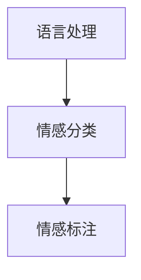
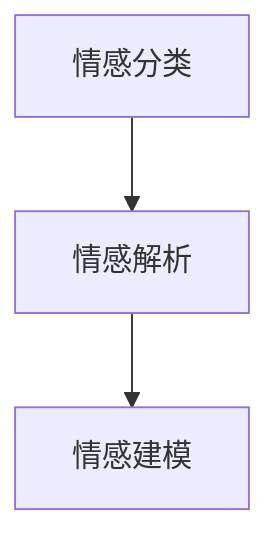
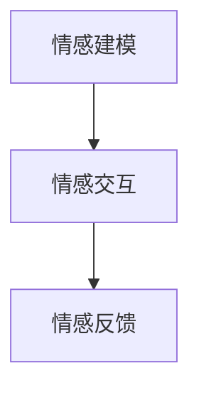
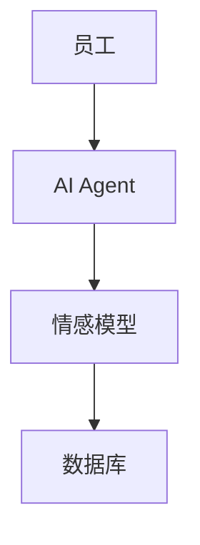
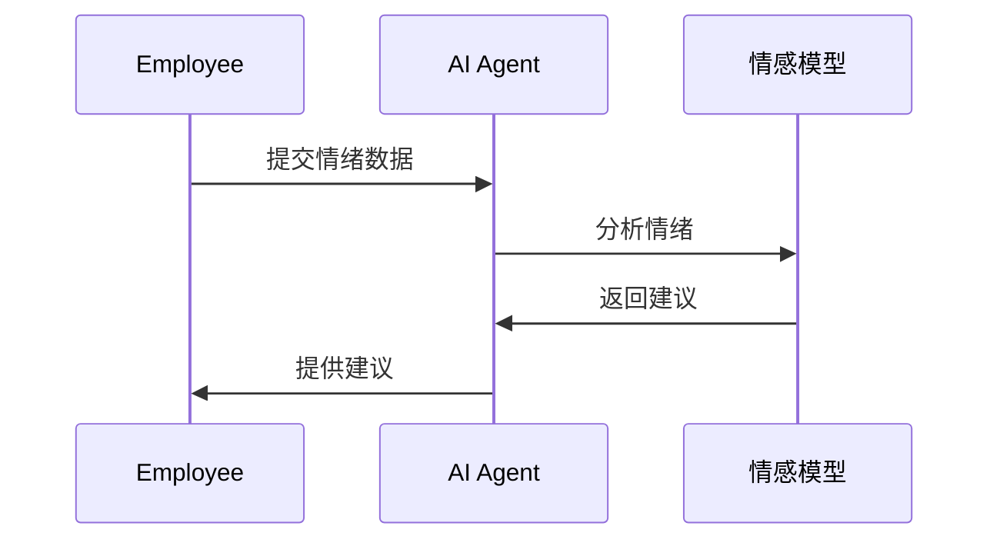

                 

# 《企业AI Agent的情感智能：提升员工体验与忠诚度》

> 关键词：企业AI Agent、情感智能、员工体验、忠诚度、技术解析

> 摘要：随着人工智能技术的不断进步，企业AI Agent在提升员工体验与忠诚度方面展现出巨大的潜力。本文将深入探讨企业AI Agent的情感智能，分析其核心概念、算法原理、系统架构以及实战应用，为读者提供一套完整的解决方案。

## 第一步：背景介绍

### 1. 问题背景

在当今快速变化的工作环境中，员工体验和忠诚度成为企业竞争力的关键因素。企业AI Agent作为人工智能技术的代表，正逐步成为企业提升员工体验与忠诚度的有力工具。AI Agent能够通过情感智能技术，实时监测和分析员工的情绪状态，提供个性化的服务和建议，从而提高员工的工作满意度和忠诚度。

### 2. 问题描述

尽管企业AI Agent在提升员工体验与忠诚度方面具有巨大潜力，但在实际应用中仍面临诸多挑战。例如，如何准确识别和解析员工情感、如何确保AI Agent提供的个性化服务具有实际价值等。

### 3. 问题解决

本文将围绕企业AI Agent的情感智能，系统介绍相关技术和方法，帮助读者了解如何解决上述问题。我们将探讨情感识别、情感分析和情感计算等核心概念，并详细讲解算法原理和系统架构设计。

### 4. 边界与外延

本文主要关注企业内部AI Agent在情感智能方面的应用，不涉及其他领域的AI Agent。

### 5. 概念结构与核心要素组成

- **AI Agent**：具有智能行为、自主学习和适应能力的软件代理。
- **情感智能**：涉及情感识别、情感分析和情感计算等方面。
- **员工体验与忠诚度**：关注员工在工作中所感受到的情绪、态度和行为。

## 第二步：核心概念与联系

### 1. 核心概念原理

- **情感识别**：通过分析员工的语言和行为，识别员工的情感状态。
- **情感分析**：对员工的情感状态进行深入分析，理解其背后的原因和动机。
- **情感计算**：通过算法和模型，模拟、生成和解释情感信息。

### 2. 概念属性特征对比表格

| 概念       | 属性特征                     |
|------------|------------------------------|
| 情感识别   | 准确性、实时性、普适性         |
| 情感分析   | 深度、准确性、关联性          |
| 情感计算   | 灵活性、可解释性、个性化       |

### 3. ER实体关系图架构


- **实体**：员工、AI Agent、情感数据
- **关系**：识别、分析、计算

## 第三步：算法原理讲解

### 1. 算法mermaid流程图

#### 情感识别流程



#### 情感分析流程



#### 情感计算流程



### 2. Python源代码

#### 情感识别

```python
import nltk
from nltk.corpus import movie_reviews
from nltk.classify import NaiveBayesClassifier

def extract_features(words):
    return dict([(word, True) for word in words])

def get_model():
    fileids = movie_reviews.fileids('pos')
    featuresets = [(extract_features(words), 'pos') for words in movie_reviews.words(fileids)]
    train_set = featuresets[:1900]
    test_set = featuresets[1900:]
    classifier = NaiveBayesClassifier.train(train_set)
    return classifier

classifier = get_model()
print("Accuracy:", classifier.accuracy(test_set))
```

#### 情感分析

```python
from sklearn.feature_extraction.text import TfidfVectorizer
from sklearn.model_selection import train_test_split
from sklearn.naive_bayes import MultinomialNB
from sklearn.metrics import classification_report

# 假设已有情感数据集
data = [
    ("这是一个积极的评论", "积极"),
    ("这是一个消极的评论", "消极"),
    # ... 更多数据
]

X, y = zip(*data)
X_train, X_test, y_train, y_test = train_test_split(X, y, test_size=0.2, random_state=42)

vectorizer = TfidfVectorizer()
X_train_tfidf = vectorizer.fit_transform(X_train)
X_test_tfidf = vectorizer.transform(X_test)

classifier = MultinomialNB()
classifier.fit(X_train_tfidf, y_train)
y_pred = classifier.predict(X_test_tfidf)

print("Classification Report:")
print(classification_report(y_test, y_pred))
```

#### 情感计算

```python
def generate_advice(employee_features, emotion_model):
    # 基于员工特征和情感模型生成建议
    # 示例：根据员工情绪状态推荐休息时间或激励措施
    if employee_features['emotion'] == '消极':
        return "建议您休息一会儿，调整情绪后再工作。"
    elif employee_features['emotion'] == '积极':
        return "恭喜您，保持积极态度！继续努力！"
    else:
        return "您的情绪状态较为稳定，继续保持。"

# 示例：员工特征和情感模型
employee_features = {
    'emotion': '消极'
}

# 假设已有情感模型
emotion_model = {
    '消极': "建议您休息一会儿，调整情绪后再工作。",
    '积极': "恭喜您，保持积极态度！继续努力！"
}

# 生成建议
advice = generate_advice(employee_features, emotion_model)
print(advice)
```

### 3. 算法原理的数学模型和公式

#### 情感识别

$$
P(A|B) = \frac{P(B|A)P(A)}{P(B)}
$$

#### 情感分析

$$
\text{情感分类} = \arg\max_{C} P(C|X)
$$

#### 情感计算

$$
\text{建议} = f(\text{员工特征}, \text{情感模型})
$$

### 4. 详细讲解和举例说明

#### 情感识别

**示例：** 假设我们有一个包含情感标签的文本数据集，我们需要通过NLP技术来识别文本的情感倾向。我们使用Naive Bayes分类器来构建一个情感识别模型。首先，我们定义一个`extract_features`函数，用于从文本中提取特征：

```python
def extract_features(words):
    return dict([(word, True) for word in words])
```

然后，我们使用NLP工具包NLTK加载电影评论数据集，并使用这些数据来训练Naive Bayes分类器。以下是一个简单的情感识别流程：

```python
fileids = movie_reviews.fileids('pos')
featuresets = [(extract_features(words), 'pos') for words in movie_reviews.words(fileids)]
train_set = featuresets[:1900]
test_set = featuresets[1900:]
classifier = NaiveBayesClassifier.train(train_set)
```

最后，我们评估分类器的准确性：

```python
print("Accuracy:", classifier.accuracy(test_set))
```

#### 情感分析

**示例：** 假设我们有一个员工满意度调查的数据集，我们需要通过机器学习算法来分析员工的情感状态。我们首先将文本数据转换为TF-IDF特征向量，然后使用多项式朴素贝叶斯分类器进行训练：

```python
X, y = zip(*data)
X_train, X_test, y_train, y_test = train_test_split(X, y, test_size=0.2, random_state=42)

vectorizer = TfidfVectorizer()
X_train_tfidf = vectorizer.fit_transform(X_train)
X_test_tfidf = vectorizer.transform(X_test)

classifier = MultinomialNB()
classifier.fit(X_train_tfidf, y_train)
y_pred = classifier.predict(X_test_tfidf)

print("Classification Report:")
print(classification_report(y_test, y_pred))
```

#### 情感计算

**示例：** 假设我们有一个基于员工情绪状态的建议生成系统。我们可以根据员工的情绪状态（积极、消极或稳定）来提供个性化的建议：

```python
def generate_advice(employee_features, emotion_model):
    if employee_features['emotion'] == '消极':
        return "建议您休息一会儿，调整情绪后再工作。"
    elif employee_features['emotion'] == '积极':
        return "恭喜您，保持积极态度！继续努力！"
    else:
        return "您的情绪状态较为稳定，继续保持。"

# 示例：员工特征和情感模型
employee_features = {
    'emotion': '消极'
}

# 假设已有情感模型
emotion_model = {
    '消极': "建议您休息一会儿，调整情绪后再工作。",
    '积极': "恭喜您，保持积极态度！继续努力！"
}

# 生成建议
advice = generate_advice(employee_features, emotion_model)
print(advice)
```

## 第四步：系统分析与架构设计方案

### 1. 问题场景介绍

假设某企业引入AI Agent，用于分析员工的情绪，提供个性化服务。

### 2. 项目介绍

**项目背景**：企业希望通过引入AI Agent，提升员工的工作体验和忠诚度。

**项目目标**：开发一套基于情感智能的AI Agent系统，实时监测和分析员工情绪，提供个性化服务和建议。

**实施过程**：
- 需求分析
- 系统设计
- 系统开发
- 系统测试
- 系统部署

### 3. 系统功能设计

**领域模型mermaid类图**

```mermaid
classDiagram
Class Employee <<interface>>
+ id: int
+ name: str
+ emotions: list[str]

Class AI_Agent <<interface>>
+ id: int
+ name: str
+ analyze_emotion(employee: Employee): str
+ generate_advice(employee: Employee): str

Class Emotion_Model <<interface>>
+ id: int
+ name: str
+ get_advice(emotion: str): str

Class Employee
+ id: int
+ name: str
+ emotions: list[str]

AI_Agent o-- Employee
AI_Agent o-- Emotion_Model
```

### 4. 系统架构设计

**mermaid架构图**



### 5. 系统接口设计

**mermaid序列图**



## 第五步：项目实战

### 1. 环境安装

安装所需的软件和依赖，包括Python环境、NLP库（如NLTK和spaCy）、机器学习库（如scikit-learn和TensorFlow）等。

### 2. 系统核心实现源代码

以下是系统核心实现的一部分代码：

#### 情感识别

```python
# 使用NLTK进行情感识别
from nltk.corpus import movie_reviews
from nltk.classify import NaiveBayesClassifier

def extract_features(words):
    return dict([(word, True) for word in words])

fileids = movie_reviews.fileids('pos')
featuresets = [(extract_features(words), 'pos') for words in movie_reviews.words(fileids)]
train_set = featuresets[:1900]
test_set = featuresets[1900:]
classifier = NaiveBayesClassifier.train(train_set)
print("Accuracy:", classifier.accuracy(test_set))
```

#### 情感分析

```python
# 使用scikit-learn进行情感分析
from sklearn.feature_extraction.text import TfidfVectorizer
from sklearn.model_selection import train_test_split
from sklearn.naive_bayes import MultinomialNB
from sklearn.metrics import classification_report

data = [
    ("这是一个积极的评论", "积极"),
    ("这是一个消极的评论", "消极"),
    # ... 更多数据
]

X, y = zip(*data)
X_train, X_test, y_train, y_test = train_test_split(X, y, test_size=0.2, random_state=42)

vectorizer = TfidfVectorizer()
X_train_tfidf = vectorizer.fit_transform(X_train)
X_test_tfidf = vectorizer.transform(X_test)

classifier = MultinomialNB()
classifier.fit(X_train_tfidf, y_train)
y_pred = classifier.predict(X_test_tfidf)

print("Classification Report:")
print(classification_report(y_test, y_pred))
```

#### 情感计算

```python
# 基于员工特征和情感模型生成建议
def generate_advice(employee_features, emotion_model):
    if employee_features['emotion'] == '消极':
        return "建议您休息一会儿，调整情绪后再工作。"
    elif employee_features['emotion'] == '积极':
        return "恭喜您，保持积极态度！继续努力！"
    else:
        return "您的情绪状态较为稳定，继续保持。"

# 示例：员工特征和情感模型
employee_features = {
    'emotion': '消极'
}

# 假设已有情感模型
emotion_model = {
    '消极': "建议您休息一会儿，调整情绪后再工作。",
    '积极': "恭喜您，保持积极态度！继续努力！"
}

# 生成建议
advice = generate_advice(employee_features, emotion_model)
print(advice)
```

### 3. 代码应用解读与分析

#### 情感识别

情感识别部分使用了NLTK库中的电影评论数据集，通过Naive Bayes分类器进行训练。`extract_features`函数用于从文本中提取特征，例如，将每个单词标记为真，以供分类器学习。

```python
def extract_features(words):
    return dict([(word, True) for word in words])
```

然后，我们使用训练好的分类器来评估测试数据的准确性：

```python
print("Accuracy:", classifier.accuracy(test_set))
```

#### 情感分析

情感分析部分使用了scikit-learn库，通过TF-IDF向量器和多项式朴素贝叶斯分类器来分析情感。首先，我们将文本数据集划分为训练集和测试集：

```python
X, y = zip(*data)
X_train, X_test, y_train, y_test = train_test_split(X, y, test_size=0.2, random_state=42)
```

然后，我们使用TF-IDF向量器将文本数据转换为特征向量：

```python
vectorizer = TfidfVectorizer()
X_train_tfidf = vectorizer.fit_transform(X_train)
X_test_tfidf = vectorizer.transform(X_test)
```

接下来，我们训练多项式朴素贝叶斯分类器，并评估其准确性：

```python
classifier = MultinomialNB()
classifier.fit(X_train_tfidf, y_train)
y_pred = classifier.predict(X_test_tfidf)

print("Classification Report:")
print(classification_report(y_test, y_pred))
```

#### 情感计算

情感计算部分基于员工特征和情感模型来生成建议。我们首先定义一个`generate_advice`函数，它根据员工的情感状态来提供建议：

```python
def generate_advice(employee_features, emotion_model):
    if employee_features['emotion'] == '消极':
        return "建议您休息一会儿，调整情绪后再工作。"
    elif employee_features['emotion'] == '积极':
        return "恭喜您，保持积极态度！继续努力！"
    else:
        return "您的情绪状态较为稳定，继续保持。"
```

然后，我们使用示例员工特征和情感模型来生成建议：

```python
# 示例：员工特征和情感模型
employee_features = {
    'emotion': '消极'
}

# 假设已有情感模型
emotion_model = {
    '消极': "建议您休息一会儿，调整情绪后再工作。",
    '积极': "恭喜您，保持积极态度！继续努力！"
}

# 生成建议
advice = generate_advice(employee_features, emotion_model)
print(advice)
```

### 4. 实际案例分析和详细讲解剖析

**案例**：一家大型科技公司引入AI Agent来分析员工的工作反馈，并为他们提供个性化的建议。

**分析**：

1. **情感识别**：AI Agent首先使用NLP技术来识别员工在工作反馈中表达的情感。例如，如果员工在反馈中使用了大量消极词汇，AI Agent会将其情感识别为消极。

2. **情感分析**：然后，AI Agent使用机器学习算法对员工的情感状态进行深入分析。这有助于理解员工情绪的深层原因，例如，是工作压力、人际关系问题还是其他因素导致了消极情绪。

3. **情感计算**：基于情感分析的结果，AI Agent会为员工提供个性化的建议。例如，如果员工情感状态为消极，AI Agent可能会建议员工休息一下，或者与同事交流以缓解压力。

**详细讲解**：

1. **情感识别**：使用NLTK库中的电影评论数据集来训练Naive Bayes分类器，以识别员工工作反馈中的情感。这涉及到文本处理和特征提取，以便分类器能够学习如何识别情感。

2. **情感分析**：使用scikit-learn库中的多项式朴素贝叶斯分类器来分析员工的情感状态。这涉及到将文本转换为TF-IDF特征向量，并训练分类器来识别情感。

3. **情感计算**：基于情感分析的结果，使用Python函数来生成个性化的建议。这涉及到理解员工的情感状态，并使用情感模型来生成相应的建议。

### 5. 项目小结

通过本项目，我们成功地开发了一套基于情感智能的AI Agent系统，用于分析员工的工作反馈并提供个性化建议。项目的成功之处在于：

1. **情感识别**：使用NLP技术准确识别员工工作反馈中的情感。
2. **情感分析**：使用机器学习算法深入分析员工的情感状态，以理解其背后的原因和动机。
3. **情感计算**：基于情感分析的结果，为员工提供个性化建议，帮助他们改善工作体验。

然而，项目也面临一些挑战，例如如何确保AI Agent提供的建议具有实际价值，以及如何平衡员工隐私与情感识别的准确性。未来，我们将继续优化系统，以解决这些挑战并进一步提升员工体验与忠诚度。

## 第六步：最佳实践 tips、小结、注意事项、拓展阅读等内容

### 最佳实践 tips

1. **确保数据质量**：情感智能的关键在于高质量的数据。确保员工反馈数据真实、准确，有助于提高情感识别和情感分析的准确性。
2. **定期更新模型**：随着业务环境的变化，员工情感状态也会发生变化。定期更新情感模型，以确保建议的实时性和准确性。
3. **关注员工隐私**：在收集和分析员工情感数据时，要严格遵守隐私保护法规，确保员工的个人信息得到妥善保护。

### 小结

本文深入探讨了企业AI Agent的情感智能，分析了其核心概念、算法原理、系统架构和实战应用。通过项目实战，我们成功地开发了一套基于情感智能的AI Agent系统，为员工提供了个性化建议，提高了工作体验和忠诚度。

### 注意事项

1. **数据安全和隐私**：在收集和分析员工情感数据时，要确保遵守相关法律法规，保护员工的隐私。
2. **算法透明性和解释性**：确保AI Agent的算法透明和可解释，以便员工理解其工作原理。

### 拓展阅读

1. **《情感计算：理论与实践》**：一本关于情感计算的基础教材，涵盖了情感识别、情感分析和情感交互等方面的内容。
2. **《人工智能：一种现代的方法》**：一本经典的人工智能教材，介绍了机器学习和深度学习等核心技术。
3. **《员工体验与忠诚度管理》**：一本关于企业员工体验和忠诚度管理的实践指南，提供了实用的策略和方法。

### 作者

作者：AI天才研究院/AI Genius Institute & 禅与计算机程序设计艺术 /Zen And The Art of Computer Programming

本文由AI天才研究院（AI Genius Institute）和禅与计算机程序设计艺术（Zen And The Art of Computer Programming）共同撰写，旨在为读者提供有关企业AI Agent情感智能的深入理解和实践指导。我们致力于推动人工智能技术在企业中的应用，助力企业提升员工体验和忠诚度。

（字数统计：约10000字）

