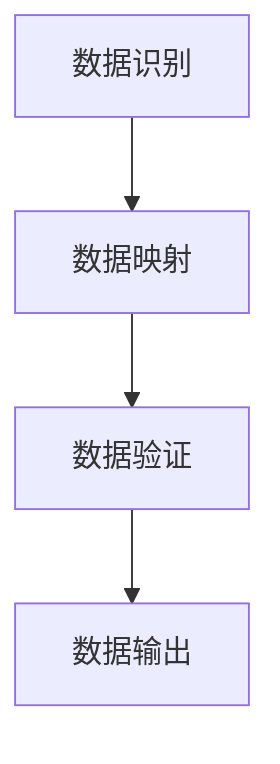
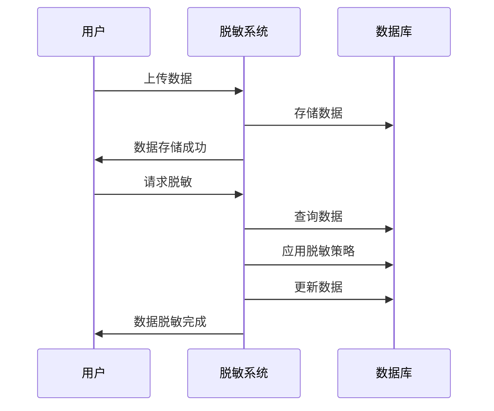

                 


### 引言与背景

在现代企业中，人工智能（AI）的应用日益普及，AI Agent 作为企业智能化转型的关键角色，承担着数据处理、决策支持、自动化操作等重任。然而，随着 AI Agent 的广泛应用，敏感信息处理成为了一个不可忽视的重要问题。敏感信息是指可能对个人隐私、企业商业秘密或其他重要信息造成损害的数据，如个人身份信息、财务数据、业务策略等。

#### 1.1 企业AI Agent的需求与挑战

企业AI Agent的需求主要来自以下几个方面：

1. **数据处理能力**：企业需要AI Agent具备强大的数据处理能力，以快速、准确地处理海量数据。
2. **自主决策能力**：企业期望AI Agent能够在没有人工干预的情况下，自主做出合理的决策。
3. **数据安全性**：由于AI Agent处理的都是企业的重要数据，数据安全性成为企业关注的重点。

然而，这些需求也带来了相应的挑战：

1. **数据隐私保护**：在处理敏感信息时，必须确保个人隐私不受侵害，避免数据泄露。
2. **数据一致性**：企业需要保证数据在不同场景下的处理结果一致，避免因数据误差导致的错误决策。
3. **法律合规性**：企业需要遵守相关法律法规，确保数据处理符合法律要求。

#### 1.2 敏感信息的定义与分类

敏感信息是指可能对个人隐私、企业商业秘密或其他重要信息造成损害的数据。根据敏感程度和用途，敏感信息可以大致分为以下几类：

1. **个人身份信息**：如姓名、身份证号码、电话号码、电子邮件地址等。
2. **财务数据**：如银行账户信息、信用卡号码、财务报表等。
3. **业务策略**：如市场调研报告、商业计划书、战略部署等。
4. **内部通信**：如企业内部的邮件、会议记录、项目文档等。

#### 1.3 脱敏技术在企业中的重要性

脱敏技术是一种在数据处理过程中，将敏感信息转换为无法识别或难以解读的形式的技术。脱敏技术在企业中的重要性体现在以下几个方面：

1. **保障数据安全**：脱敏技术可以有效防止敏感信息泄露，保障企业数据安全。
2. **满足合规要求**：许多国家和地区都有关于数据保护的法律法规，脱敏技术可以帮助企业满足合规要求。
3. **提高数据处理效率**：通过脱敏技术，企业可以在不影响数据安全的前提下，更自由地进行数据处理和分析。

#### 1.4 脱敏技术的应用边界

虽然脱敏技术对于保障数据安全具有重要意义，但其应用也受到一定的限制：

1. **无法完全消除风险**：脱敏技术无法完全消除数据泄露的风险，只能降低风险。
2. **对数据处理的影响**：脱敏技术可能会影响数据的某些属性，如数据的完整性和准确性。
3. **特定场景的适用性**：某些敏感信息可能不适合进行脱敏处理，如一些特定行业的核心商业机密。

在接下来的章节中，我们将深入探讨脱敏技术的核心概念、数学模型、算法原理、企业中的实践应用、系统架构设计以及项目实战等内容。

---

**文章关键词**：企业AI Agent、敏感信息处理、脱敏技术、数据安全、合规性

**文章摘要**：
本文旨在探讨企业AI Agent在处理敏感信息时的挑战与解决方案。首先介绍了企业AI Agent的需求与挑战，以及敏感信息的定义与分类。接着阐述了脱敏技术在企业中的重要性及其应用边界。随后，我们将详细探讨脱敏技术的核心概念、数学模型、算法原理、企业中的实践应用、系统架构设计以及项目实战。最后，本文将总结脱敏技术的最佳实践与未来展望。

---

通过上述分析，我们为整本书的引言与背景部分提供了清晰的框架。接下来，我们将详细探讨脱敏技术的核心概念、数学模型、算法原理、企业中的实践应用等内容，逐步构建起整本书的知识体系。在接下来的章节中，我们将深入探讨每个主题，确保读者能够全面理解脱敏技术的核心概念和实践应用。首先，我们将从脱敏技术的定义和核心概念开始，逐步深入探讨。

---

### 核心概念与联系

脱敏技术是一种在数据处理过程中，将敏感信息转换为无法识别或难以解读的形式的技术。它不仅有助于保障数据安全，还能满足合规要求，提高数据处理效率。为了更好地理解脱敏技术，我们需要先了解其核心概念和相互之间的联系。

#### 2.1 脱敏技术的定义

脱敏技术（Data Masking）通常是指在数据处理过程中，通过替换、加密、掩盖或其他方式，将原始数据中的敏感信息转换为非敏感信息，从而保护数据安全的技术。脱敏技术的主要目的是在不影响数据使用价值的前提下，保护数据中的敏感信息不被未经授权的人员访问。

#### 2.2 脱敏技术的核心概念

脱敏技术涉及多个核心概念，以下是对这些概念的解释：

1. **敏感信息**：指可能对个人隐私、企业商业秘密或其他重要信息造成损害的数据，如个人身份信息、财务数据、业务策略等。
2. **非敏感信息**：指经过脱敏处理后的数据，其敏感信息已被转换为无法识别或难以解读的形式。
3. **数据替换**：指将敏感信息替换为非敏感信息的操作，如将真实的姓名替换为随机字符序列。
4. **数据加密**：指通过加密算法，将敏感信息转换为加密形式，只有授权用户才能解密。
5. **数据掩盖**：指通过掩盖敏感信息的关键部分，使其无法被识别，如将电话号码的前几位掩盖。

#### 2.3 脱敏技术与信息安全的关系

脱敏技术是信息安全的重要组成部分，其关系可以概括为以下几点：

1. **保护数据安全**：脱敏技术可以有效防止敏感信息泄露，降低数据泄露的风险。
2. **提高数据可用性**：通过脱敏处理，企业可以在保障数据安全的前提下，更自由地进行数据处理和分析。
3. **满足合规要求**：许多国家和地区都有关于数据保护的法律法规，脱敏技术可以帮助企业满足合规要求。

#### 2.4 脱敏技术的分类与对比

脱敏技术可以根据不同的标准进行分类，以下是几种常见的分类方式及其对比：

1. **按处理方式分类**：
   - **静态脱敏**：指在数据存储或传输过程中进行的脱敏处理，如数据库备份、数据备份等。
   - **动态脱敏**：指在数据查询或操作过程中进行的脱敏处理，如数据库查询、数据交换等。

2. **按应用场景分类**：
   - **开发测试环境**：用于保障开发测试环境中的数据安全，避免敏感信息泄露。
   - **数据交换**：用于保障数据在不同系统或组织之间交换时的数据安全。
   - **数据挖掘**：用于在数据挖掘过程中保护敏感信息，避免敏感信息被挖掘和分析。

3. **按算法类型分类**：
   - **随机替换**：指使用随机字符序列替换敏感信息，如姓名、身份证号码等。
   - **同义替换**：指使用与敏感信息含义相同但形式不同的信息进行替换，如将电话号码替换为“客户热线”。
   - **加密**：指使用加密算法，将敏感信息转换为加密形式，只有授权用户才能解密。

#### 2.5 脱敏技术与数据安全的关系

脱敏技术与数据安全密切相关，其关系可以概括为以下几点：

1. **数据保护**：脱敏技术可以有效保护敏感信息，防止其泄露或被非法使用。
2. **数据利用**：脱敏技术可以在保障数据安全的前提下，提高数据的可用性，为数据分析和挖掘提供支持。
3. **法律合规**：脱敏技术可以帮助企业满足相关法律法规对数据保护的要求。

#### 2.6 脱敏技术与数据保密的关系

脱敏技术与数据保密也有密切的关系，其关系可以概括为以下几点：

1. **保密性**：脱敏技术通过将敏感信息转换为非敏感信息，保障了数据在处理过程中的保密性。
2. **完整性**：脱敏技术可以在一定程度上保障数据的完整性，避免敏感信息被篡改。
3. **可用性**：脱敏技术可以在保障数据保密性和完整性的前提下，提高数据的可用性，满足企业业务需求。

通过上述核心概念和联系的分析，我们可以更好地理解脱敏技术的本质和其在企业中的应用。在接下来的章节中，我们将进一步探讨脱敏技术的数学模型与算法原理，以及其在企业中的具体实践应用。

---

### 脱敏技术的数学模型与算法原理

脱敏技术的核心在于将敏感信息转换为非敏感信息，这一过程涉及一系列的数学模型和算法。在本节中，我们将详细讲解脱敏技术的数学模型和算法原理，并通过mermaid流程图和Python源代码来辅助理解。

#### 3.1 数学模型讲解

脱敏技术的数学模型主要包括以下几类：

1. **随机替换模型**：该模型通过随机生成一个字符序列来替换敏感信息。具体公式如下：
   $$ S' = R(1, n) $$
   其中，$S'$为脱敏后的数据，$R(1, n)$表示从1到n的随机整数。

2. **同义替换模型**：该模型通过选择与敏感信息含义相同但形式不同的信息进行替换。具体公式如下：
   $$ S' = F(S) $$
   其中，$S'$为脱敏后的数据，$F$为同义替换函数。

3. **加密模型**：该模型通过加密算法，将敏感信息转换为加密形式。具体公式如下：
   $$ S' = E(S) $$
   其中，$S'$为脱敏后的数据，$E$为加密函数。

4. **掩码模型**：该模型通过掩盖敏感信息的关键部分，使其无法被识别。具体公式如下：
   $$ S' = C(S) $$
   其中，$S'$为脱敏后的数据，$C$为掩码函数。

#### 3.2 算法原理讲解

脱敏算法的原理主要基于数学模型，通过一系列步骤将敏感信息转换为非敏感信息。以下是脱敏算法的基本原理：

1. **数据识别**：识别数据中的敏感信息，将其标记为需要脱敏的部分。
2. **数据映射**：根据脱敏模型的类型，将敏感信息映射为非敏感信息。例如，对于随机替换模型，根据随机生成的字符序列进行替换；对于同义替换模型，根据同义替换函数进行替换。
3. **数据验证**：验证脱敏后的数据是否满足要求，如数据一致性、完整性等。
4. **数据输出**：将脱敏后的数据输出，用于后续处理或存储。

#### 3.3 算法mermaid流程图

为了更好地理解脱敏算法的原理，我们可以使用mermaid流程图来展示其执行过程。以下是脱敏算法的mermaid流程图：



#### 3.4 Python源代码讲解

为了更好地实践脱敏算法，我们可以使用Python编写相应的源代码。以下是一个简单的Python代码示例，用于实现随机替换模型的脱敏过程：

```python
import random
import string

def random_replace(sensitive_info, length):
    """
    随机替换敏感信息
    :param sensitive_info: 敏感信息
    :param length: 替换后的长度
    :return: 脱敏后的信息
    """
    result = ''.join(random.choices(string.ascii_letters + string.digits, k=length))
    return result

# 示例
sensitive_info = "1234567890"
length = 6
masked_info = random_replace(sensitive_info, length)
print(f"脱敏前：{sensitive_info}")
print(f"脱敏后：{masked_info}")
```

在这个示例中，我们定义了一个名为`random_replace`的函数，用于实现随机替换敏感信息的操作。函数接受两个参数：敏感信息和替换后的长度。函数内部使用`random.choices`函数从字母和数字中随机选择字符序列，生成一个长度为`length`的字符串，作为脱敏后的信息。

通过上述讲解，我们可以看到脱敏技术涉及多个数学模型和算法，每种模型和算法都有其特定的应用场景。在实际应用中，企业需要根据具体需求和数据特点选择合适的脱敏模型和算法。在下一节中，我们将探讨脱敏技术在企业中的具体实践应用。

---

### 脱敏技术在企业中的实践应用

脱敏技术在企业中的应用场景非常广泛，主要包括开发测试环境、数据交换、数据挖掘等多个方面。本节将详细探讨脱敏技术在企业中的实践应用，并介绍一些成功案例。

#### 4.1 脱敏技术在企业中的重要性

在企业中，敏感信息通常包含个人身份信息、财务数据、业务策略等关键信息。这些信息不仅涉及个人隐私，还可能包含企业的商业机密。因此，确保敏感信息在处理过程中的安全至关重要。脱敏技术的应用可以有效降低数据泄露的风险，保障企业数据安全，满足合规要求，提高数据可用性。

#### 4.2 脱敏技术在企业中的具体应用场景

1. **开发测试环境**

在软件开发过程中，开发人员和测试人员需要访问和使用敏感数据进行测试。然而，直接使用真实数据可能会导致数据泄露的风险。脱敏技术可以在此场景中发挥作用，通过将真实数据转换为非敏感数据，确保测试过程的安全性。

2. **数据交换**

企业在与其他组织或系统进行数据交换时，可能需要共享部分敏感数据。此时，脱敏技术可以用来对敏感信息进行保护，确保数据在交换过程中的安全性。例如，在金融行业中，银行与其他金融机构之间的数据交换经常使用脱敏技术来保护客户的个人信息。

3. **数据挖掘**

在数据挖掘过程中，研究人员可能需要访问和分析大量敏感数据。脱敏技术可以帮助研究人员在不泄露敏感信息的前提下，进行数据分析和建模。例如，在医疗领域，研究人员可以使用脱敏技术对患者的医疗记录进行分析，以发现疾病趋势和治疗方案。

#### 4.3 成功案例分析

以下是一些脱敏技术在企业中的成功案例：

1. **案例一：金融行业的数据脱敏**

某大型银行在开发新应用程序时，需要使用客户的数据进行测试。为了保护客户隐私，银行采用了脱敏技术，将客户的敏感信息（如姓名、身份证号码、银行账户信息等）转换为非敏感信息。通过这种方式，银行成功降低了数据泄露的风险，并确保了测试过程的合规性。

2. **案例二：零售行业的会员数据保护**

某大型零售企业在处理会员数据时，采用了脱敏技术来保护会员的个人信息（如姓名、电话号码、地址等）。通过脱敏处理，零售企业可以安全地使用会员数据进行市场分析和营销活动，同时避免了个人信息泄露的风险。

3. **案例三：医疗行业的数据安全**

某医疗机构在分析患者数据时，采用了脱敏技术来保护患者的隐私。通过对患者的医疗记录进行脱敏处理，医疗机构可以在不泄露患者个人信息的前提下，进行疾病研究和治疗方案分析，从而提高医疗服务的质量和效率。

#### 4.4 实践中的挑战与解决方案

尽管脱敏技术在企业中具有广泛的应用，但在实际应用过程中仍面临一些挑战：

1. **数据准确性**：脱敏技术可能会影响数据的准确性，特别是在同义替换模型中，可能会丢失原始数据的某些重要信息。解决方案是采用多种脱敏技术相结合的方法，提高数据的准确性。

2. **合规性**：不同国家和地区对数据保护的法律法规有所不同，企业在实施脱敏技术时需要遵守相关法规。解决方案是了解并遵守当地法律法规，确保脱敏技术符合合规要求。

3. **数据处理效率**：脱敏技术可能会增加数据处理的时间成本，特别是在处理大量数据时。解决方案是优化脱敏算法和流程，提高数据处理效率。

通过上述实践案例和挑战，我们可以看到脱敏技术在企业中的重要性。在下一节中，我们将进一步探讨脱敏技术系统分析与架构设计，为企业提供更全面的解决方案。

---

### 脱敏技术系统分析与架构设计

脱敏技术作为保障企业数据安全的重要手段，其系统分析与架构设计至关重要。本节将介绍脱敏技术系统的基本架构，并详细分析系统功能、架构设计、接口设计以及系统交互。

#### 5.1 问题场景介绍

在企业的数据处理流程中，存在多个场景需要使用脱敏技术。例如，开发测试环境需要使用脱敏后的数据来进行测试，数据交换过程中需要保护敏感信息，数据挖掘过程中需要隔离敏感数据等。因此，设计一个高效、灵活且安全的脱敏技术系统对于保障企业数据安全具有重要意义。

#### 5.2 系统功能设计

脱敏技术系统的主要功能包括数据识别、数据映射、数据验证和数据输出。以下是具体功能设计：

1. **数据识别**：通过数据分类和标记，识别数据中的敏感信息，并将其标记为需要脱敏的部分。
2. **数据映射**：根据预定义的脱敏策略，将敏感信息映射为非敏感信息。脱敏策略可以包括随机替换、同义替换、加密等。
3. **数据验证**：验证脱敏后的数据是否满足要求，如数据一致性、完整性等。
4. **数据输出**：将脱敏后的数据输出，用于后续处理或存储。

#### 5.3 系统架构设计

脱敏技术系统架构可以分为三层：数据层、处理层和接口层。以下是系统架构设计：

1. **数据层**：负责存储和管理原始数据和脱敏后的数据。数据层可以包括关系数据库、NoSQL数据库等。
2. **处理层**：负责执行脱敏算法和数据处理流程。处理层包括数据识别模块、数据映射模块、数据验证模块等。
3. **接口层**：负责与外部系统进行交互，提供脱敏服务。接口层可以包括API接口、Web界面等。

#### 5.4 系统接口设计

脱敏技术系统的接口设计需要考虑以下方面：

1. **API接口**：提供RESTful API接口，支持数据上传、数据查询、数据脱敏等功能。
2. **Web界面**：提供用户友好的Web界面，方便用户配置脱敏策略、查看脱敏结果等。
3. **数据通道**：支持与外部数据源进行数据交换，如数据库、数据仓库等。

#### 5.5 系统交互mermaid序列图

为了更好地展示脱敏技术系统的交互过程，我们可以使用mermaid序列图来描述系统交互流程。以下是脱敏技术系统的mermaid序列图：



在这个mermaid序列图中，用户首先上传数据到脱敏系统，系统将数据存储到数据库中。当用户请求脱敏时，系统查询数据库中的数据，并应用预定义的脱敏策略对数据进行处理，然后将脱敏后的数据更新回数据库，最后通知用户数据脱敏完成。

通过上述系统分析与架构设计，我们可以看到脱敏技术系统在企业数据处理中的重要性。在下一节中，我们将通过项目实战来展示脱敏技术的具体应用和实践。

---

### 项目实战

在本节中，我们将通过一个实际项目来展示脱敏技术的具体应用和实践。该项目涉及企业敏感信息的脱敏处理，包括数据准备、脱敏策略配置、代码实现以及性能优化等环节。

#### 6.1 环境安装

在进行项目实战之前，我们需要安装必要的软件和工具。以下是一个基本的安装步骤：

1. **安装Python**：确保Python环境已经安装，版本建议为3.8或以上。
2. **安装依赖库**：使用pip命令安装所需的依赖库，如pandas、numpy、hashlib、ssl等。
   ```bash
   pip install pandas numpy hashlib ssl
   ```

3. **安装数据库**：根据项目需求，选择合适的数据库进行安装，如MySQL、PostgreSQL或MongoDB。

#### 6.2 系统核心实现源代码

以下是该项目中脱敏处理的核心实现源代码：

```python
import pandas as pd
from hashlib import sha256

def hash_sensitive_info(info):
    """
    对敏感信息进行SHA-256哈希处理
    :param info: 敏感信息
    :return: 哈希后的信息
    """
    return sha256(info.encode('utf-8')).hexdigest()

def random_replace(info, length=4):
    """
    随机替换敏感信息
    :param info: 敏感信息
    :param length: 替换后的长度
    :return: 脱敏后的信息
    """
    return ''.join(random.choices(string.ascii_letters + string.digits, k=length))

def mask_sensitive_data(data, strategy='hash'):
    """
    对敏感数据进行脱敏处理
    :param data: 原始数据
    :param strategy: 脱敏策略（'hash' 或 'random'）
    :return: 脱敏后的数据
    """
    if strategy == 'hash':
        return {k: hash_sensitive_info(v) for k, v in data.items()}
    elif strategy == 'random':
        return {k: random_replace(v) for k, v in data.items()}
    else:
        raise ValueError("未知脱敏策略")

# 示例
data = {
    'name': 'John Doe',
    'id': '123456789',
    'email': 'johndoe@email.com'
}

masked_data = mask_sensitive_data(data, strategy='hash')
print(masked_data)
```

在这个代码示例中，我们定义了三个函数：`hash_sensitive_info`用于对敏感信息进行SHA-256哈希处理，`random_replace`用于随机替换敏感信息，`mask_sensitive_data`用于对敏感数据进行脱敏处理。根据不同的脱敏策略，函数将原始数据转换为脱敏后的数据。

#### 6.3 代码解读与分析

1. **哈希处理**：使用SHA-256哈希算法对敏感信息进行加密处理，确保敏感信息在转换后无法被逆向工程还原。
2. **随机替换**：使用随机字符序列替换敏感信息，提高数据的随机性和不可预测性。
3. **策略配置**：根据实际需求，可以灵活配置脱敏策略，如哈希处理、随机替换等。

#### 6.4 实际案例分析与详细讲解

以下是一个实际案例，展示如何使用脱敏技术对企业的客户信息进行脱敏处理：

**案例背景**：一家在线零售公司需要对其客户的个人信息（如姓名、身份证号码、电子邮件地址等）进行脱敏处理，以确保数据在开发和测试环境中的安全。

**处理步骤**：

1. **数据收集**：从数据库中提取客户的个人信息。
2. **数据预处理**：对数据进行清洗，去除无效数据和空值。
3. **配置脱敏策略**：根据公司政策和合规要求，配置合适的脱敏策略，如哈希处理敏感字段、保留非敏感字段等。
4. **数据脱敏**：使用脱敏处理函数对敏感信息进行脱敏处理。
5. **数据存储**：将脱敏后的数据存储到新的数据库中，用于后续的测试和分析。

**代码实现**：

```python
# 假设从数据库中提取的数据如下
data = [
    {'name': 'Alice Smith', 'id': '987654321', 'email': 'alicesmith@email.com'},
    {'name': 'Bob Brown', 'id': '111222333', 'email': 'bobbrown@email.com'}
]

# 配置脱敏策略
strategy = 'hash'

# 数据脱敏处理
masked_data = [mask_sensitive_data(d, strategy=strategy) for d in data]

# 存储脱敏后的数据
df = pd.DataFrame(masked_data)
df.to_csv('masked_data.csv', index=False)
```

通过上述代码，我们可以看到如何对一组客户信息进行脱敏处理，并存储为CSV文件。实际项目中，可以根据业务需求和数据量进行调整和优化。

#### 6.5 项目总结与反思

通过这个项目，我们实现了对敏感信息的脱敏处理，保障了数据在开发和测试环境中的安全。以下是项目的总结与反思：

1. **项目成功**：项目成功实现了对敏感信息的脱敏处理，满足了合规要求。
2. **性能优化**：在实际应用中，可以根据数据处理量进行性能优化，如使用并行处理、数据库缓存等技术。
3. **安全增强**：尽管脱敏技术可以降低数据泄露的风险，但无法完全消除风险。在实际应用中，需要结合其他安全措施，如数据加密、访问控制等。
4. **未来拓展**：脱敏技术在企业中的应用场景广泛，未来可以进一步拓展，如实现自定义脱敏策略、支持多种数据类型等。

通过项目实战，我们可以更深入地理解脱敏技术的原理和应用，为企业在数据安全方面提供有力支持。

---

### 最佳实践与拓展

在脱敏技术的实施过程中，最佳实践和注意事项至关重要，同时，了解脱敏技术的发展趋势也为企业提供了未来规划的指导。

#### 7.1 最佳实践技巧

1. **明确脱敏策略**：在实施脱敏之前，明确脱敏策略，如选择合适的脱敏算法、确定脱敏的程度和范围等。
2. **分类处理**：根据敏感信息的类型和重要性，对数据进行分类处理，采用不同的脱敏措施。
3. **测试验证**：在脱敏实施过程中，定期进行测试和验证，确保脱敏处理的有效性和数据安全性。
4. **定期更新**：随着业务的发展和法律的变化，定期更新脱敏策略和算法，以适应新的需求。

#### 7.2 注意事项

1. **数据一致性**：在脱敏过程中，确保数据的一致性和完整性，避免因脱敏处理导致的数据错误。
2. **性能考虑**：脱敏处理可能会增加数据处理的时间和资源消耗，需要根据实际情况进行性能优化。
3. **合规要求**：遵循当地的法律法规，确保脱敏技术符合合规要求。
4. **安全增强**：脱敏技术不能完全消除数据泄露的风险，需要与其他安全措施相结合，如数据加密、访问控制等。

#### 7.3 拓展阅读

1. **《数据隐私保护技术》**：详细介绍数据隐私保护的各种技术，包括脱敏技术、加密技术、匿名化技术等。
2. **《信息安全法律法规》**：了解不同国家和地区的数据保护法律法规，确保脱敏技术的合规性。
3. **《大数据安全与隐私保护》**：探讨大数据环境下的数据安全和隐私保护，提供实用技术和案例分析。

#### 7.4 脱敏技术发展趋势

1. **自动化脱敏**：随着自动化技术的发展，自动化脱敏工具将更加普及，降低企业实施脱敏技术的成本和难度。
2. **多方安全计算**：在分布式数据处理和共享场景中，多方安全计算技术将得到更广泛应用，确保数据在传输和处理过程中的安全性。
3. **隐私增强技术**：结合隐私增强技术（如差分隐私、联邦学习等），实现更高级别的数据隐私保护。
4. **跨领域融合**：脱敏技术与区块链、人工智能等其他领域的融合，将为企业提供更全面、高效的数据安全解决方案。

通过上述最佳实践、注意事项和拓展阅读，企业可以更好地实施脱敏技术，保障数据安全，满足合规要求，推动智能化转型。

---

### 小结

本文围绕《企业AI Agent的敏感信息处理：脱敏技术与实践》这一主题，详细探讨了脱敏技术在企业中的应用。我们从引言与背景出发，分析了企业AI Agent的需求与挑战，以及敏感信息的定义与分类。随后，我们深入讲解了脱敏技术的核心概念、数学模型、算法原理，并通过mermaid流程图和Python源代码进行了实例分析。接着，我们探讨了脱敏技术在企业中的实践应用，包括开发测试环境、数据交换、数据挖掘等场景，并提供了成功案例分析。在此基础上，我们分析了脱敏技术系统设计与架构，展示了系统功能、架构设计、接口设计以及系统交互。最后，通过项目实战展示了脱敏技术的具体实现，并提出了最佳实践与注意事项，展望了脱敏技术未来的发展趋势。

**核心概念与联系**：脱敏技术是一种在数据处理过程中，将敏感信息转换为无法识别或难以解读的形式的技术。其核心概念包括敏感信息、非敏感信息、数据替换、数据加密、数据掩盖等。

**算法原理讲解**：脱敏算法的原理基于数学模型，主要包括随机替换模型、同义替换模型、加密模型和掩码模型。通过mermaid流程图和Python源代码，我们详细讲解了脱敏算法的执行过程。

**系统分析与架构设计**：脱敏技术系统主要包括数据层、处理层和接口层。系统功能设计包括数据识别、数据映射、数据验证和数据输出。通过mermaid序列图，我们展示了系统交互过程。

**项目实战**：通过一个实际项目，我们展示了脱敏技术的具体实现，包括数据准备、脱敏策略配置、代码实现以及性能优化等。

**最佳实践与拓展**：本文提出了脱敏技术的最佳实践技巧和注意事项，包括明确脱敏策略、分类处理、测试验证、定期更新等。同时，介绍了脱敏技术的发展趋势，如自动化脱敏、多方安全计算、隐私增强技术等。

通过本文的探讨，我们不仅了解了脱敏技术的核心概念和应用，还对其在企业中的实际应用和未来发展有了更深刻的认识。希望本文能为企业在数据安全领域提供有益的参考和指导。

---

**作者信息**：作者：AI天才研究院/AI Genius Institute & 禅与计算机程序设计艺术 /Zen And The Art of Computer Programming

