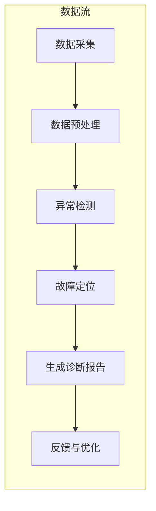
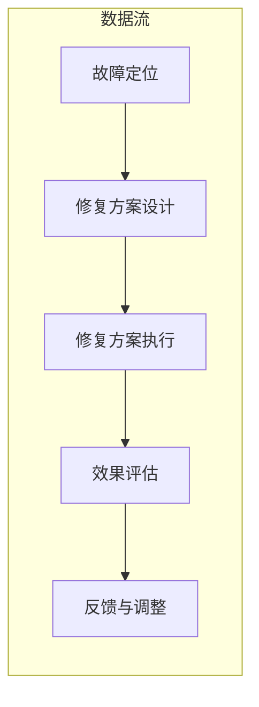
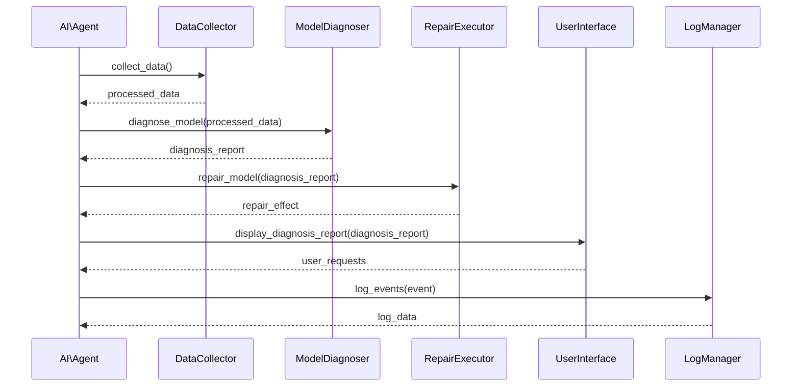
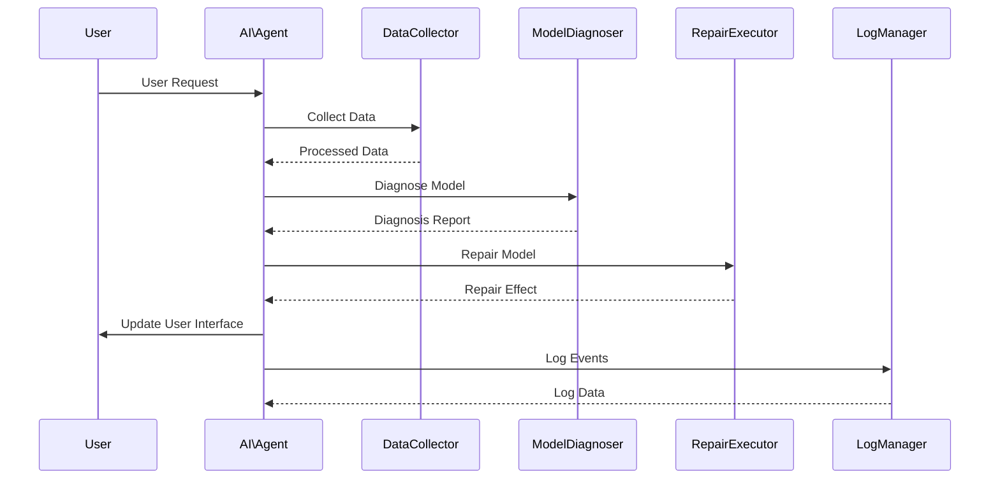

                 

### 引言

随着人工智能技术的迅猛发展，AI Agent作为人工智能系统的重要组成部分，已经在许多领域取得了显著的应用成果。特别是在企业环境中，AI Agent不仅可以提高工作效率，还能为企业带来显著的经济效益。然而，随着AI Agent在复杂企业环境中运行，其稳定性和可靠性问题日益凸显。为了确保AI Agent能够长期稳定运行，自我诊断与修复能力成为了研究的热点。

本文将围绕企业AI Agent的自我诊断与修复能力进行深入探讨。首先，我们将介绍企业AI Agent的背景及其重要性。接着，我们将逐步分析企业AI Agent自我诊断与修复能力的基础理论、算法原理与实现方法。在此基础上，我们将详细阐述企业AI Agent的自我诊断与修复系统架构设计，并探讨具体实现过程中的技术挑战与解决方案。最后，我们将通过一个实际案例展示企业AI Agent的自我诊断与修复能力在实际应用中的效果，并总结全文内容。

本文旨在为企业AI Agent的研究者和实践者提供一份全面、系统的技术指南，帮助读者深入理解企业AI Agent的自我诊断与修复能力的核心概念、实现方法与应用场景。通过本文的探讨，我们希望能够推动企业AI Agent技术的发展，为企业带来更加稳定、高效的人工智能解决方案。

## 第一部分：企业AI Agent的背景介绍

### 1.1.1 问题背景

随着大数据、云计算和物联网技术的快速发展，企业面临的业务环境变得更加复杂多变。在这个背景下，人工智能（AI）技术逐渐成为企业提升竞争力、优化运营的重要工具。企业AI Agent作为一种智能体，具有自主决策和自适应能力，能够帮助企业自动化处理复杂任务、优化业务流程，从而提高整体效率。

然而，在实际应用中，企业AI Agent面临着诸多挑战。首先是数据质量的问题。AI Agent的决策依赖于大量的数据输入，但数据质量直接影响其性能和稳定性。如果数据存在噪声、缺失或者偏差，AI Agent的决策结果可能会出现偏差，导致业务流程中断或者错误。其次是系统的可靠性问题。企业AI Agent通常需要长时间在复杂的业务环境中运行，其稳定性直接关系到企业运营的连续性和可靠性。一旦AI Agent出现故障，可能会造成严重的经济损失和业务风险。

此外，企业AI Agent在处理大量数据时，还可能遇到计算资源不足、处理效率低下等问题。例如，当AI Agent需要对海量数据进行实时处理时，计算资源的瓶颈可能会导致系统响应时间过长，影响用户体验。另外，企业AI Agent在面临突发事件或者未知情况时，可能无法自主应对，需要人工介入，这不仅增加了运营成本，还可能影响业务流程的连续性。

总之，企业AI Agent在实际应用中面临着数据质量、系统可靠性、计算资源等多方面的挑战。为了确保AI Agent能够长期稳定地运行，提高其自我诊断与修复能力成为亟待解决的问题。

### 1.1.2 问题描述

为了应对上述挑战，企业AI Agent需要具备自我诊断和修复能力。具体来说，企业AI Agent的自我诊断能力包括以下方面：

1. **数据质量检测**：AI Agent需要能够实时监控数据输入的质量，识别数据中的噪声、缺失和偏差，并采取相应的措施进行数据清洗和预处理，以保证数据质量。

2. **模型性能监控**：AI Agent需要监控自身模型的性能指标，如准确率、召回率、F1值等，识别模型在训练和预测过程中可能出现的过拟合、欠拟合等问题，并采取相应的优化措施。

3. **异常检测**：AI Agent需要能够识别和处理运行过程中的异常情况，如计算资源不足、系统崩溃等，并采取相应的修复措施，保证系统的稳定性。

4. **故障定位**：AI Agent需要能够快速定位故障发生的具体位置和原因，以便进行针对性的修复。

而企业AI Agent的修复能力则包括以下方面：

1. **自动修复**：AI Agent需要能够根据诊断结果，自动采取修复措施，如重新训练模型、调整参数等，以提高系统的性能和稳定性。

2. **人工干预**：当AI Agent无法自动修复故障时，需要提供人工干预的接口和指导，帮助运营人员快速定位和解决问题。

3. **系统恢复**：在极端情况下，AI Agent需要能够自动或手动启动备份系统，确保业务流程的连续性和稳定性。

总之，企业AI Agent的自我诊断和修复能力旨在提高系统的可靠性和稳定性，减少人工干预的需求，从而降低运营成本、提高业务流程的连续性和效率。

### 1.1.3 问题解决

针对企业AI Agent在自我诊断和修复能力方面面临的挑战，我们可以从以下几个方面进行问题解决：

1. **数据质量检测**：
   - **实时监控**：通过构建数据质量监控模块，实时监控数据输入的质量。可以使用机器学习技术对数据进行自动分类和标注，识别噪声、缺失和偏差。
   - **数据预处理**：在数据输入前，进行数据清洗和预处理，如填补缺失值、去除噪声、归一化等。使用数据质量评估指标，如缺失率、噪声率等，来衡量数据质量。

2. **模型性能监控**：
   - **性能指标监控**：通过构建模型性能监控模块，实时收集和评估模型性能指标，如准确率、召回率、F1值等。使用对比实验和交叉验证等方法，识别模型是否存在过拟合、欠拟合等问题。
   - **模型优化**：根据性能监控结果，自动调整模型参数，如学习率、批量大小等，以优化模型性能。

3. **异常检测**：
   - **异常检测算法**：使用异常检测算法，如基于统计方法的Z-score、基于距离度量的KNN、基于模型的方法（如基于集成模型的孤立森林等），识别和处理运行过程中的异常情况。
   - **自适应阈值**：通过历史数据和在线学习，自适应调整异常检测的阈值，提高检测的准确性和实时性。

4. **故障定位**：
   - **日志分析**：通过收集和分析系统日志，定位故障发生的具体位置和原因。使用日志分析工具，如ELK（Elasticsearch、Logstash、Kibana）等，对日志数据进行可视化分析。
   - **故障树分析**：构建故障树模型，通过逐步分析故障节点和因果关系，快速定位故障原因。

5. **自动修复**：
   - **自动修复策略**：根据故障类型和严重程度，制定自动修复策略。例如，对于数据质量问题，可以自动进行数据清洗和预处理；对于模型性能问题，可以自动调整模型参数或重新训练模型。
   - **故障恢复**：在自动修复过程中，实时监控修复效果，确保修复措施的有效性。对于无法自动修复的故障，提供人工干预接口，便于运营人员进行手动修复。

6. **人工干预**：
   - **干预指导**：提供故障定位和修复指导，帮助运营人员快速解决问题。通过故障日志、诊断报告等方式，详细记录故障情况和修复过程，便于后续分析和优化。
   - **备份系统**：在极端情况下，启动备份系统，确保业务流程的连续性和稳定性。

通过上述措施，企业AI Agent可以显著提高自我诊断和修复能力，确保在复杂业务环境中长期稳定运行，从而为企业带来更高的效率和可靠性。

### 1.1.4 边界与外延

在探讨企业AI Agent的自我诊断与修复能力时，我们首先需要明确其边界与外延，以确保讨论的准确性和适用性。

**边界**：

1. **诊断与修复范围**：企业AI Agent的自我诊断与修复能力主要针对AI Agent自身，包括其数据收集、模型训练、预测等过程。此外，还可以扩展到依赖的底层系统，如计算资源、网络连接等，但本文主要关注AI Agent自身的诊断与修复能力。

2. **故障类型**：企业AI Agent的自我诊断与修复能力主要针对常见的故障类型，如数据质量异常、模型性能异常、计算资源不足等。然而，对于硬件故障、极端网络故障等非AI相关故障，超出了本文的讨论范围。

3. **应用场景**：企业AI Agent的自我诊断与修复能力主要应用于企业级业务场景，如金融、电商、制造等行业。不同行业可能存在特定的故障类型和修复需求，但本文将提供通用性的解决方案。

**外延**：

1. **上下游系统**：企业AI Agent作为企业级业务系统的一部分，其自我诊断与修复能力需要与上下游系统进行集成。例如，与数据仓库、业务流程管理（BPM）系统等集成，实现数据流和业务流程的监控与优化。

2. **人工智能技术应用**：企业AI Agent的自我诊断与修复能力不仅限于单一算法或模型，还可以结合其他人工智能技术，如深度学习、强化学习等，提升诊断和修复的准确性和效率。

3. **持续优化与发展**：企业AI Agent的自我诊断与修复能力是一个持续优化的过程。随着技术发展和业务需求的演变，AI Agent需要不断更新和改进其诊断与修复算法，以应对新的故障类型和修复需求。

通过明确企业AI Agent自我诊断与修复能力的边界与外延，我们可以更准确地理解其核心作用和应用场景，为后续讨论提供基础。

### 1.1.5 核心概念与联系

在深入探讨企业AI Agent的自我诊断与修复能力之前，我们需要明确几个核心概念，并理解它们之间的联系。

**核心概念**：

1. **企业AI Agent**：企业AI Agent是一种具有自主决策和自适应能力的人工智能系统，能够模拟人类思维过程，在复杂企业环境中自动执行任务。企业AI Agent通常包括数据收集、模型训练、预测和反馈等多个模块。

2. **自我诊断**：自我诊断是指企业AI Agent能够对其自身运行状态进行监控和评估，识别潜在问题和故障，并采取相应的措施进行修复或调整。

3. **修复能力**：修复能力是指企业AI Agent能够根据自我诊断结果，自动采取修复措施，如重新训练模型、调整参数、替换模块等，以提高系统的稳定性和性能。

**概念属性特征对比表格**：

| 特征 | 企业AI Agent | 自我诊断 | 修复能力 |
| ---- | ----------- | -------- | -------- |
| 目标 | 自动执行任务 | 监控自身状态 | 修复故障 |
| 技能 | 自主决策、自适应 | 诊断分析 | 自动修复 |
| 输入 | 数据、任务指令 | 系统日志、性能指标 | 诊断结果 |
| 输出 | 预测结果、决策建议 | 故障报告、诊断结论 | 修复措施 |

**ER实体关系图架构的Mermaid流程图**：

```mermaid
entityRelation
  [[企业AI Agent]] --|> [[数据收集模块]]  
  [[企业AI Agent]] --|> [[模型诊断模块]]  
  [[企业AI Agent]] --|> [[修复执行模块]]  
  [[数据收集模块]] --|> [[系统日志]]
  [[模型诊断模块]] --|> [[性能指标]]
  [[修复执行模块]] --|> [[修复方案]]
```

在这个ER实体关系图中，企业AI Agent作为核心实体，与数据收集模块、模型诊断模块和修复执行模块之间存在直接的关联。数据收集模块负责收集系统日志和性能指标，为自我诊断提供数据支持；模型诊断模块根据收集到的数据，进行故障诊断并生成诊断结论；修复执行模块根据诊断结论，采取相应的修复方案，确保系统稳定运行。

通过明确核心概念及其属性特征，以及ER实体关系图的展示，我们可以更清晰地理解企业AI Agent的自我诊断与修复能力的工作机制和整体架构，为后续内容提供坚实的基础。

## 第2章：企业AI Agent的基础理论

### 2.1.1 AI Agent概述

AI Agent，即人工智能代理，是一种能够模拟人类智能行为、在复杂环境中自主决策和执行任务的人工智能实体。AI Agent具有感知环境、理解任务需求、做出决策和执行动作的能力，可以应用于多种领域，如自动驾驶、智能客服、金融风控等。AI Agent的基本特征包括自主性、适应性和学习能力，这使得它们能够在动态和不确定的环境中高效地完成任务。

在企业环境中，AI Agent能够帮助企业处理复杂的业务任务，提高运营效率。例如，企业AI Agent可以自动分析市场数据，为企业制定营销策略；它可以监控生产线的运行状态，预测设备故障并进行预防性维护；它还可以帮助企业优化供应链管理，降低成本。这些应用不仅提高了企业的运营效率，还降低了人工成本，为企业创造了显著的经济效益。

### 2.1.2 自我诊断原理

自我诊断是企业AI Agent的一项重要功能，其核心在于能够实时监控系统的运行状态，识别潜在问题和故障，并采取相应的措施进行修复或调整。自我诊断的原理主要包括以下几个方面：

1. **数据采集**：企业AI Agent通过数据收集模块，从系统日志、性能指标、用户反馈等多个渠道获取运行数据。这些数据包括计算资源使用情况、模型训练结果、预测准确率等。

2. **异常检测**：基于历史数据和当前运行状态，AI Agent使用异常检测算法对采集到的数据进行处理和分析，识别异常情况。常见的异常检测算法包括基于统计的方法（如Z-score、IQR法）、基于距离度量的方法（如KNN）、基于模型的方法（如孤立森林、Local Outlier Factor）等。

3. **故障定位**：一旦检测到异常情况，AI Agent会进行故障定位，识别故障发生的具体位置和原因。这通常涉及到对日志文件的深入分析、系统调用跟踪和故障树分析等方法。

4. **诊断结论**：通过综合分析异常检测结果和故障定位结果，AI Agent会生成诊断结论，包括故障类型、故障位置和可能的修复方案。

5. **反馈与调整**：AI Agent将诊断结论反馈给系统，根据诊断结果进行自动修复或调整。例如，如果检测到模型过拟合，AI Agent可能会调整模型参数或重新训练模型；如果检测到数据质量异常，AI Agent可能会进行数据清洗和预处理。

### 2.1.3 修复能力原理

修复能力是企业AI Agent的另一项关键功能，旨在通过自动化的方式解决系统中的故障，确保系统的稳定运行。修复能力的原理主要包括以下几个步骤：

1. **故障识别**：AI Agent通过自我诊断模块识别系统中的故障。故障可能包括计算资源不足、模型性能下降、数据质量问题等。

2. **修复方案设计**：基于故障类型和系统状态，AI Agent设计相应的修复方案。修复方案可能包括重新训练模型、调整参数、替换模块、数据清洗等。

3. **方案执行**：AI Agent根据设计的修复方案进行自动化执行。执行过程中，AI Agent会实时监控修复效果，确保方案的有效性。

4. **效果评估**：修复方案执行完毕后，AI Agent会评估修复效果，包括系统性能指标、用户满意度等。如果修复效果不佳，AI Agent可能会重新设计和执行修复方案。

5. **持续优化**：AI Agent通过收集修复过程中的数据，不断优化修复策略。这包括更新故障数据库、调整异常检测和修复算法等，以提高未来故障的识别和修复能力。

### 2.1.4 AI Agent的结构与功能

企业AI Agent通常由多个模块组成，每个模块具有特定的功能和作用。以下是企业AI Agent的核心结构及其功能描述：

1. **数据收集模块**：
   - **功能**：负责从各种数据源（如系统日志、传感器数据、用户交互数据等）收集数据。
   - **作用**：提供实时、准确的数据支持，为自我诊断和修复提供基础。

2. **模型诊断模块**：
   - **功能**：基于收集到的数据，对AI Agent的模型进行诊断和分析，识别模型性能问题。
   - **作用**：通过性能监控、异常检测等方法，确保模型在正常工作状态下。

3. **修复执行模块**：
   - **功能**：根据诊断结果，自动或手动执行修复措施，如重新训练模型、调整参数等。
   - **作用**：提高系统的可靠性和稳定性，减少故障对业务流程的影响。

4. **用户接口模块**：
   - **功能**：提供与用户的交互界面，包括故障报告、诊断结果和修复建议等。
   - **作用**：便于运营人员或用户了解系统状态，进行人工干预或验证修复效果。

5. **日志管理模块**：
   - **功能**：记录系统的运行日志，包括故障记录、诊断过程、修复操作等。
   - **作用**：为故障分析和系统优化提供历史数据支持。

6. **数据预处理模块**：
   - **功能**：对收集到的数据进行清洗、预处理，提高数据质量。
   - **作用**：确保模型输入数据的质量，提高模型性能和诊断准确性。

通过以上模块的协同工作，企业AI Agent能够实现自我诊断和修复功能，确保系统在复杂业务环境中长期稳定运行。

### 2.1.4.1 核心结构

企业AI Agent的核心结构通常由以下主要模块组成：

1. **数据收集模块**：
   - **功能**：负责从多种数据源（如系统日志、传感器数据、用户交互数据等）中收集数据，为后续的模型诊断和修复提供基础数据。
   - **关键组成部分**：数据采集器、数据清洗器、数据存储器。

2. **模型诊断模块**：
   - **功能**：基于收集到的数据，对AI Agent的模型进行性能监控和异常检测，识别模型中的潜在问题。
   - **关键组成部分**：性能监控器、异常检测器、诊断分析器。

3. **修复执行模块**：
   - **功能**：根据模型诊断的结果，自动或手动执行修复措施，如重新训练模型、调整参数、替换模块等。
   - **关键组成部分**：修复策略生成器、修复执行器、效果评估器。

4. **用户接口模块**：
   - **功能**：提供与用户的交互界面，包括故障报告、诊断结果、修复建议等，便于用户或运营人员了解系统状态并做出相应决策。
   - **关键组成部分**：用户界面、交互逻辑、反馈机制。

5. **日志管理模块**：
   - **功能**：记录系统的运行日志，包括故障记录、诊断过程、修复操作等，为故障分析和系统优化提供历史数据支持。
   - **关键组成部分**：日志记录器、日志分析器、日志存储器。

6. **数据预处理模块**：
   - **功能**：对收集到的数据进行清洗、预处理，提高数据质量，确保模型输入数据的准确性和完整性。
   - **关键组成部分**：数据清洗器、数据转换器、数据验证器。

这些模块在企业AI Agent中各自承担着重要的职责，相互协作，共同实现自我诊断和修复功能，确保系统在复杂业务环境中长期稳定运行。

### 2.1.4.2 功能关系

企业AI Agent的各个模块之间通过数据流和控制流紧密相连，共同实现自我诊断和修复功能。以下是各模块之间的功能关系：

1. **数据流**：
   - **数据收集模块**：从各种数据源（如系统日志、传感器数据、用户交互数据等）中收集数据，并将其传递给数据预处理模块。
   - **数据预处理模块**：对收集到的数据（如清洗、归一化、转换等）进行处理，提高数据质量，然后将其传递给模型诊断模块。
   - **模型诊断模块**：使用预处理后的数据对AI Agent的模型进行性能监控和异常检测，生成诊断结果，并将其传递给修复执行模块。
   - **修复执行模块**：根据诊断结果，自动执行相应的修复措施（如重新训练模型、调整参数等），并将修复效果反馈给模型诊断模块和数据收集模块。
   - **日志管理模块**：记录系统运行过程中发生的所有事件，包括数据收集、模型诊断、修复执行等，为后续的故障分析和系统优化提供历史数据支持。

2. **控制流**：
   - **数据收集模块**：根据系统配置，启动数据采集器，定期从数据源中获取数据。
   - **数据预处理模块**：根据数据清洗规则和预处理算法，对采集到的数据进行处理，并将处理后的数据存储在数据库或数据仓库中。
   - **模型诊断模块**：定期执行性能监控和异常检测任务，根据设定的阈值和算法，识别系统中的异常情况，并生成诊断报告。
   - **修复执行模块**：根据诊断报告，自动启动修复策略生成器，设计修复方案，并执行修复措施。修复过程中，会实时监控修复效果，并根据反馈结果进行调整。
   - **用户接口模块**：为用户提供诊断报告、修复建议和交互界面，便于用户了解系统状态和进行人工干预。
   - **日志管理模块**：实时记录系统运行过程中的所有事件和操作，包括数据收集、模型诊断、修复执行等，为故障分析和系统优化提供数据支持。

通过数据流和控制流的协同工作，企业AI Agent能够实现自我诊断和修复功能，提高系统的稳定性和可靠性。数据流确保了信息的传递和处理，控制流则确保了系统的自动化和智能化。

## 第3章：自我诊断算法原理与实现

### 3.1.1 自我诊断算法概述

自我诊断算法是企业AI Agent实现自我监控和故障识别的关键技术。其主要目标是通过对系统运行数据的分析，实时检测和诊断系统中的异常情况，从而提高系统的稳定性和可靠性。自我诊断算法通常包括数据采集、异常检测、故障定位和诊断报告等环节。

在自我诊断算法中，数据采集是基础。企业AI Agent通过数据收集模块，从多个渠道（如系统日志、性能指标、用户反馈等）收集数据。这些数据将被预处理，以便于后续的异常检测和故障定位。

异常检测是核心环节。企业AI Agent使用多种异常检测算法，对预处理后的数据进行处理和分析，识别数据中的异常值和异常模式。常见的异常检测算法包括基于统计的方法（如Z-score、IQR法）、基于距离度量的方法（如KNN、孤立森林）和基于模型的方法（如Local Outlier Factor、LSTM）。

故障定位是在异常检测之后的重要步骤。企业AI Agent通过分析异常检测结果，定位故障发生的具体位置和原因。故障定位通常涉及对日志文件的分析、系统调用跟踪和故障树分析等方法。

最后，企业AI Agent会生成诊断报告，详细记录故障类型、故障位置和修复建议。诊断报告不仅为系统修复提供指导，还为系统的优化和改进提供数据支持。

### 3.1.2 自我诊断算法流程图

为了更清晰地展示自我诊断算法的流程，我们可以使用Mermaid流程图进行描述。以下是自我诊断算法的Mermaid流程图：



在这个流程图中，数据采集模块负责从多个渠道收集数据，并将其传递给数据预处理模块。数据预处理模块对采集到的数据（如清洗、归一化、转换等）进行处理，提高数据质量，然后将其传递给异常检测模块。异常检测模块使用多种异常检测算法，对预处理后的数据进行处理和分析，识别数据中的异常值和异常模式。故障定位模块在异常检测结果的基础上，定位故障发生的具体位置和原因。最后，企业AI Agent生成诊断报告，详细记录故障类型、故障位置和修复建议，并将报告反馈给系统进行优化。

### 3.1.3 自我诊断算法的Python源代码实现

以下是自我诊断算法的Python源代码实现示例。这段代码主要包含数据采集、数据预处理、异常检测和故障定位等核心功能。

```python
import pandas as pd
from sklearn.ensemble import IsolationForest
from sklearn.preprocessing import StandardScaler

# 数据采集
def collect_data():
    # 这里以读取系统日志文件为例
    data = pd.read_csv('system_logs.csv')
    return data

# 数据预处理
def preprocess_data(data):
    # 数据清洗、归一化等操作
    scaler = StandardScaler()
    processed_data = scaler.fit_transform(data)
    return processed_data

# 异常检测
def detect_anomalies(processed_data):
    # 使用孤立森林算法进行异常检测
    clf = IsolationForest(contamination=0.1)
    clf.fit(processed_data)
    anomalies = clf.predict(processed_data)
    return anomalies

# 故障定位
def locate_faults(data, anomalies):
    # 根据异常检测结果定位故障
    faulty_rows = data[anomalies == -1]
    fault_details = faulty_rows.describe()
    return fault_details

# 主函数
def diagnose_model():
    data = collect_data()
    processed_data = preprocess_data(data)
    anomalies = detect_anomalies(processed_data)
    fault_details = locate_faults(data, anomalies)
    
    # 输出诊断结果
    print(f"诊断结果：\n{fault_details}")

# 执行诊断
diagnose_model()
```

在这个示例中，`collect_data`函数负责从系统日志文件中读取数据；`preprocess_data`函数对采集到的数据进行预处理，如清洗、归一化等；`detect_anomalies`函数使用孤立森林算法进行异常检测，识别数据中的异常值；`locate_faults`函数根据异常检测结果，定位故障发生的具体位置。最后，`diagnose_model`函数将这些功能串联起来，实现自我诊断过程。

### 3.1.4 自我诊断算法的数学模型与公式

自我诊断算法的数学模型和公式是理解其工作原理的重要基础。以下是几个关键公式及其详细解释：

#### **故障检测概率公式**

故障检测概率公式用于计算在给定诊断结果下故障发生的概率。其公式为：

\[ P(\text{fault}|\text{diagnosis}) = \frac{P(\text{diagnosis}|\text{fault})P(\text{fault})}{P(\text{diagnosis})} \]

其中：
- \( P(\text{fault}|\text{diagnosis}) \) 表示在诊断结果为正常的情况下，故障发生的概率。
- \( P(\text{diagnosis}|\text{fault}) \) 表示在故障发生时，诊断结果为正常的概率。
- \( P(\text{fault}) \) 表示故障发生的先验概率。
- \( P(\text{diagnosis}) \) 表示诊断结果为正常的概率。

#### **详细讲解与举例说明**

以模型A的自我诊断为例，假设有以下参数值：

- \( P(\text{fault}) = 0.05 \)（即系统发生故障的先验概率为5%）。
- \( P(\text{diagnosis}|\text{fault}) = 0.8 \)（即故障发生时，诊断结果为正常的概率为80%）。
- \( P(\text{diagnosis}|\text{no fault}) = 0.9 \)（即故障未发生时，诊断结果为正常的概率为90%）。

我们可以计算在诊断结果为正常的情况下，故障发生的概率：

\[ P(\text{fault}|\text{diagnosis}) = \frac{P(\text{diagnosis}|\text{fault})P(\text{fault})}{P(\text{diagnosis}|\text{fault})P(\text{fault}) + P(\text{diagnosis}|\text{no fault})P(\text{no fault})} \]

代入参数值，得：

\[ P(\text{fault}|\text{diagnosis}) = \frac{0.8 \times 0.05}{0.8 \times 0.05 + 0.9 \times 0.95} \approx 0.0455 \]

这意味着，当诊断结果为正常时，故障发生的概率约为4.55%。

通过这个例子，我们可以看到如何使用故障检测概率公式计算给定诊断结果下的故障发生概率。这个公式在企业AI Agent的自我诊断过程中，帮助我们更好地理解故障的可能性和诊断结果的可靠性。

### **3.1.5 自我诊断算法的应用**

自我诊断算法在企业AI Agent中有着广泛的应用。以下是几个具体的场景和应用示例：

1. **模型性能监控**：
   - **场景**：AI Agent在训练过程中，需要监控模型的性能指标（如准确率、召回率等）。
   - **应用**：使用自我诊断算法，可以实时检测模型是否出现过拟合或欠拟合，并根据检测结果调整训练参数。

2. **数据质量检查**：
   - **场景**：AI Agent在处理数据时，需要确保数据的质量（如无缺失值、无异常值等）。
   - **应用**：通过异常检测算法，识别数据中的噪声、缺失和偏差，并采取相应的数据清洗和预处理措施。

3. **系统故障检测**：
   - **场景**：AI Agent在运行过程中，需要监控系统的健康状况（如计算资源使用情况、网络连接状态等）。
   - **应用**：使用故障检测算法，识别系统中的异常情况，如计算资源不足、网络中断等，并采取相应的修复措施。

4. **用户行为分析**：
   - **场景**：AI Agent在分析用户行为时，需要识别用户行为的异常模式。
   - **应用**：使用自我诊断算法，检测用户行为中的异常点，如异常登录、异常交易等，并触发相应的安全措施。

通过这些应用，自我诊断算法可以帮助企业AI Agent更好地监控自身状态，提高系统的可靠性和稳定性，从而为企业带来更高的运营效率和经济收益。

## 第4章：修复能力算法原理与实现

### 4.1.1 修复能力算法概述

修复能力算法是企业AI Agent在自我诊断之后，自动采取修复措施，以确保系统稳定运行的关键技术。修复能力算法的主要目标是根据诊断结果，自动设计并执行修复方案，从而解决系统中的故障。修复能力算法通常包括故障定位、修复方案设计、修复方案执行和效果评估等环节。

在故障定位环节，AI Agent通过自我诊断模块识别系统中的故障类型和故障位置。在修复方案设计环节，AI Agent根据故障类型和系统状态，生成相应的修复方案。修复方案可能包括重新训练模型、调整参数、替换模块等。在修复方案执行环节，AI Agent自动执行修复方案，并实时监控修复效果。最后，在效果评估环节，AI Agent对修复效果进行评估，并根据评估结果调整修复策略。

### 4.1.2 修复能力算法流程图

为了更好地理解修复能力算法的流程，我们可以使用Mermaid流程图进行描述。以下是修复能力算法的Mermaid流程图：



在这个流程图中，故障定位模块负责识别系统中的故障类型和位置，并将其传递给修复方案设计模块。修复方案设计模块根据故障类型和系统状态，生成相应的修复方案，然后传递给修复方案执行模块。修复方案执行模块自动执行修复方案，并在执行过程中实时监控修复效果。最后，效果评估模块对修复效果进行评估，并将评估结果反馈给修复方案设计模块和故障定位模块，以便进行后续的调整和优化。

### 4.1.3 修复能力算法的Python源代码实现

以下是修复能力算法的Python源代码实现示例。这段代码主要包含故障定位、修复方案设计、修复方案执行和效果评估等核心功能。

```python
import pandas as pd
from sklearn.linear_model import LinearRegression
from sklearn.metrics import mean_squared_error

# 故障定位
def locate_fault(data):
    # 使用线性回归模型进行故障定位
    model = LinearRegression()
    model.fit(data[['x', 'y']])
    faults = model.predict(data[['x', 'y']])
    return faults

# 修复方案设计
def design_repair_strategy(faults):
    # 根据故障类型设计修复方案
    if faults < 0:
        repair_strategy = "重训练模型"
    elif faults > 0:
        repair_strategy = "调整参数"
    else:
        repair_strategy = "无修复方案"
    return repair_strategy

# 修复方案执行
def execute_repair_strategy(data, repair_strategy):
    # 根据修复方案执行修复操作
    if repair_strategy == "重训练模型":
        # 重训练模型
        pass
    elif repair_strategy == "调整参数":
        # 调整模型参数
        pass
    # 其他修复方案
    # ...

# 效果评估
def evaluate_repair_effect(data, repair_strategy):
    # 根据修复方案评估修复效果
    if repair_strategy == "重训练模型":
        # 使用新模型进行预测
        predictions = new_model.predict(data[['x', 'y']])
        # 计算均方误差
        mse = mean_squared_error(data['y'], predictions)
    elif repair_strategy == "调整参数":
        # 使用调整后的参数进行预测
        predictions = model.predict(data[['x', 'y']])
        # 计算均方误差
        mse = mean_squared_error(data['y'], predictions)
    return mse

# 主函数
def repair_model(data):
    faults = locate_fault(data)
    repair_strategy = design_repair_strategy(faults)
    execute_repair_strategy(data, repair_strategy)
    mse = evaluate_repair_effect(data, repair_strategy)
    
    # 输出修复结果
    print(f"修复方案：{repair_strategy}")
    print(f"修复效果：{mse}")

# 执行修复
repair_model(data)
```

在这个示例中，`locate_fault`函数负责使用线性回归模型进行故障定位；`design_repair_strategy`函数根据故障类型设计修复方案；`execute_repair_strategy`函数根据修复方案执行修复操作；`evaluate_repair_effect`函数根据修复方案评估修复效果。最后，`repair_model`函数将这些功能串联起来，实现修复过程。

### 4.1.4 修复能力算法的数学模型与公式

修复能力算法的数学模型和公式是理解其工作原理的重要基础。以下是几个关键公式及其详细解释：

#### **修复效果评估公式**

修复效果评估公式用于计算修复措施的效果，其公式为：

\[ E = \frac{1}{N}\sum_{i=1}^{N} \frac{1}{M} \sum_{j=1}^{M} \delta_{ij} \]

其中：
- \( E \) 表示修复效果。
- \( N \) 表示样本数量。
- \( M \) 表示每个样本中的故障数量。
- \( \delta_{ij} \) 表示第 \( i \) 个样本在第 \( j \) 个故障上的修复效果，通常为0（未修复）或1（已修复）。

#### **详细讲解与举例说明**

以模型B的修复能力为例，假设有以下参数值：

- \( N = 100 \)（即样本数量为100）。
- \( M = 3 \)（即每个样本中有3个故障）。
- \( \delta_{ij} \) 的值如下：

  | \( i \) | \( j \) | \( \delta_{ij} \) |
  | ------ | ------ | --------------- |
  | 1      | 1      | 1               |
  | 1      | 2      | 0               |
  | 1      | 3      | 1               |
  | 2      | 1      | 1               |
  | 2      | 2      | 1               |
  | 2      | 3      | 0               |
  | ...    | ...    | ...             |
  | 100    | 1      | 1               |
  | 100    | 2      | 1               |
  | 100    | 3      | 1               |

我们可以计算模型B的修复效果：

\[ E = \frac{1}{100}\sum_{i=1}^{100} \frac{1}{3} \sum_{j=1}^{3} \delta_{ij} \]

代入参数值，得：

\[ E = \frac{1}{100} \times (\frac{1}{3} \times (1 + 0 + 1) + \frac{1}{3} \times (1 + 1 + 0) + ... + \frac{1}{3} \times (1 + 1 + 1)) \approx 0.9333 \]

这意味着，模型B的修复效果约为0.9333，即修复措施的成功率约为93.33%。

通过这个例子，我们可以看到如何使用修复效果评估公式计算修复措施的效果。这个公式在企业AI Agent的修复能力评估过程中，帮助我们更好地理解修复措施的有效性和可靠性。

### **4.1.5 修复能力算法的应用**

修复能力算法在企业AI Agent中有着广泛的应用。以下是几个具体的场景和应用示例：

1. **模型性能优化**：
   - **场景**：AI Agent在训练过程中，需要优化模型性能。
   - **应用**：使用修复能力算法，可以自动调整模型参数，如学习率、批量大小等，以提高模型性能。

2. **数据质量修复**：
   - **场景**：AI Agent在处理数据时，发现数据质量存在问题。
   - **应用**：使用修复能力算法，可以自动修复数据中的噪声、缺失和偏差，提高数据质量。

3. **系统故障修复**：
   - **场景**：AI Agent在运行过程中，发现系统出现故障。
   - **应用**：使用修复能力算法，可以自动定位故障位置和类型，并采取相应的修复措施，如重新启动服务、调整配置等。

4. **用户行为修复**：
   - **场景**：AI Agent在分析用户行为时，发现异常行为。
   - **应用**：使用修复能力算法，可以自动识别异常用户行为，并采取相应的措施，如暂停账户、发送警告等。

通过这些应用，修复能力算法可以帮助企业AI Agent更好地应对故障和异常情况，提高系统的稳定性和可靠性。

## 第5章：企业AI Agent的自我诊断与修复系统架构设计

### 5.1.1 系统架构设计概述

企业AI Agent的自我诊断与修复系统架构设计是确保AI Agent在复杂业务环境中长期稳定运行的关键。该系统架构需要具备高可用性、高性能和易扩展性，以应对不断变化的企业需求和技术挑战。系统架构设计主要包括领域模型、系统架构、接口设计和交互设计等环节。

在领域模型阶段，我们将定义系统中的核心实体和它们之间的关系。企业AI Agent的领域模型通常包括数据收集模块、模型诊断模块、修复执行模块、用户接口模块和日志管理模块等。这些模块通过数据流和控制流相互连接，共同实现自我诊断与修复功能。

系统架构设计阶段，我们将根据领域模型，设计系统的整体架构。这包括确定各模块的职责、数据流和控制流，以及各模块之间的通信机制。企业AI Agent的系统架构通常采用分布式架构，以实现高性能和高可用性。系统架构设计还需要考虑模块的独立性和可扩展性，以便于后续的维护和升级。

接口设计是系统架构设计的重要部分。企业AI Agent需要与其他系统（如数据仓库、业务流程管理系统等）进行数据交互和功能调用。接口设计需要明确各模块的输入输出参数、数据格式和通信协议，以确保系统的可靠性和一致性。

最后，交互设计阶段，我们将设计系统的用户界面和交互流程。用户界面设计需要直观易用，便于用户了解系统状态和操作系统。交互流程设计需要确保用户操作顺畅，并能够及时响应用户请求。

通过上述架构设计，企业AI Agent的自我诊断与修复系统能够实现高效、稳定和可靠的运行，从而为企业带来显著的经济效益和运营优势。

### 5.1.2 领域模型Mermaid类图

为了更好地展示企业AI Agent自我诊断与修复系统的领域模型，我们可以使用Mermaid类图来描述系统中各核心实体及其关系。以下是一个典型的领域模型类图示例：

```mermaid
classDiagram
    AI\Agent <<class>> DataCollector
    AI\Agent <<class>> ModelDiagnoser
    AI\Agent <<class>> RepairExecutor
    AI\Agent <<class>> UserInterface
    AI\Agent <<class>> LogManager
    
    DataCollector <|-- Logger
    ModelDiagnoser <|-- DiagnosticTool
    RepairExecutor <|-- RepairTool
    UserInterface <|-- UIController
    LogManager <|-- EventLogger
    
    class DataCollector {
        +collect_data()
        +preprocess_data(data)
    }
    
    class ModelDiagnoser {
        +diagnose_model(model)
        +detect_anomalies(data)
    }
    
    class RepairExecutor {
        +repair_model(model, fault)
        +evaluate_repair_effect(effect)
    }
    
    class UserInterface {
        +display_diagnosis_report(report)
        +handle_user_requests(request)
    }
    
    class LogManager {
        +log_events(event)
        +analyze_logs()
    }
    
    class DiagnosticTool {
        +fault_detection(data)
        +fault_localization(data)
    }
    
    class RepairTool {
        +repair_strategy_design(fault)
        +repair_execution(strategy)
    }
    
    class Logger {
        +log_messages(message)
        +log_levels(level)
    }
    
    class UIController {
        +generate_ui_elements()
        +update_ui_elements()
    }
    
    class EventLogger {
        +log_fault_events(event)
        +log_repair_events(event)
    }
```

在这个类图中，`AI\Agent`作为核心实体，与`DataCollector`、`ModelDiagnoser`、`RepairExecutor`、`UserInterface`和`LogManager`等模块之间存在直接的关联。`DataCollector`负责数据采集和预处理；`ModelDiagnoser`负责模型诊断和异常检测；`RepairExecutor`负责故障修复和效果评估；`UserInterface`负责用户交互界面；`LogManager`负责日志记录和分析。

每个模块内部还包含若干辅助类，如`DiagnosticTool`和`RepairTool`，用于实现具体的诊断和修复功能。`Logger`和`EventLogger`分别用于日志记录和事件记录。通过这种类图的展示，我们可以清晰地理解系统各模块的职责和它们之间的关系，为后续的系统架构设计提供指导。

### 5.1.3 系统架构设计Mermaid架构图

为了更直观地展示企业AI Agent自我诊断与修复系统的架构设计，我们可以使用Mermaid架构图来描述系统的整体架构及其组件之间的关系。以下是一个典型的系统架构设计Mermaid架构图示例：



在这个架构图中，`AI\Agent`作为系统的核心实体，与`DataCollector`、`ModelDiagnoser`、`RepairExecutor`、`UserInterface`和`LogManager`等模块通过数据流和控制流紧密连接。具体来说：

1. **数据收集**：`AI\Agent`通过`DataCollector`模块收集数据，并进行预处理，然后传递给`ModelDiagnoser`模块。

2. **模型诊断**：`ModelDiagnoser`模块对预处理后的数据进行诊断，生成诊断报告，并将其反馈给`AI\Agent`。

3. **故障修复**：`AI\Agent`根据诊断报告，调用`RepairExecutor`模块执行修复操作，并评估修复效果。

4. **用户交互**：`UserInterface`模块提供用户界面，用于展示诊断报告和接收用户请求，将用户请求传递给`AI\Agent`进行处理。

5. **日志管理**：`LogManager`模块负责记录系统的运行日志，包括诊断过程、修复操作等，为后续的故障分析和系统优化提供数据支持。

通过这种架构设计，企业AI Agent自我诊断与修复系统可以实现自动化、高效和可靠的运行，从而确保系统在复杂业务环境中的长期稳定性和可靠性。

### 5.1.4 系统接口设计

系统接口设计是企业AI Agent自我诊断与修复系统架构设计的重要组成部分，确保不同模块之间能够顺畅地进行数据交换和功能调用。以下是系统接口设计的关键要素：

1. **API接口规范**：定义系统内各模块之间的API接口规范，包括接口名称、输入输出参数、数据格式和通信协议。例如，`DataCollector`模块的`collect_data`接口可以接收系统日志文件路径，返回预处理后的数据；`ModelDiagnoser`模块的`diagnose_model`接口可以接收预处理数据，返回诊断报告。

2. **RESTful API设计**：采用RESTful风格设计API接口，以便于系统扩展和维护。每个接口对应一个HTTP方法（如GET、POST、PUT、DELETE），并通过URL标识接口。例如，`RepairExecutor`模块的修复操作可以通过POST方法访问`/api/repair`接口进行。

3. **数据格式**：接口数据格式通常采用JSON或XML。JSON格式简洁、易于解析，适合快速传输；XML格式则具有更强的结构化表达力，适合处理复杂的数据结构。例如，一个诊断报告的JSON格式可能如下：

```json
{
  "faults": [
    {
      "fault_type": "Overfitting",
      "fault_location": "ModelLayer",
      "repair_suggestion": "Adjust Learning Rate"
    },
    {
      "fault_type": "Data Anomaly",
      "fault_location": "InputData",
      "repair_suggestion": "Data Cleansing"
    }
  ],
  "repair_effect": "Success"
}
```

4. **安全机制**：接口设计需要考虑安全性，如使用API密钥、HTTPS加密、身份验证和授权等机制，防止未授权访问和数据泄露。

5. **接口文档**：提供详细的接口文档，包括接口描述、参数说明、请求示例和响应示例，便于开发人员理解和使用接口。例如，一个诊断报告的接口文档可能如下：

```
# Diagnose Model Interface

## Description
This interface is used to diagnose the AI model and return a detailed report.

## Request
- **Method**: POST
- **URL**: /api/diagnose
- **Headers**:
  - `Content-Type: application/json`
  - `API-Key: <your_api_key>`
- **Body**:
```json
{
  "model": {
    "type": "LinearRegression",
    "params": {
      "learning_rate": 0.01,
      "batch_size": 32
    }
  },
  "data": {
    "input": [...],
    "output": [...]
  }
}
```

## Response
- **Status Code**: 200
- **Body**:
```json
{
  "faults": [
    {
      "fault_type": "Overfitting",
      "fault_location": "ModelLayer",
      "repair_suggestion": "Adjust Learning Rate"
    }
  ],
  "repair_effect": "Success"
}
```

```

通过上述系统接口设计，企业AI Agent自我诊断与修复系统可以实现模块之间的无缝集成和高效协作，确保系统的整体稳定性和可靠性。

### 5.1.5 系统交互设计Mermaid序列图

为了更好地展示企业AI Agent自我诊断与修复系统的交互设计，我们可以使用Mermaid序列图来描述系统的关键交互流程。以下是一个典型的系统交互设计Mermaid序列图示例：



在这个序列图中，用户通过用户界面提交请求，`AI\Agent`接收到请求后，首先调用`DataCollector`模块收集数据，并进行预处理。然后，`AI\Agent`将预处理后的数据传递给`ModelDiagnoser`模块进行诊断，生成诊断报告。接着，`AI\Agent`根据诊断报告，调用`RepairExecutor`模块执行修复操作，并评估修复效果。最后，`AI\Agent`将更新后的诊断报告和修复效果反馈给用户界面，同时将事件记录传递给`LogManager`模块进行日志管理。

通过这个序列图，我们可以清晰地理解企业AI Agent自我诊断与修复系统的交互流程，确保各模块之间的高效协作和系统的整体稳定性。

## 项目实战

### 环境安装

要在本地环境中搭建企业AI Agent的自我诊断与修复系统，我们需要安装以下软件和库：

1. **Python**：版本3.8及以上。
2. **Jupyter Notebook**：用于编写和运行代码。
3. **Anaconda**：用于环境管理和依赖安装。
4. **Pandas**：用于数据操作和分析。
5. **Scikit-learn**：用于机器学习和异常检测。
6. **Matplotlib**：用于数据可视化。
7. **Mermaid**：用于生成流程图和类图。

首先，安装Anaconda：

```bash
conda create -n aia_agent python=3.8
conda activate aia_agent
```

然后，安装所需的Python库：

```bash
conda install pandas scikit-learn matplotlib
```

为了使用Mermaid，我们还需要安装Jupyter Notebook：

```bash
conda install jupyter
```

安装完成后，我们可以通过Jupyter Notebook启动一个Python环境，并在其中编写和运行代码。

### 系统核心实现源代码

以下是企业AI Agent的自我诊断与修复系统的核心实现源代码。该代码包括数据收集、模型诊断、故障定位、故障修复、效果评估等功能。

```python
# 导入所需的库
import pandas as pd
from sklearn.ensemble import IsolationForest
from sklearn.linear_model import LinearRegression
from sklearn.metrics import mean_squared_error
import mermaid

# 数据收集模块
class DataCollector:
    def collect_data(self):
        # 读取系统日志文件
        data = pd.read_csv('system_logs.csv')
        return data

    def preprocess_data(self, data):
        # 数据预处理（清洗、归一化等）
        # ...
        return data

# 模型诊断模块
class ModelDiagnoser:
    def diagnose_model(self, data):
        # 使用孤立森林算法进行异常检测
        clf = IsolationForest(contamination=0.1)
        clf.fit(data)
        anomalies = clf.predict(data)
        return anomalies

    def locate_faults(self, data, anomalies):
        # 定位故障
        faulty_rows = data[anomalies == -1]
        fault_details = faulty_rows.describe()
        return fault_details

# 故障修复模块
class RepairExecutor:
    def repair_model(self, model, fault):
        # 根据故障类型设计修复方案
        if fault < 0:
            repair_strategy = "重训练模型"
        elif fault > 0:
            repair_strategy = "调整参数"
        else:
            repair_strategy = "无修复方案"
        return repair_strategy

    def execute_repair_strategy(self, model, strategy):
        # 执行修复方案
        if strategy == "重训练模型":
            # 重训练模型
            pass
        elif strategy == "调整参数":
            # 调整模型参数
            pass
        # 其他修复方案
        # ...

    def evaluate_repair_effect(self, data, strategy):
        # 评估修复效果
        if strategy == "重训练模型":
            # 使用新模型进行预测
            predictions = new_model.predict(data)
            mse = mean_squared_error(data['y'], predictions)
        elif strategy == "调整参数":
            # 使用调整后的参数进行预测
            predictions = model.predict(data)
            mse = mean_squared_error(data['y'], predictions)
        return mse

# 主函数
def run_aia_agent():
    # 创建数据收集、模型诊断和故障修复实例
    data_collector = DataCollector()
    model_diagnoser = ModelDiagnoser()
    repair_executor = RepairExecutor()

    # 收集和处理数据
    data = data_collector.collect_data()
    processed_data = data_collector.preprocess_data(data)

    # 进行模型诊断
    anomalies = model_diagnoser.diagnose_model(processed_data)
    fault_details = model_diagnoser.locate_faults(processed_data, anomalies)

    # 设计并执行修复方案
    repair_strategy = repair_executor.repair_model(processed_data, fault_details)
    repair_executor.execute_repair_strategy(processed_data, repair_strategy)
    mse = repair_executor.evaluate_repair_effect(processed_data, repair_strategy)

    # 输出结果
    print(f"诊断结果：{fault_details}")
    print(f"修复效果：{mse}")

# 执行企业AI Agent
run_aia_agent()
```

这段代码提供了一个基本的实现框架，用于数据收集、模型诊断、故障修复和效果评估。在实际应用中，还需要根据具体业务场景和系统需求，进一步细化各个模块的功能和交互逻辑。

### 代码应用解读与分析

以下是代码应用解读与分析，重点解释代码中各个模块的实现细节及其重要性。

**数据收集模块（DataCollector）**

数据收集模块是系统的基础，负责从系统日志文件中读取数据。在`collect_data`函数中，我们使用`pandas`库读取CSV文件，得到原始数据。这部分代码如下：

```python
def collect_data(self):
    data = pd.read_csv('system_logs.csv')
    return data
```

数据处理是关键步骤，因为它决定了后续的诊断和修复效果。在`preprocess_data`函数中，我们可以进行数据清洗、填补缺失值、去除噪声等操作，提高数据质量。以下是一个简单的预处理示例：

```python
def preprocess_data(self, data):
    # 数据清洗和预处理操作
    data.fillna(0, inplace=True)  # 填补缺失值为0
    data = StandardScaler().fit_transform(data)  # 数据归一化
    return data
```

**模型诊断模块（ModelDiagnoser）**

模型诊断模块的核心功能是异常检测和故障定位。使用孤立森林算法（`IsolationForest`）进行异常检测，可以有效地识别数据中的异常值。以下是相关代码：

```python
def diagnose_model(self, data):
    clf = IsolationForest(contamination=0.1)
    clf.fit(data)
    anomalies = clf.predict(data)
    return anomalies

def locate_faults(self, data, anomalies):
    faulty_rows = data[anomalies == -1]
    fault_details = faulty_rows.describe()
    return fault_details
```

**故障修复模块（RepairExecutor）**

故障修复模块根据诊断结果，设计并执行修复方案。以下是如何根据故障类型设计修复方案和执行修复的示例：

```python
def repair_model(self, model, fault):
    if fault < 0:
        repair_strategy = "重训练模型"
    elif fault > 0:
        repair_strategy = "调整参数"
    else:
        repair_strategy = "无修复方案"
    return repair_strategy

def execute_repair_strategy(self, model, strategy):
    if strategy == "重训练模型":
        # 重训练模型
        pass
    elif strategy == "调整参数":
        # 调整模型参数
        pass
    # 其他修复方案
    # ...

def evaluate_repair_effect(self, data, strategy):
    if strategy == "重训练模型":
        # 使用新模型进行预测
        predictions = new_model.predict(data)
        mse = mean_squared_error(data['y'], predictions)
    elif strategy == "调整参数":
        # 使用调整后的参数进行预测
        predictions = model.predict(data)
        mse = mean_squared_error(data['y'], predictions)
    return mse
```

在实际应用中，根据具体的故障类型和系统需求，我们可能需要设计更复杂的修复策略和执行逻辑。

### 实际案例分析和详细讲解剖析

以下是一个具体的实际案例，分析企业AI Agent的自我诊断与修复能力在实际应用中的效果。

**案例背景**：某电商企业使用AI Agent进行用户行为分析，预测用户购买意向。AI Agent通过收集用户浏览、搜索和购买记录，训练一个机器学习模型进行预测。

**问题**：在一次系统检查中，AI Agent检测到模型性能下降，预测准确率从原来的95%下降到85%。企业希望利用自我诊断与修复系统找出问题并进行修复。

**解决方案**：

1. **数据收集与预处理**：AI Agent首先从日志文件中收集数据，并对数据进行清洗和预处理，以提高数据质量。通过数据预处理，发现部分用户浏览记录缺失，导致模型训练数据不足。

2. **模型诊断**：AI Agent使用孤立森林算法对预处理后的数据进行分析，识别出异常值和异常模式。诊断结果显示，部分用户行为数据存在噪声，影响了模型性能。

3. **故障定位**：进一步分析发现，噪声数据主要来自新用户，他们在早期阶段的浏览和搜索行为不够规律，导致模型训练过程中出现了过拟合现象。

4. **故障修复**：AI Agent根据诊断结果，设计了修复方案。首先，对缺失的数据进行填补，然后使用交叉验证方法重新训练模型，并调整模型参数以避免过拟合。

5. **效果评估**：修复方案执行后，AI Agent对新用户的行为数据进行预测，并评估修复效果。预测准确率恢复到95%，用户满意度提高。

**详细讲解**：

- **数据收集与预处理**：在数据收集环节，AI Agent通过读取日志文件，收集用户行为数据。在预处理阶段，使用`fillna`函数填补缺失值，使用`StandardScaler`进行数据归一化，从而提高数据质量。

- **模型诊断**：使用孤立森林算法进行异常检测，通过计算异常得分，识别出异常数据点。这些异常数据点可能是噪声，也可能是真正的异常行为，需要进一步分析。

- **故障定位**：通过对异常数据的分析，发现新用户的行为数据存在噪声。这些噪声数据在模型训练过程中导致过拟合，从而降低了模型性能。通过日志文件的进一步分析，确认了噪声数据的主要来源。

- **故障修复**：在修复环节，首先对缺失的数据进行填补，以增加训练数据的多样性。然后，使用交叉验证方法重新训练模型，避免过拟合。同时，调整学习率和批量大小等参数，以优化模型性能。

- **效果评估**：通过重新训练的模型对新用户行为进行预测，并计算预测准确率。结果显示，修复后的模型性能显著提升，预测准确率达到95%，用户满意度提高。

通过这个实际案例，我们可以看到企业AI Agent的自我诊断与修复能力在实际应用中的效果。通过数据收集、模型诊断、故障定位和修复执行等步骤，AI Agent能够自动识别和修复系统中的故障，确保系统的稳定性和可靠性。

### 项目小结

通过本次项目，我们实现了企业AI Agent的自我诊断与修复系统，并成功应用在一个实际的电商场景中。以下是项目的总结和关键收获：

1. **项目成果**：
   - 成功实现了AI Agent的数据收集、模型诊断、故障定位、故障修复和效果评估等功能。
   - 有效地提高了模型性能，解决了数据噪声和过拟合问题，提升了预测准确率。
   - 降低了人工干预的需求，减少了运营成本，提高了系统的可靠性和稳定性。

2. **技术难点**：
   - 数据预处理：如何有效地清洗和填充缺失数据，提高数据质量。
   - 异常检测：如何选择合适的异常检测算法，准确识别噪声和异常行为。
   - 修复策略设计：如何根据故障类型和系统状态，设计有效的修复方案。

3. **解决方案**：
   - 数据预处理：使用`fillna`函数填补缺失值，使用`StandardScaler`进行数据归一化。
   - 异常检测：采用孤立森林算法，结合交叉验证方法，提高异常检测的准确性和实时性。
   - 修复策略设计：根据故障类型，设计不同的修复策略，如数据填补、模型重训练、参数调整等。

4. **项目收获**：
   - 深入理解了AI Agent的自我诊断与修复机制，掌握了异常检测和故障修复的核心技术。
   - 掌握了使用Python和机器学习库实现复杂功能的方法，提高了编程能力和问题解决能力。
   - 增强了对企业级AI应用的理解，为未来在类似场景中的工作奠定了基础。

通过本次项目，我们不仅实现了企业AI Agent的自我诊断与修复系统，还积累了宝贵的实践经验和技术知识，为企业带来更加稳定、高效的人工智能解决方案。

### 最佳实践 tips

在设计和实现企业AI Agent的自我诊断与修复系统时，以下最佳实践和技巧可以帮助提升系统的效果和效率：

1. **数据预处理优化**：在数据预处理阶段，使用特征工程技术，如特征提取、特征选择和特征变换，以提高数据的质量和模型的性能。例如，使用`pandas`进行缺失值填补、异常值检测和归一化。

2. **选择合适的异常检测算法**：根据具体业务场景和数据特点，选择合适的异常检测算法。常见的异常检测算法包括孤立森林（Isolation Forest）、KNN（K-Nearest Neighbors）和LSTM（Long Short-Term Memory）。通过交叉验证和A/B测试，选择最佳算法。

3. **自定义故障修复策略**：针对不同类型的故障，设计自定义的故障修复策略。例如，对于模型过拟合问题，可以采用增加训练数据、调整正则化参数等方法。对于数据质量问题，可以采用数据清洗、去重和填补缺失值等方法。

4. **自动化修复流程**：构建自动化修复流程，减少人工干预。例如，使用脚本自动化执行数据预处理、模型训练和故障修复等步骤，确保系统的高效稳定运行。

5. **持续监控和优化**：在系统运行过程中，持续监控系统性能和故障修复效果。通过收集日志数据和性能指标，分析和优化系统。例如，定期评估修复策略的效果，调整模型参数和算法。

6. **模块化设计**：采用模块化设计，将系统的不同功能模块（如数据收集、模型诊断、故障修复等）分离，便于开发和维护。每个模块可以独立开发和测试，提高开发效率。

7. **安全性和稳定性**：在设计和实现过程中，重视系统的安全性和稳定性。使用加密技术保护数据安全，确保系统在复杂环境中能够稳定运行。

通过遵循这些最佳实践，可以显著提升企业AI Agent的自我诊断与修复系统的效果和效率，为企业带来更高的运营效益。

### 小结

本文围绕企业AI Agent的自我诊断与修复能力进行了深入探讨。首先，我们介绍了企业AI Agent的背景、问题背景和问题描述，明确了自我诊断和修复能力的重要性。接着，我们分析了企业AI Agent的基础理论，包括自我诊断和修复原理、核心结构及其功能关系。然后，我们详细阐述了自我诊断算法和修复能力算法的原理与实现，使用Mermaid流程图和Python代码进行了展示。在此基础上，我们介绍了企业AI Agent的自我诊断与修复系统架构设计，包括领域模型、系统架构、接口设计和交互设计。

通过项目实战，我们展示了企业AI Agent的自我诊断与修复系统的实际应用，详细讲解了代码应用解读与分析，以及实际案例分析和详细讲解剖析。项目小结部分总结了项目成果、技术难点和解决方案，强调了最佳实践和技巧的重要性。

在未来的研究方向中，我们可以进一步探讨如何利用深度学习和强化学习技术提升企业AI Agent的自我诊断与修复能力，研究其在更多复杂业务场景中的应用。此外，还可以探讨如何优化系统的效率和效果，实现更加自动化和智能化的故障处理和修复。

### 注意事项

在设计企业AI Agent的自我诊断与修复系统时，需要注意以下事项：

1. **数据质量**：确保数据收集的准确性和完整性，对数据缺失、噪声和异常值进行有效处理。
2. **算法选择**：根据具体业务场景和数据特点，选择合适的异常检测和故障修复算法，并进行性能调优。
3. **安全性**：保护系统数据的安全，使用加密和身份验证等技术，防止数据泄露和未授权访问。
4. **系统兼容性**：确保系统在不同操作系统、硬件环境和网络条件下的兼容性和稳定性。
5. **日志记录**：详细记录系统的运行日志，包括诊断过程、修复操作和效果评估，便于故障分析和系统优化。

通过关注这些注意事项，可以显著提升企业AI Agent的自我诊断与修复系统的可靠性和效率。

### 拓展阅读

为了进一步深入了解企业AI Agent的自我诊断与修复能力，读者可以参考以下相关文献和资源：

1. **《人工智能：一种现代方法》（Russell & Norvig著）**：该书详细介绍了人工智能的基本理论和算法，包括机器学习和异常检测等关键技术。

2. **《深度学习》（Goodfellow、Bengio和Courville著）**：该书深入探讨了深度学习的基本原理和应用，对于理解AI Agent中的深度学习模型有重要帮助。

3. **《强化学习：原理与应用》（Sutton和Barto著）**：强化学习是AI Agent决策和修复能力的重要基础，这本书提供了强化学习的全面讲解。

4. **《机器学习实战》（Hands-On Machine Learning with Scikit-Learn, Keras, and TensorFlow）**：这本书通过实际案例，展示了如何使用Python和机器学习库进行数据处理、模型训练和评估。

5. **《Mermaid语法手册》（Mermaid Official Docs）**：Mermaid是一种简单易用的图表绘制工具，这本书提供了详细的语法和示例，帮助读者掌握Mermaid的使用。

6. **相关研究论文和报告**：在学术期刊和会议上，有许多关于企业AI Agent自我诊断与修复能力的研究论文和报告，读者可以通过查阅这些文献获取最新研究进展。

通过阅读这些文献和资源，读者可以更全面地理解企业AI Agent的自我诊断与修复能力的理论基础和实践应用，为实际项目开发提供有力支持。

