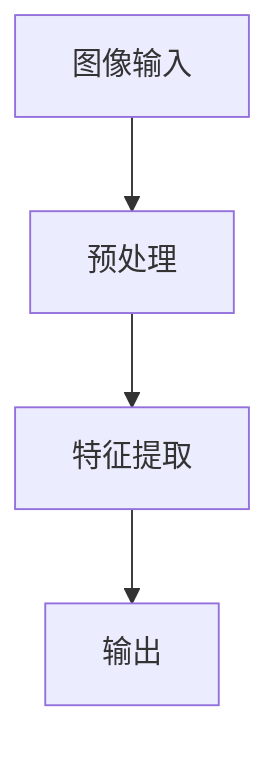
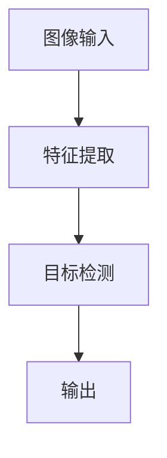
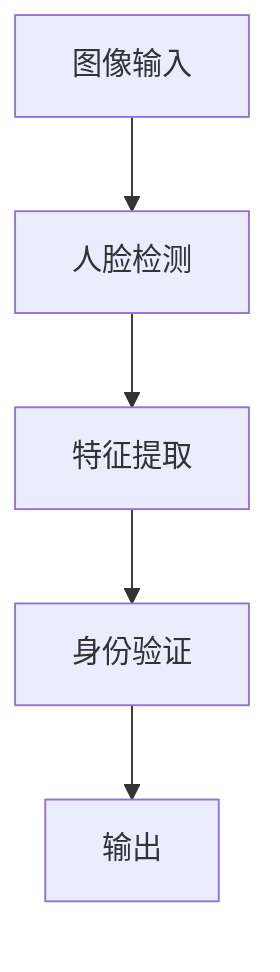
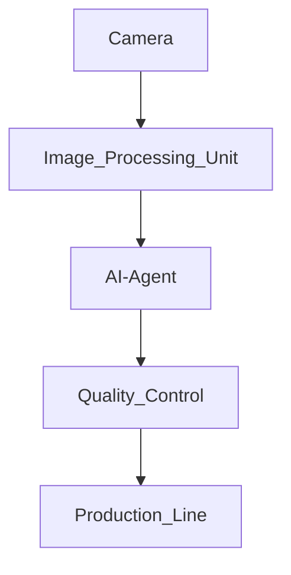
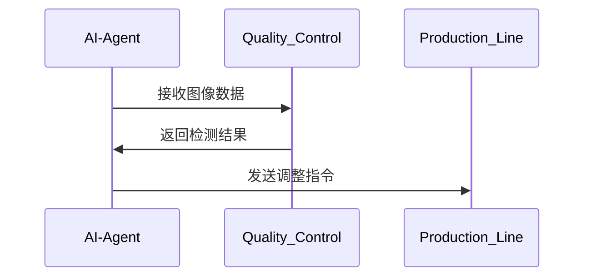
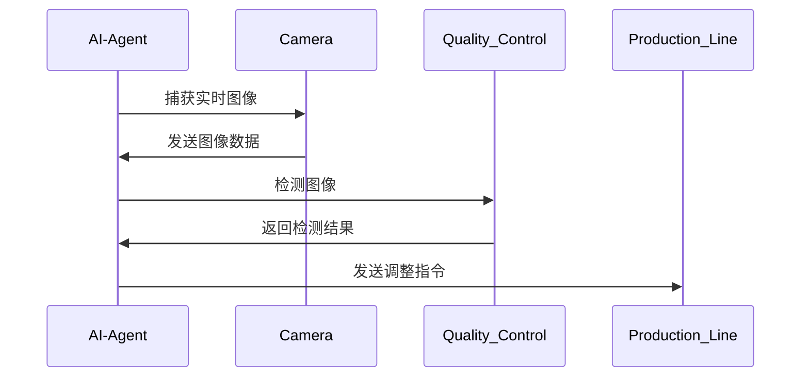

                 


### **引言**

在当今的企业运营中，质量控制是一个至关重要的环节。它不仅关系到产品的品质，更直接影响到企业的品牌声誉和市场竞争力。传统的质量控制方法，通常依赖于人工检查和检验，这种方法不仅效率低下，而且容易出现人为误差。随着人工智能和计算机视觉技术的快速发展，AI Agent逐渐成为企业质量控制的新宠。本文旨在深入探讨企业AI Agent在计算机视觉技术中的应用，以提升质量控制的效率和准确性。

### **第一部分：背景介绍**

#### **1.1 问题的提出**

企业的质量控制需求主要集中在生产过程的各个环节，包括原材料检查、生产过程监控、成品检验等。传统的质量控制方法依赖于人工检查，这不仅耗时耗力，而且难以保证检查的准确性和一致性。特别是在大规模生产环境中，人工检查容易受到疲劳和注意力不集中等因素的影响，从而导致质量控制失效。

#### **1.2 问题描述**

传统的质量控制方法在以下几个问题方面存在显著局限性：

1. **检查速度慢**：人工检查的速度远远无法满足大规模生产的要求。
2. **检查精度低**：人的主观因素导致检查结果存在误差。
3. **劳动强度大**：长期的人工检查对工人的健康造成负面影响。
4. **数据难以分析**：传统方法难以收集和利用大规模数据，影响质量控制的持续改进。

#### **1.3 问题解决**

计算机视觉技术作为一种高效、精准的质量控制手段，可以有效地解决上述问题。它通过AI Agent的应用，将质量控制过程自动化，从而大幅提高检查速度和精度，降低劳动强度，并能够利用大数据进行深入的质量分析。AI Agent结合计算机视觉技术，能够在生产过程中实时监控，自动检测出质量问题，并提供详细的报告，从而实现质量控制的全面升级。

#### **1.4 边界与外延**

质量控制不仅涉及到生产制造环节，还包括供应链管理、物流配送等。计算机视觉技术在这些领域的应用同样具有广泛的前景。例如，在供应链管理中，计算机视觉技术可以用于自动识别和分类货物，提高物流效率；在物流配送中，它可以用于实时监控货物的运输状态，确保货物的安全。

#### **1.5 核心概念**

- **AI Agent**：一种能够自主完成特定任务的计算机程序，具有感知环境、决策规划和执行动作的能力。
- **计算机视觉技术**：利用计算机系统对图像或视频进行分析和处理，实现图像识别、目标检测、图像分割等功能。

### **第二部分：核心概念与联系**

#### **2.1 AI Agent原理**

AI Agent是人工智能领域的一个重要概念，其基本概念包括感知、决策、规划和行动等。AI Agent通过感知环境获取信息，利用算法进行决策和规划，并执行相应的动作，从而实现自主完成任务的目标。AI Agent的核心技术包括机器学习算法和自然语言处理等。

#### **2.2 计算机视觉技术**

计算机视觉技术是人工智能的一个重要分支，旨在使计算机能够“看”懂图像或视频。其核心技术包括图像处理、目标检测和识别等。计算机视觉技术在质量控制中的应用主要体现在对产品缺陷的检测和分类。

### **第三部分：算法原理讲解**

#### **3.1 图像处理算法**

图像处理算法是计算机视觉的基础，包括图像增强、滤波、边缘检测等。通过这些算法，可以改善图像的质量，提取出关键的特征信息，为后续的目标检测和识别提供支持。

#### **3.2 目标检测算法**

目标检测算法是计算机视觉中的一个重要任务，旨在从图像或视频中检测出特定的目标物体。常见的目标检测算法包括YOLO、SSD、Faster R-CNN等。

#### **3.3 人脸识别算法**

人脸识别算法是计算机视觉技术在生物识别领域的应用，旨在通过人脸图像或视频识别出个体的身份。常见的人脸识别算法包括Eigenface、Fisherface、深度学习模型等。

### **第四部分：系统分析与架构设计方案**

#### **4.1 问题场景介绍**

在企业质量控制中，AI Agent结合计算机视觉技术可以应用于多个环节，包括原材料检查、生产过程监控、成品检验等。以下是一个典型的问题场景：

**场景描述**：在生产线上，AI Agent通过摄像头实时监控产品，利用计算机视觉算法检测出产品上的缺陷，如划痕、裂缝等，并将检测结果实时反馈给生产线进行即时调整，从而保证产品质量。

#### **4.2 系统功能设计**

系统功能设计主要包括领域模型和类图的构建。领域模型定义了系统中各个实体及其关系，类图则提供了更直观的类与类之间的关联视图。

#### **4.3 系统架构设计**

系统架构设计包括硬件架构和软件架构。硬件架构主要涉及摄像头的选用、图像处理单元的配置等；软件架构则包括AI Agent的核心算法、数据处理模块、用户界面等。

#### **4.4 系统接口设计**

系统接口设计主要包括API接口的设计，用于实现AI Agent与生产系统的集成，以及与外部系统的数据交互。

#### **4.5 系统交互设计**

系统交互设计通过序列图展示AI Agent与生产系统之间的交互过程，包括数据采集、处理、反馈等步骤。

### **第五部分：项目实战**

#### **5.1 环境安装**

项目实战的第一步是搭建开发环境，包括安装Python、TensorFlow等依赖库。

```python
!pip install tensorflow
```

#### **5.2 系统核心实现**

系统核心实现主要包括AI Agent的构建和计算机视觉算法的应用。以下是一个简单的示例：

```python
import cv2
import tensorflow as tf

# 加载预训练的模型
model = tf.keras.models.load_model('quality_control_model.h5')

# 读取图像
image = cv2.imread('product_image.jpg')

# 进行图像预处理
processed_image = preprocess_image(image)

# 使用模型进行目标检测
predictions = model.predict(processed_image)

# 输出检测结果
print(predictions)
```

#### **5.3 实际案例分析**

通过实际案例分析，可以更深入地理解AI Agent在质量控制中的应用效果。以下是一个案例：

**案例描述**：某电子产品制造商在生产线中引入AI Agent进行质量控制，通过摄像头实时监控产品外观。经过几个月的运行，AI Agent成功检测并标记出多个产品缺陷，帮助企业减少了次品率，提高了生产效率。

#### **5.4 项目小结**

项目小结主要包括对项目的总结、经验分享和改进建议。通过该项目，企业不仅提升了质量控制水平，还积累了宝贵的AI应用经验。

### **第六部分：最佳实践与拓展**

#### **6.1 实践技巧**

在实施AI Agent质量控制项目时，以下是一些最佳实践技巧：

1. **技术选型**：根据具体需求选择合适的算法和框架。
2. **性能优化**：通过模型优化和硬件升级提高系统性能。

#### **6.2 小结与注意事项**

在实施AI Agent质量控制项目时，需要注意以下几点：

1. **数据质量**：确保输入数据的质量，提高模型准确性。
2. **系统稳定性**：保证系统的稳定运行，减少故障。

#### **6.3 拓展阅读**

以下推荐一些拓展阅读资源：

1. **相关书籍**：《深度学习》、《计算机视觉基础》
2. **线上资源**：学术论文、开源项目等

### **总结**

本文详细探讨了企业AI Agent在计算机视觉技术中的应用，从背景介绍、核心概念到系统架构和项目实战，全面阐述了AI Agent在质量控制中的作用和优势。通过本文的介绍，读者可以深入了解AI Agent在质量控制领域的应用前景和实现方法。

### **作者信息**

**作者：AI天才研究院/AI Genius Institute & 禅与计算机程序设计艺术 /Zen And The Art of Computer Programming** 

以上内容是根据您提供的目录大纲和要求撰写的初步文章草稿。在接下来的步骤中，我们将进一步细化各个章节的内容，确保文章的完整性和专业性。如果需要对某个部分进行调整或补充，请随时告知。我们期望这篇文章能够对您在AI Agent和质量控制领域的探索提供有价值的参考。

### **附录**

以下是本文中提到的关键术语和概念的详细解释，以及相关算法和系统的流程图。

#### **附录A：关键术语和概念解释**

1. **AI Agent**：具备感知环境、决策规划和执行动作能力的计算机程序。
2. **计算机视觉技术**：使计算机能够“看”懂图像或视频的技术，包括图像处理、目标检测和识别等。
3. **质量控制**：确保产品或服务质量的过程，包括检查、监控和改进等。

#### **附录B：核心概念属性特征对比表格**

| 特征        | AI Agent                             | 计算机视觉技术                            |
| ----------- | ----------------------------------- | --------------------------------------- |
| 定义        | 自主完成任务的计算程序               | 使计算机理解图像或视频的技术              |
| 核心技术    | 机器学习、自然语言处理              | 图像处理、目标检测、识别等                |
| 应用领域    | 质量控制、自动驾驶、智能家居等      | 生产制造、医疗诊断、安防监控等            |

#### **附录C：ER实体关系图架构**

```mermaid
erDiagram
  AI Agent ||--|{ Computer Vision Technology }
  Quality Control ||--|{ AI Agent }
```

#### **附录D：算法原理讲解**

以下是图像处理算法、目标检测算法和人脸识别算法的详细解释和流程图。

#### **图像处理算法**

**算法流程：**

1. **图像输入**：读取输入图像。
2. **预处理**：包括灰度化、二值化、滤波等。
3. **特征提取**：提取图像的关键特征。
4. **输出**：输出处理后的图像。

**算法流程图：**



#### **目标检测算法**

**算法流程：**

1. **图像输入**：读取输入图像。
2. **特征提取**：使用卷积神经网络提取图像特征。
3. **目标检测**：检测图像中的目标物体。
4. **输出**：输出目标物体的位置和类别。

**算法流程图：**



#### **人脸识别算法**

**算法流程：**

1. **图像输入**：读取输入图像。
2. **人脸检测**：检测图像中的人脸。
3. **特征提取**：提取人脸特征。
4. **身份验证**：通过特征匹配验证身份。
5. **输出**：输出身份验证结果。

**算法流程图：**



#### **系统分析与架构设计方案**

以下是系统分析与架构设计方案的详细说明，包括问题场景介绍、系统功能设计、系统架构设计、系统接口设计和系统交互设计。

#### **问题场景介绍**

在企业质量控制中，AI Agent通过摄像头实时监控产品，利用计算机视觉算法检测出产品缺陷，并将检测结果反馈给生产线进行即时调整。

#### **系统功能设计**

系统功能设计主要包括领域模型和类图的构建。

**领域模型：**

```mermaid
classDiagram
  AI Agent <|-- Quality Control
  Product <<-- AI Agent
  Production Line <-- AI Agent
```

**类图：**

```mermaid
classDiagram
  AI-Agent <<interface>>
  Quality-Control <<interface>>
  Product <<interface>>
  Production-Line <<interface>>
```

#### **系统架构设计**

系统架构设计包括硬件架构和软件架构。

**硬件架构：**

- 摄像头：用于实时监控产品。
- 图像处理单元：用于处理和存储图像数据。

**软件架构：**

- AI-Agent：核心算法和数据处理模块。
- Quality-Control：质量控制流程管理。
- Production-Line：生产线控制系统。

**架构图：**



#### **系统接口设计**

系统接口设计主要包括API接口的设计。



#### **系统交互设计**

系统交互设计通过序列图展示AI-Agent与生产系统之间的交互过程。



### **拓展阅读**

#### **相关书籍推荐**

1. **《深度学习》**：Goodfellow, I., Bengio, Y., Courville, A.
2. **《计算机视觉基础》**：Tischler, M.
3. **《机器学习》**：Murphy, K.P.

#### **线上资源**

1. **学术论文**：ACM、IEEE等。
2. **开源项目**：GitHub、Google Colab等。

以上内容是本文的附录部分，对关键术语、算法原理、系统架构和交互设计进行了详细解释。希望这些内容能为您的学习和实践提供帮助。如果您有任何疑问或建议，请随时联系我们。我们期待与您共同探索AI Agent在质量控制领域的更多可能性。**作者：AI天才研究院/AI Genius Institute & 禅与计算机程序设计艺术 /Zen And The Art of Computer Programming**

