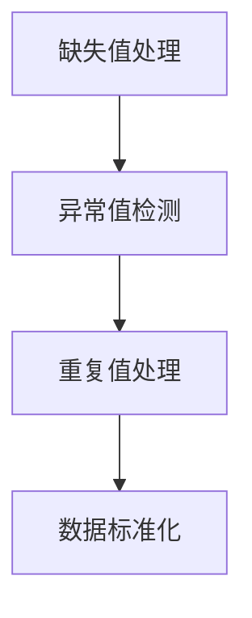
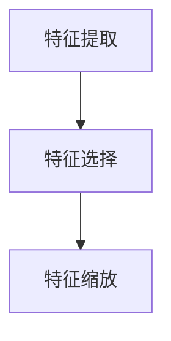
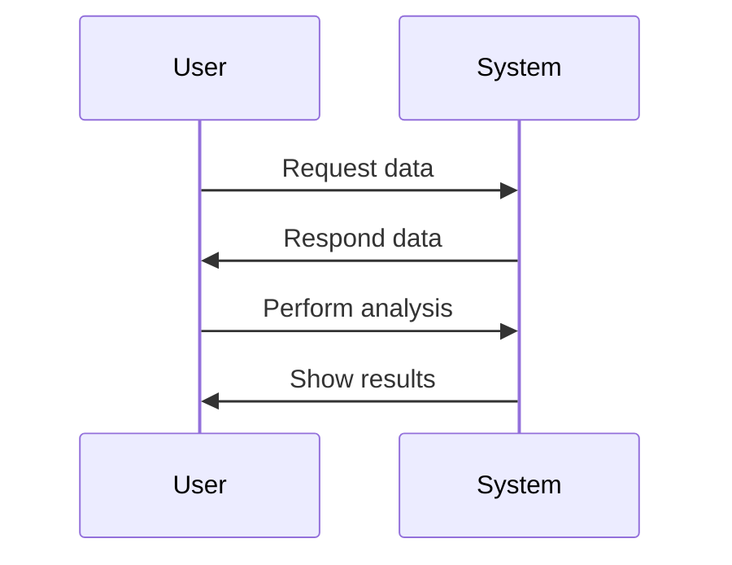
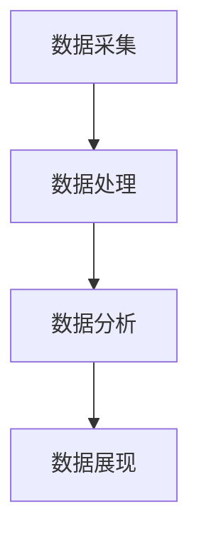

                 

# 企业数据管理：AI Agent训练数据的收集与处理

> 关键词：企业数据管理，AI Agent，训练数据，数据收集，数据处理，算法，系统架构，实战项目

> 摘要：本文深入探讨了企业数据管理在人工智能（AI）中的应用，重点分析了AI Agent训练数据的重要性、收集和处理方法，以及相应的算法原理和系统架构设计。通过详细的实战项目案例，为读者提供了具体实现和实际操作指导，旨在提升企业在AI领域的竞争力。

## 目录大纲

### 第一部分：背景介绍

### 第1章：企业数据管理的现状与挑战

- 1.1.1 企业数据管理的背景
- 1.1.2 当前企业数据管理的挑战
- 1.1.3 企业数据管理的重要性
- 1.1.4 企业数据管理的发展趋势

### 第二部分：核心概念与联系

### 第2章：AI Agent训练数据的定义与特性

- 2.1.1 AI Agent的定义
- 2.1.2 训练数据的定义
- 2.1.3 AI Agent训练数据的特性
- 2.1.4 AI Agent训练数据与模型性能的关系

### 第3章：数据收集的方法与策略

- 3.1.1 数据收集的渠道
- 3.1.2 数据收集的方法
- 3.1.3 数据收集的挑战
- 3.1.4 数据收集的策略

### 第4章：数据处理的基本原理

- 4.1.1 数据预处理
- 4.1.2 数据清洗
- 4.1.3 数据转换
- 4.1.4 数据存储

### 第三部分：算法原理讲解

### 第5章：数据清洗算法

- 5.1.1 数据清洗的重要性
- 5.1.2 数据清洗算法的基本原理
- 5.1.3 数据清洗算法的mermaid流程图
- 5.1.4 数据清洗算法的应用示例

### 第6章：数据转换算法

- 6.1.1 数据转换的定义
- 6.1.2 数据转换的基本原理
- 6.1.3 数据转换算法的mermaid流程图
- 6.1.4 数据转换算法的应用示例

### 第四部分：系统分析与架构设计方案

### 第7章：企业数据管理系统的设计与实现

- 7.1.1 企业数据管理系统的需求分析
- 7.1.2 系统功能设计
- 7.1.3 系统架构设计
- 7.1.4 系统接口设计
- 7.1.5 系统交互设计

### 第五部分：项目实战

### 第8章：实战项目：构建企业数据管理系统

- 8.1.1 实战项目背景
- 8.1.2 环境安装
- 8.1.3 系统核心实现
- 8.1.4 代码应用解读与分析
- 8.1.5 实际案例分析与详细讲解
- 8.1.6 项目小结

### 第六部分：最佳实践与注意事项

### 第9章：最佳实践与注意事项

- 9.1.1 数据收集与处理的最佳实践
- 9.1.2 注意事项
- 9.1.3 拓展阅读

### 结论与展望

----------------------------------------------------------------

### 第一部分：背景介绍

#### 第1章：企业数据管理的现状与挑战

**1.1.1 企业数据管理的背景**

随着互联网和大数据技术的快速发展，企业数据已经成为企业核心竞争力的关键因素。企业数据管理（Enterprise Data Management，EDM）是指通过系统的方法和工具，对企业内部和外部的数据进行整合、存储、管理和分析，以支持企业的业务决策和运营优化。

企业数据管理的发展历程可以追溯到20世纪90年代，随着客户关系管理（CRM）和供应链管理（SCM）等企业应用系统的普及，数据管理逐渐成为企业信息化建设的重要组成部分。进入21世纪，随着大数据、云计算和人工智能等新技术的兴起，企业数据管理迎来了新的发展机遇和挑战。

**1.1.2 当前企业数据管理的挑战**

当前，企业数据管理面临着诸多挑战：

1. **数据量爆炸性增长**：企业每天产生大量的数据，数据量呈现爆炸式增长，如何高效地管理和处理这些数据成为一大挑战。
2. **数据质量问题**：数据的质量问题如数据缺失、数据不一致、数据错误等，严重影响数据的可用性和准确性。
3. **数据安全与隐私**：随着数据泄露事件的频发，数据安全和隐私保护成为企业数据管理的重要议题。
4. **技术更新迭代**：数据管理技术的发展迅速，如何紧跟技术发展趋势，实现数据管理的现代化和智能化，是企业面临的挑战。
5. **法规遵从**：企业需要遵守各种数据保护法规，如《通用数据保护条例》（GDPR）等，确保数据管理的合规性。

**1.1.3 企业数据管理的重要性**

企业数据管理的重要性体现在以下几个方面：

1. **提高数据质量**：通过数据管理，可以有效地识别和纠正数据质量问题，提高数据的可用性和准确性。
2. **支持业务决策**：高质量的数据是企业进行业务分析和决策的基础，数据管理可以为企业提供可靠的数据支持。
3. **提升运营效率**：通过数据管理，可以优化业务流程，提高运营效率，降低运营成本。
4. **增强数据安全**：通过数据管理，可以确保数据的安全性和隐私保护，降低数据泄露风险。
5. **实现数据价值**：通过数据管理，可以将数据转化为商业价值，为企业的长期发展提供动力。

**1.1.4 企业数据管理的发展趋势**

未来，企业数据管理将呈现以下发展趋势：

1. **大数据管理**：随着数据量的不断增长，大数据管理将成为企业数据管理的核心，企业需要构建强大的数据处理能力。
2. **智能化管理**：人工智能和机器学习技术的应用将使数据管理更加智能化，提高数据处理的效率和效果。
3. **云原生数据管理**：云计算和容器技术的普及将推动云原生数据管理的发展，企业将更多地采用云平台进行数据管理。
4. **数据治理**：数据治理将成为企业数据管理的核心议题，企业需要建立完善的数据治理体系，确保数据的质量和安全。
5. **开放与共享**：随着数据开放和共享的需求增加，企业将更加注重数据的开放性和共享性，促进数据资源的最大化利用。

#### 第2章：AI Agent训练数据的定义与特性

**2.1.1 AI Agent的定义**

AI Agent，即人工智能代理，是指能够模拟人类行为，具备智能决策能力的计算机程序。AI Agent通常具有感知、理解、决策和执行等能力，可以在特定的环境和任务中自主执行任务。

AI Agent通常由以下几个部分组成：

1. **感知模块**：用于感知外部环境，获取各种传感器数据。
2. **理解模块**：用于理解和分析感知到的数据，提取有用的信息。
3. **决策模块**：用于根据理解和分析的结果，做出相应的决策。
4. **执行模块**：用于执行决策结果，实现具体的任务。

**2.1.2 训练数据的定义**

训练数据是用于训练AI Agent的输入数据，通过训练数据，AI Agent可以学习到如何处理和解决特定的问题。训练数据通常包括输入特征和对应的输出结果，如：

- 输入特征：描述问题状态的数据，如图像、文本、声音等。
- 输出结果：描述问题解决方案的数据，如分类标签、回归值等。

**2.1.3 AI Agent训练数据的特性**

AI Agent训练数据具有以下几个特性：

1. **多样性**：训练数据应具有多样性，覆盖各种可能的情况和场景，以便AI Agent能够适应不同的环境和任务。
2. **质量**：训练数据的质量直接影响AI Agent的性能，高质量的数据有助于提高AI Agent的准确性和可靠性。
3. **规模**：大规模的训练数据有助于AI Agent学习到更多的知识和规律，提高模型的泛化能力。
4. **标注**：训练数据的标注质量对AI Agent的性能至关重要，准确的标注可以提高模型的准确率和效率。
5. **动态性**：随着环境的变化和任务的更新，训练数据也应不断更新和调整，以适应新的需求和挑战。

**2.1.4 AI Agent训练数据与模型性能的关系**

AI Agent的训练数据直接影响模型的性能，高质量和大规模的训练数据有助于提高模型的准确率和泛化能力。以下是AI Agent训练数据与模型性能之间的关系：

1. **准确性**：训练数据的质量和标注的准确性直接影响模型的准确性，高质量的训练数据可以提高模型的准确性。
2. **泛化能力**：训练数据的多样性有助于模型学习到更多的知识和规律，提高模型的泛化能力，使其能够应对各种不同的任务和环境。
3. **鲁棒性**：训练数据的规模和多样性有助于模型学习到更多的一般性规律，提高模型的鲁棒性，使其能够适应不同的数据和噪声。
4. **效率**：大规模的训练数据可以提高模型的训练效率，减少训练时间。

#### 第3章：数据收集的方法与策略

**3.1.1 数据收集的渠道**

数据收集是AI Agent训练数据管理的重要环节，数据收集的渠道主要包括以下几个方面：

1. **内部数据**：企业内部的各种业务系统、应用和数据库，如客户关系管理系统（CRM）、企业资源规划系统（ERP）等。
2. **外部数据**：互联网上的公开数据源，如社交媒体、新闻网站、电商网站等。
3. **第三方数据**：通过第三方数据提供商购买的数据，如人口统计数据、地理位置数据等。
4. **传感器数据**：各种传感器设备收集到的数据，如气象数据、交通数据、环境数据等。

**3.1.2 数据收集的方法**

数据收集的方法主要包括以下几种：

1. **爬虫技术**：通过编写爬虫程序，从互联网上获取公开数据。
2. **API接口**：通过调用第三方数据提供商的API接口，获取数据。
3. **物联网设备**：通过物联网设备收集环境数据。
4. **日志收集**：从企业内部的业务系统和应用中收集日志数据。
5. **手动录入**：通过人工方式，将数据录入到系统中。

**3.1.3 数据收集的挑战**

数据收集过程中面临以下挑战：

1. **数据隐私**：数据收集过程中需要关注数据隐私问题，确保收集的数据不会泄露用户隐私。
2. **数据质量**：数据收集的质量直接影响AI Agent的训练效果，需要确保收集的数据具有高质量和准确性。
3. **数据规模**：大规模的数据收集需要考虑数据的存储和传输问题，确保数据的规模不会影响到系统的性能。
4. **数据安全**：数据收集过程中需要关注数据安全问题，防止数据被恶意攻击或篡改。

**3.1.4 数据收集的策略**

为了有效地进行数据收集，企业可以采取以下策略：

1. **数据分类**：根据数据的重要性和用途，对数据进行分类，优先收集重要数据。
2. **数据标准化**：建立统一的数据标准和规范，确保收集的数据具有一致性。
3. **数据清洗**：对收集到的数据进行清洗和预处理，去除无效和错误的数据。
4. **数据加密**：对敏感数据进行加密处理，确保数据的安全性。
5. **数据共享**：建立数据共享平台，促进数据的跨部门和跨系统的共享，提高数据利用率。

#### 第4章：数据处理的基本原理

**4.1.1 数据预处理**

数据预处理是数据处理的第一步，主要包括数据清洗、数据转换和数据归一化等过程。

1. **数据清洗**：去除数据中的噪声和错误，如缺失值、异常值和重复值等。
2. **数据转换**：将数据转换为适合模型训练的格式，如将文本数据转换为向量表示。
3. **数据归一化**：将数据归一化到同一量纲，如将特征值缩放到0-1之间。

**4.1.2 数据清洗**

数据清洗是数据预处理的重要环节，主要包括以下步骤：

1. **缺失值处理**：对于缺失值，可以根据实际情况选择填充、删除或保留。
2. **异常值检测**：使用统计学方法或机器学习方法检测异常值，如使用Z-Score、IQR等方法。
3. **重复值处理**：去除数据中的重复记录，确保数据的一致性和唯一性。

**4.1.3 数据转换**

数据转换是将原始数据转换为适合模型训练的格式，主要包括以下方法：

1. **特征提取**：从原始数据中提取有用的特征，如使用词袋模型提取文本数据的特征。
2. **特征选择**：从提取的特征中选出对模型训练最有用的特征，如使用特征重要性排序方法。
3. **特征缩放**：将特征值缩放到同一量纲，如使用Min-Max缩放或Z-Score缩放。

**4.1.4 数据存储**

数据存储是将预处理后的数据存储到数据库或数据仓库中，以便进行后续的分析和处理。常用的数据存储技术包括关系数据库、NoSQL数据库和数据仓库等。

1. **关系数据库**：使用SQL进行数据存储和查询，适合结构化数据。
2. **NoSQL数据库**：如MongoDB、Cassandra等，适合存储大量非结构化数据。
3. **数据仓库**：如Hadoop、Spark等，适合存储和计算大规模数据。

#### 第5章：数据清洗算法

**5.1.1 数据清洗的重要性**

数据清洗是数据预处理的核心步骤，其重要性体现在以下几个方面：

1. **提高数据质量**：通过数据清洗，可以去除数据中的噪声和错误，提高数据的可用性和准确性。
2. **降低模型复杂度**：数据清洗可以减少数据中的冗余和噪声，降低模型的复杂度，提高模型训练的效率。
3. **提高模型性能**：高质量的数据有助于提高模型的准确率和泛化能力，从而提高模型性能。

**5.1.2 数据清洗算法的基本原理**

数据清洗算法的基本原理包括以下步骤：

1. **缺失值处理**：对于缺失值，可以使用填充、删除或保留等方法进行处理。
2. **异常值检测**：使用统计学方法或机器学习方法检测数据中的异常值。
3. **重复值处理**：去除数据中的重复记录，确保数据的一致性和唯一性。
4. **数据标准化**：将数据归一化到同一量纲，如使用Min-Max缩放或Z-Score缩放。

**5.1.3 数据清洗算法的mermaid流程图**

以下是一个简单的数据清洗算法的mermaid流程图：



**5.1.4 数据清洗算法的应用示例**

以下是一个使用Python实现的数据清洗算法的示例：

```python
import pandas as pd

# 读取数据
data = pd.read_csv('data.csv')

# 缺失值处理
data.fillna(0, inplace=True)

# 异常值检测
z_scores = (data - data.mean()) / data.std()
filtered_data = data[(z_scores > -3) & (z_scores < 3)]

# 重复值处理
filtered_data.drop_duplicates(inplace=True)

# 数据标准化
from sklearn.preprocessing import MinMaxScaler
scaler = MinMaxScaler()
scaled_data = scaler.fit_transform(filtered_data)
```

#### 第6章：数据转换算法

**6.1.1 数据转换的定义**

数据转换是将原始数据转换为适合模型训练的格式的过程，主要包括特征提取、特征选择和特征缩放等步骤。

**6.1.2 数据转换的基本原理**

数据转换的基本原理包括以下方面：

1. **特征提取**：从原始数据中提取有用的特征，如使用词袋模型提取文本数据的特征。
2. **特征选择**：从提取的特征中选出对模型训练最有用的特征，如使用特征重要性排序方法。
3. **特征缩放**：将特征值缩放到同一量纲，如使用Min-Max缩放或Z-Score缩放。

**6.1.3 数据转换算法的mermaid流程图**

以下是一个简单的数据转换算法的mermaid流程图：



**6.1.4 数据转换算法的应用示例**

以下是一个使用Python实现的数据转换算法的示例：

```python
import pandas as pd
from sklearn.feature_extraction.text import CountVectorizer
from sklearn.preprocessing import MinMaxScaler

# 读取数据
data = pd.read_csv('data.csv')

# 特征提取
vectorizer = CountVectorizer()
X = vectorizer.fit_transform(data['text'])

# 特征选择
importances = vectorizer.idf_
selected_features = X[:, np.argsort(importances)[::-1]]

# 特征缩放
scaler = MinMaxScaler()
X_scaled = scaler.fit_transform(selected_features)
```

#### 第7章：企业数据管理系统的设计与实现

**7.1.1 企业数据管理系统的需求分析**

企业数据管理系统的需求分析主要包括以下几个方面：

1. **数据采集**：系统应具备从各种数据源采集数据的能力，包括内部数据源和外部数据源。
2. **数据存储**：系统应具备高效的数据存储能力，支持多种数据存储方式，如关系数据库、NoSQL数据库和数据仓库等。
3. **数据清洗**：系统应具备数据清洗功能，能够自动识别和处理数据中的噪声和错误。
4. **数据转换**：系统应具备数据转换功能，能够将原始数据转换为适合模型训练的格式。
5. **数据分析和挖掘**：系统应具备数据分析和挖掘功能，能够提供丰富的数据分析工具和算法库，支持企业进行数据分析和决策。
6. **数据安全和隐私保护**：系统应具备数据安全和隐私保护功能，确保数据的完整性和机密性。
7. **用户界面**：系统应具备友好的用户界面，方便用户进行数据管理和分析操作。

**7.1.2 系统功能设计**

企业数据管理系统的功能设计主要包括以下几个方面：

1. **数据采集模块**：负责从各种数据源采集数据，支持自动化和手动数据采集。
2. **数据存储模块**：负责存储和管理数据，支持数据备份和恢复功能。
3. **数据清洗模块**：负责自动识别和处理数据中的噪声和错误，支持多种清洗算法。
4. **数据转换模块**：负责将原始数据转换为适合模型训练的格式，支持多种转换算法。
5. **数据分析模块**：负责提供丰富的数据分析工具和算法库，支持企业进行数据分析和挖掘。
6. **数据安全模块**：负责数据安全和隐私保护，支持数据加密、访问控制和审计等功能。
7. **用户界面模块**：负责提供友好的用户界面，支持用户进行数据管理和分析操作。

**7.1.3 系统架构设计**

企业数据管理系统的架构设计主要包括以下几个方面：

1. **数据采集层**：负责从各种数据源采集数据，如内部业务系统、外部数据源和传感器等。
2. **数据处理层**：负责数据清洗、数据转换和数据存储等处理任务，包括数据预处理、特征工程和数据存储等。
3. **数据分析层**：负责提供数据分析工具和算法库，支持企业进行数据分析和挖掘，如分类、聚类、回归等算法。
4. **数据展现层**：负责将分析结果以图表、报表等形式展示给用户，支持用户进行数据可视化和决策。
5. **数据安全层**：负责数据安全和隐私保护，包括数据加密、访问控制和审计等功能。
6. **用户界面层**：负责提供友好的用户界面，支持用户进行数据管理和分析操作。

以下是一个简单的企业数据管理系统架构的mermaid类图：

```mermaid
classDiagram
    Class01 <|-- Class02
    Class03 --|(&:|) Class04
    Class05 o-- Class06
    Class07 : Interface
    Class02 : SubClassOfClass01
    Class03 : Implements Class07
    Class04 : HasA Class06
    Class05 : extends Class06
endclassDiagram
```

**7.1.4 系统接口设计**

企业数据管理系统的接口设计主要包括以下几个方面：

1. **API接口**：系统应提供API接口，方便外部系统或应用程序进行数据管理和分析操作。
2. **Web界面**：系统应提供Web界面，方便用户进行数据管理和分析操作。
3. **命令行界面**：系统应提供命令行界面，方便用户进行自动化数据管理和分析操作。

以下是一个简单的企业数据管理系统接口的mermaid序列图：



**7.1.5 系统交互设计**

企业数据管理系统的交互设计主要包括以下几个方面：

1. **数据采集**：系统从各种数据源采集数据，如内部业务系统、外部数据源和传感器等。
2. **数据处理**：系统对采集到的数据进行清洗、转换和存储等处理任务。
3. **数据分析**：系统根据用户需求，进行数据分析和挖掘，生成分析报告和可视化结果。
4. **数据展现**：系统将分析结果以图表、报表等形式展示给用户。

以下是一个简单的企业数据管理系统交互的mermaid流程图：



#### 第8章：实战项目：构建企业数据管理系统

**8.1.1 实战项目背景**

随着企业业务的发展，数据量不断增加，如何有效地管理和利用数据成为企业面临的重要问题。本实战项目旨在构建一个企业数据管理系统，帮助企业实现数据的高效管理和利用。

**8.1.2 环境安装**

1. **安装Python环境**：首先需要安装Python环境，可以从Python官网下载安装包，并按照提示进行安装。

2. **安装必要的库**：在Python环境中，需要安装一些常用的库，如Pandas、NumPy、Scikit-learn等。可以使用pip命令进行安装：

   ```shell
   pip install pandas numpy scikit-learn
   ```

**8.1.3 系统核心实现**

1. **数据采集模块**：使用Python编写数据采集模块，从企业内部业务系统和外部数据源采集数据。以下是一个简单的数据采集示例：

   ```python
   import pandas as pd

   # 读取企业内部业务系统的数据
   internal_data = pd.read_csv('internal_data.csv')

   # 读取外部数据源的数据
   external_data = pd.read_csv('external_data.csv')

   # 合并内部和外部数据
   data = pd.concat([internal_data, external_data], axis=1)
   ```

2. **数据清洗模块**：使用Python编写数据清洗模块，对采集到的数据进行清洗和处理。以下是一个简单的数据清洗示例：

   ```python
   import pandas as pd

   # 读取数据
   data = pd.read_csv('data.csv')

   # 填充缺失值
   data.fillna(0, inplace=True)

   # 异常值检测
   z_scores = (data - data.mean()) / data.std()
   filtered_data = data[(z_scores > -3) & (z_scores < 3)]

   # 重复值处理
   filtered_data.drop_duplicates(inplace=True)
   ```

3. **数据转换模块**：使用Python编写数据转换模块，将清洗后的数据进行转换，以便进行模型训练。以下是一个简单的数据转换示例：

   ```python
   import pandas as pd
   from sklearn.feature_extraction.text import CountVectorizer

   # 读取数据
   data = pd.read_csv('data.csv')

   # 特征提取
   vectorizer = CountVectorizer()
   X = vectorizer.fit_transform(data['text'])

   # 特征选择
   importances = vectorizer.idf_
   selected_features = X[:, np.argsort(importances)[::-1]]

   # 特征缩放
   from sklearn.preprocessing import MinMaxScaler
   scaler = MinMaxScaler()
   X_scaled = scaler.fit_transform(selected_features)
   ```

4. **数据分析和挖掘模块**：使用Python编写数据分析和挖掘模块，根据用户需求进行数据分析和挖掘。以下是一个简单的数据分析示例：

   ```python
   import pandas as pd
   from sklearn.cluster import KMeans

   # 读取数据
   data = pd.read_csv('data.csv')

   # 使用K-Means算法进行聚类分析
   kmeans = KMeans(n_clusters=3)
   kmeans.fit(X_scaled)

   # 输出聚类结果
   print(kmeans.labels_)
   ```

5. **数据展现模块**：使用Python编写数据展现模块，将分析结果以图表、报表等形式展示给用户。以下是一个简单的数据展现示例：

   ```python
   import pandas as pd
   import matplotlib.pyplot as plt

   # 读取数据
   data = pd.read_csv('data.csv')

   # 绘制散点图
   plt.scatter(data['feature1'], data['feature2'])
   plt.xlabel('Feature 1')
   plt.ylabel('Feature 2')
   plt.show()
   ```

**8.1.4 代码应用解读与分析**

1. **数据采集模块**：该模块使用Pandas库读取企业内部业务系统和外部数据源的数据，实现数据的初步采集和整合。

2. **数据清洗模块**：该模块使用Pandas库和Scikit-learn库，对采集到的数据

