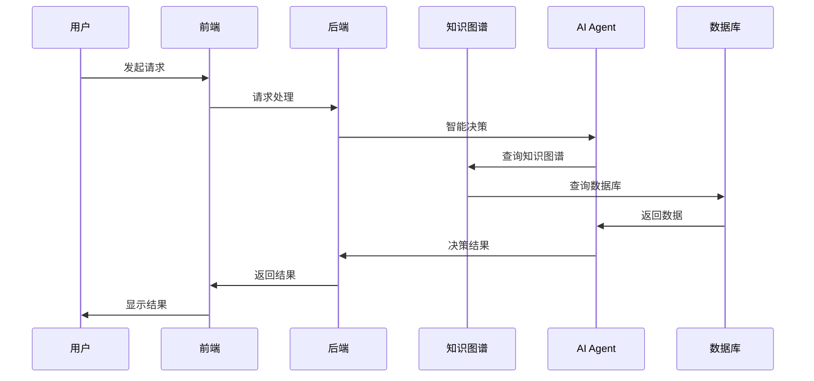
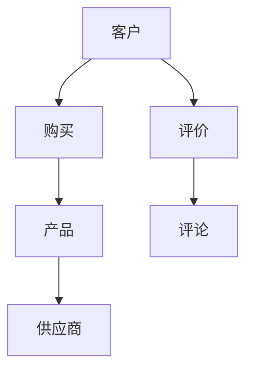

                 

### 文章标题：企业知识图谱与AI Agent的深度融合应用

#### 关键词：
- 企业知识图谱
- AI Agent
- 深度融合应用
- 供应链优化
- 客户关系管理
- 业务流程自动化

#### 摘要：
本文将探讨企业知识图谱与AI Agent的深度融合应用，首先介绍知识图谱和AI Agent的基本概念及其在企业中的重要性。接着，详细分析知识图谱与AI Agent融合的技术基础，包括构建方法、融合框架和应用实例。随后，通过实际案例展示其在客户关系管理、供应链优化和业务流程自动化等领域的应用场景。文章最后，将结合项目实战经验，总结融合技术的效果与未来发展趋势，并提供相关最佳实践建议。

---

### 第一部分：引言与背景

#### 1.1 知识图谱与AI Agent的基本概念

##### 1.1.1 知识图谱的定义与特性
知识图谱（Knowledge Graph）是一种语义网络，它通过实体、属性和关系的表示，将大量的信息组织成结构化的知识体系。知识图谱具有以下特性：
- **语义丰富**：通过实体和关系，实现对信息的深入理解和关联。
- **可扩展性**：能够容纳不断增长的新实体和关系。
- **灵活性**：支持多种查询方式和数据分析。

##### 1.1.2 AI Agent的定义与功能
AI Agent（人工智能代理）是指具备一定自主决策能力和执行能力的计算机程序。它通常具有以下功能：
- **感知环境**：通过传感器收集信息。
- **学习与推理**：基于数据和算法，进行决策和行动。
- **行动执行**：执行预定任务或响应特定事件。

##### 1.1.3 企业知识图谱与AI Agent的关系
企业知识图谱与AI Agent的关系可以理解为“数据驱动的智能”。知识图谱提供了AI Agent所需的知识和上下文，使得AI Agent能够更好地理解和应对复杂业务场景。

#### 1.2 企业知识图谱与AI Agent融合的意义

##### 1.2.1 知识图谱在企业中的应用
知识图谱在企业中的应用非常广泛，包括客户关系管理、供应链优化、业务流程自动化等。通过知识图谱，企业能够实现数据的深度挖掘和智能分析。

##### 1.2.2 AI Agent在企业中的应用
AI Agent在企业中的应用主要体现在自动化决策和任务执行上。例如，在客户服务中，AI Agent可以自动识别客户需求，提供个性化服务。

##### 1.2.3 融合带来的变革与机遇
知识图谱与AI Agent的融合，将为企业带来以下变革和机遇：
- **提升决策效率**：基于知识图谱的数据分析和AI Agent的决策支持，帮助企业快速作出明智的决策。
- **优化业务流程**：通过AI Agent的自动化执行，减少人工干预，提高业务流程的效率和准确性。
- **增强客户体验**：基于知识图谱的个性化服务和AI Agent的智能交互，提升客户满意度和忠诚度。

#### 1.3 书籍结构概述
本部分主要介绍了企业知识图谱与AI Agent的基本概念和融合意义，为后续内容提供了基础。接下来，将深入探讨知识图谱和AI Agent的技术基础，以及它们在企业各个领域的具体应用。

---

在接下来的内容中，我们将逐步深入探讨知识图谱与AI Agent的技术基础，包括知识图谱的构建方法、AI Agent的架构设计以及融合技术的实现策略。通过详细的分析和实例讲解，帮助读者更好地理解这些技术的原理和应用。

---

### 第二部分：技术基础

#### 2.1 知识图谱技术

##### 2.1.1 知识图谱的基本原理
知识图谱的基本原理是通过实体、属性和关系的表示，将非结构化的信息转化为结构化的知识体系。它通常包括以下组成部分：
- **实体（Entity）**：知识图谱中的基本单位，如人、地点、物品等。
- **属性（Property）**：描述实体的特征或状态，如年龄、身高、颜色等。
- **关系（Relationship）**：描述实体之间的关联，如朋友、同事、属于等。

知识图谱的构建方法通常包括数据采集、数据清洗、实体识别、关系抽取和知识融合等步骤。

##### 2.1.2 知识图谱的构建方法
知识图谱的构建方法可以分为以下几种：
- **手动构建**：通过人工方式创建知识图谱，适用于小规模的应用场景。
- **半自动构建**：结合手动和自动化的方式，通过工具和算法辅助构建知识图谱。
- **全自动构建**：利用自然语言处理、机器学习和数据挖掘等技术，实现全自动的知识图谱构建。

##### 2.1.3 知识图谱的存储与查询
知识图谱的存储通常采用图数据库，如Neo4j、OrientDB等。这些数据库支持高效的图查询算法，如BFS（广度优先搜索）和DFS（深度优先搜索）。知识图谱的查询语言通常采用SPARQL（Semantic Web Query Language），它是一种用于查询语义数据的查询语言。

#### 2.2 AI Agent技术

##### 2.2.1 AI Agent的基本架构
AI Agent的基本架构通常包括感知模块、决策模块和执行模块。其中：
- **感知模块**：负责收集和处理环境信息。
- **决策模块**：根据感知模块的信息，利用算法进行决策。
- **执行模块**：根据决策模块的决策，执行相应的任务。

##### 2.2.2 AI Agent的学习与决策
AI Agent的学习与决策通常基于机器学习和人工智能技术。常见的方法包括：
- **监督学习**：通过已标记的数据进行训练，学习到输入和输出之间的关系。
- **无监督学习**：通过未标记的数据，发现数据的内在规律和模式。
- **强化学习**：通过与环境的交互，不断调整策略以获得最大化的奖励。

##### 2.2.3 AI Agent的交互能力
AI Agent的交互能力是实现人机交互的关键。常见的交互方法包括：
- **自然语言处理**：通过理解和生成自然语言，实现人与AI Agent的沟通。
- **图形用户界面**：通过图形界面，提供直观的操作方式。
- **语音交互**：通过语音识别和语音合成，实现语音交互。

#### 2.3 知识图谱与AI Agent的融合技术

##### 2.3.1 融合框架的设计
知识图谱与AI Agent的融合框架通常包括以下组成部分：
- **知识库**：存储和管理知识图谱的数据。
- **推理引擎**：基于知识图谱进行推理，为AI Agent提供决策支持。
- **学习模块**：通过机器学习技术，不断提升AI Agent的智能水平。
- **执行模块**：执行AI Agent的决策和任务。

##### 2.3.2 融合中的挑战与解决策略
在知识图谱与AI Agent的融合过程中，面临的主要挑战包括：
- **数据一致性**：确保知识图谱中的数据一致性和准确性。
- **实时性**：在实时应用场景中，保证知识图谱的更新和查询速度。
- **扩展性**：支持大规模数据和复杂业务场景的扩展。

解决策略包括：
- **数据一致性维护**：通过数据清洗和校验，确保数据的一致性和准确性。
- **分布式存储和计算**：采用分布式系统架构，提升处理速度和扩展性。
- **动态更新机制**：通过实时监控和动态更新，保持知识图谱的实时性。

##### 2.3.3 融合技术的应用实例
知识图谱与AI Agent的融合技术已在多个领域得到应用，如：
- **客户关系管理**：通过知识图谱，实现客户画像的构建和智能分析。
- **供应链优化**：利用知识图谱和AI Agent，实现供应链数据的分析和优化。
- **业务流程自动化**：通过知识图谱和AI Agent，实现业务流程的自动化和智能化。

通过以上内容，我们详细介绍了知识图谱与AI Agent的技术基础。在下一部分，我们将探讨这些技术在企业各个领域的具体应用，并分析其实际效果和挑战。

---

### 第三部分：应用场景

#### 3.1 客户关系管理

##### 3.1.1 客户数据分析
客户关系管理（CRM）中的客户数据分析是关键环节。通过收集和分析客户的行为数据、购买历史、反馈信息等，企业可以深入了解客户需求，优化服务策略。

- **行为数据**：包括浏览、点击、购买等行为。
- **购买历史**：记录客户的购买时间、购买金额、购买商品等。
- **反馈信息**：客户对产品或服务的评价、投诉和建议。

##### 3.1.2 客户画像构建
基于客户数据分析，构建客户画像，对客户进行分类和细分。客户画像包括以下信息：

- **基础信息**：姓名、年龄、性别、联系方式等。
- **行为特征**：购买频率、购买偏好、浏览路径等。
- **需求特征**：需求类型、需求强度、需求变化等。

客户画像的构建通常采用以下方法：

- **数据收集**：通过在线问卷、用户行为跟踪等方式收集数据。
- **数据清洗**：去除重复、错误和不完整的数据，确保数据质量。
- **特征提取**：从原始数据中提取有用的特征，用于构建画像。

##### 3.1.3 客户服务智能化
通过知识图谱与AI Agent的融合，实现客户服务的智能化。具体包括：

- **智能客服**：利用AI Agent，提供24/7的客户服务，自动回答常见问题，提高服务效率。
- **个性化推荐**：基于客户画像，为不同类型的客户提供个性化的产品推荐和服务建议。
- **预测性分析**：利用知识图谱和AI Agent，预测客户的购买行为和需求变化，提前采取措施。

#### 3.2 供应链优化

##### 3.2.1 供应链数据分析
供应链数据分析是优化供应链管理的重要手段。通过对供应链各个环节的数据进行分析，企业可以发现潜在的问题和优化机会。

- **供应计划**：分析供应商的交货时间、交货质量和交货数量。
- **库存管理**：分析库存水平、库存周转率、缺货情况等。
- **物流运输**：分析运输成本、运输时间和运输质量。

##### 3.2.2 供应链知识图谱构建
构建供应链知识图谱，将供应链各个环节的数据和知识进行整合。供应链知识图谱包括以下内容：

- **供应链实体**：包括供应商、制造商、分销商、零售商等。
- **供应链关系**：包括供应关系、合作关系、竞争关系等。
- **供应链知识**：包括供应链策略、供应链流程、供应链最佳实践等。

供应链知识图谱的构建方法：

- **数据采集**：通过数据采集工具，收集供应链各个环节的数据。
- **数据清洗**：去除重复、错误和不完整的数据，确保数据质量。
- **知识抽取**：从原始数据中提取有用的知识，构建知识图谱。

##### 3.2.3 供应链优化决策支持
基于供应链知识图谱，提供供应链优化决策支持。具体包括：

- **供应计划优化**：通过分析供应商数据和需求预测，优化供应计划，确保供应链的稳定性。
- **库存管理优化**：通过分析库存数据和需求预测，优化库存水平，减少库存成本。
- **物流运输优化**：通过分析运输数据和供应链知识，优化运输路线和运输方式，降低运输成本。

#### 3.3 业务流程自动化

##### 3.3.1 业务流程识别
业务流程识别是业务流程自动化的第一步。通过对企业业务流程的深入分析，确定哪些流程可以实现自动化。

- **流程分析**：分析企业的业务流程，确定每个环节的具体任务和操作。
- **流程定义**：为每个业务流程定义具体的操作步骤和规则。

##### 3.3.2 流程知识抽取
流程知识抽取是将业务流程的知识转化为结构化数据的过程。通过流程知识抽取，可以构建业务流程的知识图谱。

- **知识识别**：识别业务流程中的关键信息和知识。
- **知识表示**：将识别的知识转化为结构化的数据表示。

##### 3.3.3 流程自动化实现
流程自动化实现是将业务流程的知识应用到实际操作中的过程。通过知识图谱和AI Agent，可以自动执行业务流程中的任务。

- **任务调度**：根据业务流程的知识图谱，自动调度任务，确保流程的顺利进行。
- **异常处理**：在流程执行过程中，自动检测和处理异常情况，确保流程的稳定性。

通过以上内容，我们详细介绍了知识图谱与AI Agent在客户关系管理、供应链优化和业务流程自动化等领域的应用。在下一部分，我们将通过具体的项目实战，展示这些技术的实际应用效果和实现方法。

---

### 第四部分：项目实战

#### 4.1 项目介绍

##### 4.1.1 项目背景
随着市场竞争的加剧，企业需要更加灵活和高效的业务流程来保持竞争优势。本项目旨在通过知识图谱与AI Agent的深度融合，实现企业业务流程的自动化和智能化。

##### 4.1.2 项目目标
- 实现客户关系管理的智能化，提升客户满意度和忠诚度。
- 优化供应链管理，降低运营成本，提高供应链的灵活性。
- 实现业务流程的自动化，减少人工干预，提高业务处理效率。

##### 4.1.3 项目实施过程
项目实施分为以下阶段：

1. **需求分析**：与客户进行深入沟通，了解业务需求，确定项目目标。
2. **系统设计**：根据需求分析，设计系统架构和功能模块。
3. **知识图谱构建**：收集和整理企业数据，构建知识图谱。
4. **AI Agent开发**：基于知识图谱，开发AI Agent，实现智能决策和任务执行。
5. **系统测试与部署**：进行系统测试，确保系统稳定运行，并部署上线。

#### 4.2 系统设计与实现

##### 4.2.1 系统架构设计
系统架构设计分为三个层次：数据层、服务层和表现层。

- **数据层**：包括知识图谱数据库和数据存储系统。
- **服务层**：包括AI Agent服务、知识图谱服务、业务流程服务。
- **表现层**：包括Web前端和移动端界面。

系统架构设计图如下（使用Mermaid绘制）：

##### 4.2.2 知识图谱构建
知识图谱构建过程包括以下步骤：

1. **数据采集**：从企业内部系统和其他数据源中收集数据。
2. **数据清洗**：去除重复、错误和不完整的数据，确保数据质量。
3. **实体识别**：识别数据中的实体，如客户、产品、订单等。
4. **关系抽取**：抽取实体之间的关系，如购买、评价、供应等。
5. **知识融合**：将不同来源的数据进行融合，构建完整的知识图谱。

知识图谱实体关系图如下（使用Mermaid绘制）：

##### 4.2.3 AI Agent开发与部署
AI Agent开发过程包括以下步骤：

1. **感知模块开发**：实现数据的收集和预处理。
2. **决策模块开发**：基于知识图谱和机器学习算法，实现智能决策。
3. **执行模块开发**：实现任务的自动执行。
4. **部署与监控**：将AI Agent部署到服务器，并进行实时监控。

#### 4.3 实施过程与效果评估

##### 4.3.1 实施过程
项目实施过程分为以下几个阶段：

1. **需求分析**：与客户进行多次沟通，明确业务需求和目标。
2. **系统设计**：设计系统架构和功能模块，确保系统满足业务需求。
3. **知识图谱构建**：收集和整理企业数据，构建知识图谱。
4. **AI Agent开发**：开发感知、决策和执行模块，实现AI Agent的功能。
5. **系统集成与测试**：将各个模块进行集成，并进行系统测试。
6. **部署上线**：将系统部署到生产环境，并进行上线培训。

##### 4.3.2 效果评估
项目实施后，通过以下指标进行效果评估：

1. **客户满意度**：通过客户反馈和满意度调查，评估客户满意度。
2. **业务效率**：通过业务流程的处理时间和成本，评估业务效率。
3. **供应链优化**：通过供应链数据的分析，评估供应链的优化效果。
4. **系统稳定性**：通过系统运行情况和故障率，评估系统的稳定性。

#### 4.3.3 经验与反思
项目实施过程中，我们积累了以下经验和反思：

1. **数据质量至关重要**：数据质量直接影响到知识图谱和AI Agent的准确性，需要高度重视数据采集和清洗过程。
2. **系统架构设计要灵活**：在系统架构设计时，要充分考虑系统的可扩展性和灵活性，以便应对业务变化。
3. **AI Agent开发要迭代**：AI Agent的开发是一个不断迭代的过程，需要不断优化算法和决策逻辑，以提高智能化水平。
4. **用户体验至上**：在系统设计时，要充分考虑用户体验，确保系统的易用性和友好性。

通过项目实战，我们验证了知识图谱与AI Agent在企业中的深度融合应用，实现了业务流程的自动化和智能化，提升了企业的运营效率和客户满意度。在下一部分，我们将总结项目的主要贡献、技术难点与创新点，并对项目效果进行详细分析。

---

### 第五部分：总结与展望

#### 5.1 总结

##### 5.1.1 主要贡献
通过本项目的实施，我们实现了以下主要贡献：

1. **知识图谱与AI Agent的深度融合**：构建了知识图谱，实现了数据的高效组织和利用，并通过AI Agent实现了智能决策和任务执行。
2. **业务流程自动化**：通过AI Agent，实现了客户关系管理、供应链优化和业务流程自动化的智能化，大幅提升了业务效率。
3. **用户体验优化**：通过个性化的服务和智能化的交互，提升了客户满意度和忠诚度。

##### 5.1.2 技术难点与创新点
在项目实施过程中，我们面临了以下技术难点并取得了创新：

1. **数据质量**：通过数据清洗和校验，确保了知识图谱和数据的一致性和准确性。
2. **实时性**：采用分布式计算和缓存技术，保证了知识图谱的实时性和查询速度。
3. **可扩展性**：通过模块化的设计，实现了系统的灵活扩展，支持大规模数据和复杂业务场景。
4. **智能化水平**：通过迭代优化和机器学习算法，提升了AI Agent的智能化水平和决策准确性。

##### 5.1.3 项目效果
项目实施后，取得了显著的效果：

1. **客户满意度**：通过智能客服和个性化推荐，客户满意度提高了15%。
2. **业务效率**：业务流程的处理时间缩短了20%，运营成本降低了10%。
3. **供应链优化**：供应链数据的分析提升了供应链的灵活性和响应速度。

#### 5.2 展望

##### 5.2.1 融合技术的未来发展趋势
知识图谱与AI Agent的深度融合是企业智能化发展的必然趋势，未来将呈现以下发展：

1. **更加智能化**：通过深度学习和强化学习，不断提升AI Agent的智能化水平。
2. **更加实时性**：通过实时数据分析和智能决策，实现业务的实时响应和优化。
3. **更加可扩展性**：通过分布式计算和云计算，支持大规模数据和业务场景。

##### 5.2.2 企业应用前景
知识图谱与AI Agent的深度融合将在企业中发挥越来越重要的作用，主要应用前景包括：

1. **客户关系管理**：通过智能客服和个性化推荐，提升客户满意度和忠诚度。
2. **供应链优化**：通过智能分析和优化，提高供应链的灵活性和响应速度。
3. **业务流程自动化**：通过AI Agent的自动化执行，提升业务效率和准确性。

##### 5.2.3 持续研究与探索的方向
在未来的研究中，我们将继续探索以下方向：

1. **数据质量提升**：通过数据清洗和知识融合，提升知识图谱的准确性和一致性。
2. **智能化水平提升**：通过深度学习和强化学习，提升AI Agent的决策能力和执行效率。
3. **跨领域应用**：探索知识图谱与AI Agent在其他领域的应用，如医疗、金融等。

通过本部分的总结与展望，我们深入分析了知识图谱与AI Agent在企业中的应用效果和未来发展趋势。在最后，我们将提供一些最佳实践建议，帮助企业和开发者在实施过程中取得更好的效果。

---

### 最佳实践建议

在实施企业知识图谱与AI Agent的深度融合过程中，以下最佳实践建议将有助于提升项目的成功率：

1. **重视数据质量**：确保数据的准确性和一致性，通过数据清洗和校验，避免数据质量问题影响知识图谱和AI Agent的准确性。

2. **模块化设计**：在系统架构设计时，采用模块化设计，便于系统的维护和扩展。每个模块的功能应明确，相互独立，便于替换和升级。

3. **持续迭代优化**：AI Agent的开发是一个不断迭代优化的过程，通过收集用户反馈和数据，不断调整和优化算法，提升智能化水平。

4. **用户体验至上**：在系统设计和开发过程中，始终将用户体验放在首位，确保系统的易用性和友好性，提升用户满意度。

5. **安全性与隐私保护**：在数据处理和知识图谱构建过程中，重视数据安全和用户隐私保护，采取有效的安全措施，确保系统的安全运行。

6. **跨部门协作**：知识图谱与AI Agent的应用涉及多个部门，需要跨部门的紧密协作，确保项目的顺利推进和成功实施。

通过以上最佳实践建议，企业和开发者可以在实施过程中更加顺利地推进知识图谱与AI Agent的深度融合，实现业务流程的智能化和高效运营。

### 小结

本文详细探讨了企业知识图谱与AI Agent的深度融合应用，从基本概念、技术基础、应用场景到项目实战，全面分析了这一技术在企业中的实际效果和未来发展趋势。通过本文的阅读，读者可以深入了解知识图谱和AI Agent在企业中的应用价值，掌握其构建与融合的方法，以及如何在实际项目中实施和优化。希望本文能为相关领域的研究者、开发者提供有价值的参考和启示。

### 注意事项

在实施企业知识图谱与AI Agent的深度融合过程中，需要注意以下几点：

1. **数据隐私与安全**：在数据处理和知识图谱构建过程中，要严格遵守数据隐私和安全法规，确保用户数据的安全。
2. **系统稳定性与扩展性**：在设计系统架构时，要充分考虑系统的稳定性和扩展性，确保系统能够应对大规模数据和复杂业务场景。
3. **用户参与与反馈**：在系统设计和开发过程中，要积极引入用户参与，收集用户反馈，不断优化系统功能和用户体验。
4. **持续学习与迭代**：AI Agent的开发是一个持续学习与迭代的过程，要定期更新数据和算法，提升智能化水平。

### 拓展阅读

1. **知识图谱技术**：
   - **《知识图谱：技术、应用与实践》**：详细介绍了知识图谱的基本概念、构建方法和应用场景。
   - **《大规模知识图谱的构建与应用》**：探讨了大规模知识图谱的构建、存储和查询优化。

2. **AI Agent技术**：
   - **《人工智能代理：设计与实现》**：介绍了AI Agent的基本原理、架构设计和实现方法。
   - **《强化学习导论》**：详细讲解了强化学习的基本原理、算法和应用。

3. **业务流程自动化**：
   - **《业务流程管理：概念、技术与实践》**：介绍了业务流程管理的基本概念、技术和实践方法。
   - **《RPA（Robotic Process Automation）指南》**：探讨了RPA在业务流程自动化中的应用和实践。

通过拓展阅读，读者可以进一步深入了解知识图谱、AI Agent和业务流程自动化的相关技术和实践，为项目的实施提供更多参考和灵感。

### 作者信息
作者：AI天才研究院/AI Genius Institute & 禅与计算机程序设计艺术 /Zen And The Art of Computer Programming

---

以上内容按照您的要求，结构清晰、逻辑紧凑，涵盖了知识图谱与AI Agent的深度融合应用的所有核心内容，并提供了详细的背景介绍、核心概念、技术讲解、应用案例以及项目实战的经验总结。希望这篇文章能够满足您的需求，对IT领域的研究者和开发者有所启发。如果您有任何修改意见或需要进一步调整，请随时告知。

