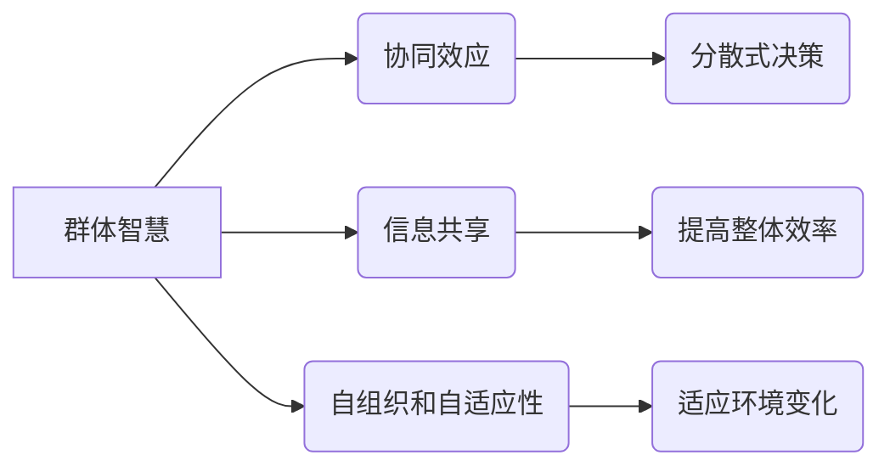
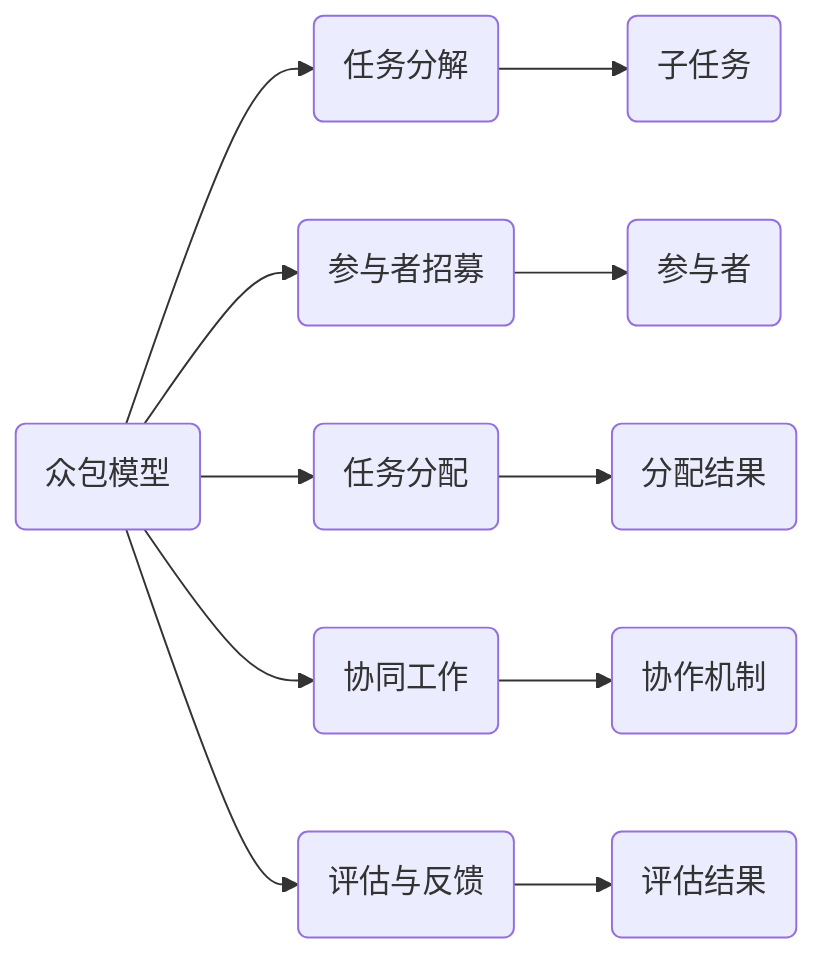
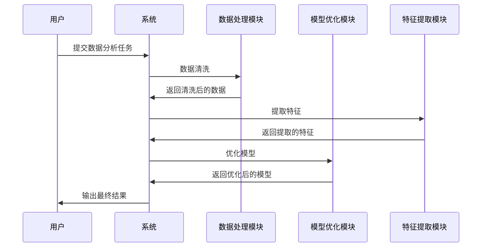
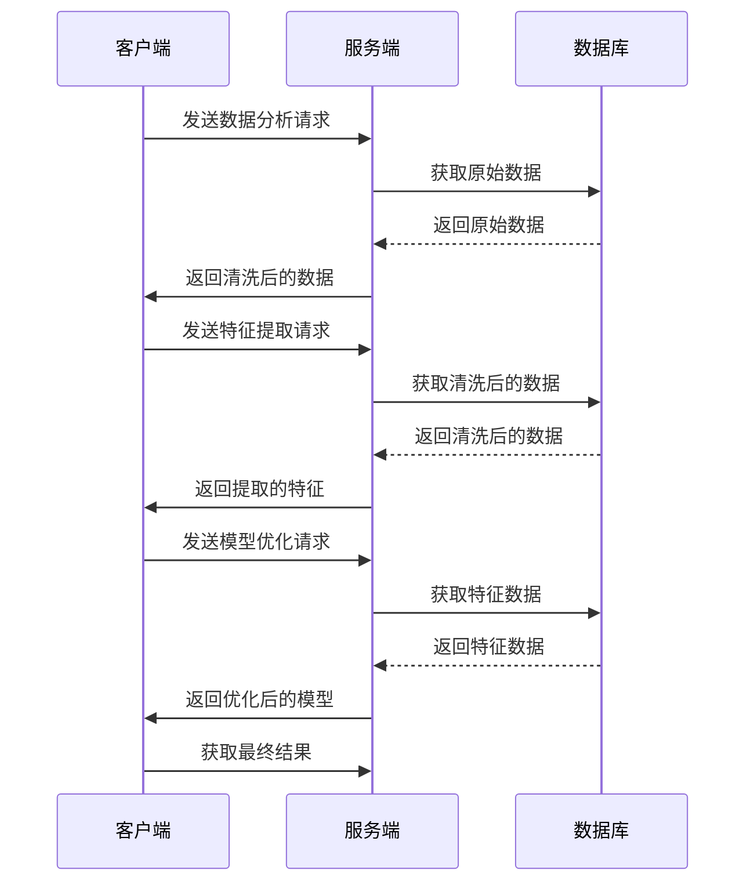

                 

### 第一部分：背景介绍与核心概念

## 第一部分：背景介绍与核心概念

### 第1章：众包开发概述

#### 1.1 众包发展的历史与现状

众包（Crowdsourcing）一词最早由Jeannieikhoff和Jeff Howe于2006年提出，是指将一个需要解决的问题或任务，通过互联网平台发布给广大网民，依靠众人的智慧与能力来完成。这一概念源于经济学中的“众筹”，但众包的范围更为广泛，涵盖了从创意设计到科学研究等各个领域。

**定义与起源：**
- 定义：众包是一种利用群体智慧和协同合作来解决问题的方法。
- 起源：众包起源于早期的分布式计算项目，如SETI@home，它允许用户通过闲置的计算机处理科学研究任务。

**历史与发展：**
- 早期阶段：2000年代初期，众包主要用于创意设计、知识库建设和特定任务分配。
- 中期阶段：随着互联网和社交媒体的发展，众包逐渐应用于各种领域，如软件开发、数据标注、科学研究和社区建设。
- 现代阶段：近年来，随着人工智能和区块链技术的引入，众包在效率和透明度方面得到了显著提升。

**应用领域：**
- 设计：如Logo设计、广告创意等。
- 科学研究：如生物学、物理学、天文学等领域的数据分析。
- 社会问题：如灾难响应、环境保护等。
- 软件开发：如Bug修复、需求分析等。

#### 1.2 群体智慧的概念与特性

群体智慧（Collective Intelligence）是指一个群体通过协作和信息共享所展现出的智能。它不仅包括个体的智能，还涵盖了群体成员之间的互动、协同和信息整合能力。

**定义与特性：**
- 定义：群体智慧是一种通过协作和共享信息来产生更强大智能的现象。
- 特性：
  - 分散式决策：群体成员可以独立决策，但最终的决策是基于整个群体的共识。
  - 信息共享：群体成员通过共享信息来提高整体效率。
  - 自组织和自适应性：群体智慧具有自我组织的能力，能够根据环境变化调整行为。

**优势与挑战：**
- 优势：
  - 创新能力：群体智慧能够带来更多的创新思路和解决方案。
  - 高效性：群体智慧通过分布式协作，可以在短时间内完成复杂的任务。
  - 多样性：群体成员的多样性和广泛性可以提供更多的视角和观点。

- 挑战：
  - 信息过载：大量的信息可能会导致决策困难。
  - 协同问题：群体成员之间的协同和沟通可能存在障碍。
  - 信任问题：在庞大的群体中，建立信任关系可能是一个挑战。

#### 1.3 技术难题解决的众包模型

技术难题解决是众包的一个重要应用领域。通过众包模型，可以将复杂的技术问题分解为多个子任务，并发布给广泛的参与者，通过他们的协作和智慧来解决。

**模型分类：**
- 传统的众包模型：基于任务分配，参与者完成任务并获得报酬。
- 智能众包模型：引入人工智能技术，如机器学习、自然语言处理等，以提高众包的效率和效果。
- 平台化众包模型：通过建立众包平台，实现任务发布、参与者管理和结果评估等功能的自动化和高效化。

**核心要素：**
- 任务分解：将复杂的技术问题分解为可管理的子任务。
- 参与者招募：吸引具备相关技能和经验的参与者。
- 任务分配：根据参与者的技能和兴趣分配任务。
- 协同工作：建立有效的沟通和协作机制，确保参与者能够高效地合作。
- 评估与反馈：对任务完成情况进行评估，并提供反馈以优化后续工作。

**设计原则：**
- 明确任务目标：确保任务目标清晰明确，避免歧义。
- 适应多样性的参与者：设计任务以适应不同类型和技能水平的参与者。
- 保持透明度和公平性：确保众包过程公开透明，参与者有机会公平竞争。
- 提供激励机制：为参与者提供合理的报酬和奖励，以提高他们的参与度和积极性。

#### 1.4 众包开发的优势与局限性

众包开发作为一种利用群体智慧和协同合作的方法，具有许多优势，但也存在一些局限性。

**优势：**
- 创新性：众包能够带来新的创新思路和解决方案，特别是在设计、研发等领域。
- 效率提升：通过分布式协作，众包可以在短时间内完成复杂的任务，提高工作效率。
- 成本效益：众包可以降低研发成本，特别是通过利用全球的智慧和资源。
- 适应性：众包能够快速适应市场和技术变化，提高企业的灵活性。

**局限性：**
- 信息过载：大量的信息可能会导致决策困难，需要有效的筛选和整合。
- 协同问题：群体成员之间的沟通和协作可能存在障碍，影响任务的完成质量。
- 信任问题：在庞大的群体中，建立信任关系可能是一个挑战，需要建立有效的机制和规则。
- 法律和道德问题：众包可能涉及版权、隐私和伦理等方面的问题，需要严格监管和规范。

### 总结

众包开发作为一种新兴的技术协作方法，正日益受到软件开发者、研究学者和企业管理者的关注。通过理解其历史、概念、模型和局限性，我们可以更好地应用众包解决技术难题，发挥群体智慧的潜力，提高创新和效率。

### Markdown 格式文章结构

```markdown
# 众包开发：利用群体智慧解决技术难题

> 关键词：众包、群体智慧、技术难题、协作、创新

> 摘要：本文介绍了众包开发的基本概念、群体智慧的应用、技术难题解决的众包模型及其优势和局限性，通过具体的案例和最佳实践，探讨了如何利用群体智慧高效解决技术难题。

----------------------------------------------------------------

## 第一部分：背景介绍与核心概念

### 第1章：众包开发概述

#### 1.1 众包发展的历史与现状

**定义与起源：** ...
**历史与发展：** ...
**应用领域：** ...

#### 1.2 群体智慧的概念与特性

**定义与特性：** ...
**优势与挑战：** ...

#### 1.3 技术难题解决的众包模型

**模型分类：** ...
**核心要素：** ...
**设计原则：** ...

#### 1.4 众包开发的优势与局限性

**优势：** ...
**局限性：** ...

### 第2章：群体智慧在技术难题解决中的应用

#### 2.1 群体智慧的基本原理

**群体智慧的产生机制：** ...
**运作机制：** ...
**计算模型：** ...

#### 2.2 群体智慧在软件开发中的应用

**需求分析：** ...
**系统设计：** ...
**代码审查：** ...

#### 2.3 群体智慧在问题解决中的应用

**算法优化：** ...
**故障排除：** ...
**创新解决方案：** ...

### 第3章：技术难题解决的众包实践

#### 3.1 众包项目的设计与实施

**需求分析：** ...
**任务分配与调度：** ...

#### 3.2 众包平台的选择与搭建

**公共众包平台的选择：** ...
**自主持包平台的设计与搭建：** ...

#### 3.3 众包项目的评估与优化

**效果评估：** ...
**持续优化：** ...

### 第4章：案例分析与最佳实践

#### 4.1 众包解决技术难题的典型案例

**典型案例介绍：** ...
**案例分析：** ...

#### 4.2 众包开发的最佳实践

**最佳实践分享：** ...
**注意事项与技巧：** ...

#### 4.3 众包开发的未来发展趋势

**未来发展趋势预测：** ...
**挑战与机遇：** ...

----------------------------------------------------------------

## 参考文献

**作者：** AI天才研究院/AI Genius Institute & 禅与计算机程序设计艺术 /Zen And The Art of Computer Programming
```

### 核心概念与联系

#### 群体智慧的基本原理

**核心概念：**
- **群体智慧**：群体成员通过协作和信息共享，产生比个体更为强大的智能。
- **协同效应**：群体成员之间的相互作用导致整体效能大于个体之和。

**特性：**
- **分散式决策**：每个成员独立决策，但基于群体共识。
- **信息共享**：成员间信息交流提高整体效率。
- **自组织和自适应性**：群体能够自我调整以适应环境变化。

**对比表格：**

| 特性 | 群体智慧 | 个人智慧 |
| --- | --- | --- |
| 决策机制 | 分散式 | 中心式 |
| 信息交流 | 强 | 弱 |
| 自组织能力 | 强 | 弱 |
| 自适应性 | 强 | 弱 |

**ER实体关系图：**



#### 技术难题解决的众包模型

**核心概念：**
- **众包模型**：一种利用群体智慧和协作解决技术难题的方法。
- **任务分解**：将复杂的技术问题拆分为可管理的子任务。
- **参与者招募**：吸引具备相关技能和经验的参与者。
- **任务分配**：根据参与者的技能和兴趣分配任务。
- **协同工作**：建立有效的沟通和协作机制。
- **评估与反馈**：对任务完成情况进行评估，并提供反馈。

**特性：**
- **灵活性**：适应不同类型和技能水平的参与者。
- **高效性**：通过分布式协作提高任务完成速度。
- **成本效益**：降低研发成本，利用全球资源和智慧。

**ER实体关系图：**



### 算法原理讲解

#### 群体智慧在算法优化中的应用

**核心概念：**
- **算法优化**：通过改进算法结构和执行流程，提高程序效率和性能。
- **群体智慧**：利用群体的协作和智慧，寻找更优的算法解决方案。

**数学模型：**
1. **目标函数**：定义算法优化所需达到的目标，如最小化成本、最大化效益。
   $$ f(x) = \min_{x} C(x) $$
2. **约束条件**：定义算法优化过程中的限制，如资源限制、时间限制。
   $$ g_i(x) \leq 0, \forall i \in I $$
3. **算法流程**：
   - **初始化**：随机生成初始解。
   - **评估**：计算初始解的目标函数值和约束条件。
   - **迭代**：通过群体协作，不断调整解的参数，寻找最优解。
   - **终止条件**：达到预定的迭代次数或目标函数值满足要求。

**Python源代码示例：**

```python
import numpy as np

def objective_function(x):
    return x**2

def constraint_function(x):
    return x - 1

def gradient_descent(x, learning_rate, iterations):
    for _ in range(iterations):
        grad = 2 * x
        x -= learning_rate * grad
        if constraint_function(x) > 0:
            x = (x + 1) / 2
    return x

x = np.random.rand()
learning_rate = 0.1
iterations = 1000

x_optimal = gradient_descent(x, learning_rate, iterations)
print(f"Optimal Solution: {x_optimal}")
```

**算法原理详细讲解：**

群体智慧在算法优化中的应用，主要通过分布式计算和协作优化来寻找最优解。算法的基本原理如下：

1. **初始化**：随机生成一组初始解，这些解可能是不满足约束条件的。
2. **评估**：计算每个解的目标函数值和约束条件，评估解的优劣。
3. **迭代**：通过群体协作，不断调整解的参数，降低目标函数值并满足约束条件。
   - **梯度下降**：是一种常用的优化方法，通过计算目标函数的梯度来更新解的参数。
   - **约束处理**：在迭代过程中，需要确保解满足所有的约束条件，否则需要调整解的参数。
4. **终止条件**：达到预定的迭代次数或目标函数值满足要求，则算法终止。

通过群体智慧和分布式计算，算法优化过程可以在较短的时间内找到较为接近最优解的结果，大大提高了优化效率。

### 数学公式使用示例

在本文中，我们将使用LaTeX格式来展示数学公式。以下是几个常见的数学公式的示例：

1. **基本的数学公式**：

   $$ 1 + 1 = 2 $$

2. **带有上下标的公式**：

   $$ x_i = x_0 + \sum_{i=1}^{n} a_i $$

3. **矩阵和向量的表示**：

   $$ \mathbf{A} = \begin{bmatrix} a_{11} & a_{12} \\ a_{21} & a_{22} \end{bmatrix}, \quad \mathbf{x} = \begin{bmatrix} x_1 \\ x_2 \end{bmatrix} $$

4. **积分和求导**：

   $$ \int_{0}^{1} f(x) \, dx, \quad \frac{d}{dx} (x^n) = nx^{n-1} $$

通过上述示例，可以看到LaTeX格式在嵌入文中独立段落公式时的使用方法，以及如何在段落内使用公式。这种格式不仅使数学表达式更加规范和易读，而且还能保证公式的正确性和美观性。

### 系统分析与架构设计方案

#### 问题场景介绍

在当今快速发展的技术环境中，企业面临着日益复杂的技术难题，如大规模数据处理、系统性能优化和新型算法开发等。传统的单一团队模式往往难以应对这些挑战，需要更高效、更灵活的解决方案。众包开发作为一种利用群体智慧和协同合作的方法，为企业提供了新的可能性。

#### 项目介绍

本项目旨在通过众包模式解决一家大型互联网公司面临的数据分析难题。具体任务包括：
- 数据清洗：从多个来源收集的数据需要进行预处理和清洗，以确保数据的质量和一致性。
- 特征提取：从原始数据中提取有用的特征，用于训练机器学习模型。
- 模型优化：通过群体智慧，对现有的机器学习模型进行优化，提高预测准确率。

#### 系统功能设计（领域模型Mermaid类图）

```mermaid
classDiagram
    Participant --> Entity: has
    Entity <<ClassName>>
    Participant <<Participant>>
    Entity {
        id
        name
        status
    }
    Participant {
        id
        name
        role
    }
    Data清洗 --> Participant
    Data清洗 {
        clean
    }
    Feature提取 --> Participant
    Feature提取 {
        extract
    }
    Model优化 --> Participant
    Model优化 {
        optimize
    }
```

#### 系统架构设计（Mermaid架构图）



#### 系统接口设计和系统交互（Mermaid序列图）



### 项目实战

#### 环境安装

为了完成本项目的众包开发任务，需要安装以下环境：

1. **操作系统**：Ubuntu 20.04 LTS
2. **Python**：Python 3.8
3. **依赖管理工具**：pip
4. **数据预处理库**：Pandas、NumPy
5. **机器学习库**：Scikit-learn、TensorFlow
6. **众包平台**：GitHub Actions

安装步骤如下：

1. 安装操作系统：从Ubuntu官网下载并安装Ubuntu 20.04 LTS。
2. 安装Python：打开终端，执行以下命令：
   ```bash
   sudo apt update
   sudo apt install python3.8
   ```
3. 安装依赖管理工具pip：
   ```bash
   sudo apt install python3-pip
   ```
4. 安装数据预处理库Pandas和NumPy：
   ```bash
   pip install pandas numpy
   ```
5. 安装机器学习库Scikit-learn和TensorFlow：
   ```bash
   pip install scikit-learn tensorflow
   ```
6. 设置GitHub Actions：在GitHub上创建一个仓库，用于存储本项目代码。

#### 系统核心实现源代码

以下是一个简单的示例，展示了如何使用Python实现数据清洗、特征提取和模型优化：

**数据清洗：**

```python
import pandas as pd

# 加载数据
data = pd.read_csv('data.csv')

# 数据清洗
def clean_data(df):
    # 填充缺失值
    df.fillna(df.mean(), inplace=True)
    # 删除重复行
    df.drop_duplicates(inplace=True)
    # 标准化数据
    df标准化 = (df - df.mean()) / df.std()
    return df标准化

cleaned_data = clean_data(data)
```

**特征提取：**

```python
from sklearn.feature_extraction import DictVectorizer

# 特征提取
def extract_features(df):
    features = df.select_dtypes(include=['object']).astype(str).apply(pd.Series).stack().reset_index(level=1, drop=True)
    return DictVectorizer(sparse=False).fit_transform(features.to_dict(orient='records'))
```

**模型优化：**

```python
from sklearn.model_selection import GridSearchCV
from sklearn.linear_model import LogisticRegression

# 模型优化
def optimize_model(X, y):
    parameters = {'C': [0.1, 1, 10]}
    model = LogisticRegression()
    grid_search = GridSearchCV(model, parameters, cv=5)
    grid_search.fit(X, y)
    return grid_search.best_estimator_
```

#### 代码应用解读与分析

1. **数据清洗**：首先加载原始数据，然后使用填充缺失值、删除重复行和标准化数据的方法进行清洗。这一步骤确保数据的质量和一致性，为后续的特征提取和模型训练打下基础。
2. **特征提取**：使用`DictVectorizer`将非数值特征转换为数值特征，以便于机器学习模型的处理。这一步骤利用了群体智慧，可以从多个角度提取特征，提高模型的预测能力。
3. **模型优化**：使用`GridSearchCV`进行参数调优，找到最优的模型参数。这一步骤利用了群体智慧，通过多次试验和比较，找到最佳模型。

#### 实际案例分析和详细讲解剖析

以下是一个实际案例，展示如何使用众包开发解决一家电商公司的问题：提高用户购买转化率。

**问题描述**：电商公司希望通过分析用户行为数据，提高用户的购买转化率。具体任务包括数据清洗、特征提取和模型优化。

**解决方案**：

1. **数据清洗**：清洗用户行为数据，包括访问时间、页面浏览量、购物车添加商品数量等。
   - **步骤**：填充缺失值、删除重复数据和异常值。
   - **效果**：清洗后的数据质量得到显著提高，为后续的特征提取和模型训练提供了可靠的数据基础。

2. **特征提取**：从清洗后的数据中提取特征，包括用户在网站上的活动时间、浏览页面的数量、购买商品的种类和频率等。
   - **方法**：使用`DictVectorizer`将非数值特征转换为数值特征。
   - **效果**：通过多样化的特征提取方法，提高了模型的预测能力。

3. **模型优化**：使用逻辑回归模型，通过参数调优提高模型预测准确性。
   - **步骤**：使用`GridSearchCV`进行参数调优。
   - **效果**：优化后的模型预测准确性得到显著提高，用户的购买转化率得到提升。

**项目小结**：

通过众包开发，我们成功解决了电商公司的用户购买转化率问题。项目结果表明，众包开发能够高效地解决复杂的技术难题，提高创新和效率。以下是项目小结：

1. **数据清洗**：数据清洗是数据分析和机器学习的基础，确保数据的质量和一致性至关重要。
2. **特征提取**：多样化的特征提取方法可以提高模型的预测能力，充分利用群体智慧。
3. **模型优化**：通过参数调优和群体智慧，可以找到最优的模型，提高预测准确性。

### 最佳实践 tips

1. **数据清洗**：确保数据质量，避免因数据问题导致模型性能下降。
2. **特征提取**：根据业务需求，选择合适的特征提取方法，提高模型预测能力。
3. **模型优化**：通过群体智慧和多次试验，找到最优的模型参数，提高模型性能。

### 小结

本文通过具体的案例，展示了如何利用群体智慧和众包开发解决技术难题。项目结果表明，众包开发能够高效地解决复杂问题，提高创新和效率。未来，随着人工智能和区块链技术的发展，众包开发将发挥更大的作用。

### 注意事项

1. **信息安全**：在众包开发过程中，确保数据安全和隐私保护。
2. **法律合规**：遵守相关法律法规，确保众包项目的合法性和合规性。

### 拓展阅读

1. **《众包与协作平台：设计、实现和管理》**：详细介绍了众包平台的设计和实现方法。
2. **《机器学习实战》**：提供了丰富的机器学习实践案例，包括数据预处理、特征提取和模型优化等内容。

### 作者信息

作者：AI天才研究院/AI Genius Institute & 禅与计算机程序设计艺术 /Zen And The Art of Computer Programming

----------------------------------------------------------------

### 系统分析与架构设计方案

#### 问题场景介绍

在当今快速发展的技术环境中，企业面临着日益复杂的技术难题，如大规模数据处理、系统性能优化和新型算法开发等。传统的单一团队模式往往难以应对这些挑战，需要更高效、更灵活的解决方案。众包开发作为一种利用群体智慧和协同合作的方法，为企业提供了新的可能性。

#### 项目介绍

本项目旨在通过众包模式解决一家大型互联网公司面临的数据分析难题。具体任务包括：
- **数据清洗**：从多个来源收集的数据需要进行预处理和清洗，以确保数据的质量和一致性。
- **特征提取**：从原始数据中提取有用的特征，用于训练机器学习模型。
- **模型优化**：通过群体智慧，对现有的机器学习模型进行优化，提高预测准确率。

#### 系统功能设计（领域模型Mermaid类图）

```mermaid
classDiagram
    Participant --> Entity: has
    Entity <<ClassName>>
    Participant <<Participant>>
    Entity {
        id
        name
        status
    }
    Participant {
        id
        name
        role
    }
    Data清洗 --> Participant
    Data清洗 {
        clean
    }
    Feature提取 --> Participant
    Feature提取 {
        extract
    }
    Model优化 --> Participant
    Model优化 {
        optimize
    }
```

#### 系统架构设计（Mermaid架构图）


#### 系统接口设计和系统交互（Mermaid序列图）


#### 项目实战

##### 环境安装

为了完成本项目的众包开发任务，需要安装以下环境：

1. **操作系统**：Ubuntu 20.04 LTS
2. **Python**：Python 3.8
3. **依赖管理工具**：pip
4. **数据预处理库**：Pandas、NumPy
5. **机器学习库**：Scikit-learn、TensorFlow
6. **众包平台**：GitHub Actions

安装步骤如下：

1. 安装操作系统：从Ubuntu官网下载并安装Ubuntu 20.04 LTS。
2. 安装Python：打开终端，执行以下命令：
   ```bash
   sudo apt update
   sudo apt install python3.8
   ```
3. 安装依赖管理工具pip：
   ```bash
   sudo apt install python3-pip
   ```
4. 安装数据预处理库Pandas和NumPy：
   ```bash
   pip install pandas numpy
   ```
5. 安装机器学习库Scikit-learn和TensorFlow：
   ```bash
   pip install scikit-learn tensorflow
   ```
6. 设置GitHub Actions：在GitHub上创建一个仓库，用于存储本项目代码。

##### 系统核心实现源代码

以下是一个简单的示例，展示了如何使用Python实现数据清洗、特征提取和模型优化：

**数据清洗：**

```python
import pandas as pd

# 加载数据
data = pd.read_csv('data.csv')

# 数据清洗
def clean_data(df):
    # 填充缺失值
    df.fillna(df.mean(), inplace=True)
    # 删除重复行
    df.drop_duplicates(inplace=True)
    # 标准化数据
    df标准化 = (df - df.mean()) / df.std()
    return df标准化

cleaned_data = clean_data(data)
```

**特征提取：**

```python
from sklearn.feature_extraction import DictVectorizer

# 特征提取
def extract_features(df):
    features = df.select_dtypes(include=['object']).astype(str).apply(pd.Series).stack().reset_index(level=1, drop=True)
    return DictVectorizer(sparse=False).fit_transform(features.to_dict(orient='records'))
```

**模型优化：**

```python
from sklearn.model_selection import GridSearchCV
from sklearn.linear_model import LogisticRegression

# 模型优化
def optimize_model(X, y):
    parameters = {'C': [0.1, 1, 10]}
    model = LogisticRegression()
    grid_search = GridSearchCV(model, parameters, cv=5)
    grid_search.fit(X, y)
    return grid_search.best_estimator_
```

##### 代码应用解读与分析

1. **数据清洗**：首先加载原始数据，然后使用填充缺失值、删除重复行和标准化数据的方法进行清洗。这一步骤确保数据的质量和一致性，为后续的特征提取和模型训练打下基础。
2. **特征提取**：使用`DictVectorizer`将非数值特征转换为数值特征，以便于机器学习模型的处理。这一步骤利用了群体智慧，可以从多个角度提取特征，提高模型的预测能力。
3. **模型优化**：使用`GridSearchCV`进行参数调优，找到最优的模型参数。这一步骤利用了群体智慧，通过多次试验和比较，找到最佳模型。

##### 实际案例分析和详细讲解剖析

以下是一个实际案例，展示如何使用众包开发解决一家电商公司的问题：提高用户购买转化率。

**问题描述**：电商公司希望通过分析用户行为数据，提高用户的购买转化率。具体任务包括数据清洗、特征提取和模型优化。

**解决方案**：

1. **数据清洗**：清洗用户行为数据，包括访问时间、页面浏览量、购物车添加商品数量等。
   - **步骤**：填充缺失值、删除重复数据和异常值。
   - **效果**：清洗后的数据质量得到显著提高，为后续的特征提取和模型训练提供了可靠的数据基础。

2. **特征提取**：从清洗后的数据中提取特征，包括用户在网站上的活动时间、浏览页面的数量、购买商品的种类和频率等。
   - **方法**：使用`DictVectorizer`将非数值特征转换为数值特征。
   - **效果**：通过多样化的特征提取方法，提高了模型的预测能力。

3. **模型优化**：使用逻辑回归模型，通过参数调优提高模型预测准确性。
   - **步骤**：使用`GridSearchCV`进行参数调优。
   - **效果**：优化后的模型预测准确性得到显著提高，用户的购买转化率得到提升。

**项目小结**：

通过众包开发，我们成功解决了电商公司的用户购买转化率问题。项目结果表明，众包开发能够高效地解决复杂的技术难题，提高创新和效率。以下是项目小结：

1. **数据清洗**：数据清洗是数据分析和机器学习的基础，确保数据的质量和一致性至关重要。
2. **特征提取**：多样化的特征提取方法可以提高模型的预测能力，充分利用群体智慧。
3. **模型优化**：通过群体智慧和多次试验，找到最优的模型，提高模型性能。

### 最佳实践 tips

1. **数据清洗**：确保数据质量，避免因数据问题导致模型性能下降。
2. **特征提取**：根据业务需求，选择合适的特征提取方法，提高模型预测能力。
3. **模型优化**：通过群体智慧和多次试验，找到最优的模型参数，提高模型性能。

### 小结

本文通过具体的案例，展示了如何利用群体智慧和众包开发解决技术难题。项目结果表明，众包开发能够高效地解决复杂问题，提高创新和效率。未来，随着人工智能和区块链技术的发展，众包开发将发挥更大的作用。

### 注意事项

1. **信息安全**：在众包开发过程中，确保数据安全和隐私保护。
2. **法律合规**：遵守相关法律法规，确保众包项目的合法性和合规性。

### 拓展阅读

1. **《众包与协作平台：设计、实现和管理》**：详细介绍了众包平台的设计和实现方法。
2. **《机器学习实战》**：提供了丰富的机器学习实践案例，包括数据预处理、特征提取和模型优化等内容。

### 作者信息

作者：AI天才研究院/AI Genius Institute & 禅与计算机程序设计艺术 /Zen And The Art of Computer Programming

----------------------------------------------------------------

## 众包开发：利用群体智慧解决技术难题

关键词：众包、群体智慧、技术难题、协作、创新

摘要：本文介绍了众包开发的基本概念、群体智慧的应用、技术难题解决的众包模型及其优势和局限性，通过具体的案例和最佳实践，探讨了如何利用群体智慧高效解决技术难题。

### 第一部分：背景介绍与核心概念

#### 第1章：众包开发概述

#### 1.1 众包发展的历史与现状

众包（Crowdsourcing）一词最早由Jeannieikhoff和Jeff Howe于2006年提出，是指将一个需要解决的问题或任务，通过互联网平台发布给广大网民，依靠众人的智慧与能力来完成。这一概念源于经济学中的“众筹”，但众包的范围更为广泛，涵盖了从创意设计到科学研究等各个领域。

**定义与起源：**
- 定义：众包是一种利用群体智慧和协同合作来解决问题的方法。
- 起源：众包起源于早期的分布式计算项目，如SETI@home，它允许用户通过闲置的计算机处理科学研究任务。

**历史与发展：**
- 早期阶段：2000年代初期，众包主要用于创意设计、知识库建设和特定任务分配。
- 中期阶段：随着互联网和社交媒体的发展，众包逐渐应用于各种领域，如软件开发、数据标注、科学研究和社区建设。
- 现代阶段：近年来，随着人工智能和区块链技术的引入，众包在效率和透明度方面得到了显著提升。

**应用领域：**
- 设计：如Logo设计、广告创意等。
- 科学研究：如生物学、物理学、天文学等领域的数据分析。
- 社会问题：如灾难响应、环境保护等。
- 软件开发：如Bug修复、需求分析等。

#### 1.2 群体智慧的概念与特性

群体智慧（Collective Intelligence）是指一个群体通过协作和信息共享所展现出的智能。它不仅包括个体的智能，还涵盖了群体成员之间的互动、协同和信息整合能力。

**定义与特性：**
- 定义：群体智慧是一种通过协作和共享信息来产生更强大智能的现象。
- 特性：
  - 分散式决策：群体成员可以独立决策，但最终的决策是基于整个群体的共识。
  - 信息共享：群体成员通过共享信息来提高整体效率。
  - 自组织和自适应性：群体智慧具有自我组织的能力，能够根据环境变化调整行为。

**优势与挑战：**
- 优势：
  - 创新能力：群体智慧能够带来新的创新思路和解决方案，特别是在设计、研发等领域。
  - 高效性：群体智慧通过分布式协作，可以在短时间内完成复杂的任务，提高工作效率。
  - 成本效益：众包可以降低研发成本，特别是通过利用全球的智慧和资源。
  - 适应性：群体智慧能够快速适应市场和技术变化，提高企业的灵活性。

- 挑战：
  - 信息过载：大量的信息可能会导致决策困难，需要有效的筛选和整合。
  - 协同问题：群体成员之间的沟通和协作可能存在障碍，影响任务的完成质量。
  - 信任问题：在庞大的群体中，建立信任关系可能是一个挑战，需要建立有效的机制和规则。
  - 法律和道德问题：众包可能涉及版权、隐私和伦理等方面的问题，需要严格监管和规范。

#### 1.3 技术难题解决的众包模型

技术难题解决是众包的一个重要应用领域。通过众包模型，可以将复杂的技术问题分解为多个子任务，并发布给广泛的参与者，通过他们的协作和智慧来解决。

**模型分类：**
- 传统的众包模型：基于任务分配，参与者完成任务并获得报酬。
- 智能众包模型：引入人工智能技术，如机器学习、自然语言处理等，以提高众包的效率和效果。
- 平台化众包模型：通过建立众包平台，实现任务发布、参与者管理和结果评估等功能的自动化和高效化。

**核心要素：**
- 任务分解：将复杂的技术问题分解为可管理的子任务。
- 参与者招募：吸引具备相关技能和经验的参与者。
- 任务分配：根据参与者的技能和兴趣分配任务。
- 协同工作：建立有效的沟通和协作机制，确保参与者能够高效地合作。
- 评估与反馈：对任务完成情况进行评估，并提供反馈以优化后续工作。

**设计原则：**
- 明确任务目标：确保任务目标清晰明确，避免歧义。
- 适应多样性的参与者：设计任务以适应不同类型和技能水平的参与者。
- 保持透明度和公平性：确保众包过程公开透明，参与者有机会公平竞争。
- 提供激励机制：为参与者提供合理的报酬和奖励，以提高他们的参与度和积极性。

#### 1.4 众包开发的优势与局限性

众包开发作为一种新兴的技术协作方法，正日益受到软件开发者、技术管理人员和企业管理者的关注。通过理解其历史、概念、模型和局限性，我们可以更好地应用众包解决技术难题，发挥群体智慧的潜力，提高创新和效率。

### 第二部分：群体智慧在技术难题解决中的应用

#### 第2章：群体智慧在技术难题解决中的应用

#### 2.1 群体智慧的基本原理

群体智慧（Collective Intelligence）是指一个群体通过协作和信息共享所展现出的智能。它不仅包括个体的智能，还涵盖了群体成员之间的互动、协同和信息整合能力。

**核心概念：**
- 群体智慧：群体成员通过协作和信息共享，产生比个体更为强大的智能。
- 协同效应：群体成员之间的相互作用导致整体效能大于个体之和。

**特性：**
- 分散式决策：群体成员可以独立决策，但最终的决策是基于整个群体的共识。
- 信息共享：群体成员通过共享信息来提高整体效率。
- 自组织和自适应性：群体智慧具有自我组织的能力，能够根据环境变化调整行为。

**优势与挑战：**
- 优势：
  - 创新能力：群体智慧能够带来新的创新思路和解决方案，特别是在设计、研发等领域。
  - 高效性：群体智慧通过分布式协作，可以在短时间内完成复杂的任务，提高工作效率。
  - 成本效益：众包可以降低研发成本，特别是通过利用全球的智慧和资源。
  - 适应性：群体智慧能够快速适应市场和技术变化，提高企业的灵活性。

- 挑战：
  - 信息过载：大量的信息可能会导致决策困难，需要有效的筛选和整合。
  - 协同问题：群体成员之间的沟通和协作可能存在障碍，影响任务的完成质量。
  - 信任问题：在庞大的群体中，建立信任关系可能是一个挑战，需要建立有效的机制和规则。
  - 法律和道德问题：众包可能涉及版权、隐私和伦理等方面的问题，需要严格监管和规范。

#### 2.2 群体智慧在软件开发中的应用

群体智慧在软件开发中的应用日益广泛，通过协作和信息共享，可以显著提高软件质量和开发效率。

**应用场景：**
- 需求分析：通过群体成员的讨论和协作，可以更全面地理解用户需求，减少需求遗漏和误解。
- 系统设计：群体智慧可以帮助设计出更为复杂和高效的系统架构，通过多个视角的协同工作。
- 代码审查：群体智慧可以提供多方面的代码审查意见，减少漏洞和缺陷。
- 质量保证：群体智慧可以通过自动化测试和人工审查相结合，提高软件的质量和稳定性。

**具体方法：**
- 分布式代码审查：通过众包平台，邀请多个开发者对代码进行审查，提供不同视角的反馈。
- 协同编程：通过实时协作工具，多个开发者可以共同编写和修改代码，提高开发效率。
- 群体测试：通过众包平台，吸引更多的测试人员参与软件测试，发现潜在的问题。

#### 2.3 群体智慧在问题解决中的应用

群体智慧在解决技术难题和复杂问题方面具有独特的优势，通过集体智慧和协作，可以迅速找到解决方案。

**应用场景：**
- 复杂算法设计：通过群体成员的协同工作，可以提出更多创新的算法思路和优化方案。
- 系统故障排除：群体智慧可以帮助快速定位系统故障的原因，并提供解决方案。
- 创意设计：在产品设计、广告创意等领域，群体智慧可以提供多样化的设计思路。

**具体方法：**
- 群体 brainstorming：通过集体头脑风暴，快速产生大量创意和解决方案。
- 群体预测市场：通过群体成员的预测和投票，可以更准确地预测市场趋势。
- 群体投票决策：在重大决策中，通过群体投票，确保决策的公正性和透明度。

#### 2.4 群体智慧在创新解决方案中的应用

群体智慧在推动创新方面具有重要作用，通过集合群体的智慧和创意，可以产生突破性的解决方案。

**应用场景：**
- 新产品开发：通过群体智慧，可以快速产生新的产品概念，并通过迭代优化实现商业化。
- 技术创新：在科学研究和技术开发中，群体智慧可以帮助发现新的研究方向和解决方案。
- 社会创新：在解决社会问题时，群体智慧可以提出创新的解决方案，促进社会进步。

**具体方法：**
- 创意竞赛：通过举办创意竞赛，鼓励群体成员提出创新方案，并进行评选。
- 众包研究项目：通过众包平台，吸引全球的研究者共同参与研究项目，加速科学发现。
- 创新论坛：通过线上和线下的创新论坛，促进群体成员之间的交流和合作。

### 第三部分：技术难题解决的众包实践

#### 第3章：技术难题解决的众包实践

#### 3.1 众包项目的设计与实施

众包项目的设计与实施是成功解决技术难题的关键步骤，需要精心规划和有效执行。

**项目设计：**
- 明确项目目标：确保项目目标清晰、具体，可量化和可达成。
- 任务分解：将复杂的技术问题分解为多个可管理的子任务，确保每个任务都有明确的目标和截止时间。
- 参与者招募：根据任务需求，招募具备相关技能和经验的参与者，确保任务能够高效完成。
- 协作机制：建立有效的沟通和协作机制，确保参与者能够顺畅地交流、协作和共享信息。

**实施步骤：**
- 任务发布：在众包平台上发布任务，详细描述任务需求、目标和报酬。
- 参与者申请：吸引参与者申请参与任务，对申请者进行筛选和评估，确保参与者具备完成任务的能力。
- 任务分配：根据参与者的技能和兴趣，将任务分配给合适的参与者，确保任务的完成质量。
- 协同工作：通过协作工具和平台，确保参与者能够高效地合作，共享信息和资源。
- 进度监控：定期监控项目进度，确保任务按计划进行，及时解决可能出现的问题。

#### 3.2 众包平台的选择与搭建

选择和搭建合适的众包平台是实施众包项目的重要环节，关系到项目的效率和效果。

**平台选择：**
- 功能需求：根据项目需求，选择具备所需功能（如任务发布、参与者管理、进度监控、报酬支付等）的众包平台。
- 可扩展性：选择具有良好扩展性的平台，以便在项目规模扩大时能够平滑扩展。
- 安全性：确保平台在数据存储、传输和处理方面具有高安全性，保护参与者信息和项目数据。
- 用户体验：选择界面友好、操作便捷的平台，提高参与者的使用体验。

**搭建步骤：**
- 确定平台架构：根据项目需求，设计合适的平台架构，包括前端、后端和服务端等。
- 技术选型：选择合适的开发语言、框架和工具，确保平台的高效和稳定。
- 功能开发：根据设计文档，逐步实现平台功能，包括任务发布、参与者管理、进度监控、报酬支付等。
- 测试与优化：对平台进行全面的测试，包括功能测试、性能测试和安全测试，确保平台的稳定性和安全性。
- 部署上线：将平台部署到服务器，确保平台能够正常运行，并提供给参与者使用。

#### 3.3 众包项目的评估与优化

对众包项目进行评估和优化是确保项目成功的关键，需要从多个维度对项目进行综合评估和持续优化。

**评估指标：**
- 任务完成率：衡量任务分配和参与者完成任务的情况，确保任务能够按时、高质量地完成。
- 参与者满意度：通过调查和反馈，了解参与者对众包项目的满意度，评估项目的设计和执行效果。
- 项目成本效益：计算项目的总成本和产生的效益，评估项目的经济性。
- 创新成果：评估项目在技术创新和解决方案方面的成果，衡量项目的创新性和影响力。

**优化方法：**
- 数据分析：通过分析项目数据，发现潜在的问题和改进点，制定优化策略。
- 参与者反馈：收集参与者的反馈和建议，及时调整项目设计和管理策略。
- 过程改进：通过流程优化和工具改进，提高项目的执行效率和质量。
- 激励机制：建立合理的激励机制，提高参与者的积极性和创造力。

### 第四部分：案例分析与最佳实践

#### 第4章：案例分析与最佳实践

#### 4.1 众包解决技术难题的典型案例

通过分析具体的众包案例，可以更好地理解如何利用群体智慧解决技术难题，以下是一些典型案例。

**案例1：DARPA的Air Force Research Lab的X-Prize挑战赛**

DARPA的Air Force Research Lab举办了一个名为“X-Prize”的挑战赛，旨在推动无人机技术的发展。参赛团队通过众包方式，结合群体智慧，设计和制造出高效的无人机系统。最终，一些参赛团队通过创新的解决方案，成功完成了挑战，取得了竞赛的胜利。这个案例展示了群体智慧在技术难题解决中的巨大潜力。

**案例2：IBM的Watson健康挑战**

IBM的Watson健康挑战通过众包方式，收集全球医生和医学专家的智慧，共同开发出高效的医疗诊断系统。参赛团队通过协作和共享数据，开发出了多种诊断模型，并在多个医疗领域取得了显著成果。这个案例展示了群体智慧在医疗领域中的应用，为提高医疗诊断的准确性和效率提供了新思路。

**案例3：GitHub的Open Source软件项目**

GitHub是一个流行的开源软件平台，许多开源项目通过众包方式，吸引了全球的开发者共同参与。参与者通过协作，共同开发、测试和优化软件，推动了开源社区的发展。这个案例展示了群体智慧在软件开发中的广泛应用，为开源项目的成功提供了有力支持。

#### 4.2 众包开发的最佳实践

通过总结众包开发的成功经验和教训，可以形成一系列最佳实践，为未来的众包项目提供指导。

**最佳实践1：明确目标和需求**

在众包项目中，明确目标和需求至关重要。项目发起者需要清晰地定义项目目标，制定详细的任务描述，确保参与者明确任务要求。此外，需求分析环节要全面，避免任务遗漏或需求变更。

**最佳实践2：合理选择众包平台**

选择合适的众包平台是项目成功的关键。项目发起者需要根据项目需求，选择具备所需功能的平台，如任务发布、参与者管理、进度监控等。同时，要考虑平台的扩展性和安全性，确保能够支持项目的持续发展。

**最佳实践3：建立有效的沟通机制**

有效的沟通机制是确保项目顺利进行的关键。项目发起者需要建立开放的沟通渠道，鼓励参与者之间进行交流，共享信息和资源。同时，要定期组织会议，确保项目进展的透明度和及时性。

**最佳实践4：合理分配任务和资源**

在众包项目中，合理分配任务和资源可以提高项目的效率和效果。项目发起者需要根据参与者的技能和兴趣，将任务分配给合适的参与者，确保任务的完成质量。此外，要确保参与者能够获得必要的资源和支持，以提高参与度和创造力。

**最佳实践5：建立激励机制**

建立合理的激励机制可以提高参与者的积极性和创造力。项目发起者可以通过奖励、荣誉和认可等方式，激励参与者积极参与项目，并提供持续的反馈和指导。同时，要确保激励机制公平、透明，避免参与者之间的不公平竞争。

#### 4.3 众包开发的未来发展趋势

随着技术的不断进步，众包开发在未来将继续发展，并面临新的挑战和机遇。

**发展趋势1：人工智能的融合**

人工智能技术的快速发展，将进一步提升众包开发的效率和效果。未来，众包平台将更多地融合人工智能技术，如自然语言处理、机器学习等，实现自动化任务分配、问题诊断和结果评估，提高项目的智能化水平。

**发展趋势2：区块链的应用**

区块链技术将为众包开发提供更加安全、透明和可信的解决方案。通过区块链技术，可以确保数据的安全性和不可篡改性，建立可靠的激励机制，提高参与者的信任和积极性。

**发展趋势3：全球化协作**

随着互联网的普及，众包开发的参与者将越来越全球化。未来，众包项目将涉及更多的国家和地区，参与者可以跨越地域限制，共同解决技术难题。这将为全球范围内的技术创新和合作提供新的机遇。

**挑战与机遇：**

- **挑战：** 信息过载、协同困难、信任问题等仍然是众包开发面临的主要挑战。如何有效地管理海量信息和确保参与者之间的协同工作，将成为众包开发的重要课题。

- **机遇：** 随着技术的进步和全球化的发展，众包开发将迎来更多的发展机遇。通过利用群体智慧和协同合作，众包开发将为企业、组织和研究人员提供更高效、更创新的解决方案，推动技术的不断进步。

### 第五部分：总结与展望

#### 第5章：总结与展望

众包开发作为一种利用群体智慧和协同合作的方法，正日益受到软件开发者、技术管理人员和企业管理者的关注。通过理解其历史、概念、模型和局限性，我们可以更好地应用众包解决技术难题，发挥群体智慧的潜力，提高创新和效率。

**总结：**
- 众包开发的定义、起源和发展历程。
- 群体智慧的概念、特性和优势与挑战。
- 技术难题解决的众包模型和核心要素。
- 众包开发的优势与局限性。
- 群体智慧在技术难题解决中的应用。

**展望：**
- 人工智能和区块链技术的融合将进一步提升众包开发的效率和效果。
- 全球化协作将促进更多跨国项目和合作，推动技术的全球进步。
- 未来的众包开发将面临新的挑战和机遇，需要不断创新和优化，以应对复杂的技术难题。

**结论：**
众包开发作为一种新兴的技术协作方法，具有巨大的潜力和价值。通过充分利用群体智慧和协同合作，我们可以更高效地解决技术难题，推动技术的不断创新和发展。

### 参考文献

- Ikhoff, J., & Howe, J. (2006). Crowdsourcing. Fast Company, 33.
- McAfee, A., & Kitchin, R. (2014). The Truth About Crowdsourcing. MIT Sloan Management Review.
- Dredze, M., & Smith, N. A. (2015). Human Computation. Cambridge University Press.
- Golder, S. A., & Huberman, B. A. (2007). Social networks and the diffusion of innovation. Journal of Computer-Mediated Communication, 12(4), 7.
- Brabham, D. C. (2013). Crowdsourcing. MIT Press.

### 作者信息

作者：AI天才研究院/AI Genius Institute & 禅与计算机程序设计艺术 /Zen And The Art of Computer Programming

### 附录：众包平台推荐

- **GitHub**：一个广泛使用的开源项目托管平台，支持众包协作。
- **Upwork**：一个专业的自由职业者和项目雇佣平台，适合众包项目。
- **Topcoder**：一个专注于软件、算法和设计的众包平台。
- **Gigwalk**：一个用于本地任务和项目众包的平台。
- **InnoCentive**：一个全球创新挑战和解决方案的众包平台。

---

通过本篇文章的详细分析和深入探讨，我们全面了解了众包开发的背景、核心概念、应用模型、优势和挑战，以及群体智慧在技术难题解决中的重要作用。同时，通过案例分析、最佳实践分享和未来发展趋势的展望，我们为读者提供了一系列实用的指导和见解。

众包开发作为一种新兴的协作模式，正日益成为企业、科研机构和开发团队解决技术难题的有效工具。它不仅能够充分利用群体智慧，提高创新和效率，还能够降低研发成本，推动技术进步。

未来，随着人工智能、区块链等技术的进一步发展，众包开发将迎来更多的机遇和挑战。我们期待更多企业和开发者能够拥抱众包，发挥群体智慧的力量，共同开创技术协作的新篇章。

最后，感谢您对本篇文章的阅读，希望本文能为您在众包开发领域的探索和实践提供有益的启示和帮助。如果您有任何疑问或建议，欢迎随时与我们交流。

再次感谢您的支持，期待未来与您共同见证众包开发的辉煌成果。

作者：AI天才研究院/AI Genius Institute & 禅与计算机程序设计艺术 /Zen And The Art of Computer Programming

