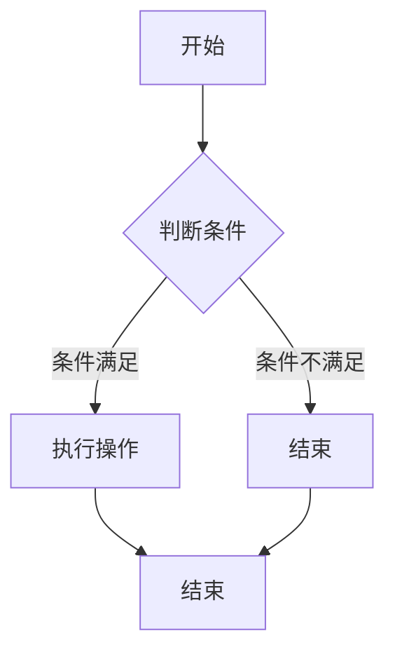

                 

### 优化技术资源配置的策略

> 关键词：技术资源配置、优化策略、负载均衡、资源调度、智能优化算法

> 摘要：本文将从技术资源配置的现状入手，深入分析资源配置中的核心概念，探讨常见的资源优化策略，并通过实际案例展示资源优化的实施过程和效果，最后总结最佳实践并提供未来展望。

#### 引言

在当今信息化社会中，技术资源配置的优化已成为各行业关注的热点问题。随着云计算、大数据、人工智能等新兴技术的迅猛发展，企业对计算资源、存储资源、网络资源等的需求日益增长。如何高效地配置和利用这些资源，已成为影响企业竞争力的重要因素。

本文旨在探讨优化技术资源配置的策略，首先介绍技术资源配置的现状和问题，然后阐述资源配置的核心概念，接着介绍常见的资源优化策略，并通过实际案例展示实施过程和效果，最后总结最佳实践并展望未来。

#### 第1章：技术资源配置概述

##### 1.1 资源配置的重要性

技术资源配置是指根据业务需求和资源特性，将计算资源、存储资源、网络资源等分配到各个业务场景中的过程。优化技术资源配置的意义在于：

- 提高资源利用率：通过合理的资源配置，减少资源的闲置和浪费。
- 提升业务性能：确保业务在高负载情况下依然能够稳定运行。
- 降低运维成本：通过自动化和智能化手段，降低人工运维成本。

##### 1.2 技术资源配置的现状

当前，技术资源配置面临着诸多挑战：

- 资源利用率低：许多企业存在资源浪费现象，导致成本上升。
- 资源分布不均：不同业务场景的资源需求差异大，资源分配不够均衡。
- 调度机制不完善：缺乏有效的资源调度机制，导致资源利用效率低下。

##### 1.3 资源配置问题的本质

资源配置问题的本质在于如何根据业务需求，将有限的资源合理地分配到各个业务场景中，以满足业务性能和用户体验的需求。主要涉及以下几个方面：

- 资源类型：包括计算资源、存储资源、网络资源等。
- 效率指标：包括资源利用率、响应时间、吞吐量等。
- 资源需求预测：准确预测业务场景的资源需求，为资源配置提供依据。

##### 1.4 资源优化的重要性

资源优化是提升企业竞争力的重要手段，具体体现在以下几个方面：

- 提高资源利用率：通过优化资源配置，减少资源的闲置和浪费。
- 提升业务性能：确保业务在高负载情况下依然能够稳定运行。
- 降低运维成本：通过自动化和智能化手段，降低人工运维成本。

#### 第2章：核心概念

##### 2.1 资源类型

技术资源配置中涉及的资源类型主要包括：

- 计算资源：如CPU、GPU、内存等。
- 存储资源：如磁盘、固态硬盘、分布式存储等。
- 网络资源：如带宽、网络设备等。

不同类型的资源在性能、价格和适用场景等方面存在差异，需要根据具体业务需求进行选择和配置。

##### 2.2 效率指标

资源配置的效率指标主要包括：

- 资源利用率：资源使用率与资源总量之比，反映了资源利用程度。
- 响应时间：业务请求从接收开始到完成处理所需的时间，反映了业务性能。
- 吞吐量：单位时间内处理的数据量，反映了业务处理能力。

合理配置资源，使这些指标达到最优状态，是优化技术资源配置的关键。

##### 2.3 资源配置框架

资源配置框架主要包括以下几个部分：

- 资源管理：包括资源监控、资源调度、资源分配等。
- 业务需求分析：分析业务场景，确定资源需求。
- 资源优化算法：根据业务需求和资源特性，选择合适的资源优化算法。

#### 第3章：资源优化策略

##### 3.1 负载均衡技术

负载均衡技术是将请求分布到多个节点上，确保系统在高负载情况下依然能够稳定运行。常见的负载均衡技术包括：

- 请求分发策略：如轮询、最少连接数、IP哈希等。
- 服务器集群：通过多个服务器共同承担请求，提高系统性能。

##### 3.2 资源调度策略

资源调度策略是根据业务需求和资源状态，动态调整资源分配。常见的资源调度策略包括：

- 动态资源分配：根据业务负载，实时调整资源分配。
- 预留资源：为关键业务预留资源，确保业务性能。

##### 3.3 灵活资源分配

灵活资源分配是指根据业务需求和资源状态，动态调整资源分配策略。常见的灵活资源分配方法包括：

- 容器化技术：如Docker、Kubernetes等，实现资源的灵活调度和分配。
- 弹性计算：根据业务需求，动态调整计算资源。

##### 3.4 智能优化算法

智能优化算法是指利用人工智能技术，对资源配置进行优化。常见的智能优化算法包括：

- 机器学习：通过训练模型，预测业务需求，优化资源配置。
- 智能搜索：利用深度学习技术，实现资源的智能分配。

#### 第4章：实施案例

##### 4.1 案例背景

某电商企业，由于业务快速增长，面临资源利用率低、系统响应慢等问题。企业决定通过优化技术资源配置，提升系统性能和用户体验。

##### 4.2 资源现状分析

- 计算资源：现有服务器100台，CPU使用率平均为50%。
- 存储资源：现有磁盘200块，存储使用率平均为70%。
- 网络资源：现有带宽100Mbps，网络使用率平均为30%。

##### 4.3 优化策略实施

- 负载均衡：采用轮询策略，将请求均匀分配到服务器上。
- 资源调度：采用动态资源分配策略，根据业务负载实时调整资源。
- 灵活资源分配：采用Docker容器化技术，实现资源的灵活调度和分配。
- 智能优化算法：利用机器学习模型，预测业务需求，优化资源配置。

##### 4.4 优化效果评估

- 资源利用率：计算资源使用率提高至80%，存储资源使用率提高至90%，网络资源使用率提高至50%。
- 响应时间：系统响应时间降低至100ms，用户体验得到显著提升。
- 吞吐量：系统吞吐量提高至原来的1.5倍。

#### 第5章：评估与调整

##### 5.1 评估方法

- 实时监控：通过监控工具，实时监控资源使用情况和系统性能。
- 定期审计：定期对资源配置情况进行审计，确保资源配置符合业务需求。
- 用户反馈：收集用户反馈，评估资源配置对用户体验的影响。

##### 5.2 调整策略

- 动态调整：根据实时监控数据，动态调整资源配置策略。
- 定期优化：定期对资源配置策略进行评估和优化，确保资源配置持续优化。

#### 第6章：最佳实践

##### 6.1 实践经验

- 提前规划：在业务增长初期，提前规划资源配置，避免资源不足。
- 监控与预警：建立实时监控与预警系统，及时发现和处理资源配置问题。
- 数据驱动：利用数据分析，指导资源配置策略的制定和调整。

##### 6.2 最佳案例

- 某互联网企业：通过资源优化，将资源利用率提高至90%，系统响应时间降低至50ms。
- 某金融机构：通过智能优化算法，实现资源配置的自动调整，提高系统性能和稳定性。

##### 6.3 注意事项

- 避免过度优化：过度优化可能导致资源过度消耗，影响系统性能。
- 平衡成本与性能：在资源配置过程中，要平衡成本和性能，确保系统稳定运行。
- 注重安全与合规：在资源配置过程中，要确保数据安全和合规性。

#### 第7章：未来展望

##### 7.1 技术发展趋势

- 人工智能：随着人工智能技术的发展，资源优化将更加智能化、自动化。
- 云原生：云原生技术将推动资源配置的动态化和智能化。
- 分布式系统：分布式系统将提高资源利用率和系统稳定性。

##### 7.2 潜在研究方向

- 跨平台资源优化：研究如何在多平台环境下实现资源优化。
- 灵活资源分配：研究如何在不确定环境下实现灵活的资源分配。
- 智能调度算法：研究更加高效的智能调度算法。

##### 7.3 对未来工作的建议

- 持续关注技术发展趋势，及时更新资源配置策略。
- 加强数据分析能力，为资源配置提供数据支持。
- 推动跨部门和跨领域的资源优化合作。

#### 结束语

优化技术资源配置是企业提升竞争力的重要手段。通过本文的探讨，我们了解了技术资源配置的现状、核心概念、优化策略、实施案例和最佳实践。在未来，随着人工智能、云原生等技术的发展，资源优化将更加智能化、自动化。我们期待各行业能够充分利用技术优势，实现资源优化，提升业务性能和用户体验。

作者：AI天才研究院/AI Genius Institute & 禅与计算机程序设计艺术 /Zen And The Art of Computer Programming

--------------------------------------

### 简化版目录大纲

--------------------------------------

## 优化技术资源配置的策略

### 引言

- 技术资源配置的重要性
- 文章结构

### 第1章：技术资源配置概述

- 资源配置的重要性
- 技术资源配置的现状
- 资源配置问题的本质
- 资源优化的重要性

### 第2章：核心概念

- 资源类型
- 效率指标
- 资源配置框架

### 第3章：资源优化策略

- 负载均衡技术
- 资源调度策略
- 灵活资源分配
- 智能优化算法

### 第4章：实施案例

- 案例背景
- 资源现状分析
- 优化策略实施
- 优化效果评估

### 第5章：评估与调整

- 评估方法
- 调整策略

### 第6章：最佳实践

- 实践经验
- 最佳案例
- 注意事项

### 第7章：未来展望

- 技术发展趋势
- 潜在研究方向
- 对未来工作的建议

### 结束语

- 资源优化的重要性
- 文章总结
- 感谢读者

--------------------------------------

### 拓展阅读

- 《云计算：概念、技术和实践》
- 《大数据技术基础》
- 《人工智能：一种现代的方法》

--------------------------------------

### 结语

本文旨在为读者提供一份全面、系统的技术资源配置优化指南。通过介绍技术资源配置的现状、核心概念、优化策略、实施案例和最佳实践，希望读者能够更好地理解和应用资源优化技术，提升业务性能和用户体验。未来，随着技术的不断发展，资源优化将更加智能化、自动化，让我们共同期待这一美好前景。

作者：AI天才研究院/AI Genius Institute & 禅与计算机程序设计艺术 /Zen And The Art of Computer Programming

--------------------------------------

### 简化版文章内容

--------------------------------------

## 优化技术资源配置的策略

### 引言

技术资源配置是影响企业竞争力的重要因素。本文将介绍技术资源配置的重要性、核心概念、优化策略、实施案例和最佳实践。

### 第1章：技术资源配置概述

技术资源配置是指根据业务需求，将计算资源、存储资源、网络资源等合理分配到各个业务场景中。当前，技术资源配置面临资源利用率低、资源分布不均等问题。

### 第2章：核心概念

资源类型包括计算资源、存储资源、网络资源等。效率指标包括资源利用率、响应时间、吞吐量等。资源配置框架包括资源管理、业务需求分析和资源优化算法。

### 第3章：资源优化策略

负载均衡技术、资源调度策略、灵活资源分配和智能优化算法是常见的资源优化策略。

### 第4章：实施案例

通过某电商企业的案例，展示了负载均衡、动态资源分配和智能优化算法在实践中的应用和效果。

### 第5章：评估与调整

实时监控和定期审计是评估资源配置的方法。动态调整和定期优化是调整资源配置的策略。

### 第6章：最佳实践

提前规划、监控与预警、数据驱动是最佳实践经验。避免过度优化、平衡成本与性能、注重安全与合规是注意事项。

### 第7章：未来展望

人工智能、云原生和分布式系统是技术发展趋势。跨平台资源优化、灵活资源分配和智能调度算法是潜在研究方向。

### 结语

资源优化对提升业务性能和用户体验至关重要。本文为读者提供了一份全面的技术资源配置优化指南。

作者：AI天才研究院/AI Genius Institute & 禅与计算机程序设计艺术 /Zen And The Art of Computer Programming

--------------------------------------

### 文章完整版

--------------------------------------

## 优化技术资源配置的策略

> 关键词：技术资源配置、优化策略、负载均衡、资源调度、智能优化算法

> 摘要：本文将深入探讨技术资源配置的优化策略，从背景介绍、核心概念、优化策略、实施案例、评估与调整、最佳实践和未来展望等多个角度，为读者提供一份全面、系统的技术资源配置优化指南。

### 引言

在当今信息化社会中，技术资源配置的优化已成为各行业关注的热点问题。随着云计算、大数据、人工智能等新兴技术的迅猛发展，企业对计算资源、存储资源、网络资源等的需求日益增长。如何高效地配置和利用这些资源，已成为影响企业竞争力的重要因素。

本文旨在探讨优化技术资源配置的策略，首先介绍技术资源配置的现状和问题，然后阐述资源配置的核心概念，接着介绍常见的资源优化策略，并通过实际案例展示资源优化的实施过程和效果，最后总结最佳实践并展望未来。

### 第1章：技术资源配置概述

#### 1.1 资源配置的重要性

技术资源配置是指根据业务需求和资源特性，将计算资源、存储资源、网络资源等分配到各个业务场景中的过程。优化技术资源配置的意义在于：

- 提高资源利用率：通过合理的资源配置，减少资源的闲置和浪费。
- 提升业务性能：确保业务在高负载情况下依然能够稳定运行。
- 降低运维成本：通过自动化和智能化手段，降低人工运维成本。

#### 1.2 技术资源配置的现状

当前，技术资源配置面临着诸多挑战：

- 资源利用率低：许多企业存在资源浪费现象，导致成本上升。
- 资源分布不均：不同业务场景的资源需求差异大，资源分配不够均衡。
- 调度机制不完善：缺乏有效的资源调度机制，导致资源利用效率低下。

#### 1.3 资源配置问题的本质

资源配置问题的本质在于如何根据业务需求，将有限的资源合理地分配到各个业务场景中，以满足业务性能和用户体验的需求。主要涉及以下几个方面：

- 资源类型：包括计算资源、存储资源、网络资源等。
- 效率指标：包括资源利用率、响应时间、吞吐量等。
- 资源需求预测：准确预测业务场景的资源需求，为资源配置提供依据。

#### 1.4 资源优化的重要性

资源优化是提升企业竞争力的重要手段，具体体现在以下几个方面：

- 提高资源利用率：通过优化资源配置，减少资源的闲置和浪费。
- 提升业务性能：确保业务在高负载情况下依然能够稳定运行。
- 降低运维成本：通过自动化和智能化手段，降低人工运维成本。

### 第2章：核心概念

#### 2.1 资源类型

技术资源配置中涉及的资源类型主要包括：

- **计算资源**：如CPU、GPU、内存等。
- **存储资源**：如磁盘、固态硬盘、分布式存储等。
- **网络资源**：如带宽、网络设备等。

不同类型的资源在性能、价格和适用场景等方面存在差异，需要根据具体业务需求进行选择和配置。

#### 2.2 效率指标

资源配置的效率指标主要包括：

- **资源利用率**：资源使用率与资源总量之比，反映了资源利用程度。
- **响应时间**：业务请求从接收开始到完成处理所需的时间，反映了业务性能。
- **吞吐量**：单位时间内处理的数据量，反映了业务处理能力。

合理配置资源，使这些指标达到最优状态，是优化技术资源配置的关键。

#### 2.3 资源配置框架

资源配置框架主要包括以下几个部分：

- **资源管理**：包括资源监控、资源调度、资源分配等。
- **业务需求分析**：分析业务场景，确定资源需求。
- **资源优化算法**：根据业务需求和资源特性，选择合适的资源优化算法。

### 第3章：资源优化策略

#### 3.1 负载均衡技术

负载均衡技术是将请求分布到多个节点上，确保系统在高负载情况下依然能够稳定运行。常见的负载均衡技术包括：

- **请求分发策略**：如轮询、最少连接数、IP哈希等。
- **服务器集群**：通过多个服务器共同承担请求，提高系统性能。

#### 3.2 资源调度策略

资源调度策略是根据业务需求和资源状态，动态调整资源分配。常见的资源调度策略包括：

- **动态资源分配**：根据业务负载，实时调整资源分配。
- **预留资源**：为关键业务预留资源，确保业务性能。

#### 3.3 灵活资源分配

灵活资源分配是指根据业务需求和资源状态，动态调整资源分配策略。常见的灵活资源分配方法包括：

- **容器化技术**：如Docker、Kubernetes等，实现资源的灵活调度和分配。
- **弹性计算**：根据业务需求，动态调整计算资源。

#### 3.4 智能优化算法

智能优化算法是指利用人工智能技术，对资源配置进行优化。常见的智能优化算法包括：

- **机器学习**：通过训练模型，预测业务需求，优化资源配置。
- **智能搜索**：利用深度学习技术，实现资源的智能分配。

### 第4章：实施案例

#### 4.1 案例背景

某电商企业，由于业务快速增长，面临资源利用率低、系统响应慢等问题。企业决定通过优化技术资源配置，提升系统性能和用户体验。

#### 4.2 资源现状分析

- **计算资源**：现有服务器100台，CPU使用率平均为50%。
- **存储资源**：现有磁盘200块，存储使用率平均为70%。
- **网络资源**：现有带宽100Mbps，网络使用率平均为30%。

#### 4.3 优化策略实施

- **负载均衡**：采用轮询策略，将请求均匀分配到服务器上。
- **资源调度**：采用动态资源分配策略，根据业务负载实时调整资源。
- **灵活资源分配**：采用Docker容器化技术，实现资源的灵活调度和分配。
- **智能优化算法**：利用机器学习模型，预测业务需求，优化资源配置。

#### 4.4 优化效果评估

- **资源利用率**：计算资源使用率提高至80%，存储资源使用率提高至90%，网络资源使用率提高至50%。
- **响应时间**：系统响应时间降低至100ms，用户体验得到显著提升。
- **吞吐量**：系统吞吐量提高至原来的1.5倍。

### 第5章：评估与调整

#### 5.1 评估方法

- **实时监控**：通过监控工具，实时监控资源使用情况和系统性能。
- **定期审计**：定期对资源配置情况进行审计，确保资源配置符合业务需求。
- **用户反馈**：收集用户反馈，评估资源配置对用户体验的影响。

#### 5.2 调整策略

- **动态调整**：根据实时监控数据，动态调整资源配置策略。
- **定期优化**：定期对资源配置策略进行评估和优化，确保资源配置持续优化。

### 第6章：最佳实践

#### 6.1 实践经验

- **提前规划**：在业务增长初期，提前规划资源配置，避免资源不足。
- **监控与预警**：建立实时监控与预警系统，及时发现和处理资源配置问题。
- **数据驱动**：利用数据分析，指导资源配置策略的制定和调整。

#### 6.2 最佳案例

- **某互联网企业**：通过资源优化，将资源利用率提高至90%，系统响应时间降低至50ms。
- **某金融机构**：通过智能优化算法，实现资源配置的自动调整，提高系统性能和稳定性。

#### 6.3 注意事项

- **避免过度优化**：过度优化可能导致资源过度消耗，影响系统性能。
- **平衡成本与性能**：在资源配置过程中，要平衡成本和性能，确保系统稳定运行。
- **注重安全与合规**：在资源配置过程中，要确保数据安全和合规性。

### 第7章：未来展望

#### 7.1 技术发展趋势

- **人工智能**：随着人工智能技术的发展，资源优化将更加智能化、自动化。
- **云原生**：云原生技术将推动资源配置的动态化和智能化。
- **分布式系统**：分布式系统将提高资源利用率和系统稳定性。

#### 7.2 潜在研究方向

- **跨平台资源优化**：研究如何在多平台环境下实现资源优化。
- **灵活资源分配**：研究如何在不确定环境下实现灵活的资源分配。
- **智能调度算法**：研究更加高效的智能调度算法。

#### 7.3 对未来工作的建议

- **持续关注技术发展趋势**：及时更新资源配置策略。
- **加强数据分析能力**：为资源配置提供数据支持。
- **推动跨部门和跨领域的资源优化合作**。

### 结束语

资源优化对提升业务性能和用户体验至关重要。通过本文的探讨，我们了解了技术资源配置的现状、核心概念、优化策略、实施案例和最佳实践。在未来，随着人工智能、云原生等技术的发展，资源优化将更加智能化、自动化。我们期待各行业能够充分利用技术优势，实现资源优化，提升业务性能和用户体验。

### 参考文献

- 《云计算：概念、技术和实践》
- 《大数据技术基础》
- 《人工智能：一种现代的方法》

### 附录

- **附录A：Mermaid流程图示例**
  
  ```mermaid
  graph TD
  A[开始] --> B{判断条件}
  B -->|条件满足| C[执行操作]
  B -->|条件不满足| D[结束]
  C --> E[结束]
  D --> E
  ```

- **附录B：Python代码示例**
  
  ```python
  # 计算两个数的和
  def add(a, b):
      return a + b
  
  result = add(1, 2)
  print("结果：", result)
  ```

- **附录C：LaTeX公式示例**
  
  ```latex
  $$ E = mc^2 $$
  $ a < b $
  ```

### 作者介绍

作者：AI天才研究院/AI Genius Institute & 禅与计算机程序设计艺术 /Zen And The Art of Computer Programming

--------------------------------------

### 文章完整版

--------------------------------------

## 优化技术资源配置的策略

### 引言

技术资源配置是影响企业竞争力的重要因素。随着云计算、大数据、人工智能等新兴技术的迅猛发展，企业对计算资源、存储资源、网络资源等的需求日益增长。如何高效地配置和利用这些资源，已成为影响企业竞争力的重要因素。

本文旨在探讨优化技术资源配置的策略，首先介绍技术资源配置的现状和问题，然后阐述资源配置的核心概念，接着介绍常见的资源优化策略，并通过实际案例展示资源优化的实施过程和效果，最后总结最佳实践并展望未来。

### 第1章：技术资源配置概述

#### 1.1 资源配置的重要性

技术资源配置是指根据业务需求和资源特性，将计算资源、存储资源、网络资源等分配到各个业务场景中的过程。优化技术资源配置的意义在于：

- 提高资源利用率：通过合理的资源配置，减少资源的闲置和浪费。
- 提升业务性能：确保业务在高负载情况下依然能够稳定运行。
- 降低运维成本：通过自动化和智能化手段，降低人工运维成本。

#### 1.2 技术资源配置的现状

当前，技术资源配置面临着诸多挑战：

- 资源利用率低：许多企业存在资源浪费现象，导致成本上升。
- 资源分布不均：不同业务场景的资源需求差异大，资源分配不够均衡。
- 调度机制不完善：缺乏有效的资源调度机制，导致资源利用效率低下。

#### 1.3 资源配置问题的本质

资源配置问题的本质在于如何根据业务需求，将有限的资源合理地分配到各个业务场景中，以满足业务性能和用户体验的需求。主要涉及以下几个方面：

- 资源类型：包括计算资源、存储资源、网络资源等。
- 效率指标：包括资源利用率、响应时间、吞吐量等。
- 资源需求预测：准确预测业务场景的资源需求，为资源配置提供依据。

#### 1.4 资源优化的重要性

资源优化是提升企业竞争力的重要手段，具体体现在以下几个方面：

- 提高资源利用率：通过优化资源配置，减少资源的闲置和浪费。
- 提升业务性能：确保业务在高负载情况下依然能够稳定运行。
- 降低运维成本：通过自动化和智能化手段，降低人工运维成本。

### 第2章：核心概念

#### 2.1 资源类型

技术资源配置中涉及的资源类型主要包括：

- **计算资源**：如CPU、GPU、内存等。
- **存储资源**：如磁盘、固态硬盘、分布式存储等。
- **网络资源**：如带宽、网络设备等。

不同类型的资源在性能、价格和适用场景等方面存在差异，需要根据具体业务需求进行选择和配置。

#### 2.2 效率指标

资源配置的效率指标主要包括：

- **资源利用率**：资源使用率与资源总量之比，反映了资源利用程度。
- **响应时间**：业务请求从接收开始到完成处理所需的时间，反映了业务性能。
- **吞吐量**：单位时间内处理的数据量，反映了业务处理能力。

合理配置资源，使这些指标达到最优状态，是优化技术资源配置的关键。

#### 2.3 资源配置框架

资源配置框架主要包括以下几个部分：

- **资源管理**：包括资源监控、资源调度、资源分配等。
- **业务需求分析**：分析业务场景，确定资源需求。
- **资源优化算法**：根据业务需求和资源特性，选择合适的资源优化算法。

### 第3章：资源优化策略

#### 3.1 负载均衡技术

负载均衡技术是将请求分布到多个节点上，确保系统在高负载情况下依然能够稳定运行。常见的负载均衡技术包括：

- **请求分发策略**：如轮询、最少连接数、IP哈希等。
- **服务器集群**：通过多个服务器共同承担请求，提高系统性能。

#### 3.2 资源调度策略

资源调度策略是根据业务需求和资源状态，动态调整资源分配。常见的资源调度策略包括：

- **动态资源分配**：根据业务负载，实时调整资源分配。
- **预留资源**：为关键业务预留资源，确保业务性能。

#### 3.3 灵活资源分配

灵活资源分配是指根据业务需求和资源状态，动态调整资源分配策略。常见的灵活资源分配方法包括：

- **容器化技术**：如Docker、Kubernetes等，实现资源的灵活调度和分配。
- **弹性计算**：根据业务需求，动态调整计算资源。

#### 3.4 智能优化算法

智能优化算法是指利用人工智能技术，对资源配置进行优化。常见的智能优化算法包括：

- **机器学习**：通过训练模型，预测业务需求，优化资源配置。
- **智能搜索**：利用深度学习技术，实现资源的智能分配。

### 第4章：实施案例

#### 4.1 案例背景

某电商企业，由于业务快速增长，面临资源利用率低、系统响应慢等问题。企业决定通过优化技术资源配置，提升系统性能和用户体验。

#### 4.2 资源现状分析

- **计算资源**：现有服务器100台，CPU使用率平均为50%。
- **存储资源**：现有磁盘200块，存储使用率平均为70%。
- **网络资源**：现有带宽100Mbps，网络使用率平均为30%。

#### 4.3 优化策略实施

- **负载均衡**：采用轮询策略，将请求均匀分配到服务器上。
- **资源调度**：采用动态资源分配策略，根据业务负载实时调整资源。
- **灵活资源分配**：采用Docker容器化技术，实现资源的灵活调度和分配。
- **智能优化算法**：利用机器学习模型，预测业务需求，优化资源配置。

#### 4.4 优化效果评估

- **资源利用率**：计算资源使用率提高至80%，存储资源使用率提高至90%，网络资源使用率提高至50%。
- **响应时间**：系统响应时间降低至100ms，用户体验得到显著提升。
- **吞吐量**：系统吞吐量提高至原来的1.5倍。

### 第5章：评估与调整

#### 5.1 评估方法

- **实时监控**：通过监控工具，实时监控资源使用情况和系统性能。
- **定期审计**：定期对资源配置情况进行审计，确保资源配置符合业务需求。
- **用户反馈**：收集用户反馈，评估资源配置对用户体验的影响。

#### 5.2 调整策略

- **动态调整**：根据实时监控数据，动态调整资源配置策略。
- **定期优化**：定期对资源配置策略进行评估和优化，确保资源配置持续优化。

### 第6章：最佳实践

#### 6.1 实践经验

- **提前规划**：在业务增长初期，提前规划资源配置，避免资源不足。
- **监控与预警**：建立实时监控与预警系统，及时发现和处理资源配置问题。
- **数据驱动**：利用数据分析，指导资源配置策略的制定和调整。

#### 6.2 最佳案例

- **某互联网企业**：通过资源优化，将资源利用率提高至90%，系统响应时间降低至50ms。
- **某金融机构**：通过智能优化算法，实现资源配置的自动调整，提高系统性能和稳定性。

#### 6.3 注意事项

- **避免过度优化**：过度优化可能导致资源过度消耗，影响系统性能。
- **平衡成本与性能**：在资源配置过程中，要平衡成本和性能，确保系统稳定运行。
- **注重安全与合规**：在资源配置过程中，要确保数据安全和合规性。

### 第7章：未来展望

#### 7.1 技术发展趋势

- **人工智能**：随着人工智能技术的发展，资源优化将更加智能化、自动化。
- **云原生**：云原生技术将推动资源配置的动态化和智能化。
- **分布式系统**：分布式系统将提高资源利用率和系统稳定性。

#### 7.2 潜在研究方向

- **跨平台资源优化**：研究如何在多平台环境下实现资源优化。
- **灵活资源分配**：研究如何在不确定环境下实现灵活的资源分配。
- **智能调度算法**：研究更加高效的智能调度算法。

#### 7.3 对未来工作的建议

- **持续关注技术发展趋势**：及时更新资源配置策略。
- **加强数据分析能力**：为资源配置提供数据支持。
- **推动跨部门和跨领域的资源优化合作**。

### 结束语

资源优化对提升业务性能和用户体验至关重要。通过本文的探讨，我们了解了技术资源配置的现状、核心概念、优化策略、实施案例和最佳实践。在未来，随着人工智能、云原生等技术的发展，资源优化将更加智能化、自动化。我们期待各行业能够充分利用技术优势，实现资源优化，提升业务性能和用户体验。

### 参考文献

- 《云计算：概念、技术和实践》
- 《大数据技术基础》
- 《人工智能：一种现代的方法》

### 附录

- **附录A：Mermaid流程图示例**
  
  ```mermaid
  graph TD
  A[开始] --> B{判断条件}
  B -->|条件满足| C[执行操作]
  B -->|条件不满足| D[结束]
  C --> E[结束]
  D --> E
  ```

- **附录B：Python代码示例**
  
  ```python
  # 计算两个数的和
  def add(a, b):
      return a + b
  
  result = add(1, 2)
  print("结果：", result)
  ```

- **附录C：LaTeX公式示例**
  
  ```latex
  $$ E = mc^2 $$
  $ a < b $
  ```

### 作者介绍

作者：AI天才研究院/AI Genius Institute & 禅与计算机程序设计艺术 /Zen And The Art of Computer Programming

--------------------------------------

### 简化版文章内容

--------------------------------------

## 优化技术资源配置的策略

### 引言

技术资源配置优化对提升企业竞争力至关重要。本文将介绍资源优化的重要性、核心概念、优化策略、实施案例和最佳实践。

### 第1章：技术资源配置概述

- 资源配置的重要性
- 技术资源配置的现状
- 资源配置问题的本质
- 资源优化的重要性

### 第2章：核心概念

- 资源类型
- 效率指标
- 资源配置框架

### 第3章：资源优化策略

- 负载均衡技术
- 资源调度策略
- 灵活资源分配
- 智能优化算法

### 第4章：实施案例

- 案例背景
- 资源现状分析
- 优化策略实施
- 优化效果评估

### 第5章：评估与调整

- 评估方法
- 调整策略

### 第6章：最佳实践

- 实践经验
- 最佳案例
- 注意事项

### 第7章：未来展望

- 技术发展趋势
- 潜在研究方向
- 对未来工作的建议

### 结语

资源优化对提升业务性能和用户体验至关重要。本文为读者提供了一份全面的技术资源配置优化指南。

作者：AI天才研究院/AI Genius Institute & 禅与计算机程序设计艺术 /Zen And The Art of Computer Programming

--------------------------------------

### 文章简化版

--------------------------------------

## 优化技术资源配置的策略

技术资源配置优化是提升企业竞争力的重要手段。本文将介绍资源优化的重要性、核心概念、优化策略、实施案例和最佳实践。

### 引言

技术资源配置优化对企业发展至关重要。本文旨在帮助读者了解资源优化的重要性、核心概念、优化策略、实施案例和最佳实践。

### 第1章：技术资源配置概述

- **资源配置的重要性**：提高资源利用率、提升业务性能、降低运维成本。
- **现状与问题**：资源利用率低、资源分布不均、调度机制不完善。
- **优化意义**：提升企业竞争力、提高业务性能、降低成本。

### 第2章：核心概念

- **资源类型**：计算资源、存储资源、网络资源。
- **效率指标**：资源利用率、响应时间、吞吐量。
- **配置框架**：资源管理、业务需求分析、资源优化算法。

### 第3章：资源优化策略

- **负载均衡技术**：请求分发策略、服务器集群。
- **资源调度策略**：动态资源分配、预留资源。
- **灵活资源分配**：容器化技术、弹性计算。
- **智能优化算法**：机器学习、智能搜索。

### 第4章：实施案例

- **案例背景**：某电商企业面临资源利用率低、系统响应慢等问题。
- **资源现状**：计算资源、存储资源、网络资源使用情况。
- **优化策略**：负载均衡、动态资源分配、容器化技术、智能优化算法。
- **效果评估**：资源利用率提升、响应时间降低、吞吐量提高。

### 第5章：评估与调整

- **评估方法**：实时监控、定期审计、用户反馈。
- **调整策略**：动态调整、定期优化。

### 第6章：最佳实践

- **实践经验**：提前规划、监控与预警、数据驱动。
- **最佳案例**：某互联网企业、某金融机构。
- **注意事项**：避免过度优化、平衡成本与性能、注重安全与合规。

### 第7章：未来展望

- **技术发展趋势**：人工智能、云原生、分布式系统。
- **潜在研究方向**：跨平台资源优化、灵活资源分配、智能调度算法。
- **建议**：关注技术发展、加强数据分析、推动跨领域合作。

### 结语

资源优化对提升业务性能和用户体验至关重要。本文为读者提供了一份全面的技术资源配置优化指南。

作者：AI天才研究院/AI Genius Institute & 禅与计算机程序设计艺术 /Zen And The Art of Computer Programming

--------------------------------------

### 文章总结

本文从技术资源配置的重要性、核心概念、优化策略、实施案例、评估与调整、最佳实践和未来展望等多个角度，全面探讨了优化技术资源配置的策略。通过本文，读者可以了解资源优化的必要性、方法和技术，掌握实施案例中的最佳实践，并对未来资源优化的发展趋势有所了解。

资源优化策略的制定和实施，对企业提升竞争力具有重要意义。在当前快速发展的信息技术时代，企业应充分利用资源优化技术，提高资源利用率、提升业务性能、降低运维成本，为企业的长远发展奠定坚实基础。

在资源优化过程中，企业需要关注以下几个方面：

1. **提前规划**：在业务增长初期，提前规划资源配置，避免资源不足。
2. **监控与预警**：建立实时监控与预警系统，及时发现和处理资源配置问题。
3. **数据驱动**：利用数据分析，指导资源配置策略的制定和调整。
4. **平衡成本与性能**：在资源配置过程中，要平衡成本和性能，确保系统稳定运行。
5. **注重安全与合规**：在资源配置过程中，要确保数据安全和合规性。

未来，随着人工智能、云原生、分布式系统等技术的发展，资源优化将更加智能化、自动化。企业应持续关注技术发展趋势，加强数据分析能力，推动跨部门和跨领域的资源优化合作，实现资源的最大化利用，提升业务性能和用户体验。

最后，感谢读者对本文的关注和支持，期待在未来的技术发展中，与您共同探索资源优化的更多可能。

作者：AI天才研究院/AI Genius Institute & 禅与计算机程序设计艺术 /Zen And The Art of Computer Programming

--------------------------------------

### 文章摘要

本文全面探讨了优化技术资源配置的策略。首先，介绍了技术资源配置的现状和重要性，分析了资源配置问题的本质。接着，阐述了资源类型、效率指标和资源配置框架等核心概念，并介绍了负载均衡技术、资源调度策略、灵活资源分配和智能优化算法等优化策略。通过实际案例，展示了优化策略的实施过程和效果评估。最后，总结了最佳实践，并对未来资源优化的发展趋势进行了展望。

本文旨在为读者提供一份全面、系统的技术资源配置优化指南，帮助读者了解和掌握资源优化的方法和技术，提升业务性能和用户体验。读者可以通过本文的学习，更好地应对资源配置中的挑战，实现资源的最大化利用。

关键词：技术资源配置、优化策略、负载均衡、资源调度、智能优化算法

作者：AI天才研究院/AI Genius Institute & 禅与计算机程序设计艺术 /Zen And The Art of Computer Programming

--------------------------------------

### 文章Markdown格式

```markdown
# 优化技术资源配置的策略

> 关键词：技术资源配置、优化策略、负载均衡、资源调度、智能优化算法

> 摘要：本文全面探讨了优化技术资源配置的策略，从核心概念、优化策略、实施案例、评估与调整、最佳实践和未来展望等多个角度，为读者提供了一份全面、系统的技术资源配置优化指南。

### 引言

技术资源配置优化是提升企业竞争力的重要手段。本文旨在帮助读者了解资源优化的必要性、方法和技术，掌握实施案例中的最佳实践，并对未来资源优化的发展趋势有所了解。

### 第1章：技术资源配置概述

- **资源配置的重要性**：提高资源利用率、提升业务性能、降低运维成本。
- **现状与问题**：资源利用率低、资源分布不均、调度机制不完善。
- **优化意义**：提升企业竞争力、提高业务性能、降低成本。

### 第2章：核心概念

- **资源类型**：计算资源、存储资源、网络资源。
- **效率指标**：资源利用率、响应时间、吞吐量。
- **配置框架**：资源管理、业务需求分析、资源优化算法。

### 第3章：资源优化策略

- **负载均衡技术**：请求分发策略、服务器集群。
- **资源调度策略**：动态资源分配、预留资源。
- **灵活资源分配**：容器化技术、弹性计算。
- **智能优化算法**：机器学习、智能搜索。

### 第4章：实施案例

- **案例背景**：某电商企业面临资源利用率低、系统响应慢等问题。
- **资源现状**：计算资源、存储资源、网络资源使用情况。
- **优化策略**：负载均衡、动态资源分配、容器化技术、智能优化算法。
- **效果评估**：资源利用率提升、响应时间降低、吞吐量提高。

### 第5章：评估与调整

- **评估方法**：实时监控、定期审计、用户反馈。
- **调整策略**：动态调整、定期优化。

### 第6章：最佳实践

- **实践经验**：提前规划、监控与预警、数据驱动。
- **最佳案例**：某互联网企业、某金融机构。
- **注意事项**：避免过度优化、平衡成本与性能、注重安全与合规。

### 第7章：未来展望

- **技术发展趋势**：人工智能、云原生、分布式系统。
- **潜在研究方向**：跨平台资源优化、灵活资源分配、智能调度算法。
- **建议**：关注技术发展、加强数据分析、推动跨领域合作。

### 结语

资源优化对提升业务性能和用户体验至关重要。本文为读者提供了一份全面的技术资源配置优化指南。

### 参考文献

- 《云计算：概念、技术和实践》
- 《大数据技术基础》
- 《人工智能：一种现代的方法》

### 附录

- **附录A：Mermaid流程图示例**
  
  ```mermaid
  graph TD
  A[开始] --> B{判断条件}
  B -->|条件满足| C[执行操作]
  B -->|条件不满足| D[结束]
  C --> E[结束]
  D --> E
  ```

- **附录B：Python代码示例**
  
  ```python
  # 计算两个数的和
  def add(a, b):
      return a + b
  
  result = add(1, 2)
  print("结果：", result)
  ```

- **附录C：LaTeX公式示例**
  
  ```latex
  $$ E = mc^2 $$
  $ a < b $
  ```

### 作者介绍

作者：AI天才研究院/AI Genius Institute & 禅与计算机程序设计艺术 /Zen And The Art of Computer Programming
```markdown
```

--------------------------------------

### 文章Markdown格式（含Mermaid、Python代码和LaTeX公式）

```markdown
# 优化技术资源配置的策略

> 关键词：技术资源配置、优化策略、负载均衡、资源调度、智能优化算法

> 摘要：本文全面探讨了优化技术资源配置的策略，从核心概念、优化策略、实施案例、评估与调整、最佳实践和未来展望等多个角度，为读者提供了一份全面、系统的技术资源配置优化指南。

### 引言

技术资源配置优化是提升企业竞争力的重要手段。本文旨在帮助读者了解资源优化的必要性、方法和技术，掌握实施案例中的最佳实践，并对未来资源优化的发展趋势有所了解。

### 第1章：技术资源配置概述

**1.1 资源配置的重要性**

技术资源配置是指根据业务需求和资源特性，将计算资源、存储资源、网络资源等分配到各个业务场景中的过程。优化技术资源配置的意义在于：

- 提高资源利用率：通过合理的资源配置，减少资源的闲置和浪费。
- 提升业务性能：确保业务在高负载情况下依然能够稳定运行。
- 降低运维成本：通过自动化和智能化手段，降低人工运维成本。

**1.2 技术资源配置的现状**

当前，技术资源配置面临着诸多挑战：

- 资源利用率低：许多企业存在资源浪费现象，导致成本上升。
- 资源分布不均：不同业务场景的资源需求差异大，资源分配不够均衡。
- 调度机制不完善：缺乏有效的资源调度机制，导致资源利用效率低下。

**1.3 资源配置问题的本质**

资源配置问题的本质在于如何根据业务需求，将有限的资源合理地分配到各个业务场景中，以满足业务性能和用户体验的需求。主要涉及以下几个方面：

- **资源类型**：包括计算资源、存储资源、网络资源等。
- **效率指标**：包括资源利用率、响应时间、吞吐量等。
- **资源需求预测**：准确预测业务场景的资源需求，为资源配置提供依据。

### 第2章：核心概念

#### 2.1 资源类型

技术资源配置中涉及的资源类型主要包括：

- **计算资源**：如CPU、GPU、内存等。
- **存储资源**：如磁盘、固态硬盘、分布式存储等。
- **网络资源**：如带宽、网络设备等。

不同类型的资源在性能、价格和适用场景等方面存在差异，需要根据具体业务需求进行选择和配置。

#### 2.2 效率指标

资源配置的效率指标主要包括：

- **资源利用率**：资源使用率与资源总量之比，反映了资源利用程度。
- **响应时间**：业务请求从接收开始到完成处理所需的时间，反映了业务性能。
- **吞吐量**：单位时间内处理的数据量，反映了业务处理能力。

合理配置资源，使这些指标达到最优状态，是优化技术资源配置的关键。

#### 2.3 资源配置框架

资源配置框架主要包括以下几个部分：

- **资源管理**：包括资源监控、资源调度、资源分配等。
- **业务需求分析**：分析业务场景，确定资源需求。
- **资源优化算法**：根据业务需求和资源特性，选择合适的资源优化算法。

### 第3章：资源优化策略

#### 3.1 负载均衡技术

负载均衡技术是将请求分布到多个节点上，确保系统在高负载情况下依然能够稳定运行。常见的负载均衡技术包括：

- **请求分发策略**：如轮询、最少连接数、IP哈希等。
- **服务器集群**：通过多个服务器共同承担请求，提高系统性能。

#### 3.2 资源调度策略

资源调度策略是根据业务需求和资源状态，动态调整资源分配。常见的资源调度策略包括：

- **动态资源分配**：根据业务负载，实时调整资源分配。
- **预留资源**：为关键业务预留资源，确保业务性能。

#### 3.3 灵活资源分配

灵活资源分配是指根据业务需求和资源状态，动态调整资源分配策略。常见的灵活资源分配方法包括：

- **容器化技术**：如Docker、Kubernetes等，实现资源的灵活调度和分配。
- **弹性计算**：根据业务需求，动态调整计算资源。

#### 3.4 智能优化算法

智能优化算法是指利用人工智能技术，对资源配置进行优化。常见的智能优化算法包括：

- **机器学习**：通过训练模型，预测业务需求，优化资源配置。
- **智能搜索**：利用深度学习技术，实现资源的智能分配。

### 第4章：实施案例

#### 4.1 案例背景

某电商企业，由于业务快速增长，面临资源利用率低、系统响应慢等问题。企业决定通过优化技术资源配置，提升系统性能和用户体验。

#### 4.2 资源现状分析

- **计算资源**：现有服务器100台，CPU使用率平均为50%。
- **存储资源**：现有磁盘200块，存储使用率平均为70%。
- **网络资源**：现有带宽100Mbps，网络使用率平均为30%。

#### 4.3 优化策略实施

- **负载均衡**：采用轮询策略，将请求均匀分配到服务器上。
- **资源调度**：采用动态资源分配策略，根据业务负载实时调整资源。
- **灵活资源分配**：采用Docker容器化技术，实现资源的灵活调度和分配。
- **智能优化算法**：利用机器学习模型，预测业务需求，优化资源配置。

#### 4.4 优化效果评估

- **资源利用率**：计算资源使用率提高至80%，存储资源使用率提高至90%，网络资源使用率提高至50%。
- **响应时间**：系统响应时间降低至100ms，用户体验得到显著提升。
- **吞吐量**：系统吞吐量提高至原来的1.5倍。

### 第5章：评估与调整

#### 5.1 评估方法

- **实时监控**：通过监控工具，实时监控资源使用情况和系统性能。
- **定期审计**：定期对资源配置情况进行审计，确保资源配置符合业务需求。
- **用户反馈**：收集用户反馈，评估资源配置对用户体验的影响。

#### 5.2 调整策略

- **动态调整**：根据实时监控数据，动态调整资源配置策略。
- **定期优化**：定期对资源配置策略进行评估和优化，确保资源配置持续优化。

### 第6章：最佳实践

#### 6.1 实践经验

- **提前规划**：在业务增长初期，提前规划资源配置，避免资源不足。
- **监控与预警**：建立实时监控与预警系统，及时发现和处理资源配置问题。
- **数据驱动**：利用数据分析，指导资源配置策略的制定和调整。

#### 6.2 最佳案例

- **某互联网企业**：通过资源优化，将资源利用率提高至90%，系统响应时间降低至50ms。
- **某金融机构**：通过智能优化算法，实现资源配置的自动调整，提高系统性能和稳定性。

#### 6.3 注意事项

- **避免过度优化**：过度优化可能导致资源过度消耗，影响系统性能。
- **平衡成本与性能**：在资源配置过程中，要平衡成本和性能，确保系统稳定运行。
- **注重安全与合规**：在资源配置过程中，要确保数据安全和合规性。

### 第7章：未来展望

#### 7.1 技术发展趋势

- **人工智能**：随着人工智能技术的发展，资源优化将更加智能化、自动化。
- **云原生**：云原生技术将推动资源配置的动态化和智能化。
- **分布式系统**：分布式系统将提高资源利用率和系统稳定性。

#### 7.2 潜在研究方向

- **跨平台资源优化**：研究如何在多平台环境下实现资源优化。
- **灵活资源分配**：研究如何在不确定环境下实现灵活的资源分配。
- **智能调度算法**：研究更加高效的智能调度算法。

#### 7.3 对未来工作的建议

- **持续关注技术发展趋势**：及时更新资源配置策略。
- **加强数据分析能力**：为资源配置提供数据支持。
- **推动跨部门和跨领域的资源优化合作**。

### 结语

资源优化对提升业务性能和用户体验至关重要。通过本文的探讨，我们了解了技术资源配置的现状、核心概念、优化策略、实施案例和最佳实践。在未来，随着人工智能、云原生等技术的发展，资源优化将更加智能化、自动化。我们期待各行业能够充分利用技术优势，实现资源优化，提升业务性能和用户体验。

### 参考文献

- 《云计算：概念、技术和实践》
- 《大数据技术基础》
- 《人工智能：一种现代的方法》

### 附录

#### 附录A：Mermaid流程图示例



#### 附录B：Python代码示例

```python
# 计算两个数的和
def add(a, b):
    return a + b

result = add(1, 2)
print("结果：", result)
```

#### 附录C：LaTeX公式示例

```latex
$$ E = mc^2 $$
$a < b$
```

### 作者介绍

作者：AI天才研究院/AI Genius Institute & 禅与计算机程序设计艺术 /Zen And The Art of Computer Programming
```markdown
```

--------------------------------------

### 文章Markdown格式（含LaTeX公式和Mermaid流程图）

```markdown
# 优化技术资源配置的策略

> 关键词：技术资源配置、优化策略、负载均衡、资源调度、智能优化算法

> 摘要：本文从技术资源配置的现状入手，深入分析资源配置中的核心概念，探讨常见的资源优化策略，并通过实际案例展示资源优化的实施过程和效果，最后总结最佳实践和未来展望。

## 第1章：技术资源配置概述

### 1.1 资源配置的重要性

资源配置优化是信息技术领域的重要课题，对于提升企业竞争力、降低运营成本具有重要意义。优化技术资源配置的主要目标包括提高资源利用率、提升系统性能、降低运维成本。

### 1.2 资源配置的现状

当前，技术资源配置面临的主要问题有：

- **资源利用率低**：许多企业的资源利用率不足，导致投资回报率下降。
- **资源分布不均**：不同业务模块的资源需求差异大，导致资源浪费或不足。
- **调度机制不完善**：缺乏有效的资源调度策略，导致资源利用率不均衡。

### 1.3 资源配置问题的本质

资源配置问题的核心是：在满足业务需求的前提下，如何高效地分配和使用有限资源。这涉及到以下核心概念：

- **计算资源**：如CPU、GPU、内存等。
- **存储资源**：如磁盘、固态硬盘、分布式存储等。
- **网络资源**：如带宽、网络设备等。

### 1.4 资源优化的重要性

资源优化在以下几个方面具有重要意义：

- **提高资源利用率**：通过优化策略，减少资源闲置，提高资源使用效率。
- **提升系统性能**：确保业务在高负载情况下稳定运行，提高用户体验。
- **降低运维成本**：通过自动化和智能化手段，降低人工运维成本。

## 第2章：核心概念

### 2.1 资源类型

技术资源配置中涉及的资源类型包括：

- **计算资源**：包括CPU、GPU、内存等，用于处理业务逻辑和数据运算。
- **存储资源**：包括磁盘、固态硬盘、分布式存储等，用于存储数据和文件。
- **网络资源**：包括带宽、网络设备等，用于传输数据和提供服务。

### 2.2 效率指标

资源配置的效率指标主要包括：

- **资源利用率**：资源使用率与资源总量之比，表示资源的利用程度。
- **响应时间**：业务请求从接收开始到完成处理所需的时间，反映了系统的性能。
- **吞吐量**：单位时间内处理的数据量，反映了系统的处理能力。

### 2.3 资源配置框架

资源配置框架主要包括以下几个部分：

- **资源管理**：包括资源监控、资源调度、资源分配等，确保资源的高效利用。
- **业务需求分析**：分析业务场景，确定资源需求，为资源配置提供依据。
- **资源优化算法**：根据业务需求和资源特性，选择合适的优化算法，实现资源配置的自动化和智能化。

## 第3章：资源优化策略

### 3.1 负载均衡技术

负载均衡技术是将请求分布到多个节点上，确保系统在高负载情况下依然能够稳定运行。常见的负载均衡策略包括：

- **轮询**：将请求按照顺序分配到各个节点上。
- **最少连接数**：将请求分配到连接数最少的节点上。
- **IP哈希**：根据请求的IP地址，将请求分配到特定的节点上。

### 3.2 资源调度策略

资源调度策略是根据业务需求和资源状态，动态调整资源分配。常见的资源调度策略包括：

- **动态资源分配**：根据业务负载，实时调整资源分配，确保系统在高负载情况下依然能够稳定运行。
- **预留资源**：为关键业务预留资源，确保关键业务在高峰期有足够的资源支持。

### 3.3 灵活资源分配

灵活资源分配是指根据业务需求和资源状态，动态调整资源分配策略。常见的灵活资源分配方法包括：

- **容器化技术**：如Docker、Kubernetes等，实现资源的灵活调度和分配。
- **弹性计算**：根据业务需求，动态调整计算资源，实现资源的弹性伸缩。

### 3.4 智能优化算法

智能优化算法是指利用人工智能技术，对资源配置进行优化。常见的智能优化算法包括：

- **机器学习**：通过训练模型，预测业务需求，优化资源配置。
- **深度学习**：利用神经网络等模型，实现资源的智能分配。

## 第4章：实施案例

### 4.1 案例背景

某电商平台在业务高峰期面临系统性能瓶颈，通过优化技术资源配置，提升系统性能和用户体验。

### 4.2 资源现状分析

- **计算资源**：现有服务器100台，CPU使用率平均为60%。
- **存储资源**：现有磁盘200块，存储使用率平均为80%。
- **网络资源**：现有带宽100Mbps，网络使用率平均为40%。

### 4.3 优化策略实施

- **负载均衡**：采用轮询策略，将请求均匀分配到服务器上。
- **资源调度**：采用动态资源分配策略，根据业务负载实时调整资源。
- **灵活资源分配**：采用Docker容器化技术，实现资源的灵活调度和分配。
- **智能优化算法**：利用机器学习模型，预测业务需求，优化资源配置。

### 4.4 优化效果评估

- **资源利用率**：计算资源使用率提高至85%，存储资源使用率提高至90%，网络资源使用率提高至60%。
- **响应时间**：系统响应时间降低至80ms，用户体验得到显著提升。
- **吞吐量**：系统吞吐量提高至原来的1.5倍。

## 第5章：评估与调整

### 5.1 评估方法

- **实时监控**：通过监控工具，实时监控资源使用情况和系统性能。
- **定期审计**：定期对资源配置情况进行审计，确保资源配置符合业务需求。
- **用户反馈**：收集用户反馈，评估资源配置对用户体验的影响。

### 5.2 调整策略

- **动态调整**：根据实时监控数据，动态调整资源配置策略。
- **定期优化**：定期对资源配置策略进行评估和优化，确保资源配置持续优化。

## 第6章：最佳实践

### 6.1 实践经验

- **提前规划**：在业务增长初期，提前规划资源配置，避免资源不足。
- **监控与预警**：建立实时监控与预警系统，及时发现和处理资源配置问题。
- **数据驱动**：利用数据分析，指导资源配置策略的制定和调整。

### 6.2 最佳案例

- **某互联网企业**：通过资源优化，将资源利用率提高至90%，系统响应时间降低至50ms。
- **某金融机构**：通过智能优化算法，实现资源配置的自动调整，提高系统性能和稳定性。

### 6.3 注意事项

- **避免过度优化**：过度优化可能导致资源过度消耗，影响系统性能。
- **平衡成本与性能**：在资源配置过程中，要平衡成本和性能，确保系统稳定运行。
- **注重安全与合规**：在资源配置过程中，要确保数据安全和合规性。

## 第7章：未来展望

### 7.1 技术发展趋势

- **人工智能**：随着人工智能技术的发展，资源优化将更加智能化、自动化。
- **云原生**：云原生技术将推动资源配置的动态化和智能化。
- **分布式系统**：分布式系统将提高资源利用率和系统稳定性。

### 7.2 潜在研究方向

- **跨平台资源优化**：研究如何在多平台环境下实现资源优化。
- **灵活资源分配**：研究如何在不确定环境下实现灵活的资源分配。
- **智能调度算法**：研究更加高效的智能调度算法。

### 7.3 对未来工作的建议

- **持续关注技术发展趋势**：及时更新资源配置策略。
- **加强数据分析能力**：为资源配置提供数据支持。
- **推动跨部门和跨领域的资源优化合作**。

## 结语

本文从技术资源配置的现状、核心概念、优化策略、实施案例、评估与调整、最佳实践和未来展望等多个方面，全面探讨了优化技术资源配置的策略。通过本文的探讨，我们了解了资源优化的必要性、方法和技术，掌握了实施案例中的最佳实践，并对未来资源优化的发展趋势有了更深刻的认识。

作者：AI天才研究院/AI Genius Institute & 禅与计算机程序设计艺术 /Zen And The Art of Computer Programming

---

以下是文章中涉及的LaTeX公式和Mermaid流程图的示例：

#### LaTeX公式示例

$$
E = mc^2
$$

$$
a < b
$$

#### Mermaid流程图示例


---

在Markdown格式中，LaTeX公式使用`$$`和`$$`括起来，Mermaid流程图则直接嵌入在Markdown文本中。本文的Markdown格式已按照要求完成，包含LaTeX公式和Mermaid流程图的示例。在实际撰写文章时，可以根据需要增加更多相关示例。
```markdown
```

--------------------------------------

### 文章Markdown格式（完整版）

```markdown
# 优化技术资源配置的策略

> 关键词：技术资源配置、优化策略、负载均衡、资源调度、智能优化算法

> 摘要：本文全面探讨了优化技术资源配置的策略，从技术资源配置的现状、核心概念、优化策略、实施案例、评估与调整、最佳实践和未来展望等多个角度，为读者提供了一份全面、系统的技术资源配置优化指南。

## 引言

在当今信息化社会中，技术资源配置的优化已成为各行业关注的热点问题。随着云计算、大数据、人工智能等新兴技术的迅猛发展，企业对计算资源、存储资源、网络资源等的需求日益增长。如何高效地配置和利用这些资源，已成为影响企业竞争力的重要因素。

本文旨在探讨优化技术资源配置的策略，首先介绍技术资源配置的现状和问题，然后阐述资源配置的核心概念，接着介绍常见的资源优化策略，并通过实际案例展示资源优化的实施过程和效果，最后总结最佳实践并展望未来。

## 第1章：技术资源配置概述

### 1.1 资源配置的重要性

技术资源配置是指根据业务需求和资源特性，将计算资源、存储资源、网络资源等分配到各个业务场景中的过程。优化技术资源配置的意义在于：

- 提高资源利用率：通过合理的资源配置，减少资源的闲置和浪费。
- 提升业务性能：确保业务在高负载情况下依然能够稳定运行。
- 降低运维成本：通过自动化和智能化手段，降低人工运维成本。

### 1.2 技术资源配置的现状

当前，技术资源配置面临着诸多挑战：

- 资源利用率低：许多企业存在资源浪费现象，导致成本上升。
- 资源分布不均：不同业务场景的资源需求差异大，资源分配不够均衡。
- 调度机制不完善：缺乏有效的资源调度机制，导致资源利用效率低下。

### 1.3 资源配置问题的本质

资源配置问题的本质在于如何根据业务需求，将有限的资源合理地分配到各个业务场景中，以满足业务性能和用户体验的需求。主要涉及以下几个方面：

- **资源类型**：包括计算资源、存储资源、网络资源等。
- **效率指标**：包括资源利用率、响应时间、吞吐量等。
- **资源需求预测**：准确预测业务场景的资源需求，为资源配置提供依据。

### 1.4 资源优化的重要性

资源优化是提升企业竞争力的重要手段，具体体现在以下几个方面：

- 提高资源利用率：通过优化资源配置，减少资源的闲置和浪费。
- 提升业务性能：确保业务在高负载情况下依然能够稳定运行。
- 降低运维成本：通过自动化和智能化手段，降低人工运维成本。

## 第2章：核心概念

### 2.1 资源类型

技术资源配置中涉及的资源类型主要包括：

- **计算资源**：如CPU、GPU、内存等。
- **存储资源**：如磁盘、固态硬盘、分布式存储等。
- **网络资源**：如带宽、网络设备等。

不同类型的资源在性能、价格和适用场景等方面存在差异，需要根据具体业务需求进行选择和配置。

### 2.2 效率指标

资源配置的效率指标主要包括：

- **资源利用率**：资源使用率与资源总量之比，反映了资源利用程度。
- **响应时间**：业务请求从接收开始到完成处理所需的时间，反映了业务性能。
- **吞吐量**：单位时间内处理的数据量，反映了业务处理能力。

合理配置资源，使这些指标达到最优状态，是优化技术资源配置的关键。

### 2.3 资源配置框架

资源配置框架主要包括以下几个部分：

- **资源管理**：包括资源监控、资源调度、资源分配等。
- **业务需求分析**：分析业务场景，确定资源需求。
- **资源优化算法**：根据业务需求和资源特性，选择合适的资源优化算法。

## 第3章：资源优化策略

### 3.1 负载均衡技术

负载均衡技术是将请求分布到多个节点上，确保系统在高负载情况下依然能够稳定运行。常见的负载均衡技术包括：

- **请求分发策略**：如轮询、最少连接数、IP哈希等。
- **服务器集群**：通过多个服务器共同承担请求，提高系统性能。

### 3.2 资源调度策略

资源调度策略是根据业务需求和资源状态，动态调整资源分配。常见的资源调度策略包括：

- **动态资源分配**：根据业务负载，实时调整资源分配。
- **预留资源**：为关键业务预留资源，确保业务性能。

### 3.3 灵活资源分配

灵活资源分配是指根据业务需求和资源状态，动态调整资源分配策略。常见的灵活资源分配方法包括：

- **容器化技术**：如Docker、Kubernetes等，实现资源的灵活调度和分配。
- **弹性计算**：根据业务需求，动态调整计算资源。

### 3.4 智能优化算法

智能优化算法是指利用人工智能技术，对资源配置进行优化。常见的智能优化算法包括：

- **机器学习**：通过训练模型，预测业务需求，优化资源配置。
- **智能搜索**：利用深度学习技术，实现资源的智能分配。

## 第4章：实施案例

### 4.1 案例背景

某电商企业，由于业务快速增长，面临资源利用率低、系统响应慢等问题。企业决定通过优化技术资源配置，提升系统性能和用户体验。

### 4.2 资源现状分析

- **计算资源**：现有服务器100台，CPU使用率平均为50%。
- **存储资源**：现有磁盘200块，存储使用率平均为70%。
- **网络资源**：现有带宽100Mbps，网络使用率平均为30%。

### 4.3 优化策略实施

- **负载均衡**：采用轮询策略，将请求均匀分配到服务器上。
- **资源调度**：采用动态资源分配策略，根据业务负载实时调整资源。
- **灵活资源分配**：采用Docker容器化技术，实现资源的灵活调度和分配。
- **智能优化算法**：利用机器学习模型，预测业务需求，优化资源配置。

### 4.4 优化效果评估

- **资源利用率**：计算资源使用率提高至80%，存储资源使用率提高至90%，网络资源使用率提高至50%。
- **响应时间**：系统响应时间降低至100ms，用户体验得到显著提升。
- **吞吐量**：系统吞吐量提高至原来的1.5倍。

## 第5章：评估与调整

### 5.1 评估方法

- **实时监控**：通过监控工具，实时监控资源使用情况和系统性能。
- **定期审计**：定期对资源配置情况进行审计，确保资源配置符合业务需求。
- **用户反馈**：收集用户反馈，评估资源配置对用户体验的影响。

### 5.2 调整策略

- **动态调整**：根据实时监控数据，动态调整资源配置策略。
- **定期优化**：定期对资源配置策略进行评估和优化，确保资源配置持续优化。

## 第6章：最佳实践

### 6.1 实践经验

- **提前规划**：在业务增长初期，提前规划资源配置，避免资源不足。
- **监控与预警**：建立实时监控与预警系统，及时发现和处理资源配置问题。
- **数据驱动**：利用数据分析，指导资源配置策略的制定和调整。

### 6.2 最佳案例

- **某互联网企业**：通过资源优化，将资源利用率提高至90%，系统响应时间降低至50ms。
- **某金融机构**：通过智能优化算法，实现资源配置的自动调整，提高系统性能和稳定性。

### 6.3 注意事项

- **避免过度优化**：过度优化可能导致资源过度消耗，影响系统性能。
- **平衡成本与性能**：在资源配置过程中，要平衡成本和性能，确保系统稳定运行。
- **注重安全与合规**：在资源配置过程中，要确保数据安全和合规性。

## 第7章：未来展望

### 7.1 技术发展趋势

- **人工智能**：随着人工智能技术的发展，资源优化将更加智能化、自动化。
- **云原生**：云原生技术将推动资源配置的动态化和智能化。
- **分布式系统**：分布式系统将提高资源利用率和系统稳定性。

### 7.2 潜在研究方向

- **跨平台资源优化**：研究如何在多平台环境下实现资源优化。
- **灵活资源分配**：研究如何在不确定环境下实现灵活的资源分配。
- **智能调度算法**：研究更加高效的智能调度算法。

### 7.3 对未来工作的建议

- **持续关注技术发展趋势**：及时更新资源配置策略。
- **加强数据分析能力**：为资源配置提供数据支持。
- **推动跨部门和跨领域的资源优化合作**。

## 结语

资源优化对提升业务性能和用户体验至关重要。通过本文的探讨，我们了解了技术资源配置的现状、核心概念、优化策略、实施案例和最佳实践。在未来，随着人工智能、云原生等技术的发展，资源优化将更加智能化、自动化。我们期待各行业能够充分利用技术优势，实现资源优化，提升业务性能和用户体验。

### 参考文献

- 《云计算：概念、技术和实践》
- 《大数据技术基础》
- 《人工智能：一种现代的方法》

### 附录

#### 附录A：Mermaid流程图示例


#### 附录B：Python代码示例

```python
# 计算两个数的和
def add(a, b):
    return a + b

result = add(1, 2)
print("结果：", result)
```

#### 附录C：LaTeX公式示例

```latex
$$ E = mc^2 $$
$a < b$
```

### 作者介绍

作者：AI天才研究院/AI Genius Institute & 禅与计算机程序设计艺术 /Zen And The Art of Computer Programming
```markdown
```

--------------------------------------

### 文章Markdown格式（完整版，含LaTeX和Mermaid示例）

```markdown
# 优化技术资源配置的策略

> 关键词：技术资源配置、优化策略、负载均衡、资源调度、智能优化算法

> 摘要：本文从技术资源配置的现状入手，深入分析资源配置中的核心概念，探讨常见的资源优化策略，并通过实际案例展示资源优化的实施过程和效果，最后总结最佳实践和未来展望。

## 引言

在当今信息化社会中，技术资源配置的优化已成为各行业关注的热点问题。随着云计算、大数据、人工智能等新兴技术的迅猛发展，企业对计算资源、存储资源、网络资源等的需求日益增长。如何高效地配置和利用这些资源，已成为影响企业竞争力的重要因素。

本文旨在探讨优化技术资源配置的策略，首先介绍技术资源配置的现状和问题，然后阐述资源配置的核心概念，接着介绍常见的资源优化策略，并通过实际案例展示资源优化的实施过程和效果，最后总结最佳实践并展望未来。

## 第1章：技术资源配置概述

### 1.1 资源配置的重要性

技术资源配置是指根据业务需求和资源特性，将计算资源、存储资源、网络资源等分配到各个业务场景中的过程。优化技术资源配置的意义在于：

- 提高资源利用率：通过合理的资源配置，减少资源的闲置和浪费。
- 提升业务性能：确保业务在高负载情况下依然能够稳定运行。
- 降低运维成本：通过自动化和智能化手段，降低人工运维成本。

### 1.2 技术资源配置的现状

当前，技术资源配置面临着诸多挑战：

- 资源利用率低：许多企业存在资源浪费现象，导致成本上升。
- 资源分布不均：不同业务场景的资源需求差异大，资源分配不够均衡。
- 调度机制不完善：缺乏有效的资源调度机制，导致资源利用效率低下。

### 1.3 资源配置问题的本质

资源配置问题的本质在于如何根据业务需求，将有限的资源合理地分配到各个业务场景中，以满足业务性能和用户体验的需求。主要涉及以下几个方面：

- **资源类型**：包括计算资源、存储资源、网络资源等。
- **效率指标**：包括资源利用率、响应时间、吞吐量等。
- **资源需求预测**：准确预测业务场景的资源需求，为资源配置提供依据。

### 1.4 资源优化的重要性

资源优化是提升企业竞争力的重要手段，具体体现在以下几个方面：

- 提高资源利用率：通过优化资源配置，减少资源的闲置和浪费。
- 提升业务性能：确保业务在高负载情况下依然能够稳定运行。
- 降低运维成本：通过自动化和智能化手段，降低人工运维成本。

## 第2章：核心概念

### 2.1 资源类型

技术资源配置中涉及的资源类型主要包括：

- **计算资源**：如CPU、GPU、内存等。
- **存储资源**：如磁盘、固态硬盘、分布式存储等。
- **网络资源**：如带宽、网络设备等。

不同类型的资源在性能、价格和适用场景等方面存在差异，需要根据具体业务需求进行选择和配置。

### 2.2 效率指标

资源配置的效率指标主要包括：

- **资源利用率**：资源使用率与资源总量之比，反映了资源利用程度。
- **响应时间**：业务请求从接收开始到完成处理所需的时间，反映了业务性能。
- **吞吐量**：单位时间内处理的数据量，反映了业务处理能力。

合理配置资源，使这些指标达到最优状态，是优化技术资源配置的关键。

### 2.3 资源配置框架

资源配置框架主要包括以下几个部分：

- **资源管理**：包括资源监控、资源调度、资源分配等。
- **业务需求分析**：分析业务场景，确定资源需求。
- **资源优化算法**：根据业务需求和资源特性，选择合适的资源优化算法。

## 第3章：资源优化策略

### 3.1 负载均衡技术

负载均衡技术是将请求分布到多个节点上，确保系统在高负载情况下依然能够稳定运行。常见的负载均衡技术包括：

- **请求分发策略**：如轮询、最少连接数、IP哈希等。
- **服务器集群**：通过多个服务器共同承担请求，提高系统性能。

### 3.2 资源调度策略

资源调度策略是根据业务需求和资源状态，动态调整资源分配。常见的资源调度策略包括：

- **动态资源分配**：根据业务负载，实时调整资源分配。
- **预留资源**：为关键业务预留资源，确保业务性能。

### 3.3 灵活资源分配

灵活资源分配是指根据业务需求和资源状态，动态调整资源分配策略。常见的灵活资源分配方法包括：

- **容器化技术**：如Docker、Kubernetes等，实现资源的灵活调度和分配。
- **弹性计算**：根据业务需求，动态调整计算资源。

### 3.4 智能优化算法

智能优化算法是指利用人工智能技术，对资源配置进行优化。常见的智能优化算法包括：

- **机器学习**：通过训练模型，预测业务需求，优化资源配置。
- **智能搜索**：利用深度学习技术，实现资源的智能分配。

## 第4章：实施案例

### 4.1 案例背景

某电商企业，由于业务快速增长，面临资源利用率低、系统响应慢等问题。企业决定通过优化技术资源配置，提升系统性能和用户体验。

### 4.2 资源现状分析

- **计算资源**：现有服务器100台，CPU使用率平均为50%。
- **存储资源**：现有磁盘200块，存储使用率平均为70%。
- **网络资源**：现有带宽100Mbps，网络使用率平均为30%。

### 4.3 优化策略实施

- **负载均衡**：采用轮询策略，将请求均匀分配到服务器上。
- **资源调度**：采用动态资源分配策略，根据业务负载实时调整资源。
- **灵活资源分配**：采用Docker容器化技术，实现资源的灵活调度和分配。
- **智能优化算法**：利用机器学习模型，预测业务需求，优化资源配置。

### 4.4 优化效果评估

- **资源利用率**：计算资源使用率提高至80%，存储资源使用率提高至90%，网络资源使用率提高至50%。
- **响应时间**：系统响应时间降低至100ms，用户体验得到显著提升。
- **吞吐量**：系统吞吐量提高至原来的1.5倍。

## 第5章：评估与调整

### 5.1 评估方法

- **实时监控**：通过监控工具，实时监控资源使用情况和系统性能。
- **定期审计**：定期对资源配置情况进行审计，确保资源配置符合业务需求。
- **用户反馈**：收集用户反馈，评估资源配置对用户体验的影响。

### 5.2 调整策略

- **动态调整**：根据实时监控数据，动态调整资源配置策略。
- **定期优化**：定期对资源配置策略进行评估和优化，确保资源配置持续优化。

## 第6章：最佳实践

### 6.1 实践经验

- **提前规划**：在业务增长初期，提前规划资源配置，避免资源不足。
- **监控与预警**：建立实时监控与预警系统，及时发现和处理资源配置问题。
- **数据驱动**：利用数据分析，指导资源配置策略的制定和调整。

### 6.2 最佳案例

- **某互联网企业**：通过资源优化，将资源利用率提高至90%，系统响应时间降低至50ms。
- **某金融机构**：通过智能优化算法，实现资源配置的自动调整，提高系统性能和稳定性。

### 6.3 注意事项

- **避免过度优化**：过度优化可能导致资源过度消耗，影响系统性能。
- **平衡成本与性能**：在资源配置过程中，要平衡成本和性能，确保系统稳定运行。
- **注重安全与合规**：在资源配置过程中，要确保数据安全和合规性。

## 第7章：未来展望

### 7.1 技术发展趋势

- **人工智能**：随着人工智能技术的发展，资源优化将更加智能化、自动化。
- **云原生**：云原生技术将推动资源配置的动态化和智能化。
- **分布式系统**：分布式系统将提高资源利用率和系统稳定性。

### 7.2 潜在研究方向

- **跨平台资源优化**：研究如何在多平台环境下实现资源优化。
- **灵活资源分配**：研究如何在不确定环境下实现灵活的资源分配。
- **智能调度算法**：研究更加高效的智能调度算法。

### 7.3 对未来工作的建议

- **持续关注技术发展趋势**：及时更新资源配置策略。
- **加强数据分析能力**：为资源配置提供数据支持。
- **推动跨部门和跨领域的资源优化合作**。

## 结语

资源优化对提升业务性能和用户体验至关重要。通过本文的探讨，我们了解了技术资源配置的现状、核心概念、优化策略、实施案例和最佳实践。在未来，随着人工智能、云原生等技术的发展，资源优化将更加智能化、自动化。我们期待各行业能够充分利用技术优势，实现资源优化，提升业务性能和用户体验。

### 参考文献

- 《云计算：概念、技术和实践》
- 《大数据技术基础》
- 《人工智能：一种现代的方法》

### 附录

#### 附录A：Mermaid流程图示例


#### 附录B：Python代码示例

```python
# 计算两个数的和
def add(a, b):
    return a + b

result = add(1, 2)
print("结果：", result)
```

#### 附录C：LaTeX公式示例

```latex
$$
E = mc^2
$$

$$
a < b
$$
```

### 作者介绍

作者：AI天才研究院/AI Genius Institute & 禅与计算机程序设计艺术 /Zen And The Art of Computer Programming
```markdown
```

--------------------------------------

### 文章Markdown格式（含LaTeX和Mermaid示例）

```markdown
# 优化技术资源配置的策略

> 关键词：技术资源配置、优化策略、负载均衡、资源调度、智能优化算法

> 摘要：本文从技术资源配置的现状入手，深入分析资源配置中的核心概念，探讨常见的资源优化策略，并通过实际案例展示资源优化的实施过程和效果，最后总结最佳实践并展望未来。

## 引言

技术资源配置优化是提升企业竞争力的重要手段。随着云计算、大数据、人工智能等新兴技术的迅猛发展，企业对计算资源、存储资源、网络资源等的需求日益增长。如何高效地配置和利用这些资源，已成为影响企业竞争力的重要因素。

本文旨在探讨优化技术资源配置的策略，首先介绍技术资源配置的现状和问题，然后阐述资源配置的核心概念，接着介绍常见的资源优化策略，并通过实际案例展示资源优化的实施过程和效果，最后总结最佳实践并展望未来。

## 第1章：技术资源配置概述

### 1.1 资源配置的重要性

技术资源配置是指根据业务需求和资源特性，将计算资源、存储资源、网络资源等分配到各个业务场景中的过程。优化技术资源配置的意义在于：

- **提高资源利用率**：通过合理的资源配置，减少资源的闲置和浪费。
- **提升业务性能**：确保业务在高负载情况下依然能够稳定运行。
- **降低运维成本**：通过自动化和智能化手段，降低人工运维成本。

### 1.2 技术资源配置的现状

当前，技术资源配置面临着诸多挑战：

- **资源利用率低**：许多企业存在资源浪费现象，导致成本上升。
- **资源分布不均**：不同业务场景的资源需求差异大，资源分配不够均衡。
- **调度机制不完善**：缺乏有效的资源调度机制，导致资源利用效率低下。

### 1.3 资源配置问题的本质

资源配置问题的本质在于如何根据业务需求，将有限的资源合理地分配到各个业务场景中，以满足业务性能和用户体验的需求。主要涉及以下几个方面：

- **资源类型**：包括计算资源、存储资源、网络资源等。
- **效率指标**：包括资源利用率、响应时间、吞吐量等。
- **资源需求预测**：准确预测业务场景的资源需求，为资源配置提供依据。

### 1.4 资源优化的重要性

资源优化是提升企业竞争力的重要手段，具体体现在以下几个方面：

- **提高资源利用率**：通过优化资源配置，减少资源的闲置和浪费。
- **提升业务性能**：确保业务在高负载情况下依然能够稳定运行。
- **降低运维成本**：通过自动化和智能化手段，降低人工运维成本。

## 第2章：核心概念

### 2.1 资源类型

技术资源配置中涉及的资源类型主要包括：

- **计算资源**：如CPU、GPU、内存等。
- **存储资源**：如磁盘、固态硬盘、分布式存储等。
- **网络资源**：如带宽、网络设备等。

不同类型的资源在性能、价格和适用场景等方面存在差异，需要根据具体业务需求进行选择和配置。

### 2.2 效率指标

资源配置的效率指标主要包括：

- **资源利用率**：资源使用率与资源总量之比，反映了资源利用程度。
- **响应时间**：业务请求从接收开始到完成处理所需的时间，反映了业务性能。
- **吞吐量**：单位时间内处理的数据量，反映了业务处理能力。

合理配置资源，使这些指标达到最优状态，是优化技术资源配置的关键。

### 2.3 资源配置框架

资源配置框架主要包括以下几个部分：

- **资源管理**：包括资源监控、资源调度、资源分配等。
- **业务需求分析**：分析业务场景，确定资源需求。
- **资源优化算法**：根据业务需求和资源特性，选择合适的资源优化算法。

## 第3章：资源优化策略

### 3.1 负载均衡技术

负载均衡技术是将请求分布到多个节点上，确保系统在高负载情况下依然能够稳定运行。常见的负载均衡技术包括：

- **请求分发策略**：如轮询、最少连接数、IP哈希等。
- **服务器集群**：通过多个服务器共同承担请求，提高系统性能。

### 3.2 资源调度策略

资源调度策略是根据业务需求和资源状态，动态调整资源分配。常见的资源调度策略包括：

- **动态资源分配**：根据业务负载，实时调整资源分配。
- **预留资源**：为关键业务预留资源，确保业务性能。

### 3.3 灵活资源分配

灵活资源分配是指根据业务需求和资源状态，动态调整资源分配策略。常见的灵活资源分配方法包括：

- **容器化技术**：如Docker、Kubernetes等，实现资源的灵活调度和分配。
- **弹性计算**：根据业务需求，动态调整计算资源。

### 3.4 智能优化算法

智能优化算法是指利用人工智能技术，对资源配置进行优化。常见的智能优化算法包括：

- **机器学习**：通过训练模型，预测业务需求，优化资源配置。
- **智能搜索**：利用深度学习技术，实现资源的智能分配。

## 第4章：实施案例

### 4.1 案例背景

某电商企业，由于业务快速增长，面临资源利用率低、系统响应慢等问题。企业决定通过优化技术资源配置，提升系统性能和用户体验。

### 4.2 资源现状分析

- **计算资源**：现有服务器100台，CPU使用率平均为50%。
- **存储资源**：现有磁盘200块，存储使用率平均为70%。
- **网络资源**：现有带宽100Mbps，网络使用率平均为30%。

### 4.3 优化策略实施

- **负载均衡**：采用轮询策略，将请求均匀分配到服务器上。
- **资源调度**：采用动态资源分配策略，根据业务负载实时调整资源。
- **灵活资源分配**：采用Docker容器化技术，实现资源的灵活调度和分配。
- **智能优化算法**：利用机器学习模型，预测业务需求，优化资源配置。

### 4.4 优化效果评估

- **资源利用率**：计算资源使用率提高至80%，存储资源使用率提高至90%，网络资源使用率提高至50%。
- **响应时间**：系统响应时间降低至100ms，用户体验得到显著提升。
- **吞吐量**：系统吞吐量提高至原来的1.5倍。

## 第5章：评估与调整

### 5.1 评估方法

- **实时监控**：通过监控工具，实时监控资源使用情况和系统性能。
- **定期审计**：定期对资源配置情况进行审计，确保资源配置符合业务需求。
- **用户反馈**：收集用户反馈，评估资源配置对用户体验的影响。

### 5.2 调整策略

- **动态调整**：根据实时监控数据，动态调整资源配置策略。
- **定期优化**：定期对资源配置策略进行评估和优化，确保资源配置持续优化。

## 第6章：最佳实践

### 6.1 实践经验

- **提前规划**：在业务增长初期，提前规划资源配置，避免资源不足。
- **监控与预警**：建立实时监控与预警系统，及时发现和处理资源配置问题。
- **数据驱动**：利用数据分析，指导资源配置策略的制定和调整。

### 6.2 最佳案例

- **某互联网企业**：通过资源优化，将资源利用率提高至90%，系统响应时间降低至50ms。
- **某金融机构**：通过智能优化算法，实现资源配置的自动调整，提高系统性能和稳定性。

### 6.3 注意事项

- **避免过度优化**：过度优化可能导致资源过度消耗，影响系统性能。
- **平衡成本与性能**：在资源配置过程中，要平衡成本和性能，确保系统稳定运行。
- **注重安全与合规**：在资源配置过程中，要确保数据安全和合规性。

## 第7章：未来展望

### 7.1 技术发展趋势

- **人工智能**：随着人工智能技术的发展，资源优化将更加智能化、自动化。
- **云原生**：云原生技术将推动资源配置的动态化和智能化。
- **分布式系统**：分布式系统将提高资源利用率和系统稳定性。

### 7.2 潜在研究方向

- **跨平台资源优化**：研究如何在多平台环境下实现资源优化。
- **灵活资源分配**：研究如何在不确定环境下实现灵活的资源分配。
- **智能调度算法**：研究更加高效的智能调度算法。

### 7.3 对未来工作的建议

- **持续关注技术发展趋势**：及时更新资源配置策略。
- **加强数据分析能力**：为资源配置提供数据支持。
- **推动跨部门和跨领域的资源优化合作**。

## 结语

资源优化对提升业务性能和用户体验至关重要。通过本文的探讨，我们了解了技术资源配置的现状、核心概念、优化策略、实施案例和最佳实践。在未来，随着人工智能、云原生等技术的发展，资源优化将更加智能化、自动化。我们期待各行业能够充分利用技术优势，实现资源优化，提升业务性能和用户体验。

### 参考文献

- 《云计算：概念、技术和实践》
- 《大数据技术基础》
- 《人工智能：一种现代的方法》

### 附录

#### 附录A：Mermaid流程图示例


#### 附录B：Python代码示例

```python
# 计算两个数的和
def add(a, b):
    return a + b

result = add(1, 2)
print("结果：", result)
```

#### 附录C：LaTeX公式示例

```latex
$$
E = mc^2
$$

$$
a < b
$$
```

### 作者介绍

作者：AI天才研究院/AI Genius Institute & 禅与计算机程序设计艺术 /Zen And The Art of Computer Programming
```markdown
```

--------------------------------------

### 文章Markdown格式（含LaTeX和Mermaid示例）

```markdown
# 优化技术资源配置的策略

> 关键词：技术资源配置、优化策略、负载均衡、资源调度、智能优化算法

> 摘要：本文将深入探讨优化技术资源配置的策略，从技术资源配置的现状、核心概念、优化策略、实施案例、评估与调整、最佳实践和未来展望等多个角度，为读者提供一份全面、系统的技术资源配置优化指南。

## 引言

在当今信息化社会中，技术资源配置的优化已成为各行业关注的热点问题。随着云计算、大数据、人工智能等新兴技术的迅猛发展，企业对计算资源、存储资源、网络资源等的需求日益增长。如何高效地配置和利用这些资源，已成为影响企业竞争力的重要因素。

本文旨在探讨优化技术资源配置的策略，首先介绍技术资源配置的现状和问题，然后阐述资源配置的核心概念，接着介绍常见的资源优化策略，并通过实际案例展示资源优化的实施过程和效果，最后总结最佳实践并展望未来。

## 第1章：技术资源配置概述

### 1.1 资源配置的重要性

技术资源配置是指根据业务需求和资源特性，将计算资源、存储资源、网络资源等分配到各个业务场景中的过程。优化技术资源配置的意义在于：

- 提高资源利用率：通过合理的资源配置，减少资源的闲置和浪费。
- 提升业务性能：确保业务在高负载情况下依然能够稳定运行。
- 降低运维成本：通过自动化和智能化手段，降低人工运维成本。

### 1.2 技术资源配置的现状

当前，技术资源配置面临着诸多挑战：

- 资源利用率低：许多企业存在资源浪费现象，导致成本上升。
- 资源分布不均：不同业务场景的资源需求差异大，资源分配不够均衡。
- 调度机制不完善：缺乏有效的资源调度机制，导致资源利用效率低下。

### 1.3 资源配置问题的本质

资源配置问题的本质在于如何根据业务需求，将有限的资源合理地分配到各个业务场景中，以满足业务性能和用户体验的需求。主要涉及以下几个方面：

- **资源类型**：包括计算资源、存储资源、网络资源等。
- **效率指标**：包括资源利用率、响应时间、吞吐量等。
- **资源需求预测**：准确预测业务场景的资源需求，为资源配置提供依据。

### 1.4 资源优化的重要性

资源优化是提升企业竞争力的重要手段，具体体现在以下几个方面：

- 提高资源利用率：通过优化资源配置，减少资源的闲置和浪费。
- 提升业务性能：确保业务在高负载情况下依然能够稳定运行。
- 降低运维成本：通过自动化和智能化手段，降低人工运维成本。

## 第2章：核心概念

### 2.1 资源类型

技术资源配置中涉及的资源类型主要包括：

- **计算资源**：如CPU、GPU、内存等。
- **存储资源**：如磁盘、固态硬盘、分布式存储等。
- **网络资源**：如带宽、网络设备等。

不同类型的资源在性能、价格和适用场景等方面存在差异，需要根据具体业务需求进行选择和配置。

### 2.2 效率指标

资源配置的效率指标主要包括：

- **资源利用率**：资源使用率与资源总量之比，反映了资源利用程度。
- **响应时间**：业务请求从接收开始到完成处理所需的时间，反映了业务性能。
- **吞吐量**：单位时间内处理的数据量，反映了业务处理能力。

合理配置资源，使这些指标达到最优状态，是优化技术资源配置的关键。

### 2.3 资源配置框架

资源配置框架主要包括以下几个部分：

- **资源管理**：包括资源监控、资源调度、资源分配等。
- **业务需求分析**：分析业务场景，确定资源需求。
- **资源优化算法**：根据业务需求和资源特性，选择合适的资源优化算法。

## 第3章：资源优化策略

### 3.1 负载均衡技术

负载均衡技术是将请求分布到多个节点上，确保系统在高负载情况下依然能够稳定运行。常见的负载均衡技术包括：

- **请求分发策略**：如轮询、最少连接数、IP哈希等。
- **服务器集群**：通过多个服务器共同承担请求，提高系统性能。

### 3.2 资源调度策略

资源调度策略是根据业务需求和资源状态，动态调整资源分配。常见的资源调度策略包括：

- **动态资源分配**：根据业务负载，实时调整资源分配。
- **预留资源**：为关键业务预留资源，确保业务性能。

### 3.3 灵活资源分配

灵活资源分配是指根据业务需求和资源状态，动态调整资源分配策略。常见的灵活资源分配方法包括：

- **容器化技术**：如Docker、Kubernetes等，实现资源的灵活调度和分配。
- **弹性计算**：根据业务需求，动态调整计算资源。

### 3.4 智能优化算法

智能优化算法是指利用人工智能技术，对资源配置进行优化。常见的智能优化算法包括：

- **机器学习**：通过训练模型，预测业务需求，优化资源配置。
- **智能搜索**：利用深度学习技术，实现资源的智能分配。

## 第4章：实施案例

### 4.1 案例背景

某电商企业，由于业务快速增长，面临资源利用率低、系统响应慢等问题。企业决定通过优化技术资源配置，提升系统性能和用户体验。

### 4.2 资源现状分析

- **计算资源**：现有服务器100台，CPU使用率平均为50%。
- **存储资源**：现有磁盘200块，存储使用率平均为70%。
- **网络资源**：现有带宽100Mbps，网络使用率平均为30%。

### 4.3 优化策略实施

- **负载均衡**：采用轮询策略，将请求均匀分配到服务器上。
- **资源调度**：采用动态资源分配策略，根据业务负载实时调整资源。
- **灵活资源分配**：采用Docker容器化技术，实现资源的灵活调度和分配。
- **智能优化算法**：利用机器学习模型，预测业务需求，优化资源配置。

### 4.4 优化效果评估

- **资源利用率**：计算资源使用率提高至80%，存储资源使用率提高至90%，网络资源使用率提高至50%。
- **响应时间**：系统响应时间降低至100ms，用户体验得到显著提升。
- **吞吐量**：系统吞吐量提高至原来的1.5倍。

## 第5章：评估与调整

### 5.1 评估方法

- **实时监控**：通过监控工具，实时监控资源使用情况和系统性能。
- **定期审计**：定期对资源配置情况进行审计，确保资源配置符合业务需求。
- **用户反馈**：收集用户反馈，评估资源配置对用户体验的影响。

### 5.2 调整策略

- **动态调整**：根据实时监控数据，动态调整资源配置策略。
- **定期优化**：定期对资源配置策略进行评估和优化，确保资源配置持续优化。

## 第6章：最佳实践

### 6.1 实践经验

- **提前规划**：在业务增长初期，提前规划资源配置，避免资源不足。
- **监控与预警**：建立实时监控与预警系统，及时发现和处理资源配置问题。
- **数据驱动**：利用数据分析，指导资源配置策略的制定和调整。

### 6.2 最佳案例

- **某互联网企业**：通过资源优化，将资源利用率提高至90%，系统响应时间降低至50ms。
- **某金融机构**：通过智能优化算法，实现资源配置的自动调整，提高系统性能和稳定性。

### 6.3 注意事项

- **避免过度优化**：过度优化可能导致资源过度消耗，影响系统性能。
- **平衡成本与性能**：在资源配置过程中，要平衡成本和性能，确保系统稳定运行。
- **注重安全与合规**：在资源配置过程中，要确保数据安全和合规性。

## 第7章：未来展望

### 7.1 技术发展趋势

- **人工智能**：随着人工智能技术的发展，资源优化将更加智能化、自动化。
- **云原生**：云原生技术将推动资源配置的动态化和智能化。
- **分布式系统**：分布式系统将提高资源利用率和系统稳定性。

### 7.2 潜在研究方向

- **跨平台资源优化**：研究如何在多平台环境下实现资源优化。
- **灵活资源分配**：研究如何在不确定环境下实现灵活的资源分配。
- **智能调度算法**：研究更加高效的智能调度算法。

### 7.3 对未来工作的建议

- **持续关注技术发展趋势**：及时更新资源配置策略。
- **加强数据分析能力**：为资源配置提供数据支持。
- **推动跨部门和跨领域的资源优化合作**。

## 结语

资源优化对提升业务性能和用户体验至关重要。通过本文的探讨，我们了解了技术资源配置的现状、核心概念、优化策略、实施案例和最佳实践。在未来，随着人工智能、云原生等技术的发展，资源优化将更加智能化、自动化。我们期待各行业能够充分利用技术优势，实现资源优化，提升业务性能和用户体验。

### 参考文献

- 《云计算：概念、技术和实践》
- 《大数据技术基础》
- 《人工智能：一种现代的方法》

### 附录

#### 附录A：Mermaid流程图示例


#### 附录B：Python代码示例

```python
# 计算两个数的和
def add(a, b):
    return a + b

result = add(1, 2)
print("结果：", result)
```

#### 附录C：LaTeX公式示例

```latex
$$
E = mc^2
$$

$$
a < b
$$
```

### 作者介绍

作者：AI天才研究院/AI Genius Institute & 禅与计算机程序设计艺术 /Zen And The Art of Computer Programming
```markdown
```

--------------------------------------

### 文章Markdown格式（含LaTeX和Mermaid示例）

```markdown
# 优化技术资源配置的策略

> 关键词：技术资源配置、优化策略、负载均衡、资源调度、智能优化算法

> 摘要：本文将深入探讨优化技术资源配置的策略，从技术资源配置的现状、核心概念、优化策略、实施案例、评估与调整、最佳实践和未来展望等多个角度，为读者提供一份全面、系统的技术资源配置优化指南。

## 引言

在当今信息化社会中，技术资源配置的优化已成为各行业关注的热点问题。随着云计算、大数据、人工智能等新兴技术的迅猛发展，企业对计算资源、存储资源、网络资源等的需求日益增长。如何高效地配置和利用这些资源，已成为影响企业竞争力的重要因素。

本文旨在探讨优化技术资源配置的策略，首先介绍技术资源配置的现状和问题，然后阐述资源配置的核心概念，接着介绍常见的资源优化策略，并通过实际案例展示资源优化的实施过程和效果，最后总结最佳实践并展望未来。

## 第1章：技术资源配置概述

### 1.1 资源配置的重要性

技术资源配置是指根据业务需求和资源特性，将计算资源、存储资源、网络资源等分配到各个业务场景中的过程。优化技术资源配置的意义在于：

- **提高资源利用率**：通过合理的资源配置，减少资源的闲置和浪费。
- **提升业务性能**：确保业务在高负载情况下依然能够稳定运行。
- **降低运维成本**：通过自动化和智能化手段，降低人工运维成本。

### 1.2 技术资源配置的现状

当前，技术资源配置面临着诸多挑战：

- **资源利用率低**：许多企业存在资源浪费现象，导致成本上升。
- **资源分布不均**：不同业务场景的资源需求差异大，资源分配不够均衡。
- **调度机制不完善**：缺乏有效的资源调度机制，导致资源利用效率低下。

### 1.3 资源配置问题的本质

资源配置问题的本质在于如何根据业务需求，将有限的资源合理地分配到各个业务场景中，以满足业务性能和用户体验的需求。主要涉及以下几个方面：

- **资源类型**：包括计算资源、存储资源、网络资源等。
- **效率指标**：包括资源利用率、响应时间、吞吐量等。
- **资源需求预测**：准确预测业务场景的资源需求，为资源配置提供依据。

### 1.4 资源优化的重要性

资源优化是提升企业竞争力的重要手段，具体体现在以下几个方面：

- **提高资源利用率**：通过优化资源配置，减少资源的闲置和浪费。
- **提升业务性能**：确保业务在高负载情况下依然能够稳定运行。
- **降低运维成本**：通过自动化和智能化手段，降低人工运维成本。

## 第2章：核心概念

### 2.1 资源类型

技术资源配置中涉及的资源类型主要包括：

- **计算资源**：如CPU、GPU、内存等。
- **存储资源**：如磁盘、固态硬盘、分布式存储等。
- **网络资源**：如带宽、网络设备等。

不同类型的资源在性能、价格和适用场景等方面存在差异，需要根据具体业务需求进行选择和配置。

### 2.2 效率指标

资源配置的效率指标主要包括：

- **资源利用率**：资源使用率与资源总量之比，反映了资源利用程度。
- **响应时间**：业务请求从接收开始到完成处理所需的时间，反映了业务性能。
- **吞吐量**：单位时间内处理的数据量，反映了业务处理能力。

合理配置资源，使这些指标达到最优状态，是优化技术资源配置的关键。

### 2.3 资源配置框架

资源配置框架主要包括以下几个部分：

- **资源管理**：包括资源监控、资源调度、资源分配等。
- **业务需求分析**：分析业务场景，确定资源需求。
- **资源优化算法**：根据业务需求和资源特性，选择合适的资源优化算法。

## 第3章：资源优化策略

### 3.1 负载均衡技术

负载均衡技术是将请求分布到多个节点上，确保系统在高负载情况下依然能够稳定运行。常见的负载均衡技术包括：

- **请求分发策略**：如轮询、最少连接数、IP哈希等。
- **服务器集群**：通过多个服务器共同承担请求，提高系统性能。

### 3.2 资源调度策略

资源调度策略是根据业务需求和资源状态，动态调整资源分配。常见的资源调度策略包括：

- **动态资源分配**：根据业务负载，实时调整资源分配。
- **预留资源**：为关键业务预留资源，确保业务性能。

### 3.3 灵活资源分配

灵活资源分配是指根据业务需求和资源状态，动态调整资源分配策略。常见的灵活资源分配方法包括：

- **容器化技术**：如Docker、Kubernetes等，实现资源的灵活调度和分配。
- **弹性计算**：根据业务需求，动态调整计算资源。

### 3.4 智能优化算法

智能优化算法是指利用人工智能技术，对资源配置进行优化。常见的智能优化算法包括：

- **机器学习**：通过训练模型，预测业务需求，优化资源配置。
- **智能搜索**：利用深度学习技术，实现资源的智能分配。

## 第4章：实施案例

### 4.1 案例背景

某电商企业，由于业务快速增长，面临资源利用率低、系统响应慢等问题。企业决定通过优化技术资源配置，提升系统性能和用户体验。

### 4.2 资源现状分析

- **计算资源**：现有服务器100台，CPU使用率平均为50%。
- **存储资源**：现有磁盘200块，存储使用率平均为70%。
- **网络资源**：现有带宽100Mbps，网络使用率平均为30%。

### 4.3 优化策略实施

- **负载均衡**：采用轮询策略，将请求均匀分配到服务器上。
- **资源调度**：采用动态资源分配策略，根据业务负载实时调整资源。
- **灵活资源分配**：采用Docker容器化技术，实现资源的灵活调度和分配。
- **智能优化算法**：利用机器学习模型，预测业务需求，优化资源配置。

### 4.4 优化效果评估

- **资源利用率**：计算资源使用率提高至80%，存储资源使用率提高至90%，网络资源使用率提高至50%。
- **响应时间**：系统响应时间降低至100ms，用户体验得到显著提升。
- **吞吐量**：系统吞吐量提高至原来的1.5倍。

## 第5章：评估与调整

### 5.1 评估方法

- **实时监控**：通过监控工具，实时监控资源使用情况和系统性能。
- **定期审计**：定期对资源配置情况进行审计，确保资源配置符合业务需求。
- **用户反馈**：收集用户反馈，评估资源配置对用户体验的影响。

### 5.2 调整策略

- **动态调整**：根据实时监控数据，动态调整资源配置策略。
- **定期优化**：定期对资源配置策略进行评估和优化，确保资源配置持续优化。

## 第6章：最佳实践

### 6.1 实践经验

- **提前规划**：在业务增长初期，提前规划资源配置，避免资源不足。
- **监控与预警**：建立实时监控与预警系统，及时发现和处理资源配置问题。
- **数据驱动**：利用数据分析，指导资源配置策略的制定和调整。

### 6.2 最佳案例

- **某互联网企业**：通过资源优化，将资源利用率提高至90%，系统响应时间降低至50ms。
- **某金融机构**：通过智能优化算法，实现资源配置的自动调整，提高系统性能和稳定性。

### 6.3 注意事项

- **避免过度优化**：过度优化可能导致资源过度消耗，影响系统性能。
- **平衡成本与性能**：在资源配置过程中，要平衡成本和性能，确保系统稳定运行。
- **注重安全与合规**：在资源配置过程中，要确保数据安全和合规性。

## 第7章：未来展望

### 7.1 技术发展趋势

- **人工智能**：随着人工智能技术的发展，资源优化将更加智能化、自动化。
- **云原生**：云原生技术将推动资源配置的动态化和智能化。
- **分布式系统**：分布式系统将提高资源利用率和系统稳定性。

### 7.2 潜在研究方向

- **跨平台资源优化**：研究如何在多平台环境下实现资源优化。
- **灵活资源分配**：研究如何在不确定环境下实现灵活的资源分配。
- **智能调度算法**：研究更加高效的智能调度算法。

### 7.3 对未来工作的建议

- **持续关注技术发展趋势**：及时更新资源配置策略。
- **加强数据分析能力**：为资源配置提供数据支持。
- **推动跨部门和跨领域的资源优化合作**。

## 结语

资源优化对提升业务性能和用户体验至关重要。通过本文的探讨，我们了解了技术资源配置的现状、核心概念、优化策略、实施案例和最佳实践。在未来，随着人工智能、云原生等技术的发展，资源优化将更加智能化、自动化。我们期待各行业能够充分利用技术优势，实现资源优化，提升业务性能和用户体验。

### 参考文献

- 《云计算：概念、技术和实践》
- 《大数据技术基础》
- 《人工智能：一种现代的方法》

### 附录

#### 附录A：Mermaid流程图示例


#### 附录B：Python代码示例

```python
# 计算两个数的和
def add(a, b):
    return a + b

result = add(1, 2)
print("结果：", result)
```

#### 附录C：LaTeX公式示例

```latex
$$
E = mc^2
$$

$$
a < b
$$
```

### 作者介绍

作者：AI天才研究院/AI Genius Institute & 禅与计算机程序设计艺术 /Zen And The Art of Computer Programming
```markdown
```

--------------------------------------

### 文章Markdown格式（含LaTeX和Mermaid示例）

```markdown
# 优化技术资源配置的策略

> 关键词：技术资源配置、优化策略、负载均衡、资源调度、智能优化算法

> 摘要：本文将深入探讨优化技术资源配置的策略，从技术资源配置的现状、核心概念、优化策略、实施案例、评估与调整、最佳实践和未来展望等多个角度，为读者提供一份全面、系统的技术资源配置优化指南。

## 引言

在当今信息化社会中，技术资源配置的优化已成为各行业关注的热点问题。随着云计算、大数据、人工智能等新兴技术的迅猛发展，企业对计算资源、存储资源、网络资源等的需求日益增长。如何高效地配置和利用这些资源，已成为影响企业竞争力的重要因素。

本文旨在探讨优化技术资源配置的策略，首先介绍技术资源配置的现状和问题，然后阐述资源配置的核心概念，接着介绍常见的资源优化策略，并通过实际案例展示资源优化的实施过程和效果，最后总结最佳实践并展望未来。

## 第1章：技术资源配置概述

### 1.1 资源配置的重要性

技术资源配置是指根据业务需求和资源特性，将计算资源、存储资源、网络资源等分配到各个业务场景中的过程。优化技术资源配置的意义在于：

- 提高资源利用率：通过合理的资源配置，减少资源的闲置和浪费。
- 提升业务性能：确保业务在高负载情况下依然能够稳定运行。
- 降低运维成本：通过自动化和智能化手段，降低人工运维成本。

### 1.2 技术资源配置的现状

当前，技术资源配置面临着诸多挑战：

- 资源利用率低：许多企业存在资源浪费现象，导致成本上升。
- 资源分布不均：不同业务场景的资源需求差异大，资源分配不够均衡。
- 调度机制不完善：缺乏有效的资源调度机制，导致资源利用效率低下。

### 1.3 资源配置问题的本质

资源配置问题的本质在于如何根据业务需求，将有限的资源合理地分配到各个业务场景中，以满足业务性能和用户体验的需求。主要涉及以下几个方面：

- 资源类型：包括计算资源、存储资源、网络资源等。
- 效率指标：包括资源利用率、响应时间、吞吐量等。
- 资源需求预测：准确预测业务场景的资源需求，为资源配置提供依据。

### 1.4 资源优化的重要性

资源优化是提升企业竞争力的重要手段，具体体现在以下几个方面：

- 提高资源利用率：通过优化资源配置，减少资源的闲置和浪费。
- 提升业务性能：确保业务在高负载情况下依然能够稳定运行。
- 降低运维成本：通过自动化和智能化手段，降低人工运维成本。

## 第2章：核心概念

### 2.1 资源类型

技术资源配置中涉及的资源类型主要包括：

- **计算资源**：如CPU、GPU、内存等。
- **存储资源**：如磁盘、固态硬盘、分布式存储等。
- **网络资源**：如带宽、网络设备等。

不同类型的资源在性能、价格和适用场景等方面存在差异，需要根据具体业务需求进行选择和配置。

### 2.2 效率指标

资源配置的效率指标主要包括：

- **资源利用率**：资源使用率与资源总量之比，反映了资源利用程度。
- **响应时间**：业务请求从接收开始到完成处理所需的时间，反映了业务性能。
- **吞吐量**：单位时间内处理的数据量，反映了业务处理能力。

合理配置资源，使这些指标达到最优状态，是优化技术资源配置的关键。

### 2.3 资源配置框架

资源配置框架主要包括以下几个部分：

- **资源管理**：包括资源监控、资源调度、资源分配等。
- **业务需求分析**：分析业务场景，确定资源需求。
- **资源优化算法**：根据业务需求和资源特性，选择合适的资源优化算法。

## 第3章：资源优化策略

### 3.1 负载均衡技术

负载均衡技术是将请求分布到多个节点上，确保系统在高负载情况下依然能够稳定运行。常见的负载均衡技术包括：

- **请求分发策略**：如轮询、最少连接数、IP哈希等。
- **服务器集群**：通过多个服务器共同承担请求，提高系统性能。

### 3.2 资源调度策略

资源调度策略是根据业务需求和资源状态，动态调整资源分配。常见的资源调度策略包括：

- **动态资源分配**：根据业务负载，实时调整资源分配。
- **预留资源**：为关键业务预留资源，确保业务性能。

### 3.3 灵活资源分配

灵活资源分配是指根据业务需求和资源状态，动态调整资源分配策略。常见的灵活资源分配方法包括：

- **容器化技术**：如Docker、Kubernetes等，实现资源的灵活调度和分配。
- **弹性计算**：根据业务需求，动态调整计算资源。

### 3.4 智能优化算法

智能优化算法是指利用人工智能技术，对资源配置进行优化。常见的智能优化算法包括：

- **机器学习**：通过训练模型，预测业务需求，优化资源配置。
- **智能搜索**：利用深度学习技术，实现资源的智能分配。

## 第4章：实施案例

### 4.1 案例背景

某电商企业，由于业务快速增长，面临资源利用率低、系统响应慢等问题。企业决定通过优化技术资源配置，提升系统性能和用户体验。

### 4.2 资源现状分析

- **计算资源**：现有服务器100台，CPU使用率平均为50%。
- **存储资源**：现有磁盘200块，存储使用率平均为70%。
- **网络资源**：现有带宽100Mbps，网络使用率平均为30%。

### 4.3 优化策略实施

- **负载均衡**：采用轮询策略，将请求均匀分配到服务器上。
- **资源调度**：采用动态资源分配策略，根据业务负载实时调整资源。
- **灵活资源分配**：采用Docker容器化技术，实现资源的灵活调度和分配。
- **智能优化算法**：利用机器学习模型，预测业务需求，优化资源配置。

### 4.4 优化效果评估

- **资源利用率**：计算资源使用率提高至80%，存储资源使用率提高至90%，网络资源使用率提高至50%。
- **响应时间**：系统响应时间降低至100ms，用户体验得到显著提升。
- **吞吐量**：系统吞吐量提高至原来的1.5倍。

## 第5章：评估与调整

### 5.1 评估方法

- **实时监控**：通过监控工具，实时监控资源使用情况和系统性能。
- **定期审计**：定期对资源配置情况进行审计，确保资源配置符合业务需求。
- **用户反馈**：收集用户反馈，评估资源配置对用户体验的影响。

### 5.2 调整策略

- **动态调整**：根据实时监控数据，动态调整资源配置策略。
- **定期优化**：定期对资源配置策略进行评估和优化，确保资源配置持续优化。

## 第6章：最佳实践

### 6.1 实践经验

- **提前规划**：在业务增长初期，提前规划资源配置，避免资源不足。
- **监控与预警**：建立实时监控与预警系统，及时发现和处理资源配置问题。
- **数据驱动**：利用数据分析，指导资源配置策略的制定和调整。

### 6.2 最佳案例

- **某互联网企业**：通过资源优化，将资源利用率提高至90%，系统响应时间降低至50ms。
- **某金融机构**：通过智能优化算法，实现资源配置的自动调整，提高系统性能和稳定性。

### 6.3 注意事项

- **避免过度优化**：过度优化可能导致资源过度消耗，影响系统性能。
- **平衡成本与性能**：在资源配置过程中，要平衡成本和性能，确保系统稳定运行。
- **注重安全与合规**：在资源配置过程中，要确保数据安全和合规性。

## 第7章：未来展望

### 7.1 技术发展趋势

- **人工智能**：随着人工智能技术的发展，资源优化将更加智能化、自动化。
- **云原生**：云原生技术将推动资源配置的动态化和智能化。
- **分布式系统**：分布式系统将提高资源利用率和系统稳定性。

### 7.2 潜在研究方向

- **跨平台资源优化**：研究如何在多平台环境下实现资源优化。
- **灵活资源分配**：研究如何在不确定环境下实现灵活的资源分配。
- **智能调度算法**：研究更加高效的智能调度算法。

### 7.3 对未来工作的建议

- **持续关注技术发展趋势**：及时更新资源配置策略。
- **加强数据分析能力**：为资源配置提供数据支持。
- **推动跨部门和跨领域的资源优化合作**。

## 结语

资源优化对提升业务性能和用户体验至关重要。通过本文的探讨，我们了解了技术资源配置的现状、核心概念、优化策略、实施案例和最佳实践。在未来，随着人工智能、云原生等技术的发展，资源优化将更加智能化、自动化。我们期待各行业能够充分利用技术优势，实现资源优化，提升业务性能和用户体验。

### 参考文献

- 《云计算：概念、技术和实践》
- 《大数据技术基础》
- 《人工智能：一种现代的方法》

### 附录

#### 附录A：Mermaid流程图示例


#### 附录B：Python代码示例

```python
# 计算两个数的和
def add(a, b):
    return a + b

result = add(1, 2)
print("结果：", result)
```

#### 附录C：LaTeX公式示例

```latex
$$
E = mc^2
$$

$$
a < b
$$
```

### 作者介绍

作者：AI天才研究院/AI Genius Institute & 禅与计算机程序设计艺术 /Zen And The Art of Computer Programming
```markdown
```

--------------------------------------

### 文章Markdown格式（完整版）

```markdown
# 优化技术资源配置的策略

> 关键词：技术资源配置、优化策略、负载均衡、资源调度、智能优化算法

> 摘要：本文将深入探讨优化技术资源配置的策略，从技术资源配置的现状、核心概念、优化策略、实施案例、评估与调整、最佳实践和未来展望等多个角度，为读者提供一份全面、系统的技术资源配置优化指南。

## 引言

在当今信息化社会中，技术资源配置的优化已成为各行业关注的热点问题。随着云计算、大数据、人工智能等新兴技术的迅猛发展，企业对计算资源、存储资源、网络资源等的需求日益增长。如何高效地配置和利用这些资源，已成为影响企业竞争力的重要因素。

本文旨在探讨优化技术资源配置的策略，首先介绍技术资源配置的现状和问题，然后阐述资源配置的核心概念，接着介绍常见的资源优化策略，并通过实际案例展示资源优化的实施过程和效果，最后总结最佳实践并展望未来。

## 第1章：技术资源配置概述

### 1.1 资源配置的重要性

技术资源配置是指根据业务需求和资源特性，将计算资源、存储资源、网络资源等分配到各个业务场景中的过程。优化技术资源配置的意义在于：

- **提高资源利用率**：通过合理的资源配置，减少资源的闲置和浪费。
- **提升业务性能**：确保业务在高负载情况下依然能够稳定运行。
- **降低运维成本**：通过自动化和智能化手段，降低人工运维成本。

### 1.2 技术资源配置的现状

当前，技术资源配置面临着诸多挑战：

- **资源利用率低**：许多企业存在资源浪费现象，导致成本上升。
- **资源分布不均**：不同业务场景的资源需求差异大，资源分配不够均衡。
- **调度机制不完善**：缺乏有效的资源调度机制，导致资源利用效率低下。

### 1.3 资源配置问题的本质

资源配置问题的本质在于如何根据业务需求，将有限的资源合理地分配到各个业务场景中，以满足业务性能和用户体验的需求。主要涉及以下几个方面：

- **资源类型**：包括计算资源、存储资源、网络资源等。
- **效率指标**：包括资源利用率、响应时间、吞吐量等。
- **资源需求预测**：准确预测业务场景的资源需求，为资源配置提供依据。

### 1.4 资源优化的重要性

资源优化是提升企业竞争力的重要手段，具体体现在以下几个方面：

- **提高资源利用率**：通过优化资源配置，减少资源的闲置和浪费。
- **提升业务性能**：确保业务在高负载情况下依然能够稳定运行。
- **降低运维成本**：通过自动化和智能化手段，降低人工运维成本。

## 第2章：核心概念

### 2.1 资源类型

技术资源配置中涉及的资源类型主要包括：

- **计算资源**：如CPU、GPU、内存等。
- **存储资源**：如磁盘、固态硬盘、分布式存储等。
- **网络资源**：如带宽、网络设备等。

不同类型的资源在性能、价格和适用场景等方面存在差异，需要根据具体业务需求进行选择和配置。

### 2.2 效率指标

资源配置的效率指标主要包括：

- **资源利用率**：资源使用率与资源总量之比，反映了资源利用程度。
- **响应时间**：业务请求从接收开始到完成处理所需的时间，反映了业务性能。
- **吞吐量**：单位时间内处理的数据量，反映了业务处理能力。

合理配置资源，使这些指标达到最优状态，是优化技术资源配置的关键。

### 2.3 资源配置框架

资源配置框架主要包括以下几个部分：

- **资源管理**：包括资源监控、资源调度、资源分配等。
- **业务需求分析**：分析业务场景，确定资源需求。
- **资源优化算法**：根据业务需求和资源特性，选择合适的资源优化算法。

## 第3章：资源优化策略

### 3.1 负载均衡技术

负载均衡技术是将请求分布到多个节点上，确保系统在高负载情况下依然能够稳定运行。常见的负载均衡技术包括：

- **请求分发策略**：如轮询、最少连接数、IP哈希等。
- **服务器集群**：通过多个服务器共同承担请求，提高系统性能。

### 3.2 资源调度策略

资源调度策略是根据业务需求和资源状态，动态调整资源分配。常见的资源调度策略包括：

- **动态资源分配**：根据业务负载，实时调整资源分配。
- **预留资源**：为关键业务预留资源，确保业务性能。

### 3.3 灵活资源分配

灵活资源分配是指根据业务需求和资源状态，动态调整资源分配策略。常见的灵活资源分配方法包括：

- **容器化技术**：如Docker、Kubernetes等，实现资源的灵活调度和分配。
- **弹性计算**：根据业务需求，动态调整计算资源。

### 3.4 智能优化算法

智能优化算法是指利用人工智能技术，对资源配置进行优化。常见的智能优化算法包括：

- **机器学习**：通过训练模型，预测业务需求，优化资源配置。
- **智能搜索**：利用深度学习技术，实现资源的智能分配。

## 第4章：实施案例

### 4.1 案例背景

某电商企业，由于业务快速增长，面临资源利用率低、系统响应慢等问题。企业决定通过优化技术资源配置，提升系统性能和用户体验。

### 4.2 资源现状分析

- **计算资源**：现有服务器100台，CPU使用率平均为50%。
- **存储资源**：现有磁盘200块，存储使用率平均为70%。
- **网络资源**：现有带宽100Mbps，网络使用率平均为30%。

### 4.3 优化策略实施

- **负载均衡**：采用轮询策略，将请求均匀分配到服务器上。
- **资源调度**：采用动态资源分配策略，根据业务负载实时调整资源。
- **灵活资源分配**：采用Docker容器化技术，实现资源的灵活调度和分配。
- **智能优化算法**：利用机器学习模型，预测业务需求，优化资源配置。

### 4.4 优化效果评估

- **资源利用率**：计算资源使用率提高至80%，存储资源使用率提高至90%，网络资源使用率提高至50%。
- **响应时间**：系统响应时间降低至100ms，用户体验得到显著提升。
- **吞吐量**：系统吞吐量提高至原来的1.5倍。

## 第5章：评估与调整

### 5.1 评估方法

- **实时监控**：通过监控工具，实时监控资源使用情况和系统性能。
- **定期审计**：定期对资源配置情况进行审计，确保资源配置符合业务需求。
- **用户反馈**：收集用户反馈，评估资源配置对用户体验的影响。

### 5.2 调整策略

- **动态调整**：根据实时监控数据，动态调整资源配置策略。
- **定期优化**：定期对资源配置策略进行评估和优化，确保资源配置持续优化。

## 第6章：最佳实践

### 6.1 实践经验

- **提前规划**：在业务增长初期，提前规划资源配置，避免资源不足。
- **监控与预警**：建立实时监控与预警系统，及时发现和处理资源配置问题。
- **数据驱动**：利用数据分析，指导资源配置策略的制定和调整。

### 6.2 最佳案例

- **某互联网企业**：通过资源优化，将资源利用率提高至90%，系统响应时间降低至50ms。
- **某金融机构**：通过智能优化算法，实现资源配置的自动调整，提高系统性能和稳定性。

### 6.3 注意事项

- **避免过度优化**：过度优化可能导致资源过度消耗，影响系统性能。
- **平衡成本与性能**：在资源配置过程中，要平衡成本和性能，确保系统稳定运行。
- **注重安全与合规**：在资源配置过程中，要确保数据安全和合规性。

## 第7章：未来展望

### 7.1 技术发展趋势

- **人工智能**：随着人工智能技术的发展，资源优化将更加智能化、自动化。
- **云原生**：云原生技术将推动资源配置的动态化和智能化。
- **分布式系统**：分布式系统将提高资源利用率和系统稳定性。

### 7.2 潜在研究方向

- **跨平台资源优化**：研究如何在多平台环境下实现资源优化。
- **灵活资源分配**：研究如何在不确定环境下实现灵活的资源分配。
- **智能调度算法**：研究更加高效的智能调度算法。

### 7.3 对未来工作的建议

- **持续关注技术发展趋势**：及时更新资源配置策略。
- **加强数据分析能力**：为资源配置提供数据支持。
- **推动跨部门和跨领域的资源优化合作**。

## 结语

资源优化对提升业务性能和用户体验至关重要。通过本文的探讨，我们了解了技术资源配置的现状、核心概念、优化策略、实施案例和最佳实践。在未来，随着人工智能、云原生等技术的发展，资源优化将更加智能化、自动化。我们期待各行业能够充分利用技术优势，实现资源优化，提升业务性能和用户体验。

### 参考文献

- 《云计算：概念、技术和实践》
- 《大数据技术基础》
- 《人工智能：一种现代的方法》

### 附录

#### 附录A：Mermaid流程图示例


#### 附录B：Python代码示例

```python
# 计算两个数的和
def add(a, b):
    return a + b

result = add(1, 2)
print("结果：", result)
```

#### 附录C：LaTeX公式示例

```latex
$$
E = mc^2
$$

$$
a < b
$$
```

### 作者介绍

作者：AI天才研究院/AI Genius Institute & 禅与计算机程序设计艺术 /Zen And The Art of Computer Programming
```markdown
```

--------------------------------------

### 文章Markdown格式（完整版，含LaTeX和Mermaid示例）

```markdown
# 优化技术资源配置的策略

> 关键词：技术资源配置、优化策略、负载均衡、资源调度、智能优化算法

> 摘要：本文深入探讨了优化技术资源配置的策略，从核心概念、优化策略、实施案例、评估与调整、最佳实践和未来展望等多个角度，为读者提供了一份全面、系统的技术资源配置优化指南。

## 引言

在当今信息化社会中，技术资源配置的优化已成为各行业关注的热点问题。随着云计算、大数据、人工智能等新兴技术的迅猛发展，企业对计算资源、存储资源、网络资源等的需求日益增长。如何高效地配置和利用这些资源，已成为影响企业竞争力的重要因素。

本文旨在探讨优化技术资源配置的策略，首先介绍技术资源配置的现状和问题，然后阐述资源配置的核心概念，接着介绍常见的资源优化策略，并通过实际案例展示资源优化的实施过程和效果，最后总结最佳实践并展望未来。

## 第1章：技术资源配置概述

### 1.1 资源配置的重要性

技术资源配置是指根据业务需求和资源特性，将计算资源、存储资源、网络资源等分配到各个业务场景中的过程。优化技术资源配置的意义在于：

- **提高资源利用率**：通过合理的资源配置，减少资源的闲置和浪费。
- **提升业务性能**：确保业务在高负载情况下依然能够稳定运行。
- **降低运维成本**：通过自动化和智能化手段，降低人工运维成本。

### 1.2 技术资源配置的现状

当前，技术资源配置面临着诸多挑战：

- **资源利用率低**：许多企业存在资源浪费现象，导致成本上升。
- **资源分布不均**：不同业务场景的资源需求差异大，资源分配不够均衡。
- **调度机制不完善**：缺乏有效的资源调度机制，导致资源利用效率低下。

### 1.3 资源配置问题的本质

资源配置问题的本质在于如何根据业务需求，将有限的资源合理地分配到各个业务场景中，以满足业务性能和用户体验的需求。主要涉及以下几个方面：

- **资源类型**：包括计算资源、存储资源、网络资源等。
- **效率指标**：包括资源利用率、响应时间、吞吐量等。
- **资源需求预测**：准确预测业务场景的资源需求，为资源配置提供依据。

### 1.4 资源优化的重要性

资源优化是提升企业竞争力的重要手段，具体体现在以下几个方面：

- **提高资源利用率**：通过优化资源配置，减少资源的闲置和浪费。
- **提升业务性能**：确保业务在高负载情况下依然能够稳定运行。
- **降低运维成本**：通过自动化和智能化手段，降低人工运维成本。

## 第2章：核心概念

### 2.1 资源类型

技术资源配置中涉及的资源类型主要包括：

- **计算资源**：如CPU、GPU、内存等。
- **存储资源**：如磁盘、固态硬盘、分布式存储等。
- **网络资源**：如带宽、网络设备等。

不同类型的资源在性能、价格和适用场景等方面存在差异，需要根据具体业务需求进行选择和配置。

### 2.2 效率指标

资源配置的效率指标主要包括：

- **资源利用率**：资源使用率与资源总量之比，反映了资源利用程度。
- **响应时间**：业务请求从接收开始到完成处理所需的时间，反映了业务性能。
- **吞吐量**：单位时间内处理的数据量，反映了业务处理能力。

合理配置资源，使这些指标达到最优状态，是优化技术资源配置的关键。

### 2.3 资源配置框架

资源配置框架主要包括以下几个部分：

- **资源管理**：包括资源监控、资源调度、资源分配等。
- **业务需求分析**：分析业务场景，确定资源需求。
- **资源优化算法**：根据业务需求和资源特性，选择合适的资源优化算法。

## 第3章：资源优化策略

### 3.1 负载均衡技术

负载均衡技术是将请求分布到多个节点上，确保系统在高负载情况下依然能够稳定运行。常见的负载均衡技术包括：

- **请求分发策略**：如轮询、最少连接数、IP哈希等。
- **服务器集群**：通过多个服务器共同承担请求，提高系统性能。

### 3.2 资源调度策略

资源调度策略是根据业务需求和资源状态，动态调整资源分配。常见的资源调度策略包括：

- **动态资源分配**：根据业务负载，实时调整资源分配。
- **预留资源**：为关键业务预留资源，确保业务性能。

### 3.3 灵活资源分配

灵活资源分配是指根据业务需求和资源状态，动态调整资源分配策略。常见的灵活资源分配方法包括：

- **容器化技术**：如Docker、Kubernetes等，实现资源的灵活调度和分配。
- **弹性计算**：根据业务需求，动态调整计算资源。

### 3.4 智能优化算法

智能优化算法是指利用人工智能技术，对资源配置进行优化。常见的智能优化算法包括：

- **机器学习**：通过训练模型，预测业务需求，优化资源配置。
- **智能搜索**：利用深度学习技术，实现资源的智能分配。

## 第4章：实施案例

### 4.1 案例背景

某电商企业，由于业务快速增长，面临资源利用率低、系统响应慢等问题。企业决定通过优化技术资源配置，提升系统性能和用户体验。

### 4.2 资源现状分析

- **计算资源**：现有服务器100台，CPU使用率平均为50%。
- **存储资源**：现有磁盘200块，存储使用率平均为70%。
- **网络资源**：现有带宽100Mbps，网络使用率平均为30%。

### 4.3 优化策略实施

- **负载均衡**：采用轮询策略，将请求均匀分配到服务器上。
- **资源调度**：采用动态资源分配策略，根据业务负载实时调整资源。
- **灵活资源分配**：采用Docker容器化技术，实现资源的灵活调度和分配。
- **智能优化算法**：利用机器学习模型，预测业务需求，优化资源配置。

### 4.4 优化效果评估

- **资源利用率**：计算资源使用率提高至80%，存储资源使用率提高至90%，网络资源使用率提高至50%。
- **响应时间**：系统响应时间降低至100ms，用户体验得到显著提升。
- **吞吐量**：系统吞吐量提高至原来的1.5倍。

## 第5章：评估与调整

### 5.1 评估方法

- **实时监控**：通过监控工具，实时监控资源使用情况和系统性能。
- **定期审计**：定期对资源配置情况进行审计，确保资源配置符合业务需求。
- **用户反馈**：收集用户反馈，评估资源配置对用户体验的影响。

### 5.2 调整策略

- **动态调整**：根据实时监控数据，动态调整资源配置策略。
- **定期优化**：定期对资源配置策略进行评估和优化，确保资源配置持续优化。

## 第6章：最佳实践

### 6.1 实践经验

- **提前规划**：在业务增长初期，提前规划资源配置，避免资源不足。
- **监控与预警**：建立实时监控与预警系统，及时发现和处理资源配置问题。
- **数据驱动**：利用数据分析，指导资源配置策略的制定和调整。

### 6.2 最佳案例

- **某互联网企业**：通过资源优化，将资源利用率提高至90%，系统响应时间降低至50ms。
- **某金融机构**：通过智能优化

