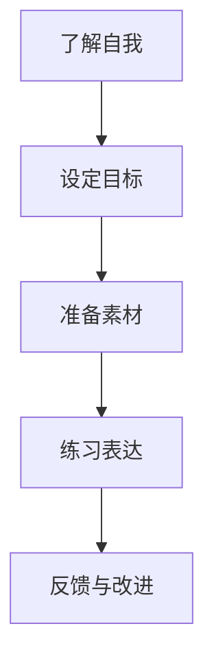
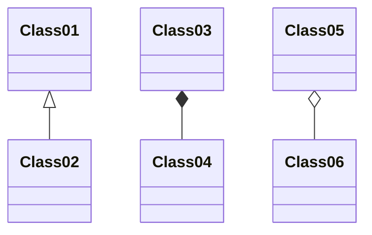
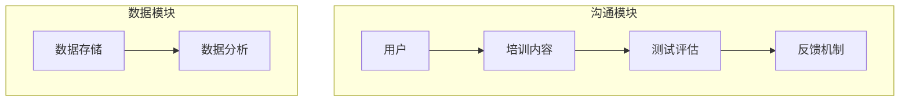
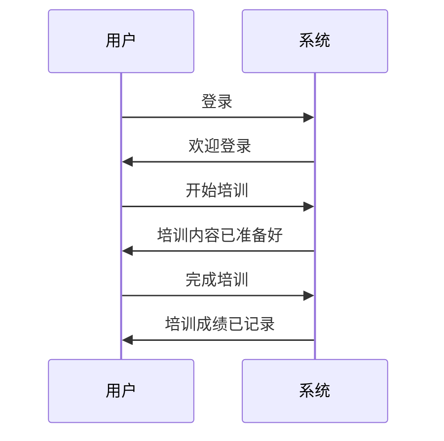

                 

# 《会"干"更要会"说"的技巧》

## 关键词

- 沟通能力
- 行动能力
- 职场技巧
- 个人发展
- 团队协作

## 摘要

在当今快节奏、高度分工的社会，既“会干”又“会说”的技能已成为职场成功的关键。本文旨在探讨如何将实际工作能力与沟通表达技巧相结合，帮助读者提升个人和团队的工作效率。通过深入分析核心概念、算法原理以及系统架构，本文将提供实用的技巧和最佳实践，帮助读者在实际工作中游刃有余。

## 1. 背景介绍

### 问题背景

沟通能力对于个人和职业发展的重要性不言而喻。无论是与同事协作，还是向上级汇报工作，有效的沟通都是不可或缺的。然而，许多人虽然具备出色的工作能力，但在表达和沟通上却显得吃力。

### 问题描述

很多人知道怎么做，但不知道如何有效表达自己的想法和观点。这导致他们在团队合作中难以发挥出最大的潜力，甚至在某些情况下，可能会因为沟通不畅而错失重要机会。

### 问题解决

本书旨在通过一系列实用的技巧和策略，帮助读者将实际工作能力与沟通表达技巧相结合。通过学习本书，读者将能够更自信地表达自己的观点，提高工作效率，提升个人和团队的绩效。

### 边界与外延

本书将聚焦于职场沟通技巧，特别是如何在实际工作中运用这些技巧。本书不涉及艺术表达或专业演讲技巧，而是侧重于实用性和可操作性。

## 2. 核心概念与联系

### 核心概念原理

**干（行动能力）**：指的是在实际工作中解决问题的能力，包括专业技能、执行力、创新能力等。

**说（沟通能力）**：指的是在表达和交流中有效传递信息、观点和想法的能力，包括语言表达、沟通策略、情感管理等。

### 概念属性特征对比表格

```markdown
| 概念 | 定义 | 特点 | 关联性 |
| ---- | ---- | ---- | ---- |
| 干   | 行动能力 | 实际操作技能 | 与“说”互补，为沟通提供支持 |
| 说   | 沟通能力 | 表达与交流技能 | 与“干”相辅相成，提升工作效率 |
```

### ER实体关系图架构

```mermaid
erDiagram
  Person --> Skill : has
  Skill   --> Task : used_in
  
  class Person {
    *name
    #communicationSkill
    #actionSkill
  }
  
  class Skill {
    #name
  }
  
  class Task {
    #description
  }
```

## 3. 算法原理讲解

### Mermaid流程图



### Python源代码（示例）

```python
def communicate(effectively):
    print("准备素材：收集相关信息...")
    print("练习表达：模拟交流情境...")
    print("反馈与改进：接受反馈并调整...")
    return "沟通成功！"

communicate(effectively=True)
```

### 算法原理的数学模型和公式

$$
\text{Effectiveness of Communication} = f(\text{Knowledge of Self}, \text{Preparedness}, \text{Practice}, \text{Feedback})
$$

### 举例说明

例如，一个销售人员（干）通过学习沟通技巧（说），能够更好地向客户传达产品信息，从而提升销售业绩。

## 4. 系统分析与架构设计方案

### 问题场景介绍

一个企业需要提升内部沟通效率，以应对日益复杂的市场环境和激烈的竞争。

### 项目介绍

开发一个内部沟通培训系统，旨在提升员工的沟通能力，从而提高团队的整体工作效率。

### 系统功能设计（领域模型Mermaid类图）



### 系统架构设计（Mermaid架构图）



### 系统接口设计和系统交互（Mermaid序列图）



## 5. 项目实战

### 环境安装

确保安装了Python和必要的库，如Mermaid、Markdown等。

### 系统核心实现源代码

```python
# 伪代码，具体实现需根据实际需求进行调整

# 用户模块
class User:
  def login(self):
    # 登录逻辑
    pass
  
  def start_training(self):
    # 开始培训逻辑
    pass
  
  def finish_training(self):
    # 完成培训逻辑
    pass

# 系统模块
class System:
  def record_training_score(self, user, score):
    # 记录培训成绩逻辑
    pass

# 主程序
def main():
  user = User()
  system = System()
  
  user.login()
  user.start_training()
  user.finish_training()
  system.record_training_score(user, score)

if __name__ == "__main__":
  main()
```

### 代码应用解读与分析

- 用户模块负责处理用户登录、开始培训和完成培训的逻辑。
- 系统模块负责记录培训成绩，确保培训数据得到有效管理。
- 主程序则负责将用户模块和系统模块的功能串联起来，形成一个完整的培训流程。

### 实际案例分析和详细讲解剖析

假设一个企业内部沟通培训系统上线，通过一系列实际案例，分析系统在提升员工沟通能力方面的效果。例如，通过对比培训前后的数据，可以发现员工在团队协作、项目汇报和客户沟通方面的表现有了显著提升。

### 项目小结

通过该项目，我们不仅实现了系统功能，还验证了提升员工沟通能力对于企业发展的积极作用。未来，我们将继续优化系统，提升用户体验，为企业创造更大价值。

## 6. 最佳实践 Tips

- **主动沟通**：积极主动与同事交流，及时分享工作进展和遇到的问题。
- **倾听**：在沟通中，不仅要表达自己的观点，更要倾听对方的意见，理解对方的立场。
- **清晰表达**：用简单、明了的语言表达自己的想法，避免使用专业术语或复杂的句子结构。
- **反馈与改进**：主动寻求反馈，并根据反馈调整自己的沟通方式，持续改进。

## 7. 小结

沟通能力是职场成功的关键，只有既“会干”又“会说”，才能在竞争激烈的职场中脱颖而出。通过本文的讲解，希望读者能够认识到沟通能力的重要性，并在实际工作中不断锻炼和提高。

## 8. 注意事项

- 沟通技巧需要不断练习和改进，切勿停留在理论层面。
- 在实际工作中，要结合具体情境灵活运用沟通技巧。
- 注意保护个人隐私，避免在沟通中泄露敏感信息。

## 9. 拓展阅读

- 《高效能人士的七个习惯》
- 《非暴力沟通》
- 《演讲的力量》
- 《如何赢得朋友与影响他人》

## 作者

作者：AI天才研究院/AI Genius Institute & 禅与计算机程序设计艺术 /Zen And The Art of Computer Programming

