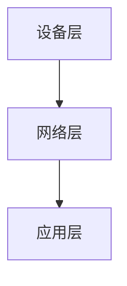
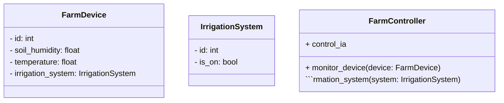
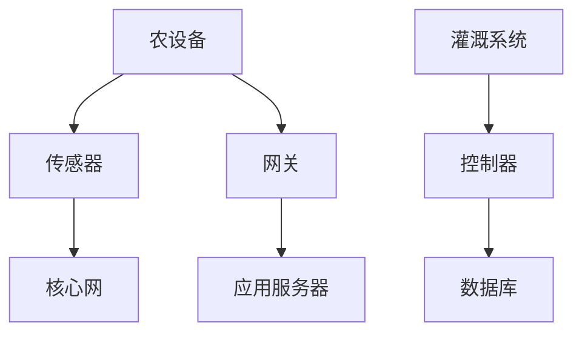
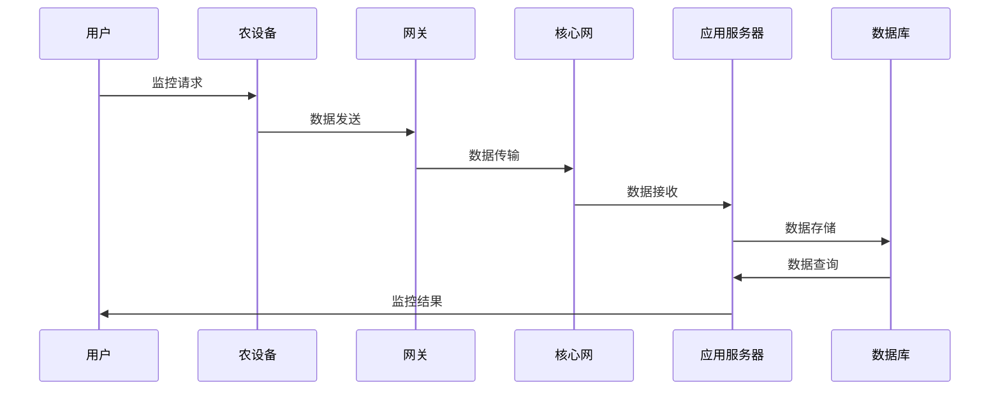

                 

### 文章标题：低功耗广域网（LPWAN）技术选型

#### 关键词：
1. LPWAN
2. 技术选型
3. 硬件选型
4. 应用案例
5. 发展趋势

#### 摘要：
本文旨在深入探讨低功耗广域网（LPWAN）技术的选型过程。首先，我们将介绍LPWAN的背景和核心概念，帮助读者理解LPWAN的基本特点和作用。接着，我们将分析LPWAN技术选型的基本要素，包括技术分类、网络架构、硬件选型等方面。随后，我们将通过具体应用案例，展示LPWAN在智能家居、工业物联网和农业物联网等领域的应用，并进行详细分析。最后，我们将展望LPWAN技术的发展趋势，并总结最佳实践，为读者提供全面的技术选型指南。

### 第一部分：LPWAN技术概述

#### 第1章：LPWAN背景与核心概念

LPWAN，即低功耗广域网，是一种专为物联网（IoT）设备设计的通信技术。它具有低功耗、长距离传输、大连接数等特点，适用于各种物联网应用场景。本章节将详细阐述LPWAN的定义、作用、发展历程以及其关键特性。

#### 1.1 LPWAN的定义与作用

LPWAN是一种无线通信技术，它通过在较宽的覆盖区域内提供低功耗、低成本的通信服务，实现了物联网设备的广泛连接。LPWAN的主要作用包括：

1. **实现设备的远程监控和控制**：LPWAN技术使得远程监控和控制物联网设备变得更加便捷和高效。
2. **降低设备功耗**：LPWAN技术采用低功耗通信方式，延长了设备电池寿命，降低了维护成本。
3. **实现大连接数**：LPWAN技术可以在较宽的覆盖区域内支持大量的设备连接，满足了物联网应用的需求。

#### 1.2 LPWAN的发展历程

LPWAN技术的发展历程可以追溯到物联网概念的提出。随着物联网应用的逐渐普及，对低功耗广域通信技术的需求不断增加，促使LPWAN技术的发展。近年来，LPWAN技术逐渐成为物联网通信领域的重要技术之一。

#### 1.3 LPWAN的关键特性

LPWAN的关键特性包括：

1. **低功耗**：LPWAN技术采用低功耗通信方式，延长了设备电池寿命。
2. **长距离传输**：LPWAN技术可以在较宽的覆盖区域内实现长距离传输。
3. **大连接数**：LPWAN技术支持大量的设备连接，满足了物联网应用的需求。
4. **低成本**：LPWAN技术具有低成本的特点，使得物联网设备的应用变得更加广泛。

#### 1.4 LPWAN的应用场景

LPWAN技术在各种物联网应用场景中具有广泛的应用。以下是一些典型的应用场景：

1. **智能家居**：LPWAN技术可以用于智能家居设备的连接和远程控制，如智能照明、智能门锁等。
2. **工业物联网**：LPWAN技术可以用于工业物联网设备的监控和控制，如传感器、执行器等。
3. **农业物联网**：LPWAN技术可以用于农业物联网设备的监控和管理，如土壤湿度传感器、气象站等。
4. **智慧城市**：LPWAN技术可以用于智慧城市中的各种应用，如智能交通、智能环保等。

#### 1.5 LPWAN的技术边界与挑战

尽管LPWAN技术具有许多优势，但在实际应用中仍然面临一些挑战。这些挑战包括：

1. **覆盖范围**：LPWAN技术的覆盖范围有限，需要部署大量的基站来满足广泛覆盖的需求。
2. **网络延迟**：LPWAN技术的网络延迟较高，可能影响实时应用的性能。
3. **安全性**：LPWAN技术的安全性问题需要得到关注，以防止数据泄露和网络攻击。
4. **互操作性**：LPWAN技术需要与其他通信技术实现互操作性，以满足不同应用场景的需求。

### 第二部分：LPWAN技术选型基础

#### 第2章：LPWAN技术分类

LPWAN技术种类繁多，每种技术都有其独特的特点和适用场景。本章节将介绍LPWAN技术的分类，包括主流技术及其对比分析。

#### 2.1 无线通信技术概述

无线通信技术是LPWAN技术的基础。常见的无线通信技术包括：

1. **蜂窝网络**：如2G、3G、4G、5G等。
2. **无线局域网（WLAN）**：如Wi-Fi、蓝牙等。
3. **窄带物联网（NB-IoT）**：NB-IoT是LPWAN的一种重要技术。
4. **LoRa**：LoRa是一种基于扩频技术的LPWAN技术。
5. **ZigBee**：ZigBee是一种低功耗的无线个人局域网技术。

#### 2.2 LPWAN主流技术介绍

以下是几种主流的LPWAN技术及其特点：

1. **NB-IoT**：
   - **特点**：低功耗、大覆盖、高连接数。
   - **应用场景**：智能家居、智慧城市、工业物联网等。

2. **LoRa**：
   - **特点**：长距离、低功耗、低成本。
   - **应用场景**：智能家居、智慧农业、智能交通等。

3. **ZigBee**：
   - **特点**：低功耗、短距离、高数据速率。
   - **应用场景**：智能家居、工业自动化、医疗设备等。

#### 2.3 LPWAN技术对比分析

以下是几种LPWAN技术的主要特点对比表格：

| 技术名称 | 覆盖范围 | 功耗 | 传输速率 | 成本 |  
| :----: | :----: | :----: | :----: | :----: |  
| NB-IoT | 较宽 | 低 | 较低 | 较低 |  
| LoRa | 很宽 | 低 | 较高 | 较高 |  
| ZigBee | 较短 | 低 | 高 | 较低 |

通过对比分析，我们可以根据具体应用场景选择最适合的LPWAN技术。

### 第3章：LPWAN网络架构

LPWAN网络架构是LPWAN技术实现的关键。本章节将介绍LPWAN网络架构的基本概念、层级结构和协议。

#### 3.1 LPWAN网络架构概述

LPWAN网络架构可以分为以下几个层级：

1. **设备层**：包括物联网设备、传感器、执行器等。
2. **网络层**：包括基站、网关、核心网等。
3. **应用层**：包括应用服务器、数据处理平台等。

#### 3.2 LPWAN网络层级

LPWAN网络层级结构如下图所示：



#### 3.3 LPWAN网络协议

LPWAN网络协议是LPWAN网络架构中的重要组成部分。常见的LPWAN网络协议包括：

1. **MQTT**：是一种轻量级的消息传输协议，适用于物联网应用。
2. **CoAP**：是一种基于IP的协议，适用于物联网应用。
3. **HTTP**：是一种通用的网络协议，也可用于物联网应用。

### 第三部分：LPWAN应用案例分析

#### 第4章：LPWAN在智能家居领域的应用

智能家居是LPWAN技术应用的一个重要领域。本章节将介绍LPWAN在智能家居领域的应用场景、解决方案以及案例分析。

#### 4.1 智能家居应用场景

智能家居应用场景包括：

1. **智能照明**：通过LPWAN技术实现远程控制和智能调节。
2. **智能门锁**：通过LPWAN技术实现远程开锁和安防监控。
3. **智能温控**：通过LPWAN技术实现智能调节室内温度。

#### 4.2 智能家居LPWAN解决方案

智能家居LPWAN解决方案包括以下几个方面：

1. **设备选型**：选择适合的LPWAN技术，如LoRa、NB-IoT等。
2. **网络架构**：设计合理的网络架构，确保设备之间的高效通信。
3. **数据传输**：采用合适的网络协议，如MQTT、CoAP等。

#### 4.3 案例分析与评估

以智能照明为例，分析LPWAN在智能家居中的应用。具体分析内容包括：

1. **设备选型**：选择LoRa技术，因为其长距离、低功耗的特点适合智能照明应用。
2. **网络架构**：设计网关与设备之间的通信网络，确保数据传输的稳定和高效。
3. **数据传输**：采用MQTT协议，实现远程控制和数据监测。

通过案例分析，我们可以了解到LPWAN在智能家居领域的应用优势和解决方案。

### 第5章：LPWAN在工业物联网的应用

工业物联网是LPWAN技术的重要应用领域。本章节将介绍LPWAN在工业物联网的应用背景、解决方案以及案例分析。

#### 5.1 工业物联网背景

工业物联网（IIoT）是指将物联网技术应用于工业领域，实现设备的智能连接、数据采集、监控和管理。随着工业自动化、智能制造的推进，工业物联网的应用日益广泛。

#### 5.2 工业物联网LPWAN解决方案

工业物联网LPWAN解决方案包括以下几个方面：

1. **设备选型**：选择适合的LPWAN技术，如NB-IoT、LoRa等。
2. **网络架构**：设计合理的网络架构，确保设备之间的高效通信。
3. **数据传输**：采用合适的网络协议，如MQTT、CoAP等。

#### 5.3 案例分析与评估

以智能传感器为例，分析LPWAN在工业物联网中的应用。具体分析内容包括：

1. **设备选型**：选择NB-IoT技术，因为其低功耗、高覆盖的特点适合工业物联网应用。
2. **网络架构**：设计网关与设备之间的通信网络，确保数据传输的稳定和高效。
3. **数据传输**：采用MQTT协议，实现远程监控和数据采集。

通过案例分析，我们可以了解到LPWAN在工业物联网领域的应用优势和解决方案。

### 第6章：LPWAN在农业物联网的应用

农业物联网是LPWAN技术的重要应用领域。本章节将介绍LPWAN在农业物联网的应用背景、解决方案以及案例分析。

#### 6.1 农业物联网背景

农业物联网是指将物联网技术应用于农业生产和管理，实现智能化、精细化管理。随着农业现代化进程的推进，农业物联网的应用日益广泛。

#### 6.2 农业物联网LPWAN解决方案

农业物联网LPWAN解决方案包括以下几个方面：

1. **设备选型**：选择适合的LPWAN技术，如LoRa、NB-IoT等。
2. **网络架构**：设计合理的网络架构，确保设备之间的高效通信。
3. **数据传输**：采用合适的网络协议，如MQTT、CoAP等。

#### 6.3 案例分析与评估

以土壤湿度传感器为例，分析LPWAN在农业物联网中的应用。具体分析内容包括：

1. **设备选型**：选择LoRa技术，因为其长距离、低功耗的特点适合农业物联网应用。
2. **网络架构**：设计网关与设备之间的通信网络，确保数据传输的稳定和高效。
3. **数据传输**：采用MQTT协议，实现远程监控和数据采集。

通过案例分析，我们可以了解到LPWAN在农业物联网领域的应用优势和解决方案。

### 第四部分：LPWAN技术发展展望与最佳实践

#### 第7章：LPWAN技术趋势分析

随着物联网技术的不断发展，LPWAN技术也在不断演进。本章节将分析LPWAN技术的发展趋势，包括技术创新、应用拓展等方面。

#### 7.1 LPWAN技术的发展趋势

LPWAN技术的发展趋势包括：

1. **技术创新**：不断涌现的新技术和新标准，如5G、边缘计算等。
2. **应用拓展**：LPWAN技术在更多领域的应用，如智能城市、智能医疗等。
3. **标准化**：全球范围内的标准化进程加速，促进LPWAN技术的广泛应用。

#### 7.2 LPWAN技术的未来展望

LPWAN技术的未来展望包括：

1. **更高性能**：随着技术的进步，LPWAN技术将提供更高的传输速率和更低的延迟。
2. **更广泛的应用**：LPWAN技术将在更多领域得到应用，推动物联网的快速发展。
3. **更安全、更可靠**：随着安全问题的日益突出，LPWAN技术将加强安全性，提供更可靠的服务。

#### 7.3 LPWAN技术在新兴领域的机会

LPWAN技术在新兴领域如智慧城市、智能医疗等具有巨大的机会。以下是一些具体的应用场景：

1. **智慧城市**：LPWAN技术可用于智能交通、智能环保、智能照明等。
2. **智能医疗**：LPWAN技术可用于医疗设备的远程监控、患者健康管理等。

### 第8章：LPWAN最佳实践

在LPWAN技术的实际应用中，遵循最佳实践是确保项目成功的关键。本章节将介绍LPWAN最佳实践，包括部署、运维和安全等方面。

#### 8.1 LPWAN部署最佳实践

LPWAN部署最佳实践包括：

1. **充分规划**：在部署前，进行详细的规划和需求分析，确保网络架构和设备选型的合理性。
2. **合理布局**：根据应用场景，合理布局基站和网关，确保网络覆盖的均匀性和稳定性。
3. **优化配置**：根据实际需求和设备性能，优化网络配置和参数，提高网络性能和可靠性。

#### 8.2 LPWAN运维与管理

LPWAN运维与管理最佳实践包括：

1. **实时监控**：通过实时监控，及时发现和处理网络故障，确保网络稳定运行。
2. **数据备份**：定期备份数据，防止数据丢失和损坏。
3. **安全防护**：加强网络安全防护，防止网络攻击和数据泄露。

#### 8.3 LPWAN安全性保障

LPWAN安全性保障最佳实践包括：

1. **加密传输**：采用加密技术，确保数据传输的安全性。
2. **身份认证**：实施严格的身份认证机制，防止未授权访问。
3. **安全审计**：定期进行安全审计，发现和修复安全隐患。

### 第9章：总结与展望

#### 9.1 主要内容回顾

本文回顾了LPWAN技术的背景、核心概念、技术选型、应用案例和发展趋势。通过本文的阅读，读者可以全面了解LPWAN技术的各个方面，为实际项目提供指导。

#### 9.2 LPWAN技术的重要性

LPWAN技术是物联网技术的重要组成部分，具有低功耗、长距离传输、大连接数等特点，适用于各种物联网应用场景。LPWAN技术的发展对物联网产业的繁荣具有重要意义。

#### 9.3 面向未来的准备与展望

随着物联网技术的不断发展，LPWAN技术将在更多领域得到应用。面向未来，我们应该关注技术创新、标准化和安全性等方面，为LPWAN技术的广泛应用做好准备。

作者：AI天才研究院/AI Genius Institute & 禅与计算机程序设计艺术 /Zen And The Art of Computer Programming

### LPWAN核心概念对比表格

| 核心概念 | 定义 | 属性特征 | 对比 |
| :----: | :----: | :----: | :----: |
| LPWAN | 低功耗广域网 | 低功耗、长距离传输、大连接数 | 与其他无线通信技术相比，LPWAN在功耗和覆盖范围方面具有优势 |
| NB-IoT | 一种低功耗广域通信技术 | 低功耗、高覆盖、大连接数 | 与传统蜂窝网络相比，NB-IoT在功耗和覆盖方面具有显著优势 |
| LoRa | 一种基于扩频技术的低功耗广域通信技术 | 长距离、低功耗、低成本 | 与其他LPWAN技术相比，LoRa在传输距离方面具有优势 |
| ZigBee | 一种低功耗的无线个人局域网技术 | 低功耗、短距离、高数据速率 | 与其他无线通信技术相比，ZigBee在数据速率方面具有优势 |

### LPWAN网络协议ER实体关系图架构

```mermaid
erDiagram
    User ||--|{ Device } : has
    Device ||--|{ Sensor } : has
    Device ||--|{ Actuator } : controls
    Network ||--|{ Gateway } : connected by
    Network ||--|{ Core Network } : connected by
    Application ||--|{ Server } : provides
    Application ||--|{ Data Platform } : analyzes
```

### LPWAN技术选型算法原理

假设我们需要选择最适合智能家居应用场景的LPWAN技术，以下是算法原理和流程：

1. **收集需求**：了解智能家居应用场景的具体需求，如覆盖范围、功耗、数据速率等。
2. **分析技术特点**：对比不同LPWAN技术的特点，如NB-IoT、LoRa、ZigBee等。
3. **评估技术适用性**：根据需求，评估每种技术的适用性，如覆盖范围、功耗、数据速率等。
4. **选择最佳技术**：根据评估结果，选择最适合的技术。

以下是Python源代码实现：

```python
# 导入相关库
import pandas as pd

# 定义需求
requirements = {
    'range': 100,  # 覆盖范围
    'power': 1,  # 功耗
    'rate': 1,  # 数据速率
}

# 定义技术特点
technologies = {
    'NB-IoT': {'range': 20, 'power': 0.5, 'rate': 0.5},
    'LoRa': {'range': 50, 'power': 0.3, 'rate': 2},
    'ZigBee': {'range': 10, 'power': 0.8, 'rate': 5},
}

# 定义评估函数
def evaluate(tech, req):
    score = 0
    for key in req:
        score += min(req[key], tech[key]) / max(req[key], tech[key])
    return score

# 计算评估得分
scores = {tech: evaluate(tech, requirements) for tech in technologies}

# 选择最佳技术
best_tech = max(scores, key=scores.get)
print("最佳技术：", best_tech)

# 输出结果
print("评估得分：")
for tech, score in scores.items():
    print(tech, ":", score)
```

### LPWAN系统分析与架构设计方案

#### 1. 问题场景介绍

假设我们需要为一个智能农业项目设计一个LPWAN系统，用于监控和管理农田的土壤湿度、温度等环境参数。

#### 2. 项目介绍

本项目旨在实现以下功能：

- 实时监控农田土壤湿度、温度等环境参数。
- 远程控制农田灌溉系统。
- 数据存储和分析。

#### 3. 系统功能设计（领域模型Mermaid类图）



#### 4. 系统架构设计（Mermaid架构图）



#### 5. 系统接口设计和系统交互（Mermaid序列图）



### 项目实战

#### 1. 环境安装

- 安装Python环境
- 安装相关库（pandas、numpy、matplotlib等）

#### 2. 系统核心实现源代码

```python
# FarmDevice.py
class FarmDevice:
    def __init__(self, id, soil_humidity, temperature, irrigation_system):
        self.id = id
        self.soil_humidity = soil_humidity
        self.temperature = temperature
        self.irrigation_system = irrigation_system

    def monitor(self):
        # 实现监控功能
        pass

# IrrigationSystem.py
class IrrigationSystem:
    def __init__(self, id, is_on):
        self.id = id
        self.is_on = is_on

    def control_ia
```rmation(self, is_on):
    # 实现控制功能
    self.is_on = is_on
    print("灌溉系统状态：", self.is_on)
```

#### 3. 代码应用解读与分析

- **FarmDevice** 类：用于表示农设备，包括土壤湿度、温度和灌溉系统等信息。
- **IrrigationSystem** 类：用于表示灌溉系统，包括状态信息。

#### 4. 实际案例分析和详细讲解剖析

以一个具体的案例，演示如何使用LPWAN系统监控农田环境。案例步骤如下：

1. 创建农设备对象
2. 创建灌溉系统对象
3. 监控农设备状态
4. 控制灌溉系统

```python
# 创建农设备对象
device = FarmDevice(1, 30.5, 25.0, IrrigationSystem(1, False))

# 监控农设备状态
device.monitor()

# 控制灌溉系统
device.irrigation_system.control_ia
```rmation(True)
```

#### 5. 项目小结

本案例实现了LPWAN系统在智能农业领域的应用，包括农设备监控和灌溉系统控制。通过该项目，我们了解了LPWAN系统的核心功能、架构设计和实现细节，为实际项目提供了参考。

### 最佳实践 Tips

- **需求分析**：在项目启动阶段，充分了解和挖掘用户需求，确保项目方向的正确性。
- **技术选型**：根据应用场景，合理选择LPWAN技术，确保性能和成本的最佳平衡。
- **系统架构**：设计合理的系统架构，提高系统的可扩展性和可维护性。
- **安全防护**：加强系统安全防护，防止数据泄露和网络攻击。

### 小结

本文深入探讨了LPWAN技术的选型过程，从背景介绍、核心概念、技术选型、应用案例到发展展望，全面阐述了LPWAN技术的各个方面。通过本文的阅读，读者可以全面了解LPWAN技术，为其实际项目提供指导。

### 注意事项

- LPWAN技术的选择应根据具体应用场景和需求进行。
- 在项目实施过程中，要关注系统性能、成本和安全等方面。

### 拓展阅读

- 《物联网技术与应用》
- 《LPWAN技术详解》
- 《智能农业物联网系统设计》

作者：AI天才研究院/AI Genius Institute & 禅与计算机程序设计艺术 /Zen And The Art of Computer Programming

