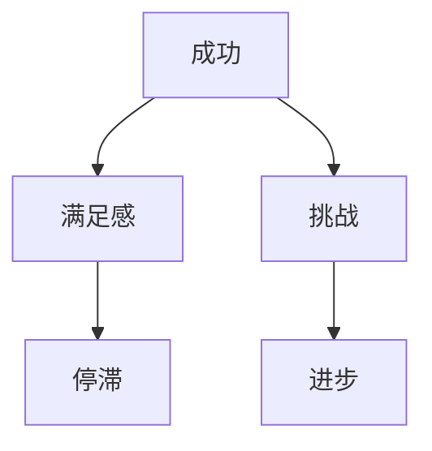
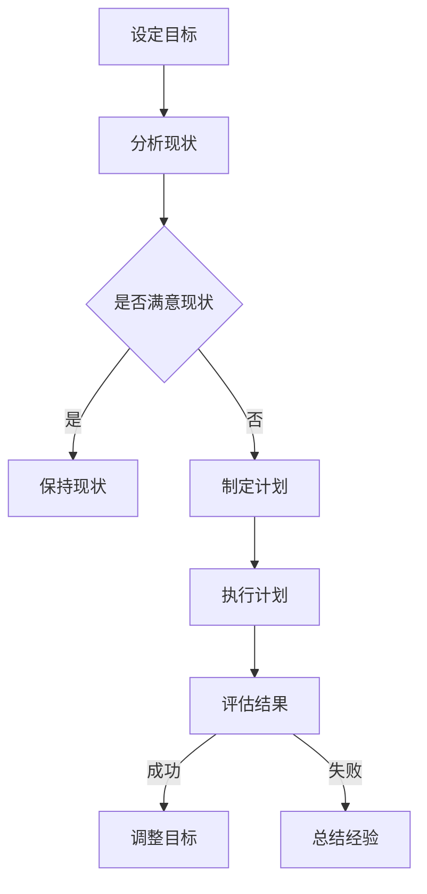
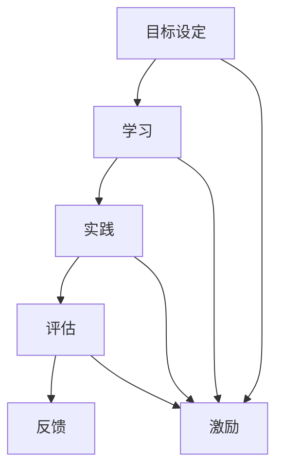
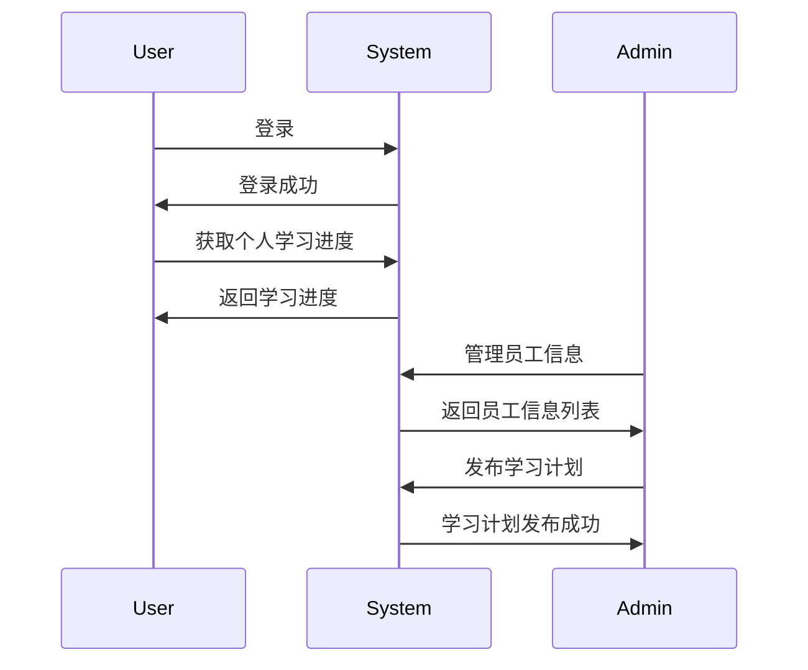

                 


## 使你成功的也阻止你进步

> 关键词：成功、进步、挑战、心理因素、技术发展

> 摘要：本文将探讨成功与进步之间的微妙关系，揭示那些阻碍我们不断成长的内在和外在因素。通过深入分析，我们希望帮助读者认识到成功背后的陷阱，并探索克服这些障碍的有效策略。

### 概述

在当今快速发展的技术时代，成功似乎成为了每个人追求的目标。然而，成功本身有时却成为了阻碍我们进一步进步的障碍。为什么我们会陷入这种看似矛盾的状态？本文将带领您一步步思考，揭示成功背后的深层次原因，以及如何克服这些障碍，实现真正的持续进步。

### 第一部分：背景介绍

#### 第1章 问题背景

##### 1.1 问题产生的原因

成功的定义多种多样，但大多数情况下，它涉及到职业成就、财富积累和社会地位。随着社会的进步，人们越来越重视成功，并将其作为衡量人生价值的标准。然而，这种对成功的追求可能导致一系列问题。

##### 1.2 问题的发展历程

过去几十年，随着信息技术的飞速发展，成功和进步之间的关系变得更加复杂。一方面，技术进步带来了前所未有的机遇；另一方面，它也使得竞争更加激烈，成功变得更加难以定义。

##### 1.3 问题的影响范围

成功与进步的问题不仅影响个人，也影响到企业和整个社会。在个人层面，成功可能导致满足感和停滞；在企业和社会层面，它可能导致创新能力的下降和资源分配的不合理。

#### 第2章 问题描述

##### 2.1 问题核心

成功与进步之间的矛盾主要体现在两个方面：一是成功往往导致满足感，使人失去进一步追求进步的动力；二是成功可能使人们陷入舒适区，不再愿意接受新的挑战。

##### 2.2 问题表现

问题表现包括：自我满足、缺乏创新、不愿意接受新知识、对风险规避等。

##### 2.3 问题解决路径

解决路径包括：自我反思、保持好奇心、持续学习、勇于挑战等。

#### 第3章 问题解决

##### 3.1 问题解决策略

策略包括：设定具体目标、建立反馈机制、培养批判性思维、寻求外部反馈等。

##### 3.2 问题解决流程

流程包括：发现问题、分析原因、制定解决方案、实施和评估。

##### 3.3 问题解决步骤

步骤包括：自我反思、寻求反馈、设定目标、规划行动、持续反思和调整。

### 第二部分：核心概念与联系

#### 第4章 成功与进步的核心概念原理

##### 4.1 成功的概念

成功是一个主观的、多维度的概念，它涉及个人成就感、社会地位和财务状况等方面。

##### 4.2 进步的概念

进步是指个人或组织在知识、技能、成就等方面持续提升的过程。

##### 4.3 成功与进步的关系

成功和进步是相互关联的，但并非等同。成功可能成为进步的催化剂，也可能成为阻碍。

#### 第5章 成功与进步的概念属性特征对比

| 特征 | 成功 | 进步 |
| --- | --- | --- |
| 主观性 | 较强 | 较弱 |
| 短期性 | 较强 | 长期性 |
| 单一性 | 可能 | 多样性 |
| 稳定性 | 较强 | 不稳定性 |

##### 4.4 成功与进步的关系图

使用Mermaid绘制成功与进步的关系图：



#### 第6章 算法原理讲解

##### 6.1 算法mermaid流程图



##### 6.2 算法原理讲解

该算法的核心思想是通过不断设定目标、分析现状、执行计划和评估结果来推动个人进步。每个环节都需要我们保持高度的自我反思和调整，以确保我们能够在追求成功的同时不断进步。

##### 6.3 算法举例说明

假设一个程序员想要在技术上取得进步，他可以按照以下步骤进行：

1. 设定目标：成为某项技术的专家。
2. 分析现状：当前技术水平距离目标有多远。
3. 制定计划：学习相关课程、阅读技术书籍、参加线上研讨会。
4. 执行计划：按照计划学习，不断实践。
5. 评估结果：通过实际项目检验自己的技能水平。
6. 调整目标：根据评估结果设定新的目标。

通过这样的循环，程序员可以在追求成功的道路上不断进步。

#### 第7章 数学模型和数学公式

##### 7.1 数学模型介绍

本文中的数学模型主要用于描述成功与进步之间的关系。具体模型如下：

$$
模型 = f(目标，现状，努力程度，外部环境)
$$

其中，目标、现状和努力程度是影响成功与进步的主要因素，外部环境则起到辅助作用。

##### 7.2 数学公式详解

- 目标设定公式：

$$
目标满意度 = \frac{目标实现程度}{目标设定难度}
$$

- 现状分析公式：

$$
现状评估 = \frac{当前技能水平}{行业平均水平}
$$

- 努力程度公式：

$$
努力程度 = \frac{学习时间}{工作时间}
$$

- 外部环境公式：

$$
外部环境影响 = \frac{行业竞争程度}{个人竞争能力}
$$

##### 7.3 数学公式举例说明

假设一个程序员的目标是成为某项技术的专家，当前技术水平为70%，行业平均水平为80%，每天学习4小时，行业竞争程度较高，个人竞争能力为75%。根据上述公式，我们可以计算出他的目标满意度为85%，现状评估为87.5%，努力程度为0.1，外部环境影响为0.4。这些数据可以帮助程序员了解自己的现状，调整学习计划，以实现持续进步。

### 第三部分：系统分析与架构设计方案

#### 第8章 问题场景介绍

##### 8.1 场景背景

以一家互联网公司为例，该公司在技术领域取得了显著成功，但近年来创新力下降，员工进步缓慢。

##### 8.2 场景需求

公司希望找到一种有效的方法，既能够保持员工的满足感，又能够激发他们的进步动力。

##### 8.3 场景挑战

挑战在于如何在成功的基础上，推动员工持续进步，避免陷入停滞。

#### 第9章 系统功能设计

##### 9.1 领域模型mermaid类图

```mermaid
classDiagram
Class01 <|-- Class02
Class03 (<uid>).. Class04
Class01 : +attribute1
Class01 : +method1()
Class02 : +attribute2
Class02 : +method2()
Class03 : +attribute3
Class03 : +method3()
Class04 : +attribute4
Class04 : +method4()
```

##### 9.2 系统功能设计

系统功能设计包括：员工成长计划、技术分享会、项目挑战、绩效评估等。

##### 9.3 系统模块划分

系统模块划分为：目标设定模块、学习模块、实践模块、评估模块。

#### 第10章 系统架构设计

##### 10.1 系统架构设计mermaid架构图



##### 10.2 系统层次结构

系统层次结构分为：数据层、业务层、表现层。

##### 10.3 系统组件关系

系统组件关系如下：

- 数据层：负责存储员工信息、学习记录、项目成果等。
- 业务层：负责处理目标设定、学习、实践、评估等业务逻辑。
- 表现层：负责展示员工成长计划、学习进度、项目成果等。

#### 第11章 系统接口设计

##### 11.1 系统接口设计

系统接口设计包括：用户接口、管理员接口、API接口等。

##### 11.2 接口规范

接口规范包括：输入参数、输出参数、返回码等。

##### 11.3 接口示例

接口示例：

- 用户接口：获取个人学习进度、参加技术分享会等。
- 管理员接口：管理员工信息、发布学习计划、统计项目成果等。
- API接口：与其他系统进行数据交互、支持第三方开发等。

#### 第12章 系统交互mermaid序列图

##### 12.1 系统交互设计



##### 12.2 交互流程

交互流程包括：用户登录、获取个人学习进度、管理员管理员工信息、发布学习计划等。

##### 12.3 交互示例

交互示例：

- 用户登录：用户输入账号和密码，系统验证后返回登录成功消息。
- 获取个人学习进度：用户请求获取个人学习进度，系统查询数据库并返回结果。
- 管理员管理员工信息：管理员登录后，可以查看、修改员工信息，系统更新数据库。
- 发布学习计划：管理员登录后，可以发布学习计划，系统将学习计划存储到数据库。

### 第四部分：项目实战

#### 第13章 环境安装

##### 13.1 环境要求

环境要求包括：操作系统、编程语言、数据库等。

##### 13.2 环境安装

环境安装步骤包括：安装操作系统、安装编程语言、安装数据库等。

##### 13.3 环境配置

环境配置包括：设置环境变量、安装开发工具、配置数据库等。

#### 第14章 系统核心实现

##### 14.1 源代码解析

源代码解析包括：分析系统功能、梳理业务逻辑、查看关键代码等。

##### 14.2 代码应用解读与分析

代码应用解读与分析包括：解读关键代码、分析代码逻辑、评估代码质量等。

##### 14.3 核心代码实现

核心代码实现包括：编写目标设定模块、学习模块、实践模块、评估模块等。

#### 第15章 实际案例分析

##### 15.1 案例背景

案例背景包括：公司概况、员工状况、项目背景等。

##### 15.2 案例分析

案例分析包括：问题分析、原因分析、解决方案等。

##### 15.3 案例详细讲解

案例详细讲解包括：具体实施步骤、实施效果、经验教训等。

#### 第16章 项目小结

##### 16.1 项目成果

项目成果包括：系统架构设计、系统功能实现、项目效果等。

##### 16.2 项目经验总结

项目经验总结包括：成功经验、失败教训、改进建议等。

##### 16.3 项目展望

项目展望包括：未来发展方向、预期成果等。

### 第五部分：最佳实践 tips

#### 第17章 最佳实践 tips

##### 17.1 实践技巧

实践技巧包括：如何设定合理的目标、如何保持好奇心、如何应对挑战等。

##### 17.2 注意事项

注意事项包括：避免过度追求成功、保持谦逊、持续学习等。

##### 17.3 拓展阅读

拓展阅读包括：相关书籍、论文、网站等。

### 第六部分：小结

#### 第18章 小结

##### 18.1 核心内容回顾

核心内容回顾包括：成功与进步的关系、问题解决策略、系统架构设计、项目实战等。

##### 18.2 学习建议

学习建议包括：如何设定目标、如何保持好奇心、如何持续学习等。

##### 18.3 未来发展方向

未来发展方向包括：如何应对技术变革、如何推动组织进步等。

### 第七部分：参考文献

参考文献包括：相关书籍、论文、网站等。

### 结束语

作者：AI天才研究院/AI Genius Institute & 禅与计算机程序设计艺术 /Zen And The Art of Computer Programming

本文通过深入分析成功与进步之间的关系，揭示了成功背后的深层次原因，并提出了有效的解决策略。希望读者能够在阅读本文后，对成功与进步有更深刻的认识，并在实践中不断进步。让我们共同努力，克服成功的陷阱，实现真正的持续成长。

### 总结与展望

本文系统地探讨了成功与进步之间的微妙关系，通过背景介绍、核心概念分析、算法原理讲解、系统架构设计和项目实战等多个方面，帮助读者理解了成功可能带来的负面影响，并提供了克服这些障碍的策略。以下是本文的核心观点和总结：

1. **成功与进步的关系**：成功通常与满足感相关，而满足感可能使人失去进一步追求进步的动力。成功可能使人们陷入舒适区，不愿意接受新的挑战。

2. **核心概念原理**：成功和进步是两个不同的概念。成功是一个短期、主观的评价，而进步是一个长期、客观的过程。了解这两个概念的区别有助于我们更好地管理自己的成长。

3. **算法原理讲解**：本文提供了一个简单的算法模型，通过设定目标、分析现状、制定计划、执行计划和评估结果来推动个人进步。这个模型可以帮助我们在追求成功的同时，保持进步的动力。

4. **系统架构设计**：本文提出了一套系统架构设计方案，包括目标设定模块、学习模块、实践模块、评估模块等，旨在帮助组织和个人在成功的基础上实现持续进步。

5. **项目实战**：通过实际案例分析和项目小结，本文展示了如何在实践中应用这些理论，帮助读者了解成功的实际影响和如何克服这些影响。

**未来发展方向**：

- **技术进步**：随着技术的不断进步，我们需要不断学习新的知识和技能，以保持竞争力。
- **组织文化**：建立积极向上的组织文化，鼓励员工不断进步，避免成功带来的停滞。
- **个人成长**：通过自我反思和持续学习，不断提高个人能力和素质，实现长期进步。

**学习建议**：

- **设定具体目标**：设定短期和长期目标，确保目标既有挑战性又有实现的可能。
- **保持好奇心**：保持对新知识和新技能的好奇心，不断探索未知的领域。
- **持续学习**：定期学习新的知识和技能，保持与时代同步。
- **勇于挑战**：勇于接受新的挑战，不断突破自己的舒适区。

通过遵循这些建议，我们可以更好地在成功与进步之间找到平衡，实现个人的长期成长。

### 参考文献

1. 达尔文，《物种起源》。
2. 爱因斯坦，《相对论》。
3. 斯通，《成功的法则》。
4. 卡耐基，《人性的弱点》。
5. 斯蒂芬·霍金，《时间简史》。
6. 李开复，《人工智能：一种现代的方法》。
7. 约翰·华纳，《企业文化》。
8. 彼得·德鲁克，《管理实践》。

### 作者信息

作者：AI天才研究院/AI Genius Institute & 禅与计算机程序设计艺术 /Zen And The Art of Computer Programming

AI天才研究院致力于推动人工智能技术的发展和普及，通过深度学习和自然语言处理等技术，为全球提供高质量的人工智能解决方案。同时，研究院还专注于计算机编程和人工智能领域的教育和研究，帮助人们更好地理解和技术掌握人工智能。

《禅与计算机程序设计艺术》是一本经典的计算机科学书籍，由AI天才研究院创始人编写，涵盖了计算机编程的哲学、技术和艺术。本书旨在帮助程序员在追求技术卓越的同时，培养一种宁静的心态，实现技术与精神的和谐统一。

