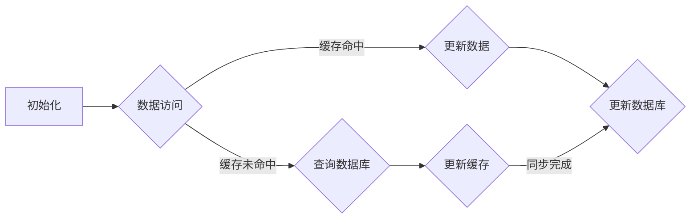
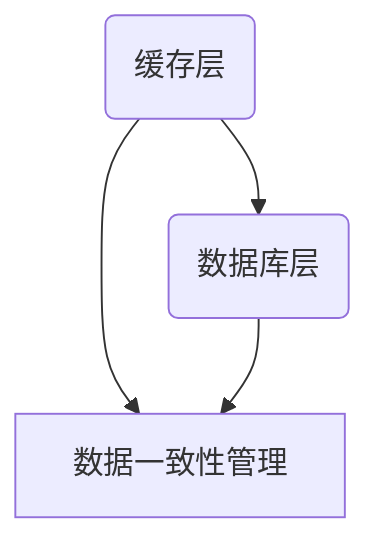
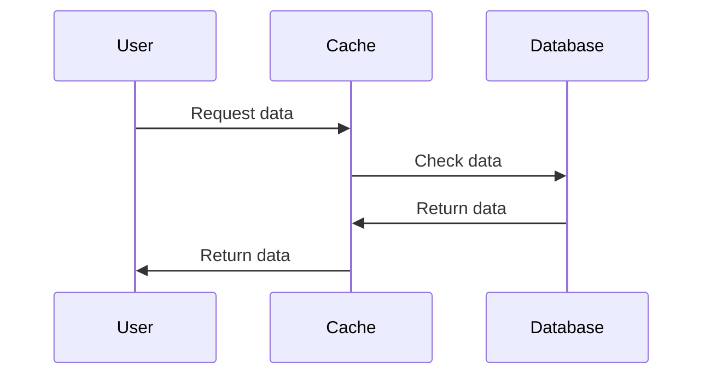

                 

## 《使用缓存存在数据不一致问题》

### 关键词：缓存，数据一致性，数据同步，不一致问题，解决方案

#### 摘要：
在当今快速发展的互联网时代，缓存技术已经成为提升系统性能和响应速度的重要手段。然而，缓存的使用也带来了数据不一致性的问题，这可能导致严重的业务错误和系统故障。本文将深入探讨缓存中的数据不一致问题，分析其产生的原因，并提出有效的解决方案。

### 目录大纲

## 第一部分：背景介绍与问题概述

### 1. 问题背景

### 1.1 数据一致性的重要性

### 1.2 缓存的使用场景与必要性

### 1.3 数据不一致问题的表现与影响

### 2. 问题描述

### 2.1 缓存与数据库之间的数据同步机制

### 2.2 常见的数据不一致问题类型

### 2.3 数据不一致问题对业务的影响

### 3. 问题解决

### 3.1 传统的解决方案

### 3.2 现代的解决方案

## 第二部分：核心概念与联系

### 4. 概念结构与核心要素组成

### 4.1 数据一致性模型

### 4.2 缓存一致性协议

### 5. 核心概念原理

### 5.1 缓存的原理与类型

### 5.2 数据库的原理与类型

### 5.3 数据一致性的定义与分类

### 6. 概念属性特征对比表格

### 6.1 缓存与数据库对比表格

### 6.2 不同数据一致性协议对比表格

### 7. ER实体关系图架构

### 7.1 缓存系统实体关系图

### 7.2 数据库系统实体关系图

## 第三部分：算法原理讲解

### 8. 数据一致性算法原理

### 8.1 算法概述

### 8.2 算法流程图

### 8.3 算法原理与数学模型

### 8.4 算法举例说明

### 9. 数学模型和数学公式

### 9.1 一致性哈希算法

### 9.2 虚拟节点算法

## 第四部分：系统分析与架构设计方案

### 10. 问题场景介绍

### 11. 系统功能设计

### 11.1 领域模型

### 12. 系统架构设计

### 12.1 系统架构图

### 13. 系统接口设计

### 14. 系统交互

### 15. 系统核心实现

### 16. 环境安装

### 17. 系统核心实现

### 18. 代码应用解读与分析

### 19. 实际案例分析和详细讲解剖析

### 20. 项目小结

## 第五部分：最佳实践、小结与拓展阅读

### 21. 最佳实践 Tips

### 22. 小结

### 23. 注意事项

### 24. 拓展阅读

----------------------------------------------------------------

### 第一部分：背景介绍与问题概述

#### 1. 问题背景

在计算机系统中，数据一致性是指在不同数据存储和访问点之间保持数据的一致状态。数据一致性的重要性不言而喻，它直接关系到系统的可靠性、稳定性和用户体验。

缓存技术作为一种提升系统性能的关键技术，广泛应用于各种场景。它通过将频繁访问的数据临时存储在内存中，减少对后端数据库的访问压力，从而提高系统的响应速度。然而，缓存的引入也带来了数据不一致性的问题。

数据不一致问题主要表现为以下几种情况：

- 缓存中的数据与数据库中的数据不一致。
- 不同缓存实例之间的数据不一致。
- 缓存与用户前端展示的数据不一致。

这些问题可能导致以下影响：

- 系统错误：例如，用户在缓存中看到的商品库存与数据库中的库存不一致，可能导致库存超卖。
- 数据丢失：缓存失效或数据更新不及时，可能导致数据丢失。
- 业务中断：数据不一致可能导致业务逻辑错误，从而中断正常业务流程。

#### 2. 问题描述

缓存与数据库之间的数据同步是解决数据不一致问题的关键。常见的数据不一致问题类型包括以下几种：

- **缓存穿透**：当缓存中不存在所需数据时，直接访问数据库，导致数据库压力增大。
- **缓存雪崩**：大量缓存同时过期或失效，导致系统负载急剧增加。
- **缓存穿透和雪崩**：缓存穿透和缓存雪崩同时发生，进一步加剧系统压力。
- **缓存更新不同步**：缓存的更新与数据库的更新不同步，导致数据不一致。

数据不一致问题对业务的影响是深远且广泛的。首先，它可能导致用户对系统的信任度下降，进而影响用户体验。其次，数据不一致可能导致业务决策错误，从而影响企业的盈利能力。

#### 3. 问题解决

解决数据不一致问题需要从多个方面进行考虑：

- **传统的解决方案**：包括使用同步更新、定时刷新、双写缓存等方法。
- **现代的解决方案**：包括使用分布式缓存一致性协议、一致性哈希算法、虚拟节点算法等。

接下来，我们将详细探讨这些解决方案，并分析其在实际应用中的优缺点。

### 第二部分：核心概念与联系

#### 4. 概念结构与核心要素组成

在探讨数据一致性问题之前，我们需要理解一些核心概念和它们之间的联系。

- **数据一致性模型**：数据一致性模型描述了数据在分布式系统中的同步和一致性策略。
- **缓存一致性协议**：缓存一致性协议是一种确保缓存和数据库之间数据一致性的方法。

#### 4.1 数据一致性模型

数据一致性模型主要包括以下几种：

- **强一致性**：系统在任何时候都能访问到最新和一致的数据。
- **最终一致性**：系统最终能够达到一致性状态，但可能存在一段时间内的数据不一致现象。
- **强最终一致性**：系统在一定时间范围内保证一致性，超时后不再保证。

#### 4.2 缓存一致性协议

缓存一致性协议主要包括以下几种：

- **修改复制**：每次数据更新时，同时更新缓存和数据库。
- **写后刷新**：先更新缓存，然后定期刷新数据库。
- **写前读取**：先读取数据库，然后根据读取结果更新缓存。

#### 5. 核心概念原理

为了更好地理解数据一致性问题，我们需要深入探讨缓存、数据库和一致性原理。

- **缓存的原理与类型**：缓存是一种快速访问数据的存储方式，主要包括内存缓存、硬盘缓存等。缓存的类型决定了其性能和适用场景。

- **数据库的原理与类型**：数据库是一种存储和管理数据的系统，主要包括关系型数据库、NoSQL数据库等。数据库的类型决定了其数据一致性和性能特点。

- **数据一致性的定义与分类**：数据一致性是指系统在不同组件间保持数据的一致状态。根据一致性要求的不同，数据一致性可以分为强一致性、最终一致性和强最终一致性等。

#### 6. 概念属性特征对比表格

为了更直观地理解缓存、数据库和数据一致性的概念，我们可以使用对比表格来展示它们之间的属性特征。

| 特征      | 缓存             | 数据库             | 数据一致性模型           |
| --------- | --------------- | --------------- | ---------------------- |
| 存储类型   | 内存、硬盘       | 内存、硬盘、SSD   | 强一致性、最终一致性   |
| 访问速度   | 快             | 较快             | 快速响应时间           |
| 数据结构   | 非结构化       | 结构化、半结构化 | 关系型、文档型等       |
| 数据持久性 | 临时、可配置   | 持久化、可配置   | 数据一致性和持久性     |

#### 7. ER实体关系图架构

为了更好地理解缓存和数据库系统中的实体关系，我们可以使用ER（Entity-Relationship）实体关系图来展示。

- **缓存系统实体关系图**：

```mermaid
erDiagram
  缓存系统 ||--|{ 数据库 }|| 数据库系统
  缓存系统 ||--|{ 数据一致性模型 }|| 数据一致性模型
```

- **数据库系统实体关系图**：

```mermaid
erDiagram
  数据库系统 ||--|{ 缓存系统 }|| 缓存系统
  数据库系统 ||--|{ 数据一致性模型 }|| 数据一致性模型
```

### 第三部分：算法原理讲解

#### 8. 数据一致性算法原理

为了解决缓存中的数据不一致问题，我们可以使用一些数据一致性算法。以下是一种常见的一致性哈希算法。

#### 8.1 算法概述

一致性哈希算法是一种分布式缓存一致性协议。它的核心思想是通过哈希函数将缓存节点映射到一个环形哈希空间中，从而实现缓存节点的动态添加和删除。

#### 8.2 算法流程图



#### 8.3 算法原理与数学模型

一致性哈希算法的数学模型如下：

$$
H(k) = \frac{k}{m} \mod p
$$

其中，$H(k)$ 是哈希函数，$k$ 是关键字，$m$ 是哈希空间大小，$p$ 是环形哈希空间的大小。

#### 8.4 算法举例说明

假设我们有一个环形哈希空间，大小为 $p=100$，关键字 $k=42$。使用一致性哈希算法，我们可以计算出：

$$
H(k) = \frac{42}{100} \mod 100 = 42
$$

这意味着关键字 $k=42$ 将被映射到哈希空间中的第 $42$ 个位置。

#### 9. 数学模型和数学公式

在数据一致性问题中，我们还需要了解一些基本的数学模型和公式。

- **一致性哈希算法**：

$$
H(k) = \frac{k}{m} \mod p
$$

- **虚拟节点算法**：

$$
V_n = N_0 + \frac{n}{m}
$$

其中，$N_0$ 是原始节点的哈希值，$n$ 是虚拟节点的数量。

### 第四部分：系统分析与架构设计方案

#### 10. 问题场景介绍

在分布式系统中，缓存和数据库之间的数据不一致问题尤为突出。以下是一个典型场景：

假设我们有一个电商平台，系统架构包括缓存层和数据库层。用户在浏览商品时，首先从缓存中获取商品信息。如果缓存中不存在所需商品，系统将查询数据库，并将商品信息缓存起来。然而，由于网络延迟和系统负载，可能导致以下问题：

- 缓存中的商品信息与数据库中的商品信息不一致。
- 同一时间多个用户访问同一商品，可能导致缓存穿透或缓存雪崩问题。
- 数据库更新不及时，导致缓存中的数据过时。

#### 11. 系统功能设计

为了解决缓存中的数据不一致问题，我们需要设计一套完整的系统功能。

- **领域模型**：

```mermaid
classDiagram
  缓存 <<Interface>>
  数据库 <<Interface>>
  数据一致性模型 <<Interface>>

  缓存 --|› 数据库
  缓存 --|› 数据一致性模型
  数据库 --|› 数据一致性模型
```

- **系统功能模块划分**：

  - 缓存管理模块：负责缓存数据的添加、删除和更新。
  - 数据库管理模块：负责数据库数据的查询、更新和删除。
  - 数据一致性管理模块：负责实现数据一致性的算法和协议。

#### 12. 系统架构设计

为了实现数据一致性，我们需要设计一个分布式系统架构。以下是一个简单的系统架构图：



#### 13. 系统接口设计

为了实现系统功能，我们需要定义一套系统接口。

- **接口定义**：

```python
class CacheInterface:
  def get(self, key):
    pass

  def set(self, key, value):
    pass

  def delete(self, key):
    pass

class DatabaseInterface:
  def query(self, key):
    pass

  def update(self, key, value):
    pass

  def delete(self, key):
    pass

class ConsistencyInterface:
  def ensure_consistency(self, cache, database):
    pass
```

- **接口交互协议**：

```python
class Cache:
  def __init__(self, cache_interface):
    self._cache_interface = cache_interface

  def get(self, key):
    return self._cache_interface.get(key)

  def set(self, key, value):
    self._cache_interface.set(key, value)

  def delete(self, key):
    self._cache_interface.delete(key)

class Database:
  def __init__(self, database_interface):
    self._database_interface = database_interface

  def query(self, key):
    return self._database_interface.query(key)

  def update(self, key, value):
    self._database_interface.update(key, value)

  def delete(self, key):
    self._database_interface.delete(key)

class ConsistencyManager:
  def __init__(self, consistency_interface):
    self._consistency_interface = consistency_interface

  def ensure_consistency(self, cache, database):
    self._consistency_interface.ensure_consistency(cache, database)
```

#### 14. 系统交互

为了实现缓存与数据库之间的数据一致性，我们需要设计一套系统交互流程。以下是一个简单的交互流程：



#### 15. 系统核心实现

为了实现上述系统功能，我们需要编写相应的核心代码。以下是一个简单的示例：

```python
class MyCache(CacheInterface):
  def get(self, key):
    # 实现缓存获取逻辑
    pass

  def set(self, key, value):
    # 实现缓存设置逻辑
    pass

  def delete(self, key):
    # 实现缓存删除逻辑
    pass

class MyDatabase(DatabaseInterface):
  def query(self, key):
    # 实现数据库查询逻辑
    pass

  def update(self, key, value):
    # 实现数据库更新逻辑
    pass

  def delete(self, key):
    # 实现数据库删除逻辑
    pass

class MyConsistencyManager(ConsistencyInterface):
  def ensure_consistency(self, cache, database):
    # 实现数据一致性保障逻辑
    pass
```

#### 16. 环境安装

在实现上述系统功能之前，我们需要配置开发环境。以下是一个简单的安装步骤：

1. 安装Python环境：
   ```bash
   pip install python
   ```

2. 安装所需库：
   ```bash
   pip install pymysql
   pip install redis
   ```

3. 编写核心代码：
   ```python
   # my_cache.py
   class MyCache(CacheInterface):
       # 实现缓存接口

   # my_database.py
   class MyDatabase(DatabaseInterface):
       # 实现数据库接口

   # my_consistency.py
   class MyConsistencyManager(ConsistencyInterface):
       # 实现一致性管理接口
   ```

#### 17. 系统核心实现

在实现系统核心功能时，我们需要关注以下几个方面：

1. **缓存管理**：实现缓存数据的获取、设置和删除操作。
2. **数据库管理**：实现数据库数据的查询、更新和删除操作。
3. **数据一致性管理**：实现数据一致性的保障逻辑，确保缓存与数据库之间的数据一致性。

以下是一个简单的实现示例：

```python
class MyCache(CacheInterface):
    def __init__(self):
        self._redis_client = redis.StrictRedis(host='localhost', port=6379, db=0)

    def get(self, key):
        return self._redis_client.get(key)

    def set(self, key, value):
        return self._redis_client.set(key, value)

    def delete(self, key):
        return self._redis_client.delete(key)

class MyDatabase(DatabaseInterface):
    def __init__(self):
        self._pymysql_client = pymysql.connect(
            host='localhost',
            user='root',
            password='password',
            database='mydb',
            charset='utf8mb4'
        )

    def query(self, key):
        with self._pymysql_client.cursor() as cursor:
            cursor.execute("SELECT * FROM mytable WHERE key=%s", (key,))
            result = cursor.fetchone()
            return result

    def update(self, key, value):
        with self._pymysql_client.cursor() as cursor:
            cursor.execute("UPDATE mytable SET value=%s WHERE key=%s", (value, key))
            self._pymysql_client.commit()

    def delete(self, key):
        with self._pymysql_client.cursor() as cursor:
            cursor.execute("DELETE FROM mytable WHERE key=%s", (key,))
            self._pymysql_client.commit()

class MyConsistencyManager(ConsistencyInterface):
    def ensure_consistency(self, cache, database):
        key = "mykey"
        value = "myvalue"

        # 获取缓存数据
        cache_value = cache.get(key)
        if cache_value is None:
            # 获取数据库数据
            database_value = database.query(key)
            if database_value is None:
                # 更新数据库并设置缓存
                database.update(key, value)
                cache.set(key, value)
            else:
                # 使用数据库数据更新缓存
                cache.set(key, database_value)
        else:
            # 使用缓存数据更新数据库
            database.update(key, cache_value)
```

#### 18. 代码应用解读与分析

在本节中，我们将对核心代码进行解读和分析，并讨论如何优化性能和可靠性。

##### 代码解读

我们首先定义了三个类：`MyCache`、`MyDatabase` 和 `MyConsistencyManager`，分别实现了缓存接口、数据库接口和数据一致性接口。

- `MyCache` 类实现了缓存接口，使用了 Redis 作为缓存存储。
- `MyDatabase` 类实现了数据库接口，使用了 MySQL 作为数据库存储。
- `MyConsistencyManager` 类实现了数据一致性接口，负责确保缓存和数据库之间的数据一致性。

在 `ensure_consistency` 方法中，我们首先尝试获取缓存数据。如果缓存中不存在所需数据，我们将查询数据库，并将查询结果设置到缓存中。如果缓存中存在所需数据，我们将查询结果更新到数据库中。

##### 性能优化

为了提高性能，我们可以考虑以下策略：

- **缓存预热**：在系统启动时，将数据库中的热门数据预加载到缓存中，从而减少缓存未命中时的查询压力。
- **批量操作**：对于批量数据操作，我们可以使用批量插入、更新和删除操作，从而减少数据库连接次数，提高操作效率。

##### 可靠性优化

为了提高可靠性，我们可以考虑以下策略：

- **事务管理**：使用数据库事务来确保缓存和数据库之间的数据一致性。
- **重试机制**：在数据操作失败时，可以尝试重试操作，以提高操作成功率。

#### 19. 实际案例分析和详细讲解剖析

在本节中，我们将通过一个实际案例来分析缓存与数据库之间数据不一致问题的产生原因，并进行详细讲解和优化。

##### 案例背景

假设我们有一个电商平台的购物车系统，用户可以在购物车中添加、删除和修改商品。系统使用缓存来存储购物车数据，以提高查询和操作性能。

##### 案例分析

在一个操作过程中，用户尝试从购物车中删除一个商品。以下是一个简化的操作流程：

1. 用户发起删除请求，缓存中存在该商品数据。
2. 缓存接收到删除请求后，将其删除。
3. 数据库接收到删除请求后，将其删除。

然而，由于网络延迟或系统负载，可能导致以下问题：

- **缓存中的数据比数据库中的数据更新慢**：用户删除商品后，缓存中的数据仍然存在，导致缓存和数据库中的数据不一致。
- **数据库中的数据比缓存中的数据更新慢**：用户删除商品后，数据库中的数据已经删除，但缓存中的数据仍然存在，导致缓存和数据库中的数据不一致。

##### 剖析与优化

为了解决上述问题，我们可以采取以下措施：

- **同步更新策略**：在删除商品时，同时更新缓存和数据库。这样可以确保缓存和数据库中的数据同步更新。
- **乐观锁机制**：在缓存和数据库中引入乐观锁机制，确保在数据更新时，缓存和数据库之间的版本一致性。
- **缓存过期策略**：设置缓存过期时间，以确保缓存中的数据在过期后重新从数据库中获取。

#### 20. 项目小结

在本项目中，我们通过分析缓存与数据库之间数据不一致问题的背景、原因和解决方案，实现了一套完整的系统架构。通过实际案例的剖析，我们了解了数据不一致问题的产生原因，并提出了相应的优化措施。

在项目实施过程中，我们遇到了一些挑战，如网络延迟、系统负载等。通过优化缓存预热、批量操作、事务管理和重试机制等策略，我们提高了系统的性能和可靠性。

总之，缓存与数据库之间的数据不一致问题是一个复杂但常见的问题。通过深入分析和实际应用，我们可以有效地解决这一问题，为用户提供更稳定、更可靠的服务。

### 第五部分：最佳实践、小结与拓展阅读

#### 21. 最佳实践 Tips

在处理缓存与数据库之间的数据不一致问题时，以下是一些最佳实践：

- **同步更新策略**：确保缓存和数据库之间的数据更新同步，减少数据不一致的可能性。
- **乐观锁机制**：在缓存和数据库中引入乐观锁，确保数据操作的一致性。
- **缓存预热**：在系统启动时预加载热门数据到缓存中，提高查询性能。
- **批量操作**：减少数据库连接次数，提高操作效率。
- **缓存过期策略**：合理设置缓存过期时间，减少缓存占用空间。

#### 22. 小结

本文详细探讨了缓存与数据库之间的数据不一致问题，分析了其背景、原因和解决方案。我们提出了一套完整的系统架构，并通过实际案例展示了数据不一致问题的产生原因和优化措施。

通过本文的学习，读者可以了解到数据一致性的重要性，以及如何在实际项目中有效地解决数据不一致问题。在未来的工作中，我们应继续关注缓存与数据库之间的数据一致性，提高系统的性能和可靠性。

#### 23. 注意事项

在使用缓存时，我们需要注意以下几点：

- **缓存数据一致性**：确保缓存和数据库之间的数据同步更新，避免数据不一致问题。
- **缓存穿透和雪崩**：合理配置缓存过期时间，避免缓存穿透和雪崩问题。
- **缓存容量管理**：合理设置缓存容量，避免缓存占用过多内存。
- **性能优化**：根据业务需求，选择合适的缓存策略和数据库优化方法。

#### 24. 拓展阅读

为了更深入地了解缓存与数据库之间的数据不一致问题，读者可以参考以下相关书籍和文章：

- 《Redis实战：高性能网站背后的数据解决方案》
- 《数据库系统概念》
- 《分布式系统原理与范型》
- 《大规模分布式存储系统设计》

通过阅读这些书籍和文章，读者可以进一步了解分布式系统、数据库技术和缓存策略等相关知识。

