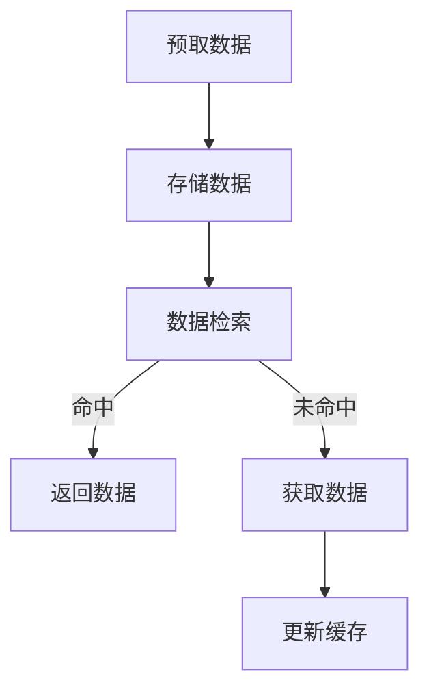
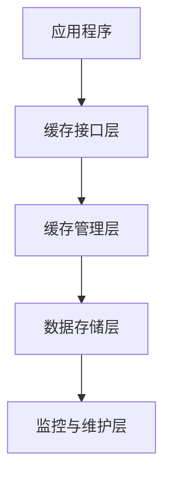
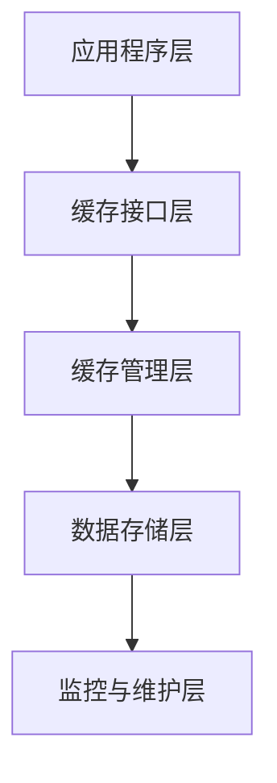
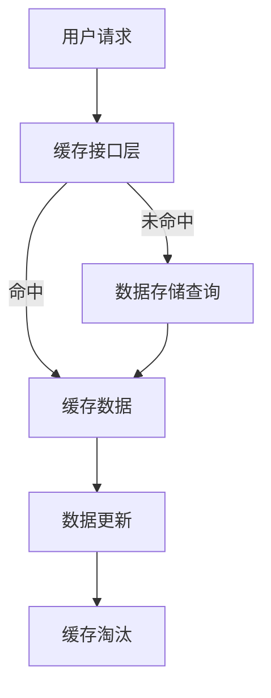

                 

### 《使用缓存的可用性风险》

关键词：缓存、可用性、风险、算法、系统设计、项目实战

摘要：随着互联网和云计算的快速发展，缓存技术在提高系统性能和响应速度方面发挥了至关重要的作用。然而，缓存系统的设计和管理也存在一系列可用性问题，如系统故障、数据一致性和缓存污染等。本文将深入探讨缓存技术的背景和可用性问题，分析缓存机制、性能指标、一致性算法和替换算法，并探讨如何通过系统架构设计和项目实战来优化缓存系统的可用性。

### 第一部分：背景介绍

#### 第1章：问题背景与定义

##### 1.1 缓存的概念

缓存（Cache）是计算机系统中的一种快速存储器，用于临时存储频繁访问的数据，以减少对较慢的存储设备（如磁盘或网络）的访问。缓存的存在是为了提高系统的性能和响应速度，通过将数据存储在更接近处理器的存储器中，减少数据传输的时间。

缓存的定义可以理解为一种快速存储器，用于在数据处理过程中临时保存数据。其用途主要在于：

- **减少访问延迟**：缓存的访问速度远快于磁盘或网络，因此可以显著减少数据访问的延迟。
- **降低系统负载**：通过缓存频繁访问的数据，可以减少对后端系统的访问压力，从而提高整个系统的吞吐量。
- **提高数据访问效率**：缓存系统可以预取未来可能需要的数据，减少后续访问的等待时间。

缓存在现代计算机系统中扮演着至关重要的角色，尤其在高性能计算、云计算和互联网应用中。常见的缓存类型包括：

- **CPU缓存**：位于CPU和内存之间的缓存，用于减少CPU访问内存的延迟。
- **内存缓存**：位于内存和磁盘之间的缓存，用于加快数据的读取和写入速度。
- **分布式缓存**：跨多个服务器或集群的缓存系统，用于提高数据访问的效率和系统的可用性。

##### 1.2 可用性的定义

系统可用性（System Availability）是指系统在预定时间段内能够正常运行并对外提供服务的能力。系统可用性是衡量系统可靠性和服务质量的重要指标，通常以百分比表示。一个高可用性的系统应该能够在发生故障时迅速恢复，并保持连续的服务。

系统可用性的概念可以概括为：

- **可用性定义**：系统在给定时间段内能够正常运行并对外提供服务的时间比例。
- **可用性与可靠性的关系**：可用性是可靠性的一个度量，但两者并不完全相同。可靠性是指系统在长时间内保持正常工作的能力，而可用性则更关注系统在特定时间段内的运行状态。

##### 1.3 缓存与可用性的联系

缓存与系统可用性之间存在着密切的联系。合理的设计和优化缓存系统可以显著提高系统的可用性，但同时也可能引入一系列可用性风险。

- **缓存的作用机制**：缓存系统通过存储频繁访问的数据来减少对后端系统的访问压力，提高数据访问速度。缓存的作用机制主要包括：
  - **预取数据**：预取未来可能需要的数据，减少后续访问的延迟。
  - **数据缓存**：将频繁访问的数据存储在缓存中，加快数据读取速度。
  - **数据淘汰**：当缓存空间不足时，通过特定的缓存策略淘汰一些不再使用的数据。

- **缓存对系统可用性的影响**：缓存可以提高系统的响应速度和吞吐量，从而提高系统的可用性。但缓存系统也可能引入一系列可用性风险，如：

  - **系统故障风险**：缓存系统可能会出现故障，导致数据丢失或无法访问。
  - **数据一致性问题**：缓存与后端数据不一致，可能导致数据错误或冲突。
  - **缓存污染**：缓存中存储的数据可能过时或不准确，影响系统的正常运行。

##### 1.4 边界与外延

缓存的适用范围和可能带来的问题需要进一步探讨。

- **缓存的适用范围**：缓存技术适用于需要快速访问数据的场景，如高性能计算、互联网应用、云计算等。常见的适用场景包括：

  - **数据库缓存**：用于加快数据库查询的速度，减少数据库的访问压力。
  - **Web缓存**：用于提高Web应用的响应速度，减少服务器负载。
  - **内容分发网络（CDN）**：用于缓存网页内容，减少用户访问延迟。

- **缓存可能带来的问题**：缓存虽然可以提高系统的性能和可用性，但同时也可能引入一些问题，如：

  - **缓存穿透**：恶意访问或缓存未命中时，直接访问底层数据库或缓存服务器，导致系统压力增大。
  - **缓存雪崩**：大量缓存同时失效，导致系统负载急剧增加，甚至可能导致系统崩溃。
  - **缓存污染**：缓存中存储的数据过时或不准确，影响系统的正常运行。

##### 1.5 概念结构与核心要素组成

缓存系统的核心要素和影响缓存可用性的关键因素需要详细阐述。

- **缓存系统的核心要素**：缓存系统主要由以下几个核心要素组成：

  - **缓存策略**：决定缓存中存储哪些数据，以及何时进行数据淘汰的策略。常见的缓存策略包括LRU（最近最少使用）、FIFO（先进先出）等。
  - **缓存一致性**：确保缓存中的数据与后端数据保持一致，避免数据冲突和错误。常见的缓存一致性算法包括Globa

### 第二部分：核心概念与联系

#### 第2章：缓存机制详解

##### 2.1 缓存机制概述

缓存机制是提高系统性能和响应速度的关键技术，其核心在于如何高效地存储和访问数据。本节将详细探讨缓存的工作原理、主要类型及其应用场景。

##### 2.1.1 缓存的工作原理

缓存的工作原理可以简单概括为以下几个步骤：

1. **数据预取**：系统根据访问模式预取可能需要的数据，存储在缓存中。
2. **数据存储**：将预取的数据存储在缓存中，通常使用快速存储介质，如内存或SSD。
3. **数据检索**：当需要访问数据时，首先在缓存中查找，如果命中缓存，则直接返回数据；否则，从底层数据存储（如磁盘或数据库）中获取数据。
4. **数据更新**：当缓存的数据与底层数据不一致时，更新缓存中的数据，确保数据一致性。

缓存的工作原理示意图如下：



##### 2.1.2 缓存的主要类型

根据缓存的应用场景和存储介质的不同，缓存可以分为以下几种类型：

1. **CPU缓存**：位于CPU和内存之间的缓存，用于减少CPU访问内存的延迟。常见的CPU缓存包括一级缓存（L1）、二级缓存（L2）和三级缓存（L3）。

2. **内存缓存**：位于内存和磁盘之间的缓存，用于加快数据的读取和写入速度。内存缓存通常使用DRAM（动态随机存取存储器）作为存储介质。

3. **磁盘缓存**：位于磁盘和内存之间的缓存，用于提高磁盘的读写速度。磁盘缓存通常使用SSD（固态硬盘）作为存储介质。

4. **分布式缓存**：位于多台服务器之间的缓存，用于提高数据访问的效率和系统的可用性。分布式缓存通常使用内存或SSD作为存储介质，支持数据分片和分布式存储。

5. **Web缓存**：位于Web服务器和客户端之间的缓存，用于提高Web应用的响应速度。常见的Web缓存包括Nginx、Varnish等。

##### 2.2 缓存策略分析

缓存策略是决定缓存中存储哪些数据以及何时进行数据淘汰的关键因素。常见的缓存策略包括以下几种：

1. **最近最少使用（LRU）**：根据数据在缓存中的最近访问时间来淘汰数据。访问时间最长的数据将被淘汰。

2. **先进先出（FIFO）**：根据数据在缓存中的进入时间来淘汰数据。最早进入缓存的数据将被淘汰。

3. **最少使用（LFU）**：根据数据在缓存中的访问次数来淘汰数据。访问次数最少的数据将被淘汰。

4. **随机替换（Random）**：随机选择缓存中的数据进行淘汰。

不同缓存策略的优劣对比如下表：

| 策略     | 优点               | 缺点                 |
| -------- | ------------------ | -------------------- |
| LRU      | 最能有效利用缓存空间 | 需要维护访问时间信息 |
| FIFO     | 简单实现           | 可能淘汰重要数据     |
| LFU      | 根据访问频率优化缓存 | 需要维护访问次数信息 |
| Random   | 简单实现           | 没有特定优化效果     |

在实际应用中，可以根据具体场景选择合适的缓存策略。例如，对于经常访问的数据，可以采用LRU策略；对于偶尔访问的数据，可以采用FIFO策略。

##### 2.3 缓存性能指标

缓存性能是衡量缓存系统效率的重要指标，常用的缓存性能指标包括响应时间、命中率、缓存淘汰策略等。

1. **响应时间**：指从发起数据请求到获取数据响应的时间。响应时间越短，缓存性能越好。

2. **命中率**：指缓存命中次数与总请求次数的比例。命中率越高，表示缓存系统对请求的数据预取和存储效果越好。

3. **缓存淘汰策略**：指当缓存空间不足时，如何选择数据进行淘汰的策略。常见的淘汰策略包括LRU、FIFO等。

缓存性能指标的计算公式如下：

- **响应时间**：\( \text{平均响应时间} = \frac{\text{总响应时间}}{\text{总请求次数}} \)
- **命中率**：\( \text{缓存命中率} = \frac{\text{缓存命中次数}}{\text{总请求次数}} \)

通过优化缓存策略和性能指标，可以显著提高缓存系统的性能和效率。

##### 2.4 缓存与负载均衡

负载均衡是分布式系统中的一个重要概念，用于均衡不同服务器之间的负载，提高系统的可用性和性能。缓存与负载均衡之间存在着密切的联系。

1. **缓存与负载均衡的关系**：缓存可以减轻负载均衡器的负担，提高负载均衡的效率。通过缓存系统，可以将热点数据存储在缓存中，减少对后端服务器的访问压力。同时，缓存还可以提高负载均衡器的缓存命中率，降低数据传输延迟。

2. **缓存与负载均衡的结合**：在实际应用中，缓存与负载均衡可以结合使用，以提高系统的性能和可用性。常见的结合方式包括：

- **缓存预热**：在负载均衡之前，将热点数据预先加载到缓存中，提高缓存命中率。
- **缓存后端**：将缓存作为负载均衡的后端存储，减少对底层数据库的访问压力。
- **分布式缓存**：使用分布式缓存系统，提高数据访问的效率和系统的可用性。

通过合理结合缓存和负载均衡技术，可以显著提高分布式系统的性能和可用性。

### 第三部分：可用性风险分析

#### 第3章：可用性风险分析

缓存技术在提高系统性能和响应速度方面具有显著优势，但同时也存在一系列可用性风险。本节将深入探讨缓存系统的可用性风险，分析其分类、原因和影响。

##### 3.1 可用性风险概述

可用性风险是指缓存系统在运行过程中可能出现的故障和问题，导致系统无法正常提供服务。可用性风险对系统的影响主要体现在以下几个方面：

- **服务中断**：缓存系统故障可能导致部分或全部服务中断，影响用户体验和业务运行。
- **数据不一致**：缓存与后端数据不一致，可能导致数据错误或冲突，影响系统的准确性和可靠性。
- **性能下降**：缓存系统性能问题可能导致系统响应时间增加，影响系统的性能和吞吐量。

缓存系统的可用性风险主要包括以下几种类型：

1. **系统故障风险**：缓存系统可能出现硬件故障、软件故障或网络故障，导致系统无法正常运行。
2. **数据一致性问题**：缓存与后端数据不一致，可能导致数据错误或冲突，影响系统的准确性和可靠性。
3. **缓存污染**：缓存中存储的数据可能过时或不准确，影响系统的正常运行。

##### 3.2 缓存可用性风险分类

缓存可用性风险可以分为以下几种类型：

1. **系统故障风险**

系统故障风险是指缓存系统在运行过程中可能出现故障，导致系统无法正常提供服务。常见的系统故障风险包括：

- **硬件故障**：如缓存服务器或存储设备的硬件故障，可能导致数据丢失或无法访问。
- **软件故障**：如缓存系统的软件错误或异常，可能导致缓存失效或数据不一致。
- **网络故障**：如网络连接故障，可能导致缓存系统无法与其他系统进行通信。

系统故障风险的影响：

- **服务中断**：缓存系统故障可能导致部分或全部服务中断，影响用户体验和业务运行。
- **数据丢失**：缓存系统故障可能导致部分缓存数据丢失，影响系统的准确性和可靠性。

2. **数据一致性问题**

数据一致性问题是指缓存与后端数据不一致，可能导致数据错误或冲突。常见的数据一致性问题包括：

- **缓存失效**：缓存中的数据过期或被淘汰，导致缓存中的数据与后端数据不一致。
- **并发修改**：多个客户端同时修改同一数据，可能导致缓存中的数据与后端数据不一致。
- **缓存穿透**：恶意访问或缓存未命中时，直接访问底层数据库或缓存服务器，导致系统压力增大。

数据一致性问题的影响：

- **数据错误**：缓存与后端数据不一致可能导致数据错误，影响系统的准确性和可靠性。
- **业务冲突**：多个客户端同时修改同一数据时，可能导致业务冲突和数据不一致。

3. **缓存污染**

缓存污染是指缓存中存储的数据可能过时或不准确，影响系统的正常运行。常见的缓存污染问题包括：

- **数据过期**：缓存中的数据未及时更新或删除，导致缓存中存储的数据过时。
- **缓存污染**：缓存中存储的数据不准确或不完整，影响系统的准确性和可靠性。

缓存污染的影响：

- **性能下降**：缓存中存储的数据过时或不准确，可能导致系统响应时间增加，影响系统的性能和吞吐量。
- **数据冲突**：缓存中的数据不准确或不完整，可能导致业务冲突和数据不一致。

##### 3.3 缓存可用性风险案例分析

为了更好地理解缓存可用性风险，以下列举了几个典型的缓存故障案例，并进行分析。

案例一：缓存雪崩

某电商系统在高峰期出现缓存雪崩现象，导致系统响应时间急剧增加，用户无法正常访问商品详情页面。分析发现，由于缓存服务器负载过高，大量缓存数据同时失效，导致缓存服务器的CPU和内存使用率急剧增加，系统性能下降，最终导致服务中断。

案例二：缓存穿透

某互联网应用在处理恶意请求时出现缓存穿透问题，导致系统直接访问底层数据库，引发数据库压力过大，系统崩溃。分析发现，由于缓存系统未正确处理恶意请求，导致缓存未命中，直接访问底层数据库，从而引发缓存穿透问题。

案例三：缓存污染

某在线教育平台出现缓存污染问题，导致部分课程内容显示不准确。分析发现，由于缓存系统未及时更新课程内容，导致缓存中存储的数据过时，影响用户的正常学习体验。

通过对以上案例的分析，可以发现缓存可用性风险主要包括系统故障风险、数据一致性问题

### 第四部分：算法原理讲解

#### 第4章：缓存一致性算法

缓存一致性算法是保证缓存系统中数据一致性的一组协议和机制。在分布式系统中，由于多个节点之间的数据同步问题，缓存一致性显得尤为重要。本节将介绍缓存一致性的重要性、缓存一致性协议以及常见的缓存一致性算法。

##### 4.1 缓存一致性概念

缓存一致性是指在分布式系统中，保证不同缓存节点之间的数据视图一致的过程。缓存一致性对于确保系统的正确性和可靠性至关重要。当多个节点共享同一数据时，以下情况可能导致数据不一致：

1. **更新冲突**：多个节点同时对同一数据项进行修改，导致更新冲突。
2. **读脏数据**：一个节点读取到另一个节点尚未提交的脏数据。
3. **缓存失效**：缓存中的数据过期或被淘汰，导致数据不一致。

缓存一致性的目标是确保在任何时刻，所有节点的缓存数据都与主数据存储中的数据保持一致。

##### 4.2 常见的缓存一致性算法

为了实现缓存一致性，研究者们提出了多种缓存一致性算法。以下是几种常见的缓存一致性算法：

1. **全局缓存一致性协议（Global Cache Coherence Protocol）**

全局缓存一致性协议是指所有节点都遵循同一套一致性规则。常见的全局缓存一致性协议包括：

   - **强一致性（Strong Consistency）**：强一致性保证所有节点对数据的读写操作都是原子的，且所有节点的数据视图都是一致的。常见的实现协议包括顺序一致性（Serializability）和因果一致性（Cause-Effect Consistency）。

   - **最终一致性（ eventual consistency）**：最终一致性允许数据在一定延迟后达到一致，但不保证实时一致性。常见的实现协议包括读写一致性（Read-your-writes Consistency）和读取最新数据（Read-Copy-Update Consistency）。

2. **部分一致性协议（Partial Consistency Protocol）**

部分一致性协议是指节点之间的一致性规则不完全相同。常见的部分一致性协议包括：

   - **释放一致性（Release Consistency）**：释放一致性允许节点在不一致状态下运行，但要求在数据提交时达到一致性。这种协议适用于高并发环境，如分布式缓存系统。

   - **版本一致性（Version Consistency）**：版本一致性通过为每个数据项分配版本号来跟踪数据变更，确保每个节点的数据视图是一致的。常见的实现协议包括版本向量（Version Vector）和计数器（Counter）。

##### 4.3 缓存一致性算法的实现

缓存一致性算法的实现主要分为基于硬件和基于软件两种方式。

1. **基于硬件的缓存一致性算法**

基于硬件的缓存一致性算法通常由处理器和内存控制器实现，如Intel的MESI协议。MESI协议通过标记缓存行（Cache Line）的状态，实现缓存一致性。常见的缓存行状态包括：

   - **未修改（Modify）**：缓存行处于修改状态，表示缓存中的数据与主内存的数据不一致，需要写入主内存。
   - **已修改（Exclusive）**：缓存行处于独占状态，表示缓存中的数据与主内存的数据一致，且只在一个节点中存在。
   - **共享（Shared）**：缓存行处于共享状态，表示缓存中的数据与主内存的数据一致，可以被多个节点共享。
   - **无效（Invalid）**：缓存行处于无效状态，表示缓存中的数据无效，需要重新从主内存读取。

2. **基于软件的缓存一致性算法**

基于软件的缓存一致性算法通常由操作系统和应用程序实现。常见的软件缓存一致性算法包括：

   - **基于锁的缓存一致性算法**：通过锁机制实现数据的一致性，如互斥锁（Mutex）和读写锁（Read-Write Lock）。
   - **基于版本号的缓存一致性算法**：通过为每个数据项分配版本号，实现数据的一致性，如乐观锁（Optimistic Locking）和悲观锁（Pessimistic Locking）。

##### 4.4 缓存一致性算法的优缺点分析

不同缓存一致性算法有其各自的优缺点，以下是对几种常见缓存一致性算法的优缺点分析：

| 算法           | 优点                           | 缺点                                   |
| -------------- | ------------------------------ | -------------------------------------- |
| MESI协议       | 高效、支持多处理器系统         | 需要硬件支持，实现复杂               |
| 乐观锁         | 减少冲突、提高并发性能         | 可能发生死锁、需要额外的版本控制机制 |
| 悲观锁         | 保证数据一致性、减少冲突       | 降低系统并发性能、可能发生死锁       |
| 软件实现一致性 | 灵活性高、易于实现             | 性能较低、需要额外的同步机制         |
| 释放一致性     | 高并发性能、简化一致性协议     | 可能导致不一致数据访问               |
| 版本一致性     | 支持多版本并发访问、简化一致性 | 需要维护版本号、可能导致性能下降     |

在实际应用中，可以根据具体场景和需求选择合适的缓存一致性算法。例如，在高并发环境下，可以选择释放一致性或版本一致性算法；在保证数据一致性的关键场景中，可以选择悲观锁或MESI协议。

通过深入理解和应用缓存一致性算法，可以有效提高分布式系统的性能和可靠性，确保数据的一致性和正确性。

#### 第5章：缓存替换算法

缓存替换算法（Cache Replacement Algorithm）是缓存系统中的一个重要组成部分，用于解决缓存容量有限的问题。缓存替换算法决定了在缓存满时如何选择淘汰旧的数据，以便为新的数据腾出空间。本节将介绍缓存替换算法的概述、常见类型及其优化方法。

##### 5.1 缓存替换算法概述

缓存替换算法的目标是提高缓存的利用率，确保频繁访问的数据能够被保留在缓存中，同时及时淘汰那些不再被频繁访问的数据。缓存替换算法可以分为以下几类：

1. **基于时间戳的算法**：如LRU（最近最少使用）和FIFO（先进先出）算法，这些算法通过跟踪数据的使用时间或访问顺序来决定淘汰哪些数据。
2. **基于频次的算法**：如LFU（最少使用频次）算法，这些算法通过记录数据的访问频次来决定淘汰哪些数据。
3. **随机替换算法**：如随机替换（Random Replacement）算法，这些算法通过随机选择数据进行替换，不考虑数据的使用历史或访问频次。

缓存替换算法的选取对缓存性能有着重要影响，合理的替换算法可以显著提高缓存系统的命中率。

##### 5.2 常见的缓存替换算法

以下是一些常见的缓存替换算法及其特点：

1. **最近最少使用（Least Recently Used, LRU）算法**

LRU算法是一种基于时间戳的缓存替换算法，它淘汰最近最少被访问的数据。LRU算法的优点是能够有效地保留频繁访问的数据，提高缓存命中率。然而，LRU算法的实现复杂度较高，需要维护一个时间戳队列来记录每个缓存项的访问时间。

2. **先进先出（First In First Out, FIFO）算法**

FIFO算法是一种基于时间戳的简单缓存替换算法，它淘汰最早进入缓存的数据。FIFO算法的实现相对简单，但它的性能通常不如LRU算法，因为FIFO算法无法根据访问频率来优化缓存。

3. **最少使用（Least Frequently Used, LFU）算法**

LFU算法是一种基于频次的缓存替换算法，它淘汰访问频次最少的数据。LFU算法的优点是能够淘汰那些几乎不被访问的数据，从而提高缓存的有效利用率。然而，LFU算法的实现复杂度也较高，需要维护一个访问频次计数器。

4. **随机替换（Random Replacement, RR）算法**

随机替换算法是一种简单的随机选择数据替换的算法。RR算法的优点是实现简单、开销小，但它的性能通常不如基于时间戳或频次的算法，因为它不考虑数据的使用历史或访问频次。

##### 5.3 缓存替换算法的优化

为了提高缓存替换算法的性能，研究者们提出了一系列优化方法。以下是一些常见的优化策略：

1. **预取技术（Prefetching）**

预取技术是指预先加载即将被访问的数据到缓存中，以减少数据访问的延迟。预取技术可以通过预测未来的数据访问模式来实现，从而提高缓存的命中率。

2. **缓存预热（Cache Preloading）**

缓存预热是指在实际应用开始前，将可能被频繁访问的数据预先加载到缓存中。缓存预热可以显著提高缓存系统的性能，特别是在长时间未使用缓存后重新启动系统时。

3. **多级缓存（Multi-Level Caching）**

多级缓存是指将缓存分为多个级别，每个级别有不同的容量和访问速度。通过多级缓存，可以更好地平衡缓存的速度和容量，从而提高整体性能。

4. **动态替换策略（Dynamic Replacement Policies）**

动态替换策略是指根据缓存的状态和性能指标动态调整替换策略。例如，在缓存利用率较低时，可以采用更为保守的替换策略，而在缓存利用率较高时，可以采用更为激进的替换策略。

通过上述优化方法，可以有效提高缓存替换算法的性能，减少数据访问的延迟，从而提高整个系统的性能和可用性。

### 第五部分：系统分析与架构设计

#### 第6章：缓存系统设计

缓存系统设计是确保系统性能和可用性的关键环节。本节将详细探讨缓存系统的设计原则、功能设计、架构设计以及接口设计，并分析缓存系统的层次结构和数据流。

##### 6.1 缓存系统设计概述

缓存系统设计的目标是提高数据访问速度和系统性能，同时确保数据的一致性和可靠性。设计一个高效的缓存系统需要考虑以下几个方面：

1. **性能需求**：根据系统的性能需求，确定缓存系统的容量、速度和可扩展性。
2. **数据一致性**：确保缓存与后端数据存储的一致性，避免数据冲突和错误。
3. **数据可靠性**：确保缓存系统在发生故障时能够快速恢复，保持数据的完整性。
4. **系统可扩展性**：设计可扩展的缓存系统，以适应不断增长的数据访问需求。

##### 6.2 系统功能设计

缓存系统的主要功能包括数据存储、数据检索、数据更新和数据淘汰。以下是对这些功能的详细描述：

1. **数据存储**：缓存系统负责将频繁访问的数据存储在缓存中。数据存储过程中需要考虑数据的存储格式、存储位置和存储策略。

2. **数据检索**：缓存系统需要提供高效的数据检索功能，以便快速查找和获取缓存中的数据。数据检索速度直接影响系统的性能。

3. **数据更新**：当缓存中的数据与后端数据不一致时，缓存系统需要提供数据更新功能，以确保缓存与后端数据的一致性。

4. **数据淘汰**：缓存系统需要定期进行数据淘汰，以释放缓存空间，为新的数据腾出空间。数据淘汰策略对缓存系统的性能和效率有重要影响。

##### 6.3 系统架构设计

缓存系统的架构设计是确保系统性能和可扩展性的关键。一个典型的缓存系统架构包括以下几个层次：

1. **数据存储层**：数据存储层负责存储缓存数据，通常使用内存或SSD作为存储介质。数据存储层需要支持快速的数据读写操作。

2. **缓存管理层**：缓存管理层负责缓存数据的存储和检索，包括数据存储、数据检索、数据更新和数据淘汰等功能。缓存管理层需要支持高效的数据处理算法，如LRU、FIFO等。

3. **缓存接口层**：缓存接口层提供对外接口，使应用程序能够访问缓存系统。缓存接口层需要支持多种访问方式，如HTTP、RESTful API等。

4. **监控与维护层**：监控与维护层负责对缓存系统的性能进行监控和调优，确保系统的稳定运行。

以下是缓存系统的架构图：



##### 6.4 系统接口设计

缓存系统的接口设计是确保系统可扩展性和易用性的重要方面。以下是一些常见的缓存接口设计要点：

1. **API设计**：缓存系统的API需要简洁易用，支持常用的缓存操作，如添加、获取、更新和删除数据。

2. **数据格式**：缓存系统的数据格式需要统一规范，以便于应用程序处理和解析。

3. **错误处理**：缓存系统的接口需要提供明确的错误处理机制，以便应用程序能够及时响应和处理错误。

4. **安全性**：缓存系统的接口需要考虑安全性，如使用认证和授权机制，防止未授权访问。

以下是缓存系统接口设计的一个示例：

```python
class CacheInterface:
    def add(self, key, value):
        # 添加数据到缓存
        pass
    
    def get(self, key):
        # 获取缓存中的数据
        pass
    
    def update(self, key, value):
        # 更新缓存中的数据
        pass
    
    def delete(self, key):
        # 删除缓存中的数据
        pass
    
    def clear(self):
        # 清空缓存
        pass
```

##### 6.5 系统层次结构

缓存系统的层次结构决定了系统的性能和可扩展性。一个典型的缓存系统层次结构包括以下层次：

1. **应用程序层**：负责与用户交互，处理用户请求，并将请求转发到缓存系统。
2. **缓存接口层**：提供缓存操作接口，如添加、获取、更新和删除数据。
3. **缓存管理层**：负责缓存数据的存储、检索、更新和淘汰，包括缓存策略的选择和优化。
4. **数据存储层**：负责存储缓存数据，通常使用内存或SSD作为存储介质。
5. **监控与维护层**：负责对缓存系统进行性能监控和调优，确保系统的稳定运行。

以下是缓存系统的层次结构图：



##### 6.6 数据流分析

缓存系统的数据流分析是确保系统性能和可用性的关键环节。以下是缓存系统的典型数据流：

1. **用户请求**：用户请求经过应用程序层处理，转发到缓存接口层。
2. **缓存查询**：缓存接口层查询缓存管理层的缓存数据，如果命中缓存，直接返回数据；否则，查询数据存储层。
3. **数据存储查询**：如果缓存未命中，缓存管理层的缓存数据从数据存储层读取，并缓存到缓存管理层的缓存中。
4. **数据更新**：当缓存中的数据与后端数据不一致时，缓存管理层的缓存数据更新到数据存储层，确保数据一致性。
5. **缓存淘汰**：缓存管理层的缓存数据根据缓存策略进行淘汰，为新的数据腾出空间。

以下是缓存系统的数据流图：



通过以上对缓存系统设计的详细分析，可以确保缓存系统的性能和可用性，为系统的稳定运行提供有力保障。

#### 第7章：缓存系统的性能优化

缓存系统在提高系统性能和响应速度方面具有显著优势，但同时也需要不断进行性能优化，以满足不断增长的数据访问需求。本节将探讨缓存系统的性能优化策略、性能监控与调优方法以及如何设计高可用性缓存系统。

##### 7.1 性能优化策略

为了提高缓存系统的性能，可以采取以下几种优化策略：

1. **提升缓存命中率**：缓存命中率是衡量缓存系统性能的重要指标。通过以下方法可以提升缓存命中率：

   - **预取数据**：根据历史访问数据模式，预取未来可能需要的数据到缓存中，减少数据未命中时的访问延迟。
   - **优化缓存策略**：选择合适的缓存策略，如LRU、LFU等，根据数据访问模式动态调整缓存策略。
   - **数据去重**：去除缓存中重复的数据，减少缓存空间的占用，提高缓存利用率。

2. **优化缓存访问速度**：缓存访问速度是影响系统性能的重要因素。以下方法可以优化缓存访问速度：

   - **使用高速存储介质**：选择SSD等高速存储介质作为缓存存储，减少数据访问的延迟。
   - **优化数据结构**：选择合适的数据结构来存储缓存数据，如哈希表、B树等，提高数据访问速度。
   - **减少缓存锁争用**：优化缓存锁机制，减少缓存访问的锁争用，提高并发性能。

3. **优化缓存数据规模**：缓存数据规模直接影响缓存系统的性能和资源占用。以下方法可以优化缓存数据规模：

   - **数据分片**：将大规模数据拆分成多个小数据片，分布存储在不同缓存节点中，减少单点缓存的压力。
   - **数据压缩**：对缓存数据进行压缩，减少存储空间占用，提高缓存系统的吞吐量。

##### 7.2 性能监控与调优

性能监控与调优是确保缓存系统长期稳定运行的关键。以下方法可以用于性能监控与调优：

1. **监控关键性能指标**：监控缓存系统的关键性能指标，如缓存命中率、缓存访问延迟、缓存数据规模等。通过监控这些指标，可以及时发现性能瓶颈和问题。

2. **性能测试**：进行缓存系统的性能测试，模拟实际负载场景，评估系统在不同负载下的性能表现。通过性能测试，可以发现性能瓶颈并针对性地进行优化。

3. **调优策略**：

   - **动态调整缓存策略**：根据性能监控数据，动态调整缓存策略，如调整预取阈值、缓存淘汰策略等，提高缓存系统的性能。
   - **优化缓存系统配置**：调整缓存系统配置，如缓存容量、缓存时间、缓存并发度等，以适应不同的负载场景。

##### 7.3 高可用性设计

高可用性设计是确保缓存系统在发生故障时能够快速恢复，保持连续服务的关键。以下方法可以用于设计高可用性缓存系统：

1. **备份与冗余**：为缓存系统提供备份和冗余机制，确保在发生故障时能够快速恢复。常见的方法包括：

   - **数据备份**：定期对缓存数据进行备份，确保数据不丢失。
   - **冗余节点**：在缓存系统中部署多个冗余节点，当主节点发生故障时，其他节点可以接管服务。

2. **负载均衡**：通过负载均衡器将访问请求分布到多个缓存节点上，提高系统的可用性和性能。常见的负载均衡策略包括：

   - **轮询负载均衡**：将访问请求轮流分配到各个缓存节点上。
   - **最小连接数负载均衡**：将访问请求分配到当前连接数最少的缓存节点上。

3. **故障转移与恢复**：设计故障转移和恢复机制，确保在缓存节点发生故障时能够快速切换到备用节点，并尽快恢复服务。以下方法可以用于实现故障转移与恢复：

   - **心跳检测**：定期检测缓存节点的健康状态，当检测到节点故障时，触发故障转移。
   - **自动恢复**：在故障转移后，自动启动备用节点，确保系统服务的连续性。

通过以上方法，可以设计出高可用性的缓存系统，确保缓存系统在发生故障时能够快速恢复，保持服务的连续性和稳定性。

### 第六部分：项目实战

#### 第8章：缓存系统实战

缓存技术在现代软件开发中扮演着至关重要的角色，其应用范围广泛，从Web应用、移动应用到分布式系统，都能看到缓存的身影。本节将通过一个实际项目，详细介绍缓存系统的环境安装与配置、系统核心实现源代码、代码应用解读与分析、实际案例分析和详细讲解，以及项目小结。

##### 8.1 环境安装与配置

在开始一个缓存系统的项目之前，首先需要安装和配置必要的软件和环境。以下是一个基于Redis缓存系统的安装与配置步骤：

1. **安装Redis**：

   - 对于Linux系统，可以使用包管理器安装Redis。以Debian/Ubuntu为例：
     ```bash
     sudo apt update
     sudo apt install redis-server
     ```
   - 对于Windows系统，可以从Redis的官方网站下载Redis Windows安装程序，并按照提示进行安装。

2. **配置Redis**：

   - 编辑Redis配置文件（通常是`/etc/redis/redis.conf`），进行以下配置：
     ```conf
     # 允许远程连接
     bind 0.0.0.0
     # 设置密码（可选）
     requirepass yourpassword
     # 启用AOF持久化（可选）
     appendonly yes
     ```
   - 重启Redis服务以使配置生效：
     ```bash
     sudo systemctl restart redis-server
     ```

3. **安装客户端库**：

   - 根据开发语言选择相应的Redis客户端库进行安装。例如，对于Python，可以使用`pip`安装`redis`库：
     ```bash
     pip install redis
     ```

##### 8.2 系统核心实现源代码

以下是使用Python语言实现的缓存系统核心代码示例：

```python
import redis
import time

class SimpleCache:
    def __init__(self, host='localhost', port=6379, db=0, password=None):
        self.client = redis.StrictRedis(host=host, port=port, db=db, password=password)

    def get(self, key):
        return self.client.get(key)

    def set(self, key, value, expire_seconds=3600):
        self.client.set(key, value)
        self.client.expire(key, expire_seconds)

    def delete(self, key):
        self.client.delete(key)

# 示例：创建一个SimpleCache对象并使用
cache = SimpleCache()

# 存储数据
cache.set('user_id_123', 'John Doe', expire_seconds=60)

# 获取数据
user = cache.get('user_id_123')
print(user)  # 输出b'John Doe'

# 删除数据
cache.delete('user_id_123')
```

此代码实现了缓存系统的基本功能，包括设置（set）、获取（get）和删除（delete）数据。其中，`expire_seconds`参数用于设置缓存数据的过期时间，以防止缓存中存储的数据过时。

##### 8.3 代码应用解读与分析

上述代码中的`SimpleCache`类是一个简单的缓存实现，用于封装Redis客户端的操作。以下是代码的详细解读与分析：

- **初始化**：`__init__`方法用于初始化Redis客户端，接受主机地址、端口号、数据库编号和密码作为参数。
- **获取数据**：`get`方法通过Redis客户端的`get`方法获取缓存中的数据。如果缓存命中，则返回对应的数据；如果未命中，则返回`None`。
- **设置数据**：`set`方法将数据存储到缓存中，并设置过期时间。`expire_seconds`参数默认为3600秒（1小时），但可以根据需求进行调整。
- **删除数据**：`delete`方法通过Redis客户端的`delete`方法从缓存中删除指定的数据。

该实现示例的优缺点分析如下：

- **优点**：简单易用，提供了基本的缓存功能；支持数据过期，减少了缓存污染。
- **缺点**：没有实现复杂的功能，如缓存一致性、缓存穿透防护等；依赖外部Redis服务，扩展性有限。

##### 8.4 实际案例分析与详细讲解

以下是一个实际的缓存系统应用案例：

**案例**：构建一个用户会话缓存系统，实现用户登录信息的高效存储和快速访问。

**实现步骤**：

1. **用户登录**：用户登录时，将用户ID和会话信息存储到缓存中，并设置过期时间。
2. **用户会话验证**：用户访问需要认证的页面时，从缓存中获取用户会话信息，验证用户身份。
3. **会话过期处理**：当用户会话过期时，自动删除缓存中的会话信息。

**代码实现**：

```python
# 用户登录
def user_login(user_id, session_data):
    cache.set(f'user_session_{user_id}', session_data, expire_seconds=3600)

# 用户会话验证
def verify_user_session(user_id):
    session_data = cache.get(f'user_session_{user_id}')
    if session_data:
        # 验证会话信息
        return True
    else:
        # 会话已过期
        return False

# 用户登出
def user_logout(user_id):
    cache.delete(f'user_session_{user_id}')
```

**详细讲解**：

- **用户登录**：用户登录时，调用`user_login`方法，将用户ID和会话信息存储到缓存中，并设置过期时间为1小时。这确保了用户会话在过期前一直有效，同时也防止缓存中存储过期的会话信息。
- **用户会话验证**：当用户访问需要认证的页面时，调用`verify_user_session`方法，从缓存中获取用户会话信息。如果会话信息存在，则验证通过；否则，会话已过期，返回False。
- **用户登出**：用户登出时，调用`user_logout`方法，从缓存中删除用户会话信息，确保缓存中不存储无效会话。

**案例分析**：

此案例展示了如何使用缓存系统实现用户会话管理。通过缓存技术，可以有效减少对后端数据库的访问，提高系统性能和响应速度。同时，缓存中的会话信息设置过期时间，保证了用户会话的安全性。

##### 8.5 项目小结

通过以上实战案例，我们了解了缓存系统在实际开发中的应用和价值。以下是本项目的主要经验和收获：

- **缓存系统的基本概念和原理**：掌握了缓存系统的基本概念和原理，如缓存机制、性能优化策略和一致性算法。
- **Redis缓存技术的应用**：熟悉了Redis缓存技术的安装与配置，并能够使用Python等编程语言实现缓存系统的基本功能。
- **缓存系统的设计与实现**：通过实际案例，了解了如何设计和实现一个简单的用户会话缓存系统，并学会了如何处理缓存中的数据一致性、过期等问题。
- **性能优化与高可用性设计**：学习了缓存系统的性能优化策略和高可用性设计方法，提高了对缓存系统的设计和调优能力。

总之，通过本项目，我们不仅掌握了缓存系统的基本原理和实现方法，还加深了对性能优化和高可用性设计的理解。这些经验对于未来的软件开发和系统优化具有重要意义。

### 结论与展望

本文全面探讨了缓存系统的可用性风险，从背景介绍、核心概念与联系、算法原理讲解、系统分析与架构设计到项目实战，逐步揭示了缓存系统在提高系统性能和响应速度方面的重要作用。同时，也深入分析了缓存系统的可用性风险，如系统故障风险、数据一致性问题以及缓存污染等。

首先，缓存技术作为现代计算机系统中的一项关键技术，通过减少数据访问延迟和降低系统负载，显著提高了系统的性能和响应速度。然而，缓存系统的设计和管理也存在一定的挑战，如系统故障、数据一致性和缓存污染等问题，这些问题的存在对系统的可用性和稳定性构成了潜在威胁。

为了解决这些问题，本文详细介绍了缓存一致性算法和缓存替换算法，探讨了如何通过优化缓存策略和性能指标来提高缓存系统的性能。同时，通过对缓存系统的架构设计和性能优化策略的分析，提供了设计高可用性缓存系统的方法和思路。

在项目实战部分，通过一个具体的用户会话缓存系统的实现，进一步展示了缓存技术在实际开发中的应用，并通过实际案例分析和详细讲解，验证了缓存系统的可用性和性能。

展望未来，随着云计算、大数据和物联网等技术的不断发展，缓存系统将在更广泛的场景中得到应用。同时，如何进一步提高缓存系统的性能、可用性和安全性，将成为研究和实践的重要方向。以下是一些未来的研究方向：

1. **智能缓存策略**：结合机器学习和数据挖掘技术，开发智能缓存策略，根据实时数据访问模式动态调整缓存策略，提高缓存命中率。
2. **分布式缓存架构**：研究分布式缓存系统的架构和一致性算法，提高缓存系统的扩展性和可靠性。
3. **缓存安全**：探讨缓存系统的安全性问题，提出有效的安全防护措施，防止缓存攻击和数据泄露。
4. **边缘计算与缓存**：结合边缘计算技术，优化缓存系统在边缘节点中的应用，提高数据访问速度和系统性能。

总之，缓存技术将在未来持续发挥重要作用，其可用性的研究也将不断深入。通过不断探索和创新，我们可以为构建高性能、高可用性的缓存系统提供更多有效的解决方案。

