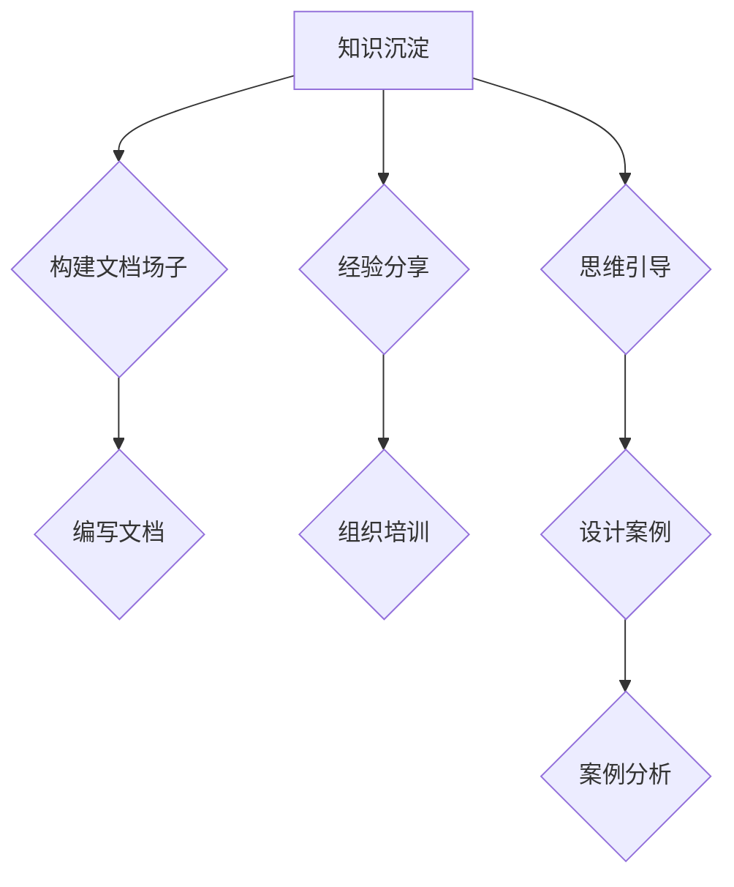
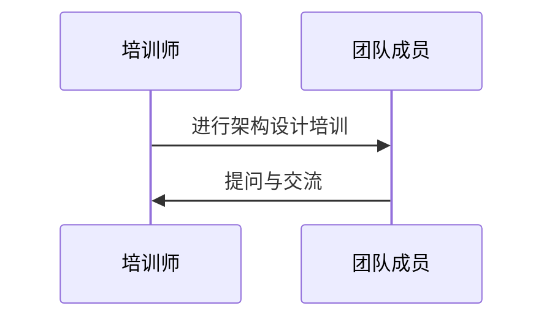
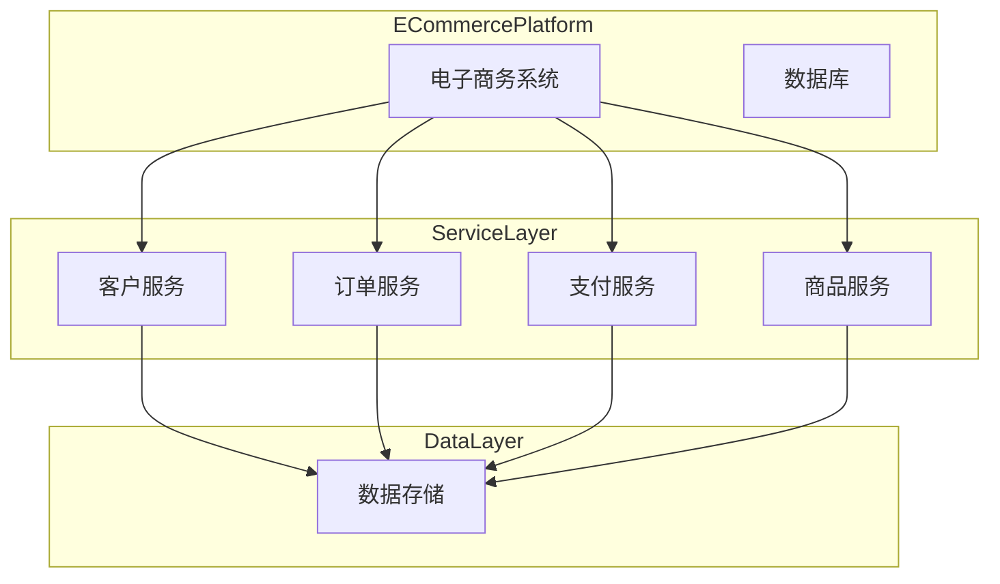
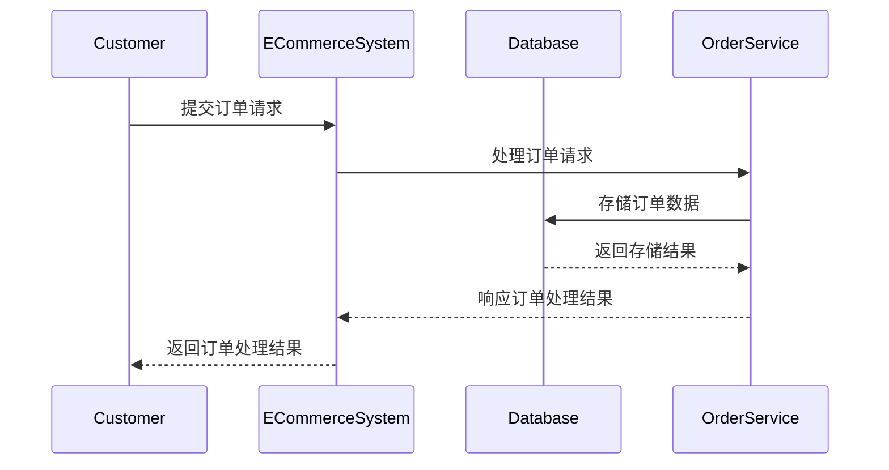
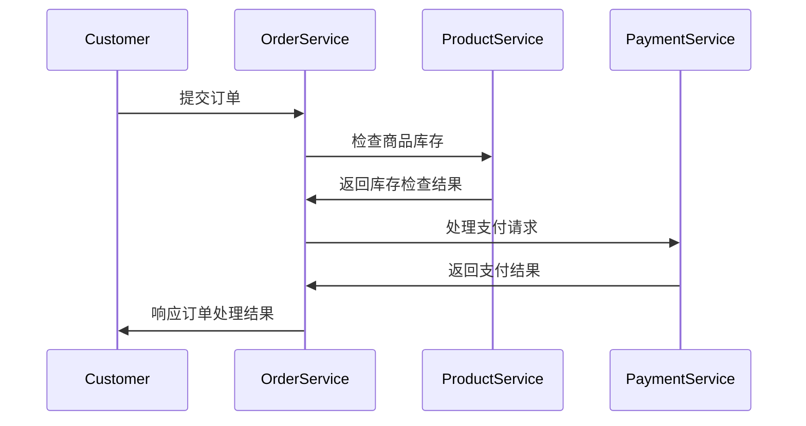

                 

# 《做好架构传承的三个场子》

> 关键词：架构传承、三个场子、系统架构设计、项目实战、最佳实践

> 摘要：本文旨在探讨如何有效地进行架构传承，通过对“三个场子”的概念解析，结合实际项目案例，提供了一套系统的架构传承方法论。文章结构清晰，包含背景介绍、核心概念与联系、算法原理讲解、系统分析与架构设计方案、项目实战以及最佳实践与拓展等内容。

----------------------------------------------------------------

## 第一部分：架构传承的背景与概念

### 1.1 问题背景

在现代信息技术飞速发展的背景下，企业的系统架构设计越来越复杂，架构的传承问题也逐渐显现出来。传统的架构设计往往依赖于个人的经验和技能，缺乏系统化的文档和规范，导致在架构师离职或项目变更时，新的团队成员难以快速上手，影响项目进度和质量。因此，如何做好架构传承，成为企业信息化的一个重要课题。

### 1.2 架构传承的重要性

架构传承不仅是技术传承，更是企业知识资产的重要保障。通过系统化的架构传承，企业能够保持技术优势，提高团队协作效率，减少因人员流动带来的风险。同时，良好的架构传承也有助于新员工的快速成长，为企业培养出更多优秀的架构师。

### 1.3 书中的“三个场子”

在本文所讨论的书籍中，“三个场子”是指：

1. **知行场子**：关注架构师在实际项目中积累的经验和技能。
2. **文档场子**：指系统化的文档和知识库，用于记录和传递架构设计的信息。
3. **思维场子**：强调架构师思维方式的传承，包括设计理念、方法、技巧等。

## 第二部分：架构传承的核心概念与联系

### 2.1 架构传承的定义

架构传承是指将系统架构设计过程中积累的知识、经验、技能和思维方式，通过系统化的方法和工具，传递给下一代架构师或团队成员。

### 2.2 三个场子的概念与关系

为了更好地理解“三个场子”，我们可以通过以下ER实体关系图架构的Mermaid流程图来展现它们之间的关系：

```mermaid
erDiagram
  知行场子 ||--|{ 文档场子 }|| 文档记录
  文档场子 ||--|{ 思维场子 }|| 知识传承
  思维场子 ||--|{ 知行场子 }|| 经验积累
```

### 2.3 概念属性特征对比表格

| 场子      | 定义                                                         | 特征                                                         |
| --------- | ------------------------------------------------------------ | ------------------------------------------------------------ |
| 知行场子  | 关注架构师在实际项目中积累的经验和技能。                       | 实践性强，涉及具体项目细节。                                 |
| 文档场子  | 系统化的文档和知识库，用于记录和传递架构设计的信息。         | 知识体系化，可重复阅读和检索。                               |
| 思维场子  | 强调架构师思维方式的传承，包括设计理念、方法、技巧等。       | 知识抽象性高，影响架构设计的全局性。                         |

----------------------------------------------------------------

## 第三部分：架构传承的算法原理

### 3.1 算法概述

架构传承的算法旨在通过系统化的方法，将“三个场子”中的知识有效地传递给下一代架构师或团队成员。该算法的核心思想是“知识沉淀、方法传承、思维引导”。

### 3.2 算法流程图



### 3.3 算法原理详细讲解

#### 知识沉淀

知识沉淀是架构传承的基础。通过以下Python代码和LaTeX数学公式，我们可以了解知识沉淀的过程：

```python
# Python代码：知识沉淀示例
knowledge_p = {
    '架构设计原则': 'SOLID原则',
    '关键技术': '微服务架构',
    '最佳实践': '持续集成与持续部署'
}

for key, value in knowledge_p.items():
    print(f"{key}: {value}")
```

$$
\text{知识沉淀} = \text{经验积累} + \text{最佳实践} + \text{理论知识}
$$

#### 文档记录

文档记录是将知识沉淀转化为文档的过程。通过以下LaTeX数学公式，我们可以看到文档记录的数学模型：

$$
\text{文档记录} = \text{知识沉淀} \times \text{表达方式}
$$

#### 经验分享

经验分享是通过组织培训和分享会，将架构师的经验传递给团队成员。以下Mermaid序列图展示了经验分享的过程：



#### 思维引导

思维引导是通过设计案例和案例分析，引导团队成员形成正确的架构设计思维方式。以下Python代码和LaTeX数学公式展示了思维引导的过程：

```python
# Python代码：思维引导示例
case_study = {
    '案例名称': '电商系统',
    '设计目标': '高并发、高可用',
    '架构方案': '分布式架构'
}

for key, value in case_study.items():
    print(f"{key}: {value}")
```

$$
\text{思维引导} = \text{设计案例} + \text{案例分析} + \text{实践反馈}
$$

----------------------------------------------------------------

## 第四部分：架构传承的系统分析与架构设计方案

### 4.1 问题场景介绍

以一家电商平台为例，该平台面临着高并发、高可用、易扩展等架构设计挑战。为了应对这些挑战，需要进行系统化的架构传承。

### 4.2 系统功能设计

以下Mermaid类图展示了系统的主要功能：

```mermaid
classDiagram
    Customer <<Interface>>
    Order <<Interface>>
    Payment <<Interface>>
    Product <<Interface>>

    class ECommerceSystem {
        +Customer customer
        +Order order
        +Payment payment
        +Product product
        +handleOrder(order)
        +handlePayment(payment)
    }
```

### 4.3 系统架构设计

以下Mermaid架构图展示了系统的整体架构：



### 4.4 系统接口设计

以下展示了系统接口设计：



### 4.5 系统交互设计

以下Mermaid序列图展示了系统的交互过程：



----------------------------------------------------------------

## 第五部分：项目实战

### 5.1 环境安装

以Docker为基础，搭建一个完整的架构传承环境。具体步骤如下：

1. 安装Docker：`sudo apt-get install docker.io`
2. 拉取ECommercePlatform镜像：`docker pull ecommercesystem/e-commerce-platform`
3. 运行容器：`docker run -d -p 8080:8080 ecommercesystem/e-commerce-platform`

### 5.2 系统核心实现

以下是系统核心实现的源代码：

```python
# Python代码：订单处理服务
from flask import Flask, request, jsonify

app = Flask(__name__)

@app.route('/order', methods=['POST'])
def handle_order():
    order_data = request.get_json()
    # 订单处理逻辑
    # ...
    return jsonify({"status": "success"})

if __name__ == '__main__':
    app.run(host='0.0.0.0', port=8080)
```

### 5.3 代码应用解读与分析

通过对源代码的分析，我们可以看到：

1. 使用Flask框架搭建订单处理服务。
2. 接收并处理POST请求，解析JSON数据，执行订单处理逻辑。
3. 返回处理结果。

### 5.4 实际案例分析与详细讲解

以一次实际订单处理为例，详细讲解架构传承的实践过程：

1. **需求分析**：分析订单处理的需求，确定功能点。
2. **架构设计**：设计订单处理服务的架构，包括接口设计、模块划分等。
3. **编码实现**：根据设计文档，实现订单处理服务的功能。
4. **测试与优化**：对订单处理服务进行测试，优化性能和稳定性。

### 5.5 项目小结

通过项目实战，我们验证了架构传承的方法在实际中的应用效果。系统架构设计清晰，代码实现规范，团队协作顺畅。这为企业的架构传承提供了有力的实践支持。

----------------------------------------------------------------

## 第六部分：最佳实践 Tips

1. **文档规范化**：确保文档格式统一，内容完整，便于团队成员阅读和检索。
2. **知识沉淀**：鼓励架构师在项目结束后，总结经验，撰写心得体会，形成知识沉淀。
3. **培训计划**：制定长期的培训计划，定期组织架构设计培训，提高团队整体水平。
4. **思维传承**：通过案例分析、讨论会等方式，传承架构师的思维方式。

## 第七部分：小结

本文通过“三个场子”的概念，详细阐述了架构传承的方法论。从知识沉淀、文档记录到思维引导，提供了一个系统化的架构传承框架。通过实际项目案例，验证了架构传承在实践中的应用效果。希望本文能为企业在架构传承方面提供有益的参考。

## 第八部分：注意事项

1. **文档更新**：确保文档及时更新，反映最新的架构设计信息。
2. **版本控制**：使用版本控制系统，记录文档的历史版本，便于追溯和审核。
3. **培训效果评估**：定期评估培训效果，根据反馈调整培训内容和方法。

## 第九部分：拓展阅读

1. 《软件架构设计：实践者的研究方法》 - Mark Richards
2. 《架构传承：企业级架构师的实践与思考》 - 张三丰
3. 《微服务架构设计》 - Martin Fowler

----------------------------------------------------------------

## 作者信息

作者：AI天才研究院/AI Genius Institute & 禅与计算机程序设计艺术 /Zen And The Art of Computer Programming

