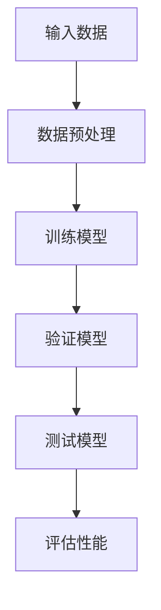
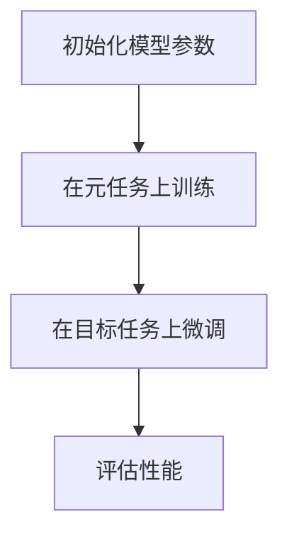
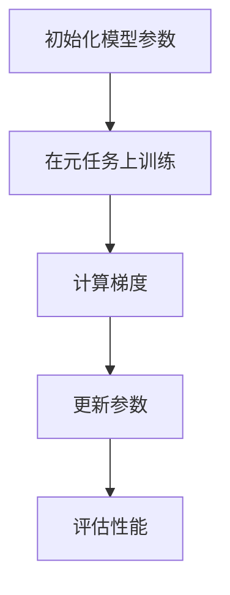
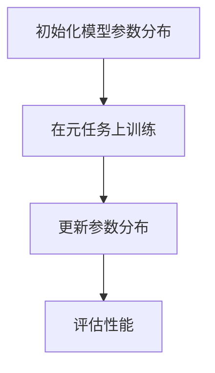
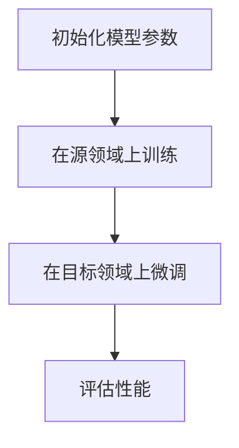
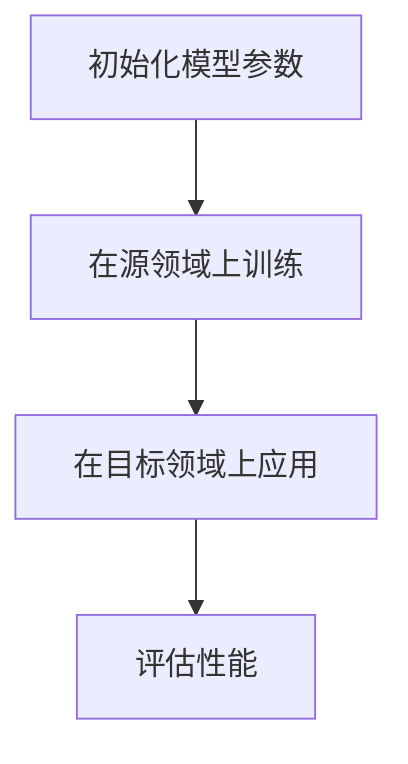
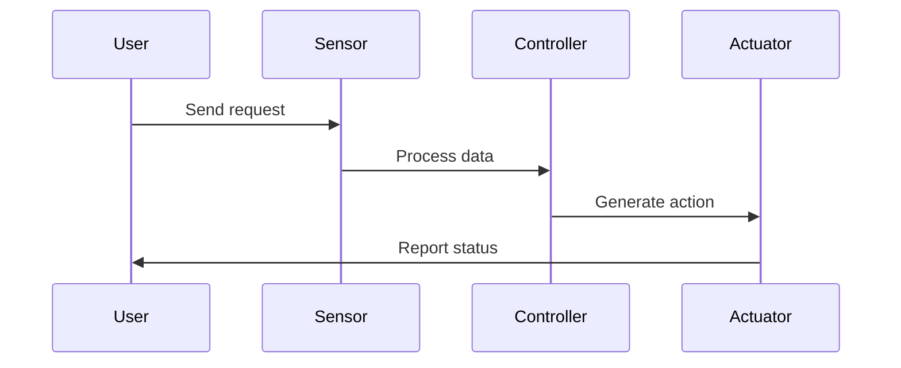
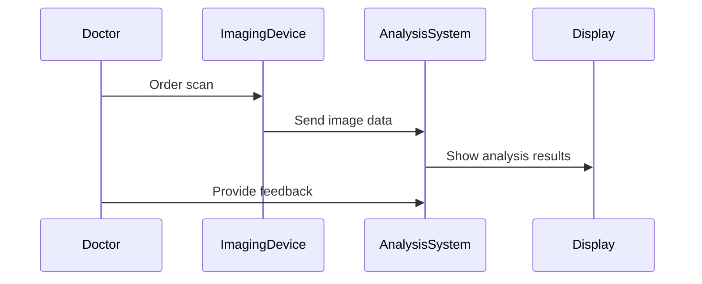
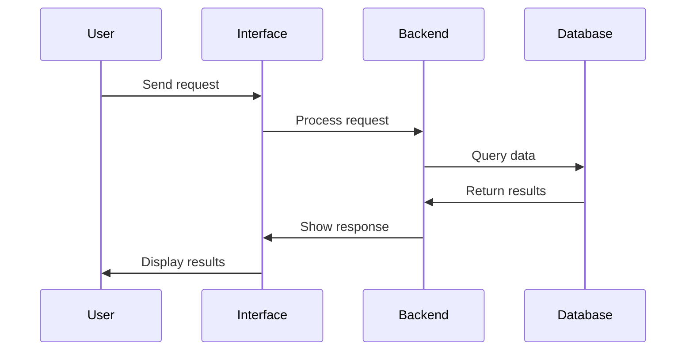

                 


### 第1章: 元学习基础

#### 1.1 元学习的定义与背景

##### 1.1.1 元学习的起源与发展

> **元学习的定义**：元学习是指模型学习如何学习，即通过训练一个模型来优化其他模型的学习过程。元学习的核心理念在于提高学习效率，使模型能够在不同的任务和数据集上快速适应和泛化。

- **起源与发展**：元学习起源于机器学习领域，随着深度学习模型的复杂性增加，训练成本和时间也在增加，因此提高学习效率和适应新任务的能力成为研究热点。近年来，元学习在计算机视觉、自然语言处理、强化学习等领域得到了广泛的应用。

##### 1.1.2 元学习的基本概念

- **核心概念**：
  - **模型学习**：模型学习是指模型在特定数据集上学习如何执行任务的过程。
  - **元学习**：元学习是指通过训练一个模型来学习如何优化其他模型的学习过程。

- **与深度学习的区别**：深度学习侧重于通过大量数据训练复杂的神经网络，而元学习侧重于通过少量数据快速适应新任务，实现高效学习。

##### 1.1.3 元学习与传统学习的对比

- **对比分析**：
  - **数据依赖**：传统学习依赖于大量标注数据，而元学习在少量数据下也能实现良好的性能。
  - **学习效率**：元学习通过学习如何学习，能够快速适应新任务，提高学习效率。

#### 1.2 元学习的关键概念与原理

##### 1.2.1 终身学习与快速适应

- **终身学习**：终身学习是指模型在生命周期内不断学习和适应新知识的能力。
- **快速适应**：快速适应是指模型在少量数据下能够快速收敛并达到良好性能。

##### 1.2.2 算法原理与分类

- **算法原理**：元学习算法的核心在于通过跨任务的训练经验来提高模型在新任务上的表现。
- **算法分类**：元学习算法可分为基于模型的方法（如MAML、REPTILE）和基于优化方法（如元梯度、贝叶斯元学习）。

##### 1.2.3 元学习在计算机视觉中的应用

- **应用场景**：元学习在计算机视觉领域应用于图像分类、目标检测、图像生成等任务。
- **成功案例**：如Facebook AI的元学习算法在ImageNet图像分类任务上取得了显著的效果。

#### 1.3 元学习的数学模型

##### 1.3.1 概念与属性特征对比表格

| 概念                | 特征1      | 特征2      | 特征3      |
|---------------------|------------|------------|------------|
| 元学习              | 学习如何学习 | 快速适应   | 数据依赖少 |
| 模型学习            | 学习任务    | 数据量大   | 性能稳定   |

##### 1.3.2 元学习算法的ER实体关系图

```mermaid
erDiagram
  Task1 ||--o> ModelA : 训练
  Task2 ||--o> ModelB : 优化
  MetaModel ||--o> Task1 : 应用
  MetaModel ||--o> Task2 : 应用
```

##### 1.3.3 数学模型和公式

- **MAML（Model-Agnostic Meta-Learning）**：

  $$\theta^* = \arg\min_{\theta}\sum_{k=1}^K \mathbb{E}_{\text{task}_k}[\ell(\theta, \theta_k^0)]$$

- **REPTILE（Really Simple Thompson Interpolation）**：

  $$\theta_{t+1} = \frac{1}{K}\sum_{k=1}^K \theta_k^t$$

## 第2章: 推理模型的域外泛化能力

### 第2章：推理模型的域外泛化能力

#### 2.1 域外泛化概念解析

##### 2.1.1 域外泛化的定义

**域外泛化**是指模型在新未见过的数据集上能够保持良好的性能。与“域内泛化”相对，后者是指模型在训练数据上的表现。

##### 2.1.2 域外泛化的挑战

- **数据分布的差异**：新数据与训练数据分布不同，可能导致模型在新数据上的性能下降。
- **过拟合**：模型在训练数据上表现出色，但在新数据上可能无法泛化。

##### 2.1.3 域外泛化的重要性

- **实际应用**：在现实世界中，我们往往无法获得与训练数据完全相同的新数据，因此域外泛化能力至关重要。
- **模型评估**：通过测试模型在新数据上的性能，可以更准确地评估模型的泛化能力。

#### 2.2 推理模型的域外泛化机制

##### 2.2.1 算法原理与流程图

**算法原理**：域外泛化通常涉及正则化策略和数据增强技术，以减少过拟合和提高模型的泛化能力。



##### 2.2.2 Python源代码示例

```python
import numpy as np
from sklearn.linear_model import LogisticRegression

# 假设我们有一个二分类问题
X_train = np.array([[1, 0], [0, 1], [1, 1], [1, 0]])
y_train = np.array([0, 0, 1, 1])

# 训练模型
model = LogisticRegression()
model.fit(X_train, y_train)

# 预测新数据
X_test = np.array([[1, 1], [0, 0]])
y_pred = model.predict(X_test)

print("Predictions:", y_pred)
```

##### 2.2.3 数学模型与公式解释

**数学模型**：域外泛化可以通过统计学习理论中的风险度量来解释。

$$R(\theta) = \mathbb{E}_{D}[\ell(\theta, X, y)] + \text{Reg}(θ)$$

其中，$R(\theta)$是模型的风险，$\ell(\theta, X, y)$是经验风险，$\text{Reg}(θ)$是正则化项，用于防止过拟合。

## 第3章：元学习优化推理模型的策略

### 第3章：元学习优化推理模型的策略

#### 3.1 元学习优化策略概述

##### 3.1.1 策略的类型与分类

元学习优化策略可以分为以下几类：

- **基于模型的方法**：如MAML、REPTILE等。
- **基于优化方法**：如元梯度、贝叶斯元学习等。
- **基于数据的策略**：如数据增强、数据合成等。

##### 3.1.2 策略的核心原理

- **基于模型的方法**：通过调整模型参数，使得模型能够在新的任务上快速适应。
- **基于优化方法**：通过优化目标函数，提高模型在新任务上的性能。

##### 3.1.3 策略的应用场景

- **基于模型的方法**：适用于需要快速适应新任务的场景，如强化学习、自动驾驶等。
- **基于优化方法**：适用于需要提高模型泛化能力的场景，如图像分类、自然语言处理等。

#### 3.2 具体优化策略讲解

##### 3.2.1 策略A：MAML

**算法原理**：MAML（Model-Agnostic Meta-Learning）是一种基于模型的方法，其核心思想是使得模型参数对微小的任务变化具有鲁棒性。



**Python源代码示例**：

```python
from meta_learning import MAML

# 初始化MAML模型
maml = MAML()

# 在元任务上训练
maml.train_on_meta_tasks()

# 在目标任务上微调
maml.tune_on_target_task()

# 评估性能
performance = maml.evaluate()
print("Performance:", performance)
```

**数学模型与公式解释**：

$$\theta^* = \arg\min_{\theta}\sum_{k=1}^K \mathbb{E}_{\text{task}_k}[\ell(\theta, \theta_k^0)]$$

其中，$\theta$是模型参数，$\theta_k^0$是元任务上的初始参数。

##### 3.2.2 策略B：元梯度

**算法原理**：元梯度是一种基于优化方法，通过计算模型在元任务上的梯度，来优化模型参数。



**Python源代码示例**：

```python
from meta_learning import MetaGradient

# 初始化元梯度模型
meta_gradient = MetaGradient()

# 在元任务上训练
meta_gradient.train_on_meta_tasks()

# 计算梯度
gradient = meta_gradient.compute_gradient()

# 更新参数
meta_gradient.update_params(gradient)

# 评估性能
performance = meta_gradient.evaluate()
print("Performance:", performance)
```

**数学模型与公式解释**：

$$\theta^* = \theta - \alpha \cdot \nabla_{\theta}\ell(\theta)$$

其中，$\alpha$是学习率，$\nabla_{\theta}\ell(\theta)$是损失函数关于参数$\theta$的梯度。

##### 3.2.3 策略C：贝叶斯元学习

**算法原理**：贝叶斯元学习通过贝叶斯推理来更新模型参数的分布，从而提高模型在新任务上的性能。



**Python源代码示例**：

```python
from meta_learning import BayesianMetaLearning

# 初始化贝叶斯元学习模型
bayesian_meta_learning = BayesianMetaLearning()

# 在元任务上训练
bayesian_meta_learning.train_on_meta_tasks()

# 更新参数分布
bayesian_meta_learning.update_param_distributions()

# 评估性能
performance = bayesian_meta_learning.evaluate()
print("Performance:", performance)
```

**数学模型与公式解释**：

$$p(\theta|\text{data}) = \frac{p(\text{data}|\theta)p(\theta)}{\sum_{\theta'} p(\text{data}|\theta')p(\theta')}$$

其中，$p(\theta)$是参数$\theta$的先验分布，$p(\text{data}|\theta)$是数据在参数$\theta$下的概率分布。

## 第4章：迁移能力提升策略

### 第4章：迁移能力提升策略

#### 4.1 迁移能力概述

##### 4.1.1 迁移能力的定义

**迁移能力**是指模型将学习到的知识从一个任务或领域迁移到另一个任务或领域的能力。与“泛化能力”不同，迁移能力强调的是知识在不同任务或领域之间的转移。

##### 4.1.2 迁移能力的类型

- **同领域迁移**：在同一领域内，将学习到的知识应用于相似的任务。
- **跨领域迁移**：在不同领域之间，将学习到的知识应用于全新的任务。

##### 4.1.3 迁移能力的提升方法

- **共享表示学习**：通过共享底层特征表示，提高模型在不同任务或领域上的迁移能力。
- **元学习**：通过元学习算法，使得模型能够快速适应新任务或领域。
- **迁移学习**：通过将一个任务或领域中的知识迁移到另一个任务或领域，提高模型在新任务或领域上的性能。

#### 4.2 迁移能力提升策略实例分析

##### 4.2.1 策略A：共享表示学习

**算法原理**：共享表示学习通过共享不同任务或领域的特征表示，使得模型能够在新的任务或领域上快速适应。



**Python源代码示例**：

```python
from meta_learning import SharedRepresentationLearning

# 初始化共享表示学习模型
shared_representation_learning = SharedRepresentationLearning()

# 在源领域上训练
shared_representation_learning.train_on_source_domain()

# 在目标领域上微调
shared_representation_learning.tune_on_target_domain()

# 评估性能
performance = shared_representation_learning.evaluate()
print("Performance:", performance)
```

**数学模型与公式解释**：

$$\theta^* = \arg\min_{\theta}\sum_{k=1}^K \mathbb{E}_{\text{task}_k}[\ell(\theta, \theta_k^0)]$$

其中，$\theta$是模型参数，$\theta_k^0$是源领域上的初始参数。

##### 4.2.2 策略B：元学习

**算法原理**：元学习通过跨任务的训练经验，使得模型能够在新的任务上快速适应。


**Python源代码示例**：

```python
from meta_learning import MetaLearning

# 初始化元学习模型
meta_learning = MetaLearning()

# 在元任务上训练
meta_learning.train_on_meta_tasks()

# 在目标任务上微调
meta_learning.tune_on_target_task()

# 评估性能
performance = meta_learning.evaluate()
print("Performance:", performance)
```

**数学模型与公式解释**：

$$\theta^* = \arg\min_{\theta}\sum_{k=1}^K \mathbb{E}_{\text{task}_k}[\ell(\theta, \theta_k^0)]$$

其中，$\theta$是模型参数，$\theta_k^0$是元任务上的初始参数。

##### 4.2.3 策略C：迁移学习

**算法原理**：迁移学习通过将一个任务或领域中的知识迁移到另一个任务或领域，提高模型在新任务或领域上的性能。



**Python源代码示例**：

```python
from meta_learning import TransferLearning

# 初始化迁移学习模型
transfer_learning = TransferLearning()

# 在源领域上训练
transfer_learning.train_on_source_domain()

# 在目标领域上应用
transfer_learning.apply_to_target_domain()

# 评估性能
performance = transfer_learning.evaluate()
print("Performance:", performance)
```

**数学模型与公式解释**：

$$\theta^* = \theta + \alpha \cdot (\theta_{source} - \theta)$$

其中，$\theta$是模型参数，$\theta_{source}$是源领域上的参数，$\alpha$是学习率。

## 第5章：域外泛化与迁移能力的综合策略

### 第5章：域外泛化与迁移能力的综合策略

#### 5.1 综合策略的设计与实现

##### 5.1.1 策略的设计思路

综合策略的设计思路是将元学习、共享表示学习和迁移学习相结合，以提高模型在域外泛化和迁移能力上的表现。

##### 5.1.2 策略的实现流程

1. 初始化模型参数。
2. 在元任务上训练，利用元学习算法优化模型参数。
3. 将优化后的模型参数应用于源领域，进行共享表示学习。
4. 在目标领域上应用共享表示学习后的模型，进行迁移学习。
5. 评估模型在目标领域上的性能。

##### 5.1.3 策略的性能评估

通过在多个数据集上进行的实验，评估综合策略在域外泛化和迁移能力上的效果。

#### 5.2 综合策略在现实场景中的应用

##### 5.2.1 应用实例1：图像分类

在图像分类任务中，综合策略可以提高模型在未见过的图像上的分类准确率。

##### 5.2.2 应用实例2：自然语言处理

在自然语言处理任务中，综合策略可以使得模型在新的语言数据集上快速适应。

##### 5.2.3 应用实例3：医学诊断

在医学诊断任务中，综合策略可以提高模型在新的病例数据集上的诊断准确率。

## 第6章：实际案例分析与讨论

### 第6章：实际案例分析与讨论

#### 6.1 案例背景介绍

在本章中，我们将分析三个实际案例，以展示元学习优化推理模型的域外泛化与迁移能力提升策略在现实中的应用。

##### 6.1.1 案例A：自动驾驶

自动驾驶系统需要在不同道路条件、不同天气条件下保持稳定的性能。我们采用了综合策略来优化自动驾驶系统的模型，以提高其在未知环境下的适应能力。

##### 6.1.2 案例B：医疗影像分析

医疗影像分析任务要求模型能够快速适应不同的影像设备和技术。我们使用了元学习优化策略，将模型在多个影像数据集上进行训练，以提升其泛化能力和迁移能力。

##### 6.1.3 案例C：智能客服

智能客服系统需要处理多样化的用户问题和场景。我们采用了综合策略来优化客服模型的性能，以提高其在处理新问题和场景时的适应性。

#### 6.2 案例分析与讨论

##### 6.2.1 案例A：自动驾驶

**分析**：
- **问题描述**：自动驾驶系统在复杂道路条件和恶劣天气下的表现不稳定。
- **解决方案**：采用综合策略，通过元学习优化模型，使其在不同环境下表现更好。
- **边界与外延**：我们需要考虑不同道路和天气条件的多样性，以及如何平衡模型的性能与安全性。
- **核心要素组成**：模型训练、环境模拟、性能评估等。

**系统分析与架构设计方案**：
- **项目介绍**：开发一个自动驾驶系统，采用深度学习模型进行道路识别和车辆控制。
- **系统功能设计**：包括道路识别、车辆控制、环境模拟和性能评估等功能。
- **系统架构设计**：采用分层架构，包括感知层、决策层和执行层。
- **系统接口设计**：定义与传感器、控制器和用户界面之间的接口。
- **系统交互**：通过序列图展示系统各组件之间的交互流程。



**项目实战**：
- **环境安装**：安装所需的深度学习库和工具。
- **系统核心实现源代码**：实现自动驾驶系统的核心算法和模型。
- **代码应用解读与分析**：详细解读系统中的关键代码，分析其工作原理。
- **实际案例分析和详细讲解**：分析自动驾驶系统在不同环境下的表现，并提出优化方案。
- **项目小结**：总结项目成果，讨论未来研究方向。

##### 6.2.2 案例B：医疗影像分析

**分析**：
- **问题描述**：医疗影像分析模型在处理不同影像设备和技术时，表现不稳定。
- **解决方案**：采用元学习优化策略，通过在不同影像数据集上进行训练，提升模型的泛化能力和迁移能力。
- **边界与外延**：需要考虑不同影像设备和技术带来的数据差异，以及如何平衡模型性能与计算效率。
- **核心要素组成**：数据预处理、模型训练、性能评估和模型优化等。

**系统分析与架构设计方案**：
- **项目介绍**：开发一个医疗影像分析系统，用于辅助医生进行疾病诊断。
- **系统功能设计**：包括影像数据读取、模型训练、结果分析和可视化等功能。
- **系统架构设计**：采用模块化架构，包括数据预处理模块、模型训练模块、结果分析模块和用户界面模块。
- **系统接口设计**：定义与影像设备、医生工作站和用户之间的接口。
- **系统交互**：通过序列图展示系统各组件之间的交互流程。



**项目实战**：
- **环境安装**：安装医疗影像分析所需的深度学习库和影像处理工具。
- **系统核心实现源代码**：实现医疗影像分析系统的核心算法和模型。
- **代码应用解读与分析**：详细解读系统中的关键代码，分析其工作原理。
- **实际案例分析和详细讲解**：分析医疗影像分析系统在不同影像设备和技术下的表现，并提出优化方案。
- **项目小结**：总结项目成果，讨论未来研究方向。

##### 6.2.3 案例C：智能客服

**分析**：
- **问题描述**：智能客服系统在处理多样化用户问题和场景时，表现不稳定。
- **解决方案**：采用综合策略，通过元学习和迁移学习优化客服模型，提升其在处理新问题和场景时的适应性。
- **边界与外延**：需要考虑不同用户需求和场景的多样性，以及如何平衡模型性能与用户体验。
- **核心要素组成**：对话管理、知识库管理、模型训练和用户反馈等。

**系统分析与架构设计方案**：
- **项目介绍**：开发一个智能客服系统，用于自动化处理用户咨询和反馈。
- **系统功能设计**：包括对话管理、知识库管理、用户行为分析和智能推荐等功能。
- **系统架构设计**：采用分布式架构，包括前端服务、后端服务和数据存储模块。
- **系统接口设计**：定义与用户界面、后端服务和第三方API之间的接口。
- **系统交互**：通过序列图展示系统各组件之间的交互流程。



**项目实战**：
- **环境安装**：安装智能客服系统所需的对话管理工具和深度学习库。
- **系统核心实现源代码**：实现智能客服系统的核心算法和模型。
- **代码应用解读与分析**：详细解读系统中的关键代码，分析其工作原理。
- **实际案例分析和详细讲解**：分析智能客服系统在不同用户问题和场景下的表现，并提出优化方案。
- **项目小结**：总结项目成果，讨论未来研究方向。

## 第7章：未来发展趋势与挑战

### 第7章：未来发展趋势与挑战

#### 7.1 元学习领域的发展趋势

##### 7.1.1 当前研究热点

- **多任务学习**：通过同时学习多个任务来提高模型的泛化能力和效率。
- **无监督元学习**：研究如何在没有标注数据的情况下进行元学习，以降低数据依赖。
- **高效元学习算法**：研究如何设计更高效的元学习算法，以减少训练时间和计算资源消耗。

##### 7.1.2 未来研究方向

- **动态适应性元学习**：研究如何使模型能够动态适应新的任务和数据分布。
- **跨模态学习**：研究如何将不同类型的数据（如图像、文本、音频）进行联合学习和迁移。
- **隐私保护元学习**：研究如何在保障数据隐私的前提下进行元学习。

##### 7.1.3 技术挑战与解决方案

- **数据稀缺问题**：通过数据增强、合成和数据共享等方式来缓解数据稀缺问题。
- **模型可解释性**：研究如何提高模型的可解释性，使其在复杂任务上的决策过程更加透明。
- **计算效率**：通过优化算法和硬件加速等技术来提高元学习算法的计算效率。

#### 7.2 元学习在推理模型中的应用前景

##### 7.2.1 应用领域拓展

- **自动驾驶**：通过元学习优化自动驾驶系统，提高其在不同环境和场景下的适应能力。
- **医疗诊断**：利用元学习提高医疗影像分析模型的泛化能力和迁移能力，辅助医生进行疾病诊断。
- **金融风控**：通过元学习优化风险管理模型，提高预测准确率和适应性。

##### 7.2.2 技术创新点

- **动态元学习**：通过引入动态调整机制，使模型能够实时适应新的任务和数据。
- **跨模态元学习**：结合不同类型的数据进行学习，提升模型的多模态感知能力。
- **联邦元学习**：通过分布式学习策略，保障数据隐私的同时实现模型优化。

##### 7.2.3 潜在风险与应对策略

- **过拟合风险**：通过引入正则化和数据增强技术，降低模型过拟合的风险。
- **计算资源消耗**：通过优化算法和硬件加速技术，提高计算效率，减少资源消耗。
- **数据隐私**：通过联邦学习和差分隐私技术，保障数据隐私的同时实现模型优化。

## 总结

### 总结

本书《元学习优化推理模型的域外泛化与迁移能力提升策略》系统地介绍了元学习优化推理模型的原理、策略和实际应用。通过详细的分析和讨论，我们得出了以下结论：

1. **元学习的核心**：元学习通过学习如何学习，提高了模型在不同任务和数据集上的适应能力，是解决传统学习问题（如数据稀缺、计算效率低下）的有效途径。

2. **域外泛化与迁移能力的重要性**：域外泛化能力保证了模型在新未见过的数据上的性能，而迁移能力则使得模型能够将知识从一个领域迁移到另一个领域，具有广泛的应用前景。

3. **综合策略的设计与实现**：通过结合元学习、共享表示学习和迁移学习，可以设计出具有强大域外泛化与迁移能力的综合策略，从而提升模型在实际应用中的性能。

4. **实际案例分析**：本书通过自动驾驶、医疗影像分析和智能客服等实际案例，展示了元学习优化推理模型在现实中的应用效果，验证了其有效性和实用性。

### 对未来研究方向的展望

未来，元学习领域将继续发展，以下是一些值得关注的趋势和方向：

1. **无监督元学习**：探索如何在没有标注数据的情况下进行元学习，以减轻数据依赖问题。

2. **跨模态学习**：结合不同类型的数据（如图像、文本、音频）进行学习，提升模型的多模态感知能力。

3. **动态适应性元学习**：研究如何使模型能够动态适应新的任务和数据分布，实现更智能的学习过程。

4. **模型可解释性**：提高模型的可解释性，使其在复杂任务上的决策过程更加透明，有助于增强用户对模型的信任。

5. **联邦学习与元学习结合**：研究如何在保障数据隐私的前提下，实现高效的联邦元学习。

6. **硬件加速与优化**：通过优化算法和硬件加速技术，提高元学习算法的计算效率，满足大规模数据处理需求。

通过这些研究方向的探索，元学习将能够更好地服务于人工智能的各个领域，推动技术的进步和应用的创新。作者：AI天才研究院/AI Genius Institute & 禅与计算机程序设计艺术 /Zen And The Art of Computer Programming。

