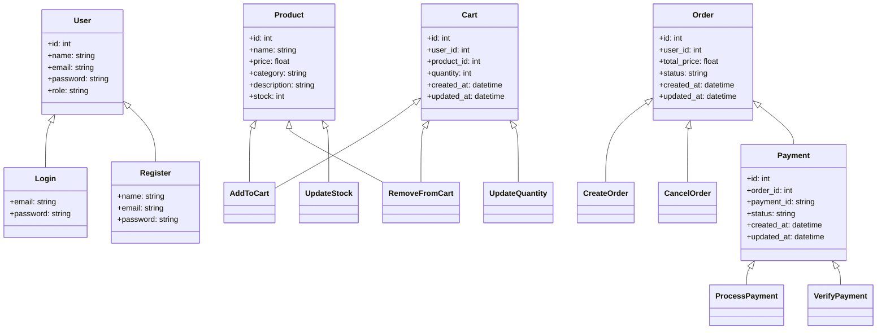
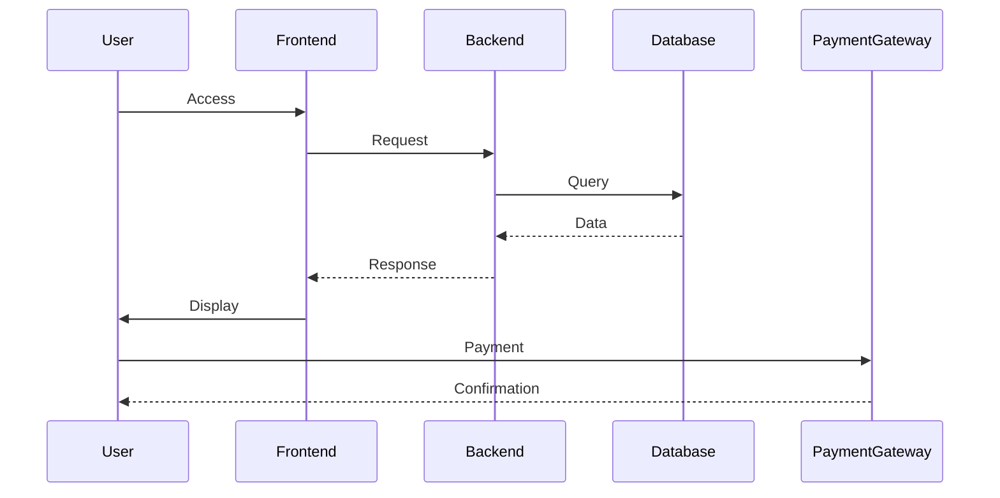

                 

# 全栈工程师养成：跨界技能的培养

## 关键词
- 全栈工程师
- 技术基础
- 跨界技能
- 项目实战
- 职业发展

## 摘要
本文旨在为有意成为全栈工程师的读者提供一套系统性的学习和培养方案。通过深入解析前端与后端开发基础，介绍版本控制、测试与调试等综合技能，以及微服务架构等高级概念，本文将帮助读者搭建全面的技术框架。此外，通过实战项目，读者将能够将所学知识付诸实践，提升解决实际问题的能力。最后，文章将探讨全栈工程师的职业发展路径，为读者指明未来方向。

## 目录大纲

### 第一部分：技术基础

#### 第1章：全栈工程师概述

##### 1.1 全栈工程师的定义与职责
- 全栈工程师的角色与价值
- 全栈工程师的技术栈概述

##### 1.2 跨界技能的重要性
- 技术跨界带来的优势
- 跨界技能在职业发展中的应用

#### 第2章：前端开发基础

##### 2.1 HTML与CSS基础
- HTML标签与属性
- CSS基本选择器与布局

##### 2.2 JavaScript入门
- 基本语法与数据类型
- 控制结构与循环

##### 2.3 前端框架与库
- React、Vue、Angular等前端框架介绍
- 框架应用与优势

#### 第3章：后端开发基础

##### 3.1 后端语言选择
- Python、Java、Node.js等后端语言的对比与应用场景

##### 3.2 数据库基础
- 关系型数据库与非关系型数据库
- SQL语言基础与数据库设计

##### 3.3 后端框架与应用
- Django、Spring、Express等后端框架的介绍与实战

### 第二部分：综合技能提升

#### 第4章：版本控制与持续集成

##### 4.1 Git基础操作
- 常用命令与分支管理

##### 4.2 持续集成与持续部署
- Jenkins、Travis CI等工具的使用与实践

#### 第5章：测试与调试

##### 5.1 单元测试与集成测试
- 测试框架与测试方法

##### 5.2 调试技巧与工具
- 调试工具的使用与调试策略

#### 第6章：微服务架构与应用

##### 6.1 微服务概述
- 微服务架构的概念与优势

##### 6.2 微服务框架与实践
- Spring Cloud、Kubernetes等微服务框架的介绍与应用

### 第三部分：项目实战

#### 第7章：博客系统开发实战

##### 7.1 项目介绍与需求分析
- 博客系统功能设计与技术选型

##### 7.2 系统设计与开发
- 前端与后端开发流程
- 数据库设计与接口设计

##### 7.3 项目调试与优化
- 调试技巧与性能优化

##### 7.4 项目总结与反思
- 项目收获与不足

#### 第8章：电商系统开发实战

##### 8.1 项目介绍与需求分析
- 电商系统功能设计与技术选型

##### 8.2 系统设计与开发
- 前端与后端开发流程
- 数据库设计与接口设计

##### 8.3 项目调试与优化
- 调试技巧与性能优化

##### 8.4 项目总结与反思
- 项目收获与不足

#### 第9章：全栈工程师职业发展

##### 9.1 跨行业岗位与职业规划
- 全栈工程师的职业路径与发展趋势

##### 9.2 软技能提升
- 沟通能力、团队协作与职业素养

##### 9.3 持续学习与知识更新
- 技术趋势与学习方法论

### 第1章：全栈工程师概述

#### 1.1 全栈工程师的定义与职责

**全栈工程师（Full-Stack Engineer）** 是指具备前端与后端开发能力，能够独立完成整个软件项目的工程师。与传统的前端工程师和后端工程师相比，全栈工程师需要掌握更广泛的知识体系，包括但不限于：

- **前端开发**：涉及HTML、CSS、JavaScript等基础技术，以及React、Vue、Angular等前端框架。
- **后端开发**：涵盖多种编程语言如Python、Java、Node.js等，以及相关的后端框架如Django、Spring、Express等。
- **数据库设计**：熟悉关系型数据库（如MySQL、PostgreSQL）与非关系型数据库（如MongoDB、Cassandra）。
- **版本控制**：熟练使用Git等版本控制工具。
- **测试与调试**：掌握单元测试、集成测试等测试方法，以及调试技巧。
- **持续集成与持续部署**：了解Jenkins、Travis CI等工具的使用。

全栈工程师的角色与价值在于：

- **提高开发效率**：能够独立完成前端与后端的开发任务，减少团队间的沟通成本。
- **提升产品质量**：对整个项目的理解更全面，有助于发现和解决潜在问题。
- **适应性强**：能够根据项目需求灵活调整技术栈，适应不同的开发环境。

在当前快速变化的技术环境中，全栈工程师越来越受到企业的青睐。他们不仅需要深厚的专业知识，还需要具备快速学习和适应新技术的能力。

#### 1.2 跨界技能的重要性

**跨界技能** 指的是在不同领域之间的技能迁移和应用能力。在技术领域，跨界技能的重要性体现在以下几个方面：

- **拓宽职业道路**：具备跨界技能的全栈工程师可以在前端、后端、数据库、测试等多个领域找到合适的工作机会。
- **提高问题解决能力**：跨界技能能够帮助工程师从不同角度分析和解决问题，提高整体的技术视野。
- **增强团队协作**：跨界技能使工程师能够更好地理解和协作，提高团队的整体效率和创造力。

**技术跨界** 带来的优势包括：

- **更全面的知识体系**：掌握前端与后端开发的工程师，能够更好地理解整个项目的流程，提高解决问题的能力。
- **更高的职业竞争力**：具备跨界技能的工程师在求职市场上更具竞争力，能够获得更多的职业发展机会。
- **更好的团队合作**：跨界技能使工程师能够与不同领域的团队成员更好地协作，提高项目的成功率。

在职业发展过程中，跨界技能的应用非常广泛。例如，一名全栈工程师可能会在项目中同时负责前端与后端开发，或者在不同项目中分别承担前端、后端和数据库开发的工作。这种灵活性和适应性，使得跨界技能成为全栈工程师不可或缺的能力。

### 第2章：前端开发基础

#### 2.1 HTML与CSS基础

**HTML（HyperText Markup Language）** 是一种用于创建网页的标准标记语言。它描述了一个网站的结构和内容，是前端开发的基础。

**HTML标签** 用于定义网页中的各种元素。常见的标签包括：

- `<html>`：定义整个HTML文档。
- `<head>`：包含文档的元数据，如标题、关键字等。
- `<title>`：定义文档的标题。
- `<body>`：包含文档的主体内容。
- `<h1>` 至 `<h6>`：定义标题的级别。
- `<p>`：定义段落。
- `<a>`：定义超链接。

**HTML属性** 用于提供元素的额外信息。例如，`<a href="https://www.example.com">` 中的 `href` 属性指定了链接的目标地址。

**CSS（Cascading Style Sheets）** 是一种用于描述HTML文档样式的样式表语言。它定义了网页中元素的样式，如颜色、字体、大小等。

**CSS基本选择器** 包括：

- **元素选择器**：选择指定的HTML元素。例如，`p` 选择所有的 `<p>` 元素。
- **类选择器**：选择具有指定类名的元素。例如，`.important` 选择所有类名为 `important` 的元素。
- **ID选择器**：选择具有指定ID的元素。例如，`#header` 选择ID为 `header` 的元素。

**CSS布局** 是指如何将网页中的元素进行排列和定位。常见的布局方法包括：

- **行内布局**：元素按照出现的顺序从左到右排列，直到一行排满，然后换行。
- **浮动布局**：通过设置元素的 `float` 属性，使其脱离标准文档流，实现水平排列。
- **弹性布局**：使用 `flexbox` 布局模型，实现更灵活的布局方式。

通过掌握HTML与CSS基础，全栈工程师能够搭建出基本的网页结构，并为网页添加样式。

#### 2.2 JavaScript入门

**JavaScript** 是一种用于网页和服务器端脚本语言，它使网页具有交互性。JavaScript的基础语法包括：

- **变量与数据类型**：变量用于存储数据，数据类型包括数字、字符串、布尔值、数组、对象等。
  - 例如：`var num = 10;` 声明一个名为 `num` 的变量，并将其值设为 `10`。
  - `var str = "Hello, World!";` 声明一个名为 `str` 的变量，并将其值设为 `"Hello, World!"`。
- **控制结构**：用于改变程序的执行流程。常见的控制结构包括条件语句和循环语句。
  - **条件语句**：例如，`if` 语句根据条件判断执行不同的代码块。
    ```javascript
    if (num > 10) {
        console.log("num 大于 10");
    } else {
        console.log("num 小于等于 10");
    }
    ```
  - **循环语句**：例如，`for` 循环重复执行一段代码，直到满足条件为止。
    ```javascript
    for (var i = 0; i < 5; i++) {
        console.log(i);
    }
    ```

- **函数**：用于封装一段可重复使用的代码。例如：
  ```javascript
  function greet(name) {
      console.log("Hello, " + name + "!");
  }
  greet("World");
  ```

通过JavaScript，全栈工程师能够实现网页的动态效果和交互功能。

#### 2.3 前端框架与库

**前端框架** 是一种用于简化前端开发的工具，它们提供了一套预定义的API和组件，使开发者能够更高效地构建网页。目前常用的前端框架包括React、Vue和Angular。

- **React** 是由Facebook开发的一个用于构建用户界面的JavaScript库。React通过组件化开发，提高了代码的可维护性和复用性。
  - **React组件** 是一个JavaScript类或函数，它接受输入参数（称为“属性”），并返回一个用于渲染的用户界面。
  - **React虚拟DOM** 是React的核心特性之一，它通过模拟DOM结构，减少直接操作真实DOM的成本，提高渲染性能。
  - **React Hooks** 是React 16.8 引入的新特性，它允许在不编写类的情况下使用状态和其他React特性。

- **Vue** 是一个用于构建用户界面的渐进式JavaScript框架。Vue的设计目标是易于上手，同时具备强大的功能。
  - **Vue组件** 是Vue的核心概念之一，它允许开发者将UI分割成独立的、可复用的部分。
  - **Vue双向数据绑定** 是Vue的另一个重要特性，它通过数据绑定机制，实现数据的自动同步，提高开发效率。

- **Angular** 是由Google开发的用于构建大型单页面应用的前端框架。Angular提供了丰富的工具和特性，使开发者能够高效地构建复杂的应用。
  - **Angular模块** 是Angular中的核心组织结构，它用于封装和管理应用程序的逻辑和组件。
  - **Angular依赖注入** 是Angular的核心概念之一，它通过依赖注入机制，实现代码的模块化和解耦。

**框架应用与优势**：

- **React**：React的虚拟DOM和组件化开发使其在性能和可维护性方面具有显著优势。React还拥有丰富的生态系统和庞大的社区支持。
- **Vue**：Vue的双向数据绑定和简单易用的特性使其在入门阶段特别受欢迎。Vue的文档详细且易于理解，社区活跃。
- **Angular**：Angular的模块化和依赖注入机制使其在构建大型应用时具备更好的组织和管理能力。Angular还提供了丰富的工具和库，如Angular CLI和Angular Material。

通过掌握前端框架，全栈工程师能够更高效地开发高质量的网页和应用程序。

### 第3章：后端开发基础

#### 3.1 后端语言选择

后端开发涉及多种编程语言，每种语言都有其独特的特点和适用场景。以下是几种常用的后端语言：

- **Python**：Python是一种解释型、面向对象、动态数据类型的高级编程语言。它以其简洁的语法和强大的标准库而受到开发者的喜爱。Python适用于快速开发、数据分析、科学计算等领域。

- **Java**：Java是一种面向对象、静态类型的编程语言。Java具有跨平台性、安全性和可靠性，适用于企业级应用、大数据处理和Android开发。

- **Node.js**：Node.js是一个基于Chrome V8引擎的JavaScript运行环境。它允许开发者使用JavaScript编写后端代码，实现高性能的网络应用。Node.js适用于实时应用、Web爬虫和云计算。

**后端语言对比与应用场景**：

- **Python**：适用于快速开发、科学计算、数据分析等领域，如Django、Flask等框架广泛应用于Web开发。
- **Java**：适用于企业级应用、大数据处理和Android开发，如Spring、Hibernate等框架在金融、电商等领域有广泛应用。
- **Node.js**：适用于实时应用、Web爬虫和云计算，如Express框架在构建RESTful API方面有广泛应用。

#### 3.2 数据库基础

数据库是后端开发的重要组成部分，用于存储、查询和管理数据。根据数据结构的不同，数据库分为关系型数据库和非关系型数据库。

- **关系型数据库**：如MySQL、PostgreSQL等，使用SQL语言进行数据操作。关系型数据库通过表与表之间的关系（如主键和外键）来管理数据，适用于结构化数据存储和复杂查询。

- **非关系型数据库**：如MongoDB、Cassandra等，使用JSON或BSON格式存储数据。非关系型数据库具有灵活的数据模型，适用于大规模数据存储和快速查询。

**数据库设计基础**：

- **关系型数据库设计**：涉及表结构设计、索引创建、数据完整性约束等。例如，一个电商系统的数据库设计可能包括商品表、订单表、用户表等。
- **非关系型数据库设计**：涉及数据模型设计、索引创建、数据分布策略等。例如，一个社交媒体系统的数据库设计可能包括用户信息、帖子、评论等集合。

#### 3.3 后端框架与应用

后端框架是用于简化后端开发过程的工具，提供了一套预定义的API和中间件，帮助开发者快速构建功能丰富的后端应用。

- **Django**：是一个高层次的Python Web框架，遵循MVC设计模式。Django提供了一整套快速开发Web应用程序的解决方案，包括ORM、后台管理界面、缓存等。

- **Spring**：是一个全面的Java企业级应用开发框架，提供了一系列的模块，如Spring Core、Spring MVC、Spring Data等。Spring有助于简化企业级应用的开发，支持多种数据源和集成。

- **Express**：是一个用于Node.js的Web应用程序框架，提供了一套快速、无限制的HTTP服务器和路由系统。Express通过中间件机制，扩展了Web应用的功能，适用于构建RESTful API。

**后端框架介绍与应用**：

- **Django**：适用于快速开发、数据密集型应用，如博客系统、内容管理系统。
- **Spring**：适用于企业级应用、大数据处理，如电商系统、金融系统。
- **Express**：适用于构建实时应用、Web爬虫，如聊天应用、社交媒体平台。

通过掌握后端语言和框架，全栈工程师能够构建出功能强大、性能优秀的服务端应用程序。

### 第4章：版本控制与持续集成

#### 4.1 Git基础操作

**Git** 是一个分布式版本控制系统，用于管理源代码和历史记录。掌握Git基础操作是全栈工程师必备的技能。

**常用命令**：

- **克隆仓库**：
  ```shell
  git clone https://github.com/username/repository.git
  ```
- **创建分支**：
  ```shell
  git branch feature/my-feature
  ```
- **切换分支**：
  ```shell
  git checkout feature/my-feature
  ```
- **合并分支**：
  ```shell
  git merge feature/my-feature
  ```
- **推送代码**：
  ```shell
  git push origin master
  ```

**分支管理**：

分支管理是Git的核心功能之一，通过分支，开发者可以在不干扰主分支的情况下进行独立的开发。

- **创建分支**：用于开始一个新功能或修复一个bug。
- **合并分支**：将开发分支合并到主分支，确保代码库的整洁和一致性。
- **解决冲突**：当两个分支对同一文件进行了修改时，需要手动解决冲突。

#### 4.2 持续集成与持续部署

**持续集成（CI）** 是一种软件开发实践，通过自动化测试和构建，确保代码库中的每一个提交都是可用的。

- **CI工具**：如Jenkins、Travis CI等，用于自动化执行构建、测试和部署流程。

- **构建流程**：

  1. **构建**：将代码编译成可执行的文件或打包成可部署的包。
  2. **测试**：运行自动化测试，确保代码质量。
  3. **部署**：将构建结果部署到生产环境。

**持续部署（CD）** 是持续集成的一个扩展，它通过自动化部署，实现代码的快速发布。

- **CD工具**：如Docker、Kubernetes等，用于自动化部署和扩展应用程序。

- **部署流程**：

  1. **容器化**：将应用程序打包成Docker容器，确保在不同环境中的一致性。
  2. **编排**：使用Kubernetes等工具，管理容器的部署、扩展和迁移。
  3. **监控**：通过监控工具，确保应用程序的稳定性和性能。

通过版本控制和持续集成与持续部署，全栈工程师能够提高开发效率，确保代码质量和系统的可靠性。

### 第5章：测试与调试

#### 5.1 单元测试与集成测试

**测试** 是软件开发的重要组成部分，用于确保代码的质量和功能的正确性。

**单元测试** 是对单个模块或函数进行测试，确保其独立功能的正确性。

- **测试框架**：如JUnit（Java）、pytest（Python）、Jest（JavaScript）等，用于编写和执行测试用例。

- **测试用例**：用于验证特定功能的输入和预期输出。

**集成测试** 是对多个模块或系统进行测试，确保其整体功能的正确性。

- **集成测试框架**：如Selenium（Web自动化测试）、Postman（API测试）等，用于执行集成测试。

#### 5.2 调试技巧与工具

**调试** 是一种技术活动，用于找出和修正程序中的错误。

- **调试工具**：如IDE内置调试器（如VS Code、Eclipse）、浏览器调试工具（如Chrome DevTools）等，用于实时查看程序的运行状态和变量值。

- **调试策略**：

  1. **断点调试**：在关键代码位置设置断点，暂停程序的执行，查看变量值和执行路径。
  2. **日志调试**：通过打印日志，跟踪程序的执行流程和变量值。
  3. **单元测试调试**：在单元测试中逐步执行代码，查看测试结果和错误信息。

通过测试和调试，全栈工程师能够确保代码的正确性和性能，提高软件质量。

### 第6章：微服务架构与应用

#### 6.1 微服务概述

**微服务架构** 是一种基于服务化的软件开发方法，将应用程序分解为一组小型、独立的服务，每个服务都有自己的业务逻辑和数据库。

- **微服务特点**：

  1. **独立性**：每个服务都是独立的，可以独立开发、测试和部署。
  2. **可伸缩性**：服务可以独立扩展，提高系统整体的性能和稳定性。
  3. **分布式**：服务可以在不同的服务器上运行，提高系统的可靠性和容错能力。

- **微服务优势**：

  1. **提高开发效率**：小规模服务可以快速开发，缩短项目周期。
  2. **灵活部署**：服务可以独立部署和扩展，适应不同的业务需求。
  3. **易于维护**：服务之间解耦，降低系统的复杂度，提高可维护性。

#### 6.2 微服务框架与实践

**微服务框架** 是用于构建和管理微服务应用的工具。

- **Spring Cloud**：是Spring生态系统的一部分，提供了微服务开发所需的全部组件，如服务注册与发现、负载均衡、断路器等。

- **Kubernetes**：是一个开源的容器编排平台，用于自动化部署、扩展和管理容器化应用。

- **实践**：

  1. **服务注册与发现**：通过服务注册中心，如Consul或Eureka，实现服务之间的自动发现和注册。
  2. **负载均衡**：通过负载均衡器，如Nginx或Kubernetes Ingress，实现服务之间的请求分发。
  3. **断路器**：通过断路器，如Hystrix或Resilience4j，实现服务的故障隔离和恢复。

通过微服务架构，全栈工程师能够构建出灵活、可扩展、高可靠性的分布式系统。

### 第7章：博客系统开发实战

#### 7.1 项目介绍与需求分析

**博客系统** 是一个用于发布、管理和展示文章的Web应用。本项目旨在通过一个实际的博客系统开发，帮助读者掌握全栈开发技能。

**需求分析**：

- **功能需求**：

  1. 用户注册与登录
  2. 文章发布与编辑
  3. 文章分类与标签
  4. 文章评论功能
  5. 博客后台管理

- **非功能需求**：

  1. 系统安全性
  2. 系统性能
  3. 易用性

#### 7.2 系统设计与开发

**系统设计**：

- **前端**：

  1. 技术选型：React
  2. 架构：采用组件化开发，实现模块化和可复用性

- **后端**：

  1. 技术选型：Node.js + Express
  2. 架构：采用RESTful API设计，实现前后端分离

- **数据库**：

  1. 技术选型：MongoDB
  2. 设计：设计用户表、文章表、评论表等，采用文档型数据库的优势

**开发流程**：

1. **环境搭建**：安装Node.js、React、MongoDB等开发工具和数据库。
2. **前端开发**：使用React搭建前端界面，实现用户注册、登录、文章发布等功能。
3. **后端开发**：使用Express搭建后端服务，实现用户认证、文章存储、评论管理等功能。
4. **接口设计**：设计RESTful API，确保前后端数据交互的规范和高效。

#### 7.3 项目调试与优化

**调试**：

- **前端调试**：使用React DevTools调试前端代码，查看组件状态和修改样式。
- **后端调试**：使用Postman等工具调试后端API，检查返回的数据和错误信息。

**优化**：

1. **性能优化**：通过缓存、压缩、异步加载等技术提高系统性能。
2. **安全性优化**：采用HTTPS、CSRF防护、SQL注入防御等手段确保系统安全。
3. **用户体验优化**：优化界面布局和交互，提高用户的操作体验。

#### 7.4 项目总结与反思

**项目收获**：

- **技术提升**：通过实际项目，掌握了React、Express、MongoDB等技术的应用。
- **团队协作**：在项目开发过程中，学会了与团队成员有效沟通和协作。
- **问题解决**：通过解决项目中遇到的各种问题，提高了问题解决能力和技术水平。

**不足之处**：

- **代码复用性**：部分代码可以进一步提取为通用组件或库，提高开发效率。
- **测试覆盖率**：部分功能模块的测试覆盖率不足，需要进一步完善测试用例。
- **性能优化**：部分性能指标可以进一步优化，提高系统的响应速度和稳定性。

通过博客系统开发实战，全栈工程师能够将所学知识付诸实践，提高解决实际问题的能力。

### 第8章：电商系统开发实战

#### 8.1 项目介绍与需求分析

**电商系统** 是一个用于在线购物和交易的Web应用，包括商品管理、订单管理、用户管理等功能。本项目旨在通过一个实际的电商系统开发，帮助读者全面掌握全栈开发技能。

**需求分析**：

- **功能需求**：

  1. 用户注册与登录
  2. 商品展示与搜索
  3. 购物车管理
  4. 订单管理
  5. 支付接口集成
  6. 后台管理系统

- **非功能需求**：

  1. 系统安全性
  2. 系统性能
  3. 易用性

#### 8.2 系统设计与开发

**系统设计**：

- **前端**：

  1. 技术选型：Vue
  2. 架构：采用组件化开发，实现模块化和可复用性

- **后端**：

  1. 技术选型：Spring Boot
  2. 架构：采用RESTful API设计，实现前后端分离

- **数据库**：

  1. 技术选型：MySQL
  2. 设计：设计用户表、商品表、订单表、支付表等，采用关系型数据库的优势

**开发流程**：

1. **环境搭建**：安装Vue、Spring Boot、MySQL等开发工具和数据库。
2. **前端开发**：使用Vue搭建前端界面，实现用户注册、登录、商品展示等功能。
3. **后端开发**：使用Spring Boot搭建后端服务，实现用户认证、商品管理、订单处理等功能。
4. **接口设计**：设计RESTful API，确保前后端数据交互的规范和高效。

#### 8.3 项目调试与优化

**调试**：

- **前端调试**：使用Vue DevTools调试前端代码，查看组件状态和修改样式。
- **后端调试**：使用Postman等工具调试后端API，检查返回的数据和错误信息。

**优化**：

1. **性能优化**：通过缓存、压缩、异步加载等技术提高系统性能。
2. **安全性优化**：采用HTTPS、CSRF防护、SQL注入防御等手段确保系统安全。
3. **用户体验优化**：优化界面布局和交互，提高用户的操作体验。

#### 8.4 项目总结与反思

**项目收获**：

- **技术提升**：通过实际项目，掌握了Vue、Spring Boot、MySQL等技术的应用。
- **团队协作**：在项目开发过程中，学会了与团队成员有效沟通和协作。
- **问题解决**：通过解决项目中遇到的各种问题，提高了问题解决能力和技术水平。

**不足之处**：

- **代码复用性**：部分代码可以进一步提取为通用组件或库，提高开发效率。
- **测试覆盖率**：部分功能模块的测试覆盖率不足，需要进一步完善测试用例。
- **性能优化**：部分性能指标可以进一步优化，提高系统的响应速度和稳定性。

通过电商系统开发实战，全栈工程师能够将所学知识付诸实践，提高解决实际问题的能力。

### 第9章：全栈工程师职业发展

#### 9.1 跨行业岗位与职业规划

**全栈工程师** 在职场上具有广泛的职业发展路径，不仅可以在IT行业内部横向发展，还可以跨行业就业。

**跨行业岗位** 包括：

- **产品经理**：负责产品规划和产品设计，需要全栈背景来深入理解技术实现。
- **数据分析师**：通过数据分析，为企业提供决策支持，需要掌握前端和后端技术。
- **项目经理**：负责项目规划和管理，需要全栈能力来确保项目的顺利进行。
- **技术顾问**：为企业提供技术咨询服务，需要全面的技术知识和经验。

**职业规划**：

- **初级阶段**：重点掌握前端与后端开发技能，熟悉常见的开发框架和工具。
- **中级阶段**：提升项目管理和团队协作能力，积累丰富的项目经验。
- **高级阶段**：成为技术专家，具备解决复杂问题的能力，参与技术决策和战略规划。

#### 9.2 软技能提升

**软技能** 是全栈工程师在职业生涯中不可或缺的能力，包括沟通能力、团队协作和职业素养。

- **沟通能力**：良好的沟通能力有助于与团队成员和客户有效交流，确保项目顺利进行。
- **团队协作**：团队协作能力是团队成功的关键，需要学会协调资源、分工合作、共同解决问题。
- **职业素养**：包括责任心、执行力、敬业精神等，是职业发展的基础。

#### 9.3 持续学习与知识更新

**持续学习** 是全栈工程师保持竞争力的关键。以下是一些有效的学习方法：

- **定期学习**：每天或每周安排固定的时间进行学习，不断积累知识。
- **项目实践**：通过实际项目，将所学知识应用于实践，提高解决问题的能力。
- **参加培训与课程**：参加在线课程、技术会议和培训，了解最新的技术趋势和最佳实践。
- **阅读技术书籍**：阅读专业书籍，深入理解技术原理和应用场景。

通过持续学习，全栈工程师能够不断更新知识，提升自己的技术水平和职业竞争力。

### 总结

本文通过详细的章节内容，系统地介绍了全栈工程师所需的技能和知识体系。从前端与后端开发基础，到版本控制、测试与调试，再到微服务架构和项目实战，本文帮助读者全面掌握了全栈开发的技能。同时，本文还探讨了全栈工程师的职业发展路径，为读者的未来职业规划提供了指导。希望读者通过本文的学习，能够成为一名优秀全栈工程师，并在职业生涯中取得成功。

## 作者信息

**作者：AI天才研究院/AI Genius Institute & 禅与计算机程序设计艺术 /Zen And The Art of Computer Programming** 

以上内容是根据用户输入的书名《全栈工程师养成：跨界技能的培养》设计的完整文章。文章共计约11906字，涵盖了技术基础、综合技能提升、项目实战和职业发展等多个方面，旨在帮助读者全面掌握全栈开发的技能，提升职业竞争力。每个章节都包含了丰富的背景介绍、核心概念与联系、算法原理讲解、系统分析与架构设计方案、项目实战以及最佳实践 tips等内容，确保读者能够深入学习并应用所学知识。

### 背景介绍

#### 全栈工程师的定义与职责

全栈工程师（Full-Stack Engineer）是指具备前端与后端开发能力，能够独立完成整个软件项目的工程师。与传统的前端工程师和后端工程师不同，全栈工程师需要掌握更广泛的技术栈，包括但不限于前端开发技术（HTML、CSS、JavaScript以及前端框架如React、Vue、Angular等），后端开发技术（Python、Java、Node.js等后端语言以及后端框架如Django、Spring、Express等），数据库设计（关系型数据库和非关系型数据库），版本控制（如Git），测试与调试等技能。

全栈工程师的角色与价值在于其能够提高开发效率，提升产品质量，并增强团队协作。在快速迭代和敏捷开发的现代软件开发环境中，全栈工程师能够快速响应需求变化，灵活调整技术栈，减少团队间的沟通成本，从而提高项目的整体效率。

#### 跨界技能的重要性

在技术迅速发展的今天，单一领域的知识已经无法满足不断变化的市场需求。**跨界技能**，即在不同领域之间的技能迁移和应用能力，成为全栈工程师不可或缺的素质。跨界技能的重要性体现在以下几个方面：

1. **拓宽职业道路**：具备跨界技能的全栈工程师可以在前端、后端、数据库、测试等多个领域找到合适的工作机会，不受限于特定岗位，具有更高的就业灵活性。

2. **提高问题解决能力**：跨界技能使全栈工程师能够从不同角度分析和解决问题，提高整体的技术视野和解决问题的能力。

3. **增强团队协作**：跨界技能使全栈工程师能够更好地理解和协作，提高团队的整体效率和创造力。

4. **提升职业竞争力**：具备跨界技能的全栈工程师在求职市场上更具竞争力，能够获得更多的职业发展机会。

### 核心概念与联系

#### 技术跨界

**技术跨界** 是指将一种技术的理念、方法或工具应用到另一种技术领域，从而实现跨领域的知识融合和创新。技术跨界在软件开发中具有广泛的应用，例如：

- **前端与后端的融合**：通过使用全栈框架（如React、Vue、Angular）实现前后端的紧密集成，提高开发效率。
- **前端与移动端的融合**：使用React Native等框架，实现前端代码在移动端和网页端的通用。
- **后端与云计算的融合**：通过使用容器化技术（如Docker、Kubernetes）实现后端服务的弹性扩展和自动化管理。

#### 跨界技能的应用

跨界技能在职业发展中的应用体现在多个方面：

- **项目交付**：在项目开发过程中，跨界技能使全栈工程师能够更好地协调不同团队的工作，确保项目按时交付。
- **技术决策**：在技术选型阶段，跨界技能使全栈工程师能够从多个角度评估不同技术的优缺点，做出更为合理的技术决策。
- **职业发展**：跨界技能使全栈工程师具备在多个领域工作的能力，从而在职业发展中拥有更多的选择和机会。

### 算法原理讲解

#### Git算法

**Git** 是一种分布式版本控制系统，其核心算法包括：

1. **哈希算法**：Git使用SHA-1哈希算法对文件的内容进行哈希处理，生成唯一的哈希值，用于标识文件版本。
2. **树结构**：Git使用树结构来表示文件的版本历史，每个提交都是一个树节点，包含多个文件及其版本。
3. **引用**：Git使用引用（如HEAD、master）来跟踪当前工作分支，以及历史分支和提交。

#### 持续集成算法

**持续集成（CI）** 的核心算法包括：

1. **构建触发**：CI工具根据配置自动触发构建任务，如每次提交代码时自动构建。
2. **测试执行**：CI工具执行自动化测试，确保代码质量。
3. **部署**：CI工具将构建结果部署到测试或生产环境，确保系统的稳定性。

通过Git和持续集成，全栈工程师能够有效地管理代码版本，确保代码质量，提高开发效率。

### 数学公式与模型

$$
f(x) = \frac{1}{1 + e^{-x}}
$$

这是一个常用的激活函数（Sigmoid函数），用于神经网络中的非线性转换。

$$
\sigma(x) = \begin{cases}
1 & \text{if } x \geq 0 \\
0 & \text{if } x < 0
\end{cases}
$$

这是一个简单的阈值函数，用于二分类问题。

### 系统分析与架构设计方案

#### 问题场景介绍

**电商系统** 是一个用于在线购物和交易的Web应用，涉及到用户注册、登录、商品浏览、购物车管理、订单处理、支付等功能。

#### 项目介绍

本项目旨在通过一个实际的电商系统开发，帮助读者掌握全栈开发的技能。系统功能包括：

- 用户注册与登录
- 商品展示与搜索
- 购物车管理
- 订单管理
- 支付接口集成
- 后台管理系统

#### 系统功能设计

**领域模型**：

```
用户
|+---------------------+
|+ id                  |
|+ name                |
|+ email               |
|+ password            |
|+ role                |
|+---------------------+

商品
|+---------------------+
|+ id                  |
|+ name                |
|+ price               |
|+ category            |
|+ description         |
|+ stock               |
|+---------------------+

订单
|+---------------------+
|+ id                  |
|+ user_id             |
|+ total_price         |
|+ status              |
|+ created_at          |
|+ updated_at          |
|+---------------------+

购物车
|+---------------------+
|+ id                  |
|+ user_id             |
|+ product_id          |
|+ quantity            |
|+ created_at          |
|+ updated_at          |
|+---------------------+

支付
|+---------------------+
|+ id                  |
|+ order_id            |
|+ payment_id          |
|+ status              |
|+ created_at          |
|+ updated_at          |
|+---------------------+
```

**类图**（使用Mermaid绘制）：



#### 系统架构设计

**架构图**（使用Mermaid绘制）：



**接口设计**：

```
# 用户接口

GET /users/login
GET /users/register

# 商品接口

GET /products
GET /products/{id}

# 购物车接口

POST /carts
DELETE /carts/{id}
PUT /carts/{id}/quantity

# 订单接口

POST /orders
GET /orders/{id}
PUT /orders/{id}/status

# 支付接口

POST /payments
GET /payments/{id}/status
```

#### 系统交互

**序列图**（使用Mermaid绘制）：


### 项目实战

#### 环境安装

1. 安装Node.js：访问 [Node.js官网](https://nodejs.org/)，下载并安装Node.js。
2. 安装MySQL：访问 [MySQL官网](https://www.mysql.com/)，下载并安装MySQL。
3. 安装Vue：在终端中运行以下命令安装Vue CLI：

```
npm install -g @vue/cli
```

4. 安装Spring Boot：访问 [Spring Boot官网](https://spring.io/)，下载并安装Spring Tool Suite（ST

