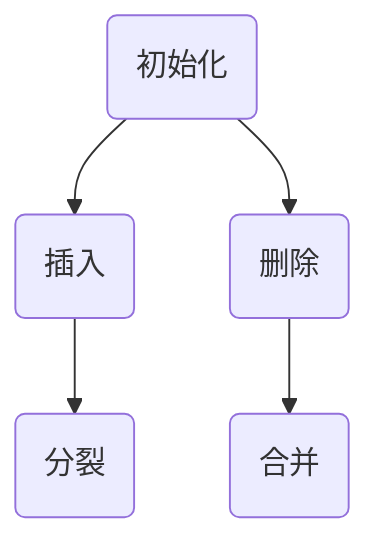
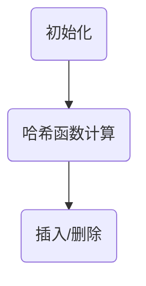
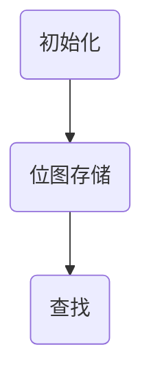
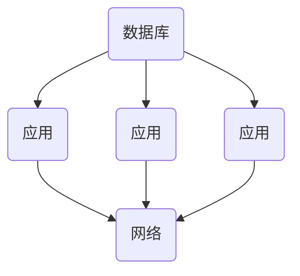
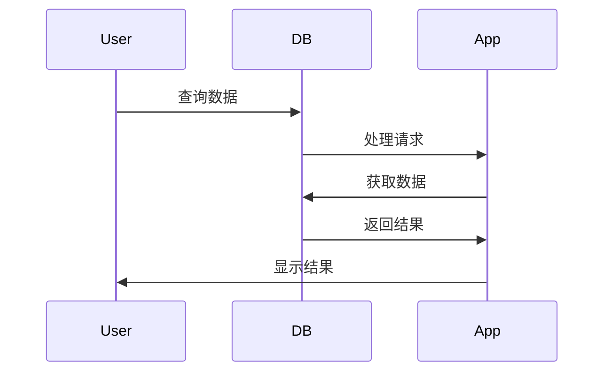

                 

### 关系型数据库优化：索引与查询性能

关键词：关系型数据库、索引优化、查询性能、B-Tree、哈希索引、位图索引

摘要：本文将深入探讨关系型数据库优化中的索引与查询性能问题。我们将从背景介绍开始，逐步分析核心概念、算法原理、数学模型和系统架构设计，最终通过项目实战来展示优化效果。本文旨在为数据库开发者提供全面的技术指南，帮助他们更好地理解和应用索引优化技术，从而提升数据库查询性能。

### 目录大纲设计思路

在设计本文的目录大纲时，我们遵循了以下原则：

1. **明确整体框架**：本文分为五个主要部分，分别是背景介绍、核心概念与联系、算法原理讲解、数学模型和公式讲解、系统分析与架构设计方案。
2. **细化章节内容**：每个部分内部根据内容的不同进行了进一步细化，确保每个章节都有明确的目标和详尽的内容。
3. **确保内容完整性**：在编写目录大纲时，我们确保涵盖了核心章节内容，如背景介绍、核心概念与联系、算法原理讲解、数学模型和公式讲解、系统分析与架构设计方案、项目实战等。
4. **简洁明了**：在编写过程中，我们力求使用简洁明了的语言，确保读者能够轻松理解各个部分的内容。

### 步骤一：背景介绍

#### 第1章：关系型数据库优化概述

**1.1 关系型数据库优化的重要性**

关系型数据库在现代信息系统中占据了重要的地位，它们被广泛应用于各种业务场景，从简单的用户数据管理到复杂的在线交易系统。随着数据规模的不断增长和复杂查询需求的增加，如何优化关系型数据库的性能成为了一个关键问题。

**1.2 关系型数据库优化的挑战**

- **数据规模的增长**：随着数据量的增加，数据库的性能往往会受到影响，特别是查询性能。
- **复杂查询需求的增加**：现代应用程序往往需要执行复杂的查询，如联合查询、分组查询和子查询等，这增加了查询的复杂度。
- **系统性能的持续提升需求**：为了满足不断增长的用户需求和日益复杂的业务场景，数据库系统需要持续提升性能。

### 步骤二：核心概念与联系

#### 第2章：核心概念与联系

**2.1 关系型数据库的基础知识**

关系型数据库是基于关系模型的数据库系统，它使用表格来存储数据，并通过SQL语言进行查询和管理。关系型数据库的核心概念包括表、行、列、主键、外键等。

**2.2 索引的基本概念**

索引是数据库中的一种特殊结构，它能够提高查询效率。索引可以分为B-Tree索引、哈希索引和位图索引等类型。

**2.3 查询优化的基本概念**

查询优化是数据库优化中的重要环节，它旨在通过优化查询执行计划来提高查询性能。查询优化的策略包括选择合适的索引、优化查询语句结构等。

### 步骤三：算法原理讲解

#### 第3章：索引算法原理

**3.1 B-Tree索引**

B-Tree索引是一种常见的索引类型，它基于B树数据结构实现。B-Tree索引能够有效提高查询性能，特别是在处理范围查询和排序查询时。

**3.1.1 B-Tree索引的mermaid流程图**



**3.2 哈希索引**

哈希索引基于哈希表实现，它通过哈希函数将关键字直接映射到数据表的存储位置。哈希索引具有快速查询的特点，但可能不支持范围查询和排序查询。

**3.2.1 哈希索引的mermaid流程图**



**3.3 位图索引**

位图索引适用于处理具有离散值的数据。位图索引通过位向量来表示数据表中的记录，从而实现高效的查询。

**3.3.1 位图索引的mermaid流程图**



### 步骤四：数学模型和数学公式详细讲解

#### 第4章：数学模型与公式讲解

**4.1 索引性能评估**

索引性能评估是关系型数据库优化中的重要环节。在评估索引性能时，我们通常会考虑查询时间和数据规模等因素。

**4.1.1 查询时间公式**

$$
T_q = \log_2(n) + c
$$

- \( n \)：数据表中的记录数
- \( c \)：常数时间操作

**4.1.2 查询时间公式解释**

查询时间公式描述了索引查询的时间复杂度。其中，\( n \) 是数据表中的记录数，\( \log_2(n) \) 表示索引的层数，而 \( c \) 表示常数时间操作，如比较、计算等。

**4.2 查询优化策略**

查询优化策略旨在选择最优的索引，从而提高查询性能。在查询优化策略中，我们通常会考虑索引的权重和覆盖的记录数等因素。

**4.2.1 最优索引选择公式**

$$
\min\left(\sum_{i=1}^{m} w_i \cdot \log_2(n_i)\right)
$$

- \( w_i \)：索引 \( i \) 的权重
- \( n_i \)：索引 \( i \) 覆盖的记录数

**4.2.2 公式解释**

最优索引选择公式描述了选择最优索引的策略。其中，\( w_i \) 表示索引 \( i \) 的权重，它反映了索引的重要性和优先级；\( n_i \) 表示索引 \( i \) 覆盖的记录数，它反映了索引的使用范围。

### 步骤五：系统分析与架构设计方案

#### 第5章：系统分析与架构设计

**5.1 系统场景介绍**

在本章中，我们将介绍一个具体的系统场景，该系统需要进行关系型数据库优化。系统场景包括用户数据管理、订单处理、产品信息管理等。

**5.2 系统功能设计**

系统功能设计包括用户数据管理、订单处理、产品信息管理等功能模块。

**5.2.1 系统功能模块mermaid类图**

```mermaid
classDiagram
Class01 <|-- SubClass01
Class01 --|> SubClass10
Class07 :<<interface>> IInterface
Class01 : +int x
Class01 : +int y
Class01 : 
```

**5.3 系统架构设计**

系统架构设计包括数据库架构、应用架构、网络架构等。

**5.3.1 系统架构设计mermaid架构图**



**5.4 系统接口设计和系统交互**

系统接口设计和系统交互包括数据库接口设计、应用接口设计、网络交互设计等。

**5.4.1 系统接口设计和系统交互mermaid序列图**



### 结论

本文通过对关系型数据库优化中的索引与查询性能的深入探讨，为数据库开发者提供了全面的技术指南。我们首先介绍了关系型数据库优化的重要性，然后分析了核心概念、算法原理、数学模型和系统架构设计，并通过项目实战展示了优化效果。通过本文的学习，读者应该能够更好地理解和应用索引优化技术，从而提升数据库查询性能。同时，我们也呼吁读者在实战中不断探索和总结，将理论知识与实际应用相结合，为数据库优化事业贡献力量。

