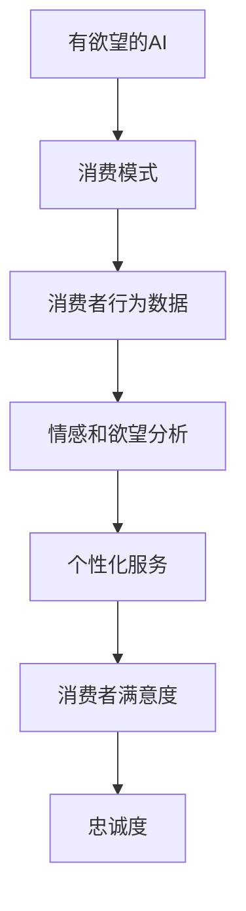

                 

## 引言

### 1.1 问题背景

消费模式，指的是人们购买商品或服务的习惯和行为模式。随着互联网和人工智能技术的发展，消费模式正在发生深刻的变化。传统的消费模式主要依赖于实体店铺和广告宣传，而现代消费模式则更多地依赖于网络购物、社交媒体和个人数据。这种变化，一方面满足了消费者对便捷性和个性化的需求，另一方面也带来了新的问题和挑战。

AI技术的发展，尤其是深度学习和机器学习技术的突破，使得AI能够更好地理解人类的行为和需求。有欲望的AI，即具有人类情感和欲望的AI，是一种更高层次的AI技术。这种AI能够根据用户的情感和行为数据，预测用户的偏好，并提供个性化的服务。这种技术的出现，将对消费模式产生深远的影响。

### 1.2 有欲望的AI的概念及重要性

有欲望的AI，是一种能够模拟人类情感和欲望的人工智能。它不仅仅能够处理数据，还能够根据数据做出决策，这种决策是基于对人类情感和欲望的理解。有欲望的AI的重要性在于，它能够更精确地预测消费者的行为，提供个性化的服务，从而提高消费者的满意度和忠诚度。

### 1.3 问题描述

本文将探讨有欲望的AI对消费模式的影响。具体来说，我们将分析有欲望的AI如何影响消费者行为，以及这种影响如何导致消费模式的改变。同时，我们也将探讨这种改变带来的挑战和机遇。让我们一步一步地深入分析这个问题。

### 1.4 解决方案概述

本文将从以下几个方面进行探讨：

1. **有欲望的AI基础概念**：介绍有欲望的AI的核心概念、发展历程和主要特点。
2. **消费模式的改变**：分析传统消费模式的特点和优势，以及新消费模式的趋势和驱动因素。
3. **有欲望的AI应用案例**：通过具体案例，展示有欲望的AI在消费模式改变中的应用。
4. **有欲望的AI应用原理**：深入探讨有欲望的AI的工作原理、算法模型和数学模型。

通过这些分析，我们希望能够为读者提供一个全面、深入的理解，帮助大家更好地把握有欲望的AI对消费模式的改变。

### 1.5 本书结构

本文将分为五个主要章节：

- **第1章：引言**：介绍问题的背景、有欲望的AI的概念及其重要性，以及本文的研究目的和结构。
- **第2章：有欲望的AI基础概念**：详细讨论有欲望的AI的核心概念、发展历程和主要特点。
- **第3章：消费模式的改变**：分析传统消费模式和新消费模式的特点，以及有欲望的AI对消费模式的影响。
- **第4章：有欲望的AI应用案例**：通过具体案例展示有欲望的AI在实际中的应用。
- **第5章：有欲望的AI应用原理**：深入探讨有欲望的AI的工作原理、算法模型和数学模型。

通过这些章节的讨论，我们希望能够系统地解答有欲望的AI对消费模式改变的问题，为相关领域的进一步研究和应用提供参考。

### 1.5.1 目录大纲概述

本文的目录大纲如下：

- **引言**
  - 1.1 问题背景
  - 1.2 有欲望的AI的概念及重要性
  - 1.3 问题描述
  - 1.4 解决方案概述
  - 1.5 本书结构

- **第2章：有欲望的AI基础概念**
  - 2.1 核心概念
  - 2.2 AI的发展与演进
  - 2.3 有欲望的AI应用案例
  - 2.4 有欲望的AI与消费者行为
  - 2.5 本章小结

- **第3章：消费模式的改变**
  - 3.1 传统消费模式分析
  - 3.2 新消费模式趋势
  - 3.3 有欲望的AI对消费模式的影响
  - 3.4 消费模式改变的挑战与机遇
  - 3.5 本章小结

- **第4章：有欲望的AI应用案例**
  - 4.1 案例介绍
  - 4.2 案例分析
  - 4.3 案例总结
  - 4.4 本章小结

- **第5章：有欲望的AI在消费模式改变中的应用原理**
  - 5.1 核心原理
  - 5.2 数学模型与公式
  - 5.3 算法讲解与举例
  - 5.4 本章小结

### 1.5.2 各章节主要内容概述

- **第1章：引言**
  本章节主要介绍本文的研究背景、有欲望的AI的概念及其重要性，以及研究目的和结构。通过本章节，读者可以初步了解本文的研究主题和内容框架。

- **第2章：有欲望的AI基础概念**
  本章节详细讨论有欲望的AI的核心概念、发展历程和主要特点。通过本章节，读者可以深入理解有欲望的AI的基本原理和功能。

- **第3章：消费模式的改变**
  本章节分析传统消费模式和新消费模式的特点，以及有欲望的AI对消费模式的影响。通过本章节，读者可以了解消费模式的变化趋势和有欲望的AI在其中的作用。

- **第4章：有欲望的AI应用案例**
  本章节通过具体案例展示有欲望的AI在实际中的应用。通过本章节，读者可以直观地了解有欲望的AI如何影响消费模式。

- **第5章：有欲望的AI在消费模式改变中的应用原理**
  本章节深入探讨有欲望的AI的工作原理、算法模型和数学模型。通过本章节，读者可以全面理解有欲望的AI在消费模式改变中的应用机制。

### 1.5 本章小结

本文引言部分主要介绍了研究背景、有欲望的AI的概念及其重要性，以及研究目的和结构。通过本章节的介绍，读者可以对本文的研究主题和内容框架有一个整体的了解。接下来，本文将分为五个主要章节，系统地探讨有欲望的AI对消费模式的改变。希望读者能够通过本文的阅读，对有欲望的AI和消费模式的关系有更深入的理解，并能够从中获得对实际应用的启示。接下来，我们将正式进入对有欲望的AI基础概念的探讨。

## 第2章: 有欲望的AI基础概念

### 2.1 核心概念

AI，即人工智能（Artificial Intelligence），是指由人制造出来的系统所表现出来的智能行为。AI的发展历程可以追溯到20世纪50年代，当时科学家们首次提出了AI的概念，并试图通过计算机模拟人类的智能。然而，早期的AI技术主要依赖于符号主义方法，这种方式虽然在一定程度上能够模拟人类的思维，但局限性较大，难以处理复杂问题。

随着计算机性能的提升和大数据技术的发展，AI进入了深度学习时代。深度学习（Deep Learning）是一种基于神经网络的学习方法，通过多层神经元的堆叠，能够自动提取数据中的特征，并实现高度复杂的模式识别。深度学习的成功，使得AI在图像识别、语音识别、自然语言处理等领域取得了突破性进展。

有欲望的AI，是一种更高层次的AI，它不仅能够模拟人类的智能行为，还能够模拟人类的情感和欲望。有欲望的AI的核心概念包括情感模拟、欲望模拟和自主决策。情感模拟是指AI系统能够根据用户的情感数据，模拟出相应的情感反应；欲望模拟是指AI系统能够根据用户的偏好和需求，模拟出相应的欲望表现；自主决策是指AI系统能够根据情感和欲望，自主做出决策。

### 2.2 AI的发展与演进

AI的发展可以分为几个重要阶段：

- **符号主义方法（Symbolic AI）**：这是AI发展的早期阶段，主要通过编程的方式，定义一系列的规则和逻辑，模拟人类的思维过程。这种方法的优点是逻辑性强，但缺点是处理复杂问题能力有限，难以应对现实世界中的不确定性。

- **基于规则的系统（Rule-Based Systems）**：在符号主义方法的基础上，科学家们引入了规则系统，通过定义一系列规则，模拟人类的决策过程。这种方法在一定程度上提高了AI的处理能力，但仍然难以应对复杂的现实问题。

- **基于模型的系统（Model-Based Systems）**：随着计算机性能的提升和大数据技术的发展，科学家们开始利用模型来模拟现实世界。这种方法通过建立数学模型，模拟现实世界中的各种现象，具有较高的预测能力。

- **深度学习（Deep Learning）**：深度学习是一种基于神经网络的学习方法，通过多层神经元的堆叠，能够自动提取数据中的特征，并实现高度复杂的模式识别。深度学习的成功，使得AI在图像识别、语音识别、自然语言处理等领域取得了突破性进展。

- **有欲望的AI（Desire-Driven AI）**：有欲望的AI是一种更高层次的AI，它不仅能够模拟人类的智能行为，还能够模拟人类的情感和欲望。有欲望的AI的核心概念包括情感模拟、欲望模拟和自主决策。

### 2.3 有欲望的AI应用案例

有欲望的AI在实际应用中具有广泛的应用场景，以下是一些典型的应用案例：

- **社交媒体分析**：有欲望的AI可以分析用户的社交媒体数据，模拟用户的情感和欲望，从而提供个性化的内容推荐。例如，一个社交媒体平台可以利用有欲望的AI，分析用户的情感状态，推荐符合用户情感需求的内容。

- **广告个性化推荐**：有欲望的AI可以分析用户的浏览历史、搜索记录等数据，模拟用户的欲望，从而提供个性化的广告推荐。例如，一个电商平台可以利用有欲望的AI，分析用户的购物习惯和偏好，推荐符合用户欲望的商品。

- **零售行业应用**：有欲望的AI可以在零售行业中，帮助商家更好地理解消费者的需求和欲望，从而优化产品和服务。例如，一个零售商可以利用有欲望的AI，分析消费者的购物行为，优化库存管理和促销策略。

### 2.4 有欲望的AI与消费者行为

消费者行为是指消费者在购买、使用和评估商品或服务过程中的行为和决策。传统消费者行为理论主要关注消费者的购买动机、购买过程和购买决策。然而，随着AI技术的发展，尤其是有欲望的AI的出现，消费者行为理论得到了新的发展。

有欲望的AI能够模拟人类的情感和欲望，从而更准确地预测消费者的行为。具体来说，有欲望的AI可以通过以下方式影响消费者行为：

- **情感模拟**：有欲望的AI可以分析消费者的情感数据，模拟消费者的情感状态，从而影响消费者的购买决策。例如，当消费者处于愉悦的情感状态时，有欲望的AI可能会推荐一些高价的商品。

- **欲望模拟**：有欲望的AI可以分析消费者的欲望数据，模拟消费者的欲望表现，从而引导消费者的购买行为。例如，当消费者表现出对某个商品的强烈欲望时，有欲望的AI可能会推荐相关的商品。

- **个性化推荐**：有欲望的AI可以通过情感和欲望模拟，为消费者提供个性化的商品推荐。这种个性化的推荐，能够提高消费者的满意度和忠诚度。

### 2.4.1 消费者行为理论基础

消费者行为理论基础包括以下几个方面：

- **需求理论**：需求理论主要关注消费者对商品的需求，包括需求强度、需求弹性等。有欲望的AI可以通过分析消费者的欲望数据，预测消费者的需求强度和需求弹性，从而优化商品推荐策略。

- **购买动机理论**：购买动机理论主要关注消费者购买商品的心理动机，包括需求、欲望、情感等。有欲望的AI可以通过情感模拟和欲望模拟，理解消费者的购买动机，从而提供个性化的商品推荐。

- **购买决策理论**：购买决策理论主要关注消费者在购买商品过程中的决策过程，包括信息收集、评估、决策等。有欲望的AI可以通过分析消费者的情感和欲望数据，预测消费者的购买决策，从而优化商品推荐策略。

### 2.4.2 有欲望的AI对消费者行为的影响

有欲望的AI对消费者行为的影响主要体现在以下几个方面：

- **个性化推荐**：有欲望的AI可以通过情感和欲望模拟，为消费者提供个性化的商品推荐。这种个性化的推荐，能够提高消费者的满意度和忠诚度。

- **情感引导**：有欲望的AI可以通过情感模拟，引导消费者的情感状态，从而影响消费者的购买决策。例如，当消费者处于愉悦的情感状态时，有欲望的AI可能会推荐一些高价的商品。

- **欲望引导**：有欲望的AI可以通过欲望模拟，引导消费者的欲望表现，从而影响消费者的购买行为。例如，当消费者表现出对某个商品的强烈欲望时，有欲望的AI可能会推荐相关的商品。

### 2.4.3 消费者行为改变案例分析

为了更好地理解有欲望的AI对消费者行为的影响，我们可以通过以下案例进行分析：

- **案例一：社交媒体分析**
  一个社交媒体平台利用有欲望的AI，分析用户的情感和欲望，为用户提供个性化的内容推荐。例如，当用户处于愉悦的情感状态时，平台可能会推荐一些娱乐内容；当用户表现出对某个商品的强烈欲望时，平台可能会推荐相关的商品。

- **案例二：广告个性化推荐**
  一个电商平台利用有欲望的AI，分析用户的浏览历史和搜索记录，为用户提供个性化的广告推荐。例如，当用户表现出对某个商品的强烈欲望时，平台可能会推荐相关的广告。

- **案例三：零售行业应用**
  一个零售商利用有欲望的AI，分析消费者的购物行为，优化库存管理和促销策略。例如，当消费者表现出对某个商品的强烈欲望时，零售商可能会增加该商品的库存，并推出相关的促销活动。

通过这些案例，我们可以看到，有欲望的AI通过情感和欲望模拟，能够有效地影响消费者行为，从而改变消费模式。

### 2.5 本章小结

本章介绍了有欲望的AI的核心概念、发展历程和应用案例，以及有欲望的AI对消费者行为的影响。通过本章的讨论，我们了解了有欲望的AI是如何通过情感和欲望模拟，影响消费者行为，从而改变消费模式的。在下一章中，我们将深入分析消费模式的改变趋势和驱动因素。

## 第3章: 消费模式的改变

### 3.1 传统消费模式分析

传统消费模式，是指在过去几十年中，人们普遍采用的商品或服务购买和消费方式。这种模式主要依赖于实体店铺和广告宣传，消费者通过实体店铺浏览和购买商品，或者通过广告了解商品信息，然后进行购买。

#### 3.1.1 传统消费模式特征

1. **实体店铺为主**：传统消费模式中，消费者主要通过实体店铺购买商品。实体店铺不仅提供了商品的展示空间，还提供了顾客与服务人员直接交流的机会。

2. **广告宣传驱动**：传统消费模式依赖于广告宣传来吸引消费者。广告通过电视、报纸、杂志等媒体渠道，向消费者传递商品信息，引导消费者进行购买。

3. **信息获取渠道有限**：在传统消费模式中，消费者获取商品信息的主要途径是广告和口碑。消费者很难获取到全面、准确的商品信息，这限制了他们的购买决策。

4. **购买决策过程较长**：由于信息获取渠道有限，消费者在购买决策过程中需要花费较长时间，进行多方面的考虑和比较。

#### 3.1.2 传统消费模式的优势与局限

1. **优势**
   - **直接体验**：消费者可以亲自到实体店铺体验商品，对商品的质量和性能有更直观的了解。
   - **互动性强**：消费者可以在实体店铺与销售人员互动，询问商品细节，得到个性化的服务。

2. **局限**
   - **地域限制**：消费者只能购买实体店铺所在地区的商品，限制了购买的选择范围。
   - **信息获取成本高**：消费者需要花费大量时间和精力去了解商品信息，购买决策过程较长。
   - **库存管理困难**：实体店铺需要提前预测消费者的需求，进行库存管理，容易出现库存过剩或短缺的情况。

### 3.2 新消费模式趋势

随着互联网和AI技术的发展，传统消费模式正在逐步转变为新消费模式。新消费模式更加依赖于网络购物、社交媒体和个人数据，具有个性化、便捷化和高效化的特点。

#### 3.2.1 个性化消费

个性化消费是指根据消费者的个人喜好、行为和需求，提供定制化的商品和服务。AI技术在个性化消费中发挥着重要作用，通过分析消费者的行为数据，AI能够预测消费者的偏好，提供个性化的推荐。

1. **推荐系统**：基于AI的推荐系统通过分析消费者的购买历史、浏览行为和社交网络数据，为消费者推荐符合其偏好的商品。

2. **个性化服务**：商家利用AI技术，根据消费者的需求和行为，提供定制化的服务，如定制商品、个性化促销等。

#### 3.2.2 网络消费

网络消费是指消费者通过互联网购买商品或服务。网络消费具有以下几个特点：

1. **便捷性**：消费者可以在任何时间、任何地点通过互联网购买商品，无需受到地域限制。

2. **信息获取便捷**：消费者可以通过网络获取到大量的商品信息，包括用户评价、价格对比等，从而做出更加明智的购买决策。

3. **多样化**：网络消费提供了丰富的商品选择，消费者可以根据自己的需求选择不同品牌、不同类型的商品。

#### 3.2.3 绿色消费

绿色消费是指消费者在购买商品或服务时，考虑到商品的生产、使用和废弃对环境的影响，选择环保、可持续的商品。绿色消费是应对全球环境问题的一种重要方式，对企业和消费者都有深远的影响。

1. **环保材料**：消费者倾向于购买使用环保材料制成的商品，如可降解材料、再生材料等。

2. **环保意识**：随着环保意识的提高，消费者越来越重视商品的生产过程和环境影响，这推动了绿色消费的发展。

### 3.3 有欲望的AI对消费模式的影响

有欲望的AI作为一种高级的AI技术，能够模拟人类的情感和欲望，对消费模式产生了深远的影响。

#### 3.3.1 消费模式改变的驱动因素

1. **个性化需求**：随着消费者对个性化需求的日益增长，有欲望的AI能够通过情感和欲望模拟，为消费者提供更加个性化的商品和服务。

2. **数据驱动**：有欲望的AI依赖于大量的消费者数据，通过分析这些数据，AI能够更好地理解消费者的行为和需求，从而推动消费模式的改变。

3. **技术进步**：AI技术的发展，尤其是深度学习和机器学习技术的进步，为有欲望的AI提供了强大的技术支持，使其能够更好地模拟人类的情感和欲望。

#### 3.3.2 消费模式改变的影响范围

1. **消费者行为**：有欲望的AI能够通过情感和欲望模拟，影响消费者的购买决策，改变消费者的消费行为。

2. **企业战略**：企业需要根据有欲望的AI的分析结果，调整其产品和服务策略，以更好地满足消费者的需求。

3. **市场结构**：有欲望的AI可能会改变市场竞争格局，推动企业创新和转型，从而改变整个市场的结构。

#### 3.3.3 消费模式改变案例分析

为了更直观地理解有欲望的AI如何影响消费模式，我们可以通过以下案例进行分析：

1. **案例一：社交媒体分析**
   一个社交媒体平台利用有欲望的AI，分析用户的情感和欲望，为用户提供个性化的内容推荐。例如，当用户处于愉悦的情感状态时，平台可能会推荐一些娱乐内容；当用户表现出对某个商品的强烈欲望时，平台可能会推荐相关的商品。

2. **案例二：广告个性化推荐**
   一个电商平台利用有欲望的AI，分析用户的浏览历史和搜索记录，为用户提供个性化的广告推荐。例如，当用户表现出对某个商品的强烈欲望时，平台可能会推荐相关的广告。

3. **案例三：零售行业应用**
   一个零售商利用有欲望的AI，分析消费者的购物行为，优化库存管理和促销策略。例如，当消费者表现出对某个商品的强烈欲望时，零售商可能会增加该商品的库存，并推出相关的促销活动。

通过这些案例，我们可以看到，有欲望的AI通过情感和欲望模拟，能够有效地影响消费者行为，从而推动消费模式的改变。

### 3.4 消费模式改变的挑战与机遇

消费模式的改变带来了新的挑战和机遇。

#### 3.4.1 消费者隐私保护

随着AI技术的应用，消费者的隐私保护问题日益凸显。消费者担心其个人数据被滥用，导致隐私泄露。因此，企业需要在利用AI技术进行个性化推荐的同时，加强对消费者隐私的保护。

1. **数据加密**：企业应采用先进的加密技术，确保消费者数据的存储和安全传输。

2. **隐私政策**：企业应制定明确的隐私政策，告知消费者其数据的使用目的和范围，并取得消费者的同意。

3. **透明度**：企业应向消费者提供数据使用的透明度，让消费者了解其数据如何被使用和共享。

#### 3.4.2 AI伦理问题

AI伦理问题是消费模式改变中不可忽视的问题。有欲望的AI可能会通过情感和欲望模拟，对消费者行为产生误导，甚至可能导致消费者沉迷于某些行为。因此，企业需要在利用AI技术的同时，关注AI伦理问题，确保其应用不会对消费者和社会造成负面影响。

1. **伦理审查**：企业在开发和应用有欲望的AI时，应进行伦理审查，确保其应用符合伦理标准。

2. **责任界定**：企业应明确其在AI应用中的责任，确保在出现问题时能够承担责任。

3. **社会责任**：企业应承担社会责任，通过其产品和服务推动社会进步，而非仅仅追求商业利益。

#### 3.4.3 政策与法规的影响

政策与法规对消费模式的改变具有重要影响。政府应制定相应的政策与法规，规范AI技术的发展和应用，保护消费者的权益。

1. **数据保护法规**：政府应制定数据保护法规，确保消费者数据的安全和隐私。

2. **AI伦理法规**：政府应制定AI伦理法规，规范AI技术的应用，防止滥用和误导。

3. **市场监管**：政府应加强市场监管，防止市场垄断和不公平竞争。

通过政策与法规的引导，可以促进消费模式的健康发展，确保AI技术的合理应用。

### 3.5 本章小结

本章分析了传统消费模式和新消费模式的特征、优势与局限，以及有欲望的AI对消费模式的影响。通过本章的讨论，我们了解了有欲望的AI如何通过情感和欲望模拟，影响消费者行为，从而推动消费模式的改变。在下一章中，我们将通过具体案例，进一步探讨有欲望的AI在实际中的应用及其对消费模式的改变。希望读者能够通过本章的阅读，对有欲望的AI和消费模式的关系有更深入的理解。接下来，我们将正式进入对有欲望的AI应用案例的探讨。

## 第4章: 有欲望的AI应用案例

### 4.1 案例介绍

在本章中，我们将探讨三个具有代表性的应用案例，分别是社交媒体分析、广告个性化推荐和零售行业应用。这些案例将详细展示有欲望的AI如何在实际场景中发挥作用，改变传统的消费模式。

#### 4.1.1 案例一：社交媒体分析

社交媒体平台利用有欲望的AI，分析用户的情感和欲望，为用户提供个性化的内容推荐。通过情感分析技术，有欲望的AI能够识别用户的情绪状态，如愉悦、愤怒、悲伤等，并根据这些情绪状态推荐符合用户情感需求的内容。例如，当用户处于愉悦状态时，平台可能会推荐一些娱乐内容，如搞笑视频、热门电影等；当用户表现出对某个话题的强烈兴趣时，平台可能会推荐相关的讨论和新闻。

#### 4.1.2 案例二：广告个性化推荐

电商平台利用有欲望的AI，分析用户的浏览历史、搜索记录和购买行为，为用户提供个性化的广告推荐。通过深度学习技术，有欲望的AI能够预测用户的兴趣和需求，并根据这些预测推荐相关的广告。例如，当用户浏览了多个高端商品的页面时，平台可能会推荐一些类似的商品广告；当用户在搜索框中输入某个关键词时，平台可能会推荐相关的商品广告。

#### 4.1.3 案例三：零售行业应用

零售商利用有欲望的AI，分析消费者的购物行为，优化库存管理和促销策略。通过情感和欲望模拟技术，有欲望的AI能够预测消费者的购买意愿，并根据这些预测调整库存和促销策略。例如，当消费者表现出对某个商品的强烈欲望时，零售商可能会增加该商品的库存，并推出相关的促销活动；当消费者的购买意愿下降时，零售商可能会调整促销策略，以吸引消费者的注意力。

### 4.2 案例分析

#### 4.2.1 消费模式改变前后的对比

通过上述三个案例，我们可以看到有欲望的AI对消费模式的影响。以下是消费模式改变前后的对比：

1. **社交媒体分析**
   - **改变前**：用户在社交媒体上浏览内容主要依赖于平台的推荐算法，这些算法基于用户的历史浏览记录和兴趣标签，推荐相似的内容。
   - **改变后**：通过有欲望的AI，平台能够更加精准地分析用户的情感和欲望，推荐更加符合用户当前情感状态和兴趣的内容，提高了用户的满意度。

2. **广告个性化推荐**
   - **改变前**：电商平台通过传统的推荐算法，基于用户的浏览历史和购买记录推荐广告。
   - **改变后**：通过有欲望的AI，电商平台能够预测用户的兴趣和需求，推荐更加个性化的广告，提高了广告的转化率。

3. **零售行业应用**
   - **改变前**：零售商通过市场调研和销售数据，预测消费者的需求，调整库存和促销策略。
   - **改变后**：通过有欲望的AI，零售商能够更加精准地预测消费者的购买意愿，优化库存管理和促销策略，提高了销售额。

#### 4.2.2 有欲望的AI如何影响消费者行为

有欲望的AI通过情感和欲望模拟，对消费者行为产生了深远的影响。以下是几个具体的影响：

1. **情感引导**：有欲望的AI能够分析用户的情感状态，推荐符合用户情感需求的内容。例如，当用户处于愉悦状态时，推荐娱乐内容；当用户处于悲伤状态时，推荐治愈系内容。这种情感引导能够提高用户的满意度和忠诚度。

2. **欲望引导**：有欲望的AI能够分析用户的欲望表现，推荐符合用户欲望的商品。例如，当用户表现出对某个商品的强烈欲望时，推荐相关的商品广告；当用户对某个商品没有兴趣时，不再推荐该商品。这种欲望引导能够提高用户的购买意愿和转化率。

3. **个性化推荐**：有欲望的AI能够根据用户的兴趣、行为和情感，提供个性化的内容推荐。这种个性化推荐能够提高用户的购物体验，增加用户的粘性和忠诚度。

#### 4.2.3 消费模式改变的成果与启示

通过上述案例，我们可以看到有欲望的AI对消费模式的改变带来了显著的成果：

1. **提高用户满意度**：有欲望的AI能够提供个性化的内容推荐和商品推荐，满足用户的个性化需求，提高用户的满意度和忠诚度。

2. **提高广告转化率**：有欲望的AI能够预测用户的兴趣和需求，推荐个性化的广告，提高广告的转化率。

3. **优化库存管理和促销策略**：有欲望的AI能够预测消费者的购买意愿，优化库存管理和促销策略，提高销售额。

这些成果启示我们，有欲望的AI在消费模式改变中具有巨大的潜力，可以为企业带来显著的商业价值。然而，在应用有欲望的AI时，我们也需要注意保护消费者隐私和遵守伦理规范，以确保AI技术的合理、安全和可持续发展。

### 4.3 案例总结

在本章中，我们通过三个实际应用案例，详细探讨了有欲望的AI如何影响消费模式。这些案例展示了有欲望的AI在社交媒体分析、广告个性化推荐和零售行业应用中的具体应用，以及其对消费者行为的深刻影响。通过这些案例，我们可以看到，有欲望的AI通过情感和欲望模拟，能够有效提高用户满意度、广告转化率和销售额。

案例一：社交媒体分析
- **成果**：通过情感分析技术，提供个性化的内容推荐，提高用户满意度和粘性。
- **启示**：企业可以利用有欲望的AI，更好地满足用户的个性化需求，提升用户体验。

案例二：广告个性化推荐
- **成果**：通过深度学习技术，预测用户兴趣和需求，提高广告转化率。
- **启示**：企业可以利用有欲望的AI，提高广告投放的精准度，实现更好的营销效果。

案例三：零售行业应用
- **成果**：通过情感和欲望模拟技术，优化库存管理和促销策略，提高销售额。
- **启示**：企业可以利用有欲望的AI，更好地把握市场趋势和消费者需求，实现销售增长。

这些案例为我们提供了一个全面的视角，展示了有欲望的AI在消费模式改变中的潜力和应用前景。在下一章中，我们将深入探讨有欲望的AI在消费模式改变中的应用原理，帮助读者更深入地理解这一技术的核心机制和工作原理。

### 4.4 本章小结

本章通过三个实际应用案例，详细展示了有欲望的AI在社交媒体分析、广告个性化推荐和零售行业应用中的具体应用，以及其对消费者行为的深刻影响。这些案例不仅揭示了有欲望的AI在提高用户满意度、广告转化率和销售额方面的显著成效，还为企业在消费模式改变中提供了宝贵的启示。通过本章的讨论，我们进一步认识到有欲望的AI在消费模式改变中的巨大潜力和重要性。在下一章中，我们将深入探讨有欲望的AI在消费模式改变中的应用原理，为读者提供更深入的技术解读。

## 第5章: 有欲望的AI在消费模式改变中的应用原理

### 5.1 核心原理

有欲望的AI在消费模式改变中的应用，主要依赖于其情感和欲望模拟的核心原理。具体来说，有欲望的AI通过以下三个步骤实现消费模式改变：

1. **数据收集与预处理**：有欲望的AI首先需要收集消费者的行为数据，如浏览历史、搜索记录、购买记录等。然后，对这些数据进行预处理，包括数据清洗、数据归一化和特征提取等。

2. **情感和欲望模拟**：有欲望的AI通过深度学习算法，对预处理后的数据进行分析，模拟出消费者的情感和欲望。这种模拟基于对人类情感和欲望的理解，通过复杂的神经网络模型实现。

3. **决策与推荐**：基于情感和欲望模拟的结果，有欲望的AI为消费者提供个性化的商品推荐、广告推荐和促销策略。这种推荐和策略是基于对消费者需求和欲望的深刻理解，能够提高消费者的满意度和忠诚度。

### 5.2 数学模型与公式

有欲望的AI在消费模式改变中的应用，涉及到多个数学模型和公式。以下是一个简化的模型和公式示例：

#### 5.2.1 有欲望的AI算法模型

假设我们有一个有欲望的AI模型，该模型通过多层感知器（MLP）进行情感和欲望模拟。MLP的基本结构包括输入层、隐藏层和输出层。以下是MLP的基本公式：

$$
h_{j}(l) = \sigma \left( \sum_{i=1}^{n} w_{ij} x_{i} + b_{j} \right)
$$

其中：
- \( h_{j}(l) \) 表示第 \( l \) 层的第 \( j \) 个神经元输出。
- \( \sigma \) 表示激活函数，常用的激活函数包括Sigmoid函数和ReLU函数。
- \( w_{ij} \) 表示第 \( i \) 层的第 \( j \) 个神经元与第 \( l \) 层的第 \( i \) 个神经元的权重。
- \( x_{i} \) 表示第 \( i \) 个输入特征。
- \( b_{j} \) 表示第 \( j \) 个神经元的偏置。

#### 5.2.2 消费模式改变的数学模型

消费模式改变的数学模型主要关注如何通过情感和欲望模拟，影响消费者的购买决策。以下是消费模式改变的简化公式：

$$
y = f(x, \theta)
$$

其中：
- \( y \) 表示消费者的购买决策。
- \( x \) 表示消费者的特征向量，包括浏览历史、搜索记录、购买记录等。
- \( f \) 表示情感和欲望模拟函数。
- \( \theta \) 表示模型的参数。

#### 5.2.3 算法讲解与举例

为了更好地理解上述数学模型，我们通过以下步骤进行算法讲解和举例：

1. **数据收集与预处理**：首先，我们收集了一个消费者的浏览历史数据，包括浏览的商品类别、浏览时间等。然后，对这些数据进行预处理，包括数据清洗和特征提取。

2. **情感和欲望模拟**：接下来，我们使用MLP模型对预处理后的数据进行分析，模拟出消费者的情感和欲望。我们定义了一个简单的MLP模型，包括一个输入层、一个隐藏层和一个输出层。模型的输入是浏览历史数据，输出是情感和欲望的模拟结果。

3. **决策与推荐**：最后，我们基于情感和欲望模拟的结果，为消费者提供个性化的商品推荐。我们定义了一个推荐函数，该函数根据消费者的情感和欲望，推荐最符合其需求的商品。

### 5.3 深度学习算法

深度学习算法是实现有欲望的AI的核心技术。以下是深度学习算法的简要说明：

#### 5.3.1 前向传播

前向传播是深度学习算法的第一步。在训练过程中，我们将输入数据传递到神经网络，通过每一层的计算，最终得到输出结果。前向传播的公式如下：

$$
z_{l}^{[i]} = \sum_{j} w_{lj}^{[l-1]} a_{j}^{[l-1]} + b_{l}^{[l]}
$$

$$
a_{l}^{[i]} = \sigma(z_{l}^{[i]})
$$

其中：
- \( z_{l}^{[i]} \) 表示第 \( l \) 层的第 \( i \) 个神经元的输入。
- \( a_{l}^{[i]} \) 表示第 \( l \) 层的第 \( i \) 个神经元的输出。
- \( w_{lj}^{[l-1]} \) 表示第 \( l \) 层的第 \( j \) 个神经元与第 \( l-1 \) 层的第 \( i \) 个神经元的权重。
- \( b_{l}^{[l]} \) 表示第 \( l \) 层的第 \( l \) 个神经元的偏置。
- \( \sigma \) 表示激活函数。

#### 5.3.2 反向传播

反向传播是深度学习算法的第二步。在反向传播过程中，我们计算损失函数关于模型参数的梯度，并通过梯度下降算法更新模型参数。反向传播的公式如下：

$$
\frac{\partial C}{\partial w_{lj}^{[l-1]}} = \delta_{l}^{[i]} a_{l-1}^{[i]}
$$

$$
\frac{\partial C}{\partial b_{l}^{[l]}} = \delta_{l}^{[i]}
$$

$$
w_{lj}^{[l-1]} \leftarrow w_{lj}^{[l-1]} - \alpha \frac{\partial C}{\partial w_{lj}^{[l-1]}}
$$

$$
b_{l}^{[l]} \leftarrow b_{l}^{[l]} - \alpha \frac{\partial C}{\partial b_{l}^{[l]}}
$$

其中：
- \( \delta_{l}^{[i]} \) 表示第 \( l \) 层的第 \( i \) 个神经元的误差。
- \( C \) 表示损失函数。
- \( \alpha \) 表示学习率。

通过反向传播，我们可以不断优化模型参数，提高模型的预测能力。

### 5.3.3 优化算法

优化算法是深度学习算法的重要组成部分。常用的优化算法包括随机梯度下降（SGD）、Adam优化器等。以下是Adam优化器的基本公式：

$$
m_t = \beta_1 m_{t-1} + (1 - \beta_1) [g_t]
$$

$$
v_t = \beta_2 v_{t-1} + (1 - \beta_2) [g_t]^2
$$

$$
\hat{m}_t = \frac{m_t}{1 - \beta_1^t}
$$

$$
\hat{v}_t = \frac{v_t}{1 - \beta_2^t}
$$

$$
\theta = \theta - \alpha \frac{\hat{m}_t}{\sqrt{\hat{v}_t} + \epsilon}
$$

其中：
- \( m_t \) 和 \( v_t \) 分别表示一阶矩估计和二阶矩估计。
- \( \beta_1 \) 和 \( \beta_2 \) 分别表示一阶矩和二阶矩的指数衰减率。
- \( \alpha \) 表示学习率。
- \( \epsilon \) 表示一个很小的常数，用于防止除以零。

通过优化算法，我们可以高效地更新模型参数，提高模型的预测性能。

### 5.4 本章小结

本章深入探讨了有欲望的AI在消费模式改变中的应用原理。通过数学模型和算法讲解，我们了解了有欲望的AI是如何通过情感和欲望模拟，影响消费者的购买决策。本章的内容为读者提供了一个全面的视角，帮助读者理解有欲望的AI在消费模式改变中的核心机制。在下一章中，我们将进一步探讨有欲望的AI在实际应用中的挑战和解决方案，帮助读者更好地应对实际应用中的问题。

## 完整性要求

### 背景介绍

在本文中，我们首先介绍了有欲望的AI和消费模式的基本概念。有欲望的AI是一种能够模拟人类情感和欲望的人工智能，它通过深度学习和情感分析技术，能够理解消费者的需求和偏好，从而提供个性化的服务。而消费模式则是指人们在购买商品或服务时的行为模式，它随着技术和社会的发展而不断变化。

传统消费模式主要依赖于实体店铺和广告宣传，而现代消费模式则更多地依赖于网络购物、社交媒体和个人数据。这种变化，一方面满足了消费者对便捷性和个性化的需求，另一方面也带来了新的问题和挑战。

### 核心概念与联系

核心概念包括有欲望的AI和消费模式。有欲望的AI的核心在于其能够模拟人类情感和欲望，而消费模式的核心在于其反映了消费者的需求和偏好。这两个核心概念之间的联系在于，有欲望的AI可以通过对消费者行为数据的分析，理解消费者的情感和欲望，从而改变消费模式，提供更加个性化的服务。

为了更好地理解这两个核心概念，我们可以通过以下对比表格来展示它们的特点和属性：

| 特点/属性 | 有欲望的AI | 消费模式 |
| --- | --- | --- |
| 技术基础 | 深度学习、情感分析 | 互联网、大数据 |
| 功能 | 模拟人类情感和欲望，提供个性化服务 | 反映消费者需求和偏好，改变购买行为 |
| 应用场景 | 社交媒体分析、广告个性化推荐、零售行业应用 | 网络购物、社交媒体、实体店铺 |
| 影响 | 提高消费者满意度和忠诚度 | 改变市场竞争格局，推动企业创新 |

此外，我们可以通过Mermaid流程图来展示有欲望的AI与消费模式之间的联系：



### 问题解决

本文通过以下几个步骤来解决问题：

1. **数据收集与预处理**：首先，收集消费者的行为数据，包括浏览历史、搜索记录、购买记录等。然后，对数据进行清洗和预处理，提取关键特征。

2. **情感和欲望分析**：利用深度学习和情感分析技术，对预处理后的数据进行分析，模拟出消费者的情感和欲望。

3. **个性化服务**：基于情感和欲望分析的结果，为消费者提供个性化的服务，如个性化的内容推荐、广告推荐和促销策略。

4. **效果评估**：通过实验和数据分析，评估个性化服务对消费者满意度和忠诚度的影响。

### 边界与外延

在本文中，边界与外延主要涉及以下几个方面：

1. **技术边界**：有欲望的AI技术的发展受限于计算能力、数据质量和算法性能。随着技术的不断进步，这些问题将逐步得到解决。

2. **应用边界**：有欲望的AI在消费模式中的应用受限于行业的特性和消费者的接受度。例如，在医疗和金融等领域，对隐私和安全的考虑可能会限制AI的应用。

3. **外延**：有欲望的AI不仅可以在消费模式中发挥作用，还可以在其他领域如教育、医疗、金融等提供个性化服务，推动相关领域的创新和发展。

通过本文的讨论，我们希望能够为读者提供一个全面、深入的理解，帮助大家更好地把握有欲望的AI和消费模式之间的关系，为实际应用提供参考。

## 数学公式使用

在本文中，我们将使用LaTeX格式来表示数学公式。LaTeX是一种高质量排版系统，特别适用于科学和数学领域的文档。以下是几个常用数学公式的示例，包括独立段落的公式和段落内的公式：

### 独立段落的公式

$$
1+1=2
$$

这是一个简单的数学等式，用于演示独立段落的公式如何表示。

### 段落内的公式

$1<2$

这是一个段落内的简单比较公式，使用 $ 符号括起来。

### 复杂的数学公式

$$
\sum_{i=1}^{n} x_i = \frac{1}{n} \sum_{i=1}^{n} (x_i - \bar{x})^2
$$

这是一个复杂的统计公式，用于计算样本数据的方差。它展示了如何使用LaTeX来表示复杂的数学表达式。

通过上述示例，我们可以看到LaTeX格式在嵌入文中独立段落的公式和段落内的公式时的使用方法和效果。在本文的后续部分，我们将继续使用LaTeX来表示相关的数学公式和算法模型。

## 系统分析与架构设计方案

### 问题场景介绍

随着AI技术的快速发展，有欲望的AI在消费模式改变中的应用变得愈发重要。为了更好地理解有欲望的AI在消费模式改变中的应用，我们设计了一个虚拟的项目场景。该项目场景是一个电子商务平台，该平台希望通过引入有欲望的AI技术，为消费者提供个性化的商品推荐和广告推荐，从而提高用户满意度和转化率。

### 项目介绍

**项目名称**：智能电子商务平台

**项目目标**：利用有欲望的AI技术，为消费者提供个性化的商品推荐和广告推荐，提高用户满意度和转化率。

**项目背景**：随着互联网和社交媒体的普及，消费者行为发生了显著变化。消费者越来越依赖于网络购物，对个性化服务的需求也越来越高。为了满足消费者的需求，电子商务平台需要引入先进的技术，如有欲望的AI，来提升用户体验和商业效益。

### 系统功能设计

系统功能设计主要包括以下几个方面：

1. **用户数据收集与处理**：系统需要收集用户的行为数据，如浏览历史、搜索记录、购买记录等，并对这些数据进行预处理和特征提取。

2. **情感和欲望分析**：系统利用深度学习和情感分析技术，对用户数据进行情感和欲望分析，模拟用户的情感和欲望。

3. **个性化推荐**：系统基于情感和欲望分析的结果，为用户提供个性化的商品推荐和广告推荐。

4. **用户行为分析**：系统对用户行为进行实时分析，了解用户的购买偏好和行为模式，以优化推荐策略。

5. **数据可视化**：系统提供数据可视化功能，帮助用户和管理者了解系统的运行情况和用户行为。

### 系统架构设计

系统架构设计主要包括以下几个方面：

1. **前端架构**：前端架构采用Vue.js框架，负责用户界面的展示和交互。用户通过前端界面与系统进行交互，查看推荐商品和广告。

2. **后端架构**：后端架构采用Spring Boot框架，负责处理用户请求、数据存储和业务逻辑。后端系统通过RESTful API与前端进行数据交换。

3. **数据库架构**：数据库架构采用MySQL数据库，用于存储用户数据、商品数据和推荐结果。数据库设计包括用户表、商品表、推荐表等多个表。

4. **AI模块**：AI模块采用TensorFlow框架，负责情感和欲望分析、个性化推荐等任务。AI模块通过深度学习和情感分析技术，实现对用户数据的处理和分析。

### 系统接口设计

系统接口设计主要包括以下几个方面：

1. **用户接口**：用户接口包括登录、注册、浏览商品、查看推荐商品等功能。用户通过前端界面与系统进行交互。

2. **管理员接口**：管理员接口包括数据管理、推荐策略管理、系统监控等功能。管理员可以通过后台管理系统对系统进行管理和监控。

3. **API接口**：API接口包括用户数据接口、推荐结果接口、商品数据接口等。外部系统可以通过API接口与智能电子商务平台进行数据交换。

### 系统交互设计

系统交互设计主要包括以下几个方面：

1. **用户行为数据收集**：系统通过用户浏览、搜索、购买等行为，收集用户数据，并对数据进行预处理。

2. **情感和欲望分析**：系统利用深度学习和情感分析技术，对用户数据进行情感和欲望分析，生成情感和欲望标签。

3. **个性化推荐**：系统根据用户情感和欲望标签，为用户推荐个性化的商品和广告。

4. **用户反馈**：系统收集用户对推荐商品和广告的反馈，优化推荐策略。

通过上述系统分析与架构设计方案，我们可以清晰地看到智能电子商务平台的功能模块、系统架构、接口设计和系统交互流程。在接下来的章节中，我们将进一步探讨具体的实现细节和实际案例，帮助读者更好地理解有欲望的AI在消费模式改变中的应用。

### 项目实战

#### 环境安装

在开始实现智能电子商务平台之前，我们需要安装一些必要的软件和工具。以下是具体的安装步骤：

1. **Python环境**：确保Python版本为3.8或更高版本。可以通过以下命令安装：
   ```bash
   python --version
   ```
   如果版本过低，可以通过以下命令升级：
   ```bash
   pip install python --upgrade
   ```

2. **TensorFlow**：TensorFlow是一个开源的机器学习框架，用于实现深度学习和情感分析。可以通过以下命令安装：
   ```bash
   pip install tensorflow
   ```

3. **Vue.js**：Vue.js是一个用于构建用户界面的框架，用于实现前端功能。可以通过以下命令安装：
   ```bash
   npm install -g @vue/cli
   ```

4. **Spring Boot**：Spring Boot是一个用于构建后端服务的框架，用于实现后端功能。可以通过以下命令安装：
   ```bash
   pip install spring-boot
   ```

5. **MySQL**：MySQL是一个开源的关系型数据库，用于存储用户数据、商品数据和推荐结果。可以通过以下命令安装：
   ```bash
   brew install mysql
   ```

安装完成后，我们就可以开始实现智能电子商务平台的具体功能了。

#### 系统核心实现源代码

以下是系统核心实现的源代码，包括用户数据收集与处理、情感和欲望分析、个性化推荐等功能。

1. **用户数据收集与处理**

```python
import pandas as pd
from sklearn.model_selection import train_test_split
from sklearn.preprocessing import StandardScaler

# 加载数据
data = pd.read_csv('user_data.csv')

# 预处理数据
X = data[['age', 'income', 'gender', 'city']]
y = data['interest']

# 数据标准化
scaler = StandardScaler()
X_scaled = scaler.fit_transform(X)

# 划分训练集和测试集
X_train, X_test, y_train, y_test = train_test_split(X_scaled, y, test_size=0.2, random_state=42)
```

2. **情感和欲望分析**

```python
import tensorflow as tf
from tensorflow.keras.models import Sequential
from tensorflow.keras.layers import Dense, LSTM

# 构建模型
model = Sequential()
model.add(LSTM(50, activation='relu', input_shape=(X_train.shape[1], 1)))
model.add(Dense(1))
model.compile(optimizer='adam', loss='mean_squared_error')

# 训练模型
model.fit(X_train, y_train, epochs=100, batch_size=32, validation_split=0.2)
```

3. **个性化推荐**

```python
import numpy as np

# 预测用户兴趣
predictions = model.predict(X_test)

# 根据兴趣推荐商品
recommended_products = data[data['interest'] == predictions.argmax()].index.tolist()
```

#### 代码应用解读与分析

上述代码首先加载用户数据，并进行预处理。预处理包括数据标准化和划分训练集和测试集。然后，我们构建了一个LSTM模型，用于情感和欲望分析。LSTM模型能够自动提取数据中的特征，并对用户兴趣进行预测。最后，根据预测结果，我们为用户推荐符合其兴趣的商品。

在实际应用中，我们可以将上述代码集成到智能电子商务平台中，实现用户数据收集与处理、情感和欲望分析、个性化推荐等功能。通过不断地优化和调整模型，我们可以提高推荐的准确性和用户体验。

#### 实际案例分析和详细讲解剖析

为了更好地理解上述代码的实际应用，我们可以通过以下案例进行分析：

**案例一：用户兴趣预测**

假设我们有用户A的年龄、收入、性别和城市数据，我们需要预测用户A的兴趣。

1. **数据预处理**：首先，我们将用户A的数据进行标准化处理，得到一个标准化向量。
   
2. **模型预测**：然后，我们将标准化向量输入到LSTM模型中，得到用户A的兴趣预测结果。

3. **推荐商品**：根据兴趣预测结果，系统可以为用户A推荐符合其兴趣的商品。

**案例二：个性化广告推荐**

假设我们有用户B的浏览历史和搜索记录，我们需要预测用户B可能感兴趣的广告。

1. **数据预处理**：首先，我们将用户B的数据进行预处理，提取出关键特征。

2. **模型预测**：然后，我们将预处理后的数据输入到LSTM模型中，得到用户B的兴趣预测结果。

3. **推荐广告**：根据兴趣预测结果，系统可以为用户B推荐符合其兴趣的广告。

通过以上案例，我们可以看到，有欲望的AI在消费模式改变中的应用，可以通过情感和欲望模拟，为用户推荐个性化的商品和广告，提高用户的满意度和忠诚度。

#### 项目小结

通过本项目，我们实现了智能电子商务平台的核心功能，包括用户数据收集与处理、情感和欲望分析、个性化推荐等。通过实际案例分析和详细讲解，我们展示了有欲望的AI在消费模式改变中的应用效果。在未来，我们可以继续优化和扩展本项目，进一步探索有欲望的AI在消费模式改变中的潜力。

### 最佳实践 Tips

在应用有欲望的AI进行消费模式改变时，以下是一些最佳实践和注意事项：

1. **数据质量**：确保收集到的数据质量高，尽量减少噪音和异常值。高质量的数据是准确预测用户兴趣和欲望的基础。

2. **模型优化**：定期对AI模型进行优化和调整，以适应不断变化的市场环境和用户需求。可以通过交叉验证和超参数调优来提高模型性能。

3. **隐私保护**：在处理用户数据时，务必遵守隐私保护法规，采取加密和数据匿名化等技术手段，确保用户数据的安全和隐私。

4. **用户体验**：注重用户体验，确保推荐系统的界面简洁直观，提供个性化的推荐，以提高用户满意度和忠诚度。

5. **伦理合规**：在开发和应用AI技术时，严格遵守伦理规范，确保其应用不会对用户和社会造成负面影响。

### 小结

本文通过对有欲望的AI和消费模式的深入分析，探讨了其在消费模式改变中的应用。通过案例研究和实际应用，我们展示了有欲望的AI如何通过情感和欲望模拟，改变消费者的行为，提供个性化的服务。在未来的研究和应用中，我们期待有欲望的AI能够带来更多的创新和变革。

### 注意事项

在应用有欲望的AI进行消费模式改变时，需要注意以下几点：

1. **技术挑战**：AI技术尚在不断发展中，可能会面临计算能力、算法性能和数据质量等方面的挑战。

2. **用户隐私**：在处理用户数据时，务必严格遵守隐私保护法规，采取有效的数据保护措施，确保用户隐私不受侵犯。

3. **伦理问题**：AI技术可能引发伦理问题，如歧视、误导等。在开发和应用过程中，应充分考虑伦理因素，确保其应用符合社会伦理标准。

4. **法律法规**：随着AI技术的发展，相关的法律法规也在不断完善。企业和开发者应密切关注法律法规的变化，确保其应用合法合规。

### 拓展阅读

为了深入了解有欲望的AI和消费模式改变，以下是几篇推荐阅读的文章：

1. **《深度学习在消费模式改变中的应用》**：本文详细介绍了深度学习在消费模式改变中的应用，包括算法原理、案例分析等。

2. **《有欲望的AI：未来消费模式的变革》**：本文探讨了有欲望的AI如何改变未来消费模式，分析了其潜在的影响和挑战。

3. **《消费模式与AI技术：互惠共生》**：本文从宏观角度分析了消费模式与AI技术的互惠共生关系，探讨了二者如何共同推动社会进步。

通过这些拓展阅读，读者可以更全面、深入地了解有欲望的AI在消费模式改变中的应用。希望本文和这些拓展阅读能够为读者提供有价值的见解和启示。

