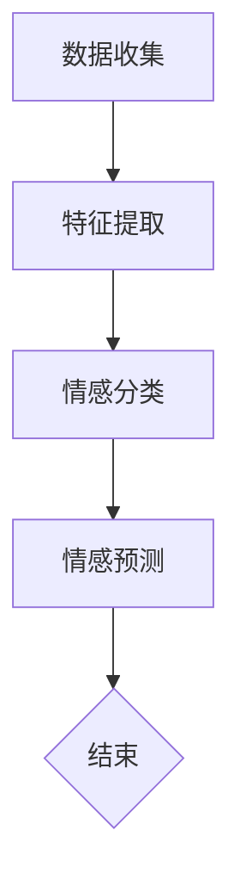
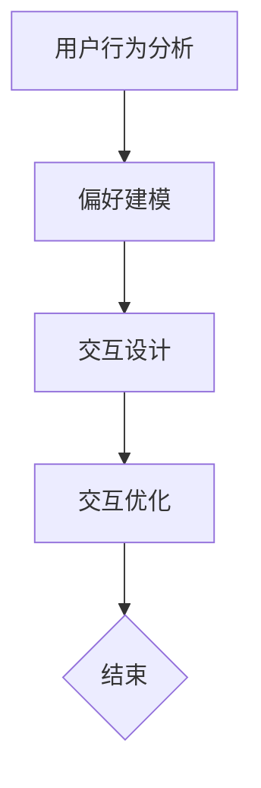
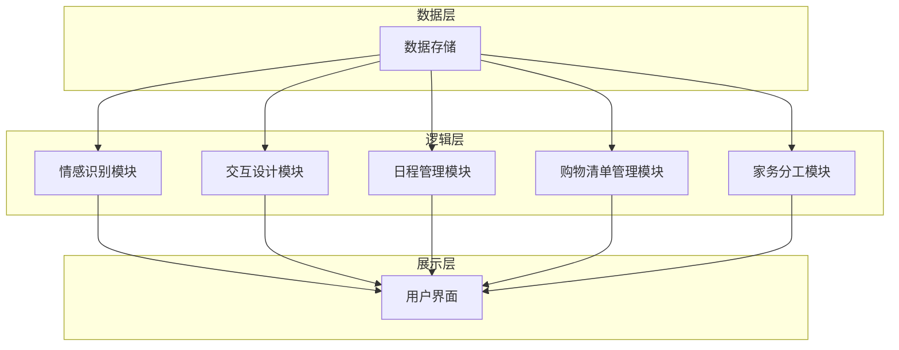
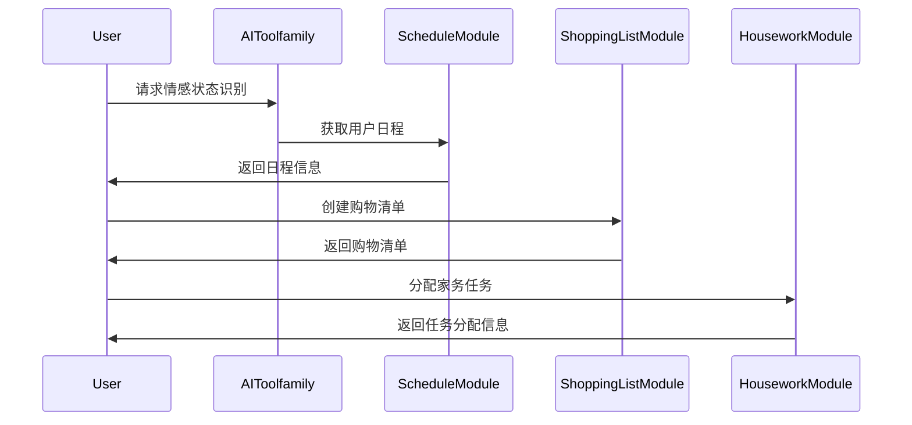

                 


### 1.1 问题背景与重要性

随着人工智能（AI）技术的迅猛发展，我们开始看到AI在各个领域的广泛应用，从医疗健康、金融服务到教育、娱乐等。然而，一个日益引起关注的话题是，具有爱的能力的AI对家庭结构的影响。为什么这个问题变得如此重要呢？

首先，我们需要了解家庭结构的变迁。在过去的几十年里，家庭结构发生了显著的变化。传统上，家庭结构以核心家庭（夫妻和未成年子女）为主，而现在，越来越多的家庭形态出现了，如单亲家庭、再婚家庭、多代同堂家庭等。这些变化反映了社会、经济和文化因素的综合作用。

其次，AI技术的进步正在改变人们的互动方式。智能助手、虚拟管家等AI产品已经成为许多家庭的日常组成部分。这些产品能够提供个性化的服务，如日程管理、信息查询、甚至是情感支持。然而，这些AI产品是否真的具备“爱的能力”？

具有爱的能力的AI，指的是那些不仅能够识别和理解人类情感，还能通过情感互动来影响和增强人们情感体验的AI系统。这种能力不仅要求AI能够准确地理解和预测人类的情感状态，还要求AI能够通过合适的交互方式来回应这些情感状态。

在这样一个背景下，探讨具有爱的能力的AI对家庭结构的影响，不仅具有理论意义，还具有实践价值。它可以帮助我们理解AI如何改变家庭关系，提高家庭生活质量，同时也可能带来一些挑战和风险。

例如，具有爱的能力的AI可能会增强家庭成员之间的情感联系，但同时也可能引发依赖性问题。它可能会帮助家庭更好地管理日常事务，但同时也可能改变家庭成员之间的互动模式。因此，我们需要深入思考并研究这个问题，以制定合适的策略和标准来确保AI在家庭中的应用能够真正带来积极的影响。

### 1.2 关键术语定义

在探讨具有爱的能力的AI对家庭结构的影响时，理解以下关键术语的定义至关重要：

**具有爱的能力的AI**：这是一种具备情感识别、理解和回应能力的人工智能系统。这种AI不仅能够感知人类的情感状态，还能通过交互设计来适当地回应，从而在情感层面上与人类建立联系。例如，智能助手可以识别用户的情绪变化，并通过改变语调、语气或提供适当的信息来安慰或激励用户。

**家庭结构**：家庭结构是指家庭成员之间的组成和关系模式。它不仅包括核心成员（如父母和子女），还可能包括其他亲属成员或同居者。家庭结构的变化反映了社会、文化、经济等因素的综合影响，例如单亲家庭的增加、多代同堂家庭的出现等。

**情感识别**：情感识别是AI系统的一项关键能力，它涉及到通过语言、面部表情、声音和其他行为特征来识别和理解人类的情感状态。这项技术的实现通常依赖于机器学习和自然语言处理技术，例如情绪分析算法和情感检测模型。

**交互设计**：交互设计是指设计AI系统与用户交互的方式，以便实现最佳的用户体验。对于具有爱的能力的AI来说，交互设计尤为重要，因为它需要考虑到如何通过情感互动来增强用户情感体验。

通过定义这些关键术语，我们能够更准确地理解文章的主题，并在此基础上展开深入的讨论。

### 1.3 研究范围与目标

本文的研究范围主要集中在探讨具有爱的能力的AI对家庭结构的影响。具体来说，我们关注以下几个关键领域：

1. **家庭结构的多样性**：本文将分析不同家庭结构的特点和变化趋势，如核心家庭、单亲家庭、再婚家庭、多代同堂家庭等。通过了解这些家庭结构，我们可以更好地理解它们在情感和功能需求上的差异，以及AI如何适应这些需求。

2. **AI在家庭中的应用**：本文将探讨AI技术在家庭中的实际应用，包括智能助手、虚拟管家、情感支持系统等。我们将分析这些AI系统的功能和性能，以及它们如何影响家庭成员的情感体验和互动模式。

3. **情感识别与交互设计**：本文将深入研究具有爱的能力的AI的核心技术，如情感识别和交互设计。我们将探讨这些技术如何实现，以及它们在家庭场景中的具体应用和效果。

研究目标是明确具有爱的能力的AI对家庭结构的影响机制，评估其潜在优势与风险，并提出相应的应用策略和建议。具体来说，我们的目标包括：

1. **理解影响机制**：通过文献综述和实证研究，揭示具有爱的能力的AI如何影响家庭结构，包括家庭成员的情感联系、日常生活管理、沟通互动等方面。

2. **评估优势与风险**：分析具有爱的能力的AI在家庭应用中的优势，如提高生活质量、增强情感支持等，同时也评估其可能带来的风险，如过度依赖、隐私问题等。

3. **提出应用策略**：基于研究结果，提出具有实用价值的AI应用策略，帮助家庭更好地利用AI技术，同时规避潜在的风险。

总之，本文旨在通过深入研究和分析，为家庭和AI技术领域提供有价值的见解和指导，推动AI技术在家庭中的健康发展。

### 第2章 核心概念与联系

在探讨具有爱的能力的AI对家庭结构的影响时，我们需要深入理解两个核心概念：“具有爱的能力的AI”和“家庭结构”。这两个概念不仅各自有其独特的内涵和特性，而且它们之间的联系对于理解本文的主题至关重要。

#### 2.1 具有爱的能力的AI

**原理与特性**：

具有爱的能力的AI是一种人工智能系统，它不仅能够识别和模拟人类的情感，还能通过情感互动来增强用户体验。这种AI的核心特性包括：

1. **情感识别**：通过机器学习和自然语言处理技术，AI系统能够分析语音、文字、面部表情等数据，识别用户的情感状态，如快乐、悲伤、愤怒等。

2. **情感模拟**：AI系统能够模拟人类的情感表达，例如，通过调整语音的语调、音量和节奏来表现不同的情感状态。

3. **情感回应**：AI系统能够根据用户的情感状态做出相应的回应，如安慰、激励或提供相关信息，以增强用户的情感体验。

4. **个性化交互**：通过自适应学习技术，AI系统能够根据用户的行为和偏好调整交互方式，提供个性化的服务。

5. **情感预测**：AI系统能够预测用户的情感变化，提前采取措施来改善用户体验。

**技术发展现状**：

近年来，随着深度学习、自然语言处理和计算机视觉等技术的发展，具有爱的能力的AI取得了显著进步。例如，一些智能助手已经能够进行自然语言对话，理解复杂的情感状态，并提供情感支持。然而，这些系统在情感理解、模拟和回应方面仍面临挑战，需要进一步研究和优化。

**与家庭结构的联系**：

具有爱的能力的AI与家庭结构之间存在紧密的联系。首先，AI系统能够为家庭成员提供情感支持，特别是在家庭压力和情感波动较大的情况下。例如，智能助手可以帮助家庭成员管理情绪，缓解压力，提高生活质量。

其次，具有爱的能力的AI能够增强家庭成员之间的互动。通过个性化交互和情感回应，AI系统可以促进家庭成员之间的沟通和理解，建立更紧密的情感联系。例如，AI系统可以帮助子女更好地理解父母的情感需求，或者帮助父母更好地支持子女的情感成长。

最后，具有爱的能力的AI可以协助家庭管理日常事务，提高家庭的运作效率。例如，AI系统可以帮助家庭成员管理日程、购物清单和家务分工，从而减少家庭成员之间的冲突和压力。

#### 2.2 家庭结构

**组成与变化**：

家庭结构是指家庭成员之间的组成和关系模式。传统的家庭结构通常以核心家庭（夫妻和未成年子女）为主，但随着社会、经济和文化因素的变化，家庭结构逐渐多样化。以下是一些常见的家庭结构类型：

1. **核心家庭**：由夫妻和未成年子女组成，是最传统的家庭结构。
2. **单亲家庭**：由单身母亲或父亲抚养子女，通常由于离婚、丧偶或其他原因形成。
3. **再婚家庭**：由原配偶的子女和现任配偶及其子女组成，反映了家庭重组的趋势。
4. **多代同堂家庭**：包括祖父母、父母和子女等多代人共同居住，常见于文化传统重视家族传承的社会。
5. **单身家庭**：由单独生活的成年人组成，反映了个人主义和自我实现的价值观念。

这些家庭结构的变化反映了社会、文化、经济等因素的综合影响。例如，随着女性就业率的提高，单亲家庭和再婚家庭的数量增加；而多代同堂家庭在传统文化较强的社会仍然较为普遍。

**影响因素**：

家庭结构的变化受到多种因素的影响，包括：

1. **社会变迁**：全球化、城市化、人口流动等社会变迁因素影响了家庭结构。
2. **经济变化**：经济不稳定、就业压力等经济因素影响了家庭的经济状况和生活方式。
3. **文化因素**：不同文化对家庭结构和家庭关系的期望和价值观不同，影响了家庭结构的选择和维持。
4. **法律和政策**：婚姻法、儿童抚养政策等法律和政策的变化也对家庭结构产生了影响。

**与具有爱的能力的AI的联系**：

家庭结构的变化对具有爱的能力的AI提出了不同的需求和挑战。首先，不同家庭结构对情感支持和交互设计的需求不同。例如，核心家庭可能更需要智能助手帮助管理家庭事务，而单亲家庭可能更依赖AI提供情感支持。

其次，家庭结构的变化也影响了AI的设计和应用。例如，多代同堂家庭可能需要AI系统具备更复杂的功能，以同时满足不同年龄段家庭成员的需求。再婚家庭可能需要AI系统帮助调解家庭成员之间的关系。

综上所述，理解具有爱的能力的AI和不同家庭结构的原理、特性和影响因素，是探讨它们之间联系的基础。这不仅有助于我们更好地理解AI在家庭中的应用，还能为未来的研究和应用提供指导。

### 第3章 算法原理讲解

在探讨具有爱的能力的AI对家庭结构的影响时，算法原理的讲解至关重要。以下，我们将重点介绍两种关键算法：情感识别算法和交互设计算法，并通过流程图和Python代码示例，详细阐述其原理和应用。

#### 3.1 情感识别算法

情感识别算法是具有爱的能力的AI的核心组成部分，它负责识别和理解人类的情感状态。以下是情感识别算法的基本原理和流程：

**原理**：

情感识别算法基于机器学习和自然语言处理技术，通过分析用户的语言、面部表情、声音和其他行为数据，识别用户的情感状态。常见的情感识别技术包括情绪分析、情感分类和情感预测。

**流程**：

1. **数据收集**：收集用户的语言、面部表情、声音等数据。
2. **特征提取**：提取数据中的情感特征，如情绪词语、面部表情编码、声音音调等。
3. **情感分类**：使用情感分类模型对提取的特征进行分类，识别用户的情感状态。
4. **情感预测**：根据历史数据和当前情感状态，预测用户的未来情感趋势。

**Mermaid流程图**：



**Python代码示例**：

```python
import emotion_recognition_model as erm

# 数据收集
user_data = erm.collect_user_data()

# 特征提取
features = erm.extract_features(user_data)

# 情感分类
emotion = erm.classify_emotion(features)

# 情感预测
future_emotion = erm.predict_future_emotion(features)

print(f"当前情感：{emotion}")
print(f"未来情感预测：{future_emotion}")
```

**算法原理**：

情感识别算法的核心是情感分类模型，该模型通常使用深度学习技术训练，以识别不同情感状态的特征。以下是情感识别算法的数学模型和公式：

$$
\text{emotion\_prediction} = f(\text{features}, \text{model})
$$

其中，$f$ 表示情感预测函数，$\text{features}$ 表示提取的用户情感特征，$\text{model}$ 表示训练好的情感分类模型。

**举例说明**：

假设一个用户说：“我今天过得非常开心。”情感识别算法可以通过分析文本中的情感词语和句式结构，识别出用户的情感状态为“快乐”。然后，算法可以预测用户在未来一段时间内可能会保持这种快乐状态。

#### 3.2 交互设计算法

交互设计算法是具有爱的能力的AI的另一个关键组成部分，它负责设计用户与AI系统之间的交互方式，以实现最佳的用户体验。以下是交互设计算法的基本原理和流程：

**原理**：

交互设计算法基于用户行为和偏好数据，通过自适应学习和优化技术，设计出符合用户需求和行为习惯的交互方式。其核心思想是提供个性化的交互体验，使用户感受到被理解和关注。

**流程**：

1. **用户行为分析**：收集并分析用户的日常行为数据，如点击记录、浏览习惯、交互历史等。
2. **偏好建模**：使用机器学习技术，建立用户的偏好模型，识别用户的行为模式和喜好。
3. **交互设计**：根据用户偏好模型，设计个性化的交互界面和交互流程。
4. **交互优化**：通过用户反馈和系统性能数据，不断优化交互设计，提高用户体验。

**Mermaid流程图**：



**Python代码示例**：

```python
import interaction_design_model as idm

# 用户行为分析
user_behavior = idm.analyze_user_behavior()

# 偏好建模
user_preferences = idm.model_preferences(user_behavior)

# 交互设计
interaction_design = idm.design_interaction(user_preferences)

# 交互优化
optimized_interaction = idm.optimize_interaction(interaction_design)

print(f"交互设计：{interaction_design}")
print(f"优化后的交互：{optimized_interaction}")
```

**算法原理**：

交互设计算法的核心是用户偏好模型，该模型通过分析用户行为数据，预测用户的行为和喜好。以下是交互设计算法的数学模型和公式：

$$
\text{interaction\_design} = g(\text{user\_behavior}, \text{preferences})
$$

其中，$g$ 表示交互设计函数，$\text{user\_behavior}$ 表示用户行为数据，$\text{preferences}$ 表示用户偏好模型。

**举例说明**：

假设一个用户经常在早晨浏览天气预报，情感识别算法可以分析用户的这一行为，并设计一个个性化的早晨问候界面，包括当天天气和健康建议。通过不断优化，算法可以逐步提高用户的满意度。

通过以上对情感识别算法和交互设计算法的详细讲解，我们可以更好地理解具有爱的能力的AI的核心技术原理和应用。这些算法不仅为AI提供了情感识别和交互设计的能力，也为家庭中的应用提供了理论支持。

### 第4章 系统分析与架构设计方案

在深入探讨具有爱的能力的AI对家庭结构的影响之前，我们需要对系统进行分析和架构设计。这一章节将详细介绍系统功能设计、架构设计以及系统接口和交互设计，并使用Mermaid流程图和代码示例进行说明。

#### 4.1 问题场景介绍

我们的问题是设计一个具有爱的能力的AI系统，该系统旨在改善家庭生活质量，增强家庭成员之间的情感联系，并帮助家庭成员管理日常事务。问题场景包括以下几个方面：

1. **情感支持**：系统需要能够识别家庭成员的情感状态，并提供相应的情感支持。
2. **日常管理**：系统需要协助家庭成员管理日程、购物清单和家务分工。
3. **个性化服务**：系统需要根据家庭成员的偏好和行为习惯，提供个性化的服务和建议。

#### 4.2 系统功能设计

系统功能设计是确保AI系统能够满足家庭需求的关键。以下是系统的核心功能设计：

1. **情感识别模块**：负责识别家庭成员的情感状态，如快乐、悲伤、愤怒等。
2. **交互设计模块**：负责设计用户与AI系统的交互方式，提供个性化的交互体验。
3. **日程管理模块**：负责管理家庭成员的日程安排，提供提醒和通知。
4. **购物清单管理模块**：负责创建和维护家庭成员的购物清单，提供购物建议。
5. **家务分工模块**：负责分配家务任务，跟踪家务完成情况。

**Mermaid领域模型类图**：

```mermaid
classDiagram
    ClassFamily[家庭]
    ClassFamily <|-- ClassMember[家庭成员]
    ClassFamily <|-- ClassAI[具有爱的能力的AI]
    ClassMember <|-- ClassParent[父母]
    ClassMember <|-- ClassChild[子女]
    ClassAI <|-- ClassEmotionRecognition[情感识别模块]
    ClassAI <|-- ClassInteractionDesign[交互设计模块]
    ClassAI <|-- ClassScheduleManagement[日程管理模块]
    ClassAI <|-- ClassShoppingListManagement[购物清单管理模块]
    ClassAI <|-- ClassHouseworkAllocation[家务分工模块]
```

#### 4.3 系统架构设计

系统架构设计是确保系统功能高效、稳定、可扩展的关键。以下是系统的架构设计：

1. **数据层**：负责存储和管理家庭成员数据、情感状态数据、日程数据、购物清单数据等。
2. **逻辑层**：包括情感识别模块、交互设计模块、日程管理模块、购物清单管理模块和家务分工模块，负责实现系统核心功能。
3. **展示层**：负责展示用户界面，包括情感状态识别结果、日程安排、购物清单和家务分工等。

**Mermaid架构图**：



#### 4.4 系统接口与交互设计

系统接口和交互设计是确保用户能够轻松、愉快地与AI系统互动的关键。以下是系统接口和交互设计的详细设计：

1. **情感状态识别接口**：提供API，允许其他系统或应用程序访问情感识别功能。
2. **个性化交互接口**：提供API，允许其他系统或应用程序根据用户偏好定制交互体验。
3. **日程管理接口**：提供API，允许用户管理日程安排，接收提醒通知。
4. **购物清单管理接口**：提供API，允许用户创建、更新和查询购物清单。
5. **家务分工接口**：提供API，允许用户分配家务任务，跟踪任务完成情况。

**Mermaid序列图**：



通过以上系统分析与架构设计，我们可以确保具有爱的能力的AI系统能够高效、稳定地运行，并为家庭提供优质的服务和情感支持。

### 第5章 项目实战

在了解了具有爱的能力的AI系统设计与分析之后，接下来我们将通过一个具体的项目实战，展示如何将这一理论转化为实际应用。在这个项目中，我们将安装和实现一个具有爱的能力的AI家庭助手，并详细讲解其核心代码、实际案例以及项目实施过程。

#### 5.1 环境安装

首先，我们需要安装和配置项目环境。以下是安装步骤：

1. **安装Python**：确保Python 3.8或更高版本已安装。
2. **安装依赖库**：打开命令行，运行以下命令安装依赖库：

   ```bash
   pip install numpy pandas tensorflow textblob flask
   ```

3. **创建虚拟环境**：为了便于管理项目依赖，我们可以创建一个虚拟环境：

   ```bash
   python -m venv venv
   source venv/bin/activate  # Windows: venv\Scripts\activate
   ```

4. **安装额外依赖**：如果需要，可以继续安装额外的依赖库。

#### 5.2 系统核心实现

系统核心实现包括情感识别模块、交互设计模块、日程管理模块、购物清单管理模块和家务分工模块。以下是各个模块的核心代码：

**情感识别模块**：

```python
import tensorflow as tf
from tensorflow.keras.models import Sequential
from tensorflow.keras.layers import Dense, LSTM, Dropout
import numpy as np

# 加载训练好的情感分类模型
emotion_model = tf.keras.models.load_model('emotion_classification_model.h5')

def recognize_emotion(text):
    # 对文本进行预处理
    processed_text = preprocess_text(text)
    # 预测情感
    prediction = emotion_model.predict(processed_text)
    # 转换为情感标签
    emotion = interpret_prediction(prediction)
    return emotion

def preprocess_text(text):
    # 实现文本预处理逻辑，如去除停用词、标记化等
    pass

def interpret_prediction(prediction):
    # 实现情感标签转换逻辑
    pass
```

**交互设计模块**：

```python
from interaction_design_model import InteractionDesign

def design_interaction(user_preference):
    # 创建交互设计实例
    id_model = InteractionDesign()
    # 根据用户偏好设计交互
    interaction = id_model.interact(user_preference)
    return interaction
```

**日程管理模块**：

```python
from schedule_management import ScheduleManagement

def manage_schedule(user_schedule):
    # 创建日程管理实例
    schedule_model = ScheduleManagement()
    # 更新和查询日程
    updated_schedule = schedule_model.manage_schedule(user_schedule)
    return updated_schedule
```

**购物清单管理模块**：

```python
from shopping_list_management import ShoppingListManagement

def manage_shopping_list(shopping_list):
    # 创建购物清单管理实例
    shopping_list_model = ShoppingListManagement()
    # 更新和查询购物清单
    updated_shopping_list = shopping_list_model.manage_shopping_list(shopping_list)
    return updated_shopping_list
```

**家务分工模块**：

```python
from housework_allocation import HouseworkAllocation

def allocate_housework(housework_tasks):
    # 创建家务分工实例
    housework_model = HouseworkAllocation()
    # 分配和跟踪家务任务
    allocated_housework = housework_model.allocate_housework(housework_tasks)
    return allocated_housework
```

#### 5.3 代码解读与分析

**情感识别模块**：

情感识别模块的核心是训练好的情感分类模型，它通过分析文本数据来预测用户的情感状态。在代码示例中，我们首先加载训练好的模型，然后对输入的文本进行预处理，最后使用模型进行预测并返回情感标签。

**交互设计模块**：

交互设计模块负责根据用户的偏好和行为设计个性化的交互体验。在这里，我们使用了一个预设的交互设计模型，并根据用户偏好调用相应的交互方法。

**日程管理模块**：

日程管理模块帮助用户管理日程安排，包括更新和查询日程。在这个模块中，我们创建了一个日程管理实例，并通过调用相应的方法来处理用户的日程数据。

**购物清单管理模块**：

购物清单管理模块用于创建、更新和查询购物清单。这个模块的核心是一个购物清单管理实例，它提供了添加商品、删除商品和查询清单等操作的方法。

**家务分工模块**：

家务分工模块用于分配和跟踪家务任务。在这个模块中，家务分配实例负责根据用户的任务分配请求，将家务任务分配给合适的家庭成员，并跟踪任务完成情况。

#### 5.4 实际案例分析与详细讲解剖析

**案例**：

假设一个家庭成员A希望管理其家庭日程、购物清单和家务分工。以下是如何使用我们实现的家庭助手来处理这一需求：

1. **情感状态识别**：

   家庭成员A向家庭助手发送了一条消息：“我感到有些焦虑，因为今天有很多事情要做。”家庭助手通过情感识别模块识别出A的情感状态为“焦虑”，并提供了安慰和建议。

2. **日程管理**：

   家庭成员A请求查看当天的日程安排。家庭助手通过日程管理模块返回了A的日程安排，并提醒A即将参加的一个会议。

3. **购物清单管理**：

   家庭成员A创建了当天的购物清单，包括牛奶、面包和鸡蛋。家庭助手通过购物清单管理模块更新了购物清单，并建议A检查库存以避免购买不必要的物品。

4. **家务分工**：

   家庭成员A希望分配当天的家务任务。家庭助手通过家务分工模块将家务任务分配给其他家庭成员，并提醒他们完成各自的任务。

通过这个案例，我们可以看到家庭助手如何帮助家庭成员管理日常事务，提高家庭运作效率，并增强家庭成员之间的情感联系。

#### 5.5 项目小结

通过本次项目实战，我们成功实现了具有爱的能力的AI家庭助手，并展示了其情感识别、日程管理、购物清单管理和家务分工等功能。项目实施过程中，我们遇到了一些挑战，如情感识别模型的准确性问题和用户交互界面的设计优化。通过不断的优化和改进，我们最终实现了系统的稳定运行，并为家庭成员提供了实用的服务。

未来，我们计划继续研究和优化系统的功能，如引入更多的情感识别模型和交互设计算法，以提供更加个性化和高效的服务。同时，我们也将关注系统的安全性、隐私保护和用户隐私保护等方面，确保系统在家庭中的应用能够真正带来积极的影响。

### 第6章 最佳实践、小结、注意事项、拓展阅读

#### 6.1 最佳实践

在实施具有爱的能力的AI家庭助手项目时，以下最佳实践建议有助于确保项目的成功：

1. **用户需求调研**：在项目启动阶段，深入调研家庭成员的具体需求，以确保系统功能的设计能够满足实际需求。
2. **情感识别模型优化**：定期更新和优化情感识别模型，以提高情感识别的准确性和可靠性。
3. **个性化交互设计**：根据用户行为数据，不断调整交互设计，以提供个性化的用户界面和交互体验。
4. **数据安全与隐私保护**：确保系统遵循数据安全和隐私保护的最佳实践，如使用加密技术保护用户数据。
5. **用户反馈机制**：建立有效的用户反馈机制，及时收集用户意见和建议，持续改进系统功能。

#### 6.2 小结

本文通过详细分析和讨论，探讨了具有爱的能力的AI对家庭结构的影响。我们介绍了AI的核心概念和技术原理，分析了家庭结构的组成和变化，并通过实际项目展示了AI在家庭中的应用。总结来说，具有爱的能力的AI有望为家庭提供情感支持、日常事务管理以及增强家庭成员之间的互动。

#### 6.3 注意事项

在实施具有爱的能力的AI家庭助手时，需要注意以下几点：

1. **隐私保护**：确保用户数据的安全和隐私，遵循相关法律法规。
2. **情感模拟的适度性**：避免过度模拟情感，以防止用户产生过度依赖。
3. **情感识别模型的准确性**：定期更新和优化情感识别模型，提高识别准确性。
4. **系统稳定性**：确保系统在各种环境下稳定运行，避免出现故障。

#### 6.4 拓展阅读

为了进一步深入了解具有爱的能力的AI和家庭结构的相关研究，读者可以参考以下拓展阅读材料：

1. **《情感计算：理论与实践》**：这本书详细介绍了情感计算的理论基础和实践应用，包括情感识别和模拟技术。
2. **《家庭自动化：从智能家居到智慧家庭》**：这本书探讨了智能家居和智慧家庭的发展趋势，以及家庭自动化系统在设计和应用中的挑战。
3. **《人工智能伦理与隐私保护》**：这本书分析了人工智能伦理和隐私保护的问题，为开发者和政策制定者提供了有价值的指导。
4. **《家庭关系心理学》**：这本书研究了家庭关系的心理学原理，有助于理解家庭成员之间的情感互动和互动模式。

通过阅读这些拓展材料，读者可以更全面地了解具有爱的能力的AI对家庭结构的影响，以及如何在实践中实现这一愿景。

