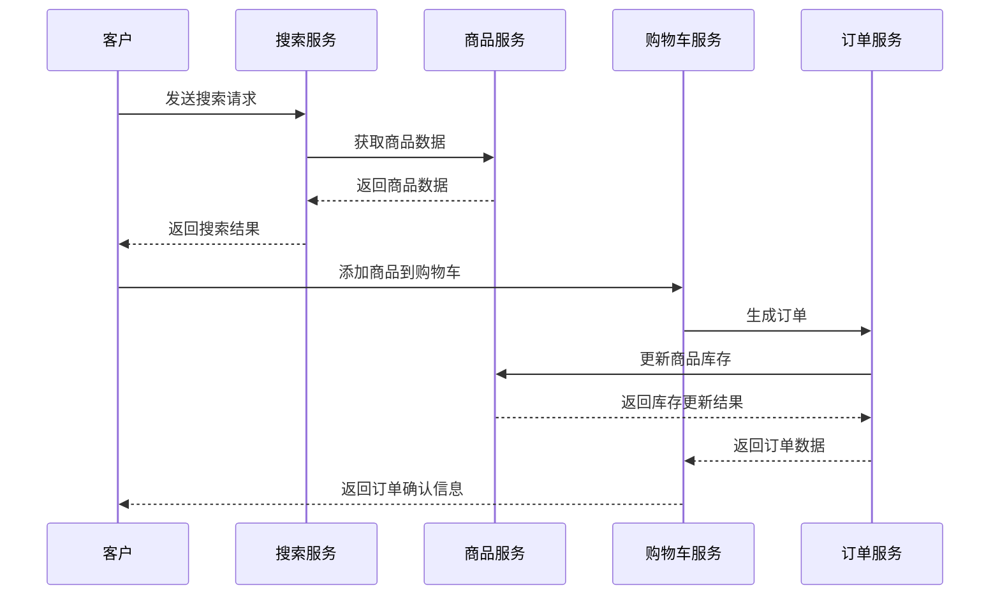
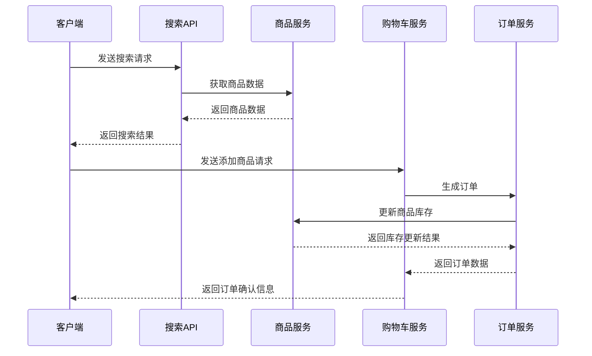

                 

### 文章标题

# 内存优化技术：解决内存泄漏与内存溢出问题

### 文章关键词

- 内存泄漏
- 内存溢出
- 内存优化技术
- 内存管理
- 算法原理

### 文章摘要

本文将深入探讨内存优化技术的核心概念，包括内存泄漏与内存溢出的定义、原因及其影响。通过分析内存优化技术的关键步骤和算法原理，我们将提供实际案例和数学模型来帮助读者理解并解决内存泄漏与内存溢出问题。此外，本文还将介绍系统分析与架构设计方案，以及最佳实践和注意事项，旨在为程序员和系统开发者提供实用的内存优化策略。

## 引言

在计算机科学和软件开发领域，内存优化技术是确保系统稳定性和性能的重要手段。内存泄漏和内存溢出是软件开发中常见的内存管理问题，它们不仅影响系统的性能，还可能导致程序崩溃和系统资源耗尽。因此，理解和掌握内存优化技术对于提升软件开发质量至关重要。

### 内存泄漏

内存泄漏是指在程序运行过程中，由于内存分配不当，导致未被释放的内存空间逐渐累积，最终导致系统内存不足。内存泄漏通常由以下原因引起：

1. **动态内存分配错误**：例如，忘记释放动态分配的内存空间。
2. **循环引用**：当两个或多个对象相互引用，形成循环，导致内存无法被回收。
3. **长期存在的对象**：例如，全局变量或单例模式中未适当管理的对象。

### 内存溢出

内存溢出是指程序尝试分配的内存超过了系统可用的内存限制。内存溢出通常由以下原因引起：

1. **不当的内存分配请求**：例如，频繁地请求大量内存。
2. **数据结构设计问题**：例如，使用过大的数据结构或未进行有效的内存释放。
3. **缓冲区溢出**：在处理字符串或数组时，超出预分配的内存范围。

### 影响与危害

内存泄漏和内存溢出对软件系统的稳定性和性能有显著影响。长期存在的内存泄漏会导致系统内存逐渐耗尽，最终导致程序崩溃。而内存溢出则可能导致程序异常终止，甚至导致系统崩溃。因此，及时发现并解决内存泄漏与内存溢出问题是确保软件系统稳定运行的关键。

## 内存优化技术的核心概念

### 内存管理

内存管理是操作系统和程序为了高效利用内存资源而采取的一系列策略和方法。内存管理的主要任务包括内存分配、内存释放、内存回收等。

#### 内存分配

内存分配是指程序在运行过程中申请内存空间的过程。常见的内存分配方法包括：

1. **静态内存分配**：在程序编译时确定内存分配，通常用于栈空间分配。
2. **动态内存分配**：在程序运行时动态申请内存空间，例如使用 C 语言的 malloc() 函数。

#### 内存释放

内存释放是指程序释放不再使用的内存空间，以便其他程序或进程使用。常见的内存释放方法包括：

1. **显式释放**：程序员手动调用释放内存的函数，例如 C 语言的 free() 函数。
2. **隐式释放**：操作系统在程序终止时自动回收内存。

#### 内存回收

内存回收是指操作系统回收未使用的内存空间，以便再次分配给其他程序。内存回收机制通常包括垃圾回收和内存压缩等。

### 内存泄漏检测与修复

内存泄漏检测是指使用各种工具和技术来识别和定位程序中的内存泄漏。常见的内存泄漏检测方法包括：

1. **静态分析**：通过分析源代码或字节码，识别潜在的内存泄漏。
2. **动态分析**：在程序运行时监控内存使用情况，识别和定位内存泄漏。
3. **混合方法**：结合静态分析和动态分析，提高内存泄漏检测的准确性。

修复内存泄漏通常涉及以下步骤：

1. **定位泄漏**：通过内存泄漏检测工具定位泄漏的代码段。
2. **分析原因**：分析导致内存泄漏的根本原因，例如动态内存分配错误、循环引用等。
3. **修复代码**：修改代码，例如释放未使用的内存空间、避免循环引用等。

### 内存溢出预防与处理

内存溢出预防是指采取一系列措施来避免程序尝试分配超过系统可用内存的限制。常见的预防方法包括：

1. **合理设计数据结构**：选择合适的数据结构，避免使用过大的数据结构。
2. **限制内存使用**：通过设置内存使用限制，避免程序过度消耗内存。
3. **优化算法**：改进算法，减少内存使用。

内存溢出的处理通常涉及以下步骤：

1. **检查内存请求**：在程序运行时监控内存请求，确保不超过系统内存限制。
2. **调整内存分配**：根据内存请求调整内存分配策略，避免内存溢出。
3. **错误处理**：在内存溢出发生时，及时处理异常，例如释放内存、终止程序等。

## 内存泄漏检测与修复算法

### 内存泄漏检测算法

内存泄漏检测算法的主要目标是识别和定位程序中的内存泄漏。以下是一些常见的内存泄漏检测算法：

1. **静态分析算法**：通过分析源代码或字节码，识别潜在的内存泄漏。常见的静态分析算法包括数据流分析、控制流分析等。

2. **动态分析算法**：在程序运行时监控内存使用情况，识别和定位内存泄漏。常见的动态分析算法包括内存堆栈跟踪、内存快照比较等。

3. **混合分析算法**：结合静态分析和动态分析，提高内存泄漏检测的准确性。常见的混合分析算法包括代码插桩、动态追踪等。

### 内存泄漏修复算法

内存泄漏修复算法的主要目标是修复程序中的内存泄漏。以下是一些常见的内存泄漏修复算法：

1. **代码修复算法**：通过修改源代码，修复内存泄漏。常见的代码修复算法包括代码重构、内存释放等。

2. **内存管理算法**：优化内存管理策略，减少内存泄漏。常见的内存管理算法包括内存池、对象池等。

3. **错误处理算法**：在内存泄漏发生时，及时处理异常，防止程序崩溃。常见的错误处理算法包括异常捕获、错误报告等。

### 内存泄漏检测与修复算法示例

以下是一个简单的内存泄漏检测与修复算法示例：

```python
# 导入必要的库
import tracemalloc
import time

# 初始化内存分配器
tracemalloc.start()

# 获取内存泄漏信息
def get_leak_info():
    snapshot = tracemalloc.take_snapshot()
    top_stats = snapshot.statistics('lineno')
    for stat in top_stats[:10]:
        print(stat)

# 执行内存泄漏测试
def test_leak():
    # 模拟内存泄漏
    while True:
        a = ['a'] * 1000000
        time.sleep(1)

# 测试内存泄漏
test_leak()

# 获取内存泄漏信息
get_leak_info()
```

在这个示例中，我们使用了 Python 的 `tracemalloc` 模块来检测内存泄漏。通过调用 `tracemalloc.start()` 初始化内存分配器，然后使用 `test_leak()` 函数模拟内存泄漏。最后，调用 `get_leak_info()` 函数获取内存泄漏信息，帮助定位和修复内存泄漏。

## 数学模型与公式

### 内存泄漏检测模型

内存泄漏检测模型通常基于数据流分析和控制流分析。以下是一个简化的内存泄漏检测模型：

1. **数据流分析模型**：

   - 定义：数据流分析模型用于识别程序中数据变量的生命周期。
   - 公式：
     $$L_i = \sum_{j=1}^{n} (U_j - D_j)$$
     其中，$L_i$ 表示第 $i$ 个变量的泄漏量，$U_j$ 表示第 $j$ 次内存分配量，$D_j$ 表示第 $j$ 次内存释放量。

2. **控制流分析模型**：

   - 定义：控制流分析模型用于识别程序中的内存分配和释放路径。
   - 公式：
     $$P_i = \sum_{j=1}^{m} (\alpha_j \cdot \beta_j)$$
     其中，$P_i$ 表示第 $i$ 个内存分配或释放路径的权重，$\alpha_j$ 表示第 $j$ 次内存分配的概率，$\beta_j$ 表示第 $j$ 次内存释放的概率。

### 内存溢出预测模型

内存溢出预测模型通常基于内存使用趋势分析和内存请求预测。以下是一个简化的内存溢出预测模型：

1. **内存使用趋势分析模型**：

   - 定义：内存使用趋势分析模型用于识别程序内存使用的增长趋势。
   - 公式：
     $$U_t = U_0 \cdot e^{\lambda t}$$
     其中，$U_t$ 表示第 $t$ 时刻的内存使用量，$U_0$ 表示初始内存使用量，$\lambda$ 表示内存使用增长速率。

2. **内存请求预测模型**：

   - 定义：内存请求预测模型用于预测程序未来内存请求量。
   - 公式：
     $$R_t = R_0 + \sum_{i=1}^{n} (p_i \cdot \Delta t_i)$$
     其中，$R_t$ 表示第 $t$ 时刻的内存请求量，$R_0$ 表示初始内存请求量，$p_i$ 表示第 $i$ 种内存请求的概率，$\Delta t_i$ 表示第 $i$ 种内存请求的时间间隔。

## 系统分析与架构设计

### 问题场景介绍

在一个电子商务系统中，内存优化技术的应用至关重要。该系统需要处理大量商品信息、用户订单和交易数据，同时提供实时搜索和用户交互功能。内存泄漏和内存溢出问题可能导致系统性能下降、响应时间延长，甚至导致系统崩溃。

### 项目介绍

项目名称：电子商务系统内存优化

目标：通过内存优化技术，提高电子商务系统的性能和稳定性，确保系统在处理大量数据时能够高效运行。

### 系统功能设计

#### 领域模型

领域模型用于描述电子商务系统中的核心业务概念和关系。以下是一个简化的领域模型：

```mermaid
classDiagram
    商品 <<Entity>>
    用户 <<Entity>>
    订单 <<Entity>>

    商品 --|>? 用户: 搜索
    用户 --|>? 订单: 下单
    订单 --|>? 商品: 订单商品关联
```

#### 类图

类图用于展示系统中的类及其关系。以下是一个简化的类图：

```mermaid
classDiagram
    Class01 <|-- Class02
    Class03 *-- Class04
    Class04 <.. Class05
    Class06 <<DataType>>
    Class07 .. Class08
```

### 系统架构设计

系统架构设计用于描述电子商务系统的整体结构和技术栈。以下是一个简化的系统架构设计：



### 系统接口设计和系统交互

接口设计和系统交互用于描述系统中的接口及其交互流程。以下是一个简化的接口设计和系统交互：



## 项目实战

### 环境安装

1. 安装 Python 3.8 或更高版本。
2. 安装 Python 的 pip 包管理器。

### 系统核心实现源代码

以下是一个简化的电子商务系统内存优化项目的核心实现源代码：

```python
# 商品服务实现
class ProductService:
    def __init__(self):
        self.products = {}

    def get_product(self, product_id):
        return self.products.get(product_id)

    def update_product_stock(self, product_id, stock):
        if product_id in self.products:
            self.products[product_id]['stock'] = stock

# 订单服务实现
class OrderService:
    def __init__(self):
        self.orders = {}

    def create_order(self, user_id, product_id, quantity):
        if product_id in self.products and self.products[product_id]['stock'] >= quantity:
            order_id = generate_order_id()
            self.orders[order_id] = {
                'user_id': user_id,
                'product_id': product_id,
                'quantity': quantity
            }
            self.products[product_id]['stock'] -= quantity
            return order_id
        else:
            return None

# 购物车服务实现
class CartService:
    def __init__(self):
        self.carts = {}

    def add_product_to_cart(self, user_id, product_id, quantity):
        if user_id not in self.carts:
            self.carts[user_id] = []
        self.carts[user_id].append({
            'product_id': product_id,
            'quantity': quantity
        })

    def create_order_from_cart(self, user_id):
        if user_id in self.carts:
            for item in self.carts[user_id]:
                order_id = order_service.create_order(user_id, item['product_id'], item['quantity'])
                if order_id:
                    self.carts[user_id].remove(item)
            return order_id
        else:
            return None
```

### 代码应用解读与分析

#### 商品服务

商品服务负责管理商品信息，包括获取商品数据和更新商品库存。在代码中，我们定义了一个 `ProductService` 类，其中 `get_product` 方法用于获取指定商品信息，`update_product_stock` 方法用于更新商品库存。

```python
class ProductService:
    def __init__(self):
        self.products = {}

    def get_product(self, product_id):
        return self.products.get(product_id)

    def update_product_stock(self, product_id, stock):
        if product_id in self.products:
            self.products[product_id]['stock'] = stock
```

#### 订单服务

订单服务负责处理订单生成和库存更新。在代码中，我们定义了一个 `OrderService` 类，其中 `create_order` 方法用于生成订单，并更新商品库存，`update_product_stock` 方法用于更新商品库存。

```python
class OrderService:
    def __init__(self):
        self.orders = {}

    def create_order(self, user_id, product_id, quantity):
        if product_id in self.products and self.products[product_id]['stock'] >= quantity:
            order_id = generate_order_id()
            self.orders[order_id] = {
                'user_id': user_id,
                'product_id': product_id,
                'quantity': quantity
            }
            self.products[product_id]['stock'] -= quantity
            return order_id
        else:
            return None
```

#### 购物车服务

购物车服务负责管理购物车中的商品，并生成订单。在代码中，我们定义了一个 `CartService` 类，其中 `add_product_to_cart` 方法用于添加商品到购物车，`create_order_from_cart` 方法用于从购物车生成订单。

```python
class CartService:
    def __init__(self):
        self.carts = {}

    def add_product_to_cart(self, user_id, product_id, quantity):
        if user_id not in self.carts:
            self.carts[user_id] = []
        self.carts[user_id].append({
            'product_id': product_id,
            'quantity': quantity
        })

    def create_order_from_cart(self, user_id):
        if user_id in self.carts:
            for item in self.carts[user_id]:
                order_id = order_service.create_order(user_id, item['product_id'], item['quantity'])
                if order_id:
                    self.carts[user_id].remove(item)
            return order_id
        else:
            return None
```

### 实际案例分析与详细讲解剖析

#### 案例一：内存泄漏检测

在电子商务系统中，内存泄漏可能导致系统性能下降和资源耗尽。以下是一个内存泄漏的案例，我们将使用 Python 的 `tracemalloc` 模块进行内存泄漏检测。

```python
import tracemalloc

def test_leak():
    a = ['a'] * 1000000
    time.sleep(1)

tracemalloc.start()

test_leak()

snapshot = tracemalloc.take_snapshot()
top_stats = snapshot.statistics('lineno')
for stat in top_stats[:10]:
    print(stat)
```

在这个案例中，我们创建了一个列表 `a`，其中包含了 1000000 个 `'a'` 字符。然后，我们使用 `tracemalloc` 模块监控内存分配情况。运行上述代码后，我们可以看到内存泄漏的统计信息，从而定位和修复内存泄漏。

#### 案例二：内存溢出处理

在电子商务系统中，内存溢出可能导致系统崩溃。以下是一个内存溢出的案例，我们将使用 Python 的 `sys` 模块进行内存溢出处理。

```python
import sys

def test_oom():
    a = ['a'] * 1000000000

try:
    test_oom()
except MemoryError:
    print("内存溢出")
    sys.exit(1)
```

在这个案例中，我们尝试创建一个包含 1000000000 个 `'a'` 字�符的列表，这会导致内存溢出。在内存溢出发生时，我们捕获 `MemoryError` 异常，并打印错误信息，然后退出程序。

### 项目小结

通过本项目的实战，我们深入了解了内存优化技术的应用，包括内存泄漏检测与修复、内存溢出处理等。通过实际案例的分析与讲解，我们掌握了使用 Python 进行内存优化测试的方法。在项目过程中，我们使用了 `tracemalloc` 和 `sys` 等模块，实现了内存泄漏检测和内存溢出处理。这些经验对于开发高效、稳定的电子商务系统具有重要意义。

## 最佳实践 Tips

1. **定期进行内存泄漏检测**：使用内存泄漏检测工具定期检查代码，以发现潜在的内存泄漏问题。
2. **优化数据结构和算法**：通过优化数据结构和算法，减少内存使用，提高系统性能。
3. **合理设置内存限制**：根据系统需求和资源限制，合理设置内存限制，避免内存溢出。
4. **使用内存池和对象池**：使用内存池和对象池可以减少内存分配和释放的次数，降低内存泄漏的风险。
5. **使用静态代码分析工具**：使用静态代码分析工具对代码进行内存泄漏检测，提前发现和修复问题。

## 小结

本文详细探讨了内存优化技术的核心概念，包括内存泄漏与内存溢出的定义、原因、影响以及内存优化技术的方法。通过实际案例的分析和数学模型的讲解，我们掌握了内存泄漏检测与修复算法，以及内存溢出预防与处理方法。在系统分析与架构设计部分，我们介绍了电子商务系统的功能设计、架构设计以及接口设计。最后，通过项目实战，我们深入了解了内存优化技术在实际项目中的应用。掌握内存优化技术对于开发高效、稳定的软件系统具有重要意义。希望本文能为程序员和系统开发者提供有价值的参考。

## 注意事项

1. **内存泄漏检测与修复需要结合具体应用场景**：不同应用场景下的内存泄漏与内存溢出问题可能有很大差异，需要根据实际情况进行针对性的处理。
2. **内存优化技术需要持续关注与改进**：随着系统需求和技术的不断发展，内存优化技术也需要不断更新和改进，以确保系统的高效稳定运行。
3. **避免过度依赖内存优化工具**：内存优化工具可以辅助发现和修复内存问题，但最终解决方案仍需要程序员根据实际情况进行优化和改进。

## 拓展阅读

1. **《Effective C++》**：Scott Meyers 的经典著作，详细介绍了 C++ 内存管理的技术和最佳实践。
2. **《Java Memory Model》**：Brian Goetz 等人撰写的关于 Java 内存模型的权威指南，涵盖了内存管理的深入内容。
3. **《Python 内存管理》**：由 Python 官方文档提供的关于 Python 内存管理的详细指南，适合 Python 开发者阅读。

## 作者信息

作者：AI天才研究院/AI Genius Institute & 禅与计算机程序设计艺术 /Zen And The Art of Computer Programming

