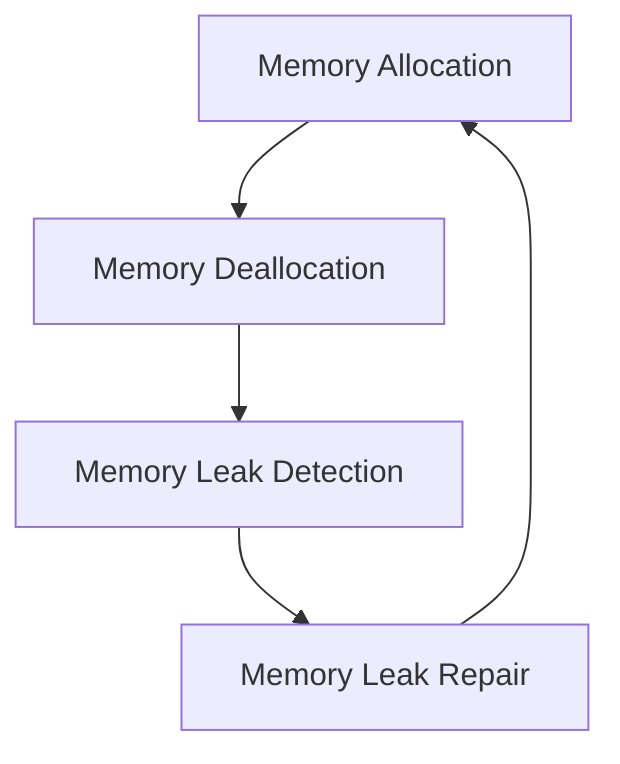

                 

### 内存管理：避免内存泄漏的最佳实践

内存管理是计算机系统中的一个关键组成部分，对于确保系统稳定性和性能至关重要。内存泄漏，即内存资源未被释放，可能导致系统性能下降，甚至崩溃。因此，了解内存管理的基本原理和避免内存泄漏的最佳实践是每一个开发者必须掌握的技能。

#### 关键词：
- 内存管理
- 内存泄漏
- 最佳实践
- 分配算法
- 回收策略

#### 摘要：
本文将详细介绍内存管理的基本概念、原理，以及如何通过有效的策略避免内存泄漏。我们将从内存管理的问题背景和问题描述入手，逐步深入探讨内存管理的核心概念和联系，解析内存管理的基本原理，使用数学模型和公式进行解释，最后通过系统分析与设计以及项目实战，总结最佳实践。

### 第1章 内存管理的背景与核心概念

#### 1.1 内存管理的问题背景

在计算机系统中，内存资源是有限的。内存管理的主要目标是高效地分配和回收内存资源，以优化系统性能和资源利用。然而，随着程序复杂度的增加，内存管理问题也逐渐显现。

#### 1.2 内存管理的问题描述

内存管理问题主要包括以下几个方面：
- 内存分配：如何在需要时有效地分配内存？
- 内存释放：如何确保不再使用的内存被及时释放？
- 内存泄漏：如何防止内存资源未被释放而导致的资源浪费？

#### 1.3 内存管理的解决方法

解决内存管理问题通常需要以下几个步骤：
- 诊断内存泄漏：使用工具检测内存泄漏的根源。
- 修复内存泄漏：针对发现的问题进行代码修复。
- 优化内存使用：通过优化代码，减少内存分配和回收的频率。

#### 1.4 内存管理的边界与外延

内存管理的边界包括内存的分配、释放和回收。外延则包括内存的监控、优化和调试。

#### 1.5 内存管理的核心概念

内存管理的核心概念包括：
- 内存分配：根据程序需求，为变量或数据结构分配内存。
- 内存释放：当变量或数据结构不再使用时，释放所占用的内存。
- 内存泄漏：由于程序逻辑错误或资源管理不当，导致内存资源未被释放。

### 第2章 内存管理核心概念与联系

#### 2.1 内存分配与释放

内存分配是指根据程序需求，为变量或数据结构分配内存。内存释放则是当变量或数据结构不再使用时，释放所占用的内存。

#### 2.2 内存泄漏的概念

内存泄漏是指程序中某些内存资源未被释放，导致内存占用不断增加，最终可能导致系统性能下降或崩溃。

#### 2.3 内存管理要素

内存管理的主要要素包括：
- 内存分配算法：如何高效地分配内存？
- 内存回收策略：如何有效地回收内存？
- 内存泄漏检测：如何及时发现和解决内存泄漏问题？

#### 2.4 内存管理核心概念对比表

| 核心概念 | 说明 |
| -------- | ------ |
| 内存分配 | 为变量或数据结构分配内存 |
| 内存释放 | 释放不再使用的内存 |
| 内存泄漏 | 内存资源未被释放 |

#### 2.5 内存管理ER图

```mermaid
erDiagram
  AMEMORY_ALLOCATOR ||--|{ AMEMORY_RELEASER : releases memory }
  AMEMORY_RELEASER ||--|{ AMEMORY_LEAK_DETECTOR : detects leaks }
```

### 第3章 内存管理原理

内存管理原理主要包括内存分配算法和内存回收策略。

#### 3.1 内存分配算法

内存分配算法分为静态分配和动态分配。静态分配在编译时确定内存大小，而动态分配则在运行时根据需求分配内存。

#### 3.2 内存回收策略

内存回收策略包括标记-清除、复制算法、垃圾回收等。标记-清除算法通过标记可回收的内存块，然后在一定时间后进行回收。复制算法通过复制内存块来回收。垃圾回收则是一种自动化的内存回收机制。

#### 3.3 内存管理流程图



### 第4章 数学模型与公式

内存管理中的数学模型和公式用于描述内存分配、回收和泄漏的规律。

#### 4.1 内存分配模型

$$
M_A = \frac{1}{N} \sum_{i=1}^{N} X_i
$$

其中，$M_A$ 是平均内存分配量，$N$ 是内存分配次数，$X_i$ 是第 $i$ 次分配的内存大小。

#### 4.2 内存回收模型

$$
M_R = \frac{1}{N} \sum_{i=1}^{N} Y_i
$$

其中，$M_R$ 是平均内存回收量，$N$ 是内存回收次数，$Y_i$ 是第 $i$ 次回收的内存大小。

#### 4.3 内存泄漏模型

$$
L = M_A - M_R
$$

其中，$L$ 是内存泄漏量，$M_A$ 是内存分配量，$M_R$ 是内存回收量。

### 第5章 系统分析与设计

内存管理系统的设计与实现需要综合考虑多个方面。

#### 5.1 内存管理系统概述

内存管理系统主要包括内存分配、内存回收和内存泄漏检测三个核心功能。

#### 5.2 功能设计

内存管理系统的功能设计涉及内存分配模块、内存回收模块和内存泄漏检测模块。

#### 5.3 系统架构设计

内存管理系统的架构设计包括内存管理架构、系统接口设计和系统交互设计。

#### 5.4 系统接口设计

内存管理系统需要提供一组接口，以便其他模块能够调用内存管理功能。

#### 5.5 系统交互设计

内存管理系统与其他模块的交互设计，包括内存分配、内存回收和内存泄漏检测的过程。

### 第6章 项目实战

通过一个具体的内存管理项目，我们将会演示如何进行内存管理。

#### 6.1 项目介绍

项目介绍将包括项目背景、目标和应用场景。

#### 6.2 环境搭建

环境搭建将涉及开发环境、依赖库和工具的安装。

#### 6.3 核心实现

核心实现将包括内存分配、内存回收和内存泄漏检测的代码实现。

#### 6.4 代码解读

代码解读将详细分析内存管理项目的关键代码。

#### 6.5 案例分析

案例分析将通过实际案例，展示内存管理的应用和效果。

#### 6.6 项目小结

项目小结将总结项目经验，并提出改进建议。

### 第7章 最佳实践与总结

#### 7.1 最佳实践

最佳实践将包括内存管理中的常见问题和解决方法。

#### 7.2 小结

小结将总结内存管理的关键概念、原理和最佳实践。

#### 7.3 注意事项

注意事项将提醒开发者在使用内存管理时需要注意的问题。

#### 7.4 拓展阅读

拓展阅读将推荐相关的文献和资源。

### 总结

内存管理是计算机系统中的一个重要环节，对于系统的稳定性和性能有重要影响。通过本文的详细探讨，我们了解了内存管理的基本概念、原理和最佳实践，希望读者能够在实际工作中有效地避免内存泄漏，提高系统性能。

### 作者

作者：AI天才研究院/AI Genius Institute & 禅与计算机程序设计艺术 /Zen And The Art of Computer Programming

---

这篇文章详细介绍了内存管理的基本概念、原理和最佳实践，旨在帮助开发者理解和避免内存泄漏。通过逐步分析和推理，我们从问题背景、核心概念、原理讲解、数学模型、系统设计到项目实战，全面覆盖了内存管理的各个方面。希望这篇文章能够对您在内存管理方面有所启发和帮助。如果您有任何疑问或建议，欢迎在评论区留言，我们将继续努力为您提供更好的内容。再次感谢您的阅读！

