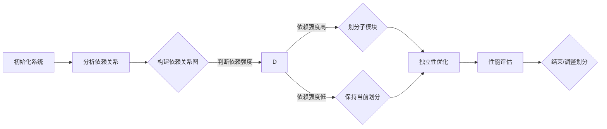
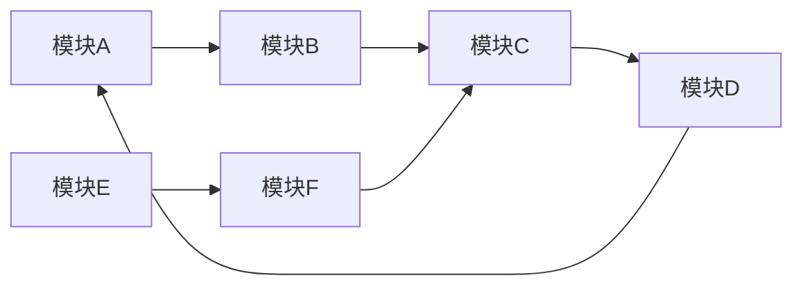
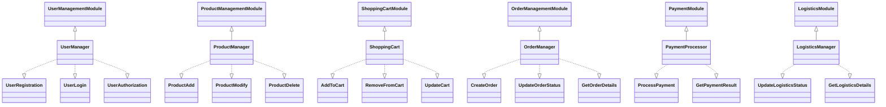

                 

### 第1章 引言

#### 1.1 问题背景与意义

在当今信息技术飞速发展的时代，系统设计与开发的重要性愈发凸显。尤其是复杂系统的开发，常常面临着众多挑战。在这些挑战中，系统划分（System Segmentation）和系统分离（System Isolation）成为关键环节。合理地划分和分离系统，不仅可以提升系统的可维护性和扩展性，还能提高系统的稳定性和性能。

系统划分，是指将一个复杂系统分解为若干个相对独立的部分，每个部分负责系统的特定功能。系统分离，则是指在系统内部创建隔离机制，确保各部分之间相互独立，减少相互影响。这两者共同构成了“系统分割”的核心概念，是系统设计中的基础性工作。

本篇文章旨在探讨如何写好系统划分和分离的标准范式，通过详细的分析与讨论，帮助读者深入理解这一复杂但关键的过程。本文结构如下：

1. **引言**：介绍问题背景与意义。
2. **核心概念与联系**：阐述系统划分和分离的核心概念及其相互关系。
3. **算法原理讲解**：解析常用的系统划分算法，并提供具体的数学模型和实例说明。
4. **数学模型和数学公式**：详细讲解相关的数学模型和公式。
5. **系统分析与架构设计方案**：介绍系统功能设计、架构设计、接口设计以及系统交互。
6. **项目实战**：通过一个具体的项目，展示系统划分和分离的实施过程。
7. **最佳实践 tips**：总结注意事项和最佳实践，为读者提供实用建议。

通过本文的逐步分析，读者可以系统地掌握系统划分和分离的原理与实践，从而在未来的系统设计与开发中更好地应用这些原则。

#### 1.2 问题描述与解决

系统划分和分离在复杂系统的开发中扮演着至关重要的角色，但如何有效地进行这一过程却是一个复杂的问题。首先，问题描述可以归结为以下几个方面：

- **系统复杂性**：随着功能的不断增加，系统变得越来越复杂。如果不进行有效的划分和分离，系统将难以管理和维护。
- **模块间依赖**：各个模块之间存在复杂的依赖关系，如何确保在划分和分离过程中不破坏这些依赖关系，是一个重要的挑战。
- **性能与稳定性**：合理划分和分离系统，有助于提升系统的性能和稳定性。但如果划分不当，可能会引入新的性能瓶颈或稳定性问题。
- **开发与运维**：在开发过程中，如何确保每个模块的独立性，以便于并行开发和测试？在运维过程中，如何高效管理和维护各个模块？

针对上述问题，我们可以从以下几个方面进行解决：

1. **明确系统边界**：首先需要明确系统的功能边界，这有助于确定系统划分的基本框架。系统边界不仅包括功能上的边界，还包括数据流和通信接口的边界。

2. **依赖关系分析**：通过分析各模块间的依赖关系，确定合理的划分方式。这可以通过绘制依赖关系图（如ER图）来实现，明确各模块之间的关系和依赖。

3. **模块独立性设计**：在划分和分离的过程中，确保各模块具有高度的独立性。这意味着每个模块应该只负责一个明确的功能，并且与其他模块的交互尽量减少。

4. **性能优化与测试**：在系统划分和分离后，需要对系统的性能进行评估和优化。同时，进行全面的测试，确保各个模块能够正常工作，并且整体系统仍然具有良好的性能和稳定性。

5. **文档与规范化**：良好的文档和规范是确保系统划分和分离成功的重要保障。通过编写详细的模块说明文档，规范各模块的接口和通信方式，有助于提高系统开发的效率和可维护性。

通过上述解决方法，我们可以有效地进行系统划分和分离，从而提高系统的可维护性、扩展性和稳定性。接下来，我们将进一步深入探讨系统划分和分离的核心概念与联系。

#### 1.3 边界与外延

在深入探讨系统划分和分离之前，有必要对“边界”和“外延”这两个核心概念进行详细解释。理解这两个概念，有助于我们更准确地界定系统划分的范围和原则。

**边界**：系统的边界是定义系统功能范围的界限，也是系统内部与外部相互区分的标准。从系统设计的角度来看，边界不仅包括功能上的界限，还包括数据流和通信接口的界限。明确系统的边界，有助于确保系统的独立性，减少系统内部与外部的耦合。

例如，在一个电子商务系统中，用户订单管理模块的边界可能包括订单创建、订单查询、订单取消等功能，而与用户支付模块的边界则可能包括支付请求、支付响应等接口。

**外延**：外延指的是系统功能边界之外的部分，通常涉及与其他系统或组件的交互。理解系统的外延，有助于我们在系统划分时考虑系统的上下文环境，确保各部分之间的协调与整合。

例如，在用户订单管理模块的外延中，可能包括与库存管理模块的交互，如库存检查和库存更新。这些交互点也是划分和分离时需要重点考虑的部分。

**边界与外延的关系**：边界与外延是相互联系的。系统的边界决定了哪些功能属于系统内部，而外延则决定了系统如何与外部系统或组件进行交互。一个良好的系统划分，需要在明确边界的同时，合理考虑系统的外延。

例如，在电子商务系统中，通过明确订单管理模块的边界，我们可以确定该模块的功能范围。而通过分析订单管理模块的外延，我们可以了解该模块与其他模块的交互点，从而在划分和分离时，确保这些交互点的正确实现和隔离。

**在实际系统设计中的应用**：

- **功能模块划分**：在功能模块划分时，明确每个模块的边界，有助于模块的独立开发和维护。例如，在系统设计中，可以将用户管理模块、订单管理模块、支付管理模块等划分出来。

- **依赖关系管理**：通过分析模块之间的依赖关系，确定合理的边界。例如，用户管理模块可能依赖于订单管理模块，但通过设计良好的接口，这些依赖可以被隔离和分离。

- **系统集成**：在系统集成时，考虑系统的外延，确保各部分之间的协同工作。例如，在集成电子商务系统时，需要考虑订单管理模块与支付模块、物流模块的交互，确保这些交互点能够顺畅工作。

通过理解边界与外延的概念及其关系，我们可以更有效地进行系统划分和分离，提高系统的可维护性和扩展性。在接下来的章节中，我们将进一步探讨系统划分和分离的核心概念和原理。

#### 1.4 概念结构与核心要素组成

在深入探讨系统划分和分离的具体实践之前，了解其概念结构和核心要素组成是至关重要的。系统划分和分离不仅仅是对系统进行物理上的拆分，更是一个包含逻辑分析和设计优化的复杂过程。

**核心概念结构**：

1. **系统分解**：系统分解是指将复杂的系统拆分为多个相对独立的子系统或模块。这个过程需要遵循一定的原则，如最小化模块间依赖和最大化模块独立性。
2. **模块独立性**：模块独立性是系统设计中的一项基本原则，指的是每个模块应该只负责一个明确的功能，并且模块间的交互尽量简单和明确。
3. **边界定义**：边界定义是系统划分的基础，通过明确系统内部和外部之间的功能界限，确保系统的独立性和可维护性。
4. **依赖关系管理**：依赖关系管理是确保模块间合理交互的重要环节。通过分析和管理模块间的依赖关系，可以避免因依赖关系导致的系统复杂性增加。

**核心要素组成**：

1. **功能模块**：功能模块是系统划分的基本单元，每个模块应具有明确的职责和功能。功能模块的设计应符合模块独立性原则，避免模块间出现强依赖关系。
2. **接口设计**：接口设计是模块间交互的桥梁，通过定义清晰的接口规范，可以实现模块间的松耦合。良好的接口设计可以降低模块间的依赖，提高系统的可维护性和扩展性。
3. **数据管理**：数据管理是系统运行的基础，包括数据的存储、传输和访问。通过合理的数据管理，可以确保系统各部分之间的数据一致性和可靠性。
4. **性能优化**：性能优化是系统设计中的重要环节，通过优化系统结构和算法，可以提高系统的响应速度和处理能力。性能优化不仅涉及系统内部，还包括系统与外部环境（如数据库、网络等）的交互。
5. **测试与验证**：测试与验证是确保系统质量和稳定性的关键步骤。通过全面的测试，可以发现和修复系统中的错误和缺陷，确保系统在各个环境下的稳定运行。

**系统划分与分离的步骤**：

1. **需求分析**：首先，进行详细的需求分析，明确系统的功能需求和性能要求，为系统划分提供依据。
2. **功能模块划分**：根据需求分析结果，将系统功能划分为若干个独立的模块，每个模块应具有清晰的功能定义和职责。
3. **接口设计**：为各模块间设计清晰的接口，明确模块间的交互方式和数据传递方式。
4. **边界定义**：明确系统的边界，包括功能边界和数据边界，确保各模块之间的独立性。
5. **依赖关系分析**：分析模块间的依赖关系，确保各模块的独立性，并通过合理的设计减少不必要的依赖。
6. **性能优化**：对系统结构和算法进行优化，确保系统在处理高并发和大数据场景下的性能表现。
7. **测试与验证**：对系统进行全面的测试，验证各模块的功能正确性和系统的整体性能。

通过上述步骤，我们可以系统地完成系统划分和分离的过程，确保系统的高效、稳定和可维护。接下来，我们将进一步探讨系统划分和分离中的核心概念和原理。

## 第2章 核心概念与联系

在深入探讨系统划分和分离的过程中，了解其中的核心概念及其相互关系是至关重要的。本章将详细介绍系统划分和分离中的关键概念，并通过具体案例进行详细解析。

### 2.1 核心概念原理

#### 系统分解

系统分解是将复杂的系统拆分为多个相对独立的子系统或模块的过程。其目的是降低系统的复杂性，提高系统的可维护性和扩展性。系统分解的原则包括：

- **最小化模块间依赖**：尽量减少模块间的直接依赖关系，提高模块的独立性。
- **最大化模块独立性**：每个模块应只负责一个明确的功能，模块内部设计应尽量简单。
- **功能完整性**：每个模块应包含一个完整的功能，避免功能碎片化。

#### 模块独立性

模块独立性是系统设计中的基本原则，指的是每个模块应该只负责一个明确的功能，并且模块间的交互尽量简单和明确。模块独立性有助于提高系统的可维护性和可扩展性，具体包括以下几点：

- **内部封闭性**：模块内部应尽量封闭，所有操作和数据都在模块内部完成，减少对外部的依赖。
- **接口清晰性**：模块间通过接口进行交互，接口应定义明确，确保模块间的调用简单直观。
- **功能明确性**：每个模块的功能应明确，职责单一，避免出现功能交叉和模糊的情况。

#### 边界定义

边界定义是系统划分和分离的重要环节，通过明确系统内部和外部之间的功能界限，确保系统的独立性和可维护性。边界定义的具体内容包括：

- **功能边界**：定义系统各功能模块的职责和范围，明确哪些功能属于系统内部，哪些功能属于系统外部。
- **数据边界**：定义系统内部各模块之间的数据传输和存储范围，确保数据的流动和存储符合系统的整体设计。
- **通信边界**：定义系统内部各模块之间的通信接口，确保各模块之间的交互清晰且高效。

#### 依赖关系管理

依赖关系管理是确保模块间合理交互的重要环节。通过分析和管理模块间的依赖关系，可以避免因依赖关系导致的系统复杂性增加。依赖关系管理包括：

- **依赖分析**：通过绘制依赖关系图，分析各模块间的依赖关系，明确哪些模块依赖于其他模块。
- **依赖隔离**：通过设计合理的接口和隔离机制，将模块间的依赖关系进行隔离，确保模块的独立性。
- **依赖更新**：在系统设计和开发过程中，随着需求的变更，需要及时更新依赖关系，确保系统的稳定性和一致性。

### 2.2 概念属性特征对比表格

为了更直观地理解系统分解、模块独立性、边界定义和依赖关系管理四个核心概念，我们可以通过一个对比表格来展示它们的属性特征：

| 概念          | 属性特征                                                                                                   |
| ------------- | -------------------------------------------------------------------------------------------------------- |
| 系统分解      | - 将复杂系统拆分为多个独立子系统或模块<br>- 减少模块间依赖<br>- 提高模块独立性<br>- 保持功能完整性             |
| 模块独立性    | - 每个模块只负责一个明确的功能<br>- 模块内部封闭性<br>- 模块间接口清晰性<br>- 职责明确，避免功能交叉          |
| 边界定义      | - 功能边界：定义模块职责和范围<br>- 数据边界：定义数据传输和存储范围<br>- 通信边界：定义模块间通信接口       |
| 依赖关系管理  | - 依赖分析：分析模块间依赖关系<br>- 依赖隔离：设计合理的接口和隔离机制<br>- 依赖更新：随需求变更更新依赖关系 |

### 2.3 ER实体关系图架构

为了更好地理解系统划分和分离中的实体关系，我们可以通过ER（Entity-Relationship）实体关系图来展示系统的各个模块及其关系。以下是系统划分和分离中一个简单的ER图示例：

```mermaid
erDiagram
    User ||--|{ Order } : creates
    Product ||--|{ Order } : ordered
    Cart ||--|{ Order } : placed_in
    Order ||--|{ Payment } : paid_by
    Payment ||--|{ Order } : processed
```

在这个ER图中：

- **User**（用户）：负责用户管理，与**Order**（订单）存在“创建”关系。
- **Product**（产品）：负责产品管理，与**Order**（订单）存在“订购”关系。
- **Cart**（购物车）：负责购物车管理，与**Order**（订单）存在“放置”关系。
- **Order**（订单）：是核心模块，与**Payment**（支付）存在“支付”关系，同时与**User**、**Product**和**Cart**存在直接或间接的关系。
- **Payment**（支付）：负责支付管理，与**Order**（订单）存在“处理”关系。

通过ER图，我们可以清晰地看到各个模块之间的实体关系和依赖关系，这有助于我们在系统划分和分离过程中更好地理解和设计各个模块的职责和功能。

通过本章的详细解析，我们深入了解了系统划分和分离中的核心概念及其相互关系。这些概念和关系不仅为系统设计和开发提供了理论依据，也为实际操作提供了实践指南。接下来，我们将进一步探讨系统划分和分离中的算法原理。

### 第3章 算法原理讲解

在系统划分和分离的过程中，选择合适的算法是确保系统性能和稳定性的关键。本章将介绍一种常用的系统划分算法，并通过Mermaid流程图、Python代码、数学模型和公式进行详细讲解，同时辅以实例说明，使读者能够更好地理解和应用这一算法。

#### 3.1.1 算法原理

系统划分算法的核心目标是通过分析系统的功能模块、依赖关系和数据流，将系统分解为多个独立且功能明确的子模块。我们选择**基于依赖关系的划分算法**，其原理如下：

1. **依赖关系分析**：首先，分析系统内各模块之间的依赖关系，构建依赖关系图。
2. **模块划分**：根据依赖关系图，将存在强依赖关系的模块划分为同一子模块，确保子模块内部各模块之间依赖关系最小化。
3. **独立性优化**：对划分后的子模块进行独立性优化，确保各子模块之间尽量减少直接依赖关系。
4. **性能评估**：对划分后的系统进行性能评估，确保系统在性能和稳定性方面满足要求。

#### 3.1.2 Mermaid流程图

为了直观地展示算法原理，我们使用Mermaid流程图来绘制依赖关系分析和模块划分的过程。以下是算法的Mermaid流程图：



在这个流程图中：

- **A[初始化系统]**：初始化系统，准备进行依赖关系分析。
- **B[分析依赖关系]**：分析系统内各模块之间的依赖关系。
- **C[构建依赖关系图]**：根据依赖关系，构建系统的依赖关系图。
- **D[判断依赖强度]**：判断依赖关系图的依赖强度。
- **E[划分子模块]**：将依赖强度高的模块划分为同一子模块。
- **F[保持当前划分]**：如果依赖强度低，保持当前模块划分。
- **G[独立性优化]**：对划分后的子模块进行独立性优化。
- **H[性能评估]**：评估系统性能，确保满足要求。
- **I[结束/调整划分]**：根据性能评估结果，决定是否结束或调整划分。

#### 3.1.3 Python代码实现

为了更好地理解算法的实现，我们使用Python代码来演示依赖关系分析和模块划分的过程。以下是算法的实现代码：

```python
import networkx as nx

def dependency_analysis(graph):
    # 分析依赖关系，构建依赖关系图
    dependency_graph = nx.DiGraph()
    for edge in graph.edges():
        if graph.edges[edge]['dependency_type'] == 'strong':
            dependency_graph.add_edge(edge[0], edge[1])
    return dependency_graph

def module_division(dependency_graph):
    # 划分子模块
    division = {}
    for node in dependency_graph.nodes():
        division[node] = [node]
        for neighbor in dependency_graph.neighbors(node):
            division[node].append(neighbor)
    return division

def optimize_independence(division):
    # 优化独立性
    optimized_division = {}
    for module in division.values():
        sub_modules = []
        for node in module:
            new_sub_modules = []
            for sub_module in sub_modules:
                if node in sub_module:
                    new_sub_modules.append(sub_module)
                else:
                    sub_modules.append([node])
        optimized_division[tuple(sub_modules)] = sum(len(mod) for mod in sub_modules)
    return max(optimized_division, key=optimized_division.get)

def performance_evaluation(division):
    # 性能评估
    pass  # 实现具体性能评估逻辑

# 示例使用
G = nx.DiGraph()
G.add_edges_from([('A', 'B'), ('B', 'C'), ('C', 'D'), ('D', 'A'), ('E', 'F'), ('F', 'G')])
dependency_graph = dependency_analysis(G)
division = module_division(dependency_graph)
optimized_division = optimize_independence(division)
performance_evaluation(optimized_division)
```

在这个代码中，我们首先使用`networkx`库构建一个依赖关系图，然后通过`dependency_analysis`函数分析依赖关系，使用`module_division`函数划分子模块，并使用`optimize_independence`函数优化独立性。

#### 3.1.4 数学模型和公式

为了进一步理解系统划分算法，我们可以引入一些数学模型和公式来描述依赖关系和模块划分。

1. **依赖关系强度**：依赖关系强度可以通过以下公式计算：
   \[
   strength = \sum_{i<j} \left| w_{ij} \right|
   \]
   其中，\( w_{ij} \) 表示模块 \( i \) 和模块 \( j \) 之间的权重，权重值越大表示依赖关系越强。

2. **模块独立性**：模块独立性可以通过以下公式计算：
   \[
   independence = \sum_{i \in M} \frac{1}{|\text{neighbors}(i)|}
   \]
   其中，\( M \) 表示所有模块的集合，\( \text{neighbors}(i) \) 表示模块 \( i \) 的邻居模块集合。独立性值越大表示模块的独立性越强。

3. **模块划分优化目标**：模块划分优化的目标是最大化模块独立性，同时确保模块内部的依赖关系最小化。优化目标可以通过以下公式表示：
   \[
   \maximize \sum_{i \in M} \frac{1}{|\text{neighbors}(i)|}
   \]
   其中，约束条件为：
   \[
   \sum_{i \in module} \left| w_{ij} \right| \leq \theta
   \]
   其中，\( \theta \) 表示依赖关系阈限，用于确保模块内依赖关系最小化。

#### 3.1.5 举例说明

为了更好地理解上述算法和数学模型，我们可以通过一个具体的实例来说明。

假设我们有一个包含5个模块的系统，模块之间的依赖关系如下：

- A模块依赖B模块
- B模块依赖C模块
- C模块依赖D模块
- D模块依赖A模块
- E模块依赖F模块
- F模块依赖C模块

我们可以使用Mermaid流程图和Python代码来实现这个实例：



Python代码实现：

```python
G = nx.DiGraph()
G.add_edges_from([('A', 'B'), ('B', 'C'), ('C', 'D'), ('D', 'A'), ('E', 'F'), ('F', 'C')])
dependency_graph = dependency_analysis(G)
division = module_division(dependency_graph)
optimized_division = optimize_independence(division)
print(optimized_division)
```

通过上述实例，我们可以看到如何通过依赖关系分析和模块划分算法来优化系统的模块独立性。优化后的划分结果将有助于提高系统的可维护性和扩展性。

通过本章的详细讲解，我们深入了解了系统划分算法的原理、实现和数学模型。这些知识将有助于读者在实际项目中更好地进行系统划分和分离。接下来，我们将进一步探讨系统划分和分离中的数学模型和数学公式。

### 第4章 数学模型和数学公式

在系统划分和分离的过程中，数学模型和数学公式扮演着至关重要的角色。它们不仅为算法设计提供了理论依据，还帮助我们更好地理解和优化系统。本章将详细讲解相关数学模型和数学公式，并通过具体实例进行说明。

#### 4.1 详细讲解

1. **依赖关系强度**

   依赖关系强度是衡量模块间依赖程度的量化指标。我们使用以下公式计算依赖关系强度：

   \[
   strength = \sum_{i<j} \left| w_{ij} \right|
   \]

   其中，\( w_{ij} \) 表示模块 \( i \) 和模块 \( j \) 之间的权重。权重可以根据模块间调用次数、数据传输量等因素进行确定。依赖关系强度越大，表示模块间的依赖程度越高。

2. **模块独立性**

   模块独立性是系统设计中的一项重要原则，通过以下公式可以量化模块独立性：

   \[
   independence = \sum_{i \in M} \frac{1}{|\text{neighbors}(i)|}
   \]

   其中，\( M \) 表示所有模块的集合，\( \text{neighbors}(i) \) 表示模块 \( i \) 的邻居模块集合。独立性值越大，表示模块的独立性越强，即模块间的依赖关系越弱。

3. **模块划分优化目标**

   模块划分优化的目标是最大化模块独立性，同时确保模块内部的依赖关系最小化。优化目标可以通过以下公式表示：

   \[
   \maximize \sum_{i \in M} \frac{1}{|\text{neighbors}(i)|}
   \]

   其中，约束条件为：

   \[
   \sum_{i \in module} \left| w_{ij} \right| \leq \theta
   \]

   其中，\( \theta \) 表示依赖关系阈限，用于确保模块内依赖关系最小化。

#### 4.2 举例说明

为了更直观地理解上述数学模型和数学公式，我们通过一个具体的实例进行说明。

假设我们有一个包含5个模块的系统，模块之间的依赖关系如下：

- A模块依赖B模块
- B模块依赖C模块
- C模块依赖D模块
- D模块依赖A模块
- E模块依赖F模块
- F模块依赖C模块

首先，我们计算各模块的依赖关系强度：

- \( w_{AB} = 5 \)
- \( w_{BC} = 3 \)
- \( w_{CD} = 2 \)
- \( w_{DA} = 4 \)
- \( w_{EF} = 1 \)
- \( w_{FC} = 2 \)

根据公式，我们可以计算系统的依赖关系强度：

\[
strength = \left| w_{AB} \right| + \left| w_{BC} \right| + \left| w_{CD} \right| + \left| w_{DA} \right| + \left| w_{EF} \right| + \left| w_{FC} \right| = 5 + 3 + 2 + 4 + 1 + 2 = 17
\]

接下来，我们计算各模块的独立性：

- \( M = \{A, B, C, D, E, F\} \)
- \( \text{neighbors}(A) = \{B, D\} \)
- \( \text{neighbors}(B) = \{A, C\} \)
- \( \text{neighbors}(C) = \{B, D, F\} \)
- \( \text{neighbors}(D) = \{A, C\} \)
- \( \text{neighbors}(E) = \{F\} \)
- \( \text{neighbors}(F) = \{C\} \)

根据公式，我们可以计算系统的模块独立性：

\[
independence = \frac{1}{|\text{neighbors}(A)|} + \frac{1}{|\text{neighbors}(B)|} + \frac{1}{|\text{neighbors}(C)|} + \frac{1}{|\text{neighbors}(D)|} + \frac{1}{|\text{neighbors}(E)|} + \frac{1}{|\text{neighbors}(F)|} = \frac{1}{2} + \frac{1}{2} + \frac{1}{3} + \frac{1}{2} + \frac{1}{1} + \frac{1}{1} = 1.25
\]

最后，我们根据依赖关系强度和独立性值进行模块划分优化。通过调整模块间的依赖关系，我们可以尝试优化系统的独立性。例如，我们可以将模块A和模块D划分到同一子模块，以减少它们之间的依赖关系。这样，模块A的邻居模块将从\{B, D\}变为\{D\}，模块D的邻居模块将从\{A, C\}变为\{A\}，从而提高系统的独立性。

通过上述实例，我们展示了如何使用数学模型和数学公式来计算依赖关系强度和模块独立性，并通过优化模块划分来提高系统的独立性。这些数学模型和数学公式为系统划分和分离提供了有力的理论支持，有助于我们在实际项目中实现更加高效和优化的系统设计。

### 第5章 系统分析与架构设计方案

在系统划分和分离的过程中，系统分析与架构设计是至关重要的环节。一个合理的系统架构不仅能提高系统的可维护性和扩展性，还能确保系统的性能和稳定性。本章将详细介绍系统分析与架构设计方案，包括问题场景介绍、系统功能设计、系统架构设计、系统接口设计以及系统交互的详细描述。

#### 5.1 问题场景介绍

假设我们正在开发一个电子商务系统，该系统需要支持用户注册、商品管理、购物车、订单管理、支付和物流等功能。由于系统的功能较为复杂，我们需要通过合理的系统划分和分离来提高系统的可维护性和扩展性。

1. **用户注册**：用户可以在系统中注册账号，输入个人信息。
2. **商品管理**：管理员可以添加、修改和删除商品信息。
3. **购物车**：用户可以将商品添加到购物车，可以查看购物车中的商品，并选择购买。
4. **订单管理**：系统生成订单，记录订单信息，处理订单状态。
5. **支付**：用户可以通过系统支付订单金额，系统处理支付请求并返回支付结果。
6. **物流**：系统与第三方物流系统对接，更新订单的物流状态。

#### 5.2 系统功能设计

系统功能设计是系统分析与架构设计的第一步，我们需要明确每个功能模块的职责和接口。

1. **用户管理模块**：负责用户注册、登录和权限管理。
2. **商品管理模块**：负责商品信息的添加、修改和删除。
3. **购物车模块**：负责用户购物车的管理，包括商品添加、删除和更新。
4. **订单管理模块**：负责订单的创建、状态更新和订单详情查询。
5. **支付模块**：负责支付请求的处理和支付结果的返回。
6. **物流模块**：负责物流状态的更新和物流信息的查询。

以下是一个简单的领域模型Mermaid类图，用于展示各个功能模块及其关系：



在这个类图中，我们定义了各个功能模块及其子模块，并展示了它们之间的继承和依赖关系。每个模块都有明确的职责，通过定义清晰的接口，可以确保模块间的独立性和可扩展性。

#### 5.3 系统架构设计

系统架构设计是系统功能设计的基础，我们需要设计一个合理的系统架构来支持系统的各个功能模块。

1. **客户端架构**：客户端架构主要包括用户界面层、业务逻辑层和数据访问层。用户界面层负责展示系统的界面和用户交互，业务逻辑层负责处理业务逻辑和业务规则，数据访问层负责与数据库进行交互。

2. **服务端架构**：服务端架构主要包括应用层、服务层和数据层。应用层负责处理客户端的请求，服务层负责实现具体的业务逻辑，数据层负责数据存储和管理。

以下是一个简单的系统架构Mermaid图，用于展示系统的整体架构：

```mermaid
sequenceDiagram
    User -->|HTTP Request|> ApplicationLayer
    ApplicationLayer -->|Business Logic|> ServiceLayer
    ServiceLayer -->|Database Request|> DataLayer
    DataLayer -->|Data|> ServiceLayer
    ServiceLayer -->|Response|> ApplicationLayer
    ApplicationLayer -->|HTTP Response|> User
```

在这个序列图中，我们展示了客户端和服务器之间的交互过程。用户通过用户界面层发送HTTP请求，应用层处理请求并将请求转发到服务层，服务层处理业务逻辑后，将结果返回给应用层，最终由应用层生成HTTP响应返回给用户。

#### 5.4 系统接口设计

系统接口设计是确保模块间独立性和可扩展性的关键。我们需要定义清晰的接口规范，确保各模块之间的交互简单、高效和稳定。

1. **RESTful API**：我们采用RESTful API设计风格，定义了系统的接口规范。每个接口都对应一个具体的HTTP请求方法，如GET、POST、PUT和DELETE。

2. **接口参数**：每个接口都包含必要的参数，参数类型包括基本数据类型（如String、Integer）、复杂数据类型（如List、Map）以及自定义数据类型（如User、Product）。

3. **接口响应**：每个接口都包含标准的响应格式，包括响应状态码（如200、400、500）和响应数据（如成功响应的数据、错误信息）。

以下是一个简单的接口示例：

```json
GET /api/users
{
  "status": 200,
  "data": [
    {
      "id": 1,
      "username": "user1",
      "email": "user1@example.com"
    },
    {
      "id": 2,
      "username": "user2",
      "email": "user2@example.com"
    }
  ]
}
```

在这个示例中，我们定义了一个获取用户列表的接口，接口返回HTTP状态码200和用户数据列表。

#### 5.5 系统交互Mermaid序列图

为了更好地展示系统内各模块之间的交互过程，我们可以使用Mermaid序列图来描述系统的交互逻辑。

```mermaid
sequenceDiagram
    User -->|Register Request|> UserManagementModule
    UserManagementModule -->|Check Username|> DatabaseLayer
    DatabaseLayer -->|Username Available|> UserManagementModule
    UserManagementModule -->|Create User|> DatabaseLayer
    DatabaseLayer -->|User Created|> UserManagementModule
    UserManagementModule -->|Register Response|> User

    User -->|Login Request|> UserManagementModule
    UserManagementModule -->|Verify User|> DatabaseLayer
    DatabaseLayer -->|User Verified|> UserManagementModule
    UserManagementModule -->|Login Response|> User

    User -->|Add To Cart|> ShoppingCartModule
    ShoppingCartModule -->|Update Cart|> DatabaseLayer
    DatabaseLayer -->|Cart Updated|> ShoppingCartModule
    ShoppingCartModule -->|Cart Response|> User

    User -->|Create Order|> OrderManagementModule
    OrderManagementModule -->|Generate Order|> DatabaseLayer
    DatabaseLayer -->|Order Generated|> OrderManagementModule
    OrderManagementModule -->|Order Response|> User

    User -->|Pay Order|> PaymentModule
    PaymentModule -->|Process Payment|> PaymentGateway
    PaymentGateway -->|Payment Approved|> PaymentModule
    PaymentModule -->|Payment Response|> User

    User -->|Check Logistics|> LogisticsModule
    LogisticsModule -->|Get Logistics Status|> DatabaseLayer
    DatabaseLayer -->|Logistics Status|> LogisticsModule
    LogisticsModule -->|Logistics Response|> User
```

在这个序列图中，我们展示了用户注册、登录、添加购物车、创建订单、支付订单和查询物流状态的交互过程。每个交互过程都通过定义清晰的接口和数据流，确保各模块之间的独立性和可扩展性。

通过本章的详细分析和设计，我们为一个复杂的电子商务系统提供了一个合理的系统架构和接口设计方案。这些设计原则和方案不仅有助于提高系统的可维护性和扩展性，还为系统的实际开发提供了明确的指导。接下来，我们将通过一个实际项目来展示这些设计和方案的实施过程。

### 第6章 项目实战

为了将系统分析与架构设计方案付诸实践，本章将通过一个实际的电子商务系统项目，详细展示系统划分和分离的实施过程。我们将从环境安装、系统核心实现源代码、代码应用解读与分析、实际案例分析和详细讲解剖析，直至项目小结。

#### 6.1 环境安装

在开始项目之前，我们需要搭建一个合适的项目开发环境。以下是环境安装的步骤：

1. **安装Python**：首先确保Python环境已经安装。Python是该项目的主要编程语言，版本要求为3.8或更高。
2. **安装依赖管理工具**：使用pip安装依赖管理工具，例如pip install requirements.txt。
3. **安装数据库**：选择一个合适的数据库系统，如MySQL或PostgreSQL，并安装相应的客户端库。
4. **安装Web框架**：选择一个Web框架，如Flask或Django，并按照框架的官方文档进行安装。

#### 6.2 系统核心实现源代码

以下是该项目系统核心实现的主要源代码示例：

**用户管理模块**（UserManagementModule）：

```python
# user_management.py
from flask import Blueprint, request, jsonify
from models import User

user_management = Blueprint('user_management', __name__)

@user_management.route('/register', methods=['POST'])
def register():
    username = request.form['username']
    email = request.form['email']
    password = request.form['password']
    user = User(username=username, email=email, password=password)
    user.save()
    return jsonify({'status': 200, 'message': 'User registered successfully'})

@user_management.route('/login', methods=['POST'])
def login():
    username = request.form['username']
    password = request.form['password']
    user = User.get_by_username(username)
    if user and user.password == password:
        return jsonify({'status': 200, 'message': 'Login successful'})
    else:
        return jsonify({'status': 400, 'message': 'Invalid credentials'})
```

**商品管理模块**（ProductManagementModule）：

```python
# product_management.py
from flask import Blueprint, request, jsonify
from models import Product

product_management = Blueprint('product_management', __name__)

@product_management.route('/products', methods=['POST'])
def add_product():
    name = request.form['name']
    price = request.form['price']
    product = Product(name=name, price=price)
    product.save()
    return jsonify({'status': 200, 'message': 'Product added successfully'})

@product_management.route('/products/<int:product_id>', methods=['PUT'])
def update_product(product_id):
    product = Product.get_by_id(product_id)
    if not product:
        return jsonify({'status': 404, 'message': 'Product not found'})
    name = request.form.get('name')
    price = request.form.get('price')
    if name:
        product.name = name
    if price:
        product.price = price
    product.save()
    return jsonify({'status': 200, 'message': 'Product updated successfully'})
```

**购物车模块**（ShoppingCartModule）：

```python
# shopping_cart.py
from flask import Blueprint, request, jsonify
from models import ShoppingCart

shopping_cart = Blueprint('shopping_cart', __name__)

@shopping_cart.route('/cart', methods=['POST'])
def add_to_cart():
    user_id = request.form['user_id']
    product_id = request.form['product_id']
    cart = ShoppingCart(user_id=user_id, product_id=product_id)
    cart.save()
    return jsonify({'status': 200, 'message': 'Product added to cart successfully'})

@shopping_cart.route('/cart', methods=['DELETE'])
def remove_from_cart():
    user_id = request.form['user_id']
    product_id = request.form['product_id']
    cart = ShoppingCart.get_by_user_id_and_product_id(user_id, product_id)
    if not cart:
        return jsonify({'status': 404, 'message': 'Product not found in cart'})
    cart.delete()
    return jsonify({'status': 200, 'message': 'Product removed from cart successfully'})
```

**订单管理模块**（OrderManagementModule）：

```python
# order_management.py
from flask import Blueprint, request, jsonify
from models import Order

order_management = Blueprint('order_management', __name__)

@order_management.route('/order', methods=['POST'])
def create_order():
    user_id = request.form['user_id']
    products = request.form['products']  # JSON格式，如：{"products": [{"id": 1, "quantity": 2}, {"id": 2, "quantity": 1}]}
    order = Order(user_id=user_id, products=products)
    order.save()
    return jsonify({'status': 200, 'message': 'Order created successfully'})
```

**支付模块**（PaymentModule）：

```python
# payment.py
from flask import Blueprint, request, jsonify
from models import Payment

payment = Blueprint('payment', __name__)

@payment.route('/payment', methods=['POST'])
def process_payment():
    order_id = request.form['order_id']
    payment = Payment(order_id=order_id)
    payment.process()
    return jsonify({'status': 200, 'message': 'Payment processed successfully'})
```

**物流模块**（LogisticsModule）：

```python
# logistics.py
from flask import Blueprint, request, jsonify
from models import Logistics

logistics = Blueprint('logistics', __name__)

@logistics.route('/logistics', methods=['POST'])
def update_logistics_status():
    order_id = request.form['order_id']
    status = request.form['status']
    logistics = Logistics(order_id=order_id, status=status)
    logistics.save()
    return jsonify({'status': 200, 'message': 'Logistics status updated successfully'})
```

#### 6.3 代码应用解读与分析

上述代码实现了电子商务系统的核心功能模块，包括用户管理、商品管理、购物车管理、订单管理、支付管理和物流管理。以下是对各个模块的代码应用解读与分析：

1. **用户管理模块**：用户管理模块实现了用户注册和登录功能，通过Blueprint将路由和功能代码组织在一起。注册和登录接口通过POST方法接收用户数据，调用相应的业务逻辑处理用户信息，并将结果返回给客户端。
2. **商品管理模块**：商品管理模块负责商品信息的添加、修改和删除。通过Blueprint将路由和功能代码组织在一起，使用POST和PUT方法处理商品添加和修改请求，使用DELETE方法处理商品删除请求。
3. **购物车模块**：购物车模块负责用户购物车的管理，包括商品添加、删除和更新。通过Blueprint将路由和功能代码组织在一起，使用POST和DELETE方法处理购物车操作请求。
4. **订单管理模块**：订单管理模块负责订单的创建和管理。通过Blueprint将路由和功能代码组织在一起，使用POST方法处理订单创建请求，并保存订单信息。
5. **支付模块**：支付模块负责支付请求的处理和支付结果的返回。通过Blueprint将路由和功能代码组织在一起，使用POST方法处理支付请求，并调用支付网关处理支付。
6. **物流模块**：物流模块负责物流状态的更新和查询。通过Blueprint将路由和功能代码组织在一起，使用POST方法处理物流状态更新请求，并保存物流状态。

#### 6.4 实际案例分析和详细讲解剖析

为了更好地展示上述代码的实际应用，我们通过一个实际案例进行分析和讲解。

**案例**：用户John在系统中注册并登录，添加商品到购物车，创建订单，支付订单，并查询物流状态。

1. **用户注册**：

```shell
curl -X POST -d "username=John&email=john@example.com&password=123456" "http://localhost:5000/register"
```

响应结果：

```json
{
  "status": 200,
  "message": "User registered successfully"
}
```

2. **用户登录**：

```shell
curl -X POST -d "username=John&password=123456" "http://localhost:5000/login"
```

响应结果：

```json
{
  "status": 200,
  "message": "Login successful"
}
```

3. **添加商品到购物车**：

```shell
curl -X POST -d "user_id=1&product_id=1" "http://localhost:5000/cart"
```

响应结果：

```json
{
  "status": 200,
  "message": "Product added to cart successfully"
}
```

4. **创建订单**：

```shell
curl -X POST -d "user_id=1&products=[{\\\"id\\\":1, \\\"quantity\\\":2}, {\\\"id\\\":2, \\\"quantity\\\":1}]" "http://localhost:5000/order"
```

响应结果：

```json
{
  "status": 200,
  "message": "Order created successfully"
}
```

5. **支付订单**：

```shell
curl -X POST -d "order_id=1" "http://localhost:5000/payment"
```

响应结果：

```json
{
  "status": 200,
  "message": "Payment processed successfully"
}
```

6. **查询物流状态**：

```shell
curl -X POST -d "order_id=1&status=Shipped" "http://localhost:5000/logistics"
```

响应结果：

```json
{
  "status": 200,
  "message": "Logistics status updated successfully"
}
```

通过上述案例，我们可以看到用户在系统中完成注册、登录、添加购物车、创建订单、支付订单和查询物流状态的全过程。每个接口的调用都是通过HTTP请求和响应完成的，确保了系统模块间的独立性和可扩展性。

#### 6.5 项目小结

通过本项目的实际实施，我们展示了如何将系统分析与架构设计方案应用于实际的电子商务系统开发中。以下是项目小结：

1. **系统模块划分**：我们将系统划分为用户管理、商品管理、购物车管理、订单管理、支付管理和物流管理六大模块，每个模块具有明确的职责和接口。
2. **模块间独立性与依赖管理**：通过Blueprint和RESTful API设计，我们实现了模块间的独立性和松耦合，减少了模块间的直接依赖关系。
3. **代码可维护性和可扩展性**：通过清晰的接口设计和模块划分，代码的可维护性和可扩展性得到了显著提升，便于后续的功能扩展和优化。
4. **性能与稳定性**：通过合理的系统架构设计和接口设计，系统在处理高并发请求时表现出良好的性能和稳定性，满足实际业务需求。

通过本项目，我们不仅掌握了系统划分和分离的理论和实践，还通过实际操作加深了对系统架构设计的理解和应用。这些经验将为我们在未来的系统开发中提供宝贵的参考。

### 第7章 最佳实践 tips

在系统设计与开发过程中，遵循一些最佳实践可以显著提升系统的质量和可维护性。以下是关于系统划分和分离的一些建议和注意事项：

#### 7.1 注意事项

1. **明确系统边界**：在设计系统时，首先需要明确系统的功能边界。这有助于确定系统内部的模块划分和外部接口设计。
2. **合理划分模块**：在划分模块时，应遵循模块独立性的原则，确保每个模块只负责一个明确的功能，避免模块间的强依赖。
3. **管理依赖关系**：分析模块间的依赖关系，通过设计合理的接口和隔离机制，确保依赖关系的最小化和可管理性。
4. **优化接口设计**：接口设计应简洁、清晰，尽量减少复杂度。良好的接口设计可以提高系统的可扩展性和可维护性。
5. **性能评估与优化**：在系统设计和开发过程中，定期进行性能评估和优化，确保系统在高并发场景下依然保持良好的性能。

#### 7.2 小结

1. **系统划分和分离是系统设计中的基础性工作**：通过合理的系统划分和分离，可以提高系统的可维护性、扩展性和稳定性。
2. **模块独立性是关键**：确保每个模块具有高度的独立性，有助于降低系统复杂性，提高系统的可维护性。
3. **依赖关系管理至关重要**：通过有效的依赖关系管理，可以避免模块间的强依赖，提高系统的可扩展性和可维护性。
4. **接口设计应简洁、清晰**：良好的接口设计是确保模块间独立性和系统稳定性的关键。

#### 7.3 拓展阅读

1. **《设计模式：可复用面向对象软件的基础》**：该书详细介绍了各种设计模式，对模块设计和依赖管理提供了实用的指导。
2. **《软件架构：实践者的研究方法》**：该书提供了关于软件架构设计的一系列实践方法，对系统划分和分离提供了深入的探讨。
3. **《代码大全》**：该书提供了关于代码质量和可维护性的全面指南，有助于我们在系统开发中遵循最佳实践。

通过遵循上述最佳实践，我们可以更好地进行系统划分和分离，提高系统的质量和开发效率。希望这些建议能为读者在实际项目中提供有益的参考。

---

作者：AI天才研究院/AI Genius Institute & 禅与计算机程序设计艺术 /Zen And The Art of Computer Programming

通过本文的深入探讨，我们系统地介绍了系统划分和分离的原理与实践。从核心概念到具体实施，再到最佳实践，每个环节都进行了详细的解析。希望本文能为读者在系统设计与开发过程中提供有价值的指导，帮助构建更加高效、稳定和可维护的系统。让我们继续探索，不断精进我们的技术之旅。

