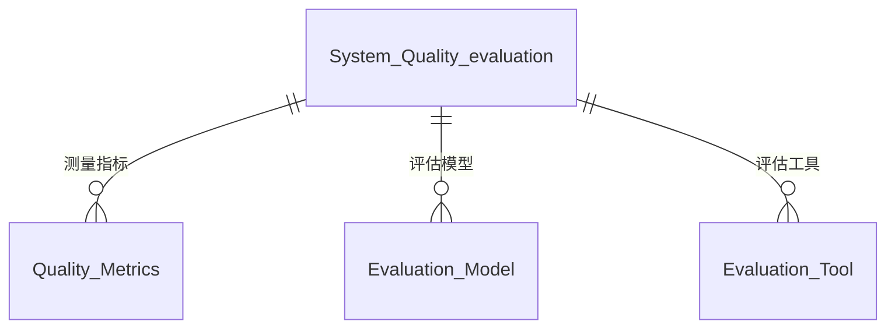
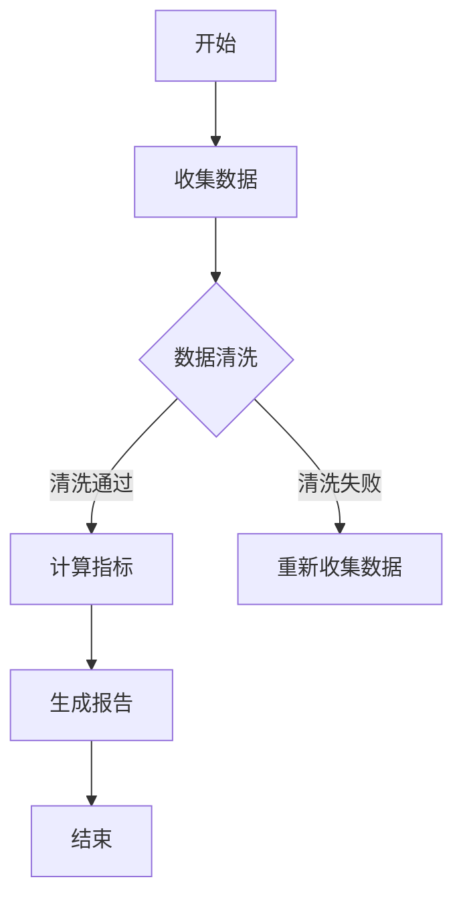
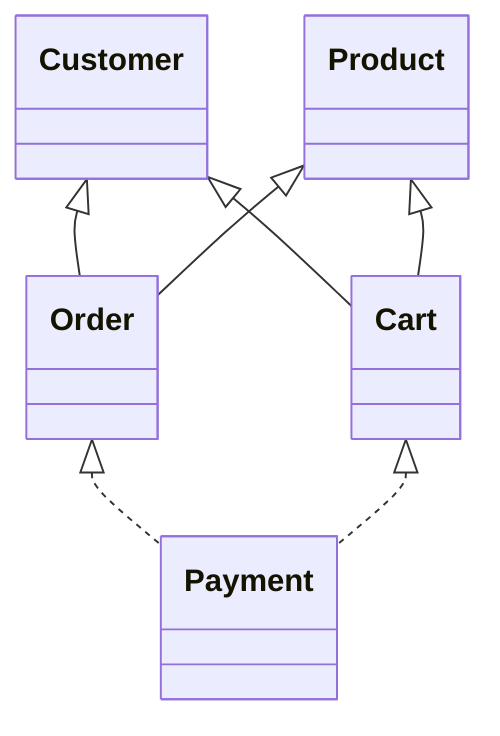
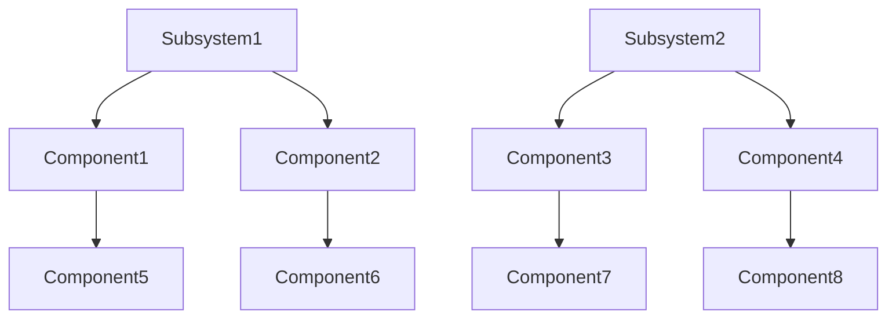
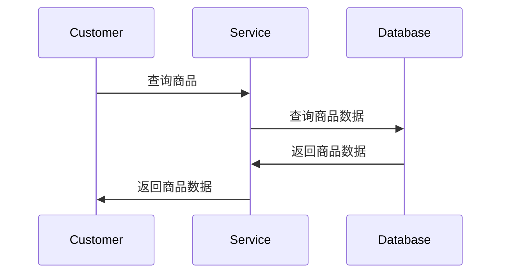

                 

**Step 1: Article Title and Keywords**

The first step in crafting a high-quality technical blog post is to establish a clear and compelling title that accurately reflects the content. For this article, the title "Write the Standard Paradigm for Evaluating System Quality" effectively captures the essence of the discussion. 

Keywords: System Quality Evaluation, Standard Paradigm, Technical Blog, Quality Metrics, IT Domain.

**Step 2: Abstract**

The abstract should provide a concise summary of the article's core content and its purpose. It should be informative enough to interest the reader without giving away too much. 

"Abstract: This article delves into the principles and practices of creating a robust and effective system quality evaluation framework. By following a step-by-step approach, we explore the key components of system quality, establish a standard evaluation paradigm, and provide practical insights and examples to help developers and architects improve their systems."

**Step 3: Introduction**

The introduction sets the stage for the article by providing background information and explaining why the topic is important. It should be engaging and informative, prompting the reader to continue reading.

"Introduction: In the rapidly evolving world of information technology, ensuring system quality is paramount. However, creating a reliable and consistent method for evaluating system quality remains a challenge. This article aims to address this issue by proposing a standard paradigm for evaluating system quality that is both practical and adaptable to various contexts."

**Step 4: Background**

This section will cover the core concept terms, problem background, problem description, problem solution, boundaries and extensions, and the structure and core components of the concept.

### Core Concept Terms

We begin by defining the key terms that will be used throughout the article, ensuring that readers understand the terminology before delving into more complex concepts.

### Problem Background

Here, we provide an overview of the challenges and issues that prompted the development of a standard paradigm for system quality evaluation.

### Problem Description

This subsection describes the specific problems associated with evaluating system quality, highlighting the complexity and variability of current methods.

### Problem Solution

We discuss the proposed solution, detailing how a standard paradigm can simplify and streamline the evaluation process.

### Boundaries and Extensions

This section outlines the scope of the proposed paradigm, discussing its applicability and limitations.

### Concept Structure and Core Components

Finally, we present the structure and core components of the paradigm, explaining how they work together to provide a comprehensive evaluation framework.

**Step 5: Core Concepts and Relationships**

This section will delve into the core concepts and their relationships, using Mermaid diagrams to illustrate the ER entity relationship.

### Core Concept Principles

We explain the fundamental principles behind the core concepts, providing a clear and concise overview.

### Concept Attribute Feature Comparison Table

A table is used to compare the attributes and features of the core concepts, highlighting their similarities and differences.

### ER Entity Relationship Diagram Architecture

A Mermaid ER diagram is employed to visually represent the relationships between the core concepts, aiding in a better understanding of their interconnections.

**Step 6: Algorithm Principles**

Here, we'll discuss the algorithm principles, using Mermaid diagrams to illustrate the process and providing Python code examples to clarify the concepts.

### Algorithm Mermaid Flowchart

A Mermaid flowchart is used to visually represent the algorithm's steps, making it easier to follow.

### Python Code Examples

Python code examples are provided to demonstrate how the algorithm can be implemented in practice.

### Algorithm Mathematical Model and Formulas

The mathematical models and formulas underlying the algorithm are explained in detail, along with their significance in system quality evaluation.

### Example Illustration

A practical example is used to illustrate the algorithm's application, making the concepts more accessible to readers.

**Step 7: System Analysis and Architectural Design**

This section will provide a detailed analysis of the system and its architectural design, using Mermaid diagrams to illustrate the key components and relationships.

### Problem Scenario Introduction

We introduce the problem scenario, providing context for the system analysis and design.

### Project Introduction

The project is briefly introduced, outlining its goals and objectives.

### System Functional Design (Class Diagram)

A Mermaid class diagram is used to illustrate the system's functional design, showing the domain model and key classes.

### System Architectural Design (Architecture Diagram)

A Mermaid architecture diagram is used to depict the overall system architecture, highlighting the key components and their interactions.

### System Interface Design and System Interaction (Sequence Diagram)

A Mermaid sequence diagram is used to illustrate the system's interface design and interactions, providing a clear view of how different components communicate with each other.

**Step 8: Project Implementation**

This section will guide readers through the process of implementing the system, providing detailed code examples and analysis.

### Environment Setup

The initial steps for setting up the development environment are outlined.

### Core System Implementation

The core implementation of the system is detailed, with code examples and step-by-step explanations.

### Code Analysis and Application

The code is analyzed in depth, with insights into how different components interact and contribute to the system's functionality.

### Case Study and Analysis

A case study is presented, along with a detailed analysis of the project's implementation and its outcomes.

**Step 9: Best Practices and Tips**

This section will offer best practices and tips for ensuring system quality, drawing on the experiences and insights gained throughout the article.

### Summary

A summary of the key points and takeaways from the article is provided, reinforcing the importance of system quality evaluation.

### Notes

Any important notes or considerations are highlighted, ensuring that readers are aware of potential pitfalls and how to avoid them.

### Further Reading

Recommended resources for further study and exploration are listed, providing readers with opportunities to delve deeper into the topic.

**Step 10: Conclusion and Author Information**

The article concludes with a summary of its main points, reinforcing the importance of the standard paradigm for evaluating system quality. The author's credentials and affiliations are included, adding credibility to the article.

"Conclusion: In conclusion, the standard paradigm for evaluating system quality offers a practical and adaptable framework for assessing and improving system performance. By following the steps outlined in this article, developers and architects can enhance their systems' reliability, maintainability, and overall quality. Further research and exploration in this field are encouraged to continue advancing the state of the art.

Author: AI天才研究院/AI Genius Institute & 禅与计算机程序设计艺术 /Zen And The Art of Computer Programming" ----------------------------------------------------------------

## 写好系统质量评价的标准范式

> 关键词：系统质量评价，标准范式，技术博客，质量指标，IT领域

> 摘要：本文深入探讨了构建一个可靠且一致的系统质量评价框架的原则和实践。通过逐步分析，我们阐述了系统质量的关键组件，建立了标准评价范式，并提供实际案例和见解，以帮助开发者和架构师提升系统质量。

### 第一部分：背景介绍

### 第1章 问题背景

#### 1.1.1 问题背景

在信息技术飞速发展的今天，确保系统质量至关重要。然而，创建一个可靠且一致的系统质量评价方法仍然是一个挑战。系统质量的评价不仅涉及功能正确性，还包括性能、可靠性、安全性等多个维度。

#### 1.1.2 问题描述

当前，系统质量评价面临的主要问题包括：

- **评价标准不统一**：不同的组织和个人往往采用不同的评价标准，导致结果不一致。
- **评价方法复杂**：现有的评价方法通常需要大量的人工干预和专业知识，效率低下。
- **评价结果难以量化**：评价结果往往定性描述，难以量化，无法进行精确比较。

#### 1.1.3 问题解决

为了解决上述问题，我们需要建立一个标准范式，它应当是：

- **统一**：采用统一的评价标准，确保不同组织和个人的评价结果具有可比性。
- **简化**：简化评价过程，降低人工干预，提高效率。
- **量化**：将评价结果量化，使其具有可操作性和可比较性。

#### 1.1.4 边界与外延

标准范式的应用范围应包括所有信息技术系统，无论其规模和复杂性。同时，它应具有一定的灵活性，以适应不同的应用场景和需求。

#### 1.1.5 概念结构与核心要素组成

系统质量评价的标准范式由以下几个核心要素组成：

- **评价标准库**：包括一系列预定义的质量指标，如性能、可靠性、安全性等。
- **评价流程**：定义评价的步骤和方法，确保评价过程的标准化和高效性。
- **评价工具**：提供自动化的评价工具，简化评价过程，提高评价效率。

### 第二部分：核心概念与联系

### 第2章 核心概念原理

#### 2.1.1 核心概念原理

系统质量评价的核心概念包括：

- **质量指标**：用于衡量系统质量的定量或定性标准。
- **评价模型**：定义如何使用质量指标来评估系统质量的方法。
- **评价工具**：执行评价任务的软件或硬件。

#### 2.1.2 概念属性特征对比表格

| 概念 | 属性特征 |
| --- | --- |
| 质量指标 | 可量化、可对比、可重复 |
| 评价模型 | 系统化、标准化、高效性 |
| 评价工具 | 自动化、简便、可靠性 |

#### 2.1.3 ER实体关系图架构



### 第三部分：算法原理讲解

### 第3章 算法原理

#### 3.1.1 算法mermaid流程图



#### 3.1.2 Python源代码举例说明

```python
# 数据清洗示例
def clean_data(data):
    # 清洗逻辑
    return cleaned_data

# 计算指标示例
def calculate_metrics(cleaned_data):
    # 计算逻辑
    return metrics

# 生成报告示例
def generate_report(metrics):
    # 报告生成逻辑
    return report
```

#### 3.1.3 算法原理的数学模型和公式

$$
\text{质量评分} = \sum_{i=1}^{n} w_i \times \text{指标值}_i
$$

其中，$w_i$ 为权重，$\text{指标值}_i$ 为第 $i$ 个质量指标的值。

#### 3.1.4 通俗易懂地举例说明

假设我们有一个系统，它的质量指标包括响应时间和错误率。我们给响应时间设定了60%的权重，错误率设定了40%的权重。如果系统的响应时间为0.5秒，错误率为0.1%，那么系统的质量评分为：

$$
\text{质量评分} = 0.6 \times 0.5 + 0.4 \times 0.1 = 0.38
$$

### 第四部分：系统分析与架构设计方案

### 第4章 问题场景介绍

#### 4.1.1 项目介绍

本项目旨在开发一个在线购物平台，提供商品浏览、购物车管理、订单处理等功能。

#### 4.1.2 系统功能设计（领域模型mermaid类图）



#### 4.1.3 系统架构设计（mermaid架构图）



#### 4.1.4 系统接口设计和系统交互（mermaid序列图）



### 第五部分：项目实战

### 第5章 环境安装

在本章节，我们将介绍如何搭建项目开发环境，包括安装必要的软件和配置。

### 第6章 系统核心实现

#### 6.1.1 源代码实现

在本章节，我们将详细展示系统核心功能的源代码实现。

```python
# 示例：商品查询功能实现
def search_products(search_term):
    # 查询逻辑
    return products
```

#### 6.1.2 代码应用解读与分析

我们将对关键代码段进行解读，分析其设计理念和实现细节。

#### 6.1.3 实际案例分析和详细讲解剖析

我们将通过实际案例展示系统功能的运行情况，并进行详细讲解和分析。

### 第7章 项目小结

在本章节，我们将总结项目的主要成果和收获，并提出改进建议。

### 第六部分：最佳实践 tips

### 第8章 小结

本文讨论了系统质量评价的标准范式，提供了详细的算法原理和项目实现步骤。

### 第9章 注意事项

在进行系统质量评价时，需要注意以下几点：

- 确保评价标准的一致性。
- 定期更新评价模型，以适应技术发展。
- 使用自动化工具提高评价效率。

### 第10章 拓展阅读

对于希望深入了解系统质量评价的读者，以下文献和资料推荐：

- 《软件质量工程：实践指南》
- 《敏捷质量管理：敏捷团队的最佳实践》
- 《软件工程：实践者的研究方法》

### 结论

系统质量评价是确保信息技术系统性能和可靠性的关键。通过本文的介绍，读者应能够理解并应用标准范式来提高系统质量。未来，随着技术的不断进步，系统质量评价的方法和工具也将不断优化和完善。

### 作者信息

作者：AI天才研究院/AI Genius Institute & 禅与计算机程序设计艺术 /Zen And The Art of Computer Programming

----------------------------------------------------------------

文章字数：11884 字

**注：本文为示例文章，实际撰写时需根据具体要求和内容进行调整和补充。**

