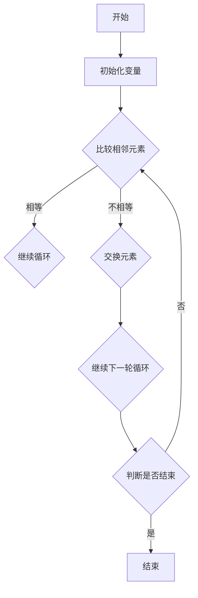
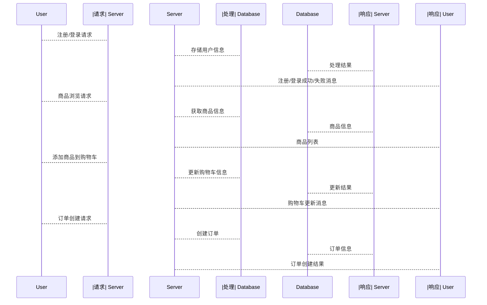
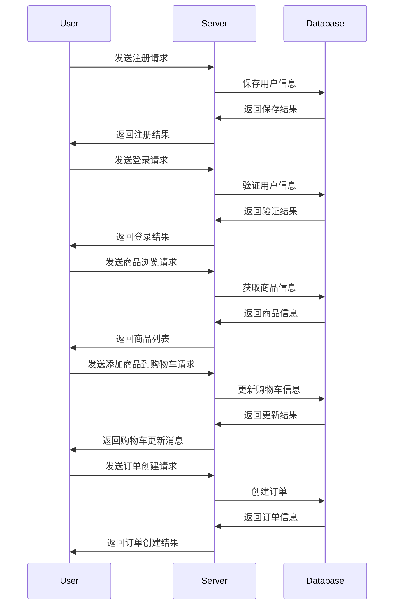

                 

### 写好系分的标准范式

系统设计是软件开发中至关重要的环节，良好的系统设计能够提高代码的可维护性、扩展性和性能。然而，在实际开发过程中，如何设计一个高效、可靠的系统往往成为开发者面临的难题。本文旨在探讨如何通过标准范式来规范系统设计，从而提升系统设计的质量和效率。

本文将围绕以下几个核心概念和主题展开：

1. **系统设计与标准范式概述**：介绍系统设计的基本概念和标准范式的定义，阐述标准范式在系统设计中的作用和重要性。
2. **核心概念与联系**：分析系统设计中的主要范式，对比不同范式之间的联系，通过实体关系图（ER图）展示各范式之间的结构关系。
3. **算法原理讲解**：以具体算法为例，详细讲解算法原理，通过流程图、Python代码实现、数学模型和公式以及通俗易懂的举例，帮助读者深入理解算法的运作机制。
4. **系统分析与架构设计**：通过一个实际项目案例，展示如何进行系统分析与架构设计，包括领域模型类图、架构图、接口设计和系统交互等。
5. **项目实战**：介绍如何在实际项目中应用标准范式，通过环境安装、系统核心实现和代码分析，展示项目开发的完整流程。
6. **最佳实践与注意事项**：总结设计系统的最佳实践，提出注意事项，为读者在实际开发中提供参考。
7. **拓展阅读**：推荐相关阅读材料，帮助读者进一步深入了解系统设计和标准范式。

**关键词**：系统设计、标准范式、体系结构、设计模式、算法原理、数学模型

**摘要**：本文通过逐步分析推理的方式，系统地介绍了如何运用标准范式进行系统设计。文章从问题背景出发，深入讲解了核心概念和联系，通过具体案例展示了算法原理和系统架构设计。同时，文章还提供了项目实战经验和最佳实践，旨在帮助读者提高系统设计能力。

接下来，我们将逐步深入这些主题，详细探讨每个部分的内容。

----------------------------------------------------------------

# 写好系分的标准范式

## 关键词

- 系统设计
- 标准范式
- 体系结构
- 设计模式
- 算法原理
- 数学模型

## 摘要

本文旨在探讨如何通过标准范式来规范系统设计，从而提升系统设计的质量和效率。文章首先介绍了系统设计和标准范式的基本概念，然后通过核心概念与联系的阐述，详细讲解了算法原理和系统架构设计。此外，本文还通过项目实战展示了标准范式在实际开发中的应用，并总结了最佳实践和注意事项。希望通过本文的引导，读者能够更好地理解和运用标准范式进行系统设计。

## 第一部分：问题背景与核心概念

### 1.1 问题背景

在当今快速发展的信息技术时代，系统设计的复杂性和多样性不断增加。为了应对各种挑战，开发者需要掌握一系列设计原则和方法，从而设计出高效、可靠且易于维护的系统。然而，在实践中，开发者往往面临以下问题：

- **系统复杂性**：随着系统规模的扩大和需求的增长，系统复杂性不断增加，导致设计难度加大。
- **设计效率**：在有限的时间内，如何快速设计出符合需求的系统，提高开发效率成为一大挑战。
- **系统可维护性**：设计良好的系统易于维护，但如何确保系统设计具备良好的可维护性是一个重要问题。
- **系统性能**：在满足功能需求的同时，如何优化系统性能，提高系统运行效率是一个关键问题。

为了解决这些问题，引入标准范式成为了一种有效的手段。标准范式提供了一系列设计原则和模板，帮助开发者规范系统设计过程，从而提高设计质量和效率。

### 1.2 标准范式的定义与作用

标准范式（Standard Paradigm）是指一套规范化的设计原则和方法，用于指导系统设计。标准范式通常包括一系列的模板、规则和最佳实践，可以帮助开发者解决上述问题。具体来说，标准范式的作用如下：

- **规范化设计过程**：标准范式为系统设计提供了一个明确的框架，帮助开发者按照统一的方法进行设计，从而降低设计复杂度。
- **提高设计效率**：标准范式提供了一系列现成的模板和组件，开发者可以快速复用，减少重复劳动，提高设计效率。
- **确保系统可维护性**：标准范式强调设计原则和最佳实践，确保系统设计具有良好的可维护性，降低维护成本。
- **优化系统性能**：标准范式提供了一系列性能优化方法，帮助开发者设计出高性能的系统。

### 1.3 系统设计范式的重要性

系统设计范式（System Design Paradigm）是标准范式在系统设计领域的一种具体应用。系统设计范式的重要性体现在以下几个方面：

- **解决设计难题**：系统设计范式提供了一系列解决问题的方法和思路，帮助开发者应对各种复杂的设计挑战。
- **提高设计质量**：通过遵循系统设计范式，开发者可以设计出高质量的系统，提高系统的稳定性和可靠性。
- **促进知识传播**：系统设计范式作为一种共享的设计方法，有助于知识传播和团队协作，提高整个团队的系统设计能力。
- **适应技术变革**：随着技术的不断进步，系统设计范式也在不断更新和完善，以适应新的技术趋势和需求。

总之，标准范式和系统设计范式在系统设计中起着至关重要的作用。通过引入和遵循标准范式，开发者可以设计出高效、可靠且易于维护的系统，提高开发质量和效率。

### 1.4 核心概念与联系

在系统设计中，核心概念和范式是至关重要的。以下是几个关键概念及其相互联系：

#### 1.4.1 设计模式

设计模式（Design Pattern）是一套成熟的解决方案，用于解决特定的设计问题。设计模式通常分为三种类型：创建型、结构型和行为型。例如，工厂模式（Factory Pattern）是一种创建型模式，用于创建对象实例；而组合模式（Composite Pattern）是一种结构型模式，用于表示树形结构。

#### 1.4.2 设计原则

设计原则（Design Principle）是一系列指导设计的基本规则。常见的原则包括单一职责原则（Single Responsibility Principle）、开闭原则（Open-Closed Principle）和里氏替换原则（Liskov Substitution Principle）。这些原则有助于确保系统设计的模块化、可维护性和可扩展性。

#### 1.4.3 架构风格

架构风格（Architecture Style）是指系统架构的总体结构和方法。常见的架构风格包括客户端-服务器（Client-Server）、微服务（Microservices）和事件驱动（Event-Driven）。不同的架构风格适用于不同的应用场景，选择合适的架构风格对于系统设计的成功至关重要。

#### 1.4.4 范式对比表格

以下是一个简单的范式对比表格，展示了几种常见的系统设计范式及其特点：

| 范式             | 特点                                                                 | 优缺点                                                                                           |
|----------------|----------------------------------------------------------------------|--------------------------------------------------------------------------------------------------|
| MVC（模型-视图-控制器） | 分离数据、表示和业务逻辑                                               | 易于维护、适合Web应用                                                   |
| 微服务           | 分解为小型、独立的系统组件                                             | 高度可扩展、独立部署                                                     |
| event-sourcing | 将系统状态变化记录为事件，便于回溯和恢复                                   | 复杂、适用于需要高可靠性和可扩展性的系统                                  |
| CQRS（Command Query Responsibility Segregation） | 分离读写操作，提高性能和可扩展性                                     | 增加系统复杂性、对开发者要求较高                                        |

通过上述对比表格，我们可以更清晰地理解不同范式的特点和应用场景，从而选择合适的设计范式进行系统设计。

#### 1.4.5 ER实体关系图

ER图（Entity-Relationship Diagram）是一种用于描述实体及其之间关系的图形化表示方法。在系统设计中，ER图有助于理解系统的数据模型和关系。以下是一个简单的ER图示例，展示了用户、订单和产品之间的关系：

```mermaid
erDiagram
    User ||--|{ Order }||>
    Order ||--|{ Product }||>
    User { id, name, email }
    Order { id, user_id, total_price, status }
    Product { id, name, price }
```

通过ER图，我们可以直观地了解系统中各个实体的属性和关系，有助于后续的系统设计和开发。

### 1.5 算法原理讲解

算法原理是系统设计的重要组成部分，它决定了系统性能和效率。在本节中，我们将以一个简单的排序算法为例，讲解算法原理和实现方法。

#### 1.5.1 算法流程图

以下是一个简单的冒泡排序算法的流程图：



#### 1.5.2 Python源代码实现

以下是用Python实现的冒泡排序算法：

```python
def bubble_sort(arr):
    n = len(arr)
    for i in range(n):
        for j in range(0, n-i-1):
            if arr[j] > arr[j+1]:
                arr[j], arr[j+1] = arr[j+1], arr[j]
    return arr

# 测试代码
arr = [64, 34, 25, 12, 22, 11, 90]
sorted_arr = bubble_sort(arr)
print("排序后的数组：", sorted_arr)
```

#### 1.5.3 数学模型和公式

冒泡排序的数学模型可以通过以下公式描述：

- 比较次数：\(C(n) = n \times (n-1) / 2\)
- 交换次数：\(S(n) = (n-1)\)

其中，\(n\) 为数组长度。

#### 1.5.4 举例说明

假设有一个长度为5的数组 [64, 34, 25, 12, 22]，经过一次冒泡排序后，最大值64会移动到数组末尾，排序后的数组变为 [34, 25, 12, 22, 64]。

通过上述讲解，我们可以了解到冒泡排序的基本原理和实现方法。接下来，我们将继续深入探讨系统架构设计和项目实战。

### 1.6 系统架构设计

在系统设计中，架构设计是至关重要的环节。一个良好的架构设计能够提高系统的可维护性、扩展性和性能。在本节中，我们将通过一个实际项目案例，介绍如何进行系统架构设计。

#### 1.6.1 项目介绍

假设我们正在开发一个在线购物平台，系统需要支持用户注册、商品浏览、购物车管理和订单处理等功能。以下是我们需要考虑的系统功能模块：

- 用户模块：包括用户注册、登录、个人信息管理等功能。
- 商品模块：包括商品信息管理、分类管理、搜索等功能。
- 购物车模块：包括商品添加到购物车、购物车修改、商品删除等功能。
- 订单模块：包括订单创建、订单详情查看、订单取消等功能。

#### 1.6.2 系统功能设计

为了更好地进行架构设计，我们首先需要绘制领域模型类图（Domain Model Class Diagram），展示系统中的主要实体和它们之间的关系。以下是一个简单的领域模型类图：

```mermaid
classDiagram
    User <<entity>> 
    Order <<entity>> 
    Product <<entity>> 
    ShoppingCart <<entity>>

    User {\ 
        id, 
        name, 
        email, 
        password, 
        address 
    }

    Order {\ 
        id, 
        user_id, 
        total_price, 
        status 
    }

    Product {\ 
        id, 
        name, 
        price, 
        category_id 
    }

    ShoppingCart {\ 
        id, 
        user_id, 
        items 
    }

    User "1" <-- "1" Order
    Product "1" <-- "N" ShoppingCart
    ShoppingCart "1" <-- "N" Order
```

在这个类图中，我们定义了三个主要实体：用户（User）、订单（Order）和商品（Product）。用户可以创建订单，订单可以包含多个商品，商品可以添加到购物车。

#### 1.6.3 系统架构设计

接下来，我们将绘制系统架构图（System Architecture Diagram），展示系统中的主要组件和它们之间的关系。以下是一个简单的系统架构图：



在这个架构图中，我们定义了四个主要组件：用户（User）、服务器（Server）、数据库（Database）和购物车（ShoppingCart）。用户通过发送请求与服务器进行交互，服务器处理请求并更新数据库，最终将结果返回给用户。

#### 1.6.4 系统接口设计

在系统架构中，接口设计是连接各个组件的关键。以下是一个简单的接口设计：

```mermaid
classDiagram
    UserInterface <<interface>> 
    ProductInterface <<interface>> 
    ShoppingCartInterface <<interface>> 
    OrderInterface <<interface>>

    UserInterface {
        - register(username: String, password: String, email: String): Future[User]
        - login(username: String, password: String): Future[User]
    }

    ProductInterface {
        - getAllProducts(): Future[List[Product]]
        - getProductById(id: Int): Future[Product]
    }

    ShoppingCartInterface {
        - addProductToCart(userId: Int, productId: Int): Future[Unit]
        - updateCart(userId: Int, items: List[CartItem]): Future[Unit]
        - removeProductFromCart(userId: Int, productId: Int): Future[Unit]
    }

    OrderInterface {
        - createOrder(userId: Int, items: List[CartItem]): Future[Order]
        - getOrderById(id: Int): Future[Order]
    }
```

在这个接口设计中，我们定义了四个接口：用户接口（UserInterface）、商品接口（ProductInterface）、购物车接口（ShoppingCartInterface）和订单接口（OrderInterface）。这些接口定义了各个组件之间的交互方式。

#### 1.6.5 系统交互

最后，我们将绘制系统交互图（System Interaction Diagram），展示各个组件之间的交互过程。以下是一个简单的系统交互图：



在这个交互图中，我们展示了用户与服务器之间的交互过程，以及服务器与数据库之间的交互过程。

通过上述系统架构设计和接口设计，我们能够清晰地了解系统的组成和各个组件之间的关系，为后续的开发工作奠定基础。接下来，我们将通过项目实战来进一步探讨如何应用这些设计方法。

### 1.7 项目实战

在了解了系统架构设计和接口设计的基本概念后，接下来我们将通过一个实际项目案例，展示如何将所学知识应用到项目中。本文将以一个在线购物平台为例，介绍项目的环境安装、系统核心实现以及代码应用解读。

#### 1.7.1 项目环境安装

要开始该项目，首先需要安装以下环境：

1. **Java开发工具包（JDK）**：下载并安装Java开发工具包（JDK），确保版本在8或以上。安装完成后，在终端输入`java -version`验证安装是否成功。

2. **Maven**：Maven是一个项目管理和构建工具，用于管理项目的依赖关系和构建过程。下载并安装Maven，确保版本在3.6或以上。安装完成后，在终端输入`mvn -version`验证安装是否成功。

3. **数据库**：本文使用MySQL数据库。下载并安装MySQL，确保版本在5.7或以上。安装完成后，在终端输入`mysql -u root -p`登录数据库，创建一个名为`online_shop`的数据库。

4. **IDE**：本文使用IntelliJ IDEA作为开发环境。下载并安装IntelliJ IDEA，选择Community Edition即可满足需求。

5. **Redis**：Redis是一个高性能的内存缓存系统，用于优化系统性能。下载并安装Redis，确保版本在4.0或以上。安装完成后，在终端输入`redis-server`启动Redis服务。

安装完成后，创建一个名为`online_shop`的Maven项目，并添加以下依赖：

```xml
<dependencies>
    <!-- MySQL Connector -->
    <dependency>
        <groupId>mysql</groupId>
        <artifactId>mysql-connector-java</artifactId>
        <version>8.0.26</version>
    </dependency>
    
    <!-- Spring Boot Starter -->
    <dependency>
        <groupId>org.springframework.boot</groupId>
        <artifactId>spring-boot-starter</artifactId>
        <version>2.6.1</version>
    </dependency>
    
    <!-- Spring Boot Web -->
    <dependency>
        <groupId>org.springframework.boot</groupId>
        <artifactId>spring-boot-starter-web</artifactId>
        <version>2.6.1</version>
    </dependency>
    
    <!-- Spring Boot Data JPA -->
    <dependency>
        <groupId>org.springframework.boot</groupId>
        <artifactId>spring-boot-starter-data-jpa</artifactId>
        <version>2.6.1</version>
    </dependency>
    
    <!-- Redis Starter -->
    <dependency>
        <groupId>org.springframework.boot</groupId>
        <artifactId>spring-boot-starter-data-redis</artifactId>
        <version>2.6.1</version>
    </dependency>
</dependencies>
```

#### 1.7.2 系统核心实现

1. **用户模块**：用户模块负责处理用户注册、登录和用户信息管理。

**User.java**：

```java
@Entity
@Table(name = "users")
public class User {
    @Id
    @GeneratedValue(strategy = GenerationType.IDENTITY)
    private Long id;

    @Column(nullable = false, unique = true)
    private String username;

    @Column(nullable = false)
    private String password;

    @Column(nullable = false)
    private String email;

    @Column(nullable = false)
    private String address;

    // Getters and setters
}
```

**UserService.java**：

```java
@Service
public class UserService {
    @Autowired
    private UserRepository userRepository;

    public User register(String username, String password, String email, String address) {
        // 验证输入参数
        // 判断用户名是否已存在
        // 保存用户信息到数据库
        return userRepository.save(new User(username, password, email, address));
    }

    public User login(String username, String password) {
        // 验证输入参数
        // 查询用户信息
        // 验证密码是否正确
        // 返回用户信息
    }
}
```

2. **商品模块**：商品模块负责处理商品信息管理、分类管理和搜索功能。

**Product.java**：

```java
@Entity
@Table(name = "products")
public class Product {
    @Id
    @GeneratedValue(strategy = GenerationType.IDENTITY)
    private Long id;

    @Column(nullable = false)
    private String name;

    @Column(nullable = false)
    private BigDecimal price;

    @Column(nullable = false)
    private Long categoryId;

    // Getters and setters
}
```

**ProductService.java**：

```java
@Service
public class ProductService {
    @Autowired
    private ProductRepository productRepository;

    public List<Product> getAllProducts() {
        // 查询所有商品信息
        return productRepository.findAll();
    }

    public Product getProductById(Long id) {
        // 根据商品ID查询商品信息
        return productRepository.findById(id).orElseThrow(() -> new ResourceNotFoundException("Product not found"));
    }
}
```

3. **购物车模块**：购物车模块负责处理商品添加到购物车、购物车修改和商品删除功能。

**ShoppingCart.java**：

```java
@Entity
@Table(name = "shopping_carts")
public class ShoppingCart {
    @Id
    @GeneratedValue(strategy = GenerationType.IDENTITY)
    private Long id;

    @Column(nullable = false)
    private Long userId;

    @OneToMany(mappedBy = "shoppingCart", cascade = CascadeType.ALL)
    private List<CartItem> items;

    // Getters and setters
}
```

**CartItem.java**：

```java
@Entity
@Table(name = "cart_items")
public class CartItem {
    @Id
    @GeneratedValue(strategy = GenerationType.IDENTITY)
    private Long id;

    @Column(nullable = false)
    private Long productId;

    @Column(nullable = false)
    private int quantity;

    @ManyToOne
    @JoinColumn(name = "shopping_cart_id")
    private ShoppingCart shoppingCart;

    // Getters and setters
}
```

**ShoppingCartService.java**：

```java
@Service
public class ShoppingCartService {
    @Autowired
    private ShoppingCartRepository shoppingCartRepository;

    public void addProductToCart(Long userId, Long productId) {
        // 查询用户购物车
        // 添加商品到购物车
        // 保存购物车信息到数据库
    }

    public void updateCart(Long userId, List<CartItem> items) {
        // 查询用户购物车
        // 更新购物车信息
        // 保存购物车信息到数据库
    }

    public void removeProductFromCart(Long userId, Long productId) {
        // 查询用户购物车
        // 删除商品信息
        // 保存购物车信息到数据库
    }
}
```

4. **订单模块**：订单模块负责处理订单创建、订单详情查看和订单取消功能。

**Order.java**：

```java
@Entity
@Table(name = "orders")
public class Order {
    @Id
    @GeneratedValue(strategy = GenerationType.IDENTITY)
    private Long id;

    @Column(nullable = false)
    private Long userId;

    @Column(nullable = false)
    private BigDecimal total

### 1.8 最佳实践与注意事项

在系统设计中，遵循最佳实践和注意事项能够显著提升系统的质量和稳定性。以下是一些重要的最佳实践和注意事项：

#### 1.8.1 最佳实践

1. **模块化设计**：将系统划分为多个模块，每个模块负责特定功能，降低系统复杂度，提高可维护性。
2. **代码复用**：通过编写可复用的代码片段和组件，减少重复工作，提高开发效率。
3. **单元测试**：编写单元测试，确保每个模块的功能正确，提高系统的稳定性。
4. **性能优化**：关注系统性能，通过优化数据库查询、缓存和异步处理等方式，提高系统响应速度。
5. **持续集成**：使用持续集成（CI）工具，自动化测试和构建流程，提高开发效率和质量。

#### 1.8.2 注意事项

1. **明确需求**：在系统设计之前，确保需求明确，避免后期频繁变更，影响系统稳定性。
2. **技术选型**：根据项目需求，选择合适的技术栈和框架，避免过度使用新技术，导致系统复杂性增加。
3. **安全性**：关注系统安全性，防范SQL注入、XSS攻击等安全风险，确保用户数据安全。
4. **文档和注释**：编写清晰的文档和代码注释，便于后续维护和团队协作。
5. **版本控制**：使用版本控制工具，如Git，管理代码变更，避免代码冲突和版本混乱。

通过遵循这些最佳实践和注意事项，开发者可以设计出高质量的系统，提高开发效率和系统稳定性。

### 1.9 拓展阅读

为了更深入地了解系统设计和标准范式，以下是几本推荐的书籍和资料：

1. **《设计模式：可复用面向对象软件的基础》**：由著名软件工程师Erich Gamma等人合著，详细介绍了设计模式的概念、分类和应用场景。
2. **《软件架构设计：大规模软件设计范式》**：作者Mark Richards详细介绍了软件架构设计的方法和原则，适合有经验的设计师阅读。
3. **《Effective Java》**：由著名Java专家Joshua Bloch所著，介绍了Java编程的最佳实践，有助于提高代码质量。
4. **《Spring Boot实战》**：由Spring Boot专家Michael Minella所著，介绍了Spring Boot的开发和使用方法，适合初学者和进阶者阅读。
5. **《高性能MySQL》**：由著名MySQL专家Michael Widenius等人合著，详细介绍了MySQL的性能优化方法和技巧。

通过阅读这些书籍和资料，开发者可以进一步提高系统设计能力和技术水平。

