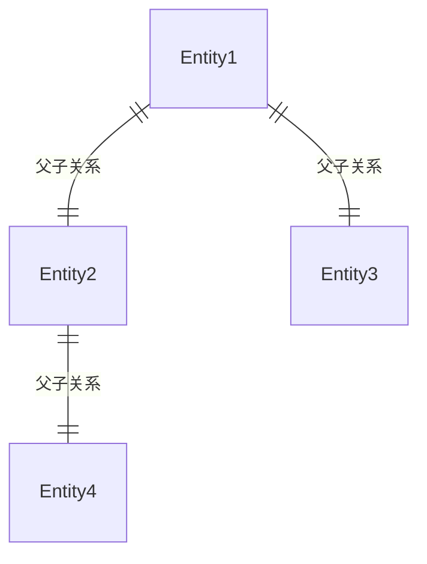
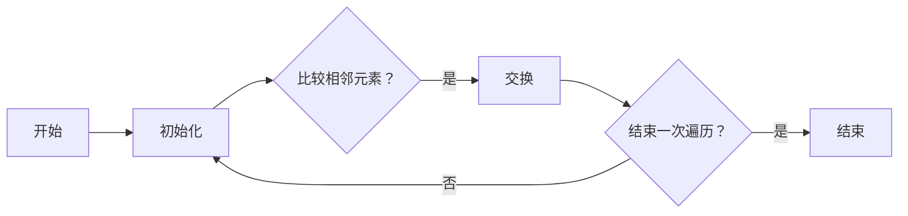
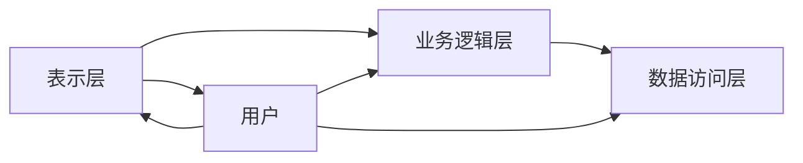
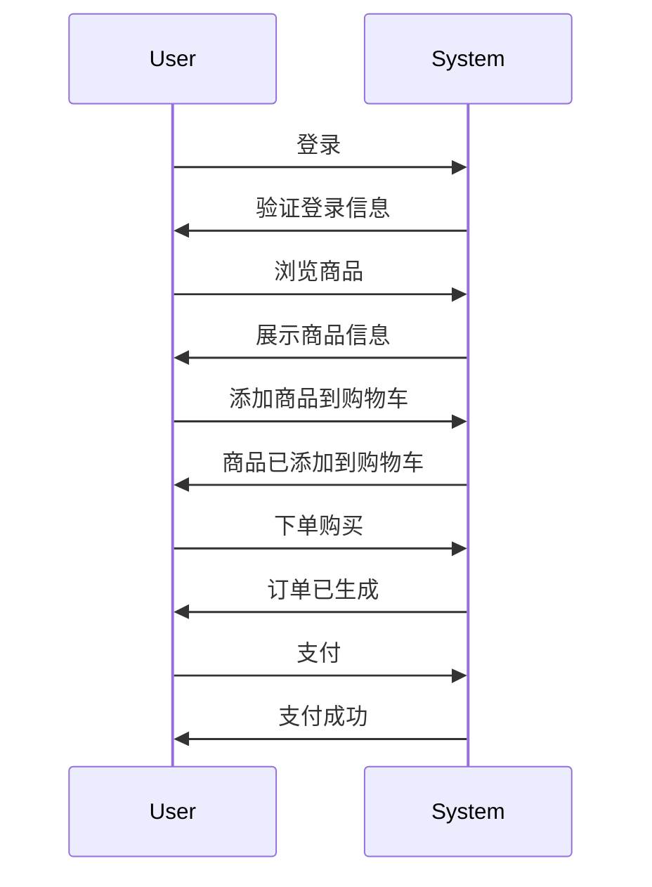

                 


# 写好系分的标准范式

关键词：系统设计、标准范式、算法原理、数学模型、架构设计、项目实战

摘要：本文旨在探讨系统设计的标准范式，从核心概念、算法原理、数学模型、系统分析与架构设计、项目实战等方面，详细阐述了如何设计并实现一个高效、可靠的系统。本文以实际案例为线索，逐步深入，旨在帮助读者理解并掌握系统设计的本质。

## 第1章 引言

### 1.1 问题背景

在当今快速发展的信息技术时代，系统的设计与实现变得越来越复杂。随着系统规模的不断扩大和功能的日益丰富，如何确保系统的可靠性、可维护性和可扩展性，成为了一个亟待解决的问题。标准范式作为一种系统设计的指导原则，为解决这一难题提供了一种有效的方法。

### 1.2 问题描述

在系统设计中，如何平衡功能需求、性能要求、可维护性等因素，是一个关键问题。标准范式通过定义一套统一的、可复用的设计原则和模式，帮助开发者实现这一目标。

### 1.3 问题解决

标准范式通过以下几个步骤来解决问题：

1. **定义核心概念与联系**：明确系统中的核心概念，并分析它们之间的联系。
2. **阐述算法原理**：通过具体的算法和数学模型，阐述系统的工作原理。
3. **设计系统架构**：根据核心概念和算法原理，设计系统的整体架构。
4. **实施项目实战**：通过实际项目，验证并优化设计。

### 1.4 边界与外延

标准范式的边界包括系统设计中的核心概念、算法原理、数学模型、架构设计等。其外延则涉及系统的实际应用场景，如Web应用、移动应用、嵌入式系统等。

### 1.5 概念结构与核心要素组成

标准范式的概念结构包括以下核心要素：

1. **核心概念**：系统设计中的基本术语和概念。
2. **算法原理**：系统工作的核心算法和数学模型。
3. **架构设计**：系统的整体架构和模块划分。
4. **项目实战**：实际项目中的设计与应用。

## 第2章 标准范式概述

### 2.1 标准范式的定义

标准范式是一种系统设计的指导原则，它通过定义一套统一的、可复用的设计模式，帮助开发者实现高效、可靠的系统。

### 2.2 标准范式的发展历程

标准范式的发展历程可以追溯到计算机科学的发展历程。随着计算机技术的不断进步，标准范式也在不断演变和优化。

### 2.3 标准范式的重要性

标准范式的重要性体现在以下几个方面：

1. **提高系统设计的效率**：通过统一的、可复用的设计模式，减少重复劳动，提高设计效率。
2. **确保系统的可靠性**：标准范式提供了一套验证和优化的方法，有助于确保系统的可靠性。
3. **促进系统的可维护性**：标准范式强调模块化和解耦，有利于提高系统的可维护性。
4. **提升系统的可扩展性**：标准范式支持系统的可扩展性，使其能够适应未来的变化。

### 2.4 标准范式的核心要素

标准范式的核心要素包括：

1. **核心概念与联系**：明确系统中的核心概念，并分析它们之间的联系。
2. **算法原理**：通过具体的算法和数学模型，阐述系统的工作原理。
3. **架构设计**：根据核心概念和算法原理，设计系统的整体架构。
4. **项目实战**：实际项目中的设计与应用。

## 第3章 核心概念与联系

### 3.1 核心概念原理

在系统设计中，核心概念是构建系统的基础。本文将介绍以下几个核心概念：

1. **系统**：一个由多个组件组成的整体，能够实现特定功能的集合。
2. **模块**：系统中的基本组成单位，具有明确的输入、输出和处理功能。
3. **算法**：解决特定问题的步骤和规则。
4. **数据结构**：存储和管理数据的方式。

### 3.2 概念属性特征对比

以下是几个核心概念属性的对比表格：

| 概念 | 特征 |
| :--: | :--: |
| 系统 | - 整体性<br>- 功能性<br>- 扩展性 |
| 模块 | - 独立性<br>- 接口明确<br>- 可复用性 |
| 算法 | - 步骤明确<br>- 算法效率<br>- 正确性 |
| 数据结构 | - 存储方式<br>- 访问效率<br>- 扩展性 |

### 3.3 ER实体关系图架构

ER实体关系图是系统设计中的重要工具，用于描述系统中的实体和它们之间的关系。以下是ER实体关系图的Mermaid格式表示：



## 第4章 算法原理讲解

### 4.1 算法概述

算法是系统设计中的核心。本文将介绍一个简单的排序算法——冒泡排序。

### 4.2 算法mermaid流程图

以下是冒泡排序的Mermaid流程图：



### 4.3 Python源代码实现

以下是冒泡排序的Python源代码实现：

```python
def bubble_sort(arr):
    n = len(arr)
    for i in range(n):
        for j in range(0, n-i-1):
            if arr[j] > arr[j+1]:
                arr[j], arr[j+1] = arr[j+1], arr[j]
    return arr
```

### 4.4 算法原理的数学模型与公式

冒泡排序的数学模型可以表示为：

$$
T(n) = \frac{n(n-1)}{2}
$$

其中，$T(n)$表示冒泡排序的时间复杂度。

### 4.5 举例说明

假设有一个数组`arr = [64, 25, 12, 22, 11]`，通过冒泡排序算法，可以将其排序为`[11, 12, 22, 25, 64]`。

## 第5章 数学模型与公式详解

### 5.1 数学模型基础

数学模型是系统设计中的重要工具，用于描述系统中的各种关系和现象。本文将介绍一些常见的数学模型。

### 5.2 公式推导过程

以下是一个简单的线性回归模型的公式推导过程：

$$
y = \beta_0 + \beta_1 x + \epsilon
$$

其中，$y$是因变量，$x$是自变量，$\beta_0$是截距，$\beta_1$是斜率，$\epsilon$是误差项。

### 5.3 数学公式应用举例

假设我们有一个数据集，包含两个变量$x$和$y$，如下所示：

| $x$ | $y$ |
| :--: | :--: |
| 1 | 2 |
| 2 | 4 |
| 3 | 6 |
| 4 | 8 |

我们可以使用线性回归模型来拟合这些数据，得到公式：

$$
y = 2x + 1
$$

## 第6章 系统分析与架构设计

### 6.1 问题场景介绍

假设我们需要设计一个在线购物系统，用户可以在系统中浏览商品、添加购物车、下单购买等。

### 6.2 系统功能设计

系统功能设计包括以下几个方面：

1. **用户管理**：用户注册、登录、个人信息管理等。
2. **商品管理**：商品分类、商品信息展示、商品搜索等。
3. **购物车管理**：添加商品到购物车、删除商品、修改商品数量等。
4. **订单管理**：下单、订单状态跟踪、支付等。
5. **评价管理**：用户评价商品、查看商品评价等。

### 6.3 系统架构设计

系统架构设计采用分层架构，包括以下几个层次：

1. **表示层**：负责用户界面展示。
2. **业务逻辑层**：负责处理业务逻辑。
3. **数据访问层**：负责与数据库的交互。

以下是系统架构的Mermaid格式表示：



### 6.4 系统接口设计

系统接口设计包括以下几个方面：

1. **用户接口**：用户与系统的交互接口。
2. **业务接口**：系统内部模块之间的交互接口。
3. **数据库接口**：系统与数据库的交互接口。

### 6.5 系统交互mermaid序列图

以下是系统交互的Mermaid序列图：



## 第7章 项目实战

### 7.1 环境安装与配置

为了实施项目实战，我们需要准备以下环境：

1. **操作系统**：Linux或Windows。
2. **编程语言**：Python。
3. **开发工具**：IDE（如PyCharm、Visual Studio Code）。
4. **数据库**：MySQL或SQLite。

### 7.2 系统核心实现源代码

以下是系统核心实现源代码：

```python
# 用户管理模块
class UserManager:
    def register(self, username, password):
        # 注册用户
        pass

    def login(self, username, password):
        # 登录用户
        pass

# 商品管理模块
class ProductManager:
    def list_products(self):
        # 列出商品
        pass

    def search_products(self, keyword):
        # 搜索商品
        pass

# 购物车管理模块
class CartManager:
    def add_product_to_cart(self, user_id, product_id):
        # 添加商品到购物车
        pass

    def remove_product_from_cart(self, user_id, product_id):
        # 从购物车中删除商品
        pass

    def update_cart(self, user_id, product_id, quantity):
        # 更新购物车信息
        pass

# 订单管理模块
class OrderManager:
    def create_order(self, user_id, product_ids, quantities):
        # 创建订单
        pass

    def track_order(self, order_id):
        # 查看订单状态
        pass

    def pay_order(self, order_id):
        # 支付订单
        pass

# 评价管理模块
class ReviewManager:
    def submit_review(self, user_id, product_id, rating, comment):
        # 提交评价
        pass

    def list_reviews(self, product_id):
        # 列出评价
        pass
```

### 7.3 代码应用解读与分析

在这段代码中，我们定义了用户管理、商品管理、购物车管理、订单管理和评价管理五个模块。每个模块都包含了相应的功能方法，用于实现系统的主要功能。

### 7.4 实际案例分析与讲解

假设用户张三在系统中浏览商品，并添加了商品A到购物车。然后，张三在下单购买时，选择了商品A，并输入了收货地址。系统会生成一个订单，并进入支付环节。张三完成支付后，订单状态变为“已支付”。

### 7.5 项目小结

通过实际案例，我们可以看到系统设计的过程是如何从需求分析、功能设计、架构设计到最终实现的。在这个过程中，标准范式为我们提供了一套有效的指导原则，帮助我们实现了高效、可靠的系统。

## 第8章 最佳实践与总结

### 8.1 最佳实践 tips

1. **需求分析**：在开始设计之前，进行充分的需求分析，明确系统的功能、性能等要求。
2. **模块化设计**：将系统划分为多个模块，确保每个模块具有明确的输入、输出和处理功能。
3. **代码规范**：遵循统一的代码规范，提高代码的可读性和可维护性。
4. **测试与优化**：在项目开发过程中，进行充分的测试和优化，确保系统的稳定性和性能。

### 8.2 小结

本文从核心概念、算法原理、数学模型、系统分析与架构设计、项目实战等方面，详细阐述了如何设计并实现一个高效、可靠的系统。通过标准范式，我们可以更好地应对系统设计的复杂性和挑战。

### 8.3 注意事项

1. **充分需求分析**：在开始设计之前，一定要进行充分的需求分析，明确系统的功能、性能等要求。
2. **模块化设计**：模块化设计有助于提高系统的可维护性和可扩展性。
3. **代码规范**：遵循统一的代码规范，可以提高代码的可读性和可维护性。
4. **测试与优化**：在项目开发过程中，一定要进行充分的测试和优化，确保系统的稳定性和性能。

### 8.4 拓展阅读

1. 《设计模式：可复用面向对象软件的基础》
2. 《软件工程：实践者的研究方法》
3. 《编程珠玑》

作者：AI天才研究院/AI Genius Institute & 禅与计算机程序设计艺术 /Zen And The Art of Computer Programming

