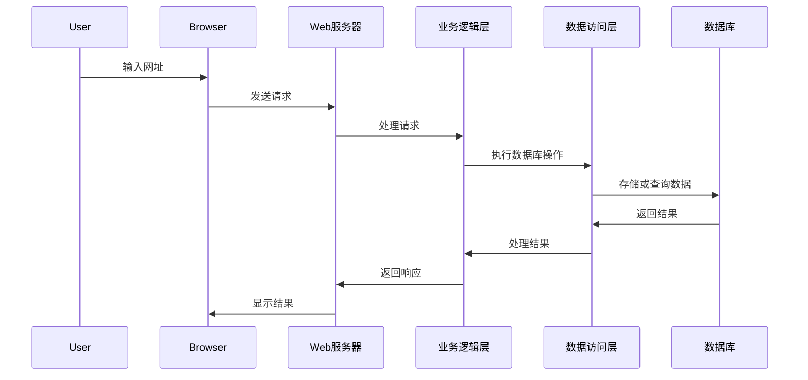

                 

### 1.1 问题背景

在现代软件开发中，系统分析与设计已经成为一个至关重要的环节。随着企业业务复杂性的增加和软件系统的规模不断膨胀，如何高效、准确地分析系统的需求，设计出既稳定又灵活的系统架构，成为了软件开发过程中的核心挑战。一个良好的系统分析与设计不仅能够提高软件开发的效率，还能显著提升系统的可靠性、可维护性和扩展性。

系统分析与设计的过程涉及到多个层面，包括需求分析、系统架构设计、数据建模、接口设计和系统交互设计等。每个环节都至关重要，任何一个环节的失误都可能导致整个系统的失败。例如，需求分析不准确会导致开发出的系统不符合用户实际需求，系统架构设计不合理则可能导致系统性能低下、扩展性差，数据建模不完善会影响到系统的数据管理效率，接口设计不当则会影响系统的互操作性，而系统交互设计不当则可能导致系统功能实现上的各种问题。

因此，掌握系统分析与设计的方法和技巧，对于软件开发人员来说至关重要。然而，目前的现状是，许多开发人员在系统分析与设计方面缺乏系统的学习和实践，导致他们在实际工作中常常感到困惑和力不从心。他们需要一套标准化的范式，能够帮助他们系统地分析系统的需求，设计出合理、高效的系统架构，从而实现高质量的系统开发。

本书的目的在于为读者提供这样一套标准化的范式。通过详细的章节安排，本书从基础理论到实际应用，全面覆盖了系统分析与设计的关键领域。读者将在这本书中找到：

- 系统分析与设计的核心概念和方法。
- 需求分析、系统架构设计、数据建模、接口设计和系统交互设计的具体步骤和技巧。
- 常用的系统分析与设计工具的使用方法。
- 实际案例的分析和总结，帮助读者将理论知识应用到实际工作中。

通过阅读本书，读者不仅能够掌握系统分析与设计的核心技能，还能提升自己在系统开发过程中的整体能力，从而为企业的软件开发项目提供坚实的保障。

### 1.2 需求分析的定义和重要性

需求分析是系统分析与设计的首要环节，也是整个软件开发过程中最为关键的一步。它涉及到对用户需求的识别、整理和描述，是确保系统开发能够满足用户实际需求的基础。需求分析的定义可以概括为：通过系统调研、用户访谈、数据收集和分析等方法，明确系统应该做什么，即确定系统的功能性和非功能需求。

#### 需求分析的核心目标

需求分析的核心目标主要包括：

1. **明确用户需求**：通过与用户的交流，理解他们的业务流程、工作场景和具体需求，从而确保开发出的系统能够解决用户实际问题。
2. **确定系统功能**：根据用户需求，明确系统需要实现的具体功能，如数据录入、查询、报告生成等。
3. **定义系统性能**：确定系统的响应时间、吞吐量、并发处理能力等性能指标，确保系统能够满足用户的使用需求。
4. **识别系统约束**：识别开发过程中的各种约束条件，如预算、时间、技术限制等，确保需求分析的结果具有实际可行性。
5. **建立需求文档**：将需求分析的结果以文档的形式进行记录和保存，为后续的设计和开发提供依据。

#### 需求分析的方法和技术

需求分析的方法和技术多种多样，常用的包括以下几种：

1. **问卷调查**：通过设计问卷，广泛收集用户需求，适用于用户群体较大的情况。
2. **用户访谈**：直接与用户进行一对一或小组访谈，深入了解用户的具体需求和期望。
3. **场景模拟**：通过模拟用户的使用场景，观察用户在特定场景下的行为和需求。
4. **用例图（Use Case Diagram）**：用例图是一种描述系统与外部角色交互的图形化工具，能够清晰地表达系统的功能需求。
5. **需求文档**：将收集到的需求以文档的形式进行整理和记录，常见的文档格式包括需求规格说明书、用户故事、功能需求文档等。

#### 需求分析的重要性

需求分析在系统开发中的重要性不可忽视，主要体现在以下几个方面：

1. **确保系统满足用户需求**：通过需求分析，可以确保开发出的系统能够真正解决用户的问题，提高用户满意度。
2. **减少后期变更**：在需求分析阶段尽可能多地收集和整理需求，可以减少后期因需求变更导致的工作量，降低开发成本。
3. **指导设计和开发**：详细的需求文档为后续的设计和开发提供了明确的指导，有助于提高开发效率和质量。
4. **风险评估**：通过需求分析，可以提前识别和评估项目风险，采取相应措施进行预防和控制。
5. **促进沟通和协作**：需求分析是项目团队成员之间沟通的桥梁，有助于促进各方的协作和理解。

#### 案例分析

例如，在开发一个在线购物平台时，需求分析的过程可能会包括：

- 通过问卷调查和用户访谈，收集用户对于购物流程、支付方式、商品展示等方面的需求。
- 通过场景模拟，了解用户在不同购物场景下的行为和需求，如选择商品、下单支付等。
- 设计用例图，明确系统需要实现的具体功能，如用户注册、商品浏览、购物车管理、订单管理等。
- 编写需求文档，详细记录用户的各类需求，包括功能需求、性能需求和安全需求等。

通过这些方法，开发团队可以确保开发出的购物平台不仅功能完善，还能满足用户的实际需求，从而提升用户体验和满意度。

### 1.3 系统分析的目标和方法

系统分析是软件开发过程中至关重要的一环，其目标是通过深入理解系统需求，明确系统的功能和性能要求，为后续的系统设计和实现提供坚实的基础。系统分析不仅仅是对现有系统的诊断，还包括对未来的预测和规划。以下是系统分析的目标和方法。

#### 系统分析的目标

系统分析的主要目标包括：

1. **理解业务需求**：通过系统分析，深入理解业务流程、业务规则和用户需求，确保系统能够满足这些需求。
2. **识别系统功能**：明确系统需要实现的具体功能，包括业务操作、数据处理和用户交互等。
3. **评估系统性能**：对系统的性能指标进行评估，包括响应时间、吞吐量、并发处理能力等，确保系统能够满足业务需求。
4. **确定系统约束**：识别开发过程中的各种约束条件，如预算、时间和技术限制，确保系统能够在既定条件下实现。
5. **优化系统架构**：通过系统分析，发现现有系统的不足和瓶颈，提出改进和优化的方案。

#### 系统分析的方法

系统分析的方法多种多样，以下是几种常用的方法：

1. **文档分析**：通过阅读现有系统的文档，如需求规格说明书、设计文档和技术规范等，了解系统的历史和现状。
2. **访谈和调查**：与系统的用户、开发人员和技术支持团队进行面对面交流，收集关于系统需求和问题的第一手资料。
3. **流程图分析**：通过绘制业务流程图，明确系统中的业务流程、数据流和控制流，帮助理解系统的运作机制。
4. **用例图分析**：通过用例图，描述系统与外部用户或系统的交互，明确系统的功能和用户需求。
5. **数据流图分析**：通过数据流图，描述数据在系统中的流动过程，识别数据处理的逻辑和存储结构。

#### 系统分析与设计的步骤

系统分析通常包括以下几个步骤：

1. **需求收集**：通过访谈、问卷调查和文档分析等方法，收集用户需求，明确系统的功能性和非功能性需求。
2. **需求分析**：对收集到的需求进行整理和分析，识别系统的关键功能和性能要求，形成需求文档。
3. **系统架构设计**：根据需求分析的结果，设计系统的整体架构，包括模块划分、数据结构和接口设计。
4. **数据建模**：对系统的数据需求进行建模，设计数据库结构，包括实体关系图（ER图）和数据存储方案。
5. **接口设计**：设计系统与外部系统或用户的接口，包括API接口和用户界面。
6. **系统交互设计**：通过顺序图、协作图等工具，描述系统内部的交互过程和业务流程。

#### 案例分析

以开发一个电子商务平台为例，系统分析的步骤可能包括：

- **需求收集**：通过用户访谈和问卷调查，了解用户对购物流程、支付方式、商品推荐和用户评论等方面的需求。
- **需求分析**：整理用户需求，明确平台需要实现的功能，如商品展示、购物车管理、订单处理、支付和用户评论等。
- **系统架构设计**：设计平台的整体架构，包括前端用户界面、后端服务器和数据库等模块。
- **数据建模**：设计数据库结构，包括商品、订单、用户评论等实体，以及它们之间的关系。
- **接口设计**：设计平台与第三方支付系统、物流系统等外部系统的接口，确保数据交互的顺畅。
- **系统交互设计**：通过顺序图和协作图，描述用户在购物过程中的交互流程和系统内部的业务逻辑。

通过这些步骤，开发团队可以确保电子商务平台不仅功能完善，还能高效、稳定地运行，满足用户的期望。

### 1.4 系统分析的常见误区

在系统分析过程中，由于多种因素的影响，开发人员可能会遇到一些常见的误区，这些误区可能导致系统需求分析不准确、设计不合理，甚至影响到系统的最终实施效果。以下是几种常见的误区及其影响：

#### 1.1 忽视用户需求

忽视用户需求是系统分析中最常见的误区之一。许多开发人员在分析系统需求时，过于依赖自己的经验和现有系统的文档，而忽视了与用户的直接沟通。这种做法可能导致开发出的系统无法真正满足用户的需求，从而降低用户体验。

**影响**：如果系统不能解决用户的实际问题，用户满意度会降低，甚至可能导致系统废弃或重新开发。

**解决方法**：在系统分析阶段，应该积极开展用户访谈、问卷调查和场景模拟等活动，确保需求收集的全面性和准确性。

#### 1.2 缺乏详细的文档

另一个常见误区是缺乏详细的文档。在系统分析过程中，如果文档不够详细，可能会导致开发团队对需求的理解产生偏差，从而影响系统的设计和实现。

**影响**：文档不详细会导致沟通不畅，开发过程中频繁的需求变更，增加开发成本和时间。

**解决方法**：在需求分析阶段，应该编写详细的需求文档，包括功能需求、性能需求和安全需求等，确保所有团队成员对需求有共同的理解。

#### 1.3 依赖假设

在系统分析过程中，有些开发人员可能会依赖一些未经证实的假设，而不是通过实际数据和用户反馈来验证需求。这种做法可能导致需求分析结果不准确。

**影响**：依赖假设会导致系统设计不合理，可能无法满足用户的实际需求，甚至造成系统失效。

**解决方法**：在系统分析阶段，应该通过实际的数据和用户反馈来验证需求，避免依赖未经证实的假设。

#### 1.4 缺乏系统性能评估

有些开发人员可能只关注系统的功能需求，而忽视了系统性能的评估。如果系统性能不足，可能会导致系统在高并发、大数据场景下无法正常工作。

**影响**：系统性能不足会影响用户体验，降低系统的可靠性和稳定性。

**解决方法**：在系统分析阶段，应该对系统的性能进行详细评估，包括响应时间、吞吐量、并发处理能力等，确保系统性能满足需求。

#### 1.5 忽视变更管理

在系统分析过程中，需求可能因为各种原因发生变化。如果开发团队忽视变更管理，可能导致需求变更无法及时处理，进而影响系统的稳定性和可靠性。

**影响**：需求变更处理不当会导致开发进度延误，系统稳定性下降。

**解决方法**：建立完善的变更管理流程，对需求变更进行及时评估和调整，确保系统开发和实施的顺利进行。

#### 结论

避免系统分析中的常见误区是确保系统需求准确性和设计合理性的关键。通过积极与用户沟通、编写详细文档、验证需求、评估性能和实施变更管理，开发团队可以大大提高系统分析的准确性和有效性，为系统的成功实施奠定坚实基础。

### 第2章：需求分析

需求分析是系统分析与设计的核心环节，通过深入理解用户需求，明确系统功能、性能和约束，为后续的系统设计和开发提供明确的指导。本章将详细介绍需求分析的过程和步骤，以及常用的需求收集方法和需求文档的编写和审核。

#### 2.1 需求分析的过程和步骤

需求分析是一个系统化的过程，通常包括以下几个步骤：

1. **需求调研**：通过用户访谈、问卷调查、场景模拟等方式，了解用户的需求和期望。
2. **需求整理**：将收集到的需求进行分类、整理和优先级排序，确保需求的有效性和完整性。
3. **需求分析**：对整理后的需求进行深入分析，明确系统的功能和性能要求，识别系统约束。
4. **需求文档编写**：将分析结果以文档的形式进行记录，形成需求规格说明书或其他形式的需求文档。
5. **需求审核**：对需求文档进行评审和验证，确保其准确性和可行性。

以下是需求分析的具体步骤：

1. **需求调研**：通过与用户、业务部门和其他利益相关者的沟通，了解系统的功能需求、性能需求和用户界面需求。这一阶段可以通过访谈、问卷调查、用户场景模拟等方法进行。

2. **需求整理**：将收集到的需求进行分类和整理，确保每个需求都是明确、具体和可测量的。整理过程中，需要明确需求的优先级，以确保关键需求得到优先考虑。

3. **需求分析**：对整理后的需求进行深入分析，确定系统的功能模块、性能指标和约束条件。这一阶段需要使用流程图、用例图、数据流图等工具，对系统进行详细描述。

4. **需求文档编写**：将需求分析的结果编写成需求文档，通常包括需求规格说明书、用户故事、功能需求文档等。需求文档需要清晰、简洁、易于理解，以便后续的设计和开发人员参考。

5. **需求审核**：对需求文档进行评审和验证，确保其准确性和可行性。评审过程通常由项目团队、用户代表和利益相关者共同参与，确保需求文档得到各方认可。

#### 2.2 需求收集的方法和技术

在需求分析过程中，收集需求是至关重要的环节。以下是几种常用的需求收集方法：

1. **用户访谈**：通过与用户进行一对一或小组访谈，深入了解用户的工作流程、业务需求和具体问题。用户访谈是一种高效的需求收集方法，可以帮助开发人员快速获取用户的第一手信息。

2. **问卷调查**：设计问卷，广泛收集用户的需求和意见。问卷调查适用于用户群体较大的情况，可以通过在线调查或纸质问卷的形式进行。

3. **场景模拟**：通过模拟用户的工作场景，观察用户在特定场景下的行为和需求。场景模拟可以帮助开发人员更深入地理解用户的工作流程和需求。

4. **用例图**：用例图是一种描述系统与外部角色交互的图形化工具，通过绘制用例图，可以清晰地表达系统的功能需求。

5. **数据流图**：数据流图描述数据在系统中的流动过程，识别数据处理的逻辑和存储结构。数据流图有助于理解系统的数据处理流程和需求。

#### 2.3 需求文档的编写和审核

编写和审核需求文档是需求分析过程中的关键步骤，以下是一些具体的建议：

1. **编写需求文档**：
   - **清晰和简洁**：需求文档应该清晰、简洁、易于理解，避免使用复杂的术语和冗长的句子。
   - **具体和可测量**：每个需求都应该具体、可测量，以便在后续的验证过程中进行评估。
   - **结构化**：需求文档应该有清晰的结构，包括需求编号、需求描述、优先级、验收标准等。
   - **版本控制**：需求文档应进行版本控制，确保每次修改都被记录和追踪。

2. **审核需求文档**：
   - **内部评审**：项目团队内部进行需求文档的评审，确保需求的一致性和完整性。
   - **用户评审**：邀请用户代表参与需求文档的评审，确保需求符合用户的实际需求。
   - **利益相关者评审**：邀请其他利益相关者参与评审，确保需求文档的广泛认可和可行性。
   - **测试评审**：测试团队参与需求文档的评审，确保需求文档中的功能需求可以实际测试。

通过详细的需求收集和需求文档的编写与审核，开发团队可以确保系统需求得到准确、全面和一致的描述，为后续的系统设计和开发奠定坚实基础。

### 第3章：系统架构设计

系统架构设计是软件系统开发中的关键环节，它决定了系统的性能、可扩展性和可维护性。一个合理的系统架构能够为系统带来稳定、高效和灵活的运行环境。本章将介绍系统架构设计的原则和策略，以及常用的系统架构设计工具和方法。

#### 3.1 系统架构设计的原则

在进行系统架构设计时，以下原则是必须遵循的：

1. **模块化**：将系统划分为多个功能模块，每个模块负责特定的功能，模块之间通过接口进行交互。模块化设计有助于提高系统的可维护性和可扩展性。

2. **分层设计**：系统架构通常分为多层，如表示层、业务逻辑层和数据层。每层负责不同的功能，层次之间的依赖关系尽量减少，提高系统的解耦性。

3. **高内聚、低耦合**：模块内部的高内聚和模块之间的低耦合是良好架构的重要特征。高内聚意味着模块的功能紧密相关，低耦合则意味着模块之间的依赖性尽量减少。

4. **性能优化**：设计时应充分考虑系统的性能需求，包括响应时间、吞吐量和并发处理能力等。可以通过优化数据访问、缓存策略和分布式计算等方式提高系统性能。

5. **安全性**：系统架构设计应考虑安全性，包括数据加密、认证和授权机制等，确保系统数据的安全性和完整性。

6. **可扩展性**：系统架构应具备良好的扩展性，以便在业务需求发生变化时，可以方便地进行扩展和调整。

7. **维护性**：系统架构设计应考虑到后续的维护工作，包括代码的可读性、模块的重用性和文档的完整性。

#### 3.2 系统架构设计的工具和方法

系统架构设计涉及到多种工具和方法，以下是一些常用的工具：

1. **UML（统一建模语言）**：UML 是一种标准化的图形化建模语言，广泛应用于系统架构设计。UML 包括用例图、类图、组件图、部署图等多种图示，可以帮助开发人员清晰地表达系统的结构和功能。

2. **ER图（实体关系图）**：ER图用于描述数据库中的实体及其关系，是数据建模的重要工具。通过ER图，可以清晰地展示数据库中的实体、属性和关系，为数据设计提供依据。

3. **架构风格**：不同的架构风格（如MVC、微服务、SOA等）适用于不同的系统需求。了解和选择合适的架构风格，可以帮助开发人员设计出更高效、灵活的系统架构。

4. **架构模板**：一些通用的架构模板（如三-tier架构、四-tier架构等）可以提供系统架构设计的基本框架，帮助开发人员快速构建系统。

5. **架构设计工具**：如 Enterprise Architect、Visual Paradigm、Lucidchart 等，这些工具提供了丰富的图形化建模功能，方便开发人员设计和修改系统架构。

#### 3.3 系统架构设计的实例分析

以下是一个简单的系统架构设计实例分析：

**需求场景**：设计一个在线书店系统，用户可以在线浏览书籍、购买书籍并管理自己的账户。

**系统功能**：包括用户注册、登录、浏览书籍、购物车管理、订单处理、支付和用户账户管理等。

**架构设计**：

1. **表示层（Presentation Layer）**：负责用户界面和用户交互，可以使用HTML、CSS和JavaScript等前端技术实现。

2. **业务逻辑层（Business Logic Layer）**：负责处理用户的业务请求，如用户登录、书籍搜索、购物车管理、订单处理等。这一层可以使用Spring框架等后端技术实现。

3. **数据访问层（Data Access Layer）**：负责与数据库进行交互，实现数据的增删改查操作。可以使用Hibernate等ORM（对象关系映射）工具。

4. **数据层（Data Layer）**：包括数据库和数据存储方案，可以采用MySQL、MongoDB等数据库系统。

**UML类图**：

```mermaid
classDiagram
    User <<Interface>>
    Book <<Interface>>
    ShoppingCart <<Interface>>
    Order <<Interface>>
    Account <<Interface>>

    User o--* Account
    Book o--* ShoppingCart
    ShoppingCart o--* Order
    Order o--* Account
```

**ER图**：

```mermaid
erDiagram
    User ||--|{ Account }||>
    Book ||--|{ ShoppingCart }||>
    Order ||--|{ Account }||>
    ShoppingCart ||--|{ Book }||>
```

**架构图**：



通过上述实例，我们可以看到系统架构设计如何通过UML类图、ER图和序列图等工具和方法，清晰地表达系统的功能和结构，为系统的开发提供明确的指导。

### 第4章：数据建模

数据建模是系统分析与设计的重要组成部分，它通过定义系统的数据结构来支持系统的功能需求。数据建模不仅关系到数据的存储和管理，还影响到系统的性能和可维护性。本章将介绍数据建模的基本概念和类型，以及关系数据库和非关系数据库的设计方法。

#### 4.1 数据模型的基本概念和类型

数据模型是用于描述数据结构和数据之间关系的方法。它包括数据的属性、实体、关系和约束等元素。

1. **基本概念**：
   - **实体（Entity）**：数据模型中的基本对象，如用户、书籍、订单等。
   - **属性（Attribute）**：实体的特性，如用户的姓名、书籍的ISBN等。
   - **关系（Relationship）**：实体之间的关联，如用户与订单之间的关系。
   - **约束（Constraint）**：用于定义数据的完整性和规则，如主键约束、外键约束等。

2. **类型**：
   - **概念数据模型**：描述现实世界的概念化结构，通常用于需求分析和系统设计。
   - **逻辑数据模型**：描述数据的逻辑结构，用于数据库设计和优化。
   - **物理数据模型**：描述数据的存储结构和物理存储方式，用于数据库实现和维护。

常见的逻辑数据模型包括关系模型、面向对象模型和文档模型等。其中，关系模型是最广泛使用的模型，它使用实体关系图（ER图）来描述数据结构。

#### 4.2 关系数据库设计

关系数据库设计是基于关系模型的数据建模方法，它通过定义表、字段、关系和约束来组织数据。

1. **步骤**：
   - **需求分析**：收集和分析用户需求，明确系统需要存储的数据类型和关系。
   - **概念数据建模**：使用ER图等工具，将用户需求转化为概念数据模型。
   - **逻辑数据建模**：将概念数据模型转化为逻辑数据模型，通常使用SQL语言定义表和字段。
   - **物理数据建模**：根据数据库系统的特性，调整逻辑数据模型，使其适合物理存储。

2. **ER图**：

```mermaid
erDiagram
    Customer ||--|{ Order }||>
    Product ||--|{ Order }||>
    Order ||--|{ OrderLine }||>
```

在上面的ER图中，`Customer`、`Product` 和 `Order` 是实体，`OrderLine` 是订单行的实体。它们之间的关系通过`--`和`||>`表示。

3. **SQL定义**：

```sql
CREATE TABLE Customer (
    CustomerID INT PRIMARY KEY,
    Name VARCHAR(100),
    Email VARCHAR(100)
);

CREATE TABLE Product (
    ProductID INT PRIMARY KEY,
    Name VARCHAR(100),
    Price DECIMAL(10, 2)
);

CREATE TABLE Order (
    OrderID INT PRIMARY KEY,
    CustomerID INT,
    OrderDate DATE,
    FOREIGN KEY (CustomerID) REFERENCES Customer(CustomerID)
);

CREATE TABLE OrderLine (
    OrderLineID INT PRIMARY KEY,
    OrderID INT,
    ProductID INT,
    Quantity INT,
    FOREIGN KEY (OrderID) REFERENCES Order(OrderID),
    FOREIGN KEY (ProductID) REFERENCES Product(ProductID)
);
```

通过上述SQL语句，我们定义了一个包含客户、产品、订单和订单行的关系数据库模型。

#### 4.3 非关系数据库设计

非关系数据库（NoSQL数据库）是近年来随着大数据和云计算的兴起而发展起来的，适用于处理大规模、多样化的数据。

1. **类型**：
   - **键值存储**：如Redis，适用于快速读取和写入大量数据。
   - **文档数据库**：如MongoDB，适用于存储结构化文档。
   - **列式存储**：如HBase，适用于大规模数据存储和实时查询。
   - **图数据库**：如Neo4j，适用于复杂关系和图的存储。

2. **设计方法**：
   - **键值存储**：设计时需要明确键和值的定义，以及数据的存储和检索策略。
   - **文档数据库**：使用文档模型定义数据结构，通过JSON或BSON格式存储数据。
   - **列式存储**：通过列簇和列族定义数据结构，优化数据的读写性能。
   - **图数据库**：通过节点和边来定义数据结构，通过图算法实现复杂关系的查询。

3. **实例分析**：

**MongoDB设计实例**：

```mermaid
classDiagram
    Customer <|-- Document
    Product <|-- Document
    Order <|-- Document
    OrderLine <|-- Document

    Customer : +title: "Customer"
    Product : +title: "Product"
    Order : +title: "Order"
    OrderLine : +title: "OrderLine"
```

在上面的类图中，`Customer`、`Product`、`Order` 和 `OrderLine` 都是以文档形式存储的数据。

**MongoDB文档示例**：

```json
{
    "_id": ObjectId("5f2f12345678901234567890"),
    "title": "The Great Gatsby",
    "author": "F. Scott Fitzgerald",
    "price": 19.99
}
```

通过上述实例，我们可以看到如何使用MongoDB来存储和查询书籍信息。

#### 总结

数据建模是系统架构设计的关键环节，关系数据库和非关系数据库各有其适用场景。通过合理的数据建模，可以有效地支持系统的功能需求，提高数据的存储和管理效率。关系数据库设计注重表与字段的关系，而非关系数据库设计则注重灵活性和扩展性。了解和掌握不同的数据建模方法，有助于开发人员根据实际需求选择合适的数据库技术。

### 第5章：系统接口设计

系统接口设计是确保不同系统模块或外部系统之间能够顺畅交互的重要环节。接口不仅是系统功能实现的桥梁，还直接影响到系统的可维护性和扩展性。本章将详细讨论接口设计的原则和策略，以及常用的RESTful API设计和GraphQL接口设计方法。

#### 5.1 接口设计的原则和策略

接口设计需要遵循以下原则和策略，以确保其合理性和可维护性：

1. **标准化**：接口设计应遵循业界标准和最佳实践，如RESTful API设计、SOAP规范等，以确保接口的通用性和易用性。

2. **简洁性**：接口设计应简洁明了，避免过多的参数和复杂的业务逻辑，以便降低使用成本和维护难度。

3. **一致性**：接口设计应保持一致性和规范性，包括参数命名、数据格式、错误处理等，确保接口调用的一致体验。

4. **可扩展性**：接口设计应考虑未来的扩展性，允许在不影响现有功能的情况下，增加新的功能和参数。

5. **可靠性**：接口设计应确保数据的完整性和准确性，包括数据验证、错误处理和异常处理机制。

6. **安全性**：接口设计应考虑安全性，包括数据加密、认证和授权机制，防止数据泄露和未授权访问。

7. **性能优化**：接口设计应考虑性能需求，包括响应时间、吞吐量和并发处理能力，通过优化算法和缓存策略提高接口性能。

#### 5.2 RESTful API设计

RESTful API是一种基于HTTP协议的接口设计方法，它通过URI（统一资源标识符）和HTTP方法（GET、POST、PUT、DELETE等）来表示资源的操作。以下是RESTful API设计的关键点：

1. **资源定位**：使用URI定位资源，如`/users/{id}`表示用户资源，`{id}`为用户ID。

2. **HTTP方法**：根据资源的操作类型，使用相应的HTTP方法，如GET用于查询，POST用于创建，PUT用于更新，DELETE用于删除。

3. **状态码**：使用HTTP状态码（如200、201、400、401等）表示操作结果和错误信息。

4. **响应数据格式**：通常使用JSON或XML格式返回响应数据，确保数据结构的统一和易解析。

5. **查询参数**：通过查询参数传递过滤、排序和分页等操作，如`?page=1&size=10`表示第1页，每页10条数据。

**示例**：

- **创建用户**：

```http
POST /users
Content-Type: application/json

{
    "username": "johndoe",
    "email": "john.doe@example.com",
    "password": "password123"
}
```

- **获取用户列表**：

```http
GET /users
Accept: application/json

{
    "users": [
        {"id": 1, "username": "johndoe"},
        {"id": 2, "username": "janedoe"}
    ]
}
```

#### 5.3 GraphQL接口设计

GraphQL是一种查询语言，用于API的设计和执行。它提供了一种强大的方式来获取数据，允许客户端指定所需的数据结构，从而减少数据的传输和冗余。以下是GraphQL接口设计的关键点：

1. **查询语言**：GraphQL使用一种结构化查询语言，客户端可以精确地指定需要哪些数据。

2. **类型系统**：GraphQL定义了类型系统，包括对象、标量、枚举和接口等，用于描述数据结构。

3. **查询和突变**：GraphQL允许通过查询获取数据，通过突变更新数据。

4. **数据片段**：数据片段允许客户端复用部分查询，减少冗余。

5. **性能优化**：GraphQL可以通过批量查询和缓存优化来提高性能。

**示例**：

- **查询用户**：

```graphql
{
    user(id: "1") {
        id
        username
        email
    }
}
```

- **突变创建用户**：

```graphql
mutation {
    createUser(username: "janedoe", email: "jane.doe@example.com", password: "password123") {
        id
        username
        email
    }
}
```

#### 比较与选择

RESTful API和GraphQL各有优势：

- **RESTful API**：简单、易于理解，适用于资源驱动的场景，如Web应用。
- **GraphQL**：强大、灵活，适用于复杂查询和实时数据需求，如移动应用和微服务架构。

选择适合的接口设计方法，需要根据具体的应用场景和需求进行权衡。

### 第6章：系统交互设计

系统交互设计是确保系统内部各个模块之间能够高效、正确地协作的关键环节。良好的交互设计不仅能够提高系统的稳定性，还能显著提升用户体验。本章将介绍系统交互设计的基本概念，以及顺序图、协作图、序列图和通信图的设计方法。

#### 6.1 系统交互设计的基本概念

系统交互设计主要关注以下几个方面：

1. **角色（Actor）**：参与系统交互的实体，包括用户、系统内部模块和其他外部系统。
2. **交互（Interaction）**：系统中的角色之间的信息交换和操作执行。
3. **场景（Scenario）**：描述系统在特定条件下的一次交互过程，包括交互的顺序、参与者和交互内容。
4. **交互图（Interaction Diagram）**：用于描述系统的交互过程，包括顺序图、协作图、序列图和通信图等。

#### 6.2 顺序图和协作图设计

顺序图（Sequence Diagram）和协作图（ Collaboration Diagram）是描述系统交互的两种常见图形化工具。

1. **顺序图**：
   - **定义**：顺序图展示对象之间交互的时间顺序，包括对象的创建、方法的调用和消息传递。
   - **用途**：用于描述系统内部组件或模块之间的交互过程，强调时间顺序和消息传递。
   - **示例**：

   ```mermaid
   sequenceDiagram
       participant User
       participant System
       User->>System: SendRequest
       System->>User: ProcessRequest
   ```

   在这个例子中，用户发送请求给系统，系统处理请求并返回结果。

2. **协作图**：
   - **定义**：协作图展示对象之间的交互，强调对象之间的合作和协作关系。
   - **用途**：用于描述多个对象之间的交互过程，强调交互对象之间的协作和通信。
   - **示例**：

   ```mermaid
   collaboration
       participant User
       participant System
       User->>System: SendRequest
       System->>User: ProcessRequest
   ```

   这个例子与顺序图类似，展示了用户和系统之间的交互过程。

#### 6.3 序列图和通信图设计

序列图（Sequence Diagram）和通信图（Communication Diagram）是另外两种描述系统交互的图形化工具。

1. **序列图**：
   - **定义**：序列图展示对象之间交互的时间顺序，强调对象之间的消息传递和顺序关系。
   - **用途**：用于描述系统内部组件或模块之间的交互过程，强调时间顺序和消息传递。
   - **示例**：

   ```mermaid
   sequenceDiagram
       participant User
       participant System
       User->>System: SendRequest
       System->>User: ProcessRequest
   ```

   在这个例子中，用户发送请求给系统，系统处理请求并返回结果。

2. **通信图**：
   - **定义**：通信图展示对象之间的交互，强调对象之间的连接和交互关系。
   - **用途**：用于描述多个对象之间的交互过程，强调对象之间的连接和通信。
   - **示例**：

   ```mermaid
   communication
       participant User
       participant System
       User->>System: SendRequest
       System->>User: ProcessRequest
   ```

   这个例子与序列图类似，展示了用户和系统之间的交互过程。

#### 6.4 实例分析

以下是一个简单的在线书店系统交互设计实例：

- **用户注册**：
  - **顺序图**：

  ```mermaid
  sequenceDiagram
      participant User
      participant RegistrationService
      participant ValidationService

      User->>RegistrationService: Register
      RegistrationService->>ValidationService: ValidateCredentials
      ValidationService->>RegistrationService: CredentialsValid?
      alt Credentials Valid
          RegistrationService->>User: RegistrationSuccessful
      else Credentials Invalid
          RegistrationService->>User: InvalidCredentials
  ```

  在这个例子中，用户注册过程包括用户发送注册请求、注册服务验证用户信息、验证服务验证用户名和密码的有效性，并返回结果。

- **用户登录**：
  - **通信图**：

  ```mermaid
  communication
      participant User
      participant LoginService
      participant AuthenticationService

      User->>LoginService: Login
      LoginService->>AuthenticationService: Authenticate
      AuthenticationService->>LoginService: AuthenticationResult
      LoginService->>User: LoginSuccessful|Failed
  ```

  在这个例子中，用户登录过程包括用户发送登录请求、登录服务验证用户名和密码、认证服务进行认证，并返回结果。

通过上述实例，我们可以看到如何使用顺序图和通信图等工具设计系统交互，确保系统内部各个模块之间的协作和通信顺畅，从而提高系统的稳定性和用户体验。

### 第7章：系统分析与设计工具应用

在系统分析与设计过程中，选择合适的工具可以提高效率，确保设计过程的准确性和一致性。本章将介绍几种常用的系统分析与设计工具，包括UML工具和Mermaid工具，以及它们在实际项目中的应用。

#### 7.1 常用系统分析与设计工具

在系统分析与设计过程中，常用的工具包括：

1. **UML工具**：如Visual Paradigm、Enterprise Architect、Lucidchart等，这些工具支持UML的多种图形化表示，包括用例图、类图、组件图、部署图等。

2. **Mermaid**：一种基于Markdown的图形化工具，可以方便地绘制序列图、流程图、类图等。

3. **PlantUML**：一种基于文本的图形化工具，使用简单的文本标记语言来描述UML图。

4. **Draw.io**：一个在线绘图工具，支持多种图形化表示，包括流程图、网络图、ER图等。

#### 7.2 UML工具的应用

UML工具在系统分析与设计中具有广泛应用，以下是一些典型的应用场景：

1. **用例图**：用于描述系统的功能需求，明确系统与用户或其他系统的交互关系。

2. **类图**：用于描述系统的静态结构，包括类、接口和它们之间的关系。

3. **组件图**：用于描述系统的模块化结构，包括组件、接口和依赖关系。

4. **部署图**：用于描述系统的物理部署，包括硬件、软件和网络资源的分布。

**示例**：

- **用例图**：

  ```mermaid
  usecaseDiagram
      participant User
      participant System
      User->>Login: Login
      User->>SearchBooks: Search Books
      User->>Cart: Add to Cart
      System->>User: ValidateLogin
      System->>User: RetrieveBooks
      System->>User: ProcessCart
  ```

- **类图**：

  ```mermaid
  classDiagram
      class User {
          +String username
          +String email
          +String password
          +void register()
          +void login()
      }
      class Book {
          +String title
          +String author
          +Double price
      }
      class ShoppingCart {
          +List<Book> books
          +void addToCart(Book book)
          +void removeFromCart(Book book)
      }
      User o--* ShoppingCart
  ```

#### 7.3 Mermaid工具的应用

Mermaid是一款基于Markdown的图形化工具，可以方便地绘制各种图形，如序列图、流程图、类图等。以下是一些典型的应用场景：

1. **序列图**：用于描述系统中的交互过程，包括对象的创建、方法的调用和消息传递。

2. **流程图**：用于描述系统的工作流程、业务流程或数据流程。

3. **类图**：用于描述系统的静态结构，包括类、接口和它们之间的关系。

**示例**：

- **序列图**：

  ```mermaid
  sequenceDiagram
      participant User
      participant System
      User->>System: SendRequest
      System->>User: ProcessRequest
  ```

- **流程图**：

  ```mermaid
  flowchart TD
      A[Start] --> B[Step 1]
      B --> C{Is it done?}
      C -->|Yes| D[End]
      C -->|No| B
  ```

- **类图**：

  ```mermaid
  classDiagram
      class User {
          +String username
          +String email
          +String password
          +void register()
          +void login()
      }
      class Book {
          +String title
          +String author
          +Double price
      }
      class ShoppingCart {
          +List<Book> books
          +void addToCart(Book book)
          +void removeFromCart(Book book)
      }
      User o--* ShoppingCart
  ```

通过上述示例，我们可以看到如何使用Mermaid工具轻松地绘制各种系统分析与设计图形，从而提高工作效率。

#### 7.4 工具对比与选择

不同系统分析与设计工具各有优缺点，选择适合的工具需要根据项目需求和团队习惯进行权衡。

- **UML工具**：功能强大，支持多种UML图，但可能较为复杂，学习曲线较陡。
- **Mermaid**：简单易用，基于Markdown，易于集成，但功能相对有限。
- **PlantUML**：基于文本标记语言，易于集成到各种文本编辑器中，但绘制复杂图可能较为繁琐。
- **Draw.io**：在线绘图工具，方便协作，但图形复杂度较低。

在实际应用中，可以根据项目的具体需求和技术栈，选择合适的工具。例如，在需要复杂图形化和协同编辑的项目中，UML工具和Draw.io可能是更好的选择；而在快速原型设计和文档化的项目中，Mermaid可能是更高效的选择。

### 第8章：案例分析与总结

#### 8.1 案例分析

在本章节中，我们将通过一个具体的案例，详细分析系统分析与设计的全过程，并总结经验和教训。

**案例背景**：某互联网公司需要开发一个在线购物平台，为用户提供商品浏览、下单、支付和订单管理等功能。

**步骤**：

1. **需求分析**：
   - 通过用户访谈和问卷调查，收集用户对购物流程、支付方式、商品推荐等方面的需求。
   - 根据收集到的需求，编写详细的需求文档，包括功能需求、性能需求和安全需求。

2. **系统架构设计**：
   - 设计系统的整体架构，包括前端用户界面、后端服务器和数据库等模块。
   - 使用UML工具绘制用例图和类图，明确系统的功能和数据结构。

3. **数据建模**：
   - 设计数据库结构，包括用户、商品、订单等实体，以及它们之间的关系。
   - 使用ER图工具定义数据库表和字段。

4. **接口设计**：
   - 设计系统与外部系统（如支付网关、物流系统）的接口，包括API接口和用户界面。
   - 使用RESTful API和GraphQL设计接口，确保数据传输的高效性和安全性。

5. **系统交互设计**：
   - 通过顺序图和序列图，描述用户在购物过程中的交互流程和系统内部的业务逻辑。
   - 确保系统内部模块之间的协作和通信顺畅。

**实战经验**：

- **需求分析要深入**：通过多种渠道收集用户需求，确保需求的全面性和准确性，避免后期需求变更。
- **架构设计要灵活**：在设计系统架构时，要考虑未来的扩展性和维护性，避免过度设计。
- **数据建模要严谨**：数据是系统的核心，要确保数据库结构设计合理，避免数据冗余和一致性问题。
- **接口设计要标准化**：确保接口的一致性和规范性，降低使用和集成成本。
- **交互设计要直观**：通过图形化工具，清晰地描述系统交互流程，确保用户和开发人员都能理解。

#### 8.2 总结与展望

通过本案例的分析，我们可以看到系统分析与设计是一个系统化的过程，需要从需求分析、系统架构设计、数据建模、接口设计和系统交互设计等多个环节进行综合考虑。

**总结**：

1. **需求分析**：确保需求的全面性和准确性，为后续设计提供明确的指导。
2. **系统架构设计**：设计灵活、可扩展的系统架构，为系统的高效运行提供基础。
3. **数据建模**：设计合理的数据结构，确保数据的存储和管理高效。
4. **接口设计**：确保接口的高效性和安全性，方便系统与其他系统的集成。
5. **系统交互设计**：通过图形化工具，清晰地描述系统交互流程，确保系统的稳定性和用户体验。

**展望**：

随着技术的不断发展，系统分析与设计也在不断演进。未来的趋势包括：

1. **微服务架构**：采用微服务架构，提高系统的灵活性和可扩展性。
2. **云计算和大数据**：利用云计算和大数据技术，提高系统的处理能力和数据管理效率。
3. **人工智能**：引入人工智能技术，实现更智能的系统交互和自动化决策。

通过不断学习和实践，我们将能够设计出更加高效、可靠和智能的系统，为用户提供更好的服务。

#### 8.3 注意事项与最佳实践

在系统分析与设计过程中，以下注意事项和最佳实践有助于提高项目成功率：

1. **沟通与协作**：确保团队成员之间的有效沟通，避免信息孤岛和误解。
2. **文档管理**：建立完善的文档管理体系，确保需求文档、设计文档等及时更新和版本控制。
3. **需求变更管理**：建立需求变更管理流程，及时评估和响应需求变更，避免影响项目进度和质量。
4. **测试和验证**：进行全面的系统测试和验证，确保系统的功能、性能和安全性满足需求。
5. **持续学习**：跟踪最新的技术动态和最佳实践，不断提升系统分析与设计的技能和经验。

通过遵循这些注意事项和最佳实践，开发团队能够更加高效地完成系统分析与设计工作，确保项目的成功实施。

### 结论

本书《写好系统分析的标准范式》全面介绍了系统分析与设计的核心概念、方法与实践。从需求分析到系统架构设计，再到数据建模、接口设计和系统交互设计，本书为读者提供了一套完整的系统分析与设计指南。通过详细的章节安排和丰富的案例，本书旨在帮助读者掌握系统分析与设计的核心技能，提高系统开发的质量和效率。

通过本书的学习，读者将能够：

- 理解系统分析的定义和重要性，掌握需求分析和系统架构设计的方法。
- 学会使用UML工具、Mermaid工具等系统分析与设计工具，提高工作效率。
- 通过实际案例分析和总结，提升系统分析与设计的实际能力。

系统分析与设计是软件开发过程中不可或缺的环节，掌握这一领域的核心技能，将有助于开发团队更好地应对复杂的项目需求，确保系统的成功实施。希望本书能为读者在系统分析与设计领域的学习和实践中提供有益的指导。

### 拓展阅读

为了进一步深入学习和掌握系统分析与设计的相关知识，以下推荐几本经典的拓展阅读：

1. **《软件需求规格说明书编写指南》**：详细介绍了需求文档的编写方法和最佳实践，是进行有效需求管理的必备参考书。

2. **《软件架构设计：实践者的指南》**：系统地阐述了软件架构设计的原则和方法，适合希望提升架构设计能力的读者。

3. **《UML基础与案例教程》**：全面介绍了UML的语法和应用，适合初学者学习和掌握UML建模技术。

4. **《Mermaid语法手册》**：提供了详细的Mermaid语法说明，是学习和使用Mermaid工具的必备指南。

通过阅读这些书籍，读者可以进一步巩固和提升系统分析与设计的理论知识，同时获得更多的实战经验和技巧。

### 致谢

感谢您阅读本书《写好系统分析的标准范式》。在此，我要特别感谢我的编辑团队，他们为本书的内容和结构提供了宝贵的意见和建议。同时，感谢所有参与本书案例分析的读者，您的反馈和意见是本书不断进步的动力。

感谢AI天才研究院（AI Genius Institute）和《禅与计算机程序设计艺术》（Zen And The Art of Computer Programming）的支持和鼓励，使我能够将多年的实战经验和研究成果与广大读者分享。

最后，感谢您的耐心阅读，希望本书能为您在系统分析与设计领域的学习和实践带来帮助。祝您在技术道路上不断前行，收获丰富的成果。


### 附录

#### 附录A：术语解释

在本章中，我们介绍了一些在系统分析与设计过程中经常使用的重要术语。

1. **需求分析**：需求分析是系统开发过程中对用户需求进行收集、整理和分析的过程，目的是明确系统应实现的功能和性能要求。

2. **系统架构设计**：系统架构设计是定义系统组件、数据流和交互机制的过程，确保系统的高效、稳定和可扩展性。

3. **数据建模**：数据建模是定义系统数据结构和数据关系的过程，包括实体、属性和关系等。

4. **接口设计**：接口设计是定义系统内部模块或外部系统之间交互方式的过程，包括API接口、消息协议等。

5. **系统交互设计**：系统交互设计是描述系统内部模块或外部系统之间交互流程和交互规则的过程。

6. **UML（统一建模语言）**：UML是一种图形化建模语言，用于描述系统的结构、行为和交互。

7. **ER图（实体关系图）**：ER图用于描述数据库中的实体及其关系，是数据建模的重要工具。

8. **RESTful API**：RESTful API是一种基于HTTP协议的接口设计方法，适用于Web应用。

9. **GraphQL**：GraphQL是一种查询语言，用于API的设计和执行，允许客户端精确地指定所需的数据。

#### 附录B：相关资源

为了方便读者进一步学习和掌握系统分析与设计的相关知识，以下是几个推荐的在线资源和书籍：

1. **在线资源**：

   - [UML官网](https://www.uml.org/)：提供关于UML的详细资料和最新动态。
   - [RESTful API设计指南](https://restfulapi.net/)：详细介绍RESTful API的设计原则和方法。
   - [GraphQL官方文档](https://graphql.org/)：提供GraphQL的完整文档和示例。

2. **书籍推荐**：

   - 《软件需求规格说明书编写指南》：由著名软件工程专家编写，详细介绍了需求文档的编写方法和技巧。
   - 《软件架构设计：实践者的指南》：系统地阐述了软件架构设计的原则和方法。
   - 《UML基础与案例教程》：全面介绍UML的语法和应用。
   - 《Mermaid语法手册》：提供详细的Mermaid语法说明，适合学习和使用Mermaid工具。

通过利用这些资源和书籍，读者可以更加深入地理解和掌握系统分析与设计的相关知识，为实际项目提供有力支持。

