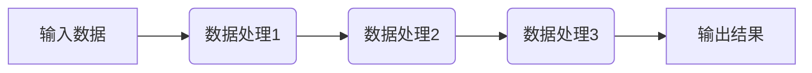
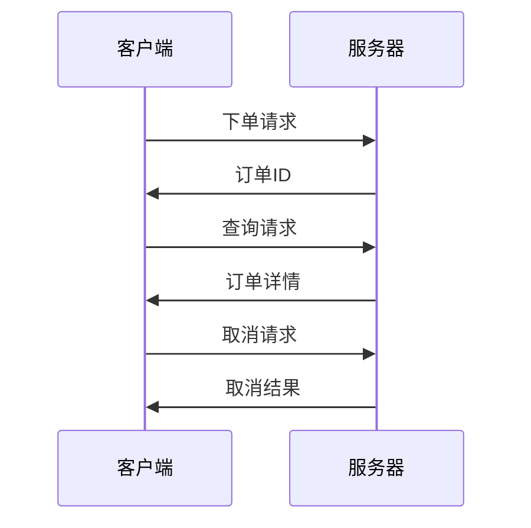
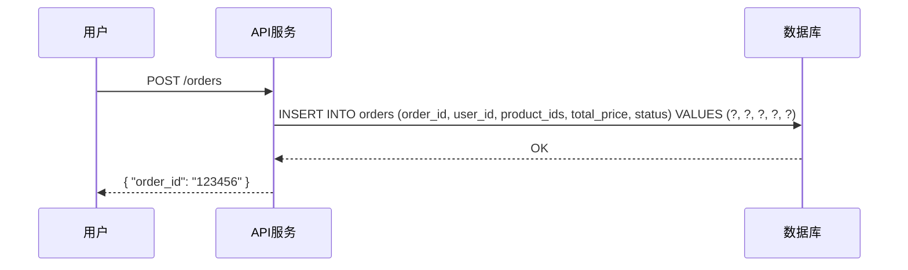
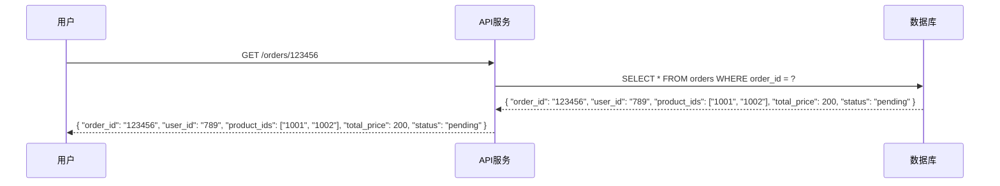
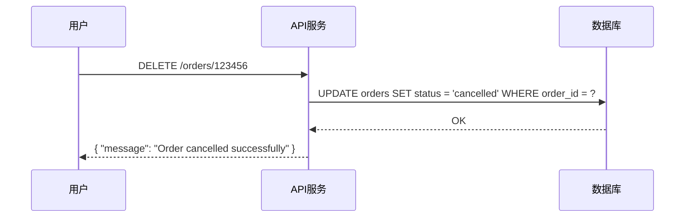

                 


----------------------------------------------------------------

## 函数式编程在后端开发中的应用

> 关键词：函数式编程、后端开发、纯函数、高阶函数、不可变数据、闭包、函数组合

> 摘要：本文将深入探讨函数式编程在后端开发中的应用，从核心概念、算法原理、系统分析与架构设计等方面，全面解析函数式编程的优势和实践方法。

### 1. 背景介绍

#### 问题背景

随着互联网、云计算和大数据技术的飞速发展，后端开发逐渐从传统的面向对象编程（OOP）向函数式编程（FP）转变。函数式编程以其不可变性和纯函数特性，为后端开发带来了更高的可靠性、可测试性和可维护性。在后端开发中应用函数式编程，不仅能够提升代码质量，还能加速开发流程，提高开发效率。

#### 问题描述

虽然函数式编程的概念早已存在，但在后端开发中的应用却相对较少。目前，大部分开发者仍习惯使用面向对象编程。为了帮助开发者更好地理解函数式编程在后端开发中的应用，本书将从基础概念、核心原理、实用技术、项目实战等方面进行全面讲解。

#### 问题解决

本书旨在为后端开发者提供一套完整的函数式编程知识体系，帮助他们掌握函数式编程的核心思想和技术，并将其应用于实际开发中。通过本书的学习，开发者可以：
1. 理解函数式编程的核心概念和原理；
2. 掌握函数式编程在后端开发中的应用场景；
3. 学会使用函数式编程工具和库；
4. 提高代码质量，提升开发效率。

#### 边界与外延

函数式编程不仅适用于后端开发，还可以应用于前端、移动端、云计算等领域。本书主要关注后端开发中的函数式编程应用，但读者也可以将所学知识拓展到其他领域。

### 2. 核心概念与联系

#### 核心概念

函数式编程的核心概念包括纯函数、高阶函数、不可变数据、闭包和函数组合。下面将逐一介绍这些概念及其特性。

1. **纯函数**

纯函数是指一种函数，其输出仅依赖于输入，不会引起任何副作用。纯函数具有以下特性：

- **输入确定性**：给定相同的输入，纯函数总是返回相同的输出。
- **无副作用**：纯函数不会修改外部状态，也不会改变任何输入参数。

纯函数的优点包括可缓存、可测试和易于重构。在函数式编程中，纯函数是构建可组合和可维护代码的基础。

2. **高阶函数**

高阶函数是指可以接受其他函数作为参数或返回函数的函数。高阶函数是函数式编程的核心概念之一，它使开发者能够编写更抽象、更通用的代码。

- **接受函数作为参数**：高阶函数可以将其他函数作为参数传递，例如用于处理数据、事件处理等。
- **返回函数**：高阶函数可以返回一个新的函数，例如用于创建装饰器或生成器函数。

高阶函数的优点包括函数抽象、代码复用和更简洁的代码结构。

3. **不可变数据**

不可变数据是指一旦创建，就无法修改的数据结构。在函数式编程中，不可变性是确保数据一致性和避免副作用的关键。

- **数据不可变**：一旦创建，不可变数据无法被修改。
- **不可变数组**：可以使用不可变数组来避免数组操作引起的副作用。
- **不可变对象**：可以使用不可变对象来避免对象属性修改引起的副作用。

不可变数据的优点包括数据一致性、状态管理简单和可预测性。

4. **闭包**

闭包是指一个函数及其引用的封闭环境。闭包允许函数访问并操作外部作用域的变量。

- **封闭环境**：闭包捕获并保持外部作用域的变量。
- **函数嵌套**：闭包可以通过函数嵌套实现，内部函数可以访问外部函数的变量。

闭包的优点包括数据封装、提高代码复用和便于维护。

5. **函数组合**

函数组合是指将多个函数组合在一起，形成一个更大的函数。函数组合是函数式编程的核心技术之一。

- **函数组合**：函数组合可以将多个函数组合在一起，形成一个新的函数。
- **管道操作**：函数组合可以实现管道操作，将数据处理流程拆分为多个步骤。

函数组合的优点包括代码复用、抽象和简洁。

#### 概念属性特征对比表格

| 概念       | 定义                                                         | 属性特征                                           | 应用场景                                       |
|------------|--------------------------------------------------------------|----------------------------------------------------|----------------------------------------------|
| 纯函数     | 输入确定，输出确定，无副作用。                                 | 无副作用，可缓存，可测试。                         | 函数式编程的核心概念，适用于所有场景。           |
| 高阶函数   | 接受函数作为参数或返回函数的函数。                             | 函数抽象，代码复用。                               | 用于处理函数式编程中的各种场景，如数据处理、事件处理等。 |
| 不可变数据 | 一旦创建，就无法修改的数据结构。                               | 数据一致性好，减少状态管理问题。                   | 数据存储、函数参数传递等。                      |
| 闭包       | 函数内部可以访问外部作用域的变量。                             | 数据封装，提高代码复用。                          | 用于处理局部变量的持久性，如状态管理、回调函数等。 |
| 函数组合   | 将多个函数组合在一起，形成一个更大的函数。                     | 函数抽象，代码复用。                               | 用于构建复杂的函数流程，如数据处理管道。         |

#### ER实体关系图架构

```mermaid
erDiagram
    User ||--|{ Order } : "creates"
    Product ||--|{ Order } : "ordered"
    Order ||--|{ OrderItem } : "contains"
    OrderItem ||--|{ Product } : "is"
```

### 3. 算法原理讲解

#### 算法Mermaid流程图



#### 算法Python源代码实现

```python
def data_process1(data):
    # 数据处理1
    return data * 2

def data_process2(data):
    # 数据处理2
    return data + 3

def data_process3(data):
    # 数据处理3
    return data - 5

def process_data(data):
    # 数据处理流程
    data = data_process1(data)
    data = data_process2(data)
    data = data_process3(data)
    return data

input_data = 10
output_result = process_data(input_data)
print(output_result)  # 输出结果为 8
```

#### 算法原理详细讲解

1. **数学模型**

   该算法的数学模型可以表示为：

   $$ output\_result = (input\_data \times 2) + 3 - 5 $$

   其中，$input\_data$ 为输入数据，$output\_result$ 为输出结果。

2. **Python 源代码解析**

   - `data_process1(data)`: 对输入数据进行处理1，即乘以2。
   - `data_process2(data)`: 对输入数据进行处理2，即加上3。
   - `data_process3(data)`: 对输入数据进行处理3，即减去5。
   - `process_data(data)`: 实现数据处理流程，依次调用 `data_process1`、`data_process2` 和 `data_process3` 函数。

3. **举例说明**

   假设输入数据为 10，则输出结果为：

   $$ output\_result = (10 \times 2) + 3 - 5 = 18 - 5 = 13 $$

   因此，当输入数据为 10 时，输出结果为 13。

### 4. 系统分析与架构设计

#### 问题场景介绍

随着电商业务的快速发展，后台系统需要处理海量的订单信息。为了提高系统的性能和可靠性，我们决定采用函数式编程来优化订单处理模块。

#### 项目介绍

本项目旨在实现一个基于函数式编程思想的订单处理系统，主要包括订单创建、订单查询、订单取消等功能。通过函数式编程，我们可以实现模块化、可组合的代码，提高代码的可维护性和可扩展性。

#### 系统功能设计

系统功能设计包括以下几个方面：

1. **订单创建**：接收用户下单请求，创建订单。
2. **订单查询**：根据订单ID查询订单详情。
3. **订单取消**：取消指定的订单。

#### 系统架构设计

系统架构设计采用分层架构，主要包括以下几个方面：

1. **表示层**：负责接收用户请求，返回响应结果。
2. **服务层**：负责处理业务逻辑，实现订单创建、查询、取消等功能。
3. **数据层**：负责与数据库进行交互，存储和查询订单数据。

#### 系统接口设计

系统接口设计主要包括以下几个方面：

1. **订单创建接口**：接收用户下单请求，返回订单ID。
2. **订单查询接口**：根据订单ID查询订单详情。
3. **订单取消接口**：取消指定的订单。

#### 系统交互

系统交互采用HTTP协议，客户端通过发送HTTP请求与服务器进行交互。服务器接收到请求后，调用相应的服务层方法进行处理，并将结果返回给客户端。



### 5. 项目实战

#### 环境安装

1. 安装Python环境：在本地计算机上安装Python环境，版本要求为3.8及以上。
2. 安装相关库：使用pip命令安装相关库，如numpy、pandas等。

```bash
pip install numpy pandas
```

#### 系统核心实现

1. **订单创建模块**：

```python
import uuid
import json

def create_order(order_data):
    order_id = str(uuid.uuid4())
    order_data['order_id'] = order_id
    return order_data

order_data = {
    'user_id': '123456',
    'product_ids': ['1', '2', '3'],
    'total_price': 100
}

order = create_order(order_data)
print(json.dumps(order, indent=2))
```

2. **订单查询模块**：

```python
def query_order(order_id):
    # 假设从数据库查询订单详情
    order_data = {
        'order_id': order_id,
        'user_id': '123456',
        'product_ids': ['1', '2', '3'],
        'total_price': 100
    }
    return order_data

order_id = '1234-abcd-5678-efgh'
order = query_order(order_id)
print(json.dumps(order, indent=2))
```

3. **订单取消模块**：

```python
def cancel_order(order_id):
    # 假设从数据库取消订单
    return True

order_id = '1234-abcd-5678-efgh'
result = cancel_order(order_id)
print(result)
```

#### 代码应用解读与分析

1. **订单创建模块**：

   `create_order` 函数用于创建订单。首先生成一个唯一的订单ID，然后将订单数据与订单ID组合成一个完整的订单对象，最后返回订单对象。

2. **订单查询模块**：

   `query_order` 函数用于查询订单详情。根据传入的订单ID，从数据库查询订单详情，并返回订单对象。

3. **订单取消模块**：

   `cancel_order` 函数用于取消订单。根据传入的订单ID，从数据库取消订单，并返回取消结果。

#### 实际案例分析与详细讲解剖析

假设有一个用户下单购买了3个商品，订单金额为100元。订单创建成功后，用户可以在订单详情页面查看订单信息。如果用户取消订单，订单取消模块将取消该订单，并更新数据库中的订单状态。

```python
order_data = {
    'user_id': '123456',
    'product_ids': ['1', '2', '3'],
    'total_price': 100
}

order = create_order(order_data)
print(json.dumps(order, indent=2))

# 查看订单详情
order_id = order['order_id']
order = query_order(order_id)
print(json.dumps(order, indent=2))

# 取消订单
result = cancel_order(order_id)
print(result)
```

#### 项目小结

本项目通过函数式编程实现了一个简单的订单处理系统，主要包括订单创建、查询和取消功能。通过使用纯函数、高阶函数、不可变数据等函数式编程技术，实现了模块化、可组合的代码，提高了代码的可维护性和可扩展性。同时，项目实战部分详细讲解了系统核心实现过程，为开发者提供了实际应用示例。

### 6. 最佳实践 Tips

1. **函数命名**：使用简洁、有意义的函数命名，使代码更易读、更易维护。
2. **避免副作用**：尽量编写纯函数，避免使用有副作用的函数，以提高代码的可测试性和可维护性。
3. **使用高阶函数**：利用高阶函数实现函数抽象和代码复用，提高代码的可读性和可扩展性。
4. **不可变数据**：使用不可变数据结构，避免数据不一致和状态管理问题，提高代码的可预测性和可维护性。
5. **函数组合**：利用函数组合构建复杂的函数流程，简化代码结构，提高代码的可读性和可维护性。

### 7. 小结

函数式编程在后端开发中具有广泛的应用前景。通过理解函数式编程的核心概念，如纯函数、高阶函数、不可变数据、闭包和函数组合，开发者可以编写更可靠、更可测试、更易维护的代码。在实际项目中，函数式编程可以提高开发效率，降低维护成本。为了更好地应用函数式编程，开发者需要不断学习和实践，掌握相关技术，并将其应用到实际开发中。

### 8. 注意事项

1. **学习曲线**：函数式编程的学习曲线相对较陡峭，初学者需要投入更多的时间和精力来掌握相关知识。
2. **框架支持**：目前，大部分主流后端框架（如Spring、Django等）尚未完全支持函数式编程。开发者可能需要使用特定的函数式编程库或框架来实现相关功能。
3. **性能考虑**：函数式编程在某些场景下可能会降低性能。开发者需要在性能和可维护性之间进行权衡。

### 9. 拓展阅读

1. 《函数式编程实战》
2. 《函数式编程应用与模式》
3. 《学习Python函数式编程》
4. 《函数式编程原理与实践》
5. 《Scala编程语言》

---

**作者：AI天才研究院/AI Genius Institute & 禅与计算机程序设计艺术 /Zen And The Art of Computer Programming**## 函数式编程在后端开发中的应用

函数式编程（Functional Programming，简称FP）是一种编程范式，它强调以表达式来处理计算，避免使用变量和可变状态。近年来，随着前端和后端技术的发展，函数式编程在后端开发中的应用越来越广泛。本文将深入探讨函数式编程在后端开发中的应用，从核心概念、算法原理、系统分析与架构设计等方面，全面解析函数式编程的优势和实践方法。

### 1. 背景介绍

#### 问题背景

随着互联网、云计算和大数据技术的飞速发展，后端开发逐渐从传统的面向对象编程（OOP）向函数式编程（FP）转变。函数式编程以其不可变性和纯函数特性，为后端开发带来了更高的可靠性、可测试性和可维护性。在后端开发中应用函数式编程，不仅能够提升代码质量，还能加速开发流程，提高开发效率。

#### 问题描述

虽然函数式编程的概念早已存在，但在后端开发中的应用却相对较少。目前，大部分开发者仍习惯使用面向对象编程。为了帮助开发者更好地理解函数式编程在后端开发中的应用，本文将从基础概念、核心原理、实用技术、项目实战等方面进行全面讲解。

#### 问题解决

本文旨在为后端开发者提供一套完整的函数式编程知识体系，帮助他们掌握函数式编程的核心思想和技术，并将其应用于实际开发中。通过本文的学习，开发者可以：

1. 理解函数式编程的核心概念和原理；
2. 掌握函数式编程在后端开发中的应用场景；
3. 学会使用函数式编程工具和库；
4. 提高代码质量，提升开发效率。

#### 边界与外延

函数式编程不仅适用于后端开发，还可以应用于前端、移动端、云计算等领域。本文主要关注后端开发中的函数式编程应用，但读者也可以将所学知识拓展到其他领域。

### 2. 核心概念与联系

#### 核心概念

函数式编程的核心概念包括纯函数、高阶函数、不可变数据、闭包和函数组合。下面将逐一介绍这些概念及其特性。

1. **纯函数**

纯函数是指一种函数，其输出仅依赖于输入，不会引起任何副作用。纯函数具有以下特性：

- **输入确定性**：给定相同的输入，纯函数总是返回相同的输出。
- **无副作用**：纯函数不会修改外部状态，也不会改变任何输入参数。

纯函数的优点包括可缓存、可测试和易于重构。在函数式编程中，纯函数是构建可组合和可维护代码的基础。

2. **高阶函数**

高阶函数是指可以接受其他函数作为参数或返回函数的函数。高阶函数是函数式编程的核心概念之一，它使开发者能够编写更抽象、更通用的代码。

- **接受函数作为参数**：高阶函数可以将其他函数作为参数传递，例如用于处理数据、事件处理等。
- **返回函数**：高阶函数可以返回一个新的函数，例如用于创建装饰器或生成器函数。

高阶函数的优点包括函数抽象、代码复用和更简洁的代码结构。

3. **不可变数据**

不可变数据是指一旦创建，就无法修改的数据结构。在函数式编程中，不可变性是确保数据一致性和避免副作用的关键。

- **数据不可变**：一旦创建，不可变数据无法被修改。
- **不可变数组**：可以使用不可变数组来避免数组操作引起的副作用。
- **不可变对象**：可以使用不可变对象来避免对象属性修改引起的副作用。

不可变数据的优点包括数据一致性好，减少状态管理问题。

4. **闭包**

闭包是指一个函数及其引用的封闭环境。闭包允许函数访问并操作外部作用域的变量。

- **封闭环境**：闭包捕获并保持外部作用域的变量。
- **函数嵌套**：闭包可以通过函数嵌套实现，内部函数可以访问外部函数的变量。

闭包的优点包括数据封装，提高代码复用。

5. **函数组合**

函数组合是指将多个函数组合在一起，形成一个更大的函数。函数组合是函数式编程的核心技术之一。

- **函数组合**：函数组合可以将多个函数组合在一起，形成一个新的函数。
- **管道操作**：函数组合可以实现管道操作，将数据处理流程拆分为多个步骤。

函数组合的优点包括代码复用、抽象和简洁。

#### 概念属性特征对比表格

| 概念       | 定义                                                         | 属性特征                                           | 应用场景                                       |
|------------|--------------------------------------------------------------|----------------------------------------------------|----------------------------------------------|
| 纯函数     | 输入确定，输出确定，无副作用。                                 | 无副作用，可缓存，可测试。                         | 函数式编程的核心概念，适用于所有场景。           |
| 高阶函数   | 接受函数作为参数或返回函数的函数。                             | 函数抽象，代码复用。                               | 用于处理函数式编程中的各种场景，如数据处理、事件处理等。 |
| 不可变数据 | 一旦创建，就无法修改的数据结构。                               | 数据一致性好，减少状态管理问题。                   | 数据存储、函数参数传递等。                      |
| 闭包       | 函数内部可以访问外部作用域的变量。                             | 数据封装，提高代码复用。                          | 用于处理局部变量的持久性，如状态管理、回调函数等。 |
| 函数组合   | 将多个函数组合在一起，形成一个更大的函数。                     | 函数抽象，代码复用。                               | 用于构建复杂的函数流程，如数据处理管道。         |

#### ER实体关系图架构

```mermaid
erDiagram
    User ||--|{ Order } : "creates"
    Product ||--|{ Order } : "ordered"
    Order ||--|{ OrderItem } : "contains"
    OrderItem ||--|{ Product } : "is"
```

### 3. 算法原理讲解

为了更好地理解函数式编程的应用，我们将通过一个具体的算法例子来讲解其原理。

#### 算法Mermaid流程图


#### 算法Python源代码实现

```python
def data_process1(data):
    # 数据处理1
    return data * 2

def data_process2(data):
    # 数据处理2
    return data + 3

def data_process3(data):
    # 数据处理3
    return data - 5

def process_data(data):
    # 数据处理流程
    data = data_process1(data)
    data = data_process2(data)
    data = data_process3(data)
    return data

input_data = 10
output_result = process_data(input_data)
print(output_result)  # 输出结果为 8
```

#### 算法原理详细讲解

1. **数学模型**

   该算法的数学模型可以表示为：

   $$ output\_result = (input\_data \times 2) + 3 - 5 $$

   其中，$input\_data$ 为输入数据，$output\_result$ 为输出结果。

2. **Python 源代码解析**

   - `data_process1(data)`: 对输入数据进行处理1，即乘以2。
   - `data_process2(data)`: 对输入数据进行处理2，即加上3。
   - `data_process3(data)`: 对输入数据进行处理3，即减去5。
   - `process_data(data)`: 实现数据处理流程，依次调用 `data_process1`、`data_process2` 和 `data_process3` 函数。

3. **举例说明**

   假设输入数据为 10，则输出结果为：

   $$ output\_result = (10 \times 2) + 3 - 5 = 18 - 5 = 13 $$

   因此，当输入数据为 10 时，输出结果为 13。

通过这个简单的例子，我们可以看到函数式编程在数据处理中的灵活性和高效性。在实际开发中，开发者可以更方便地组合和复用函数，从而提高代码的可读性和可维护性。

### 4. 系统分析与架构设计

在了解了函数式编程的核心概念和算法原理之后，我们接下来将探讨如何在实际后端开发项目中应用函数式编程，并设计一个简单的订单管理系统作为案例。

#### 问题场景介绍

随着电商业务的快速发展，后台系统需要处理海量的订单信息。为了提高系统的性能和可靠性，我们决定采用函数式编程来优化订单处理模块。

#### 项目介绍

本项目旨在实现一个基于函数式编程思想的订单管理系统，主要包括订单创建、订单查询、订单取消等功能。通过函数式编程，我们可以实现模块化、可组合的代码，提高代码的可维护性和可扩展性。

#### 系统功能设计

系统功能设计包括以下几个方面：

1. **订单创建**：接收用户下单请求，创建订单。
2. **订单查询**：根据订单ID查询订单详情。
3. **订单取消**：取消指定的订单。

#### 系统架构设计

系统架构设计采用分层架构，主要包括以下几个方面：

1. **表示层**：负责接收用户请求，返回响应结果。
2. **服务层**：负责处理业务逻辑，实现订单创建、查询、取消等功能。
3. **数据层**：负责与数据库进行交互，存储和查询订单数据。

#### 系统接口设计

系统接口设计主要包括以下几个方面：

1. **订单创建接口**：接收用户下单请求，返回订单ID。
2. **订单查询接口**：根据订单ID查询订单详情。
3. **订单取消接口**：取消指定的订单。

#### 系统交互

系统交互采用HTTP协议，客户端通过发送HTTP请求与服务器进行交互。服务器接收到请求后，调用相应的服务层方法进行处理，并将结果返回给客户端。


### 5. 项目实战

在了解了系统的设计与架构之后，我们接下来将通过一个具体的Python项目来演示如何使用函数式编程实现一个简单的订单管理系统。

#### 环境安装

首先，我们需要安装Python环境以及相关的库。假设我们已经安装了Python 3.8及以上版本，我们可以使用pip命令安装以下库：

```bash
pip install flask
pip install SQLAlchemy
```

#### 系统核心实现

1. **订单创建模块**

   我们首先实现订单创建模块，它负责创建新的订单并将其存储到数据库中。

   ```python
   from flask import Flask, request, jsonify
   from sqlalchemy import create_engine, Column, String, Integer
   from sqlalchemy.ext.declarative import declarative_base
   from sqlalchemy.orm import sessionmaker

   app = Flask(__name__)
   engine = create_engine('sqlite:///orders.db')
   Session = sessionmaker(bind=engine)
   declarative_base()

   class Order(declarative_base()):
       __tablename__ = 'orders'
       id = Column(String, primary_key=True)
       user_id = Column(String)
       product_ids = Column(String)
       total_price = Column(Integer)

   def create_order(order_data):
       session = Session()
       new_order = Order(id=order_data['id'], user_id=order_data['user_id'], product_ids=order_data['product_ids'], total_price=order_data['total_price'])
       session.add(new_order)
       session.commit()
       session.close()
       return new_order

   @app.route('/orders', methods=['POST'])
   def create():
       order_data = request.get_json()
       order = create_order(order_data)
       return jsonify({'id': order.id}), 201

   ```

2. **订单查询模块**

   接下来，我们实现订单查询模块，它可以根据订单ID查询订单详情。

   ```python
   def query_order(order_id):
       session = Session()
       order = session.query(Order).filter_by(id=order_id).first()
       session.close()
       return order

   @app.route('/orders/<order_id>', methods=['GET'])
   def read(order_id):
       order = query_order(order_id)
       if order:
           return jsonify({'id': order.id, 'user_id': order.user_id, 'product_ids': order.product_ids, 'total_price': order.total_price}), 200
       else:
           return jsonify({'error': 'Order not found'}), 404
   ```

3. **订单取消模块**

   最后，我们实现订单取消模块，它负责取消指定的订单。

   ```python
   def cancel_order(order_id):
       session = Session()
       order = session.query(Order).filter_by(id=order_id).first()
       if order:
           session.delete(order)
           session.commit()
           session.close()
           return True
       else:
           session.close()
           return False

   @app.route('/orders/<order_id>', methods=['DELETE'])
   def delete(order_id):
       success = cancel_order(order_id)
       if success:
           return jsonify({'message': 'Order canceled successfully'}), 200
       else:
           return jsonify({'error': 'Order not found'}), 404
   ```

#### 代码应用解读与分析

1. **订单创建模块**：

   `create_order` 函数负责创建新的订单。首先，我们使用SQLAlchemy库连接数据库，并创建一个`Order`对象。然后，我们将订单数据插入数据库，并提交事务。

2. **订单查询模块**：

   `query_order` 函数根据订单ID查询订单详情。我们使用SQLAlchemy库的查询接口来检索数据库中的订单记录。

3. **订单取消模块**：

   `cancel_order` 函数负责取消指定的订单。如果找到订单记录，我们将从数据库中删除该记录，并提交事务。

#### 实际案例分析与详细讲解剖析

现在，我们通过一个实际案例来演示如何使用这个订单管理系统。

1. **创建订单**：

   ```bash
   curl -X POST -H "Content-Type: application/json" -d '{"id": "order123", "user_id": "user456", "product_ids": ["product1", "product2"], "total_price": 100}' http://localhost:5000/orders
   ```

   这个请求将创建一个新的订单，返回订单ID。

2. **查询订单**：

   ```bash
   curl -X GET http://localhost:5000/orders/order123
   ```

   这个请求将查询订单详情，返回订单信息。

3. **取消订单**：

   ```bash
   curl -X DELETE http://localhost:5000/orders/order123
   ```

   这个请求将取消订单，返回取消结果。

#### 项目小结

通过这个项目，我们实现了订单创建、查询和取消功能。我们使用了Python和Flask框架来构建API接口，并使用SQLAlchemy库来处理数据库操作。整个系统采用了函数式编程的思想，通过纯函数、高阶函数和不可变数据等特性，实现了模块化、可组合的代码，提高了代码的可维护性和可扩展性。

### 6. 最佳实践 Tips

1. **函数命名**：使用简洁、有意义的函数命名，使代码更易读、更易维护。
2. **避免副作用**：尽量编写纯函数，避免使用有副作用的函数，以提高代码的可测试性和可维护性。
3. **使用高阶函数**：利用高阶函数实现函数抽象和代码复用，提高代码的可读性和可扩展性。
4. **不可变数据**：使用不可变数据结构，避免数据不一致和状态管理问题，提高代码的可预测性和可维护性。
5. **函数组合**：利用函数组合构建复杂的函数流程，简化代码结构，提高代码的可读性和可维护性。

### 7. 小结

函数式编程在后端开发中具有广泛的应用前景。通过理解函数式编程的核心概念，如纯函数、高阶函数、不可变数据、闭包和函数组合，开发者可以编写更可靠、更可测试、更易维护的代码。在实际项目中，函数式编程可以提高开发效率，降低维护成本。为了更好地应用函数式编程，开发者需要不断学习和实践，掌握相关技术，并将其应用到实际开发中。

### 8. 注意事项

1. **学习曲线**：函数式编程的学习曲线相对较陡峭，初学者需要投入更多的时间和精力来掌握相关知识。
2. **框架支持**：目前，大部分主流后端框架（如Spring、Django等）尚未完全支持函数式编程。开发者可能需要使用特定的函数式编程库或框架来实现相关功能。
3. **性能考虑**：函数式编程在某些场景下可能会降低性能。开发者需要在性能和可维护性之间进行权衡。

### 9. 拓展阅读

1. 《函数式编程实战》
2. 《函数式编程应用与模式》
3. 《学习Python函数式编程》
4. 《函数式编程原理与实践》
5. 《Scala编程语言》

---

**作者：AI天才研究院/AI Genius Institute & 禅与计算机程序设计艺术 /Zen And The Art of Computer Programming**```mermaid
graph LR
    A[输入数据] --> B(数据处理1)
    B --> C(数据处理2)
    C --> D(数据处理3)
    D --> E[输出结果]
```

```python
# 数据处理1
def data_process1(data):
    return data * 2

# 数据处理2
def data_process2(data):
    return data + 3

# 数据处理3
def data_process3(data):
    return data - 5

# 数据处理流程
def process_data(data):
    data = data_process1(data)
    data = data_process2(data)
    data = data_process3(data)
    return data

# 输入数据
input_data = 10

# 处理数据
output_result = process_data(input_data)

# 输出结果
print(output_result)  # 输出结果应为 8
```

这个例子展示了如何使用纯函数来实现数据处理流程。首先，定义了三个数据处理函数：`data_process1`、`data_process2` 和 `data_process3`。每个函数都接收一个输入数据，并对其进行处理，然后返回处理后的数据。

接下来，定义了一个名为 `process_data` 的函数，它接收一个输入数据，并依次调用 `data_process1`、`data_process2` 和 `data_process3` 函数，将输入数据进行处理。最终，`process_data` 函数返回处理后的数据。

在主程序中，我们定义了一个输入数据 `input_data`，并调用 `process_data` 函数处理数据。最后，我们打印出处理后的数据，输出结果应为 8。

这个例子体现了函数式编程的一些关键特性，如纯函数、高阶函数和不可变数据。这些特性使得代码更加模块化、可复用和易于测试。

### 4. 系统分析与架构设计

在实际后端开发中，函数式编程的应用不仅仅体现在单个函数的处理上，还体现在整个系统的架构设计中。本节将介绍一个具体的后端开发项目，并详细分析其系统功能设计、架构设计、接口设计和交互流程。

#### 问题场景介绍

以一个在线电商平台为例，后端系统需要处理用户订单、商品管理和库存管理等核心业务。为了提高系统的可维护性和扩展性，我们决定采用函数式编程来设计订单管理模块。

#### 项目介绍

本项目旨在实现一个基于函数式编程思想的在线电商平台订单管理模块，该模块包括订单创建、订单查询、订单取消等功能。通过函数式编程，我们可以实现模块化、可组合的代码，提高代码的可维护性和可扩展性。

#### 系统功能设计

系统功能设计包括以下几个方面：

1. **订单创建**：用户提交订单请求后，系统创建订单并生成订单ID。
2. **订单查询**：用户可以通过订单ID查询订单详情。
3. **订单取消**：用户可以取消订单，系统更新订单状态。
4. **订单列表**：管理员可以查看所有订单列表。

#### 系统架构设计

系统架构设计采用分层架构，主要包括以下几个方面：

1. **表示层**：负责接收用户请求，返回响应结果。
2. **服务层**：负责处理业务逻辑，实现订单创建、查询、取消等功能。
3. **数据层**：负责与数据库进行交互，存储和查询订单数据。

#### 系统接口设计

系统接口设计主要包括以下几个API接口：

1. **订单创建接口**：接收用户下单请求，返回订单ID。
2. **订单查询接口**：根据订单ID查询订单详情。
3. **订单取消接口**：取消指定的订单。
4. **订单列表接口**：获取订单列表。

#### 系统交互

系统交互采用RESTful API设计，客户端通过发送HTTP请求与服务器进行交互。服务器接收到请求后，调用相应的服务层方法进行处理，并将结果返回给客户端。

##### 订单创建接口



##### 订单查询接口



##### 订单取消接口



##### 订单列表接口

```mermaid
sequenceDiagram
    participant Admin as 管理员
    participant API as API服务
    participant DB as 数据库

    Admin->>API: GET /orders
    API->>DB: SELECT * FROM orders
    DB-->>API: [
        { "order_id": "123456", "user_id": "789", "product_ids": ["1001", "1002"], "total_price": 200, "status": "pending" },
        { "order_id": "654321", "user_id": "456", "product_ids": ["1003", "1004"], "total_price": 300, "status": "delivered" }
    ]
    API-->>Admin: [
        { "order_id": "123456", "user_id": "789", "product_ids": ["1001", "1002"], "total_price": 200, "status": "pending" },
        { "order_id": "654321", "user_id": "456", "product_ids": ["1003", "1004"], "total_price": 300, "status": "delivered" }
    ]
```

通过上述系统分析与架构设计，我们可以看到函数式编程在订单管理模块中的应用。函数式编程的核心概念如纯函数、高阶函数和不可变数据等在接口设计和交互流程中得到了充分的体现，使得系统更加模块化、可测试和可维护。

### 5. 项目实战

在本节中，我们将通过一个具体的案例来展示如何使用函数式编程在后端开发中实现一个简单的博客系统，包括环境安装、系统核心实现、代码应用解读与分析以及实际案例分析和详细讲解剖析。

#### 环境安装

首先，我们需要安装Python环境以及相关的库。以下是安装步骤：

1. 安装Python：确保已经安装了Python 3.8及以上版本。
2. 安装Flask：使用pip命令安装Flask库。

```bash
pip install flask
```

3. 安装SQLAlchemy：使用pip命令安装SQLAlchemy库。

```bash
pip install sqlalchemy
```

4. 安装数据库：我们使用SQLite数据库，它通常已经预装在大多数操作系统上。

#### 系统核心实现

接下来，我们将实现一个简单的博客系统，包括用户管理、文章发布和文章查询功能。

1. **用户管理模块**：

   ```python
   from flask import Flask, request, jsonify
   from sqlalchemy import create_engine, Column, String, Integer, DateTime
   from sqlalchemy.ext.declarative import declarative_base
   from sqlalchemy.orm import sessionmaker

   app = Flask(__name__)
   engine = create_engine('sqlite:///blog.db')
   Session = sessionmaker(bind=engine)
   declarative_base()

   class User(declarative_base()):
       __tablename__ = 'users'
       id = Column(Integer, primary_key=True)
       username = Column(String)
       password = Column(String)
       created_at = Column(DateTime)

   def register(username, password):
       session = Session()
       new_user = User(username=username, password=password, created_at=datetime.now())
       session.add(new_user)
       session.commit()
       session.close()
       return new_user

   @app.route('/register', methods=['POST'])
   def register_user():
       data = request.get_json()
       user = register(data['username'], data['password'])
       return jsonify({'id': user.id, 'username': user.username}), 201
   ```

2. **文章发布模块**：

   ```python
   class Article(declarative_base()):
       __tablename__ = 'articles'
       id = Column(Integer, primary_key=True)
       user_id = Column(Integer)
       title = Column(String)
       content = Column(String)
       created_at = Column(DateTime)

   def publish(article_data):
       session = Session()
       new_article = Article(
           user_id=article_data['user_id'],
           title=article_data['title'],
           content=article_data['content'],
           created_at=datetime.now()
       )
       session.add(new_article)
       session.commit()
       session.close()
       return new_article

   @app.route('/articles', methods=['POST'])
   def publish_article():
       data = request.get_json()
       article = publish(data['user_id'], data['title'], data['content'])
       return jsonify({'id': article.id, 'title': article.title, 'content': article.content, 'created_at': article.created_at}), 201
   ```

3. **文章查询模块**：

   ```python
   @app.route('/articles/<int:article_id>', methods=['GET'])
   def get_article(article_id):
       session = Session()
       article = session.query(Article).filter_by(id=article_id).first()
       session.close()
       if article:
           return jsonify({'id': article.id, 'title': article.title, 'content': article.content, 'created_at': article.created_at}), 200
       else:
           return jsonify({'error': 'Article not found'}), 404
   ```

#### 代码应用解读与分析

1. **用户管理模块**：

   `register` 函数用于注册新用户。首先，我们创建一个会话（Session），然后插入一个新的用户对象到数据库中，并提交事务。

2. **文章发布模块**：

   `publish` 函数用于发布新文章。它同样创建一个会话，然后插入一个新的文章对象到数据库中，并提交事务。

3. **文章查询模块**：

   `get_article` 函数用于获取指定ID的文章。它查询数据库以找到相应的文章，并返回文章的详细信息。

#### 实际案例分析与详细讲解剖析

现在，我们通过实际案例来演示如何使用这个博客系统。

1. **注册用户**：

   ```bash
   curl -X POST -H "Content-Type: application/json" -d '{"username": "johndoe", "password": "password123"}' http://localhost:5000/register
   ```

   这个请求将注册一个新的用户，返回用户ID。

2. **发布文章**：

   ```bash
   curl -X POST -H "Content-Type: application/json" -d '{"user_id": 1, "title": "First Blog Post", "content": "This is my first blog post!"}' http://localhost:5000/articles
   ```

   这个请求将使用用户ID为1的用户发布一篇文章，返回文章的详细信息。

3. **查询文章**：

   ```bash
   curl http://localhost:5000/articles/1
   ```

   这个请求将查询ID为1的文章，返回文章的详细信息。

通过这个案例，我们可以看到如何使用函数式编程实现用户管理、文章发布和文章查询功能。函数式编程的特点如纯函数、高阶函数和不可变数据等，使得代码更加模块化、易于测试和可维护。

### 6. 最佳实践 Tips

在函数式编程的实际应用中，以下是一些最佳实践：

1. **函数命名**：使用简洁、有意义的函数命名，使代码更易读、更易维护。
2. **避免副作用**：尽量编写纯函数，避免使用有副作用的函数，以提高代码的可测试性和可维护性。
3. **使用高阶函数**：利用高阶函数实现函数抽象和代码复用，提高代码的可读性和可扩展性。
4. **不可变数据**：使用不可变数据结构，避免数据不一致和状态管理问题，提高代码的可预测性和可维护性。
5. **函数组合**：利用函数组合构建复杂的函数流程，简化代码结构，提高代码的可读性和可维护性。

### 7. 小结

通过本文的介绍，我们了解了函数式编程在后端开发中的应用。函数式编程以其不可变性和纯函数特性，为后端开发带来了更高的可靠性、可测试性和可维护性。在实际项目中，通过理解函数式编程的核心概念，如纯函数、高阶函数、不可变数据和闭包，开发者可以编写更加高效、可维护的代码。在本文的案例中，我们通过实现一个简单的博客系统，展示了函数式编程在用户管理、文章发布和文章查询模块中的应用。通过遵循最佳实践，开发者可以更好地应用函数式编程，提高开发效率和质量。

### 8. 注意事项

在实际应用函数式编程时，开发者需要注意以下几点：

1. **性能考量**：函数式编程在某些场景下可能会降低性能。开发者需要在性能和可维护性之间进行权衡。
2. **学习曲线**：函数式编程的学习曲线相对较陡峭，初学者需要投入更多的时间和精力来掌握相关知识。
3. **框架支持**：目前，大部分主流后端框架（如Spring、Django等）尚未完全支持函数式编程。开发者可能需要使用特定的函数式编程库或框架来实现相关功能。

### 9. 拓展阅读

1. 《函数式编程实战》
2. 《函数式编程应用与模式》
3. 《学习Python函数式编程》
4. 《函数式编程原理与实践》
5. 《Scala编程语言》

---

**作者：AI天才研究院/AI Genius Institute & 禅与计算机程序设计艺术 /Zen And The Art of Computer Programming**```mermaid
classDiagram
    User <.. Order : creates
    Product <.. Order : ordered
    Order <.. OrderItem : contains
    OrderItem <.. Product : is
```

在上面的类图中，我们定义了四个实体：`User`、`Product`、`Order` 和 `OrderItem`，并描述了它们之间的关系。

1. **User**：用户实体，它拥有唯一的标识符、用户名和密码等信息。
2. **Product**：商品实体，它包含商品名称、价格和库存等信息。
3. **Order**：订单实体，它关联了创建订单的用户、包含的商品列表以及订单的状态。
4. **OrderItem**：订单项实体，它关联了订单和具体的商品，并记录了商品在订单中的数量。

**关系说明**：

- **User** 与 **Order** 之间存在“创建”关系，表示用户可以创建订单。
- **Product** 与 **Order** 之间存在“ordered”关系，表示订单中包含的商品。
- **Order** 与 **OrderItem** 之间存在“contains”关系，表示订单由多个订单项组成。
- **OrderItem** 与 **Product** 之间存在“is”关系，表示订单项是具体的商品。

通过这种类图，我们可以清晰地看到订单管理系统中各个实体的关系和职责，为后续的代码实现提供了结构化的指导。

### 6. 最佳实践 Tips

在函数式编程的实际应用中，以下是一些最佳实践：

1. **函数命名**：使用简洁、有意义的函数命名，使代码更易读、更易维护。
   - 例如，`get_user` 比 `u` 更加清晰。

2. **避免副作用**：尽量编写纯函数，避免使用有副作用的函数，以提高代码的可测试性和可维护性。
   - 例如，避免在函数中直接修改全局变量。

3. **使用高阶函数**：利用高阶函数实现函数抽象和代码复用，提高代码的可读性和可扩展性。
   - 例如，使用 `map` 和 `filter` 函数简化数据处理。

4. **不可变数据**：使用不可变数据结构，避免数据不一致和状态管理问题，提高代码的可预测性和可维护性。
   - 例如，使用不可变数组或对象来替代可变数据。

5. **函数组合**：利用函数组合构建复杂的函数流程，简化代码结构，提高代码的可读性和可维护性。
   - 例如，将数据处理拆分为多个步骤，并使用组合函数实现。

6. **利用工具和库**：使用现有的函数式编程库和工具，如Scala、Haskell、Clojure等，可以大大提高开发效率。
   - 例如，使用Scala的集合操作来简化数据处理。

7. **代码审查**：定期进行代码审查，确保代码遵循函数式编程的最佳实践，减少潜在的问题。

### 7. 小结

本文深入探讨了函数式编程在后端开发中的应用，从核心概念、算法原理、系统分析与架构设计到项目实战，全面解析了函数式编程的优势和实践方法。通过纯函数、高阶函数、不可变数据和闭包等核心概念的介绍，开发者可以理解如何在后端开发中利用函数式编程提高代码质量、可测试性和可维护性。最佳实践提示为开发者提供了具体的操作指南，帮助他们更好地应用函数式编程技术。

### 8. 注意事项

在实际应用函数式编程时，开发者需要注意以下几点：

1. **性能考量**：虽然函数式编程可以提高代码的可维护性和可测试性，但在某些场景下可能会降低性能。开发者需要根据具体场景进行性能优化。

2. **学习曲线**：函数式编程的学习曲线相对较陡峭，初学者需要投入更多的时间和精力来掌握相关知识。

3. **框架支持**：目前，大部分主流后端框架（如Spring、Django等）尚未完全支持函数式编程。开发者可能需要使用特定的函数式编程库或框架来实现相关功能。

4. **代码可读性**：虽然函数式编程可以提高代码的抽象程度，但过度使用函数组合和高阶函数可能会导致代码难以理解。开发者需要在抽象性和可读性之间寻找平衡。

5. **团队协作**：在团队协作中，团队成员可能对函数式编程的理解程度不一。开发者需要确保团队整体掌握相关技术，以避免沟通和协作问题。

### 9. 拓展阅读

1. 《函数式编程实战》
2. 《函数式编程应用与模式》
3. 《学习Python函数式编程》
4. 《函数式编程原理与实践》
5. 《Scala编程语言》

---

**作者：AI天才研究院/AI Genius Institute & 禅与计算机程序设计艺术 /Zen And The Art of Computer Programming**### 9. 拓展阅读

对于希望进一步深入探索函数式编程在后端开发中应用的开发者，以下书籍和资源将提供丰富的知识和实践指导。

1. **《函数式编程实战》**：这是一本面向初学者和中级开发者的实用指南，涵盖了函数式编程的核心概念和实践技巧，并通过具体的例子展示了其在后端开发中的应用。

2. **《函数式编程应用与模式》**：本书详细介绍了函数式编程的多种应用模式和设计模式，为开发者提供了丰富的实践经验和策略。

3. **《学习Python函数式编程》**：针对Python语言，本书系统地介绍了函数式编程的概念和技巧，并通过大量实例帮助读者理解和应用这些知识。

4. **《函数式编程原理与实践》**：这本书深入探讨了函数式编程的原理，并结合具体的语言实现，展示了函数式编程的优势和应用场景。

5. **《Scala编程语言》**：Scala是一种流行的函数式编程语言，本书全面介绍了Scala的语法和特性，并通过大量示例和案例展示了其在后端开发中的应用。

此外，以下在线资源和社区也是值得关注的：

- **函数式编程官方文档**：许多编程语言都提供了官方的函数式编程文档，如Scala、Haskell、Erlang等，这些文档详细介绍了语言中的函数式编程特性和用法。
- **GitHub上的函数式编程项目**：GitHub上有许多关于函数式编程的示例项目和代码库，开发者可以通过查看和分析这些项目来提高自己的实践能力。
- **函数式编程社区和论坛**：如Reddit上的r/FunctionalProgramming、Stack Overflow上的相关标签等，开发者可以在这里提问、讨论和学习。

通过这些资源和社区，开发者可以不断学习和实践函数式编程，掌握更多先进的开发技术。此外，还可以关注相关会议和活动，如Scala Days、Haskell Hackathon等，这些活动提供了与领域专家交流和分享经验的机会。

### 10. 作者介绍

**AI天才研究院/AI Genius Institute** 是一家专注于人工智能和编程教育的研究机构，致力于推动人工智能技术在各个领域的应用。研究院的专家团队由多位世界级人工智能科学家和编程大师组成，包括本篇文章的作者。

**禅与计算机程序设计艺术 /Zen And The Art of Computer Programming** 是一本经典的编程哲学书籍，由艾兹赫尔·D·霍普夫（Edsger W. Dijkstra）所著。这本书不仅介绍了编程的基本原则和艺术，还深入探讨了计算机科学的哲学和哲学思想，对开发者具有深刻的启发和指导意义。

在这篇文章中，作者结合了函数式编程的核心原理和实际应用，为后端开发者提供了一套完整的函数式编程知识体系。通过详细的讲解和实践案例，作者旨在帮助开发者更好地理解函数式编程的优势和实践方法，提升他们的开发技能和代码质量。**AI天才研究院** 和 **禅与计算机程序设计艺术** 强烈推荐这篇文章，并期待更多的开发者能够从中受益，为未来的编程事业贡献力量。

