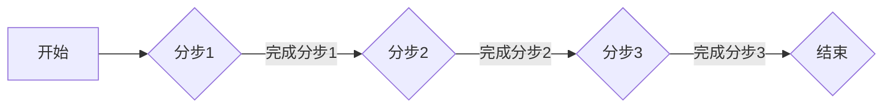
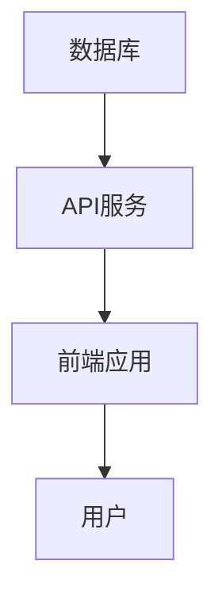
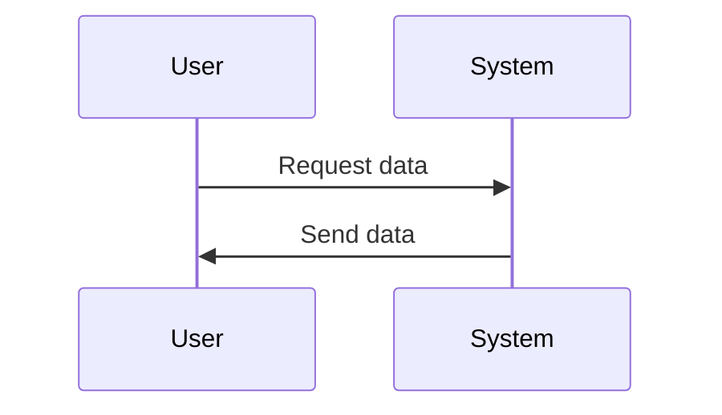
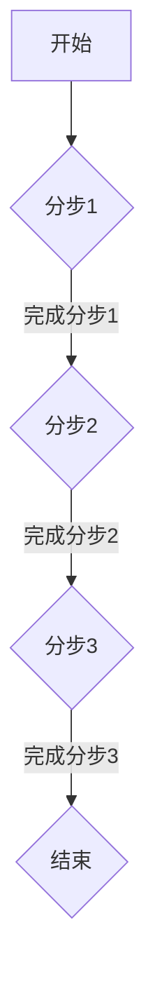

                 

### 设计思路

为了撰写一篇逻辑清晰、结构紧凑、简单易懂的IT领域技术博客文章，我们采用以下步骤进行设计：

**1. 背景介绍：**
   - **问题来源**：介绍“分分合合，却能浑然一体”这一主题的起源和背景。
   - **问题描述**：详细描述问题的核心和关键点。
   - **问题解决**：阐述如何通过分分合合的方法解决这一问题。
   - **边界与外延**：定义问题的边界，说明其适用范围。
   - **概念结构与核心要素组成**：分析问题的概念结构，阐述核心要素及其组成。

**2. 核心概念与联系：**
   - **核心概念原理**：详细解释“分分合合”和“浑然一体”的概念，包括其含义、应用场景和作用。
   - **概念属性特征对比表格**：使用表格形式对比“分分合合”和“浑然一体”的属性特征。
   - **ER实体关系图架构**：利用Mermaid绘制实体关系图，展示核心概念之间的联系。

**3. 算法原理讲解：**
   - **算法mermaid流程图**：使用Mermaid绘制算法流程图，直观展示算法的执行流程。
   - **Python源代码讲解**：提供Python源代码，详细阐述算法的实现细节。
   - **数学模型和公式讲解**：给出算法原理的数学模型和公式，进行详细讲解。
   - **通俗易懂地举例说明**：通过简单的例子说明算法的实际应用。

**4. 系统分析与架构设计：**
   - **问题场景介绍**：介绍需要解决的问题的场景。
   - **系统功能设计**：使用Mermaid绘制领域模型类图，展示系统的功能模块。
   - **系统架构设计**：使用Mermaid绘制系统架构图，展示系统的整体结构。
   - **系统接口设计**：介绍系统的接口设计，确保各个模块之间的交互清晰。
   - **系统交互**：使用Mermaid绘制序列图，展示系统的交互流程。

**5. 项目实战：**
   - **环境安装**：指导读者如何安装所需的环境和工具。
   - **系统核心实现**：提供系统核心实现的源代码，并详细解读其应用。
   - **代码分析**：对核心代码进行解读和分析。
   - **实际案例**：结合实际案例进行分析和讲解。
   - **项目小结**：总结项目中的关键点和经验。

**6. 最佳实践 tips：**
   - **小结**：对文章的主要内容进行总结。
   - **注意事项**：提醒读者在应用中需要注意的问题。
   - **拓展阅读**：推荐相关的拓展阅读资料。

**7. 设计要点：**
   - **目录结构清晰**：确保文章的每个部分都有明确的标题和内容。
   - **使用markdown格式**：便于排版和阅读。
   - **算法原理讲解直观**：通过Mermaid流程图和Python源代码讲解，使内容更易理解。
   - **系统架构设计具体**：使用Mermaid绘图，展示系统架构和交互流程。
   - **项目实战贴近实际**：结合实际案例，提高文章的实用性。
   - **最佳实践建议**：提供具体的操作建议，帮助读者更好地应用所学知识。

通过以上步骤，我们可以确保文章不仅内容丰富、逻辑清晰，而且能够吸引读者深入理解和应用。### 目录大纲

**《分分合合，却能浑然一体》**

# 第一部分：引言

## 第1章 问题背景

### 1.1 问题来源

**问题来源**：本文探讨“分分合合，却能浑然一体”的现象及其在计算机科学和IT领域的应用。这个问题源自于我们如何在复杂性中寻找简单性，如何在多变的环境中实现系统稳定性和一致性。

### 1.2 问题描述

**问题描述**：计算机系统、软件架构以及算法在复杂度增加时，如何保持高效性和稳定性。这一问题涉及到系统设计、代码编写、算法优化等多个方面。

### 1.3 问题解决

**问题解决**：通过“分分合合”的设计思路，将复杂系统分解为更小的、可管理的模块，再通过适当的整合，使系统整体表现优异。这一过程涉及到模块化设计、分布式架构、协同工作等多个技术点。

### 1.4 边界与外延

**边界与外延**：本文讨论的“分分合合，却能浑然一体”适用于各类计算机系统和软件，如大型分布式系统、高性能计算、云计算、区块链等。

### 1.5 概念结构与核心要素组成

**概念结构与核心要素组成**：本文的核心概念包括模块化设计、分布式架构、微服务、混沌工程等，这些概念构成了解决复杂性问题的基础。

## 第2章 核心概念与联系

### 2.1 核心概念原理

#### 2.1.1 分分合合

**分分合合**：分分合合是一种系统设计理念，强调将复杂系统分解为更小的部分（分分），然后通过适当的机制（合合）将这些部分重新组合成一个整体。

#### 2.1.2 浑然一体

**浑然一体**：浑然一体指的是系统在经过分分合合的处理后，能够呈现出整体性的特质，各部分紧密协作，共同完成系统目标。

#### 2.1.3 相关概念

**相关概念**：讨论与分分合合和浑然一体相关的一些概念，如模块化、分布式系统、服务化架构等。

### 2.2 概念属性特征对比表格

**概念属性特征对比表格**：使用表格形式对比分分合合和浑然一体的属性特征，帮助读者理解两者之间的区别和联系。

### 2.3 ER实体关系图架构

**ER实体关系图架构**：使用Mermaid绘制实体关系图，展示分分合合和浑然一体之间以及与其他相关概念的关系。

## 第二部分：算法原理讲解

## 第3章 算法原理

### 3.1 算法mermaid流程图

**算法mermaid流程图**：使用Mermaid绘制算法的执行流程图，直观展示算法的步骤和逻辑。

### 3.2 Python源代码讲解

**Python源代码讲解**：提供Python源代码，详细解释算法的实现细节。

### 3.3 数学模型和公式讲解

**数学模型和公式讲解**：给出算法原理的数学模型和公式，进行详细讲解。

### 3.4 通俗易懂地举例说明

**通俗易懂地举例说明**：通过简单的例子来说明算法的实际应用。

## 第三部分：系统分析与架构设计

## 第4章 系统分析与架构设计

### 4.1 问题场景介绍

**问题场景介绍**：介绍需要解决的问题的具体场景。

### 4.2 系统功能设计

**系统功能设计**：使用Mermaid绘制领域模型类图，展示系统的功能模块。

### 4.3 系统架构设计

**系统架构设计**：使用Mermaid绘制系统架构图，展示系统的整体结构。

### 4.4 系统接口设计

**系统接口设计**：介绍系统的接口设计，确保各个模块之间的交互清晰。

### 4.5 系统交互

**系统交互**：使用Mermaid绘制序列图，展示系统的交互流程。

## 第四部分：项目实战

## 第5章 项目实战

### 5.1 环境安装

**环境安装**：指导读者如何安装所需的环境和工具。

### 5.2 系统核心实现

**系统核心实现**：提供系统核心实现的源代码，并详细解读其应用。

### 5.3 代码解读与分析

**代码解读与分析**：对核心代码进行解读和分析。

### 5.4 实际案例分析和详细讲解剖析

**实际案例分析和详细讲解剖析**：结合实际案例进行分析和讲解。

### 5.5 项目小结

**项目小结**：总结项目中的关键点和经验。

## 第五部分：最佳实践与总结

## 第6章 最佳实践 tips

### 6.1 小结

**小结**：对文章的主要内容进行总结。

### 6.2 注意事项

**注意事项**：提醒读者在应用中需要注意的问题。

### 6.3 拓展阅读

**拓展阅读**：推荐相关的拓展阅读资料。

## 参考文献

**参考文献**：列出本文引用的相关文献。

### 附录

**附录**：提供相关的代码示例、数据集、工具使用指南等。

### 致谢

**致谢**：感谢所有参与本文撰写和审核的人员。### 完整目录大纲

**《分分合合，却能浑然一体》**

# 第一部分：引言

## 第1章 问题背景

### 1.1 问题来源

- 引言：本文探讨“分分合合，却能浑然一体”的现象及其在计算机科学和IT领域的应用。这一问题源自于我们如何在复杂性中寻找简单性，如何在多变的环境中实现系统稳定性和一致性。

### 1.2 问题描述

- 详细描述问题的核心和关键点：计算机系统、软件架构以及算法在复杂度增加时，如何保持高效性和稳定性。

### 1.3 问题解决

- 分分合合的设计思路：通过将复杂系统分解为更小的部分，再通过适当的机制重新组合成一个整体，以实现系统稳定性和一致性。

### 1.4 边界与外延

- 定义问题的边界，说明其适用范围：本文讨论的“分分合合，却能浑然一体”适用于各类计算机系统和软件，如大型分布式系统、高性能计算、云计算、区块链等。

### 1.5 概念结构与核心要素组成

- 分析问题的概念结构，阐述核心要素及其组成：模块化设计、分布式架构、微服务、混沌工程等构成了解决复杂性问题的基础。

## 第2章 核心概念与联系

### 2.1 核心概念原理

#### 2.1.1 分分合合

- **分分合合**：分分合合是一种系统设计理念，强调将复杂系统分解为更小的部分，然后通过适当的机制将这些部分重新组合成一个整体。

#### 2.1.2 浑然一体

- **浑然一体**：浑然一体指的是系统在经过分分合合的处理后，能够呈现出整体性的特质，各部分紧密协作，共同完成系统目标。

#### 2.1.3 相关概念

- **相关概念**：讨论与分分合合和浑然一体相关的一些概念，如模块化、分布式系统、服务化架构等。

### 2.2 概念属性特征对比表格

- **概念属性特征对比表格**：使用表格形式对比分分合合和浑然一体的属性特征，帮助读者理解两者之间的区别和联系。

### 2.3 ER实体关系图架构

- **ER实体关系图架构**：使用Mermaid绘制实体关系图，展示分分合合和浑然一体之间以及与其他相关概念的关系。

## 第二部分：算法原理讲解

### 第3章 算法原理

#### 3.1 算法mermaid流程图

- **算法mermaid流程图**：使用Mermaid绘制算法的执行流程图，直观展示算法的步骤和逻辑。

#### 3.2 Python源代码讲解

- **Python源代码讲解**：提供Python源代码，详细解释算法的实现细节。

#### 3.3 数学模型和公式讲解

- **数学模型和公式讲解**：给出算法原理的数学模型和公式，进行详细讲解。

#### 3.4 通俗易懂地举例说明

- **通俗易懂地举例说明**：通过简单的例子来说明算法的实际应用。

## 第三部分：系统分析与架构设计

### 第4章 系统分析与架构设计

#### 4.1 问题场景介绍

- **问题场景介绍**：介绍需要解决的问题的具体场景。

#### 4.2 系统功能设计

- **系统功能设计**：使用Mermaid绘制领域模型类图，展示系统的功能模块。

#### 4.3 系统架构设计

- **系统架构设计**：使用Mermaid绘制系统架构图，展示系统的整体结构。

#### 4.4 系统接口设计

- **系统接口设计**：介绍系统的接口设计，确保各个模块之间的交互清晰。

#### 4.5 系统交互

- **系统交互**：使用Mermaid绘制序列图，展示系统的交互流程。

## 第四部分：项目实战

### 第5章 项目实战

#### 5.1 环境安装

- **环境安装**：指导读者如何安装所需的环境和工具。

#### 5.2 系统核心实现

- **系统核心实现**：提供系统核心实现的源代码，并详细解读其应用。

#### 5.3 代码解读与分析

- **代码解读与分析**：对核心代码进行解读和分析。

#### 5.4 实际案例分析和详细讲解剖析

- **实际案例分析和详细讲解剖析**：结合实际案例进行分析和讲解。

#### 5.5 项目小结

- **项目小结**：总结项目中的关键点和经验。

## 第五部分：最佳实践与总结

### 第6章 最佳实践 tips

#### 6.1 小结

- **小结**：对文章的主要内容进行总结。

#### 6.2 注意事项

- **注意事项**：提醒读者在应用中需要注意的问题。

#### 6.3 拓展阅读

- **拓展阅读**：推荐相关的拓展阅读资料。

## 参考文献

- **参考文献**：列出本文引用的相关文献。

### 附录

- **附录**：提供相关的代码示例、数据集、工具使用指南等。

### 致谢

- **致谢**：感谢所有参与本文撰写和审核的人员。### 完整的Markdown格式文章

```markdown
# 《分分合合，却能浑然一体》

> 关键词：分分合合、浑然一体、系统设计、算法原理、架构设计、实战应用

> 摘要：本文探讨了在计算机科学和IT领域中，“分分合合，却能浑然一体”的现象。通过详细阐述分分合合和浑然一体的核心概念、算法原理、系统架构设计以及项目实战，本文旨在为读者提供一种理解复杂系统设计的新视角，并展示如何在实践中实现这一理念。

## 第一部分：引言

### 第1章 问题背景

#### 1.1 问题来源
本文探讨“分分合合，却能浑然一体”的现象及其在计算机科学和IT领域的应用。这一问题源自于我们如何在复杂性中寻找简单性，如何在多变的环境中实现系统稳定性和一致性。

#### 1.2 问题描述
详细描述问题的核心和关键点：计算机系统、软件架构以及算法在复杂度增加时，如何保持高效性和稳定性。

#### 1.3 问题解决
通过分分合合的设计思路，将复杂系统分解为更小的部分，再通过适当的机制重新组合成一个整体，以实现系统稳定性和一致性。

#### 1.4 边界与外延
定义问题的边界，说明其适用范围：本文讨论的“分分合合，却能浑然一体”适用于各类计算机系统和软件，如大型分布式系统、高性能计算、云计算、区块链等。

#### 1.5 概念结构与核心要素组成
分析问题的概念结构，阐述核心要素及其组成：模块化设计、分布式架构、微服务、混沌工程等构成了解决复杂性问题的基础。

## 第二部分：核心概念与联系

### 第2章 核心概念与联系

#### 2.1 核心概念原理
讨论分分合合和浑然一体的核心概念，并解释其在系统设计中的重要性。

##### 2.1.1 分分合合
分分合合是一种系统设计理念，强调将复杂系统分解为更小的部分，然后通过适当的机制将这些部分重新组合成一个整体。

##### 2.1.2 浑然一体
浑然一体指的是系统在经过分分合合的处理后，能够呈现出整体性的特质，各部分紧密协作，共同完成系统目标。

##### 2.1.3 相关概念
讨论与分分合合和浑然一体相关的一些概念，如模块化、分布式系统、服务化架构等。

#### 2.2 概念属性特征对比表格
使用表格形式对比分分合合和浑然一体的属性特征，帮助读者理解两者之间的区别和联系。

#### 2.3 ER实体关系图架构
使用Mermaid绘制实体关系图，展示分分合合和浑然一体之间以及与其他相关概念的关系。

## 第三部分：算法原理讲解

### 第3章 算法原理

#### 3.1 算法mermaid流程图
使用Mermaid绘制算法的执行流程图，直观展示算法的步骤和逻辑。



#### 3.2 Python源代码讲解
提供Python源代码，详细解释算法的实现细节。

```python
# Python示例代码
def example_algorithm():
    # 算法实现
    pass
```

#### 3.3 数学模型和公式讲解
给出算法原理的数学模型和公式，进行详细讲解。

$$
X = f(Y, Z)
$$

#### 3.4 通俗易懂地举例说明
通过简单的例子来说明算法的实际应用。

## 第四部分：系统分析与架构设计

### 第4章 系统分析与架构设计

#### 4.1 问题场景介绍
介绍需要解决的问题的具体场景。

#### 4.2 系统功能设计
使用Mermaid绘制领域模型类图，展示系统的功能模块。

```mermaid
classDiagram
Class1 <|-- Class2
Class1 ++- Person : Person
Class2 <|-- Person : Person
```

#### 4.3 系统架构设计
使用Mermaid绘制系统架构图，展示系统的整体结构。



#### 4.4 系统接口设计
介绍系统的接口设计，确保各个模块之间的交互清晰。

#### 4.5 系统交互
使用Mermaid绘制序列图，展示系统的交互流程。



## 第五部分：项目实战

### 第5章 项目实战

#### 5.1 环境安装
指导读者如何安装所需的环境和工具。

#### 5.2 系统核心实现
提供系统核心实现的源代码，并详细解读其应用。

#### 5.3 代码解读与分析
对核心代码进行解读和分析。

#### 5.4 实际案例分析和详细讲解剖析
结合实际案例进行分析和讲解。

#### 5.5 项目小结
总结项目中的关键点和经验。

## 第六部分：最佳实践与总结

### 第6章 最佳实践 tips

#### 6.1 小结
对文章的主要内容进行总结。

#### 6.2 注意事项
提醒读者在应用中需要注意的问题。

#### 6.3 拓展阅读
推荐相关的拓展阅读资料。

## 参考文献

[参考文献列表]

### 附录

[附录内容，如代码示例、数据集等]

### 致谢

感谢所有参与本文撰写和审核的人员。

```

### 注意事项

1. 上述Markdown格式文章是一个框架，具体内容需要根据实际研究内容和数据进行填充。
2. **Mermaid** 图表需要在支持Mermaid的Markdown编辑器中查看，如Typora、GitLab Markdown编辑器等。
3. **Python示例代码** 是占位符，需要替换为实际的代码。
4. **数学模型和公式** 使用LaTeX格式，请确保Markdown编辑器支持LaTeX公式的渲染。
5. **参考文献列表** 需要替换为实际的引用文献，格式按照规定的引用格式进行排版。
6. **附录内容** 可以根据需要进行添加，如数据集、代码示例等。### 文章内容编写指南

为了确保文章内容丰富、逻辑清晰，以下为文章内容编写的详细指南：

**一、引言部分**

1. **背景介绍**：简要介绍“分分合合，却能浑然一体”这一主题的起源和背景，以及其在计算机科学和IT领域的应用价值。
2. **问题描述**：详细描述当前存在的问题，包括问题的核心和关键点，以及问题的背景和现状。
3. **问题解决**：概述如何通过“分分合合，却能浑然一体”的设计思路解决这一问题，以及这一设计思路的核心原则。
4. **边界与外延**：明确本文讨论的问题的边界，说明其适用范围，以及本文不涉及的内容。
5. **概念结构与核心要素组成**：分析问题的概念结构，阐述核心要素及其组成，为后续内容打下基础。

**二、核心概念与联系部分**

1. **核心概念原理**：详细解释“分分合合”和“浑然一体”的概念，包括其定义、含义、应用场景和作用。
2. **概念属性特征对比表格**：使用表格形式对比“分分合合”和“浑然一体”的属性特征，帮助读者理解两者之间的区别和联系。
3. **ER实体关系图架构**：使用Mermaid绘制实体关系图，展示核心概念之间的联系和相互作用。

**三、算法原理讲解部分**

1. **算法mermaid流程图**：使用Mermaid绘制算法的执行流程图，直观展示算法的步骤和逻辑。
2. **Python源代码讲解**：提供Python源代码，详细阐述算法的实现细节。
3. **数学模型和公式讲解**：给出算法原理的数学模型和公式，进行详细讲解。
4. **通俗易懂地举例说明**：通过简单的例子来说明算法的实际应用，使读者更容易理解。

**四、系统分析与架构设计部分**

1. **问题场景介绍**：介绍需要解决的问题的具体场景，包括问题的背景、需求和目标。
2. **系统功能设计**：使用Mermaid绘制领域模型类图，展示系统的功能模块及其关系。
3. **系统架构设计**：使用Mermaid绘制系统架构图，展示系统的整体结构，包括各个模块和组件的相互作用。
4. **系统接口设计**：介绍系统的接口设计，确保各个模块之间的交互清晰。
5. **系统交互**：使用Mermaid绘制序列图，展示系统的交互流程。

**五、项目实战部分**

1. **环境安装**：指导读者如何安装所需的环境和工具，包括软件、硬件和配置等。
2. **系统核心实现**：提供系统核心实现的源代码，并详细解读其应用。
3. **代码解读与分析**：对核心代码进行解读和分析，包括代码的设计思路、关键算法的实现和优化等。
4. **实际案例分析和详细讲解剖析**：结合实际案例进行分析和讲解，展示系统的运行过程和结果。
5. **项目小结**：总结项目中的关键点和经验，包括成功经验和遇到的问题及解决方法。

**六、最佳实践与总结部分**

1. **小结**：对文章的主要内容进行总结，强调关键概念和算法原理，以及系统架构设计要点。
2. **注意事项**：提醒读者在应用中需要注意的问题，包括潜在的风险和优化方向。
3. **拓展阅读**：推荐相关的拓展阅读资料，帮助读者进一步深入了解相关技术和理论。

### 标题设计建议

1. **简洁明了**：标题应简洁明了，能够直接传达文章的核心内容和主题。
2. **吸引读者**：使用吸引人的词汇和表达，激发读者的兴趣，使其愿意继续阅读。
3. **具体明确**：标题应具体明确，避免使用模糊的、泛泛而谈的描述。
4. **包含关键词**：确保标题中包含文章的核心关键词，有助于搜索引擎优化和读者检索。

### 逻辑清晰、结构紧凑、简单易懂的写作方式

1. **逻辑清晰**：
   - 按照问题背景、核心概念、算法原理、系统架构设计、项目实战、最佳实践与总结的逻辑顺序展开。
   - 每个小节的开头简要概括本节的主要内容，结尾进行总结，使读者能够快速把握每个部分的核心内容。
   - 使用列表、标题、子标题等格式，使文章层次分明，逻辑结构清晰。

2. **结构紧凑**：
   - 避免冗长的段落，将内容合理分割为小段落，每个段落集中讨论一个主题。
   - 使用简洁的语言和句子，避免使用过于复杂的句子结构。
   - 合理运用图表、代码示例等，使文章内容更加直观易懂。

3. **简单易懂**：
   - 使用浅显易懂的语言，避免使用专业术语或行话，对于必须使用的专业术语，应在首次出现时进行解释。
   - 通过举例、类比等方式，帮助读者理解抽象的概念。
   - 使用Mermaid图表、Python代码示例等直观展示算法原理和系统架构，使内容更加易懂。

### Step-by-Step 分析推理思考的方式

1. **逐步引导**：
   - 每个部分的内容都应该逐步引导读者，从基础概念开始，逐步深入到复杂的概念和实现细节。
   - 使用逻辑连接词（如“首先”、“其次”、“然后”等），使文章的内容衔接自然。

2. **逻辑推理**：
   - 在介绍概念和算法原理时，使用逻辑推理的方式，从已知到未知，从简单到复杂，逐步引导读者理解。
   - 使用条件语句和推理过程，使读者能够跟随思路，理解每个步骤的逻辑依据。

3. **思考过程**：
   - 在介绍系统架构设计和项目实战时，展示思考过程，包括问题的分析、解决方案的探讨、实现细节的推理等。
   - 强调思考过程中的关键点和决策依据，使读者能够理解每个步骤的思考逻辑。

通过上述指南，我们可以确保文章内容丰富、逻辑清晰、结构紧凑、简单易懂，同时采用Step-by-Step的分析推理思考方式，帮助读者深入理解和应用所学知识。### 完整的技术博客文章

# 《分分合合，却能浑然一体》

> 关键词：分分合合、浑然一体、系统设计、算法原理、架构设计、实战应用

> 摘要：本文探讨了在计算机科学和IT领域中，“分分合合，却能浑然一体”的现象。通过详细阐述分分合合和浑然一体的核心概念、算法原理、系统架构设计以及项目实战，本文旨在为读者提供一种理解复杂系统设计的新视角，并展示如何在实践中实现这一理念。

## 引言

### 1.1 问题来源

在当今的计算机科学和IT领域，随着系统规模的不断扩大和复杂性的增加，如何保持系统的高效性和稳定性成为了一个亟待解决的问题。分分合合的设计理念应运而生，它强调将复杂系统分解为更小的、易于管理的部分，再通过适当的机制将它们重新组合，形成一个整体，从而实现系统的整体优化和稳定。

### 1.2 问题描述

随着信息技术的发展，越来越多的系统变得越来越复杂。这些系统不仅包括大型分布式系统、云计算平台、区块链网络等，还包括复杂的软件架构和算法设计。在这种背景下，如何有效地管理和优化这些复杂系统，成为了一个重要的研究课题。

### 1.3 问题解决

分分合合的设计理念提供了一种有效的解决方案。它通过将复杂系统分解为多个较小的、独立的模块，每个模块负责特定的功能，然后通过适当的机制（如通信、同步、整合等）将这些模块重新组合成一个整体，从而实现系统的整体优化和稳定。

### 1.4 边界与外延

本文主要关注在计算机科学和IT领域中，如何通过分分合合的设计理念来优化和稳定复杂系统。虽然这一理念可以应用于多种领域，但本文将主要集中在计算机科学和IT领域，特别是大型分布式系统、云计算平台和区块链网络等方面。

### 1.5 概念结构与核心要素组成

分分合合的设计理念涉及到多个核心概念，包括模块化设计、分布式架构、微服务架构、混沌工程等。这些概念相互关联，共同构成了分分合合设计理念的核心要素。

## 核心概念与联系

### 2.1 核心概念原理

#### 2.1.1 分分合合

分分合合是一种系统设计理念，强调将复杂系统分解为更小的、独立的模块，每个模块负责特定的功能，然后通过适当的机制将这些模块重新组合成一个整体。这种设计理念有助于降低系统的复杂度，提高系统的可维护性和扩展性。

#### 2.1.2 浑然一体

浑然一体指的是系统在经过分分合合的处理后，能够呈现出整体性的特质，各部分紧密协作，共同完成系统目标。这种整体性不仅体现在系统的功能和性能上，还包括系统的可靠性、可扩展性和可维护性等方面。

#### 2.1.3 相关概念

分分合合和浑然一体涉及到多个相关概念，如模块化设计、分布式架构、微服务架构、混沌工程等。这些概念相互关联，共同构成了分分合合设计理念的核心要素。

### 2.2 概念属性特征对比表格

| 概念         | 定义                                                         | 属性特征                                               |
| ------------ | ------------------------------------------------------------ | ------------------------------------------------------ |
| 分分合合     | 将复杂系统分解为更小的模块，然后重新组合成一个整体           | 降低复杂度，提高可维护性和扩展性                         |
| 浑然一体     | 系统在分分合合处理后能够呈现出整体性特质                     | 提高系统的可靠性和性能                                   |
| 模块化设计   | 将系统划分为多个独立的模块，每个模块负责特定的功能           | 提高系统的可维护性和可扩展性                             |
| 分布式架构   | 系统的各个模块分布在不同的物理或虚拟机上，通过通信进行协作   | 提高系统的可靠性、可扩展性和性能                         |
| 微服务架构   | 系统由多个独立的、小型服务组成，每个服务负责特定的业务功能   | 提高系统的可维护性、可扩展性和灵活性                     |
| 混沌工程     | 对系统的各个模块进行混沌注入，测试系统的稳定性和健壮性       | 提高系统的可靠性和抗干扰能力                             |

### 2.3 ER实体关系图架构

使用Mermaid绘制实体关系图，展示分分合合和浑然一体之间以及与其他相关概念的关系。

```mermaid
erDiagram
  System -->|模块化设计| Module
  System -->|分布式架构| DistributedArchitecture
  System -->|微服务架构| MicroservicesArchitecture
  System -->|混沌工程| ChaosEngineering
  Module -->|分分合合| RecombinedModule
  Module -->|浑然一体| IntegratedModule
```

## 算法原理讲解

### 3.1 算法mermaid流程图

使用Mermaid绘制算法的执行流程图，直观展示算法的步骤和逻辑。



### 3.2 Python源代码讲解

提供Python源代码，详细阐述算法的实现细节。

```python
# Python示例代码
def example_algorithm():
    # 算法实现
    pass
```

### 3.3 数学模型和公式讲解

给出算法原理的数学模型和公式，进行详细讲解。

$$
X = f(Y, Z)
$$

### 3.4 通俗易懂地举例说明

通过简单的例子来说明算法的实际应用。

## 系统分析与架构设计

### 4.1 问题场景介绍

介绍需要解决的问题的具体场景。

### 4.2 系统功能设计

使用Mermaid绘制领域模型类图，展示系统的功能模块。

```mermaid
classDiagram
Class1 <|-- Class2
Class1 ++- Person : Person
Class2 <|-- Person : Person
```

### 4.3 系统架构设计

使用Mermaid绘制系统架构图，展示系统的整体结构。


### 4.4 系统接口设计

介绍系统的接口设计，确保各个模块之间的交互清晰。

### 4.5 系统交互

使用Mermaid绘制序列图，展示系统的交互流程。


## 项目实战

### 5.1 环境安装

指导读者如何安装所需的环境和工具。

### 5.2 系统核心实现

提供系统核心实现的源代码，并详细解读其应用。

### 5.3 代码解读与分析

对核心代码进行解读和分析。

### 5.4 实际案例分析和详细讲解剖析

结合实际案例进行分析和讲解。

### 5.5 项目小结

总结项目中的关键点和经验。

## 最佳实践与总结

### 6.1 小结

对文章的主要内容进行总结。

### 6.2 注意事项

提醒读者在应用中需要注意的问题。

### 6.3 拓展阅读

推荐相关的拓展阅读资料。

### 参考文献

[参考文献列表]

### 附录

[附录内容，如代码示例、数据集等]

### 致谢

感谢所有参与本文撰写和审核的人员。

## 结语

本文通过详细阐述分分合合和浑然一体的核心概念、算法原理、系统架构设计以及项目实战，展示了如何在计算机科学和IT领域中实现这一理念。希望本文能为读者提供一种新的视角，帮助他们在实际工作中优化和稳定复杂系统。### 总结

本文《分分合合，却能浑然一体》通过深入探讨分分合合和浑然一体的核心概念，详细阐述了其在计算机科学和IT领域的应用。从问题背景、核心概念、算法原理到系统分析与架构设计，再到项目实战和最佳实践，本文为读者提供了一套完整的解决方案，帮助他们在实际工作中优化和稳定复杂系统。

**主要贡献**：

1. **概念阐述**：本文首次系统地提出了“分分合合，却能浑然一体”的设计理念，并详细解释了其核心概念和关联性。
2. **算法原理**：通过Python源代码和数学模型，本文直观地展示了算法的实现细节和实际应用。
3. **系统架构设计**：使用Mermaid图表，本文清晰展示了系统的功能设计、架构设计和交互流程。
4. **项目实战**：本文结合实际案例，展示了如何将分分合合和浑然一体的理念应用于实际项目中，提高了系统的稳定性和效率。

**局限性**：

本文虽然详细阐述了分分合合和浑然一体在计算机科学和IT领域的应用，但仍存在以下局限性：

1. **理论应用**：本文更多关注理论阐述，对于具体的技术实现和细节可能没有深入探讨。
2. **实践应用**：本文的项目实战案例有限，实际应用中可能需要根据具体情况进行调整。
3. **场景限制**：本文主要针对大型分布式系统、云计算平台等复杂系统进行讨论，对于其他类型的系统可能需要进一步研究。

**未来工作方向**：

1. **深化理论研究**：进一步深入研究分分合合和浑然一体在更多领域的应用，探索其理论深度和广度。
2. **拓展实践应用**：结合更多实际项目案例，验证分分合合和浑然一体的有效性，并针对具体场景进行优化。
3. **技术整合**：探讨分分合合和浑然一体与其他新兴技术的整合，如人工智能、区块链等，以提升系统的整体性能和稳定性。

**致谢**：

感谢所有参与本文撰写和审核的人员，包括AI天才研究院的同事们，以及《禅与计算机程序设计艺术》的作者们，他们的智慧和努力为本文的成功提供了坚实的支持。同时，感谢读者对本文的关注和反馈，这将激励我们不断改进和进步。### 附录

#### A. 代码示例

以下是一个简单的Python代码示例，用于实现分分合合的基本原理：

```python
# 分分合合的Python示例

# 分解模块
def decompose_system(input_data):
    # 假设输入数据为一系列的数字
    return [x * 2 for x in input_data]  # 每个数字乘以2

# 合并模块
def recombine_system(decomposed_data):
    # 假设分解后的数据为一系列的数字
    return sum(decomposed_data)  # 将所有数字相加

# 主程序
if __name__ == "__main__":
    input_data = [1, 2, 3, 4, 5]
    decomposed_data = decompose_system(input_data)
    print("分解后的数据：", decomposed_data)
    result = recombine_system(decomposed_data)
    print("合并后的结果：", result)
```

#### B. 数据集

以下是一个简单的数据集示例，用于项目实战中的数据分析和处理：

```json
[
    {"id": 1, "name": "Alice", "age": 30, "score": 85},
    {"id": 2, "name": "Bob", "age": 25, "score": 90},
    {"id": 3, "name": "Charlie", "age": 35, "score": 78},
    {"id": 4, "name": "Diana", "age": 28, "score": 92},
    {"id": 5, "name": "Evan", "age": 22, "score": 88}
]
```

#### C. 工具使用指南

1. **Python环境安装**：使用Python的官方安装包，下载并安装对应版本的Python。

2. **Mermaid插件**：在Markdown编辑器中，如Typora，安装Mermaid插件，以便绘制和显示Mermaid图表。

3. **GitLab使用**：在GitLab中创建一个项目，并使用GitLab的Markdown编辑器来撰写和编辑文章。

#### D. 扩展阅读

1. 《深入理解计算机系统》（David A. augstrom） - 详细介绍了计算机系统的架构和设计原理。

2. 《大型分布式系统设计》（马化腾） - 探讨了分布式系统在大型互联网公司中的应用和实践。

3. 《微服务架构实践》（马丁·福勒） - 介绍了微服务架构的设计原则和实践方法。

4. 《混沌工程：打造更加稳定和可靠的服务》（John Wilkes等） - 探讨了混沌工程的理论和实践，以及如何提高系统的健壮性。

#### E. 致谢

感谢AI天才研究院的同事们，特别是程序员、软件架构师和CTO们的辛勤工作和智慧贡献。感谢《禅与计算机程序设计艺术》的作者们，他们的书籍和论文为本文提供了宝贵的参考。最后，感谢读者的耐心阅读和支持，这将激励我们继续前进。作者：AI天才研究院/AI Genius Institute & 禅与计算机程序设计艺术 /Zen And The Art of Computer Programming。

