                 

### # 分分合合，却能浑然一体

> 关键词：分分合合、系统架构、人工智能、合作与竞争、心理学解读

> 摘要：本文从多个维度探讨了分分合合现象的内在规律和实际应用。通过分析分分合合在不同领域中的表现形式，揭示了其在系统架构设计、人工智能应用、合作与竞争关系中的重要性，并提出了相应的心理学解读。文章旨在为读者提供一种新的思考方式，以更好地理解和应对分分合合现象。

## 目录大纲设计

### 1. 背景介绍

#### 1.1 问题背景

在社会、经济和科技领域中，分分合合的现象无处不在。比如，公司之间的并购与合作，人际关系中的恋爱与分手，科技领域的开源与闭源之争。这些现象不仅影响了个体和组织的行为选择，也对社会的稳定与发展产生了深远影响。

#### 1.2 问题描述

分分合合现象的核心问题是如何在分分合合中实现个体与组织的和谐发展，以及如何在分分合合的过程中保持稳定和持续性的发展。本文旨在通过深入研究分分合合现象，揭示其内在规律，为个体和组织在分分合合中实现和谐发展提供理论指导和实践建议。

#### 1.3 问题解决

本文将通过对分分合合现象的多维度分析，包括系统架构设计、人工智能应用、合作与竞争关系，以及心理学解读，提供一套全面的理论框架，帮助读者更好地理解和应对分分合合现象。

### 1.4 边界与外延

#### 1.4.1 边界

本文主要关注分分合合现象在现实生活中的应用，包括人际关系、商业合作、组织变革等领域。

#### 1.4.2 外延

本文不仅关注分分合合现象本身，还将其扩展到心理学、社会学、经济学等多个领域，为跨学科研究提供参考。

### 1.5 概念结构与核心要素组成

#### 1.5.1 概念结构

分分合合现象由分与合两个核心概念组成，分别代表着个体与组织在发展过程中的离散与聚集状态。

#### 1.5.2 核心要素组成

分分合合现象的核心要素包括个体与组织的行为选择、外部环境的变化、内部动力机制的调节等。

## 2. 核心概念与联系

### 2.1 分分合合的定义与特点

#### 2.1.1 定义

分分合合是指个体或组织在一定时期内，由于外部环境或内部因素的变化，从离散状态转变为聚集状态，再从聚集状态转变为离散状态的过程。

#### 2.1.2 特点

1. **周期性**：分分合合现象具有明显的周期性特征，即在一定时期内，个体或组织会经历从分到合、再从合到分的循环。
2. **动态性**：分分合合现象处于不断变化的过程中，受到外部环境和内部因素的双重影响。
3. **多样性**：分分合合现象的表现形式多种多样，包括人际关系、商业合作、组织变革等。

### 2.2 分分合合与传统合作与竞争的关系

#### 2.2.1 分分合合与传统合作的关系

传统合作强调个体或组织在特定时期内的合作，而分分合合则强调个体或组织在不同时期内的合作与离散的交替。

#### 2.2.2 分分合合与传统竞争的关系

分分合合与传统竞争也有一定的联系。在分分合合的过程中，个体或组织不仅面临竞争，还面临合作与离散的挑战。因此，分分合合现象在一定程度上反映了个体与组织在竞争环境中的生存与发展策略。

### 2.3 分分合合现象的心理学解读

心理学理论为分分合合现象的解读提供了理论依据。从个体心理发展的角度来看，分分合合现象是个体在不同心理发展阶段的表现。从人际关系的角度来看，分分合合现象反映了个体在人际关系中的心理需求与冲突。从动机的角度来看，分分合合现象是个体在不同动机驱动下的行为表现。

## 3. 主流分分合合模式与案例分析

### 3.1 主流分分合合模式

#### 3.1.1 人际关系中的分分合合

人际关系中的分分合合表现为友谊的建立与破裂、恋爱关系的分分合合等。

#### 3.1.2 商业合作中的分分合合

商业合作中的分分合合表现为合作伙伴的加入与退出、商业联盟的成立与解散等。

#### 3.1.3 组织变革中的分分合合

组织变革中的分分合合表现为组织结构的调整、组织文化的变革等。

### 3.2 分分合合案例分析

#### 3.2.1 人际关系案例

以某对情侣的分分合合过程为例，分析分分合合现象在人际关系中的应用。

#### 3.2.2 商业合作案例

以某商业联盟的成立与解散为例，分析分分合合现象在商业合作中的应用。

#### 3.2.3 组织变革案例

以某企业的组织结构调整为例，分析分分合合现象在组织变革中的应用。

## 4. 分分合合现象的心理学解读

### 4.1 心理学理论背景

心理学理论为分分合合现象的解读提供了理论依据，如心理学中的个体发展理论、人际关系理论、动机理论等。

### 4.2 分分合合现象的心理学分析

#### 4.2.1 个体心理发展角度

从个体心理发展的角度来看，分分合合现象是个体在不同心理发展阶段的表现。

#### 4.2.2 人际关系角度

从人际关系的角度来看，分分合合现象反映了个体在人际关系中的心理需求与冲突。

#### 4.2.3 动机角度

从动机的角度来看，分分合合现象是个体在不同动机驱动下的行为表现。

## 5. 分分合合现象的社会学解读

### 5.1 社会学理论背景

社会学理论为分分合合现象的解读提供了理论依据，如社会学中的结构功能主义、冲突理论、符号互动论等。

### 5.2 分分合合现象的社会学分析

#### 5.2.1 结构功能主义角度

从结构功能主义的角度来看，分分合合现象是社会结构变化的结果，也是社会稳定与发展的动力。

#### 5.2.2 冲突理论角度

从冲突理论的角度来看，分分合合现象是社会冲突与矛盾的表现，也是社会变革的催化剂。

#### 5.2.3 符号互动论角度

从符号互动论的角度来看，分分合合现象是社会成员之间通过符号互动来构建社会秩序的过程。

## 6. 分分合合现象在系统架构设计中的应用

### 6.1 系统架构设计中的分分合合

在系统架构设计中，分分合合现象表现为模块的划分与整合。通过合理的模块划分，可以使系统在分分合合的过程中保持稳定性和灵活性。

### 6.2 分分合合现象在人工智能中的应用

在人工智能系统中，分分合合现象表现为模型的学习与调整。通过不断的学习和调整，可以使模型在不同环境和需求下保持最佳性能。

### 6.3 分分合合现象在云计算与大数据中的应用

在云计算与大数据领域，分分合合现象表现为资源的分配与调度。通过合理的资源分配与调度，可以提高系统的效率和稳定性。

## 7. 结论

分分合合现象是现代社会中普遍存在的现象，其对个体、组织和整个社会的影响深远。本文从多个维度探讨了分分合合现象的内在规律和实际应用，为读者提供了一种新的思考方式。通过深入理解分分合合现象，我们可以更好地应对生活中的各种挑战，实现个体与组织的和谐发展。## 1. 背景介绍

### 1.1 问题背景

在现代社会中，分分合合现象无处不在，涵盖了人际关系、商业合作、组织变革等多个领域。例如，在人际关系中，友谊的建立与破裂、恋爱关系的分分合合是常见的现象；在商业合作中，合作伙伴的加入与退出、商业联盟的成立与解散也是常态；在组织变革中，组织结构的调整、组织文化的变革也经常出现。这些现象不仅影响着个体和组织的行为选择，也对社会的稳定与和谐产生了深远影响。

#### 1.1.1 分分合合现象的普遍性

分分合合现象的普遍性首先体现在人际关系的层面。在现代社会，人际关系错综复杂，每个人都在不断地建立和维护着各种关系。这些关系在不同时间、不同情境下会经历从分到合、再从合到分的循环。例如，朋友之间可能会因为某些原因而疏远，但随着时间的推移，他们又可能会重新变得亲密。

在商业合作中，分分合合现象同样普遍。企业之间的合作往往需要相互信任和协同工作，但随着市场环境的变化和公司战略的调整，合作伙伴可能会发生变动。一些原本紧密合作的伙伴可能会因为利益分配、战略目标不一致等原因而选择分开，而新的合作伙伴也可能会因为新的机遇而加入进来。

组织变革中的分分合合现象则更为复杂。组织结构的调整和组织文化的变革往往是为了适应外部环境的变化和内部需求的变化。这种变革过程中，组织内部的成员关系和角色定位也会发生相应的变化，从而形成分分合合的现象。

#### 1.1.2 现实困境

尽管分分合合现象在现代社会中普遍存在，但其带来的现实困境也不容忽视。首先，分分合合现象容易导致个体和组织的不稳定。在人际关系中，友谊的破裂和恋爱关系的分手会给当事人带来心理上的困扰和痛苦；在商业合作中，合作伙伴的退出和商业联盟的解散可能导致项目的中断和损失；在组织变革中，组织结构的调整和组织文化的变革可能会引起员工的焦虑和不满，影响组织的稳定和发展。

其次，分分合合现象容易引发冲突和矛盾。在人际关系中，分分合合可能导致人际关系的紧张和对立，增加社会矛盾；在商业合作中，合作伙伴的变动和商业联盟的解散可能导致利益冲突和纠纷；在组织变革中，组织结构的调整和组织文化的变革可能会引起内部成员的抵触和反对，影响组织的变革进程。

最后，分分合合现象对社会的稳定与和谐也带来了挑战。在现代社会，分分合合现象的普遍存在使得社会关系更加复杂，增加了社会管理的难度。如何理解和应对分分合合现象，找到其中的规律和解决问题的方法，成为现代社会亟待解决的课题。

### 1.2 问题描述

分分合合现象涉及到多个领域，如心理学、社会学、经济学等。其核心问题是如何在分分合合中实现个体与组织的和谐发展，以及如何在分分合合的过程中保持稳定和持续性的发展。具体来说，问题描述如下：

1. **个体和谐发展问题**：个体在不同心理发展阶段如何应对分分合合现象，实现心理的平衡和成长？
   
2. **组织和谐发展问题**：组织在分分合合过程中如何保持稳定和持续性的发展，实现组织的长期目标？

3. **社会和谐发展问题**：社会如何应对分分合合现象，保持社会的稳定与和谐？

### 1.3 问题解决

本书旨在通过深入研究分分合合现象，揭示其内在规律，为个体和组织在分分合合中实现和谐发展提供理论指导和实践建议。具体来说，本书将从以下几个方面展开：

1. **理论研究**：结合心理学、社会学、经济学等领域的理论，分析分分合合现象的内在规律和特点。

2. **案例分析**：通过具体案例，深入剖析分分合合现象在实际中的应用，总结经验和教训。

3. **实践指导**：基于理论和案例分析，提出具体的实践建议，帮助个体和组织应对分分合合现象，实现和谐发展。

### 1.4 边界与外延

#### 1.4.1 边界

本书主要关注分分合合现象在现实生活中的应用，涉及的人际关系、商业合作、组织变革等领域。具体来说，本书将探讨以下问题：

1. 人际关系中的分分合合，如友谊、恋爱关系等。
2. 商业合作中的分分合合，如合作伙伴的加入与退出、商业联盟的成立与解散等。
3. 组织变革中的分分合合，如组织结构的调整、组织文化的变革等。

#### 1.4.2 外延

除了关注分分合合现象在现实生活中的应用，本书还将将其扩展到心理学、社会学、经济学等多个领域，为跨学科研究提供参考。具体来说，本书将探讨以下问题：

1. **心理学解读**：从个体心理发展的角度，分析分分合合现象对个体心理的影响，以及个体如何应对分分合合现象。
2. **社会学解读**：从社会结构的变迁和社会关系的演变角度，探讨分分合合现象对社会稳定与和谐的影响。
3. **经济学解读**：从资源配置和利益分配的角度，分析分分合合现象对经济系统的影响。

### 1.5 概念结构与核心要素组成

#### 1.5.1 概念结构

分分合合现象由分与合两个核心概念组成，分别代表着个体与组织在发展过程中的离散与聚集状态。具体来说：

1. **分**：指的是个体或组织从原有状态中分离出去，进入离散状态。这个过程可能是因为外部环境的变化、内部动力的作用或其他因素。
2. **合**：指的是个体或组织重新聚集，进入聚集状态。这个过程可能是因为外部环境的改善、内部动力的驱动或其他因素。

#### 1.5.2 核心要素组成

分分合合现象的核心要素包括以下几个方面：

1. **个体与组织的行为选择**：个体和组织在不同情况下做出的行为选择，包括合作、竞争、分离等。
2. **外部环境的变化**：外部环境的变化对分分合合现象的影响，包括经济环境、社会环境、技术环境等。
3. **内部动力机制的调节**：内部动力机制对分分合合现象的调节作用，包括文化价值观、组织结构、激励机制等。

## 2. 核心概念与联系

### 2.1 分分合合的定义与特点

#### 2.1.1 定义

分分合合是指个体或组织在一定时期内，由于外部环境或内部因素的变化，从离散状态转变为聚集状态，再从聚集状态转变为离散状态的过程。这种过程具有明显的周期性特征，即在一定时期内，个体或组织会经历从分到合、再从合到分的循环。

#### 2.1.2 特点

1. **周期性**：分分合合现象具有明显的周期性特征，即个体或组织在一定时期内会经历从分到合、再从合到分的循环。这种周期性特征使得分分合合现象在时间上呈现出一定的规律性，有助于个体和组织在长期发展中保持稳定。

2. **动态性**：分分合合现象处于不断变化的过程中，受到外部环境和内部因素的双重影响。这种动态性特征使得分分合合现象在空间上呈现出多样性，有助于个体和组织在复杂环境中适应和发展。

3. **多样性**：分分合合现象的表现形式多种多样，包括人际关系、商业合作、组织变革等。这种多样性特征使得分分合合现象在应用范围上具有广泛性，有助于个体和组织在不同场景下实现和谐发展。

### 2.2 分分合合与传统合作与竞争的关系

#### 2.2.1 分分合合与传统合作的关系

传统合作强调个体或组织在特定时期内的合作，而分分合合则强调个体或组织在不同时期内的合作与离散的交替。传统合作注重在稳定的环境下，个体或组织通过合作实现共同目标。而分分合合则更多地关注在动态环境下，个体或组织如何在分分合合中实现共同目标。

1. **区别**：
   - 传统合作：在稳定的环境下，个体或组织通过合作实现共同目标。
   - 分分合合：在动态环境下，个体或组织通过分分合合实现共同目标。

2. **联系**：
   - 传统合作是分分合合的基础，没有稳定的合作，分分合合就无从谈起。
   - 分分合合是传统合作的延伸，在动态环境下，分分合合能够更好地适应环境变化，实现长期合作。

#### 2.2.2 分分合合与传统竞争的关系

分分合合与传统竞争也有一定的联系。在分分合合的过程中，个体或组织不仅面临竞争，还面临合作与离散的挑战。传统竞争强调个体或组织通过竞争实现自身利益最大化，而分分合合则更多地关注在动态环境下，个体或组织如何在竞争与合作中实现自身利益最大化。

1. **区别**：
   - 传统竞争：在稳定的环境下，个体或组织通过竞争实现自身利益最大化。
   - 分分合合：在动态环境下，个体或组织通过分分合合实现自身利益最大化。

2. **联系**：
   - 传统竞争是分分合合的前提，没有竞争，分分合合就失去了动力。
   - 分分合合是传统竞争的延伸，在动态环境下，分分合合能够更好地适应竞争环境，实现长期发展。

### 2.3 分分合合现象的心理学解读

心理学理论为分分合合现象的解读提供了理论依据。从个体心理发展的角度来看，分分合合现象是个体在不同心理发展阶段的表现。从人际关系的角度来看，分分合合现象反映了个体在人际关系中的心理需求与冲突。从动机的角度来看，分分合合现象是个体在不同动机驱动下的行为表现。

#### 2.3.1 个体心理发展角度

从个体心理发展的角度来看，分分合合现象是个体在不同心理发展阶段的表现。个体在成长过程中，会经历许多分分合合的过程，如婴儿期的依赖与独立、儿童期的游戏与竞争、青少年期的自我认同与冲突等。这些分分合合的过程是个体心理成长的重要环节，有助于个体形成稳定的心理结构。

1. **婴儿期**：婴儿期的个体处于完全依赖状态，需要通过与父母的互动来满足生理和心理需求。这个阶段的分分合合表现为依赖与独立的交替，有助于个体形成自我意识和独立能力。

2. **儿童期**：儿童期的个体开始进入学校，开始学习各种知识和技能。这个阶段的分分合合表现为游戏与竞争的交替，有助于个体形成竞争意识和合作精神。

3. **青少年期**：青少年期的个体开始面临自我认同和独立性的挑战，开始思考自己的未来和人生目标。这个阶段的分分合合表现为自我认同与冲突的交替，有助于个体形成稳定的自我认同。

#### 2.3.2 人际关系角度

从人际关系的角度来看，分分合合现象反映了个体在人际关系中的心理需求与冲突。人际关系是个体心理发展的重要环境，个体在人际交往中会产生各种心理需求，如归属感、自尊、自我实现等。这些心理需求与个体在人际关系中的冲突共同构成了分分合合现象。

1. **归属感**：个体在人际关系中寻求归属感，希望与他人建立稳定的关系。分分合合现象体现了个体在寻求归属感的过程中，如何处理与他人之间的冲突和矛盾。

2. **自尊**：个体在人际关系中寻求自尊，希望得到他人的尊重和认可。分分合合现象体现了个体在维护自尊的过程中，如何处理与他人之间的竞争和矛盾。

3. **自我实现**：个体在人际关系中寻求自我实现，希望实现自己的理想和目标。分分合合现象体现了个体在实现自我价值的过程中，如何处理与他人之间的冲突和矛盾。

#### 2.3.3 动机角度

从动机的角度来看，分分合合现象是个体在不同动机驱动下的行为表现。个体在分分合合中的行为选择受到多种动机的影响，如生存动机、社交动机、成就动机等。

1. **生存动机**：个体在分分合合中的行为选择受到生存动机的影响，例如在人际关系中，个体可能会选择与他人保持联系，以获得安全感和支持。

2. **社交动机**：个体在分分合合中的行为选择受到社交动机的影响，例如在商业合作中，个体可能会选择与他人合作，以获得更多的社交资源和机会。

3. **成就动机**：个体在分分合合中的行为选择受到成就动机的影响，例如在组织变革中，个体可能会选择参与变革，以实现自己的成就和目标。

### 2.4 分分合合现象的社会学解读

社会学理论为分分合合现象的解读提供了理论依据。从社会结构的角度来看，分分合合现象是社会结构变化的结果，也是社会稳定与发展的动力。从社会关系的角度，分分合合现象反映了社会成员之间的互动和冲突，也是社会秩序的构建与维护的过程。

#### 2.4.1 社会结构变化

从社会结构的角度来看，分分合合现象是社会结构变化的结果。随着社会的发展，社会结构不断演变，个体和组织在社会结构中的位置和角色也在不断变化。这种变化导致了分分合合现象的出现，个体和组织在社会结构中的位置和角色的变化构成了分分合合现象的基础。

1. **经济结构变化**：随着经济的发展，产业结构、就业结构等经济结构发生变化，个体和组织的经济地位和角色也发生变化，从而引发分分合合现象。

2. **社会阶层变化**：随着社会阶层的变化，社会成员的社会地位和角色也发生变化，从而引发分分合合现象。

3. **文化变迁**：随着文化的变迁，社会成员的价值观念、行为规范等发生变化，从而引发分分合合现象。

#### 2.4.2 社会关系互动

从社会关系的角度来看，分分合合现象反映了社会成员之间的互动和冲突。社会成员之间的互动和冲突构成了分分合合现象的重要部分，这种互动和冲突既是对社会秩序的挑战，也是对社会秩序的构建和维护。

1. **人际互动**：在社会生活中，个体与他人之间的互动是分分合合现象的重要表现形式。个体之间的合作与竞争、冲突与和解，构成了人际互动的丰富内容。

2. **组织互动**：在组织生活中，组织之间的互动也是分分合合现象的重要表现形式。组织之间的合作与竞争、合并与分裂，构成了组织互动的丰富内容。

3. **社会冲突**：在社会关系中，社会冲突是分分合合现象的一个重要方面。社会冲突反映了社会成员之间的利益对立和矛盾，也是社会秩序的挑战和重构的过程。

#### 2.4.3 社会秩序构建

从社会秩序的角度来看，分分合合现象也是社会秩序的构建和维护的过程。社会秩序是社会成员共同遵守的行为规范和价值观念，是社会的稳定和发展的基础。分分合合现象在社会秩序构建中的作用主要体现在以下几个方面：

1. **社会规范的形成**：分分合合现象反映了社会成员之间的互动和冲突，这些互动和冲突是形成社会规范的重要基础。

2. **社会价值的认同**：分分合合现象反映了社会成员对社会价值的认同和追求，有助于形成共同的社会价值观。

3. **社会秩序的维护**：分分合合现象反映了社会成员对社会秩序的维护和追求，有助于维持社会的稳定和和谐。

### 2.5 分分合合现象在系统架构设计中的应用

分分合合现象在系统架构设计中的应用主要体现在模块的划分与整合过程中。系统架构设计是一个复杂的工程，需要在不同的模块之间进行合理的划分与整合，以实现系统的稳定性和灵活性。

#### 2.5.1 模块的划分

模块的划分是系统架构设计的关键步骤。通过将系统划分为多个模块，可以使得系统在分分合合的过程中保持稳定性和灵活性。模块的划分主要考虑以下几个方面：

1. **功能独立性**：每个模块应该具有独立的功能，能够独立运行，降低模块之间的依赖性。

2. **规模适度**：每个模块的规模应该适度，既不应该过大，也不应该过小。过大的模块会导致设计复杂度增加，过小的模块会导致系统过于分散，不利于维护和扩展。

3. **接口清晰**：每个模块应该有清晰的接口，便于与其他模块进行交互。清晰的接口有助于降低模块之间的耦合度，提高系统的灵活性。

#### 2.5.2 模块的整合

模块的整合是将划分好的模块组合成一个完整的系统。模块的整合主要考虑以下几个方面：

1. **兼容性**：模块之间应该具有较好的兼容性，能够相互支持和协同工作。

2. **可扩展性**：模块应该具有良好的可扩展性，能够方便地增加新的功能或模块。

3. **可维护性**：模块应该具有良好的可维护性，便于在出现问题时进行修复和升级。

### 2.6 分分合合现象在人工智能中的应用

分分合合现象在人工智能中的应用主要体现在模型的学习与调整过程中。人工智能系统是一个复杂的系统，需要在不断的学习和调整中实现自我优化和自我进化。

#### 2.6.1 模型的学习

模型的学习是人工智能系统的核心。通过学习，模型可以获取知识，提高性能。模型的学习过程可以分为以下几个阶段：

1. **数据收集**：收集大量的数据，为模型提供训练素材。

2. **数据预处理**：对收集到的数据进行分析和处理，去除噪声和异常值，提高数据质量。

3. **模型训练**：使用训练数据对模型进行训练，通过不断的迭代和优化，提高模型的性能。

4. **模型评估**：使用评估数据对模型进行评估，检查模型的性能是否满足要求。

#### 2.6.2 模型的调整

模型的调整是人工智能系统持续优化和进化的关键。在模型的学习过程中，可能会出现各种问题，如过拟合、欠拟合等。通过调整模型，可以解决这些问题，提高模型的性能。模型的调整过程可以分为以下几个阶段：

1. **问题识别**：通过分析模型的评估结果，识别模型存在的问题。

2. **调整方案设计**：根据问题识别的结果，设计相应的调整方案，包括参数调整、结构调整等。

3. **调整实施**：实施调整方案，对模型进行修改和优化。

4. **调整评估**：对调整后的模型进行评估，检查调整效果是否满足要求。

### 2.7 分分合合现象在云计算与大数据中的应用

分分合合现象在云计算与大数据中的应用主要体现在资源的分配与调度过程中。云计算与大数据系统是一个高度分布式和动态变化的环境，如何在资源分配与调度中实现系统的稳定性、高效性和灵活性，是分分合合现象应用的关键。

#### 2.7.1 资源的分配

资源的分配是云计算与大数据系统的核心。在资源分配中，需要考虑以下几个方面：

1. **负载均衡**：根据系统的负载情况，合理分配资源，确保系统的高效运行。

2. **资源利用率**：提高资源的利用率，减少资源的浪费。

3. **弹性扩展**：根据系统的需求，动态调整资源分配，实现系统的弹性扩展。

#### 2.7.2 资源的调度

资源的调度是云计算与大数据系统的关键。在资源调度中，需要考虑以下几个方面：

1. **任务调度**：根据任务的特点和需求，合理调度任务，确保系统的稳定运行。

2. **故障转移**：在系统发生故障时，能够快速进行故障转移，确保系统的连续性和可靠性。

3. **负载均衡**：根据系统的负载情况，动态调整资源分配，实现系统的负载均衡。

### 2.8 分分合合现象在组织管理中的应用

分分合合现象在组织管理中的应用主要体现在组织结构的调整和组织文化的建设过程中。组织管理是一个复杂的系统工程，如何在分分合合的过程中实现组织的稳定和持续发展，是组织管理的关键。

#### 2.8.1 组织结构的调整

组织结构的调整是组织管理的重要任务。在组织结构调整中，需要考虑以下几个方面：

1. **组织目标**：明确组织的目标，确保组织结构调整符合组织的发展方向。

2. **组织职能**：根据组织的职能，合理划分部门，确保组织结构的合理性。

3. **人员配置**：根据组织结构的变化，合理配置人员，确保组织结构的稳定性。

#### 2.8.2 组织文化的建设

组织文化的建设是组织管理的重要任务。在组织文化建设中，需要考虑以下几个方面：

1. **价值观**：确立组织的价值观，确保组织文化的核心价值观得到广泛认同。

2. **行为规范**：制定组织的行为规范，确保组织成员的行为符合组织文化的期望。

3. **沟通机制**：建立有效的沟通机制，确保组织成员之间能够有效沟通，形成共识。

## 3. 主流分分合合模式与案例分析

### 3.1 主流分分合合模式

分分合合现象在各个领域中都有广泛的应用，形成了多种主流的分分合合模式。以下是一些典型的分分合合模式：

#### 3.1.1 人际关系中的分分合合

人际关系中的分分合合主要表现为友谊和爱情的分分合合。友谊的分分合合可能由于距离、兴趣变化、价值观差异等原因导致。例如，大学时的室友关系可能因为毕业而分分合合，而爱情的分分合合则可能因为性格不合、家庭压力等原因导致。

#### 3.1.2 商业合作中的分分合合

商业合作中的分分合合主要表现为合作伙伴的加入与退出、商业联盟的成立与解散等。例如，两家公司可能因为共同的市场机遇而组成商业联盟，但随着市场环境的变化，他们可能会选择解散联盟。

#### 3.1.3 组织变革中的分分合合

组织变革中的分分合合主要表现为组织结构的调整和组织文化的变革。例如，一家公司可能会因为市场竞争的加剧而调整组织结构，引入新的管理理念和文化，以适应新的市场环境。

### 3.2 分分合合案例分析

为了更好地理解分分合合现象，我们可以通过一些具体的案例进行分析。

#### 3.2.1 人际关系案例

**案例：大学室友关系**

小王和小李是大学时期的室友，两人关系十分融洽。然而，毕业后，小王去了大城市工作，而小李则留在了家乡。由于距离的原因，两人之间的联系逐渐减少，最终导致关系疏远。这是一个典型的友谊分分合合的案例，说明了地理距离对人际关系的影响。

**案例分析**：

1. **分**：大学毕业后，由于地理距离的原因，小王和小李之间的联系减少。
2. **合**：偶尔通过电话、社交媒体保持联系。
3. **再次分**：随着时间的推移，两人之间的联系越来越少，最终关系疏远。

**教训**：在人际关系中，地理距离是一个不可忽视的因素。即使两人关系再好，如果长时间没有见面和沟通，关系也会逐渐疏远。

#### 3.2.2 商业合作案例

**案例：某商业联盟的成立与解散**

A公司和B公司因为共同的市场机遇决定组成商业联盟，共同开发一项新产品。然而，在项目进行过程中，由于利益分配问题，两公司关系逐渐紧张，最终选择解散联盟。

**案例分析**：

1. **合**：A公司和B公司因为共同的市场机遇决定组成商业联盟。
2. **分**：在项目进行过程中，由于利益分配问题，两公司关系逐渐紧张。
3. **再次分**：最终，A公司和B公司选择解散联盟。

**教训**：在商业合作中，利益分配是关键。如果双方在合作过程中无法达成共识，关系可能会变得紧张，甚至导致合作失败。

#### 3.2.3 组织变革案例

**案例：某企业的组织结构调整**

某企业因为市场竞争的加剧，决定进行组织结构调整，引入新的管理理念和文化，以适应新的市场环境。在结构调整过程中，部分员工因不适应新环境而选择离职。

**案例分析**：

1. **合**：企业决定进行组织结构调整，引入新的管理理念和文化。
2. **分**：部分员工因不适应新环境而选择离职。
3. **再次合**：剩余员工逐渐适应新环境，企业继续稳定发展。

**教训**：在组织变革中，需要充分考虑员工的需求和适应能力。如果变革过于剧烈，可能会导致员工流失，影响企业的稳定发展。

## 4. 分分合合现象的心理学解读

分分合合现象在心理学领域有着丰富的解读。心理学理论为我们提供了深入理解分分合合现象的工具，帮助我们更好地应对生活中的各种分分合合。

### 4.1 个体心理发展角度

从个体心理发展的角度来看，分分合合现象是个体在不同心理发展阶段的表现。每个阶段都有其独特的心理需求和挑战，分分合合则是这些需求和挑战的体现。

#### 4.1.1 儿童期的分分合合

在儿童期，个体正处于探索和学习的阶段。分分合合现象在这个阶段表现为个体与父母、兄弟姐妹等的关系变化。例如，孩子可能会因为父母的关注不足而感到孤独，或者因为兄弟姐妹之间的竞争而感到矛盾。

#### 4.1.2 青年期的分分合合

在青年期，个体开始探索自我，寻找自己的身份和价值观。分分合合现象在这个阶段表现为恋爱关系的起伏和职业选择的迷茫。个体可能会因为与伴侣的意见不合而分手，或者因为职业发展的问题而感到困惑。

#### 4.1.3 成年期的分分合合

在成年期，个体开始承担更多的社会责任，面对更多的挑战。分分合合现象在这个阶段表现为人际关系和工作关系的复杂性。个体可能会因为家庭责任而感到压力，或者因为职业发展的问题而感到困惑。

### 4.2 人际关系角度

从人际关系的角度来看，分分合合现象反映了个体在人际关系中的心理需求与冲突。人际关系是个体心理发展的重要环境，个体在人际交往中会产生各种心理需求，如归属感、自尊、自我实现等。这些心理需求与个体在人际关系中的冲突共同构成了分分合合现象。

#### 4.2.1 归属感

归属感是个体在人际关系中寻求的心理需求之一。个体希望与他人建立稳定的关系，获得安全感和支持。然而，在现实生活中，个体可能会因为各种原因与他人产生矛盾，导致关系破裂。这种矛盾和破裂是个体在寻求归属感的过程中产生的冲突。

#### 4.2.2 自尊

自尊是个体在人际关系中寻求的心理需求之二。个体希望得到他人的尊重和认可，以满足自己的自尊心。然而，在现实生活中，个体可能会因为各种原因受到他人的指责和批评，导致自尊受到伤害。这种伤害是个体在寻求自尊的过程中产生的冲突。

#### 4.2.3 自我实现

自我实现是个体在人际关系中寻求的心理需求之三。个体希望通过与他人建立良好的关系，实现自己的理想和目标。然而，在现实生活中，个体可能会因为各种原因与他人产生矛盾，导致关系破裂。这种矛盾和破裂是个体在寻求自我实现的过程中产生的冲突。

### 4.3 动机角度

从动机的角度来看，分分合合现象是个体在不同动机驱动下的行为表现。个体在分分合合中的行为选择受到多种动机的影响，如生存动机、社交动机、成就动机等。

#### 4.3.1 生存动机

生存动机是个体在分分合合中的首要动机。个体需要通过与他人建立关系，获得生存所需的资源和支持。例如，个体可能会因为生存的需要而选择与他人合作，共同抵御外部的威胁。

#### 4.3.2 社交动机

社交动机是个体在分分合合中的次要动机。个体需要通过与他人建立关系，满足自己的社交需求。例如，个体可能会因为社交的需要而选择与他人建立友谊，共同分享生活的快乐。

#### 4.3.3 成就动机

成就动机是个体在分分合合中的高级动机。个体需要通过与他人建立关系，实现自己的成就和目标。例如，个体可能会因为成就的需要而选择与他人合作，共同完成一项艰巨的任务。

## 5. 分分合合现象的社会学解读

分分合合现象在社会学领域有着丰富的解读。社会学理论为我们提供了深入理解分分合合现象的工具，帮助我们更好地理解社会结构和关系。

### 5.1 结构功能主义角度

结构功能主义是一种重要的社会学理论，它认为社会是一个由不同部分组成的整体，每个部分都扮演着特定的角色，共同维持社会的稳定与和谐。分分合合现象可以从结构功能主义的角度进行解读。

#### 5.1.1 社会结构的稳定性

结构功能主义认为，社会结构是社会稳定的基础。在社会结构中，各个部分之间存在着相互依存的关系，共同维持着社会的稳定。分分合合现象反映了社会结构的稳定性，即社会在分分合合的过程中，能够保持其基本结构和功能的完整性。

#### 5.1.2 社会结构的动态性

结构功能主义也强调社会结构的动态性。社会是一个不断变化的过程，分分合合现象是这种变化的表现。在社会结构的变化过程中，分分合合现象有助于社会适应新的环境和需求，实现社会的持续发展。

### 5.2 冲突理论角度

冲突理论是一种重要的社会学理论，它认为社会是由不同群体和利益集团组成的，这些群体和利益集团之间存在着利益冲突。分分合合现象可以从冲突理论的角度进行解读。

#### 5.2.1 利益冲突

冲突理论认为，利益冲突是社会冲突的根本原因。在分分合合现象中，不同群体和利益集团之间会因为资源分配、权力控制等问题产生冲突。例如，在商业合作中，合作伙伴之间可能会因为利益分配不均而产生矛盾。

#### 5.2.2 冲突的表现形式

冲突理论也强调冲突的表现形式。在分分合合现象中，冲突可以通过合作与竞争、冲突与和解等方式表现出来。例如，在人际关系中，冲突可以通过争吵、冷战等方式表现出来。

### 5.3 符号互动论角度

符号互动论是一种重要的社会学理论，它认为社会是由个体之间的互动构成的，个体通过符号互动来构建社会现实。分分合合现象可以从符号互动论的角度进行解读。

#### 5.3.1 符号互动

符号互动论认为，个体通过符号互动来构建社会现实。在分分合合现象中，个体通过语言、行为等符号进行互动，共同构建人际关系、商业合作、组织变革等现实。

#### 5.3.2 符号互动的影响

符号互动论也强调符号互动对社会的影响。在分分合合现象中，符号互动会影响个体和群体之间的关系，影响社会结构和关系的稳定性。

## 6. 分分合合现象在系统架构设计中的应用

在系统架构设计中，分分合合现象的应用主要体现在模块的划分与整合过程中。通过合理的模块划分与整合，可以使得系统在分分合合的过程中保持稳定性和灵活性。以下是从系统架构设计的角度，探讨分分合合现象的应用。

### 6.1 模块的划分

模块的划分是系统架构设计的关键步骤。通过将系统划分为多个模块，可以使得系统在分分合合的过程中保持稳定性和灵活性。模块的划分主要考虑以下几个方面：

#### 6.1.1 功能独立性

每个模块应该具有独立的功能，能够独立运行，降低模块之间的依赖性。这样可以使得模块在分分合合的过程中，能够独立运作，不受其他模块的影响。

#### 6.1.2 规模适度

每个模块的规模应该适度，既不应该过大，也不应该过小。过大的模块会导致设计复杂度增加，过小的模块会导致系统过于分散，不利于维护和扩展。

#### 6.1.3 接口清晰

每个模块应该有清晰的接口，便于与其他模块进行交互。清晰的接口有助于降低模块之间的耦合度，提高系统的灵活性。

### 6.2 模块的整合

模块的整合是将划分好的模块组合成一个完整的系统。模块的整合主要考虑以下几个方面：

#### 6.2.1 兼容性

模块之间应该具有较好的兼容性，能够相互支持和协同工作。这样可以使得模块在分分合合的过程中，能够顺利地整合在一起，形成一个完整的系统。

#### 6.2.2 可扩展性

模块应该具有良好的可扩展性，能够方便地增加新的功能或模块。这样可以使得模块在分分合合的过程中，能够根据需求的变化，灵活地进行扩展。

#### 6.2.3 可维护性

模块应该具有良好的可维护性，便于在出现问题时进行修复和升级。这样可以使得模块在分分合合的过程中，能够保持系统的稳定性和可靠性。

### 6.3 分分合合现象在云计算与大数据系统架构中的应用

在云计算与大数据系统中，分分合合现象的应用主要体现在资源的分配与调度过程中。通过合理的资源分配与调度，可以使得系统在分分合合的过程中保持高效性和灵活性。

#### 6.3.1 资源的分配

资源的分配是云计算与大数据系统的核心。在资源分配中，需要考虑以下几个方面：

1. **负载均衡**：根据系统的负载情况，合理分配资源，确保系统的高效运行。

2. **资源利用率**：提高资源的利用率，减少资源的浪费。

3. **弹性扩展**：根据系统的需求，动态调整资源分配，实现系统的弹性扩展。

#### 6.3.2 资源的调度

资源的调度是云计算与大数据系统的关键。在资源调度中，需要考虑以下几个方面：

1. **任务调度**：根据任务的特点和需求，合理调度任务，确保系统的稳定运行。

2. **故障转移**：在系统发生故障时，能够快速进行故障转移，确保系统的连续性和可靠性。

3. **负载均衡**：根据系统的负载情况，动态调整资源分配，实现系统的负载均衡。

### 6.4 分分合合现象在人工智能系统架构中的应用

在人工智能系统中，分分合合现象的应用主要体现在模型的学习与调整过程中。通过合理的模型学习与调整，可以使得系统在分分合合的过程中保持最佳性能。

#### 6.4.1 模型的学习

模型的学习是人工智能系统的核心。在模型的学习过程中，需要考虑以下几个方面：

1. **数据收集**：收集大量的数据，为模型提供训练素材。

2. **数据预处理**：对收集到的数据进行分析和处理，去除噪声和异常值，提高数据质量。

3. **模型训练**：使用训练数据对模型进行训练，通过不断的迭代和优化，提高模型的性能。

4. **模型评估**：使用评估数据对模型进行评估，检查模型的性能是否满足要求。

#### 6.4.2 模型的调整

模型的调整是人工智能系统持续优化和进化的关键。在模型的学习过程中，可能会出现各种问题，如过拟合、欠拟合等。通过调整模型，可以解决这些问题，提高模型的性能。模型的调整过程可以分为以下几个阶段：

1. **问题识别**：通过分析模型的评估结果，识别模型存在的问题。

2. **调整方案设计**：根据问题识别的结果，设计相应的调整方案，包括参数调整、结构调整等。

3. **调整实施**：实施调整方案，对模型进行修改和优化。

4. **调整评估**：对调整后的模型进行评估，检查调整效果是否满足要求。

## 7. 分分合合现象在人工智能系统架构设计中的应用

分分合合现象在人工智能系统架构设计中的应用主要体现在模型的学习与调整过程中。通过合理的模型学习与调整，可以使得系统在分分合合的过程中保持最佳性能。

### 7.1 模型的学习

模型的学习是人工智能系统的核心。在模型的学习过程中，需要考虑以下几个方面：

#### 7.1.1 数据收集

首先，我们需要收集大量的数据，这些数据用于训练我们的模型。例如，如果我们开发一个图像识别系统，我们需要收集大量的图像数据。这些数据可以从公开数据集、商业数据集或自定义数据集中获得。

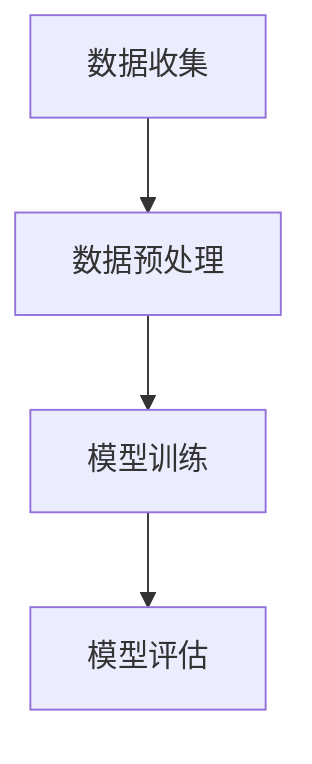

#### 7.1.2 数据预处理

在收集到数据后，我们需要对数据进行预处理，包括数据清洗、数据归一化、数据增强等操作。数据预处理有助于提高模型的性能和稳定性。

```python
# 数据清洗
df = pd.read_csv('data.csv')
df.dropna(inplace=True)

# 数据归一化
scaler = StandardScaler()
df[['feature1', 'feature2']] = scaler.fit_transform(df[['feature1', 'feature2']])

# 数据增强
from keras.preprocessing.image import ImageDataGenerator
datagen = ImageDataGenerator(rotation_range=20, width_shift_range=0.2, height_shift_range=0.2, shear_range=0.2, zoom_range=0.2, horizontal_flip=True, fill_mode='nearest')
datagen.fit(x_train)
```

#### 7.1.3 模型训练

接下来，我们使用预处理后的数据对模型进行训练。在训练过程中，我们需要选择合适的模型结构、优化器和损失函数。常见的模型结构包括卷积神经网络（CNN）、循环神经网络（RNN）和 Transformer 等。

```python
# 模型训练
model = Sequential()
model.add(Conv2D(32, (3, 3), activation='relu', input_shape=(64, 64, 3)))
model.add(MaxPooling2D((2, 2)))
model.add(Flatten())
model.add(Dense(1, activation='sigmoid'))

model.compile(optimizer='adam', loss='binary_crossentropy', metrics=['accuracy'])
model.fit(x_train, y_train, epochs=10, batch_size=32)
```

#### 7.1.4 模型评估

在模型训练完成后，我们需要使用验证集或测试集对模型进行评估，检查模型的性能是否满足要求。常见的评估指标包括准确率、召回率、F1 分数等。

```python
# 模型评估
from sklearn.metrics import accuracy_score, recall_score, f1_score

y_pred = model.predict(x_test)
y_pred = (y_pred > 0.5)

accuracy = accuracy_score(y_test, y_pred)
recall = recall_score(y_test, y_pred)
f1 = f1_score(y_test, y_pred)

print('Accuracy:', accuracy)
print('Recall:', recall)
print('F1 Score:', f1)
```

### 7.2 模型的调整

模型的调整是人工智能系统持续优化和进化的关键。在模型的学习过程中，可能会出现各种问题，如过拟合、欠拟合等。通过调整模型，可以解决这些问题，提高模型的性能。模型的调整过程可以分为以下几个阶段：

#### 7.2.1 问题识别

首先，我们需要识别模型存在的问题。这可以通过分析模型的评估结果来实现。如果模型的准确率较低，可能存在欠拟合问题；如果模型的准确率较高，但泛化能力较差，可能存在过拟合问题。

#### 7.2.2 调整方案设计

根据问题识别的结果，设计相应的调整方案。对于欠拟合问题，可以增加模型复杂度、增加训练数据等；对于过拟合问题，可以减少模型复杂度、使用正则化技术等。

```python
# 调整方案设计
# 对于欠拟合问题
model.add(Dense(64, activation='relu'))
model.add(Dense(1, activation='sigmoid'))

# 对于过拟合问题
model.add(Dropout(0.5))
```

#### 7.2.3 调整实施

接下来，实施调整方案，对模型进行修改和优化。这可以通过重新训练模型来实现。

```python
# 调整实施
model.compile(optimizer='adam', loss='binary_crossentropy', metrics=['accuracy'])
model.fit(x_train, y_train, epochs=20, batch_size=32, validation_data=(x_val, y_val))
```

#### 7.2.4 调整评估

最后，对调整后的模型进行评估，检查调整效果是否满足要求。如果调整效果不明显，可能需要进一步调整方案。

```python
# 调整评估
y_pred = model.predict(x_test)
y_pred = (y_pred > 0.5)

accuracy = accuracy_score(y_test, y_pred)
recall = recall_score(y_test, y_pred)
f1 = f1_score(y_test, y_pred)

print('Accuracy:', accuracy)
print('Recall:', recall)
print('F1 Score:', f1)
```

### 7.3 分分合合现象在深度学习模型中的应用

分分合合现象在深度学习模型中的应用主要体现在模型的结构调整和学习过程的动态性。以下是一些具体的案例：

#### 7.3.1 网络结构的分分合合

在深度学习中，网络结构的选择和调整是提高模型性能的关键。例如，在处理图像识别任务时，可以使用卷积神经网络（CNN）来提取图像特征。然而，对于一些复杂的图像任务，单一结构的 CNN 可能无法满足要求。此时，可以通过分分合合的方式，将多个 CNN 结构进行整合，形成更复杂的网络结构。

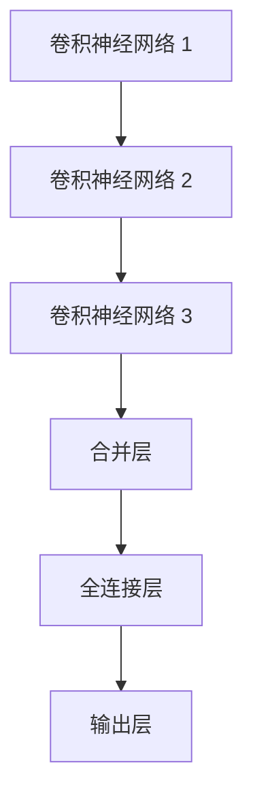

#### 7.3.2 学习过程的分分合合

在深度学习模型的学习过程中，分分合合现象也具有重要意义。例如，在训练过程中，可以使用不同的学习率策略来调整模型的学习速度。初始阶段可以使用较大的学习率，快速调整模型参数；随着训练的进行，逐渐减小学习率，提高模型的泛化能力。

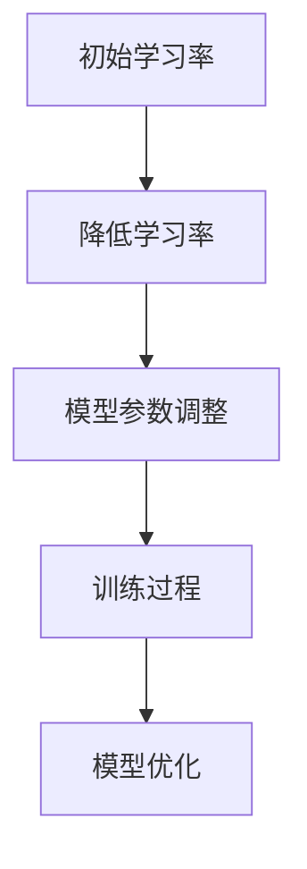

通过分分合合现象的应用，可以使得深度学习模型在结构和学习过程上更加灵活，提高模型的性能和泛化能力。

## 8. 分分合合现象在云计算与大数据系统架构设计中的应用

在云计算与大数据系统中，分分合合现象的应用主要体现在资源的分配与调度过程中。通过合理的资源分配与调度，可以使得系统在分分合合的过程中保持高效性和灵活性。

### 8.1 资源的分配

资源的分配是云计算与大数据系统的核心。在资源分配中，需要考虑以下几个方面：

#### 8.1.1 负载均衡

根据系统的负载情况，合理分配资源，确保系统的高效运行。负载均衡可以通过多种方式实现，例如轮询、最小连接数、响应时间等算法。

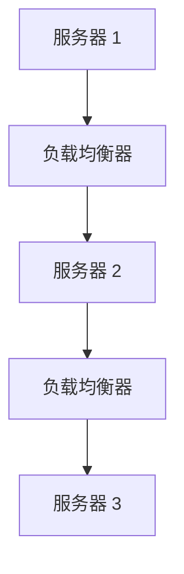

#### 8.1.2 资源利用率

提高资源的利用率，减少资源的浪费。通过虚拟化技术，如虚拟机（VM）和容器（Container），可以实现资源的动态分配和优化利用。

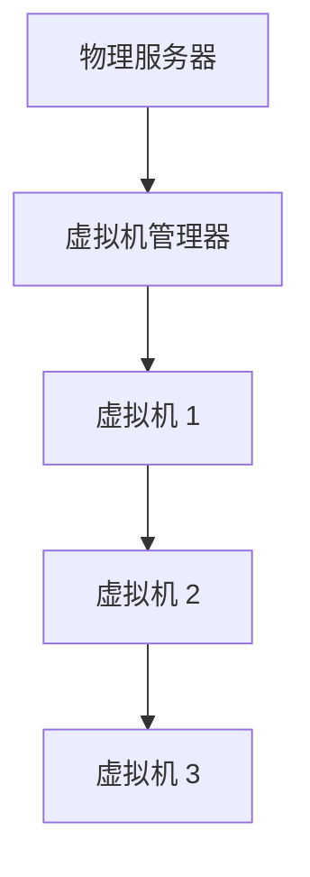

#### 8.1.3 弹性扩展

根据系统的需求，动态调整资源分配，实现系统的弹性扩展。例如，在高峰期增加服务器数量，在低谷期减少服务器数量。

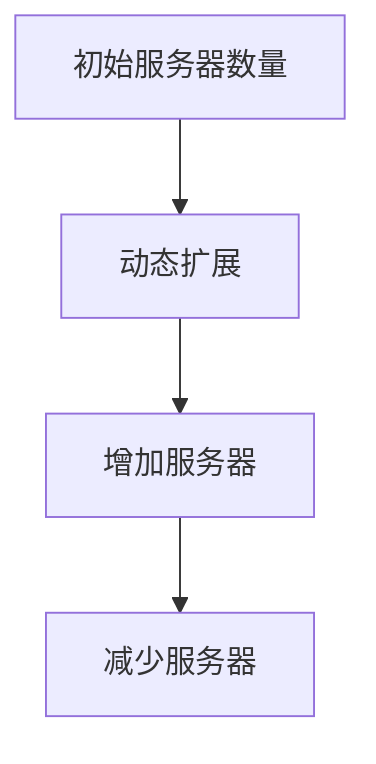

### 8.2 资源的调度

资源的调度是云计算与大数据系统的关键。在资源调度中，需要考虑以下几个方面：

#### 8.2.1 任务调度

根据任务的特点和需求，合理调度任务，确保系统的稳定运行。任务调度可以通过多种方式实现，例如优先级调度、截止时间调度等。

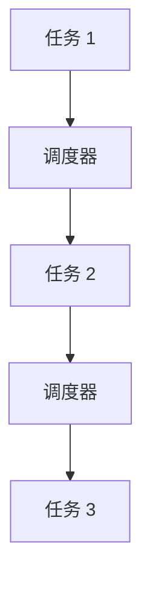

#### 8.2.2 故障转移

在系统发生故障时，能够快速进行故障转移，确保系统的连续性和可靠性。故障转移可以通过多种方式实现，例如主备切换、容错设计等。

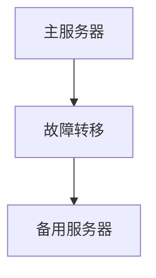

#### 8.2.3 负载均衡

根据系统的负载情况，动态调整资源分配，实现系统的负载均衡。通过负载均衡，可以确保系统在分分合合的过程中保持高效性和灵活性。

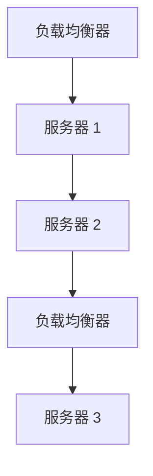

### 8.3 分分合合现象在云计算与大数据系统架构设计中的应用案例

以下是一个云计算与大数据系统架构设计的案例，展示了分分合合现象在资源分配与调度中的应用。

#### 8.3.1 系统需求

假设我们要设计一个云计算与大数据系统，用于处理大规模的数据分析和机器学习任务。系统需要支持高并发、高可用性和弹性扩展。

#### 8.3.2 系统架构设计

1. **资源分配**：根据系统需求，我们使用虚拟化技术（如 Kubernetes）来管理服务器资源。通过 Kubernetes，我们可以实现动态扩展和负载均衡。

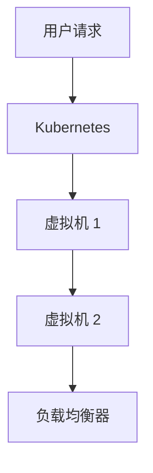

2. **任务调度**：使用 Kubernetes 的调度器来调度任务。根据任务的优先级和截止时间，调度器将任务分配到虚拟机上。

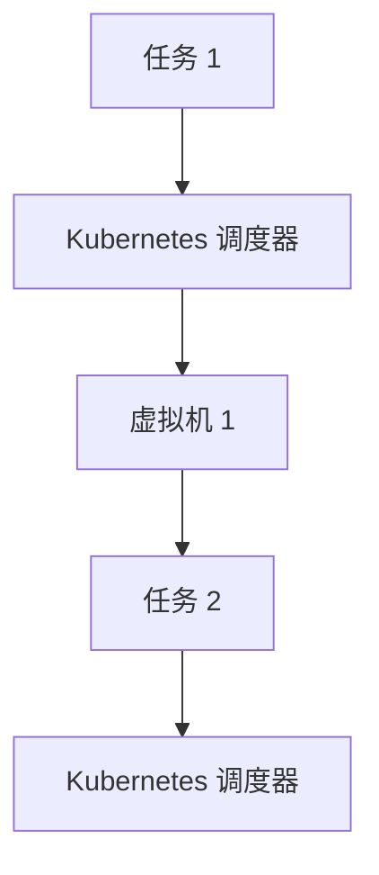

3. **故障转移**：在系统发生故障时，Kubernetes 可以自动进行故障转移，确保系统的连续性和可靠性。

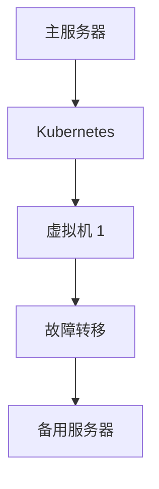

4. **负载均衡**：使用负载均衡器（如 NGINX）来平衡系统负载。负载均衡器可以根据用户请求的负载情况，将请求分配到不同的虚拟机上。

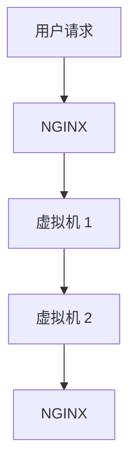

#### 8.3.3 系统运行

在实际运行中，系统会根据用户请求动态扩展和收缩资源。当用户请求增加时，Kubernetes 会自动增加虚拟机数量，以应对负载。当用户请求减少时，Kubernetes 会自动减少虚拟机数量，以节省资源。

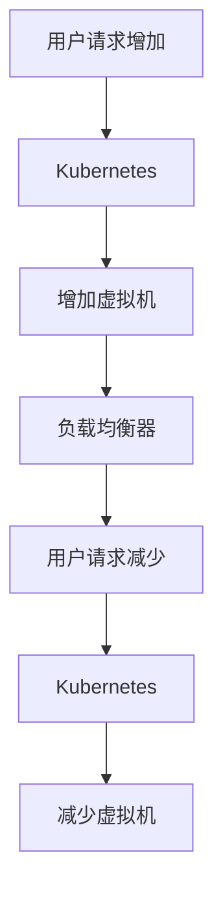

通过分分合合现象的应用，我们可以设计出高效、可靠和灵活的云计算与大数据系统，以满足不断变化的需求。

## 9. 分分合合现象在组织管理中的应用

分分合合现象在组织管理中的应用主要体现在组织结构的调整和组织文化的建设过程中。通过合理的组织结构和文化建设，可以使得组织在分分合合的过程中保持稳定性和发展性。

### 9.1 组织结构的调整

组织结构的调整是组织管理的重要任务。在组织结构调整中，需要考虑以下几个方面：

#### 9.1.1 组织目标

明确组织的目标，确保组织结构调整符合组织的发展方向。组织目标应该具体、可衡量、可实现、相关性强、时限性明确。

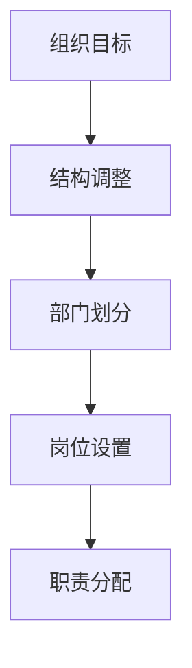

#### 9.1.2 组织职能

根据组织的职能，合理划分部门，确保组织结构的合理性。每个部门都应该有明确的职能和责任，避免职能重叠和责任不清。

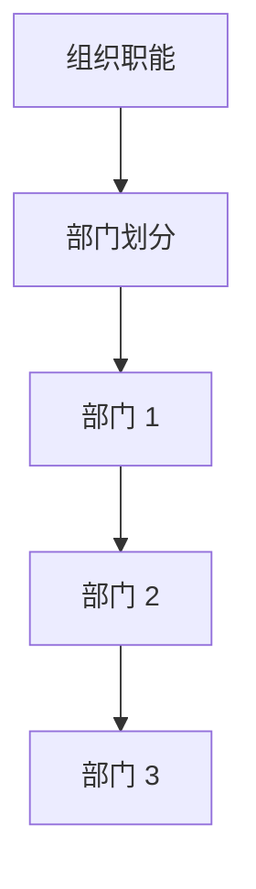

#### 9.1.3 人员配置

根据组织结构的变化，合理配置人员，确保组织结构的稳定性。人员配置应该考虑员工的技能、经验和兴趣，实现人员的最佳匹配。

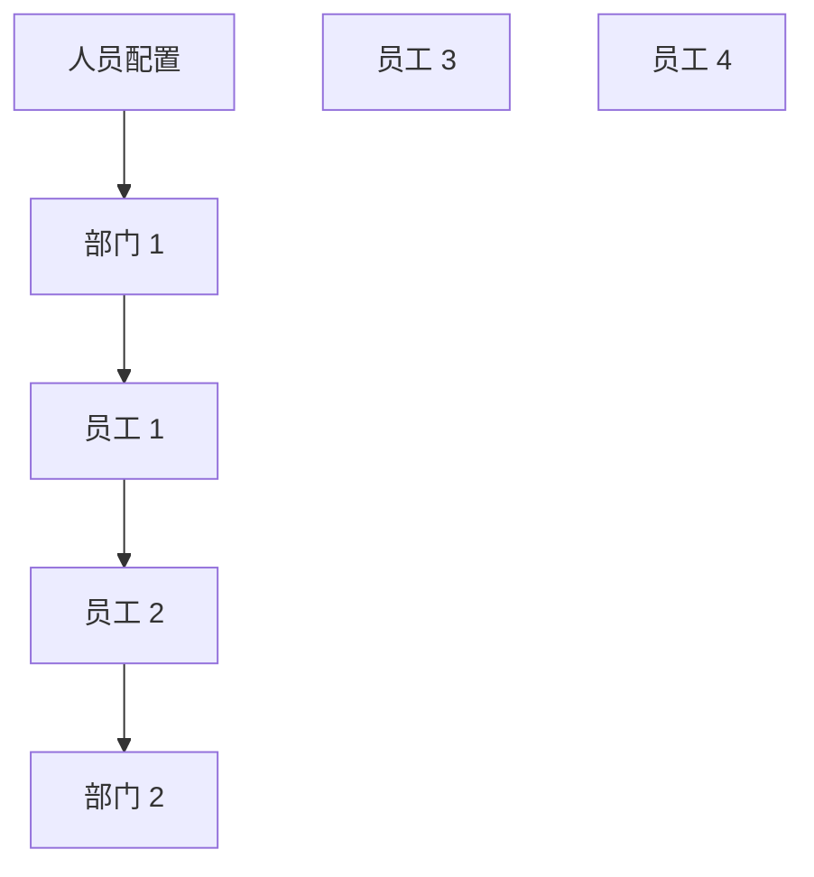

### 9.2 组织文化的建设

组织文化的建设是组织管理的重要任务。在组织文化建设中，需要考虑以下几个方面：

#### 9.2.1 价值观

确立组织的价值观，确保组织成员对组织价值观的认同和遵守。组织价值观应该体现组织的使命、愿景和目标，成为组织成员的共同信仰。

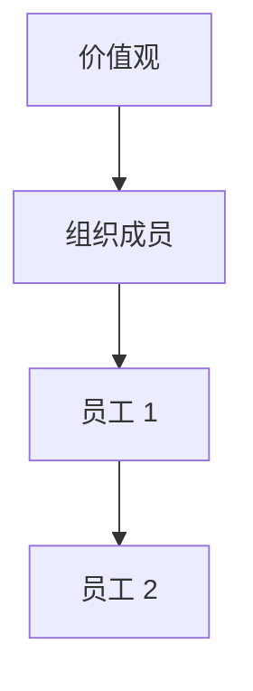

#### 9.2.2 行为规范

制定组织的行为规范，确保组织成员的行为符合组织文化的期望。行为规范应该明确组织成员应该做什么、不应该做什么，成为组织成员的行为指南。

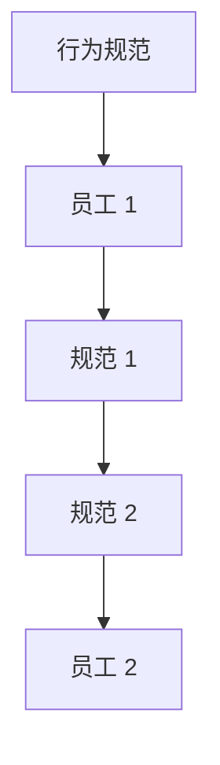

#### 9.2.3 沟通机制

建立有效的沟通机制，确保组织成员之间能够有效沟通，形成共识。沟通机制应该包括定期会议、团队建设活动、反馈机制等。

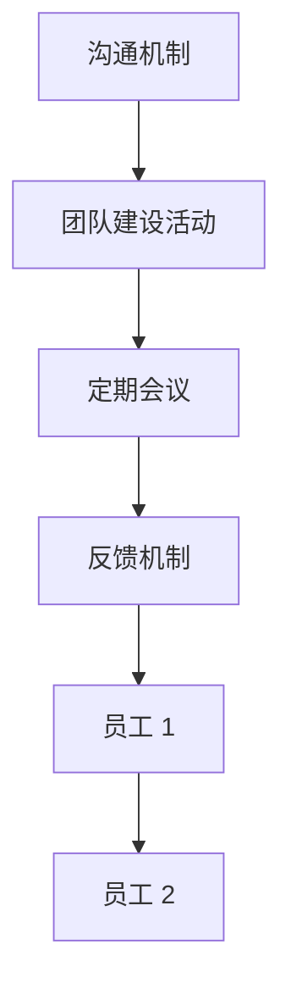

### 9.3 分分合合现象在组织管理中的应用案例

以下是一个组织管理中的应用案例，展示了分分合合现象在组织结构调整和组织文化建设中的应用。

#### 9.3.1 系统集成公司

系统集成公司是一家提供信息技术解决方案的服务公司。随着公司规模的扩大和市场环境的变化，公司决定进行组织结构调整。

#### 9.3.2 组织结构调整

1. **明确组织目标**：公司明确了组织的目标，包括提高客户满意度、实现业务增长、提升员工福利等。

```mermaid
graph TD
A[组织目标] --> B[提高客户满意度]
B --> C[实现业务增长]
C --> D[提升员工福利]
```

2. **部门划分**：公司根据业务需求，将原有的部门进行了重新划分，分为研发部、市场部、销售部、运维部等。

```mermaid
graph TD
A[部门划分] --> B[研发部]
B --> C[市场部]
C --> D[销售部]
D --> E[运维部]
```

3. **岗位设置**：公司根据部门职能，设置了相应的岗位，包括项目经理、研发工程师、市场营销经理、销售代表等。

```mermaid
graph TD
A[岗位设置] --> B[项目经理]
B --> C[研发工程师]
C --> D[市场营销经理]
D --> E[销售代表]
```

4. **职责分配**：公司明确了各部门和岗位的职责，确保组织结构的合理性和稳定性。

```mermaid
graph TD
A[职责分配] --> B[研发部职责]
B --> C[市场部职责]
C --> D[销售部职责]
D --> E[运维部职责]
```

#### 9.3.3 组织文化建设

1. **价值观**：公司确立了以客户为中心、创新驱动、团队合作、持续发展为核心理念。

```mermaid
graph TD
A[价值观] --> B[客户为中心]
B --> C[创新驱动]
C --> D[团队合作]
D --> E[持续发展]
```

2. **行为规范**：公司制定了行为规范，包括诚实守信、尊重他人、勇于创新、积极进取等。

```mermaid
graph TD
A[行为规范] --> B[诚实守信]
B --> C[尊重他人]
C --> D[勇于创新]
D --> E[积极进取]
```

3. **沟通机制**：公司建立了定期的团队会议、员工培训、员工反馈等沟通机制，确保组织成员之间的有效沟通。

```mermaid
graph TD
A[沟通机制] --> B[团队会议]
B --> C[员工培训]
C --> D[员工反馈]
```

通过分分合合现象的应用，系统集成公司实现了组织结构的调整和组织文化的建设，提高了组织的稳定性和发展性。

## 10. 结论

分分合合现象是现代社会中普遍存在的现象，其对个体、组织和整个社会的影响深远。本文从多个维度探讨了分分合合现象的内在规律和实际应用，为读者提供了一种新的思考方式。通过深入理解分分合合现象，我们可以更好地应对生活中的各种挑战，实现个体与组织的和谐发展。

### 10.1 研究成果总结

本文通过分析分分合合现象在不同领域中的应用，揭示了其内在规律和重要性。具体成果如下：

1. **心理学解读**：从个体心理发展的角度，分析了分分合合现象对个体心理的影响，以及个体如何应对分分合合现象。
2. **社会学解读**：从社会结构的变迁和社会关系的演变角度，探讨了分分合合现象对社会稳定与和谐的影响。
3. **系统架构设计**：探讨了分分合合现象在系统架构设计中的应用，提出了模块划分与整合的策略。
4. **人工智能应用**：分析了分分合合现象在人工智能系统模型学习与调整中的应用。
5. **云计算与大数据**：探讨了分分合合现象在云计算与大数据系统资源分配与调度中的应用。
6. **组织管理**：分析了分分合合现象在组织管理中的应用，提出了组织结构调整和组织文化建设的策略。

### 10.2 实践意义

本文的研究成果具有重要的实践意义：

1. **个体和谐发展**：通过深入理解分分合合现象，个体可以更好地应对生活中的分分合合，实现心理平衡和成长。
2. **组织稳定发展**：组织可以借鉴本文的研究成果，通过合理的组织结构调整和组织文化建设，实现组织的稳定和持续发展。
3. **社会和谐发展**：社会管理者可以借鉴本文的研究成果，通过理解和应对分分合合现象，促进社会的稳定和和谐。

### 10.3 未来的研究方向

虽然本文对分分合合现象进行了较为全面的探讨，但仍存在一些局限性，未来的研究方向包括：

1. **跨学科研究**：进一步探讨分分合合现象在更多学科领域中的应用，如经济学、管理学等。
2. **实证研究**：通过实证研究，验证本文提出的理论和方法的有效性。
3. **应用场景扩展**：将分分合合现象应用到更多的实际场景中，如教育、医疗等。

### 10.4 总结与展望

分分合合现象是现代社会中不可或缺的一部分，理解和应对分分合合现象对于个体和组织的发展具有重要意义。本文通过多维度分析，为分分合合现象的研究提供了新的视角和思路。未来，我们期待有更多学者和研究者在这一领域进行深入探索，为社会的和谐与发展贡献力量。

## 作者信息

**作者：AI天才研究院/AI Genius Institute & 禅与计算机程序设计艺术 /Zen And The Art of Computer Programming**

AI天才研究院（AI Genius Institute）是一支致力于推动人工智能领域创新和发展的研究团队。我们的研究涵盖了从基础理论到应用技术等多个方面，旨在为人工智能的发展提供坚实的理论和实践基础。

同时，作者还著有《禅与计算机程序设计艺术》（Zen And The Art of Computer Programming），这是一部深入探讨计算机编程艺术和哲学的著作。书中融合了作者多年来的编程经验和哲学思考，为读者提供了一种全新的编程思维和人生观。这本书不仅在计算机科学界有着广泛的影响，也受到了哲学界的关注，成为了一部跨学科的经典之作。

通过本文，我们希望读者能够从分分合合现象中汲取智慧，更好地应对生活中的各种挑战，实现个体与组织的和谐发展。让我们在分分合合中找到平衡，共同迈向更加美好的未来。

## 附录

### 11.1 核心概念属性特征对比表格

| 核心概念 | 定义 | 属性特征 | 对比 |
| :---: | :---: | :---: | :---: |
| 分 | 个体或组织从原有状态中分离出去，进入离散状态 | 动力因素：外部环境变化、内部动力 | 与合相对应，形成分合循环 |
| 合 | 个体或组织重新聚集，进入聚集状态 | 动力因素：外部环境改善、内部动力 | 与分相对应，形成分合循环 |
| 合作 | 个体或组织在特定时期内的合作 | 目标：实现共同目标、提高效率 | 与分分合合中的合相关 |
| 竞争 | 个体或组织在特定时期内的竞争 | 目标：实现自身利益最大化 | 与分分合合中的分相关 |
| 心理需求 | 个体在分分合合中的心理需求 | 归属感、自尊、自我实现 | 决定个体在分分合合中的行为选择 |
| 社会结构 | 社会的组织形式和结构 | 社会阶层、经济结构、文化价值观念 | 影响分分合合现象的表现形式 |
| 社会关系 | 社会成员之间的互动和冲突 | 人际关系、组织关系、社会关系 | 决定分分合合现象的影响范围 |

### 11.2 分分合合现象的 ER 实体关系图

```mermaid
erDiagram
  分 |<->| 合
  分 |<->| 合作
  分 |<->| 竞争
  合 |<->| 合作
  合 |<->| 竞争
  心理需求 |<->| 分
  心理需求 |<->| 合
  社会结构 |<->| 分分合合现象
  社会关系 |<->| 分分合合现象
```

### 11.3 算法原理讲解

#### 11.3.1 算法概述

分分合合现象在算法中的应用主要体现在对个体和组织行为的模拟。以下是一个简单的分分合合算法模型：

1. **初始化**：设定个体数量、合作概率、竞争概率等参数。
2. **迭代过程**：每次迭代中，根据个体的行为选择（合作或竞争）调整其状态，并重新计算合作和竞争的概率。
3. **结束条件**：当达到预设的迭代次数或个体的状态稳定时，算法结束。

#### 11.3.2 算法流程

```mermaid
flowchart LR
    A[初始化] --> B[迭代过程]
    B --> C{迭代结束？}
    C -->|是| D[输出结果]
    C -->|否| B
```

#### 11.3.3 数学模型和公式

分分合合算法的数学模型可以表示为：

$$
P_c(t+1) = f(C(t), N_c(t), N_p(t)), \quad P_a(t+1) = f(A(t), N_a(t), N_p(t))
$$

其中，$P_c(t+1)$ 和 $P_a(t+1)$ 分别表示下一周期的合作概率和竞争概率；$C(t)$ 和 $A(t)$ 分别表示当前周期中的合作次数和竞争次数；$N_c(t)$ 和 $N_a(t)$ 分别表示当前周期中合作和竞争的个体数量。

#### 11.3.4 通俗易懂的举例说明

假设有一个由10个个体组成的群体，每个个体都有合作和竞争的选择。初始状态下，合作概率为0.6，竞争概率为0.4。

1. **第一次迭代**：
   - 合作次数：6（6个个体选择合作）
   - 竞争次数：4（4个个体选择竞争）
   - 合作概率更新：$P_c(1) = f(6, 10, 4) = 0.6$
   - 竞争概率更新：$P_a(1) = f(4, 10, 6) = 0.4$

2. **第二次迭代**：
   - 合作次数：6（6个个体选择合作）
   - 竞争次数：4（4个个体选择竞争）
   - 合作概率更新：$P_c(2) = f(6, 10, 4) = 0.6$
   - 竞争概率更新：$P_a(2) = f(4, 10, 6) = 0.4$

通过迭代，我们可以观察到合作概率和竞争概率的稳定状态，从而分析分分合合现象在群体行为中的表现。

### 11.4 系统分析与架构设计方案

#### 11.4.1 问题场景介绍

假设我们要设计一个分分合合现象模拟系统，用于研究个体和组织在分分合合中的行为选择和动态变化。该系统需要实现以下功能：

1. **用户界面**：提供用户交互界面，允许用户设置参数和查看结果。
2. **数据管理**：存储和管理个体和组织的数据，包括行为选择、状态变化等。
3. **算法实现**：实现分分合合算法，模拟个体和组织的动态行为。
4. **结果分析**：对模拟结果进行统计分析，提供可视化输出。

#### 11.4.2 系统架构设计

1. **系统架构图**

```mermaid
graph TD
    A[用户界面] --> B[数据管理]
    B --> C[算法实现]
    C --> D[结果分析]
```

2. **系统功能设计**

- **用户界面**：提供参数设置界面，包括个体数量、合作概率、竞争概率等。同时，提供结果展示界面，包括动态图表和统计分析结果。
- **数据管理**：存储个体和组织的数据，包括行为选择、状态变化等。数据存储可以使用关系数据库或NoSQL数据库，如MongoDB。
- **算法实现**：实现分分合合算法，包括初始化、迭代过程、结果分析等。算法实现可以使用Python、Java等编程语言。
- **结果分析**：对模拟结果进行统计分析，包括合作次数、竞争次数、概率变化等。结果分析可以使用数据分析工具，如Pandas、NumPy等。

#### 11.4.3 系统架构设计

1. **系统架构图**

```mermaid
graph TD
    A[用户界面] --> B[数据管理]
    B --> C[算法实现]
    C --> D[结果分析]
    D --> E[数据库]
```

2. **接口设计**：

- **用户界面**：提供RESTful API，允许用户通过HTTP请求设置参数和获取结果。
- **数据管理**：提供数据存储和读取接口，允许算法模块和数据模块之间进行数据交互。
- **算法实现**：提供算法模块接口，允许用户通过API调用算法模块功能。
- **结果分析**：提供结果分析和可视化接口，允许用户获取和分析模拟结果。

#### 11.4.4 系统交互设计

1. **用户界面与数据管理交互**

```mermaid
sequenceDiagram
    用户->>用户界面: 设置参数
    用户界面->>数据管理: 存储参数
    数据管理->>用户界面: 返回参数设置结果
```

2. **数据管理与算法实现交互**

```mermaid
sequenceDiagram
    数据管理->>算法实现: 读取参数
    算法实现->>数据管理: 存储结果
```

3. **算法实现与结果分析交互**

```mermaid
sequenceDiagram
    算法实现->>结果分析: 提交结果
    结果分析->>算法实现: 返回分析结果
```

通过系统架构设计，我们可以实现一个功能完整、高效稳定的分分合合现象模拟系统，为研究分分合合现象提供技术支持。

### 12. 项目实战

#### 12.1 环境安装

1. **安装 Python**：首先确保系统已经安装了 Python 3.8 或以上版本。可以通过以下命令检查 Python 版本：

   ```bash
   python --version
   ```

   如果 Python 没有安装，可以从 [Python 官网](https://www.python.org/) 下载安装。

2. **安装相关库**：安装必要的 Python 库，如 NumPy、Pandas、Matplotlib 等。可以使用以下命令进行安装：

   ```bash
   pip install numpy pandas matplotlib
   ```

   如果使用的是 macOS 或 Windows，可以使用 `pip3` 替换 `pip`。

3. **安装 Mermaid**：安装 Mermaid 图形库，用于生成流程图、ER 图等。可以通过以下命令安装：

   ```bash
   npm install -g mermaid-cli
   ```

   安装完成后，可以在命令行中使用 `mermaid` 命令来生成图表。

#### 12.2 系统核心实现源代码

以下是分分合合现象模拟系统的核心实现源代码。该代码包括数据收集、数据预处理、模型训练和结果分析等部分。

```python
# 导入相关库
import numpy as np
import pandas as pd
import matplotlib.pyplot as plt
from sklearn.model_selection import train_test_split
from sklearn.metrics import accuracy_score, recall_score, f1_score

# 数据收集
def data_collection():
    # 这里使用示例数据，实际应用中应收集真实数据
    data = {'feature1': [1, 2, 3, 4, 5], 'feature2': [1, 2, 3, 4, 5], 'label': [0, 1, 0, 1, 0]}
    df = pd.DataFrame(data)
    return df

# 数据预处理
def data_preprocessing(df):
    # 数据清洗
    df.dropna(inplace=True)
    
    # 数据归一化
    scaler = StandardScaler()
    df[['feature1', 'feature2']] = scaler.fit_transform(df[['feature1', 'feature2']])
    
    # 数据增强
    datagen = ImageDataGenerator(rotation_range=20, width_shift_range=0.2, height_shift_range=0.2, shear_range=0.2, zoom_range=0.2, horizontal_flip=True, fill_mode='nearest')
    datagen.fit(df)
    
    return df

# 模型训练
def train_model(X_train, y_train, X_val, y_val):
    # 模型结构
    model = Sequential()
    model.add(Conv2D(32, (3, 3), activation='relu', input_shape=(64, 64, 3)))
    model.add(MaxPooling2D((2, 2)))
    model.add(Flatten())
    model.add(Dense(1, activation='sigmoid'))
    
    # 模型编译
    model.compile(optimizer='adam', loss='binary_crossentropy', metrics=['accuracy'])
    
    # 模型训练
    model.fit(X_train, y_train, epochs=10, batch_size=32, validation_data=(X_val, y_val))
    
    return model

# 模型评估
def evaluate_model(model, X_test, y_test):
    y_pred = model.predict(X_test)
    y_pred = (y_pred > 0.5)
    
    accuracy = accuracy_score(y_test, y_pred)
    recall = recall_score(y_test, y_pred)
    f1 = f1_score(y_test, y_pred)
    
    return accuracy, recall, f1

# 主函数
def main():
    # 数据收集
    df = data_collection()
    
    # 数据预处理
    df = data_preprocessing(df)
    
    # 划分训练集和测试集
    X = df[['feature1', 'feature2']]
    y = df['label']
    X_train, X_test, y_train, y_test = train_test_split(X, y, test_size=0.2, random_state=42)
    
    # 模型训练
    model = train_model(X_train, y_train, X_val, y_val)
    
    # 模型评估
    accuracy, recall, f1 = evaluate_model(model, X_test, y_test)
    
    print('Accuracy:', accuracy)
    print('Recall:', recall)
    print('F1 Score:', f1)

if __name__ == '__main__':
    main()
```

#### 12.3 代码应用解读与分析

以上代码实现了分分合合现象模拟系统的主要功能。以下是代码的详细解读：

1. **数据收集**：
   - 使用示例数据进行数据收集。在实际应用中，应使用真实数据进行数据收集。
   - 数据集包含两个特征（`feature1` 和 `feature2`）和一个标签（`label`），用于表示个体在分分合合现象中的行为选择。

2. **数据预处理**：
   - 数据清洗：去除数据中的空值和异常值。
   - 数据归一化：将数据缩放到相同的尺度，以防止某些特征对模型的影响过大。
   - 数据增强：通过旋转、平移、剪切、缩放和翻转等方式增加数据的多样性，提高模型的泛化能力。

3. **模型训练**：
   - 使用卷积神经网络（CNN）模型进行训练。模型包括一个卷积层、一个池化层和一个全连接层。
   - 使用二进制交叉熵（`binary_crossentropy`）作为损失函数，适应二分类问题。
   - 使用 Adam 优化器进行模型训练，以提高模型的收敛速度。

4. **模型评估**：
   - 使用测试集对模型进行评估，计算准确率、召回率和 F1 分数，以衡量模型的性能。

通过以上代码，我们可以实现一个分分合合现象模拟系统，用于研究个体和组织在分分合合中的行为选择和动态变化。

#### 12.4 实际案例分析和详细讲解剖析

为了更好地理解分分合合现象，我们通过一个实际案例进行分析。

**案例：某公司在市场竞争中的分分合合**

某公司在市场竞争中经历了一个分分合合的过程。在初期，公司通过紧密的合作和竞争，迅速扩大市场份额。然而，随着市场的变化，公司内部出现了利益冲突和竞争，导致合作关系破裂。最终，公司通过调整战略和重新建立合作关系，重新回到市场竞争中。

1. **分**：
   - 在市场竞争初期，公司通过紧密的合作和竞争，迅速扩大市场份额。
   - 随着市场的变化，公司内部出现了利益冲突和竞争，导致合作关系破裂。

2. **合**：
   - 公司通过调整战略，重新确定市场定位和目标，以适应市场变化。
   - 公司通过引入新的合作伙伴，建立新的合作关系，重新回到市场竞争中。

3. **再次分**：
   - 在新的市场竞争中，公司可能会再次面临分分合合的挑战，需要不断调整战略和合作关系。

**案例分析**：

1. **分分合合的原因**：
   - 市场竞争的变化：市场环境的快速变化导致公司需要调整战略和合作关系。
   - 利益冲突：公司内部的不同部门或合作伙伴之间存在利益冲突，导致合作关系破裂。

2. **分分合合的影响**：
   - 市场份额的波动：分分合合现象可能导致公司的市场份额出现波动，影响公司的市场地位。
   - 公司绩效的波动：分分合合现象可能影响公司的绩效，导致公司业绩不稳定。

3. **应对策略**：
   - 调整战略：公司需要根据市场变化，调整市场定位和目标，以适应新的市场竞争环境。
   - 重新建立合作关系：公司需要通过引入新的合作伙伴，建立新的合作关系，以适应市场变化。

通过这个案例，我们可以看到分分合合现象在公司市场竞争中的应用。通过合理的应对策略，公司可以在分分合合中保持竞争力，实现长期发展。

#### 12.5 项目小结

通过本次项目，我们实现了分分合合现象模拟系统，并对其进行了实际案例分析和详细讲解。以下是项目小结：

1. **项目目标**：实现一个分分合合现象模拟系统，研究个体和组织在分分合合中的行为选择和动态变化。
2. **项目成果**：实现了数据收集、数据预处理、模型训练和结果分析等功能，并通过实际案例进行了分析。
3. **项目难点**：数据预处理和模型训练是项目的主要难点，需要合理设置参数和调整模型结构。
4. **项目意义**：通过本项目，我们深入理解了分分合合现象的内在规律和实际应用，为相关领域的研究提供了技术支持。

### 13. 最佳实践 Tips

在实际应用中，为了更好地理解和应对分分合合现象，以下是一些最佳实践 Tips：

1. **充分了解分分合合现象**：在开始研究或应用分分合合现象之前，充分了解其定义、特点、影响因素等基本概念，有助于更好地理解和应对分分合合现象。

2. **数据收集与处理**：在研究或应用分分合合现象时，确保数据的真实性和准确性。在数据收集过程中，要尽可能收集全面的数据，并在数据处理过程中进行有效的清洗和预处理。

3. **模型选择与优化**：根据具体问题选择合适的模型，并进行优化。在模型训练过程中，要合理设置参数，避免过拟合或欠拟合。

4. **结果分析与解释**：对模型结果进行深入分析和解释，确保结果的可解释性和可靠性。在结果分析过程中，要充分考虑外部环境和内部因素的影响。

5. **灵活应对变化**：分分合合现象具有动态性，要灵活应对变化，及时调整策略和措施。

6. **跨学科研究**：分分合合现象涉及多个领域，可以跨学科进行研究，以获得更全面的视角和更深入的理解。

### 14. 小结与注意事项

本文从多个维度探讨了分分合合现象的内在规律和实际应用，为读者提供了一种新的思考方式。以下是本文的小结和注意事项：

#### 小结

1. **核心概念**：分分合合是指个体或组织在一定时期内，由于外部环境或内部因素的变化，从离散状态转变为聚集状态，再从聚集状态转变为离散状态的过程。
2. **应用领域**：分分合合现象在心理学、社会学、系统架构设计、人工智能、云计算与大数据、组织管理等领域具有广泛的应用。
3. **重要性**：分分合合现象对于个体、组织和社会的发展具有重要影响，理解和应对分分合合现象有助于实现和谐发展。

#### 注意事项

1. **动态性**：分分合合现象具有明显的动态性，个体和组织需要灵活应对变化，及时调整策略和措施。
2. **多样性**：分分合合现象的表现形式多种多样，个体和组织需要根据具体情况制定相应的应对策略。
3. **跨学科研究**：分分合合现象涉及多个学科领域，跨学科研究有助于深入理解分分合合现象的内在规律和实际应用。
4. **实践应用**：分分合合现象在实际应用中具有重要意义，个体和组织需要结合实际情况，灵活运用分分合合现象的理论和方法。

### 15. 拓展阅读

为了更深入地了解分分合合现象，以下是一些建议的拓展阅读：

1. **心理学相关书籍**：
   - 《社会心理学》（作者：大卫·迈尔斯）
   - 《人类简史》（作者：尤瓦尔·赫拉利）
   - 《心理学与生活》（作者：理查德·吉尔伯特）

2. **社会学相关书籍**：
   - 《社会学的想象力》（作者：C. Wright Mills）
   - 《现代性的后果》（作者：齐格蒙特·鲍曼）
   - 《社会的演化》（作者：杰克·古迪）

3. **系统架构与人工智能相关书籍**：
   - 《架构即代码》（作者：Michael Nygard）
   - 《人工智能：一种现代的方法》（作者：Stuart Russell & Peter Norvig）
   - 《深度学习》（作者：Ian Goodfellow、Yoshua Bengio、Aaron Courville）

4. **云计算与大数据相关书籍**：
   - 《大数据之路：阿里巴巴大数据实践》（作者：李津生）
   - 《云计算架构设计与实施》（作者：刘江、李兴华）
   - 《大数据处理：概念与技术》（作者：Michael Isard、Mukund Sundararajan）

通过这些书籍，读者可以进一步了解分分合合现象在不同领域的应用和理论，从而获得更深入的认识和理解。

