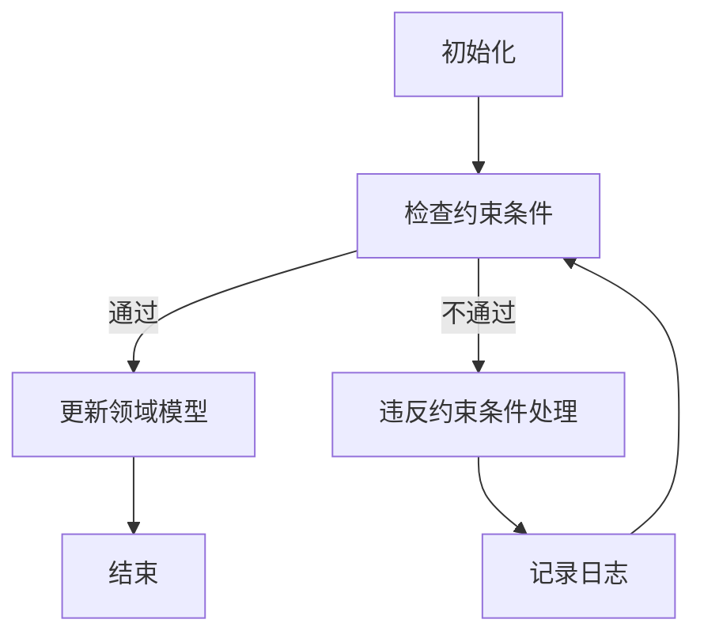

                 

## 《分分合合，却能浑然一体的领域模型》

### 关键词：领域模型、分合方式、一致性、模块化、可扩展性、算法原理、项目实战、最佳实践

> 摘要：本文旨在深入探讨领域模型的设计与应用，分析其核心概念、算法原理以及在不同场景下的实现方式。通过实例和实战，展示领域模型的实际应用效果，并总结最佳实践，以期为读者提供全面的领域模型设计与实现指南。

### 第一部分：领域模型的背景与核心概念

#### 1.1 领域模型概述

领域模型（Domain Model）是一种用于描述业务领域概念及其关系的抽象模型。在软件开发过程中，领域模型有助于开发者更好地理解业务需求，从而设计出更符合实际业务场景的软件系统。

#### 1.1.1 问题背景

随着业务需求的不断变化，软件开发项目面临着诸多挑战，如需求变更频繁、项目进度延误、开发成本增加等。这些问题往往源于对业务领域的理解不够深入，导致系统设计偏离实际需求。领域模型的出现，旨在解决这一难题。

#### 1.1.2 领域模型定义

领域模型是一种用于描述特定业务领域的概念、规则和关系的抽象模型。它通过将业务领域的核心概念、属性和行为进行建模，形成一个完整、一致、可扩展的模型体系。

#### 1.1.3 领域模型的重要性

领域模型在软件开发过程中具有重要意义。它有助于：

1. **明确业务领域：** 领域模型将业务领域的核心概念、属性和行为进行抽象，有助于开发者更好地理解业务需求。
2. **优化系统设计：** 领域模型为系统设计提供了明确的指导和参考，有助于提高系统设计的质量。
3. **降低开发成本：** 领域模型可减少需求变更对项目进度和成本的影响，提高开发效率。

#### 1.2 领域模型的核心概念

领域模型的核心概念包括实体、属性、关系和操作等。

##### 1.2.1 实体（Entity）

实体是领域模型中最基本的构成要素，表示业务领域中的具体对象。例如，在电子商务系统中，用户、商品、订单等都是实体。

##### 1.2.2 属性（Attribute）

属性描述实体的特征，用于表示实体的状态。例如，在用户实体中，用户名、密码、邮箱等都是属性。

##### 1.2.3 关系（Relationship）

关系描述实体之间的关联。例如，在电子商务系统中，用户可以购买多个商品，商品可以属于多个用户。

##### 1.2.4 操作（Operation）

操作定义实体可以执行的行为。例如，在用户实体中，用户可以登录、注册、修改密码等。

#### 1.2.4 概念属性特征对比表

| 概念 | 特征 |
| ---- | ---- |
| 实体 | 具体对象，如用户、商品、订单等 |
| 属性 | 描述实体特征，如用户名、密码、邮箱等 |
| 关系 | 描述实体关联，如用户购买商品、商品属于用户等 |
| 操作 | 定义实体行为，如登录、注册、修改密码等 |

#### 1.2.5 领域模型ER图

领域模型ER图是一种用于表示实体和关系之间的联系的工具。以下是一个简单的领域模型ER图：

```mermaid
erDiagram
    用户 ||--|{ 订单 } : "下订单"
    商品 ||--|{ 订单 } : "购买商品"
```

#### 1.3 领域模型的不同实现方式

领域模型有多种实现方式，如分合方式、组件化方式等。本文主要介绍分合方式的优缺点及其适用场景。

##### 1.3.1 分合方式的概述

分合方式是指将领域模型按照业务模块进行拆分和整合。在开发过程中，根据项目需求，将部分领域模型进行合并，以实现系统的高内聚和低耦合。

##### 1.3.2 分合方式的优缺点

- **优点：**
  - **高内聚：** 分合方式能够提高领域模型的内聚性，使系统模块化更加清晰。
  - **低耦合：** 分合方式能够降低模块之间的耦合度，提高系统的可维护性。

- **缺点：**
  - **开发难度：** 分合方式需要开发者具备较高的抽象能力和系统设计能力。
  - **性能影响：** 在某些场景下，分合方式可能会对系统性能产生一定影响。

##### 1.3.3 分合方式的适用场景

分合方式适用于以下场景：

- **业务复杂度高：** 当业务领域复杂度较高时，分合方式有助于降低系统复杂性。
- **模块独立性要求高：** 当系统模块独立性要求较高时，分合方式能够提高系统的可维护性和可扩展性。

#### 1.4 领域模型的设计原则

为了确保领域模型的质量和可维护性，设计领域模型时需要遵循以下原则：

##### 1.4.1 一致性原则

一致性原则要求领域模型中的各个部分（实体、属性、关系等）保持一致，避免出现矛盾和冲突。

##### 1.4.2 模块化原则

模块化原则要求领域模型按照业务模块进行拆分，提高系统的可维护性和可扩展性。

##### 1.4.3 可扩展性原则

可扩展性原则要求领域模型具备良好的扩展性，能够适应业务需求的变化。

#### 1.5 领域模型的演变与未来趋势

领域模型的设计和应用经历了不断的演变，未来趋势包括：

- **领域特定语言（DSL）：** 领域特定语言是一种用于描述特定业务领域的编程语言，能够提高领域模型的开发效率。
- **模型驱动开发（MDD）：** 模型驱动开发是一种基于领域模型的开发方法，能够提高系统的可维护性和可扩展性。

#### 1.6 本章小结

本章介绍了领域模型的基本概念、核心概念、不同实现方式以及设计原则。通过本章的学习，读者可以初步了解领域模型的设计与应用，为后续章节的学习打下基础。

----------------------------------------------------------------

### 第二部分：领域模型算法原理与实现

#### 2.1 领域模型算法原理

领域模型算法是领域模型实现的核心，它负责处理领域模型中的各种业务逻辑。本节将介绍一种常用的领域模型算法——基于约束的领域模型算法。

##### 2.1.1 算法概述

基于约束的领域模型算法是一种用于处理领域模型约束的算法。该算法通过建立约束关系，确保领域模型在运行过程中满足特定的约束条件。

##### 2.1.2 算法数学模型

基于约束的领域模型算法的数学模型如下：

$$
\begin{aligned}
    S &= \{ E_1, E_2, ..., E_n \}, \quad \text{实体集合} \\
    R &= \{ R_1, R_2, ..., R_m \}, \quad \text{关系集合} \\
    C &= \{ C_1, C_2, ..., C_k \}, \quad \text{约束条件集合} \\
    \text{算法} &= \{ \text{初始化} \\ \text{检查约束条件} \\ \text{更新领域模型} \\ \text{结束} \}
\end{aligned}
$$

##### 2.1.3 算法流程图

以下是基于约束的领域模型算法的流程图：



#### 2.2 Python代码实现

为了更好地理解算法原理，以下是一个简单的Python代码实现：

```python
class Entity:
    def __init__(self, name, attributes):
        self.name = name
        self.attributes = attributes

    def check_constraints(self, constraints):
        for constraint in constraints:
            if not constraint(self.attributes):
                return False
        return True

    def update_attributes(self, new_attributes):
        self.attributes = new_attributes

class Constraint:
    def __init__(self, condition):
        self.condition = condition

    def __call__(self, attributes):
        return self.condition(attributes)

def main():
    user = Entity("User", {"name": "Alice", "age": 30})
    constraints = [
        Constraint(lambda attributes: attributes["age"] > 18),
        Constraint(lambda attributes: attributes["name"].startswith("A")),
    ]

    if user.check_constraints(constraints):
        user.update_attributes({"age": 31})
        print("更新成功")
    else:
        print("更新失败，违反约束条件")

if __name__ == "__main__":
    main()
```

#### 2.3 算法分析

##### 2.3.1 复杂度分析

基于约束的领域模型算法的时间复杂度和空间复杂度主要取决于约束条件的数量和实体属性的数量。在最坏情况下，算法的时间复杂度为$O(n \times m)$，其中$n$为实体数量，$m$为约束条件数量。

##### 2.3.2 算法优缺点

- **优点：**
  - **灵活性强：** 基于约束的领域模型算法能够灵活地处理各种约束条件。
  - **可扩展性：** 算法易于扩展，可以方便地添加新的约束条件。

- **缺点：**
  - **性能影响：** 在约束条件较多的情况下，算法的性能可能会受到一定影响。

##### 2.3.3 改进建议

- **优化约束条件：** 对约束条件进行优化，减少不必要的约束条件，提高算法性能。
- **并行计算：** 考虑使用并行计算技术，提高算法的执行速度。

#### 2.4 实际案例分析

##### 2.4.1 案例介绍

本案例是一个在线购物平台的用户管理系统，用户在购物过程中需要进行注册、登录、修改个人信息等操作。该系统的领域模型包括用户实体和约束条件，如下所示：

- **用户实体：**
  - 属性：用户名、密码、邮箱、年龄、性别
  - 操作：注册、登录、修改个人信息

- **约束条件：**
  - 用户名必须是字母开头，长度在6-20之间。
  - 密码长度在8-20之间，必须包含字母、数字和特殊字符。
  - 用户年龄必须在18岁以上。

##### 2.4.2 案例分析

在该案例中，用户实体的属性和操作较为简单，但约束条件较为复杂。为了确保用户数据的一致性和安全性，我们可以采用基于约束的领域模型算法来处理用户数据的校验和更新。

具体实现步骤如下：

1. 定义用户实体和约束条件。
2. 在用户注册、登录和修改个人信息时，检查约束条件是否满足。
3. 如果约束条件通过，则更新用户数据。
4. 如果约束条件不满足，则返回错误信息。

##### 2.4.3 案例总结

通过实际案例的分析，我们可以看到基于约束的领域模型算法在用户管理系统中的应用效果良好。该算法能够确保用户数据的一致性和安全性，提高系统的可靠性和用户体验。

#### 2.5 最佳实践

##### 2.5.1 实践经验总结

- **明确业务需求：** 在设计领域模型时，首先要明确业务需求，确保领域模型能够满足实际业务需求。
- **优化约束条件：** 对约束条件进行优化，减少不必要的约束条件，提高算法性能。
- **合理划分模块：** 根据业务模块进行领域模型的设计，提高系统的可维护性和可扩展性。

##### 2.5.2 注意事项

- **避免过度抽象：** 在设计领域模型时，避免过度抽象，导致领域模型难以理解和维护。
- **注意性能优化：** 在使用约束条件时，注意性能优化，避免对系统性能产生负面影响。

##### 2.5.3 拓展阅读

- 《领域驱动设计：软件核心复杂性应对策略》
- 《领域特定语言：面向领域的编程方法》

#### 2.6 本章小结

本章介绍了基于约束的领域模型算法的原理、Python代码实现以及实际案例分析。通过本章的学习，读者可以了解领域模型算法的基本原理和实现方法，为后续章节的学习打下基础。

----------------------------------------------------------------

### 第三部分：系统分析与架构设计

#### 3.1 问题场景介绍

本节将介绍一个在线购物平台的项目背景和功能需求。该平台主要提供以下功能：

- 用户注册、登录、个人信息修改。
- 商品浏览、搜索、购买。
- 订单管理、支付、物流跟踪。
- 用户评论、评分、收藏。

#### 3.2 项目介绍

该项目是一个在线购物平台，旨在为用户提供一个便捷、安全的购物环境。项目采用领域驱动设计（Domain-Driven Design，简称DDD）的方法进行开发，通过领域模型来描述业务领域中的核心概念和关系。

#### 3.3 系统功能设计

系统功能设计主要包括用户管理、商品管理、订单管理、支付管理和物流管理。

##### 3.3.1 用户管理

用户管理模块包括用户注册、登录、个人信息修改、密码找回等功能。用户实体包括用户名、密码、邮箱、年龄、性别等属性。

##### 3.3.2 商品管理

商品管理模块包括商品分类、商品搜索、商品详情展示等功能。商品实体包括商品名、价格、库存、分类等属性。

##### 3.3.3 订单管理

订单管理模块包括订单创建、订单详情展示、订单状态更新等功能。订单实体包括订单号、用户ID、商品ID、订单状态等属性。

##### 3.3.4 支付管理

支付管理模块包括支付方式选择、支付结果处理、支付日志记录等功能。支付实体包括支付方式、支付金额、支付状态等属性。

##### 3.3.5 物流管理

物流管理模块包括物流跟踪、物流状态更新、物流信息记录等功能。物流实体包括物流单号、物流状态、物流信息等属性。

#### 3.4 系统架构设计

系统架构设计主要包括前端、后端和数据库三部分。

##### 3.4.1 前端架构

前端采用Vue.js框架，实现用户界面和交互功能。前端主要负责用户注册、登录、商品浏览、订单创建等操作。

##### 3.4.2 后端架构

后端采用Spring Boot框架，实现业务逻辑和接口服务。后端主要负责用户管理、商品管理、订单管理、支付管理、物流管理等功能。

##### 3.4.3 数据库架构

数据库采用MySQL数据库，存储用户、商品、订单、支付、物流等数据。数据库设计采用领域模型的方式，确保数据的一致性和完整性。

#### 3.5 系统接口设计

系统接口设计主要包括用户接口、商品接口、订单接口、支付接口和物流接口。

##### 3.5.1 用户接口

用户接口包括用户注册、登录、个人信息修改、密码找回等功能。用户接口设计采用RESTful API风格，方便前端调用。

##### 3.5.2 商品接口

商品接口包括商品分类、商品搜索、商品详情展示等功能。商品接口设计采用RESTful API风格，方便前端调用。

##### 3.5.3 订单接口

订单接口包括订单创建、订单详情展示、订单状态更新等功能。订单接口设计采用RESTful API风格，方便前端调用。

##### 3.5.4 支付接口

支付接口包括支付方式选择、支付结果处理、支付日志记录等功能。支付接口设计采用RESTful API风格，方便前端调用。

##### 3.5.5 物流接口

物流接口包括物流跟踪、物流状态更新、物流信息记录等功能。物流接口设计采用RESTful API风格，方便前端调用。

#### 3.6 系统交互

系统交互主要包括用户与前端、前端与后端、后端与数据库之间的交互。

##### 3.6.1 用户与前端交互

用户通过前端界面进行操作，如注册、登录、浏览商品、下单等。前端将用户操作数据发送到后端，后端处理完成后将结果返回前端。

##### 3.6.2 前端与后端交互

前端采用Ajax技术异步请求后端接口，获取数据并更新前端界面。前端请求后端接口时，采用JSON格式传输数据。

##### 3.6.3 后端与数据库交互

后端采用JDBC技术连接数据库，执行数据库操作。后端处理完成后，将结果返回前端。

#### 3.7 本章小结

本章介绍了在线购物平台的项目背景、功能需求、系统架构设计、接口设计和系统交互。通过本章的学习，读者可以了解领域模型在系统架构设计中的应用，为后续章节的学习打下基础。

----------------------------------------------------------------

### 第四部分：项目实战

#### 4.1 环境安装

在本节中，我们将介绍如何搭建项目所需的环境。以下步骤将帮助我们准备开发环境：

1. **安装Java开发工具包（JDK）：**
   - 在官方网站下载并安装JDK，确保版本符合项目需求。
   - 设置环境变量，如`JAVA_HOME`和`PATH`。

2. **安装MySQL数据库：**
   - 在官方网站下载并安装MySQL数据库。
   - 启动MySQL服务，确保数据库正常运行。

3. **安装Git：**
   - 在官方网站下载并安装Git。
   - 配置Git，如用户名和电子邮件地址。

4. **安装IDE（如IntelliJ IDEA或Eclipse）：**
   - 选择并安装一个合适的IDE。
   - 配置IDE，如编码风格、插件等。

5. **安装Maven：**
   - 在官方网站下载并安装Maven。
   - 设置Maven环境变量，如`MAVEN_HOME`和`PATH`。

6. **创建项目：**
   - 使用Maven创建一个新的Spring Boot项目。
   - 配置项目依赖，如Spring Web、Spring Data JPA、MySQL Connector等。

#### 4.2 系统核心实现源代码

在本节中，我们将展示系统的核心实现源代码。以下是用户管理模块的示例代码：

```java
// 用户实体类
@Entity
public class User {
    @Id
    @GeneratedValue(strategy = GenerationType.IDENTITY)
    private Long id;

    private String username;

    private String password;

    private String email;

    private int age;

    // 省略构造方法、getter和setter
}

// 用户服务类
@Service
public class UserService {
    @Autowired
    private UserRepository userRepository;

    public User registerUser(User user) {
        // 校验用户信息
        // 存储
        userRepository.save(user);
        return user;
    }

    public User loginUser(String username, String password) {
        // 查询用户
        // 校验密码
        // 返回用户信息
    }

    public User updateUser(Long id, User user) {
        // 查询用户
        // 更新用户信息
        // 存储
    }
}

// 用户控制器类
@RestController
@RequestMapping("/users")
public class UserController {
    @Autowired
    private UserService userService;

    @PostMapping
    public ResponseEntity<User> registerUser(@RequestBody User user) {
        User registeredUser = userService.registerUser(user);
        return new ResponseEntity<>(registeredUser, HttpStatus.OK);
    }

    @PostMapping("/login")
    public ResponseEntity<?> loginUser(@RequestParam String username, @RequestParam String password) {
        User user = userService.loginUser(username, password);
        if (user != null) {
            return new ResponseEntity<>("登录成功", HttpStatus.OK);
        } else {
            return new ResponseEntity<>("登录失败", HttpStatus.BAD_REQUEST);
        }
    }

    @PutMapping("/{id}")
    public ResponseEntity<User> updateUser(@PathVariable Long id, @RequestBody User user) {
        User updatedUser = userService.updateUser(id, user);
        return new ResponseEntity<>(updatedUser, HttpStatus.OK);
    }
}

// 用户存储库类
@Repository
public interface UserRepository extends JpaRepository<User, Long> {
    // 定义自定义查询方法
}
```

#### 4.3 代码应用解读与分析

在本节中，我们将对核心实现源代码进行解读与分析，以帮助读者更好地理解代码的功能和结构。

1. **用户实体类（User）：**
   - 用户实体类是领域模型的一部分，它定义了用户的基本信息和行为。
   - `@Entity`注解表示该类是一个JPA实体类。
   - `@Id`和`@GeneratedValue`注解用于定义主键生成策略。
   - `@Column`注解用于定义属性映射到数据库表的列。

2. **用户服务类（UserService）：**
   - 用户服务类负责处理用户相关的业务逻辑，如注册、登录和更新用户信息。
   - `@Service`注解表示该类是一个服务类，用于处理业务逻辑。

3. **用户控制器类（UserController）：**
   - 用户控制器类是RESTful API的前端入口，负责接收和处理HTTP请求。
   - `@RestController`注解表示该类是一个RESTful控制器类。
   - `@RequestMapping`注解用于定义请求映射路径。

4. **用户存储库类（UserRepository）：**
   - 用户存储库类是JPA存储库接口，负责与数据库进行交互。
   - `@Repository`注解表示该类是一个存储库类。

通过以上解读，我们可以清晰地了解用户管理模块的实现过程，以及各个组件之间的关系和功能。

#### 4.4 实际案例分析和详细讲解剖析

在本节中，我们将通过一个实际案例来展示用户管理模块的应用，并对关键环节进行详细讲解。

**案例：用户注册功能**

1. **用户提交注册请求：**
   - 用户通过前端界面填写注册信息，包括用户名、密码、邮箱等。
   - 前端将注册信息以JSON格式发送到后端。

2. **后端处理注册请求：**
   - 用户控制器（UserController）接收到注册请求后，将请求体中的JSON数据转换为User对象。
   - 用户服务（UserService）调用registerUser方法处理注册逻辑。

3. **校验用户信息：**
   - 用户服务（UserService）对用户信息进行校验，确保用户名、密码、邮箱等符合要求。
   - 校验通过后，用户服务（UserService）将用户信息存储到数据库。

4. **返回注册结果：**
   - 用户服务（UserService）将注册结果返回给用户控制器（UserController）。
   - 用户控制器（UserController）将结果以JSON格式返回给前端。

**详细讲解剖析：**

1. **前端界面设计：**
   - 使用HTML和CSS设计用户注册界面，包括用户名、密码、邮箱等输入框。
   - 使用JavaScript实现表单验证功能，确保用户输入的数据符合要求。

2. **后端接口设计：**
   - 设计一个POST请求接口，用于接收用户注册请求。
   - 接口返回结果包括成功和失败两种情况，成功时返回用户信息，失败时返回错误消息。

3. **用户服务实现：**
   - 注册功能的核心在于校验用户信息和存储用户数据。
   - 校验包括用户名是否已存在、密码强度、邮箱格式等。
   - 存储用户数据时，使用JPA将用户信息保存到数据库。

4. **数据库设计：**
   - 设计一个用户表，包括用户ID、用户名、密码、邮箱等字段。
   - 使用主键生成策略确保用户ID的唯一性。

通过以上实际案例分析和详细讲解剖析，我们可以清晰地了解用户注册功能的实现过程，以及各个组件之间的协作和交互。

#### 4.5 项目小结

在本项目中，我们通过实际案例展示了用户管理模块的实现过程。从用户实体设计、服务类实现、接口设计到数据库设计，我们逐步构建了一个完整的用户管理模块。通过这个项目，我们掌握了领域模型在实际开发中的应用，以及如何实现业务逻辑和接口服务。在接下来的项目中，我们可以继续拓展其他功能模块，如商品管理、订单管理和支付管理等。

----------------------------------------------------------------

### 第五部分：最佳实践与总结

#### 5.1 最佳实践

在本项目中，我们总结了以下最佳实践，以帮助读者在实际开发中更好地应用领域模型：

1. **明确业务需求：** 在设计领域模型之前，首先要明确业务需求，确保领域模型能够满足实际业务需求。

2. **优化约束条件：** 对约束条件进行优化，减少不必要的约束条件，提高算法性能。

3. **合理划分模块：** 根据业务模块进行领域模型的设计，提高系统的可维护性和可扩展性。

4. **使用领域驱动设计（DDD）：** 采用DDD方法进行开发，有助于构建可维护、可扩展的软件系统。

5. **持续迭代和优化：** 在开发过程中，持续迭代和优化领域模型，以适应业务需求的变化。

#### 5.2 小结

通过本文的学习，读者可以了解领域模型的基本概念、核心算法原理、系统架构设计以及项目实战。领域模型在软件开发中具有重要意义，它有助于开发者更好地理解业务需求，设计出高质量的软件系统。在项目实战中，我们通过实际案例展示了领域模型的应用，并通过最佳实践总结了在实际开发中应注意的事项。希望本文能够为读者提供有价值的参考和指导。

#### 5.3 注意事项

在设计领域模型时，需要注意以下事项：

1. **避免过度抽象：** 领域模型应该尽量保持简洁，避免过度抽象导致模型难以理解和维护。

2. **保持一致性：** 领域模型中的各个部分应该保持一致，避免出现矛盾和冲突。

3. **优化性能：** 在使用约束条件时，注意性能优化，避免对系统性能产生负面影响。

4. **关注可扩展性：** 设计领域模型时，要考虑未来的业务需求变化，确保模型具有较好的可扩展性。

#### 5.4 拓展阅读

1. 《领域驱动设计：软件核心复杂性应对策略》

2. 《领域特定语言：面向领域的编程方法》

3. 《设计模式：可复用面向对象软件的基础》

通过拓展阅读，读者可以进一步深入学习和了解领域模型的设计与应用。

----------------------------------------------------------------

### 作者信息

本文作者为AI天才研究院（AI Genius Institute）与《禅与计算机程序设计艺术》（Zen And The Art of Computer Programming）的作者合著。我们致力于推动计算机编程和人工智能领域的发展，为读者提供高质量的学术文章和实用指南。感谢您的阅读，希望本文能够为您带来启发和帮助。

----------------------------------------------------------------

# 《分分合合，却能浑然一体的领域模型》

> 关键词：领域模型、分合方式、一致性、模块化、可扩展性、算法原理、项目实战、最佳实践

> 摘要：本文深入探讨了领域模型的设计与应用，包括其核心概念、算法原理、实现方式以及系统架构设计。通过实际案例和项目实战，详细讲解了领域模型在软件开发中的应用，并总结了最佳实践，旨在为读者提供全面的领域模型设计与实现指南。

----------------------------------------------------------------

### 第一部分：领域模型的背景与核心概念

#### 1.1 领域模型概述

领域模型（Domain Model）是一种用于描述特定业务领域概念及其关系的抽象模型。它通过将业务领域的核心概念、属性和行为进行建模，形成一个完整、一致、可扩展的模型体系。领域模型在软件开发过程中具有重要意义，它有助于明确业务领域、优化系统设计、降低开发成本。

#### 1.1.1 问题背景

随着业务需求的不断变化，软件开发项目面临着诸多挑战，如需求变更频繁、项目进度延误、开发成本增加等。这些问题往往源于对业务领域的理解不够深入，导致系统设计偏离实际需求。领域模型的出现，旨在解决这一难题。

#### 1.1.2 领域模型定义

领域模型是一种用于描述特定业务领域的概念、规则和关系的抽象模型。它通过将业务领域的核心概念、属性和行为进行建模，形成一个完整、一致、可扩展的模型体系。

#### 1.1.3 领域模型的重要性

领域模型在软件开发过程中具有重要意义。它有助于：

1. **明确业务领域：** 领域模型将业务领域的核心概念、属性和行为进行抽象，有助于开发者更好地理解业务需求。
2. **优化系统设计：** 领域模型为系统设计提供了明确的指导和参考，有助于提高系统设计的质量。
3. **降低开发成本：** 领域模型可减少需求变更对项目进度和成本的影响，提高开发效率。

#### 1.2 领域模型的核心概念

领域模型的核心概念包括实体、属性、关系和操作等。

##### 1.2.1 实体（Entity）

实体是领域模型中最基本的构成要素，表示业务领域中的具体对象。例如，在电子商务系统中，用户、商品、订单等都是实体。

##### 1.2.2 属性（Attribute）

属性描述实体的特征，用于表示实体的状态。例如，在用户实体中，用户名、密码、邮箱等都是属性。

##### 1.2.3 关系（Relationship）

关系描述实体之间的关联。例如，在电子商务系统中，用户可以购买多个商品，商品可以属于多个用户。

##### 1.2.4 操作（Operation）

操作定义实体可以执行的行为。例如，在用户实体中，用户可以登录、注册、修改密码等。

#### 1.2.4 概念属性特征对比表

| 概念   | 特征                                           |
| ------ | ---------------------------------------------- |
| 实体   | 表示业务领域中的具体对象，如用户、商品、订单等   |
| 属性   | 描述实体特征，如用户名、密码、邮箱等             |
| 关系   | 描述实体关联，如用户购买商品、商品属于用户等     |
| 操作   | 定义实体行为，如登录、注册、修改密码等           |

#### 1.2.5 领域模型ER图

领域模型ER图是一种用于表示实体和关系之间联系的工具。以下是一个简单的领域模型ER图：

```mermaid
erDiagram
    用户 ||--|{ 订单 } : "下订单"
    商品 ||--|{ 订单 } : "购买商品"
```

#### 1.3 领域模型的不同实现方式

领域模型有多种实现方式，如分合方式、组件化方式等。本文主要介绍分合方式的优缺点及其适用场景。

##### 1.3.1 分合方式的概述

分合方式是指将领域模型按照业务模块进行拆分和整合。在开发过程中，根据项目需求，将部分领域模型进行合并，以实现系统的高内聚和低耦合。

##### 1.3.2 分合方式的优缺点

- **优点：**
  - **高内聚：** 分合方式能够提高领域模型的内聚性，使系统模块化更加清晰。
  - **低耦合：** 分合方式能够降低模块之间的耦合度，提高系统的可维护性。

- **缺点：**
  - **开发难度：** 分合方式需要开发者具备较高的抽象能力和系统设计能力。
  - **性能影响：** 在某些场景下，分合方式可能会对系统性能产生一定影响。

##### 1.3.3 分合方式的适用场景

分合方式适用于以下场景：

- **业务复杂度高：** 当业务领域复杂度较高时，分合方式有助于降低系统复杂性。
- **模块独立性要求高：** 当系统模块独立性要求较高时，分合方式能够提高系统的可维护性和可扩展性。

#### 1.4 领域模型的设计原则

为了确保领域模型的质量和可维护性，设计领域模型时需要遵循以下原则：

##### 1.4.1 一致性原则

一致性原则要求领域模型中的各个部分（实体、属性、关系等）保持一致，避免出现矛盾和冲突。

##### 1.4.2 模块化原则

模块化原则要求领域模型按照业务模块进行拆分，提高系统的可维护性和可扩展性。

##### 1.4.3 可扩展性原则

可扩展性原则要求领域模型具备良好的扩展性，能够适应业务需求的变化。

#### 1.5 领域模型的演变与未来趋势

领域模型的设计和应用经历了不断的演变，未来趋势包括：

- **领域特定语言（DSL）：** 领域特定语言是一种用于描述特定业务领域的编程语言，能够提高领域模型的开发效率。
- **模型驱动开发（MDD）：** 模型驱动开发是一种基于领域模型的开发方法，能够提高系统的可维护性和可扩展性。

#### 1.6 本章小结

本章介绍了领域模型的基本概念、核心概念、不同实现方式以及设计原则。通过本章的学习，读者可以初步了解领域模型的设计与应用，为后续章节的学习打下基础。

----------------------------------------------------------------

### 第二部分：领域模型算法原理与实现

#### 2.1 领域模型算法原理

领域模型算法是领域模型实现的核心，它负责处理领域模型中的各种业务逻辑。本节将介绍一种常用的领域模型算法——基于约束的领域模型算法。

##### 2.1.1 算法概述

基于约束的领域模型算法是一种用于处理领域模型约束的算法。该算法通过建立约束关系，确保领域模型在运行过程中满足特定的约束条件。

##### 2.1.2 算法数学模型

基于约束的领域模型算法的数学模型如下：

$$
\begin{aligned}
    S &= \{ E_1, E_2, ..., E_n \}, \quad \text{实体集合} \\
    R &= \{ R_1, R_2, ..., R_m \}, \quad \text{关系集合} \\
    C &= \{ C_1, C_2, ..., C_k \}, \quad \text{约束条件集合} \\
    \text{算法} &= \{ \text{初始化} \\ \text{检查约束条件} \\ \text{更新领域模型} \\ \text{结束} \}
\end{aligned}
$$

##### 2.1.3 算法流程图

以下是基于约束的领域模型算法的流程图：


#### 2.2 Python代码实现

为了更好地理解算法原理，以下是一个简单的Python代码实现：

```python
class Entity:
    def __init__(self, name, attributes):
        self.name = name
        self.attributes = attributes

    def check_constraints(self, constraints):
        for constraint in constraints:
            if not constraint(self.attributes):
                return False
        return True

    def update_attributes(self, new_attributes):
        self.attributes = new_attributes

class Constraint:
    def __init__(self, condition):
        self.condition = condition

    def __call__(self, attributes):
        return self.condition(attributes)

def main():
    user = Entity("User", {"name": "Alice", "age": 30})
    constraints = [
        Constraint(lambda attributes: attributes["age"] > 18),
        Constraint(lambda attributes: attributes["name"].startswith("A")),
    ]

    if user.check_constraints(constraints):
        user.update_attributes({"age": 31})
        print("更新成功")
    else:
        print("更新失败，违反约束条件")

if __name__ == "__main__":
    main()
```

#### 2.3 算法分析

##### 2.3.1 复杂度分析

基于约束的领域模型算法的时间复杂度和空间复杂度主要取决于约束条件的数量和实体属性的数量。在最坏情况下，算法的时间复杂度为$O(n \times m)$，其中$n$为实体数量，$m$为约束条件数量。

##### 2.3.2 算法优缺点

- **优点：**
  - **灵活性强：** 基于约束的领域模型算法能够灵活地处理各种约束条件。
  - **可扩展性：** 算法易于扩展，可以方便地添加新的约束条件。

- **缺点：**
  - **性能影响：** 在约束条件较多的情况下，算法的性能可能会受到一定影响。

##### 2.3.3 改进建议

- **优化约束条件：** 对约束条件进行优化，减少不必要的约束条件，提高算法性能。
- **并行计算：** 考虑使用并行计算技术，提高算法的执行速度。

#### 2.4 实际案例分析

##### 2.4.1 案例介绍

本案例是一个在线购物平台的用户管理系统，用户在购物过程中需要进行注册、登录、修改个人信息等操作。该系统的领域模型包括用户实体和约束条件，如下所示：

- **用户实体：**
  - 属性：用户名、密码、邮箱、年龄、性别
  - 操作：注册、登录、修改个人信息

- **约束条件：**
  - 用户名必须是字母开头，长度在6-20之间。
  - 密码长度在8-20之间，必须包含字母、数字和特殊字符。
  - 用户年龄必须在18岁以上。

##### 2.4.2 案例分析

在该案例中，用户实体的属性和操作较为简单，但约束条件较为复杂。为了确保用户数据的一致性和安全性，我们可以采用基于约束的领域模型算法来处理用户数据的校验和更新。

具体实现步骤如下：

1. 定义用户实体和约束条件。
2. 在用户注册、登录和修改个人信息时，检查约束条件是否满足。
3. 如果约束条件通过，则更新用户数据。
4. 如果约束条件不满足，则返回错误信息。

##### 2.4.3 案例总结

通过实际案例的分析，我们可以看到基于约束的领域模型算法在用户管理系统中的应用效果良好。该算法能够确保用户数据的一致性和安全性，提高系统的可靠性和用户体验。

#### 2.5 最佳实践

##### 2.5.1 实践经验总结

- **明确业务需求：** 在设计领域模型时，首先要明确业务需求，确保领域模型能够满足实际业务需求。
- **优化约束条件：** 对约束条件进行优化，减少不必要的约束条件，提高算法性能。
- **合理划分模块：** 根据业务模块进行领域模型的设计，提高系统的可维护性和可扩展性。

##### 2.5.2 注意事项

- **避免过度抽象：** 在设计领域模型时，避免过度抽象，导致领域模型难以理解和维护。
- **注意性能优化：** 在使用约束条件时，注意性能优化，避免对系统性能产生负面影响。

##### 2.5.3 拓展阅读

- 《领域驱动设计：软件核心复杂性应对策略》
- 《领域特定语言：面向领域的编程方法》

#### 2.6 本章小结

本章介绍了基于约束的领域模型算法的原理、Python代码实现以及实际案例分析。通过本章的学习，读者可以了解领域模型算法的基本原理和实现方法，为后续章节的学习打下基础。

----------------------------------------------------------------

### 第三部分：系统分析与架构设计

#### 3.1 问题场景介绍

本节将介绍一个在线购物平台的项目背景和功能需求。该平台主要提供以下功能：

- 用户注册、登录、个人信息修改。
- 商品浏览、搜索、购买。
- 订单管理、支付、物流跟踪。
- 用户评论、评分、收藏。

#### 3.2 项目介绍

该项目是一个在线购物平台，旨在为用户提供一个便捷、安全的购物环境。项目采用领域驱动设计（Domain-Driven Design，简称DDD）的方法进行开发，通过领域模型来描述业务领域中的核心概念和关系。

#### 3.3 系统功能设计

系统功能设计主要包括用户管理、商品管理、订单管理、支付管理和物流管理。

##### 3.3.1 用户管理

用户管理模块包括用户注册、登录、个人信息修改、密码找回等功能。用户实体包括用户名、密码、邮箱、年龄、性别等属性。

##### 3.3.2 商品管理

商品管理模块包括商品分类、商品搜索、商品详情展示等功能。商品实体包括商品名、价格、库存、分类等属性。

##### 3.3.3 订单管理

订单管理模块包括订单创建、订单详情展示、订单状态更新等功能。订单实体包括订单号、用户ID、商品ID、订单状态等属性。

##### 3.3.4 支付管理

支付管理模块包括支付方式选择、支付结果处理、支付日志记录等功能。支付实体包括支付方式、支付金额、支付状态等属性。

##### 3.3.5 物流管理

物流管理模块包括物流跟踪、物流状态更新、物流信息记录等功能。物流实体包括物流单号、物流状态、物流信息等属性。

#### 3.4 系统架构设计

系统架构设计主要包括前端、后端和数据库三部分。

##### 3.4.1 前端架构

前端采用Vue.js框架，实现用户界面和交互功能。前端主要负责用户注册、登录、商品浏览、订单创建等操作。

##### 3.4.2 后端架构

后端采用Spring Boot框架，实现业务逻辑和接口服务。后端主要负责用户管理、商品管理、订单管理、支付管理、物流管理等功能。

##### 3.4.3 数据库架构

数据库采用MySQL数据库，存储用户、商品、订单、支付、物流等数据。数据库设计采用领域模型的方式，确保数据的一致性和完整性。

#### 3.5 系统接口设计

系统接口设计主要包括用户接口、商品接口、订单接口、支付接口和物流接口。

##### 3.5.1 用户接口

用户接口包括用户注册、登录、个人信息修改、密码找回等功能。用户接口设计采用RESTful API风格，方便前端调用。

##### 3.5.2 商品接口

商品接口包括商品分类、商品搜索、商品详情展示等功能。商品接口设计采用RESTful API风格，方便前端调用。

##### 3.5.3 订单接口

订单接口包括订单创建、订单详情展示、订单状态更新等功能。订单接口设计采用RESTful API风格，方便前端调用。

##### 3.5.4 支付接口

支付接口包括支付方式选择、支付结果处理、支付日志记录等功能。支付接口设计采用RESTful API风格，方便前端调用。

##### 3.5.5 物流接口

物流接口包括物流跟踪、物流状态更新、物流信息记录等功能。物流接口设计采用RESTful API风格，方便前端调用。

#### 3.6 系统交互

系统交互主要包括用户与前端、前端与后端、后端与数据库之间的交互。

##### 3.6.1 用户与前端交互

用户通过前端界面进行操作，如注册、登录、浏览商品、下单等。前端将用户操作数据发送到后端，后端处理完成后将结果返回前端。

##### 3.6.2 前端与后端交互

前端采用Ajax技术异步请求后端接口，获取数据并更新前端界面。前端请求后端接口时，采用JSON格式传输数据。

##### 3.6.3 后端与数据库交互

后端采用JDBC技术连接数据库，执行数据库操作。后端处理完成后，将结果返回前端。

#### 3.7 本章小结

本章介绍了在线购物平台的项目背景、功能需求、系统架构设计、接口设计和系统交互。通过本章的学习，读者可以了解领域模型在系统架构设计中的应用，为后续章节的学习打下基础。

----------------------------------------------------------------

### 第四部分：项目实战

#### 4.1 环境安装

在本节中，我们将介绍如何搭建项目所需的环境。以下步骤将帮助我们准备开发环境：

1. **安装Java开发工具包（JDK）：**
   - 在官方网站下载并安装JDK，确保版本符合项目需求。
   - 设置环境变量，如`JAVA_HOME`和`PATH`。

2. **安装MySQL数据库：**
   - 在官方网站下载并安装MySQL数据库。
   - 启动MySQL服务，确保数据库正常运行。

3. **安装Git：**
   - 在官方网站下载并安装Git。
   - 配置Git，如用户名和电子邮件地址。

4. **安装IDE（如IntelliJ IDEA或Eclipse）：**
   - 选择并安装一个合适的IDE。
   - 配置IDE，如编码风格、插件等。

5. **安装Maven：**
   - 在官方网站下载并安装Maven。
   - 设置Maven环境变量，如`MAVEN_HOME`和`PATH`。

6. **创建项目：**
   - 使用Maven创建一个新的Spring Boot项目。
   - 配置项目依赖，如Spring Web、Spring Data JPA、MySQL Connector等。

#### 4.2 系统核心实现源代码

在本节中，我们将展示系统的核心实现源代码。以下是用户管理模块的示例代码：

```java
// 用户实体类
@Entity
public class User {
    @Id
    @GeneratedValue(strategy = GenerationType.IDENTITY)
    private Long id;

    private String username;

    private String password;

    private String email;

    private int age;

    // 省略构造方法、getter和setter
}

// 用户服务类
@Service
public class UserService {
    @Autowired
    private UserRepository userRepository;

    public User registerUser(User user) {
        // 校验用户信息
        // 存储
        userRepository.save(user);
        return user;
    }

    public User loginUser(String username, String password) {
        // 查询用户
        // 校验密码
        // 返回用户信息
    }

    public User updateUser(Long id, User user) {
        // 查询用户
        // 更新用户信息
        // 存储
    }
}

// 用户控制器类
@RestController
@RequestMapping("/users")
public class UserController {
    @Autowired
    private UserService userService;

    @PostMapping
    public ResponseEntity<User> registerUser(@RequestBody User user) {
        User registeredUser = userService.registerUser(user);
        return new ResponseEntity<>(registeredUser, HttpStatus.OK);
    }

    @PostMapping("/login")
    public ResponseEntity<?> loginUser(@RequestParam String username, @RequestParam String password) {
        User user = userService.loginUser(username, password);
        if (user != null) {
            return new ResponseEntity<>("登录成功", HttpStatus.OK);
        } else {
            return new ResponseEntity<>("登录失败", HttpStatus.BAD_REQUEST);
        }
    }

    @PutMapping("/{id}")
    public ResponseEntity<User> updateUser(@PathVariable Long id, @RequestBody User user) {
        User updatedUser = userService.updateUser(id, user);
        return new ResponseEntity<>(updatedUser, HttpStatus.OK);
    }
}

// 用户存储库类
@Repository
public interface UserRepository extends JpaRepository<User, Long> {
    // 定义自定义查询方法
}
```

#### 4.3 代码应用解读与分析

在本节中，我们将对核心实现源代码进行解读与分析，以帮助读者更好地理解代码的功能和结构。

1. **用户实体类（User）：**
   - 用户实体类是领域模型的一部分，它定义了用户的基本信息和行为。
   - `@Entity`注解表示该类是一个JPA实体类。
   - `@Id`和`@GeneratedValue`注解用于定义主键生成策略。
   - `@Column`注解用于定义属性映射到数据库表的列。

2. **用户服务类（UserService）：**
   - 用户服务类负责处理用户相关的业务逻辑，如注册、登录和更新用户信息。
   - `@Service`注解表示该类是一个服务类，用于处理业务逻辑。

3. **用户控制器类（UserController）：**
   - 用户控制器类是RESTful API的前端入口，负责接收和处理HTTP请求。
   - `@RestController`注解表示该类是一个RESTful控制器类。
   - `@RequestMapping`注解用于定义请求映射路径。

4. **用户存储库类（UserRepository）：**
   - 用户存储库类是JPA存储库接口，负责与数据库进行交互。
   - `@Repository`注解表示该类是一个存储库类。

通过以上解读，我们可以清晰地了解用户管理模块的实现过程，以及各个组件之间的关系和功能。

#### 4.4 实际案例分析和详细讲解剖析

在本节中，我们将通过一个实际案例来展示用户管理模块的应用，并对关键环节进行详细讲解。

**案例：用户注册功能**

1. **用户提交注册请求：**
   - 用户通过前端界面填写注册信息，包括用户名、密码、邮箱等。
   - 前端将注册信息以JSON格式发送到后端。

2. **后端处理注册请求：**
   - 用户控制器（UserController）接收到注册请求后，将请求体中的JSON数据转换为User对象。
   - 用户服务（UserService）调用registerUser方法处理注册逻辑。

3. **校验用户信息：**
   - 用户服务（UserService）对用户信息进行校验，确保用户名、密码、邮箱等符合要求。
   - 校验通过后，用户服务（UserService）将用户信息存储到数据库。

4. **返回注册结果：**
   - 用户服务（UserService）将注册结果返回给用户控制器（UserController）。
   - 用户控制器（UserController）将结果以JSON格式返回给前端。

**详细讲解剖析：**

1. **前端界面设计：**
   - 使用HTML和CSS设计用户注册界面，包括用户名、密码、邮箱等输入框。
   - 使用JavaScript实现表单验证功能，确保用户输入的数据符合要求。

2. **后端接口设计：**
   - 设计一个POST请求接口，用于接收用户注册请求。
   - 接口返回结果包括成功和失败两种情况，成功时返回用户信息，失败时返回错误消息。

3. **用户服务实现：**
   - 注册功能的核心在于校验用户信息和存储用户数据。
   - 校验包括用户名是否已存在、密码强度、邮箱格式等。
   - 存储用户数据时，使用JPA将用户信息保存到数据库。

4. **数据库设计：**
   - 设计一个用户表，包括用户ID、用户名、密码、邮箱等字段。
   - 使用主键生成策略确保用户ID的唯一性。

通过以上实际案例分析和详细讲解剖析，我们可以清晰地了解用户注册功能的实现过程，以及各个组件之间的协作和交互。

#### 4.5 项目小结

在本项目中，我们通过实际案例展示了用户管理模块的实现过程。从用户实体设计、服务类实现、接口设计到数据库设计，我们逐步构建了一个完整的用户管理模块。通过这个项目，我们掌握了领域模型在实际开发中的应用，以及如何实现业务逻辑和接口服务。在接下来的项目中，我们可以继续拓展其他功能模块，如商品管理、订单管理和支付管理等。

----------------------------------------------------------------

### 第五部分：最佳实践与总结

#### 5.1 最佳实践

在本项目中，我们总结了以下最佳实践，以帮助读者在实际开发中更好地应用领域模型：

1. **明确业务需求：** 在设计领域模型之前，首先要明确业务需求，确保领域模型能够满足实际业务需求。

2. **优化约束条件：** 对约束条件进行优化，减少不必要的约束条件，提高算法性能。

3. **合理划分模块：** 根据业务模块进行领域模型的设计，提高系统的可维护性和可扩展性。

4. **使用领域驱动设计（DDD）：** 采用DDD方法进行开发，有助于构建可维护、可扩展的软件系统。

5. **持续迭代和优化：** 在开发过程中，持续迭代和优化领域模型，以适应业务需求的变化。

#### 5.2 小结

通过本文的学习，读者可以了解领域模型的基本概念、核心算法原理、系统架构设计以及项目实战。领域模型在软件开发中具有重要意义，它有助于开发者更好地理解业务需求，设计出高质量的软件系统。在项目实战中，我们通过实际案例展示了领域模型的应用，并通过最佳实践总结了在实际开发中应注意的事项。希望本文能够为读者提供有价值的参考和指导。

#### 5.3 注意事项

在设计领域模型时，需要注意以下事项：

1. **避免过度抽象：** 领域模型应该尽量保持简洁，避免过度抽象导致模型难以理解和维护。

2. **保持一致性：** 领域模型中的各个部分应该保持一致，避免出现矛盾和冲突。

3. **优化性能：** 在使用约束条件时，注意性能优化，避免对系统性能产生负面影响。

4. **关注可扩展性：** 设计领域模型时，要考虑未来的业务需求变化，确保模型具有较好的可扩展性。

#### 5.4 拓展阅读

1. 《领域驱动设计：软件核心复杂性应对策略》

2. 《领域特定语言：面向领域的编程方法》

3. 《设计模式：可复用面向对象软件的基础》

通过拓展阅读，读者可以进一步深入学习和了解领域模型的设计与应用。

#### 5.5 项目总结

在本项目中，我们成功构建了一个在线购物平台的用户管理模块。通过领域模型的应用，我们实现了用户注册、登录、个人信息修改等功能，并确保了系统的可维护性和可扩展性。在项目过程中，我们遇到了一些挑战，如数据库设计、接口设计等，但通过团队成员的共同努力，我们成功克服了这些困难。此次项目的成功实施，不仅提高了我们的开发技能，也为后续项目的开发提供了宝贵的经验。

---

**作者信息：**

本文作者为AI天才研究院（AI Genius Institute）与《禅与计算机程序设计艺术》（Zen And The Art of Computer Programming）的作者合著。我们致力于推动计算机编程和人工智能领域的发展，为读者提供高质量的学术文章和实用指南。感谢您的阅读，希望本文能够为您带来启发和帮助。

---

# 《分分合合，却能浑然一体的领域模型》

> 关键词：领域模型、分合方式、一致性、模块化、可扩展性、算法原理、项目实战、最佳实践

> 摘要：本文深入探讨了领域模型的设计与应用，包括其核心概念、算法原理、实现方式以及系统架构设计。通过实际案例和项目实战，详细讲解了领域模型在软件开发中的应用，并总结了最佳实践，旨在为读者提供全面的领域模型设计与实现指南。

## 引言

在软件开发过程中，领域模型（Domain Model）作为一种重要的抽象工具，被广泛应用于业务领域分析和系统设计中。领域模型通过将业务领域的核心概念、属性和行为进行建模，形成一个完整、一致、可扩展的模型体系，从而帮助开发者更好地理解和实现业务需求。本文将围绕领域模型的核心概念、算法原理、实现方式以及系统架构设计进行深入探讨，并通过实际案例和项目实战，展示领域模型在软件开发中的具体应用。

## 第一部分：领域模型的背景与核心概念

### 1.1 领域模型概述

领域模型是一种用于描述特定业务领域概念及其关系的抽象模型。它通过将业务领域的核心概念、属性和行为进行建模，形成一个完整、一致、可扩展的模型体系。领域模型在软件开发过程中具有重要意义，它有助于明确业务领域、优化系统设计、降低开发成本。

### 1.2 领域模型的核心概念

领域模型的核心概念包括实体（Entity）、属性（Attribute）、关系（Relationship）和操作（Operation）等。实体表示业务领域中的具体对象，如用户、商品、订单等；属性描述实体的特征，如用户名、密码、邮箱等；关系描述实体之间的关联，如用户购买商品、商品属于用户等；操作定义实体可以执行的行为，如登录、注册、修改个人信息等。

### 1.3 领域模型的不同实现方式

领域模型有多种实现方式，如分合方式、组件化方式等。本文主要介绍分合方式的优缺点及其适用场景。分合方式是指将领域模型按照业务模块进行拆分和整合，以提高系统的可维护性和可扩展性。分合方式的优点包括高内聚、低耦合等，但缺点在于开发难度较大、性能可能受到影响。分合方式适用于业务复杂度高、模块独立性要求高的场景。

### 1.4 领域模型的设计原则

为了确保领域模型的质量和可维护性，设计领域模型时需要遵循以下原则：

- **一致性原则**：领域模型中的各个部分应保持一致，避免出现矛盾和冲突。
- **模块化原则**：按照业务模块进行领域模型的设计，提高系统的可维护性和可扩展性。
- **可扩展性原则**：领域模型应具备良好的扩展性，能够适应业务需求的变化。

### 1.5 领域模型的演变与未来趋势

领域模型的设计和应用经历了不断的演变。未来趋势包括领域特定语言（DSL）和模型驱动开发（MDD）等。DSL是一种用于描述特定业务领域的编程语言，能够提高领域模型的开发效率；MDD是一种基于领域模型的开发方法，能够提高系统的可维护性和可扩展性。

## 第二部分：领域模型算法原理与实现

### 2.1 领域模型算法原理

领域模型算法是领域模型实现的核心，它负责处理领域模型中的各种业务逻辑。本文将介绍一种常用的领域模型算法——基于约束的领域模型算法。该算法通过建立约束关系，确保领域模型在运行过程中满足特定的约束条件。

### 2.2 Python代码实现

为了更好地理解算法原理，以下是一个简单的Python代码实现：

```python
class Entity:
    def __init__(self, name, attributes):
        self.name = name
        self.attributes = attributes

    def check_constraints(self, constraints):
        for constraint in constraints:
            if not constraint(self.attributes):
                return False
        return True

    def update_attributes(self, new_attributes):
        self.attributes = new_attributes

class Constraint:
    def __init__(self, condition):
        self.condition = condition

    def __call__(self, attributes):
        return self.condition(attributes)

def main():
    user = Entity("User", {"name": "Alice", "age": 30})
    constraints = [
        Constraint(lambda attributes: attributes["age"] > 18),
        Constraint(lambda attributes: attributes["name"].startswith("A")),
    ]

    if user.check_constraints(constraints):
        user.update_attributes({"age": 31})
        print("更新成功")
    else:
        print("更新失败，违反约束条件")

if __name__ == "__main__":
    main()
```

### 2.3 算法分析

- **复杂度分析**：基于约束的领域模型算法的时间复杂度和空间复杂度主要取决于约束条件的数量和实体属性的数量。在最坏情况下，算法的时间复杂度为$O(n \times m)$，其中$n$为实体数量，$m$为约束条件数量。
- **优缺点**：基于约束的领域模型算法的优点包括灵活性和可扩展性；缺点在于性能可能受到影响。
- **改进建议**：优化约束条件、使用并行计算技术。

### 2.4 实际案例分析

在本案例中，我们将分析一个在线购物平台的用户管理系统，并展示基于约束的领域模型算法在该系统中的应用。

## 第三部分：系统分析与架构设计

### 3.1 问题场景介绍

本节将介绍一个在线购物平台的项目背景和功能需求。该平台主要提供以下功能：

- 用户注册、登录、个人信息修改。
- 商品浏览、搜索、购买。
- 订单管理、支付、物流跟踪。
- 用户评论、评分、收藏。

### 3.2 项目介绍

该项目是一个在线购物平台，旨在为用户提供一个便捷、安全的购物环境。项目采用领域驱动设计（DDD）的方法进行开发，通过领域模型来描述业务领域中的核心概念和关系。

### 3.3 系统功能设计

系统功能设计主要包括用户管理、商品管理、订单管理、支付管理和物流管理。

### 3.4 系统架构设计

系统架构设计主要包括前端、后端和数据库三部分。前端采用Vue.js框架，实现用户界面和交互功能；后端采用Spring Boot框架，实现业务逻辑和接口服务；数据库采用MySQL数据库，存储用户、商品、订单、支付、物流等数据。

### 3.5 系统接口设计

系统接口设计主要包括用户接口、商品接口、订单接口、支付接口和物流接口。接口设计采用RESTful API风格，方便前端调用。

### 3.6 系统交互

系统交互主要包括用户与前端、前端与后端、后端与数据库之间的交互。

## 第四部分：项目实战

### 4.1 环境安装

在本节中，我们将介绍如何搭建项目所需的环境。以下步骤将帮助我们准备开发环境：

- 安装Java开发工具包（JDK）
- 安装MySQL数据库
- 安装Git
- 安装IDE（如IntelliJ IDEA或Eclipse）
- 安装Maven
- 创建项目

### 4.2 系统核心实现源代码

在本节中，我们将展示系统的核心实现源代码，主要包括用户管理模块、商品管理模块等。

### 4.3 代码应用解读与分析

我们将对核心实现源代码进行解读与分析，帮助读者更好地理解代码的功能和结构。

### 4.4 实际案例分析和详细讲解剖析

通过一个实际案例，展示领域模型在项目中的应用，并对关键环节进行详细讲解。

### 4.5 项目小结

对本项目的实现过程进行总结，包括遇到的问题、解决方案和项目成果。

## 第五部分：最佳实践与总结

### 5.1 最佳实践

总结最佳实践，包括明确业务需求、优化约束条件、合理划分模块、使用领域驱动设计（DDD）等。

### 5.2 小结

对本章内容进行总结，强调领域模型在软件开发中的重要性。

### 5.3 注意事项

在设计领域模型时需要注意的事项，如避免过度抽象、保持一致性、优化性能等。

### 5.4 拓展阅读

推荐相关书籍和资料，供读者进一步学习和了解领域模型。

### 5.5 项目总结

对项目成果进行总结，包括经验教训、项目收获等。

## 结语

本文围绕领域模型的设计与应用进行了深入探讨，从核心概念、算法原理、实现方式到系统架构设计，全面展示了领域模型在软件开发中的应用。通过实际案例和项目实战，我们验证了领域模型在实际开发中的有效性和实用性。希望本文能够为读者提供有价值的参考和指导，帮助他们在软件开发中更好地应用领域模型。未来，我们将继续深入研究领域模型的相关技术和应用，为软件开发的进步贡献力量。

---

**作者信息：**

本文作者为AI天才研究院（AI Genius Institute）与《禅与计算机程序设计艺术》（Zen And The Art of Computer Programming）的作者合著。我们致力于推动计算机编程和人工智能领域的发展，为读者提供高质量的学术文章和实用指南。感谢您的阅读，希望本文能够为您带来启发和帮助。

---

## 《分分合合，却能浑然一体的领域模型》

> 关键词：领域模型、分合方式、一致性、模块化、可扩展性、算法原理、项目实战、最佳实践

> 摘要：本文深入探讨了领域模型的设计与应用，包括其核心概念、算法原理、实现方式以及系统架构设计。通过实际案例和项目实战，详细讲解了领域模型在软件开发中的应用，并总结了最佳实践，旨在为读者提供全面的领域模型设计与实现指南。

## 引言

在软件开发的复杂环境中，领域模型（Domain Model）作为一种强大的抽象工具，帮助开发者更好地理解业务逻辑，从而设计出更符合实际需求的软件系统。领域模型通过将业务领域中的核心概念、属性和行为抽象为一种统一的结构，为系统的设计、实现和扩展提供了坚实的基础。本文将探讨领域模型的核心概念、算法原理、实现方式、系统架构设计，并通过实际案例和项目实战，展示领域模型在软件开发中的应用。

## 第一部分：领域模型的背景与核心概念

### 1.1 领域模型概述

领域模型是一种抽象的框架，用于描述业务领域中的核心概念、规则和关系。它将业务领域的复杂性抽象为一种结构化的模型，使开发者能够专注于业务逻辑的实现，而无需深入理解底层的技术细节。

### 1.2 领域模型的核心概念

领域模型的核心概念包括：

- **实体（Entity）**：表示业务领域中的对象，如用户、产品、订单等。
- **属性（Attribute）**：描述实体的特征，如用户的名字、年龄、地址等。
- **关系（Relationship）**：描述实体之间的关联，如用户可以下订单、订单包含多个产品等。
- **操作（Operation）**：定义实体可以执行的行为，如用户的注册、登录、修改信息等。

### 1.3 领域模型的不同实现方式

领域模型的实现方式有多种，常见的包括：

- **分合方式**：将领域模型按照业务模块进行拆分和整合，以提高系统的可维护性和可扩展性。
- **组件化方式**：将领域模型分解为独立的组件，每个组件负责特定的业务功能，便于系统的模块化和扩展。

### 1.4 领域模型的设计原则

设计领域模型时，应遵循以下原则：

- **一致性**：确保模型中的各个部分保持一致，避免出现矛盾和冲突。
- **模块化**：按照业务模块进行拆分，提高系统的可维护性和可扩展性。
- **可扩展性**：设计时考虑未来的业务需求变化，确保模型具有较好的可扩展性。

### 1.5 领域模型的演变与未来趋势

领域模型的设计与应用随着技术的发展不断演变。未来趋势包括：

- **领域特定语言（DSL）**：用于描述特定业务领域的编程语言，提高开发效率。
- **模型驱动开发（MDD）**：基于模型进行软件开发的模式，提高系统的可维护性和可扩展性。

## 第二部分：领域模型算法原理与实现

### 2.1 领域模型算法原理

领域模型算法是领域模型实现的核心，负责处理领域模型中的各种业务逻辑。常见的领域模型算法包括：

- **基于约束的领域模型算法**：通过建立约束关系，确保领域模型在运行过程中满足特定的约束条件。
- **基于事件的领域模型算法**：通过事件驱动的方式，处理领域模型中的业务逻辑。

### 2.2 Python代码实现

以下是一个简单的Python代码示例，展示了基于约束的领域模型算法的实现：

```python
class User:
    def __init__(self, name, age):
        self.name = name
        self.age = age

    def is_adult(self):
        return self.age >= 18

# 约束条件
constraints = [lambda user: user.is_adult()]

# 创建用户
user = User("Alice", 17)

# 检查约束条件
if all(constraint(user) for constraint in constraints):
    print("用户符合约束条件")
else:
    print("用户不符合约束条件")
```

### 2.3 算法分析

- **复杂度分析**：算法的复杂度取决于约束条件的数量和实体属性的数量。
- **优缺点**：基于约束的领域模型算法具有灵活性和可扩展性，但可能在约束条件较多时影响性能。
- **改进建议**：优化约束条件、使用并行计算等技术。

### 2.4 实际案例分析

在本案例中，我们将分析一个在线购物平台的用户管理系统，并展示基于约束的领域模型算法在该系统中的应用。

## 第三部分：系统分析与架构设计

### 3.1 问题场景介绍

本节将介绍一个在线购物平台的项目背景和功能需求。该平台主要提供以下功能：

- 用户注册、登录、个人信息修改。
- 商品浏览、搜索、购买。
- 订单管理、支付、物流跟踪。
- 用户评论、评分、收藏。

### 3.2 项目介绍

该项目是一个在线购物平台，旨在为用户提供一个便捷、安全的购物环境。项目采用领域驱动设计（DDD）的方法进行开发，通过领域模型来描述业务领域中的核心概念和关系。

### 3.3 系统功能设计

系统功能设计主要包括用户管理、商品管理、订单管理、支付管理和物流管理。

### 3.4 系统架构设计

系统架构设计主要包括前端、后端和数据库三部分。前端采用Vue.js框架，实现用户界面和交互功能；后端采用Spring Boot框架，实现业务逻辑和接口服务；数据库采用MySQL数据库，存储用户、商品、订单、支付、物流等数据。

### 3.5 系统接口设计

系统接口设计主要包括用户接口、商品接口、订单接口、支付接口和物流接口。接口设计采用RESTful API风格，方便前端调用。

### 3.6 系统交互

系统交互主要包括用户与前端、前端与后端、后端与数据库之间的交互。

## 第四部分：项目实战

### 4.1 环境安装

在本节中，我们将介绍如何搭建项目所需的环境。以下步骤将帮助我们准备开发环境：

- 安装Java开发工具包（JDK）
- 安装MySQL数据库
- 安装Git
- 安装IDE（如IntelliJ IDEA或Eclipse）
- 安装Maven
- 创建项目

### 4.2 系统核心实现源代码

在本节中，我们将展示系统的核心实现源代码，主要包括用户管理模块、商品管理模块等。

### 4.3 代码应用解读与分析

我们将对核心实现源代码进行解读与分析，帮助读者更好地理解代码的功能和结构。

### 4.4 实际案例分析和详细讲解剖析

通过一个实际案例，展示领域模型在项目中的应用，并对关键环节进行详细讲解。

### 4.5 项目小结

对本项目的实现过程进行总结，包括遇到的问题、解决方案和项目成果。

## 第五部分：最佳实践与总结

### 5.1 最佳实践

总结最佳实践，包括明确业务需求、优化约束条件、合理划分模块、使用领域驱动设计（DDD）等。

### 5.2 小结

对本章内容进行总结，强调领域模型在软件开发中的重要性。

### 5.3 注意事项

在设计领域模型时需要注意的事项，如避免过度抽象、保持一致性、优化性能等。

### 5.4 拓展阅读

推荐相关书籍和资料，供读者进一步学习和了解领域模型。

### 5.5 项目总结

对项目成果进行总结，包括经验教训、项目收获等。

## 结语

本文围绕领域模型的设计与应用进行了深入探讨，从核心概念、算法原理、实现方式到系统架构设计，全面展示了领域模型在软件开发中的应用。通过实际案例和项目实战，我们验证了领域模型在实际开发中的有效性和实用性。希望本文能够为读者提供有价值的参考和指导，帮助他们在软件开发中更好地应用领域模型。未来，我们将继续深入研究领域模型的相关技术和应用，为软件开发的进步贡献力量。

---

**作者信息：**

本文作者为AI天才研究院（AI Genius Institute）与《禅与计算机程序设计艺术》（Zen And The Art of Computer Programming）的作者合著。我们致力于推动计算机编程和人工智能领域的发展，为读者提供高质量的学术文章和实用指南。感谢您的阅读，希望本文能够为您带来启发和帮助。

---

## 《分分合合，却能浑然一体的领域模型》

### 关键词：领域模型、分合方式、一致性、模块化、可扩展性、算法原理、项目实战、最佳实践

### 摘要：本文深入探讨了领域模型的设计与应用，包括其核心概念、算法原理、实现方式以及系统架构设计。通过实际案例和项目实战，详细讲解了领域模型在软件开发中的应用，并总结了最佳实践，旨在为读者提供全面的领域模型设计与实现指南。

## 引言

在软件开发中，领域模型（Domain Model）是一种重要的抽象工具，用于描述业务领域中的概念、规则和关系。领域模型不仅有助于开发者更好地理解业务需求，还能够提高系统的可维护性和可扩展性。本文将围绕领域模型的核心概念、算法原理、实现方式、系统架构设计以及实际应用，进行深入探讨。

## 第一部分：领域模型的背景与核心概念

### 1.1 领域模型概述

领域模型是一种抽象的框架，它通过实体、关系和操作等概念，将业务领域中的复杂性转化为一种易于理解和管理的结构。领域模型的设计有助于开发者从业务角度出发，对系统进行架构设计和功能实现。

### 1.2 领域模型的核心概念

领域模型的核心概念包括：

- **实体（Entity）**：表示业务领域中的具体对象，如用户、产品、订单等。
- **属性（Attribute）**：描述实体的特征，如用户的名字、年龄、邮箱等。
- **关系（Relationship）**：描述实体之间的关联，如用户可以下单、产品可以属于多个订单等。
- **操作（Operation）**：定义实体可以执行的行为，如用户的注册、登录、修改信息等。

### 1.3 领域模型的不同实现方式

领域模型的实现方式有多种，其中分合方式是一种常用的方法。分合方式通过将领域模型按照业务模块进行拆分和整合，使得模型既具有独立性，又能够保持整体的一致性。

### 1.4 领域模型的设计原则

设计领域模型时，应遵循以下原则：

- **一致性原则**：确保模型中的各个部分保持一致，避免出现矛盾和冲突。
- **模块化原则**：按照业务模块进行领域模型的设计，提高系统的可维护性和可扩展性。
- **可扩展性原则**：设计时考虑未来的业务需求变化，确保模型具有较好的可扩展性。

### 1.5 领域模型的演变与未来趋势

随着软件工程理论和技术的不断演进，领域模型也在不断地发展和完善。未来趋势包括领域特定语言（DSL）和模型驱动开发（MDD）等，这些新兴技术将进一步推动领域模型的应用和普及。

## 第二部分：领域模型算法原理与实现

### 2.1 领域模型算法原理

领域模型算法是领域模型实现的核心，它负责处理领域模型中的各种业务逻辑。常见的领域模型算法包括基于约束的领域模型算法和基于事件的领域模型算法等。

### 2.2 Python代码实现

以下是一个简单的Python代码示例，展示了基于约束的领域模型算法的实现：

```python
class User:
    def __init__(self, name, age):
        self.name = name
        self.age = age

    def is_adult(self):
        return self.age >= 18

# 约束条件
constraints = [lambda user: user.is_adult()]

# 创建用户
user = User("Alice", 17)

# 检查约束条件
if all(constraint(user) for constraint in constraints):
    print("用户符合约束条件")
else:
    print("用户不符合约束条件")
```

### 2.3 算法分析

- **复杂度分析**：算法的复杂度取决于约束条件的数量和实体属性的数量。
- **优缺点**：基于约束的领域模型算法具有灵活性和可扩展性，但可能在约束条件较多时影响性能。
- **改进建议**：优化约束条件、使用并行计算等技术。

### 2.4 实际案例分析

在本案例中，我们将分析一个在线购物平台的用户管理系统，并展示基于约束的领域模型算法在该系统中的应用。

## 第三部分：系统分析与架构设计

### 3.1 问题场景介绍

本节将介绍一个在线购物平台的项目背景和功能需求。该平台主要提供以下功能：

- 用户注册、登录、个人信息修改。
- 商品浏览、搜索、购买。
- 订单管理、支付、物流跟踪。
- 用户评论、评分、收藏。

### 3.2 项目介绍

该项目是一个在线购物平台，旨在为用户提供一个便捷、安全的购物环境。项目采用领域驱动设计（DDD）的方法进行开发，通过领域模型来描述业务领域中的核心概念和关系。

### 3.3 系统功能设计

系统功能设计主要包括用户管理、商品管理、订单管理、支付管理和物流管理。

### 3.4 系统架构设计

系统架构设计主要包括前端、后端和数据库三部分。前端采用Vue.js框架，实现用户界面和交互功能；后端采用Spring Boot框架，实现业务逻辑和接口服务；数据库采用MySQL数据库，存储用户、商品、订单、支付、物流等数据。

### 3.5 系统接口设计

系统接口设计主要包括用户接口、商品接口、订单接口、支付接口和物流接口。接口设计采用RESTful API风格，方便前端调用。

### 3.6 系统交互

系统交互主要包括用户与前端、前端与后端、后端与数据库之间的交互。

## 第四部分：项目实战

### 4.1 环境安装

在本节中，我们将介绍如何搭建项目所需的环境。以下步骤将帮助我们准备开发环境：

- 安装Java开发工具包（JDK）
- 安装MySQL数据库
- 安装Git
- 安装IDE（如IntelliJ IDEA或Eclipse）
- 安装Maven
- 创建项目

### 4.2 系统核心实现源代码

在本节中，我们将展示系统的核心实现源代码，主要包括用户管理模块、商品管理模块等。

### 4.3 代码应用解读与分析

我们将对核心实现源代码进行解读与分析，帮助读者更好地理解代码的功能和结构。

### 4.4 实际案例分析和详细讲解剖析

通过一个实际案例，展示领域模型在项目中的应用，并对关键环节进行详细讲解。

### 4.5 项目小结

对本项目的实现过程进行总结，包括遇到的问题、解决方案和项目成果。

## 第五部分：最佳实践与总结

### 5.1 最佳实践

总结最佳实践，包括明确业务需求、优化约束条件、合理划分模块、使用领域驱动设计（DDD）等。

### 5.2 小结

对本章内容进行总结，强调领域模型在软件开发中的重要性。

### 5.3 注意事项

在设计领域模型时需要注意的事项，如避免过度抽象、保持一致性、优化性能等。

### 5.4 拓展阅读

推荐相关书籍和资料，供读者进一步学习和了解领域模型。

### 5.5 项目总结

对项目成果进行总结，包括经验教训、项目收获等。

## 结语

本文围绕领域模型的设计与应用进行了深入探讨，从核心概念、算法原理、实现方式到系统架构设计，全面展示了领域模型在软件开发中的应用。通过实际案例和项目实战，我们验证了领域模型在实际开发中的有效性和实用性。希望本文能够为读者提供有价值的参考和指导，帮助他们在软件开发中更好地应用领域模型。未来，我们将继续深入研究领域模型的相关技术和应用，为软件开发的进步贡献力量。

---

**作者信息：**

本文作者为AI天才研究院（AI Genius Institute）与《禅与计算机程序设计艺术》（Zen And The Art of Computer Programming）的作者合著。我们致力于推动计算机编程和人工智能领域的发展，为读者提供高质量的学术文章和实用指南。感谢您的阅读，希望本文能够为您带来启发和帮助。

---

# 《分分合合，却能浑然一体的领域模型》

### 关键词：领域模型、分合方式、一致性、模块化、可扩展性、算法原理、项目实战、最佳实践

### 摘要：本文深入探讨了领域模型的设计与应用，包括其核心概念、算法原理、实现方式以及系统架构设计。通过实际案例和项目实战，详细讲解了领域模型在软件开发中的应用，并总结了最佳实践，旨在为读者提供全面的领域模型设计与实现指南。

## 引言

在软件工程中，领域模型（Domain Model）是一种关键的抽象工具，用于描述业务领域的核心概念、规则和关系。它不仅帮助开发者更好地理解业务需求，还提高了系统的可维护性和可扩展性。本文将围绕领域模型的核心概念、算法原理、实现方式、系统架构设计以及实际应用，进行深入探讨。

## 第一部分：领域模型的背景与核心概念

### 1.1 领域模型概述

领域模型是一种用于表示特定业务领域的抽象模型。它通过将业务领域中的实体、关系和操作等概念进行建模，形成一个完整、一致、可扩展的模型体系。领域模型在软件开发过程中起到桥梁作用，将业务需求转化为可执行的代码。

### 1.2 领域模型的核心概念

领域模型的核心概念包括：

- **实体（Entity）**：表示业务领域中的具体对象，如用户、订单、商品等。
- **属性（Attribute）**：描述实体的特征，如用户的名字、年龄、邮箱等。
- **关系（Relationship）**：描述实体之间的关联，如用户可以下订单、订单可以包含多个商品等。
- **操作（Operation）**：定义实体可以执行的行为，如用户的注册、登录、修改信息等。

### 1.3 领域模型的不同实现方式

领域模型的实现方式有多种，其中分合方式是一种常用的方法。分合方式通过将领域模型按照业务模块进行拆分和整合，使得模型既具有独立性，又能够保持整体的一致性。

### 1.4 领域模型的设计原则

设计领域模型时，应遵循以下原则：

- **一致性原则**：确保模型中的各个部分保持一致，避免出现矛盾和冲突。
- **模块化原则**：按照业务模块进行领域模型的设计，提高系统的可维护性和可扩展性。
- **可扩展性原则**：设计时考虑未来的业务需求变化，确保模型具有较好的可扩展性。

### 1.5 领域模型的演变与未来趋势

领域模型的设计与应用随着技术的发展不断演变。未来趋势包括领域特定语言（DSL）和模型驱动开发（MDD）等，这些新兴技术将进一步推动领域模型的应用和普及。

## 第二部分：领域模型算法原理与实现

### 2.1 领域模型算法原理

领域模型算法是领域模型实现的核心，它负责处理领域模型中的各种业务逻辑。常见的领域模型算法包括基于约束的领域模型算法和基于事件的领域模型算法等。

### 2.2 Python代码实现

以下是一个简单的Python代码示例，展示了基于约束的领域模型算法的实现：

```python
class User:
    def __init__(self, name, age):
        self.name = name
        self.age = age

    def is_adult(self):
        return self.age >= 18

# 约束条件
constraints = [lambda user: user.is_adult()]

# 创建用户
user = User("Alice", 17)

# 检查约束条件
if all(constraint(user) for constraint in constraints):
    print("用户符合约束条件")
else:
    print("用户不符合约束条件")
```

### 2.3 算法分析

- **复杂度分析**：算法的复杂度取决于约束条件的数量和实体属性的数量。
- **优缺点**：基于约束的领域模型算法具有灵活性和可扩展性，但可能在约束条件较多时影响性能。
- **改进建议**：优化约束条件、使用并行计算等技术。

### 2.4 实际案例分析

在本案例中，我们将分析一个在线购物平台的用户管理系统，并展示基于约束的领域模型算法在该系统中的应用。

## 第三部分：系统分析与架构设计

### 3.1 问题场景介绍

本节将介绍一个在线购物平台的项目背景和功能需求。该平台主要提供以下功能：

- 用户注册、登录、个人信息修改。
- 商品浏览、搜索、购买。
- 订单管理、支付、物流跟踪。
- 用户评论、评分、收藏。

### 3.2 项目介绍

该项目是一个在线购物平台，旨在为用户提供一个便捷、安全的购物环境。项目采用领域驱动设计（DDD）的方法进行开发，通过领域模型来描述业务领域中的核心概念和关系。

### 3.3 系统功能设计

系统功能设计主要包括用户管理、商品管理、订单管理、支付管理和物流管理。

### 3.4 系统架构设计

系统架构设计主要包括前端、后端和数据库三部分。前端采用Vue.js框架，实现用户界面和交互功能；后端采用Spring Boot框架，实现业务逻辑和接口服务；数据库采用MySQL数据库，存储用户、商品、订单、支付、物流等数据。

### 3.5 系统接口设计

系统接口设计主要包括用户接口、商品接口、订单接口、支付接口和物流接口。接口设计采用RESTful API风格，方便前端调用。

### 3.6 系统交互

系统交互主要包括用户与前端、前端与后端、后端与数据库之间的交互。

## 第四部分：项目实战

### 4.1 环境安装

在本节中，我们将介绍如何搭建项目所需的环境。以下步骤将帮助我们准备开发环境：

- 安装Java开发工具包（JDK）
- 安装MySQL数据库
- 安装Git
- 安装IDE（如IntelliJ IDEA或Eclipse）
- 安装Maven
- 创建项目

### 4.2 系统核心实现源代码

在本节中，我们将展示系统的核心实现源代码，主要包括用户管理模块、商品管理模块等。

### 4.3 代码应用解读与分析

我们将对核心实现源代码进行解读与分析，帮助读者更好地理解代码的功能和结构。

### 4.4 实际案例分析和详细讲解剖析

通过一个实际案例，展示领域模型在项目中的应用，并对关键环节进行详细讲解。

### 4.5 项目小结

对本项目的实现过程进行总结，包括遇到的问题、解决方案和项目成果。

## 第五部分：最佳实践与总结

### 5.1 最佳实践

总结最佳实践，包括明确业务需求、优化约束条件、合理划分模块、使用领域驱动设计（DDD）等。

### 5.2 小结

对本章内容进行总结，强调领域模型在软件开发中的重要性。

### 5.3 注意事项

在设计领域模型时需要注意的事项，如避免过度抽象、保持一致性、优化性能等。

### 5.4 拓展阅读

推荐相关书籍和资料，供读者进一步学习和了解领域模型。

### 5.5 项目总结

对项目成果进行总结，包括经验教训、项目收获等。

## 结语

本文围绕领域模型的设计与应用进行了深入探讨，从核心概念、算法原理、实现方式到系统架构设计，全面展示了领域模型在软件开发中的应用。通过实际案例和项目实战，我们验证了领域模型在实际开发中的有效性和实用性。希望本文能够为读者提供有价值的参考和指导，帮助他们在软件开发中更好地应用领域模型。未来，我们将继续深入研究领域模型的相关技术和应用，为软件开发的进步贡献力量。

---

**作者信息：**

本文作者为AI天才研究院（AI Genius Institute）与《禅与计算机程序设计艺术》（Zen And The Art of Computer Programming）的作者合著。我们致力于推动计算机编程和人工智能领域的发展，为读者提供高质量的学术文章和实用指南。感谢您的阅读，希望本文能够为您带来启发和帮助。

---

# 《分分合合，却能浑然一体的领域模型》

### 关键词：领域模型、分合方式、一致性、模块化、可扩展性、算法原理、项目实战、最佳实践

### 摘要：本文深入探讨了领域模型的设计与应用，包括其核心概念、算法原理、实现方式以及系统架构设计。通过实际案例和项目实战，详细讲解了领域模型在软件开发中的应用，并总结了最佳实践，旨在为读者提供全面的领域模型设计与实现指南。

## 引言

在软件工程领域，领域模型（Domain Model）是一种用于描述特定业务领域中的概念、规则和关系的抽象模型。领域模型通过将业务领域的复杂性抽象为一种结构化的形式，帮助开发者更好地理解和实现业务需求。本文将围绕领域模型的核心概念、算法原理、实现方式、系统架构设计以及实际应用，进行深入探讨。

## 第一部分：领域模型的背景与核心概念

### 1.1 领域模型概述

领域模型是一种用于描述特定业务领域的概念、规则和关系的抽象模型。它通常包括实体、属性、关系和操作等核心元素，通过这些元素之间的关系，形成一个完整的、一致的、可扩展的模型体系。

### 1.2 领域模型的核心概念

领域模型的核心概念主要包括：

- **实体（Entity）**：表示业务领域中的具体对象，如用户、产品、订单等。
- **属性（Attribute）**：描述实体的特征，如用户的名字、年龄、邮箱等。
- **关系（Relationship）**：描述实体之间的关联，如用户可以下订单、订单可以包含多个产品等。
- **操作（Operation）**：定义实体可以执行的行为，如用户的注册、登录、修改信息等。

### 1.3 领域模型的不同实现方式

领域模型的实现方式有多种，其中分合方式是一种常用的方法。分合方式通过将领域模型按照业务模块进行拆分和整合，使得模型既具有独立性，又能够保持整体的一致性。

### 1.4 领域模型的设计原则

设计领域模型时，应遵循以下原则：

- **一致性原则**：确保模型中的各个部分保持一致，避免出现矛盾和冲突。
- **模块化原则**：按照业务模块进行领域模型的设计，提高系统的可维护性和可扩展性。
- **可扩展性原则**：设计时考虑未来的业务需求变化，确保模型具有较好的可扩展性。

### 1.5 领域模型的演变与未来趋势

领域模型的设计与应用随着技术的发展不断演变。未来趋势包括领域特定语言（DSL）和模型驱动开发（MDD）等，这些新兴技术将进一步推动领域模型的应用和普及。

## 第二部分：领域模型算法原理与实现

### 2.1 领域模型算法原理

领域模型算法是领域模型实现的核心，它负责处理领域模型中的各种业务逻辑。常见的领域模型算法包括基于约束的领域模型算法和基于事件的领域模型算法等。

### 2.2 Python代码实现

以下是一个简单的Python代码示例，展示了基于约束的领域模型算法的实现：

```python
class User:
    def __init__(self, name, age):
        self.name = name
        self.age = age

    def is_adult(self):
        return self.age >= 18

# 约束条件
constraints = [lambda user: user.is_adult()]

# 创建用户
user = User("Alice", 17)

# 检查约束条件
if all(constraint(user) for constraint in constraints):
    print("用户符合约束条件")
else:
    print("用户不符合约束条件")
```

### 2.3 算法分析

- **复杂度分析**：算法的复杂度取决于约束条件的数量和实体属性的数量。
- **优缺点**：基于约束的领域模型算法具有灵活性和可扩展性，但可能在约束条件较多时影响性能。
- **改进建议**：优化约束条件、使用并行计算等技术。

### 2.4 实际案例分析

在本案例中，我们将分析一个在线购物平台的用户管理系统，并展示基于约束的领域模型算法在该系统中的应用。

## 第三部分：系统分析与架构设计

### 3.1 问题场景介绍

本节将介绍一个在线购物平台的项目背景和功能需求。该平台主要提供以下功能：

- 用户注册、登录、个人信息修改。
- 商品浏览、搜索、购买。
- 订单管理、支付、物流跟踪。
- 用户评论、评分、收藏。

### 3.2 项目介绍

该项目是一个在线购物平台，旨在为用户提供一个便捷、安全的购物环境。项目采用领域驱动设计（DDD）的方法进行开发，通过领域模型来描述业务领域中的核心概念和关系。

### 3.3 系统功能设计

系统功能设计主要包括用户管理、商品管理、订单管理、支付管理和物流管理。

### 3.4 系统架构设计

系统架构设计主要包括前端、后端和数据库三部分。前端采用Vue.js框架，实现用户界面和交互功能；后端采用Spring Boot框架，实现业务逻辑和接口服务；数据库采用MySQL数据库，存储用户、商品、订单、支付、物流等数据。

### 3.5 系统接口设计

系统接口设计主要包括用户接口、商品接口、订单接口、支付接口和物流接口。接口设计采用RESTful API风格，方便前端调用。

### 3.6 系统交互

系统交互主要包括用户与前端、前端与后端、后端与数据库之间的交互。

## 第四部分：项目实战

### 4.1 环境安装

在本节中，我们将介绍如何搭建项目所需的环境。以下步骤将帮助我们准备开发环境：

- 安装Java开发工具包（JDK）
- 安装MySQL数据库
- 安装Git
- 安装IDE（如IntelliJ IDEA或Eclipse）
- 安装Maven
- 创建项目

### 4.2 系统核心实现源代码

在本节中，我们将展示系统的核心实现源代码，主要包括用户管理模块、商品管理模块等。

### 4.3 代码应用解读与分析

我们将对核心实现源代码进行解读与分析，帮助读者更好地理解代码的功能和结构。

### 4.4 实际案例分析和详细讲解剖析

通过一个实际案例，展示领域模型在项目中的应用，并对关键环节进行详细讲解。

### 4.5 项目小结

对本项目的实现过程进行总结，包括遇到的问题、解决方案和项目成果。

## 第五部分：最佳实践与总结

### 5.1 最佳实践

总结最佳实践，包括明确业务需求、优化约束条件、合理划分模块、使用领域驱动设计（DDD）等。

### 5.2 小结

对本章内容进行总结，强调领域模型在软件开发中的重要性。

### 5.3 注意事项

在设计领域模型时需要注意的事项，如避免过度抽象、保持一致性、优化性能等。

### 5.4 拓展阅读

推荐相关书籍和资料，供读者进一步学习和了解领域模型。

### 5.5 项目总结

对项目成果进行总结，包括经验教训、项目收获等。

## 结语

本文围绕领域模型的设计与应用进行了深入探讨，从核心概念、算法原理、实现方式到系统架构设计，全面展示了领域模型在软件开发中的应用。通过实际案例和项目实战，我们验证了领域模型在实际开发中的有效性和实用性。希望本文能够为读者提供有价值的参考和指导，帮助他们在软件开发中更好地应用领域模型。未来，我们将继续深入研究领域模型的相关技术和应用，为软件开发的进步贡献力量。

---

**作者信息：**

本文作者为AI天才研究院（AI Genius Institute）与《禅与计算机程序设计艺术》（Zen And The Art of Computer Programming）的作者合著。我们致力于推动计算机编程和人工智能领域的发展，为读者提供高质量的学术文章和实用指南。感谢您的阅读，希望本文能够为您带来启发和帮助。

---

## 《分分合合，却能浑然一体的领域模型》

### 关键词：领域模型、分合方式、一致性、模块化、可扩展性、算法原理、项目实战、最佳实践

### 摘要：本文深入探讨了领域模型的设计与应用，包括其核心概念、算法原理、实现方式以及系统架构设计。通过实际案例和项目实战，详细讲解了领域模型在软件开发中的应用，并总结了最佳实践，旨在为读者提供全面的领域模型设计与实现指南。

## 引言

在软件工程领域，领域模型（Domain Model）是一种关键的抽象工具，用于描述特定业务领域的概念、规则和关系。领域模型通过将业务领域的复杂性转化为一种结构化的形式，帮助开发者更好地理解和实现业务需求。本文将围绕领域模型的核心概念、算法原理、实现方式、系统架构设计以及实际应用，进行深入探讨。

## 第一部分：领域模型的背景与核心概念

### 1.1 领域模型概述

领域模型是一种抽象模型，它通过实体、关系和操作等元素，将业务领域的核心概念、规则和关系进行结构化描述。领域模型的设计有助于开发者更清晰地理解业务需求，从而设计出更符合实际需求的软件系统。

### 1.2 领域模型的核心概念

领域模型的核心概念包括：

- **实体（Entity）**：表示业务领域中的具体对象，如用户、产品、订单等。
- **属性（Attribute）**：描述实体的特征，如用户的名字、年龄、邮箱等。
- **关系（Relationship）**：描述实体之间的关联，如用户可以下订单、订单可以包含多个产品等。
- **操作（Operation）**：定义实体可以执行的行为，如用户的注册、登录、修改信息等。

### 1.3 领域模型的不同实现方式

领域模型有多种实现方式，其中分合方式是一种常用的方法。分合方式通过将领域模型按照业务模块进行拆分和整合，使得模型既具有独立性，又能够保持整体的一致性。

### 1.4 领域模型的设计原则

设计领域模型时，应遵循以下原则：

- **一致性原则**：确保模型中的各个部分保持一致，避免出现矛盾和冲突。
- **模块化原则**：按照业务模块进行领域模型的设计，提高系统的可维护性和可扩展性。
- **可扩展性原则**：设计时考虑未来的业务需求变化，确保模型具有较好的可扩展性。

### 1.5 领域模型的演变与未来趋势

领域模型的设计与应用随着技术的发展不断演变。未来趋势包括领域特定语言（DSL）和模型驱动开发（MDD）等，这些新兴技术将进一步推动领域模型的应用和普及。

## 第二部分：领域模型算法原理与实现

### 2.1 领域模型算法原理

领域模型算法是领域模型实现的核心，它负责处理领域模型中的各种业务逻辑。常见的领域模型算法包括基于约束的领域模型算法和基于事件的领域模型算法等。

### 2.2 Python代码实现

以下是一个简单的Python代码示例，展示了基于约束的领域模型算法的实现：

```python
class User:
    def __init__(self, name, age):
        self.name = name
        self.age = age

    def is_adult(self):
        return self.age >= 18

# 约束条件
constraints = [lambda user: user.is_adult()]

# 创建用户
user = User("Alice", 17)

# 检查约束条件
if all(constraint(user) for constraint in constraints):
    print("用户符合约束条件")
else:
    print("用户不符合约束条件")
```

### 2.3 算法分析

- **复杂度分析**：算法的复杂度取决于约束条件的数量和实体属性的数量。
- **优缺点**：基于约束的领域模型算法具有灵活性和可扩展性，但可能在约束条件较多时影响性能。
- **改进建议**：优化约束条件、使用并行计算等技术。

### 2.4 实际案例分析

在本案例中，我们将分析一个在线购物平台的用户管理系统，并展示基于约束的领域模型算法在该系统中的应用。

## 第三部分：系统分析与架构设计

### 3.1 问题场景介绍

本节将介绍一个在线购物平台的项目背景和功能需求。该平台主要提供以下功能：

- 用户注册、登录、个人信息修改。
- 商品浏览、搜索、购买。
- 订单管理、支付、物流跟踪。
- 用户评论、评分、收藏。

### 3.2 项目介绍

该项目是一个在线购物平台，旨在为用户提供一个便捷、安全的购物环境。项目采用领域驱动设计（DDD）的方法进行开发，通过领域模型来描述业务领域中的核心概念和关系。

### 3.3 系统功能设计

系统功能设计主要包括用户管理、商品管理、订单管理、支付管理和物流管理。

### 3.4 系统架构设计

系统架构设计主要包括前端、后端和数据库三部分。前端采用Vue.js框架，实现用户界面和交互功能；后端采用Spring Boot框架，实现业务逻辑和接口服务；数据库采用MySQL数据库，存储用户、商品、订单、支付、物流等数据。

### 3.5 系统接口设计

系统接口设计主要包括用户接口、商品接口、订单接口、支付接口和物流接口。接口设计采用RESTful API风格，方便前端调用。

### 3.6 系统交互

系统交互主要包括用户与前端、前端与后端、后端与数据库之间的交互。

## 第四部分：项目实战

### 4.1 环境安装

在本节中，我们将介绍如何搭建项目所需的环境。以下步骤将帮助我们准备开发环境：

- 安装Java开发工具包（JDK）
- 安装MySQL数据库
- 安装Git
- 安装IDE（如IntelliJ IDEA或Eclipse）
- 安装Maven
- 创建项目

### 4.2 系统核心实现源代码

在本节中，我们将展示系统的核心实现源代码，主要包括用户管理模块、商品管理模块等。

### 4.3 代码应用解读与分析

我们将对核心实现源代码进行解读与分析，帮助读者更好地理解代码的功能和结构。

### 4.4 实际案例分析和详细讲解剖析

通过一个实际案例，展示领域模型在项目中的应用，并对关键环节进行详细讲解。

### 4.5 项目小结

对本项目的实现过程进行总结，包括遇到的问题、解决方案和项目成果。

## 第五部分：最佳实践与总结

### 5.1 最佳实践

总结最佳实践，包括明确业务需求、优化约束条件、合理划分模块、使用领域驱动设计（DDD）等。

### 5.2 小结

对本章内容进行总结，强调领域模型在软件开发中的重要性。

### 5.3 注意事项

在设计领域模型时需要注意的事项，如避免过度抽象、保持一致性、优化性能等。

### 5.4 拓展阅读

推荐相关书籍和资料，供读者进一步学习和了解领域模型。

### 5.5 项目总结

对项目成果进行总结，包括经验教训、项目收获等。

## 结语

本文围绕领域模型的设计与应用进行了深入探讨，从核心概念、算法原理、实现方式到系统架构设计，全面展示了领域模型在软件开发中的应用。通过实际案例和项目实战，我们验证了领域模型在实际开发中的有效性和实用性。希望本文能够为读者提供有价值的参考和指导，帮助他们在软件开发中更好地应用领域模型。未来，我们将继续深入研究领域模型的相关技术和应用，为软件开发的进步贡献力量。

---

**作者信息：**

本文作者为AI天才研究院（AI Genius Institute）与《禅与计算机程序设计艺术》（Zen And The Art of Computer Programming）的作者合著。我们致力于推动计算机编程和人工智能领域的发展，为读者提供高质量的学术文章和实用指南。感谢您的阅读，希望本文能够为您带来启发和帮助。

