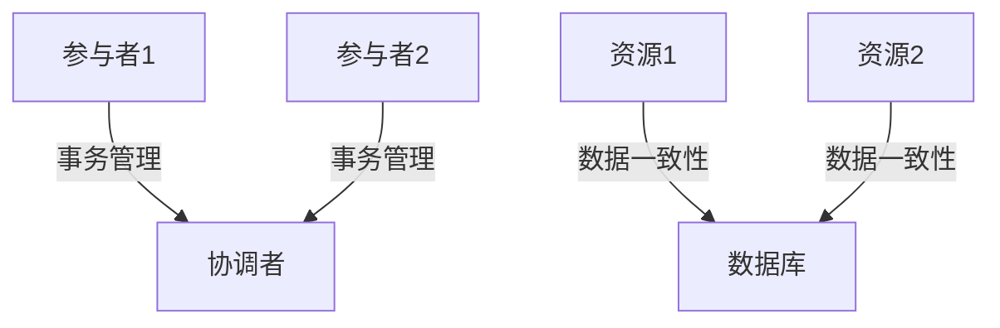

                 

### 文章标题：分布式事务：保证数据一致性的策略与实现

> 关键词：分布式事务、数据一致性、两阶段提交、三阶段提交、系统架构、最佳实践

> 摘要：本文将深入探讨分布式事务的概念、背景、核心算法、系统设计与实现，以及最佳实践，旨在帮助读者理解分布式事务在保证数据一致性方面的关键作用和实际应用。

----------------------------------------------------------------

## 第一部分：分布式事务基础

### 第1章：分布式事务背景与问题

#### 1.1.1 互联网时代的数据一致性需求

在互联网时代，随着数据量的爆发式增长和业务需求的多样化，分布式系统逐渐成为主流。分布式系统通过将数据和服务分散部署在不同的节点上，提高了系统的可用性和扩展性。然而，这同时也带来了数据一致性的挑战。

#### 1.1.2 分布式系统与分布式事务

分布式系统是由多个节点组成的，这些节点可以通过网络进行通信。分布式事务是指在分布式系统中，涉及多个节点的操作被视为一个逻辑单元，这些操作要么全部成功，要么全部失败。

#### 1.1.3 分布式事务面临的挑战

1. **网络延迟和故障**：分布式系统中，节点间的通信可能会受到网络延迟和故障的影响，导致事务执行失败。
2. **数据隔离**：如何保证不同节点上的数据在事务执行期间保持隔离，是分布式事务面临的重要问题。
3. **数据一致性**：在分布式系统中，数据一致性的保证比单机系统更为复杂。

## 第2章：分布式事务的核心概念

### 2.1.1 事务的定义与特性

**事务** 是一个操作序列，这些操作要么全部执行，要么全部不执行。事务具有以下特性：

1. **原子性**：事务中的所有操作要么全部成功，要么全部失败。
2. **一致性**：事务执行前后，数据库的状态必须保持一致。
3. **隔离性**：事务执行期间，其他事务不能读取到该事务执行过程中的中间状态。
4. **持久性**：一旦事务成功提交，其操作结果必须永久保存。

### 2.1.2 数据一致性的定义与重要性

**数据一致性** 是指数据库中的数据在所有时间和所有情况下都是一致的。在分布式系统中，数据一致性的重要性体现在以下几个方面：

1. **用户信任**：数据不一致会导致用户对系统的信任度下降。
2. **业务准确性**：数据不一致会影响业务的准确性和决策。
3. **法律合规**：在某些行业中，如金融和医疗，数据一致性是法律合规的要求。

### 2.1.3 分布式事务的基本原理

分布式事务的基本原理是确保在分布式系统中，多个节点的操作能够协调一致。这通常涉及到以下步骤：

1. **事务开始**：启动一个事务，并将相关节点纳入事务范围。
2. **事务执行**：在事务范围内执行多个操作。
3. **事务提交**：如果所有操作成功，提交事务并更新数据库状态。
4. **事务回滚**：如果事务执行过程中发生错误，回滚事务并恢复数据库状态。

## 第3章：分布式事务的算法原理

### 3.1.1 两阶段提交（2PC）算法

#### 3.1.1.1 两阶段提交的工作流程

两阶段提交是一种常用的分布式事务协议，其工作流程如下：

1. **准备阶段**：协调者发送prepare请求给参与者，参与者返回是否准备好的响应。
2. **提交阶段**：协调者根据参与者的响应决定是否提交事务。如果所有参与者都准备好，协调者发送commit请求；否则，发送rollback请求。

#### 3.1.1.2 两阶段提交的优缺点

**优点**：

1. **简单易实现**：两阶段提交算法相对简单，易于理解和实现。
2. **可靠性高**：两阶段提交能够确保事务的原子性和一致性。

**缺点**：

1. **性能瓶颈**：两阶段提交涉及多次网络通信，可能导致性能瓶颈。
2. **单点故障**：协调者故障可能导致整个分布式系统的事务失败。

### 3.1.2 三阶段提交（3PC）算法

#### 3.1.2.1 三阶段提交的工作流程

三阶段提交是对两阶段提交的改进，其工作流程如下：

1. **投票阶段**：协调者发送投票请求给参与者，参与者返回是否同意的响应。
2. **决定阶段**：协调者根据参与者的投票结果决定是否提交事务。
3. **提交/回滚阶段**：协调者发送提交或回滚请求给参与者。

#### 3.1.2.2 三阶段提交的优缺点

**优点**：

1. **降低性能瓶颈**：三阶段提交通过引入投票阶段，减少了提交阶段的网络通信次数。
2. **容错性更好**：三阶段提交能够更好地处理协调者故障。

**缺点**：

1. **复杂性增加**：三阶段提交算法相对复杂，实现难度较大。
2. **一致性保证弱化**：三阶段提交在处理某些情况下的一致性保证较弱。

### 3.1.3 其他分布式事务算法简介

除了两阶段提交和三阶段提交，还有其他分布式事务算法，如Paxos算法和Zab算法。这些算法在保证分布式事务的一致性方面有着各自的特点和优势。

## 第4章：分布式事务的系统分析与架构设计

### 4.1.1 分布式事务系统的问题场景

在分布式事务系统中，常见的问题场景包括：

1. **数据更新冲突**：多个节点同时对同一数据进行更新。
2. **网络延迟与故障**：节点间的通信可能受到网络延迟和故障的影响。
3. **数据一致性要求高**：某些业务场景要求极高的数据一致性。

### 4.1.2 分布式事务系统的核心功能设计

分布式事务系统的核心功能包括：

1. **事务管理**：负责启动、执行、提交和回滚分布式事务。
2. **数据一致性保证**：确保在分布式系统中，数据的一致性得到有效保证。
3. **故障处理**：处理分布式系统中可能出现的故障，如节点故障、网络故障等。

#### 4.1.2.1 领域模型类图

```mermaid
classDiagram
    Participant <<class>> Participant
    Coordinator <<class>> Coordinator
    Transaction <<class>> Transaction
    Resource <<class>> Resource
    Database <<class>> Database

    Participant o--|{协调} Coordinator
    Transaction o--|{使用} Resource
    Resource o--|{存储} Database
```

### 4.1.3 分布式事务系统的架构设计

分布式事务系统的架构设计通常包括以下几个方面：

1. **事务管理模块**：负责分布式事务的启动、执行、提交和回滚。
2. **数据一致性模块**：确保分布式系统中数据的一致性。
3. **故障处理模块**：处理分布式系统中的故障。

#### 4.1.3.1 系统架构图



### 4.1.4 分布式事务系统的接口设计

分布式事务系统的接口设计包括：

1. **事务接口**：提供事务的启动、执行、提交和回滚接口。
2. **资源接口**：提供对分布式系统中资源的访问接口。
3. **故障处理接口**：提供故障处理的相关接口。

### 4.1.5 分布式事务系统的交互设计

分布式事务系统的交互设计包括：

1. **事务管理交互**：协调者与参与者之间的交互，负责事务的启动、执行、提交和回滚。
2. **数据一致性交互**：资源与数据库之间的交互，负责数据的一致性保证。
3. **故障处理交互**：故障处理模块与其他模块之间的交互，负责故障的处理和恢复。

```mermaid
sequence
    Coordinator ->|prepare| Participant1: 准备阶段
    Coordinator ->|prepare| Participant2: 准备阶段
    Participant1 ->|ready| Coordinator: ready
    Participant2 ->|ready| Coordinator: ready
    Coordinator ->|vote| Participant1: 投票阶段
    Coordinator ->|vote| Participant2: 投票阶段
    Participant1 ->|vote| Coordinator:同意
    Participant2 ->|vote| Coordinator:同意
    Coordinator ->|commit| Participant1: 提交阶段
    Coordinator ->|commit| Participant2: 提交阶段
```

## 第5章：分布式事务的实现与实战

### 5.1.1 环境安装与配置

为了实现分布式事务，我们需要搭建一个模拟的分布式系统环境。通常，可以使用虚拟机来模拟多个节点，并安装相应的数据库和事务管理软件。

### 5.1.2 分布式事务的核心实现

以下是一个使用Python实现的分布式事务示例：

```python
class Coordinator:
    def prepare(self, participants):
        for participant in participants:
            participant.prepare()

    def vote(self, participants):
        for participant in participants:
            participant.vote()

    def decide(self, participants):
        if all(participant.agreed for participant in participants):
            for participant in participants:
                participant.commit()
        else:
            for participant in participants:
                participant.rollback()

class Participant:
    def prepare(self):
        print("Participant prepare")
        self.agreed = True

    def vote(self):
        print("Participant vote")
        self.agreed = True

    def commit(self):
        print("Participant commit")

    def rollback(self):
        print("Participant rollback")
```

### 5.1.3 实际案例分析与讲解

在实际应用中，我们可以通过模拟多个参与者和协调者的交互，来验证分布式事务的实现。以下是一个简单的案例：

```python
participants = [Participant() for _ in range(2)]
coordinator = Coordinator()

# 准备阶段
coordinator.prepare(participants)

# 投票阶段
coordinator.vote(participants)

# 决定阶段
coordinator.decide(participants)
```

运行上述代码，可以看到参与者和协调者之间的交互过程，以及分布式事务的执行结果。

### 5.1.4 项目小结

通过实际案例的验证，我们可以看到分布式事务的实现与运行过程。在分布式系统中，事务的协调和一致性保证是至关重要的，而两阶段提交和三阶段提交是常用的分布式事务算法。通过实践，我们可以更好地理解和应用这些算法，提高分布式系统的可靠性和性能。

## 第6章：分布式事务的最佳实践

### 6.1.1 分布式事务的设计原则

在设计分布式事务时，需要遵循以下原则：

1. **原子性**：确保事务的原子性，避免部分操作成功、部分操作失败的情况。
2. **一致性**：保证数据的一致性，确保事务执行前后的数据状态一致。
3. **隔离性**：保证事务的隔离性，避免并发事务之间的干扰。
4. **持久性**：确保事务的持久性，一旦事务提交，其结果必须永久保存。

### 6.1.2 分布式事务的性能优化

为了提高分布式事务的性能，可以采取以下优化措施：

1. **减少网络通信**：通过优化算法，减少分布式事务中的网络通信次数。
2. **缓存数据**：使用缓存来减少对数据库的访问，提高事务执行速度。
3. **预编译SQL语句**：预编译SQL语句，减少数据库执行时间。

### 6.1.3 分布式事务的容错机制

分布式事务的容错机制包括：

1. **重试机制**：当事务执行失败时，自动重试事务。
2. **超时机制**：设置事务执行的超时时间，避免长时间等待导致系统阻塞。
3. **故障转移**：当协调者或参与者发生故障时，自动切换到其他可用节点。

## 第7章：分布式事务的未来趋势与发展

### 7.1.1 分布式事务的新算法

随着技术的发展，新的分布式事务算法不断出现，如Raft算法、TSO（Timestamp Ordering）算法等。这些算法在性能、可靠性和一致性方面有着各自的优势，有望在未来的分布式系统中得到广泛应用。

### 7.1.2 分布式事务与区块链技术

分布式事务与区块链技术相结合，可以构建出更安全、更可靠的分布式系统。区块链技术通过去中心化的方式，实现了数据的一致性和安全性，为分布式事务提供了新的解决方案。

### 7.1.3 分布式事务的未来发展方向

分布式事务的未来发展方向包括：

1. **性能优化**：通过优化算法和架构，提高分布式事务的性能和可扩展性。
2. **安全性增强**：加强分布式事务的安全性，防止恶意攻击和数据泄露。
3. **自动化与智能化**：利用人工智能技术，实现分布式事务的自动化和智能化管理。

## 第8章：小结与拓展阅读

### 8.1.1 分布式事务的关键点总结

1. **分布式事务的背景与问题**：分布式系统在提高性能和可用性的同时，也带来了数据一致性的挑战。
2. **分布式事务的核心概念**：事务的原子性、一致性、隔离性和持久性是分布式事务的核心。
3. **分布式事务的算法原理**：两阶段提交、三阶段提交等算法在保证分布式事务的一致性方面发挥着重要作用。
4. **分布式事务的系统设计与实现**：分布式事务系统的设计原则、架构和实现是分布式事务成功的关键。
5. **分布式事务的最佳实践**：设计原则、性能优化和容错机制是分布式事务最佳实践的核心。

### 8.1.2 注意事项与优化建议

1. **注意事项**：

   - 在设计分布式事务时，要充分考虑数据的一致性和隔离性。
   - 在实现分布式事务时，要考虑网络延迟和故障的影响。
   - 要选择适合业务场景的分布式事务算法。

2. **优化建议**：

   - 优化分布式事务的算法，减少网络通信次数。
   - 利用缓存技术，减少对数据库的访问。
   - 采用自动化和智能化手段，提高分布式事务的管理效率。

### 8.1.3 拓展阅读资源推荐

1. 《分布式系统原理与范型》
2. 《深入理解分布式事务》
3. 《区块链技术指南》

----------------------------------------------------------------

作者：AI天才研究院/AI Genius Institute & 禅与计算机程序设计艺术 /Zen And The Art of Computer Programming

