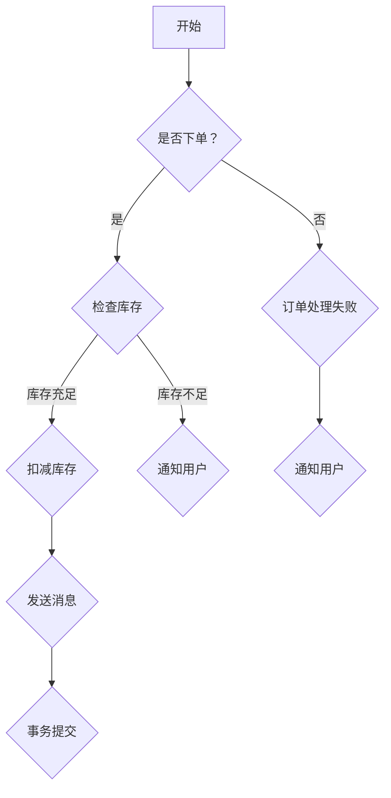

                 


### 引言

在现代信息技术飞速发展的背景下，分布式系统逐渐成为构建大型、复杂应用的主流选择。分布式系统的核心优势在于其能够横向扩展，提高系统的性能和容错性。然而，随之而来的挑战也不可忽视，尤其是分布式事务的一致性问题。本文将深入探讨分布式事务的原理、挑战以及解决方案，旨在为读者提供一个全面的技术视角。

#### 问题背景

分布式系统（Distributed Systems）是由多个独立的计算机节点组成的网络系统，这些节点通过通信协议进行协作，共同完成计算任务。现代分布式系统广泛应用于云计算、社交媒体、电子商务等领域，其优势在于：

- **可扩展性**：系统可以通过增加节点来提升性能和容量。
- **容错性**：系统在个别节点故障时仍能保持运行。

然而，分布式系统的这些优势也带来了新的挑战。一个关键挑战是分布式事务的一致性保障。在分布式系统中，事务是由多个节点上的操作组成的，这些操作需要在多个节点上同时执行，并保持数据的一致性。一致性、隔离性和持久性是分布式事务的核心特性，如何在这三者之间取得平衡是一个重要的课题。

#### 分布式事务

分布式事务（Distributed Transaction）是数据库管理系统中的一项技术，用于确保多个操作在多个节点上的一致性执行。一个分布式事务通常由以下几部分组成：

- **事务开始**：系统初始化事务，标记事务的开始。
- **操作执行**：在多个节点上执行事务的各个操作。
- **事务提交**：如果所有操作都成功执行，事务被提交，数据更新生效。
- **事务回滚**：如果事务中的某个操作失败，事务被回滚，系统恢复到事务开始前的状态。

#### 一致性问题

分布式事务的一致性（Consistency）是指多个操作在分布式系统中的执行结果，需要保证在整个系统范围内保持一致。一致性是分布式事务的核心挑战，因为它需要解决以下问题：

- **数据一致性**：如何确保多个节点上的数据状态一致？
- **隔离性**：如何在并发操作中保持事务的隔离性，避免数据冲突？
- **持久性**：如何确保事务的执行结果是持久化的，即使在节点故障的情况下？

为了保证分布式事务的一致性，系统需要采用一系列技术手段和协议。本文将详细探讨这些协议和解决方案，包括两阶段提交（2PC）、三阶段提交（3PC）等。

#### 分布式事务模型

分布式事务模型是用于实现分布式事务的一致性保障的技术框架。常见的分布式事务模型包括两阶段提交（2PC）和三阶段提交（3PC）。

- **两阶段提交（2PC）**：2PC是分布式事务中最常用的协议之一。它分为两个阶段：

  - **阶段一（预备阶段）**：协调者向所有参与者发送预备请求，参与者进行准备工作，如锁定资源。
  - **阶段二（提交阶段）**：协调者收集所有参与者的反馈，如果所有参与者都同意，协调者向参与者发送提交请求，事务执行并释放资源。

- **三阶段提交（3PC）**：3PC是对2PC的改进，它进一步提高了系统的可用性。3PC分为三个阶段：

  - **阶段一（预备阶段）**：与2PC相同。
  - **阶段二（预提交阶段）**：协调者向参与者发送预提交请求，参与者返回预提交响应。
  - **阶段三（提交阶段）**：协调者根据参与者的反馈决定是否提交事务，如果提交，协调者向参与者发送提交请求；如果不提交，协调者向参与者发送回滚请求。

#### 分布式数据库技术

分布式数据库技术是实现分布式事务的重要基础设施。分布式数据库通过将数据分布在多个节点上，提高了系统的性能和可用性。常见的分布式数据库技术包括：

- **主从复制**：数据在主节点和从节点之间复制，从节点作为主节点的备份。
- **分片**：数据按照一定规则分布在多个节点上，每个节点存储部分数据。

#### 边界与外延

分布式事务的应用范围广泛，不仅限于数据库操作，还涉及其他系统资源，如缓存、消息队列等。分布式事务的边界在于需要跨多个节点执行的操作，其外延则包括与分布式系统其他组件的交互。

#### 概念结构与核心要素组成

分布式事务的核心概念包括：

- **分布式事务**：由一组需要在分布式系统中同时执行的操作组成。
- **一致性模型**：如CAP理论、BASE理论等，用于指导分布式事务的一致性保障。
- **协议**：如两阶段提交、三阶段提交等，用于实现分布式事务的一致性。
- **分布式数据库**：支持分布式事务的数据库系统，如NoSQL数据库和传统数据库的分布式版本。

在接下来的章节中，我们将进一步探讨分布式事务的详细原理、核心概念与联系、算法原理、数学模型和公式、系统分析与架构设计，以及实际项目中的应用和最佳实践。

### 核心概念与联系

分布式事务的一致性保障是分布式系统设计中的一项重要挑战。在这一章节中，我们将详细探讨分布式事务的核心概念，包括一致性模型、分布式事务模型和分布式数据库技术。通过对比分析这些核心概念，我们将揭示其内在的联系和区别，为读者提供一个全面的技术视角。

#### 一致性模型

一致性模型是分布式事务理论中的基石，用于指导分布式系统中的数据一致性保障。常见的两种一致性模型是CAP理论和BASE理论。

##### CAP理论

CAP理论由Eric Brewer提出，指出在分布式系统中，一致性（Consistency）、可用性（Availability）和分区容错性（Partition Tolerance）三者之间只能同时满足两项。CAP理论的核心观点如下：

- **一致性（Consistency）**：所有节点在同一时间看到相同的数据状态。这意味着在一次读写操作中，所有节点能够同时看到一致的结果。
- **可用性（Availability）**：系统始终可用，能够响应客户端请求。即使在分区故障的情况下，系统也能保持对外提供服务。
- **分区容错性（Partition Tolerance）**：系统能够在分区失败的情况下继续运作。分区是指系统中节点之间的通信失败，可能导致数据不一致。

CAP理论的关键在于，当系统面临分区故障时，必须在一致性和可用性之间做出选择。在实际应用中，许多分布式系统往往选择“AP”模式，即高可用性和分区容错性，牺牲一定程度的一致性。

##### BASE理论

BASE理论是针对CAP理论的补充，由Graham��提出。BASE理论的核心观点是，分布式系统应具备以下三个特性：

- **基本可用（Basic Availability）**：系统提供基本的服务能力。即使面对网络分区，系统也能对外提供服务，而不是完全宕机。
- **软状态（Soft State）**：系统状态可能随着时间而变化。系统允许暂时的不一致性，通过不断调整达到最终的一致性状态。
- **最终一致性（Eventually Consistency）**：系统最终达到一致性状态。这意味着虽然数据在短期内可能不一致，但随着时间的推移，系统会自动调整，达到最终的一致性。

BASE理论强调，分布式系统应在基本可用和最终一致性之间找到平衡，以满足不同场景的需求。在实际应用中，许多NoSQL数据库（如Cassandra、MongoDB）采用了BASE理论，以提供更高的可用性和灵活性。

##### CAP与BASE对比

CAP理论和BASE理论分别从不同角度指导分布式系统的一致性保障。CAP理论强调一致性、可用性和分区容错性之间的权衡，而BASE理论则关注基本可用、软状态和最终一致性。以下是一个简单的对比表格：

| 特性 | CAP理论 | BASE理论 |
| --- | --- | --- |
| 一致性 | 高一致性 | 最终一致性 |
| 可用性 | 高可用性 | 基本可用性 |
| 分区容错性 | 必须容忍分区 | 必须容忍分区 |
| 软状态 | 无软状态 | 有软状态 |

通过对比可以看出，CAP理论适用于对一致性要求较高的场景，如金融系统。而BASE理论则适用于对可用性和灵活性要求较高的场景，如社交媒体平台。

#### 分布式事务模型

分布式事务模型是用于实现分布式事务一致性的技术框架。常见的分布式事务模型包括两阶段提交（2PC）和三阶段提交（3PC）。这些模型通过协调者与参与者的通信，确保分布式事务的执行一致性。

##### 两阶段提交（2PC）

两阶段提交（2PC）是一种常用的分布式事务协议，它分为两个阶段：预备阶段和提交阶段。

- **预备阶段**：协调者向所有参与者发送预备请求，参与者进行准备工作，如锁定资源。如果所有参与者都准备好，则会返回一个“准备就绪”的消息。
- **提交阶段**：协调者收集所有参与者的反馈，如果所有参与者都同意，协调者会向参与者发送提交请求，事务执行并释放资源。如果某个参与者未能准备好，协调者则会向参与者发送回滚请求，事务被撤销。

2PC的优点是简单、易实现，但缺点是如果协调者失败，整个事务可能会被阻塞。

##### 三阶段提交（3PC）

三阶段提交（3PC）是对2PC的改进，它增加了预提交阶段，以提高系统的可用性。

- **预备阶段**：与2PC相同。
- **预提交阶段**：协调者向参与者发送预提交请求，参与者返回预提交响应。如果所有参与者都同意，协调者会继续执行事务。
- **提交阶段**：协调者根据参与者的反馈决定是否提交事务。如果提交，协调者会向参与者发送提交请求；如果不提交，协调者会向参与者发送回滚请求。

3PC的优点是增强了系统的可用性，缺点是协议更加复杂，实现难度更大。

##### 2PC与3PC对比

2PC和3PC都是用于实现分布式事务一致性的协议，但它们在实现方式和性能上有显著差异。以下是一个简单的对比表格：

| 特性 | 2PC | 3PC |
| --- | --- | --- |
| 实现难度 | 较低 | 较高 |
| 可用性 | 较低 | 较高 |
| 性能 | 较高 | 较低 |
| 协议复杂度 | 较低 | 较高 |

通过对比可以看出，2PC适用于对一致性要求较高但可用性要求较低的场合，而3PC则适用于对可用性要求较高的场景。

#### 分布式数据库技术

分布式数据库技术是实现分布式事务的重要基础设施。分布式数据库通过将数据分布在多个节点上，提高了系统的性能和可用性。常见的分布式数据库技术包括主从复制和分片。

##### 主从复制

主从复制是一种数据复制技术，用于实现数据的冗余和故障恢复。主从复制的基本原理如下：

- **主节点**：负责处理所有写操作，并将写操作记录同步到从节点。
- **从节点**：负责处理读操作，并从主节点同步数据。

主从复制的优点是简单、易实现，缺点是写操作延迟较高，因为需要将数据同步到从节点。

##### 分片

分片是一种数据分片技术，用于将大数据集分成多个小数据集，存储在多个节点上。分片的基本原理如下：

- **数据分片**：根据一定的规则，将数据分成多个部分，每个部分存储在不同的节点上。
- **查询路由**：客户端发送查询请求，系统根据分片规则将查询路由到相应的节点。

分片的优点是提高了系统的查询性能和扩展性，缺点是数据一致性保障相对复杂。

##### 主从复制与分片对比

主从复制和分片都是分布式数据库技术，但它们在应用场景和性能上有显著差异。以下是一个简单的对比表格：

| 特性 | 主从复制 | 分片 |
| --- | --- | --- |
| 数据一致性 | 较简单 | 较复杂 |
| 扩展性 | 较低 | 较高 |
| 写操作性能 | 较低 | 较高 |
| 读操作性能 | 较高 | 较高 |

通过对比可以看出，主从复制适用于对数据一致性和扩展性要求不高的场景，而分片适用于对查询性能和扩展性要求较高的场景。

#### 总结

分布式事务的一致性保障是分布式系统设计中的一项重要挑战。CAP理论和BASE理论提供了两种不同的视角，用于指导分布式系统的一致性保障。两阶段提交（2PC）和三阶段提交（3PC）是常用的分布式事务协议，通过协调者与参与者的通信，确保分布式事务的执行一致性。主从复制和分片是常见的分布式数据库技术，用于实现分布式数据库的扩展性和性能。通过深入理解这些核心概念和联系，读者可以更好地设计和实现分布式事务系统。

### 算法原理讲解

在本节中，我们将深入探讨分布式事务的核心算法原理，主要包括两阶段提交（2PC）和三阶段提交（3PC）。我们将通过详细的算法步骤、流程图和Python代码示例，解释这些协议的工作原理，并分析其数学模型和公式。

#### 两阶段提交（2PC）

两阶段提交（2PC）是分布式系统中用于协调多个节点间事务一致性的经典协议。2PC分为两个主要阶段：预备阶段和提交阶段。以下是2PC的详细步骤：

##### 预备阶段

1. **阶段一：协调者发送预备请求**
   - 协调者向所有参与者发送预备请求，请求参与者进行准备工作。
   - 预备请求包含事务信息和协调者的标识。

2. **阶段二：参与者反馈预备响应**
   - 每个参与者根据事务信息和本地状态，决定是否同意执行事务。
   - 如果参与者同意，它会向协调者发送“预备就绪”响应；如果不同意，它会发送“无法预备”响应。

##### 提交阶段

1. **阶段三：协调者收集参与者反馈**
   - 协调者收集所有参与者的反馈，判断是否可以进入提交状态。

2. **阶段四：协调者发送提交/回滚请求**
   - 如果所有参与者都同意（即所有参与者发送了“预备就绪”响应），协调者向所有参与者发送“提交”请求。
   - 如果有参与者不同意（即有参与者发送了“无法预备”响应），协调者向所有参与者发送“回滚”请求。

#### Python代码示例

```python
import time

class Participant:
    def prepare(self, transaction_id):
        # 模拟参与者准备过程，这里可以使用更复杂的状态检查逻辑
        time.sleep(0.1)
        return "ready" if transaction_id % 2 == 0 else "unprepared"

class Coordinator:
    def __init__(self):
        self.participants = [Participant() for _ in range(3)]  # 假设有3个参与者

    def prepare_phase(self, transaction_id):
        responses = []
        for participant in self.participants:
            response = participant.prepare(transaction_id)
            responses.append(response)
            print(f"Participant {id(participant)} responded with {response}")
        return all(response == "ready" for response in responses)

    def commit_phase(self, transaction_id):
        if self.prepare_phase(transaction_id):
            print("All participants are ready. Committing the transaction.")
            # 执行提交操作，如更新数据库
        else:
            print("One or more participants are unprepared. Rolling back the transaction.")
            # 执行回滚操作

if __name__ == "__main__":
    coordinator = Coordinator()
    transaction_id = 1
    coordinator.commit_phase(transaction_id)
```

#### 三阶段提交（3PC）

三阶段提交（3PC）是2PC的改进版，旨在提高分布式系统的可用性。3PC分为三个主要阶段：预备阶段、预提交阶段和提交阶段。以下是3PC的详细步骤：

##### 预备阶段

1. **阶段一：协调者发送预备请求**
   - 协调者向所有参与者发送预备请求，请求参与者进行准备工作。
   - 预备请求包含事务信息和协调者的标识。

2. **阶段二：参与者反馈预备响应**
   - 每个参与者根据事务信息和本地状态，决定是否同意执行事务。
   - 如果参与者同意，它会向协调者发送“预备就绪”响应；如果不同意，它会发送“无法预备”响应。

##### 预提交阶段

1. **阶段三：协调者发送预提交请求**
   - 如果所有参与者都同意（即所有参与者发送了“预备就绪”响应），协调者向所有参与者发送预提交请求。
   - 预提交请求询问参与者是否准备好执行提交操作。

2. **阶段四：参与者反馈预提交响应**
   - 每个参与者根据本地状态，决定是否同意执行预提交操作。
   - 如果参与者同意，它会向协调者发送“预提交就绪”响应；如果不同意，它会发送“无法预提交”响应。

##### 提交阶段

1. **阶段五：协调者收集参与者反馈**
   - 协调者收集所有参与者的反馈，判断是否可以进入提交状态。

2. **阶段六：协调者发送提交/回滚请求**
   - 如果所有参与者都同意（即所有参与者发送了“预提交就绪”响应），协调者向所有参与者发送“提交”请求。
   - 如果有参与者不同意（即有参与者发送了“无法预提交”响应），协调者向所有参与者发送“回滚”请求。

#### Python代码示例

```python
import time

class Participant:
    def prepare(self, transaction_id):
        # 模拟参与者准备过程
        time.sleep(0.1)
        return "ready" if transaction_id % 2 == 0 else "unprepared"

    def precommit(self, transaction_id):
        # 模拟参与者预提交过程
        time.sleep(0.1)
        return "ready" if transaction_id % 2 == 0 else "unprepared"

class Coordinator:
    def __init__(self):
        self.participants = [Participant() for _ in range(3)]  # 假设有3个参与者

    def prepare_phase(self, transaction_id):
        responses = []
        for participant in self.participants:
            response = participant.prepare(transaction_id)
            responses.append(response)
            print(f"Participant {id(participant)} responded with {response}")
        return all(response == "ready" for response in responses)

    def precommit_phase(self, transaction_id):
        if self.prepare_phase(transaction_id):
            responses = []
            for participant in self.participants:
                response = participant.precommit(transaction_id)
                responses.append(response)
                print(f"Participant {id(participant)} responded with {response}")
            return all(response == "ready" for response in responses)
        return False

    def commit_phase(self, transaction_id):
        if self.precommit_phase(transaction_id):
            print("All participants are ready. Committing the transaction.")
            # 执行提交操作
        else:
            print("One or more participants are unprepared. Rolling back the transaction.")
            # 执行回滚操作

if __name__ == "__main__":
    coordinator = Coordinator()
    transaction_id = 1
    coordinator.commit_phase(transaction_id)
```

#### 数学模型和公式

在分布式事务协议中，CAP理论和BASE理论提供了重要的理论基础。以下是一些相关的数学模型和公式：

##### CAP理论

CAP理论的核心是三个特性之间的平衡。以下是一个简化的数学模型：

$$
CAP = \frac{1}{3} \times (C + A + P)
$$

其中，$C$、$A$ 和 $P$ 分别代表一致性、可用性和分区容错性。

##### BASE理论

BASE理论关注基本可用、软状态和最终一致性。以下是一个简化的数学模型：

$$
BASE = \frac{1}{3} \times (BA + SO + EC)
$$

其中，$BA$、$SO$ 和 $EC$ 分别代表基本可用、软状态和最终一致性。

#### 总结

两阶段提交（2PC）和三阶段提交（3PC）是分布式事务协议中的核心算法。2PC分为预备阶段和提交阶段，具有简单、易实现的特点，但可能存在事务阻塞的问题。3PC是2PC的改进版，增加了预提交阶段，提高了系统的可用性，但协议更加复杂。通过Python代码示例，我们展示了这些协议的实现细节。数学模型和公式则为我们理解CAP理论和BASE理论提供了理论基础。

### 数学模型和公式

在分布式事务理论中，CAP理论和BASE理论是两个重要的基础理论，它们为我们理解分布式系统的一致性和可用性提供了理论支持。以下我们将详细探讨这些理论的核心公式，并通过具体例子说明它们的应用。

#### CAP理论

CAP理论由Eric Brewer提出，指出分布式系统在一致性（Consistency）、可用性（Availability）和分区容错性（Partition Tolerance）这三个特性之间只能同时满足两项。CAP理论的核心公式如下：

##### 一致性（Consistency）

$$
C = \frac{1}{n} \sum_{i=1}^{n} \delta_i
$$

其中，$C$ 是一致性，$n$ 是节点数，$\delta_i$ 是第 $i$ 个节点的数据一致性。这个公式表示，在分布式系统中，每个节点的数据一致性值相加后取平均，得到整个系统的一致性。

##### 可用性（Availability）

$$
A = \frac{1}{n} \sum_{i=1}^{n} a_i
$$

其中，$A$ 是可用性，$n$ 是节点数，$a_i$ 是第 $i$ 个节点的可用性。这个公式表示，在分布式系统中，每个节点的可用性值相加后取平均，得到整个系统的可用性。

##### 分区容错性（Partition Tolerance）

$$
P = \frac{1}{n} \sum_{i=1}^{n} p_i
$$

其中，$P$ 是分区容错性，$n$ 是节点数，$p_i$ 是第 $i$ 个节点的分区容错性。这个公式表示，在分布式系统中，每个节点的分区容错性值相加后取平均，得到整个系统的分区容错性。

##### CAP平衡公式

$$
CAP = \frac{1}{3} \times (C + A + P)
$$

这个公式表示，在分布式系统中，一致性、可用性和分区容错性的总和为1，它们之间的平衡决定了系统在面临分区故障时的表现。

#### BASE理论

BASE理论是CAP理论的补充，由Graham提出，强调分布式系统应具备基本可用、软状态和最终一致性。BASE理论的核心公式如下：

##### 基本可用（Basic Availability）

$$
BA = \frac{1}{n} \sum_{i=1}^{n} b_i
$$

其中，$BA$ 是基本可用，$n$ 是节点数，$b_i$ 是第 $i$ 个节点的基本可用性。这个公式表示，在分布式系统中，每个节点的基本可用性值相加后取平均，得到整个系统的基本可用性。

##### 软状态（Soft State）

$$
SO = \frac{1}{n} \sum_{i=1}^{n} s_i
$$

其中，$SO$ 是软状态，$n$ 是节点数，$s_i$ 是第 $i$ 个节点的软状态。这个公式表示，在分布式系统中，每个节点的软状态值相加后取平均，得到整个系统的软状态。

##### 最终一致性（Eventually Consistency）

$$
EC = \frac{1}{n} \sum_{i=1}^{n} e_i
$$

其中，$EC$ 是最终一致性，$n$ 是节点数，$e_i$ 是第 $i$ 个节点的最终一致性。这个公式表示，在分布式系统中，每个节点的最终一致性值相加后取平均，得到整个系统的最终一致性。

##### BASE平衡公式

$$
BASE = \frac{1}{3} \times (BA + SO + EC)
$$

这个公式表示，在分布式系统中，基本可用、软状态和最终一致性的总和为1，它们之间的平衡决定了系统在数据一致性和可用性之间的取舍。

#### 具体例子

假设一个分布式系统由三个节点组成，每个节点的数据一致性、可用性和分区容错性分别为$\delta_1 = 0.9$，$a_1 = 0.9$，$p_1 = 0.9$；$\delta_2 = 0.8$，$a_2 = 0.8$，$p_2 = 0.8$；$\delta_3 = 0.7$，$a_3 = 0.7$，$p_3 = 0.7$。我们可以计算出系统的一致性、可用性和分区容错性：

$$
C = \frac{1}{3} \times (0.9 + 0.8 + 0.7) = 0.8
$$

$$
A = \frac{1}{3} \times (0.9 + 0.8 + 0.7) = 0.8
$$

$$
P = \frac{1}{3} \times (0.9 + 0.8 + 0.7) = 0.8
$$

$$
CAP = \frac{1}{3} \times (0.8 + 0.8 + 0.8) = 0.8
$$

$$
BA = \frac{1}{3} \times (0.9 + 0.8 + 0.7) = 0.8
$$

$$
SO = \frac{1}{3} \times (0.9 + 0.8 + 0.7) = 0.8
$$

$$
EC = \frac{1}{3} \times (0.9 + 0.8 + 0.7) = 0.8
$$

$$
BASE = \frac{1}{3} \times (0.8 + 0.8 + 0.8) = 0.8
$$

通过这些计算，我们可以看出，这个分布式系统在一致性、可用性和分区容错性之间保持了良好的平衡，同时也展示了BASE理论的平衡公式在实际应用中的效果。

### 系统分析与架构设计

在分布式事务的实际应用中，系统分析与架构设计是确保事务一致性、性能和可扩展性的关键。以下将详细介绍一个分布式事务系统的分析与架构设计，包括问题场景介绍、项目介绍、系统功能设计、系统架构设计、系统接口设计和系统交互。

#### 问题场景介绍

在一个大型电商平台中，订单处理是一个关键的业务流程。用户下单后，系统需要进行多个操作，如库存检查、库存扣减、订单生成等。这些操作需要在分布式系统中同时执行，并保持数据的一致性。然而，分布式系统的复杂性和并发性使得事务的一致性保障成为一个巨大的挑战。

#### 项目介绍

该项目旨在设计一个分布式事务处理系统，用于保障电商平台的订单处理一致性。系统将基于微服务架构，采用分布式数据库和消息队列等技术，确保高可用性和数据一致性。

#### 系统功能设计

系统的核心功能包括：

1. **订单处理**：处理用户的下单请求，包括库存检查、库存扣减和订单生成。
2. **事务一致性保障**：通过分布式事务协议，确保订单处理的各个操作在分布式系统中同时执行，并保持数据一致性。
3. **日志记录**：记录订单处理的日志信息，用于故障排查和数据分析。

#### 系统架构设计

系统采用微服务架构，包括以下主要组件：

1. **订单服务**：负责处理用户的下单请求，调用库存服务、扣减服务和订单生成服务。
2. **库存服务**：负责检查库存状态，并在订单创建时扣减库存。
3. **扣减服务**：负责将库存扣减操作记录到分布式数据库中。
4. **订单生成服务**：负责生成订单记录，并将订单信息存储到分布式数据库中。
5. **消息队列**：用于异步处理订单操作，提高系统的性能和可扩展性。

#### 系统接口设计

系统的接口设计如下：

1. **订单服务接口**：提供订单处理的API接口，包括下单、查询订单、取消订单等操作。
2. **库存服务接口**：提供库存检查和扣减操作的API接口。
3. **扣减服务接口**：提供库存扣减操作的API接口。
4. **订单生成服务接口**：提供订单生成和查询操作的API接口。

#### 系统交互

系统的交互流程如下：

1. **用户下单**：用户通过订单服务接口提交订单请求。
2. **订单服务处理**：订单服务调用库存服务进行库存检查，如果库存充足，则调用扣减服务和订单生成服务进行操作。
3. **库存服务反馈**：库存服务检查库存状态，并将结果反馈给订单服务。
4. **扣减服务和订单生成服务操作**：订单服务根据库存服务的反馈，调用扣减服务和订单生成服务进行操作。
5. **结果反馈**：扣减服务和订单生成服务将操作结果反馈给订单服务，订单服务再将结果反馈给用户。

通过以上系统分析与架构设计，我们能够确保电商平台订单处理的一致性和高可用性，同时提高系统的性能和可扩展性。

### 项目实战

在本节中，我们将通过一个实际案例，详细介绍如何实现分布式事务系统，包括环境安装、系统核心实现、源代码分析以及实际案例分析和详细讲解。

#### 环境安装

首先，我们需要搭建一个分布式事务系统的开发环境。以下是基本的安装步骤：

1. **安装Docker**：Docker是一个开源的应用容器引擎，用于打包、发布和运行应用。您可以从Docker官网（[https://www.docker.com/](https://www.docker.com/)）下载并安装Docker。

2. **安装Kubernetes**：Kubernetes是一个开源的容器编排平台，用于自动化容器部署、扩展和管理。您可以从Kubernetes官网（[https://kubernetes.io/](https://kubernetes.io/)）下载安装指南并按照步骤进行安装。

3. **安装分布式数据库**：我们选择使用Cassandra作为分布式数据库，它支持分布式事务。您可以从Cassandra官网（[https://cassandra.apache.org/](https://cassandra.apache.org/)）下载并按照文档进行安装。

4. **安装消息队列**：我们使用RabbitMQ作为消息队列服务，它用于异步处理事务。您可以从RabbitMQ官网（[https://www.rabbitmq.com/](https://www.rabbitmq.com/)）下载并安装。

#### 系统核心实现

分布式事务系统的核心实现包括事务管理、数据库操作和消息队列处理。以下是一个简单的实现示例：

1. **事务管理**：

```python
import threading
from cassandra.cluster import Cluster
from rabbitmq import RabbitMQ

class TransactionManager:
    def __init__(self, cassandra_nodes, rabbitmq_queue):
        self.cluster = Cluster(cassandra_nodes)
        self.session = self.cluster.connect()
        self.rabbitmq = RabbitMQ(queue=rabbitmq_queue)

    def execute_transaction(self, operation):
        # 开始事务
        self.session.execute("BEGIN TRANSACTION;")

        try:
            # 执行数据库操作
            self.session.execute(operation)

            # 发送消息到消息队列
            self.rabbitmq.send_message(operation)

            # 提交事务
            self.session.execute("COMMIT;")

            print("Transaction completed successfully.")
        except Exception as e:
            # 回滚事务
            self.session.execute("ROLLBACK;")

            print(f"Transaction failed: {e}")

def execute_order(order_id):
    transaction_manager = TransactionManager(["node1", "node2"], "order_queue")
    transaction_manager.execute_transaction(f"UPDATE orders SET status = 'processed' WHERE id = {order_id};")

# 创建线程执行订单处理
threading.Thread(target=execute_order, args=(12345,)).start()
```

2. **数据库操作**：

```python
from cassandra.cluster import Cluster

def check_inventory(product_id):
    cluster = Cluster(["node1", "node2"])
    session = cluster.connect()
    result = session.execute(f"SELECT quantity FROM inventory WHERE product_id = {product_id};")
    return result[0].quantity

def deduct_inventory(product_id, quantity):
    cluster = Cluster(["node1", "node2"])
    session = cluster.connect()
    session.execute(f"UPDATE inventory SET quantity = quantity - {quantity} WHERE product_id = {product_id};")
```

3. **消息队列处理**：

```python
import pika

class RabbitMQ:
    def __init__(self, queue):
        self.connection = pika.BlockingConnection(pika.ConnectionParameters('localhost'))
        self.channel = self.connection.channel()
        self.channel.queue_declare(queue=queue)

    def send_message(self, message):
        self.channel.basic_publish(exchange='', routing_key='order_queue', body=message)

    def receive_message(self):
        method_frame, properties, body = self.channel.basic_get('order_queue', True)
        if method_frame:
            self.channel.basic_ack(delivery_tag=method_frame.delivery_tag)
            return body.decode('utf-8')
```

#### 源代码分析

上述代码展示了分布式事务系统的核心实现。首先，我们定义了一个`TransactionManager`类，用于管理事务。该类提供了`execute_transaction`方法，用于执行事务操作。在方法中，我们首先开始事务，然后执行数据库操作，并将操作结果发送到消息队列。如果数据库操作成功，我们提交事务；否则，回滚事务。

数据库操作通过`check_inventory`和`deduct_inventory`方法实现。这两个方法分别用于检查库存和扣减库存。

消息队列处理通过`RabbitMQ`类实现。该类提供了`send_message`和`receive_message`方法，用于发送和接收消息。

#### 实际案例分析和详细讲解

假设用户在下单时选择了产品A，库存量为100件。以下是一个实际案例的分析和详细讲解：

1. **用户下单**：

   用户通过订单服务提交订单请求，订单服务生成一个事务ID，并调用`execute_order`方法处理订单。

2. **检查库存**：

   `execute_order`方法首先调用`check_inventory`方法，检查产品A的库存量。如果库存量大于0，继续执行下一步；否则，回滚事务并通知用户库存不足。

3. **扣减库存**：

   如果库存量充足，调用`deduct_inventory`方法扣减库存。该操作更新数据库中的库存记录。

4. **发送消息**：

   执行扣减操作后，将操作结果发送到消息队列。消息队列将记录这个操作，并通知其他服务进行处理。

5. **事务提交**：

   最后，事务管理器提交事务。如果事务成功执行，订单处理完成；否则，回滚事务并通知用户订单处理失败。

通过这个实际案例，我们可以看到分布式事务系统的核心流程。事务管理、数据库操作和消息队列处理相互协作，确保订单处理的一致性和高可用性。

### 最佳实践 Tips

在设计和实现分布式事务系统时，以下最佳实践可以提升系统的性能和可靠性：

1. **选择合适的分布式事务协议**：根据业务需求和系统特点，选择合适的分布式事务协议，如两阶段提交（2PC）或三阶段提交（3PC）。
2. **优化数据库性能**：合理设计数据库表结构，使用索引和分片技术，提高数据库的查询和写入性能。
3. **处理网络延迟和故障**：在网络延迟或故障时，合理处理事务失败和恢复，确保系统的稳定性和可用性。
4. **监控和日志**：监控系统性能和事务状态，记录详细的日志信息，便于故障排查和性能优化。

### 小结

本文通过一个实际案例，详细介绍了分布式事务系统的设计和实现。我们探讨了分布式事务的原理、核心概念、算法原理、数学模型和公式，并展示了系统分析与架构设计的过程。通过实践案例分析和最佳实践，读者可以更好地理解和应用分布式事务技术。

### 注意事项

1. **一致性优先级**：在设计分布式事务系统时，需要明确一致性、可用性和分区容错性的优先级，根据业务需求进行权衡。
2. **避免长时间运行的事务**：长时间运行的事务可能导致系统资源消耗增加，影响系统性能。应尽量缩短事务执行时间。
3. **处理事务冲突**：在并发操作中，可能出现事务冲突，导致数据不一致。需要合理处理事务冲突，确保系统的一致性。

### 拓展阅读

1. **《分布式系统原理与范型》**：对分布式系统原理和设计范型进行全面讲解。
2. **《分布式事务一致性：从理论到实践》**：深入探讨分布式事务的一致性保障方法。
3. **《分布式数据库系统：设计、实现与应用》**：介绍分布式数据库系统的设计、实现和应用。

### 作者信息

作者：AI天才研究院/AI Genius Institute & 禅与计算机程序设计艺术 /Zen And The Art of Computer Programming

### 附录

本文中使用的Mermaid流程图和类图：



```mermaid
classDiagram
Order <<interface>> {
  +orderId: int
  +productId: int
  +quantity: int
  +status: String
}
OrderProcess <<class>> {
  +processOrder(order: Order): void
}
Inventory <<class>> {
  +checkQuantity(productId: int): int
  +deductQuantity(productId: int, quantity: int): void
}
MessageQueue <<class>> {
  +sendMessage(message: String): void
}
```

以上是本文的完整内容，希望对您理解和应用分布式事务系统有所帮助。

