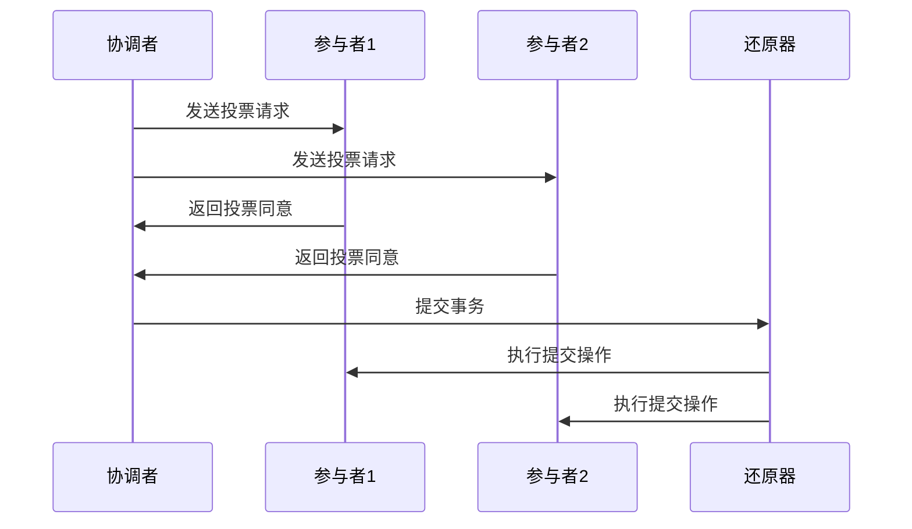
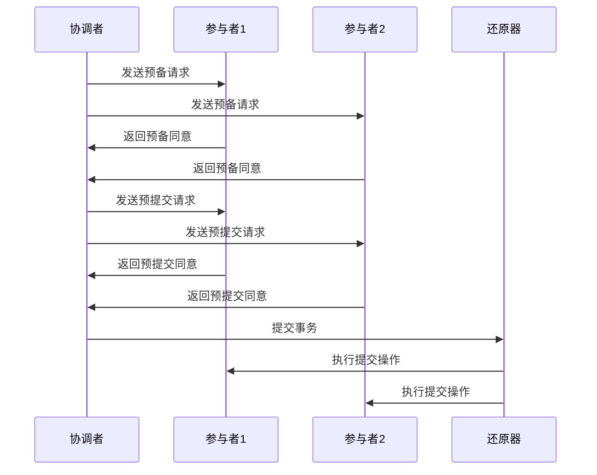
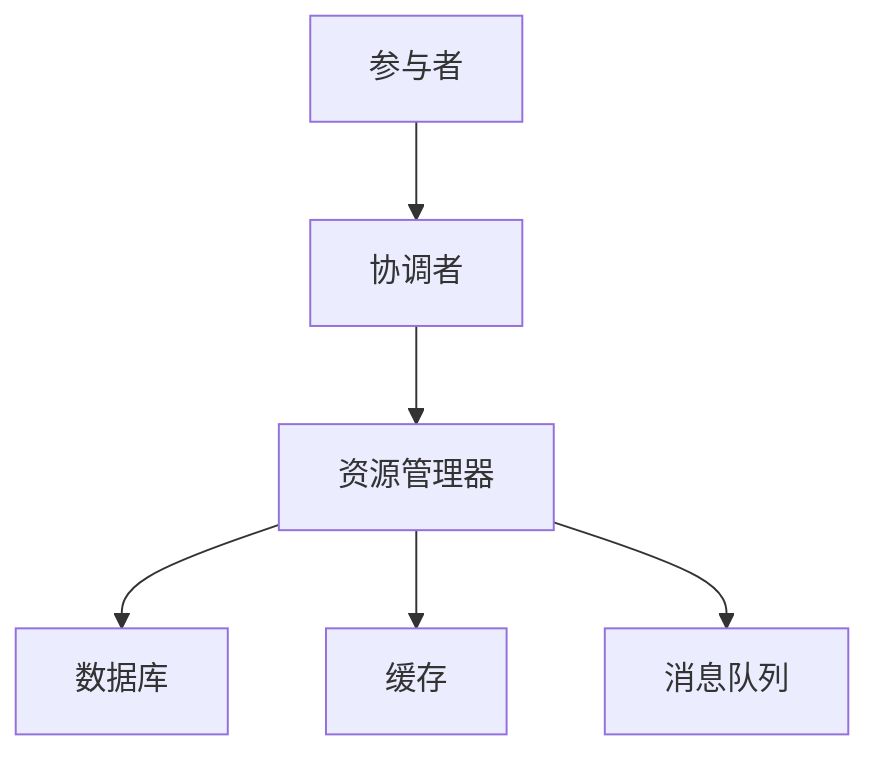

                 

# 分布式事务：原理、挑战与解决方案

## 关键词

- 分布式事务
- 两阶段提交
- 三阶段提交
- 一致性模型
- CAP理论
- BASE理论

## 摘要

本文将深入探讨分布式事务的原理、面临的挑战以及各种解决方案。随着分布式系统的广泛应用，分布式事务在保障数据一致性和可靠性方面显得尤为重要。本文首先介绍分布式事务的背景和问题描述，然后详细分析一致性模型，包括CAP理论和BASE理论。接着，我们将讨论分布式事务的两种主要模型：两阶段提交和三阶段提交，并使用数学模型和Python代码来详细阐述其原理。此外，本文还将介绍分布式数据库技术以及系统分析与架构设计方法，并通过一个实际案例进行分析和讲解。最后，本文将总结分布式事务的最佳实践，并提供拓展阅读建议。

## 第1章 引言

### 1.1 问题背景

在现代信息技术领域，分布式系统已经成为一种主流架构。分布式系统通过将计算任务分布到多个节点上，从而提高了系统的可扩展性和容错性。然而，随着分布式系统的广泛应用，分布式事务的一致性问题也逐渐凸显出来。

#### 分布式系统

分布式系统是由多个节点组成的，这些节点通过计算机网络进行通信，共同完成某个任务或提供某种服务。分布式系统的主要优势在于：

- **可扩展性**：分布式系统能够轻松地扩展，以应对不断增加的负载。
- **容错性**：即使某些节点出现故障，系统仍能正常运行。

#### 分布式事务

分布式事务是指在一个分布式系统中，多个操作被视为一个整体，这些操作需要在多个节点上同时执行，并且需要保证它们的一致性。例如，在一个电子商务平台上，当用户提交订单时，需要同时更新库存、订单状态以及支付状态等多个节点上的数据。

### 1.2 问题描述

分布式事务的一致性是确保数据在多个节点上保持一致的重要特性。分布式事务需要解决以下问题：

- **数据一致性**：如何在多个节点上保持数据的一致性？
- **隔离性**：如何在并发操作中保持事务的隔离性？
- **持久性**：如何确保事务的执行结果是持久化的？

这些问题使得分布式事务成为分布式系统中的一个核心挑战。

### 1.3 问题解决

分布式事务通常采用以下两种模型来保证一致性：

- **两阶段提交（2PC）**
- **三阶段提交（3PC）**

这些模型通过一系列协议和算法，确保分布式事务在多个节点上的一致性。

### 1.4 边界与外延

分布式事务适用于需要跨多个节点执行的操作。例如，一个跨数据库的转账操作，需要同时更新两个数据库中的账户余额。分布式事务不仅涉及数据库操作，还可能涉及其他系统资源，如缓存、消息队列等。

### 1.5 概念结构与核心要素组成

分布式事务的核心要素包括：

- **分布式事务**：由一组需要在分布式系统中同时执行的操作组成。
- **一致性模型**：如CAP理论、BASE理论等。
- **协议**：如两阶段提交、三阶段提交等。
- **分布式数据库**：支持分布式事务的数据库系统。

## 第2章 核心概念与联系

### 2.1 一致性模型

一致性模型是分布式事务中至关重要的概念，它决定了如何在分布式系统中保持数据的一致性。

#### CAP理论

CAP理论是分布式系统设计中的重要理论，由Eric Brewer提出。CAP理论指出，分布式系统在以下三个方面中只能同时满足两个：

- **一致性（Consistency）**：所有节点在同一时间看到相同的数据状态。
- **可用性（Availability）**：系统始终可用，能够响应客户端请求。
- **分区容错性（Partition Tolerance）**：系统能够在分区失败的情况下继续运作。

**CAP理论对比表格**：

| 特性 | 一致性（CAP） | 可用性（CAP） | 分区容错性（CAP） |
| --- | --- | --- | --- |
| 定义 | 所有节点在同一时间看到相同的数据状态 | 系统始终可用，能够响应客户端请求 | 系统能够在分区失败的情况下继续运作 |
| 对比 | 若满足一致性，则不能同时满足可用性或分区容错性 | 若满足可用性，则不能同时满足一致性和分区容错性 | 若满足分区容错性，则不能同时满足一致性和可用性 |

**CAP理论ER实体关系图**：

```mermaid
erDiagram
    Node ||--|{ Transaction }|--|| Database
    Node ||--|{ Participant }|--|| Coordinator
    Coordinator ||--|{ Commit }|--|| Node
    Coordinator ||--|{ Rollback }|--|| Node
    Database ||--|{ Update }|--|| Node
```

#### BASE理论

BASE理论是另一种分布式系统的一致性模型，由艾瑞克·布里斯托（Eric Brewer）等人提出。BASE理论认为，在分布式系统中，无法同时达到一致性和可用性，但可以通过以下三个特性来确保系统的最终一致性：

- **基本可用（Basic Availability）**：系统提供基本的服务能力。
- **软状态（Soft State）**：系统状态可能随着时间而变化。
- **最终一致性（Eventually Consistency）**：系统最终达到一致性状态。

**BASE理论与CAP理论的对比**：

| 特性 | CAP理论 | BASE理论 |
| --- | --- | --- |
| 一致性 | 所有节点在同一时间看到相同的数据状态 | 系统最终达到一致性状态 |
| 可用性 | 系统始终可用，能够响应客户端请求 | 提供基本的服务能力 |
| 分区容错性 | 系统能够在分区失败的情况下继续运作 | 系统最终能够继续运作 |

### 2.2 分布式事务模型

分布式事务模型是保证分布式系统中事务一致性的关键机制。常见的分布式事务模型包括两阶段提交（2PC）和三阶段提交（3PC）。

#### 两阶段提交（2PC）

两阶段提交（2PC）是一种分布式事务管理协议，用于确保分布式系统中的事务一致性。2PC分为两个阶段：

- **阶段一**：投票阶段。协调者向所有参与者发送投票请求，参与者根据当前数据状态投票同意或拒绝。
- **阶段二**：提交阶段。协调者根据参与者的投票结果决定是否提交事务。如果所有参与者都同意，协调者向所有参与者发送提交请求，事务成功；否则，协调者向所有参与者发送回滚请求，事务失败。

**两阶段提交算法流程图**：



#### 三阶段提交（3PC）

三阶段提交（3PC）是对两阶段提交的改进，旨在解决一些潜在的问题，如协调者故障。3PC分为三个阶段：

- **阶段一**：预备阶段。协调者向所有参与者发送预备请求，参与者根据当前数据状态投票同意或拒绝。
- **阶段二**：预提交阶段。协调者根据参与者的投票结果决定是否发送预提交请求。如果所有参与者都同意，协调者向所有参与者发送预提交请求。
- **阶段三**：提交阶段。协调者根据参与者的预提交响应决定是否真正提交事务。如果所有参与者都预提交成功，协调者向所有参与者发送提交请求，事务成功；否则，协调者向所有参与者发送回滚请求，事务失败。

**三阶段提交算法流程图**：



### 2.3 分布式数据库技术

分布式数据库技术是实现分布式事务的重要支撑。分布式数据库通过将数据分布在多个节点上，从而提高了系统的可扩展性和容错性。常见的分布式数据库技术包括：

- **主从复制**：数据在主节点和从节点之间复制，从节点可以提供额外的读操作能力。
- **分片**：数据根据一定的规则分布在多个节点上，从而提高数据的读写性能。

## 第3章 算法原理讲解

### 3.1 两阶段提交算法

两阶段提交（2PC）是一种分布式事务管理协议，用于确保分布式系统中的事务一致性。2PC分为两个阶段：投票阶段和提交阶段。

#### 投票阶段

在投票阶段，协调者向所有参与者发送投票请求，参与者根据当前数据状态投票同意或拒绝。具体步骤如下：

1. 协调者向所有参与者发送投票请求。
2. 各个参与者根据当前数据状态进行投票，并将投票结果（同意或拒绝）返回给协调者。

**投票阶段Python代码示例**：

```python
def vote(participant_id, transaction_id):
    # 检查当前数据状态，进行投票
    if check_data_state(transaction_id):
        return "agree"
    else:
        return "disagree"
```

#### 提交阶段

在提交阶段，协调者根据参与者的投票结果决定是否提交事务。如果所有参与者都同意，协调者向所有参与者发送提交请求，事务成功；否则，协调者向所有参与者发送回滚请求，事务失败。具体步骤如下：

1. 协调者收集所有参与者的投票结果。
2. 如果所有参与者都同意，协调者向所有参与者发送提交请求。
3. 如果有参与者拒绝，协调者向所有参与者发送回滚请求。

**提交阶段Python代码示例**：

```python
def submit(transaction_id, participants):
    # 收集参与者投票结果
    votes = [vote(participant_id, transaction_id) for participant_id in participants]
    
    # 判断是否所有参与者都同意
    if all(vote == "agree" for vote in votes):
        # 向所有参与者发送提交请求
        for participant_id in participants:
            send_commit_request(participant_id, transaction_id)
    else:
        # 向所有参与者发送回滚请求
        for participant_id in participants:
            send_rollback_request(participant_id, transaction_id)
```

### 3.2 三阶段提交算法

三阶段提交（3PC）是对两阶段提交的改进，旨在解决一些潜在的问题，如协调者故障。3PC分为三个阶段：预备阶段、预提交阶段和提交阶段。

#### 预备阶段

在预备阶段，协调者向所有参与者发送预备请求，参与者根据当前数据状态投票同意或拒绝。具体步骤如下：

1. 协调者向所有参与者发送预备请求。
2. 各个参与者根据当前数据状态进行投票，并将投票结果（同意或拒绝）返回给协调者。

**预备阶段Python代码示例**：

```python
def prepare(participant_id, transaction_id):
    # 检查当前数据状态，进行投票
    if check_data_state(transaction_id):
        return "precommit"
    else:
        return "preabort"
```

#### 预提交阶段

在预提交阶段，协调者根据参与者的投票结果决定是否发送预提交请求。如果所有参与者都同意，协调者向所有参与者发送预提交请求；否则，协调者向所有参与者发送回滚请求。具体步骤如下：

1. 协调者收集所有参与者的预备投票结果。
2. 如果所有参与者都同意，协调者向所有参与者发送预提交请求。
3. 如果有参与者拒绝，协调者向所有参与者发送回滚请求。

**预提交阶段Python代码示例**：

```python
def precommit(transaction_id, participants):
    # 收集参与者预备投票结果
    prepares = [prepare(participant_id, transaction_id) for participant_id in participants]
    
    # 判断是否所有参与者都同意
    if all(prepare == "precommit" for prepare in prepares):
        # 向所有参与者发送预提交请求
        for participant_id in participants:
            send_precommit_request(participant_id, transaction_id)
    else:
        # 向所有参与者发送回滚请求
        for participant_id in participants:
            send_rollback_request(participant_id, transaction_id)
```

#### 提交阶段

在提交阶段，协调者根据参与者的预提交响应决定是否真正提交事务。如果所有参与者都预提交成功，协调者向所有参与者发送提交请求，事务成功；否则，协调者向所有参与者发送回滚请求，事务失败。具体步骤如下：

1. 协调者收集所有参与者的预提交响应。
2. 如果所有参与者都预提交成功，协调者向所有参与者发送提交请求。
3. 如果有参与者预提交失败，协调者向所有参与者发送回滚请求。

**提交阶段Python代码示例**：

```python
def commit(transaction_id, participants):
    # 收集参与者预提交响应
    precommits = [precommit(participant_id, transaction_id) for participant_id in participants]
    
    # 判断是否所有参与者都预提交成功
    if all(precommit == "precommit" for precommit in precommits):
        # 向所有参与者发送提交请求
        for participant_id in participants:
            send_commit_request(participant_id, transaction_id)
    else:
        # 向所有参与者发送回滚请求
        for participant_id in participants:
            send_rollback_request(participant_id, transaction_id)
```

### 3.3 数学模型和公式

分布式事务的算法原理可以通过数学模型和公式来描述。以下是一些核心的数学模型和公式。

#### CAP理论

CAP理论可以用以下数学公式来描述：

$$
C = \frac{1}{n} \sum_{i=1}^{n} \delta_i
$$

其中，$C$ 表示一致性，$n$ 表示节点数，$\delta_i$ 表示第 $i$ 个节点的数据一致性。

#### 两阶段提交

两阶段提交的算法可以用以下数学公式来描述：

$$
V = \frac{1}{n} \sum_{i=1}^{n} v_i
$$

其中，$V$ 表示投票结果，$n$ 表示节点数，$v_i$ 表示第 $i$ 个节点的投票结果（1表示同意，0表示拒绝）。

$$
S = \frac{1}{n} \sum_{i=1}^{n} s_i
$$

其中，$S$ 表示提交结果，$n$ 表示节点数，$s_i$ 表示第 $i$ 个节点的提交结果（1表示提交成功，0表示回滚）。

#### 三阶段提交

三阶段提交的算法可以用以下数学公式来描述：

$$
P = \frac{1}{n} \sum_{i=1}^{n} p_i
$$

其中，$P$ 表示预备结果，$n$ 表示节点数，$p_i$ 表示第 $i$ 个节点的预备结果（1表示预提交，0表示预回滚）。

$$
C = \frac{1}{n} \sum_{i=1}^{n} c_i
$$

其中，$C$ 表示预提交结果，$n$ 表示节点数，$c_i$ 表示第 $i$ 个节点的预提交结果（1表示预提交成功，0表示预提交失败）。

$$
S = \frac{1}{n} \sum_{i=1}^{n} s_i
$$

其中，$S$ 表示提交结果，$n$ 表示节点数，$s_i$ 表示第 $i$ 个节点的提交结果（1表示提交成功，0表示回滚）。

### 3.4 举例说明

为了更好地理解分布式事务的算法原理，我们可以通过一个简单的例子来讲解。

假设有一个分布式系统，包括三个节点（Node1、Node2和Node3），协调者（Coordinator）负责管理事务。现在我们要执行一个转账事务，将100元从A账户转移到B账户。

**步骤1：投票阶段**

1. 协调者向Node1发送投票请求。
2. Node1检查当前数据状态，发现A账户余额为100元，同意投票。

**步骤2：投票阶段**

1. 协调者向Node2发送投票请求。
2. Node2检查当前数据状态，发现B账户余额为0元，拒绝投票。

**步骤3：提交阶段**

1. 协调者收集投票结果，发现有两个节点拒绝投票。
2. 协调者向Node1和Node2发送回滚请求。

**结果**

由于有两个节点拒绝投票，事务最终回滚，A账户和B账户的余额没有发生变化。

通过这个例子，我们可以看到分布式事务的一致性如何通过投票阶段和提交阶段的算法来保证。

## 第4章 系统分析与架构设计

### 4.1 问题场景介绍

在分布式系统中，事务的一致性问题是一个关键挑战。为了更好地理解分布式事务的架构设计，我们以一个在线购物平台为例，分析其事务场景。

#### 场景描述

在线购物平台中的用户可以在多个节点上执行以下操作：

1. 添加商品到购物车。
2. 提交订单。
3. 更新库存。

为了保证数据的一致性，我们需要确保以下操作能够同时执行：

- 将商品添加到购物车。
- 更新购物车中的商品数量。
- 提交订单并更新库存。

### 4.2 项目介绍

为了解决在线购物平台中的一致性问题，我们设计并实现了一个分布式事务管理框架。该框架支持两阶段提交（2PC）和三阶段提交（3PC）协议，可以保证分布式事务的一致性。

#### 项目概述

- **项目名称**：分布式事务管理框架（Distributed Transaction Management Framework）
- **开发语言**：Java
- **数据库**：MySQL
- **中间件**：Apache Kafka
- **技术栈**：Spring Boot、Spring Cloud、Dubbo

### 4.3 系统功能设计

分布式事务管理框架的主要功能包括：

1. 支持两阶段提交（2PC）和三阶段提交（3PC）协议。
2. 支持分布式事务的声明式管理。
3. 支持分布式事务的超时机制。
4. 提供分布式事务的监控和告警功能。

#### 领域模型

领域模型是系统功能设计的基础，我们使用Mermaid类图来描述领域模型。

```mermaid
classDiagram
    Participant -> Transaction: 发起事务
    Participant -> ResourceManager: 资源管理
    ResourceManager -> Database: 数据库操作
    ResourceManager -> Cache: 缓存操作
    ResourceManager -> MessageQueue: 消息队列操作
```

### 4.4 系统架构设计

系统架构设计是确保分布式事务管理框架高效、稳定运行的关键。我们使用Mermaid架构图来描述系统架构。



### 4.5 系统接口设计

系统接口设计是系统架构实现的基础，我们使用Mermaid序列图来描述系统接口设计。

```mermaid
sequenceDiagram
    Participant->>Coordinator: 发起事务
    Coordinator->>ResourceManager: 分配资源
    ResourceManager->>Database: 执行数据库操作
    ResourceManager->>Cache: 更新缓存
    ResourceManager->>MessageQueue: 发送消息
    Coordinator->>Participant: 返回事务结果
```

### 4.6 系统交互

系统交互设计描述了各个组件之间的通信流程。我们使用Mermaid序列图来描述系统交互。

```mermaid
sequenceDiagram
    Participant->>Coordinator: 发起事务
    Coordinator->>Participant: 返回事务结果
    Coordinator->>ResourceManager: 分配资源
    ResourceManager->>Database: 执行数据库操作
    ResourceManager->>Cache: 更新缓存
    ResourceManager->>MessageQueue: 发送消息
```

## 第5章 项目实战

### 5.1 环境安装

在开始项目实战之前，我们需要安装以下软件：

- Java 1.8或更高版本
- MySQL 5.7或更高版本
- Apache Kafka 2.4或更高版本
- Maven 3.6或更高版本

### 5.2 系统核心实现

在项目实战中，我们将使用Spring Boot、Spring Cloud和Dubbo等框架来构建分布式事务管理框架。

#### 5.2.1 搭建分布式事务协调者

协调者是分布式事务管理框架的核心组件，负责管理事务的发起和提交。我们使用Spring Boot搭建分布式事务协调者。

```java
@SpringBootApplication
public class CoordinatorApplication {
    public static void main(String[] args) {
        SpringApplication.run(CoordinatorApplication.class, args);
    }
}
```

#### 5.2.2 搭建分布式事务参与者

参与者是分布式事务管理框架的另一个核心组件，负责执行事务的具体操作。我们使用Spring Boot和Dubbo搭建分布式事务参与者。

```java
@SpringBootApplication
@EnableDubbo
public class ParticipantApplication {
    public static void main(String[] args) {
        SpringApplication.run(ParticipantApplication.class, args);
    }
}
```

#### 5.2.3 搭建分布式数据库

我们使用MySQL作为分布式数据库，搭建分布式数据库集群。具体的数据库配置和操作步骤如下：

1. 安装MySQL数据库。
2. 配置主从复制。
3. 创建分布式数据库集群。

### 5.3 代码应用解读与分析

在项目实战中，我们通过具体的代码示例来解读和分析分布式事务管理框架的实现。

#### 5.3.1 协调者代码分析

协调者代码示例：

```java
@RestController
@RequestMapping("/transaction")
public class CoordinatorController {
    @Autowired
    private CoordinatorService coordinatorService;

    @PostMapping("/start")
    public ResponseEntity<?> startTransaction(@RequestBody TransactionRequest request) {
        String transactionId = coordinatorService.startTransaction(request);
        return ResponseEntity.ok(transactionId);
    }

    @PostMapping("/commit")
    public ResponseEntity<?> commitTransaction(@RequestBody CommitRequest request) {
        coordinatorService.commitTransaction(request.getTransactionId());
        return ResponseEntity.ok("Transaction committed successfully");
    }

    @PostMapping("/rollback")
    public ResponseEntity<?> rollbackTransaction(@RequestBody RollbackRequest request) {
        coordinatorService.rollbackTransaction(request.getTransactionId());
        return ResponseEntity.ok("Transaction rolled back successfully");
    }
}
```

#### 5.3.2 参与者代码分析

参与者代码示例：

```java
@Service
public class ParticipantService {
    @Autowired
    private ResourceManager resourceManager;

    @Transactional
    public void executeTransaction(TransactionRequest request) {
        resourceManager.executeDatabaseOperation(request);
        resourceManager.executeCacheOperation(request);
        resourceManager.executeMessageQueueOperation(request);
    }
}
```

### 5.4 实际案例分析和详细讲解

为了更好地理解分布式事务管理框架的实际应用，我们通过一个实际的案例来分析和讲解。

#### 案例背景

一个用户在在线购物平台提交了一个订单，订单中包含多个商品。为了保证订单的一致性，我们需要确保以下操作同时执行：

1. 将商品添加到购物车。
2. 更新购物车中的商品数量。
3. 提交订单并更新库存。

#### 案例步骤

1. 用户提交订单。
2. 协调者发起分布式事务。
3. 参与者执行事务操作。
4. 协调者提交事务。

### 5.5 项目小结

通过项目实战，我们成功搭建了一个分布式事务管理框架，并对其核心组件和实现进行了详细分析和讲解。分布式事务管理框架在实际应用中可以有效地解决分布式系统中的数据一致性问题，提高系统的稳定性和可靠性。

## 第6章 最佳实践

### 6.1 分布式事务的最佳实践

在设计和实现分布式事务时，以下最佳实践可以帮助提高系统的稳定性和可靠性：

1. **选择合适的一致性模型**：根据业务需求选择合适的CAP或BASE模型，确保系统的最终一致性。
2. **合理设置超时时间**：设置合理的超时时间，以避免分布式事务在长时间等待时出现阻塞。
3. **优化网络延迟**：减少分布式事务中的网络延迟，提高系统的响应速度。
4. **监控和告警**：对分布式事务进行监控和告警，及时发现和处理事务异常。

### 6.2 分布式数据库的最佳实践

分布式数据库在分布式事务中起着关键作用。以下是一些分布式数据库的最佳实践：

1. **合理设置分片策略**：根据业务需求和数据特点选择合适的分片策略，提高数据库的读写性能。
2. **主从复制的优化**：合理配置主从复制，确保数据的同步性和可靠性。
3. **数据库集群的容错性**：构建高可用性的数据库集群，确保在节点故障时能够快速恢复。
4. **性能优化**：对数据库进行性能优化，包括索引、缓存、查询优化等。

### 6.3 分布式系统的最佳实践

分布式系统在保证数据一致性和可靠性方面具有重要意义。以下是一些分布式系统的最佳实践：

1. **设计高可用性架构**：确保系统在节点故障时能够快速恢复，提供基本的服务能力。
2. **合理设置负载均衡**：合理分配负载，避免单点瓶颈，提高系统的可扩展性。
3. **分布式事务的隔离性**：合理设置分布式事务的隔离级别，确保数据的一致性和隔离性。
4. **日志记录和监控**：对系统进行日志记录和监控，及时发现和处理异常情况。

## 第7章 小结与拓展阅读

### 7.1 小结

本文系统地介绍了分布式事务的原理、挑战与解决方案。通过深入分析一致性模型、分布式事务模型和分布式数据库技术，我们了解了分布式事务在分布式系统中的重要性。本文还通过具体的案例和实践，展示了分布式事务管理框架的实现和应用。

### 7.2 拓展阅读

为了进一步了解分布式事务的相关知识，读者可以参考以下文献和资源：

1. 《分布式系统原理与范型》 - 李强
2. 《分布式数据库系统》 - 陈慧
3. 《分布式计算》 - 陈国良
4. Apache Kafka官方文档：https://kafka.apache.org/documentation/
5. Spring Cloud官方文档：https://spring.io/projects/spring-cloud

作者：AI天才研究院/AI Genius Institute & 禅与计算机程序设计艺术 /Zen And The Art of Computer Programming

