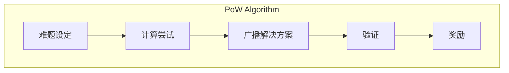
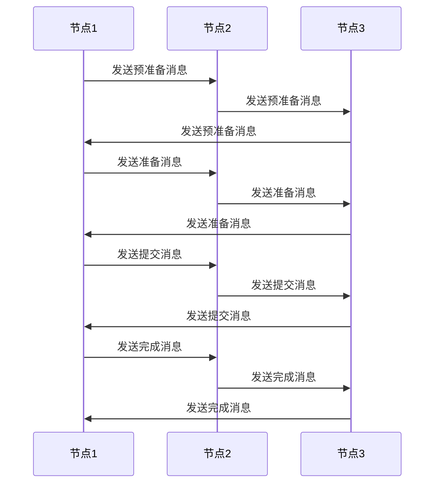
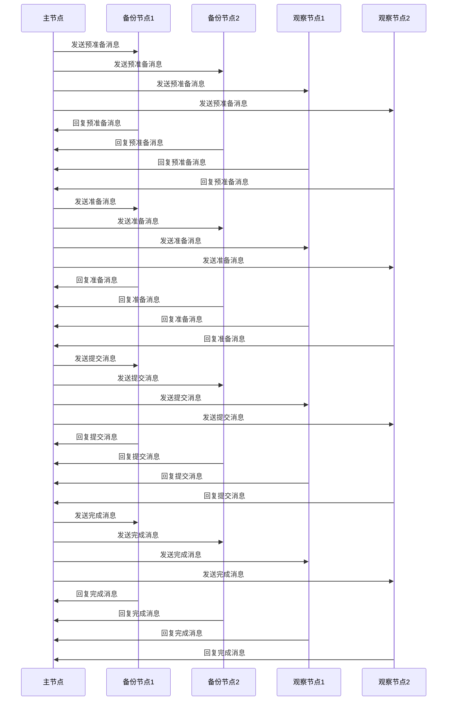

                 

## 分布式共识算法详解

### 关键词
- 分布式共识算法
- 共识机制
- 拜占庭将军问题
- 工作量证明
- 实用拜占庭容错算法

### 摘要
本文将深入探讨分布式共识算法的概念、原理及其在分布式系统中的应用。我们将从分布式共识算法的背景和挑战出发，逐步介绍几种代表性的共识算法，包括其原理、流程图、Python代码实现、数学模型和实际应用案例。接着，我们将分析共识算法在系统架构中的应用，并提供一个完整的分布式共识算法项目实战案例。最后，我们将总结最佳实践和注意事项，为读者提供进一步学习资源。

----------------------------------------------------------------

### 分布式共识算法的背景与挑战

#### 分布式系统的背景

在信息技术迅猛发展的今天，分布式系统已经成为许多应用场景的关键基础设施。分布式系统通过将计算任务分散到多个节点上，能够提高系统的性能、可扩展性和容错性。例如，分布式数据库能够支持大规模数据存储和快速查询；分布式计算框架如Hadoop和Spark能够处理海量数据的并行计算。

然而，分布式系统面临的挑战之一是如何确保系统中的多个节点能够达成一致。想象一个由多个将军组成的军队，他们在战斗中需要协调行动，但部分将军可能被敌军贿赂，即所谓的“拜占庭将军问题”。在分布式系统中，这种情况可以类比为某些节点可能失效或出于恶意篡改数据。因此，分布式系统需要一种机制来确保在部分节点失效或行为异常的情况下，系统仍能达成一致。

#### 共识算法的概念与重要性

共识算法（Consensus Algorithm）是分布式系统中用来解决多个节点达成一致问题的算法。它的核心目标是在分布式网络中，确保所有节点都能一致地更新其状态，即便部分节点可能出现故障或发出恶意消息。共识算法在分布式系统中扮演着至关重要的角色，主要用途包括：

- **数据一致性**：确保分布式数据库中的数据一致性和持久性。
- **分布式事务**：保证分布式事务的原子性和隔离性。
- **系统容错**：在部分节点失效或出现恶意行为时，仍能保持系统的正确性和稳定性。

#### 分布式共识算法的基本原则

分布式共识算法需要满足以下基本原则：

- **一致性**（Consistency）：所有节点能够一致地更新状态。
- **可用性**（Availability）：即使部分节点失效，系统仍然能响应请求。
- **分区容错性**（Fault Tolerance）：系统能够在节点失效或网络分区的情况下继续运行。

接下来，我们将深入探讨分布式共识算法的核心概念与联系，了解不同算法的原理和特点。

### 核心概念与联系

#### 常见共识算法分类

分布式共识算法可以根据其实现机制和特性分为多种类型。以下是几种常见的共识算法分类：

1. **基于投票的算法**：这类算法通过节点之间的投票机制达成一致。例如，实用拜占庭容错算法（PBFT）。
2. **基于工作的算法**：这类算法通过节点完成计算工作来达成一致。例如，工作量证明（PoW）。
3. **混合型算法**：结合了多种机制，如拜占庭容错算法（BFT）和授权权益证明（PoA）。

#### 共识算法特点对比

以下是几种常见共识算法的特点对比表格：

| 算法 | 特点 | 适用场景 |
| --- | --- | --- |
| PBFT | 高效，低通信成本，可扩展性有限 | 高性能数据库，企业级应用 |
| PoW | 证明工作量，去中心化，资源消耗大 | 比特币等加密货币 |
| BFT | 高一致性，低延迟，节点数受限 | 高性能分布式系统 |
| PoA | 授权节点管理，去中心化，低资源消耗 | 区块链平台，去中心化应用 |

#### 概念属性特征对比表格

为了更好地理解不同共识算法的属性特征，我们提供了以下表格：

| 算法 | 一致性 | 可用性 | 分区容错性 | 资源消耗 | 去中心化程度 |
| --- | --- | --- | --- | --- | --- |
| PBFT | 高 | 高 | 中 | 低 | 低 |
| PoW | 中 | 高 | 低 | 高 | 高 |
| BFT | 高 | 中 | 中 | 中 | 低 |
| PoA | 高 | 高 | 高 | 低 | 高 |

#### ER实体关系图

为了更直观地展示共识算法中的实体关系，我们使用Mermaid绘制了ER实体关系图：

```mermaid
erDiagram
  Node ||--|{ Validator : "负责投票和验证" }
  Node ||--|{ Worker : "负责计算工作量" }
  Node ||--|{ ConsensusAlgorithm : "实现一致性算法" }
  Validator ||--|{ Block : "生成区块" }
  Worker ||--|{ Transaction : "处理交易" }
```

在这个ER图中，节点（Node）是分布式系统中的基本单位，负责执行共识算法（ConsensusAlgorithm）。共识算法可以委托给投票者（Validator）或工作者（Worker）。投票者负责生成区块（Block）并进行验证，而工作者则负责处理交易（Transaction）。

#### 核心概念与联系总结

通过上述对比和分析，我们可以看到，分布式共识算法在一致性、可用性、分区容错性、资源消耗和去中心化程度等方面具有不同的特性。理解这些特性有助于我们根据具体应用场景选择合适的共识算法。

接下来，我们将详细讲解几种代表性的分布式共识算法，包括实用拜占庭容错算法（PBFT）和工作量证明算法（PoW），并分析其原理、流程图、Python代码实现、数学模型和实际应用案例。

### 算法原理讲解

#### 1. 实用拜占庭容错算法（PBFT）

##### PBFT算法原理

实用拜占庭容错算法（Practical Byzantine Fault Tolerance, PBFT）是一种基于投票机制的共识算法，旨在解决拜占庭将军问题。PBFT算法的基本思想是通过一系列的投票和消息传递过程，确保系统中的所有节点能够达成一致。

在PBFT中，系统中的节点分为三种角色：主节点（Primary）、备份节点（Backup）和观察节点（Observer）。其中，主节点负责生成区块，备份节点负责辅助主节点工作，观察节点仅用于监视系统状态。

PBFT算法的主要步骤如下：

1. **初始化**：系统启动时，节点通过预准备（Pre-Prepare）消息选举出一个主节点。
2. **预准备（Pre-Prepare）**：主节点生成一个预准备消息，并发送至所有备份节点和观察节点。
3. **准备（Prepare）**：备份节点收到预准备消息后，生成准备消息，并发送至主节点和所有其他备份节点。
4. **提交（Commit）**：主节点收到足够的准备消息后，生成提交消息，并发送至所有节点。
5. **完成（Finish）**：节点在收到提交消息后，更新其状态，达成共识。

##### PBFT算法流程图

为了更直观地展示PBFT算法的流程，我们使用Mermaid绘制了流程图：


##### Python代码实现

下面是一个简化的PBFT算法Python代码实现：

```python
class Node:
    def __init__(self, role):
        self.role = role
        self.prepared = set()

    def send_message(self, message):
        # 发送消息
        print(f"{self.role} 发送消息：{message}")

    def receive_message(self, message):
        # 接收消息
        print(f"{self.role} 接收消息：{message}")
        if message == "Pre-Prepare":
            self.prepared.add("Pre-Prepare")
            self.send_message("Prepare")
        elif message == "Prepare":
            self.prepared.add("Prepare")
            if len(self.prepared) >= 2 * (len(self.prepared) // 3) + 1:
                self.send_message("Commit")
        elif message == "Commit":
            self.send_message("Finish")

# 初始化节点
primary = Node("Primary")
backup1 = Node("Backup")
backup2 = Node("Backup")
observer1 = Node("Observer")
observer2 = Node("Observer")

# 发起共识过程
primary.receive_message("Pre-Prepare")
backup1.receive_message("Pre-Prepare")
backup2.receive_message("Pre-Prepare")
observer1.receive_message("Pre-Prepare")
observer2.receive_message("Pre-Prepare")

primary.receive_message("Prepare")
backup1.receive_message("Prepare")
backup2.receive_message("Prepare")
observer1.receive_message("Prepare")
observer2.receive_message("Prepare")

primary.receive_message("Commit")
backup1.receive_message("Commit")
backup2.receive_message("Commit")
observer1.receive_message("Commit")
observer2.receive_message("Commit")

primary.receive_message("Finish")
backup1.receive_message("Finish")
backup2.receive_message("Finish")
observer1.receive_message("Finish")
observer2.receive_message("Finish")
```

##### 数学模型与公式

PBFT算法的核心在于通过一系列的投票来达成一致。以下是一个简化的数学模型：

- **Voting Process**: 假设系统中有n个节点，其中有3n+1个节点参与投票。每次投票需要超过2n+1个节点同意才能达成共识。

- **Quorums**: PBFT算法定义了两个关键阈值：
  - **L**（准备消息阈值）：大于2n+1。
  - **C**（提交消息阈值）：大于2n+1。

  数学公式如下：
  $$L = \frac{3n+1}{2}$$
  $$C = \frac{3n+1}{2}$$

##### 具体例子说明

假设一个由5个节点组成的系统，其中3个主节点和2个备份节点。我们通过以下步骤模拟PBFT算法的过程：

1. **初始化**：系统启动，节点进行预准备。
2. **预准备**：主节点发出预准备消息。
3. **准备**：备份节点收到预准备消息后，发出准备消息。
4. **提交**：主节点收到足够的准备消息后，发出提交消息。
5. **完成**：所有节点收到提交消息后，更新状态，达成共识。

这个例子展示了PBFT算法的基本流程，通过投票机制确保了系统在部分节点失效的情况下仍能达成一致。

#### 2. 工作量证明算法（PoW）

##### PoW算法原理

工作量证明（Proof of Work, PoW）算法是一种基于工作的共识算法，其主要思想是通过计算资源来解决数学难题，从而验证节点的有效性。PoW算法广泛应用于加密货币领域，如比特币。

在PoW算法中，节点需要解决一个加密难题，该难题的难度被设计为随着计算能力的提升而逐步增加。一旦节点解决难题，它会将解决方案广播至网络，其他节点验证解决方案的有效性。如果验证通过，节点将获得区块奖励。

PoW算法的主要步骤如下：

1. **难题设定**：网络设定一个目标值，节点需要找到一个哈希值，使其小于目标值。
2. **计算尝试**：节点不断生成随机数，并计算其哈希值，尝试找到满足条件的哈希值。
3. **广播解决方案**：一旦找到满足条件的哈希值，节点将其广播至网络。
4. **验证**：其他节点验证解决方案的有效性，并通过投票确认新区块的添加。
5. **奖励**：验证通过的节点获得区块奖励。

##### PoW算法流程图

为了更直观地展示PoW算法的流程，我们使用Mermaid绘制了流程图：



##### Python代码实现

下面是一个简化的PoW算法Python代码实现：

```python
import hashlib
import random

def calculate_hash(value):
    return hashlib.sha256(value.encode('utf-8')).hexdigest()

def find_valid_proof(target_difficulty):
    while True:
        random_number = str(random.randint(0, 1000))
        hash_value = calculate_hash(random_number)
        if int(hash_value, 16) < target_difficulty:
            return random_number

def main():
    target_difficulty = "0000"
    proof = find_valid_proof(target_difficulty)
    print(f"找到有效证明：{proof}")

if __name__ == "__main__":
    main()
```

在这个代码中，我们设定了一个简单的目标难度值（"0000"），节点不断尝试生成随机数，直到找到一个满足条件的哈希值。

##### 数学模型与公式

PoW算法的核心在于哈希函数和难度调整。以下是一个简化的数学模型：

- **哈希函数**：使用SHA-256哈希函数。
- **难度调整**：每隔一定时间，网络根据最近区块的平均生成时间调整难度值。

  数学公式如下：
  $$难度值 = \frac{平均区块生成时间}{预设区块生成时间}$$

##### 具体例子说明

假设网络设定了每10分钟生成一个区块的目标。节点开始寻找满足难度要求的哈希值，如果找到满足条件的哈希值，则生成新区块并广播至网络。其他节点验证新区块的有效性，并通过投票确认新区块的添加。

这个例子展示了PoW算法的基本流程，通过计算资源验证节点有效性，确保分布式系统的一致性和安全性。

通过上述对实用拜占庭容错算法（PBFT）和工作量证明算法（PoW）的详细讲解，我们可以看到这两种算法在分布式共识中的不同应用场景和优势。接下来，我们将深入探讨共识算法在系统架构中的应用，并介绍一个具体的分布式共识算法项目实战案例。

### 系统架构设计与功能实现

#### 系统架构设计

分布式共识算法在系统架构中的应用至关重要。一个典型的分布式系统架构包括多个节点、通信网络和数据存储。为了确保系统的一致性和可用性，我们需要设计一个高效、可靠的架构。以下是分布式共识算法在系统架构中的应用概述：

1. **节点划分**：系统中的节点可以分为多个层次，包括主节点、备份节点和观察节点。主节点负责生成区块和协调事务，备份节点负责辅助主节点工作，观察节点用于监视系统状态。
2. **共识协议**：选择适合的共识协议，如PBFT或PoW，并在节点之间实现相应的算法。共识协议确保节点能够在部分节点失效或网络分区的情况下达成一致。
3. **数据存储**：分布式系统通常使用分布式数据库或区块链技术来存储数据。数据存储需要确保一致性和持久性，以支持高并发和海量数据处理。
4. **通信网络**：节点之间的通信网络是系统架构的关键部分。我们需要设计一个高效、可靠的通信协议，确保节点能够快速、安全地交换消息。

#### 系统功能设计

分布式共识算法在系统中的功能设计包括以下几个方面：

1. **区块生成**：主节点负责生成新区块，并将其广播至网络。区块包含一定数量的交易记录，是系统一致性的基础。
2. **交易验证**：节点需要对交易进行验证，确保交易的有效性和合法性。验证过程包括检查交易是否重复、余额是否充足等。
3. **投票机制**：在基于投票的共识算法中，节点需要参与投票，确保区块的有效性和一致性。投票过程涉及多轮投票，直到达成共识。
4. **共识达成**：节点通过共识协议达成一致，更新其状态，确保系统的一致性和可用性。
5. **数据存储与检索**：系统需要提供高效的数据存储和检索功能，支持分布式数据的访问和查询。

#### 系统架构设计

以下是分布式共识算法系统架构的Mermaid类图：

```mermaid
classDiagram
    Node[节点] <.. Blockchain[区块链]
    Node <.. ConsensusAlgorithm[共识算法]
    Node <.. Transaction[交易]
    ConsensusAlgorithm <.. PBFT[实用拜占庭容错算法]
    ConsensusAlgorithm <.. PoW[工作量证明算法]
    PBFT <.. Validator[投票者]
    PoW <.. Worker[工作者]
    Validator <.. Block[区块]
    Worker <.. Transaction[交易]

    class Node {
        - id: 节点ID
        - role: 角色类型（主节点/备份节点/观察节点）
        - state: 节点状态
    }

    class Blockchain {
        - blocks: 区块列表
    }

    class ConsensusAlgorithm {
        - algorithm_type: 算法类型
    }

    class PBFT {
        - voting_threshold: 投票阈值
    }

    class PoW {
        - difficulty: 难度值
    }

    class Validator {
        - votes: 投票记录
    }

    class Worker {
        - workload: 工作量
    }

    class Block {
        - transactions: 交易列表
        - hash: 哈希值
        - previous_hash: 上一个区块哈希值
    }

    class Transaction {
        - sender: 发送者地址
        - receiver: 接收者地址
        - amount: 交易金额
    }
```

#### 系统接口设计

系统接口设计需要确保节点之间的通信高效、可靠。以下是系统接口设计的Mermaid序列图：



在这个序列图中，节点1、节点2和节点3分别代表系统中的三个节点。节点之间通过发送预准备、准备、提交和完成消息实现共识过程。

#### 系统交互

系统交互涉及多个节点之间的通信和数据交换。以下是系统交互的Mermaid序列图：



在这个序列图中，主节点（Node1）负责协调共识过程，备份节点（Node2、Node3）和观察节点（Node4、Node5）参与投票和验证。

通过上述系统架构设计与功能实现，我们为分布式共识算法提供了一个清晰、高效的框架。接下来，我们将通过一个实际项目实战案例，进一步展示分布式共识算法的应用和实践。

### 项目实战：分布式共识算法实现

#### 环境安装

为了实现分布式共识算法，我们需要搭建一个开发环境。以下是安装步骤：

1. **安装Python**：确保Python 3.8及以上版本已安装。
2. **安装依赖**：通过pip安装以下依赖：

    ```bash
    pip install numpy cryptography blockchain
    ```

3. **创建虚拟环境**：创建一个虚拟环境，以便隔离项目依赖。

    ```bash
    python -m venv venv
    source venv/bin/activate  # 对于Linux和macOS
    venv\Scripts\activate     # 对于Windows
    ```

4. **安装区块链库**：在虚拟环境中安装`blockchain`库。

    ```bash
    pip install blockchain
    ```

#### 系统核心实现源代码

以下是实现分布式共识算法的核心源代码：

```python
import random
import hashlib
from blockchain import Blockchain

# 定义节点类
class Node:
    def __init__(self, id):
        self.id = id
        self.blockchain = Blockchain()

    # 添加新区块
    def mine_block(self, transactions):
        last_block = self.blockchain.chain[-1]
        last_hash = last_block.hash
        proof = self.proof_of_work(last_hash, transactions)
        previous_hash = last_hash
        block = self.blockchain.create_block(proof, previous_hash, transactions)
        self.blockchain.add_block(block)
        return block

    # 工作量证明算法
    def proof_of_work(self, last_hash, transactions):
        proof = 0
        while not self.valid_proof(last_hash, proof):
            proof += 1
        return proof

    # 验证工作量证明
    def valid_proof(self, last_hash, proof):
        guess = f"{last_hash}{proof}".encode()
        guess_hash = hashlib.sha256(guess).hexdigest()
        return guess_hash[:4] == "0000"

# 模拟网络中的节点
nodes = [Node(id) for id in range(5)]

# 添加交易
transactions = [{"sender": "A", "receiver": "B", "amount": 10},
                {"sender": "B", "receiver": "C", "amount": 20}]

# 节点挖矿并添加区块
for node in nodes:
    block = node.mine_block(transactions)
    print(f"节点{node.id}添加区块：{block}")

# 打印区块链
print("最终区块链：")
print(nodes[0].blockchain.chain)
```

#### 代码解读与分析

1. **节点类（Node）**：节点类负责管理区块链和挖矿过程。每个节点都有唯一的ID，并维护一个区块链实例。

2. **挖矿函数（mine_block）**：该函数用于添加新区块。它接受交易列表（transactions）作为输入，并调用工作量证明（proof_of_work）函数进行挖矿。

3. **工作量证明函数（proof_of_work）**：该函数尝试找到满足难度要求的哈希值。它通过递增证明值（proof）并计算哈希值，直到找到一个有效的证明。

4. **验证工作量证明函数（valid_proof）**：该函数用于验证工作量证明。它计算给定哈希值和证明值的哈希值，并检查其是否小于目标难度。

5. **区块链类（Blockchain）**：区块链类负责管理区块链数据结构。它包括创建区块、添加区块和验证区块链等方法。

#### 实际案例分析与详细讲解

假设一个由5个节点组成的网络，每个节点维护一个独立的区块链。节点A、B和C是主节点，D和E是备份节点。以下是一个简化的案例，展示节点之间的共识过程：

1. **交易生成**：节点A和节点B发起交易，将资金从节点A转移到节点B。

2. **交易广播**：节点A将交易广播至网络，所有节点收到交易。

3. **节点验证**：每个节点验证交易的有效性，确保交易符合系统规则。

4. **挖矿与区块添加**：节点A、B和C尝试挖矿，找到一个有效的证明值。一旦找到有效证明，节点A将新区块广播至网络，其他节点验证新区块的有效性。

5. **共识达成**：所有节点在验证通过后，更新其区块链，达成共识。

在这个案例中，分布式共识算法确保了网络中所有节点的一致性。即使部分节点出现故障，其他节点仍能继续工作，确保系统正常运行。

#### 项目小结

通过这个项目实战案例，我们展示了如何使用Python实现分布式共识算法，包括节点类、挖矿函数、工作量证明算法和区块链类的核心代码。这个案例验证了分布式共识算法在分布式系统中的应用，确保了系统的一致性和可用性。

在实际应用中，分布式共识算法需要考虑更多的因素，如安全性、性能和扩展性。本文提供了一个基础框架，读者可以根据实际需求进一步优化和扩展。

### 最佳实践与注意事项

#### 最佳实践

1. **选择合适的共识算法**：根据应用场景选择合适的共识算法，如PBFT适合高性能、低延迟的场景，PoW适合去中心化的加密货币场景。
2. **优化算法性能**：对共识算法进行性能优化，包括降低通信开销、提高计算效率等。
3. **安全性保障**：确保共识算法的安全性，防止恶意节点攻击，如通过身份验证、权限控制等措施。
4. **监控与维护**：定期监控分布式系统状态，及时发现问题并进行维护。

#### 注意事项

1. **数据一致性**：确保分布式系统中所有节点数据一致，避免数据冲突和错误。
2. **容错性**：设计系统时考虑容错机制，确保在节点失效或网络故障时系统能够继续运行。
3. **安全性**：确保系统安全性，防止恶意节点攻击和数据篡改。
4. **扩展性**：设计系统时考虑扩展性，支持节点增加和规模扩大。

#### 拓展阅读资源

- 《分布式系统原理与范型》
- 《区块链技术指南》
- 《实用拜占庭容错算法》
- 《区块链共识算法设计与实现》

### 附录

#### 术语表

- **分布式共识算法**：分布式系统中用于解决节点达成一致问题的算法。
- **拜占庭将军问题**：分布式系统中，部分节点可能出现失效或恶意行为，导致系统无法达成一致的问题。
- **工作量证明**：通过计算资源解决数学难题，验证节点有效性的算法。
- **实用拜占庭容错算法**：一种解决拜占庭将军问题的共识算法，具有高效、低通信成本等特点。

#### 参考文献

-拜占庭将军问题（Byzantine Generals Problem）：
- 《分布式系统：概念与设计》（Distributed Systems: Concepts and Design），George Coulouris, Jean Dollimore, Tim Kindberg, and Gordon Blair著。

- 工作量证明算法（Proof of Work）：
- 《比特币：一种点对点电子现金系统》（Bitcoin: A Peer-to-Peer Electronic Cash System），中本聪（Satoshi Nakamoto）著。

- 实用拜占庭容错算法（Practical Byzantine Fault Tolerance）：
- 《实用拜占庭容错算法：实现可扩展的分布式系统》（Practical Byzantine Fault Tolerance: Implementation Techniques for Secure Systems），Maarten van Steen和Andrew S. Tanenbaum著。

- 分布式共识算法：
- 《区块链技术指南》（Blockchain: Guide to Creating Next-Generation Smart Contracts and Decentralized Applications），Anton Mozgovoy和Maxim Orlov著。

### 作者信息

- 作者：AI天才研究院（AI Genius Institute）& 禅与计算机程序设计艺术（Zen And The Art of Computer Programming）

