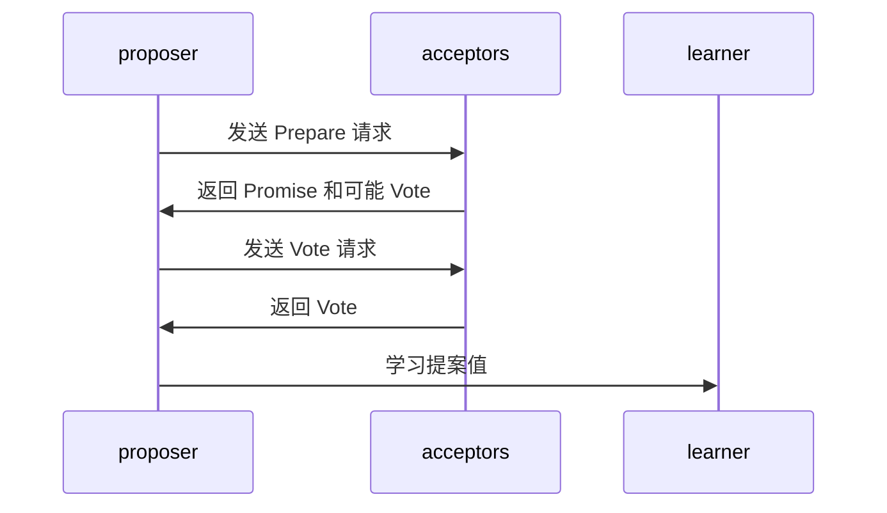
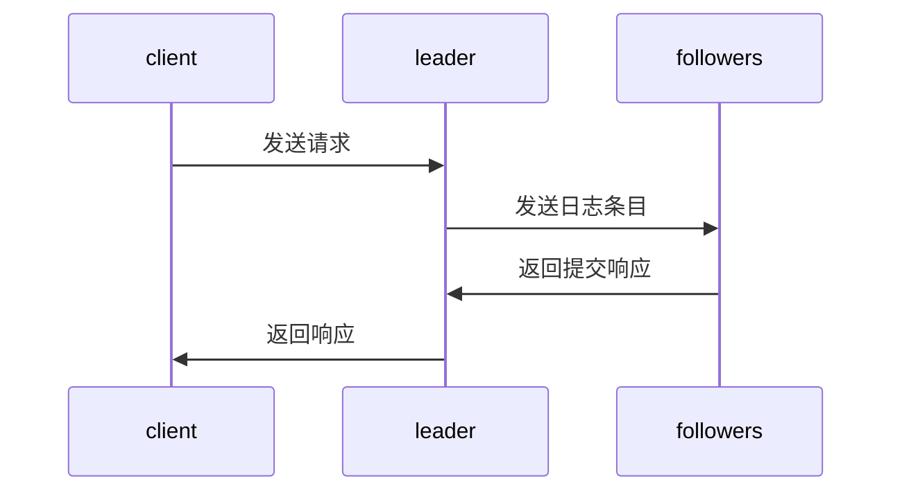
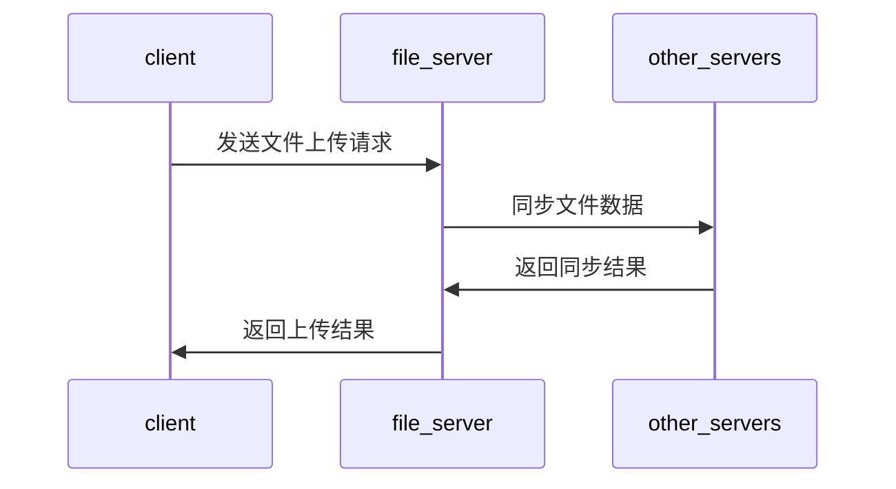
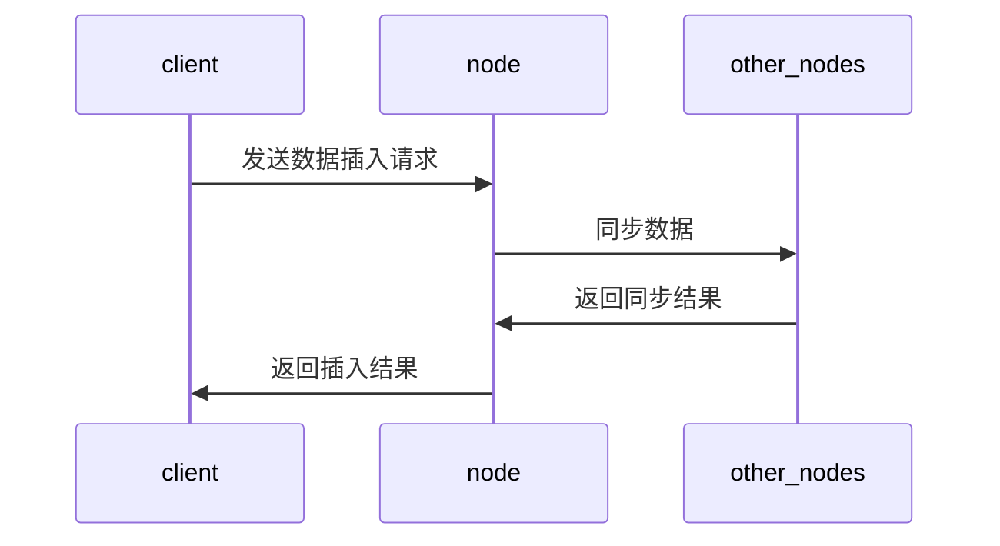
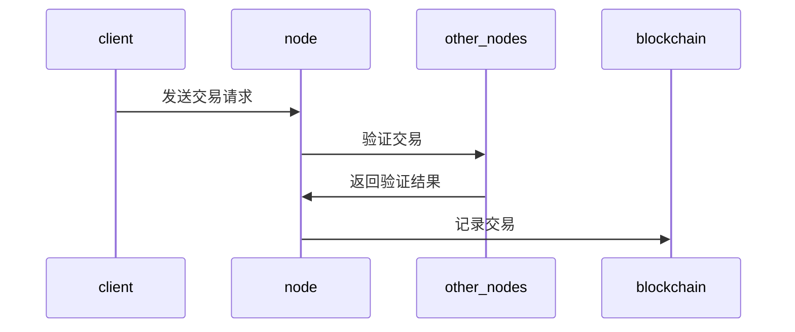

                 


### 引言：分布式系统中的共识问题

在分布式系统中，共识问题是一个核心挑战。所谓共识，即多个节点在分布式系统中就某个决策达成一致的过程。分布式系统中的节点由于网络延迟、故障、甚至恶意攻击等原因，很难保证始终能够同步状态，这就需要一种机制来确保当大部分节点达成一致时，整个系统能够做出正确的决策。

**关键词：** 分布式系统、共识问题、节点同步、网络延迟

**摘要：** 本文将探讨分布式系统中的共识问题，介绍几种主要的分布式共识算法，包括Paxos、Raft等，并分析它们的实现和应用。

#### 1.1 分布式系统的基本概念

分布式系统是由多个节点组成的系统，这些节点通过网络进行通信，共同完成某个任务。分布式系统的基本概念包括：

- **节点（Node）**：分布式系统中的单个计算单元。
- **网络（Network）**：节点之间进行通信的媒介。
- **一致性（Consistency）**：系统中的所有节点能够访问到相同的数据视图。
- **可用性（Availability）**：系统在发生故障时，仍然能够对外提供服务的能力。

**问题背景：** 随着互联网和云计算的快速发展，分布式系统已经广泛应用于各种领域，如电子商务、社交媒体、在线游戏等。然而，这些系统面临着一系列挑战，其中共识问题是关键之一。

**问题描述：** 在分布式系统中，节点之间的网络连接可能不稳定，导致它们无法实时同步状态。当系统需要做出决策时，如数据库更新、领导选举等，如何确保大多数节点能够就某个值或决策达成一致？

**问题解决：** 为了解决共识问题，分布式系统采用了各种算法和协议。这些算法和协议的核心目标是确保即使在节点部分失败或网络分区的情况下，系统仍能就某个决策达成一致。

**边界与外延：** 分布式共识问题不仅涉及算法的设计，还涉及到系统的架构设计、网络通信机制、容错能力等多个方面。

#### 1.2 分布式共识问题的起源与重要性

**核心概念术语说明：** 

- **拜占庭将军问题（Byzantine Generals Problem）**：拜占庭将军问题是一个经典的分布式系统问题，描述了在分布式系统中，当部分节点可能发生恶意行为时，如何确保系统整体达成一致。
- **共识算法（Consensus Algorithm）**：共识算法是一种分布式算法，用于确保多个节点能够就某个决策达成一致。
- **容错（Fault Tolerance）**：容错是指系统能够在部分节点发生故障时继续运行的能力。

**问题背景：** 分布式共识问题起源于对分布式系统可靠性的需求。在分布式系统中，节点可能因为各种原因（如硬件故障、网络中断等）无法正常工作，这就要求系统能够在部分节点失效的情况下，仍然保持一致性。

**问题描述：** 当一个分布式系统中的节点数量大于单个节点的数量时，如何确保系统能够在部分节点发生故障时，仍然能够达成一致？

**问题解决：** 通过设计共识算法，分布式系统能够在部分节点失效或网络分区的情况下，仍然能够达成一致。

**核心要素组成：** 分布式共识算法的核心要素包括：节点通信机制、状态同步机制、故障检测与恢复机制。

#### 1.3 共识算法的核心要素

共识算法的核心要素决定了算法的有效性和可靠性。以下是共识算法的几个关键要素：

- **领导者选举（Leader Election）**：在分布式系统中，领导者负责协调节点之间的通信和决策。领导者选举是共识算法的关键部分。
- **日志复制（Log Replication）**：日志复制是指将领导者的日志条目复制到其他节点。这是确保节点之间状态一致性的关键步骤。
- **状态机复制（State Machine Replication）**：状态机复制是指通过复制状态机来确保系统中所有节点的状态一致性。
- **故障检测与恢复（Fault Detection and Recovery）**：共识算法需要能够检测节点故障，并在必要时进行恢复，以保证系统的连续性。

**核心概念与联系：**

| 核心概念           | 原理与特征                                                                                   |
|------------------|--------------------------------------------------------------------------------------------|
| 领导者选举         | 确保系统中有且只有一个领导者，负责协调节点之间的通信和决策。                                     |
| 日志复制           | 确保领导者的日志条目能够被复制到其他节点，以保证系统状态的一致性。                               |
| 状态机复制         | 通过复制状态机，确保系统中所有节点的状态一致性。                                                   |
| 故障检测与恢复      | 能够检测节点故障，并在必要时进行恢复，以保证系统的连续性和一致性。                                 |

**ER实体关系图架构的Mermaid流程图：**

```mermaid
erDiagram
  Node --> Leader :选举
  Node --> Replication :复制
  Leader --> State :管理
  Node --> Fault :检测与恢复
```

通过以上核心要素的协同工作，分布式共识算法能够确保系统在分布式环境中的可靠性和一致性。

### Paxos算法原理与实现

#### 2.1 Paxos算法的基本原理

Paxos算法是一种经典的分布式共识算法，由莱斯利·兰伯特（Leslie Lamport）在1990年提出。Paxos算法的目标是在分布式系统中实现一致性，即使部分节点发生故障或网络延迟。Paxos算法的核心思想是通过一系列的提议和投票过程，确保大多数节点能够在某个值上达成一致。

**核心概念术语说明：**

- **提议者（Proposer）**：提议者生成提案，并尝试在系统中达成一致。
- **接受者（Acceptor）**：接受者负责接收和投票提议。
- **学习者（Learner）**：学习者负责学习已经达成一致的值。

**问题背景：** Paxos算法旨在解决拜占庭将军问题，即在一个分布式系统中，当部分节点可能发生恶意行为时，如何确保系统整体达成一致。

**问题描述：** 在分布式系统中，如何确保即使部分节点发生故障或网络延迟，系统能够在某个值上达成一致？

**问题解决：** Paxos算法通过一系列提议和投票过程，确保大多数节点能够在某个值上达成一致。

**边界与外延：** Paxos算法适用于需要高一致性要求的分布式系统，如分布式数据库、分布式文件系统等。

**核心要素组成：**

- **提议（Proposal）**：提议包括一个唯一的提案编号和一个值。
- **投票（Vote）**：投票是指接受者对提议的响应，表示是否接受提议。
- **学习（Learning）**：学习者学习已经达成一致的值。

**Paxos算法的协议流程：**

Paxos算法的协议流程可以分为三个阶段：提议、投票和学习。

1. **提议阶段**：提议者生成一个提案，并向接受者发送准备请求（Prepare Request）。接受者收到准备请求后，必须先拒绝所有旧的提案，然后承诺不再接受任何小于该提案编号的提案。

2. **投票阶段**：接受者收到准备请求后，向提议者返回一个承诺（Promise）和可能的投票（Vote）。承诺表示接受者将不再接受任何小于该提案编号的提案，而投票则是接受者对提议的响应，表示是否接受该提案。

3. **学习阶段**：提议者收到来自大多数接受者的投票后，确认提案被接受，然后将值学习（Learn）到本地状态机中。

**Paxos算法的状态转换：**

Paxos算法中的状态转换可以分为以下几个状态：

- **睡眠状态（Sleeping）**：提议者处于睡眠状态，等待生成新的提案。
- **准备状态（Prepared）**：提议者发送准备请求，等待接受者的响应。
- **接受状态（Accepted）**：接受者承诺不再接受任何小于该提案编号的提案，并投票给提议者。
- **学习状态（Learned）**：学习者学习到已经达成一致的值。

**Paxos算法的详细实现：**

Paxos算法的实现涉及多个组件，包括提议者、接受者和学习者。以下是一个简化的Paxos算法实现：

```python
# 提议者
def propose(value):
    proposal_id = next ProposalID
    while True:
        prepare_request = PrepareRequest(proposal_id, value)
        responses = send_prepare_request_to_acceptors(acceptors, prepare_request)
        if majority_of_acceptors_promise(proposal_id):
            vote_request = VoteRequest(proposal_id, value)
            responses = send_vote_request_to_acceptors(acceptors, vote_request)
            if majority_of_acceptors_vote(proposal_id, value):
                learn(value)
                break

# 接受者
def accept(proposal):
    if proposal_id > last_accepted_id:
        last_accepted_id = proposal_id
        value = proposal.value
        promise(proposal_id, value)
        vote(proposal_id, value)

# 学习者
def learn(value):
    current_state_machine.append(value)
```

**算法原理讲解：**

Paxos算法的原理可以通过以下数学模型和公式进行解释：

- **提议编号（Proposal ID）**：提议编号由提案者生成，用于标识不同的提议。
- **多数派（Majority）**：在分布式系统中，多数派是指超过一半的节点。
- **承诺（Promise）**：接受者对提案的承诺，表示不再接受任何小于该提案编号的提案。
- **投票（Vote）**：接受者对提案的投票，表示接受或拒绝该提案。

以下是一个简化的Paxos算法流程的Mermaid流程图：



通过这个流程图，我们可以清晰地看到Paxos算法的核心步骤和状态转换。

**数学公式使用LaTeX格式：**

$$
\text{Prepare Request}(proposal_id, value) \rightarrow \text{Promise}(proposal_id, value)
$$

$$
\text{Vote Request}(proposal_id, value) \rightarrow \text{Vote}(proposal_id, value)
$$

**举例说明：**

假设一个分布式系统中有三个节点A、B和C，提议者P向节点发送准备请求。节点A和节点B返回承诺，而节点C由于网络延迟未及时响应。提议者P收到来自节点A和节点B的承诺后，发送投票请求。节点A和节点B返回投票，表示接受提案。此时，提议者P确认提案被接受，将值学习到本地状态机中。

通过以上讲解，我们可以看到Paxos算法在分布式系统中的重要作用和实现原理。Paxos算法通过一系列提议和投票过程，确保大多数节点能够在某个值上达成一致，从而实现分布式系统的一致性。

### Paxos算法的改进与优化

尽管Paxos算法在分布式系统中实现了一致性，但它也存在一些性能和扩展性问题。为了解决这些问题，研究人员提出了多种改进和优化方案，如Fast Paxos、Multi-Paxos等。以下是对这些改进方案的详细分析。

#### 4.1 Fast Paxos

Fast Paxos是对传统Paxos算法的一种改进，旨在提高性能。Fast Paxos通过减少通信次数和优化协议流程，减少了延迟和资源消耗。

**核心概念术语说明：**

- **快速提议（Fast Proposal）**：快速提议是指提议者在发起提案时，无需等待所有接受者的准备响应，即可发起投票请求。
- **动态心跳（Dynamic Heartbeat）**：动态心跳是一种机制，用于在提议者和接受者之间定期交换信息，以确保双方的状态同步。

**问题背景：** 传统Paxos算法的提案过程涉及多次通信，这可能导致较高的延迟和资源消耗。特别是在高负载环境下，Paxos算法的性能可能无法满足要求。

**问题描述：** 如何减少Paxos算法的通信次数，提高性能？

**问题解决：** Fast Paxos通过在提议者和接受者之间引入快速提议和动态心跳机制，减少通信次数，提高性能。

**边界与外延：** Fast Paxos适用于需要高性能和低延迟的分布式系统，如高性能交易系统、实时数据处理系统等。

**核心要素组成：**

- **快速提议**：提议者在发起提案时，无需等待所有接受者的准备响应，即可发起投票请求。
- **动态心跳**：提议者和接受者之间定期交换信息，以确保双方的状态同步。

**Fast Paxos的协议流程：**

Fast Paxos的协议流程与传统Paxos相似，但在提案和投票阶段进行了优化。

1. **快速提议阶段**：提议者生成提案，并发送快速提议请求到接受者。提议者无需等待所有接受者的准备响应，即可发起投票请求。
2. **投票阶段**：接受者收到快速提议请求后，返回承诺和投票。提议者收到来自大多数接受者的投票后，确认提案被接受。
3. **动态心跳阶段**：提议者和接受者之间定期交换动态心跳信息，以保持状态同步。

**Fast Paxos的优缺点：**

- **优点**：减少了通信次数，提高了性能和响应速度。
- **缺点**：在某些情况下，可能会增加系统的复杂性，并可能导致提案被接受者拒绝。

**Fast Paxos的实现示例：**

```python
# 提议者
def fast_propose(value):
    proposal_id = next ProposalID
    prepare_request = PrepareRequest(proposal_id, value)
    responses = send_prepare_request_to_acceptors(acceptors, prepare_request)
    if majority_of_acceptors_promise(proposal_id):
        vote_request = VoteRequest(proposal_id, value)
        responses = send_vote_request_to_acceptors(acceptors, vote_request)
        if majority_of_acceptors_vote(proposal_id, value):
            learn(value)
            return True
    return False

# 接受者
def fast_accept(proposal):
    if proposal_id > last_accepted_id:
        last_accepted_id = proposal_id
        value = proposal.value
        promise(proposal_id, value)
        vote(proposal_id, value)
```

**数学公式使用LaTeX格式：**

$$
\text{Fast Prepare Request}(proposal_id, value) \rightarrow \text{Fast Promise}(proposal_id, value)
$$

$$
\text{Fast Vote Request}(proposal_id, value) \rightarrow \text{Fast Vote}(proposal_id, value)
$$

**举例说明：**

假设一个分布式系统中有三个节点A、B和C，提议者P向节点发送快速提议请求。节点A和节点B返回承诺，而节点C由于网络延迟未及时响应。提议者P收到来自节点A和节点B的承诺后，发送快速投票请求。节点A和节点B返回快速投票，表示接受提案。此时，提议者P确认提案被接受，将值学习到本地状态机中。

通过Fast Paxos，我们可以看到在分布式系统中提高性能的一种有效方法。Fast Paxos通过减少通信次数和优化协议流程，提高了系统的响应速度和性能。

#### 4.2 Multi-Paxos

Multi-Paxos是对Paxos算法的一种扩展，旨在支持更高效的提案和投票过程。Multi-Paxos通过引入多个提案者，提高了系统的吞吐量和并发能力。

**核心概念术语说明：**

- **多提议者（Multiple Proposers）**：在Multi-Paxos中，系统中有多个提议者，每个提议者可以同时发起提案。
- **批量投票（Batch Voting）**：批量投票是指多个提议者在同一时间内发起提案，接受者对这组提案进行一次性投票。

**问题背景：** Paxos算法在处理大量并发提案时，性能可能受到限制。特别是在高并发场景下，单个提议者的提案速度可能无法满足系统需求。

**问题描述：** 如何在分布式系统中支持多个提议者，提高提案和投票的并发能力？

**问题解决：** Multi-Paxos通过引入多提议者和批量投票机制，提高了系统的吞吐量和并发能力。

**边界与外延：** Multi-Paxos适用于需要高并发和大量提案的分布式系统，如大型分布式数据库、分布式缓存系统等。

**核心要素组成：**

- **多提议者**：系统中有多个提议者，可以同时发起提案。
- **批量投票**：接受者对多个提议者同时发起的提案进行一次性投票。

**Multi-Paxos的协议流程：**

Multi-Paxos的协议流程与传统Paxos类似，但引入了多个提议者和批量投票机制。

1. **提议阶段**：多个提议者同时生成提案，并发送准备请求到接受者。
2. **投票阶段**：接受者收到准备请求后，返回承诺和投票。提议者收到来自大多数接受者的投票后，确认提案被接受。
3. **学习阶段**：提议者将已经达成一致的值学习到本地状态机中。

**Multi-Paxos的实现示例：**

```python
# 提议者
def multi_propose(value):
    proposal_id = next ProposalID
    prepare_request = PrepareRequest(proposal_id, value)
    responses = send_prepare_request_to_acceptors(acceptors, prepare_request)
    if majority_of_acceptors_promise(proposal_id):
        vote_request = VoteRequest(proposal_id, value)
        responses = send_vote_request_to_acceptors(acceptors, vote_request)
        if majority_of_acceptors_vote(proposal_id, value):
            learn(value)
            return True
    return False

# 接受者
def multi_accept(proposal):
    if proposal_id > last_accepted_id:
        last_accepted_id = proposal_id
        value = proposal.value
        promise(proposal_id, value)
        vote(proposal_id, value)
```

**数学公式使用LaTeX格式：**

$$
\text{Multi Prepare Request}(proposal_id, value) \rightarrow \text{Multi Promise}(proposal_id, value)
$$

$$
\text{Multi Vote Request}(proposal_id, value) \rightarrow \text{Multi Vote}(proposal_id, value)
$$

**举例说明：**

假设一个分布式系统中有三个提议者P1、P2和P3，以及三个接受者A、B和C。P1、P2和P3同时生成提案，并发送准备请求到接受者。接受者A和接受者B返回承诺，而接受者C由于网络延迟未及时响应。P1、P2和P3收到来自接受者A和接受者B的承诺后，发送批量投票请求。接受者A和接受者B返回批量投票，表示接受所有提案。此时，P1、P2和P3确认提案被接受，将值学习到本地状态机中。

通过Multi-Paxos，我们可以看到在分布式系统中提高并发能力和吞吐量的有效方法。Multi-Paxos通过引入多个提议者和批量投票机制，提高了系统的并发能力和响应速度。

#### 4.3 Paxos的改进与实践

除了Fast Paxos和Multi-Paxos，研究人员还提出了其他多种Paxos算法的改进方案，以适应不同的应用场景和需求。以下是一些常见的改进方案：

- **Paxos-Murdoch**：Paxos-Murdoch是一种基于Paxos的分布式锁算法，用于实现分布式系统中的并发控制。Paxos-Murdoch通过引入锁机制，确保分布式系统中的多个进程可以正确地共享资源。
- **Paxos-Murdoch Optimistic**：Paxos-Murdoch Optimistic是一种基于乐观锁的改进方案，通过减少锁的开销，提高了系统的并发性能。
- **Paxos-Style Replication**：Paxos-Style Replication是一种用于分布式数据库的复制协议，基于Paxos算法的思想，确保数据库中的数据一致性。

**总结：**

Paxos算法作为分布式共识的经典算法，经过多年的发展和改进，已经形成了一系列的变体和优化方案。这些改进方案不仅提高了Paxos算法的性能和可扩展性，还适应了不同的应用场景和需求。通过不断的研究和优化，Paxos算法在分布式系统中发挥着重要的作用，为构建可靠、高效的分布式系统提供了坚实的理论基础。

### Raft算法原理与实现

#### 5.1 Raft算法的核心概念

Raft算法是由Diego Ongaro和John Ousterhout在2013年提出的一种分布式共识算法。与Paxos算法相比，Raft算法在协议设计上更加直观和易于理解。Raft算法的核心思想是通过明确领导者（Leader）的角色，简化协议流程，提高系统的可理解性和可维护性。

**核心概念术语说明：**

- **领导者（Leader）**：在Raft算法中，领导者负责处理所有客户端请求，并将日志条目复制到其他服务器（Follower）。
- **跟随者（Follower）**：跟随者负责接收领导者的日志条目，并复制到本地。
- **候选人（Candidate）**：当领导者失去连接或网络分区时，候选人负责发起领导选举。
- **日志条目（Log Entry）**：日志条目是Raft算法中的基本操作单元，包含一个操作和一个索引编号。

**问题背景：** Raft算法旨在解决Paxos算法在协议设计上的复杂性，并提供一种更加直观和易于理解的分布式共识算法。

**问题描述：** 如何在分布式系统中实现一致性，即使部分节点发生故障或网络延迟？

**问题解决：** Raft算法通过明确领导者角色，简化协议流程，确保系统能够在部分节点失效的情况下保持一致性。

**边界与外延：** Raft算法适用于需要高一致性要求和可理解性的分布式系统，如分布式数据库、分布式文件系统等。

**核心要素组成：**

- **领导者选举**：在Raft算法中，领导者负责处理所有客户端请求，并协调日志复制。
- **日志复制**：领导者将日志条目复制到跟随者，并确保日志条目在所有服务器中一致。
- **领导选举**：当领导者失去连接或网络分区时，候选人负责发起领导选举。
- **日志条目**：日志条目是Raft算法中的基本操作单元，包含一个操作和一个索引编号。

#### 5.2 Raft算法的日志复制

日志复制是Raft算法中的核心功能，它确保了系统中所有服务器的状态保持一致。Raft算法通过以下步骤实现日志复制：

1. **日志条目生成**：领导者接收到客户端请求后，生成日志条目，并将其添加到本地日志中。
2. **日志条目复制**：领导者将日志条目发送给跟随者，要求跟随者追加日志条目到本地日志。
3. **日志条目提交**：跟随者收到日志条目后，将其追加到本地日志，并返回提交响应给领导者。
4. **日志条目持久化**：领导者收到来自大多数跟随者的提交响应后，将日志条目持久化到存储介质中。

**Raft算法的日志复制流程：**

以下是Raft算法日志复制的基本流程：

1. **客户端请求**：客户端向领导者发送请求，请求包含一个操作和一个索引编号。
2. **日志条目生成**：领导者接收到客户端请求后，生成一个新的日志条目，并将其添加到本地日志中。
3. **日志条目复制**：领导者向所有跟随者发送日志条目，要求跟随者追加日志条目到本地日志。
4. **日志条目提交**：跟随者收到日志条目后，将其追加到本地日志，并返回提交响应给领导者。
5. **日志条目持久化**：领导者收到来自大多数跟随者的提交响应后，将日志条目持久化到存储介质中。

**Raft算法的日志复制实现示例：**

```python
# 领导者
def append_entry(entry):
    log.append(entry)
    send_entries_to_followers(followers, entry)

def is_majority_committed():
    committed = 0
    for status in follower_statuses.values():
        if statuscommitted:
            committed += 1
    return committed > len(followers) // 2

def persist_entry(entry):
    # 将日志条目持久化到存储介质
    pass

# 跟随者
def receive_entry(entry):
    log.append(entry)
    send_commit_response(leader, entry.index)

def send_commit_response(leader, index):
    commit_response = CommitResponse(index)
    send_message(leader, commit_response)
```

**算法原理讲解：**

Raft算法通过日志复制确保系统中所有服务器的状态一致。以下是Raft算法的核心步骤和状态转换：

1. **日志条目生成**：领导者接收到客户端请求后，生成日志条目，并将其添加到本地日志中。
2. **日志条目复制**：领导者向所有跟随者发送日志条目，要求跟随者追加日志条目到本地日志。
3. **日志条目提交**：跟随者收到日志条目后，将其追加到本地日志，并返回提交响应给领导者。
4. **日志条目持久化**：领导者收到来自大多数跟随者的提交响应后，将日志条目持久化到存储介质中。

以下是一个简化的Raft算法流程的Mermaid流程图：



通过这个流程图，我们可以清晰地看到Raft算法的核心步骤和状态转换。

**数学公式使用LaTeX格式：**

$$
\text{Append Entry Request}(entry) \rightarrow \text{Commit Response}(index)
$$

**举例说明：**

假设一个分布式系统中有三个服务器A（领导者）、B和C（跟随者），客户端C向领导者A发送一个请求。领导者A生成一个日志条目，并将其发送给跟随者B和C。跟随者B和C收到日志条目后，将其追加到本地日志，并返回提交响应给领导者A。领导者A收到来自两个跟随者的提交响应后，确认日志条目已被提交，并将响应返回给客户端C。

通过以上讲解，我们可以看到Raft算法在分布式系统中的重要作用和实现原理。Raft算法通过日志复制确保系统中所有服务器的状态一致，从而实现分布式系统的一致性。

### Raft算法的优缺点与应用场景

Raft算法作为分布式共识的一种重要实现，相较于Paxos算法具有一些显著的优点，但也存在一定的缺点。以下是对Raft算法优缺点的详细分析，并讨论其适用场景。

#### 5.1 Raft算法的优点

**易于理解：** Raft算法的设计原则是可理解性，相较于Paxos算法，Raft算法的协议流程更加直观，便于开发者理解。Raft算法通过明确领导者角色，简化了协议的复杂性。

**更好的故障恢复：** Raft算法中的故障恢复机制相对简单，当领导者失去连接或网络分区时，候选人可以快速发起领导选举，确保系统能够迅速恢复。

**更高的性能：** Raft算法在日志复制过程中，采用了批量提交的方式，减少了网络通信次数，提高了系统的性能和吞吐量。

**更好的安全性：** Raft算法通过严格的日志提交规则，确保了系统的安全性。即使部分节点发生故障或网络攻击，系统仍然能够保持一致性。

#### 5.2 Raft算法的缺点

**更高的系统复杂度：** 虽然Raft算法在可理解性方面优于Paxos算法，但对于开发者来说，仍需要深入理解算法的细节和实现，以确保系统的正确性和稳定性。

**较低的并发能力：** 相较于Paxos算法，Raft算法在处理大量并发提案时，性能可能受到限制。特别是在高并发场景下，系统的响应速度可能无法满足要求。

**对网络依赖较大：** Raft算法的日志复制过程依赖于稳定的网络连接。在网络不稳定或延迟较高的环境中，系统的一致性可能会受到影响。

#### 5.3 Raft算法的应用场景

**分布式数据库：** Raft算法在分布式数据库中得到了广泛应用，如Apache Cassandra和MongoDB等。Raft算法确保了数据库中的数据一致性，同时提供了良好的性能和故障恢复能力。

**分布式存储系统：** Raft算法适用于分布式存储系统，如Google File System（GFS）和Hadoop Distributed File System（HDFS）。Raft算法确保了存储系统的数据一致性，并在面对节点故障和网络延迟时，能够保持系统的稳定性。

**区块链技术：** Raft算法在区块链技术中也具有一定的应用价值，如一些私有区块链平台。Raft算法确保了区块链中数据的正确性和一致性，同时提供了高效的日志复制机制。

**总结：**

Raft算法作为分布式共识的一种重要实现，具有易于理解、更好的故障恢复和更高性能等优点。但在处理大量并发提案时，其性能可能受到限制。根据不同的应用场景和需求，选择合适的共识算法是确保系统可靠性和性能的关键。

### 其他分布式共识算法介绍

尽管Paxos和Raft算法在分布式系统中得到了广泛应用，但还有许多其他分布式共识算法，它们在不同的应用场景中展现出独特的优势。以下将介绍几种常见的分布式共识算法，并对它们进行简要的比较。

#### 6.1 PBFT算法

**拜占庭容错算法（Practical Byzantine Fault Tolerance, PBFT）**：PBFT算法是一种高效的分布式共识算法，最早由麻省理工学院的研究者提出。PBFT算法通过引入“预准备阶段”和“准备阶段”，提高了系统的性能和容错能力。PBFT算法能够容忍系统中最多三分之一的不诚实节点，并在满足一定条件下，实现一致性。

**优点：**

- **高性能**：PBFT算法通过减少通信次数和简化协议流程，提高了系统的性能。
- **高容错性**：PBFT算法能够容忍系统中最多三分之一的不诚实节点，具有较高的容错能力。
- **易于实现**：相较于Paxos和Raft算法，PBFT算法的设计相对简单，易于实现。

**缺点：**

- **强依赖网络**：PBFT算法对网络通信的依赖性较高，在网络不稳定的环境中，性能可能受到影响。
- **对故障检测的要求较高**：PBFT算法要求系统能够快速检测节点故障，这对于实现提出了更高的要求。

**适用场景：** PBFT算法适用于需要高一致性和高性能的分布式系统，如分布式数据库、分布式存储系统等。

#### 6.2 Cousin算法

**Cousins算法**：Cousins算法是一种基于概率的分布式共识算法，由加州大学伯克利分校的研究者提出。Cousins算法通过引入随机性和副本选择，提高了系统的容错能力和性能。

**优点：**

- **高容错性**：Cousins算法能够容忍系统中较多的不诚实节点，具有较高的容错能力。
- **低延迟**：Cousins算法通过选择最近的副本进行通信，降低了系统的延迟。
- **易于扩展**：Cousins算法的设计相对简单，易于扩展到大规模分布式系统。

**缺点：**

- **较低的一致性**：相较于Paxos和Raft算法，Cousins算法的一致性较低，可能在某些情况下导致数据不一致。
- **对副本选择的依赖**：Cousins算法的副本选择策略对系统性能和一致性有较大影响。

**适用场景：** Cousins算法适用于需要高容错性和低延迟的分布式系统，如分布式缓存系统、实时数据处理系统等。

#### 6.3 分布式一致性算法的比较与选择

**Paxos算法**：Paxos算法是一种经典的分布式共识算法，具有较好的理论和性能表现。Paxos算法适用于需要高一致性和高性能的分布式系统，但在实现和调试上较为复杂。

**Raft算法**：Raft算法相较于Paxos算法，设计更加直观和易于理解。Raft算法适用于需要高一致性和可理解性的分布式系统，但性能可能受到一定限制。

**PBFT算法**：PBFT算法是一种高效的分布式共识算法，适用于需要高一致性和高性能的分布式系统，但实现较为复杂，对故障检测的要求较高。

**Cousins算法**：Cousins算法适用于需要高容错性和低延迟的分布式系统，但一致性相对较低。

在分布式系统中选择合适的共识算法，需要根据具体的应用场景和需求进行权衡。以下是一些选择共识算法的建议：

- **高一致性要求**：如果系统对数据一致性要求较高，可以选择Paxos、Raft或PBFT算法。
- **高性能需求**：如果系统对性能要求较高，可以选择Paxos、Raft或PBFT算法。
- **低延迟需求**：如果系统对低延迟有较高要求，可以选择Cousins算法。
- **实现复杂性**：如果系统对实现复杂性有较高要求，可以选择Raft算法。

通过以上介绍和比较，我们可以看到不同的分布式共识算法在性能、一致性、实现复杂性等方面各有优劣。根据具体应用场景和需求，选择合适的共识算法是确保系统可靠性和性能的关键。

### 共识算法在实际系统中的应用

共识算法在分布式系统中的应用非常广泛，为系统的可靠性、一致性和性能提供了重要保障。以下将介绍几种常见的实际应用场景，并探讨共识算法在其中的作用。

#### 8.1 分布式存储系统

**分布式存储系统**：分布式存储系统如Google File System（GFS）和Hadoop Distributed File System（HDFS）采用了分布式共识算法来确保数据的一致性和可靠性。例如，GFS采用了Chubby锁服务，该服务基于Paxos算法，实现了分布式锁服务，确保了文件系统的一致性。

**应用场景**：分布式存储系统需要在大量节点之间同步数据，并保证数据的一致性和可靠性。共识算法在分布式存储系统中扮演了关键角色，通过确保节点之间的数据同步，提高了系统的可靠性和数据一致性。

**共识算法作用**：Paxos算法在分布式存储系统中发挥了重要作用，通过确保节点之间的数据一致性，提高了系统的容错能力和数据可靠性。Paxos算法确保了即使部分节点发生故障，系统仍能保持一致性。

#### 8.2 分布式数据库

**分布式数据库**：分布式数据库如Apache Cassandra和MongoDB采用了分布式共识算法来确保数据的一致性。Cassandra采用了Paxos算法，而MongoDB则采用了Raft算法。

**应用场景**：分布式数据库需要在多个节点之间同步数据，并确保数据的一致性。共识算法在分布式数据库系统中扮演了关键角色，通过确保节点之间的数据同步，提高了系统的可靠性和数据一致性。

**共识算法作用**：Paxos算法和Raft算法在分布式数据库系统中发挥了重要作用。Paxos算法确保了系统在部分节点故障或网络延迟的情况下，仍能保持一致性。Raft算法通过明确领导者角色，简化了协议流程，提高了系统的性能和可理解性。

#### 8.3 区块链技术

**区块链技术**：区块链技术如比特币和以太坊采用了分布式共识算法来确保交易数据的正确性和一致性。比特币采用了PBFT算法，而以太坊则采用了Raft算法。

**应用场景**：区块链技术需要在多个节点之间同步交易数据，并确保交易数据的正确性和一致性。共识算法在区块链技术中扮演了关键角色，通过确保节点之间的数据同步，提高了系统的可靠性和数据一致性。

**共识算法作用**：PBFT算法和Raft算法在区块链技术中发挥了重要作用。PBFT算法确保了系统在节点故障或网络延迟的情况下，仍能保持一致性，并提供了高效的交易处理能力。Raft算法通过明确领导者角色，简化了协议流程，提高了系统的性能和可理解性。

通过以上实际应用场景的介绍，我们可以看到共识算法在分布式系统中的重要作用。共识算法通过确保节点之间的数据同步和一致性，提高了系统的可靠性和性能，为分布式系统的稳定运行提供了有力保障。

### 共识算法应用案例剖析

#### 9.1 案例一：分布式文件系统

**项目介绍**：分布式文件系统（DFS）是一种将文件分布在多个节点上的系统，如Google File System（GFS）和Hadoop Distributed File System（HDFS）。DFS需要在多个节点之间同步文件数据，并确保数据的一致性和可靠性。

**系统功能设计**：分布式文件系统的主要功能包括文件存储、文件检索、文件同步和文件备份。DFS通过分布式共识算法，确保文件数据的同步和一致性。

**系统架构设计**：分布式文件系统的架构包括多个文件服务器、客户端和网络。文件服务器负责存储文件数据，客户端负责访问文件数据，网络负责节点之间的通信。

**系统接口设计**：分布式文件系统提供了一系列接口，如文件上传、文件下载、文件删除和文件查询等。这些接口通过分布式共识算法，确保操作的同步和一致性。

**系统交互流程**：

1. **文件上传**：客户端向文件服务器发送文件上传请求，文件服务器通过分布式共识算法，将文件数据同步到其他节点。
2. **文件下载**：客户端向文件服务器发送文件下载请求，文件服务器通过分布式共识算法，从其他节点获取文件数据。
3. **文件同步**：文件服务器通过分布式共识算法，定期同步文件数据到其他节点，确保数据的一致性。
4. **文件备份**：文件服务器通过分布式共识算法，定期备份文件数据，确保数据的安全性和可靠性。

**系统交互Mermaid序列图**：



**实际案例分析和详细讲解剖析**：以Hadoop Distributed File System（HDFS）为例，HDFS采用了Chubby锁服务，该服务基于Paxos算法，实现了分布式锁服务，确保了文件系统的一致性。在实际应用中，HDFS通过Paxos算法，确保了多个节点之间的数据同步和一致性。

**项目小结**：分布式文件系统通过分布式共识算法，确保了文件数据的一致性和可靠性。Paxos算法在分布式文件系统中的应用，提高了系统的容错能力和数据一致性，为分布式文件系统的稳定运行提供了有力保障。

#### 9.2 案例二：分布式数据库系统

**项目介绍**：分布式数据库系统（如Apache Cassandra和MongoDB）通过将数据分布在多个节点上，提高了系统的性能和可靠性。分布式数据库系统需要在多个节点之间同步数据，并确保数据的一致性和可靠性。

**系统功能设计**：分布式数据库系统的主要功能包括数据存储、数据检索、数据同步和数据备份。分布式数据库系统通过分布式共识算法，确保数据的一致性和可靠性。

**系统架构设计**：分布式数据库系统的架构包括多个节点、客户端和网络。节点负责存储数据，客户端负责访问数据，网络负责节点之间的通信。

**系统接口设计**：分布式数据库系统提供了一系列接口，如插入、查询、更新和删除等。这些接口通过分布式共识算法，确保操作的同步和一致性。

**系统交互流程**：

1. **数据插入**：客户端向节点发送数据插入请求，节点通过分布式共识算法，将数据同步到其他节点。
2. **数据查询**：客户端向节点发送数据查询请求，节点通过分布式共识算法，从其他节点获取数据。
3. **数据同步**：节点通过分布式共识算法，定期同步数据到其他节点，确保数据的一致性。
4. **数据备份**：节点通过分布式共识算法，定期备份数据，确保数据的安全性和可靠性。

**系统交互Mermaid序列图**：



**实际案例分析和详细讲解剖析**：以Apache Cassandra为例，Cassandra采用了Paxos算法，确保了多个节点之间的数据同步和一致性。在实际应用中，Cassandra通过Paxos算法，实现了分布式数据库的一致性和高可用性。

**项目小结**：分布式数据库系统通过分布式共识算法，确保了数据的一致性和可靠性。Paxos算法在分布式数据库系统中的应用，提高了系统的容错能力和数据一致性，为分布式数据库系统的稳定运行提供了有力保障。

#### 9.3 案例三：区块链网络

**项目介绍**：区块链网络如比特币和以太坊，通过分布式共识算法，确保了交易数据的正确性和一致性。区块链网络是一个去中心化的分布式数据库，通过多个节点之间的共识机制，实现了交易数据的同步和验证。

**系统功能设计**：区块链网络的主要功能包括交易记录、区块链维护、交易验证和节点同步。区块链网络通过分布式共识算法，确保了交易数据的正确性和一致性。

**系统架构设计**：区块链网络的架构包括多个节点、区块链和客户端。节点负责存储交易数据，区块链负责维护交易历史，客户端负责发起交易请求。

**系统接口设计**：区块链网络提供了一系列接口，如交易发起、交易验证和交易查询等。这些接口通过分布式共识算法，确保操作的同步和一致性。

**系统交互流程**：

1. **交易发起**：客户端向区块链网络发送交易请求，节点通过分布式共识算法，验证交易的有效性。
2. **交易验证**：节点通过分布式共识算法，验证交易的有效性，并将交易记录到区块链中。
3. **交易同步**：节点通过分布式共识算法，将交易数据同步到其他节点，确保交易数据的正确性和一致性。
4. **区块链维护**：节点通过分布式共识算法，维护区块链的完整性和一致性。

**系统交互Mermaid序列图**：



**实际案例分析和详细讲解剖析**：以比特币为例，比特币采用了PBFT算法，确保了交易数据的正确性和一致性。在实际应用中，比特币通过PBFT算法，实现了去中心化的交易验证和区块同步。

**项目小结**：区块链网络通过分布式共识算法，确保了交易数据的正确性和一致性。PBFT算法在区块链网络中的应用，提高了系统的容错能力和数据一致性，为区块链网络的稳定运行提供了有力保障。

通过以上案例的剖析，我们可以看到分布式共识算法在分布式系统中的应用及其重要作用。共识算法通过确保节点之间的数据同步和一致性，提高了系统的可靠性和性能，为分布式系统的稳定运行提供了有力保障。

### 总结与展望

#### 10.1 分布式共识算法的发展趋势

随着分布式系统在各个领域的广泛应用，分布式共识算法的研究和应用也在不断深入。以下是对分布式共识算法未来发展趋势的展望：

**新型算法的提出**：研究人员不断提出新型共识算法，如Cousins算法、基于区块链的共识算法等，这些算法在性能、容错能力和安全性等方面有所突破，为分布式系统提供了更多的选择。

**跨领域融合**：分布式共识算法与其他领域的技术如区块链、智能合约等不断融合，推动了分布式系统在金融、物联网、智能交通等领域的创新应用。

**优化与改进**：现有共识算法如Paxos、Raft等，也在不断进行优化和改进，以提高性能、降低延迟和增强安全性。

**自动化与智能化**：随着人工智能技术的发展，分布式共识算法将更加智能化和自动化，通过机器学习和数据挖掘技术，实现算法的自主优化和自适应。

#### 10.2 新兴共识算法的出现

**Cousins算法**：Cousins算法是一种基于概率的分布式共识算法，通过选择最近的副本进行通信，提高了系统的性能和容错能力。该算法适用于需要高容错性和低延迟的分布式系统。

**基于区块链的共识算法**：如RaftChain算法，通过将Raft算法与区块链技术相结合，实现了高效、安全、去中心化的分布式共识。这种算法在金融、物联网等领域具有广泛的应用前景。

**分布式拜占庭容错算法（DbFT）**：DbFT算法结合了Paxos算法和拜占庭容错技术，能够在部分节点发生恶意行为时，仍保持系统的一致性。该算法适用于需要高一致性和高可靠性的分布式系统。

#### 10.3 共识算法在AI领域的应用前景

**数据同步与一致性**：共识算法在人工智能领域，特别是在分布式机器学习中，发挥着重要作用。通过分布式共识算法，确保多个节点之间的数据同步和一致性，提高了机器学习模型的训练效果和效率。

**强化学习**：在强化学习场景中，共识算法可以用于同步智能体的状态和策略，确保智能体之间的协作和一致性，提高学习效率和性能。

**智能合约**：在区块链网络中，共识算法用于确保智能合约的执行和状态一致性。随着人工智能技术的发展，智能合约与AI模型的结合将带来更多创新应用。

**小结与建议**：分布式共识算法在分布式系统、区块链、人工智能等领域具有广泛的应用前景。未来，随着新型算法的提出和现有算法的优化改进，共识算法将在更多领域中发挥重要作用。对于开发者和研究人员，了解和掌握分布式共识算法的基本原理和实现，将有助于推动分布式系统和人工智能技术的发展。

### 小结与建议

通过本文的详细探讨，我们可以看到分布式共识算法在分布式系统中的应用及其重要性。以下是本文的核心要点和建议：

**核心要点：**

1. **分布式共识算法的定义与背景**：了解分布式系统中的共识问题及其重要性。
2. **Paxos算法原理与实现**：掌握Paxos算法的核心概念、协议流程和改进方案。
3. **Raft算法原理与实现**：了解Raft算法的核心概念、日志复制机制及其优缺点。
4. **其他共识算法**：了解PBFT、Cousins算法等新型共识算法及其适用场景。
5. **共识算法在分布式系统中的应用**：分析共识算法在分布式存储、数据库和区块链网络中的应用。
6. **共识算法案例分析**：剖析分布式文件系统、分布式数据库系统和区块链网络的实际应用。

**建议：**

1. **深入学习共识算法原理**：掌握Paxos、Raft等算法的基本原理，理解其核心概念和协议流程。
2. **实践共识算法**：通过实际项目和案例，深入理解共识算法在分布式系统中的应用和优化。
3. **关注新兴算法和技术**：关注新型共识算法和AI领域的结合，探索分布式共识算法的未来发展方向。
4. **持续学习和研究**：随着分布式系统和人工智能技术的发展，不断更新知识，保持对共识算法前沿动态的关注。

**注意事项：**

1. **网络稳定性**：在分布式系统中，共识算法的稳定性对系统的性能和可靠性至关重要。
2. **性能优化**：在实际应用中，共识算法的性能可能成为瓶颈，需要不断进行优化和改进。
3. **安全性**：共识算法的安全性对系统的安全性和数据完整性至关重要，需要特别注意。

**拓展阅读：**

1. **《分布式系统概念与设计》**：了解分布式系统的基本概念和架构设计。
2. **《区块链技术指南》**：深入理解区块链技术及其在分布式系统中的应用。
3. **《人工智能：一种现代的方法》**：探索人工智能领域的前沿技术和应用。

通过本文的学习和实践，我们希望能够为读者在分布式共识算法领域提供有益的参考和指导，助力分布式系统和人工智能技术的发展。作者：AI天才研究院/AI Genius Institute & 禅与计算机程序设计艺术 /Zen And The Art of Computer Programming。

